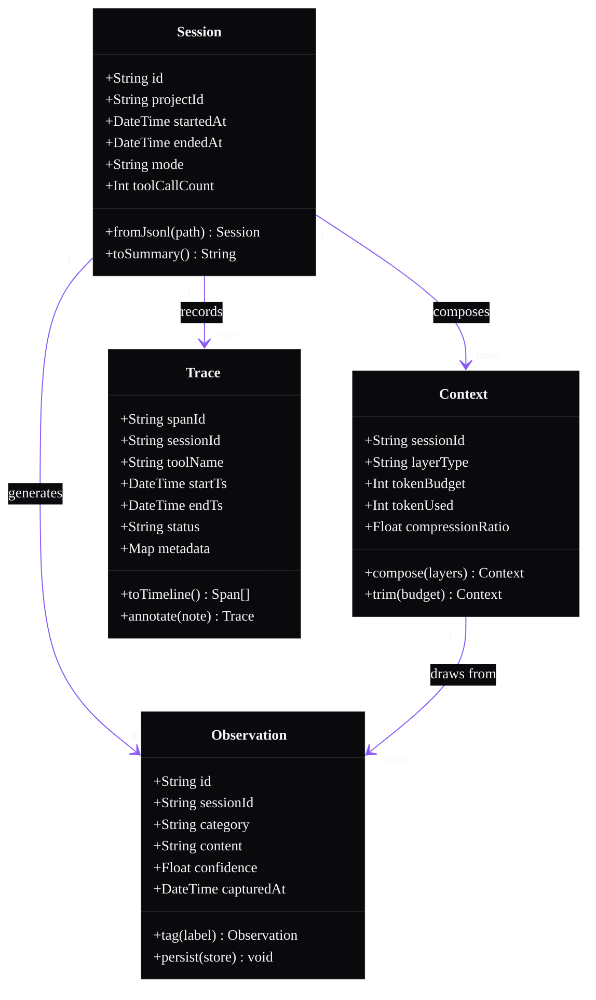

# Class Example — Memory Layer Data Model

Applied theme: WithAgents Hyper-black + Ultraviolet.

**Alt text:** A class diagram showing four entities in the Memory Layer data model. Session has fields for id, project, timing, mode, and tool call count. Context holds session reference, layer type, token budget and usage, and compression ratio. Observation stores categorized content with a confidence score tied to a session. Trace records individual tool spans with start and end timestamps and status. Session composes many Contexts, generates many Observations, and records many Traces. Context draws from many Observations.

**Content reference:** Memory Layer product pillar (BRIEF §10) — "practical patterns for preserving context across sessions, tools, and multi-step work." Directly maps to the `claude-mem-architecture` companion repo (Post 12).
