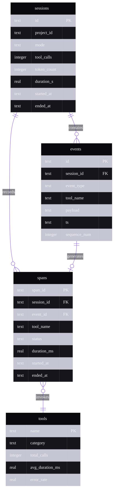

# ER Example — trace-timeline Schema

Applied theme: WithAgents Hyper-black + Ultraviolet.

**Alt text:** An entity-relationship diagram for the trace-timeline open-source schema. The sessions table stores session metadata including mode, tool call count, token count, and duration. The events table records individual session events with type, tool name, payload, and timestamp, foreign-keyed to sessions. The spans table tracks execution spans with duration and status, foreign-keyed to both sessions and events. The tools table is a reference table for tool metadata including call counts and error rates. Sessions contain many events, sessions record many spans, events generate at most one span, and spans invoke one tool.

**Content reference:** `trace-timeline` open-source project (BRIEF §9, §10) — "chronological execution trace viewer." Schema derived from the session mining pipeline described in Post 09 (session-insight-miner, 3,474,754 lines of session data).
