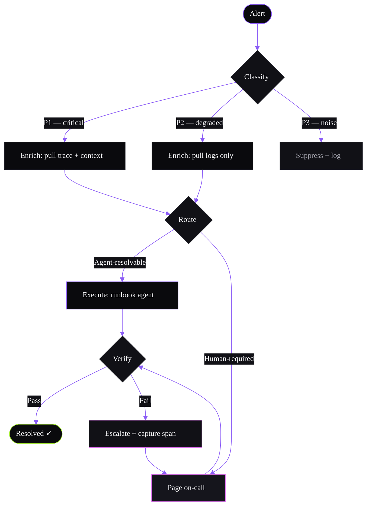

# Flowchart Example — Runbook Triage Flow

Applied theme: WithAgents Hyper-black + Ultraviolet.

**Alt text:** A flowchart showing a six-stage runbook triage flow. An alert enters the system and is classified as P1 critical, P2 degraded, or P3 noise. P1 and P2 alerts are enriched with trace data or logs respectively, then routed to either an agent executor (for agent-resolvable issues) or paged to an on-call human. Both paths feed a verification step: resolved alerts close with a success marker; failures escalate with a captured span and re-page the on-call responder.

**Content reference:** Runbooks product pillar (BRIEF §10) — "opinionated workflows for triage, analysis, execution across real internal systems."
