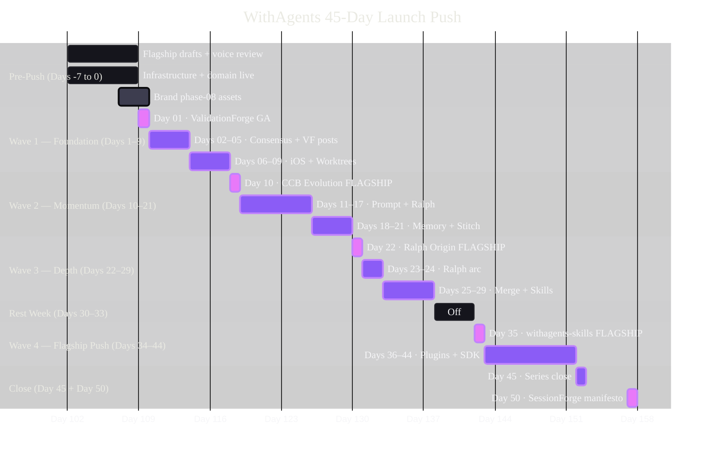

# Gantt Example — 45-Day WithAgents Push Schedule

Applied theme: WithAgents Hyper-black + Ultraviolet.

**Alt text:** A Gantt chart showing the 45-day WithAgents launch push schedule. Pre-push work from days minus-seven to zero covers flagship drafting, infrastructure, and brand assets. Wave 1 (days 1–9) opens with the ValidationForge GA flagship post followed by multi-agent consensus and iOS worktree posts. Wave 2 (days 10–21) centers on the CCB Evolution flagship and continues with prompt engineering, Ralph, memory, and Stitch posts. Wave 3 (days 22–29) opens with the Ralph Origin flagship and covers merge orchestration and skills posts. A four-day rest week falls at days 30–33. Wave 4 (days 34–44) delivers the withagents-skills package flagship and plugins and SDK posts. The push closes at day 45 with a series close post, and day 50 with the SessionForge manifesto and closing manifesto.

**Content reference:** Derived from `synthesis/calendar-45day.md` flagship quintet: Day 01 ValidationForge GA, Day 10 CCB Evolution, Day 22 Ralph Loops Origin, Day 35 withagents-skills, Day 50 SessionForge + manifesto.
