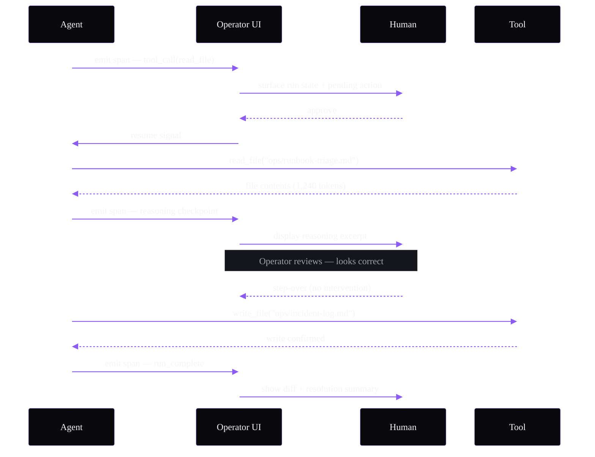

# Sequence Example — Operator UI Stepping Into a Run

Applied theme: WithAgents Hyper-black + Ultraviolet.

**Alt text:** A sequence diagram showing five participants: an agent, the Operator UI, a human reviewer, and a tool layer. The agent emits a span signalling a pending file read. The Operator UI surfaces this to the human, who approves. The agent reads the file, emits a reasoning checkpoint displayed in the UI, the human steps over without intervening, the agent writes the incident log, and the run completes with a diff and resolution summary shown to the operator.

**Content reference:** Operator UI product pillar (BRIEF §10) — "clean interfaces for inspecting runs, stepping in when needed, keeping systems legible."
