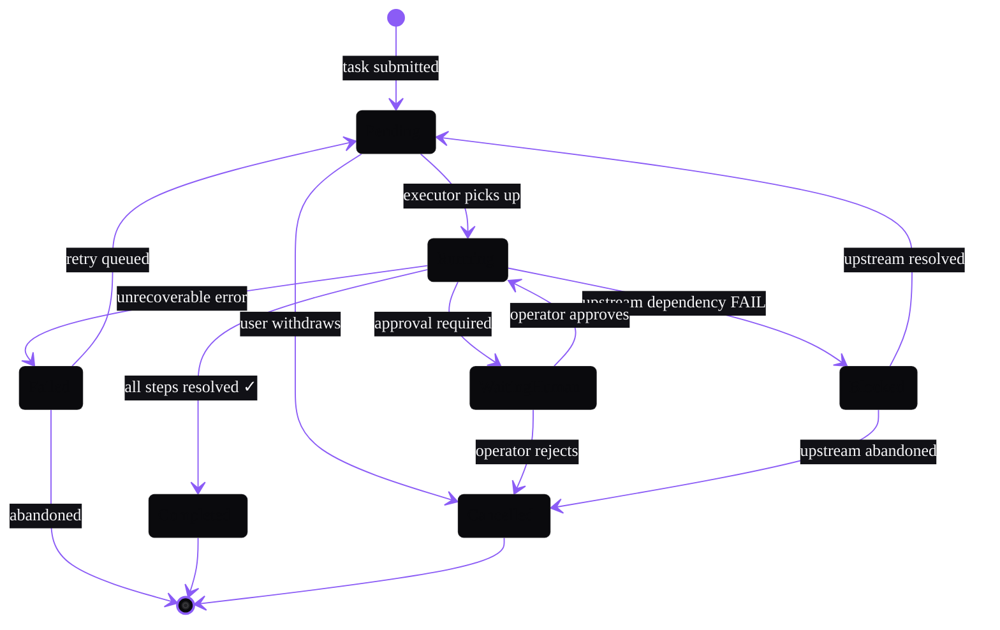

# State Example — Agent Lifecycle

Applied theme: WithAgents Hyper-black + Ultraviolet.

**Alt text:** A state diagram showing the complete lifecycle of an agent task. From the initial state a task enters Pending. It can move to Running when picked up, or be Cancelled by the user. From Running it transitions to WaitingHuman when operator approval is needed, Completed when all steps resolve, Failed on unrecoverable error, or Blocked when an upstream dependency fails. The WaitingHuman state returns to Running on approval or goes to Cancelled on rejection. Blocked returns to Pending when the upstream is resolved. Failed can retry to Pending or be abandoned. Completed and Cancelled reach the terminal state.

**Content reference:** Operator UI and Ralph Loops product pillars. Reflects the hat-based execution model described in Post 08 (ralph-loop-patterns companion repo) and the agent lifecycle patterns from 23,479 sessions.
