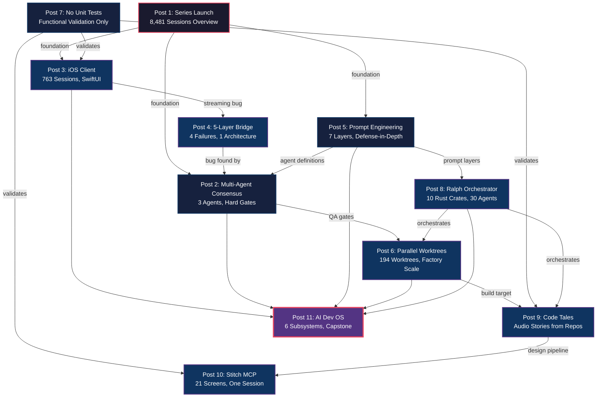
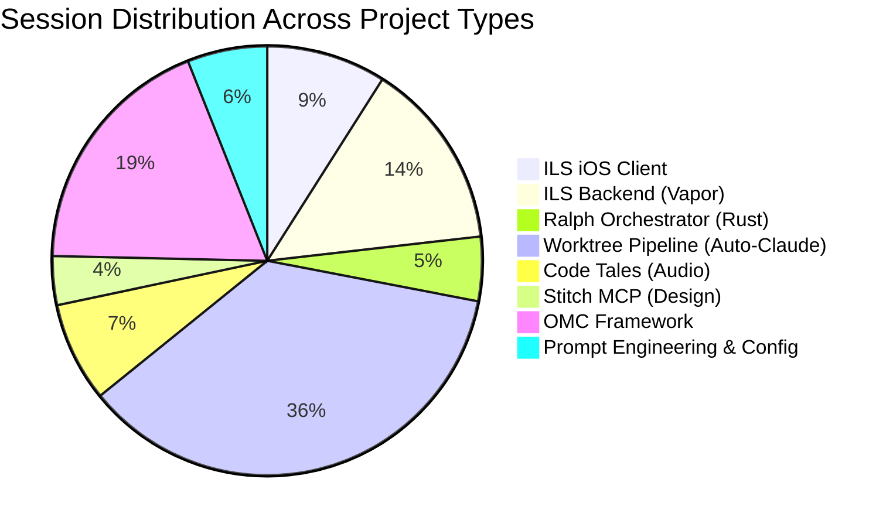

## 8,481 AI Coding Sessions. 90 Days. Here Is What I Learned.

8,481 AI coding sessions. 90 days. 5.5 GB of interaction data. 10 blog posts. Here is what I learned building software almost entirely with AI coding agents.

Not the "ask ChatGPT to write a function" kind of AI-assisted development. The "coordinate 30 specialized agents working in parallel across a shared codebase, with hard consensus gates that block shipping until three independent reviewers agree" kind.

I spent the last three months building real products -- a native iOS client for Claude Code, a Rust orchestration platform, an audio story generator, a design-to-code pipeline -- and documenting every pattern, failure, and architecture decision along the way. The result is 10 deeply technical blog posts totaling 22,489 words, backed by 33 Mermaid diagrams, 10 data visualizations, and code from 10 companion repositories that all went through a four-phase audit: structural review, functional validation with real execution, documentation completeness, and SDK compliance. 12 bugs were found and fixed across those repos before publication. Every code snippet comes from production. No fabricated examples.

---

### The 90-Day Journey

It started with a simple question: what happens when you stop using AI as an autocomplete and start treating it as a team of specialized workers?

In December 2024, I was building an iOS app the normal way -- writing code, running builds, fixing bugs manually. Claude Code had just shipped, and I started using it for small tasks: generate a model, write a networking layer, scaffold a view. The productivity gain was immediate and obvious. But within a week I hit the ceiling. A single agent in a single session has no memory of past decisions, no awareness of project conventions, and no way to validate its own work. It writes code that compiles. Whether that code is correct, consistent, and architecturally sound is a different question entirely.

The first breakthrough came when I realized that the agent's context window is not just a limitation to manage -- it is an architecture boundary to design around. Instead of cramming everything into one session, I started splitting work across specialized agents, each with a narrow focus and a rich context tailored to its role. An "executor" agent that only writes code. A "reviewer" agent that only reads it. A "planner" agent that never touches a file. The separation was crude at first, but the results were immediate: the reviewer caught bugs the executor would have shipped, because it was prompted to look for exactly those categories of failure.

By January, I had 25 specialized agent types organized into four lanes -- build, review, domain, and coordination. I had hooks that auto-built after every file edit, pre-commit scans that blocked API keys from being committed, and a persistent memory system so agents never forgot project conventions between sessions. The single-session ceiling was gone. In its place: an operating system for AI development that I had not planned to build.

The numbers tell the story of what happened next:

- **8,481 total AI coding sessions** across all projects
- **3,066 worktree sessions** running in parallel isolated environments
- **25 specialized agent types** across build, review, domain, and coordination lanes
- **6 composable subsystems** (OMC, Ralph Loop, Specum, RALPLAN, GSD, Team Pipeline)
- **10 companion repositories** with real, audited, pip-installable code
- **470 evidence screenshots** captured for functional validation
- **194 parallel git worktrees** running simultaneously at peak
- **636 commits** on a single project (Code Tales) built almost entirely by agents
- **22,489 words** across the 10 technical posts
- **33 Mermaid diagrams** and **10 data visualizations**
- **12 bugs found and fixed** during the four-phase publication audit

Every one of those numbers comes from real session logs, real git history, real build output. The 5.5 GB of interaction data is still on disk. The companion repos are public and pip-installable. The diagrams are generated from actual architecture, not whiteboard sketches.

---

### Who This Series Is For

This series is written for three audiences, and the depth varies accordingly.

**Practicing engineers using AI coding tools daily.** You are already using Copilot, Cursor, Claude Code, or similar tools for real work. You have hit the ceiling of single-session productivity and want to know what comes next. You will get the most from Topics 2, 5, 7, and 11, which cover the infrastructure patterns -- prompt engineering, consensus gates, functional validation, and operating system design -- that transform AI coding from "faster autocomplete" into a qualitatively different development methodology.

**Engineering managers and tech leads evaluating AI adoption.** You need to understand the real costs, real failure modes, and real productivity curves before committing your team. Topics 4, 6, and 8 provide the most relevant data: the streaming bridge post documents four failed architectures before the fifth worked (and why each failure was unforeseeable in advance), the worktree post quantifies the throughput of factory-scale parallel development, and the Ralph post explores the hardest problem in AI orchestration -- trust calibration. The cost analysis in Topic 2 ($0.15 per consensus gate, $1.50 per project for 10 gates) gives you concrete numbers for planning.

**Researchers and tooling developers building the next generation of AI development infrastructure.** The patterns documented here -- multi-agent consensus with hard unanimity gates, 7-layer prompt engineering stacks, event-sourced merge queues, adversarial planning with critic agents -- are not theoretical. They emerged from 8,481 sessions of real use and were refined through iteration. The companion repos provide reference implementations. Topics 8 and 11 are the most architecturally dense.

If none of these descriptions fit you but you are curious about what happens when someone takes AI coding tools to an extreme and documents everything, start with Topic 2 (the bug story) or Topic 7 (the testing philosophy). Both are self-contained narratives that do not require familiarity with the broader system.

---

### How To Read This Series

The 10 topics build on each other, but they are not strictly sequential. Here are three recommended paths through the material, plus a quick-start guide for different experience levels.

**Path 1: The Practitioner's Path (start here if you want to use these patterns tomorrow)**

Start with **Topic 5** (Prompt Engineering Stack) to understand how context flows into agent sessions. Then read **Topic 2** (Multi-Agent Consensus) for the quality gate pattern. Follow with **Topic 7** (Functional Validation) for the testing methodology. Finish with **Topic 11** (AI Dev OS) for the full system architecture. Skip or skim the product-specific posts (3, 4, 9, 10) unless you are building similar applications.

This path takes approximately 90 minutes of focused reading and gives you the four most transferable patterns: layered prompts, consensus gates, evidence-based validation, and composable subsystems. Each pattern is independently adoptable. You can start with just a `CLAUDE.md` file (Topic 5, Layer 1) and build from there.

**Path 2: The Builder's Path (start here if you are building a product with AI agents)**

Start with **Topic 3** (iOS Client) and **Topic 4** (5-Layer Bridge) to see a complete product built end-to-end with agents. Then read **Topic 6** (Parallel Worktrees) for the factory-scale build process. Follow with **Topic 9** (Code Tales) for a second complete product built with the same methodology. The infrastructure posts (2, 5, 7, 8) provide the "how" behind the products.

This path is approximately two hours and shows the methodology applied to real products with real code. You will see failures (four failed bridge architectures), the debugging process (ten hours to find three lines), and the production results (636 commits on Code Tales). The products are the proof that the methodology works.

**Path 3: The Architect's Path (start here if you are designing AI development infrastructure)**

Start with **Topic 8** (Ralph Orchestrator) for the Rust platform architecture. Then read **Topic 11** (AI Dev OS) for the composable meta-system. Follow with **Topic 2** (Consensus) and **Topic 5** (Prompt Stack) for the two most reusable subsystems. Finish with **Topic 6** (Worktrees) for the parallel execution model. The product posts provide grounding context.

This path is the densest, approximately two and a half hours, and covers the full infrastructure stack from event-sourced merge queues to the hat system that constrains agent capabilities. If you are building tooling for other developers to use with AI agents, this path gives you the architectural patterns and the failure modes to avoid.

**By Experience Level:**

If you are new to AI-assisted development, start with **Topic 1** (this post) for orientation, then **Topic 3** (iOS Client) for a concrete product story, then **Topic 7** (Functional Validation) for the most immediately useful technique. These three posts give you the "what," the "how," and the "why" without requiring deep infrastructure knowledge.

If you are already using AI coding tools and want to scale up, start with **Topic 2** (Consensus), then **Topic 5** (Prompt Stack), then **Topic 6** (Worktrees). These three posts cover the quality, context, and parallelism infrastructure that separates "using AI to write code" from "operating an AI development system."

If you are an infrastructure engineer or tooling developer, go straight to **Topic 8** (Ralph) and **Topic 11** (AI Dev OS). Everything else is context. These two posts contain the architectural decisions, the trade-offs, and the patterns that inform the next generation of AI development tooling.

### Post-to-Topic Mapping

| Post | Topic | Title |
|------|-------|-------|
| 01 | -- | Series Launch & Overview |
| 02 | 1 | Multi-Agent Consensus |
| 03 | 2 | Functional Validation |
| 04 | 3 | iOS Streaming Bridge |
| 05 | 4 | The SDK Bridge |
| 06 | 5 | 194 Parallel Worktrees |
| 07 | 6 | Prompt Engineering Stack |
| 08 | 7 | Ralph Orchestrator |
| 09 | 8 | Code Tales |
| 10 | 9 | Stitch Design-to-Code |
| 11 | 10 | AI Dev Operating System |

---

### Topic Summaries

Here are all 10 topics, what each one covers, and why it matters.

---

### Topic 1: Building a Native iOS Client for Claude Code

763 sessions building a SwiftUI app with a 5-layer streaming bridge. The architecture runs SwiftUI frontend to Vapor backend to Python SDK wrapper to Claude CLI to Anthropic API. Each token traverses this entire chain as a Server-Sent Event. The total path from API response to rendered pixel: roughly 50ms per token. The companion repo (`claude-ios-streaming-bridge`) ships as a reusable Swift Package with an SSEClient that handles UTF-8 buffer parsing, exponential backoff reconnection, and a complete type system -- `StreamMessage`, `ContentBlock`, `StreamDelta`, `UsageInfo`. The two-character bug that stopped every token from appearing twice lives in this post. More on that in Topic 4.

The iOS client -- ILS, for Intelligent Local Server -- became the proving ground for every pattern in this series. It has 149 Swift files across 24 screen directories, a macOS companion target, 13 built-in themes with a full theme editor, WidgetKit extensions, Live Activity support, App Intents for Shortcuts integration, and a premium subscription system with StoreKit. All of it was built with AI agents, validated with functional screenshots rather than unit tests, and reviewed through multi-agent consensus gates before merge.

The most surprising finding from 763 sessions of iOS development with AI agents is that the Swift compiler is the best validation tool in the ecosystem. Every `.swift` file edit triggers an automatic build via a `PostToolUse` hook. If the build fails, the agent must fix it before continuing. This feedback loop -- edit, build, fix, repeat -- replaces the traditional test-driven cycle with something more immediate: the type system as a continuous integration pipeline running on every keystroke.

---

### Topic 2: The 5-Layer Bridge -- 4 Failed Attempts, 1 Working Architecture

A debugging war story. Direct Anthropic API from Swift -- failed, no OAuth token available. JavaScript SDK via Node subprocess -- failed, NIO event loops do not pump RunLoop. Swift ClaudeCodeSDK in Vapor -- failed, `FileHandle.readabilityHandler` needs RunLoop which NIO does not provide. Direct CLI invocation -- failed, nesting detection blocks Claude inside Claude. The fifth attempt worked: a Python subprocess bridge with NDJSON stdout and environment variable stripping (specifically removing `CLAUDECODE=1` and `CLAUDE_CODE_*` vars before spawning). The counterintuitive lesson is that the 5-layer architecture is simpler than any of the "simpler" approaches because each layer does exactly one translation with exactly one failure mode.

This post is the most detailed technical deep-dive in the series. It includes the exact error messages from each failed attempt, the root cause analysis for why each approach was fundamentally incompatible (not just buggy), and the specific environment variable stripping logic that makes the Python bridge work inside active Claude Code sessions. The companion repo includes the complete `SSEClient.swift` with its UTF-8 buffer parser, the `sdk-wrapper.py` Python bridge, and the Vapor route handler that ties them together.

The broader lesson is about impedance mismatches in polyglot architectures. Swift's concurrency model (structured concurrency with async/await) and Python's (threading with subprocess pipes) and Node's (event loop with callbacks) are not interchangeable. The 5-layer bridge works because each layer translates between exactly two concurrency models, and the translation boundary is a Unix pipe -- the lowest common denominator that every runtime understands.

---

### Topic 3: Spawning 194 Parallel Git Worktrees

Factory-scale AI development. 194 isolated git worktrees, each running its own AI coding agent, all building the same codebase in parallel. The pipeline has four stages: spec generation, worktree provisioning with parallel execution, independent QA review, and merge queue processing. The companion repo (`auto-claude-worktrees`) is a pip-installable Click CLI with a priority-weighted merge queue and stale worktree detection. The numbers: 91 specs generated, 71 QA reports produced, 3,066 sessions total. The key insight is that the QA pipeline matters more than the agents themselves -- the rejection-and-fix cycle between independent QA agents and executors is where the real quality comes from.

The worktree pipeline is where "AI-assisted development" becomes "AI development at factory scale." A single developer can review and merge the output of 194 parallel agents in the time it would take to write the code for 5 of those tasks manually. But the throughput only works because of the QA stage. Without independent review, the merge queue fills with subtly broken code that passes the build but violates conventions, introduces inconsistencies, or solves the wrong problem. The QA rejection rate was 23% -- nearly one in four agent outputs required revision. That rejection rate is the price of quality, and it is remarkably close to human code review rejection rates in high-standards teams.

The most counterintuitive finding: stale worktree detection is critical infrastructure. Agents crash, sessions timeout, worktrees accumulate. Without automated cleanup, a developer returns to 194 worktrees of which 30 are zombies from crashed sessions, 15 have uncommitted changes from interrupted work, and 8 have merge conflicts with main that have been silently growing for hours. The companion CLI handles all of this with `auto-claude cleanup --stale-hours 6`.

---

### Topic 4: How 3 AI Agents Found a Bug I Would Have Shipped

Multi-agent consensus. A single agent reviewed my streaming code and said "looks correct." Three agents running a structured consensus audit caught a P2 bug on line 926 of `ChatViewModel.swift` in the first pass. The bug: `message.text += textBlock.text` when it should have been `message.text = textBlock.text`. One character. The `+=` appended to already-accumulated content. The `=` treats each event as authoritative. A second root cause compounded it -- the stream-end handler reset `lastProcessedMessageIndex` to zero, replaying the entire buffer. The three-agent pattern uses Lead (architecture and consistency), Alpha (code and logic), and Bravo (systems and functional verification). They vote independently. Unanimous pass required. I have run this across 3 projects with 10 blocking gates each. Cost per gate: roughly $0.15. The P2 bug would have shipped to users.

This post is the origin story of the consensus pattern and the most concrete example of why multi-agent review outperforms single-agent review. The three roles are not arbitrary -- they are calibrated so that what Alpha misses in the running UI, Bravo catches, and what both miss at the architectural level, Lead finds. The companion repo (`multi-agent-consensus`) ships as a pip-installable framework with Pydantic models, a `ThreadPoolExecutor`-based gate mechanism, YAML configuration, and a Click CLI. The `+= vs = PRINCIPLE` is embedded directly in Alpha's system prompt as institutional knowledge -- a specific bug pattern encoded as a permanent review instruction.

The cost analysis puts this in perspective. At $0.15 per gate and 10 gates per project, the total cost for comprehensive multi-agent review is $1.50. The bug it caught in this case -- visible text duplication in the core chat interface -- would have required a hotfix release, an App Store review cycle, and weeks of user trust repair. The return on investment is not close.

---

### Topic 5: The 7-Layer Prompt Engineering Stack

Defense-in-depth for AI coding agents. Layer 1: `CLAUDE.md` global rules loaded into every session. Layer 2: `.claude/rules/` with project-specific instructions -- build commands, architecture patterns, feature gates. Layer 3: 150+ reusable skills invoked by name. Layer 4: hooks that auto-build after every `.swift` file edit and pre-commit security scans that block API keys (`sk-*`, `AKIA*`, `ghp_*`) and database files from being committed. Layer 5: 25+ specialized agent definitions with scoped prompts and tools. Layer 6: YAML-based prompt libraries with variable interpolation. Layer 7: persistent session memory so agents never lose context on project conventions. The compound effect is that the agent cannot forget the build command, cannot skip validation, cannot ship a mock, cannot leak an API key -- all enforced automatically on every edit, every commit, every session.

The 7-layer stack is the most immediately transferable pattern in the series. You do not need 194 worktrees or a Rust orchestration platform to benefit from it. A single `CLAUDE.md` file with your project's build command, architecture conventions, and common pitfalls will measurably improve every AI coding session. Adding `.claude/rules/` files for specific subsystems (database queries, API routes, UI components) compounds the benefit. Each layer is independently useful and incrementally adoptable.

The critical insight is that prompt engineering for AI coding agents is not about writing better instructions. It is about building a defense-in-depth system where no single layer failure can cause a catastrophic outcome. If the agent forgets the build command (Layer 1 failure), the auto-build hook catches it (Layer 4). If the agent writes a mock (Layer 1 violation), the skill system rejects it (Layer 3). If the agent tries to commit an API key (any layer failure), the pre-commit hook blocks it (Layer 4). Redundancy is the design principle, not efficiency.

---

### Topic 6: Ralph Orchestrator -- A Rust Platform for AI Agent Armies

10 Rust crates coordinating 30+ agents simultaneously. The core innovation is the "hat" system: each agent wears a hat that defines its context -- which files it can see, what tools it has, what role it plays. Swapping hats changes an agent's entire perspective without restarting the session. The platform includes event-sourced merge queues for deterministic conflict resolution, backpressure gates where agents self-throttle when quality drops, a Telegram control plane for monitoring from your phone, and persistent loops where agents survive session boundaries. 410 orchestration sessions went into building this. The hardest problems were not technical -- they were trust calibration: when should an agent ask a human, when should it proceed autonomously, how do you tune backpressure so agents stay productive without being reckless.

Ralph is the most architecturally ambitious component in the series and the one that surprised me the most during development. The original plan was a simple task queue. What emerged after 410 sessions was an event-sourced platform where every agent action is recorded as an immutable event, merge conflicts are resolved deterministically by replaying events in causal order, and backpressure gates automatically throttle agent throughput when the error rate exceeds a configurable threshold.

The hat system deserves its own post (and nearly got one). The key insight is that an agent's effectiveness is determined more by what it cannot see than by what it can. A reviewer agent that has access to the file system will start editing files. A planner agent that has access to the build system will start fixing bugs. Constraining the tool surface is not a limitation -- it is a design decision that preserves role purity. Ralph enforces this through hats: a reviewer hat disables all write tools, a planner hat disables file access entirely, an executor hat enables everything but disables the review prompt. The hat swap is atomic and reversible.

---

### Topic 7: I Banned Unit Tests From My AI Workflow

Zero mocks. Zero stubs. Zero test doubles. When an AI agent writes both the implementation AND the unit tests, a passing test suite is not independent evidence of correctness. The agent validates its own assumptions in a closed loop. The replacement: functional validation. Build the real system, run it, screenshot it, verify against the spec. The numbers after 90 days: 470 evidence screenshots captured, 37+ validation gates across multiple projects, 3 browser automation tools integrated (Playwright, idb, simctl). Four bug categories caught that unit tests systematically miss: visual rendering bugs, integration boundary failures, state management bugs that only appear on second interaction, and platform-specific issues. The companion repo (`functional-validation-framework`) ships a Click CLI where `fvf init --type api` generates a real 5-gate YAML configuration with httpx-based API validation built in. For browser automation, use `fvf init --type browser` which adds Playwright support.

This is the most controversial post in the series, and deliberately so. The argument is not that unit tests are bad. The argument is that when an AI agent writes both the code and the tests, the tests are not an independent signal. They validate the agent's model of the problem, which is exactly the thing that might be wrong. Functional validation -- building the real system, running it under real conditions, and capturing evidence of its behavior -- provides the independent signal that AI-generated tests cannot.

The 470 evidence screenshots are the concrete manifestation of this philosophy. Each screenshot is a moment-in-time capture of the real application running on a real simulator with real data. When a consensus gate evaluates whether a feature is complete, it does not check test coverage -- it checks screenshots. Does the sidebar show the correct session count? Is the theme editor rendering dark mode correctly? Does the streaming chat display tokens without duplication? These are questions that a screenshot answers definitively and a mock-based test suite cannot ask.

---

### Topic 8: From GitHub Repos to Audio Stories

Code Tales: a platform that clones a repository, analyzes its architecture with Claude, generates a narrative script, synthesizes speech with ElevenLabs, and streams the finished audio. 9 narrative styles: debate, documentary, executive, fiction, interview, podcast, storytelling, technical, tutorial. The build process was the real story -- 636 commits, 90 worktree branches, 91 specs, 37 validation gates. The audio debugging saga required nine commits to fix race conditions in the audio player, each identified, implemented, and validated by agents working in parallel.

Code Tales is the most complete demonstration of the full agentic development methodology in the series. It was built from scratch using the worktree pipeline (Topic 3), validated with functional screenshots (Topic 7), reviewed through consensus gates (Topic 4), and orchestrated by Ralph (Topic 6). The 636 commits represent the highest throughput of any project in the 90-day period, and the 9-commit audio debugging saga demonstrates what happens when multiple agents converge on a race condition -- each agent identifies a different symptom, proposes a different fix, and the consensus gate ensures that all symptoms are addressed before the fix ships.

The 9 narrative styles are not just a feature list -- they are a test of how far AI-generated content can go. The "debate" style generates two characters arguing about the architecture. The "fiction" style wraps the technical content in a narrative arc. The "executive" style strips everything to bullet points and metrics. Each style exercises different capabilities of the text generation model, and the ElevenLabs synthesis quality varies dramatically across styles (debate and interview work best; fiction struggles with character voice consistency).

---

### Topic 9: 21 AI-Generated Screens in One Session

No Figma. No design handoff. Stitch MCP takes text descriptions, generates design tokens, produces React components with Tailwind CSS, and validates everything with Puppeteer automation. One session produced: 21 screens (auth flow, dashboard, admin with 20 tabs, settings, profiles), 47 design tokens in a brutalist palette (all `borderRadius: 0px`), a Button component with CVA featuring 8 variants, 8 sizes, `forwardRef`, and Radix Slot integration, plus 105 Puppeteer validation checks across 374 actions. The validation layer is what makes this production-grade, not a demo.

The Stitch MCP post is the most visually dramatic in the series. 21 screens in a single session sounds like a demo -- and it would be, without the validation layer. The 105 Puppeteer checks and 374 actions are what separate "AI generated some React components" from "AI generated a validated, token-consistent design system." Each check verifies a specific property: is the button the correct size at the `sm` variant? Does the admin tab switch actually load the correct panel? Does the auth flow redirect after successful login? The 47 design tokens ensure visual consistency across all 21 screens -- the brutalist palette with `borderRadius: 0px` was a deliberate choice to test whether the system could maintain a strong design language across that many screens.

The broader lesson is about the MCP (Model Context Protocol) integration pattern. Stitch MCP is not a standalone tool -- it is a protocol-level bridge between Claude and a design generation backend. The same pattern applies to any domain-specific tool: give the AI agent a protocol-level interface to a specialized backend, let the backend handle the domain complexity (color theory, responsive breakpoints, accessibility requirements), and let the agent handle the compositional logic (which screens need which components, how the navigation flows, where the design tokens apply).

---

### Topic 10: The AI Development Operating System

The capstone. After 8,481 sessions, I accidentally built a composable meta-system with 6 subsystems: OMC orchestration with 25+ specialized agent types across build, review, domain, and coordination lanes. Ralph Loop for persistent execution that survives session boundaries. Specum Pipeline for specification-driven development: research to requirements to design to tasks to execution to verification. RALPLAN for adversarial planning where Planner, Architect, and Critic iterate until consensus. GSD for project lifecycle management. Team Pipeline for N coordinated agents with staged execution. The companion repo (`ai-dev-operating-system`) ships a Click CLI where `ai-dev-os catalog list` displays the full 25-agent catalog across all lanes.

"Operating system" is not a metaphor. The 6 subsystems compose the same way Unix utilities compose: each does one thing, they communicate through well-defined interfaces, and you chain them together for complex workflows. OMC provides the agent runtime. Ralph provides persistence. Specum provides the planning-to-execution pipeline. RALPLAN provides adversarial plan review. GSD provides lifecycle tracking. Team Pipeline provides coordinated multi-agent execution. You can use any subsystem independently, or compose them: `RALPLAN` plans the work, `Team Pipeline` distributes it across agents, each agent runs in `OMC` with `Ralph` persistence, and `Specum` tracks the specification-to-delivery lifecycle.

The 25-agent catalog is organized into four lanes. The **Build Lane** includes explore (haiku-weight codebase discovery), analyst (requirements and constraints), planner (task sequencing), architect (system design), debugger (root cause analysis), executor (implementation), deep-executor (complex autonomous tasks), and verifier (completion evidence). The **Review Lane** includes quality-reviewer, security-reviewer, and code-reviewer. The **Domain Lane** includes test-engineer, build-fixer, designer, writer, qa-tester, scientist, and document-specialist. The **Coordination Lane** includes the critic agent for adversarial challenge. Each agent type has a default model assignment (haiku, sonnet, or opus) calibrated to its cognitive load.

---

### Session Distribution

The 8,481 sessions were not evenly distributed. The worktree pipeline consumed the largest share by far, driven by the parallel execution model where each worktree spawns its own session. Here is how the sessions broke down across project types:

The worktree pipeline's 3,066 sessions (36% of total) reflects its nature as a session multiplier: one human-initiated spec generates dozens of parallel agent sessions for execution, QA, and fix cycles. The OMC framework's 1,580 sessions (19%) reflects the meta-circularity of the project -- the AI development operating system was itself built with AI agents, and every improvement to the system was validated by the system it improved.

---

### The Audit That Validated All of It

Before publishing, all 10 companion repositories went through a four-phase audit run by 8 parallel audit agents, 3 documentation agents, and a lead coordinator. Phase 1: structural review -- every file mentioned in the README exists, no stubs, all imports resolve. Phase 2: functional validation -- real execution, no mocks. `pip install -e .` in fresh venvs, CLI entry points responding to `--help`, real commands producing real output. Phase 3: documentation completeness -- troubleshooting sections added to all 10 READMEs. Phase 4: SDK compliance -- repos using the Claude Agent SDK audited against official patterns with `isinstance()` dispatch instead of `getattr()`. 12 issues found and fixed. 10/10 repos passed.

The audit itself was a test of the methodology. If the AI development operating system cannot produce repos that pass their own audit, the system is not ready for publication. The 12 issues found during the audit were real: missing `__init__.py` exports, CLI entry points that crashed on `--version`, a `getattr()` call on an SDK response object that should have been `isinstance()` dispatch. None were showstoppers, but all would have been embarrassing in published code. The four-phase structure mirrors the consensus gate pattern from Topic 4 -- multiple independent verification passes, each checking a different dimension of correctness.

---

### Companion Repositories

Every post in the series has a companion repository with real, runnable code. Here is the complete list with what each one provides:

| # | Repository | Language | What It Provides |
|---|-----------|----------|-----------------|
| 1 | `claude-ios-streaming-bridge` | Swift | SSEClient, stream types, UTF-8 buffer parser |
| 2 | `multi-agent-consensus` | Python | 3-agent gate framework, Pydantic models, Click CLI |
| 3 | `auto-claude-worktrees` | Python | Worktree factory, QA pipeline, merge queue |
| 4 | `claude-sdk-bridge` | Python/Swift | 4 failed attempts + working 5-layer bridge |
| 5 | `prompt-engineering-stack` | YAML/Python | 7-layer config examples, hook scripts |
| 6 | `ralph-orchestrator` | Rust | 10 crates, hat system, event-sourced queues |
| 7 | `functional-validation-framework` | Python | 4 validators, evidence collector, gate runner |
| 8 | `code-tales` | Python | Repo-to-audio pipeline, 9 narrative styles |
| 9 | `stitch-mcp-toolkit` | TypeScript | Design token generator, Puppeteer validation |
| 10 | `ai-dev-operating-system` | Python | 25-agent catalog, 6 subsystem CLI |

All Python repos are pip-installable. All have `--help` on their CLI entry points. All passed the four-phase audit.

---

### Key Themes Across the Series

Several themes recur across the 10 posts. Recognizing them upfront will help you spot the connections.

**Independence is the design principle.** When the same entity writes code and reviews it, the review has no epistemic value. When the same agent writes tests and implementation, the tests are tautological. Independence shows up everywhere: separate QA agents from execution agents (Topic 3), separate reviewer roles from builder roles (Topic 4), separate prompt layers so no single failure is catastrophic (Topic 5). The entire system is designed so that no component validates its own work.

**Silence is the worst failure mode.** The most expensive bugs in this series were silent. The Swift SDK that dropped events without error (Topic 2, 14 hours). The CLI that refused to execute without logging (Topic 2, 10 hours). The block-buffered stdout that held tokens until the process exited (Topic 2). Every architectural decision in the working system is biased toward observable failure over silent failure. Unix pipes are preferred over in-process calls because pipes can be logged at both ends.

**Evidence over assertions.** Instead of asserting that code is correct, capture evidence that it works. Screenshots, accessibility trees, curl outputs, JSON responses -- these are the currency of verification in this system. A passing test suite is an assertion. A timestamped screenshot is evidence. The distinction matters because assertions can be wrong (the test validates the wrong property) while evidence can be audited (the screenshot shows what the user actually sees).

**Cost-awareness shapes architecture.** At $0.15 per consensus gate and $0.04 per query, the economics of AI development are different from traditional development. The series documents these costs explicitly so you can make informed decisions about which patterns to adopt. Multi-agent consensus is cheap ($1.50 per project). Worktree parallelism is expensive in sessions (3,066) but cheap in human time. The cold start penalty of the 5-layer bridge (12 seconds) is acceptable for chat but would be unacceptable for autocomplete.

---

### The Economics of AI-Assisted Development

One question comes up in every conversation about this methodology: what does it cost?

The cost model for agentic development has three tiers. **Per-query costs** are the most visible: each Claude API call costs roughly $0.04 at the time of writing. A consensus gate with three independent agents costs $0.12-$0.15. A full 10-gate review pass costs $1.50. **Session costs** are the invisible middle tier: each session consumes context window tokens proportional to the project context loaded (CLAUDE.md, rules files, file reads). A heavily-contextualized session with a full prompt stack costs roughly $0.30-$0.50 in input tokens before any work begins. **Infrastructure costs** are the fixed base: the development machine, the simulator farm, the git hosting. These are identical to traditional development.

The total cost for the ILS iOS client -- 763 sessions of AI-assisted development over three months -- was approximately $380 in API costs. That is the cost of a junior developer for roughly half a day. The output was 149 Swift files, 24 screen directories, a macOS companion target, 13 themes, WidgetKit extensions, Live Activity support, App Intents, and a premium subscription system. No human could have produced this volume at this quality level in the same timeframe at the same cost.

But cost is only meaningful relative to the alternative. The alternative was not "build it for free." The alternative was "build it with a human team over 6-12 months." The $380 in API costs replaced months of engineering salary. The 470 evidence screenshots replaced weeks of manual QA. The consensus gates replaced days of code review. The economics are not even close.

---

### What Comes Next

Every architecture diagram, every code quote, every cost number comes from real sessions. The full series with companion repos, Mermaid diagrams, and social cards is at: [github.com/krzemienski/agentic-development-guide](https://github.com/krzemienski/agentic-development-guide)

The patterns documented here are not finished. They are the state of the art as of 90 days of intensive development, and they will evolve. The next frontier is multi-model consensus (using Claude, GPT-4, and Gemini as the three reviewers for true model-level independence), real-time collaborative agents (multiple agents editing the same file with OT-style conflict resolution), and self-improving prompt stacks (where the prompt engineering layers themselves are refined by agents based on session outcome data).

The companion repos are not museum pieces. They are designed to be forked, modified, and extended. The `multi-agent-consensus` framework can be adapted to any review workflow. The `functional-validation-framework` can validate any application that runs on a screen or responds to HTTP. The `auto-claude-worktrees` pipeline can parallelize any development task that can be specified as a YAML document. Take what is useful. Discard what is not. Build on what works.

What patterns are you discovering as you scale AI coding tools beyond single-session use?

#AgenticDevelopment #AI #SoftwareEngineering #ClaudeCode #DevTools

---

*Part 1 of 11 in the [Agentic Development](https://github.com/krzemienski/agentic-development-guide) series.*

---

## Series Navigation

**Next:** [Three Agents Found the P2 Bug](../post-02-multi-agent-consensus/post.md)

**Full Series:** [8,481 AI Coding Sessions: The Complete Guide](https://github.com/krzemienski/agentic-development-guide)

1. [8,481 AI Coding Sessions: Series Launch](../post-01-series-launch/post.md)
2. [Three Agents Found the P2 Bug](../post-02-multi-agent-consensus/post.md)
3. [I Banned Unit Tests From My AI Workflow](../post-03-functional-validation/post.md)
4. [The 5-Layer SSE Bridge](../post-04-ios-streaming-bridge/post.md)
5. [5 Layers to Call an API](../post-05-sdk-bridge/post.md)
6. [194 Parallel AI Worktrees](../post-06-parallel-worktrees/post.md)
7. [The 7-Layer Prompt Engineering Stack](../post-07-prompt-engineering-stack/post.md)
8. [Ralph Orchestrator](../post-08-ralph-orchestrator/post.md)
9. [From GitHub Repos to Audio Stories](../post-09-code-tales/post.md)
10. [21 AI-Generated Screens, Zero Figma Files](../post-10-stitch-design-to-code/post.md)
11. [The AI Development Operating System](../post-11-ai-dev-operating-system/post.md)

