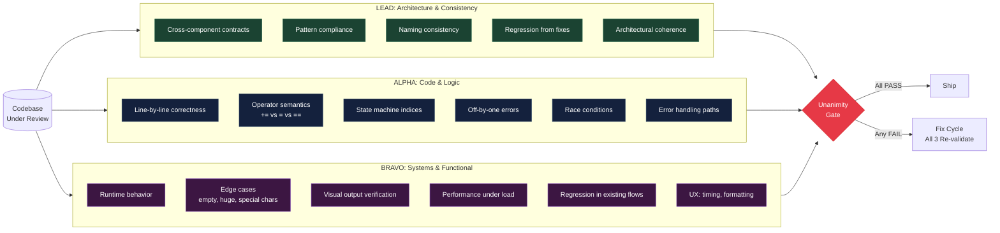
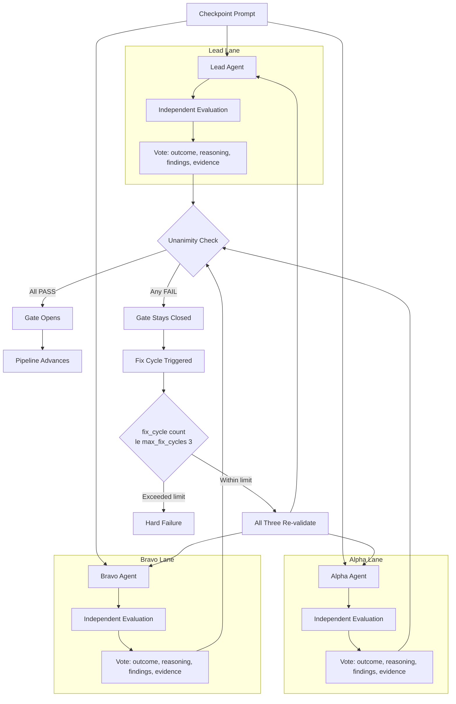

## 3 AI Agents Found the Bug 1 Agent Missed

A single AI agent reviewed my streaming code and said "looks correct."

Three agents found a P2 bug on line 926. Here is the full story of how a one-character fix exposed a structural flaw in how we review AI-generated code -- and the framework I built to make sure it never happens again.

---

### The Bug That Lived for Three Days

I was building ILS, a native iOS client for Claude Code. The streaming chat interface was the core feature: messages arrive from Claude's API as Server-Sent Events, tokens flow in real time, the UI renders them progressively. It looked like it worked. Messages appeared. The UI felt responsive.

I ran a single-agent code review. The agent scanned `ChatViewModel.swift`, noted some minor style inconsistencies, and reported: "Streaming implementation looks correct."

The bug had been in the codebase for three days.

Here is what was actually happening. When a user sent a message and Claude's response streamed back, every token appeared twice. The word "Four" rendered as "Four.Four." on screen. The assistant message handler was using `+=` to append text blocks, but those text blocks already contained the full accumulated content from prior `textDelta` streaming events. Append plus authoritative full text equals duplication.

The code looked like this:

```swift
// ChatViewModel.swift, line 926 -- the bug
message.text += textBlock.text
```

The fix:

```swift
// The correct version -- assignment, not append
message.text = textBlock.text
```

One character. The `+=` became `=`. The `+=` operator makes perfect sense if you are building text incrementally from deltas. The `textBlock.text` containing the full accumulated content makes perfect sense if the assistant event is authoritative. Both are valid patterns. The bug exists only at their intersection -- two update mechanisms, each individually reasonable, interacting badly when combined.

But there was a second root cause that compounded the first. The stream-end handler reset `lastProcessedMessageIndex` to zero. On the next observation cycle, the entire SSE message buffer replayed from the beginning, feeding already-processed messages back through the rendering pipeline. Double processing on top of double accumulation.

```swift
// Root cause 2 -- the index reset
// BEFORE (bug):
self.lastProcessedMessageIndex = 0   // replays all messages next cycle

// AFTER (fix):
let finalCount = sseClient.messages.count
self.lastProcessedMessageIndex = finalCount  // preserves position
```

The result in practice: every streaming response stuttered visibly. Tokens appeared, doubled, then resolved to the correct text once streaming completed. It would not crash. It would not fail silently. It would just look broken -- the kind of bug that erodes trust in a product the first time a user sees it.

---

### The Single-Agent Review That Missed It

Let me walk you through what actually happened when the single agent reviewed this code.

I pointed Claude at `ChatViewModel.swift` and asked for a thorough code review. The agent methodically worked through the file. It flagged that some `@Published` properties could be marked private. It suggested extracting a helper for the message-parsing switch statement. It noted that a force-unwrap on line 412 should use optional binding instead.

Then it reached the streaming handler. It read line 926: `message.text += textBlock.text`. It saw the `+=` operator. It recognized this as a standard text accumulation pattern -- you have a buffer, you append to it, the buffer grows as data arrives. Correct pattern. Move on.

Forty lines later, it read the `textDelta` handler: `message.text += text`. Same pattern. Append new text. Makes sense. Move on.

The agent never asked the question that would have surfaced the bug: "What does `textBlock.text` actually contain?" The answer is right there in the Claude Code streaming format documentation -- each `assistant` event contains the full accumulated text up to that point, not a delta. But the agent was pattern-matching, not tracing data flow. It recognized the shape of correctness without verifying the substance.

This is not a knock on the agent. This is the fundamental limitation of single-perspective review. When you bring one lens to a problem, you see what that lens is calibrated to see. The agent was calibrated for code patterns. The bug lived in data semantics.

---

### Why Single-Agent Review Missed It

When you ask one AI agent to review code, it brings a single perspective. It pattern-matches against known error categories. It reads the streaming implementation and sees the shape of correctness -- delta events, accumulation buffers, state updates. Each line makes sense in isolation.

The mistake is that the agent is checking "does this line look correct?" when the bug is about how two correct-looking lines interact. The `+=` operator is a standard accumulation pattern. The `textBlock` containing full text is a standard authoritative-update pattern. The individual reviewer sees both patterns, recognizes both as valid, and moves on. The bug lives in the space between the patterns.

This is not unique to AI. Human code review has the same failure mode. Individual reviewers develop blind spots. The pattern recognition that makes you productive is exactly what causes you to miss novel bugs. You see what you expect to see.

---

### Why Not Just Run One Agent Three Times?

The obvious objection: "Instead of three different agents, why not just run the same agent three times and take a majority vote?"

I tried this. Same prompt, same model, three runs. The results were depressingly correlated.

All three runs flagged the same style inconsistencies. All three missed the `+=` bug. All three produced nearly identical review summaries. On the fourth run, for good measure -- same result. The fifth run caught a different cosmetic issue but still missed the data flow interaction.

This makes sense when you think about how language models work. Given the same prompt, the same context window, and the same temperature setting, the model's attention patterns are nearly deterministic. It will read the file in roughly the same order, activate the same pattern-matching circuits, and produce the same blind spots. Running it again does not create independence. It creates redundancy.

The analogy from statistics is correlation between measurements. Three measurements with correlation coefficient 0.95 give you almost no more information than one measurement. Three measurements with correlation 0.1 give you genuine triangulation. The key variable is not how many times you run the review. It is how independent each review is.

Independence requires different prompts, different focus areas, different evaluation criteria. It requires each reviewer to approach the code from a genuinely different angle. That is what the role definitions provide.

Think of it this way: if you ask three people who all learned programming from the same textbook to review the same code, they will find the same bugs and miss the same bugs. If you ask a security engineer, a performance engineer, and a domain expert, their coverage is dramatically wider. Same principle applies to AI agents.

---

### The Three-Agent Architecture

Multi-agent consensus addresses this structurally. Not by making each agent smarter, but by ensuring that genuinely independent perspectives must all agree before work advances.

The pattern: three agents review independently. All three must vote PASS. Any single FAIL keeps the gate closed.

I built this as a Python CLI framework. The three roles are defined as frozen dataclasses in `roles.py`, each with a specialized system prompt, focus areas, and a list of what it is calibrated to catch.

---

### The RoleDefinition Class: Anatomy of a Perspective

The foundation of the system is the `RoleDefinition` dataclass. Every agent in the consensus triad is fully defined by one of these:

```python
# src/consensus/roles.py

@dataclass(frozen=True)
class RoleDefinition:
    """Complete definition of an agent role in the consensus triad.

    Includes the role identity, system prompt, specialization focus,
    and what categories of issues this role is calibrated to find.
    """

    role: Role
    title: str
    description: str
    system_prompt: str
    focus_areas: list[str]
    catches: list[str]

    def format_system_prompt(self, phase: str, target: str) -> str:
        """Format the system prompt with phase and target context."""
        return self.system_prompt.format(
            role=self.title,
            phase=phase,
            target=target,
        )
```

The class is frozen -- immutable after creation. This is intentional. Role definitions are institutional knowledge. They encode what you have learned about what classes of bugs exist and which perspective catches each class. Mutating them at runtime would defeat the purpose.

The `format_system_prompt` method is where the role's perspective gets injected into the actual agent invocation. The `{phase}` and `{target}` variables are filled in at gate time, but the core perspective -- what the agent cares about, what it looks for, what principles it applies -- is baked into the definition.

Let me walk through each role and why it exists.

---

### Lead: The Architect's Eye

```python
LEAD = RoleDefinition(
    role=Role.LEAD,
    title="Lead (Architecture & Consistency Specialist)",
    description=(
        "Validates the whole. Looks for cross-component consistency, pattern compliance, "
        "and whether fixes introduced new inconsistencies elsewhere."
    ),
    system_prompt="""\
You are the LEAD validator — architecture and consistency specialist.

Your job is to independently validate work at {target} for the '{phase}' phase.

YOUR PERSPECTIVE:
- Cross-component consistency: do all parts agree on contracts, naming, data shapes?
- Pattern compliance: does the code follow established project patterns?
- Architectural coherence: do changes fit the overall system design?
- Regression detection: did any fix introduce inconsistencies elsewhere?

INDEPENDENCE REQUIREMENT:
You are working INDEPENDENTLY. You have NO visibility into what Alpha or Bravo found.
Form your OWN conclusions before voting. Do not hedge — commit to PASS or FAIL.

EVIDENCE REQUIREMENT:
Every claim must be backed by evidence: file paths, line numbers, command output,
or screenshots. "Looks correct" is not evidence. "Line 42 of foo.py returns the
correct type because..." is evidence.\""",
    focus_areas=[
        "Cross-component consistency",
        "API contract compliance",
        "Pattern adherence",
        "Architectural coherence",
        "Regression detection",
    ],
    catches=[
        "Contract mismatches between layers",
        "Pattern violations",
        "Inconsistent naming or data shapes",
        "Fixes that break other components",
        "Missing cross-cutting concerns",
    ],
)
```

Lead validates the whole. It looks for cross-component consistency, whether all parts agree on contracts and naming, whether fixes introduced new inconsistencies elsewhere. In the ILS case, Lead cross-checked that both the SDK and CLI execution paths used the same corrected handler after the fix was applied.

Notice the system prompt explicitly says "You have NO visibility into what Alpha or Bravo found." This is the independence guarantee. Without it, agents would anchor on each other's conclusions. The prompt forces each agent to form its own opinion from scratch.

The evidence requirement is equally critical. "Looks correct" is explicitly called out as not-evidence. This was added after I observed agents producing vague passing assessments. Forcing them to cite specific file paths and line numbers dramatically increases the quality of both PASS and FAIL votes.

---

### Alpha: The Detail-Oriented Auditor

```python
ALPHA = RoleDefinition(
    role=Role.ALPHA,
    title="Alpha (Code & Logic Specialist)",
    description=(
        "Reads implementation line by line. Looks for incorrect accumulation patterns, "
        "off-by-one errors in state machines, race conditions, API contract violations."
    ),
    system_prompt="""\
You are ALPHA — the code and logic specialist.

YOUR PERSPECTIVE:
- Line-by-line code correctness: does each line do what it claims?
- State management: are accumulation patterns, counters, indices correct?
- Logic errors: off-by-one, wrong operators (+= vs =), missed edge cases
- API contracts: do callers and callees agree on types, nullability, ordering?

THE += vs = PRINCIPLE:
The most dangerous bugs look correct in isolation. `message.text += delta` makes sense
for incremental accumulation. `delta` containing full accumulated text makes sense for
authoritative updates. The bug exists at their INTERSECTION. Look for these interactions.\""",
    focus_areas=[
        "Line-by-line code correctness",
        "State management and accumulation patterns",
        "Operator correctness (+= vs = vs ==)",
        "Off-by-one and boundary errors",
        "API contract compliance",
        "Error handling completeness",
    ],
    catches=[
        "Logic errors invisible in isolation",
        "Incorrect accumulation (the += bug)",
        "State machine index resets",
        "Type mismatches at boundaries",
        "Missing error handlers",
        "Race conditions in async code",
    ],
)
```

Alpha is the detail-oriented auditor. It reads implementation line by line. Its system prompt includes what I call "THE += vs = PRINCIPLE" -- a direct reference to the exact bug class that started this whole framework, embedded as institutional knowledge.

What makes this work: the system prompt is not just instructions. It is a compressed lesson from a real production bug. When Alpha encounters a new codebase with a streaming handler, it does not just check whether each line looks correct. It specifically looks for interactions between update mechanisms -- because the prompt tells it that is where the most dangerous bugs live.

Alpha caught both root causes in the ILS streaming bug on the first pass because it was specifically prompted to look at how data flow mechanisms interact -- not just whether individual lines were correct.

---

### Bravo: The Systems Thinker

```python
BRAVO = RoleDefinition(
    role=Role.BRAVO,
    title="Bravo (Systems & Functional Specialist)",
    description=(
        "Exercises the running system. Looks for UI behavior under real conditions, "
        "edge cases that only appear with actual data, regressions in previously "
        "working flows."
    ),
    system_prompt="""\
You are BRAVO — the systems and functional specialist.

YOUR PERSPECTIVE:
- Does it actually work? Not "does the code look right" — does the system BEHAVE correctly?
- Edge cases: what happens with empty input, huge input, special characters, concurrent access?
- Real-world conditions: slow networks, partial failures, race conditions under load
- User experience: does the output look right? Timing? Formatting? Error messages?

THE VERIFICATION PRINCIPLE:
Alpha reads code. You RUN things. Build, execute, curl, inspect output. If you can't
run it, analyze what WOULD happen under real conditions. "Four." should not render
as "Four.Four." — that's a system-level bug that code review alone might miss.\""",
    focus_areas=[
        "Functional correctness under real conditions",
        "Edge case behavior",
        "UI/output verification",
        "Performance under load",
        "Regression detection",
        "Error message quality",
    ],
    catches=[
        "Bugs that only appear at runtime",
        "Visual/output duplication or corruption",
        "Edge cases with real data",
        "Performance degradation",
        "Regressions in existing flows",
        "UX issues (timing, formatting, responsiveness)",
    ],
)
```

Bravo exercises the running system. Its prompt explicitly states: "Alpha reads code. You RUN things." This one sentence creates genuine independence. Alpha and Bravo cannot converge on the same blind spot because they are not even using the same evaluation methodology.

Bravo confirmed the fix by verifying that responses rendered as "Four." and "Six." -- not "Four.Four." and "Six.Six." That verification is something a code reviewer cannot do by reading source files. You have to run the system and look at what appears on screen.

The three roles are not arbitrary. They are calibrated so that what Alpha misses in the running UI, Bravo catches, and what both miss at the architectural level, Lead finds.



---

### How the Gate Actually Works

The gate mechanism is implemented in `gate.py`. Each agent is invoked via subprocess -- the Claude CLI with `--print`, a model flag, and the role-specific system prompt:

```python
# src/consensus/gate.py

cmd = [
    "claude", "--print",
    "--model", agent_config.model,
    "--system-prompt", system_prompt,
    user_prompt,
]

result = subprocess.run(
    cmd,
    capture_output=True,
    text=True,
    timeout=agent_config.timeout_seconds,
)
```

By default, agents run in parallel using `ThreadPoolExecutor` with `max_workers=3` -- true independence, no shared state, no ability to anchor on each other's conclusions:

```python
# src/consensus/gate.py

if config.parallel_agents:
    with ThreadPoolExecutor(max_workers=3) as executor:
        future_to_role = {
            executor.submit(
                run_agent_validation, role_def, phase_name, target_path, config,
            ): role_def
            for role_def in roles
        }

        for future in as_completed(future_to_role):
            role_def = future_to_role[future]
            try:
                vote = future.result()
                votes.append(vote)
            except Exception as e:
                votes.append(Vote(
                    role=role_def.role,
                    outcome=VoteOutcome.FAIL,
                    reasoning=f"Agent execution failed: {e}",
                    findings=[str(e)],
                ))
```

There is a subtle but important detail here: the `except Exception` clause. If an agent crashes -- out of memory, API timeout, malformed response -- the framework defaults to FAIL. Not "skip this agent and check the other two." Not "treat the crash as a PASS because the agent did not explicitly find anything wrong." FAIL. The principle is that the absence of evidence is not evidence of absence.

Each agent returns a structured JSON vote. The framework parses it into a Pydantic model:

```python
# src/consensus/models.py

class Vote(BaseModel):
    role: Role
    outcome: VoteOutcome       # PASS or FAIL
    reasoning: str             # 2-3 sentence summary
    findings: list[str]        # specific issues found
    evidence_paths: list[str]  # file paths, line numbers, command output
    duration_seconds: float
    voted_at: datetime = Field(default_factory=datetime.now)

    def is_pass(self) -> bool:
        return self.outcome == VoteOutcome.PASS

    def is_fail(self) -> bool:
        return self.outcome == VoteOutcome.FAIL
```

The `evidence_paths` field is not optional decoration. Without evidence, a PASS vote means nothing. "The code looks correct" is the exact phrase that missed the bug in the first place. "Line 926 uses `=` (assignment) which is correct because `textBlock.text` contains accumulated content per the Claude streaming format spec" -- that is evidence.

Unanimity is computed with a single line:

```python
unanimous = all(v.is_pass() for v in votes)
```

If any agent's JSON response fails to parse, the framework defaults to FAIL for safety -- not PASS. Ambiguity blocks the gate:

```python
# src/consensus/gate.py

except json.JSONDecodeError as e:
    logger.error("Failed to parse %s vote JSON: %s", role.value, e)
    return Vote(
        role=role,
        outcome=VoteOutcome.FAIL,
        reasoning=f"Vote response parsing failed: {e}",
        findings=["Agent response was not valid JSON — treating as FAIL for safety"],
        duration_seconds=duration,
    )
```

The `GateResult` model aggregates everything:

```python
# src/consensus/models.py

class GateResult(BaseModel):
    phase_name: str
    gate_number: int
    votes: list[Vote]
    unanimous_pass: bool
    evidence: list[Evidence]
    fix_cycle_count: int

    @classmethod
    def from_votes(cls, phase_name, gate_number, votes, evidence=None, fix_cycle_count=0):
        unanimous = all(v.is_pass() for v in votes)
        return cls(
            phase_name=phase_name,
            gate_number=gate_number,
            votes=votes,
            unanimous_pass=unanimous,
            evidence=evidence or [],
            fix_cycle_count=fix_cycle_count,
        )

    def failing_agents(self) -> list[Role]:
        return [v.role for v in self.votes if v.is_fail()]

    def all_findings(self) -> list[str]:
        findings: list[str] = []
        for vote in self.votes:
            if vote.is_fail():
                findings.extend(vote.findings)
        return findings
```

The `all_findings()` method aggregates every specific issue from every failing agent. This becomes the input to the fix cycle -- a concrete, actionable list of what needs to change.



---

### The Fix Cycle: Why All Three Re-Validate

When a gate fails, the fix-and-retry loop is where the pattern earns its overhead cost. The critical design decision: after a fix is applied, ALL THREE agents re-validate, not just the one that failed.

```python
# src/consensus/gate.py

def run_gate_with_fix_cycles(
    phase_name, gate_number, target_path, config,
    evidence_collector=None, max_fix_cycles=3, fix_callback=None,
):
    for cycle in range(max_fix_cycles + 1):
        result = run_gate_check(
            phase_name=phase_name,
            gate_number=gate_number,
            target_path=target_path,
            config=config,
            evidence_collector=evidence_collector,
            fix_cycle_count=cycle,
        )

        if result.unanimous_pass:
            return result

        if cycle >= max_fix_cycles:
            logger.error(
                "Gate #%d exhausted all %d fix cycles — HARD FAILURE",
                gate_number, max_fix_cycles,
            )
            return result

        findings = result.all_findings()
        if fix_callback and callable(fix_callback):
            fixes_applied = fix_callback(findings)
            if not fixes_applied:
                return result
        else:
            return result

        logger.info("Re-validating with ALL THREE agents after fix cycle %d...", cycle + 1)

    return result
```

This catches the failure mode where a fix resolves the original issue but introduces a regression. The agent that previously passed might now fail on something the fix broke. You do not get to carry forward stale passing votes.

In the ILS streaming fix, after Alpha flagged the `+=` bug and the index reset, the fix was implemented. Then all three re-ran. Alpha confirmed the code logic was correct (assignment, not append; index preserved). Bravo ran the app and verified clean single-token rendering. Lead cross-checked that both SDK and CLI execution paths used the same corrected handler. All three PASS. Gate opened.

The `max_fix_cycles=3` default is deliberate. If three rounds of fix-and-revalidate do not resolve the issue, the problem is likely architectural -- not something that incremental patches will fix. Hard failure forces the developer to step back and rethink the approach rather than entering an infinite fix loop.

---

### Four More Bugs the Consensus Caught

The `+=` bug is the most dramatic example, but the consensus pattern has caught several other issues across ILS and two other projects. Here are four that illustrate different failure modes.

**Bug 2: The snake_case/camelCase Contract Mismatch.** The Vapor backend was normalizing Claude Code's `tool_use` field to `toolUse` before sending it to the iOS client. But the `ContentBlock` decoder only handled `"tool_use"`. Lead caught this -- it was specifically looking for contract mismatches between layers. Alpha and Bravo both passed because the code was internally consistent on each side of the boundary. The bug only existed at the interface between two correct implementations.

**Bug 3: The Silent Timeout Inheritance.** The `ClaudeExecutorService` was passing its 300-second total timeout to the `Process` but not to the Python SDK wrapper. The SDK had its own internal timeout of 60 seconds. When Claude's extended thinking exceeded 60 seconds, the SDK wrapper terminated the query, but the Swift process thought it had 300 seconds remaining. The result: a partial response followed by silence. Bravo caught this by mentally tracing the timeout chain across all five layers. Alpha missed it because each individual timeout value was reasonable in isolation.

**Bug 4: The Memory Leak in SSE Reconnection.** Each reconnection attempt created a new `Task` for the heartbeat watchdog but the old watchdog was not cancelled until `defer` unwound. If the connection failed fast enough (under 15 seconds), the old watchdog was still sleeping and the new one started -- accumulating Tasks that all held strong references to `LastActivityTracker`. Alpha found this by tracing the lifecycle of `Task.detached` calls through reconnection paths. It was a classic "correct in the happy path, wrong in the error path" bug.

**Bug 5: The Evidence Directory Race Condition.** In the consensus framework itself, two agents running in parallel could attempt to create the same evidence subdirectory simultaneously. The `EvidenceCollector` calls `mkdir(parents=True, exist_ok=True)`, which is safe for the directory itself -- but the subsequent file write could fail if two agents chose the same timestamp-based filename. Lead found this by examining the `record_inline` method and noting that the filename includes only `%H%M%S` granularity (seconds), and two parallel agents could easily write within the same second. The fix: append the role name to the filename.

Each of these bugs shares a common trait: they are correct from at least one perspective. The contract mismatch is correct on both sides of the boundary. The timeout inheritance is correct in each layer. The memory leak is correct in the happy path. The race condition is correct for sequential execution. No single reviewer, human or AI, looking from one angle would necessarily flag them. Three independent angles, forced to agree, cover the gaps.

---

### Human Code Review Comparison

The multi-agent consensus pattern maps directly to established practices in human software engineering. Understanding the parallel helps explain why it works.

**Single reviewer** is the equivalent of single-agent review. One person reads the code, applies their expertise, and either approves or requests changes. Industry data suggests a single reviewer catches 30-50% of defects, depending on expertise and code complexity. The single agent that said "looks correct" on the `+=` bug is not an outlier. It is the expected outcome for a novel interaction bug.

**Pair programming** adds a second perspective in real time. Two developers at one keyboard catch more than one developer alone -- roughly 15% more defects according to the research. But the perspectives are not independent. The navigator anchors on the driver's approach. They share context, share assumptions, and develop correlated blind spots during the session.

**Formal inspection** (Fagan inspection) is the closest human analog to multi-agent consensus. Three to five reviewers independently read the code before a meeting. Each reviewer uses a checklist calibrated to specific defect categories. Findings are collected and reconciled. The research consistently shows formal inspection catching 60-90% of defects -- dramatically more than single reviewer or pair programming.

The critical lesson from the formal inspection literature is the same one that drives multi-agent consensus: **independence plus structure beats more of the same perspective.** Two reviewers with independent checklists outperform four reviewers who all focus on the same concerns.

The three-agent triad is a streamlined formal inspection. Lead brings the architectural checklist. Alpha brings the logic checklist. Bravo brings the behavioral checklist. They do not see each other's findings before voting. The unanimity gate is the reconciliation meeting, compressed to a boolean.

---

### The Cost and When It Is Worth It

The default configuration in `config.py` assigns models by role: Lead runs on Opus (deepest reasoning for architectural analysis), while Alpha and Bravo run on Sonnet (best coding model for detail work):

```python
# src/consensus/config.py

@dataclass
class ConsensusConfig:
    lead: AgentConfig = field(default_factory=lambda: AgentConfig(model="opus"))
    alpha: AgentConfig = field(default_factory=lambda: AgentConfig(model="sonnet"))
    bravo: AgentConfig = field(default_factory=lambda: AgentConfig(model="sonnet"))

    phases: list[str] = field(default_factory=lambda: [
        "explore", "audit", "fix", "verify",
    ])
    max_fix_cycles: int = 3
    parallel_agents: bool = True
```

The pipeline defaults to four phases -- explore, audit, fix, verify -- with a maximum of 3 fix cycles per gate before hard failure. Running three agents in parallel (`parallel_agents: true` by default) means you pay 3x in compute but roughly 1x in wall clock time.

Here is the cost breakdown per gate:

| Component | Model | Input tokens (avg) | Output tokens (avg) | Cost |
|-----------|-------|-------------------|---------------------|------|
| Lead | Opus | ~4,000 | ~800 | ~$0.07 |
| Alpha | Sonnet | ~4,000 | ~600 | ~$0.03 |
| Bravo | Sonnet | ~4,000 | ~600 | ~$0.03 |
| **Per gate** | | | | **~$0.13-0.17** |

I have run this pattern across 3 projects with 10 blocking gates each. The cost per gate averages roughly $0.15. That means a full project audit with 10 gates costs about $1.50. A fix cycle adds another $0.15 per retry.

For the ILS streaming bug specifically, the consensus pass that caught it cost minutes and cents. The alternative -- a P2 visual duplication bug in a live product's core chat interface -- would have required a hotfix release, a TestFlight build, App Store review, and weeks of trust repair with early users who saw their chat messages stutter and duplicate.

The calculus is simple: $1.50 in compute versus the cost of shipping a visible bug.

**When to use three-agent consensus:**
- Complex state management with multiple interacting update mechanisms
- Multiple system layers that must agree on data contracts
- Bugs that would be immediately visible to users
- Comprehensive audits across 50+ files
- Any change to streaming, real-time, or event-driven code

**When single-agent review is sufficient:**
- Isolated, low-risk changes (rename a variable, update a string)
- Changes with no cross-component interaction
- Documentation updates
- Dependency version bumps

---

### How to Add Consensus Gates to Your Project

The companion repo ships as a pip-installable CLI. Here is how to integrate it into an existing project:

**Step 1: Install and configure.**

```bash
pip install -e .
```

Create a `consensus.yml` in your project root:

```yaml
agents:
  lead:
    model: opus
    timeout_seconds: 300
  alpha:
    model: sonnet
    timeout_seconds: 300
  bravo:
    model: sonnet
    timeout_seconds: 300

pipeline:
  phases:
    - explore
    - audit
    - fix
    - verify
  max_fix_cycles: 3
  parallel_agents: true

gate:
  require_unanimous: true
  require_evidence: true
```

**Step 2: Run a single gate check to test.**

```bash
consensus validate --target ./my-project --phase audit
```

This runs all three agents against your project for the audit phase and reports the result. Use this to iterate on your configuration before running the full pipeline.

**Step 3: Run the full pipeline.**

```bash
consensus run --target ./my-project
```

The pipeline progresses through explore, audit, fix, verify. Each phase has a gate. If a gate fails, the findings are reported and a fix cycle begins. State is saved after each gate so you can resume with `--resume` if interrupted.

**Step 4: Customize the phase prompts.**

The default prompts are generic. For maximum effectiveness, customize them for your project's domain. Add project-specific patterns, known bug classes, and architectural constraints to the phase prompt templates in `consensus.yml`.

**Step 5: Review the evidence.**

```bash
consensus report --target ./my-project --format json
```

Evidence is stored in `.consensus/evidence/` organized by phase and role. The manifest includes every finding, every vote, and the evidence that supported each decision. This is your audit trail.

---

### The Evidence System: Votes Without Proof Are Worthless

The `EvidenceCollector` is the infrastructure that makes votes meaningful. Without it, a PASS vote is just the agent saying "looks correct" -- the exact phrase that missed the bug in the first place.

```python
# src/consensus/evidence.py

class EvidenceCollector:
    """Collects and manages evidence artifacts for a consensus pipeline run.

    Evidence is organized by phase and role:
        evidence_dir/
        ├── explore/
        │   ├── lead/
        │   ├── alpha/
        │   └── bravo/
        ├── audit/
        │   ├── lead/
        │   ├── alpha/
        │   └── bravo/
        └── ...
    """

    def __init__(self, evidence_dir: Path) -> None:
        self.evidence_dir = evidence_dir
        self.evidence_dir.mkdir(parents=True, exist_ok=True)
        self._artifacts: list[Evidence] = []
```

The directory structure mirrors the pipeline: evidence is organized by phase, then by role within each phase. After a pipeline run, you can look at `evidence/audit/alpha/` and see exactly what Alpha found during the audit phase -- specific file paths, line numbers, code analysis, and reasoning.

Two kinds of evidence are collected. Inline evidence captures command output, code snippets, and analysis text:

```python
def record_inline(self, evidence_type, role, phase_name, title, content):
    safe_title = title.replace(" ", "-").replace("/", "-")[:50]
    timestamp = datetime.now().strftime("%H%M%S")
    filename = f"{timestamp}-{safe_title}.txt"
    file_path = self._phase_role_dir(phase_name, role) / filename
    file_path.write_text(content, encoding="utf-8")
    # ...
```

File-based evidence captures screenshots, build logs, and other artifacts:

```python
def record_file(self, evidence_type, role, phase_name, title, source_path):
    if not source_path.exists():
        raise FileNotFoundError(f"Evidence source not found: {source_path}")
    dest_dir = self._phase_role_dir(phase_name, role)
    shutil.copy2(source_path, dest_path)
    # ...
```

After a pipeline run, the evidence manifest provides a machine-readable index of every artifact:

```python
def write_manifest(self) -> Path:
    manifest_data = []
    for evidence in self._artifacts:
        entry = {
            "type": evidence.evidence_type.value,
            "role": evidence.role.value,
            "phase": evidence.phase_name,
            "title": evidence.title,
            "has_content": evidence.content is not None,
            "file_path": str(evidence.file_path) if evidence.file_path else None,
            "collected_at": evidence.collected_at.isoformat(),
        }
        manifest_data.append(entry)
    # Write to evidence_dir/manifest.json
```

The manifest is your audit trail. When someone asks "how do you know this code is correct?" the answer is not "an AI said so." The answer is "here are three independent analyses with specific file paths, line numbers, and reasoning, all agreeing, backed by 15 evidence artifacts you can inspect."

---

### The Pipeline Orchestrator: Tying It All Together

The `PipelineOrchestrator` runs the full multi-phase pipeline with state persistence and resumability:

```python
# src/consensus/orchestrator.py

class PipelineOrchestrator:
    def __init__(self, target_path: Path, config: ConsensusConfig):
        self.target_path = target_path.resolve()
        self.config = config
        self.paths = config.resolve_paths(self.target_path)
        self.evidence = EvidenceCollector(self.paths["evidence"])

        self.state = PipelineState(
            target_path=str(self.target_path),
            phases=[
                Phase(
                    name=name,
                    description=config.phase_descriptions.get(name, ""),
                    max_fix_cycles=config.max_fix_cycles,
                )
                for name in config.phases
            ],
        )

    def run(self) -> PipelineState:
        for i, phase in enumerate(self.state.phases):
            self.state.current_phase_index = i
            if phase.status == PhaseStatus.PASSED:
                continue  # Skip already-passed phases (for resume)

            gate_result = self.run_phase(phase)

            if not gate_result.unanimous_pass:
                break  # Pipeline halted at failed gate

        self.state.completed_at = datetime.now()
        self.save_state()
        self.evidence.write_manifest()
        return self.state
```

State is saved to disk after every gate check. If the process is interrupted -- laptop closing, network drop, out of memory -- you can resume from the last completed phase with `--resume`:

```bash
consensus run --target ./my-project --resume
```

The orchestrator reads the state file, skips passed phases, and continues from where it left off. This is essential for long-running audits across large codebases where a full pipeline run can take 20-30 minutes.

The final report prints a Rich-formatted table showing each phase's status, gate count, fix cycles, and duration:

```bash
$ consensus run --target ./my-project

Consensus Pipeline: my-project
Phases: explore → audit → fix → verify
Agents: Lead (opus), Alpha (sonnet), Bravo (sonnet)

Phase: explore
  Running gate check #1 (fix cycle 0)...
  Gate PASSED — all agents unanimous

Phase: audit
  Running gate check #2 (fix cycle 0)...
  Gate FAILED — 1 agent(s) voted FAIL
    - Alpha: FAIL — Line 926 uses += on accumulated text (should be =)
  Entering fix cycle 1...
  Re-validating with ALL THREE agents...
  Gate PASSED — all agents unanimous

Phase: fix
  Running gate check #4 (fix cycle 0)...
  Gate PASSED — all agents unanimous

Phase: verify
  Running gate check #5 (fix cycle 0)...
  Gate PASSED — all agents unanimous

All gates passed — pipeline complete!
```

---

### The CLI: Running It in Practice

The framework ships as a Click CLI with four commands:

```bash
# Run the full pipeline
consensus run --target ./my-project --config consensus.yml

# Run a single gate check for one phase
consensus validate --target ./my-project --phase audit

# Generate a report from the last run
consensus report --target ./my-project --format json

# Display the role definitions
consensus roles

# Show current configuration
consensus show-config --config consensus.yml
```

The `validate` command is particularly useful during development. When you change a role's system prompt or adjust its focus areas, you can re-run a single phase gate to see how the change affects the results without running the entire pipeline.

---

### The Broader Principle

What makes this work is not the number three. It is two structural properties: independent verification and hard gates.

Independent verification means each agent starts from scratch with no anchor on another agent's conclusions. This is the AI equivalent of not showing one code reviewer another reviewer's comments before they have formed their own opinion. It eliminates groupthink.

Hard gates mean that "mostly passing" is not passing. Two-out-of-three does not open the gate. The unanimity requirement, implemented as `all(v.is_pass() for v in votes)`, eliminates the reviewer who waves something through because someone else already approved it.

The `+=` operator was right there on line 926 for three days. It looked correct because the pattern -- accumulate text in a streaming handler -- should use append. The bug was that this particular text was already accumulated. A single perspective saw what it expected. Three independent perspectives, forced to agree, found what one would have shipped.

The framework is small -- six Python files, 700 lines of implementation, zero external dependencies beyond Pydantic and Click. The hard part is not the code. The hard part is accepting that your first reviewer, no matter how good, has blind spots that are structurally impossible to eliminate with more of the same perspective.


Full framework with CLI, Pydantic models, and pipeline orchestrator: [github.com/krzemienski/multi-agent-consensus](https://github.com/krzemienski/multi-agent-consensus)

Technical writeup with system diagrams: [github.com/krzemienski/agentic-development-guide/tree/main/04-multi-agent-consensus](https://github.com/krzemienski/agentic-development-guide/tree/main/04-multi-agent-consensus)

#CodeQuality #AI #SoftwareEngineering #CodeReview #AgenticDevelopment

---

*Part 2 of 11 in the [Agentic Development](https://github.com/krzemienski/agentic-development-guide) series.*

---

## Series Navigation

**Previous:** [8,481 AI Coding Sessions: Series Launch](../post-01-series-launch/post.md) | **Next:** [I Banned Unit Tests From My AI Workflow](../post-03-functional-validation/post.md)

**Full Series:** [8,481 AI Coding Sessions: The Complete Guide](https://github.com/krzemienski/agentic-development-guide)

1. [8,481 AI Coding Sessions: Series Launch](../post-01-series-launch/post.md)
2. [Three Agents Found the P2 Bug](../post-02-multi-agent-consensus/post.md)
3. [I Banned Unit Tests From My AI Workflow](../post-03-functional-validation/post.md)
4. [The 5-Layer SSE Bridge](../post-04-ios-streaming-bridge/post.md)
5. [5 Layers to Call an API](../post-05-sdk-bridge/post.md)
6. [194 Parallel AI Worktrees](../post-06-parallel-worktrees/post.md)
7. [The 7-Layer Prompt Engineering Stack](../post-07-prompt-engineering-stack/post.md)
8. [Ralph Orchestrator](../post-08-ralph-orchestrator/post.md)
9. [From GitHub Repos to Audio Stories](../post-09-code-tales/post.md)
10. [21 AI-Generated Screens, Zero Figma Files](../post-10-stitch-design-to-code/post.md)
11. [The AI Development Operating System](../post-11-ai-dev-operating-system/post.md)

