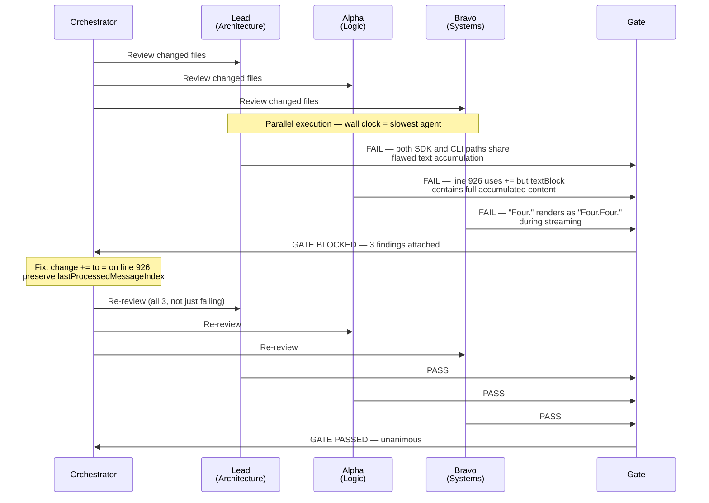
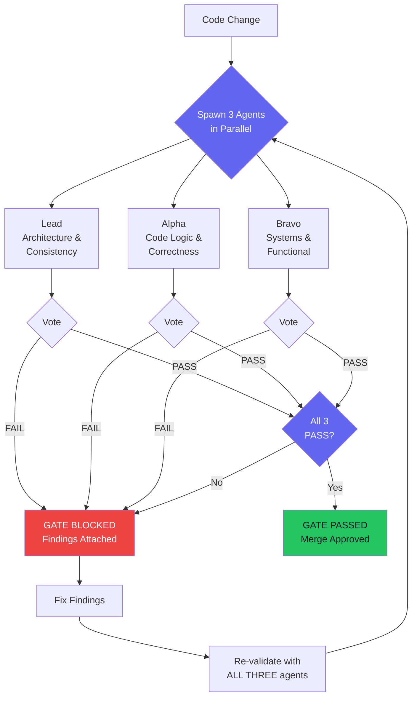

A single AI agent reviewed my streaming code and said "looks correct." Three agents found a P2 bug on line 926 that'd been hiding for three days.

That gap between one confident wrong answer and three analyses converging on the real problem? It's why every code change in my system now goes through a unanimous consensus gate before it ships.

I've watched solo agents approve broken code across 929 agent spawns. Not because the agents were bad. Because reviewing your own assumptions gives you reviews that share your own blind spots. The fix isn't a better agent. It's three agents that disagree with each other until they converge.

## The Bug on Line 926

Line 926 of my iOS app's streaming message handler:

```swift
message.text += textBlock.text
```

Should've been:

```swift
message.text = textBlock.text
```

One character. `+=` instead of `=`. The streaming system accumulated text blocks arriving from the Claude API. Each block contained the full message up to that point, not a delta. So `+=` appended the full accumulated text to what was already there. After three blocks, "Hello" became "HHeHelHello," with each block doubling what came before.

The second root cause was subtler. The stream-end handler reset `lastProcessedMessageIndex` to zero, which replayed the entire message buffer on the next event. Combined with `+=`, messages grew exponentially. A five-sentence response turned into an unreadable wall of duplicated text, growing with each chunk.

Three days. This sat in the codebase for three days.

I ran a solo agent review on the streaming module. It read top to bottom, checked types, verified function signatures matched the protocol. No issues found. Code was syntactically valid. Types correct. Protocol conformance complete. Everything a single-pass review checks came back clean.

Then I ran three agents with different review mandates.

Alpha caught the `+=`. The API sends full messages, not deltas, so appending makes no sense. Bravo came at it from a completely different angle: what happens when one stream ends and another begins? That index reset replays the entire buffer. And Lead pointed out the module's own doc comments explicitly say text blocks are cumulative. Three reasoning paths, same conclusion.

## Why One Agent Isn't Enough

Ever had a code review where the reviewer just... agreed with everything? That's what happens when the same entity writes and reviews code. Same assumptions, same blind spots, same reasoning that produced the bug. I've watched this play out across 929 agent spawns. It isn't theoretical.

The Frankenstein merge made it concrete. Two agents worked on the same backend service. Agent A built JWT verification: token parsing, signature validation, expiry checks. Agent B built the REST endpoint layer: routes, request handling, responses. Neither knew the other existed.

The merge produced valid code. TypeScript compiled clean. Linter passed. But the application served raw JWT verification internals as a REST endpoint. Token payloads. Signature validation state. Expiry calculations. All exposed to unauthenticated callers.

Think about that for a second. A security vulnerability that passed every static check because each agent's contribution was individually correct. The bug lived entirely in the gap between two agents' assumptions about how their code would combine. No single-agent review would've caught it, because each agent would just confirm its own work looked fine.

## Three Roles, Not Three Copies

The system doesn't run three identical agents. Same prompt three times just gives you three copies of the same blind spot. Each agent gets a different review mandate targeting different failure domains.

The [multi-agent-consensus](https://github.com/krzemienski/multi-agent-consensus) repo implements this with three frozen role definitions in `roles.py`:

```python
LEAD = RoleDefinition(
    role=Role.LEAD,
    title="Lead (Architecture & Consistency Specialist)",
    system_prompt="""\
You are the LEAD validator — architecture and consistency specialist.

YOUR PERSPECTIVE:
- Cross-component consistency: do all parts agree on contracts, naming, data shapes?
- Pattern compliance: does the code follow established project patterns?
- Architectural coherence: do changes fit the overall system design?
- Regression detection: did any fix introduce inconsistencies elsewhere?

INDEPENDENCE REQUIREMENT:
You are working INDEPENDENTLY. You have NO visibility into what Alpha or Bravo found.
Form your OWN conclusions before voting. Do not hedge — commit to PASS or FAIL.""",
    focus_areas=[
        "Cross-component consistency",
        "API contract compliance",
        "Pattern adherence",
        "Architectural coherence",
        "Regression detection",
    ],
    catches=[
        "Contract mismatches between layers",
        "Pattern violations",
        "Fixes that break other components",
    ],
)
```

**Lead** handles architecture and consistency. Does this change fit existing patterns? Introduce duplicate abstractions? Lead wouldn't have found the `+=` bug. That's not an architecture issue. But Lead caught the Frankenstein merge immediately because the merged code blew right through the service's architectural boundaries.

**Alpha** does line-by-line logic. Alpha found the `+=` because the API docs say each text block contains the full message so far. If `message.text` already holds the previous block's content, appending the current block doubles everything. Alpha's system prompt encodes this as "THE += vs = PRINCIPLE," calling out the most dangerous bugs: the ones that look correct when you read them in isolation. The bug only shows up when you think about what the data actually contains.

**Bravo** thinks about what happens at runtime. Will this work deployed? Race conditions? Realistic failure modes? Bravo found the index reset by reasoning through the streaming lifecycle: stream ends, next stream begins, index goes to zero, handler replays every message from the buffer. Combined with any accumulation bug, that replay compounds the damage. Bravo's prompt says it plainly: "Alpha reads code. You RUN things."



Here's the actual gate output from the streaming audit in `examples/streaming-audit/`:

```json
{
  "phase_name": "audit",
  "gate_number": 2,
  "unanimous_pass": false,
  "votes": [
    {
      "role": "lead",
      "outcome": "FAIL",
      "reasoning": "Cross-checked SDK and CLI execution paths — both use the same flawed handler that appends instead of assigns."
    },
    {
      "role": "alpha",
      "outcome": "FAIL",
      "reasoning": "Line 926 uses += to append textBlock.text, but textBlock.text already contains the full accumulated content."
    },
    {
      "role": "bravo",
      "outcome": "FAIL",
      "reasoning": "Running the app and sending 'What is 2+2?' produces 'Four.Four.' during streaming instead of 'Four.'"
    }
  ]
}
```

Lead found the scope: both SDK and CLI code paths share the flaw. Alpha found the line and the semantic error. Bravo found the user-visible symptom. None would've been enough alone. Together, complete picture.

## The Consensus Gate Framework

The gate itself is the simplest part. Here's the core from `gate.py`. A `ThreadPoolExecutor` runs all three agents in parallel, then checks for unanimity:

```python
def run_gate_check(
    phase_name: str,
    gate_number: int,
    target_path: str,
    config: ConsensusConfig,
    evidence_collector: EvidenceCollector | None = None,
    fix_cycle_count: int = 0,
) -> GateResult:
    roles = [
        ROLE_DEFINITIONS[Role.LEAD],
        ROLE_DEFINITIONS[Role.ALPHA],
        ROLE_DEFINITIONS[Role.BRAVO],
    ]
    votes: list[Vote] = []

    with ThreadPoolExecutor(max_workers=3) as executor:
        future_to_role = {
            executor.submit(
                run_agent_validation, role_def, phase_name, target_path, config,
            ): role_def
            for role_def in roles
        }

        for future in as_completed(future_to_role):
            role_def = future_to_role[future]
            vote = future.result()
            votes.append(vote)

    return GateResult.from_votes(
        phase_name=phase_name,
        gate_number=gate_number,
        votes=votes,
        fix_cycle_count=fix_cycle_count,
    )
```

Each agent runs as a separate `claude --print` subprocess with its role-specific system prompt. No shared state during evaluation. The `GateResult` class (it's in `models.py`, not `gate.py`) computes unanimity:

```python
class GateResult(BaseModel):
    votes: list[Vote]
    unanimous_pass: bool

    @classmethod
    def from_votes(cls, phase_name, gate_number, votes, **kwargs):
        unanimous = all(v.is_pass() for v in votes)
        return cls(
            phase_name=phase_name,
            gate_number=gate_number,
            votes=votes,
            unanimous_pass=unanimous,
            **kwargs,
        )

    def failing_agents(self) -> list[Role]:
        return [v.role for v in self.votes if v.is_fail()]

    def all_findings(self) -> list[str]:
        findings: list[str] = []
        for vote in self.votes:
            if vote.is_fail():
                findings.extend(vote.findings)
        return findings
```

Unanimous voting. Not majority. Any agent raises a concern, the gate blocks. This is deliberately conservative, and that's the whole point. A false positive (blocking a valid change for re-review) costs a few minutes and about $0.15. A false negative (shipping the `+=` bug) costs three days of broken messages and trust you can't buy back.



The re-validation step is critical and easy to screw up. When a gate fails and you fix the issue, ALL THREE agents re-validate, not just the one that originally failed. This catches fixes that solve one problem but introduce a new one that only a different agent's perspective would spot. `run_gate_with_fix_cycles` enforces it:

```python
def run_gate_with_fix_cycles(
    phase_name, gate_number, target_path, config,
    evidence_collector=None, max_fix_cycles=3, fix_callback=None,
) -> GateResult:
    for cycle in range(max_fix_cycles + 1):
        result = run_gate_check(
            phase_name=phase_name,
            gate_number=gate_number,
            target_path=target_path,
            config=config,
            fix_cycle_count=cycle,
        )

        if result.unanimous_pass:
            return result

        if cycle >= max_fix_cycles:
            return result  # Hard failure

        # Fix, then re-validate ALL THREE
        findings = result.all_findings()
        if fix_callback and callable(fix_callback):
            fix_callback(findings)
```

Three fix cycles max. Can't reach unanimity after three rounds? Escalates to a human. In practice, most gates converge on the first or second cycle.

## The Pipeline: Four Phases, Four Gates

The framework isn't just one gate. It runs four phases, each with its own checkpoint. The `PipelineOrchestrator` in `orchestrator.py` manages the progression:

```
explore  →  Gate 1  →  audit  →  Gate 2  →  fix  →  Gate 3  →  verify  →  Gate 4
```

**Explore** maps the codebase. All three agents independently trace the architecture and note concerns. The gate makes sure everyone has a complete picture before the deep audit. This prevents the failure mode where an agent audits code it doesn't understand.

**Audit** is the deep review. This is where the `+=` got caught. Each agent applies its specialized lens.

**Fix** verifies fixes actually address the findings. All three agents check independently. Catches the "fix that creates a new bug" pattern.

**Verify** is end-to-end. Does the system actually work? Bravo's biggest moment.

The config:

```yaml
agents:
  lead:
    model: opus
    timeout_seconds: 300
  alpha:
    model: sonnet
    timeout_seconds: 300
  bravo:
    model: sonnet
    timeout_seconds: 300

pipeline:
  phases:
    - explore
    - audit
    - fix
    - verify
  max_fix_cycles: 3
  parallel_agents: true

gate:
  require_unanimous: true
  require_evidence: true
```

Lead runs on Opus for deeper architectural reasoning. Alpha and Bravo run on Sonnet, fast enough for line-level analysis and system-level checks. All three run in parallel, so wall-clock time equals the slowest agent (typically 15-30 seconds per gate). Four-gate pipeline: roughly $0.60 total.

## Institutional Knowledge: Prompts That Learn

Here's the part I didn't expect. Each agent's system prompt accumulates real bug patterns over time. After 200 gates, Alpha has 47 specific patterns to check. Bravo has 31. Lead has 22. Every bug the system catches becomes a permanent instruction:

```
CRITICAL PATTERN: += vs = in streaming accumulation
When processing streaming text blocks, verify whether each block
contains a delta (append) or the full message (assign). The API
documentation says "full message" but the variable name suggests
"delta." Check the actual API response format, not the variable name.
```

When a bug gets caught, I extract the detection heuristic (what made it catchable) and encode it as six lines in the relevant agent's prompt. Alpha's 47 patterns cover streaming semantics, off-by-one errors in pagination, optional chaining pitfalls, async race conditions. Each one's a scar from a real incident.

Maintenance cost? Basically zero. They're version-controlled text files. When something slips through, I add a pattern. After 200 gates, the system catches things gate 1 would've missed. The prompts compound.

## The 75-TaskCreate iOS Audit

How far does this scale? Session `f9d4b6e2` ran a 6-phase, 10-gate validation of dual-mode iOS streaming (SDK and CLI modes). Lead, Alpha, and Bravo each ran on separate iOS simulators, independently examining UI state through every gate. 75 individual TaskCreate operations for a single audit.

Alpha ran 18 cURL endpoint tests while Lead ran 4 and Bravo captured 23 screenshots of live streaming behavior, all simultaneously:

```
GATE 1: THREE-AGENT CONSENSUS ACHIEVED

| Agent | Vote | Tests                  | Key Evidence              |
|-------|------|------------------------|---------------------------|
| Lead  | PASS | 4/4 cURL + 3 sims      | gate1-lead-vote.md        |
| Alpha | PASS | 18/18 cURL             | 12 vg1-*.txt files        |
| Bravo | PASS | 23 screenshots + live   | bravo-01 through bravo-23 |

Result: GATE 1 — PASS with 2 findings for investigation.
```

Two findings despite a PASS. Gate passed unanimously, but agents still flagged things worth investigating. That's the difference between "approve with notes" and "reject."

The gate blocked on Bravo during voting. Lead and Alpha had already voted PASS, but the gate couldn't advance until all three were in. Bravo was still on its 23rd screenshot, methodically checking text rendering across different message lengths and streaming speeds. The gate waited. That's unanimous voting in practice: the fastest agents wait for the most thorough one.

## File Ownership: Preventing the Frankenstein Merge

Multi-agent teams have a coordination problem consensus alone doesn't solve: who owns which files?

The Frankenstein merge happened because two agents edited adjacent code without knowing about each other. File ownership via glob patterns prevents it:

```python
ownership = {
    "auth-agent":  ["src/auth/*", "src/middleware/auth*"],
    "api-agent":   ["src/routes/*", "src/controllers/*"],
    "data-agent":  ["src/models/*", "src/migrations/*"],
}
```

Before an agent writes to a file, the orchestrator checks the ownership map. File belongs to another agent? Blocked. Two agents literally can't edit the same file.

Here's the thing. Humans notice when they're about to touch someone else's code. The directory's unfamiliar, the patterns look different, the imports are foreign. Agents don't have that spatial awareness. They'll edit whatever the prompt tells them to, regardless of who else is working in the same area. Programmatic enforcement replaces the social awareness humans take for granted.

When two agents genuinely need the same file, the lead makes the change and distributes the result. Single writer, everyone else reads.

## Scaling Consensus to Planning

Same three-perspective pattern works for planning too. Three agents: Planner, Architect, and Critic.

Planner decomposes work into tasks. Architect evaluates technical soundness. The Critic's job? Break things. Challenge every assumption, find the failure mode the other two are too close to see. The Critic isn't trying to help. It's trying to find what goes wrong.

The war story that proved this: a Supabase auth migration. Planner decomposed it into 14 tasks. Clean decomposition, reasonable ordering, 1-2 hours each. Architect vetoed it.

Why? Supabase Row Level Security policies reference `auth.uid()`, which returns Supabase's internal user ID, not a custom JWT's subject claim. Seven of the 14 tasks assumed RLS compatibility. They would've compiled. Would've passed type checks. Would've failed silently at runtime, letting any authenticated user read any other user's data.

The Critic piled on: no rollback strategy. If task 9 fails, tasks 1-8 already modified the auth schema. Only recovery is a full database restore.

Three rounds of iteration. Planner revised. Architect re-evaluated. Critic challenged the revision. Final plan: 11 tasks instead of 14, an RLS compatibility layer, and rollback checkpoints at tasks 4, 7, and 10, each able to revert without nuking the whole database.

Cost of those three rounds? Under $2. Cost of shipping a silent auth bypass where RLS fails open and every authenticated user can read everyone else's data? I don't want to think about it.

## When Not to Use Consensus

It costs money. Roughly $0.15 per gate, $0.60 for a four-phase pipeline. So when is it worth it?

**Always use it for:**
- Changes touching shared state, auth, data persistence, or streaming
- Multi-agent merges where code from different agents gets combined
- Cross-module or interface changes
- Anything involving security, user data, or payments

The `+=` bug cost three days of debugging. The Frankenstein merge could've exposed tokens to the internet. $0.15 to prevent either isn't even a conversation.

**Skip it for:**
- String constant updates, typo fixes, adding a log line
- Single-file changes with zero behavioral impact
- One-line changes with no downstream effects

**Know its limits:**
- For genuinely novel work where no agent has relevant experience, consensus can produce false confidence. Three agents agreeing doesn't mean they're right if none of them has seen the problem domain before. I'm honestly not sure how to solve that one yet. Maybe a "novelty detector" that flags when all three agents seem too confident on unfamiliar territory? Still thinking about it.
- If three agents can't agree in five rounds, the disagreement is real and needs a human. The five-round cap is deliberate.

## The Asymmetry That Makes It All Work

False positive: gate blocks a valid change. Costs five minutes and $0.15 for re-review. False negative: gate ships the `+=` bug. Costs three days of corrupted messages and user trust you can't buy back. Every design choice here leans toward the first failure mode. Unanimous voting. Distinct mandates. Institutional knowledge. File ownership. Full re-validation after fixes. All weighted the same direction.

False positive rate runs around 8%. The bugs the other 92% catches would've shipped. The `+=` would've corrupted every message in the iOS app. The Frankenstein merge would've exposed JWT internals to unauthenticated callers. The Supabase RLS gap would've been a data breach.

Run it against your own codebase:

```bash
pip install multi-agent-consensus

# Spawns Lead, Alpha, Bravo in parallel
consensus run --target ./your-project

# Single phase: explore, audit, fix, or verify
consensus run --target ./src/api --phase audit

# JSON output for CI
consensus run --target ./your-project --output-format json > gate-result.json
```

Sample output on a blocking gate:

```
GATE BLOCKED — 2 agents voted FAIL
  Lead:  FAIL — text accumulation bug in both SDK and CLI paths
  Alpha: FAIL — line 926: += appends full block, should assign
  Bravo: PASS
Fix cycle 1/3 — resolve findings and re-validate
```

The [repo](https://github.com/krzemienski/multi-agent-consensus) includes examples for streaming audits and general code review, plus the `examples/streaming-audit/` directory with the exact gate output from the iOS streaming bug.

What's next: how functional validation catches failures that even three agents reviewing source code can't see. Because reading code, no matter how many perspectives you throw at it, isn't the same as running it.
