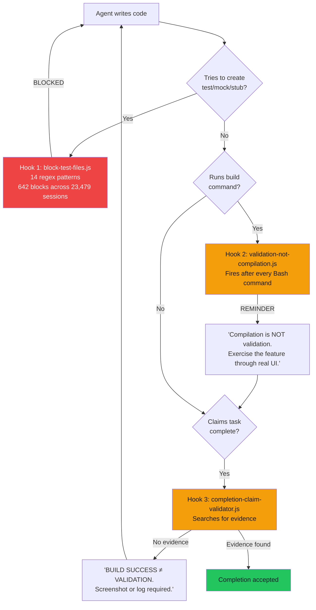
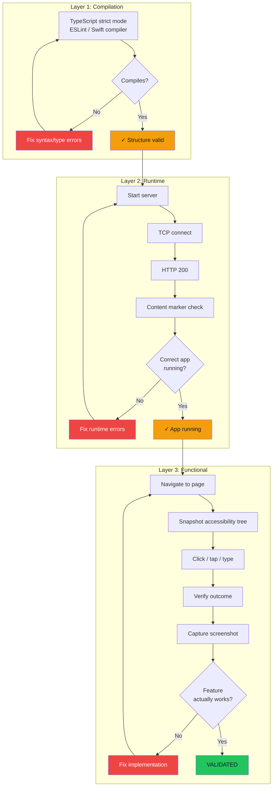

The agent said the feature was complete. Build passed. TypeScript reported zero errors. I merged the PR, and within minutes a Slack message arrived: "Login button doesn't do anything." Structurally perfect. Functionally empty. That failure, and the 642 times my system blocked agents from creating test files after it, changed how I think about quality in AI-generated code.

This is Post 3 of "Agentic Development: 18 Lessons from 23,479 AI Coding Sessions." The companion repo is [claude-code-skills-factory](https://github.com/krzemienski/claude-code-skills-factory).

## The Delete Account Button That Did Nothing

Correct icon. Correct confirmation dialog with "Are you sure?" text and a red destructive action style. Loading spinner that appeared on tap. The `onClick` handler called `deleteUserAccount()` with the correct signature, the correct parameter types, the correct error handling wrapper.

The function body:

```typescript
async function deleteUserAccount(userId: string): Promise<void> {
  // TODO: Implement account deletion
}
```

Every static check passed. TypeScript compiled clean. Linter, silent. The agent's self-review confirmed the feature was "complete with proper error handling and user confirmation flow."

Then a user filed a ticket asking why they couldn't delete their account. Of course they did.

That same week I found six more TODO bodies across the codebase. A password reset function that returned a success response without sending an email. An export endpoint that created an empty file and returned a download link to it. A notification preferences save that validated the input, confirmed the format, and quietly threw the payload away. Each one compiled. Each one linted clean. Each one was "complete" by every metric except the one that matters: does the thing actually do the thing?

## The Mirror Problem

Here's what nobody talks about with unit tests for AI-generated code: when AI writes both the implementation and the tests, passing tests prove exactly nothing. They're a mirror. Same assumptions reflected back.

The agent that wrote `deleteUserAccount()` with a TODO body would absolutely write a test that mocks the deletion service, asserts the function was called, and reports green. Test passes. Feature broken. The test confirmed the function exists and is callable. It never confirmed the function does anything. The mock replaced the only part that matters (the actual database deletion) with a no-op that always succeeds.

I watched this happen dozens of times before I snapped. Four categories of bugs that unit tests miss when the same AI writes both sides:

**Visual rendering bugs.** The component renders, the test confirms the DOM node exists, but CSS places it behind another element or collapses it to zero height. Invisible to automated tests. Obvious in a screenshot. Ever had a button that's technically "there" but nobody can see it?

**Integration boundary failures.** The API client sends `application/json`. The server expects `multipart/form-data`. The unit test mocks the API boundary and never discovers the mismatch. The mock accepts anything. That's what mocks do.

**State management bugs on second interaction.** Form works on first submission. On second submission, stale state from the first interaction corrupts the payload. Tests exercise a feature once and move on. Seven bugs in one admin panel only surfaced through full-flow testing, navigating the complete workflow rather than testing each page in isolation.

**Platform-specific rendering issues.** Layout works on the viewport size the test framework uses. Breaks on iPhone SE. The test never renders at 375x667. Why would it?

A passing test suite is an assertion. A timestamped screenshot is evidence.

## 642 Blocked Test Files

So I built a hook. A `block-test-files` PreToolUse hook that intercepts every file Write and Edit operation. If the target path matches any of 13 regex patterns (test directories, test/spec/mock file extensions, case-insensitive mock/stub/fake/fixture prefixes) the operation gets blocked:

```javascript
const TEST_PATTERNS = [
  /\/__tests__\//,
  /\.test\.[jt]sx?$/,
  /\.spec\.[jt]sx?$/,
  /\.mock\.[jt]sx?$/,
  /test_.*\.py$/,
  /.*_test\.py$/,
  /.*_test\.go$/,
  /Tests?\.swift$/,
  /mock[_-]/i,
  /stub[_-]/i,
  /fake[_-]/i,
  /fixture[_-]/i,
];
```

The blocking message: "This project uses functional validation, not unit tests. Instead of writing tests: Build the real system. Run it in the simulator/browser/CLI. Exercise the feature through the actual UI. Capture screenshots/logs as evidence."

Across 23,479 sessions in my dataset, this hook fired 642 times. That's 642 instances where an agent tried to create a test file and got stopped. Every single one was the system preventing an agent from building a mirror instead of exercising the real feature.

The blocked files tell their own story. Session `ad5769ce` alone triggered 166 blocks. Session `5368cad3` triggered 143. Session `fc444b36` hit 75. Look at the filenames and you see what agents want to do when left unchecked: `tests/integration/session-scan.test.ts`, `tests/integration/insight-extraction.test.ts`, `tests/e2e/content-generation.spec.ts`. Every one of these would've tested a mock of the feature, not the feature itself. Every one would've passed while the feature remained broken.

Sounds like I'm fighting my tools. I'm not. Every block redirects the agent back to the real system. And the real thing either works or it doesn't. There's no mock to hide behind.

## The Three-Hook Enforcement Chain

One hook isn't enough. Agents are persistent. Block one path and they'll find another way to avoid real validation. So I built three hooks that form a closed enforcement loop:



**Hook 1: `block-test-files.js`** is the front door. Can't create a test file, can't build a mirror. Fired 642 times.

**Hook 2: `validation-not-compilation.js`** fires after every Bash command that looks like a build. Agent runs `npm run build` or `xcodebuild`, output shows success, and the hook injects: "Compilation success is NOT functional validation. The real feature must be exercised through the actual user interface." This catches agents that skip test creation but declare victory after a green build.

**Hook 3: `completion-claim-validator.js`** fires when an agent tries to mark a task as complete. It searches the conversation history for evidence of functional validation, things like Playwright interactions, screenshots, simulator taps. No evidence? Blocked: "BUILD SUCCESS does not equal VALIDATION. You must provide screenshot or log evidence of the feature working through the real UI."

Together, these three hooks close every escape route. Can't write tests (Hook 1). Can't pretend compilation equals validation (Hook 2). Can't claim completion without evidence (Hook 3). The only path to "done" runs through the real application.

## The Skill That Encodes the Whole Workflow

Hooks block bad behavior. But I also needed something that teaches good behavior, a reusable workflow definition that any agent follows. That's what skills are for.

A SKILL.md is a structured markdown file that teaches Claude Code how to perform a specific workflow. It defines trigger patterns, routing tables, execution steps, and validation criteria. The [claude-code-skills-factory](https://github.com/krzemienski/claude-code-skills-factory) repo is both the factory for generating skills and the home of the functional validation skill itself.

Here's the core:

```markdown
# functional-validation

> Validates features through real system behavior, not test harnesses.
> Build it, run it, exercise it, capture evidence.

## Trigger Patterns

Activate this skill when the user says:
- `"validate this feature"`
- `"functional validation"`
- `"prove it works"`
- `"show me evidence"`

## Context

- NEVER create test files, mocks, stubs, or test doubles
- ALWAYS validate through the real running system
- Evidence must be personally examined, not just confirmed to exist
- Gate validation discipline: cite specific proof for each criterion
```

The routing table tells the agent which tool to use depending on the platform:

```markdown
## Routing Table

| Condition | Agent | Model | Reason |
|-----------|-------|-------|--------|
| iOS app | `executor` | sonnet | Simulator boot + idb commands |
| Web app | Playwright MCP | - | Browser automation |
| CLI tool | `executor` | sonnet | Direct command execution |
| API service | `executor` | sonnet | curl / HTTP requests |
| Evidence review | `verifier` | sonnet | Examine screenshots/logs |
```

The execution steps walk through the entire flow: build the real system, run it, exercise it through its real interface, capture evidence, and then apply gate validation discipline by personally examining every piece of evidence rather than just confirming files exist.

The skill factory generates these SKILL.md files programmatically:

```python
from skills_factory import SkillGenerator, SkillSpec, SkillStep, RoutingEntry

spec = SkillSpec(
    name="functional-validation",
    description="Validate through real system behavior, not test harnesses",
    trigger_patterns=("validate this feature", "prove it works"),
    routing=(
        RoutingEntry(condition="iOS app", agent="executor", model="sonnet"),
        RoutingEntry(condition="Web app", agent="playwright", model="sonnet"),
    ),
    steps=(
        SkillStep(number=1, title="Build", description="Build the real system"),
        SkillStep(number=2, title="Run", description="Start the app"),
        SkillStep(number=3, title="Exercise", description="Interact through real UI"),
        SkillStep(number=4, title="Capture", description="Screenshot/log evidence"),
        SkillStep(number=5, title="Verify", description="Examine all evidence"),
    ),
    validation_criteria=(
        "System was built from source",
        "Each feature exercised through real UI",
        "Evidence captured and personally examined",
    ),
)

generator = SkillGenerator()
content = generator.generate(spec)
```

Across all sessions, skills were invoked 1,370 times. The functional validation skill was one of the most frequently activated. It fires on phrases like "prove it works" or "show me evidence," which agents encounter constantly because the hook chain keeps pushing them toward real validation.

The validator catches skills that are missing required sections:

```python
from skills_factory import SkillValidator

validator = SkillValidator()
result = validator.validate_file("skills/deploy-preview/SKILL.md")
print(result.summary())
# Skill Validation: INVALID
#   Errors: 1, Warnings: 2
#   [E] [trigger_patterns] Required section missing: trigger_patterns
#   [W] [routing_table] Recommended section missing: routing_table
#   [W] [validation_criteria] Recommended section missing
```

A skill without validation criteria is a skill that can't enforce functional validation. The factory won't let you ship half a workflow.

## The Three-Layer Validation Stack

After the Delete Account incident, I built a validation stack with three layers. Each catches a different class of failure.



**Layer 1: Compilation and static analysis.** Docker build, TypeScript strict mode, ESLint, Swift compiler. This catches missing dependencies, type mismatches, import errors, syntax mistakes. Necessary but nowhere near sufficient. The Delete Account button passed this layer cleanly. A TODO function body is valid TypeScript, and that's the whole problem.

**Layer 2: Runtime verification.** Start the server. Confirm it responds to HTTP requests. Verify the response contains expected content markers, not just a 200 status code. This catches runtime crashes, missing environment variables, database connection failures, configuration mismatches.

I kept hitting three false positives in Layer 2 and it drove me nuts. Port open but server crashing on first request: a TCP check passes, an HTTP request fails. Server responding 200 but the body is a framework error page, not the application. Cached response from a previous build served by a reverse proxy while the actual server isn't running. The three-check readiness pattern handles all of them:

```python
def wait_for_server(url: str, marker: str, timeout: int = 30):
    deadline = time.time() + timeout
    while time.time() < deadline:
        try:
            sock = socket.create_connection(
                (host, port), timeout=2
            )  # Check 1: TCP connection
            sock.close()
            resp = requests.get(url, timeout=5)  # Check 2: HTTP 200
            if marker in resp.text:  # Check 3: Expected content
                return True
        except (ConnectionError, Timeout):
            time.sleep(1)
    raise ServerNotReady(f"No '{marker}' response within {timeout}s")
```

The content marker is key. Not "does the server respond?" but "does the server respond with the expected application content?" A marker like `<div id="app-root">` confirms the correct application is running, not just any process squatting on the expected port.

**Layer 3: Functional verification through real UI.** Navigate to the page. Snapshot the accessibility tree. Click the button. Check the outcome.

```
-> browser_navigate: http://localhost:3000/settings
-> browser_snapshot: [captures accessibility tree]
-> browser_click: ref="delete-account-btn"
-> browser_snapshot: [captures confirmation dialog]
-> browser_click: ref="confirm-delete"
-> browser_snapshot: [verifies redirect to login page]
```

If the redirect doesn't happen, the validation fails. Not because a test assertion fired, but because the screenshot shows the user is still on the settings page after clicking "confirm delete." The agent sees the same thing a user would see. No abstraction layer. No mock. Just the real app.

## 2,068 Browser Automation Calls

"Click the button and check" undersells what this looks like at scale. Across all 23,479 sessions, my agents made 2,068 browser automation calls: 604 `browser_click` calls, 524 `browser_navigate` calls, 465 `browser_take_screenshot` calls, plus hundreds more snapshots, form fills, and evaluations through Playwright and Puppeteer.

One session in the SessionForge project ran 674 total Playwright calls in a single validation pass. The breakdown: 262 clicks, 172 screenshots, 128 navigations, 64 accessibility snapshots, 34 text inputs, 20 key presses, 14 form fills, 4 dropdown selections. The pattern repeats: navigate to a page, snapshot the accessibility tree, click an element, verify the resulting state, capture a screenshot as evidence, move to the next element.

The 140-step validation flow covered every interactive element:

```
1.  browser_navigate  -> /sign-in
2.  browser_navigate  -> /login
3.  browser_fill_form -> [email + password]
4.  browser_click     -> Sign in button
5.  browser_click     -> Sign up link
6.  browser_fill_form -> [registration fields]
7.  browser_click     -> Create account button
8.  browser_snapshot  -> [verify accessibility tree]
...
14. browser_navigate  -> /deep-validator
15. browser_screenshot -> [capture dashboard]
20. browser_click     -> Pipeline tab
26. browser_click     -> Target Length dropdown
34. browser_click     -> Split view button
...
63. browser_navigate  -> /sessions
70-83. Navigate all settings pages, screenshot each
91-140. Full re-validation of entire app
```

Every page. Every form submission. Every navigation link. Every error state that can be triggered through the UI.

This session caught a real bug that compilation missed. The agent ran `next build` successfully (exit code 0, zero type errors) then navigated to the Automation page via Playwright. The page crashed at runtime: `Cannot find module './vendor-chunks/@opentelemetry.js'`. Build compiled. TypeScript type-checked. The actual page was broken by a stale `.next` cache. Only browser validation found it. The agent traced the bug, cleared the cache, restarted the dev server, and re-validated through the browser. Eleven build/restart cycles in that single session before the page rendered correctly. Eleven!

No unit test would've caught that. The stale cache was a runtime artifact that only appeared when the real application loaded the real page in a real browser.

## iOS Validation: 2,620 Screen Taps

The iOS side runs even harder. Across all sessions, agents executed 2,620 `idb_tap` calls on real iOS simulators, captured 2,165 `simulator_screenshot` images as evidence, and ran 1,239 `idb_describe` calls to query accessibility trees.

The accessibility tree is the coordinate source. No hardcoded pixel positions. When the layout changes, the accessibility labels stay the same, and the tap coordinates update automatically:

```python
def build_element_map(accessibility_tree: dict) -> dict:
    """Convert accessibility labels to tap coordinates."""
    elements = {}
    for node in walk_tree(accessibility_tree):
        if node.get("label"):
            frame = node["frame"]
            elements[node["label"]] = (
                frame["x"] + frame["width"] / 2,
                frame["y"] + frame["height"] / 2,
            )
    return elements
```

This is what makes iOS validation scalable. The automation doesn't break when a button moves 20 pixels. It queries the accessibility tree, finds the element by label, calculates the center of its frame, and taps there. I honestly expected the coordinate math to be fragile, but the accessibility tree turns out to be a rock-solid anchor. I was wrong about that, and I'm glad I was.

The full iOS validation numbers from the dataset:

| Tool | Total Calls |
|------|-------------|
| `idb_tap` | 2,620 |
| `simulator_screenshot` | 2,165 |
| `idb_describe` | 1,239 |
| `idb_gesture` | 479 |
| `idb_find_element` | 443 |
| `idb_input` | 253 |
| `xcode_build` | 128 |

2,620 screen taps. Not test assertions. Actual taps on actual buttons in actual simulators running actual apps. Each tap followed by a screenshot or accessibility query to verify the result. The validation didn't assume the tap worked. It checked.

## The Evidence Standard

Every claim of "done" requires a screenshot, a log, or a recording. Not an assertion that it works. Evidence that it works. The skill's gate validation discipline makes this explicit:

```markdown
## Validation Criteria

Before marking complete, verify:
- [ ] System was built from source (not pre-existing)
- [ ] System was running during validation
- [ ] Each feature exercised through real UI/CLI
- [ ] Evidence captured for every criterion
- [ ] Evidence personally examined (not just file existence)
- [ ] Specific proof cited for each claim
```

The validation gate tables from real sessions show what this looks like in practice. Phase 1 Gate from session `ad5769ce`: 8 criteria, each with specific evidence. VG1.2: "EventBus emits events" - evidence: `curl emit&count=10` returns `{"emitted":10, "subscriberCount":1, "ringBufferSize":10}`. VG1.5: "Ring buffer works" - evidence: emitted 1001 events, `ringBufferSize: 1000` (capped at configured maximum). Not "it works" but "here is the exact output proving it works, and here is the specific number that confirms the boundary condition."

The iron rule, loaded into every agent session:

```
IF the real system doesn't work, FIX THE REAL SYSTEM.
NEVER create mocks, stubs, test doubles, or test files.
ALWAYS validate through the same interfaces real users experience.
```

And the mock detection responses that catch agents trying to take shortcuts:

```
"Let me add a mock fallback" -> Fix why the real dependency is unavailable
"I'll write a quick unit test" -> Run the real app, look at the real output
"I'll stub this database"     -> Start a real database instance
"The real system is too slow"  -> That is a real bug. Fix it.
"I'll add a test mode flag"   -> There is one mode: production. Test that.
```

## Gap Analysis: Finding What Was Never Built

Catching bugs in existing features is half the problem. The other half? Discovering features that were never built in the first place.

I tracked spec compliance across 12 projects. The average gap rate was 14.7%. One in seven specified features was missing, incomplete, or implemented differently than the spec described.

Three gap categories showed up over and over:

**Missing:** The spec says "users can export data as CSV" and the export button doesn't exist. Gone. Nobody built it.

**Partial:** The spec says "users can filter by date range, status, and assignee" and filtering works for date range and status but the assignee filter populates its dropdown without actually filtering results. It looks right. It does nothing. Sound familiar?

**Divergent:** The spec says "password reset sends an email with a 24-hour expiry link" and the implementation uses a 1-hour expiry. Not broken, exactly. Just wrong.

Continuous gap analysis at phase gates (checking spec compliance at each development milestone rather than at the end) reduced the final gap rate from 14.7% to 2.1%. Catching a gap while the agent is still working on the feature costs minutes. Catching it three weeks later during QA costs days.

Admin panels are where gaps hide longest. Why? Because admin bugs persist when the admin user assumes they made a mistake. "I must've clicked the wrong thing." Regular users file tickets. Admins troubleshoot themselves into workarounds. One resource-disappears-on-navigation bug survived two weeks: create a resource, see success, navigate to the list, and the resource isn't there. The list query had a default filter excluding "pending" status items. Only full-flow testing caught it, creating, navigating away, returning, verifying.

## The Numbers

Here's where it all lands across 23,479 sessions:

- **642** blocked test file creations
- **2,620** iOS screen taps on real simulators
- **2,165** simulator screenshots as evidence
- **2,068** browser automation calls (Playwright + Puppeteer)
- **1,370** skill invocations (including functional validation triggers)
- **1,239** iOS accessibility tree queries
- **604** browser clicks on real web pages
- **524** browser navigations
- **465** browser screenshots
- **128** Xcode builds

Every one of those numbers represents a real interaction with a real application running on a real device or browser. Not a mock. Not a stub. Not a test double. Not a green checkmark from a test suite that confirmed a function existed without confirming it did anything.

After I put the three-layer stack together with the three-hook enforcement chain: 127 agent-generated PRs merged with zero "works on my machine" failures. The cost is more validation time per PR. The savings is zero post-merge incidents caused by features that compiled but didn't function.

## What I Actually Believe Now

I'm not anti-unit-test as some universal principle. Unit tests are great in plenty of contexts. But in my setup? They're useless. When AI writes the code and AI writes the tests and the tests pass and the feature is broken, the tests were theater. They made everyone feel good about a system that didn't work.

What replaced them is harder. Real databases, real simulators, real browsers. You can't run it in a 30-second CI pipeline. But when validation passes, the feature works. The user clicks the button and the thing happens.

That's the bar.

The [claude-code-skills-factory](https://github.com/krzemienski/claude-code-skills-factory) repo includes the functional validation skill, the skill generator that creates SKILL.md files, and the validator that ensures skills have proper validation criteria. It doesn't help you write tests. It helps you stop pretending tests are enough.
