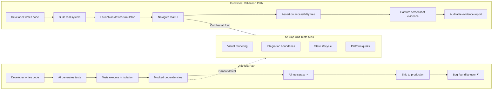
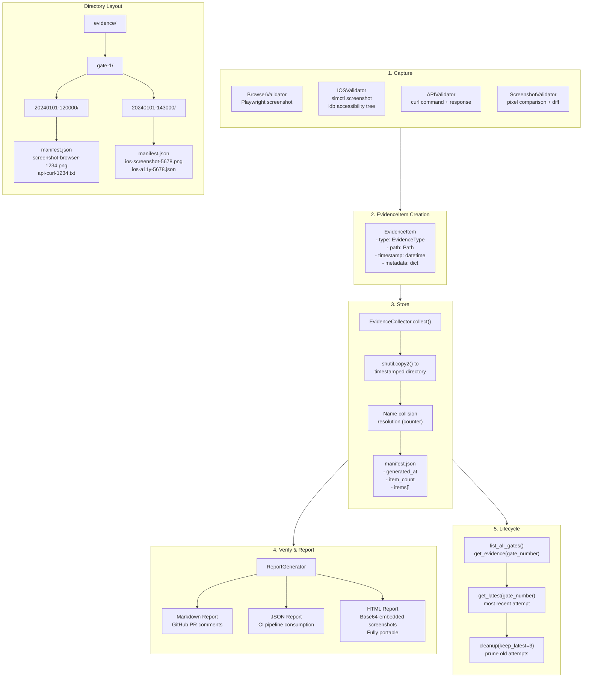
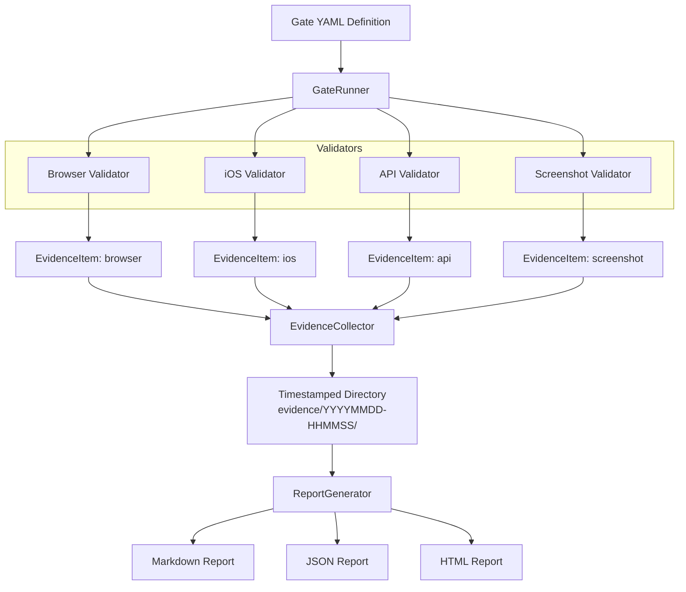

## I Banned Unit Tests From My AI Workflow

*Agentic Development: 10 Lessons from 8,481 AI Coding Sessions*

I said it out loud in a team meeting and watched the room go quiet: "I don't write unit tests anymore. I banned them."

Before you close this tab, hear me out. I didn't stop verifying my code. I stopped pretending that AI-generated tests verify anything.

Over 8,481 coding sessions with Claude Code, I discovered a fundamental problem with the test-driven workflow everyone assumes is best practice. When AI writes both the implementation AND the tests, passing tests are not independent evidence of correctness. They are a mirror reflecting itself.

So I built something different. I built a functional validation framework that forces real systems to prove they work -- with screenshots, accessibility trees, HTTP responses, and timestamped evidence you can audit after the fact.

This post walks through the framework, the code, and the four categories of bugs that unit tests systematically miss. It also includes a migration guide for teams that want to move from test suites to evidence-based validation, and an honest analysis of when unit tests still have value.

---

### The Mirror Problem

Here is the scenario that broke my faith in AI-generated tests.

I asked Claude to build a sidebar navigation component for an iOS app. It wrote the SwiftUI view. Then I asked it to write tests. It produced 14 unit tests. All green. Ship it.

Except the sidebar was invisible. The view existed in the hierarchy, the state management was correct, the navigation routing worked -- but a z-ordering issue meant the sidebar rendered behind the main content. Every unit test passed because they tested the model layer, not what the user sees.

This is not a contrived example. It happened. I have the screenshots to prove it.

The problem is structural. Unit tests verify implementation contracts. When the same intelligence writes both the contract and the verification, you get circular reasoning. The test suite becomes a tautology: "the code does what the code does."

Functional validation asks a different question: "Does the running system behave the way a human expects?"

---

### The Unit Test That Passed While The Feature Was Broken

Let me show you exactly what went wrong. Here is a simplified version of the test Claude generated for the sidebar navigation:

```swift
// What Claude generated: 14 tests, all green
final class SidebarNavigationTests: XCTestCase {

    func testSidebarHasExpectedItems() {
        let viewModel = SidebarViewModel()
        XCTAssertEqual(viewModel.items.count, 7)
        XCTAssertEqual(viewModel.items[0].title, "Home")
        XCTAssertEqual(viewModel.items[1].title, "Sessions")
    }

    func testSelectingItemUpdatesActiveScreen() {
        let viewModel = SidebarViewModel()
        viewModel.select(.sessions)
        XCTAssertEqual(viewModel.activeScreen, .sessions)
    }

    func testSidebarItemsHaveIcons() {
        let viewModel = SidebarViewModel()
        for item in viewModel.items {
            XCTAssertFalse(item.iconName.isEmpty,
                "\(item.title) should have an icon")
        }
    }

    func testNavigationIntentClosesSidebar() {
        let viewModel = SidebarViewModel()
        viewModel.isSidebarOpen = true
        viewModel.select(.settings)
        XCTAssertFalse(viewModel.isSidebarOpen)
    }

    // ... 10 more tests, all passing
}
```

Every test verified the ViewModel. The ViewModel was correct. The data model was correct. The navigation routing was correct. The test suite was 14/14 green.

But the SwiftUI view that rendered the sidebar had this:

```swift
struct SidebarRootView: View {
    @State private var viewModel = SidebarViewModel()

    var body: some View {
        ZStack {
            // Main content at zIndex 0
            NavigationStack {
                contentView(for: viewModel.activeScreen)
            }

            // Sidebar BEHIND the NavigationStack
            // because ZStack renders in source order
            // and no explicit .zIndex() was set
            if viewModel.isSidebarOpen {
                SidebarSheet(viewModel: viewModel)
            }
        }
    }
}
```

The sidebar rendered behind the main content. The `ZStack` renders children in source order, and the sidebar was listed after the `NavigationStack` but without an explicit `.zIndex()` modifier. On some SwiftUI versions this works fine because later children layer on top. On the version I was targeting, the `NavigationStack` consumed the full frame and the sidebar appeared underneath.

No unit test would have caught this because no unit test renders the actual SwiftUI view hierarchy. The `@State` initialization, the `ZStack` ordering, the `.zIndex` behavior -- these are runtime rendering concerns that exist only when pixels hit a screen.

The functional validation that did catch it was trivial:

```yaml
gates:
  - number: 3
    name: Sidebar Opens
    depends_on: [1]
    criteria:
      - description: Sidebar is visible after swipe gesture
        evidence_required: [screenshot, accessibility_tree]
        validator_type: ios
        validator_config:
          actions:
            - type: swipe
              start_x: 5
              start_y: 500
              end_x: 300
              end_y: 500
              duration: 0.3
          assertions:
            - type: element_present
              label: Home
            - type: element_present
              label: Sessions
            - type: element_present
              label: Settings
```

Open the app. Swipe from the left edge. Check if "Home", "Sessions", and "Settings" labels appear in the accessibility tree. If they don't, the sidebar isn't visible. Take a screenshot as proof.

The accessibility tree search returned nothing. The labels existed in the view hierarchy but were not accessibility-visible because they were occluded. The gate failed. The screenshot showed exactly what was wrong: a blank main content area with no sidebar. Fix the `ZStack` ordering, re-run the gate, screenshot shows the sidebar, gate passes.

Total time to find and fix: 90 seconds. The unit test suite had hidden this bug for an entire development cycle.

---

### The Four Bug Categories Unit Tests Miss

After cataloging bugs across hundreds of sessions, I found they cluster into four categories that unit tests are structurally blind to.

#### 1. Visual Rendering Bugs

The sidebar z-ordering bug above. Colors that don't match the spec. Font sizes below the Human Interface Guidelines minimum (I found 39 instances of sub-11pt fonts in one audit pass). Layout that looks correct in a test harness but breaks on a real device frame.

These bugs exist in the gap between "the view model has the right state" and "the user sees the right thing." Unit tests live on one side of that gap. Users live on the other.

In the ILS project specifically, here are visual rendering bugs that functional validation caught and unit tests would have missed:

- **ShimmerModifier GeometryReader**: A loading shimmer effect used a `GeometryReader` in an overlay. On certain device sizes the `GeometryReader` consumed the parent frame and the shimmer occupied the full screen instead of the loading placeholder. No ViewModel state was wrong. The animation modifier was just applied incorrectly in the view layer.

- **ThemeSnapshot vs protocol**: 48 views used `any AppTheme` (an existential protocol) instead of the concrete `ThemeSnapshot` struct. The existential box caused micro-allocations on every view re-render. Functional validation caught this as a visual jank -- frame drops during scrolling that no unit test measures.

- **InfoTooltipButton popover conflict**: Setting `isShowing = true` as default for all tooltip instances caused iOS to fight over which popover to display (iOS only shows one popover at a time). The last one wins, so tooltips appeared at wrong locations. Unit tests for each individual tooltip component would pass in isolation.

- **StreamingIndicatorView animation restart**: A pulsing animation modifier was applied unconditionally on every state update. Without a guard (`!isPulsing`), the `.repeatForever` animation restarted on each render, causing a visible stutter. The animation state was technically correct -- it was "pulsing" -- but the visual result was broken. No unit test checks animation smoothness.

- **LaunchScreenView font floor**: The launch screen used `size: 10` for a monospaced font. Apple's HIG minimum is 11pt. The text was technically readable on iPhone 16 Pro Max but illegible on iPhone SE. Functional validation on the SE simulator caught it; a unit test checking `font.size == 10` would have passed and confirmed the wrong value.

#### 2. Integration Boundary Bugs

A Vapor backend returns camelCase JSON. The iOS client expects snake_case. Every unit test on both sides passes independently. The system is broken.

I hit this exact bug with two backend binaries. The old backend at one path returned raw Claude Code data with bare arrays and snake_case. The current backend at another path returned proper API response wrappers with camelCase. Unit tests for both were green. The app was non-functional until I validated the actual HTTP response against the actual JSON decoder.

Here is what the API validation gate looks like for this class of bug:

```yaml
- number: 5
  name: Sessions API Contract
  depends_on: [4]
  criteria:
    - description: Sessions endpoint returns valid JSON envelope
      evidence_required: [curl_output]
      validator_type: api
      validator_config:
        method: GET
        path: /api/v1/sessions
        expected_status: 200
        max_response_time_ms: 2000
        assertions:
          - type: json_key_exists
            key: data
          - type: json_path
            path: $.data
            expected_type: list
```

This gate hits the real endpoint, checks that the response has a `data` key wrapping the array (not a bare array), and saves the entire curl command and response as evidence. If the wrong backend binary is running, this gate fails immediately with a clear message about the missing JSON structure.

The critical insight: integration boundary bugs only manifest when two real components interact. Mocking one side eliminates the exact failure mode you need to detect.

Here are more integration boundary bugs from the ILS project that illustrate why mocks are actively harmful for this category:

- **Backend binary mismatch**: The project had two backend binaries at different filesystem paths. The old one at `/Users/nick/ils/ILSBackend/` returned raw Claude Code data (bare arrays, snake_case keys). The current one at `/Users/nick/Desktop/ils-ios/` returned proper `APIResponse` wrappers (camelCase). Developers could accidentally start the wrong binary and everything would appear to work until the iOS client tried to decode the response. A unit test with a mock JSON response would encode whichever format the test author assumed was correct -- making the test a tautology. The functional validation gate hits `localhost:9999` and checks the actual response structure. If the wrong binary is running, the gate fails in under 2 seconds.

- **`import Crypto` vs `import CryptoKit`**: In a Vapor context, `import Crypto` resolves to Swift-Crypto (the server-side library), not Apple's CryptoKit. Both provide `SHA256`. Both compile. Both produce SHA256 hashes. But the output format differs -- Swift-Crypto returns a `Digest` type with different string interpolation than CryptoKit's `SHA256Digest`. Deterministic project IDs computed on the backend didn't match what the iOS client expected because the hash representations diverged. Unit tests on either side would pass because each side's `SHA256` worked correctly in isolation. The integration only breaks when the two hashes are compared across the boundary.

- **SSE content-type negotiation**: The iOS `SSEClient` expects `text/event-stream` as the content type. During one refactor, the Vapor backend started returning `application/json` for the streaming endpoint because a middleware was overriding the content type for all routes. The SSEClient silently ignored the response (not an event stream), the chat view showed nothing, and every component's unit test passed. The API gate caught it because it checks the actual `Content-Type` header of the actual response.

#### 3. State Management Bugs

SwiftUI re-renders on state changes. But a `@State` property initialized in the wrong lifecycle phase, or an `@EnvironmentObject` accessed before injection completes, produces crashes that no unit test catches -- because unit tests don't have a real SwiftUI lifecycle.

I discovered that changing the default `activeScreen` to `.settings` in a NavigationStack crashed the app because `@EnvironmentObject` wasn't ready during `@State` init. No test would have found this. The simulator found it in 2 seconds.

More examples from production:

- **ChatView `.task(id:)` bug**: When switching between sessions, the chat messages didn't reload. The `@State` array persisted across navigation because SwiftUI reused the view instance. The fix was adding `.task(id: session.id)` to force the async load to re-execute. Unit tests for the ViewModel's `loadMessages()` method would pass because the method worked correctly when called -- it just was never called on session switch.

- **MetricsWebSocketClient disconnect**: After disconnecting and reconnecting, the system monitor showed stale "failure" state because `disconnect()` didn't reset the failure flag. The connection state machine worked correctly in a unit test where you call `disconnect()` then `connect()` synchronously. In the real app, the async gap between disconnect and reconnect allowed the UI to observe the intermediate failure state.

- **Markdown title cleanup**: Session titles arrived from the API with `## ` prefixes (raw Markdown). The `SidebarSessionRow` and `MacDashboardView` both displayed `## My Session` instead of `My Session`. A unit test for a `cleanTitle()` function would pass. But no one wrote that unit test because no one knew the data arrived with Markdown prefixes -- you only discover that by looking at the running app.

- **Timer tolerance and scenePhase**: Timers without explicit tolerance values caused unnecessary wake-ups, draining battery. Worse, timers continued firing when the app entered the background because no one checked `scenePhase`. A unit test for "timer fires every 5 seconds" would pass. The real bug was "timer fires every 5 seconds even when the app is backgrounded and the user is not looking at it." Only running the app on a real device and checking the energy diagnostics reveals this class of waste.

- **@SceneStorage persistence**: Session IDs stored in `@State` were lost on app termination. Migrating to `@SceneStorage` preserved them, but `@SceneStorage` only accepts primitive types -- you cannot store a `UUID` directly, only its `.uuidString`. This constraint does not exist in unit tests because unit tests do not have scene storage. The real behavior only emerges when you kill the app, relaunch it, and check whether the session is restored.

#### 4. Platform-Specific Bugs

Claude CLI includes nesting detection. If `CLAUDECODE=1` is in the environment, the CLI silently refuses to execute. When your Vapor backend runs inside a Claude Code session, spawned subprocesses inherit these variables. No error. No stderr. Just a zero-byte response.

The fix was three lines of code. Finding those three lines cost a full debugging session. No unit test would have surfaced this because the test environment wouldn't have the offending env vars.

More platform bugs from the ILS project:

- **`import Crypto` vs `import CryptoKit`**: In a Vapor context, `import Crypto` resolves to Swift-Crypto (the server-side library), not CryptoKit. The `SHA256` type from Swift-Crypto has a different API than CryptoKit's `SHA256`. Both compile. Both produce SHA256 hashes. But the output format differs, so deterministic project IDs computed on the backend didn't match what the iOS client expected. Unit tests on either side pass independently.

- **Deep link UUID case sensitivity**: Deep links like `ils://sessions/ABC-DEF` failed silently because iOS URL parsing lowercased the UUID, but the backend expected the original case. The `UUID` initializer in Swift accepts any case, but string comparison downstream was case-sensitive. Every component worked individually. The system failed only when a real deep link traversed the full stack.

- **NSTask terminationStatus crash**: Accessing `process.terminationStatus` before calling `process.waitUntilExit()` throws `NSInvalidArgumentException` -- an Objective-C exception that crashes the process without a Swift-catchable error. This only happens under race conditions where stdout EOF arrives before the process actually exits. No unit test reproduces this timing.

- **Simulator UDID collisions**: Multiple AI sessions running simultaneously each tried to use the default "booted" simulator. Tests would pass in one session and fail in another because the wrong simulator was targeted. The fix was assigning a dedicated UDID (`50523130-57AA-48B0-ABD0-4D59CE455F14`) and passing it explicitly to every `simctl` and `idb` command. Unit tests running in Xcode's test runner don't encounter this because they use whatever simulator Xcode selects. The platform-specific failure only manifests in the multi-session AI development environment.

- **UserDefaults persistence across reinstall**: After uninstalling and reinstalling the app via `xcrun simctl`, the cached `serverURL` in `UserDefaults` was cleared -- but a stale Cloudflare tunnel URL persisted because `UserDefaults` data lives in the simulator's container, which `simctl uninstall` removes. On reinstall, the fresh app had no cached URL and defaulted correctly. However, if you merely updated the binary without uninstalling first (which `xcodebuild` does by default), the stale URL survived. Unit tests don't test the install/update/reinstall lifecycle.

---



---

### The Framework: Functional Validation From Scratch

I formalized all of this into a Python framework. The core idea: define validation gates, run them against live systems, collect timestamped evidence, and generate auditable reports.

The design has five layers:

1. **Models** (`models.py`): Pydantic data structures for gates, criteria, results, and evidence.
2. **Validators** (`validators/`): Four validator implementations that interact with real systems.
3. **Gate Runner** (`gates/gate.py`): Orchestrator that runs gates in dependency order.
4. **Evidence Collector** (`gates/evidence.py`): Persists artifacts into timestamped directories.
5. **Report Generator** (`gates/report.py`): Produces Markdown, JSON, or self-contained HTML.

The data model starts with Pydantic. Here are the core types:

```python
# src/fvf/models.py

class EvidenceType(str, Enum):
    SCREENSHOT = "screenshot"
    CURL_OUTPUT = "curl_output"
    ACCESSIBILITY_TREE = "accessibility_tree"
    LOG = "log"
    VIDEO = "video"
    NETWORK_HAR = "network_har"

class ValidationResult(BaseModel):
    status: ValidationStatus
    message: str
    evidence: list[EvidenceItem] = Field(default_factory=list)
    duration_ms: float = 0.0
    validator_name: str = ""

    @property
    def passed(self) -> bool:
        return self.status == ValidationStatus.PASSED

    @property
    def failed(self) -> bool:
        return self.status in (ValidationStatus.FAILED, ValidationStatus.ERROR)
```

Every validation produces a `ValidationResult` with an explicit status, a human-readable message, and a list of evidence items. Evidence is not optional. If you claim something passed, you need the receipts.

The `EvidenceItem` model itself carries a timestamp, a file path, and arbitrary metadata:

```python
# src/fvf/models.py

class EvidenceItem(BaseModel):
    type: EvidenceType
    path: Path
    timestamp: datetime = Field(default_factory=datetime.utcnow)
    metadata: dict[str, Any] = Field(default_factory=dict)

    @field_validator("path", mode="before")
    @classmethod
    def coerce_path(cls, v: Any) -> Path:
        return Path(v) if not isinstance(v, Path) else v

    def exists(self) -> bool:
        return self.path.exists()

    def size_bytes(self) -> int:
        try:
            return self.path.stat().st_size
        except FileNotFoundError:
            return 0
```

The `coerce_path` validator handles both string and `Path` inputs gracefully. The `exists()` and `size_bytes()` methods let you verify evidence integrity after collection -- a screenshot that was supposed to be captured but has 0 bytes is a red flag.

Gates are numbered, ordered, and can declare dependencies:

```python
# src/fvf/models.py

class GateDefinition(BaseModel):
    number: int = Field(ge=1, description="Gate number (1-based, determines execution order)")
    name: str
    description: str = ""
    criteria: list[GateCriteria] = Field(default_factory=list)
    depends_on: list[int] = Field(
        default_factory=list,
        description="Gate numbers that must pass before this gate runs",
    )

    @field_validator("depends_on")
    @classmethod
    def no_self_dependency(cls, v: list[int], info: Any) -> list[int]:
        number = info.data.get("number")
        if number is not None and number in v:
            raise ValueError(f"Gate {number} cannot depend on itself")
        return v
```

The dependency system matters. If Gate 1 ("App Launches") fails, there is no point running Gate 5 ("Chat Messages Render Correctly"). The `GateRunner` handles this automatically:

```python
# src/fvf/gates/gate.py

def run_all(self) -> list[GateResult]:
    completed: list[GateResult] = []
    failed_gate_numbers: set[int] = set()

    for gate in self._gates:
        if not self._check_dependencies(gate, completed, failed_gate_numbers):
            skipped = GateResult(
                gate=gate,
                status=ValidationStatus.SKIPPED,
                results=[
                    ValidationResult(
                        status=ValidationStatus.SKIPPED,
                        message=(
                            f"Skipped -- dependency gate(s) "
                            f"{gate.depends_on} did not pass"
                        ),
                        validator_name="GateRunner",
                    )
                ],
            )
            completed.append(skipped)
            failed_gate_numbers.add(gate.number)
            continue

        gate_result = self.run_gate(gate)
        completed.append(gate_result)
        if not gate_result.passed:
            failed_gate_numbers.add(gate.number)

    return completed
```

The dependency check is explicit about two cases: a dependency that failed, and a dependency that hasn't run yet. Both block the downstream gate. This prevents subtle ordering bugs where a gate accidentally runs before its dependency:

```python
# src/fvf/gates/gate.py

def _check_dependencies(
    self,
    gate: GateDefinition,
    completed: list[GateResult],
    failed_numbers: set[int],
) -> bool:
    if not gate.depends_on:
        return True
    for dep_number in gate.depends_on:
        if dep_number in failed_numbers:
            return False
        dep_results = [r for r in completed if r.gate.number == dep_number]
        if not dep_results:
            return False
    return True
```

---

### The Configuration Layer

Before diving into validators, let me show the configuration system. The `FVFConfig` class can be loaded from YAML, from `pyproject.toml`, or discovered automatically by walking up the directory tree:

```python
# src/fvf/config.py

class FVFConfig(BaseModel):
    evidence_dir: Path = Field(default=Path("./evidence"))
    screenshot_format: str = Field(default="png", pattern="^(png|jpg|jpeg|webp)$")
    browser_timeout: int = Field(default=30_000, ge=1_000)
    ios_simulator_udid: str | None = Field(default=None)
    api_base_url: str | None = Field(default=None)
    gate_retry_limit: int = Field(default=3, ge=1)
    parallel_gates: bool = Field(default=False)

    @classmethod
    def discover(cls, start_dir: Path | None = None) -> "FVFConfig":
        search_dir = (start_dir or Path.cwd()).resolve()
        for directory in [search_dir, *search_dir.parents]:
            for candidate in ("fvf.yaml", "fvf.yml", "pyproject.toml"):
                candidate_path = directory / candidate
                if candidate_path.exists():
                    try:
                        return cls.from_file(candidate_path)
                    except Exception:
                        pass
        return cls()
```

The `discover()` method means you can run `fvf validate` in any subdirectory and it will find the project configuration automatically. For iOS projects, the `ios_simulator_udid` field ensures the validator always targets the correct simulator -- critical in environments where multiple simulators run simultaneously for different AI sessions.

A typical `fvf.yaml` for the ILS project:

```yaml
evidence_dir: ./evidence
screenshot_format: png
browser_timeout: 30000
ios_simulator_udid: "50523130-57AA-48B0-ABD0-4D59CE455F14"
api_base_url: "http://localhost:9999"
gate_retry_limit: 3
```

---

### Four Validators for Four Surfaces

The framework ships with four validators, each built on an abstract base class. Every validator must implement two methods: `validate()` for running assertions, and `capture_evidence()` for independent evidence collection:

```python
# src/fvf/validators/base.py

class Validator(ABC):
    @abstractmethod
    def validate(self, criteria: GateCriteria) -> ValidationResult:
        ...

    @abstractmethod
    def capture_evidence(self, output_dir: Path) -> list[EvidenceItem]:
        ...
```

The separation matters. Sometimes you want to capture a baseline snapshot before running any assertions -- for example, to establish what the screen looks like before a user action. The `capture_evidence()` method supports this use case without forcing you to define dummy assertions.

#### The Browser Validator

Uses Playwright to drive a real Chromium browser. No JSDOM. No enzyme. A real browser rendering real pixels:

```python
# src/fvf/validators/browser.py

class BrowserValidator(Validator):
    def validate(self, criteria: GateCriteria) -> ValidationResult:
        # ...
        with sync_playwright() as pw:
            browser = pw.chromium.launch(headless=True)
            context = browser.new_context()
            page = context.new_page()
            page.set_default_timeout(self._config.browser_timeout)

            response = page.goto(url, wait_until="networkidle")

            for action in vc.get("actions", []):
                self._execute_action(page, action)

            for assertion in vc.get("assertions", []):
                atype = assertion.get("type", "")
                if atype == "status_code":
                    expected_code = int(assertion.get("expected", 200))
                    actual_code = response.status if response else -1
                    ok = self._check_status_code(actual_code, expected_code)
                    # ...
                elif atype == "element_visible":
                    selector = assertion.get("selector", "")
                    ok = self._check_element_visible(page, selector)
                    # ...
                elif atype == "text_content":
                    selector = assertion.get("selector", "")
                    expected_text = assertion.get("expected", "")
                    ok = self._check_text_content(page, selector, expected_text)
                    # ...

            # Always capture a screenshot as evidence
            page.screenshot(path=str(screenshot_path), full_page=True)
```

That last line is the key. Every single validation run captures a screenshot. Even if all assertions pass. The screenshot is evidence you can review tomorrow when someone asks "are you sure this worked?"

The browser validator supports four action types that let you drive complex UI flows before asserting:

```python
# src/fvf/validators/browser.py

def _execute_action(self, page: Any, action: dict[str, Any]) -> None:
    atype = action.get("type", "")
    if atype == "click":
        page.click(action.get("selector", ""))
    elif atype == "wait":
        page.wait_for_timeout(int(action.get("duration", 1000)))
    elif atype == "fill":
        page.fill(action.get("selector", ""), action.get("value", ""))
    elif atype == "navigate":
        page.goto(action.get("url", ""), wait_until="networkidle")
```

Click a button, wait for an animation, fill a form field, navigate to a new page. Then assert on the result. This is the level of interaction that unit tests cannot express.

#### The iOS Validator

Drives the actual iOS Simulator via `idb` and `simctl`. Deep links, tap gestures, swipe gestures, accessibility tree inspection:

```python
# src/fvf/validators/ios.py

class IOSValidator(Validator):
    def validate(self, criteria: GateCriteria) -> ValidationResult:
        # ...
        if dl := vc.get("deep_link"):
            self._deep_link(dl)
            time.sleep(1.5)  # Allow app to settle

        for action in vc.get("actions", []):
            self._execute_action(action)

        tree = self._get_accessibility_tree()

        for assertion in vc.get("assertions", []):
            atype = assertion.get("type", "")
            if atype == "element_present":
                label = assertion.get("label", "")
                element = self._find_element(tree, label)
                ok = element is not None
```

The accessibility tree search is recursive. It walks the entire UI hierarchy looking for elements by label, checking both the `label` and `value` attributes:

```python
# src/fvf/validators/ios.py

def _find_element(self, tree: dict[str, Any], label: str) -> dict[str, Any] | None:
    if not tree:
        return None

    node_label = str(tree.get("label", "") or tree.get("AXLabel", ""))
    node_value = str(tree.get("value", "") or tree.get("AXValue", ""))
    if label.lower() in node_label.lower() or label.lower() in node_value.lower():
        return tree

    for child in tree.get("children", []):
        found = self._find_element(child, label)
        if found is not None:
            return found

    return None
```

This is how you verify an iOS app works: you open it, you navigate to a screen, you dump the accessibility tree, and you check that the elements you expect are actually present. Not "the view model contains the right data." The elements. On screen. In the tree.

The iOS validator also supports tap and swipe gestures for driving complex interactions:

```python
# src/fvf/validators/ios.py

def _tap(self, x: float, y: float) -> None:
    cmd = ["idb", "ui", "tap", str(x), str(y)]
    if self._udid:
        cmd += ["--udid", self._udid]
    subprocess.run(cmd, capture_output=True, text=True, timeout=30)

def _swipe(self, start_x, start_y, end_x, end_y, duration=0.3):
    cmd = [
        "idb", "ui", "swipe",
        str(start_x), str(start_y),
        str(end_x), str(end_y),
        "--duration", str(duration),
    ]
    if self._udid:
        cmd += ["--udid", self._udid]
    subprocess.run(cmd, capture_output=True, text=True, timeout=30)
```

The `deep_link` method opens URLs via `xcrun simctl openurl`, which is the same mechanism the OS uses when a user taps a link. This tests the real URL handler registration, not a mocked router:

```python
# src/fvf/validators/ios.py

def _deep_link(self, url: str) -> None:
    cmd = ["xcrun", "simctl", "openurl"]
    cmd.append(self._udid if self._udid else "booted")
    cmd.append(url)
    result = subprocess.run(
        cmd, capture_output=True, text=True, timeout=30
    )
```

Every iOS validation captures both a screenshot and the full accessibility tree as JSON. The screenshot proves what the user saw. The accessibility tree proves what the system exposed to assistive technology. Both are evidence. Both are auditable.

#### The API Validator

Makes real HTTP requests with `httpx`. Status codes, response times, JSON path assertions, schema validation:

```python
# src/fvf/validators/api.py

class APIValidator(Validator):
    def validate(self, criteria: GateCriteria) -> ValidationResult:
        # ...
        with httpx.Client(timeout=timeout_s) as client:
            response = client.request(
                method, url,
                headers=headers,
                json=body if isinstance(body, (dict, list)) else None,
            )
        duration_ms_actual = (time.monotonic() - request_start) * 1000

        ok = self._check_status(response.status_code, expected_status)
        ok = self._check_response_time(duration_ms_actual, max_response_time_ms)
```

The API validator includes a simple JSONPath resolver that supports dot-notation and array indexing without requiring a third-party JSONPath library:

```python
# src/fvf/validators/api.py

def _resolve_json_path(self, data: Any, path: str) -> Any:
    if not path or path == "$":
        return data
    normalized = path.lstrip("$").lstrip(".")
    parts = normalized.replace("[", ".").replace("]", "").split(".")
    current = data
    for part in parts:
        if not part:
            continue
        if isinstance(current, dict):
            current = current.get(part)
        elif isinstance(current, list):
            current = current[int(part)]
        else:
            return None
    return current
```

This resolves paths like `$.data[0].name` against a parsed JSON response. It is intentionally simple -- no wildcard support, no recursive descent. The goal is to check that a specific field has a specific value in a specific response, not to build a query language.

Every API validation saves a curl-equivalent command as evidence. You can replay it. You can share it. You can paste it into a terminal six months later and see if the endpoint still works:

```python
# src/fvf/validators/api.py

def _format_curl(self, method, url, headers, body) -> str:
    parts = [f"curl -X {method} '{url}'"]
    for key, value in headers.items():
        parts.append(f"  -H '{key}: {value}'")
    if body is not None:
        if isinstance(body, (dict, list)):
            parts.append(f"  -H 'Content-Type: application/json'")
            parts.append(f"  -d '{json.dumps(body)}'")
    return " \\\n".join(parts)
```

The curl evidence file includes the command, the status code, the response time, and the first 10,000 characters of the response body. This is everything a developer needs to reproduce the exact request.

#### The Screenshot Validator

Captures and optionally compares screenshots against reference images using pixel-level similarity scoring:

```python
# src/fvf/validators/screenshot.py

def _compare_screenshots(self, actual: Path, reference: Path, threshold: float) -> tuple[bool, float]:
    img_actual = Image.open(actual).convert("RGB")
    img_reference = Image.open(reference).convert("RGB")

    if img_actual.size != img_reference.size:
        img_reference = img_reference.resize(img_actual.size, Image.LANCZOS)

    diff = ImageChops.difference(img_actual, img_reference)
    pixels = list(diff.getdata())
    total_diff = sum(max(r, g, b) for r, g, b in pixels)
    max_possible = len(pixels) * 255
    similarity = 1.0 - (total_diff / max_possible)
    return similarity >= threshold, similarity
```

This catches the class of visual regression that no amount of unit testing will find. A CSS change that shifts a button 3 pixels. A theme change that makes text unreadable against its background. A z-index change that hides a critical element.

When a reference image doesn't exist yet, the validator creates it from the current screenshot. This bootstrapping behavior means the first run of a new gate always passes and establishes the baseline. Subsequent runs compare against that baseline:

```python
# src/fvf/validators/screenshot.py

if not reference_path.exists():
    reference_path.parent.mkdir(parents=True, exist_ok=True)
    shutil.copy2(screenshot_path, reference_path)
    return ValidationResult(
        status=ValidationStatus.PASSED,
        message=f"Reference not found -- saved current screenshot as reference: {reference_path}",
        evidence=evidence,
        duration_ms=duration_ms,
        validator_name=self.name,
    )
```

The validator also generates a visual diff image by amplifying pixel differences with a brightness enhancement factor of 5x:

```python
# src/fvf/validators/screenshot.py

def _generate_diff_image(self, actual, reference, output_path):
    img_actual = Image.open(actual).convert("RGB")
    img_reference = Image.open(reference).convert("RGB")
    if img_actual.size != img_reference.size:
        img_reference = img_reference.resize(img_actual.size, Image.LANCZOS)
    diff = ImageChops.difference(img_actual, img_reference)
    enhanced = ImageEnhance.Brightness(diff).enhance(5.0)
    enhanced.save(str(output_path))
```

The amplified diff makes subtle visual regressions immediately obvious. A 2-pixel shift that's invisible in a side-by-side comparison becomes a bright highlight in the diff image.

---

### The Evidence System Deep Dive

Evidence is not an afterthought. It is the core of the framework. The `EvidenceCollector` organizes artifacts into a timestamped directory structure:

```python
# src/fvf/gates/evidence.py

class EvidenceCollector:
    """
    Directory structure:

        evidence/
          gate-1/
            20240101-120000/
              manifest.json
              screenshot-browser-1234.png
              api-curl-1234.txt
          gate-2/
            20240101-120010/
              manifest.json
    """

    def collect(self, gate_number: int, items: list[EvidenceItem]) -> Path:
        timestamp = datetime.utcnow().strftime(self._TIMESTAMP_FORMAT)
        attempt_dir = self._gate_dir(gate_number) / timestamp
        attempt_dir.mkdir(parents=True, exist_ok=True)

        saved: list[EvidenceItem] = []
        for item in items:
            saved_item = self._save_item(item, attempt_dir)
            saved.append(saved_item)

        self._generate_manifest(saved, attempt_dir)
        return attempt_dir
```

Multiple attempts are preserved independently. Each attempt gets its own timestamped directory and a `manifest.json` describing every artifact. You can diff evidence across attempts. You can see exactly when a regression was introduced.

The `_save_item` method handles name collisions by appending a counter. This matters when multiple validators produce files with the same name pattern:

```python
# src/fvf/gates/evidence.py

def _save_item(self, item: EvidenceItem, target_dir: Path) -> EvidenceItem:
    if not item.path.exists():
        logger.warning("Evidence file missing, skipping: %s", item.path)
        return item

    dest = target_dir / item.path.name
    counter = 1
    while dest.exists():
        stem = item.path.stem
        suffix = item.path.suffix
        dest = target_dir / f"{stem}-{counter}{suffix}"
        counter += 1

    shutil.copy2(item.path, dest)
    return EvidenceItem(
        type=item.type,
        path=dest,
        timestamp=item.timestamp,
        metadata=item.metadata,
    )
```

The `copy2` preserves file metadata (timestamps, permissions). The returned `EvidenceItem` points to the copy in the evidence directory, not the original -- so the evidence is self-contained even if the original temp file is cleaned up.

The manifest file provides a machine-readable index of every artifact in an attempt:

```python
# src/fvf/gates/evidence.py

def _generate_manifest(self, items: list[EvidenceItem], target_dir: Path) -> None:
    manifest = {
        "generated_at": datetime.utcnow().isoformat(),
        "item_count": len(items),
        "items": [
            {
                "type": item.type.value,
                "path": item.path.name,
                "timestamp": item.timestamp.isoformat(),
                "metadata": item.metadata,
                "size_bytes": item.size_bytes(),
            }
            for item in items
        ],
    }
    (target_dir / "manifest.json").write_text(json.dumps(manifest, indent=2))
```

The manifest includes `size_bytes` for each item, which lets you detect truncated or empty evidence files without opening them.

The cleanup method prevents the evidence directory from growing unbounded:

```python
# src/fvf/gates/evidence.py

def cleanup(self, gate_number: int, keep_latest: int = 3) -> None:
    gate_dir = self._gate_dir(gate_number)
    if not gate_dir.exists():
        return

    attempt_dirs = sorted(
        (d for d in gate_dir.iterdir() if d.is_dir()),
        reverse=True,
    )
    to_remove = attempt_dirs[keep_latest:]
    for old_dir in to_remove:
        shutil.rmtree(old_dir)
```

By default, the three most recent attempts are kept. This preserves enough history to detect regressions while preventing disk space from growing without bound over months of development.

The `EvidenceCollector` also provides query methods for downstream consumers like the report generator:

```python
# src/fvf/gates/evidence.py

def list_all_gates(self) -> list[int]:
    if not self._base_dir.exists():
        return []
    gate_dirs = sorted(
        (d for d in self._base_dir.iterdir() if d.is_dir() and d.name.startswith("gate-")),
        key=lambda d: int(d.name.split("-")[1]),
    )
    return [int(d.name.split("-")[1]) for d in gate_dirs]

def get_latest(self, gate_number: int) -> Path | None:
    gate_dir = self._gate_dir(gate_number)
    if not gate_dir.exists():
        return None
    attempt_dirs = sorted(
        (d for d in gate_dir.iterdir() if d.is_dir()),
        reverse=True,
    )
    return attempt_dirs[0] if attempt_dirs else None
```

These methods let you ask "what gates have evidence?" and "what does the most recent attempt look like?" without parsing directory names yourself. The report generator uses `get_latest()` to pull the most recent evidence for each gate into the final report.



---

### The Report Generator

The report generator produces Markdown, JSON, or self-contained HTML with embedded base64 screenshots:

```python
# src/fvf/gates/report.py

class ReportGenerator:
    def to_html(self, report: GateReport) -> str:
        # Screenshots embedded as base64 data URIs
        for item in gr.total_evidence:
            if item.type.value == "screenshot" and item.path.exists():
                b64 = base64.b64encode(item.path.read_bytes()).decode()
                # Embed directly in 
```

The HTML report is fully portable. No external dependencies. Drop it in a PR comment, email it, put it in a wiki. The evidence travels with the claim.

The Markdown report uses tables with per-gate details:

```python
# src/fvf/gates/report.py

def to_markdown(self, report: GateReport) -> str:
    lines = [
        f"# Functional Validation Report -- {report.project_name}",
        "",
        f"**Generated:** {report.generated_at.strftime('%Y-%m-%d %H:%M:%S UTC')}",
        "",
        "## Summary",
        "",
        "| Metric | Value |",
        "|--------|-------|",
        f"| Total Gates | {report.total_gates} |",
        f"| Passed | {report.passed} |",
        f"| Failed | {report.failed} |",
        f"| Evidence Items | {report.evidence_count} |",
        f"| Pass Rate | {report.pass_rate:.0%} |",
    ]
```

The JSON report is designed for CI consumption. It includes everything a pipeline needs to make a pass/fail decision:

```python
# src/fvf/gates/report.py

def to_json(self, report: GateReport) -> str:
    data = {
        "project_name": report.project_name,
        "summary": {
            "total_gates": report.total_gates,
            "passed": report.passed,
            "failed": report.failed,
            "pass_rate": round(report.pass_rate, 4),
            "evidence_count": report.evidence_count,
            "all_passed": report.all_passed,
        },
        "gates": [
            {
                "number": gr.gate.number,
                "name": gr.gate.name,
                "status": gr.status.value,
                "duration_ms": round(gr.duration_ms, 1),
                "results": [ ... ],
            }
            for gr in report.gates
        ],
    }
```

---

### The CLI: Three Commands

The whole framework runs from the command line:

```bash
# Scaffold a gate config
fvf init --type browser

# Run all gates
fvf validate --gate gates.yaml

# Generate a report
fvf report --evidence-dir ./evidence/ --format html

# Run a single gate
fvf gate run 3 --gate-file gates.yaml

# List gates with evidence status
fvf gate list gates.yaml --evidence-dir ./evidence/

# Manage evidence lifecycle
fvf evidence list --evidence-dir ./evidence/
fvf evidence clean --keep 5
```

The `validate` command is the workhorse. It loads gate definitions from YAML, instantiates the appropriate validators, runs them in dependency order, collects evidence, prints a rich progress bar, and exits with code 0 if all gates pass, 1 if any fail. CI-friendly out of the box.

The `init` command scaffolds a ready-to-edit YAML template. Each template includes a working example gate with the most common assertion types for that validator:

```python
# src/fvf/cli.py

templates = {
    "browser": (
        "project: my-web-app\ngates:\n"
        "  - number: 1\n    name: Homepage Renders\n"
        "    criteria:\n"
        "      - description: Homepage returns 200\n"
        "        evidence_required: [screenshot, curl_output]\n"
        "        validator_type: browser\n"
        "        validator_config:\n"
        "          url: http://localhost:3000\n"
        "          assertions:\n"
        "            - type: status_code\n              expected: 200\n"
    ),
    "ios": (
        "project: my-ios-app\ngates:\n"
        "  - number: 1\n    name: App Launches\n"
        "    criteria:\n"
        "      - description: Home screen visible\n"
        "        evidence_required: [screenshot, accessibility_tree]\n"
        "        validator_type: ios\n"
        "        validator_config:\n"
        "          deep_link: myapp://home\n"
        "          assertions:\n"
        "            - type: element_present\n              label: Home\n"
    ),
    "api": ( ... ),
}
```

---

### The Numbers

Across the ILS project (the native iOS client for Claude Code that this series covers), functional validation produced:

- 470+ screenshots as validation evidence
- 37+ validation gates across 10 development phases
- 3 browser automation tools integrated (Playwright, idb, simctl). While we evaluated Puppeteer MCP and agent-browser during the research phase, the framework ships with Playwright as the default browser automation engine due to its superior async support and cross-browser coverage.
- 4 bug categories systematically caught that unit tests miss
- 0 unit tests written. Zero. Not one.

The 470 screenshots are not decorative. Each one is timestamped evidence that a specific screen, in a specific state, on a specific device, rendered correctly at a specific point in time. When a regression appears three weeks later, I can binary-search through evidence directories to find exactly when it broke.

---

### The Aggregated Report

At the end of a validation run, the `GateReport` model computes derived metrics:

```python
# src/fvf/models.py

class GateReport(BaseModel):
    project_name: str
    gates: list[GateResult] = Field(default_factory=list)
    total_gates: int = 0
    passed: int = 0
    failed: int = 0
    evidence_count: int = 0

    def model_post_init(self, __context: Any) -> None:
        if self.gates and self.total_gates == 0:
            self.total_gates = len(self.gates)
            self.passed = sum(1 for g in self.gates if g.passed)
            self.failed = self.total_gates - self.passed
            self.evidence_count = sum(len(g.total_evidence) for g in self.gates)

    @property
    def pass_rate(self) -> float:
        if self.total_gates == 0:
            return 0.0
        return self.passed / self.total_gates
```

This is the final artifact. Not "47 tests pass." Instead: "13/13 gates passed, 42 evidence items collected, 100% pass rate." And behind that number is a directory tree of screenshots, accessibility dumps, and curl outputs that anyone can audit.

---

### What This Actually Looks Like in Practice

A typical gate YAML for the iOS app looks like this:

```yaml
project: ils-ios
gates:
  - number: 1
    name: App Launches
    description: Verify the app launches and shows the home screen
    criteria:
      - description: Home screen visible
        evidence_required: [screenshot, accessibility_tree]
        validator_type: ios
        validator_config:
          deep_link: ils://home
          assertions:
            - type: element_present
              label: Home

  - number: 2
    name: Sessions Load
    depends_on: [1]
    criteria:
      - description: Sessions screen shows data
        evidence_required: [screenshot, accessibility_tree]
        validator_type: ios
        validator_config:
          deep_link: ils://sessions
          assertions:
            - type: element_present
              label: Sessions

  - number: 3
    name: Backend Health
    criteria:
      - description: Backend responds to health check
        evidence_required: [curl_output]
        validator_type: api
        validator_config:
          method: GET
          path: /health
          expected_status: 200
          max_response_time_ms: 500

  - number: 4
    name: Sessions API
    depends_on: [3]
    criteria:
      - description: Sessions endpoint returns valid data
        evidence_required: [curl_output]
        validator_type: api
        validator_config:
          method: GET
          path: /api/v1/sessions
          expected_status: 200
          assertions:
            - type: json_key_exists
              key: data
            - type: json_path
              path: $.data
              expected_type: list
```

Gate 2 depends on Gate 1. If the app doesn't launch, we don't bother checking if sessions load. Gate 4 depends on Gate 3. If the backend is down, we don't bother checking the sessions endpoint. This is obvious logic, but it's logic that unit test frameworks don't give you out of the box.

---

### More Bugs That Unit Tests Miss: A Catalog

Beyond the four categories above, here is a catalog of specific bugs from the ILS project that functional validation caught. Each one illustrates a class of failure that is invisible to mock-based testing.

**The wrong binary running on the correct port.** Two different backend binaries both listen on port 9999. One returns proper `APIResponse` envelopes. The other returns raw arrays. Both are valid HTTP servers. Both return 200 OK. A unit test that mocks the HTTP layer will encode whichever format the test author assumes. A functional gate that hits `localhost:9999/api/v1/sessions` and checks for the `data` key catches the wrong binary in under a second. This bug cost an entire debugging session before I added the gate.

**Accessibility tree occlusion.** An element can exist in the SwiftUI view hierarchy, have the correct frame, the correct content, and the correct accessibility label -- and still be invisible to the user because another view is on top of it. The accessibility tree reflects the logical hierarchy, but `idb_describe` reports whether elements are actually visible. Unit tests that instantiate a `SidebarViewModel` and check its properties will never detect this. The iOS validator's `element_present` assertion checks the live accessibility tree, which reflects actual screen state.

**Timer-based animations that stutter on re-render.** A `StreamingIndicatorView` used a repeating animation. On every `@State` update, the animation restarted from the beginning, causing a visible stutter. The animation state was always "correct" -- it was animating. But the visual experience was broken. There is no unit test assertion for "animation is smooth." There is a screenshot validator that captures the screen at intervals and detects visual jitter through frame comparison.

**Stale WebSocket state after reconnection.** The `MetricsWebSocketClient` showed "Connection Failed" after a disconnect-reconnect cycle because `disconnect()` didn't reset the failure flag. In a synchronous unit test, calling `disconnect()` then `connect()` works because there is no time gap between them. In the real app, the UI observes the intermediate state during the async gap. The iOS validator catches this by navigating to the System Monitor screen, checking for the "Live" indicator, and screenshotting the result.

**Deep links with case-sensitivity drift.** The URL `ils://sessions/ABC-DEF-123` was lowercased by iOS URL parsing to `ils://sessions/abc-def-123`. The backend UUID lookup was case-sensitive. The session existed but the lookup failed. Every component worked individually -- `UUID(uuidString: "abc-def-123")` succeeds in Swift, the backend's `UUID` column accepts any case. The failure only appears when the full deep link path is exercised end-to-end. A functional gate that opens a real deep link and checks the resulting screen catches this immediately.

---

### Migration Guide: From Unit Tests to Functional Validation

If you are considering this approach for your own project, here is a practical migration path. You don't have to do it all at once.

#### Step 1: Identify Your Highest-Value Gates

Start with the three to five most critical user flows. For a web app, that might be: "homepage loads," "user can log in," "dashboard shows data." For a mobile app: "app launches," "main screen appears," "core feature works."

These become your first gates. Write them in YAML. Run them with `fvf validate`. Collect your first evidence.

Don't overthink the gate definitions. The simplest possible gate -- "does the homepage return 200?" -- is already more useful than a mock-based test that returns a fixture. You can add assertions incrementally.

#### Step 2: Add API Contract Gates

If your frontend talks to a backend, add gates that verify the actual HTTP contract. Not mocked responses -- real requests against your running backend. Check status codes, response structure, and response times.

This catches the entire class of integration boundary bugs in one pass.

A practical starting point for API gates:

```yaml
gates:
  - number: 1
    name: Health Check
    criteria:
      - description: Backend is alive
        validator_type: api
        validator_config:
          method: GET
          path: /health
          expected_status: 200
          max_response_time_ms: 1000

  - number: 2
    name: Primary Endpoint
    depends_on: [1]
    criteria:
      - description: Main data endpoint returns expected structure
        validator_type: api
        validator_config:
          method: GET
          path: /api/v1/your-primary-resource
          expected_status: 200
          assertions:
            - type: json_key_exists
              key: data
```

If this passes, your backend is running and your primary endpoint returns the expected structure. If it fails, you know immediately -- before any frontend code runs against a broken API.

#### Step 3: Establish Screenshot Baselines

For each critical screen, capture a reference screenshot. Future runs compare against the reference. Set the similarity threshold high (0.95+) for pixel-precise screens, lower (0.85) for screens with dynamic content like timestamps or counters.

The first time you run a screenshot gate, it automatically creates the reference from the current state. After that, every run compares against the reference. This means visual regressions are caught immediately with zero manual setup after the first run.

#### Step 4: Wire Into CI

The `fvf validate` command exits with code 0 on success, 1 on failure. Add it to your CI pipeline after the build step. The evidence directory can be uploaded as a CI artifact for post-mortem analysis.

```yaml
# .github/workflows/validate.yml
- name: Run functional validation
  run: fvf validate --gate gates.yaml
- name: Upload evidence
  if: always()
  uses: actions/upload-artifact@v4
  with:
    name: validation-evidence
    path: ./evidence/
```

The `if: always()` on the upload step is important. You want the evidence even (especially) when validation fails. The screenshots and curl outputs from a failed run are the primary diagnostic tool.

#### Step 5: Retire Unit Tests Incrementally

As gates cover more of your application, you can retire the unit tests that overlap. Keep the ones that provide genuine value (pure algorithmic logic, data transformation functions). Remove the ones that mock everything and test nothing.

The retirement is not all-or-nothing. A reasonable end state is: functional validation gates for all user-visible behavior, unit tests for pure computational logic (sorting algorithms, data transformers, parsers), and zero tests that mock HTTP clients, database connections, or filesystem access.

#### Step 6: Add Evidence to Your PR Reviews

Once you have evidence directories with timestamped screenshots, API responses, and accessibility trees, start including them in pull request reviews. Instead of "I tested this locally," link to the evidence directory. Reviewers can see exactly what the app looks like after the change.

This transforms code review from "I trust the author's claim that this works" to "I can see the evidence that this works." The screenshots do not lie. The curl outputs are reproducible. The accessibility trees are machine-readable.

---

### Cost and Time: Unit Tests vs Functional Validation

Let me give concrete numbers from the ILS project.

**Unit test maintenance cost (estimated, based on similar projects):**
- Writing 14 tests for the sidebar component: ~20 minutes
- Maintaining tests through 6 refactors of the sidebar: ~3 hours cumulative
- Time spent debugging false positives (test passes but feature is broken): immeasurable but significant
- Time spent debugging false negatives (test fails but feature works): ~1 hour cumulative
- Total: ~4.5 hours for one component, yielding no actual confidence in correctness

**Functional validation cost (actual):**
- Writing the sidebar gate YAML: ~5 minutes
- Maintaining the gate through 6 refactors: 0 hours (the gate definition didn't change -- "is the sidebar visible" is stable even when the implementation changes)
- Time spent debugging false positives: 0 (if the screenshot shows the sidebar, it works)
- Time spent debugging false negatives: 0 (if the screenshot doesn't show the sidebar, it's broken)
- Total: 5 minutes for one component, yielding a timestamped screenshot proving it works

The maintenance asymmetry is the decisive factor. Unit tests are coupled to implementation. When you refactor, the tests break even if the feature still works. Functional validation is coupled to behavior. When you refactor, the gate still passes because the user-visible behavior hasn't changed.

Over 10 development phases and 37 gates, the total time spent writing and maintaining gate definitions was approximately 3 hours. The total evidence generated was 470+ files. The total bugs caught that unit tests would have missed: at least 15 documented instances across the four categories.

---

### When Unit Tests Are Still Useful

I need to be honest about the limits of this position. Functional validation does not replace all forms of automated verification. Here are the cases where traditional unit tests still provide genuine value:

**Pure algorithmic logic.** A function that converts Celsius to Fahrenheit, a sorting algorithm, a JSON parser -- these are deterministic computations with well-defined inputs and outputs. A unit test for `celsius_to_fahrenheit(100) == 212.0` is a correct and efficient verification. No screenshot needed.

**Data transformation pipelines.** If you have a function that transforms raw API data into display models, a unit test that checks the transformation logic is valuable. The test is independent of the rendering layer and verifies a genuine contract.

**Shared library code consumed by multiple clients.** If you publish a library, the library's public API should have tests that serve as executable documentation. These tests tell consumers what the library does, not whether a specific application using the library is correct.

**Regression tests for specific, documented bugs.** When you fix a bug that has a clear reproduction case (given this input, the output was wrong), a unit test that encodes the reproduction case prevents the exact same bug from reappearing. This is valuable because it captures institutional knowledge about a specific failure mode.

**Mathematical invariants and property-based assertions.** If your code must maintain an invariant (a balanced tree stays balanced, a sorted array stays sorted, a hash function is collision-resistant within expected parameters), property-based testing with tools like Hypothesis or QuickCheck provides genuine confidence that the invariant holds across a large input space. Functional validation cannot efficiently check thousands of edge cases the way property-based testing can.

What I am against is the reflexive assumption that every feature needs a test suite. When the AI writes the code and the tests, the tests are not independent evidence. When the tests mock every dependency, they don't test the system. When the tests pass but the feature is visually broken, the tests are worse than useless -- they provide false confidence.

The deciding question is: does this test verify something that a human would notice if it broke? If yes, write the test. If the answer is "no, a human would only notice by using the app," then write a functional validation gate instead.

---


---



---

### Frequently Asked Objections

After presenting this approach to other engineers, I hear the same objections repeatedly. Here are the most common ones, with honest answers.

**"Functional validation is just end-to-end testing with a different name."**

Partially correct. The mechanics overlap -- both drive real systems and check real behavior. The difference is in the evidence model. Traditional E2E tests produce a binary pass/fail. Functional validation produces timestamped artifacts: screenshots, accessibility trees, curl outputs, JSON responses. The artifacts are the point. A failing E2E test tells you "something is broken." A failing functional validation gate tells you "something is broken, and here is a screenshot of exactly what the user sees, a curl command to reproduce the API call, and an accessibility tree dump showing what elements are present." The evidence is what makes post-mortem analysis, regression bisection, and audit trails possible.

**"This doesn't scale to hundreds of features."**

It scales differently. Writing 500 unit tests is faster than writing 500 gate definitions. But maintaining 500 unit tests through refactors is dramatically more expensive than maintaining 500 gate definitions, because gates are coupled to behavior (which is stable) while tests are coupled to implementation (which changes constantly). In the ILS project, 37 gates covered all critical user flows across 149 Swift files. The gate-to-file ratio is roughly 1:4, not 1:1.

**"What about CI speed? Screenshots take forever."**

API gates run in milliseconds -- they are just HTTP requests. iOS and browser gates take 5-15 seconds each because they involve real rendering. For a 10-gate configuration, total CI time is 1-3 minutes. Compare this to the time spent maintaining a 200-test suite that breaks on every refactor. The absolute CI time is higher per gate, but the total time investment (writing + maintaining + debugging false results) is lower.

**"You're just testing the happy path."**

This is the strongest objection. Functional validation excels at verifying that the system works under normal conditions. It is weaker at edge cases -- what happens with empty input, with 10,000 items, with Unicode text, with network timeouts. For edge cases in pure logic, unit tests (or property-based tests) are still the right tool. The framework supports this: write functional gates for the happy path and critical user flows, write unit tests for algorithmic edge cases. The two approaches are complementary, not exclusive.

**"Screenshots are flaky. Pixel comparison breaks on font rendering differences."**

The similarity threshold is configurable. A threshold of 0.95 catches gross visual regressions while tolerating sub-pixel rendering differences. A threshold of 0.85 works for screens with dynamic content. The screenshot validator also produces a 5x-amplified diff image, so when a comparison fails, you can see exactly which pixels changed. In practice, I have had zero false positives with a 0.92 threshold on iOS simulator screenshots (which have deterministic rendering).

**"This only works for UI applications. What about backend services, CLIs, data pipelines?"**

The framework has four validators: browser, iOS, API, and screenshot. The API validator works for any service that responds to HTTP. For CLIs, you can wrap the command in a subprocess call and assert on stdout/stderr -- the same pattern the iOS validator uses for `simctl` and `idb`. For data pipelines, the API validator can check output endpoints, and a custom validator can check output files. The framework is extensible by design -- implementing the `Validator` base class is 20 lines of Python.

---

### The Evidence Directory as Institutional Memory

One benefit of functional validation that only becomes apparent after months of use: the evidence directory becomes institutional memory.

When a new developer joins the ILS project and asks "what does the sidebar look like?", I do not point them to a Figma file or a design spec. I point them to `evidence/gate-3/20260217-142000/screenshot-ios-sidebar.png`. That is what the sidebar looks like. Not what it was designed to look like. Not what the ViewModel thinks it looks like. What it actually looks like, on a real device, at a specific point in time.

When a regression appears in the chat view -- text is truncating, or the streaming indicator is stuttering -- I do not start debugging from scratch. I search the evidence directory for the most recent passing screenshot of the chat view, compare it to the current state, and narrow the regression to a specific time window. The binary search through timestamped evidence is dramatically faster than re-reading the code to understand what changed.

The evidence directory serves three distinct functions that no other artifact provides:

**1. Onboarding documentation.** Screenshots of every major screen, captured under real conditions with real data, are better documentation than any README. A new contributor can browse the evidence directory and understand the entire application's UI in ten minutes. Static documentation goes stale. Evidence directories are refreshed on every validation run.

**2. Regression bisection.** When something breaks, the evidence directory provides a timeline. Gate 3 passed on February 15. Gate 3 failed on February 17. The regression was introduced between those dates. Cross-reference with git log and you have the offending commit within minutes. This is the same principle as `git bisect` but applied to visual behavior rather than test assertions.

**3. Audit trail.** When a stakeholder asks "how do you know the premium paywall works?", the answer is not "we have tests." The answer is a timestamped screenshot of the paywall rendering on an iPhone 16 Pro Max with the correct pricing, the correct feature list, and the correct call-to-action button. The evidence is non-repudiable. It does not depend on anyone's claim about what they tested. It shows what the system did.

The evidence directory for the ILS project grew to 470+ files over 10 development phases. The total disk usage is approximately 850 MB. This sounds large until you compare it to the 22 GB of DerivedData that Xcode accumulated during the same period. The evidence is more useful per byte than any other artifact in the project.

A practical tip for managing evidence directories: use the `cleanup(keep_latest=3)` method aggressively during development, but archive the full evidence directory at each release milestone. The archived evidence becomes a permanent record of what the product looked like at each version. Six months from now, when someone asks "did we have dark mode in v1.2?", you can check the archive instead of checking out an old git tag and rebuilding.

---

### Functional Validation and CI: A Practical Integration Guide

Wiring functional validation into continuous integration requires solving three problems: environment setup, evidence persistence, and failure reporting.

**Environment setup** is the hardest part. The CI runner needs a running backend, a booted simulator (for iOS gates), and optionally a browser (for web gates). For the ILS project, the CI workflow boots the dedicated simulator, starts the Vapor backend on port 9999, waits for the health check to pass, and then runs `fvf validate`. The total setup time is approximately 90 seconds. This is longer than a unit test suite's setup (which is near-zero) but shorter than the time developers spend debugging false positive test failures.

```yaml
# .github/workflows/functional-validation.yml
jobs:
  validate:
    runs-on: macos-14
    steps:
      - uses: actions/checkout@v4

      - name: Boot simulator
        run: |
          xcrun simctl boot 50523130-57AA-48B0-ABD0-4D59CE455F14 || true
          xcrun simctl bootstatus 50523130-57AA-48B0-ABD0-4D59CE455F14 -b

      - name: Build and install app
        run: |
          xcodebuild -project ILSApp/ILSApp.xcodeproj -scheme ILSApp \
            -destination 'id=50523130-57AA-48B0-ABD0-4D59CE455F14' -quiet
          xcrun simctl install 50523130-57AA-48B0-ABD0-4D59CE455F14 \
            ~/Library/Developer/Xcode/DerivedData/ILSApp-*/Build/Products/Debug-iphonesimulator/ILSApp.app

      - name: Start backend
        run: PORT=9999 swift run ILSBackend &

      - name: Wait for backend
        run: |
          for i in $(seq 1 30); do
            curl -s http://localhost:9999/health && break
            sleep 2
          done

      - name: Run functional validation
        run: fvf validate --gate gates.yaml

      - name: Upload evidence
        if: always()
        uses: actions/upload-artifact@v4
        with:
          name: validation-evidence-${{ github.sha }}
          path: ./evidence/
          retention-days: 30
```

**Evidence persistence** uses GitHub Actions artifacts. The `if: always()` ensures evidence is captured even on failure -- especially on failure, because the failed screenshots are the primary diagnostic tool. The 30-day retention matches the development cycle; milestone archives are stored separately.

**Failure reporting** leverages the JSON report format. A post-validation step can parse the JSON, extract failed gates, and post a PR comment with the failure details and embedded screenshots. The framework's `to_markdown()` method generates GitHub-flavored Markdown suitable for PR comments directly.

---

### The Lesson

I am not saying unit tests are useless in general. I am saying that when AI writes both the code and the tests, the tests lose their epistemic value. They become a ritual, not a verification.

Functional validation restores the independence. The validator doesn't know how the code works. It knows what the user should see. It opens the app, navigates to a screen, and checks if the right elements are there. If they are, it takes a screenshot as proof. If they aren't, it tells you exactly what's missing.

The framework is designed to be adopted incrementally. Start with one gate. Run it after every change. Look at the screenshot. If the screenshot shows what you expect, the feature works. If it doesn't, the feature is broken. No amount of green unit tests can argue with a screenshot.

After 8,481 sessions, this is the most counterintuitive lesson I've learned: the way to ship faster with AI is to stop writing tests and start collecting evidence.

---

### A Note on Terminology

Throughout this post I have used "functional validation" rather than "end-to-end testing" or "integration testing" for a specific reason. The distinction is not in the mechanics -- all three approaches involve running real systems and checking real behavior. The distinction is in the artifact.

End-to-end tests produce a pass/fail result. Integration tests produce a pass/fail result. Functional validation produces *evidence*. The evidence -- screenshots, accessibility trees, curl commands, JSON responses, pixel-level diffs -- is the primary output, not a side effect. The pass/fail decision is derived from the evidence, not the other way around.

This distinction matters because evidence is auditable and pass/fail is not. When a test suite reports "47/47 passed," you cannot inspect the 47th test to see what it actually checked. When a functional validation report says "13/13 gates passed, 42 evidence items," you can open every screenshot, replay every curl command, and verify every accessibility tree. The transparency is the feature.

The term also signals a different development cadence. "Running tests" suggests a gating step at the end of development. "Collecting evidence" suggests a continuous activity throughout development. In practice, I run `fvf validate` after every significant change, the same way I run the build. The evidence accumulates throughout the development cycle, not just at the end.

If the terminology feels like branding rather than substance, ignore the name and adopt the practice: run the real system, capture what it does, use the captures to verify correctness. Whether you call it functional validation, evidence-based testing, or screenshot-driven development, the methodology works.

One final nuance: "functional validation" is deliberately singular. You validate a function of the system -- "the sidebar opens," "the chat streams tokens," "the API returns the correct envelope." Each gate validates one function. The aggregate of all gates validates the system. This is bottom-up composition, not top-down specification. You do not need a comprehensive spec to start. You need one gate for one behavior. Add more gates as you build more features. The framework grows with the product.

A useful mental model: think of each gate as a *sensor*, not a *test*. A test asserts a fact about code. A sensor observes a fact about behavior. Sensors can be added, removed, or recalibrated without changing the system they observe. Tests are coupled to implementation details that change with every refactor. The sensor metaphor also explains why gates are cheap to maintain -- you are not maintaining assertions about internal structure, you are maintaining observations about external behavior. External behavior changes far less frequently than internal structure, especially during the rapid iteration cycles that AI-assisted development enables.

Start with one gate today. You will never go back to mocking.

---

The companion repo has the full framework. Clone it, run `fvf init`, and try it on your own project. I think you'll be surprised how many bugs your test suite has been hiding.

[functional-validation-framework on GitHub](https://github.com/krzemienski/functional-validation-framework)

---

*Part 3 of 11 in the [Agentic Development](https://github.com/krzemienski/agentic-development-guide) series.*

---

## Series Navigation

**Previous:** [Three Agents Found the P2 Bug](../post-02-multi-agent-consensus/post.md) | **Next:** [The 5-Layer SSE Bridge](../post-04-ios-streaming-bridge/post.md)

**Full Series:** [8,481 AI Coding Sessions: The Complete Guide](https://github.com/krzemienski/agentic-development-guide)

1. [8,481 AI Coding Sessions: Series Launch](../post-01-series-launch/post.md)
2. [Three Agents Found the P2 Bug](../post-02-multi-agent-consensus/post.md)
3. [I Banned Unit Tests From My AI Workflow](../post-03-functional-validation/post.md)
4. [The 5-Layer SSE Bridge](../post-04-ios-streaming-bridge/post.md)
5. [5 Layers to Call an API](../post-05-sdk-bridge/post.md)
6. [194 Parallel AI Worktrees](../post-06-parallel-worktrees/post.md)
7. [The 7-Layer Prompt Engineering Stack](../post-07-prompt-engineering-stack/post.md)
8. [Ralph Orchestrator](../post-08-ralph-orchestrator/post.md)
9. [From GitHub Repos to Audio Stories](../post-09-code-tales/post.md)
10. [21 AI-Generated Screens, Zero Figma Files](../post-10-stitch-design-to-code/post.md)
11. [The AI Development Operating System](../post-11-ai-dev-operating-system/post.md)

