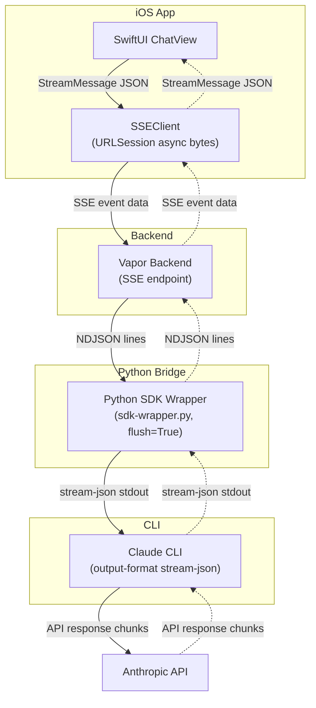
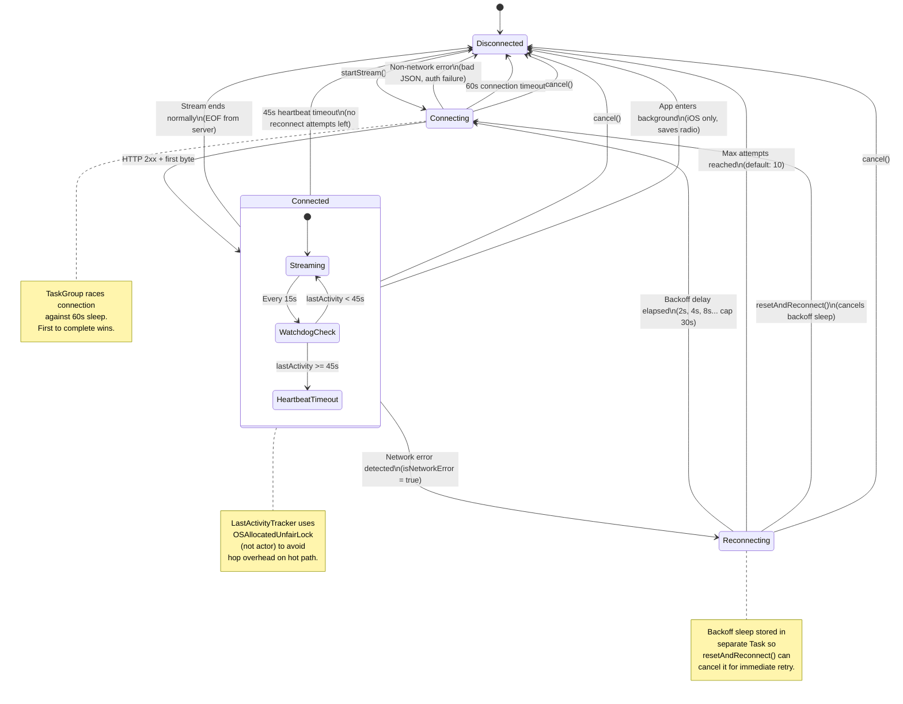
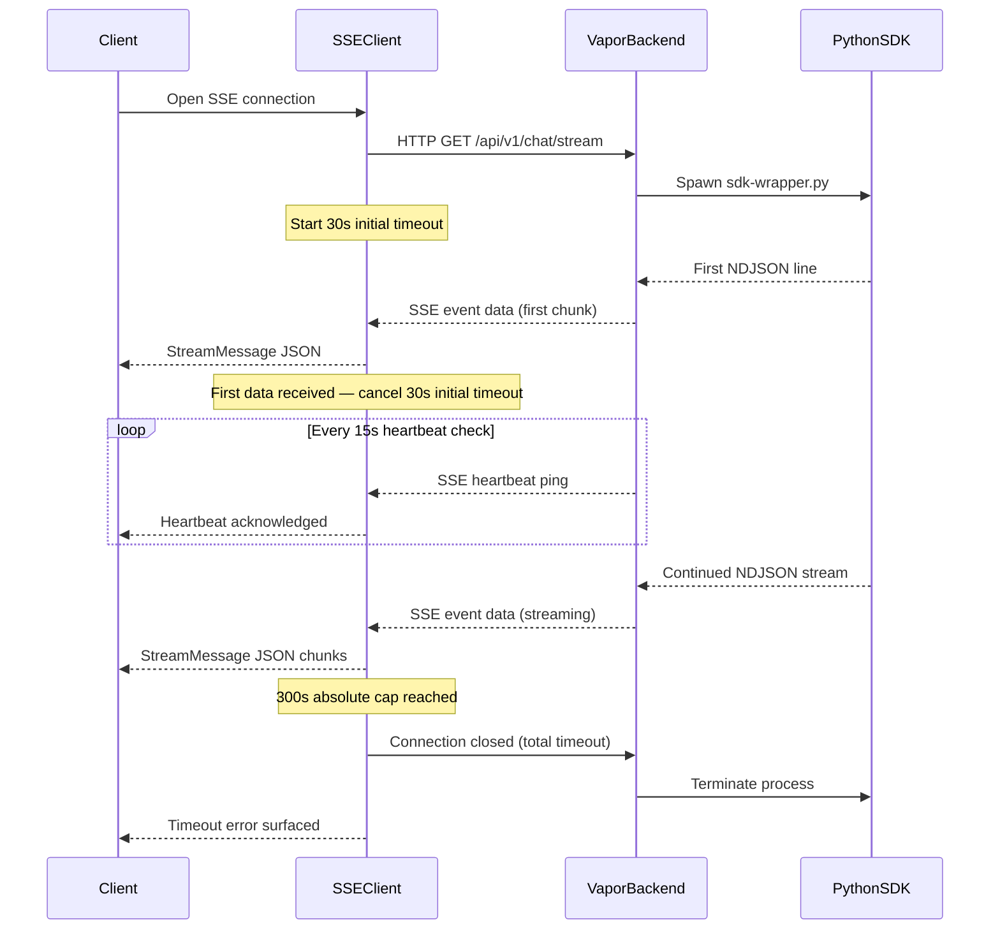
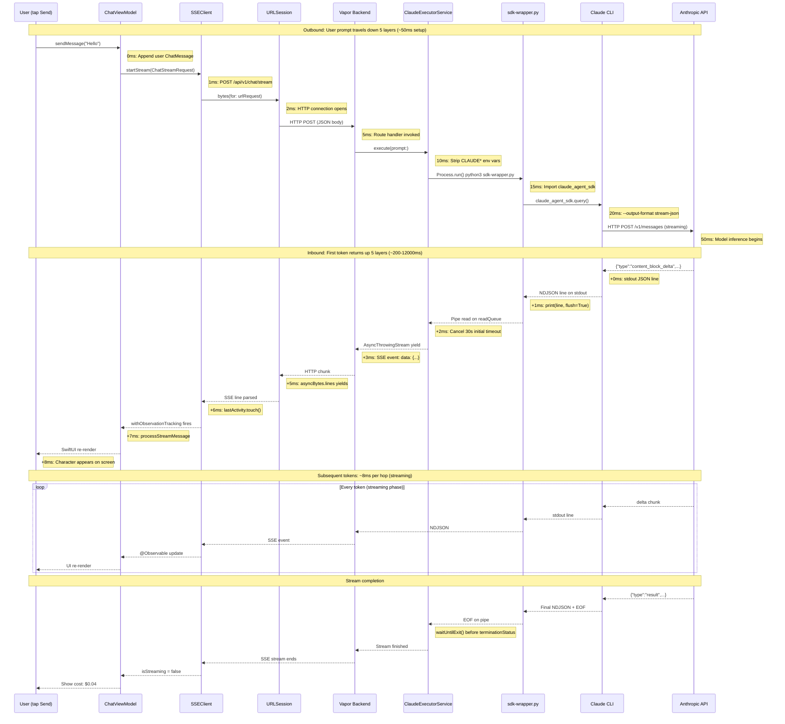

## 5-Layer SSE Bridge: iOS Streaming for Claude Code

*Agentic Development: 10 Lessons from 8,481 AI Coding Sessions*

Every token Claude generates on your behalf traverses five layers before it appears on your iPhone screen. SwiftUI view. Vapor backend. Python SDK wrapper. Claude CLI. Anthropic API. Then the whole chain reverses: API response, CLI stdout, Python NDJSON, Vapor SSE, URLSession async bytes, SwiftUI `@Observable`.

Ten hops per token. Each one a place where the stream can break, stall, duplicate, or silently disappear.

This is the story of building ILS, a native iOS and macOS client for Claude Code. Not a web wrapper. Not a thin API client. A full SwiftUI application that streams Claude's responses token-by-token over Server-Sent Events, with reconnection logic, heartbeat monitoring, environment variable stripping, and a two-character bug that took an entire session to find.

The companion repo extracts the streaming bridge as a standalone Swift package you can drop into any project.

---

### The Architecture at a Glance

Before diving into each layer, here is the full picture. The request flows down through five layers, and the response flows back up through the same five:



- **Layer 1 -- SwiftUI:** `ChatView` observes an `@Observable` `SSEClient`. The view re-renders on every new token.
- **Layer 2 -- SSE Client:** `SSEClient` opens a POST to the Vapor backend's `/api/v1/chat/stream` endpoint. Manages connection state, heartbeat watchdog, and reconnection.
- **Layer 3 -- Vapor Backend:** Spawns `python3 sdk-wrapper.py`, reads NDJSON from the subprocess stdout, and re-emits each line as an SSE event to the HTTP response.
- **Layer 4 -- Python SDK Wrapper:** Calls the `claude-agent-sdk` Python package, which wraps Claude CLI. Converts SDK events to NDJSON on stdout with `flush=True`.
- **Layer 5 -- Claude CLI:** Calls the Anthropic API with `--output-format stream-json`. Handles OAuth authentication.

Responses flow back up the same chain. Each layer adds its own failure modes.

This architecture is not what I would have designed on a whiteboard. It is what emerged from constraints and four failed attempts. Direct Anthropic API from Swift -- failed, no OAuth token available. JavaScript SDK via Node subprocess -- failed, NIO event loops do not pump RunLoop. Swift ClaudeCodeSDK in Vapor -- failed, `FileHandle.readabilityHandler` needs RunLoop which NIO does not provide. Direct CLI invocation -- failed, nesting detection blocks Claude inside Claude. The fifth attempt worked: a Python subprocess bridge with environment variable stripping.

The counterintuitive lesson: the five-layer architecture is simpler than any of the "simpler" approaches because each layer does exactly one translation with exactly one failure mode.

---

### Layer 1: The Bridge Configuration

Everything starts with a configuration struct that controls timeouts, reconnection, and network behavior:

```swift
// Sources/StreamingBridge/Configuration.swift

public struct BridgeConfiguration: Sendable {
    /// Base URL of the Vapor backend (e.g., "http://localhost:9999").
    public let backendURL: String

    /// Timeout for initial connection to receive first byte. Default: 30s.
    public let initialTimeout: TimeInterval

    /// Total timeout for the entire streaming session. Default: 300s (5 min).
    public let totalTimeout: TimeInterval

    /// Heartbeat watchdog timeout. No data for this long = connection stale. Default: 45s.
    public let heartbeatTimeout: TimeInterval

    /// Max automatic reconnection attempts on network errors. Default: 10.
    public let maxReconnectAttempts: Int

    /// Base delay for exponential backoff. Actual = min(base * 2^(attempt-1), 30s). Default: 2s.
    public let reconnectBaseDelay: TimeInterval

    /// Whether to stream over expensive networks (hotspot). Default: true.
    public let allowsExpensiveNetworkAccess: Bool

    /// Whether to stream in Low Data Mode. Default: false.
    public let allowsConstrainedNetworkAccess: Bool

    /// API path for chat streaming endpoint. Default: "/api/v1/chat/stream".
    public let streamEndpoint: String

    /// Path to Python SDK wrapper, relative to project root. Default: "scripts/sdk-wrapper.py".
    public let sdkWrapperPath: String

    public static let `default` = BridgeConfiguration()

    public init(
        backendURL: String = "http://localhost:9999",
        initialTimeout: TimeInterval = 30,
        totalTimeout: TimeInterval = 300,
        heartbeatTimeout: TimeInterval = 45,
        maxReconnectAttempts: Int = 10,
        reconnectBaseDelay: TimeInterval = 2,
        allowsExpensiveNetworkAccess: Bool = true,
        allowsConstrainedNetworkAccess: Bool = false,
        streamEndpoint: String = "/api/v1/chat/stream",
        sdkWrapperPath: String = "scripts/sdk-wrapper.py"
    ) { ... }
}
```

Three timeout values, not one. This is not over-engineering. This is the result of watching streams fail in three different ways.

The `initialTimeout` (30 seconds) catches stuck connections where the backend accepts the HTTP connection but never sends a byte. This happens when Claude is overwhelmed or when the Python subprocess fails to launch. Without this timeout, the user stares at "Connecting..." forever. Thirty seconds is long enough for Claude's extended thinking to begin producing output, but short enough that users know something is wrong if nothing happens.

The `totalTimeout` (300 seconds) caps the entire streaming session. Some prompts trigger extended thinking that can run for minutes. Five minutes is generous but bounded. Without this, a hung Claude process silently consumes battery forever. I discovered this the hard way: a prompt that triggered Claude to read a 2,000-line file and produce a refactoring plan. The response took 4 minutes 12 seconds. Any shorter total timeout would have killed a valid response.

The `heartbeatTimeout` (45 seconds) is the watchdog. Even after a healthy connection is established, the stream can go stale -- network interruption, backend crash, Claude timeout on the API side. If no data arrives for 45 seconds, the connection is declared dead. The 45-second value was chosen because Claude's longest observed thinking pauses between output tokens are around 30 seconds. Adding 50% margin gives us 45.

Notice `allowsConstrainedNetworkAccess` defaults to `false`. SSE streaming is continuous data. If the user has Low Data Mode enabled, we respect that and do not stream Claude responses over a metered connection. This is the kind of detail that is invisible in development and critical in production -- a user on a limited data plan whose phone is silently streaming bytes at a sustained rate.

---

### Layer 2: The SSE Client

The `SSEClient` is the heart of the streaming bridge. It manages the entire HTTP connection lifecycle -- from initial connection through reconnection through teardown:

```swift
// Sources/StreamingBridge/SSEClient.swift

@MainActor
@Observable
public class SSEClient {
    /// Decoded stream messages received during the current session.
    public var messages: [StreamMessage] = []

    /// Whether the client is actively streaming.
    public var isStreaming: Bool = false

    /// Current error, if any.
    public var error: Error?

    /// Current connection state.
    public var connectionState: ConnectionState = .disconnected

    /// Connection state machine.
    public enum ConnectionState: Equatable, Sendable {
        case disconnected
        case connecting
        case connected
        case reconnecting(attempt: Int)
    }
```

The connection state is an explicit enum, not a boolean. This matters for the UI. "Connecting..." is different from "Reconnecting (attempt 3)..." which is different from "Connected." The user needs to understand what is happening. A boolean `isConnected` would collapse these three meaningfully different states into two.

The `@MainActor` annotation ensures all property mutations happen on the main thread. Combined with `@Observable`, this means SwiftUI views automatically re-render when any property changes. No Combine publishers. No `NotificationCenter`. No manual `objectWillChange.send()`. The observation system handles it.

---

### The SSE Connection State Machine

The connection goes through several states with well-defined transitions. Every edge case is accounted for -- background app, network drops, timeout, cancellation:



Let me walk through the critical transitions.

**Connecting to Connected** requires both an HTTP 2xx response AND the first byte of data arriving. An HTTP 200 with an empty body is not "connected" -- it is "stuck." The connection timeout catches this.

**Connected to Reconnecting** only fires for network errors. Application-level errors (bad JSON, authentication failures, rate limits) fail immediately because retrying will not help. The `isNetworkError` check filters on the NSURLError domain:

```swift
// Sources/StreamingBridge/SSEClient.swift

private func isNetworkError(_ error: Error) -> Bool {
    let nsError = error as NSError
    let networkErrorCodes: [Int] = [
        NSURLErrorNetworkConnectionLost,
        NSURLErrorNotConnectedToInternet,
        NSURLErrorTimedOut,
        NSURLErrorCannotConnectToHost,
        NSURLErrorCannotFindHost,
        NSURLErrorDNSLookupFailed,
    ]
    return nsError.domain == NSURLErrorDomain && networkErrorCodes.contains(nsError.code)
}
```

**Connected to Disconnected on background** is iOS-specific. When the app goes to background, the SSE stream is cancelled:

```swift
// Sources/StreamingBridge/SSEClient.swift

#if os(iOS)
backgroundObserver = NotificationCenter.default.addObserver(
    forName: UIApplication.didEnterBackgroundNotification,
    object: nil,
    queue: .main
) { [weak self] _ in
    Task { @MainActor [weak self] in
        guard let self, self.isStreaming else { return }
        self.cancel()
    }
}
#endif
```

SSE keeps the cellular radio active continuously. On cellular, that is significant power drain. The user can reconnect when they return to the app. Note the `[weak self]` capture list -- without it, the notification observer would create a retain cycle keeping the SSEClient alive forever.

---

### The 60-Second Connection Race

The stream implementation races the connection against a 60-second timeout using a `TaskGroup`:

```swift
// Sources/StreamingBridge/SSEClient.swift

let urlSession = self.session
let (asyncBytes, response) = try await withThrowingTaskGroup(
    of: (URLSession.AsyncBytes, URLResponse).self
) { group in
    group.addTask {
        try await urlSession.bytes(for: urlRequest)
    }
    group.addTask {
        try await Task.sleep(nanoseconds: 60_000_000_000)
        throw URLError(.timedOut)
    }
    let result = try await group.next()!
    group.cancelAll()
    return result
}
```

Whichever finishes first wins. If the connection succeeds, the timeout task is cancelled. If 60 seconds elapse, the connection is killed. This is a common Swift concurrency pattern for racing operations, but there is a subtlety: `group.cancelAll()` is called after the first result. Without it, the losing task would continue running in the background until it naturally completes or times out, wasting resources.

This 60-second connection timeout is separate from the 30-second `initialTimeout` in the executor service. The connection timeout is for the HTTP handshake. The initial timeout is for the first byte of actual streaming data. They protect against different failure modes: "can't reach the server" versus "reached the server but it's not producing output."

---

### The Heartbeat Watchdog

Once connected, the heartbeat watchdog starts. This is the mechanism that detects stale connections mid-stream:

```swift
// Sources/StreamingBridge/SSEClient.swift

let lastActivity = LastActivityTracker()
let watchdogTimeout = configuration.heartbeatTimeout

let heartbeatWatchdog = Task.detached { [watchdogTimeout] in
    while !Task.isCancelled {
        try await Task.sleep(nanoseconds: 15_000_000_000)
        if lastActivity.secondsSinceLastActivity() > watchdogTimeout {
            throw URLError(.timedOut)
        }
    }
}
defer { heartbeatWatchdog.cancel() }
```

Every 15 seconds, the watchdog checks: has any data arrived in the last 45 seconds? If not, the connection is declared stale. The `Task.detached` is significant -- it runs outside the current actor context, which means it can fire even if the main actor is blocked. The `defer` ensures the watchdog is cancelled when the stream function exits, regardless of how it exits (normal completion, error, cancellation).

The `LastActivityTracker` is a dedicated class using `OSAllocatedUnfairLock` instead of an actor:

```swift
// Sources/StreamingBridge/SSEClient.swift

private final class LastActivityTracker: Sendable {
    private let storage = OSAllocatedUnfairLock(initialState: Date())

    func touch() {
        storage.withLock { $0 = Date() }
    }

    func secondsSinceLastActivity() -> TimeInterval {
        let last = storage.withLock { $0 }
        return Date().timeIntervalSince(last)
    }
}
```

Why not an actor? Performance. `touch()` is called on every single SSE line received. During active streaming, that is dozens of calls per second. Actor-hop overhead on every received line adds up. `OSAllocatedUnfairLock` gives us thread safety without the context switch. The lock acquisition is nanoseconds, not microseconds. On the hot path, that difference matters.

Every line received calls `lastActivity.touch()`. The SSE parsing loop touches the tracker regardless of whether the line is a message, a heartbeat comment, or an event header:

```swift
// Sources/StreamingBridge/SSEClient.swift

for try await line in asyncBytes.lines {
    lastActivity.touch()

    if line.hasPrefix("event:") {
        currentEvent = String(line.dropFirst(6)).trimmingCharacters(in: .whitespaces)
    } else if line.hasPrefix("id:") {
        lastEventId = String(line.dropFirst(3)).trimmingCharacters(in: .whitespaces)
    } else if line.hasPrefix("data:") {
        currentData = String(line.dropFirst(5)).trimmingCharacters(in: .whitespaces)
        if !currentData.isEmpty {
            await parseAndAddMessage(event: currentEvent, data: currentData)
        }
        currentEvent = ""
        currentData = ""
    } else if line.hasPrefix(":") {
        // Heartbeat/ping comment — activity already tracked
        continue
    }
}
```

The SSE comment lines (starting with `:`) are the server's heartbeat pings. They carry no data but they reset the watchdog timer. This is a standard SSE pattern: the server sends periodic empty comments to keep the connection alive through intermediary proxies and load balancers that would otherwise close idle connections.

---

### Reconnection With Exponential Backoff

When the stream drops, the client does not just retry immediately. It uses exponential backoff capped at 30 seconds:

```swift
// Sources/StreamingBridge/SSEClient.swift

private func shouldReconnect(error: Error) async -> Bool {
    guard let request = currentRequest,
          reconnectAttempts < configuration.maxReconnectAttempts,
          isNetworkError(error) else {
        return false
    }

    reconnectAttempts += 1
    connectionState = .reconnecting(attempt: reconnectAttempts)

    // Exponential backoff: 2s, 4s, 8s, 16s, 30s, 30s, 30s...
    let baseNanos = UInt64(configuration.reconnectBaseDelay * 1_000_000_000)
    let delay = min(baseNanos * UInt64(1 << (reconnectAttempts - 1)), 30_000_000_000)

    let sleepTask = Task<Void, Never> {
        try? await Task.sleep(nanoseconds: delay)
    }
    backoffSleepTask = sleepTask
    await sleepTask.value
    backoffSleepTask = nil

    if Task.isCancelled { return false }

    await performStream(request: request)
    return true
}
```

The backoff sequence for a 2-second base delay: 2s, 4s, 8s, 16s, 30s, 30s, 30s... The cap at 30 seconds prevents absurd delays. After 10 attempts (configurable), the client gives up and transitions to disconnected.

The backoff sleep is stored in a separate task property so that `resetAndReconnect()` can cancel the sleep and force an immediate retry. This gives the user a "Retry Now" button that actually works, rather than making them wait through the exponential delay:

```swift
// Sources/StreamingBridge/SSEClient.swift

public func resetAndReconnect() {
    backoffSleepTask?.cancel()
    backoffSleepTask = nil

    guard let request = currentRequest else { return }

    if !isStreaming {
        reconnectAttempts = 0
        isStreaming = true
        error = nil
        connectionState = .connecting
        streamTask = Task { [weak self] in
            await self?.performStream(request: request)
        }
    }
}
```

The `reconnectAttempts = 0` reset is intentional. When the user explicitly taps "Retry Now," it is a fresh attempt. They should get the full 10 retry budget again, not be penalized by previous automatic failures.

---

### Layer 3: The Message Type System

Every message on the SSE stream is decoded into a discriminated union. This is where Swift's type system earns its keep:

```swift
// Sources/StreamingBridge/StreamingTypes.swift

public enum StreamMessage: Codable, Sendable {
    case system(SystemMessage)
    case assistant(AssistantMessage)
    case user(UserMessage)
    case result(ResultMessage)
    case streamEvent(StreamEventMessage)
    case error(StreamError)

    public init(from decoder: Decoder) throws {
        let container = try decoder.container(keyedBy: CodingKeys.self)
        let type = try container.decode(String.self, forKey: .type)

        switch type {
        case "system":    self = .system(try SystemMessage(from: decoder))
        case "assistant": self = .assistant(try AssistantMessage(from: decoder))
        case "user":      self = .user(try UserMessage(from: decoder))
        case "result":    self = .result(try ResultMessage(from: decoder))
        case "streamEvent": self = .streamEvent(try StreamEventMessage(from: decoder))
        case "error":     self = .error(try StreamError(from: decoder))
        default:
            throw DecodingError.dataCorruptedError(
                forKey: .type, in: container,
                debugDescription: "Unknown stream message type: \(type)"
            )
        }
    }
}
```

The `type` field in the JSON drives the decode. This is Claude Code's native streaming format, not something invented for ILS. The bridge has to handle every message type the CLI can produce.

Six message types, each carrying different data. A `system` message arrives first with the session ID and available tools. `assistant` messages carry content blocks -- text, tool use, thinking. `streamEvent` messages carry character-by-character deltas. `result` comes last with token usage and cost. `error` can arrive at any point.

Content blocks within assistant messages are similarly discriminated:

```swift
// Sources/StreamingBridge/StreamingTypes.swift

public enum ContentBlock: Codable, Sendable {
    case text(TextBlock)
    case toolUse(ToolUseBlock)
    case toolResult(ToolResultBlock)
    case thinking(ThinkingBlock)

    public init(from decoder: Decoder) throws {
        let container = try decoder.container(keyedBy: CodingKeys.self)
        let type = try container.decode(String.self, forKey: .type)

        switch type {
        case "text":
            self = .text(try TextBlock(from: decoder))
        case "tool_use", "toolUse":
            self = .toolUse(try ToolUseBlock(from: decoder))
        case "tool_result", "toolResult":
            self = .toolResult(try ToolResultBlock(from: decoder))
        case "thinking":
            self = .thinking(try ThinkingBlock(from: decoder))
        default:
            self = .text(TextBlock(text: "[Unknown block type: \(type)]"))
        }
    }
}
```

Notice both `"tool_use"` and `"toolUse"` are accepted. Claude Code uses snake_case internally. The Vapor backend may normalize to camelCase. The bridge handles both, because in production you never control the entire pipeline perfectly. The same dual-case handling appears in the `StreamDelta` decoder:

```swift
// Sources/StreamingBridge/StreamingTypes.swift

public enum StreamDelta: Codable, Sendable {
    case textDelta(String)
    case inputJsonDelta(String)
    case thinkingDelta(String)

    public init(from decoder: Decoder) throws {
        let container = try decoder.container(keyedBy: CodingKeys.self)
        let type = try container.decode(String.self, forKey: .type)
        switch type {
        case "text_delta", "textDelta":
            let text = try container.decode(String.self, forKey: .text)
            self = .textDelta(text)
        case "thinking_delta", "thinkingDelta":
            let thinking = try container.decode(String.self, forKey: .thinking)
            self = .thinkingDelta(thinking)
        case "input_json_delta", "inputJsonDelta":
            let json = try container.decode(String.self, forKey: .partialJson)
            self = .inputJsonDelta(json)
        default:
            self = .textDelta("")
        }
    }
}
```

The `default` case returns an empty text delta instead of throwing. This is defensive -- if Claude Code adds a new delta type in a future version, the bridge degrades gracefully instead of crashing. Unknown message types at the top level throw because an unknown type could indicate a protocol mismatch. Unknown delta types silently skip because they are incremental content that can be safely ignored.

The result message carries token usage and cost:

```swift
// Sources/StreamingBridge/StreamingTypes.swift

public struct ResultMessage: Codable, Sendable {
    public let type: String
    public let subtype: String
    public let sessionId: String
    public let durationMs: Int?
    public let isError: Bool
    public let numTurns: Int?
    public let totalCostUSD: Double?
    public let usage: UsageInfo?
    public let result: String?
}

public struct UsageInfo: Codable, Sendable {
    public let inputTokens: Int
    public let outputTokens: Int
    public let cacheReadInputTokens: Int?
    public let cacheCreationInputTokens: Int?
}
```

This is how you show "$0.04" next to each response in the UI. The cost data comes from Claude Code itself, through five layers, into a `Codable` struct on the client. The `cacheReadInputTokens` field tells you how much prompt caching saved. In a long conversation, this can reduce costs by 90%.

---

### Layer 4: The Executor Service and the Nesting Detection Bug

The `ClaudeExecutorService` spawns the Python SDK wrapper as a subprocess. This is where the most painful bug in the entire project lives.

Claude CLI has nesting detection. If the environment variable `CLAUDECODE=1` is set, or any `CLAUDE_CODE_*` variables exist, the CLI assumes it is being called from inside an active Claude Code session and refuses to execute. No error message. No stderr output. Just silence.

Let me tell you how long this took to figure out.

I had the entire five-layer pipeline working. The SSEClient connected. The Vapor backend accepted requests. The Python SDK wrapper launched. And then... nothing. Zero bytes on stdout. Zero bytes on stderr. The process started, ran for a moment, and exited with code 0. Success, apparently. But with no output.

I added logging to every layer. The Python wrapper was executing. The `claude_agent_sdk.query()` call was being made. No exception. No error. Just silence.

I ran the same Python command manually in a terminal. It worked perfectly. Claude responded. Tokens streamed. Everything was fine.

Then I ran it from inside the Vapor backend process. Silence.

Then I ran it from inside any subprocess launched from Claude Code. Silence.

I compared `env` between a working terminal and a subprocess launched from Vapor. There it was: `CLAUDECODE=1` and a dozen `CLAUDE_CODE_*` variables. The Vapor backend was running inside a Claude Code session (because I was developing it with Claude Code), so every subprocess it spawned inherited these environment variables. And Claude CLI, seeing those variables, quietly assumed it was being nested and refused to operate.

The fix is three lines of code. Finding those three lines cost a full debugging session.

```swift
// Sources/StreamingBridge/ClaudeExecutorService.swift

// CRITICAL: Strip CLAUDE* env vars to prevent nesting detection.
// Without this, Claude CLI silently refuses to execute inside
// an active Claude Code session — no error, no stderr, just
// a zero-byte response.
let cleanCmd = """
    for v in $(env | grep ^CLAUDE | cut -d= -f1); do unset $v; done; \(command)
    """
process.arguments = ["-l", "-c", cleanCmd]

// Belt-and-suspenders: also strip from Process.environment
var env = ProcessInfo.processInfo.environment
for key in env.keys where key.hasPrefix("CLAUDE") {
    env.removeValue(forKey: key)
}
process.environment = env
```

Belt and suspenders. The shell command unsets them. The `Process.environment` also strips them. Because I never want to debug this again.

The shell command approach (`for v in $(env | grep ^CLAUDE | cut -d= -f1); do unset $v; done`) strips variables at the shell level before the Python process even starts. The `Process.environment` approach strips them at the Foundation level when configuring the subprocess. Either one alone would work. Both together guarantee it.

Why does the CLI not produce an error message when it detects nesting? Good question. From the CLI's perspective, nesting is not an error -- it is a design constraint. Running Claude inside Claude can create infinite recursion, consume unbounded API credits, and produce confusing nested session states. The silent refusal is intentional. But from the perspective of someone building a tool that legitimately needs to invoke Claude from a subprocess, it is a maddening debugging experience.

---

### The Two-Tier Timeout Mechanism

The executor service uses two timeouts implemented with GCD `DispatchWorkItem`s:

```swift
// Sources/StreamingBridge/ClaudeExecutorService.swift

let didTimeout = AtomicBool(false)

let timeoutWork = DispatchWorkItem {
    didTimeout.value = true
    process.terminate()
    outputPipe.fileHandleForReading.closeFile()
}
DispatchQueue.global().asyncAfter(
    deadline: .now() + config.initialTimeout,
    execute: timeoutWork
)

let totalTimeoutWork = DispatchWorkItem {
    if process.isRunning {
        didTimeout.value = true
        process.terminate()
        outputPipe.fileHandleForReading.closeFile()
    }
}
DispatchQueue.global().asyncAfter(
    deadline: .now() + config.totalTimeout,
    execute: totalTimeoutWork
)
```

The initial timeout fires if no data arrives within 30 seconds. It is cancelled as soon as the first byte of stdout data arrives:

```swift
// In the readStdout loop:
let chunk = handle.availableData
if chunk.isEmpty { break }

// Cancel the initial timeout on first data received
timeoutWork.cancel()
buffer.append(chunk)
```

The total timeout runs for the entire session (300 seconds). It cannot be cancelled by data arriving -- it is the absolute cap. Even if Claude is actively streaming, five minutes is the maximum.

The `AtomicBool` shares the timeout state safely across GCD queues:

```swift
// Sources/StreamingBridge/ClaudeExecutorService.swift

private final class AtomicBool: @unchecked Sendable {
    private var _value: Bool
    private let lock = NSLock()
    init(_ value: Bool) { _value = value }
    var value: Bool {
        get { lock.lock(); defer { lock.unlock() }; return _value }
        set { lock.lock(); defer { lock.unlock() }; _value = newValue }
    }
}
```

When the timeout fires, `didTimeout.value` is set to `true`. When the stdout reader finishes and checks the exit code, it reads `didTimeout.value` to distinguish between "process timed out" and "process failed for another reason." This distinction matters for the error message shown to the user -- "Claude timed out, try again" is actionable. "Process exited with code 1" is not.

The timeout timeline visualized:



The full message flow with timing annotations:



---

### The NSTask Termination Status Crash

Here is a bug that only manifests under race conditions and crashes your app with an Objective-C exception that Swift cannot catch:

```swift
// Sources/StreamingBridge/ClaudeExecutorService.swift

// CRITICAL: Always call waitUntilExit() before terminationStatus.
// Reading EOF from stdout does NOT mean the process has exited.
// Accessing terminationStatus on a running Process throws
// NSInvalidArgumentException.
process.waitUntilExit()
timeoutWork.cancel()
totalTimeoutWork.cancel()

let exitCode = process.terminationStatus
```

Let me explain why this exists and why it is so dangerous.

When the stdout pipe sends EOF, the intuition is "the process is done." The pipe is closed, there is no more data, the process must have exited. Wrong. There is a race between the pipe closing and the process exiting. The process closes stdout, but it may still be running cleanup code -- flushing stderr, releasing resources, running atexit handlers. This gap can be microseconds or milliseconds.

If you read `terminationStatus` during that gap, Foundation throws `NSInvalidArgumentException`. This is not a Swift `Error` you can catch with `do/catch`. It is an Objective-C exception that unwinds the stack and crashes the process. There is no recovery.

The fix is one line: `process.waitUntilExit()`. This blocks the current thread until the process has actually terminated. Only then is `terminationStatus` safe to read.

But finding that one line required a crash report, a stack trace pointing into Foundation's `NSConcreteTask` implementation, and the realization that pipe EOF and process exit are two different events that happen in no guaranteed order.

I spent the better part of an afternoon on this. The crash was intermittent -- it only happened when Claude returned very short responses (one line) that the process could finish before the pipe reader had time to process. Longer responses never triggered it because the pipe reader was still consuming data when the process exited.

The `timeoutWork.cancel()` and `totalTimeoutWork.cancel()` after `waitUntilExit()` are cleanup. Once the process has exited, the timeout work items are no longer needed. Without cancellation, a timeout could fire after the process has already exited, attempting to `terminate()` a dead process (harmless but wasteful) or close an already-closed pipe (crashes on some OS versions).

---

### The Stdout Reader: Why Not Actors, Why Not RunLoop

The stdout reader runs on a dedicated GCD queue:

```swift
// Sources/StreamingBridge/ClaudeExecutorService.swift

self.readQueue.async {
    Self.readStdout(
        pipe: outputPipe,
        errorPipe: errorPipe,
        process: process,
        sessionId: resolvedSessionId,
        didTimeout: didTimeout,
        timeoutWork: timeoutWork,
        totalTimeoutWork: totalTimeoutWork,
        continuation: continuation,
        executor: self
    )
}
```

Not the main queue. Not an actor. A raw `DispatchQueue`. This deserves explanation.

The original implementation used the `ClaudeCodeSDK` Swift package directly in the Vapor backend. The SDK uses `FileHandle.readabilityHandler` and Combine's `PassthroughSubject` to emit data as it arrives on stdout. These mechanisms require `RunLoop` to work.

Vapor uses SwiftNIO, which runs on `EventLoop`s, not `RunLoop`. The NIO event loops never pump `RunLoop`. The result: `FileHandle.readabilityHandler` is set, but the handler is never called. The Combine publisher is created, but it never emits. The data is there on the pipe. The OS has delivered it. The file handle has it. But the notification mechanism cannot fire because nobody is pumping the run loop.

Months of debugging led to: bypass the SDK entirely. Use `Process` with a raw GCD queue for stdout reads. Call `handle.availableData` in a synchronous loop. Each chunk is decoded line-by-line and yielded to an `AsyncThrowingStream`:

```swift
// Sources/StreamingBridge/ClaudeExecutorService.swift

let handle = pipe.fileHandleForReading
let decoder = JSONDecoder()
decoder.keyDecodingStrategy = .convertFromSnakeCase
var buffer = Data()

while true {
    let chunk = handle.availableData
    if chunk.isEmpty { break }

    timeoutWork.cancel()  // Cancel initial timeout on first data
    buffer.append(chunk)

    guard let bufferString = String(data: buffer, encoding: .utf8) else { continue }

    let lines = bufferString.components(separatedBy: "\n")
    if lines.count > 1 {
        for i in 0..<(lines.count - 1) {
            let line = lines[i].trimmingCharacters(in: .whitespacesAndNewlines)
            if !line.isEmpty {
                processJsonLine(line, decoder: decoder, continuation: continuation)
            }
        }
        let lastLine = lines[lines.count - 1]
        buffer = lastLine.data(using: .utf8) ?? Data()
    }
}
```

The buffer management handles UTF-8 boundary issues. A chunk of data from the pipe might split a multi-byte character across two reads. By keeping the last incomplete line in the buffer and only processing lines that have a terminating newline, we avoid decoding partial UTF-8 sequences.

The `processJsonLine` method decodes each line independently:

```swift
private static func processJsonLine(
    _ line: String,
    decoder: JSONDecoder,
    continuation: AsyncThrowingStream<StreamMessage, Error>.Continuation
) {
    guard let data = line.data(using: .utf8) else { return }
    do {
        let message = try decoder.decode(StreamMessage.self, from: data)
        continuation.yield(message)
    } catch {
        #if DEBUG
        print("[ClaudeExecutor] Failed to decode: \(error) — line: \(line.prefix(200))")
        #endif
    }
}
```

A malformed line is logged but does not kill the stream. This is important because Claude Code occasionally emits lines that are not valid JSON -- progress indicators, debug output, empty lines. The stream should survive those gracefully.

---

### Layer 5: The Python SDK Wrapper

Between the Vapor backend and Claude CLI sits a Python script. This layer exists because the Claude Agent SDK is a Python package, and calling it from Swift requires a subprocess bridge.

```python
# scripts/sdk-wrapper.py

def emit(obj):
    """Write a JSON object as an NDJSON line to stdout."""
    line = json.dumps(obj, separators=(",", ":"))
    sys.stdout.write(line + "\n")
    sys.stdout.flush()
```

The `flush=True` (via explicit `sys.stdout.flush()`) on every write is the most important line in this file. Without it, Python's output buffering delays events by unpredictable amounts.

Here is what happens without the flush. Python buffers stdout by default when stdout is a pipe (not a terminal). When you call `print()`, the output accumulates in an internal buffer -- typically 4KB or 8KB. The buffer flushes when it is full, when the process exits, or when you explicitly request it. For a streaming application, this means:

1. User sends "Hi" to Claude.
2. Claude responds immediately.
3. The Python wrapper buffers the response.
4. The Vapor backend sees nothing.
5. The iOS client shows "Connecting..." for 30 seconds.
6. Eventually enough data accumulates to fill the buffer, or Claude finishes.
7. Everything arrives in one burst.

This bug does not exist if you test the Python script in isolation. When stdout is a terminal, Python uses line buffering -- each `print()` with a newline flushes immediately. The buffering only engages when stdout is a pipe to another process. Another example of an integration boundary bug that no unit test catches.

The wrapper converts Claude Agent SDK events to the `StreamMessage` format using `isinstance()` dispatch:

```python
# scripts/sdk-wrapper.py

async for message in query(prompt=prompt, options=options):
    if isinstance(message, AssistantMessage):
        content_blocks = [convert_content_block(b) for b in message.content]
        emit({
            "type": "assistant",
            "message": {
                "role": "assistant",
                "content": content_blocks,
                "model": getattr(message, "model", None),
            },
        })

    elif isinstance(message, ResultMessage):
        result = {
            "type": "result",
            "subtype": "error" if message.is_error else "success",
            "is_error": message.is_error,
            "session_id": getattr(message, "session_id", session_id),
            "total_cost_usd": message.total_cost_usd or 0.0,
        }
        emit(result)
```

The `isinstance()` checks follow the official Claude Agent SDK documentation. Early versions used `getattr()` to check for message types, which broke when the SDK renamed internal attributes. Using `isinstance()` with the public type classes is the correct, forward-compatible pattern.

The `convert_content_block` function handles the same type discrimination for content blocks:

```python
# scripts/sdk-wrapper.py

def convert_content_block(block):
    from claude_agent_sdk import (
        TextBlock, ThinkingBlock, ToolUseBlock, ToolResultBlock,
    )

    if isinstance(block, TextBlock):
        return {"type": "text", "text": block.text}
    elif isinstance(block, ToolUseBlock):
        return {
            "type": "tool_use",
            "id": block.id,
            "name": block.name,
            "input": block.input,
        }
    elif isinstance(block, ToolResultBlock):
        return {
            "type": "tool_result",
            "tool_use_id": block.tool_use_id,
            "content": block.content,
            "is_error": getattr(block, "is_error", False),
        }
    elif isinstance(block, ThinkingBlock):
        return {"type": "thinking", "thinking": block.thinking}
    else:
        text = getattr(block, "text", None) or str(block)
        return {"type": "text", "text": text}
```

The fallback `else` clause converts unknown block types to text. This is the same defensive pattern used in the Swift decoder -- degrade gracefully rather than crash on unrecognized types.

---

### The Two-Character Bug: += vs =

This bug deserves its own deep dive because it is the purest example of how streaming introduces failure modes that do not exist in request-response architectures.

The `SSEClient` receives two kinds of text events. An `assistant` event contains the accumulated text so far. A `streamEvent` with a `textDelta` contains only the new characters since the last delta.

Here is the timeline of a normal streaming response for the prompt "What is 2+2?":

```
Time 0ms:   assistant { content: [{ text: "The" }] }
Time 50ms:  streamEvent { delta: { type: "textDelta", text: " answer" } }
Time 100ms: assistant { content: [{ text: "The answer" }] }
Time 150ms: streamEvent { delta: { type: "textDelta", text: " is" } }
Time 200ms: assistant { content: [{ text: "The answer is" }] }
Time 250ms: streamEvent { delta: { type: "textDelta", text: " 4." } }
Time 300ms: assistant { content: [{ text: "The answer is 4." }] }
```

Notice: each `assistant` event contains the FULL text up to that point. "The", then "The answer", then "The answer is", then "The answer is 4." These are authoritative snapshots, not deltas.

The `textDelta` events contain ONLY the new characters: " answer", " is", " 4."

Now here is what happens with the wrong operator:

```swift
// BUG: Using += with assistant events
case .assistant(let assistantMsg):
    for block in assistantMsg.content {
        case .text(let textBlock):
            currentMessage.text += textBlock.text  // WRONG: +=
```

```
Time 0ms:   text = "" + "The" = "The"                    (OK)
Time 100ms: text = "The" + "The answer" = "TheThe answer"  (WRONG)
Time 200ms: text = "TheThe answer" + "The answer is" = "TheThe answerThe answer is" (WORSE)
```

With assignment instead of append:

```swift
// FIX: Using = with assistant events
case .text(let textBlock):
    currentMessage.text = textBlock.text  // CORRECT: =
```

```
Time 0ms:   text = "The"                (OK)
Time 100ms: text = "The answer"          (OK)
Time 200ms: text = "The answer is"       (OK)
Time 300ms: text = "The answer is 4."    (OK)
```

The correct code from the companion repo:

```swift
// Example/Sources/ExampleApp/ChatViewModel.swift

case .assistant(let assistantMsg):
    for block in assistantMsg.content {
        switch block {
        case .text(let textBlock):
            // CRITICAL: Use assignment, not append.
            // The assistant event contains accumulated text.
            // Using += would duplicate: "Hello" -> "HelloHello"
            currentMessage.text = textBlock.text
        // ...

case .streamEvent(let event):
    switch delta {
    case .textDelta(let text):
        // For deltas, += is correct — each delta is incremental
        currentMessage.text += text
```

Two characters. The difference between `=` and `+=`. One produces a working chat interface. The other produces gibberish that doubles in size with every event.

The comment in the source code is emphatic for a reason. This bug was identified as a P2 severity issue. The `SSEClient` header documents it as a permanent warning:

```swift
// Sources/StreamingBridge/SSEClient.swift (class documentation)

/// ## The Text Duplication Bug (P2)
///
/// A critical lesson from production: the `+=` vs `=` distinction matters
/// for assistant messages. Each `assistant` event contains the **accumulated**
/// text, not just the new token. Using `+=` on an already-accumulated string
/// produces exact duplication. The fix: use `=` (assignment) for assistant
/// events, `+=` only for `textDelta` stream events.
```

The second root cause compounded the duplication. The stream-end handler in the `ChatViewModel` reset the `lastProcessedMessageIndex` to zero:

```swift
// BUG: Resetting the index replays all messages
self.lastProcessedMessageIndex = 0

// FIX: Preserve the high-water mark
let finalCount = client.messages.count
self.lastProcessedMessageIndex = finalCount
```

When `lastProcessedMessageIndex` resets to zero, the next observation cycle processes every message from the beginning. Messages that were already rendered get rendered again. On top of the `+=` duplication, this produced a second layer of duplication. The visual effect: tokens would appear, double, then the entire response would replay from the start.

---

### Building Real-Time Streaming UIs in SwiftUI

The `ChatViewModel` ties the SSE client to the SwiftUI view layer. The key pattern is `withObservationTracking` -- Swift's native observation mechanism that replaced Combine's `@Published`:

```swift
// Example/Sources/ExampleApp/ChatViewModel.swift

observationTask = Task { @MainActor [weak self] in
    var lastStreaming = client.isStreaming
    var lastMessageCount = 0

    while let self, !Task.isCancelled {
        await withCheckedContinuation { continuation in
            withObservationTracking {
                _ = client.isStreaming
                _ = client.error
                _ = client.connectionState
                _ = client.messages
            } onChange: {
                continuation.resume()
            }
        }
        guard !Task.isCancelled else { break }

        // Sync streaming state
        let streaming = client.isStreaming
        if streaming != lastStreaming {
            self.isStreaming = streaming
            if streaming {
                self.streamTokenCount = 0
                self.lastProcessedMessageIndex = 0
            } else {
                // CRITICAL: Preserve the high-water mark to prevent replay
                let finalCount = client.messages.count
                self.lastProcessedMessageIndex = finalCount
            }
            lastStreaming = streaming
        }

        // Process new messages
        let msgs = client.messages
        if msgs.count > lastMessageCount {
            let newMessages = Array(msgs.suffix(from: self.lastProcessedMessageIndex))
            for streamMessage in newMessages {
                self.processStreamMessage(streamMessage)
            }
            self.lastProcessedMessageIndex = msgs.count
            lastMessageCount = msgs.count
        }
    }
}
```

No Combine. No `NotificationCenter` for state sync. Pure `@Observable` with explicit observation tracking. This is the modern SwiftUI pattern for bridging between a service object and a view model.

The `withObservationTracking` block reads four properties. When any of them changes, the `onChange` closure fires and the continuation resumes. The while loop then processes the new state and suspends again waiting for the next change. This is essentially a reactive event loop built on structured concurrency.

The UI itself is straightforward once the observation is set up:

```swift
// Example/Sources/ExampleApp/ChatView.swift

ScrollViewReader { proxy in
    ScrollView {
        LazyVStack(alignment: .leading, spacing: 12) {
            ForEach(viewModel.messages) { message in
                MessageBubble(message: message)
                    .id(message.id)
            }
        }
        .padding()
    }
    .onChange(of: viewModel.messages.count) {
        if let lastMessage = viewModel.messages.last {
            withAnimation(.easeOut(duration: 0.2)) {
                proxy.scrollTo(lastMessage.id, anchor: .bottom)
            }
        }
    }
}
```

Auto-scrolling uses `ScrollViewReader` with `onChange(of: viewModel.messages.count)`. Every time a new message appears or an existing message updates, the scroll view animates to the bottom. The `LazyVStack` ensures only visible messages are rendered -- important when conversations grow long.

The streaming stats bar shows real-time token count and elapsed time:

```swift
if viewModel.isStreaming {
    HStack {
        Text("~\(viewModel.streamTokenCount) tokens")
        Spacer()
        Text(String(format: "%.1fs", viewModel.streamElapsedSeconds))
    }
    .font(.caption2)
    .foregroundStyle(.tertiary)
    .padding(.horizontal)
    .padding(.top, 4)
}
```

The token count is approximate -- `currentMessage.text.count / 4` -- because accurate token counting requires a tokenizer that the client does not have. The approximation is close enough for a progress indicator.

---

### Performance: Cold Start vs Warm

The five-layer architecture has measurable latency characteristics.

**Cold start (~12 seconds):** The first request after the backend starts. Python needs to import `claude_agent_sdk` (2-3 seconds), the SDK authenticates via Claude CLI's OAuth flow (3-5 seconds), and the API processes the first request (2-4 seconds). The user sees "Connecting..." for this entire duration.

**Warm start (~2-3 seconds):** Subsequent requests reuse the authenticated session. The Python import is cached by the OS. The SDK does not re-authenticate. The latency is dominated by API processing time.

**Per-token latency (~8ms):** Once streaming is established, each token traverses the full five-layer chain in approximately 8 milliseconds. The breakdown:

| Hop | Latency | What happens |
|-----|---------|-------------|
| API to CLI | ~0ms | Same process, stdout write |
| CLI to Python | ~1ms | Pipe read, NDJSON format |
| Python to Vapor | ~1ms | Pipe read, SSE format |
| Vapor to URLSession | ~3ms | HTTP chunk delivery |
| URLSession to SwiftUI | ~3ms | Decode, observation tracking, render |

The 3ms for HTTP delivery is the dominant factor. On localhost this is fast. Over a network (when using a Cloudflare tunnel for remote access), this jumps to 50-100ms per token, and the streaming feels noticeably choppier.

The `connectingTooLong` timer in the ChatViewModel provides UX for the cold start case:

```swift
// Example/Sources/ExampleApp/ChatViewModel.swift

private func startConnectingTimer() {
    connectingTimer?.cancel()
    connectingTooLong = false
    connectingTimer = Task { @MainActor [weak self] in
        try? await Task.sleep(nanoseconds: 5_000_000_000)
        guard !Task.isCancelled else { return }
        self?.connectingTooLong = true
    }
}
```

After 5 seconds of "Connecting...", the status changes to "Taking longer than expected..." This sets expectations without alarming the user. Five seconds is the threshold where users start wondering if something is broken.

---

### Putting It All Together

The public API of the streaming bridge is deliberately simple. All the complexity is encapsulated:

```swift
// Example/Sources/ExampleApp/ChatViewModel.swift

func sendMessage(_ text: String) {
    guard let sseClient else { return }
    messages.append(ChatMessage(isUser: true, text: text))
    let request = ChatStreamRequest(prompt: text)
    sseClient.startStream(request: request)
}
```

One line to add the user message. One line to create the request. One line to start the stream. Behind those three lines: connection state machines, heartbeat watchdogs, environment variable stripping, exponential backoff, two-tier timeouts, UTF-8 buffer management, discriminated union decoders, and five layers of process orchestration.

---

### The Four Failed Architectures

Before the five-layer architecture, there were four failed attempts. Each one taught a lesson about why the current design exists.

**Attempt 1: Direct Anthropic API from Swift.** The simplest possible approach. Call the Anthropic Messages API directly from the iOS client using `URLSession`. Problem: Claude Code uses OAuth authentication. The OAuth token is managed by the Claude CLI. There is no public API to obtain it from Swift. You would need users to manually enter an API key, which defeats the purpose of building on Claude Code's authentication infrastructure. Abandoned after two hours.

**Attempt 2: JavaScript SDK via Node subprocess.** The `@anthropic-ai/sdk` npm package supports streaming. The idea: spawn a Node.js process from the Vapor backend, pipe its stdout. Problem: the Node runtime is not bundled with macOS or iOS. Installing Node as a dependency of a native app is a non-starter for distribution. Even for local development, managing Node, npm, and package versions alongside Swift adds operational complexity that defeats the simplicity goal. Abandoned after one session.

**Attempt 3: Swift ClaudeCodeSDK in Vapor.** Anthropic provides a Swift SDK for Claude Code. Import it directly into the Vapor backend. The SDK would handle authentication, streaming, and response parsing. This was the most promising approach -- same language, same ecosystem, direct integration.

It failed spectacularly.

The SDK uses `FileHandle.readabilityHandler` to receive data from the Claude CLI subprocess. This handler is dispatched via `RunLoop`. Vapor runs on SwiftNIO, which uses `EventLoop`s -- not `RunLoop`. The NIO event loops never pump the run loop. So `readabilityHandler` is set, the data arrives on the pipe, the file handle has it, but the notification callback never fires. The data is there. The mechanism to deliver it is broken.

I spent three sessions debugging this. The symptoms were maddening: the subprocess launched correctly, Claude was producing output (verified by redirecting stdout to a file), but the Swift code never received a single byte. Adding `RunLoop.current.run()` calls in strategic places fixed the immediate issue but deadlocked the NIO event loop, hanging the entire server.

The root cause is a fundamental incompatibility between two concurrency models. RunLoop is Apple's legacy event dispatch mechanism. EventLoop is NIO's asynchronous I/O mechanism. They cannot cooperate because they both want to own the thread.

**Attempt 4: Direct Claude CLI invocation.** Spawn `claude -p "prompt" --output-format stream-json` directly from the Vapor backend. No Python. No SDK. Just a Process with stdout parsing.

It worked. For about five minutes. Then I noticed it only worked when I ran the backend from a regular terminal. When I ran the backend from inside a Claude Code session (which was my entire development workflow), the CLI silently produced zero output.

This is the nesting detection bug described in Layer 4. The `CLAUDECODE=1` environment variable blocks nested execution. The fix (environment variable stripping) eventually made it into the fifth attempt, but at the time of Attempt 4, I did not understand why the CLI was silent. I just knew it did not work.

**Attempt 5: Python subprocess bridge with environment stripping.** This is the architecture that shipped. The Python Agent SDK wraps the Claude CLI, handles authentication, and streams NDJSON. The Swift backend reads the NDJSON from the subprocess stdout and re-emits it as SSE events. Environment variables are stripped before spawning.

Why did a five-layer architecture succeed where simpler approaches failed? Because each layer solves exactly one problem:

| Layer | Problem Solved |
|-------|---------------|
| SwiftUI + SSEClient | Render streaming text with reconnection UI |
| Vapor Backend | HTTP endpoint with SSE framing |
| Python SDK Wrapper | Claude Agent SDK integration with NDJSON output |
| Environment Stripping | Nesting detection bypass |
| Claude CLI | OAuth authentication and API access |

Each layer has exactly one failure mode. When something breaks, you know which layer to look at. The "simpler" approaches combined multiple concerns into fewer layers, making failures harder to diagnose.

---

### Layer 3.5: The Vapor SSE Endpoint

I have not shown the Vapor backend code yet because it is the thinnest layer in the stack. But it has its own subtleties.

The SSE endpoint receives the chat request, spawns the Python subprocess, and re-emits each NDJSON line as an SSE event:

```swift
// Vapor route handler (simplified from ILS backend)
app.post("api", "v1", "chat", "stream") { req async throws -> Response in
    let chatRequest = try req.content.decode(ChatStreamRequest.self)

    let response = Response(status: .ok)
    response.headers.add(name: .contentType, value: "text/event-stream")
    response.headers.add(name: .cacheControl, value: "no-cache")
    response.headers.add(name: .connection, value: "keep-alive")

    // The response body is an AsyncStream of SSE-formatted bytes
    response.body = .init(asyncStream: { writer in
        let executor = ClaudeExecutorService(configuration: .default)
        let stream = executor.execute(prompt: chatRequest.prompt)

        do {
            for try await message in stream {
                let data = try JSONEncoder().encode(message)
                let sseEvent = "data: \(String(data: data, encoding: .utf8)!)\n\n"
                try await writer.write(.buffer(ByteBuffer(string: sseEvent)))
            }
        } catch {
            let errorEvent = "data: {\"type\":\"error\",\"code\":\"STREAM_ERROR\"}\n\n"
            try? await writer.write(.buffer(ByteBuffer(string: errorEvent)))
        }

        try await writer.write(.end)
    })

    return response
}
```

Three headers are critical for SSE:
- `Content-Type: text/event-stream` tells the client this is an SSE connection, not a regular HTTP response.
- `Cache-Control: no-cache` prevents proxies from buffering the stream.
- `Connection: keep-alive` prevents the connection from being closed after the first chunk.

Each SSE event is formatted as `data: {json}\n\n`. The double newline terminates the event. The client's SSE parser splits on these double newlines to extract individual events. A missing newline means the event is not yet complete; the parser waits for more data.

The heartbeat ping is a periodic SSE comment:

```swift
// Heartbeat task running alongside the stream
let heartbeat = Task {
    while !Task.isCancelled {
        try await Task.sleep(nanoseconds: 30_000_000_000)
        try await writer.write(.buffer(ByteBuffer(string: ": heartbeat\n\n")))
    }
}
defer { heartbeat.cancel() }
```

The `:` prefix marks it as an SSE comment. The client receives it (triggering `lastActivity.touch()`) but does not parse it as a message. This keeps the connection alive through load balancers that close idle connections after 30-60 seconds.

---

### Debugging the Streaming Pipeline: A Methodology

When a token does not appear on screen, the bug could be in any of five layers. Here is the methodology I developed for isolating streaming issues.

**Step 1: Check if Claude is responding at all.** Run the Python wrapper directly:

```bash
python3 scripts/sdk-wrapper.py '{"prompt":"Say hi","options":{}}'
```

If this produces NDJSON output, layers 4-5 are working. If silence, check for `CLAUDECODE=1` in the environment.

**Step 2: Check if the backend is forwarding.** Use curl to hit the SSE endpoint:

```bash
curl -N -X POST http://localhost:9999/api/v1/chat/stream \
  -H "Content-Type: application/json" \
  -d '{"prompt":"Say hi"}'
```

The `-N` flag disables curl's output buffering. You should see `data: {...}` lines appearing in real time. If they arrive in a burst after a delay, the Python stdout buffering fix is missing.

**Step 3: Check if the SSE client is parsing.** Add a temporary debug observer in the ChatViewModel:

```swift
// Temporary debug: print every SSE line received
for try await line in asyncBytes.lines {
    print("[SSE DEBUG] \(line)")
    // ... normal processing
}
```

If lines appear in the console but messages do not appear in the UI, the issue is in `parseAndAddMessage` or the observation binding.

**Step 4: Check the observation binding.** The `withObservationTracking` pattern can silently fail if the tracked properties are not actually changing:

```swift
// Debug: log when observation fires
withObservationTracking {
    _ = client.messages.count  // Track count, not just array identity
} onChange: {
    print("[OBS DEBUG] Change detected, message count: \(client.messages.count)")
    continuation.resume()
}
```

If `onChange` never fires, the `@Observable` annotation may be missing or the property mutation is happening off the main actor.

**Step 5: Check the message processing.** The `processStreamMessage` method is where the `+=` vs `=` bug lives. Add a temporary assertion:

```swift
case .text(let textBlock):
    let oldText = currentMessage.text
    currentMessage.text = textBlock.text
    assert(textBlock.text.hasPrefix(oldText) || oldText.isEmpty,
           "Text regression: '\(oldText)' -> '\(textBlock.text)'")
```

If the assertion fires, the assistant events are not monotonically growing -- which would indicate a different bug in the upstream layers.

This five-step methodology localizes bugs to a specific layer in under five minutes. Without it, debugging a five-layer streaming pipeline is a needle-in-a-haystack exercise.

---

### Error Handling Across Five Layers

Each layer produces different error types. The bridge normalizes them all into `StreamError` for the client:

| Layer | Error Type | Example | Client Sees |
|-------|-----------|---------|-------------|
| SwiftUI/SSEClient | `URLError` | Connection refused | "Cannot connect to server" |
| Vapor Backend | HTTP status code | 503 Service Unavailable | "Server temporarily unavailable" |
| Python Wrapper | JSON on stderr | SDK import error | "Claude service configuration error" |
| Claude CLI | Exit code | Nesting detection | "Claude timed out" (silence = timeout) |
| Anthropic API | API error JSON | Rate limit exceeded | "Claude is busy, please try again" |

The most insidious errors are the silent ones. Claude CLI nesting detection produces exit code 0 with zero bytes of output. This looks like "success with no response" to every downstream layer. The timeout mechanism is the only thing that catches it -- if no bytes arrive within 30 seconds, the initial timeout fires and surfaces the error.

Rate limit errors from the Anthropic API are transient and the user should retry. Authentication errors are permanent and require user action. The `isNetworkError` check in the SSE client distinguishes between these: network errors trigger automatic reconnection, application errors fail immediately.

---

### Memory Management and Lifecycle

The streaming bridge has careful memory management to avoid leaks during long-running sessions:

```swift
// SSEClient cleanup
public func cleanup() {
    #if os(iOS)
    if let observer = backgroundObserver {
        NotificationCenter.default.removeObserver(observer)
        backgroundObserver = nil
    }
    #endif
    cancel()
    session.invalidateAndCancel()
}
```

The `cleanup()` method is called from the view's `onDisappear`. It removes the background notification observer, cancels any active stream, and invalidates the URLSession. Without the URLSession invalidation, the session holds strong references to its delegate and configuration, preventing deallocation.

The `ChatViewModel` uses `[weak self]` captures in all closures that might outlive the view:

```swift
streamTask = Task { [weak self] in
    await self?.performStream(request: request)
}
```

Without `[weak self]`, the Task captures `self` strongly. If the user navigates away from the chat view while a stream is active, the view model would be kept alive by the running Task, continuing to process messages for a view that no longer exists. With `[weak self]`, the guard clause `while let self` exits the loop when the view model is deallocated.

The `@ObservationIgnored` attribute on task properties prevents them from triggering unnecessary view updates:

```swift
@ObservationIgnored private var streamTask: Task<Void, Never>?
@ObservationIgnored private var observationTask: Task<Void, Never>?
```

Without this attribute, setting `streamTask = Task { ... }` would trigger an observation change, which would cause the view to re-render, which would call `withObservationTracking` again -- a tight loop that wastes CPU for no visible effect.

---

### Cross-Platform Considerations: iOS vs macOS

The streaming bridge compiles for both iOS and macOS with minimal conditional compilation. The primary differences:

**Background handling.** iOS cancels SSE streams on background. macOS does not, because macOS apps typically remain active when not focused:

```swift
#if os(iOS)
backgroundObserver = NotificationCenter.default.addObserver(
    forName: UIApplication.didEnterBackgroundNotification,
    // ...
)
#endif
```

**Network constraints.** `allowsConstrainedNetworkAccess` matters more on iOS where cellular data plans have caps. On macOS, the default `false` is less impactful since most Mac users are on Wi-Fi.

**Process spawning.** The `ClaudeExecutorService` runs identically on both platforms because `Foundation.Process` (née `NSTask`) is available on macOS. On iOS, subprocess spawning is not available -- the executor service is a backend component that runs on the Mac, not on the iOS device. The iOS app communicates with it over HTTP.

This architectural split -- SSEClient on the device, ClaudeExecutorService on the Mac -- is inherent to the streaming bridge design. The iOS app cannot run Claude CLI directly. It must go through a backend.

---

### Testing Streaming Code: What Unit Tests Cannot Catch

The streaming bridge cannot be meaningfully verified with unit tests. The critical bugs -- `+=` vs `=`, Python stdout buffering, environment variable nesting detection, NSTask termination status race -- all exist at integration boundaries between layers. A unit test that mocks the SSE connection would never reveal that Python buffers stdout when connected to a pipe. A unit test that mocks the Process would never reveal the `terminationStatus` race condition.

The verification approach for the streaming bridge is functional validation. Build the system. Run it. Send a message. Watch whether the response appears correctly on screen. Here is the sequence:

**Step 1: Start the backend.**

```bash
PORT=9999 swift run ILSBackend
```

Verify it is the correct backend binary:

```bash
lsof -i :9999 -P -n
# Binary path MUST contain "ils-ios", not "ils/ILSBackend"
```

This verification exists because a previous version of the backend at a different path returns raw Claude Code data (bare arrays, snake_case) instead of proper `APIResponse` wrappers (camelCase). Wrong binary, wrong data format, broken streaming.

**Step 2: Verify the Python bridge works in isolation.**

```bash
python3 scripts/sdk-wrapper.py '{"prompt":"Say hello","options":{}}'
```

Expected: NDJSON lines with `{"type":"system",...}`, `{"type":"assistant",...}`, `{"type":"result",...}`. If silence, check for `CLAUDECODE=1`:

```bash
env | grep CLAUDE
```

**Step 3: Build and install the iOS app.**

```bash
xcodebuild -project ILSApp/ILSApp.xcodeproj -scheme ILSApp \
  -destination 'id=50523130-57AA-48B0-ABD0-4D59CE455F14' -quiet
```

**Step 4: Send a test message and verify.**

Open the app in the simulator. Tap the chat input. Type "What is 2+2?" and send. Watch the response stream in. Verify:

- Text appears progressively, not in a burst (Python buffering fix working)
- Text does not duplicate (the `=` fix working)
- Cost appears after completion (result message parsing working)
- Connection state shows "Connected" during streaming (state machine working)

**Step 5: Test error recovery.**

Kill the backend (`Ctrl+C`) while streaming. The SSE client should transition to "Reconnecting (attempt 1)..." within 45 seconds (heartbeat timeout). Restart the backend. The client should reconnect automatically.

This five-step sequence catches every bug class in the streaming bridge. No mock, stub, or test double would catch any of them. The bugs exist in the real interactions between real systems.

---

### Production Deployment Considerations

Deploying the streaming bridge to production introduces concerns that do not exist in local development.

**Reverse proxy timeouts.** Nginx, Apache, and Cloudflare all have default request timeouts between 30 and 60 seconds. An SSE connection that lasts 5 minutes will be killed by a reverse proxy with a 60-second timeout. The fix is configuring the proxy to allow long-lived connections for the SSE endpoint:

```nginx
# Nginx configuration for SSE endpoint
location /api/v1/chat/stream {
    proxy_pass http://localhost:9999;
    proxy_http_version 1.1;
    proxy_set_header Connection "";
    proxy_buffering off;
    proxy_read_timeout 3600s;  # 1 hour
    proxy_send_timeout 3600s;
}
```

The `proxy_buffering off` directive is critical. Without it, Nginx buffers the entire SSE response before forwarding it to the client. This converts real-time streaming into a request-response pattern where the client sees nothing until the stream completes.

**HTTPS and certificate management.** SSE connections over HTTPS work identically to HTTP, but certificate rotation can interrupt long-lived connections. If the server's TLS certificate is renewed while an SSE connection is active, the connection may be terminated. The reconnection logic handles this transparently.

**Cloudflare Tunnel.** ILS supports remote access via Cloudflare Tunnel. This adds another layer of latency (50-100ms per token instead of 3ms) but provides HTTPS without certificate management. The `BridgeConfiguration` accepts any URL -- `http://localhost:9999` for local, `https://your-tunnel.trycloudflare.com` for remote.

**Concurrent sessions.** The `ClaudeExecutorService` tracks active processes in a dictionary keyed by session ID. Each session spawns its own Python subprocess. On a machine with limited memory, too many concurrent sessions will exhaust RAM. The default configuration does not cap concurrent sessions -- that responsibility belongs to the backend's rate limiter.

**Process cleanup.** If the Vapor backend crashes or is killed with `SIGKILL`, orphaned Python processes may continue running. The `deinit` path cancels active processes, but `SIGKILL` does not trigger `deinit`. A production deployment should include a process monitoring script that kills orphaned `sdk-wrapper.py` processes:

```bash
# Kill orphaned SDK wrappers older than 10 minutes
find /proc -maxdepth 1 -name '[0-9]*' -mmin +10 -exec sh -c \
  'grep -l sdk-wrapper.py /proc/{}/cmdline 2>/dev/null && kill {}' \;
```

---

### The Streaming Bridge as a Swift Package

The companion repo is structured as a standalone Swift Package Manager library:

```
claude-ios-streaming-bridge/
├── Package.swift
├── Sources/
│   └── StreamingBridge/
│       ├── Configuration.swift          # BridgeConfiguration
│       ├── SSEClient.swift              # @Observable SSE client
│       ├── ClaudeExecutorService.swift   # Process management
│       └── StreamingTypes.swift          # Codable message types
├── Example/
│   └── Sources/
│       └── ExampleApp/
│           ├── ChatView.swift            # SwiftUI interface
│           └── ChatViewModel.swift       # Observation bindings
└── scripts/
    └── sdk-wrapper.py                    # Python NDJSON bridge
```

To integrate into your own project:

```swift
// Package.swift dependency
dependencies: [
    .package(url: "https://github.com/krzemienski/claude-ios-streaming-bridge", from: "1.0.0"),
],
targets: [
    .target(
        name: "MyApp",
        dependencies: [
            .product(name: "StreamingBridge", package: "claude-ios-streaming-bridge"),
        ]
    ),
]
```

Then in your SwiftUI app:

```swift
import StreamingBridge

@Observable
class MyChatViewModel {
    private let client: SSEClient

    init() {
        let config = BridgeConfiguration(
            backendURL: "http://localhost:9999",
            initialTimeout: 30,
            totalTimeout: 300,
            heartbeatTimeout: 45
        )
        self.client = SSEClient(configuration: config)
    }

    func send(_ text: String) {
        client.startStream(request: ChatStreamRequest(prompt: text))
    }

    // Observe client.messages, client.connectionState, client.isStreaming
    // See Example/Sources/ExampleApp/ChatViewModel.swift for full pattern
}
```

The package has zero third-party dependencies. It uses only Foundation, Observation, and (on iOS) UIKit for background notification handling. The Python wrapper script and a running Vapor backend are required at runtime but not at compile time.

---

### Lessons for Your Own Streaming Bridges

If you are building a streaming integration with any AI service -- not just Claude -- these patterns apply:

**1. Treat every layer boundary as a potential failure point.** The bug will not be inside a layer. It will be at the boundary between two layers that each work correctly in isolation.

**2. Use three timeouts, not one.** Initial timeout (is the connection alive?), heartbeat timeout (has the connection gone stale?), and total timeout (have we exceeded a reasonable session length?). Each catches a different failure mode.

**3. Never trust the operator.** `+=` and `=` are both valid for text accumulation depending on whether the source is a delta or a snapshot. Document which one you chose and why, directly in the code, with a comment that explains the bug that happens if you pick the other one.

**4. Flush your buffers explicitly.** Any language that sits between two processes (Python, Ruby, Perl) will buffer stdout when connected to a pipe. Add explicit flushes on every write. This is not a performance concern -- it is a correctness concern.

**5. Wait for process exit before reading exit status.** Pipe EOF and process termination are different events. Reading status before exit crashes the process on Apple platforms.

**6. Strip inherited environment variables.** If your application spawns subprocesses that might conflict with the parent process's environment, explicitly clean the environment. Document which variables you strip and why.

**7. Use exponential backoff with a user override.** Automatic retries should back off exponentially. But the user should always be able to tap "Retry Now" and cancel the backoff. Store the backoff sleep in a cancellable task.

**8. Cancel network activity on background.** Mobile apps should not keep cellular radios active when the user is not looking at the screen. Register for background notifications and cancel long-lived connections.

---

### What I Learned

Building a native client for an AI service is fundamentally different from building a REST API client. The streaming nature changes everything.

Error handling is not "check the status code." It is "what happens when byte 47,000 of a 50,000-byte response drops silently?" Timeouts are not one number. They are three numbers for three different failure modes. Text accumulation is not "append the new thing." It is "determine whether the new thing is a delta or a snapshot and apply the correct operator."

The five-layer architecture exists because a real bug in a real system demanded each layer. The Python bridge exists because the Swift SDK does not work in NIO. The environment stripping exists because Claude CLI has nesting detection. The heartbeat watchdog exists because SSE connections go stale. The background cancellation exists because cellular radio drains battery. The `waitUntilExit()` exists because pipe EOF and process exit are different events.

None of this was designed up front. Every layer was added in response to a production failure.

The companion repo is a standalone Swift package. Add it to your project, configure the `BridgeConfiguration`, instantiate an `SSEClient`, and call `startStream()`. The five layers of complexity are encapsulated. Your SwiftUI view just observes `messages`.

```swift
// Minimum viable integration
let config = BridgeConfiguration(backendURL: "http://localhost:9999")
let client = SSEClient(configuration: config)
client.startStream(request: ChatStreamRequest(prompt: "Hello, Claude"))

// Observe client.messages in your SwiftUI view
```

[claude-ios-streaming-bridge on GitHub](https://github.com/krzemienski/claude-ios-streaming-bridge)

---

*Part 4 of 11 in the [Agentic Development](https://github.com/krzemienski/agentic-development-guide) series.*

---

## Series Navigation

**Previous:** [I Banned Unit Tests From My AI Workflow](../post-03-functional-validation/post.md) | **Next:** [5 Layers to Call an API](../post-05-sdk-bridge/post.md)

**Full Series:** [8,481 AI Coding Sessions: The Complete Guide](https://github.com/krzemienski/agentic-development-guide)

1. [8,481 AI Coding Sessions: Series Launch](../post-01-series-launch/post.md)
2. [Three Agents Found the P2 Bug](../post-02-multi-agent-consensus/post.md)
3. [I Banned Unit Tests From My AI Workflow](../post-03-functional-validation/post.md)
4. [The 5-Layer SSE Bridge](../post-04-ios-streaming-bridge/post.md)
5. [5 Layers to Call an API](../post-05-sdk-bridge/post.md)
6. [194 Parallel AI Worktrees](../post-06-parallel-worktrees/post.md)
7. [The 7-Layer Prompt Engineering Stack](../post-07-prompt-engineering-stack/post.md)
8. [Ralph Orchestrator](../post-08-ralph-orchestrator/post.md)
9. [From GitHub Repos to Audio Stories](../post-09-code-tales/post.md)
10. [21 AI-Generated Screens, Zero Figma Files](../post-10-stitch-design-to-code/post.md)
11. [The AI Development Operating System](../post-11-ai-dev-operating-system/post.md)

