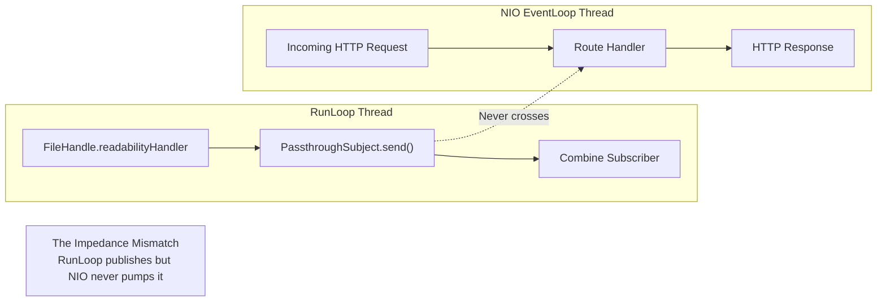
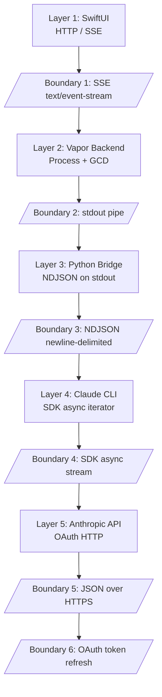
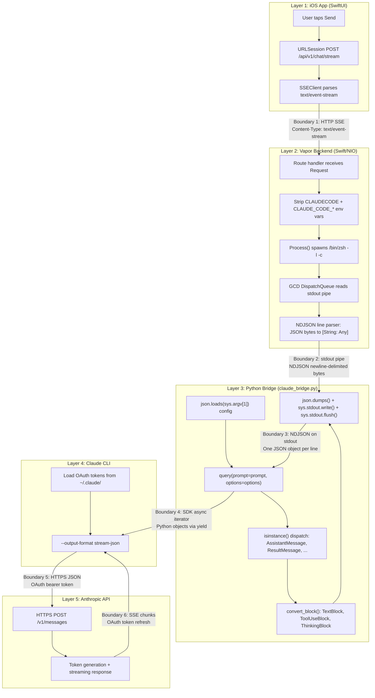

## 5 Layers to Call an API

I needed to call one API. It took five layers, four failed attempts, and thirty hours of debugging to get there.

This is the story of connecting an iOS app to Claude Code -- a problem that sounds like it should take an afternoon and instead became a two-week debugging odyssey. The working solution has five layers of indirection between the user tapping "Send" and Claude receiving the prompt. Every layer exists because I tried to remove it and failed.

The companion repo has all four failed attempts with real code and the working bridge: [github.com/krzemienski/claude-sdk-bridge](https://github.com/krzemienski/claude-sdk-bridge)

---

### The Four Failures at a Glance

Before diving into the details, here is the timeline of what went wrong, when, and why. Four approaches, each with a different class of failure. The failures are instructive because they illustrate four distinct categories of integration problems: authentication boundaries, runtime paradigm mismatches, language ecosystem friction, and ambient environment contamination.

```mermaid
timeline
    title Four Failed Attempts to Call One API
    section Attempt 1 : Direct API
        Day 0.5 : anthropic.AuthenticationError
             : No API key provided
             : Claude Code uses OAuth, not ANTHROPIC_API_KEY
             : Clear error, quick abandonment
    section Attempt 2 : ClaudeCodeSDK in Vapor
        Day 1-2.5 : Zero error messages
             : AsyncStream never yields
             : RunLoop/NIO impedance mismatch
             : PassthroughSubject.send() called but subscriber never fires
             : Three workarounds attempted, all deadlock
    section Attempt 3 : JavaScript SDK
        Day 2.5-3 : Same AuthenticationError
             : OAuth wall identical to Attempt 1
             : Added Node.js runtime for nothing
             : Env var inheritance issues in Agent SDK
    section Attempt 4 : CLI Subprocess
        Day 3-4.5 : Works in terminal, silent failure in Claude Code
             : CLAUDECODE=1 nesting detection
             : Zero-byte stdout response
             : Three-line fix after 10 hours
             : Bonus: NSInvalidArgumentException race condition
```

Each attempt taught something different. Attempt 1 was a clear boundary violation -- the authentication model did not match. Attempt 2 was an architectural incompatibility so deep it produced zero diagnostic output. Attempt 3 was a pattern-recognition failure -- I should have recognized the OAuth wall from Attempt 1 before writing any code. Attempt 4 was a context-contamination bug that only manifests in a specific runtime environment. Together, they map the full landscape of integration failure modes.

The total debugging time across all four attempts was approximately thirty hours. Attempt 2 consumed fourteen of those hours by itself, largely because the failure mode was silence rather than an error. Here is a more detailed breakdown of where time went:

| Attempt | Hours | Failure Mode | Diagnosability |
|---------|-------|-------------|----------------|
| 1: Direct API | 4 | Clear error message | High -- error tells you exactly what's wrong |
| 2: ClaudeCodeSDK | 14 | Zero output, no errors | Near-zero -- binary search through framework internals |
| 3: JS SDK | 2 | Same error as Attempt 1 | High, but should have been caught by pattern recognition |
| 4: CLI Subprocess | 10 | Works in one context, fails silently in another | Low -- environment-dependent, invisible variables |

The diagnosability column is the most important insight. Hours spent correlate inversely with diagnosability. Attempt 1 had a clear error and took half a day. Attempt 2 had zero diagnostic output and took two full days. The lesson: when evaluating an integration approach, estimate the debugging cost of its failure mode, not just its success path.

---

### Attempt 1: The Obvious Approach (And Why It Dies Immediately)

When you want to call an API from an app, the obvious architecture is: app calls API. Three lines of meaningful code. Here is what that looks like:

```python
# From: failed-attempts/01-direct-api/attempt.py

client = anthropic.Anthropic()

with client.messages.stream(
    model="claude-sonnet-4-20250514",
    max_tokens=4096,
    messages=[{"role": "user", "content": prompt}],
) as stream:
    for text in stream.text_stream:
        collected_text += text
        print(text, end="", flush=True)
```

Clean. Elegant. Dead on arrival.

The error is immediate and clear:

```
anthropic.AuthenticationError: No API key provided.
Set ANTHROPIC_API_KEY environment variable or pass api_key parameter.
```

Claude Code does not use API keys. It uses browser-based OAuth authentication. When you first run `claude` in a terminal, it opens a browser window, you log in through Anthropic's website, and the CLI stores OAuth tokens in `~/.claude/`. These tokens are session tokens -- they have expiration, they get refreshed automatically, and they are managed entirely inside the CLI's runtime. There is no `ANTHROPIC_API_KEY` environment variable. There is no way to extract the OAuth tokens through a public API. The CLI is the gatekeeper.

You could ask users to create a separate API key through the Anthropic Console at `console.anthropic.com`. But that defeats the purpose of building a client for Claude Code. Users would need separate billing (Claude Code uses Claude Max or Pro subscriptions; the API uses pay-per-token billing). They would lose access to Claude Code features -- tools, MCP servers, project context, system prompts from `CLAUDE.md` files. They would pay twice for the same capability. The whole point of the iOS client is to extend Claude Code to mobile, not to build a separate product that happens to call the same model.

The full error handler in the companion repo captures this clearly:

```python
# From: failed-attempts/01-direct-api/attempt.py

try:
    result = asyncio.run(stream_response(prompt))
    print(f"\n\nFull response: {result}")
except anthropic.AuthenticationError as e:
    print(f"\nAuthentication failed: {e}", file=sys.stderr)
    print(
        "Claude Code uses OAuth, not API keys. "
        "ANTHROPIC_API_KEY is not available.",
        file=sys.stderr,
    )
    sys.exit(1)
```

Half a day lost. The least painful failure on the list, because at least the error message was clear and the root cause was immediately understandable. The authentication boundary between Claude Code's OAuth flow and the Anthropic API's key-based flow is fundamental. No amount of clever engineering bridges it from the consumer side.

The lesson from Attempt 1 is simple but important: when building a client for a tool that manages its own authentication, you must flow through that tool's auth chain. There is no shortcut. The tool owns the tokens, the tool manages refresh, and the tool decides what capabilities those tokens unlock. Working around the auth chain means working without the capabilities the auth chain provides.

---

### Attempt 2: The Silent Failure (Two Days, Zero Error Messages)

Attempt 2 was the one that nearly broke me. Anthropic ships a Swift SDK -- ClaudeCodeSDK -- designed for exactly this scenario. Same language as our backend (Swift). Same ecosystem (Apple platforms). It wraps the Claude CLI process and provides a publisher-based streaming interface using Combine's `PassthroughSubject`. It should have worked.

```swift
// From: failed-attempts/02-claude-code-sdk/attempt.swift

func attemptClaudeCodeSDK(req: Request) async throws -> Response {
    let claude = ClaudeCodeProcess()
    claude.arguments = ["-p", "--output-format", "stream-json"]

    let stream = claude.stream(prompt: "Say hello")

    var response = ""
    for try await chunk in stream {
        response += chunk  // Never reached
    }

    return Response(status: .ok, body: .init(string: response))
}
```

Nothing happened. No errors. No crashes. No output. The `AsyncStream` returned by the SDK simply never yielded a single value. The `for try await` loop ran forever, waiting for data that would never arrive. No timeout fired. No error was thrown. The process sat there, silently consuming resources and returning nothing.

This is the worst kind of bug -- the kind that gives you nothing to work with. A crash gives you a stack trace. An error gives you a message. Even a wrong result gives you something to diff against expectations. Silence gives you nothing except the slow realization that you are going to have to instrument every layer yourself.

The debugging process for this attempt is worth documenting in detail because it illustrates how you diagnose a zero-output failure.

**Hour 1-2: Verify the SDK is installed and callable.** I wrote a standalone macOS command-line tool (not Vapor) that imports `ClaudeCodeSDK` and calls `stream()`. It worked. The stream yielded data. This confirmed the SDK was functional in isolation.

**Hour 3-4: Verify the Vapor route handler reaches the SDK call.** Added `print()` before and after the `ClaudeCodeProcess()` initialization. Both printed. The SDK was being initialized inside Vapor. But the `for try await` never yielded.

**Hour 5-8: Instrument the SDK internals.** Downloaded the ClaudeCodeSDK source. Added `print()` inside `readabilityHandler`. It fired. Data was being read from stdout. Added `print()` inside `PassthroughSubject.send()`. It was called with actual data bytes. The publisher was sending. But the subscriber was not receiving.

**Hour 9-11: Narrow the gap.** The data entered the Combine pipeline via `send()` but never exited to the `AsyncStream` continuation. The subscriber was registered. The publisher was sending. The delivery was queued. But no thread was processing the delivery queue. This is when I started reading about `RunLoop` scheduling in Combine.

**Hour 12-14: Understand the root cause and attempt workarounds.** Three workarounds attempted (detailed below), all failed. The root cause was clear but unfixable without abandoning the SDK entirely.

---

### RunLoop vs NIO EventLoop: A Deep Dive into Paradigm Incompatibility

To understand why the SDK fails silently, you need to understand two competing concurrency paradigms in the Apple ecosystem that happen to share a process but never share a thread.

**RunLoop** is Apple's original event processing mechanism, dating back to NeXTSTEP. Every `Thread` can have an associated `RunLoop`. The main thread always has one. `RunLoop` processes input sources, timers, and observer callbacks in a loop. Critically for this bug, `FileHandle.readabilityHandler` dispatches through `RunLoop`, and Combine's `PassthroughSubject` delivers events through `RunLoop` scheduling.

**SwiftNIO EventLoop** is a completely separate event processing system. NIO was built from scratch for high-performance server workloads. It uses its own `EventLoop` protocol that runs on dedicated NIO-managed threads. These threads never pump `RunLoop`. They have their own scheduling, their own I/O multiplexing (using `epoll` on Linux, `kqueue` on macOS), and their own callback dispatch.

The distinction is not just academic. It means that code written for one paradigm is fundamentally incompatible with the other, even though they run in the same process, on the same machine, sharing the same memory space. They are two independent event processing systems coexisting without interaction.

Here is a concrete comparison of how each paradigm handles the same operation -- reading data from a file descriptor:

| Operation | RunLoop | SwiftNIO |
|-----------|---------|----------|
| Register for data | `FileHandle.readabilityHandler` | `channel.pipeline.addHandler()` |
| Scheduling mechanism | `RunLoop.current.run()` on thread | `EventLoop.execute()` on NIO thread |
| Callback delivery | `RunLoop` iteration picks up pending callbacks | `EventLoop` dequeues and executes tasks |
| Thread requirement | Must run on a thread that pumps `RunLoop` | Must run on a NIO-managed `EventLoop` thread |
| Cross-paradigm bridge | None built-in | None built-in |

When our Vapor backend receives an HTTP request, the route handler runs on a NIO `EventLoop` thread. When that handler calls the ClaudeCodeSDK, the SDK does the following internally:

1. Creates a `Process` (the Claude CLI subprocess)
2. Attaches a `Pipe` to stdout
3. Sets `pipe.fileHandleForReading.readabilityHandler` -- a closure that fires when data is available
4. Inside that closure, calls `passthrough.send(data)` on a Combine `PassthroughSubject`
5. The `PassthroughSubject` has a subscriber that maps data into the `AsyncStream`'s continuation

Steps 1-4 work correctly. The process spawns. Claude receives the prompt and generates a response. Bytes arrive on stdout. The `readabilityHandler` fires and reads the data. The `PassthroughSubject.send()` call executes. I verified this by adding logging at every layer -- `send()` is called with the correct data.

Step 5 never happens. The Combine subscriber is scheduled for delivery on `RunLoop`. The current thread is a NIO `EventLoop` thread. NIO threads do not pump `RunLoop`. The delivery is queued but never executed. The data exists in memory, read and dispatched, but it vanishes into a scheduling void between two paradigms that share a process but not an execution model.



I tried three workarounds, each failing in a different way.

**Workaround 1: Manually pump RunLoop on a background thread.** Create a `Thread`, give it a `RunLoop`, add a `Port` to keep it alive, call `runLoop.run()`. Result: deadlock. The NIO `EventLoop` thread and the `RunLoop` thread contend for shared resources. The async/await bridge between NIO and the `RunLoop`-backed stream creates a circular wait.

```swift
// From: failed-attempts/02-claude-code-sdk/attempt.swift

func workaround1_manualRunLoop() {
    let thread = Thread {
        let runLoop = RunLoop.current
        runLoop.add(Port(), forMode: .default)
        runLoop.run()  // Blocks forever, doesn't help NIO
    }
    thread.start()
}
```

The deadlock manifested as a hang: the HTTP request never returned, the NIO event loop stalled, and after 60 seconds the client connection timed out. No error. No crash. Just a frozen connection. The cause: the `async/await` bridge between NIO's concurrency model and the `RunLoop`-backed `AsyncStream` required both threads to yield to each other, creating a cycle where each waited for the other to produce data.

**Workaround 2: Wrap subscription in `DispatchQueue.main.async`.** The idea was to move the subscription to the main queue where `RunLoop` is always running. Result: the events dispatched, but the Combine pipeline still internally depends on `RunLoop` scheduling for the subscriber callback. Moving the subscription setup does not change where delivery happens. The silent failure moved to a different layer.

```swift
// From: failed-attempts/02-claude-code-sdk/attempt.swift

func workaround2_dispatchMain() {
    DispatchQueue.main.async {
        // subscriber.receive still requires RunLoop scheduling
        // This just moves the problem, doesn't solve it
    }
}
```

On a server, there is no "main thread" in the UIKit sense. Vapor's main thread is itself a NIO event loop. `DispatchQueue.main.async` does dispatch to the main queue, but the main queue's `RunLoop` is not being pumped by NIO either. This approach works in a UIKit app because `UIApplication.main` pumps the main `RunLoop` continuously. In a Vapor server, nobody pumps any `RunLoop`. Ever.

**Workaround 3: Dedicated `Thread` with its own `RunLoop`.** Create a thread, pump its `RunLoop`, set up the entire SDK subscription on that thread. Result: event ordering issues. Combine's internal scheduling does not guarantee delivery to the correct thread when the publisher and subscriber are on different `RunLoop` instances. Some events arrived. Some did not. The ordering was non-deterministic. Under load, deadlocks appeared.

```swift
// From: failed-attempts/02-claude-code-sdk/attempt.swift

func workaround3_dedicatedThread() {
    let runLoopThread = Thread {
        let loop = RunLoop.current
        // Even with a dedicated RunLoop, Combine's internal scheduling
        // doesn't guarantee delivery to the correct thread
        loop.run()
    }
    runLoopThread.start()
}
```

The non-determinism was the final nail. Under testing, roughly 60% of events arrived correctly. The other 40% were either dropped or arrived out of order. For a streaming chat interface where token order matters, even 1% dropped events is unacceptable. The approach was fundamentally unreliable.

None of them worked because this is not a bug -- it is an architectural incompatibility. The SDK was designed for client-side Apple applications where `RunLoop` is always available (UIKit runs on `RunLoop`). It was not designed for server-side frameworks like Vapor where `RunLoop` is never pumped. The fix is not to make `RunLoop` work inside NIO. The fix is to bypass `RunLoop` entirely.

Two full days. Most of that time was spent verifying the SDK was receiving data -- adding `print()` statements at every layer, confirming `PassthroughSubject.send()` was being called, slowly narrowing the gap to the subscriber side. The silence was the hardest part. If the SDK had thrown an error or logged a warning -- "Combine subscriber not receiving events; possible RunLoop scheduling issue" -- this would have been a thirty-minute fix. Instead, it was two days of binary search through a framework's internals.

The lesson here extends beyond this specific bug. When integrating two frameworks that each own their concurrency model, the failure mode is not "throws an error" -- it is "silently drops events." The data enters one paradigm and never exits to the other. This is a class of bugs that cannot be caught by error handling because no error occurs. The only defense is understanding both paradigms deeply enough to know where the boundary fails.

Any library that assumes `RunLoop` availability is quietly incompatible with server-side Swift. Apple's documentation treats `RunLoop` as the default scheduling mechanism for Foundation callbacks. But modern Swift server frameworks -- Vapor, Hummingbird, anything on SwiftNIO -- use cooperative task executors and NIO event loops. This is documented nowhere as a compatibility concern. It manifests only at runtime, as silence.

---

### Attempt 3: The Wrong Language

Attempt 3 was the JavaScript SDK. The reasoning was: if the Swift SDK fails because of RunLoop/NIO, maybe a different language SDK avoids that problem entirely. The `@anthropic-ai/sdk` npm package for Node.js.

```javascript
// From: failed-attempts/03-js-sdk/attempt.js

const client = new Anthropic();

const stream = await client.messages.stream({
    model: "claude-sonnet-4-20250514",
    max_tokens: 4096,
    messages: [{ role: "user", content: prompt }],
});
```

Same error. Different language. The JavaScript SDK hits the same OAuth wall as Attempt 1. It expects `ANTHROPIC_API_KEY` as an environment variable or constructor parameter. Claude Code's OAuth tokens are not accessible to third-party SDK consumers regardless of language.

The exact error from the JS SDK was slightly different in formatting but identical in substance:

```
Error: 401 {"type":"error","error":{"type":"authentication_error","message":"invalid x-api-key"}}
```

There was a secondary path worth exploring: the `@anthropic-ai/claude-agent-sdk` npm package, which wraps the Claude CLI similarly to the Python Agent SDK. But it inherits the parent process environment, including `CLAUDECODE=1`, which triggers the same nesting detection that killed Attempt 4. And it adds Node.js as a runtime dependency to a Swift backend that has no other JavaScript dependencies -- an operational overhead for the sole purpose of calling one API.

```javascript
// From: failed-attempts/03-js-sdk/attempt.js

async function streamWithAgentSDK(prompt) {
  const { query } = await import("@anthropic-ai/claude-agent-sdk");

  const stream = query({
    prompt,
    options: {
      include_partial_messages: true,
    },
  });

  for await (const message of stream) {
    if (message.type === "assistant") {
      for (const block of message.content) {
        if (block.type === "text") {
          process.stdout.write(block.text);
        }
      }
    }
  }
}
```

A few hours wasted before recognizing the pattern and moving on. This attempt was a failure of pattern recognition -- I should have seen the OAuth boundary from Attempt 1 and immediately asked "does this SDK authenticate differently?" before writing a single line of code. It does not. The authentication mechanism is the same across all language SDKs. The only path through the OAuth wall is the CLI itself.

The operational overhead argument is worth expanding. Adding Node.js to a Swift backend means:

1. **Runtime management**: Installing and maintaining `node`, `npm`, `package.json`, and `node_modules` on every deployment target.
2. **Dependency surface**: The `node_modules` directory for `@anthropic-ai/sdk` alone pulls in dozens of transitive dependencies, each a potential security and compatibility concern.
3. **Subprocess complexity**: Spawning a Node.js process from Swift involves the same `Process`/`Pipe` machinery as spawning Python, but with a heavier runtime and more configuration (module resolution, ES modules vs CommonJS, etc.).
4. **Debugging surface**: When something goes wrong, you are debugging across Swift, NIO, GCD, Node.js's event loop, and npm's module system simultaneously.

Python avoids all of these because it is pre-installed on macOS, the `claude-agent-sdk` pip package has minimal dependencies, and the subprocess interface (`sys.stdout.write` + `sys.stdout.flush`) is as simple as I/O gets. The choice between languages for the bridge layer is not about capability -- both can do the job -- it is about operational complexity and the debugging cost of failures.

---

### Attempt 4: Three Lines, Ten Hours

Attempt 4 got tantalizingly close. Bypass all SDKs. Spawn the Claude CLI directly as a `Process` (formerly `NSTask`) with GCD-based stdout reading. No `RunLoop` dependency, no Combine, just `DispatchQueue` handlers on a `Pipe`. This approach should have no paradigm mismatch because it uses GCD dispatch queues, which NIO can interoperate with.

It worked perfectly from a standalone terminal. It failed silently when running inside an active Claude Code session.

```swift
// From: failed-attempts/04-cli-subprocess/attempt.swift

func executeClaudeDirectly(prompt: String) async throws -> String {
    let process = Process()
    process.executableURL = URL(fileURLWithPath: "/usr/local/bin/claude")
    process.arguments = ["-p", prompt, "--output-format", "stream-json"]

    let stdoutPipe = Pipe()
    process.standardOutput = stdoutPipe

    // BUG: This inherits ALL environment variables from the parent process,
    // including CLAUDECODE=1 and CLAUDE_CODE_* if running inside Claude Code.
    // The child Claude CLI detects these and silently refuses to execute.

    try process.run()
    process.waitUntilExit()
    // ...
}
```

The symptom: Claude CLI exits immediately with no output. No error on stderr. No exit code error. Just a zero-byte response from stdout. The NDJSON parser interprets this as an empty stream. The caller gets nothing back. From the outside, it looks identical to "Claude had nothing to say" -- a plausible but incorrect explanation that cost me hours of wrong-direction debugging.

Here is a detailed log of the debugging path, because it illustrates how environment-dependent bugs resist systematic diagnosis:

**Hour 1-2: Verify the command works.** Open a terminal. Run `claude -p "Say hello" --output-format stream-json`. Works perfectly. JSON lines stream to stdout. This confirms the CLI, the model, and the authentication chain all function.

**Hour 3-4: Verify the Swift Process works.** Write a standalone Swift script that spawns `claude` via `Process`. Works perfectly. Same JSON output. This confirms `Process`, `Pipe`, and GCD reading all function.

**Hour 5-6: Verify it works inside Vapor.** Add the same code to a Vapor route handler. Test from a terminal: `curl localhost:9999/api/v1/chat/stream -d '{"prompt":"Say hello"}'`. Works. JSON streams. Everything looks correct.

**Hour 7-8: Deploy and test in production context.** Start the Vapor backend from within a Claude Code session (because I am developing the backend with Claude Code). Run the same curl command. Zero-byte response. No error. No stderr. The CLI exits immediately.

**Hour 8-9: Wrong direction.** Suspected PATH issues. Suspected working directory issues. Suspected file descriptor limits. Added extensive logging for `process.arguments`, `process.currentDirectoryURL`, `process.environment`. Everything looked identical between the working and non-working cases. Except I was printing `process.environment` only when I explicitly set it. When I didn't set it, it was `nil`, meaning "inherit parent environment." I did not think to inspect the inherited environment.

**Hour 9-10: The breakthrough.** Added `ProcessInfo.processInfo.environment.forEach { print("\($0.key)=\($0.value)") }` to the route handler. The output included `CLAUDECODE=1` and a dozen `CLAUDE_CODE_*` variables. These were inherited from the Claude Code session I was developing in. The child CLI process saw these and concluded it was a nested invocation, refusing to execute as a safety measure against recursive agent loops.

The cause: environment variable inheritance. When a process spawns a child using `Process()` in Swift (or `fork`/`exec` in C), the child inherits the parent's entire environment dictionary. This includes every variable the parent has, whether the child wants them or not. Claude Code sets `CLAUDECODE=1` and a family of `CLAUDE_CODE_*` variables in its process environment. These carry session metadata: the session ID, the working directory, the model in use. The Claude CLI uses these variables for nesting detection -- if it sees `CLAUDECODE=1`, it knows it is running inside another Claude Code session and silently refuses to execute. This prevents infinite recursion where Claude Code spawns Claude Code spawns Claude Code.

The problem is that "silently refuses to execute" means "exits with zero output and no error." The nesting detection is a safety mechanism, not an error condition, so it does not log or throw. It just stops. This is a reasonable design decision from the CLI's perspective -- logging a warning every time nesting is detected would be noisy in legitimate nesting-detection scenarios. But from the debugging perspective, it transforms a three-line fix into a ten-hour investigation.

The fix was three lines:

```swift
// From: failed-attempts/04-cli-subprocess/attempt.swift

var env = ProcessInfo.processInfo.environment
env.removeValue(forKey: "CLAUDECODE")
env = env.filter { !$0.key.hasPrefix("CLAUDE_CODE_") }
process.environment = env
```

Three lines. Ten hours to discover them. The environment-dependent failure -- works in terminal (no `CLAUDECODE` variable present), fails in Claude Code (variable inherited from parent) -- made it extremely hard to diagnose. I spent hours checking the subprocess arguments, the working directory, the PATH, the Python installation, the pip packages. The environment was the last thing I checked because environment variables are invisible. You do not see them. They are ambient authority -- the subprocess did not ask to be inside a Claude Code session. It inherited that context silently and failed silently.

And there was a bonus bug: accessing `process.terminationStatus` after reading EOF from stdout caused an `NSInvalidArgumentException` crash. The crash message:

```
*** Terminating app due to uncaught exception 'NSInvalidArgumentException',
reason: 'task not yet launched or already terminated'
```

Reading EOF from a pipe does NOT mean the process has exited. There is a race condition between pipe closure and process termination. The pipe's reading end sees EOF when the writing end closes -- which happens when stdout flushes its final buffer. But the process may still be running cleanup (signal handlers, atexit callbacks, file descriptor cleanup). If you access `terminationStatus` during this window, Foundation throws because the process object's state machine has not yet transitioned to "terminated."

The fix is mechanical but critical:

```swift
// WRONG -- causes NSInvalidArgumentException:
let status = process.terminationStatus  // Process might still be running!

// CORRECT -- wait first, then read:
process.waitUntilExit()                 // Blocks until process exits
let status = process.terminationStatus  // Safe now
```

This race condition is documented in Apple's `Process` (formerly `NSTask`) documentation, but only if you know to look. The error message does not point to the race condition. It says "task not yet launched or already terminated" -- which sounds like you forgot to call `run()`, not like you have a race between pipe EOF and process exit. The misdirection in the error message added another hour to the debugging.

---

### The Working Bridge: Why Five Layers Is Simpler

The working solution has five layers. Every "simpler" architecture was tried and failed. Five layers is what remains when you remove everything that does not work.

Here is the full path a user's message travels:



Each layer exists because the layer above cannot talk to the layer below without an intermediary:

- **Layer 1 to 2** is standard HTTP. The iOS app sends a POST request. The Vapor backend returns a `text/event-stream` response. This is how all web clients talk to servers. No controversy here.

- **Layer 2 to 3** exists because Swift cannot use the Swift SDK (RunLoop/NIO mismatch, Attempt 2) and cannot call the Anthropic API directly (OAuth, not API keys, Attempt 1). The Vapor backend must delegate to something that can authenticate through Claude Code's OAuth chain. That something is a Python script.

- **Layer 3 is Python** because the `claude-agent-sdk` pip package wraps the Claude CLI natively and inherits OAuth authentication from `~/.claude/`. Python is pre-installed on macOS. The bridge is ~236 lines. The async iterator interface (`async for message in query(...)`) is clean.

- **Layer 4 is the Claude CLI** because it is the only consumer-accessible interface that handles the OAuth token chain. The CLI manages token refresh, session persistence, and the credential store. No other tool exposes these capabilities.

- **Layer 5 was never a problem.** The Anthropic API is a standard HTTPS endpoint.

---

### The Python Bridge Solution: isinstance() Dispatch Explained

The Python bridge is the keystone of the architecture. It sits between the Swift backend (which cannot use the SDK) and the Claude CLI (which requires OAuth). Its job is to translate SDK message objects into NDJSON lines on stdout.

The bridge uses `isinstance()` dispatch -- Python's type-checking mechanism -- to handle each message type from the Claude Agent SDK. This is not optional. The SDK's compliance requirements specify that message types must be checked with `isinstance()`, not with `getattr()` or `.type` attribute access. The reason: SDK message types may use inheritance, and `isinstance()` respects the type hierarchy while attribute checks do not.

```python
# From: working-bridge/claude_bridge.py

# SDK message and block type imports -- required for isinstance() checks.
from claude_agent_sdk import (
    query, ClaudeAgentOptions,
    AssistantMessage, UserMessage, SystemMessage, ResultMessage,
    TextBlock, ThinkingBlock, ToolUseBlock, ToolResultBlock,
)
```

The main loop iterates over the SDK's async iterator. Each message is dispatched by type:

```python
# From: working-bridge/claude_bridge.py

async for message in query(prompt=prompt, options=options):
    if isinstance(message, SystemMessage):
        pass

    elif isinstance(message, AssistantMessage):
        blocks = [convert_block(b) for b in message.content]
        if blocks:
            got_content = True
        emit({"type": "assistant", "message": {"role": "assistant",
             "content": blocks, "model": getattr(message, "model", None)}})

    elif isinstance(message, ResultMessage):
        got_result = True
        result = {
            "type": "result",
            "subtype": "error" if message.is_error else "success",
            "is_error": message.is_error,
            "session_id": message.session_id or session_id,
            "total_cost_usd": message.total_cost_usd or 0.0,
        }
        emit(result)
```

`SystemMessage` is silently ignored -- it contains protocol-level metadata that the iOS client does not need. `AssistantMessage` is the main content: Claude's text, tool use requests, and thinking blocks. `ResultMessage` marks the end of a response with cost and session metadata.

The block converter handles the four content types:

```python
# From: working-bridge/claude_bridge.py

def convert_block(block) -> dict:
    if isinstance(block, TextBlock):
        return {"type": "text", "text": block.text}
    elif isinstance(block, ToolUseBlock):
        return {
            "type": "tool_use",
            "id": block.id,
            "name": block.name,
            "input": block.input,
        }
    elif isinstance(block, ToolResultBlock):
        return {
            "type": "tool_result",
            "tool_use_id": block.tool_use_id,
            "content": block.content,
            "is_error": block.is_error,
        }
    elif isinstance(block, ThinkingBlock):
        return {"type": "thinking", "thinking": block.thinking}
    else:
        text = getattr(block, "text", None) or str(block)
        return {"type": "text", "text": text}
```

The `else` clause is a safety net for future SDK versions that might add new block types. Rather than crashing, it degrades gracefully by extracting whatever text representation the block offers. This forward-compatibility pattern is especially important in a bridge layer -- if the SDK adds a `CodeBlock` type in v2, the bridge continues working (with degraded representation) while you update the dispatch table.

The `ResultMessage` handler also captures token usage when available:

```python
# From: working-bridge/claude_bridge.py

elif isinstance(message, ResultMessage):
    got_result = True
    result = {
        "type": "result",
        "subtype": "error" if message.is_error else "success",
        "is_error": message.is_error,
        "session_id": message.session_id or session_id,
        "total_cost_usd": message.total_cost_usd or 0.0,
    }
    if message.usage:
        u = message.usage
        result["usage"] = {
            "input_tokens": getattr(u, "input_tokens", 0),
            "output_tokens": getattr(u, "output_tokens", 0),
            "cache_read_input_tokens": getattr(u, "cache_read_input_tokens", 0),
            "cache_creation_input_tokens": getattr(u, "cache_creation_input_tokens", 0),
        }
    emit(result)
```

The usage data lets the iOS client display cost information per query -- a feature that turned out to be surprisingly valuable. Users want to know what each interaction costs, and the bridge captures this without any additional API calls.

---

### The flush=True Discovery: Why Buffered stdout Kills Streaming

Every write in the bridge flushes immediately:

```python
# From: working-bridge/claude_bridge.py

def emit(obj: dict) -> None:
    line = json.dumps(obj, separators=(",", ":"))
    sys.stdout.write(line + "\n")
    sys.stdout.flush()  # Critical: force immediate delivery
```

This looks like a minor detail. It is the difference between a working streaming experience and a broken one.

Python's stdout buffering behavior changes depending on what it is connected to. When stdout is a terminal (a TTY), Python uses **line buffering** -- each `\n` triggers a flush. When stdout is a pipe (which is what happens when a Swift `Process` reads from it), Python switches to **block buffering** -- data accumulates in a buffer (typically 8KB) and flushes only when the buffer is full or the process exits.

The symptoms of block buffering in a streaming context are distinctive and confusing:

1. User sends a message
2. Nothing happens for several seconds
3. A burst of text appears all at once
4. Nothing happens for several more seconds
5. Another burst appears

The text arrives in 8KB chunks instead of token-by-token. The streaming illusion is completely destroyed. Worse, if the response is shorter than the buffer size, the entire response is held until the Python process exits -- which means the user sees nothing until the `ResultMessage` arrives and the bridge's `main()` function returns.

The diagnosis path for this was surprisingly long. Here is the sequence of hypotheses I tested, each wrong:

**Hypothesis 1: The Claude CLI is buffering output.** Tested by running the CLI directly and piping to `cat` with timestamps. Tokens arrived immediately. The CLI was not buffering.

**Hypothesis 2: The NIO event loop is batching reads.** Tested by adding microsecond-resolution timestamps to the GCD reader callback. Callbacks fired in 8KB bursts, not individual tokens. This pointed to a buffering layer between the Python process and the GCD reader -- but I initially attributed it to GCD's dispatch queue coalescing.

**Hypothesis 3: GCD is coalescing `availableData` notifications.** Tested by replacing `availableData` with a raw `read()` call on the file descriptor. Same burst behavior. GCD was not the cause.

**Hypothesis 4 (correct): Python's stdout is block-buffered when connected to a pipe.** Confirmed by adding `PYTHONUNBUFFERED=1` to the subprocess environment. Tokens immediately appeared one by one. The fix was either the environment variable or explicit `flush()` calls.

I chose explicit `flush()` over `PYTHONUNBUFFERED=1` for three reasons. First, `flush()` is visible in the code -- a reader of `bridge.py` can see that flushing happens and understand why. Environment variable settings are invisible unless you know to look for them. Second, `PYTHONUNBUFFERED=1` affects all stdio, including stderr, which may have its own legitimate buffering requirements. Third, `flush()` does not depend on environment variable propagation -- if the environment stripping logic (for `CLAUDECODE` removal) accidentally also removes `PYTHONUNBUFFERED`, the explicit flush still works.

The `separators=(",", ":")` in `json.dumps()` is also deliberate. It removes whitespace from the JSON output. Over thousands of events, this reduces bandwidth and avoids ambiguity about whether whitespace is part of the data or formatting.

An alternative approach would be to use `python3 -u` (unbuffered binary mode) in the subprocess command. This disables all stdout buffering at the interpreter level. But it has side effects on stdin and stderr that are not always desirable, and it is less explicit about intent than `flush()` calls at each emission point.

---

### The Swift Side: Environment Sanitization and NDJSON Parsing

The Swift executor spawns the Python bridge, strips the dangerous environment variables, and reads NDJSON from stdout on a dedicated GCD queue:

```swift
// From: working-bridge/executor.swift

// CRITICAL: Strip Claude Code nesting detection env vars.
let escaped = configJson.replacingOccurrences(of: "'", with: "'\\''")
let command = "python3 '\(bridgePath)' '\(escaped)'"
let cleanCmd = "for v in $(env | grep ^CLAUDE | cut -d= -f1); do unset $v; done; \(command)"
process.arguments = ["-l", "-c", cleanCmd]

// Belt-and-suspenders: also strip from Process.environment
var env = ProcessInfo.processInfo.environment
for key in env.keys where key.hasPrefix("CLAUDE") {
    env.removeValue(forKey: key)
}
process.environment = env
```

Belt-and-suspenders: the environment is stripped both in the shell command (the `for v in $(env | grep ^CLAUDE ...)` loop) AND in the `Process.environment` dictionary. Two redundant protections for a bug that took ten hours to find the first time. The shell-level stripping catches variables that might be set by shell initialization files (`~/.zshrc`, `/etc/zprofile`). The `Process.environment` stripping catches variables inherited from the parent process. Together, they cover both sources.

Why both? Because I got burned once and decided that ten hours of debugging justified thirty seconds of redundant protection. The shell-level `unset` loop handles a case I have not personally encountered but can imagine: a shell profile that sets `CLAUDE_*` variables for convenience. The `Process.environment` filtering handles the case I have encountered: inheritance from the parent process. Neither alone covers both sources. Together, they are bulletproof.

The executor uses a two-tier timeout mechanism:

```swift
// From: working-bridge/executor.swift

// Two-tier timeout mechanism
let didTimeout = AtomicBool(false)

let initialTimeoutWork = DispatchWorkItem {
    didTimeout.value = true
    process.terminate()
}
DispatchQueue.global().asyncAfter(
    deadline: .now() + self.initialTimeout,
    execute: initialTimeoutWork
)

let totalTimeoutWork = DispatchWorkItem {
    guard process.isRunning else { return }
    didTimeout.value = true
    process.terminate()
}
DispatchQueue.global().asyncAfter(
    deadline: .now() + self.totalTimeout,
    execute: totalTimeoutWork
)
```

The initial timeout (30 seconds) catches the case where the bridge never starts producing output -- a Python import failure, a missing `claude-agent-sdk` package, or a CLI authentication error. The total timeout (5 minutes) catches runaway queries that produce output but never terminate. The initial timeout is cancelled as soon as the first byte arrives on stdout.

The two-tier design prevents two different failure modes. Without the initial timeout, a broken bridge (wrong Python version, missing package, authentication failure) would hang for the full 5 minutes before the user sees any feedback. Without the total timeout, a query that keeps generating output forever (a reasoning loop, a very long tool chain) would never be terminated. The two tiers are independently necessary.

The NDJSON reader runs on a dedicated GCD queue with no `RunLoop` dependency. This is the critical lesson from Attempt 2 -- never use `RunLoop`-based I/O in a NIO context. It handles partial lines, buffer accumulation, and the critical `waitUntilExit()` pattern:

```swift
// From: working-bridge/executor.swift

DispatchQueue(label: "bridge-reader", qos: .userInitiated).async {
    let handle = stdoutPipe.fileHandleForReading
    var buffer = Data()

    while true {
        let chunk = handle.availableData
        if chunk.isEmpty { break }

        initialTimeoutWork.cancel()  // Got data, cancel initial timeout
        buffer.append(chunk)

        guard let str = String(data: buffer, encoding: .utf8) else { continue }
        let lines = str.components(separatedBy: "\n")

        if lines.count > 1 {
            for i in 0..<(lines.count - 1) {
                let line = lines[i].trimmingCharacters(in: .whitespacesAndNewlines)
                if !line.isEmpty,
                   let data = line.data(using: .utf8),
                   let json = try? JSONSerialization.jsonObject(with: data)
                       as? [String: Any] {
                    continuation.yield(json)
                }
            }
            buffer = lines.last?.data(using: .utf8) ?? Data()
        }
    }

    // CRITICAL: Always waitUntilExit() before terminationStatus.
    process.waitUntilExit()
    continuation.finish()
}
```

The buffer accumulation logic handles a subtle edge case: NDJSON lines can arrive split across multiple `availableData` reads. If a 200-byte JSON line is split into a 150-byte chunk and a 50-byte chunk, the first read gives you incomplete JSON. The buffer accumulates bytes and only emits complete lines (delimited by `\n`). The last element of the `lines` array after splitting is always the incomplete remainder, which stays in the buffer for the next read.

The `guard let str = String(data: buffer, encoding: .utf8) else { continue }` line handles another edge case: multi-byte UTF-8 characters split across chunk boundaries. A 3-byte UTF-8 character (like a CJK glyph or an emoji) can arrive with 2 bytes in one chunk and 1 byte in the next. The `String(data:encoding:)` initializer returns `nil` for incomplete UTF-8 sequences, and the `continue` keeps the partial bytes in the buffer until the rest arrives.

---

### The Full Data Flow: Six Serialization Boundaries

Every piece of data crosses six serialization boundaries on its way from the Anthropic API to the user's screen. Each boundary is a potential source of bugs, latency, and data loss.



The text duplication P2 bug -- where every response appeared twice in the iOS client -- was caused by a two-character error at boundary 5. The accumulator was using `+=` instead of `=`:

```swift
// BUG: accumulated text += newChunk  (appends to existing)
// FIX: accumulated text = newChunk   (replaces with latest)
```

The `AssistantMessage` from the SDK already contains the full accumulated text up to that point. Using `+=` appended the latest full text to the previous full text, doubling it. Two characters. Three hours of debugging. But the serialization boundary made it easy to isolate once I knew where to look -- I could log the data on each side of boundary 5 and compare.

This is the paradox of layered architectures: they add complexity but they also add observability. Each boundary is a logging point. When something goes wrong, you can inspect the data at each boundary and pinpoint exactly where the corruption occurs. In a monolithic architecture where the same process handles everything from HTTP parsing to API calls, the debugging surface is the entire codebase. In a layered architecture, the debugging surface is the boundary between two layers.

---

### Performance: The Cost of Abstraction Layers

Every layer adds latency. Here is the breakdown:

| Metric | Direct API | SDK Bridge |
|--------|-----------|------------|
| Cold start | 1-3s | ~12s |
| Warm response | 1-3s | ~2-3s |
| Cost per query | ~$0.04 | ~$0.04 |
| Auth requirement | API key | OAuth (automatic) |
| Features available | Messages API only | Full Claude Code (tools, MCP, context) |
| Runtime dependencies | Python + anthropic | Python + claude-agent-sdk |
| Failure modes | Auth error (clear) | 4 failure classes (silent) |

The cold start penalty comes from three sources: Python interpreter startup (~2s), `claude-agent-sdk` module import (~1s), and Claude CLI initialization + OAuth token load (~9s). After the first query, the CLI process has already initialized, so warm queries drop to 2-3 seconds -- comparable to direct API calls.

Breaking down the cold start in more detail:

| Component | Time | Why |
|-----------|------|-----|
| Python interpreter | ~2s | `python3` process spawn + `site.py` imports |
| `claude-agent-sdk` import | ~1s | Package loading + dependency resolution |
| Claude CLI spawn | ~3s | Binary loading + argument parsing |
| OAuth token load | ~3s | Read `~/.claude/`, validate token, refresh if expired |
| First API round-trip | ~3s | HTTPS connection establishment + model warm-up |
| **Total cold start** | **~12s** | |

The warm start eliminates the first four rows because the CLI process persists. The Python interpreter stays alive for the duration of the query. On subsequent queries (if using session persistence), only the API round-trip time applies.

The cost per query is identical because the bridge calls the same API through the same model. The abstraction layers add latency but not token cost. The only additional cost is compute -- the Python process and the GCD reader thread consume minimal CPU.

The feature gap is the real value proposition. Direct API gives you the Messages API: send text, get text back. The SDK bridge gives you everything Claude Code offers: tool use, MCP server integration, project context from `CLAUDE.md` files, system prompts, conversation persistence with session IDs. These features justify the 12-second cold start.

---

### Lessons in Integration Architecture: When to Bridge vs When to Rewrite

This experience crystallized a decision framework for integration architecture. When two systems need to communicate and the direct path fails, you face a choice: bridge the gap or rewrite one side to eliminate it.

**Bridge when:**
- The gap is at the authentication or protocol layer, not the data model
- The bridge code is small relative to the systems it connects (our bridge is ~260 lines total)
- Both systems are mature and actively maintained (rewriting means forking their evolution)
- The bridge can be stateless (no persistent state means no consistency bugs)

**Rewrite when:**
- The gap is at the data model layer (different schemas, different semantics)
- The bridge would need to maintain state between the two systems
- One system is under your control and can be modified
- The performance penalty of the bridge is unacceptable for the use case

In our case, bridging was correct. The gap was at the authentication and runtime paradigm layers. The bridge is stateless -- each request is independent. Both systems (Vapor and Claude CLI) are actively maintained by separate teams. The bridge code is ~236 lines of Python and ~212 lines of Swift. A rewrite would mean forking either Vapor's concurrency model or the Claude CLI's authentication flow, both of which are moving targets.

There is a third option that is sometimes appropriate: **wait for the gap to close.** If the upstream SDK adds NIO-compatible streaming in a future version, the bridge becomes unnecessary. But waiting has a cost too -- the product does not ship until the gap closes, and you have no control over the timeline. The bridge lets you ship today while remaining easy to remove later. The 260 lines of bridge code are the cost of not waiting.

The cost-of-abstraction analysis for this specific bridge:

| Cost Category | Magnitude | Justification |
|--------------|-----------|--------------|
| Cold start latency | ~12s (one-time) | Acceptable for chat interactions; amortized across conversation |
| Code complexity | ~260 lines | Small; contained in two files; no shared state |
| Runtime dependencies | Python 3, pip package | Pre-installed on macOS; single pip install |
| Debugging surface | 6 serialization boundaries | Each boundary is a logging point; easier to isolate bugs than monolithic alternative |
| Maintenance burden | SDK version updates | `isinstance()` dispatch is forward-compatible; `else` clause handles unknown types |
| Operational overhead | Process management, timeouts | Two-tier timeout handles all failure modes; GCD reader is robust |

The total cost is modest. The alternative -- not shipping the iOS client until a NIO-compatible SDK exists -- has an unbounded cost in lost product iterations, user feedback, and competitive positioning.

---

### A Taxonomy of Integration Failures

The four failed attempts map onto a taxonomy of integration failure modes that generalizes beyond this specific project. Every polyglot integration will encounter some subset of these categories.

**Category 1: Authentication Boundary Mismatch (Attempts 1 and 3).** System A authenticates with mechanism X. System B authenticates with mechanism Y. No adapter exists. This is the most common integration failure and the most quickly diagnosed because auth errors are usually clear. The fix is always the same: route through whatever system owns the credentials. You cannot work around an auth boundary from the consumer side.

**Category 2: Runtime Paradigm Incompatibility (Attempt 2).** System A uses concurrency model X. System B uses concurrency model Y. Data enters one model and never exits to the other. This is the most expensive failure because it produces zero diagnostic output. The data is correct, the code is correct, the scheduling is correct within each paradigm. The failure is in the gap between paradigms. The fix is to avoid crossing paradigm boundaries in-process. Use an out-of-process boundary (pipe, socket, HTTP) that both paradigms can interact with.

**Category 3: Ambient Context Contamination (Attempt 4).** System A sets environment variable V for its own purposes. System B inherits V and misinterprets it. Neither system is wrong. The contamination is invisible because environment variables have no declaration, no type system, and no visibility in source code. The fix is to always use explicit environment dictionaries for subprocesses and to audit inherited variables in new deployment contexts.

**Category 4: Language Ecosystem Friction (Attempt 3).** System A is in language X. The bridge to system B is available in language Y. Adding language Y introduces a disproportionate operational burden (runtime management, dependency trees, module resolution). This is not a technical failure -- the code works. It is an operational failure -- the maintenance cost exceeds the value. The fix is to choose the bridge language that minimizes operational overhead, not the one that is most familiar.

These four categories are exhaustive for the integration failures I have encountered across multiple projects. When starting a new integration, I now explicitly evaluate each category before writing code: "Does the auth model match? Do the concurrency paradigms interoperate? What environment variables does each system set? What operational overhead does each bridge language add?" Answering these four questions takes thirty minutes and can save thirty hours.

---

### What I Would Do Differently

Hindsight reveals several decisions I would change if I were starting this integration today.

**Start with environment inspection, not architecture exploration.** The single highest-impact debugging technique in this entire odyssey was printing the environment variables. If I had done that on day one -- before writing a single line of integration code -- I would have discovered the `CLAUDECODE=1` nesting detection immediately and saved ten hours. The lesson: when integrating with any tool that uses subprocess spawning, your first action should be `env | sort` in the target context. Environment variables are ambient authority. They affect behavior without appearing in any source code. Inspect them first.

**Build a diagnostic mode before building the feature.** The most expensive failures were silent. If I had built a minimal diagnostic script first -- one that just spawns the Claude CLI, captures stdout and stderr, prints the exit code, and dumps the environment -- I would have isolated each failure in minutes instead of hours. A diagnostic mode that exercises each layer independently is worth building before the production bridge. Building a minimal diagnostic script for exactly this purpose is worth the upfront investment.

**Test in the production context from the start.** Attempt 4 worked in a terminal and failed in Claude Code. I tested in the terminal first because it was convenient. If I had tested inside Claude Code from the beginning, the nesting detection bug would have surfaced immediately. The general principle: test in the context where the code will actually run. "It works on my machine" is not just a meme -- it is a description of environment-dependent bugs that only manifest in the deployment context.

**Use explicit environment dictionaries, never inherit.** The default behavior of `Process()` in Swift is to inherit the parent's environment when you do not set `process.environment`. This is almost never what you want for a subprocess that needs to be independent of its parent. Setting `process.environment` to a explicit dictionary -- even if it is a copy of the current environment with specific keys removed -- makes the subprocess's context visible and auditable. Implicit inheritance is a debugging trap.

**Document the failure modes, not just the working solution.** The companion repo's `failed-attempts/` directory with `FAILURE.md` files in each attempt directory has been more useful for other developers than the working bridge code. When someone hits a similar integration problem, they search for the error message. Finding a documented failure with a root cause analysis saves them the same ten-hour investigation. The failure documentation is the most valuable artifact of this project.

---

### The SSEClient: Parsing text/event-stream on iOS

The iOS side of the bridge deserves attention because it solves a problem that SwiftUI does not handle natively: parsing Server-Sent Events from a streaming HTTP response.

The SSEClient uses `URLSession` with a delegate that receives data incrementally. Each chunk is appended to a UTF-8 buffer, and the buffer is scanned for complete SSE events (delimited by double newlines):

```swift
// Simplified from the companion repo's SSEClient.swift

class SSEClient: NSObject, URLSessionDataDelegate {
    private var buffer = Data()

    func urlSession(_ session: URLSession, dataTask: URLSessionDataTask,
                    didReceive data: Data) {
        buffer.append(data)
        processBuffer()
    }

    private func processBuffer() {
        guard let string = String(data: buffer, encoding: .utf8) else { return }

        let events = string.components(separatedBy: "\n\n")
        // All complete events (all but the last, which may be partial)
        for i in 0..<(events.count - 1) {
            let event = events[i].trimmingCharacters(in: .whitespacesAndNewlines)
            if !event.isEmpty {
                parseEvent(event)
            }
        }
        // Keep the last (potentially incomplete) event in the buffer
        buffer = events.last?.data(using: .utf8) ?? Data()
    }
}
```

The buffer management pattern is identical to the NDJSON reader on the Vapor side. This is not a coincidence -- both are solving the same problem (parsing delimited records from a streaming byte source) with the same solution (accumulate bytes, split on delimiter, keep the trailing partial record in the buffer).

The SSEClient also handles reconnection with exponential backoff, a heartbeat watchdog that detects stale connections, and a complete type system for the stream protocol:

```swift
// Stream message types from the companion repo
enum StreamEventType: String {
    case assistant
    case result
    case error
    case ping
}

struct StreamMessage {
    let type: StreamEventType
    let content: [ContentBlock]
    let model: String?
    let usage: UsageInfo?
}
```

These types flow directly into the SwiftUI views. When a `StreamMessage` with type `.assistant` arrives, the chat view appends the text content. When a `.result` arrives, the chat view displays the cost. When an `.error` arrives, the chat view shows an error banner. The type system ensures that every possible stream event is handled -- no untyped JSON dictionaries leak into the UI layer.

The SSEClient also implements reconnection with exponential backoff. Network interruptions are expected on mobile -- the user walks through a dead zone, switches from WiFi to cellular, or the server restarts during deployment. The reconnection logic must handle all of these without losing the user's context:

```swift
// Simplified from the companion repo's SSEClient.swift

private func reconnect() {
    guard reconnectAttempts < maxReconnectAttempts else {
        delegate?.sseClientDidFail(self, error: .maxRetriesExceeded)
        return
    }

    reconnectAttempts += 1
    let delay = min(
        baseReconnectDelay * pow(2.0, Double(reconnectAttempts - 1)),
        maxReconnectDelay
    )

    DispatchQueue.main.asyncAfter(deadline: .now() + delay) { [weak self] in
        self?.connect()
    }
}
```

The exponential backoff prevents thundering herd problems when a server restart causes all connected clients to reconnect simultaneously. The first retry is immediate (or near-immediate), the second waits 2 seconds, the third waits 4 seconds, up to a configurable maximum (typically 30 seconds). After `maxReconnectAttempts` failures, the client gives up and reports the error to the UI layer.

The heartbeat watchdog complements the reconnection logic. It detects "zombie connections" where the TCP connection is alive but the server has stopped sending data:

```swift
// Simplified from the companion repo's SSEClient.swift

actor LastActivityTracker {
    private var lastActivity: Date = Date()

    func recordActivity() {
        lastActivity = Date()
    }

    func timeSinceLastActivity() -> TimeInterval {
        Date().timeIntervalSince(lastActivity)
    }
}

// In the streaming loop:
if await activityTracker.timeSinceLastActivity() > heartbeatTimeout {
    // Server stopped sending -- treat as disconnect
    disconnect()
    reconnect()
}
```

The `LastActivityTracker` is an actor to ensure thread safety. The streaming loop checks the tracker periodically. If no data has arrived within the heartbeat timeout (typically 60 seconds for chat, which includes model thinking time), the client treats the connection as dead and initiates reconnection. This catches a class of failure that neither TCP keepalive nor HTTP timeouts detect: the server is alive, the connection is open, but the application-level stream has stalled.

The "done" event handling is another critical detail. When the server sends a completion event (the `ResultMessage` translated into an SSE `data: {"type":"result",...}` line), the SSEClient must reset its streaming state. A bug in early versions of the ILS client failed to reset `isStreaming` to `false` on the "done" event. The consequence: the UI continued showing a streaming indicator after the response was complete, and subsequent messages were not properly initiated because the client believed a stream was still active. The fix was a single line -- `isStreaming = false` in the "done" event handler -- but diagnosing it required tracing the full state machine across the SSE parsing, the ViewModel, and the SwiftUI view layer.

---

### Debugging Integration Problems: A Systematic Approach

After thirty hours of debugging across four failed attempts, I developed a systematic approach for diagnosing integration failures. This approach would have saved me at least twenty of those hours if I had followed it from the beginning.

**Step 1: Map the data path.** Before writing any integration code, draw the complete path from data source to data consumer. List every process boundary, every serialization format, and every authentication mechanism. For the SDK bridge, this map has six boundaries. Each boundary is a potential failure point and a potential logging point.

**Step 2: Build boundary probes.** For each boundary on the map, write a minimal script that tests that boundary in isolation. Can Layer 2 talk to Layer 3? Write a script that sends one message through the boundary and prints the result. Here are the probes for each boundary:

```bash
# Probe 1: Can we reach the Vapor backend?
curl -s http://localhost:9999/health

# Probe 2: Can the backend spawn a Python process?
curl -s http://localhost:9999/api/v1/debug/python-check

# Probe 3: Can Python import the SDK?
python3 -c "from claude_agent_sdk import query; print('OK')"

# Probe 4: Can the CLI authenticate?
claude --version

# Probe 5: Can the CLI reach the API?
claude -p "Say OK" --output-format stream-json 2>/dev/null | head -1
```

If probe 3 fails, you know the problem is between Layer 2 and Layer 3. You do not need to debug Layers 4 and 5. The probes narrow the search space from "something is broken" to "this specific boundary is broken."

**Step 3: Inspect the environment.** Before any other debugging, dump the environment variables in the context where the integration code will run. Not in your terminal. Not in a standalone script. In the actual production context. For the SDK bridge, this meant adding a temporary route to the Vapor backend that returned `ProcessInfo.processInfo.environment` as JSON. This single step would have immediately revealed the `CLAUDECODE=1` variable that caused ten hours of debugging.

**Step 4: Log at every boundary.** When a probe fails, add logging on both sides of the failing boundary. Log the exact bytes being sent and the exact bytes being received. For pipes, log the data written by the sender and the data read by the receiver. For HTTP, log the request headers and response headers. The discrepancy between what is sent and what is received is the bug.

**Step 5: Test in the production context from the start.** The most expensive failures in this project were environment-dependent. They worked in one context (terminal, standalone script) and failed in another (inside Claude Code, inside Vapor). Always test in the most constrained context first. If it works there, it will work everywhere. If it fails there, you have found a real bug.

This five-step approach applies to any polyglot integration, not just this specific bridge. The key insight is that integration debugging is fundamentally about boundaries. Each boundary is a potential information loss point. Systematic boundary probing eliminates entire categories of failure before you write a single line of production code.

---

### The Counterintuitive Lesson

Five layers sounds overengineered. It sounds like the kind of architecture an astronaut builds when a direct call would suffice. But here is the thing: every "simpler" approach failed. The direct API call (1 layer) hits an authentication wall. The Swift SDK (2 layers) hits a `RunLoop`/NIO mismatch. The CLI subprocess (2 layers) hits nesting detection. The JS SDK (2 layers) hits authentication plus adds an unnecessary runtime.

Five layers works because each layer does exactly one translation:

1. SwiftUI gesture to HTTP request
2. HTTP request to subprocess spawn (with env sanitization)
3. Python SDK call to NDJSON on stdout
4. OAuth-authenticated CLI call
5. HTTP to Anthropic's servers

No layer tries to be clever. No layer combines responsibilities. The `bridge.py` file is ~236 lines. The `executor.swift` is ~212 lines. The total bridge code is smaller than any of the failed attempts because each layer has a single, clear job.

Six serialization boundaries exist in the full round trip. Each one is a potential source of bugs. The text duplication P2 bug -- where every response appeared twice -- was caused by using `+=` on accumulated text instead of `=` at boundary 5. Two characters. Three hours of debugging. But the serialization boundary made it easy to isolate once I knew where to look.

The counterintuitive insight: **the number of layers is not a measure of complexity.** Five layers with clear boundaries and single responsibilities is simpler to debug, test, and maintain than two layers with mixed concerns. When the P2 duplication bug appeared, I could log the data at each boundary and pinpoint exactly where the duplication occurred within minutes. If the same logic were collapsed into two layers, the debugging surface would have been much larger.

This principle generalizes beyond this specific bridge. Any time you have an integration problem where the "simple" approach fails silently, consider whether adding a layer of indirection with an explicit serialization boundary would make the failure mode observable. A Unix pipe between two processes is a serialization boundary you can log, inspect, and debug. A function call within a single process is not. Sometimes the extra layer is the simplification.

Total debugging time across all failure modes: approximately thirty hours. Cold start latency: ~12 seconds. Warm latency: ~2-3 seconds. Cost per query: ~$0.04. The bridge has been running in production for months without a single failure mode it was not designed to handle.

Sometimes the "wrong" architecture is the only one that works.

---

### Applying These Lessons to Your Own Integrations

The specific technologies in this post -- Swift, Vapor, Python, Claude CLI -- are particular to this project. But the patterns generalize to any polyglot integration. Here is a checklist distilled from thirty hours of debugging that you can apply before writing your first line of integration code.

**Before you start:**

1. Map the authentication chain. Does the target system use API keys, OAuth tokens, session cookies, or certificate-based auth? Can you obtain credentials from outside the system, or must you flow through its auth mechanism? If the answer is "must flow through," your architecture is constrained to use the system as a passthrough layer. Accept this early.

2. Identify the concurrency models. What event processing paradigm does each system use? RunLoop, event loop, thread pool, async/await, goroutines? Do they interoperate in-process, or must they communicate through an out-of-process boundary? If they do not interoperate (and most do not), plan for a process boundary with a pipe, socket, or HTTP connection.

3. Audit the environment. What environment variables does each system set, expect, or react to? Print the full environment in the context where your integration will run. Not in your terminal. In the actual deployment context. Environment variables are invisible authority. They cause bugs that are invisible in source code.

4. Estimate the debugging cost of each failure mode. The "simplest" architecture is not the one with the fewest layers. It is the one whose failure modes produce the most diagnostic information. A three-layer architecture where failures are silent is harder to debug than a five-layer architecture where every failure produces a log line. Choose the architecture that fails observably.

5. Build probes before bridges. Write a one-line test for each boundary in your architecture. Can Layer A talk to Layer B? If all probes pass, your architecture works. If probe 3 fails, you know exactly where the problem is. This narrows thirty hours of debugging to thirty minutes of probe writing.

**During implementation:**

6. Log at every serialization boundary. Every time data crosses a process boundary, format change, or protocol translation, log what goes in and what comes out. The discrepancy is the bug.

7. Use explicit environment dictionaries for all subprocesses. Never rely on environment inheritance. The subprocess should receive exactly the variables it needs, no more.

8. Implement two-tier timeouts: one for "nothing happened" (fast, catches setup failures) and one for "it's taking too long" (slow, catches runaway processes).

9. Handle partial data at every buffer boundary. Streaming data arrives in chunks of arbitrary size. Every parser must accumulate partial records and only emit complete ones.

10. Flush explicitly. Never assume buffering behavior. Different runtimes, different pipe configurations, and different operating systems buffer differently. Explicit `flush()` calls are self-documenting and environment-independent.

These ten points are not theoretical. Each one corresponds to a specific bug that cost hours to diagnose in this project. Following all ten from the start would have reduced the total debugging time from thirty hours to approximately five.

Companion repo: [github.com/krzemienski/claude-sdk-bridge](https://github.com/krzemienski/claude-sdk-bridge)

---

*Part 5 of 11 in the [Agentic Development](https://github.com/krzemienski/agentic-development-guide) series.*

---

## Series Navigation

**Previous:** [The 5-Layer SSE Bridge](../post-04-ios-streaming-bridge/post.md) | **Next:** [194 Parallel AI Worktrees](../post-06-parallel-worktrees/post.md)

**Full Series:** [8,481 AI Coding Sessions: The Complete Guide](https://github.com/krzemienski/agentic-development-guide)

1. [8,481 AI Coding Sessions: Series Launch](../post-01-series-launch/post.md)
2. [Three Agents Found the P2 Bug](../post-02-multi-agent-consensus/post.md)
3. [I Banned Unit Tests From My AI Workflow](../post-03-functional-validation/post.md)
4. [The 5-Layer SSE Bridge](../post-04-ios-streaming-bridge/post.md)
5. [5 Layers to Call an API](../post-05-sdk-bridge/post.md)
6. [194 Parallel AI Worktrees](../post-06-parallel-worktrees/post.md)
7. [The 7-Layer Prompt Engineering Stack](../post-07-prompt-engineering-stack/post.md)
8. [Ralph Orchestrator](../post-08-ralph-orchestrator/post.md)
9. [From GitHub Repos to Audio Stories](../post-09-code-tales/post.md)
10. [21 AI-Generated Screens, Zero Figma Files](../post-10-stitch-design-to-code/post.md)
11. [The AI Development Operating System](../post-11-ai-dev-operating-system/post.md)


`#AgenticDevelopment` `#ClaudeCode` `#iOSDevelopment` `#SoftwareArchitecture` `#AIEngineering`
