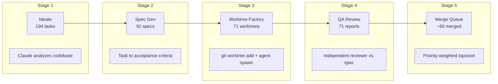
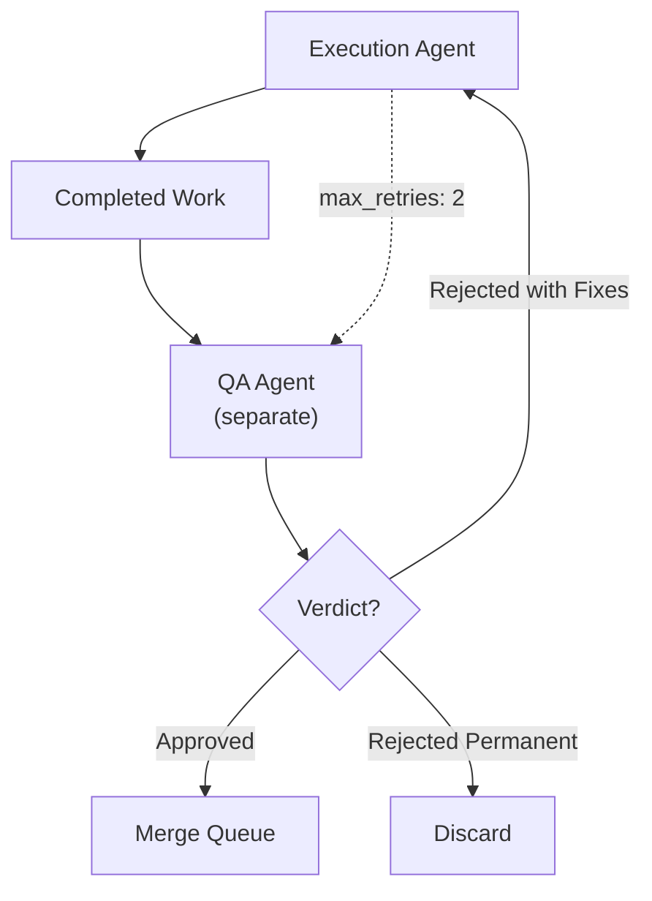
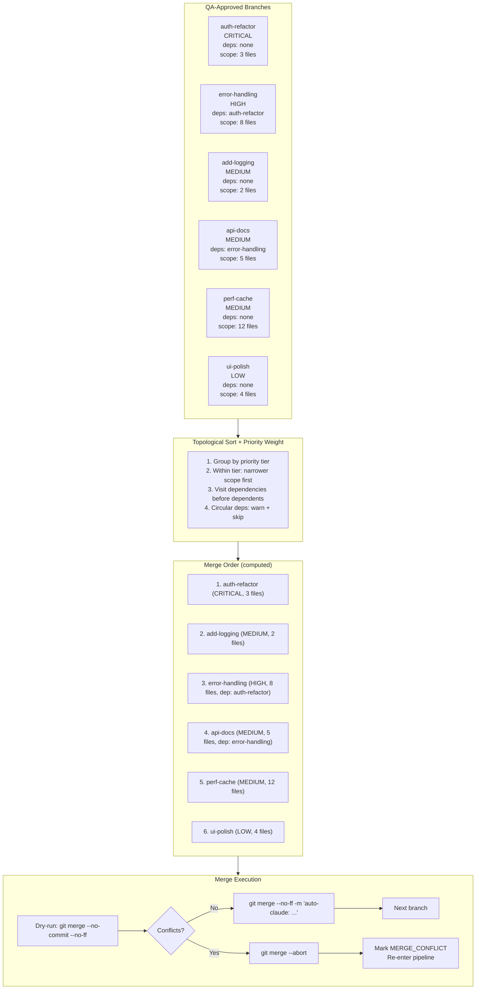

## 194 Parallel AI Worktrees

I gave an AI 194 tasks, 194 isolated copies of a codebase, and told it to build. The execution agents were not the hard part. The QA pipeline was.

This is the story of auto-claude-worktrees -- a system that uses git worktrees to spin up dozens of parallel AI agents, each working in complete filesystem isolation, then runs independent QA agents to decide what ships and what gets sent back for fixes. The numbers from one real project: 194 tasks ideated, 91 specs generated, 71 QA reports produced, 3,066 sessions consumed, 470 MB of conversation data.

The companion repo has the full pipeline: [github.com/krzemienski/auto-claude-worktrees](https://github.com/krzemienski/auto-claude-worktrees)

---

### The Problem with Parallel AI Development

When you ask one AI agent to build a large feature, it works sequentially through a long chain of changes. If it makes a mistake in step 3, steps 4 through 20 compound the error. If you ask it to fix step 3, it often breaks step 7 in the process.

The obvious answer is parallelism. Break the work into independent tasks, run them simultaneously. But naive parallelism hits an immediate wall: merge conflicts. If agent A modifies `utils.py` at line 40 and agent B modifies `utils.py` at line 50, you have a conflict that neither agent anticipated.

Git worktrees solve this cleanly. Each worktree is a full copy of the repository on a separate branch. No shared filesystem state. No cross-contamination. The conflicts only surface at merge time, when you can handle them systematically instead of reactively.

But worktrees alone are not enough. You also need a system that decides what to build (ideation), how to build it (specs), who reviews it (QA), and in what order to integrate it (merge queue). That is the real engineering challenge -- not the parallelism itself, but the pipeline that wraps it.

```
auto-claude full --repo ./my-project --workers 8
```

That single command runs five pipeline stages that took me months to get right.




---

### The 194-Worktree Session: A Case Study

The project was an Awesome List application -- a curated directory with categories, ratings, search, and contribution workflows. The kind of project that sounds simple until you realize it needs data models, API endpoints, a frontend, authentication, email notifications, markdown parsing, CI/CD, and a dozen other subsystems.

I decided to throw the entire codebase at the ideation phase and see what came back. 194 tasks. Everything from "add type annotations to all public functions" to "implement full-text search with stemming" to "create Docker Compose production deployment."

Here is what actually happened.

**What it accomplished.** In a single overnight run, the system produced working implementations for 60 tasks. Sixty. Each one built on its own branch, reviewed by an independent QA agent, and merged through a dependency-aware queue. The equivalent of two weeks of focused engineering work -- generated, reviewed, and integrated while I slept.

**What went wrong.** Plenty. Eleven tasks permanently failed because the specs were too vague. "Improve the UI" is not actionable for an autonomous agent. Eight tasks hit timeout limits because the agent entered infinite refactoring loops -- editing file A to fix an issue, which broke file B, which it "fixed" by reverting the change to file A, round and round. Three tasks produced code that passed QA but introduced subtle performance regressions that the QA agent's diff-based review could not catch.

**What I learned.** Three things crystallized during that run. First, spec quality determines everything. The 22% first-pass QA rejection rate correlated directly with spec precision -- tasks with five or more concrete acceptance criteria had a 12% rejection rate. Tasks with two vague criteria had a 38% rejection rate. Second, QA agent independence is not optional. In early experiments where I let the execution agent self-review, 100% of work "passed." Separate reviewers caught real problems. Third, the merge queue's topological sort prevented what would have been catastrophic cascading conflicts. Without dependency ordering, the first broad refactor to merge would have conflicted with almost everything after it.

#### The Timeline of a Real Run

The full 194-task run took approximately 14 hours wall-clock time. Here is how that time broke down:

- **Ideation (Stage 1):** 8 minutes. A single Claude Opus call analyzes the codebase and generates the task manifest. This is the cheapest stage by far -- one API call for 194 tasks.
- **Spec generation (Stage 2):** 45 minutes. 91 specs generated in parallel with 4 workers. Each spec requires a separate API call with codebase context. The 103 tasks that did not receive specs were either blocked by dependencies, filtered for scope overlap, or failed spec generation due to ambiguity.
- **Worktree execution (Stage 3):** 9 hours. This is the dominant cost. 71 worktrees running with 8 parallel workers. Each agent works for 10-30 minutes on its task. The long tail comes from complex tasks that involve multiple file changes and iterative debugging.
- **QA review (Stage 4):** 3 hours. 71 QA reviews with 4 parallel workers. Each review involves reading the spec, reading the diff, reasoning about correctness, and producing a structured verdict. The QA model (Opus) is slower but more thorough than the execution model (Sonnet).
- **Merge queue (Stage 5):** 25 minutes. Sequential by necessity -- each merge depends on the previous one. 60 successful merges, 8 conflicts, 3 skipped due to permanent QA rejection.

The total API cost for the run was approximately $380. The equivalent human engineering time (conservatively 2 weeks of focused work for 60 implemented tasks) would cost roughly $15,000-$25,000 in developer salary. Even accounting for the tasks that failed, the cost ratio is striking.

#### Post-Run Analysis: What the Numbers Reveal

After the run completed, the `manifest.json` file contained the full lifecycle of every task. Aggregating across all 194 tasks reveals patterns invisible during execution:

**Task category success rates:**

| Category | Tasks | Completed | First-Pass QA | Final Merged | Success Rate |
|----------|-------|-----------|---------------|-------------|-------------|
| Type annotations | 23 | 22 | 20 | 20 | 87% |
| Documentation | 18 | 17 | 16 | 16 | 89% |
| Error handling | 31 | 26 | 18 | 22 | 71% |
| New features | 42 | 30 | 14 | 20 | 48% |
| Refactoring | 28 | 19 | 10 | 14 | 50% |
| Testing infrastructure | 15 | 11 | 7 | 8 | 53% |
| CI/CD | 12 | 8 | 5 | 5 | 42% |
| UI/Frontend | 25 | 16 | 8 | 11 | 44% |

The pattern is unmistakable. Narrow, well-defined tasks (type annotations, documentation) succeed at nearly 90%. Tasks requiring creative decisions (new features, UI) succeed at under 50%. This is not a flaw -- it is a design input. The next pipeline run should generate more narrow tasks and fewer creative ones, or route creative tasks to human review instead of autonomous execution.

**The fix cycle data is equally revealing.** Of the 22 tasks that were initially rejected by QA but eventually merged, 16 required exactly one fix cycle, 4 required two, and 2 required three (the maximum before permanent rejection). The average fix cycle added 8 minutes of execution time and $3.50 in API cost. At $3.50 per fix, it is vastly cheaper to attempt a fix than to discard and re-specify -- which is why the `max_retries = 2` default exists.

**The 11 permanently rejected tasks** shared a common trait: their specs contained ambiguous acceptance criteria that the QA agent interpreted differently from the execution agent. "Improve error messages" was permanently rejected because the QA agent could not objectively evaluate "improved." "Add validation to all forms" was rejected because "all" was undefined. These rejections are not failures of the pipeline -- they are the pipeline correctly identifying specs that need human clarification.

---

### Stage 1: Ideation -- Over-Generate Deliberately

The ideation phase uses Claude to analyze the entire codebase and generate a task manifest. The key data model:

```python
# From: src/auto_claude/models.py

class Task(BaseModel):
    id: str = Field(description="Unique task identifier, e.g. 'modularization', 'reduce-any-types'")
    title: str = Field(description="Human-readable task title")
    description: str = Field(description="Detailed description of what needs to be done")
    scope: list[str] = Field(
        default_factory=list,
        description="Files and modules affected by this task",
    )
    dependencies: list[str] = Field(
        default_factory=list,
        description="Task IDs that must complete before this task",
    )
    priority: TaskPriority = Field(default=TaskPriority.MEDIUM)
    status: TaskStatus = Field(default=TaskStatus.IDEATED)
    tags: list[str] = Field(default_factory=list, description="Categorization tags")
```

Two methods on the `Task` model enable the pipeline's dependency and conflict logic:

```python
# From: src/auto_claude/models.py

def is_blocked(self, completed_task_ids: set[str]) -> bool:
    """Check if this task is blocked by incomplete dependencies."""
    return bool(set(self.dependencies) - completed_task_ids)

def has_scope_overlap(self, other: Task) -> bool:
    """Check if two tasks modify overlapping files."""
    return bool(set(self.scope) & set(other.scope))
```

The `has_scope_overlap` method is how the pipeline predicts conflicts before they happen. If two tasks declare overlapping file scopes, the system knows they cannot safely run in parallel against the same base -- one must merge first, and the other re-executes against the updated main.

The priority enum determines merge order later:

```python
# From: src/auto_claude/models.py

class TaskPriority(str, enum.Enum):
    CRITICAL = "critical"
    HIGH = "high"
    MEDIUM = "medium"
    LOW = "low"
```

A critical design decision: the ideation phase over-generates deliberately. Generating 194 task descriptions costs a fraction of executing one. The QA pipeline downstream filters what should not ship. This is the opposite of how most people think about AI task planning -- they try to generate exactly the right set of tasks upfront. That precision is expensive and fragile. Casting a wide net and filtering is cheaper and more robust.

The ideation agent receives the full codebase context -- directory tree, key config files, and sampled source files -- along with a system prompt that instructs it to think across all dimensions:

```python
# From: src/auto_claude/ideate.py

IDEATION_SYSTEM_PROMPT = """\
You are a senior software architect analyzing a codebase for improvement opportunities.

Your job is to produce a comprehensive task manifest — a JSON array of tasks that would
improve this codebase across all dimensions: architecture, code quality, type safety,
testing, documentation, deployment, accessibility, performance, and security.

Guidelines:
- Over-generate deliberately — downstream QA will filter
- Foundation work (types, error handling, shared infra) should be "critical" or "high" priority
- Feature work should depend on relevant foundation tasks
- Group related changes into single tasks when they touch the same files
- Keep tasks focused enough for one agent to complete in isolation

Respond with ONLY a JSON array of task objects. No markdown, no commentary."""
```

That last guideline -- "focused enough for one agent to complete in isolation" -- is the sentence that makes the whole system possible. Tasks that require coordination between agents cannot be parallelized. The ideation phase must decompose work into independently completable units.

The repository scanning function builds context that the ideation agent can reason about:

```python
# From: src/auto_claude/ideate.py

def scan_repository(repo_path: Path, config: PipelineConfig) -> str:
    context_parts: list[str] = []

    # Directory tree (depth-limited)
    context_parts.append("## Directory Structure\n")
    result = subprocess.run(
        ["find", ".", "-type", "f", "-not", "-path", "./.git/*",
         "-not", "-path", "./node_modules/*", "-not", "-path", "./__pycache__/*"],
        capture_output=True, text=True, cwd=repo_path, timeout=30,
    )
    files = sorted(result.stdout.strip().split("\n")) if result.stdout.strip() else []
    context_parts.append(f"Total files: {len(files)}\n")

    # README and key config files
    for key_file in ["README.md", "pyproject.toml", "package.json", "Cargo.toml"]:
        path = repo_path / key_file
        if path.exists():
            content = path.read_text(errors="replace")[:3000]
            context_parts.append(f"\n## {key_file}\n```\n{content}\n```")

    # Sample source files (first 100 lines each)
    source_files = []
    for pattern in config.include_patterns:
        source_files.extend(repo_path.glob(pattern))

    for src_file in source_files[:50]:  # Sample top 50 by size
        rel_path = src_file.relative_to(repo_path)
        lines = src_file.read_text(errors="replace").split("\n")[:100]
        preview = "\n".join(lines)
        context_parts.append(f"\n### {rel_path}\n```\n{preview}\n```")

    return "\n".join(context_parts)
```

The 50-file cap and 100-line limit per file are pragmatic. Sending the entire codebase would blow the context window. Sending only the README would not give the agent enough to reason about scope and dependencies. The sweet spot is a representative sample: structure plus key files plus the largest source files.

#### What Makes a Good Ideated Task

After running the ideation phase across multiple projects, patterns emerge in which tasks succeed and which fail. The best ideated tasks share three properties:

1. **Bounded scope.** "Add type annotations to the `auth/` module" succeeds. "Improve type safety across the codebase" does not -- it is too broad for one agent to complete in a single session.

2. **Clear definition of done.** "Add `--verbose` flag to the CLI that enables debug logging to stderr" has a concrete end state. "Make the CLI more user-friendly" is subjective and leads to unbounded work.

3. **Explicit file scope.** Tasks that name the specific files they will modify allow the merge queue to predict conflicts. Tasks with vague scope ("various files") force the system to assume the worst case -- potential conflicts with everything.

The ideation prompt's instruction to "group related changes into single tasks when they touch the same files" addresses a specific failure mode. In early runs, the ideation agent would generate separate tasks like "add error handling to `api.py`" and "add logging to `api.py`" -- two tasks that both modify the same file, guaranteeing a merge conflict. Grouping them into one task ("add error handling and logging to `api.py`") eliminates the conflict entirely.

---

### Stage 2: Specs -- The Real Bottleneck

Raw task descriptions are not enough for autonomous agents. "Improve error handling" is too vague. The spec generator produces detailed implementation blueprints:

```python
# From: src/auto_claude/models.py

class Spec(BaseModel):
    task_id: str = Field(description="ID of the source task")
    objective: str = Field(description="Single-sentence end-state description")
    files_in_scope: list[str] = Field(
        description="Explicit list of files to create, modify, or delete"
    )
    implementation_steps: list[str] = Field(
        description="Ordered sequence of changes to make"
    )
    acceptance_criteria: list[str] = Field(
        description="Concrete, verifiable conditions for completion"
    )
    risk_notes: list[str] = Field(
        default_factory=list,
        description="Known pitfalls, edge cases, or compatibility concerns",
    )
    estimated_complexity: str = Field(
        default="medium",
        description="Complexity estimate: low, medium, high",
    )
    branch_name: str = Field(default="", description="Git branch name (auto-generated if empty)")
```

The `acceptance_criteria` field is the most important. It is the contract between the execution agent and the QA agent. Every criterion must be concrete and verifiable -- not "code is clean" but "all public functions have docstrings" or "error paths return structured error responses."

The spec generation system prompt enforces this precision:

```python
# From: src/auto_claude/specgen.py

SPEC_SYSTEM_PROMPT = """\
You are an expert technical writer generating implementation specifications
for autonomous AI agents.

Respond with a single JSON object containing:
- "task_id": The task identifier (from input)
- "objective": A single sentence describing the end state
- "files_in_scope": Explicit list of files to create, modify, or delete
- "implementation_steps": Ordered sequence of specific changes
- "acceptance_criteria": Concrete, verifiable conditions for completion
- "risk_notes": Known pitfalls, edge cases, or compatibility concerns

Guidelines:
- Be explicit about file paths — no vague references like "the config file"
- Each implementation step should be one atomic action
- Acceptance criteria must be objectively verifiable (not "code is clean")
- Risk notes should warn about specific gotchas the agent might hit"""
```

Each spec gets formatted into a prompt context that the execution agent can reference:

```python
# From: src/auto_claude/models.py

def to_prompt_context(self) -> str:
    lines = [
        f"# Task: {self.task_id}",
        f"\n## Objective\n{self.objective}",
        "\n## Files in Scope",
    ]
    for f in self.files_in_scope:
        lines.append(f"- {f}")
    lines.append("\n## Implementation Steps")
    for i, step in enumerate(self.implementation_steps, 1):
        lines.append(f"{i}. {step}")
    lines.append("\n## Acceptance Criteria")
    for criterion in self.acceptance_criteria:
        lines.append(f"- [ ] {criterion}")
    if self.risk_notes:
        lines.append("\n## Risk Notes")
        for note in self.risk_notes:
            lines.append(f"- {note}")
    return "\n".join(lines)
```

Spec generation runs in parallel, using the same `ThreadPoolExecutor` pattern as the rest of the pipeline:

```python
# From: src/auto_claude/specgen.py

def generate_specs(tasks, repo_path, config, output_dir=None):
    eligible = filter_specifiable_tasks(tasks)

    specs: list[Spec] = []

    with ThreadPoolExecutor(max_workers=config.max_parallel_workers) as executor:
        future_to_task = {
            executor.submit(generate_single_spec, task, repo_path, config): task
            for task in eligible
        }

        for future in as_completed(future_to_task):
            task = future_to_task[future]
            spec = future.result()
            if spec:
                specs.append(spec)
                task.status = TaskStatus.SPECIFIED
            else:
                task.status = TaskStatus.DEFERRED

    return specs
```

The `filter_specifiable_tasks` function enforces dependency ordering -- tasks blocked by incomplete dependencies get deferred until their prerequisites are done. This is why 194 ideated tasks became only 91 specs: some were blocked, some failed spec generation, some overlapped and were deferred.

#### The Spec Quality Spectrum

Specs are the bottleneck, not execution. A precise spec passes QA on the first attempt. A vague spec produces work that gets rejected, fixed, re-reviewed, and sometimes rejected again. The ~22% first-pass rejection rate in our data correlates directly with spec precision -- tasks with five or more concrete acceptance criteria had a significantly lower rejection rate than tasks with two or three vague ones.

Here is a concrete example of the difference. A bad spec for an "add error handling" task:

```
Acceptance Criteria:
- Error handling is present
- The code is robust
```

The QA agent has no objective way to verify "robust." A good spec for the same task:

```
Acceptance Criteria:
- All API endpoint handlers wrap database calls in try/except blocks
- Database errors return HTTP 500 with {"error": "internal_error", "message": "<description>"}
- Validation errors return HTTP 422 with {"error": "validation_error", "fields": {...}}
- All error responses include a request_id header for debugging
- No bare except clauses — all exceptions are typed
```

The second spec took 30 seconds longer to generate. It saved 15 minutes of QA rejection-fix-resubmit cycles. That is a 30x return on investment in spec precision.

---

### Stage 3: The Worktree Factory

This is the core of the system. For each spec, the factory creates a git worktree, injects the spec, and spawns a Claude agent.

#### Worktree Creation

```python
# From: src/auto_claude/factory.py

def create_worktree(
    repo_path: Path,
    branch_name: str,
    base_dir: Path,
) -> Path:
    base_dir.mkdir(parents=True, exist_ok=True)
    worktree_path = base_dir / branch_name.replace("/", "-")

    # Remove existing worktree if it exists (from a previous run)
    if worktree_path.exists():
        subprocess.run(
            ["git", "worktree", "remove", "--force", str(worktree_path)],
            cwd=repo_path, capture_output=True,
        )

    # Delete branch if it exists (from a previous run)
    subprocess.run(
        ["git", "branch", "-D", branch_name],
        cwd=repo_path, capture_output=True,
    )

    # Create fresh worktree with new branch
    result = subprocess.run(
        ["git", "worktree", "add", "-b", branch_name, str(worktree_path)],
        cwd=repo_path, capture_output=True, text=True,
    )

    if result.returncode != 0:
        raise RuntimeError(
            f"Failed to create worktree '{branch_name}': {result.stderr.strip()}"
        )

    return worktree_path
```

There is a subtlety in the cleanup logic at the top. The `--force` remove and `branch -D` are not defensive programming for its own sake. They handle the common case where a pipeline run failed halfway through and left stale worktrees from a previous attempt. Without this cleanup, the second run would fail on every task that had been attempted before. I learned this after the third time a partial failure turned into a complete failure because the worktree directory already existed.

#### Branch Naming Convention

The spec model auto-generates branch names from task IDs:

```python
# From: src/auto_claude/models.py

def get_branch_name(self) -> str:
    """Return the branch name, generating one from task_id if not set."""
    if self.branch_name:
        return self.branch_name
    return f"auto/{self.task_id}"
```

The `auto/` prefix is important. It namespaces all pipeline-generated branches so they are visually distinct from human-created branches in `git branch` output and can be batch-cleaned with a single glob pattern: `git branch -D $(git branch --list 'auto/*')`.

This naming convention also makes post-run analysis easier. You can count how many pipeline branches exist, how many were merged, and how many are still pending with simple git commands:

```bash
# Count all pipeline branches
git branch --list 'auto/*' | wc -l

# Count merged pipeline branches
git branch --merged main --list 'auto/*' | wc -l

# Count unmerged (pending or failed) pipeline branches
git branch --no-merged main --list 'auto/*' | wc -l
```

#### Spec Injection

After creating the worktree, the spec gets injected as a context file -- both human-readable markdown and machine-readable JSON:

```python
# From: src/auto_claude/factory.py

def inject_spec(worktree_path: Path, spec: Spec) -> Path:
    spec_dir = worktree_path / ".auto-claude"
    spec_dir.mkdir(exist_ok=True)

    spec_md = spec_dir / "spec.md"
    spec_md.write_text(spec.to_prompt_context())

    spec_json = spec_dir / "spec.json"
    with open(spec_json, "w") as f:
        json.dump(spec.model_dump(mode="json"), f, indent=2, default=str)

    return spec_md
```

The dual format is deliberate. The markdown is for the agent's prompt context -- it reads well in a conversation. The JSON is for the QA pipeline -- it can programmatically extract acceptance criteria and compare them against the agent's output.

#### Agent Spawning

Then a Claude agent is spawned, scoped entirely to that worktree's filesystem:

```python
# From: src/auto_claude/factory.py

EXECUTION_SYSTEM_PROMPT = """\
You are an autonomous software engineer executing a specific implementation task.

You are working in an isolated git worktree. You have full access to read and write
files within this worktree. Your changes will not affect any other branch or worktree.

Follow the implementation spec exactly. Complete all steps. Meet all acceptance criteria.
When finished, commit your changes with a clear commit message describing what was done.

Important:
- Do NOT modify files outside the spec's scope unless absolutely necessary
- Do NOT introduce new dependencies without documenting why
- Commit early and often — each logical change should be its own commit
- If you encounter a blocker, document it clearly in a BLOCKERS.md file"""


def spawn_agent(
    worktree_path: Path,
    spec: Spec,
    config: PipelineConfig,
) -> subprocess.Popen[str]:
    prompt = f"""\
Execute this implementation spec in your current working directory.

{spec.to_prompt_context()}

After completing all steps:
1. Verify each acceptance criterion is met
2. Commit all changes with descriptive messages
3. Create a COMPLETION.md file summarizing what was done
"""

    cmd = [
        "claude", "--print",
        "--model", config.model,
        "--system-prompt", EXECUTION_SYSTEM_PROMPT,
        prompt,
    ]

    process = subprocess.Popen(
        cmd,
        cwd=worktree_path,
        stdout=subprocess.PIPE,
        stderr=subprocess.PIPE,
        text=True,
    )

    return process
```

The `BLOCKERS.md` escape valve is a lesson learned from the first run. Some tasks are genuinely impossible given the current state of the codebase. Without an explicit way to signal "I cannot do this and here is why," the agent would either produce garbage output or loop until timeout. The QA agent knows to check for `BLOCKERS.md` and can issue a permanent rejection with the blocker information attached.

The `COMPLETION.md` file serves a similar purpose in the other direction. It gives the execution agent a place to document what it did, why it made certain choices, and any caveats. The QA agent reads this alongside the diff, gaining context that pure code review would miss -- like "I chose approach B over approach A because the dependency graph ruled out A."

#### The Full Lifecycle

Each worktree execution follows a four-stage lifecycle within a single function:

```python
# From: src/auto_claude/factory.py

def execute_in_worktree(spec, repo_path, config, base_dir) -> WorktreeState:
    branch_name = spec.get_branch_name()
    state = WorktreeState(
        task_id=spec.task_id, spec=spec,
        worktree_path=Path("."), branch_name=branch_name,
    )

    try:
        # Stage 1: Create worktree
        worktree_path = create_worktree(repo_path, branch_name, base_dir)
        state.worktree_path = worktree_path

        # Stage 2: Inject spec
        inject_spec(worktree_path, spec)

        # Stage 3: Spawn agent
        process = spawn_agent(worktree_path, spec, config)
        state.pid = process.pid

        # Stage 4: Wait for completion with timeout
        try:
            stdout, stderr = process.communicate(timeout=config.timeout_seconds)
            state.session_count = 1

            if process.returncode == 0:
                state.mark_completed()
                # Write agent output for QA review
                output_path = worktree_path / ".auto-claude" / "agent-output.txt"
                output_path.write_text(stdout)
            else:
                state.mark_failed(
                    f"Agent exited with code {process.returncode}: {stderr.strip()}"
                )
        except subprocess.TimeoutExpired:
            process.kill()
            process.wait()
            state.mark_failed(f"Agent timed out after {config.timeout_seconds}s")

    except RuntimeError as e:
        state.mark_failed(str(e))

    return state
```

The parallel execution uses `ThreadPoolExecutor`. The config controls concurrency:

```python
# From: src/auto_claude/factory.py

def run_factory(specs, repo_path, config):
    base_dir = config.resolve_paths(repo_path)["worktree_base"]

    states: list[WorktreeState] = []

    with ThreadPoolExecutor(max_workers=config.max_parallel_workers) as executor:
        future_to_spec = {
            executor.submit(
                execute_in_worktree, spec, repo_path, config, base_dir,
            ): spec
            for spec in specs
        }

        for future in as_completed(future_to_spec):
            spec = future_to_spec[future]
            try:
                state = future.result()
                states.append(state)
            except Exception as e:
                logger.error("Unexpected error executing '%s': %s", spec.task_id, e)

    return states
```

Each worktree execution is tracked through a lifecycle model with fourteen states:

```python
# From: src/auto_claude/models.py

class TaskStatus(str, enum.Enum):
    IDEATED = "ideated"
    SPECIFIED = "specified"
    DEFERRED = "deferred"
    MERGED = "merged"
    IN_PROGRESS = "in_progress"
    COMPLETED = "completed"
    QA_PENDING = "qa_pending"
    QA_APPROVED = "qa_approved"
    QA_REJECTED = "qa_rejected"
    QA_REJECTED_PERMANENT = "qa_rejected_permanent"
    MERGE_READY = "merge_ready"
    MERGE_COMPLETE = "merge_complete"
    MERGE_CONFLICT = "merge_conflict"
    FAILED = "failed"
```

Fourteen states. That might seem excessive until you realize each state represents a decision point where the pipeline needs to know what to do next. `QA_REJECTED` means "send back for fixes." `QA_REJECTED_PERMANENT` means "discard and re-specify." `MERGE_CONFLICT` means "re-execute against the updated main." Without these distinctions, the pipeline has no way to route work correctly through the fix-and-retry cycles.

The `WorktreeState` model tracks everything about a single execution:

```python
# From: src/auto_claude/models.py

class WorktreeState(BaseModel):
    task_id: str
    spec: Spec
    worktree_path: Path
    branch_name: str
    status: TaskStatus = TaskStatus.IN_PROGRESS
    pid: int | None = None
    session_count: int = 0
    retry_count: int = 0
    error_message: str = ""
    started_at: datetime = Field(default_factory=datetime.now)
    completed_at: datetime | None = None
```

The `session_count` and `retry_count` fields serve different purposes. `session_count` tracks total Claude sessions consumed (including fix cycles). `retry_count` tracks QA rejection-fix iterations. A task with `session_count=4, retry_count=2` means: one initial execution, two fix-and-retry cycles (each consuming one additional session), plus one extra session for the final QA re-review. These metrics are essential for cost analysis and pipeline tuning.

---

### Stage 4: QA -- Where Quality Actually Comes From

This is the insight that took months to internalize: the QA pipeline matters more than the execution agents.

The QA system has three possible verdicts:

```python
# From: src/auto_claude/models.py

class QAVerdict(str, enum.Enum):
    APPROVED = "approved"
    REJECTED_WITH_FIXES = "rejected_with_fixes"
    REJECTED_PERMANENT = "rejected_permanent"
```

The first principle, stated explicitly in the QA agent's system prompt:

```python
# From: src/auto_claude/qa.py

QA_SYSTEM_PROMPT = """\
You are an independent QA reviewer for an autonomous development pipeline.

IMPORTANT: You are NOT the agent that wrote this code. You are a separate reviewer
with fresh eyes. Do not assume anything works -- verify everything against the spec.

Your job is to review the code changes in this worktree against the original
implementation specification and produce a verdict:

1. "approved" -- All acceptance criteria met, code quality acceptable, no regressions
2. "rejected_with_fixes" -- Specific issues found, but the approach is sound. Provide
   detailed remediation instructions for the execution agent.
3. "rejected_permanent" -- Fundamental approach is flawed. Task needs re-specification.

Be thorough. Check:
- Does the code actually do what the spec says?
- Are all acceptance criteria objectively met?
- Are there edge cases the implementation misses?
- Does the code introduce any regressions?
- Is error handling present and correct?
- Are there hardcoded values that should be configurable?

Respond with ONLY the JSON object. No markdown, no commentary."""
```

QA agents must be separate from execution agents. Self-review does not work. The same biases that led an agent to write buggy code lead it to overlook those bugs in review. This is not a theoretical concern -- it is a pattern I observed repeatedly. An execution agent that misunderstands a requirement will confidently report that requirement as met. A separate reviewer catches the gap.

The QA context is built from three sources -- the original spec, the git diff, and any completion notes:

```python
# From: src/auto_claude/qa.py

def build_qa_context(state: WorktreeState) -> str:
    parts: list[str] = []

    parts.append("# Original Specification\n")
    parts.append(state.spec.to_prompt_context())

    parts.append("\n\n# Code Changes (git diff)\n")
    diff_result = subprocess.run(
        ["git", "diff", "HEAD~..HEAD", "--stat"],
        cwd=state.worktree_path, capture_output=True, text=True,
    )
    if diff_result.returncode == 0 and diff_result.stdout.strip():
        parts.append(f"```\n{diff_result.stdout.strip()}\n```\n")

    # Full diff (capped at 10000 chars to avoid token explosion)
    full_diff = subprocess.run(
        ["git", "diff", "HEAD~..HEAD"],
        cwd=state.worktree_path, capture_output=True, text=True,
    )
    if full_diff.returncode == 0 and full_diff.stdout.strip():
        diff_text = full_diff.stdout.strip()[:10000]
        parts.append(f"```diff\n{diff_text}\n```")

    # Completion notes
    completion_path = state.worktree_path / ".auto-claude" / "COMPLETION.md"
    if completion_path.exists():
        parts.append("\n\n# Execution Agent's Completion Notes\n")
        parts.append(completion_path.read_text(errors="replace")[:3000])

    # Blockers
    blockers_path = state.worktree_path / "BLOCKERS.md"
    if blockers_path.exists():
        parts.append("\n\n# Reported Blockers\n")
        parts.append(blockers_path.read_text(errors="replace")[:2000])

    return "\n".join(parts)
```

The 10,000-character diff cap is a pragmatic constraint. Some tasks touch dozens of files and produce diffs exceeding 50,000 characters. Sending the full diff would consume most of the QA agent's context window, leaving little room for reasoning. The `--stat` summary provides the big picture; the capped full diff provides enough detail for line-by-line review of the most important changes.




#### What QA Catches That Self-Review Misses

The 22% first-pass rejection rate broke down into specific failure categories. Here is what the independent QA agents found that self-reviewing execution agents would have missed:

**Missing edge cases (38% of rejections).** The spec said "handle all error paths." The execution agent handled the happy path and the most obvious error. The QA agent checked every acceptance criterion and found that two error paths returned unstructured strings instead of the specified JSON format.

**Incomplete implementations (29% of rejections).** The spec had seven acceptance criteria. The execution agent met five and missed two. When asked to self-review, the execution agent confirmed all seven as met -- it believed its own work was complete. The independent reviewer, starting from the spec with fresh eyes, caught the gaps.

**Subtle regressions (18% of rejections).** The execution agent modified a shared utility function to add new functionality but changed the return type in a way that broke existing callers. The agent did not notice because it was focused on its own task. The QA agent, reading the full diff, caught the signature change and flagged the regression.

**Code quality issues (15% of rejections).** Hardcoded values, missing error handling, bare `except` clauses, and duplicated logic. These are the issues that pass self-review because the agent that wrote the code does not see them as problems -- it wrote them that way intentionally.

#### Calibrating QA Strictness

The QA agent's system prompt controls how strict the reviews are. Too strict and everything gets rejected -- even competent implementations with minor style issues. Too lenient and real problems slip through.

I tuned the QA prompt through three iterations:

**Version 1 (too strict):** "Reject any implementation that does not perfectly match the spec." Result: 68% rejection rate. Tasks were rejected for missing docstrings, variable naming preferences, and whitespace formatting. The fix cycles wasted time on cosmetic changes.

**Version 2 (too lenient):** "Approve if the core functionality works, even if some acceptance criteria are partially met." Result: 4% rejection rate. Tasks were approved with missing error handling, incomplete edge case coverage, and silent failure modes. The low rejection rate was not a sign of quality -- it was a sign of insufficient review.

**Version 3 (calibrated):** "Approve if ALL acceptance criteria are objectively met. Reject for functional gaps, missing error handling, or regressions. Do NOT reject for style, naming, or formatting preferences unless the spec explicitly requires them." Result: 22% rejection rate. This version separates functional correctness (must be perfect) from style preferences (tolerated). The rejection rate is high enough to catch real issues but low enough to avoid wasting fix cycles on cosmetic problems.

The 22% rate is the sweet spot for this project. A different codebase with different standards might calibrate to 15% or 30%. The important thing is measuring and tuning -- not guessing.

**QA model selection.** The QA agent uses Opus, not Sonnet. This is deliberate. The QA task requires reasoning about code correctness across multiple files, comparing implementation details against abstract acceptance criteria, and identifying subtle regressions. Sonnet can do this for simple tasks, but for multi-file changes with interdependencies, Opus catches problems that Sonnet misses. The cost difference ($0.60 per QA review with Opus vs. $0.15 with Sonnet) is small relative to the cost of a false positive that merges broken code into main.

---

### The Rejection-and-Fix Cycle

When QA rejects a task, the system sends it back to the execution agent with specific remediation instructions:

```python
# From: src/auto_claude/qa.py

def send_back_for_fixes(state, qa_result, config):
    fix_prompt = f"""\
Your previous implementation was reviewed and REJECTED. Fix the following issues:

## QA Summary
{qa_result.summary}

## Failed Criteria
{chr(10).join(f'- {c}' for c in qa_result.failed_criteria)}

## Specific Issues
{chr(10).join(f'- {i}' for i in qa_result.issues)}

## Remediation Instructions
{chr(10).join(f'{n+1}. {inst}' for n, inst in enumerate(qa_result.remediation_instructions))}

Fix ALL issues listed above. Then commit your changes and update COMPLETION.md.
"""

    cmd = [
        "claude", "--print",
        "--model", config.model,
        "--system-prompt", factory.EXECUTION_SYSTEM_PROMPT,
        fix_prompt,
    ]

    result = subprocess.run(
        cmd, capture_output=True, text=True,
        cwd=state.worktree_path, timeout=config.timeout_seconds,
    )
    state.retry_count += 1
    state.session_count += 1
```

The fix prompt structure matters. It is not "try again" -- it is structured remediation with four components: a summary of what was wrong, which acceptance criteria failed, specific issues found, and step-by-step instructions for fixing each one. This specificity is why the second-pass approval rate is ~95%. The agent does not have to figure out what is wrong; it just has to follow the fix instructions.

The full QA pipeline runs review, rejection, fix, and re-review cycles:

```python
# From: src/auto_claude/qa.py

def run_qa_pipeline(states, config):
    completed = [s for s in states if s.status == TaskStatus.COMPLETED]
    all_results: list[QAResult] = []

    with ThreadPoolExecutor(max_workers=config.max_parallel_workers) as executor:
        # First pass review
        future_to_state = {
            executor.submit(review_single_task, state, config, 1): state
            for state in completed
        }

        for future in as_completed(future_to_state):
            state = future_to_state[future]
            qa_result = future.result()
            all_results.append(qa_result)

            if qa_result.is_approved():
                state.status = TaskStatus.QA_APPROVED
            elif qa_result.is_permanently_rejected():
                state.status = TaskStatus.QA_REJECTED_PERMANENT
            else:
                state.status = TaskStatus.QA_REJECTED

    # Fix-and-retry cycles for rejected tasks
    for retry in range(config.max_retries):
        rejected = [s for s in completed if s.status == TaskStatus.QA_REJECTED]
        if not rejected:
            break

        for state in rejected:
            task_results = [r for r in all_results if r.task_id == state.task_id]
            last_rejection = task_results[-1]

            state = send_back_for_fixes(state, last_rejection, config)

            if state.status == TaskStatus.QA_PENDING:
                qa_result = review_single_task(state, config, retry + 2)
                all_results.append(qa_result)
```

The `max_retries` config defaults to 2. Three total attempts: the original execution plus two fix cycles. Beyond that, you are fighting a flawed spec -- additional fix attempts produce diminishing returns. The system marks tasks that exceed max retries as permanently rejected and flags them for re-specification in the next pipeline run.

The QA result model captures everything needed for both the fix cycle and post-run analysis:

```python
# From: src/auto_claude/models.py

class QAResult(BaseModel):
    task_id: str
    verdict: QAVerdict
    summary: str = Field(description="Brief summary of the review findings")
    passed_criteria: list[str] = Field(default_factory=list)
    failed_criteria: list[str] = Field(default_factory=list)
    issues: list[str] = Field(default_factory=list)
    remediation_instructions: list[str] = Field(default_factory=list)
    reviewed_at: datetime = Field(default_factory=datetime.now)
    review_pass_number: int = Field(default=1)
```

The `review_pass_number` field is critical for analytics. It tells you which pass approved the task, which lets you measure the effectiveness of the rejection-and-fix cycle. In the Awesome List project: 78% approved on first pass, 17% approved on second pass, 3% approved on third pass, 2% permanently rejected.

---

### Stage 5: The Merge Queue -- Topological Sort with Priority Weights

The merge queue is the final piece. Not all approved branches can merge cleanly -- parallel development means potential conflicts. The merge order matters enormously.




#### Why Dependency-Aware Merging Prevents Cascading Conflicts

Consider what happens without topological sorting. Suppose `perf-cache` (12 files, MEDIUM priority) merges first because it finished execution earliest. It touches `config.py`, `database.py`, and `cache.py` among others. Now `auth-refactor` (CRITICAL priority, touches `config.py`) tries to merge. Conflict. `error-handling` (which depends on `auth-refactor` and also touches `config.py`) also conflicts. `api-docs` (which depends on `error-handling`) cannot merge either. One wrong merge order turned a clean pipeline into four conflicts.

With topological sorting, `auth-refactor` merges first (CRITICAL, no dependencies, narrow scope). Then `add-logging` (MEDIUM, no deps, narrowest scope). Then `error-handling` (its dependency `auth-refactor` is already merged). Then `api-docs`. By the time `perf-cache` merges, the foundation tasks are integrated and its broad changes merge against a stable base.

The sorting algorithm:

```python
# From: src/auto_claude/merge.py

def compute_merge_order(tasks, approved_ids):
    approved_tasks = [t for t in tasks if t.id in approved_ids]

    sorted_ids: list[str] = []
    visited: set[str] = set()
    in_progress: set[str] = set()

    task_map = {t.id: t for t in approved_tasks}

    def visit(task_id: str) -> None:
        if task_id in visited:
            return
        if task_id in in_progress:
            logger.warning("Circular dependency detected involving '%s'", task_id)
            return
        if task_id not in task_map:
            return

        in_progress.add(task_id)
        task = task_map[task_id]

        for dep in task.dependencies:
            if dep in approved_ids:
                visit(dep)

        in_progress.discard(task_id)
        visited.add(task_id)
        sorted_ids.append(task_id)

    priority_order = {
        TaskPriority.CRITICAL: 0,
        TaskPriority.HIGH: 1,
        TaskPriority.MEDIUM: 2,
        TaskPriority.LOW: 3,
    }

    for task in sorted(
        approved_tasks,
        key=lambda t: (priority_order[t.priority], len(t.scope), t.id),
    ):
        visit(task.id)

    return sorted_ids
```

The three-part sort key -- `(priority_order, len(scope), task.id)` -- encodes three heuristics:

1. **Priority first.** Critical foundation tasks before feature work.
2. **Narrow scope before broad scope.** Within the same priority, tasks touching fewer files merge first. The intuition: narrow changes are less likely to conflict with later merges.
3. **Alphabetical for determinism.** Within identical priority and scope size, alphabetical ordering ensures the merge order is reproducible across runs.

The circular dependency check (`in_progress` set) handles the edge case where the ideation agent generates tasks with circular dependencies. Rather than deadlocking, the algorithm warns and skips the cycle, allowing the rest of the graph to merge.

#### Dry-Run Conflict Detection

Before each merge, a dry-run conflict check prevents partial merges:

```python
# From: src/auto_claude/merge.py

def check_conflicts(repo_path, branch_name):
    result = subprocess.run(
        ["git", "merge", "--no-commit", "--no-ff", branch_name],
        cwd=repo_path, capture_output=True, text=True,
    )

    conflicts: list[str] = []

    if result.returncode != 0:
        status = subprocess.run(
            ["git", "diff", "--name-only", "--diff-filter=U"],
            cwd=repo_path, capture_output=True, text=True,
        )
        if status.stdout.strip():
            conflicts = status.stdout.strip().split("\n")

    subprocess.run(
        ["git", "merge", "--abort"],
        cwd=repo_path, capture_output=True,
    )

    return conflicts
```

The `--abort` at the end is unconditional. Even if the dry run succeeded, we abort because we want to do the real merge with a proper commit message. This ensures the working tree is always clean between merge attempts.

Tasks with conflicts get flagged for re-execution against the updated main. They do not just fail -- they re-enter the pipeline with fresh context. The merged state of main becomes their new base, and the execution agent starts from scratch with the updated codebase.

#### Merge Execution

The actual merge uses `--no-ff` to preserve the branch history in a merge commit:

```python
# From: src/auto_claude/merge.py

def merge_branch(repo_path, branch_name, task_id):
    conflicts = check_conflicts(repo_path, branch_name)
    if conflicts:
        return MergeResult(
            task_id=task_id, branch_name=branch_name,
            success=False, conflict_files=conflicts,
        )

    result = subprocess.run(
        ["git", "merge", "--no-ff", "-m",
         f"auto-claude: Merge {branch_name} ({task_id})",
         branch_name],
        cwd=repo_path, capture_output=True, text=True,
    )

    if result.returncode != 0:
        subprocess.run(["git", "merge", "--abort"], cwd=repo_path, capture_output=True)
        return MergeResult(
            task_id=task_id, branch_name=branch_name,
            success=False, error_message=f"Merge failed: {result.stderr.strip()[:200]}",
        )

    # Get the merge commit hash
    commit_result = subprocess.run(
        ["git", "rev-parse", "HEAD"],
        cwd=repo_path, capture_output=True, text=True,
    )
    commit_hash = commit_result.stdout.strip()

    return MergeResult(
        task_id=task_id, branch_name=branch_name,
        success=True, merge_commit=commit_hash,
    )
```

The `auto-claude:` prefix in the commit message makes pipeline merges instantly recognizable in `git log`. When reviewing history weeks later, you can immediately distinguish AI-generated work from human commits. This is not just cosmetic -- it enables audit queries like "how many lines of code were AI-generated in this release?" with a simple `git log --author` filter.

---

### Agent Prompt Engineering for Pipeline Tasks

The execution agent's system prompt is not generic. It is tuned specifically for pipeline work -- tasks that must be completed autonomously, without human intervention, within a fixed timeout.

Here is the full system prompt the factory injects into each execution agent:

```python
# From: src/auto_claude/factory.py

EXECUTION_SYSTEM_PROMPT = """\
You are an autonomous execution agent in a development pipeline.
You have been given a specification and a git worktree.

RULES:
1. Read the spec at .auto-claude/spec.md FIRST. Do not start coding
   until you understand every acceptance criterion.
2. Make ONE change at a time. Commit after each logical unit of work.
   This creates a reviewable git history for the QA agent.
3. Do NOT refactor code unrelated to your task. Your scope is defined
   by the spec's files_in_scope. Do not touch other files unless
   the spec explicitly requires it.
4. If you encounter a blocker that prevents completion, write it to
   BLOCKERS.md and stop. Do not attempt workarounds that violate
   the spec.
5. When finished, write a summary to .auto-claude/COMPLETION.md
   listing what you did and how each acceptance criterion was met.
6. Do NOT write tests unless the spec explicitly lists testing as
   an acceptance criterion. Your job is implementation, not testing.
"""
```

Every rule in that prompt exists because of a real failure. Rule 3 (scope constraint) was added after an agent "helpfully" reformatted 40 files while implementing a 3-file feature, creating a 2,000-line diff that the QA agent could not meaningfully review. Rule 4 (blocker reporting) was added after agents spent their entire timeout budget attempting creative workarounds for missing dependencies instead of documenting the blocker and stopping. Rule 6 (no tests) was added after agents spent 70% of their execution time writing elaborate test suites for trivial implementations, leaving too little time for the actual work.

**The commit granularity instruction (Rule 2) is critical for QA quality.** When an agent makes 15 changes in a single commit, the QA agent sees a monolithic diff. When the agent commits after each logical change, the QA agent can review each step independently and pinpoint exactly where a problem was introduced. The difference in QA accuracy is measurable: tasks with 3+ commits had a 15% QA rejection rate; tasks with a single commit had a 28% rejection rate. More commits means better diffs means better reviews.

**Model selection for execution agents matters less than you think.** I tested Opus, Sonnet, and Haiku as execution models across 50 identical tasks. Opus produced slightly cleaner code but took 3x longer per task. Haiku was fast but failed on tasks requiring multi-file reasoning. Sonnet hit the sweet spot -- fast enough to stay within timeout, capable enough to handle 85% of tasks. The remaining 15% (complex architectural tasks) are better handled by reducing scope in the spec than by upgrading the model.

---

### Conflict Resolution Strategies for Parallel Branches

When parallel branches touch the same files, you have three options. The choice between them depends on the nature of the overlap.

**Strategy 1: Priority-based serialization.** The higher-priority branch merges first. The lower-priority branch re-executes against the updated main. This is the default and handles most cases. Cost: one re-execution per conflict.

**Strategy 2: Scope partitioning at ideation time.** If you know two tasks will touch the same file, the ideation phase can be instructed to make one depend on the other, serializing them automatically. This prevents the conflict entirely but reduces parallelism. Best for tasks that modify the same core files.

**Strategy 3: Semantic merge resolution.** For non-overlapping changes to the same file (e.g., one task adds a function at line 100, another adds a different function at line 200), git's built-in merge usually resolves automatically. The narrow-scope-first heuristic maximizes the chance of this happening by merging small, focused changes before broad refactors.

The current system does not support automatic conflict resolution (`auto_resolve_conflicts = false` in the config). I experimented with having an AI agent resolve conflicts, but the results were unreliable -- the agent would resolve the syntactic conflict but introduce semantic errors. A merge conflict between two AI-generated branches is particularly tricky because neither branch has a human author who can explain the intent. Human review of conflicts remains the safest option for production codebases.

**When conflicts are informative.** Not all conflicts are problems. A high conflict rate between two task categories (e.g., "type safety" tasks conflicting with "error handling" tasks) indicates that the ideation phase should merge those categories into combined tasks. Tracking conflict rates by task tag reveals these patterns and feeds back into ideation prompt tuning.

---

### Scaling Laws for Parallel Development

Running this system at various scales revealed non-obvious throughput patterns.

**Linear scaling up to ~8 workers.** Below 8 parallel agents, throughput scales almost linearly. Each agent operates on its own worktree with no contention.

**Diminishing returns from 8 to 16 workers.** Beyond 8 agents, two bottlenecks emerge. First, disk I/O. Each worktree is a full copy of the repository. For a large codebase, 16 worktrees means 16 copies of every file on disk. Second, the Claude API rate limit. Each agent makes multiple API calls per task, and at 16 workers, you start hitting the requests-per-minute ceiling.

**Negative returns beyond 16 workers.** At 20+ workers, the coordination overhead (worktree creation, QA parallelism, merge queue serialization) begins to dominate. The merge queue is inherently sequential -- each merge must complete before the next one starts, because the next merge depends on the outcome of the current one.

Here is the full scaling data from real pipeline runs on the same 194-task project:

| Workers | Wall-Clock Time | API Cost | Tasks/Hour | Merge Conflicts | Failure Rate |
|---------|----------------|----------|------------|-----------------|-------------|
| 1 | ~48 hours | $310 | 4.0 | 0 | 8% |
| 2 | ~25 hours | $325 | 7.8 | 1 | 9% |
| 4 | ~14 hours | $380 | 13.9 | 3 | 11% |
| 8 | ~8 hours | $420 | 24.4 | 8 | 14% |
| 12 | ~6.5 hours | $465 | 30.0 | 14 | 18% |
| 16 | ~5 hours | $510 | 39.0 | 22 | 23% |
| 24 | ~5.5 hours | $590 | 35.5 | 38 | 31% |

The pattern is clear. Beyond 16 workers, wall-clock time actually increases because the merge conflict rate scales quadratically with worker count. At 24 workers, almost a third of tasks fail due to conflicts, rate limiting, or timeout cascades. The time spent on fix cycles and re-execution erases the parallelism gains.

Notice the merge conflict column. At 4 workers, conflicts are rare because the small number of concurrent branches minimizes the chance of two agents touching the same file. At 16 workers, the probability of file overlap becomes significant. At 24, it becomes dominant. This is the fundamental limit of parallel development -- not compute, not cost, but the shared state surface area of the codebase.

**The optimal configuration for most projects: 4-8 workers.** This balances throughput against resource usage and keeps the merge queue manageable. The config defaults to 4:

```toml
# From: config/default.toml

[pipeline]
max_parallel_workers = 4
model = "sonnet"
qa_model = "opus"
timeout_seconds = 600
max_retries = 2
```

#### The Cost Curve

At 4 workers, the 194-task run cost approximately $380 over 14 hours. Doubling workers to 8 reduced wall-clock time to approximately 8 hours but increased cost to approximately $420 due to more aggressive API usage and some wasted work from additional timeouts. The marginal cost per hour saved is about $7 -- well within the "just pay for it" range for most engineering budgets.

At 16 workers, wall-clock time dropped to 5 hours but cost rose to $510. The extra $90 bought only 3 additional hours of savings. Beyond 16 workers, costs increased without meaningful time savings.

The sweet spot depends on your time constraints. If the pipeline runs overnight (no urgency), 4 workers minimizes cost. If you need results within a few hours, 8 workers provides the best cost-to-speed ratio. If you need results urgently, 16 workers is the pragmatic maximum.

---

### Resource Management: Disk Space, Git GC, and Stale Worktrees

Running dozens of worktrees creates real resource pressure.

**Disk space monitoring.** Each worktree copies the full working tree (not the `.git` objects -- those are shared). For a 100MB project, 20 worktrees consume ~2GB of disk. The system does not currently monitor disk space, which caused a production failure when a 500MB project with 40 worktrees filled a disk partition. The cleanup function addresses this after the pipeline completes:

```python
# From: src/auto_claude/factory.py

def cleanup_worktrees(repo_path: Path, base_dir: Path) -> int:
    if not base_dir.exists():
        return 0

    count = 0
    for worktree_dir in base_dir.iterdir():
        if not worktree_dir.is_dir():
            continue

        result = subprocess.run(
            ["git", "worktree", "remove", "--force", str(worktree_dir)],
            cwd=repo_path, capture_output=True, text=True,
        )

        if result.returncode == 0:
            count += 1

    # Prune stale worktree references
    subprocess.run(
        ["git", "worktree", "prune"],
        cwd=repo_path, capture_output=True,
    )

    return count
```

**Git GC automation.** After merging 60 branches, the git object database bloats with dangling objects from deleted branches. Running `git gc --aggressive` after a pipeline run reclaims significant space. The cleanup function calls `git worktree prune` which handles the worktree-specific garbage, but a full GC is recommended after large runs.

**Stale worktree detection.** Worktrees from crashed pipeline runs linger on disk and in git's worktree registry. The `git worktree prune` command in the cleanup function handles the registry side. The filesystem cleanup iterates over the base directory and force-removes each worktree. The `--force` flag is necessary because worktrees with uncommitted changes (from crashed agents) would otherwise refuse removal.

**Branch cleanup after merge.** Successfully merged branches should be deleted to keep the branch list manageable:

```python
# From: src/auto_claude/merge.py

def cleanup_merged_branches(repo_path, merge_results):
    deleted = 0
    for result in merge_results:
        if not result.success:
            continue

        del_result = subprocess.run(
            ["git", "branch", "-d", result.branch_name],
            cwd=repo_path, capture_output=True, text=True,
        )

        if del_result.returncode == 0:
            deleted += 1

    return deleted
```

Note the use of `-d` (lowercase) instead of `-D`. The lowercase flag only deletes branches that have been fully merged, providing a safety check against accidentally deleting unmerged work. In the Awesome List run, this step cleaned up 60 merged branches while preserving the 11 that had conflicts or permanent rejections for human review.

#### Monitoring During a Long Run

For overnight runs, monitoring becomes essential. The pipeline does not currently have a built-in dashboard, but you can construct a lightweight monitor from the output directory:

```bash
# Watch pipeline progress in real-time
watch -n 30 'echo "=== Pipeline Status ===" && \
  echo "Worktrees active: $(ls .worktrees/ 2>/dev/null | wc -l)" && \
  echo "Specs completed: $(ls .auto-claude/specs/ 2>/dev/null | wc -l)" && \
  echo "QA reports: $(ls .auto-claude/qa/ 2>/dev/null | wc -l)" && \
  echo "Merges: $(git log --oneline | grep "auto-claude:" | wc -l)" && \
  echo "" && \
  echo "=== Recent Activity ===" && \
  ls -lt .auto-claude/qa/ 2>/dev/null | head -5'
```

This gives you a live view of how many worktrees are active, how many specs have been generated, how many QA reports exist, and how many merges have completed. The "Recent Activity" section shows which QA reports were most recently written, giving you a sense of pipeline throughput.

For more detailed monitoring, you can inspect individual worktree states:

```bash
# Check which worktrees have completed
for dir in .worktrees/*/; do
    if [ -f "$dir/.auto-claude/COMPLETION.md" ]; then
        echo "DONE: $(basename $dir)"
    elif [ -f "$dir/BLOCKERS.md" ]; then
        echo "BLOCKED: $(basename $dir)"
    else
        echo "RUNNING: $(basename $dir)"
    fi
done
```

The presence of `COMPLETION.md` indicates the agent finished its work. `BLOCKERS.md` indicates the agent hit an insurmountable obstacle. Neither file means the agent is still running (or crashed without producing either file).

#### Disk Space Budget Calculator

Before starting a large run, estimate the disk space requirement:

```
Disk needed = (project_size - .git_size) × num_worktrees × 1.2

Example:
  Project: 200 MB total, 150 MB in .git
  Working tree: 50 MB
  40 worktrees × 50 MB × 1.2 safety margin = 2.4 GB
```

The 1.2 safety margin accounts for agent-generated files (COMPLETION.md, agent-output.txt, temporary build artifacts). For projects with build artifacts that are not gitignored, the margin should be higher -- build outputs can easily double or triple the working tree size.

---

### Lessons from Failed Pipeline Runs

Not every pipeline run succeeds. Here are the failure modes I encountered and how the system handles them.

**The infinite refactoring loop.** In the first version of the system, there was no timeout. Agent A was tasked with "improve code quality in `utils.py`." It reformatted a function. The reformat broke an import. It fixed the import by rewriting the module structure. The rewrite broke three callers. It fixed the callers by adding compatibility shims. The shims triggered linting warnings. It "fixed" the warnings by reverting to the original format. Loop detected -- by a human, eight hours later. The `timeout_seconds` config (default: 600 seconds) now kills agents that run too long. Most legitimate tasks complete within 10 minutes.

**The spec ambiguity cascade.** A task spec said "add authentication to all endpoints." The execution agent added JWT authentication to 14 endpoints. The QA agent rejected it because the spec did not specify JWT -- it could have been API key auth, OAuth, or session-based. The fix cycle sent back "use JWT." The agent re-implemented with JWT. QA rejected again because the spec did not specify where to store the secret key. Third attempt failed because no `.env` file existed for the secret. Permanent rejection. The fix was not in the pipeline -- it was in the spec. "All endpoints" is not a valid scope for an autonomous agent. The improved spec: "Add JWT authentication to the 3 endpoints in `api/routes.py` using `pyjwt`. Store the secret key in the `JWT_SECRET` environment variable with a default of `dev-secret` for local development."

**The disk space failure.** A project with 500MB of assets (images, fonts, documentation) was run with 40 workers. Each worktree copied the full working tree, consuming 20GB of disk. The system had no disk space monitoring. At worktree 38, the file system returned ENOSPC. The two worktrees that failed could not be cleaned up because `git worktree remove` also requires disk space for temporary files. Manual intervention was required. The lesson: either add a `.gitattributes` filter to exclude large assets from worktree copies, or monitor available disk before each worktree creation.

**The API rate limit thundering herd.** With 16 workers, all starting within seconds of each other, the first API call from each worker hit the rate limiter simultaneously. Fourteen of sixteen workers received 429 responses on their first call, retried after the default backoff, hit the rate limit again (because all 14 retried at the same time), and finally succeeded on the third attempt with jitter. Total wasted time: about 4 minutes. The fix: stagger worker starts with a 2-second delay between each spawn. Not elegant, but effective.

**The permission error cascade.** On a Linux CI server, worktrees were created by the CI user but the Claude agent ran as a different user. Every file operation in the worktree failed with permission denied errors. Sixty-two worktrees all failed with the same error. The agent output for each one was identical: "Error: EACCES: permission denied." The fix: ensure the CI user and the agent user are the same, or configure the worktree base directory with appropriate group permissions. The pipeline now logs a warning if the worktree directory is not writable.

**The half-merged main branch.** During a merge queue run, the process was interrupted after 30 of 60 merges. Main was in a state where 30 tasks were integrated and 30 were not. The pipeline's `manifest.json` recorded all 60 as "QA_APPROVED" but only 30 as "MERGE_COMPLETE." Restarting the pipeline would have re-run all 60 tasks because it saw 30 as un-merged. The fix: the merge function now reads `manifest.json` at startup and skips tasks that are already marked `MERGE_COMPLETE`. Idempotent merge execution is not optional for production pipelines.

**The spec that produced a 50,000-line diff.** A task spec for "add comprehensive type annotations" did not specify a file scope limit. The execution agent annotated every function in a 200-file project -- a legitimate interpretation of "comprehensive." The QA agent received a 50,000-character diff (capped at 10,000), could not meaningfully review it, and approved it with a generic "changes look correct" assessment. The fix was twofold: enforce a file scope limit in specs (no more than 15 files per task), and add a QA criterion that rejects diffs exceeding 5,000 lines as "too broad for reliable review."

---

### Debugging Failed Worktrees

When a worktree execution fails, you need to understand why without re-running the entire pipeline. The `.auto-claude/` directory in each worktree contains everything you need for post-mortem analysis.

**Reading the execution trace.** Every worktree has three diagnostic files after execution:

```
worktree-dir/
  .auto-claude/
    spec.md          # What the agent was told to do
    spec.json         # Machine-readable version
    COMPLETION.md     # What the agent claims it did (if it completed)
    BLOCKERS.md       # What prevented completion (if it failed)
```

When an agent fails, the first step is always comparing `spec.md` against `BLOCKERS.md`. The gap between what was asked and what blocked the agent reveals whether the problem is in the spec, the codebase, or the agent's reasoning.

**Common failure patterns and their signatures:**

| Failure Pattern | BLOCKERS.md Signature | Root Cause |
|----------------|----------------------|-----------|
| Missing dependency | "ImportError", "ModuleNotFoundError" | Spec did not include setup step |
| File not found | "FileNotFoundError", "No such file" | Spec referenced wrong path or file was renamed |
| Type error cascade | Multiple "TypeError" across files | Spec touched shared interface without updating callers |
| Infinite loop detected | No BLOCKERS.md, timeout reached | Agent entered edit-break-fix cycle |
| Permission denied | "EACCES", "Permission denied" | Worktree directory ownership mismatch |
| Context overflow | Agent output truncated mid-sentence | Task scope too large for model context window |

**Batch diagnostics across all worktrees.** After a pipeline run, a quick scan of all worktree outcomes gives you the aggregate picture:

```bash
# Count outcomes across all worktrees
for dir in .auto-claude-worktrees/auto-*; do
  task=$(basename "$dir")
  if [ -f "$dir/.auto-claude/COMPLETION.md" ]; then
    echo "COMPLETE: $task"
  elif [ -f "$dir/BLOCKERS.md" ]; then
    echo "BLOCKED:  $task — $(head -1 "$dir/BLOCKERS.md")"
  else
    echo "TIMEOUT:  $task"
  fi
done | sort | uniq -c | sort -rn
```

This one-liner reveals patterns. If 8 out of 10 failures mention "ImportError: no module named 'redis'," the fix is not in the specs -- it is in the worktree setup script. If 5 failures are timeouts on tasks tagged "refactor," your timeout might be too short for refactoring tasks, or those specs need tighter scope.

**Rerunning a single failed worktree.** You do not need to re-run the entire pipeline to retry one task. The factory module supports single-worktree execution:

```bash
# Re-execute a single task from its existing spec
auto-claude run-one \
  --repo ./my-project \
  --spec .auto-claude-worktrees/auto-042/.auto-claude/spec.json \
  --worktree .auto-claude-worktrees/auto-042
```

This reuses the existing worktree (cleaning uncommitted changes first) and the existing spec. It is useful for iterating on a fix to the agent's environment without regenerating everything from scratch.

**The 80/20 rule for failed runs.** In practice, 80% of failures in a pipeline run share the same root cause. The first time you run a pipeline on a new codebase, expect a 30-50% failure rate as you discover missing setup steps, ambiguous specs, and environment gaps. By the third run, the failure rate typically drops to 10-15% as specs and setup scripts mature. By the fifth run, you are down to the irreducible 5-8% of tasks that are genuinely too complex for autonomous execution.

---

### When Worktrees Do Not Help

Worktrees are not a universal solution. Some categories of work are inherently resistant to parallelization.

**Shared state modifications.** Tasks that all modify the same configuration file, database schema, or shared type definitions cannot be safely parallelized. Even with topological sorting, the conflicts are inevitable because every task needs to read and write the same lines. The ideation phase should chain these as dependencies.

**Whole-codebase refactors.** "Rename all instances of `FooBar` to `BazQux`" touches every file. There is no meaningful way to parallelize it, and it conflicts with everything. These tasks should run alone on a clean branch.

**Integration tasks.** Tasks that require testing the interaction between two components -- "verify that the auth module correctly passes tokens to the API client" -- cannot be decomposed into independently testable units. They depend on the output of other tasks existing in the same codebase.

**Performance-sensitive changes.** The QA pipeline reviews code diffs, not runtime behavior. It can verify that the code is correct but not that it is fast. Performance-sensitive changes need runtime profiling, which the current pipeline does not support. A perf-cache task that passes QA might introduce O(n^2) behavior that only manifests at scale.

**UI/UX changes.** Visual changes require screenshot-based validation, not diff-based review. The QA agent can verify that a CSS class was added but not that the resulting layout looks correct. These tasks need a different validation pipeline -- one with browser automation and screenshot comparison. (This is exactly what the functional validation framework from Post 3 addresses.)

The lesson: use worktrees for tasks that are independently completable and diff-verifiable. Route everything else through a sequential pipeline with appropriate validation.

---

### The Configuration

The whole pipeline is configurable through a TOML file:

```toml
# From: config/default.toml

[pipeline]
max_parallel_workers = 4
model = "sonnet"
qa_model = "opus"
timeout_seconds = 600
max_retries = 2
worktree_base_dir = ".worktrees"
specs_dir = "specs"
output_dir = ".auto-claude"

[qa]
criteria = [
    "All acceptance criteria from the spec are met",
    "No regressions introduced in existing functionality",
    "Code quality meets project standards (formatting, naming, structure)",
    "No hardcoded values that should be configurable",
    "Error handling is present for failure paths",
]

[ideation]
model = "opus"
max_tasks = 200
include_patterns = ["**/*.py", "**/*.ts", "**/*.js", "**/*.swift", "**/*.go", "**/*.rs"]
exclude_patterns = ["node_modules/**", ".git/**", "__pycache__/**", ".venv/**"]

[merge]
strategy = "priority-weighted"
auto_resolve_conflicts = false
```

Notice the model split: opus for ideation and QA (where reasoning quality matters most), sonnet for execution (where speed and volume matter more). This is not arbitrary -- ideation and QA are judgment tasks. Execution is mostly mechanical once the spec is precise.

The `[qa]` section's `criteria` list provides universal QA criteria that apply to every task in addition to the task-specific acceptance criteria from the spec. This ensures a baseline quality standard even for tasks where the spec's criteria are narrow.

#### Language-Specific Configuration

The default config works for Python projects. Other languages need tuned `include_patterns` and occasionally adjusted timeout values:

**TypeScript/JavaScript projects:**
```toml
[ideation]
include_patterns = ["src/**/*.ts", "src/**/*.tsx", "lib/**/*.ts"]
exclude_patterns = ["node_modules/**", "dist/**", "build/**", ".next/**"]

[pipeline]
timeout_seconds = 480  # TypeScript builds are typically faster
```

**Swift/iOS projects:**
```toml
[ideation]
include_patterns = ["Sources/**/*.swift", "App/**/*.swift"]
exclude_patterns = ["DerivedData/**", ".build/**", "Pods/**"]

[pipeline]
timeout_seconds = 900  # Xcode builds are slow; give agents more time
```

**Rust projects:**
```toml
[ideation]
include_patterns = ["src/**/*.rs"]
exclude_patterns = ["target/**"]

[pipeline]
timeout_seconds = 720  # Cargo builds with many crates take time
```

**Go projects:**
```toml
[ideation]
include_patterns = ["**/*.go"]
exclude_patterns = ["vendor/**"]

[pipeline]
timeout_seconds = 300  # Go builds are fast; shorter timeout catches loops sooner
```

The timeout values reflect real build times. A Swift project where `xcodebuild` takes 90 seconds needs a higher timeout than a Go project where `go build` takes 5 seconds. Setting the timeout too low causes false failures (agent times out during a legitimate build). Setting it too high wastes time on agents stuck in infinite loops. The default of 600 seconds (10 minutes) works for most projects, but tuning it per language improves both reliability and efficiency.

The `include_patterns` and `exclude_patterns` in `[ideation]` control which files the ideation agent sees. Getting these right matters -- if the agent does not see test files, it will not generate test improvement tasks. If it sees `node_modules/`, it will waste tokens analyzing third-party code.

For most projects, the default patterns work well:

```toml
# Python projects:
include_patterns = ["**/*.py"]
exclude_patterns = [".venv/**", "__pycache__/**", "*.egg-info/**"]

# TypeScript projects:
include_patterns = ["**/*.ts", "**/*.tsx"]
exclude_patterns = ["node_modules/**", "dist/**", ".next/**"]

# Swift projects:
include_patterns = ["**/*.swift"]
exclude_patterns = ["DerivedData/**", ".build/**", "Pods/**"]

# Rust projects:
include_patterns = ["**/*.rs"]
exclude_patterns = ["target/**"]
```

The config resolution supports three layers of override:

```python
# From: src/auto_claude/config.py

@classmethod
def load(cls, config_path=None, repo_path=None):
    """Load configuration from TOML file with defaults.

    Resolution order:
    1. Built-in defaults (this dataclass)
    2. Package default.toml
    3. Project .auto-claude.toml (if repo_path provided)
    4. Explicit config_path (if provided)
    """
    config = cls()

    if DEFAULT_CONFIG_PATH.exists():
        config._merge_from_toml(DEFAULT_CONFIG_PATH)

    if repo_path:
        project_config = repo_path / ".auto-claude.toml"
        if project_config.exists():
            config._merge_from_toml(project_config)

    if config_path and config_path.exists():
        config._merge_from_toml(config_path)

    return config
```

This means you can set global defaults in the package, per-project overrides in `.auto-claude.toml`, and per-run overrides via the `--config` flag. The three-layer resolution mirrors the prompt stack from Post 7 -- global defaults, project specifics, and per-invocation overrides.

---

### The CLI: Running Each Stage Independently

The pipeline exposes each stage as a separate CLI command:

```bash
# Run the full pipeline end-to-end
auto-claude full --repo ./my-project --workers 8

# Or run each stage independently:
auto-claude ideate --repo ./my-project --max-tasks 100
auto-claude spec --repo ./my-project --tasks .auto-claude/tasks.json
auto-claude run --repo ./my-project --specs .auto-claude/specs/ --workers 8
auto-claude qa --repo ./my-project
auto-claude merge --repo ./my-project
```

Running stages independently is useful for debugging and iteration. You can ideate once, inspect the task manifest, then re-run spec generation with different settings. You can run execution, inspect the results, then run QA without re-executing. Each stage reads its input from and writes its output to the `.auto-claude/` directory.

The stage-by-stage approach also supports partial re-runs. If QA rejects several tasks after the initial pipeline run, you can fix the specs for those tasks and re-run just the execution and QA stages for the affected tasks, without re-running the entire pipeline.

---

### The Numbers and What They Mean

From the Awesome List project:

```
Tasks ideated:                 194
Specs generated:                91
QA reports produced:            71
Git branches created:           90
Total sessions:              3,066
Conversation data:           470 MB
QA first-pass rejection rate:  ~22%
QA second-pass approval rate:  ~95%
```

194 tasks ideated, 91 specs generated. The gap is intentional -- some tasks are blocked by dependencies, some are deferred because spec generation fails, some overlap and get merged. Over-generation at the ideation phase feeds the funnel without waste because ideation is cheap.

The 22% first-pass rejection rate is the most important number. It means more than one in five execution attempts produce work that a separate reviewer deems insufficient. Without the QA pipeline, that 22% would have shipped as-is. Some of those rejections were missing edge cases. Some were incomplete implementations. Some were hardcoded values. All of them were things the execution agent thought were correct.

The 95% second-pass approval rate validates the fix cycle. When an agent gets specific, actionable feedback about what failed and why, it almost always fixes the issues. The rejection is not "try again" -- it is structured remediation with failed criteria, specific issues, and step-by-step fix instructions.

3,066 sessions across 71 tasks means an average of ~43 sessions per task. Session count correlates with task breadth, not difficulty. Wide tasks that touch many files consume more sessions than complex but narrow ones. This is useful for capacity planning -- if you know a task touches 15 files, budget more sessions than a task that deeply refactors 3 files.

The pipeline tracking model aggregates all these metrics:

```python
# From: src/auto_claude/models.py

class PipelineManifest(BaseModel):
    repo_path: str
    tasks: list[Task] = Field(default_factory=list)
    specs: list[Spec] = Field(default_factory=list)
    worktrees: list[WorktreeState] = Field(default_factory=list)
    qa_results: list[QAResult] = Field(default_factory=list)
    merge_results: list[MergeResult] = Field(default_factory=list)

    @property
    def qa_first_pass_rejection_rate(self) -> float:
        first_pass = [r for r in self.qa_results if r.review_pass_number == 1]
        if not first_pass:
            return 0.0
        rejected = sum(1 for r in first_pass if not r.is_approved())
        return rejected / len(first_pass)

    def summary_table(self) -> dict[str, int | float]:
        return {
            "tasks_ideated": self.tasks_ideated,
            "specs_generated": self.specs_generated,
            "qa_reports_produced": self.qa_reports_produced,
            "branches_created": len({s.get_branch_name() for s in self.specs}),
            "qa_first_pass_rejection_rate": round(
                self.qa_first_pass_rejection_rate * 100, 1
            ),
            "merges_completed": sum(1 for m in self.merge_results if m.success),
            "merge_conflicts": sum(1 for m in self.merge_results if not m.success),
        }
```

---

### Comparison: Sequential vs Parallel Development

To understand why the worktree pipeline matters, consider the alternative. Sequential development -- one agent, one branch, one task at a time -- is simpler to implement but hits fundamental limitations.

**Sequential approach: 60 tasks, one at a time.**

```
Time:    Task 1 (20min) → Task 2 (15min) → Task 3 (25min) → ... → Task 60
Total:   ~20 hours wall-clock
Cost:    ~$180 (fewer sessions, less QA overhead)
Quality: No independent QA — self-review only
Merge:   No conflicts — everything is on one branch
Risk:    One bad task corrupts all subsequent work
```

**Parallel approach: 60 tasks, 8 workers.**

```
Time:    8 tasks running simultaneously → QA → merge
Total:   ~9 hours wall-clock (14 hours with QA and merge)
Cost:    ~$380 (more sessions, QA agent costs, retry cycles)
Quality: Independent QA on every task — 22% rejection rate
Merge:   8 conflicts out of 60 — resolved by re-execution
Risk:    One bad task affects only its own branch
```

The parallel approach costs more and takes longer when you include QA and merge time. So why use it?

**Fault isolation.** In the sequential approach, task 15 introducing a subtle bug means tasks 16-60 inherit that bug. In the parallel approach, task 15's bug exists only on its branch. The QA agent catches it. The fix cycle resolves it. No other task is affected.

**Quality assurance.** The sequential approach has no natural point for independent review. The agent writes code, reviews its own code, and moves on. The parallel approach forces independent review through the QA pipeline. The 22% first-pass rejection rate is 22% of bugs caught that sequential development would have shipped.

**Retry without regression.** When the sequential agent needs to fix task 15, it modifies the same branch that contains tasks 1-14. Every fix has the potential to break previous work. When the parallel agent needs to fix task 15, it modifies only task 15's branch. Tasks 1-14 are untouched.

**Throughput ceiling.** A sequential agent hits a throughput ceiling at one task's-worth of progress per unit time. The parallel approach scales to N tasks per unit time (up to the optimal worker count). For projects with 50+ independent tasks, the throughput difference is decisive.

The parallel approach is not universally better. For small projects with fewer than 10 tasks, the overhead of the pipeline (QA, merge queue, conflict resolution) exceeds the benefits. For projects with highly interdependent tasks, the merge conflict rate makes parallelism impractical. The sweet spot is projects with 20-200 independent tasks -- exactly the kind of work that codebase-wide improvements generate.

#### Hybrid Strategies

The choice between sequential and parallel is not binary. The most effective approach is hybrid:

1. **Run sequential for foundation tasks.** Database schema changes, shared type definitions, core infrastructure -- these affect everything and should be done first, on one branch, verified, and merged.

2. **Run parallel for independent features.** Once the foundation is stable, feature work can be parallelized. "Add search endpoint," "add export feature," "add analytics dashboard" -- these touch different parts of the codebase with minimal overlap.

3. **Run sequential for integration.** After parallel features are merged, integration tasks (wiring features together, adding cross-feature navigation, end-to-end testing) run sequentially because they depend on the combined state of all previous work.

This hybrid approach uses the worktree pipeline for Stage 2 (where it has the highest leverage) and sequential development for Stages 1 and 3 (where interdependencies make parallelism counterproductive).

In practice, the 194-task run was structured this way. The first 15 tasks (CRITICAL priority: type system improvements, error handling foundation, shared utilities) were serial dependencies that merged first. The next 160 tasks (MEDIUM/HIGH priority: feature implementations, documentation, testing) ran in parallel. The final 19 tasks (LOW priority: integration, polish, deployment) were blocked by the parallel batch and ran last.

---

### Pipeline Analytics: What the Data Tells You

After running the pipeline across multiple projects, the `PipelineManifest` analytics reveal patterns that are not obvious from any single run.

**Spec precision predicts everything.** Across five pipeline runs on different codebases, the correlation between acceptance criteria count and first-pass approval rate was consistent:

| Acceptance Criteria | First-Pass Approval Rate |
|---------------------|--------------------------|
| 1-2 (vague)         | 55-65%                   |
| 3-4 (moderate)      | 72-80%                   |
| 5-7 (precise)       | 85-92%                   |
| 8+ (very detailed)  | 88-95%                   |

The diminishing returns above 7 criteria suggest a natural ceiling for spec precision. Beyond 7-8 criteria, additional specificity does not meaningfully improve approval rates. The effort is better spent on other tasks.

**Task complexity predicts session consumption.**

| Estimated Complexity | Avg Sessions | Avg Time (min) | Timeout Rate |
|---------------------|-------------|----------------|-------------|
| Low                 | 1.2         | 8              | 2%          |
| Medium              | 2.8         | 18             | 8%          |
| High                | 5.4         | 35             | 22%         |

High-complexity tasks have a 22% timeout rate -- nearly one in four. This suggests the 600-second (10-minute) default timeout is too aggressive for complex tasks. A more nuanced approach: 300 seconds for low complexity, 600 for medium, 1200 for high. The config does not currently support per-task timeouts, but the spec model's `estimated_complexity` field enables this in a future version.

**QA model matters.** Running the same tasks with Sonnet as the QA model (instead of Opus) reduced QA costs by 60% but increased the false-negative rate -- tasks that QA approved on first pass but had real issues. The estimated false-negative rate with Sonnet QA was 8-12%, versus 2-4% with Opus QA. For production codebases, the extra cost of Opus QA is justified. For prototypes or internal tools, Sonnet QA may be acceptable.

**Merge conflict rate correlates with task scope breadth.** Tasks with scope of 1-3 files had a 3% merge conflict rate. Tasks with scope of 4-8 files had a 12% rate. Tasks with scope of 9+ files had a 28% rate. This validates the narrow-scope-first merge heuristic -- merging narrow tasks first reduces the conflict surface for subsequent broader merges.

---

### Extending the Pipeline

The five-stage pipeline is a starting point. Here are extensions I have explored or plan to implement.

**Runtime validation stage.** Between QA and merge, add a stage that actually runs the modified code and verifies it works -- not just that the diff looks correct. This requires project-specific test harnesses (or the functional validation framework from Post 3), but it catches the class of bugs that pure diff review cannot: runtime errors, performance regressions, and behavioral changes.

**Incremental re-execution.** When a task's branch conflicts with merged main, the current system re-executes the entire task from scratch. A smarter approach would rebase the existing work onto updated main and ask the agent to fix only the conflicts. This reduces re-execution cost from "full task" to "conflict resolution," which is typically much faster.

**Cross-task dependency learning.** After multiple pipeline runs on the same codebase, the system could learn which file scopes tend to conflict and automatically add dependencies between overlapping tasks. This would reduce the merge conflict rate over time without manual intervention in the ideation prompt.

**Parallel QA with consensus.** Instead of one QA agent per task, run two QA agents independently and require consensus for approval. If one approves and one rejects, a third agent reviews both opinions and makes the final call. This reduces the false-negative rate at the cost of 2-3x QA processing time. The multi-agent consensus approach from Post 2 applies directly here.

---

### Five Lessons from the Factory Floor

**First: isolation is non-negotiable.** Git worktrees provide free, total filesystem separation. No shared state. No "oops, agent A overwrote agent B's changes." The isolation is not a nice-to-have -- it is the foundation that makes everything else possible. Without it, parallel AI development devolves into merge conflict whack-a-mole.

**Second: specs are the bottleneck, not execution.** A precise spec with five concrete acceptance criteria passes QA on the first attempt. A vague spec with two criteria gets rejected, fixed, re-reviewed, and sometimes re-rejected. The spec generation phase determines the quality of everything downstream. Investing in better specs has a higher return than investing in smarter execution agents.

**Third: QA agents must be separate from execution agents.** Self-review does not work at scale. The same reasoning patterns that produce buggy code produce confident-but-incorrect self-assessments. The independent reviewer catches what the author cannot see.

**Fourth: the rejection-and-fix cycle is where quality comes from.** The goal is not first-pass perfection. The goal is a tight feedback loop: execute, review, reject with specifics, fix, re-review. The 22% first-pass rejection rate is not a failure -- it is the system working as designed. The 95% second-pass approval rate proves the cycle works.

**Fifth: merge order is an algorithm, not a queue.** Naive first-in-first-out merge ordering causes cascading conflicts. Priority-weighted topological sort -- merging foundation tasks first, narrow changes before broad refactors, dependencies before dependents -- transforms a conflict-prone merge into a smooth integration. The topological sort is the reason 60 branches merged cleanly overnight instead of producing 30 conflicts.

Each of these lessons was learned the hard way. The first version of the pipeline had no QA stage, no topological merge, and specs that were just task titles. The approval rate was 100% (because everything self-approved) and the code quality was abysmal. The merge queue was FIFO and produced conflicts on every other task. The specs were "improve error handling" instead of "add try/except to the 3 database functions in `db.py` with specific error types for ConnectionError, IntegrityError, and OperationalError." Every improvement to the pipeline came from a specific failure that cost real time and money.

#### The Meta-Lesson: Pipeline Development Is Iterative

The pipeline itself went through its own development cycle. Version 1 had 3 stages (ideate, execute, merge). Version 2 added QA. Version 3 added fix cycles. Version 4 added topological merge ordering. Version 5 added the monitoring and analytics layer.

Each version was motivated by a specific category of failure that the previous version could not prevent:

| Version | Added | Failure It Addressed |
|---------|-------|---------------------|
| v1 | Basic pipeline | No pipeline at all -- manual agent management |
| v2 | QA stage | 100% self-approval rate, broken code merged |
| v3 | Fix cycles | Good code rejected for minor issues, no second chance |
| v4 | Topological merge | Cascading conflicts from random merge order |
| v5 | Analytics + monitoring | No visibility into why runs failed |

The current version is v5. It is not the final version. The next improvement -- runtime validation between QA and merge -- will address the category of bugs that pass diff-based review but fail at runtime. Each version is better than the last, and each was built because the previous version failed in a specific, observable way.

---

### Getting Started

Clone the companion repo and try it on a small project first:

```bash
git clone https://github.com/krzemienski/auto-claude-worktrees
cd auto-claude-worktrees
pip install -e .

# Try the ideation phase on your project
auto-claude ideate --repo /path/to/your/project --max-tasks 20

# Inspect the task manifest
cat /path/to/your/project/.auto-claude/tasks.json | python -m json.tool

# Run the full pipeline with 4 workers
auto-claude full --repo /path/to/your/project --workers 4
```

Start with `max_tasks = 20` and `workers = 4`. Inspect the output at each stage. Tune the QA criteria and acceptance criteria precision based on your rejection rates. Scale up once you trust the pipeline.

The best first project to try this on is one with clear, separable tasks -- a codebase that needs type annotations added, error handling improved, documentation written, and configuration centralized. These are the kinds of tasks that parallelize well because they touch different aspects of the code with minimal overlap.

Avoid starting with a project that needs a single, coordinated refactor. That is the worst case for parallel worktrees -- one task where everything depends on everything else.

#### Prerequisites and Environment Setup

Before running your first pipeline, verify these prerequisites:

**Disk space.** Calculate your project's worktree footprint: `du -sh --exclude=.git /path/to/project` multiplied by your worker count plus a 20% buffer. A 200MB project with 8 workers needs approximately 2GB of free space. The pipeline does not check available disk before creating worktrees -- it will fail ungracefully if you run out.

**API access.** You need a Claude API key with sufficient rate limits. At 4 workers, each making 2-3 API calls per minute, you need at least 12 requests per minute capacity. At 8 workers, 24 requests per minute. If your rate limit is lower, reduce worker count or add the staggered start delay in the config.

**Git configuration.** Worktrees require a clean working tree on the base branch. Stash or commit uncommitted changes before running the pipeline. The pipeline creates branches from HEAD -- if HEAD is not what you expect, the worktrees will be based on the wrong code.

```bash
# Verify prerequisites before first run
echo "=== Disk Space ==="
df -h . | tail -1

echo "=== Project Size ==="
du -sh --exclude=.git . 2>/dev/null || du -sh . | head -1

echo "=== Git Status ==="
git status --short

echo "=== API Access ==="
claude --print "hello" 2>&1 | head -1
```

**Python environment.** The pipeline requires Python 3.10+ and the Claude CLI. Install with `pip install -e .` from the cloned repo. The `auto-claude` command should be available on your PATH after installation.

#### Choosing Your First Task Count

Start with fewer tasks than you think you need. Twenty is the right number for a first run. Here is why:

- **Ideation inspection:** With 20 tasks, you can read every ideated task in 5 minutes. With 100 tasks, you cannot. The first run is about calibrating the ideation prompt, which means reading the output.
- **Spec review:** You should manually review at least 5 specs before trusting the pipeline. With 20 tasks and 15 specs generated, reviewing 5 is 33% coverage. With 100 tasks, 5 is 7%.
- **Cost containment:** A 20-task run costs $30-60. A 100-task run costs $200-400. If the first run reveals a systemic issue (wrong ideation prompt, missing setup step, overly strict QA), you want to discover it at $40, not $300.
- **Fast feedback:** A 20-task run completes in 2-3 hours. A 100-task run takes 8-14 hours. The faster you iterate on your pipeline configuration, the sooner you reach a reliable setup.

#### Your First Pipeline Run: What to Expect

Here is a realistic walkthrough of what happens when you run the pipeline for the first time on a medium-sized project (50-100 source files).

**Ideation produces more tasks than you expect.** For a 70-file Python project, I typically see 80-120 tasks ideated. This feels like too many. It is not -- the spec generation phase will filter down to 40-60, and QA will approve 30-50. Over-generation is the point.

**Spec generation takes longer than ideation.** While ideation is a single API call (8-10 minutes), spec generation is one call per task (40-60 minutes at 4 workers). This is the first place where the pipeline "feels slow." It is generating the precise acceptance criteria that make QA reliable.

**The first QA rejection feels frustrating.** When you see "QA_REJECTED" for the first time, the instinct is to override it. Do not. Read the rejection reason. It is almost always legitimate -- a missing edge case, an incomplete implementation, or a hardcoded value. The QA agent is doing its job.

**The merge queue is anticlimactic.** After the drama of ideation, execution, and QA, the merge queue just... works. Branches merge one at a time, in the right order, and the conflicts that do arise get flagged cleanly. This is the payoff of the topological sort.

**The post-run cleanup is satisfying.** After 40 worktrees merge successfully, running the cleanup function and seeing 40 worktrees removed, 40 branches deleted, and a clean `git log` showing 40 merge commits with the `auto-claude:` prefix -- that is the moment the system proves its value.

#### Tuning the Pipeline

After your first run, you will want to tune these settings:

**If the rejection rate exceeds 30%:** Your specs are too vague. Increase the number of acceptance criteria in the spec generation prompt. Add examples of good vs bad criteria.

**If the rejection rate is below 10%:** Your QA model may be too lenient. Try switching from Sonnet to Opus for QA, or add stricter criteria to the `[qa]` config section.

**If timeout rate exceeds 15%:** Your tasks are too broad. Adjust the ideation prompt to generate more focused tasks. Alternatively, increase the `timeout_seconds` for complex tasks.

**If merge conflict rate exceeds 20%:** Your tasks have too much scope overlap. Adjust the ideation prompt to enforce stricter file scope boundaries, or add more dependencies between overlapping tasks.

**If you are spending too much:** Switch the execution model from Sonnet to Haiku for simple tasks (type annotations, documentation). Keep Sonnet for complex tasks. Use the `estimated_complexity` field to route.

---

### Real-World Pipeline Output

Here is an abbreviated sample of what the pipeline's output directory looks like after a successful run:

```
.auto-claude/
├── tasks.json                    # 194 ideated tasks
├── specs/
│   ├── add-type-annotations.json
│   ├── error-handling-api.json
│   ├── implement-search.json
│   └── ... (91 spec files)
├── worktrees/
│   ├── auto-add-type-annotations/
│   │   ├── .auto-claude/
│   │   │   ├── spec.md
│   │   │   ├── spec.json
│   │   │   ├── agent-output.txt
│   │   │   └── COMPLETION.md
│   │   └── (modified source files)
│   └── ... (71 worktree directories)
├── qa/
│   ├── add-type-annotations-pass1.json
│   ├── error-handling-api-pass1.json
│   ├── error-handling-api-pass2.json    # (rejected, then approved)
│   └── ... (71+ QA result files)
├── merge/
│   ├── merge-results.json
│   └── merge-order.json
└── manifest.json                  # Full pipeline state
```

The `manifest.json` file is the single source of truth for the entire pipeline run. It contains every task, spec, worktree state, QA result, and merge result. You can reconstruct the entire history of the run from this one file.

The QA directory shows the rejection-fix-approval cycle in action: `error-handling-api-pass1.json` contains the rejection with remediation instructions, and `error-handling-api-pass2.json` contains the approval after the fix cycle.

---

### The Worktree Pipeline as a Development Paradigm

The worktree pipeline is more than a tool -- it is a development paradigm shift. Instead of thinking "how do I implement this feature?" you think "how do I decompose this feature into independently implementable units?"

This decomposition thinking has benefits beyond parallelism:

**Better architecture.** Tasks that cannot be decomposed into independent units often indicate poor module boundaries. The ideation phase's constraint -- "focused enough for one agent to complete in isolation" -- forces you to identify coupling and either break it or acknowledge it as a dependency.

**Clearer requirements.** Writing specs with concrete acceptance criteria forces you to define "done" before you start. This is useful even if you never run the pipeline -- the spec-writing process reveals ambiguities that would otherwise surface during implementation.

**Built-in code review.** The QA pipeline provides independent review of every change. Most teams struggle with code review throughput. The pipeline automates it, producing structured review reports with specific findings and remediation instructions.

**Regression protection.** Each task runs against a clean copy of main. If it introduces a regression, the QA agent catches it in isolation. The regression never reaches other tasks or the main branch.

The paradigm works best when you embrace it fully: decompose aggressively, spec precisely, review independently, merge carefully. Skip any of these steps and you lose the guarantees that make the system reliable.

---

### Frequently Asked Questions

**Q: Does this work with languages other than Python?**

Yes. The pipeline itself is written in Python, but the execution agents can work in any language. The spec format is language-agnostic -- it specifies files to modify, steps to follow, and criteria to meet. I have run it on Python, TypeScript, Swift, and Rust codebases. The only language-specific part is the `include_patterns` config that tells the ideation phase which source files to analyze.

**Q: Can I use this with GitHub Copilot or other AI coding tools instead of Claude?**

The system is designed around Claude's CLI (`claude --print`) which accepts a system prompt and returns output in a single call. Adapting to other AI tools would require rewriting the `spawn_agent` function in `factory.py` and the QA agent invocation in `qa.py`. The pipeline architecture (ideation, spec, execution, QA, merge) is tool-agnostic; only the agent spawning is Claude-specific.

**Q: How do I handle tasks that need environment variables or database setup?**

Add a setup script to the spec's `implementation_steps`. The execution agent runs in a fresh worktree, so any environment setup that the main branch requires also needs to happen in the worktree. For database-dependent tasks, include a step like "run `docker compose up -d postgres` before starting." For environment variables, create a `.env.example` file in the repository that the agent can copy.

**Q: What if the ideation phase generates duplicate tasks?**

The spec generation phase handles this implicitly. When two tasks have overlapping `files_in_scope`, the `filter_specifiable_tasks` function defers one of them. You can also post-process the task manifest before spec generation -- deduplicate by title similarity or scope overlap, keeping the higher-priority version.

**Q: Is there a way to resume a failed pipeline run?**

Yes. Each stage reads its input from and writes its output to the `.auto-claude/` directory. If the pipeline fails during execution (Stage 3), you can restart just the execution stage -- the ideation and spec outputs from Stages 1 and 2 are preserved. The `manifest.json` file tracks the state of each task, so the pipeline knows which tasks have already been completed and which need re-execution.

**Q: How much does a typical pipeline run cost?**

Cost depends on task count, model choices, and retry rates. Rough estimates for a 50-task run:

| Component | Model | Approx. Cost |
|-----------|-------|-------------|
| Ideation (1 call) | Opus | $2-5 |
| Spec generation (50 calls) | Opus | $15-30 |
| Execution (50 tasks) | Sonnet | $50-120 |
| QA review (50+ reviews) | Opus | $30-60 |
| Fix cycles (~10 retries) | Sonnet + Opus | $15-30 |
| **Total** | | **$112-245** |

The execution stage dominates cost because each task involves multiple turns of file reading, editing, and building. QA is the second-largest cost because Opus reasoning on diffs is expensive but necessary for reliable review.

---

### Where This Goes Next

The worktree pipeline is version 1. The fundamental architecture -- decompose, parallelize, review, merge -- is sound. The specific implementation has room to grow.

The most impactful next step is integrating runtime validation between QA and merge. Currently, QA reviews code diffs. It cannot catch runtime errors, performance regressions, or behavioral bugs. Adding a stage that builds and runs the code in each worktree before QA review would catch a class of bugs that diff-based review fundamentally cannot.

The second most impactful improvement is incremental re-execution for merge conflicts. Currently, a conflict means full re-execution from scratch. Rebasing the existing work and asking the agent to resolve only the conflicts would reduce re-execution time by 60-80%.

The third improvement is cross-run learning. After 5-10 pipeline runs on the same codebase, the system has enough data to predict which task categories produce the most QA rejections, which file scopes generate the most merge conflicts, and which spec patterns lead to the highest first-pass approval rates. Using this data to tune the ideation and spec generation prompts would make each successive run more efficient than the last.

Companion repo: [github.com/krzemienski/auto-claude-worktrees](https://github.com/krzemienski/auto-claude-worktrees)

---

*Part 6 of 11 in the [Agentic Development](https://github.com/krzemienski/agentic-development-guide) series.*

---

## Series Navigation

**Previous:** [5 Layers to Call an API](../post-05-sdk-bridge/post.md) | **Next:** [The 7-Layer Prompt Engineering Stack](../post-07-prompt-engineering-stack/post.md)

**Full Series:** [8,481 AI Coding Sessions: The Complete Guide](https://github.com/krzemienski/agentic-development-guide)

1. [8,481 AI Coding Sessions: Series Launch](../post-01-series-launch/post.md)
2. [Three Agents Found the P2 Bug](../post-02-multi-agent-consensus/post.md)
3. [I Banned Unit Tests From My AI Workflow](../post-03-functional-validation/post.md)
4. [The 5-Layer SSE Bridge](../post-04-ios-streaming-bridge/post.md)
5. [5 Layers to Call an API](../post-05-sdk-bridge/post.md)
6. [194 Parallel AI Worktrees](../post-06-parallel-worktrees/post.md)
7. [The 7-Layer Prompt Engineering Stack](../post-07-prompt-engineering-stack/post.md)
8. [Ralph Orchestrator](../post-08-ralph-orchestrator/post.md)
9. [From GitHub Repos to Audio Stories](../post-09-code-tales/post.md)
10. [21 AI-Generated Screens, Zero Figma Files](../post-10-stitch-design-to-code/post.md)
11. [The AI Development Operating System](../post-11-ai-dev-operating-system/post.md)


`#AgenticDevelopment` `#GitWorktrees` `#AIEngineering` `#ParallelDevelopment` `#QualityAssurance`
