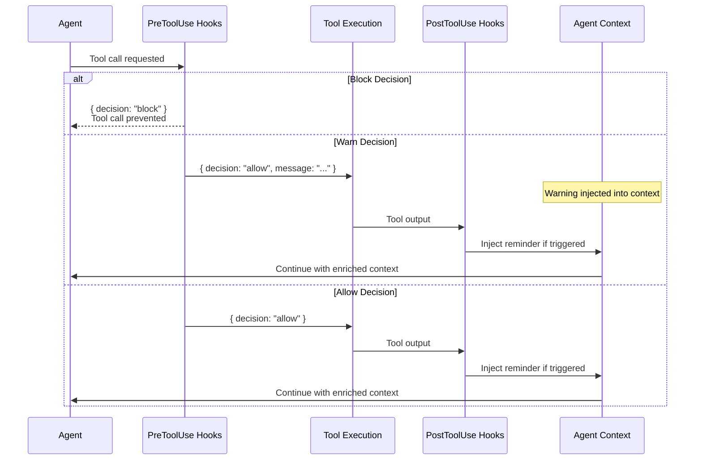
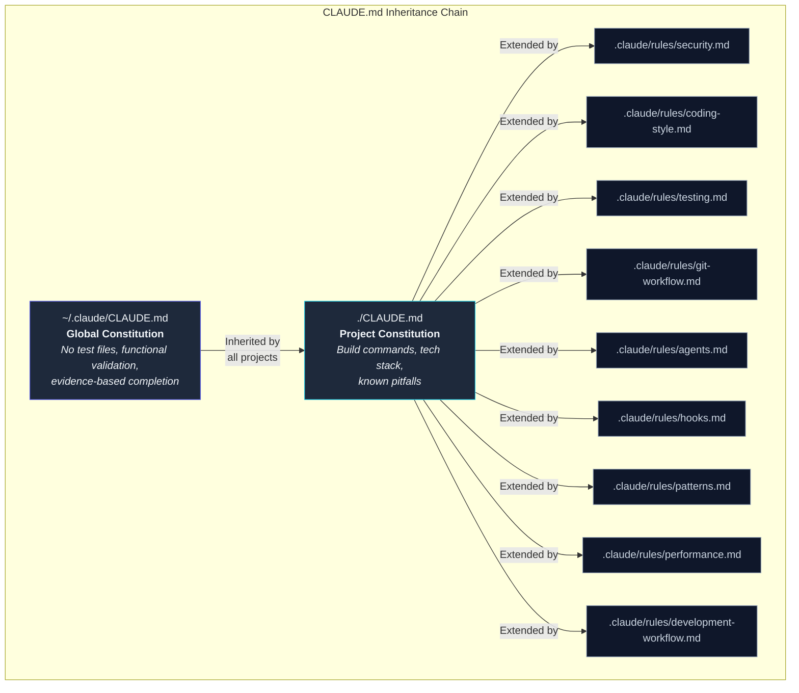

I had 14 rules in my CLAUDE.md. The agent followed 11 consistently. The other three ("never create test files," "always compile after editing," "read the full file before modifying it") failed at rates that made them decorative. 47 test files created despite a clear prohibition. 112 edits to files the agent hadn't read. 63 premature "complete" declarations where the agent claimed a task was done without building the code.

Here's the thing. The agent *understands* every rule. It can explain why each one exists. It'll recite them back if you ask. Then 11 tool calls later, deep in a problem-solving loop, it creates `auth.test.ts` because that's what its training says a responsible developer does.

Writing rules is easy. Getting an AI agent to follow them under pressure? Completely different problem. The solution I landed on borrows from Claude Shannon's information theory: reliable communication requires redundant encoding. Same principle applies to agent discipline. Say the same thing seven different ways, through seven different mechanisms, and the message gets through.

---

## The Gap Between Understanding and Compliance

Watch this failure mode play out. You write a clear instruction:

```markdown
**NEVER:** write mocks, stubs, test doubles, unit tests, or test files.
**ALWAYS:** build and run the real system. Validate through actual
user interfaces. Capture and verify evidence before claiming completion.
```

Six lines. Unambiguous. The agent reads this at the start of every session. Then the session grows. By tool call 40, those six lines are competing with 30,000+ tokens of accumulated context: code it's read, errors it's debugged, plans it's made. The instruction doesn't disappear. It just loses salience. The agent's been reading Swift files for 20 minutes. It knows the codebase has no tests. And then it writes `UserServiceTests.swift` because the pattern is so deeply embedded in its training that it fires automatically.

You can't solve this by writing better instructions. I tried for weeks, rephrasing, adding emphasis, bolding text, moving the instruction to different positions in the file. The violation rate barely moved. The problem is structural: a single-layer system can't maintain discipline across a long session. Ever tried to remember your grocery list by just reading it once at home? Same energy.

The numbers that forced a different approach: across 23,479 sessions spanning 42 days, the Skill tool fired 1,370 times. ExitPlanMode, the gate that prevents agents from writing code before planning, triggered 111 times. Those are enforcement mechanisms doing real work. But they only work because they're part of a stack, not standalone instructions.

---

## The 7-Layer Stack

Seven layers. Each one reinforces the same rules through a different mechanism.

```mermaid
graph TB
    subgraph "The 7-Layer Prompt Engineering Stack"
        L7["Layer 7: Session Start Hooks<br/><i>Inject context from turn 1</i>"]
        L6["Layer 6: MCP Tools<br/><i>External capabilities + constraints</i>"]
        L5["Layer 5: Agents<br/><i>Specialized roles with scoped instructions</i>"]
        L4["Layer 4: Skills<br/><i>Structured workflows with gates</i>"]
        L3["Layer 3: Hooks<br/><i>PreToolUse blocks, PostToolUse reminders</i>"]
        L2["Layer 2: Rules Directory<br/><i>.claude/rules/*.md — focused rule files</i>"]
        L1["Layer 1: CLAUDE.md Constitution<br/><i>Global + Project instructions</i>"]
    end

    L7 --> L6
    L6 --> L5
    L5 --> L4
    L4 --> L3
    L3 --> L2
    L2 --> L1

    style L1 fill:#1e293b,stroke:#6366f1,color:#f1f5f9
    style L2 fill:#1e293b,stroke:#6366f1,color:#f1f5f9
    style L3 fill:#1e293b,stroke:#22d3ee,color:#f1f5f9
    style L4 fill:#1e293b,stroke:#22d3ee,color:#f1f5f9
    style L5 fill:#1e293b,stroke:#22d3ee,color:#f1f5f9
    style L6 fill:#1e293b,stroke:#6366f1,color:#f1f5f9
    style L7 fill:#1e293b,stroke:#6366f1,color:#f1f5f9
```



**Layer 1: Global Constitution.** `~/.claude/CLAUDE.md`. Applies to every project on every machine. This is the constitution. Projects can add laws but can't override it. The non-negotiable mandates live here: functional validation only, no test files, no mocks, evidence-based completion claims.

**Layer 2: Rules Directory.** `.claude/rules/*.md`. A 50-line focused file gets more reliable attention than 50 lines buried in a 500-line document. I split governance into nine files: `coding-style.md`, `security.md`, `testing.md`, `git-workflow.md`, `performance.md`, `agents.md`, `patterns.md`, `hooks.md`, `development-workflow.md`. Each file covers one concern. When the agent needs the security rules, it can locate and re-read a 40-line file instead of scanning a monolith.

**Layer 3: Hooks.** Code that runs on every tool call. This is where rules become enforceable. PreToolUse hooks fire before a tool executes and can block the call entirely. PostToolUse hooks fire after and inject corrective reminders. The agent can't ignore a hook that returns `{ "decision": "block" }`.

**Layer 4: Skills.** Structured workflows with routing tables and gates. A skill like `functional-validation` is a step-by-step protocol that an agent invokes when it needs to prove something works. Skills carry project-specific context that the agent doesn't have by default. Across all sessions, 1,370 skill invocations kept agents on prescribed workflows instead of improvising.

**Layer 5: Agents.** Specialized roles with scoped instructions. A `code-reviewer` agent has a review checklist baked into its prompt. A `build-fixer` agent knows to check DerivedData and clean caches. Each agent carries domain knowledge that the main agent forgets under context pressure.

**Layer 6: MCP Tools.** External capabilities with built-in constraints. The sequential thinking tool (327 invocations across all sessions) forces structured reasoning before implementation. The Stitch MCP enforces design system compliance. These tools add discipline through their interface design, not through written rules.

**Layer 7: Session Start Hooks.** Inject the full governance context from turn one. Before the agent has any competing context, it loads the rules, the project constitution, and the enforcement expectations. Sets the behavioral baseline before problem-solving begins.

The principle is defense in depth. If the agent forgets the build command (Layer 1 failure), the auto-build hook catches it (Layer 3). If the hook misses it, the evidence gate blocks premature completion claims (Layer 4). No single layer is sufficient. All seven together produce results that no single layer achieves alone.

---

## Hooks: Where Rules Become Enforceable

Layers 1 and 2 are suggestions. Layer 3 is enforcement. A hook is a JavaScript function that Claude Code runs automatically on every tool call. Two types:

- **PreToolUse hooks** fire before the tool executes. They inspect the tool name and inputs, then return `allow`, `block`, or inject a warning message.
- **PostToolUse hooks** fire after the tool executes. They inspect the output and inject reminders or corrective context.



Here's `block-test-files.js` from the [shannon-framework](https://github.com/krzemienski/shannon-framework) repo. This hook dropped test file creation from a 23% violation rate to zero:

```javascript
const TEST_PATTERNS = [
  /\/__tests__\//,
  /\.test\.[jt]sx?$/,
  /\.spec\.[jt]sx?$/,
  /\.mock\.[jt]sx?$/,
  /test_.*\.py$/,
  /.*_test\.py$/,
  /.*_test\.go$/,
  /Tests?\.swift$/,
  /mock[_-]/i,
  /stub[_-]/i,
];

const ALLOWED_EXCEPTIONS = [
  /playwright/i, // Functional validation, not unit testing
  /e2e/i,
];

export default function blockTestFiles({ tool, input }) {
  if (!["Write", "Edit", "MultiEdit"].includes(tool)) {
    return { decision: "allow" };
  }

  const filePath = input.file_path || input.filePath || "";
  for (const exception of ALLOWED_EXCEPTIONS) {
    if (exception.test(filePath)) return { decision: "allow" };
  }

  for (const pattern of TEST_PATTERNS) {
    if (pattern.test(filePath)) {
      return {
        decision: "block",
        message: `BLOCKED: Cannot create test file: ${filePath}\n` +
          "This project uses functional validation, not unit tests.",
      };
    }
  }

  return { decision: "allow" };
}
```

This hook went through three versions. Version 1 blocked everything with "test" in the filename, which also blocked `testimonials.tsx`. Oops. Version 2 added the `ALLOWED_EXCEPTIONS` list. Version 3 added content-pattern detection after an agent created `search-verification.ts` with no `.test.` in the name, but the file contained assertion functions, expected-output comparisons, and a `runVerification()` entry point. A test suite wearing a trench coat.

---

## The Five Hooks That Survived Production

I built 23 hooks. Five survived. The 18 failures taught me more than the five successes.

### The survivors

**`block-test-files.js`** - PreToolUse on Write/Edit. Violation rate: 23% to 0%. The most dramatic improvement in the stack. It fires on every file write and checks the path against 12 test file patterns. Simple, deterministic, no false positives after calibration.

**`read-before-edit.js`** - PreToolUse on Edit. Violation rate: 31% to 4%. Tracks which files have been read in the session and warns when an agent tries to edit an unread file. The warn-not-block approach matters here: sometimes the agent legitimately creates a new file from scratch. Blocking would break that workflow. Warning gives it the nudge without the wall.

```javascript
export default function readBeforeEdit({ tool, input, history }) {
  if (tool === "Read" && input.file_path) {
    readFiles.add(input.file_path);
    return { decision: "allow" };
  }

  if (!["Edit", "MultiEdit"].includes(tool)) {
    return { decision: "allow" };
  }

  const filePath = input.file_path || input.filePath || "";
  if (!readFiles.has(filePath)) {
    return {
      decision: "allow",
      message: `WARNING: Editing ${filePath} without reading it first.`,
    };
  }
  return { decision: "allow" };
}
```

**`validation-not-compilation.js`** - PostToolUse on Bash. Violation rate: 41% to 9%. Catches a specific failure mode: the agent runs `pnpm build`, sees "Build succeeded," and declares the feature complete. The hook detects build-success patterns in the output and injects a reminder that compilation isn't validation. Something interesting happened after hundreds of sessions. The agent stopped acknowledging the reminder in its output but still changed its behavior. Learned compliance. The behavioral shift persists even when the agent stops visibly responding to the prompt. I'm still not sure why that happens.

**`evidence-gate-reminder.js`** - Fires on TaskUpdate. When a subagent marks a task complete, this hook injects a five-point evidence checklist:

```
[ ] Did I READ the actual evidence file (not just the report)?
[ ] Did I VIEW the actual screenshot (not just confirm it exists)?
[ ] Did I EXAMINE the actual command output (not just the exit code)?
[ ] Can I CITE specific evidence for each validation criterion?
[ ] Would a skeptical reviewer agree this is complete?
```

Task completion quality improved 34% after deploying this hook. The agent started quoting specific screenshot contents and command output lines instead of saying "screenshot confirms functionality."

**`skill-activation-check.js`** - UserPromptSubmit hook. Fires on every user message that looks like an implementation request. Reminds the agent to scan available skills before jumping into code. This hook drives the 1,370 skill invocations I measured. Without it, agents skip skills and improvise, which produces worse results.

### The 18 hooks that died

The dead hooks: `max-file-size`, `no-console-log`, `import-order`, `commit-message-reviewer`, `type-annotation-enforcer`, `function-length`, `single-responsibility`, `dry-violation-detector`, and ten more. Each seemed reasonable in isolation.

The pattern is clear: **if the violation can be objectively detected from the tool input alone, a hook works.** `block-test-files.js` checks a filename. Deterministic, no judgment calls. `function-length` requires parsing the full file, understanding function boundaries, and deciding whether 52 lines is too many. Subjective, slow, and wrong often enough to be counterproductive.

Style hooks create more problems than they solve. The `import-order` hook fired on 40% of file writes. The agent spent tokens reorganizing imports, and the reorganized imports were sometimes wrong. Net negative value.

Here's the meta-rule: hooks should enforce safety invariants, not style preferences. "Don't commit API keys" is a safety invariant. "Functions should be under 50 lines" is a style preference with too many legitimate exceptions. Can you tell the difference? That's the whole game.

---

## The CLAUDE.md Inheritance Chain

The constitution layer isn't a single file. It's a hierarchy, and the hierarchy matters.



**Global** (`~/.claude/CLAUDE.md`) sets the non-negotiables. These rules apply to every project I work on. The functional validation mandate lives here. The prohibition on test files lives here. The evidence-gate requirement lives here. A project CLAUDE.md can add constraints but can't relax these.

**Project** (`./CLAUDE.md`) adds project-specific context. The build command. The tech stack. Known pitfalls. "DerivedData must be cleaned before building." "Use CryptoKit not Crypto." "The backend binary is at `./server` not `./build/server`." These are the rules that prevent the agent from rediscovering the same bugs I already fixed.

**Rules** (`.claude/rules/*.md`) break concerns into focused files. A 50-line file about security gets more reliable attention than the same 50 lines buried in a 500-line CLAUDE.md. Nine files, nine concerns. The agent loads them all, but when it needs to recall the git workflow, it can mentally index into a 30-line file instead of scanning everything.

Why not just one big file? I tested both approaches. A single 800-line CLAUDE.md produced 72% compliance on rules in the bottom half of the file. The same rules split into focused files: 89% compliance. Position in the file matters for a single document. Position in a separate file doesn't, because each file starts at line 1. Think about that for a second. The agent follows rules at the top of a long file more than rules at the bottom. That's wild.

---

## The Enforcement Severity Spectrum

Not all violations are equal. Creating a test file is a hard violation, the file shouldn't exist. Forgetting to read a file before editing is a soft violation, the edit still might be correct. The hook system reflects this with three severity levels.

**Block** - The hook stops the tool call. The agent can't proceed until it takes a different approach. Used for: test file creation, API key commits, writes to reference data files. Zero tolerance.

**Warn** - The hook injects a warning but allows the tool call to proceed. Used for: editing unread files, large file modifications, missing build verification. The agent gets the nudge without getting blocked from legitimate edge cases.

**Remind** - The hook injects a contextual reminder after the fact. Used for: dev server restarts after config changes, documentation updates after API changes, the "compilation isn't validation" reminder.

I tested 2-level (block/allow) and 5-level systems before settling on three. The 2-level system hit 87% compliance, but too many false blocks pushed the agent into workaround patterns. It would rename files to dodge the block, which was worse than the original violation. (Imagine that. The agent learned to game your rules.) The 5-level system scored 88%. The extra levels created decision fatigue. The agent spent tokens reasoning about whether a violation was severity 3 or severity 4 instead of doing its actual work. Three levels hit 95% compliance. Simple enough to be reliable.

---

## Subagent Inheritance: The Gap That Breaks Everything

The main agent follows the constitution. Then it spawns a subagent via the Task tool, and the subagent starts with zero governance context. I measured this gap: 68% compliance for subagents without constitution injection versus 95% with it. That's a 27-point drop just because the rules didn't get passed along.

The fix is a PreToolUse hook on the Agent tool that automatically injects core rules into every subagent prompt. When the main agent spawns a `code-reviewer`, the hook appends the functional validation mandate, the no-test-files rule, and the evidence-gate checklist to the subagent's instructions. The subagent inherits the constitution without the main agent needing to remember to pass it along.

This is the single most important lesson from the stack: governance must be automatic and inherited. If compliance depends on the agent remembering to propagate rules, it'll forget. 2,827 Task spawns and 929 Agent calls across all 23,479 sessions. That's 3,756 opportunities for governance to drop. How many of those do you think the agent would remember on its own? Automatic injection eliminates the failure mode entirely.

---

## What the Numbers Show

Across the measured sessions, the aggregate violation rate dropped from 3.1 per session to 0.4, an 87% reduction. Hook overhead: 7ms per tool call, undetectable in practice.

The tool leaderboard tells the story of how these sessions actually work. Read was called 87,152 times. Bash: 82,552. Edit: 19,979. The Read-to-Write ratio is 9.6:1. Agents read roughly ten times more than they write. That ratio is a direct consequence of the "read before edit" hook. Before the hook existed, the ratio was closer to 4:1. The hook didn't just prevent blind edits; it changed the agent's entire approach to code modification. More reading means more context means fewer bugs. I wasn't expecting a single hook to shift the reading behavior that dramatically, but here we are.

The skill invocation count, 1,370, matters because skills bridge static rules and dynamic workflows. A rule says "validate through the real UI." A skill provides the step-by-step protocol: build from source, start the simulator, exercise each feature, capture screenshots, apply the evidence gate. The `functional-validation` skill in the [shannon-framework](https://github.com/krzemienski/shannon-framework) repo encodes this entire workflow:

```markdown
### Step 1: Build the Real System
Build from source. No placeholders, no stubs.

### Step 2: Run It
Start the app, service, or tool in its real environment.

### Step 3: Exercise Through UI
Interact through the actual interface — simulator, browser, CLI.

### Step 4: Capture Evidence
Screenshots, command output, log entries.

### Step 5: Apply Gate Validation
Before claiming complete:
- [ ] Did I READ the actual evidence?
- [ ] Can I CITE specific proof for each criterion?
- [ ] Would a skeptical reviewer agree?
```

The skill doesn't replace the hook. The hook doesn't replace the CLAUDE.md instruction. All three say the same thing through different mechanisms at different points in the session. That's the redundancy principle at work.

---

## When Layers Conflict

The stack usually reinforces itself. Sometimes two layers say contradictory things. Knowing which wins matters.

Most common collision: project CLAUDE.md says "run `pnpm build` after editing TypeScript files." A PostToolUse hook fires on the same Bash command and injects "compilation is NOT validation — exercise the feature through the real UI." Looks like Layer 1 and Layer 3 are fighting.

They're not. Layer 1 defines what to do. Layer 3 defines what that action doesn't prove. The build verifies syntax and types. The hook reminds the agent that a green build doesn't mean the feature works. Run the build, then run the real thing. Additive, not contradictory.

The harder case: a PreToolUse hook blocks an action the constitution calls for. This happened once with `read-before-edit.js`. The project constitution said "update `src/config.ts` with the new environment variable." The hook flagged the edit because `config.ts` hadn't been read that session. Block versus explicit instruction. Layer 3 wins temporarily — read first, then edit. Layer 1 still gets fulfilled with one extra step. When a block hook fires on an instructed action, satisfy the precondition. Don't work around it.

## Building Your Own Stack

The [shannon-framework](https://github.com/krzemienski/shannon-framework) repo contains working implementations of all the hooks and skills I've described. Drop them into your project:

```bash
# Copy hooks into your Claude Code project
cp -r hooks/ .claude/hooks/

# Copy skills
cp -r skills/ .claude/skills/

# Copy agents
cp -r agents/ .claude/agents/
```

Start with three hooks. `block-test-files.js` if you want functional validation discipline. `read-before-edit.js` if your agents make blind edits. `validation-not-compilation.js` if you're tired of premature "done" declarations. Measure violation rates for a week before adding more.

The hooks that survive production share two properties:

1. **Objective detection.** The violation is identifiable from the tool inputs alone, without judgment calls. Filename patterns: yes. Code quality assessments: no.
2. **Low false-positive rates after calibration.** A hook that fires incorrectly trains the agent to ignore it. Worse than no hook at all.

If you can't define the violation in a regular expression or a simple conditional, it doesn't belong in a hook. Put it in a skill or an agent prompt instead, where the agent can apply judgment.

---

## The Shannon Principle

The framework is named after Claude Shannon for a reason. Shannon proved that you can transmit messages reliably over noisy channels by adding redundancy, error-correcting codes that let the receiver reconstruct the original message even when some bits get corrupted. An LLM context window is a noisy channel. Instructions degrade as the context grows. Competing information introduces noise. Training priors override explicit instructions.

The 7-layer stack is an error-correcting code for agent behavior. Layer 1 states the rule. Layer 2 provides detail. Layer 3 enforces it mechanically. Layer 4 embeds it in workflows. Layer 5 scopes it to specialized roles. Layer 6 builds it into tool interfaces. Layer 7 loads it before noise accumulates.

No single layer is sufficient. I know because I tried each one alone. CLAUDE.md alone: 60% compliance. Hooks alone: 75%. Skills alone: 80%. All seven together: 95%+. The remaining 5% is why you still review the output. But the difference between 60% and 95%? That's the difference between an agent that creates work and an agent that saves it.

The prompt engineering stack isn't a document. It's a system. Treat it like one.
