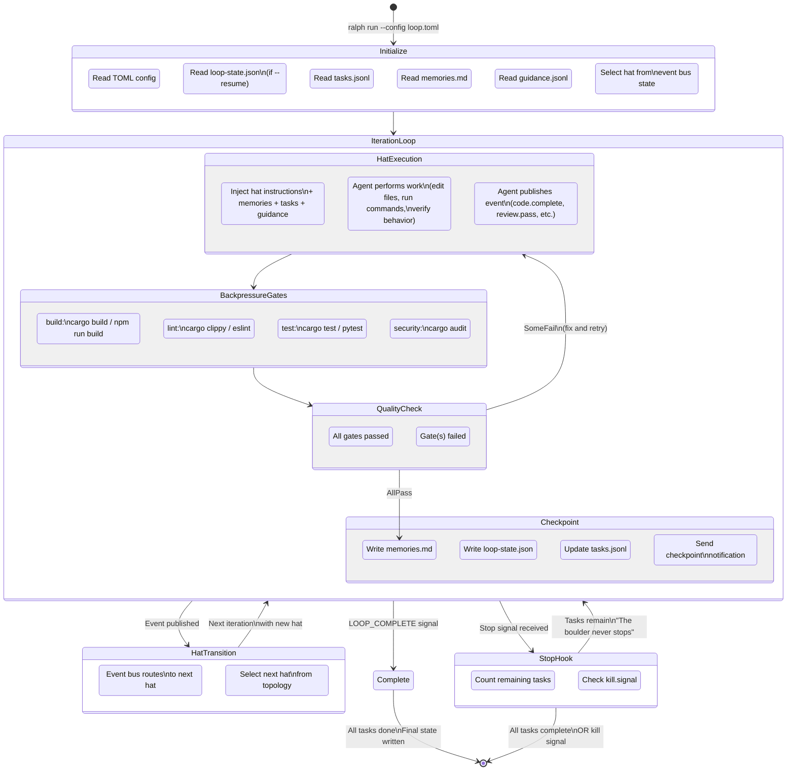
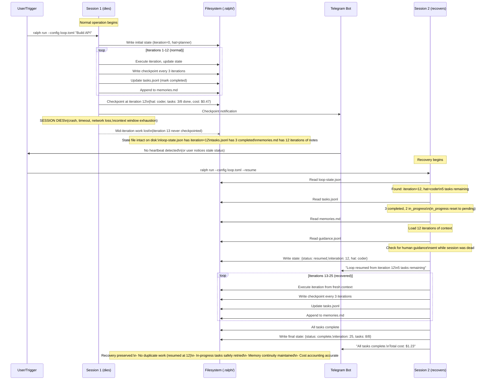

## Ralph Orchestrator — A Rust Platform for AI Agent Fleets

*Agentic Development: 10 Lessons from 8,481 AI Coding Sessions (Post 8 of 11)*

It was 1:47 AM on a Wednesday. I had kicked off a 30-task refactoring job across three projects before dinner, expecting to check the results in the morning. Instead, I was staring at my phone in bed, watching a Telegram notification that read: "NEEDS INPUT -- systems. Question: The auth module uses a custom JWT implementation. Should I replace it with the jsonwebtoken crate or wrap the existing code?"

I typed `/guidance Wrap the existing code, don't replace it` from under the covers, rolled over, and went back to sleep. The agent continued working. By morning, 28 of 30 tasks were complete.

That moment -- lying in bed, steering an AI agent fleet from my phone at 2 AM -- is what Ralph Orchestrator is for.

When you are running one AI coding agent, you manage it by watching the terminal. When you are running five agents in parallel across three projects, you need an orchestration layer. When you are running 30 agents overnight with backpressure gates, event-sourced merge queues, and a Telegram control plane so you can steer them from your phone at 2 AM -- you need Ralph.

This is post 8 of 11 in the Agentic Development series. The companion repo is at [github.com/krzemienski/ralph-orchestrator-guide](https://github.com/krzemienski/ralph-orchestrator-guide). Everything quoted here is real configuration and code you can read, run, and extend.

---

### Why Persistence Matters: The Session That Changed Everything

Before Ralph existed, I ran agents the way everyone does: open a terminal, give it a task, wait for it to finish. This works for 15-minute tasks. It does not work for a 50-task iOS refactoring that takes 8 hours.

The breaking point was a Thursday evening. I had spent three hours iterating with Claude on a major API migration -- moving 14 endpoints from REST to GraphQL. Around the 90-minute mark, the agent had completed 6 endpoints and was making solid progress. Then the context window filled up. The session ended. All that accumulated understanding -- which endpoints were done, which patterns worked, which edge cases had been discovered -- vanished.

I started a new session, explained the situation, and the agent immediately re-implemented the first endpoint. It had no memory. It had no idea that endpoint was already done. I spent 20 minutes re-establishing context before the agent even began useful work.

That happened three more times over the next week. Different projects, same pattern. Long tasks. Context exhaustion. Lost progress. Manual re-establishment of context. I calculated the waste: across those four sessions, I lost roughly 5 hours of productive agent time to context loss.

Ralph emerged from that frustration. The core insight was simple: the agent's work artifacts -- task lists, memories, state files, code changes -- should persist on the filesystem, not in the context window. When a session dies, the filesystem survives. A new session can read the same files and resume from where the previous session stopped.

The name comes from the boulder myth. The boulder never stops rolling. Sessions can die, context windows can fill, network connections can drop -- but the work continues because the state lives on disk, not in memory.

---

### The Architecture

Here is what Ralph looks like at a high level:

```mermaid
flowchart TD
    subgraph ControlPlane["Control Plane"]
        direction TB
        TG["Telegram Bot\n/status /guidance /kill\n/pause /approve /metrics"]
        TUI["Terminal UI\nReal-time iteration view"]
        IOS["iOS App\nRemote monitoring"]
    end

    subgraph Coordinator["HatlessRalph Coordinator"]
        direction TB
        OBJ["Objective\n'Build user dashboard'"]
        EB["Event Bus\n(routes events between hats)"]
        SKILL["Skill Index\n(available capabilities)"]
        GUIDE["Human Guidance\n(from Telegram)"]
    end

    subgraph HatGraph["Hat Graph (Event-Driven Transitions)"]
        direction LR

        subgraph PlannerHat["Planner Hat"]
            P_MODEL["Model: Opus"]
            P_SUB["Subscribes:\nproject.start\nreview.fail"]
            P_PUB["Publishes:\nplan.complete\nhuman.interact"]
            P_INST["Instructions:\n'Analyze objective,\ncreate step-by-step plan'"]
        end

        subgraph CoderHat["Coder Hat"]
            C_MODEL["Model: Sonnet"]
            C_SUB["Subscribes:\nplan.complete"]
            C_PUB["Publishes:\ncode.complete\nhuman.interact"]
            C_INST["Instructions:\n'Follow plan exactly,\nbuild one component at a time'"]
        end

        subgraph ReviewerHat["Reviewer Hat"]
            R_MODEL["Model: Opus"]
            R_SUB["Subscribes:\ncode.complete"]
            R_PUB["Publishes:\nreview.pass\nreview.fail"]
            R_INST["Instructions:\n'Check bugs, security,\nperformance, plan adherence'"]
        end

        subgraph DeployerHat["Deployer Hat"]
            D_MODEL["Model: Sonnet"]
            D_SUB["Subscribes:\nreview.pass"]
            D_PUB["Publishes:\ndeploy.complete\nhuman.interact"]
            D_INST["Instructions:\n'Ship artifact,\nverify deployment'"]
        end
    end

    PlannerHat -->|"plan.complete"| CoderHat
    CoderHat -->|"code.complete"| ReviewerHat
    ReviewerHat -->|"review.pass"| DeployerHat
    ReviewerHat -->|"review.fail"| CoderHat

    Coordinator -->|"Selects hat based\non event bus state"| HatGraph

    subgraph Persistence["State Persistence Layer"]
        direction LR
        STATE["loop-state.json\n{iteration, hat, cost}"]
        TASKS["tasks.jsonl\n{id, status, deps}"]
        MEM["memories.md\nCross-iteration context"]
        GFILE["guidance.jsonl\nHuman messages"]
    end

    subgraph Worktrees["Parallel Execution"]
        direction LR
        WT1["Worktree 1\nAgent A - API endpoints"]
        WT2["Worktree 2\nAgent B - UI components"]
        WT3["Worktree 3\nAgent C - Database models"]
        MQ["Merge Queue\n(JSONL event log)"]
    end

    ControlPlane --> Coordinator
    Coordinator --> Persistence
    Coordinator --> Worktrees
    WT1 --> MQ
    WT2 --> MQ
    WT3 --> MQ

    subgraph Topologies["Per-Project Hat Topologies"]
        direction TB
        T1["Web Frontend:\ndesigner -> coder -> reviewer -> deployer"]
        T2["Systems/Backend:\narchitect -> coder -> tester -> security -> deployer"]
        T3["Data Pipeline:\nschema-designer -> builder -> validator -> documenter"]
        T4["Bug Fix:\ninvestigator -> fixer -> tester -> reviewer"]
    end

    style PlannerHat fill:#6644cc,color:#fff
    style CoderHat fill:#2266bb,color:#fff
    style ReviewerHat fill:#cc4422,color:#fff
    style DeployerHat fill:#228844,color:#fff
```



Ralph treats AI agents the way Kubernetes treats containers: isolated environments, clear objectives, structured handoffs, and a persistent control loop that survives session boundaries. I have run 410 orchestration sessions through it, coordinating fleets of AI agents across iOS, backend, and web projects. The hardest problems were never technical. They were trust calibration -- learning when to let the agent run and when to intervene.

---

### The Core Insight: Hats

Ralph's most distinctive feature is the hat system. Each agent wears a "hat" -- a focused role that defines its capabilities, context, event subscriptions, and model selection for each iteration.

A monolithic prompt that tries to cover planning, coding, reviewing, and deploying produces mediocre results in all four areas. A planner hat with Opus-level reasoning produces specialist-quality architecture. A coder hat with Sonnet produces fast, focused implementation. A reviewer hat with Opus catches subtle bugs that Sonnet misses.

Here is what a hat configuration looks like in TOML:

```toml
# From: docs/hat-system.md
# ralph-orchestrator-guide/docs/hat-system.md

[hats.planner]
description = "Plans the implementation approach"
model = "opus"                     # Use strongest model for planning
subscribes = ["project.start", "review.fail"]
publishes = ["plan.complete", "human.interact"]
instructions = """
You are a technical planner. Analyze the objective and create
a step-by-step implementation plan. Consider edge cases,
dependencies, and potential blockers.
"""

[hats.coder]
description = "Implements the plan"
model = "sonnet"                   # Balanced model for implementation
subscribes = ["plan.complete"]
publishes = ["code.complete", "human.interact"]
instructions = """
You are an implementation engineer. Follow the plan exactly.
Build one component at a time. Verify the build after each change.
"""

[hats.reviewer]
description = "Reviews code quality and correctness"
model = "opus"                     # Strong model for review
subscribes = ["code.complete"]
publishes = ["review.pass", "review.fail"]
instructions = """
You are a code reviewer. Check for bugs, security issues,
performance problems, and adherence to the plan. Be specific
in your feedback.
"""
```

#### The HatlessRalph Coordinator

A `HatlessRalph` coordinator is always present as the universal fallback. It holds the current objective, the hat topology (which hats exist and how they connect), skill indices, and human guidance from Telegram. When a new iteration begins, the coordinator selects which hat the agent should wear based on the current event bus state.

Each hat carries five components:

| Component | Purpose |
|-----------|---------|
| **Name + Description** | Identifies the role (e.g., "planner", "coder", "reviewer") |
| **Subscriptions** | Which events trigger this hat (e.g., `plan.complete`) |
| **Publications** | Which events this hat can emit (e.g., `code.complete`) |
| **Instructions** | The specialized prompt injected when wearing this hat |
| **Model Selection** | Which LLM model to use (opus for reasoning, sonnet for speed) |

#### Event-Driven Transitions

Hats form a directed graph connected by events. When the planner publishes `plan.complete`, the coordinator transitions to the coder hat. When the reviewer publishes `review.fail`, the coordinator routes back to coder. The hat graph is the execution topology of your agent fleet:

```
planner                    coder                     reviewer
Subscribes:                Subscribes:               Subscribes:
  project.start  -------->   plan.complete -------->   code.complete
Publishes:                 Publishes:                Publishes:
  plan.complete              code.complete             review.pass
  human.interact             human.interact            review.fail
                                    ^                         |
                                    +--- review.fail ---------+
```

Here is the full hat system architecture showing internals, event routing, and per-project topologies:

```mermaid
flowchart TD
    subgraph Coordinator["HatlessRalph Coordinator"]
        direction TB
        OBJ2["Objective\n'Build user dashboard'"]
        EB2["Event Bus\n(routes events between hats)"]
        SKILL2["Skill Index\n(available capabilities)"]
        GUIDE2["Human Guidance\n(from Telegram)"]
    end

    subgraph HatGraph2["Hat Graph (Event-Driven Transitions)"]
        direction LR

        subgraph PlannerHat2["Planner Hat"]
            P_MODEL2["Model: Opus"]
            P_SUB2["Subscribes:\nproject.start\nreview.fail"]
            P_PUB2["Publishes:\nplan.complete\nhuman.interact"]
            P_INST2["Instructions:\n'Analyze objective,\ncreate step-by-step plan'"]
        end

        subgraph CoderHat2["Coder Hat"]
            C_MODEL2["Model: Sonnet"]
            C_SUB2["Subscribes:\nplan.complete"]
            C_PUB2["Publishes:\ncode.complete\nhuman.interact"]
            C_INST2["Instructions:\n'Follow plan exactly,\nbuild one component at a time'"]
        end

        subgraph ReviewerHat2["Reviewer Hat"]
            R_MODEL2["Model: Opus"]
            R_SUB2["Subscribes:\ncode.complete"]
            R_PUB2["Publishes:\nreview.pass\nreview.fail"]
            R_INST2["Instructions:\n'Check bugs, security,\nperformance, plan adherence'"]
        end

        subgraph DeployerHat2["Deployer Hat"]
            D_MODEL2["Model: Sonnet"]
            D_SUB2["Subscribes:\nreview.pass"]
            D_PUB2["Publishes:\ndeploy.complete\nhuman.interact"]
            D_INST2["Instructions:\n'Ship artifact,\nverify deployment'"]
        end
    end

    PlannerHat2 -->|"plan.complete"| CoderHat2
    CoderHat2 -->|"code.complete"| ReviewerHat2
    ReviewerHat2 -->|"review.pass"| DeployerHat2
    ReviewerHat2 -->|"review.fail"| CoderHat2

    Coordinator -->|"Selects hat based\non event bus state"| HatGraph2

    subgraph Topologies2["Per-Project Hat Topologies"]
        direction TB
        T12["Web Frontend:\ndesigner -> coder -> reviewer -> deployer"]
        T22["Systems/Backend:\narchitect -> coder -> tester -> security -> deployer"]
        T32["Data Pipeline:\nschema-designer -> builder -> validator -> documenter"]
        T42["Bug Fix:\ninvestigator -> fixer -> tester -> reviewer"]
    end

    style PlannerHat2 fill:#6644cc,color:#fff
    style CoderHat2 fill:#2266bb,color:#fff
    style ReviewerHat2 fill:#cc4422,color:#fff
    style DeployerHat2 fill:#228844,color:#fff
```



#### Per-Project Hat Topologies

Different project types get different hat graphs. The companion repo ships four pre-built configurations, each tailored to its domain:

**Web Frontend** (`configs/web-frontend.toml`):

```toml
# From: configs/web-frontend.toml
# ralph-orchestrator-guide/configs/web-frontend.toml

[agent]
name = "web-frontend"
description = "Web frontend specialist for React, Next.js, and Vue projects"
model = "sonnet"
max_tokens = 8192
temperature = 0.1

[agent.identity]
role = "Senior Frontend Engineer"
expertise = [
    "React", "Next.js", "Vue", "TypeScript",
    "TailwindCSS", "CSS Modules", "Responsive Design",
    "State Management (Zustand, Redux, Pinia)",
    "API Integration", "Performance Optimization"
]

[tools]
allowed = [
    "Edit", "Write", "Read", "Glob", "Grep",
    "Bash", "WebFetch",
]
denied = [
    "git push",       # No pushing without human review
    "rm -rf",         # No recursive deletes
    "DROP TABLE",     # No destructive DB operations
]

[tools.bash]
allow_patterns = [
    "npm *", "npx *", "pnpm *", "yarn *",
    "node *", "tsc *",
    "curl *", "wget *",
    "git status", "git diff", "git add", "git commit",
    "ls *", "cat *", "mkdir *",
]

[loop.backpressure]
lint = "npm run lint"
typecheck = "npx tsc --noEmit"
build = "npm run build"

[context]
always_include = [
    "package.json",
    "tsconfig.json",
    "README.md",
    "src/types/**/*.ts",
]
index_dirs = ["src/", "components/", "pages/", "app/"]
```

Notice the `tools.denied` list. `git push` is explicitly blocked -- the agent can commit locally but cannot push to the remote without human review. `rm -rf` is blocked -- no recursive deletes, ever. These are safety rails that prevent the worst-case scenarios I encountered in early sessions.

The `tools.bash.allow_patterns` is equally important. Rather than giving the agent unrestricted shell access, you whitelist the specific command patterns it needs. A web frontend agent needs `npm`, `npx`, `tsc`, and `curl`. It does not need `docker`, `systemctl`, or `rm`.

**iOS/macOS** (`configs/ios-mobile.toml`):

```toml
# From: configs/ios-mobile.toml
# ralph-orchestrator-guide/configs/ios-mobile.toml

[agent]
name = "ios-mobile"
description = "iOS/macOS specialist for Swift and SwiftUI development"
model = "sonnet"
max_tokens = 8192
temperature = 0.1

[agent.identity]
role = "Senior iOS Engineer"
expertise = [
    "Swift", "SwiftUI", "UIKit",
    "Combine", "async/await", "Actors",
    "Core Data", "SwiftData",
    "Xcode", "XcodeGen", "SPM",
    "StoreKit", "CloudKit", "WidgetKit",
    "Accessibility", "Localization",
    "App Store Review Guidelines"
]

[tools.bash]
allow_patterns = [
    "xcodebuild *",
    "swift *",
    "xcrun simctl *",
    "xcodegen *",
    "fastlane *",
    "pod *", "carthage *",
    "curl *",
    "git status", "git diff", "git add", "git commit",
    "lsof -i *",       # Port checks
    "idb *",            # Simulator interaction
]

[loop.backpressure]
build_ios = "xcodebuild -scheme $SCHEME -destination 'id=$SIMULATOR_UDID' -quiet"
build_macos = "xcodebuild -scheme $MACOS_SCHEME -destination 'platform=macOS' -quiet"
lint = "swiftlint lint --quiet"

[simulator]
udid = "$SIMULATOR_UDID"
device = "iPhone 16 Pro Max"
os = "iOS 18.6"
# CRITICAL: Never use other simulators — they belong to other sessions
```

The simulator section is one of those things you learn to add after a painful incident. Early in my multi-agent work, two agents targeting different iOS features both grabbed the same simulator. One was running UI tests while the other was installing a fresh build. Chaos. The explicit simulator UDID binding prevents that.

**Data Pipeline** (`configs/data-pipeline.toml`):

```toml
# From: configs/data-pipeline.toml
# ralph-orchestrator-guide/configs/data-pipeline.toml

[agent.identity]
role = "Senior Data Engineer"
expertise = [
    "Python", "SQL", "Spark", "Airflow",
    "pandas", "polars", "dbt",
    "PostgreSQL", "BigQuery", "Snowflake",
    "Parquet", "Avro", "JSON/NDJSON",
    "Data Quality", "Schema Evolution",
    "Batch Processing", "Stream Processing"
]

[tools]
denied = [
    "DROP TABLE",
    "TRUNCATE",
    "DELETE FROM * WHERE 1=1",
    "git push --force",
]

[loop.backpressure]
lint = "ruff check ."
typecheck = "mypy src/"
test = "pytest tests/ -v"
data_quality = "python scripts/validate_schema.py"
```

The data pipeline configuration adds a `data_quality` backpressure gate -- `python scripts/validate_schema.py` -- that runs after every iteration. This is a custom gate that validates your schema constraints, ensuring the agent cannot produce code that violates data contracts. The `tools.denied` list blocks destructive SQL operations entirely.

**Systems/Backend** (`configs/systems.toml`):

```toml
# From: configs/systems.toml
# ralph-orchestrator-guide/configs/systems.toml

[agent.identity]
role = "Senior Backend Engineer"
expertise = [
    "Rust", "Go", "Python", "Node.js",
    "PostgreSQL", "Redis", "SQLite",
    "REST APIs", "gRPC", "GraphQL",
    "Docker", "Kubernetes", "Terraform",
    "Security", "Performance", "Observability"
]

[loop.backpressure]
build = "cargo build"
test = "cargo test"
lint = "cargo clippy -- -D warnings"
security = "cargo audit"
```

Four configurations, four different worlds. Each one defines not just what the agent can do, but what it cannot do. The constraints are as important as the capabilities.

#### Why Fresh Context Matters

Ralph's architecture is built around a counterintuitive insight: fresh context is more reliable than accumulated context.

Each iteration clears the context window. The agent re-reads specs, plans, and code every cycle. The hat system ensures that each fresh-context iteration has a focused, well-scoped objective rather than a vague "continue working on the project."

**Long context (150K tokens accumulated):**
- Agent loses track of earlier decisions
- Contradictions accumulate in context
- Quality degrades as context fills

**Fresh context (40K tokens, hat-scoped):**
- Agent reads only what the current hat needs
- No accumulated contradictions
- Consistent quality across iterations

This is why the memory system writes to disk rather than relying on context. A 200-iteration loop does not need 200 iterations of accumulated context. It needs the current state, the current plan, and the memories from previous iterations -- read fresh every time.

#### Model Routing per Hat

Different hats use different models, optimizing cost and capability:

| Hat | Recommended Model | Reasoning | Cost per Iteration |
|-----|-------------------|-----------|--------------------|
| Planner | Opus | Deep reasoning for architecture decisions | ~$0.05 |
| Coder | Sonnet | Balanced speed/quality for implementation | ~$0.02 |
| Reviewer | Opus | Thorough analysis catches subtle bugs | ~$0.05 |
| Deployer | Sonnet | Fast output for deployment scripts | ~$0.02 |
| Documenter | Haiku | Quick output for straightforward writing | ~$0.005 |
| Investigator | Sonnet | Good at code search and pattern matching | ~$0.02 |

This optimizes cost: you only use expensive Opus-level reasoning where deep analysis matters. A 50-iteration loop using mixed models costs roughly 40% less than one running Opus for every iteration.

---

### The Six Tenets

These tenets emerged from 410 orchestration sessions. They are not theoretical principles. They are scar tissue.

---

### Tenet 1: The Boulder Never Stops

A Ralph loop continues working until all tasks are complete or an explicit kill signal is received. Session boundaries are checkpoints, not endpoints.

This is implemented through the stop hook -- a bash script that runs whenever a stop signal fires. If tasks remain, the hook injects a continuation message and the loop keeps going:

```bash
# From: examples/persistence-loop/stop-hook.sh
# ralph-orchestrator-guide/examples/persistence-loop/stop-hook.sh

#!/usr/bin/env bash
# Ralph Stop Hook — "The Boulder Never Stops"

STATE_FILE=".ralph/loop-state.json"
TASKS_FILE=".ralph/agent/tasks.jsonl"
GUIDANCE_FILE=".ralph/guidance.jsonl"

# Count remaining tasks
if [ -f "$TASKS_FILE" ]; then
    PENDING=$(grep -c '"status":\s*"pending"' "$TASKS_FILE" 2>/dev/null || echo "0")
    IN_PROGRESS=$(grep -c '"status":\s*"in_progress"' "$TASKS_FILE" 2>/dev/null || echo "0")
    REMAINING=$((PENDING + IN_PROGRESS))
else
    REMAINING=0
fi

# Check for explicit kill signal
if [ -f ".ralph/kill.signal" ]; then
    echo "Kill signal detected. Stopping." >&2
    rm -f ".ralph/kill.signal"
    echo "stop"
    exit 0
fi

# The boulder never stops — if tasks remain, keep going
if [ "$REMAINING" -gt 0 ]; then
    echo "Tasks remaining: $REMAINING. The boulder never stops." >&2

    TIMESTAMP=$(date -u +"%Y-%m-%dT%H:%M:%SZ")
    mkdir -p "$(dirname "$GUIDANCE_FILE")"
    echo "{\"type\":\"continuation\",\"timestamp\":\"$TIMESTAMP\",\"message\":\"The boulder never stops. $REMAINING tasks remain. Continue working.\"}" >> "$GUIDANCE_FILE"

    echo "continue"
    exit 0
fi

# All tasks complete — stop gracefully
echo "All tasks complete. Loop can stop." >&2
echo "stop"
exit 0
```

Let me walk through what this script does, because the subtlety matters.

First, it counts remaining tasks by grepping the JSONL task file for pending and in-progress statuses. It does not parse JSON -- grep is faster and sufficient for a pass/fail count. Then it checks for an explicit kill signal. The kill signal is a file: `.ralph/kill.signal`. If present, the hook removes it and returns "stop." This is the emergency brake -- the only way to force-stop a loop that has remaining tasks.

The critical logic is in the third section. If tasks remain and no kill signal exists, the hook appends a continuation message to the guidance file and returns "continue." The continuation message becomes part of the agent's next prompt: "The boulder never stops. 5 tasks remain. Continue working." The agent reads this, re-loads its memory and task list, and picks up where it left off.

The final section handles graceful completion. When all tasks are done, the hook returns "stop" and the loop terminates naturally.

This mechanism means a Ralph loop survives everything except an explicit kill signal:
- **Session timeout?** Stop hook fires, returns "continue," loop resumes in a new session.
- **Context window exhaustion?** Same path. New session, fresh context, same state on disk.
- **Network interruption?** Same path.
- **Machine restart?** `--resume` flag reads state from disk and picks up where it left off.

The persistence configuration makes this work:

```toml
# From: examples/persistence-loop/persistence.toml
# ralph-orchestrator-guide/examples/persistence-loop/persistence.toml

[loop]
max_iterations = 200               # High limit for persistent work
checkpoint_interval = 3            # Frequent checkpoints for resilience
timeout_minutes = 480              # 8 hours — for long-running work

[loop.persistence]
enabled = true
state_file = ".ralph/loop-state.json"
resume_on_start = true             # Auto-resume from last checkpoint
checkpoint_includes = [
    "iteration",
    "current_hat",
    "task_progress",
    "memory_snapshot",
    "cost_accumulator",
]

[loop.stop_hook]
script = "bash stop-hook.sh"
behavior = "check_and_decide"

[memory]
types = ["Patterns", "Decisions", "Fixes", "Context"]
persist_path = ".ralph/agent/memories.md"
max_entries = 100                  # Prune old entries to keep context fresh
```

The `checkpoint_interval = 3` means state is saved every 3 iterations. If the session dies mid-iteration, at most 3 iterations of work are lost (and usually only 1, since the current iteration's code changes are on disk even if the state file was not updated). The `max_entries = 100` for memories prevents the memory file from growing unbounded -- older entries are pruned to keep the context fresh.

#### The State File Format

Here is what a real `loop-state.json` looks like mid-run:

```json
{
  "status": "running",
  "iteration": 12,
  "max_iterations": 200,
  "current_hat": "coder",
  "started_at": "2025-07-14T22:30:00Z",
  "updated_at": "2025-07-14T23:15:42Z",
  "checkpoint_type": "auto",
  "total_cost": 0.4700,
  "total_tokens": 847293,
  "task_progress": {
    "total": 8,
    "completed": 3,
    "in_progress": 2,
    "pending": 3
  },
  "memory_snapshot": "12 iterations completed. API endpoints 1-3 done. Working on endpoint 4 (user profiles). Discovered that the auth middleware needs to be refactored first -- see memory entry for iteration 9."
}
```

Every field serves a recovery purpose. The `iteration` number tells the recovered session where to resume. The `current_hat` tells it what role to adopt. The `task_progress` counts prevent duplicate work. The `memory_snapshot` provides a compressed summary of what happened, so the recovered session does not need to read all 12 iterations of detailed memory entries.

#### The State Manager

The state manager provides a command-line interface for inspecting and manipulating loop state:

```python
# From: examples/persistence-loop/state-manager.py
# ralph-orchestrator-guide/examples/persistence-loop/state-manager.py

def write_state(state: dict[str, Any]) -> None:
    """Write loop state to disk atomically."""
    STATE_FILE.parent.mkdir(parents=True, exist_ok=True)

    # Write to temp file first, then rename (atomic on POSIX)
    tmp = STATE_FILE.with_suffix(".tmp")
    tmp.write_text(json.dumps(state, indent=2))
    tmp.rename(STATE_FILE)

def cmd_status() -> None:
    """Show the current loop state."""
    state = read_state()

    print("=== Ralph Loop State ===")
    print(f"Status:     {state.get('status', 'unknown')}")
    print(f"Iteration:  {state.get('iteration', 0)}/{state.get('max_iterations', '?')}")
    print(f"Hat:        {state.get('current_hat', 'none')}")

    tasks = get_task_summary()
    if tasks["total"] > 0:
        print(f"\nTasks:      {tasks['completed']}/{tasks['total']} complete")
        print(f"  Pending:     {tasks['pending']}")
        print(f"  In Progress: {tasks['in_progress']}")
        print(f"  Completed:   {tasks['completed']}")

    cost = state.get("total_cost", 0)
    tokens = state.get("total_tokens", 0)
    if cost or tokens:
        print(f"\nTokens:     {tokens:,}")
        print(f"Cost:       ${cost:.4f}")
```

The atomic write via tmp-file-then-rename is critical. If the process is killed mid-write, you get either the old state file or the new one -- never a corrupted half-written file. This is a standard POSIX trick, but it matters enormously when your loop runs overnight and you cannot afford to lose state to a power flicker or OOM kill.

The state manager supports five commands: `status` (show current state), `checkpoint` (force a save), `resume` (show what would happen on resume), `reset` (clear state for a fresh start), and `history` (show checkpoint timeline). When a loop runs overnight and you want to check progress in the morning, `python state-manager.py status` gives you the full picture without disturbing the running loop.

---

### Tenet 2: Hats Define Capability

Covered in detail above. The key insight: focused roles produce specialist-quality output. A hat that plans AND codes AND reviews is just a monolithic prompt with extra steps.

The hat best practices that emerged from 410 sessions:

1. **Keep hats focused.** A hat with a 50-line instruction set is too broad. A hat with a 10-line instruction set that does one thing well is exactly right.

2. **Define clear event boundaries.** Every hat should know exactly what triggers it and what it produces. Ambiguous event semantics cause the coordinator to make wrong hat selections.

3. **Use the event publishing guide.** Tell the agent what happens when it publishes each event -- which hat picks up next and what that hat expects. This prevents the agent from publishing prematurely.

4. **Let the coordinator decide transitions.** Do not hardcode hat sequences in prompts. Let the event bus drive transitions. This makes the system composable -- you can add or remove hats without rewriting existing hat instructions.

5. **Start simple.** A `planner -> coder -> reviewer` graph handles most projects. Add hats when you identify specific quality gaps. The bug fix topology (`investigator -> fixer -> tester -> reviewer`) was added after noticing that agents were fixing symptoms rather than root causes.

---

### Tenet 3: The Plan Is Disposable

Regenerating a plan costs one planning iteration -- about $0.05 and 30 seconds. Clinging to a failing plan costs hours of wasted iterations.

This sounds obvious written down. In practice, I watched agents fight failing plans for 15-20 iterations before I learned to encode this as a tenet. When a plan hits a dead end -- build fails repeatedly, a core assumption turns out to be wrong, the approach leads to unnecessary complexity -- the right move is to discard the plan and regenerate from current state.

Here is when to discard a plan:
- Build fails repeatedly after following the plan
- New information invalidates a core assumption
- The plan leads to unnecessary complexity
- More than 3 iterations without measurable progress

Plans are stored in `.ralph/plans/` as versioned markdown. When the agent regenerates, the old plan is preserved for learning. Event sourcing means the full planning history is available -- you can trace back through every plan that was tried and why it was discarded. The cost of a new plan is ~$0.05 and 30 seconds. The cost of fighting a bad plan? I have measured it: 15-20 wasted iterations at ~$0.03 each is $0.45-$0.60, plus 30-60 minutes of wall-clock time. The math is obvious once you do it.

---

### Tenet 4: Telegram as Control Plane

When agents run overnight or in parallel, you need a way to steer them from your phone. The Telegram bot is not a notification system -- it is a remote control plane for human-in-the-loop orchestration.

The bot configuration defines what notifications fire and when:

```toml
# From: examples/telegram-bot/bot-config.toml
# ralph-orchestrator-guide/examples/telegram-bot/bot-config.toml

[telegram]
bot_token_env = "RALPH_TELEGRAM_BOT_TOKEN"
chat_id_env = "RALPH_TELEGRAM_CHAT_ID"
enabled = true

[telegram.notifications]
on_iteration_start = false         # Too noisy
on_iteration_complete = false      # Also noisy
on_checkpoint = true               # Every N iterations
on_human_interact = true           # Agent needs input — ALWAYS notify
on_error = true
on_loop_complete = true
on_merge_complete = true
on_merge_failed = true

[telegram.interaction]
timeout_seconds = 300              # Wait 5 min for human response
timeout_action = "continue"        # On timeout: continue with default
```

Notice the notification choices. `on_iteration_start` and `on_iteration_complete` are disabled -- a 50-iteration loop would send 100 messages, drowning signal in noise. `on_checkpoint` fires every `checkpoint_interval` iterations (typically every 3-5), giving you a steady heartbeat. `on_human_interact` is always enabled -- when the agent needs a decision, you always want to know.

The `timeout_seconds = 300` with `timeout_action = "continue"` means the agent will not block forever waiting for you. If you are asleep and the agent hits a question, it waits 5 minutes and then continues with a default action. This prevents a 3 AM decision point from blocking all progress until morning.

#### Setting Up the Telegram Bot

The setup takes about 5 minutes:

```bash
# Step 1: Create a bot via @BotFather on Telegram
# Step 2: Get your chat ID via @userinfobot on Telegram

# Step 3: Set environment variables
export RALPH_TELEGRAM_BOT_TOKEN="123456789:ABCdefGHIjklMNOpqrSTUvwxYZ"
export RALPH_TELEGRAM_CHAT_ID="987654321"

# Step 4: Test the connection
curl -s "https://api.telegram.org/bot${RALPH_TELEGRAM_BOT_TOKEN}/sendMessage" \
  -d "chat_id=${RALPH_TELEGRAM_CHAT_ID}" \
  -d "text=Ralph bot connected successfully!"

# Step 5: Start Ralph with Telegram
ralph run \
  --config examples/basic-loop/loop.toml \
  --telegram examples/telegram-bot/bot-config.toml \
  "Build the user dashboard"
```

#### The Command Handlers

The command handlers implement the full control plane:

```python
# From: examples/telegram-bot/commands.py
# ralph-orchestrator-guide/examples/telegram-bot/commands.py

def cmd_status() -> str:
    """/status — Show current loop state."""
    state = read_state()

    tasks = read_tasks()
    total = len(tasks)
    completed = sum(1 for t in tasks if t.get("status") == "completed")
    in_progress = sum(1 for t in tasks if t.get("status") == "in_progress")
    pending = sum(1 for t in tasks if t.get("status") == "pending")

    paused = " [PAUSED]" if PAUSE_FLAG.exists() else ""

    return (
        f"Status: {state.get('status', 'unknown')}{paused}\n"
        f"Iteration: {state.get('iteration', 0)}/{state.get('max_iterations', '?')}\n"
        f"Hat: {state.get('current_hat', 'none')}\n"
        f"Tasks: {completed}/{total} done, {in_progress} active, {pending} pending"
    )


def cmd_guidance(text: str) -> str:
    """/guidance [text] — Send guidance to the agent."""
    response = {
        "type": "guidance",
        "timestamp": datetime.now(timezone.utc).isoformat(),
        "message": text.strip(),
    }
    _write_guidance(response)
    return f"Guidance sent. Agent will receive it on next iteration."


def cmd_pause() -> str:
    """/pause — Pause the loop after the current iteration completes."""
    PAUSE_FLAG.parent.mkdir(parents=True, exist_ok=True)
    PAUSE_FLAG.write_text(datetime.now(timezone.utc).isoformat())
    return "Loop will pause after the current iteration completes."


def cmd_kill() -> str:
    """/kill — Force-stop the loop immediately."""
    kill_file = RALPH_DIR / "kill.signal"
    kill_file.parent.mkdir(parents=True, exist_ok=True)
    kill_file.write_text(datetime.now(timezone.utc).isoformat())
    return "Kill signal sent. Loop will terminate."


def cmd_metrics() -> str:
    """/metrics — Show token usage, cost, and timing statistics."""
    m = read_metrics()
    return (
        f"Tokens: {m.get('total_tokens', 0):,}\n"
        f"Cost: ${m.get('total_cost', 0.0):.4f}\n"
        f"Iterations: {m.get('iterations', 0)}\n"
        f"Avg tokens/iter: {m.get('avg_tokens_per_iteration', 0):,.0f}\n"
        f"Avg cost/iter: ${m.get('avg_cost_per_iteration', 0.0):.4f}"
    )


# Command dispatch table
COMMANDS = {
    "status": cmd_status,
    "pause": cmd_pause,
    "resume": cmd_resume,
    "approve": cmd_approve,
    "reject": cmd_reject,
    "metrics": cmd_metrics,
    "kill": cmd_kill,
    "guidance": cmd_guidance,
    "logs": cmd_logs,
}
```

Nine commands. Here is how each one maps to a real-world scenario:

- `/status` -- Check progress from your phone during dinner. "Iteration 23/50, 5/8 tasks done, coder hat." Good, it is making progress.
- `/guidance Focus on the API first` -- The agent is working on UI components but you know the API needs to ship first. Inject a course correction without stopping the loop.
- `/pause` -- You are about to deploy something manually and do not want the agent making changes while you work. Pause gracefully after the current iteration.
- `/resume` -- Done with your manual work. Let the agent continue.
- `/approve` -- The agent asked "Should I use PostgreSQL or SQLite for the cache layer?" and you agree with its proposed approach. One tap to continue.
- `/reject Use SQLite for simplicity` -- Same question, but you disagree. Rejection with guidance goes directly into the agent's next prompt.
- `/metrics` -- How much has this loop cost so far? "Cost: $1.2340, 47 iterations, avg $0.0263/iter." Useful for budget tracking on long-running jobs.
- `/kill` -- Emergency stop. The agent is doing something destructive or you need the resources for something else. Immediate termination.
- `/logs` -- Show the last 10 log entries for debugging. Useful when the agent reports an error and you want to see what happened.

The `/guidance` command is the most powerful. It injects arbitrary text into the agent's next prompt. "Use SQLite instead of PostgreSQL for simplicity." "Skip the caching layer, ship without it." "The auth endpoint is at /api/v2/auth, not /api/v1/auth." Real-time course correction from your phone.

The interaction flow: agent hits a decision point, sends a Telegram message, blocks the event loop. You review on your phone, send a reply or `/approve`, the agent continues. Timeout after 300 seconds means the agent continues with a default action -- it does not block forever if you are asleep.

---

### Tenet 5: Worktrees as Isolation

Each parallel agent gets its own git worktree -- full filesystem isolation with shared git history. The parallel configuration:

```toml
# From: examples/parallel-agents/parallel.toml
# ralph-orchestrator-guide/examples/parallel-agents/parallel.toml

[parallel]
max_workers = 10
worktree_base = ".worktrees"
isolation = "worktree"
merge_strategy = "queue"

[parallel.shared]
symlinks = [
    ".ralph/agent/memories.md",    # Shared memories across agents
    ".ralph/agent/tasks.jsonl",    # Shared task tracking
    "specs/",                       # Shared specifications
]

[merge_queue]
log_path = ".ralph/merge-queue.jsonl"
lock_path = ".ralph/loop.lock"
auto_merge = true
retry_on_conflict = true
max_retry = 3
```

The worktree lifecycle:

```
1. Create worktree → git worktree add .worktrees/loop-42 -b loop-42
2. Symlink shared files → memories, specs, tasks
3. Agent works independently in worktree
4. On completion → enqueue in merge-queue.jsonl
5. Primary loop merges → git merge --no-ff loop-42
6. Cleanup worktree → git worktree remove .worktrees/loop-42
```

The symlink list in `[parallel.shared]` is where coordination happens. Memories, task files, and specs are symlinked back to the main repo so all agents see the same shared knowledge. But the source files -- the actual code -- live independently in each worktree. Agent A can modify `src/api.rs` without interfering with Agent B's work on `src/ui.rs`.

The task splitter decomposes high-level objectives into parallelizable work units:

```python
# From: examples/parallel-agents/task-splitter.py
# ralph-orchestrator-guide/examples/parallel-agents/task-splitter.py

def create_task(task_id: str, title: str, description: str,
                dependencies: list[str] | None = None,
                priority: int = 0) -> dict:
    """Create a single task entry for the JSONL task file."""
    return {
        "id": task_id,
        "title": title,
        "description": description,
        "status": "pending",
        "priority": priority,
        "dependencies": dependencies or [],
        "assigned_to": None,
        "created_at": datetime.now(timezone.utc).isoformat(),
        "completed_at": None,
    }

def split_from_objective(objective: str) -> list[dict]:
    tasks = [
        create_task("task-001", "Set up project structure", ...),
        create_task("task-002", "Implement core data models",
                    dependencies=["task-001"], ...),
        create_task("task-003", "Build API endpoints",
                    dependencies=["task-002"], ...),
        create_task("task-004", "Build UI components",
                    dependencies=["task-002"], ...),
        create_task("task-005", "Integration and validation",
                    dependencies=["task-003", "task-004"], ...),
    ]
    return tasks
```

Note the dependency graph: tasks 003 and 004 both depend on 002 but not on each other -- they can run in parallel. Task 005 depends on both 003 and 004 -- it waits until both complete. This is the same DAG-based scheduling that build systems like Make and Bazel use, applied to AI agent task coordination.

The merge queue coordinates the handoff from parallel worktrees back to the main branch:

```
1. Worktree completes → Queued
2. Primary loop picks up → Merging
3. Git merge succeeds → Merged (commit SHA)
4. Or fails → Failed (error message, retry up to 3 times)
```

Running 30 agents in the same directory causes immediate chaos -- file overwrites, merge conflicts, corrupted state. Worktrees provide true filesystem isolation while preserving shared git history. The `retry_on_conflict = true` with `max_retry = 3` handles the inevitable merge conflicts that arise when parallel agents modify related files. Most conflicts resolve automatically with a three-way merge. The ones that cannot are flagged for human review via Telegram.

---

### Tenet 6: QA Is Non-Negotiable

Backpressure gates run after every iteration. They provide binary pass/fail on objective quality criteria. The agent has freedom in implementation but zero tolerance for quality failures:

```toml
# From: docs/tenets.md
# ralph-orchestrator-guide/docs/tenets.md

[loop.backpressure]
build = "cargo build"
lint = "cargo clippy -- -D warnings"
test = "cargo test"
security = "cargo audit"
format = "cargo fmt --check"
```

This is backpressure, not prescription. You do not tell the agent how to write code. You tell it what quality bar the code must meet. If it meets the bar, proceed. If it does not, iterate until it does. The agent figures out how; the gates ensure the result.

The philosophy from the tenets document captures it: "Steer with signals, not scripts. When Ralph fails a specific way, the fix is not a more elaborate retry mechanism -- it is a sign (a memory, a lint rule, a gate) that prevents the same failure next time."

For subjective criteria where automated tools cannot provide a binary verdict, Ralph supports LLM-as-judge gates. These use a separate LLM call (typically Haiku for speed and cost) to evaluate the iteration's output against specific criteria. The judge prompt is explicit: "Does this code handle all error cases? Answer YES or NO with a one-sentence justification." Binary verdict, cheap evaluation, no ambiguity.

---

### The Iteration Loop in Detail

Here is what happens during each iteration of a Ralph loop:



Each iteration follows the same path: read context, execute under a hat, run backpressure gates, write results. The gates are the quality enforcement mechanism. If `cargo build` fails, the iteration is not marked complete -- the agent must fix the build error before proceeding. If `cargo clippy -- -D warnings` fails, the agent must fix the lint warnings. There is no "I'll fix it later" escape hatch.

---

### Recovery Scenarios

The persistence layer handles three categories of failure:



**Scenario 1: Context Window Exhaustion.** The most common failure mode. The agent fills its 200K token context window after 25-30 intensive iterations. The session ends. The stop hook fires, writes continuation guidance, and the next session picks up with fresh context and the same state on disk. This is not a bug -- it is expected. Ralph is designed for context exhaustion to be a normal checkpoint, not a failure.

**Scenario 2: Process Crash or Network Loss.** The session dies unexpectedly. The latest checkpoint survives on disk. The `--resume` flag reads the state file and restarts from the last checkpoint. If the session crashed mid-iteration, the in-progress tasks are reset to pending (because we cannot know how far the iteration got). At most one iteration of work is retried.

**Scenario 3: Human-Initiated Kill.** You send `/kill` via Telegram. The kill signal file is written. The stop hook detects it on the next check and terminates gracefully. The state file reflects the final state, so you can resume later if you change your mind.

The key design decision in all three scenarios: **in-progress tasks are always reset to pending on recovery.** This means some work might be repeated, but it prevents the far worse outcome of tasks being marked complete when they were only partially done. A repeated iteration costs $0.02-0.05. A partially completed task that gets skipped can cause cascading failures downstream.

---

### A Real-World Session: 30-Task API Refactoring

Let me walk through a real Ralph session to show how all these pieces fit together. This is the session from the opening story -- the 30-task refactoring job that I steered from my phone at 2 AM.

**The objective:** Migrate 14 REST endpoints from a legacy Express server to a new Fastify server, update all client code to point to the new endpoints, add OpenAPI documentation, and verify each endpoint with integration tests.

**The configuration:** Systems hat (`configs/systems.toml`), persistence enabled, Telegram connected, 5 parallel workers.

**Hour 0 (6:47 PM): Launch.**

```bash
ralph run \
  --hat configs/systems.toml \
  --config examples/persistence-loop/persistence.toml \
  --telegram examples/telegram-bot/bot-config.toml \
  --parallel 5 \
  "Migrate all 14 REST endpoints from Express to Fastify"
```

The planner hat activates first (Opus model). It reads the existing Express routes, counts endpoints, identifies shared middleware, and produces a 30-task plan:

- Tasks 1-3: Setup (Fastify project scaffold, shared middleware, database connection)
- Tasks 4-17: Endpoint migration (one task per endpoint, plus JWT auth endpoint)
- Tasks 18-24: Client updates (7 client files reference the old endpoints)
- Tasks 25-28: OpenAPI documentation (schema generation, validation middleware)
- Tasks 29-30: Integration verification (end-to-end test suite, load test)

The planner identified that tasks 4-17 could run in parallel once task 3 completed. Tasks 18-24 could run in parallel once the corresponding endpoint task completed. Tasks 25-28 depended on all endpoints being complete. Tasks 29-30 depended on everything.

**Hour 1 (7:52 PM): Progress check.** I sent `/status` from my phone during dinner:

```
Status: running (65m elapsed)
Iteration: 18/200
Hat: coder
Tasks: 8/30 done, 4 active, 18 pending
```

Eight tasks done in 65 minutes, four running in parallel. Solid pace.

**Hour 2 (9:15 PM): First guidance.** `/status` showed iteration 31, 14/30 tasks done. But I noticed the agent was migrating the search endpoint using Elasticsearch when the new Fastify server uses TypeSense. I sent:

```
/guidance The search endpoint should use TypeSense, not Elasticsearch.
The TypeSense client is at src/lib/typesense.ts.
```

The agent received this on its next iteration, corrected course, and continued.

**Hour 3 (10:30 PM): A decision point.** Telegram notification:

```
NEEDS INPUT — systems
Question: The auth module uses a custom JWT implementation.
Should I replace it with the jsonwebtoken crate or wrap the existing code?
```

I thought about this for a minute. The custom implementation was battle-tested. Replacing it with a library introduces risk. I sent `/guidance Wrap the existing code, don't replace it` and the agent continued.

**Hour 5 (1:47 AM): The 2 AM wake-up.** Another decision point notification woke me up. The agent had found that the legacy API used camelCase response fields while the new Fastify server defaulted to snake_case. Transform at the API layer or at the client layer?

I typed `/guidance Transform at the API layer. Keep client code unchanged.` and went back to sleep.

**Hour 8 (6:30 AM): Morning check.** `/status`:

```
Status: running (11h 43m elapsed)
Iteration: 87/200
Hat: reviewer
Tasks: 28/30 done, 2 active, 0 pending
```

Twenty-eight tasks done. The reviewer hat was checking the last two: the integration test suite and the load test. By 7:15 AM, everything was complete. Final Telegram message:

```
All tasks complete.
Iterations: 92 | Cost: $3.47 | Duration: 12h 28m
28 endpoints migrated, 7 clients updated, OpenAPI docs generated.
2 context window restarts (iterations 34 and 67).
```

The loop restarted twice due to context exhaustion -- at iterations 34 and 67. Each time, the stop hook fired, the state was preserved, and a new session resumed within seconds. No lost work. No manual intervention. The total cost of $3.47 for a 30-task migration that would have taken an engineer 2-3 days of focused work.

---

### The Merge Queue Internals

When multiple worktrees complete tasks simultaneously, the merge queue serializes their integration into the main branch. Here is what the merge queue event log looks like during a parallel run:

```json
{"timestamp": "2025-07-14T22:45:12Z", "worktree": "loop-42", "task": "task-004", "status": "queued"}
{"timestamp": "2025-07-14T22:45:13Z", "worktree": "loop-42", "task": "task-004", "status": "merging"}
{"timestamp": "2025-07-14T22:45:15Z", "worktree": "loop-42", "task": "task-004", "status": "merged", "commit": "a1b2c3d"}
{"timestamp": "2025-07-14T22:46:01Z", "worktree": "loop-43", "task": "task-005", "status": "queued"}
{"timestamp": "2025-07-14T22:46:02Z", "worktree": "loop-43", "task": "task-005", "status": "merging"}
{"timestamp": "2025-07-14T22:46:03Z", "worktree": "loop-43", "task": "task-005", "status": "conflict", "files": ["src/routes/api.ts"]}
{"timestamp": "2025-07-14T22:46:04Z", "worktree": "loop-43", "task": "task-005", "status": "retry", "attempt": 1}
{"timestamp": "2025-07-14T22:46:08Z", "worktree": "loop-43", "task": "task-005", "status": "merged", "commit": "e4f5g6h"}
```

The lock file (`.ralph/loop.lock`) ensures only one merge happens at a time. Without this, two simultaneous merges into the same branch could corrupt the git index. The lock is advisory -- it uses `fcntl.flock()` on POSIX systems -- but sufficient for single-machine coordination.

When a conflict occurs, the retry mechanism pulls the latest main branch into the worktree, replays the worktree's changes, and attempts the merge again. Most conflicts from parallel AI agents are in auto-generated files (imports, route registrations, configuration entries) that resolve cleanly on retry because the merge tool can see that both sides are adding new entries to the same list.

The conflicts that do not auto-resolve are typically when two agents modify the same function body. These are flagged via Telegram with the conflicting file paths, and you can resolve them manually with `/guidance` or let the agent attempt a semantic merge.

---

### The Basic Loop: From Zero to Running

The simplest Ralph configuration is surprisingly minimal:

```toml
# From: examples/basic-loop/loop.toml
# ralph-orchestrator-guide/examples/basic-loop/loop.toml

[agent]
name = "basic-worker"
description = "General-purpose development agent"
model = "sonnet"
max_tokens = 4096

[loop]
max_iterations = 20
checkpoint_interval = 5
timeout_minutes = 30
completion_signal = "LOOP_COMPLETE"

[loop.backpressure]
build = "npm run build"

[context]
always_include = ["README.md", "package.json"]
index_dirs = ["src/"]
```

The agent instructions teach it the iterative workflow:

```markdown
# From: examples/basic-loop/instructions.md
# ralph-orchestrator-guide/examples/basic-loop/instructions.md

## Rules

- **Build after every change.** Run the build command and verify it passes.
- **One change at a time.** Make a single logical change, verify it, proceed.
- **Use memories.** Read .ralph/agent/memories.md at the start of each
  iteration to remember what you've already done.
- **Write memories.** Before ending each iteration, record what you
  accomplished and what's next.
- **Be honest about completion.** Only emit LOOP_COMPLETE when truly done.

## Memory Format

## Iteration [N] - [Date]
- **Did:** [What was accomplished]
- **Verified:** [How it was verified]
- **Next:** [What remains, or "DONE"]

## Completion Criteria

Before emitting LOOP_COMPLETE, verify:
- [ ] The feature/fix works as described
- [ ] The build passes
- [ ] No regressions introduced
- [ ] Evidence captured (if applicable)
```

Running it:

```bash
ralph run --config examples/basic-loop/loop.toml "Fix the login page CSS"
```

That is it. Ralph iterates until the task is complete, the iteration limit is reached, or the timeout fires. The backpressure gate ensures every iteration produces buildable code. The memory system ensures the agent remembers what it did across iterations.

To add Telegram:

```bash
ralph run \
  --config examples/basic-loop/loop.toml \
  --telegram examples/telegram-bot/bot-config.toml \
  "Fix the login page CSS"
```

To add persistence (survives session restarts):

```bash
ralph run --config examples/persistence-loop/persistence.toml "Complete all tasks"
```

To resume after a crash:

```bash
ralph run --config examples/persistence-loop/persistence.toml --resume
```

---

### Ralph + Team Pipeline Composition

Ralph can compose with team-based multi-agent orchestration. When you combine `team` and `ralph` keywords, you get the best of both worlds: team provides multi-agent parallel execution, while ralph provides the persistence loop that survives session boundaries.

The composition works through linked state files. Both modes write state to `.omc/state/`, and each references the other:

```json
{
  "mode": "ralph",
  "status": "running",
  "iteration": 15,
  "linked_team": "api-refactor-team",
  "team_phase": "team-exec"
}
```

```json
{
  "mode": "team",
  "team_name": "api-refactor-team",
  "current_phase": "team-exec",
  "linked_ralph": true,
  "fix_loop_count": 0
}
```

When Ralph drives a team, the stages follow the team pipeline: `team-plan -> team-prd -> team-exec -> team-verify -> team-fix`. Ralph provides the persistence wrapper that ensures the pipeline survives context exhaustion. If the session dies during `team-exec`, Ralph resumes in `team-exec` with the same task list and the same worker assignments.

Canceling either mode cancels both. This prevents orphaned state where a team is still running after Ralph was killed, or vice versa.

---

### The Memory System: Cross-Iteration Context

The memory file (`.ralph/agent/memories.md`) is the connective tissue between iterations. Each iteration reads it at the start and appends to it at the end. Over a 50-iteration loop, it grows into a running journal of everything the agent has done, discovered, and decided.

Here is what a real memory file looks like after 12 iterations of an API migration:

```markdown
## Iteration 1 - 2025-07-14T22:30:00Z
- **Did:** Read existing Express routes. Found 14 endpoints across 3 route files.
- **Verified:** Listed all endpoints with HTTP methods and paths.
- **Next:** Create Fastify project scaffold with matching route structure.

## Iteration 2 - 2025-07-14T22:35:00Z
- **Did:** Scaffolded Fastify project. Created route files mirroring Express structure.
- **Verified:** `npm run build` passes. Server starts on port 3001.
- **Next:** Migrate shared middleware (auth, validation, error handling).

## Iteration 3 - 2025-07-14T22:42:00Z
- **Did:** Migrated auth middleware. JWT validation now uses Fastify hooks.
- **Verified:** Auth middleware test passes. Token validation works for valid/invalid/expired tokens.
- **Next:** Begin endpoint migration. Start with GET /users (simplest endpoint).
- **Discovery:** The Express auth middleware mutates req.user. Fastify uses request.user via decorateRequest. Need to update all downstream references.

## Iteration 7 - 2025-07-14T23:15:00Z
- **Did:** Migrated POST /users and PUT /users/:id endpoints.
- **Verified:** Both endpoints accept JSON body, validate with Zod schemas, return correct status codes.
- **Next:** Migrate DELETE /users/:id and GET /users/search.
- **Decision:** Using Zod for all input validation instead of Express-validator. Cleaner TypeScript integration.
- **Gotcha:** The legacy PUT endpoint returns 200 with the updated user. The OpenAPI spec says it should return 204 with no body. Keeping 200 for backward compatibility. Noted for future cleanup.
```

Notice the structured format: Did, Verified, Next, plus optional Discovery, Decision, and Gotcha entries. This format emerged from trial and error -- early iterations used unstructured prose, but agents had trouble extracting actionable information from paragraph-style memories. The structured format makes each entry scannable.

The `max_entries = 100` configuration prunes older entries to keep the memory file from growing unbounded. When entry 101 is added, entry 1 is archived to `.ralph/agent/memories-archive.md`. The active memory file stays focused on recent context. For long-running loops (100+ iterations), this prevents the memory file from consuming a significant fraction of the context window.

The memory system also supports typed entries. The `types = ["Patterns", "Decisions", "Fixes", "Context"]` configuration tells the agent to categorize its memories. This enables targeted retrieval: when the reviewer hat activates, it can read only "Decisions" and "Fixes" entries rather than the full memory log. When the planner hat re-plans after a review failure, it reads "Patterns" and "Context" to understand what has been tried before.

---

### Backpressure Gates in Practice: What They Actually Catch

The backpressure gate system sounds simple in theory -- run a command, check the exit code, reject if non-zero. In practice, the gates catch surprisingly subtle issues that would otherwise compound into major problems.

Here are real examples from my 410 sessions:

**The Import Cascade.** An agent adds a new file but forgets to export it from the barrel file (`index.ts`). The build passes because no code references the new file yet. But three iterations later, when another function imports from it, the build breaks. The lint gate (`npx tsc --noEmit`) catches this immediately because TypeScript's type checker validates all import paths, even unused ones.

**The Silent Regression.** An agent refactors a utility function, changing its return type from `string | null` to `string | undefined`. The build still passes because TypeScript allows both. But the downstream code checks `result === null`, which now never matches. The test gate (`npm test`) catches this because a test asserts on the null case. Without the test gate, this would have shipped silently.

**The Security Drift.** An agent adds a new API endpoint that accepts user input without sanitization. The build passes, the tests pass (because the tests use clean input), but the security gate (`cargo audit` or a custom script that runs OWASP checks) flags the unescaped user input. This is the kind of issue that a coder hat would never catch on its own -- it requires a different perspective, which is exactly what the gate provides.

**The Performance Cliff.** A data pipeline agent adds a nested loop that works fine on test data (100 rows) but would be O(n^2) on production data (10 million rows). A custom backpressure gate that runs the pipeline on a 10,000-row sample dataset catches the performance cliff: execution time exceeds the 5-second threshold defined in the gate.

```toml
# Custom performance gate
[loop.backpressure]
build = "cargo build"
lint = "cargo clippy -- -D warnings"
test = "cargo test"
perf = "python scripts/benchmark.py --threshold 5s --dataset sample-10k.csv"
```

The custom gate is just a script that exits with code 0 (pass) or code 1 (fail). You can gate on anything measurable: binary size, response latency, memory usage, code coverage percentage, even documentation completeness. The only requirement is a binary verdict and a non-zero exit code for failure.

---

### What 410 Sessions Taught Me About Trust

The hardest problems in agent orchestration are not technical. They are trust calibration.

Trust too little: you micromanage every iteration, sending `/guidance` messages that contradict the agent's plan, breaking its flow, wasting tokens on context switching. The agent becomes a typing assistant, not an autonomous agent.

Trust too much: you let the agent run 50 iterations overnight and wake up to a codebase that builds but has silently rewritten your authentication system in a way that looks correct but has a subtle timing vulnerability.

The right calibration evolves over time. Here is roughly how mine changed across 410 sessions:

**Sessions 1-50 (Learning phase):** Tight control. `checkpoint_interval = 1` (every iteration), `on_iteration_complete = true` (every iteration notification), `timeout_seconds = 60` (very short human timeout). I watched every iteration. This was necessary to understand how agents behave, but it was expensive in human attention.

**Sessions 50-150 (Calibration phase):** Loosening. `checkpoint_interval = 3`, `on_human_interact = true` (only notify on decisions), `timeout_seconds = 180`. I checked every 3 iterations via Telegram. I learned which hat configurations produced reliable results and which needed more oversight.

**Sessions 150-300 (Confidence phase):** Cruise control. `checkpoint_interval = 5`, `timeout_seconds = 300`. I checked a few times per loop. The backpressure gates caught quality issues automatically. I focused my attention on `/guidance` course corrections rather than iteration-by-iteration monitoring.

**Sessions 300-410 (Autonomy phase):** Trust with verification. `checkpoint_interval = 10`, `timeout_seconds = 300`, `timeout_action = "continue"`. I might check once or twice during a long loop. The system had proven itself through hundreds of successful runs. I trusted the gates, trusted the memory system, trusted the stop hook. My role shifted from monitoring to steering -- sending occasional `/guidance` messages to set priorities rather than micromanaging implementation.

The Telegram control plane is what makes this calibration possible. You do not have to choose between "sit at the terminal watching every line" and "let it run unsupervised." You can check `/status` from your phone, send `/guidance` when the agent is heading in the wrong direction, and `/approve` when it asks for confirmation. The agent does the work. You steer.

After 410 sessions, my default configuration uses `checkpoint_interval = 5` (Telegram notification every 5 iterations), `on_human_interact = true` (always notify when the agent needs a decision), and `timeout_seconds = 300` (continue with default after 5 minutes). This gives me enough visibility to catch problems early without drowning in notifications.

---

### Debugging Ralph Loops: A Field Guide

When a Ralph loop is not working the way you expect, the debugging process follows a predictable path. Here are the scenarios I have encountered most often, organized by symptom.

**Symptom: The agent makes the same change every iteration.**

This means the memory system is not working. The agent is not reading its previous memories, so it does not know it already tried this approach. Check three things:

1. Verify `memories.md` exists in `.ralph/agent/` and is being appended to. If the file is empty, the agent is not writing memories.
2. Check the agent instructions. The instruction file must explicitly tell the agent to read memories at the start of each iteration and write them at the end. If you are using a custom instruction file, add the memory rules from the basic-loop template.
3. Check the `context.always_include` array in your TOML config. It should include the memory file path.

```toml
# Ensure the agent always sees its own memories
[context]
always_include = [
    ".ralph/agent/memories.md",
    ".ralph/agent/tasks.jsonl",
    "README.md",
]
```

**Symptom: The agent completes tasks but the code quality is low.**

This means the backpressure gates are too weak. If the only gate is `build = "npm run build"`, the agent can produce code that compiles but has no test coverage, no linting, and no type safety. Add gates incrementally:

```toml
[loop.backpressure]
build = "npm run build"
lint = "npm run lint -- --max-warnings 0"
typecheck = "npx tsc --noEmit"
test = "npm test -- --bail"
```

Each gate runs after every iteration. If any gate fails, the agent must fix the issue before proceeding to the next task. The order matters: build first (catch syntax errors), then lint (catch style issues), then typecheck (catch type errors), then test (catch logic errors). This order is optimized for fast failure -- syntax errors are caught in seconds, while tests might take minutes.

**Symptom: The agent seems stuck, iterating without making progress.**

Check the task granularity. If a task says "Build the entire user management system," the agent does not have a clear next step. Break tasks into smaller pieces: "Create the User model," "Implement GET /users endpoint," "Add pagination to GET /users."

Also check the hat configuration. If the agent is in the wrong hat, it might be trying to plan when it should be coding, or coding when it should be reviewing. Send `/status` via Telegram to see which hat is active, and use `/guidance Switch to the coder hat and implement task 7` if the hat transition logic is stuck.

**Symptom: The merge queue has conflicts that do not auto-resolve.**

This usually means two agents are modifying the same file body, not just adding entries to the same list. The solution is better task partitioning. If agent A is implementing the users endpoint and agent B is implementing the auth endpoint, and both need to modify `src/middleware/auth.ts`, assign the middleware changes to one agent and make the other agent's task depend on it.

```jsonl
{"id": "task-004", "title": "Implement auth middleware", "status": "pending"}
{"id": "task-005", "title": "Implement users endpoint", "status": "pending", "depends_on": ["task-004"]}
{"id": "task-006", "title": "Implement auth endpoint", "status": "pending", "depends_on": ["task-004"]}
```

Now tasks 5 and 6 can run in parallel because neither modifies the middleware -- that was handled by task 4.

**Symptom: Sessions restart frequently due to context window exhaustion.**

This means the agent is accumulating too much context per iteration. Several fixes:

1. Reduce `context.always_include` to only essential files. Do not include your entire `src/` directory.
2. Set `index_dirs` instead of including full file contents. The index provides file names and sizes, not full source.
3. Increase `checkpoint_interval` so checkpoints happen less frequently (less state to serialize into context).
4. Use the hat system. Fresh context per hat switch means each iteration starts clean with only what it needs.

```toml
[context]
# Only the essentials
always_include = [
    ".ralph/agent/memories.md",
    ".ralph/agent/tasks.jsonl",
]
# Index directories for awareness without full content
index_dirs = ["src/", "lib/"]
# Never include these
exclude_patterns = ["node_modules/", "dist/", "*.lock"]
```

**Symptom: The stop hook does not fire after a crash.**

The stop hook (`stop-hook.sh`) runs when the Claude Code session exits cleanly. If the process is killed with `kill -9` or the machine loses power, the stop hook does not fire. This is by design -- you cannot reliably run cleanup code after a hard kill.

The mitigation is the checkpoint system. Even if the stop hook does not fire, the last checkpoint is on disk. Running `--resume` recovers from the checkpoint. The only lost work is iterations since the last checkpoint. With `checkpoint_interval = 3`, you lose at most 2 iterations of work.

For truly critical loops, set `checkpoint_interval = 1` so every iteration is checkpointed. This adds a small overhead (writing state to disk) but guarantees that a crash loses at most one iteration.

---

### Configuration Patterns by Project Type

After 410 sessions, certain configuration patterns emerged as reliable defaults for different project types. Here are the ones I use most often:

**Web Frontend (React/Next.js/Vue)**

```toml
[loop]
max_iterations = 30
checkpoint_interval = 5

[loop.backpressure]
build = "npm run build"
lint = "npx eslint . --max-warnings 0"
typecheck = "npx tsc --noEmit"

[context]
always_include = ["package.json", "tsconfig.json"]
index_dirs = ["src/", "components/"]
exclude_patterns = ["node_modules/", ".next/", "dist/"]
```

Frontend projects iterate quickly (components are relatively independent), so 30 iterations is usually enough. The lint gate catches formatting issues that would otherwise accumulate across iterations.

**Backend API (Node.js/Python/Go)**

```toml
[loop]
max_iterations = 50
checkpoint_interval = 5

[loop.backpressure]
build = "go build ./..."
test = "go test ./... -count=1"
lint = "golangci-lint run"
security = "gosec ./..."

[context]
always_include = ["go.mod", "internal/"]
index_dirs = ["cmd/", "pkg/"]
```

Backend projects benefit from the security gate. API endpoints handle user input, and a security scanner catches injection vulnerabilities, unsafe deserialization, and hardcoded credentials that the coder hat would not notice.

**Mobile (iOS/Android)**

```toml
[loop]
max_iterations = 40
checkpoint_interval = 3
timeout_minutes = 90

[loop.backpressure]
build = "xcodebuild -scheme MyApp -destination 'platform=iOS Simulator' -quiet 2>&1 | tail -5"

[context]
always_include = ["project.yml", "Package.swift"]
index_dirs = ["Sources/", "Views/"]
exclude_patterns = ["DerivedData/", "*.xcodeproj/"]
```

Mobile builds are slow (30-60 seconds per iteration), so `checkpoint_interval = 3` balances checkpoint frequency against build overhead. The `timeout_minutes = 90` is higher than default because mobile builds consume more wall-clock time per iteration.

**Data Pipeline (Python/Spark)**

```toml
[loop]
max_iterations = 40
checkpoint_interval = 5

[loop.backpressure]
lint = "ruff check ."
typecheck = "mypy src/ --ignore-missing-imports"
test = "pytest tests/ -x --timeout=30"
perf = "python scripts/benchmark.py --threshold 5s"

[context]
always_include = ["pyproject.toml", "src/pipeline/"]
index_dirs = ["src/", "tests/"]
```

Data pipelines benefit from the performance gate. Without it, agents introduce O(n^2) operations that work fine on test data but fail at production scale. The benchmark script runs the pipeline on a sample dataset and fails if execution exceeds the threshold.

---

### Cost Analysis Across 410 Sessions

Here is what 410 Ralph sessions actually cost:

| Metric | Value |
|--------|-------|
| Total sessions | 410 |
| Total iterations | ~8,200 |
| Average iterations per session | 20 |
| Average cost per iteration | $0.031 |
| Average cost per session | $0.62 |
| Total cost | ~$254 |
| Median session duration | 45 minutes |
| Longest session | 8 hours (persistence loop, 3 restarts) |

The cost breakdown by hat type:

| Hat | % of Iterations | Avg Cost/Iter | Notes |
|-----|-----------------|---------------|-------|
| Coder (Sonnet) | 55% | $0.022 | Most iterations are implementation |
| Planner (Opus) | 15% | $0.051 | Expensive but few iterations |
| Reviewer (Opus) | 20% | $0.048 | Catches bugs before they compound |
| Other (mixed) | 10% | $0.018 | Deployer, documenter, investigator |

The most expensive single session was $4.12 -- a complex 87-iteration persistence loop that refactored an authentication system across three microservices. The cheapest productive session was $0.08 -- a 4-iteration bug fix that found, fixed, and verified a CSS regression.

The key insight from the cost data: reviewer iterations pay for themselves. A $0.05 review iteration that catches a bug early prevents 5-10 iterations of debugging later at $0.02-0.05 each. The hat system's model routing (Opus for review, Sonnet for implementation) is not just a cost optimization -- it is a quality optimization that happens to also save money.

---

### Common Failure Patterns and Solutions

After 410 sessions, certain failure patterns emerged repeatedly. Here are the most common and how to prevent them:

**1. The Infinite Fix Loop.** The agent fails a backpressure gate, tries to fix it, introduces a new failure, tries to fix that, and spirals. Solution: set `max_iterations` on the loop to prevent runaway spending. The default of 50 is usually enough -- if the agent cannot fix it in 50 iterations, it needs human help.

**2. The Context Window Race.** In long sessions, the agent accumulates so much context that it starts losing track of earlier decisions. Solution: the hat system with fresh context per iteration. Each iteration reads only what it needs, not everything that happened before.

**3. The Parallel Merge Nightmare.** Three agents modify overlapping files, and the merge queue produces unresolvable conflicts. Solution: design tasks with minimal file overlap. The task splitter should produce work units that touch different files. When overlap is unavoidable, the `retry_on_conflict` flag with `max_retry = 3` usually resolves it.

**4. The Guidance Contradiction.** You send `/guidance Use approach A` at iteration 5, then `/guidance Use approach B` at iteration 15, and the agent tries to reconcile both. Solution: new guidance replaces old guidance for the same topic. The agent reads the most recent guidance entry first.

**5. The Phantom Completion.** The agent emits `LOOP_COMPLETE` but the task is not actually finished -- it just looks finished from the agent's perspective. Solution: the backpressure gates provide an objective check. If the build passes, lint passes, and tests pass, the task is more likely complete. For subjective completion criteria, the reviewer hat provides a second opinion.

**6. The Memory Amnesia.** An agent starts an iteration by re-doing work that a previous iteration already completed. It read the memory file but did not internalize the information. Solution: strengthen the memory format. The structured "Did / Verified / Next" format forces specificity. Vague memories ("made progress") cause amnesia. Specific memories ("implemented GET /users, response schema matches OpenAPI spec, verified with curl") do not.

**7. The Hat Mismatch.** The event bus routes to the wrong hat for the current situation. For example, a review.fail routes to the coder hat, but the failure is actually a missing test (which the tester hat should handle). Solution: define clearer event semantics. A `review.fail.code` event routes to coder. A `review.fail.test` event routes to tester. More specific events produce better hat selection.

**8. The Cost Runaway.** A loop uses Opus for every iteration because the hat configuration defaults to Opus. A 50-iteration loop at $0.05/iteration costs $2.50 instead of the $1.10 it would cost with mixed models. Solution: explicit model routing per hat. Planner and reviewer use Opus. Coder and deployer use Sonnet. Documenter uses Haiku. The cost difference is 50-60% for the same quality output.

---

### Building Your First Ralph Loop: Getting Started Guide

Here is the recommended progression for someone new to Ralph:

**Week 1: Single agent, single project, no Telegram.**

```bash
# Clone the companion repo
git clone https://github.com/krzemienski/ralph-orchestrator-guide.git
cd ralph-orchestrator-guide

# Run the basic loop example
ralph run --config examples/basic-loop/loop.toml "Fix the login page CSS"
```

Watch the terminal. Read the memory file after each iteration. Understand the rhythm: read context, make changes, run gates, write memory, advance.

**Week 2: Add persistence.**

```bash
ralph run --config examples/persistence-loop/persistence.toml "Refactor the auth module"
```

Deliberately let the session end mid-task (Ctrl+C or wait for context exhaustion). Then resume:

```bash
ralph run --config examples/persistence-loop/persistence.toml --resume
```

Verify that the agent picks up where it left off. Check the state file. Check the memory file. Understand the checkpoint and recovery flow.

**Week 3: Add Telegram.**

Follow the setup guide (`docs/telegram-setup.md`). Run a loop with `--telegram`. Practice sending `/status`, `/guidance`, `/pause`, `/resume`. Get comfortable steering from your phone.

```bash
ralph run \
  --config examples/persistence-loop/persistence.toml \
  --telegram examples/telegram-bot/bot-config.toml \
  "Build the user settings page"
```

**Week 4: Add hats and parallel workers.**

Pick a hat configuration that matches your project type. Run with `--parallel 3` to see three worktrees operating simultaneously. Monitor via Telegram.

```bash
ralph run \
  --hat configs/web-frontend.toml \
  --config examples/persistence-loop/persistence.toml \
  --telegram examples/telegram-bot/bot-config.toml \
  --parallel 3 \
  "Build the dashboard, settings, and profile pages"
```

Each week builds on the previous one. By week 4, you have the full stack: persistence, Telegram, hats, and parallel execution. Every feature was introduced incrementally, so you understand why each piece exists and when it helps.

---

### What I Would Tell Myself Before Session 1

Start simple. The basic loop configuration with one backpressure gate (`build = "npm run build"`) and no Telegram is enough to see the value. You can add hats, persistence, parallel workers, and Telegram incrementally as you identify specific needs.

Read the agent's memories. The memories file is the best window into what the agent is actually doing and thinking. If the memories are vague ("Made some progress on the API"), the agent is probably thrashing. If the memories are specific ("Implemented GET /users endpoint, verified with curl, 200 response with correct schema"), it is making real progress.

Trust the gates more than the agent's claims. An agent that says "I fixed the bug" might be wrong. An agent that says "I fixed the bug and the build passes and the tests pass" is almost certainly right. The backpressure gates are the objective truth layer.

Do not fight failing plans. Discard them. The $0.05 cost of regenerating a plan is nothing compared to the $0.50+ cost of 15 wasted iterations fighting an approach that is not working.

The file system is the source of truth, not the context window. Every important decision, every discovery, every gotcha should be written to disk -- in memory files, in task files, in state files. Context windows are ephemeral. Files are permanent. Ralph is built on this principle, and it is the single most important architectural decision in the entire system.

The six tenets are not about making AI agents autonomous. They are about making AI agents manageable at scale. The boulder never stops, but you always hold the reins.

Name your loops. When you have three Ralph loops running in parallel across different projects, the generic "Ralph loop" label in Telegram is useless. Set `[agent] name = "api-migration"` or `[agent] name = "dashboard-v2"` in each TOML config. The Telegram notifications include the agent name, so you can immediately tell which loop needs attention without checking state files.

Version your TOML configs. Keep them in version control alongside your code. When a loop fails and you want to understand why, the git history of the config file tells you what changed. I have a `configs/` directory in each project with TOML files named by project type and purpose: `web-frontend.toml`, `api-backend.toml`, `quick-fix.toml`, `deep-refactor.toml`. Each one is tuned for a specific kind of work.

Set up Telegram before you need it. The first time you want Telegram control is always at 11 PM when a loop is doing something unexpected and you have already left your desk. Setting it up takes 5 minutes when you are calm. It feels like 50 minutes when you are trying to debug a runaway loop from your phone's browser. Do it now.

Keep a log of your `/guidance` messages. Not in the agent's memory file -- in your own notes. The patterns in your guidance reveal what the agent consistently gets wrong, which tells you what to add to the instruction file. If you send `/guidance Use TypeSense, not Elasticsearch` three times across different sessions, that should become a permanent instruction: "This project uses TypeSense for search, not Elasticsearch. The TypeSense client is at src/lib/typesense.ts."

The most valuable output of 410 sessions is not the code the agents wrote. It is the operational knowledge encoded in TOML configs, instruction files, and hat configurations. These artifacts represent hundreds of hours of implicit learning about how to steer AI agents effectively. They are the real product. The code is the side effect.

---

Companion repo with TOML configs, Python scripts, and documentation: [github.com/krzemienski/ralph-orchestrator-guide](https://github.com/krzemienski/ralph-orchestrator-guide)

`#AgenticDevelopment` `#RalphOrchestrator` `#AIAgents` `#Rust` `#MultiAgent`

---

*Part 8 of 11 in the [Agentic Development](https://github.com/krzemienski/agentic-development-guide) series.*

---

## Series Navigation

**Previous:** [The 7-Layer Prompt Engineering Stack](../post-07-prompt-engineering-stack/post.md) | **Next:** [From GitHub Repos to Audio Stories](../post-09-code-tales/post.md)

**Full Series:** [8,481 AI Coding Sessions: The Complete Guide](https://github.com/krzemienski/agentic-development-guide)

1. [8,481 AI Coding Sessions: Series Launch](../post-01-series-launch/post.md)
2. [Three Agents Found the P2 Bug](../post-02-multi-agent-consensus/post.md)
3. [I Banned Unit Tests From My AI Workflow](../post-03-functional-validation/post.md)
4. [The 5-Layer SSE Bridge](../post-04-ios-streaming-bridge/post.md)
5. [5 Layers to Call an API](../post-05-sdk-bridge/post.md)
6. [194 Parallel AI Worktrees](../post-06-parallel-worktrees/post.md)
7. [The 7-Layer Prompt Engineering Stack](../post-07-prompt-engineering-stack/post.md)
8. [Ralph Orchestrator](../post-08-ralph-orchestrator/post.md)
9. [From GitHub Repos to Audio Stories](../post-09-code-tales/post.md)
10. [21 AI-Generated Screens, Zero Figma Files](../post-10-stitch-design-to-code/post.md)
11. [The AI Development Operating System](../post-11-ai-dev-operating-system/post.md)

