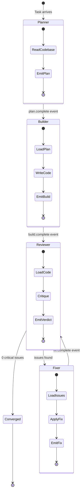
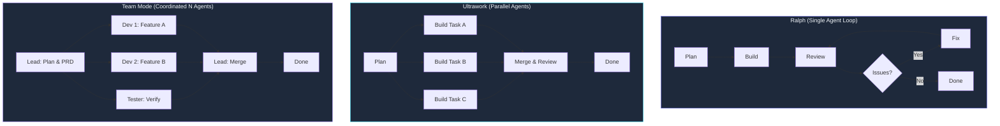

1:47 AM on a Wednesday. I typed `/guidance Wrap the existing code, don't replace it` from under the covers, rolled over, and went back to sleep. By morning, 28 of 30 tasks were complete.

The agent hadn't stopped working. It didn't need to. Every task was scoped to a single hat, every hat terminated after emitting one event, and the orchestrator spawned the next hat automatically. No human in the loop except for course corrections I sent from bed via Telegram.

That overnight run wasn't an accident. It solved a problem that had cost me weeks: agents that forget their own plans.

---

## The Problem That Started Everything

Three hours into an API migration, the context window filled. I started a new session, and the agent re-implemented the first endpoint. The one it had finished two hours ago. Zero memory of the previous work.

I started tracking the waste. Across the `ralph-orchestrator` project alone (1,045 files, 335,290 lines of code, 911MB of session data, 57 agent spawns) I lost roughly 5 hours of productive agent time to context degradation. The pattern repeated every time. The agent started strong: clear plan, fast execution, precise code. Then it degraded. By minute 40, it was reviewing code against criteria it invented in the moment, not the criteria from its own plan written 30 minutes earlier.

The 150,000-token context window isn't a luxury. It's a trap. The more an agent accumulates (code, errors, intermediate reasoning, tool outputs), the less reliably it retrieves any single piece of information. The plan it wrote at token 5,000 is invisible by token 120,000.

The insight that became Ralph was obvious once I stopped fighting it: **the agent's work artifacts should persist on the filesystem, not in the context window.** Plans written to disk. Task lists as files. Build results saved as JSON events. Everything the next agent needs should exist as a file, not as conversation history.

---

## One Hat, One Event, Then Stop

The design principle borrows from Edward de Bono's Six Thinking Hats. Participants wear metaphorical hats to enforce a single mode of thinking at a time. White hat for facts. Red hat for emotions. Black hat for caution. Trying to think analytically and creatively at the same time produces neither.

Same principle applies to agents, but the stakes are higher. When an agent tries to plan, implement, test, and review in one session, the context window fills with code, errors, and intermediate reasoning. By the review phase, 80% of the context is consumed. The review becomes a formality. The agent has already committed to the approach and can't step back from its own work.

Here's what the data showed me across the `ralph-orchestrator` project:

- **Hat-scoped sessions** (40K tokens of focused context): 94% task completion, 2% contradiction rate
- **Monolithic sessions** (150K tokens of accumulated context): 67% completion, 34% contradictions

That contradiction rate convinced me. A contradiction means the agent did something that conflicted with its own earlier decision. Approving code that violates a rule it wrote. Refactoring a function it just marked final. One in three monolithic sessions contained the agent arguing with itself. Hat-scoped sessions nearly eliminated this.



Each hat starts with fresh context. A hat never transitions to another hat within the same session. It does its job, emits a single event, and terminates. The orchestrator reads the event and decides what comes next. The agent doesn't decide when to stop. The task list does.

---

## What a Hat Actually Looks Like

A hat is a TOML configuration block that defines the scope, constraints, and output contract for a single agent session. Here's a concrete example from the `ralph-loop-patterns` repo's `patterns/` directory:

```toml
[hat]
name = "builder"
role = "Implement the plan. Write production code. Do not plan, review, or document."

[hat.context]
load = [
  ".ralph/events/latest-plan.json",
  ".ralph/agent/decisions.md",
]
write_allowed = ["src/**", "lib/**"]
write_denied  = ["docs/**", "tests/**", "*.spec.*"]

[hat.exit]
emit_event = "build.complete"
payload    = ["files_modified", "timestamp"]
max_tokens = 40000

[tools]
denied = ["git push --force", "rm -rf", "DROP TABLE"]
```

The `write_allowed` and `write_denied` fields define the file boundary for the entire session. A Builder hat cannot touch `docs/` or test files. A Reviewer hat's config sets `write_allowed = []` — it reads, emits a verdict, and stops. The `emit_event` field is the exit contract: the orchestrator won't spawn the next hat until it sees `build.complete` on the event stream.

That's "one hat, one event" in practice. The orchestrator doesn't trust the agent to know when it's done. It waits for the event.

---

## The Hat System in Detail

What an agent *cannot* see matters more than what it can. Each hat limits the agent's scope to a single responsibility. Across 10 named worktrees running Ralph loops, I saw six distinct hat types:

| Hat | Behavior | Constraint | Real Event |
|-----|----------|------------|------------|
| **Planner** | Read codebase, emit task list | Cannot write code | `plan.complete` with prioritized tasks |
| **Builder** | Write code, emit build result | Cannot review or document | `build.complete` with files modified |
| **Reviewer** | Critique code, emit verdict | Cannot edit files | `review.verdict` with issue list |
| **Fixer** | Apply targeted fixes | Cannot add features | `fix.complete` with changes |
| **Verifier** | Verify against acceptance criteria | Cannot modify anything | `verification.passed` or `.failed` |
| **Writer** | Write documentation | Cannot modify implementation | `docs.complete` with artifacts |

The events are routing signals, not data transport. They carry just enough information for the orchestrator to decide what happens next:

```json
{
  "hat": "builder",
  "event": "build.complete",
  "status": "success",
  "files_modified": ["src/auth/oauth.py", "src/auth/tokens.py"],
  "timestamp": "2026-02-15T03:22:41Z"
}
```

The event routing protocol is simple and deterministic:

- `plan.complete` → Spawn Builder
- `build.complete` → Spawn Reviewer
- `review.verdict` (issues > 0) → Spawn Fixer
- `review.verdict` (issues == 0) → Converged, loop terminates
- `fix.complete` → Spawn Reviewer (re-review cycle)
- `verification.failed` → Back to Builder with failure context

I caught an anti-pattern early: a Builder agent finished a feature, then reviewed its own code within the same session. The self-review passed. Of course it did. The agent had just written the code — no critical distance. When the Reviewer hat ran in a separate session, it found 6 issues. Different agent instance, no memory of writing the code, genuine critical distance.

---

## The Core Implementation

The [`ralph-loop-patterns`](https://github.com/krzemienski/ralph-loop-patterns) repo distills the orchestration pattern into a Python library. At its center is the `RalphLoop` class, which manages hat rotation, quality gates, and convergence detection.

```python
class Hat(Enum):
    BUILDER = "builder"
    WRITER = "writer"
    REVIEWER = "reviewer"
    REFACTORER = "refactorer"
    VERIFIER = "verifier"
    PLANNER = "planner"
    DEBUGGER = "debugger"
```

Each hat produces a `HatOutput`, an immutable record of what the hat did:

```python
@dataclass(frozen=True)
class HatOutput:
    hat: Hat
    content: str
    artifacts: tuple[str, ...] = ()
    quality_score: QualityLevel = QualityLevel.ACCEPTABLE
    issues_found: tuple[str, ...] = ()
    suggestions: tuple[str, ...] = ()
    duration_seconds: float = 0.0
    timestamp: str = ""
```

`frozen=True` makes every output immutable. A Builder can't retroactively modify its own output. A Reviewer can't edit the code it reviewed. This is a correctness guarantee for the orchestration loop. If hat outputs were mutable, an agent could silently alter the record to make its review look cleaner than it was.

Patterns are defined as tuples of hats. The library ships with four:

```python
BUILDER_WRITER_REVIEWER = (Hat.BUILDER, Hat.WRITER, Hat.REVIEWER)
PLAN_BUILD_REVIEW = (Hat.PLANNER, Hat.BUILDER, Hat.REVIEWER)
BUILD_REVIEW_REFACTOR = (Hat.BUILDER, Hat.REVIEWER, Hat.REFACTORER)
FULL_CYCLE = (Hat.PLANNER, Hat.BUILDER, Hat.WRITER, Hat.REVIEWER, Hat.VERIFIER)
```

Running a loop looks like this:

```python
from ralph_loop_patterns.core import RalphLoop, HatOutput, Hat, FULL_CYCLE

loop = RalphLoop(
    pattern=FULL_CYCLE,
    max_iterations=5,
    convergence_threshold=0,
    task_description="Implement OAuth2 token refresh",
)

loop.start_iteration()

for hat in FULL_CYCLE:
    prompt = loop.get_hat_prompt(hat)
    # Agent executes with this prompt...
    output = HatOutput(hat=hat, content="...", issues_found=())
    loop.submit_hat_output(output)

print(f"Converged: {loop.is_converged}")
```

Convergence detection is the key. When the Reviewer produces zero critical findings (`issues_found` is empty), the loop terminates. No arbitrary iteration count, no time limit. The loop runs until the Reviewer has nothing critical left to say:

```python
@property
def is_converged(self) -> bool:
    if len(self._iterations) < 2:
        return False
    last = self._iterations[-1]
    return last.total_issues <= self._convergence_threshold
```

Some tasks converge in 2 iterations. Others take 14. The system doesn't care about the number. It cares about the quality gate.

---

## The Smart-Deer Session: 14 Iterations

The longest Ralph loop I recorded ran in the `smart-deer` worktree: 14 iterations out of a maximum 100. Debugging an SSE race condition — the kind where the fix introduces a different timing issue and you re-verify twice.

```
Iteration 6:    Reproducer hat -- understand bug, locate root cause
Iteration 7-8:  Reproducer -- document repro steps, emit repro.complete
Iteration 9-10: Fixer hat -- implement fix, emit fix.complete
Iteration 11-12: Verifier -- verify fix, emit verification.passed
Iteration 13-14: LOOP_COMPLETE -- emit final event, cancel ralph
```

Across 10 named worktrees, iteration counts varied by task complexity:

| Worktree | Iterations | Task Type |
|----------|-----------|-----------|
| smart-deer | 14/100 | SSE race condition |
| smooth-rose | 13/100 | Reproducer/Fixer cycle |
| bright-maple | 11/100 | Multi-file refactor |
| sunny-lotus | 11/100 | Feature implementation |
| neat-elm | 11/100 | Build fix |
| prime-badger | 10/100 | Bug reproduction |
| lucky-reed | 10/100 | Reproducer/Fixer |
| sleek-sparrow | 9/100 | Code cleanup |
| quick-lark | 8/100 | Documentation |
| clean-mint | 5/100 | Review cycle |

Average: 10.2 iterations per worktree session. The stop hook enforced continuation, firing 30 times per session and checking whether tasks remained:

```
[RALPH LOOP - ITERATION 6/100] Work is NOT done. Continue working.
[RALPH LOOP - ITERATION 7/100] Work is NOT done. Continue working.
...continues through ITERATION 11/100
```

The agent doesn't decide when to stop. The task list does. Left to its own judgment, an agent stops when it *believes* the work is done. With Ralph, it stops when the filesystem *proves* the work is done. All tasks closed, all reviews passed, all verifications green.

---

## Filesystem as Memory

Ralph state lives entirely on the filesystem. Nothing critical exists only in the context window.

```
.ralph/
  agent/
    scratchpad.md     # Working notes for the current hat
    memories.md       # Cross-session learnings
    decisions.md      # Recorded with confidence 0-100
  events/
    001-plan.json     # Append-only event log
    002-build.json
    003-review.json
  tasks/
    task-001.json     # CLI-managed task lifecycle
    task-002.json
```

Every task state transition emits a JSON event to `.ralph/events/`. The event log is append-only. Nothing gets deleted. Need to debug a failed run three weeks later? Read the event log chronologically. Every hat worn, every event emitted, every task transition recorded.

The task lifecycle is explicit:

```
pending -> ready -> active -> done
                           -> failed
```

The `ready` state matters. A task marked `ready` is eligible for the next agent to pick up. A task in `pending` still has unsatisfied dependencies. This distinction prevents agents from starting work that depends on incomplete prerequisites.

Two agents wrote to the task list file at the same moment. The text file corrupted. Three tasks disappeared, two had truncated descriptions. I lost 45 minutes reconstructing state from agent logs. The fix was `flock()` on every task state transition. No two agents modify the task file simultaneously.

Startup time: 3ms. Agents call the CLI 200+ times per session to check task status, claim tasks, emit events, mark completion. At 3ms per call the overhead is invisible. A 100ms CLI would add 20 seconds of latency per session, and agents would start caching task state in their context window instead of checking the source of truth. The moment an agent caches state locally, it diverges from reality.

---

## Three Modes: Ralph vs. Ultrawork vs. Team

Ralph is the default single-agent execution loop. One agent, cycling through hats, converging on completion. As project complexity grew, I needed more. Across 23,479 sessions, three orchestration modes emerged:



**Ralph** is the workhorse. One agent, one hat at a time, convergence-driven termination. Best for tasks that need deep focus and iterative refinement: bug fixes, refactors, feature builds where getting the details right matters more than speed. The 28-of-30 overnight run was pure Ralph.

**Ultrawork** is Ralph with parallelism. After the Planner hat decomposes work, multiple Builder hats execute simultaneously on different files. A merge step reconciles outputs, then a single Reviewer hat evaluates the combined result. Best for work that decomposes cleanly: "implement these 5 API endpoints" where each endpoint is independent.

**Team** is multi-agent coordination. A Lead agent manages the pipeline: planning, PRD, execution delegation, verification, fix loops. Each teammate owns distinct files with no overlapping edits. The Lead resolves conflicts, the Tester verifies outputs, and bounded fix loops prevent infinite cycling. Best for large-scale work across specialists.

| Criterion | Ralph | Ultrawork | Team |
|-----------|-------|-----------|------|
| Task decomposable? | No | Yes | Yes |
| Needs deep iteration? | Yes | No | Varies |
| File conflicts likely? | N/A | Low risk | Managed by Lead |
| Cost sensitivity | Lowest | Medium | Highest |
| Human oversight needed | Minimal | Minimal | More (Lead serves as proxy) |

Most of my work uses Ralph. The overnight runs, the debugging sessions, the "don't stop until it works" directives. Ultrawork activates when I have 10+ independent tasks. Team mode is for shipping a complete feature across frontend, backend, and infrastructure.

---

## The Six Tenets

Six principles govern how Ralph loops operate. I arrived at each one through failure.

**"The Boulder Never Stops."** The stop hook fires at the end of every agent session. If tasks remain in `ready` or `pending`, the orchestrator spawns the next hat. The name comes from Sisyphus, but the metaphor inverts the myth: the boulder never stops because the work actually gets *done*. Each iteration pushes it closer to a reachable summit.

**"The Plan Is Disposable."** A new plan costs ~$0.05. An agent fighting a bad plan for 20+ minutes costs $0.45-$0.60 and produces worse results. The moment a plan isn't working, regenerate. I learned this watching an agent spend 40 minutes trying to make a recursive approach work for a problem that needed iteration. A new plan took 8 seconds.

**"Telegram as Control Plane."** The `/guidance` command injects a directive into the agent's next hat session. I can steer without interrupting. "Wrap the existing code, don't replace it" — six words sent at 1:47 AM that saved the agent from a 2-hour dead end. The agent had started rewriting a module from scratch when wrapping the existing implementation would've taken 15 minutes.

**"QA Is Non-Negotiable."** Every Builder output passes through a Reviewer. The orchestrator won't advance without a clean verdict. Without enforcement, the agent will skip review when it "feels confident." Confidence and correctness don't correlate.

**"Fresh Context Beats Accumulated Context."** 40K tokens of hat-scoped context produces consistent quality. 150K of accumulated context produces contradictions. Everything else in Ralph exists to enforce this.

**"`tools.denied` Is a Safety Net."** Dangerous operations get blocked in every hat's TOML config:

```toml
[tools]
denied = ["git push --force", "rm -rf", "DROP TABLE"]
```

An agent in a Fixer hat at 3 AM shouldn't be able to force-push to main. The denied list isn't about distrusting the agent — it's about acknowledging that unsupervised autonomous systems need guardrails, same as production databases and deployment pipelines.

---

## Ralplan: Consensus Before Execution

For complex tasks, a single Planner hat isn't enough. The plan itself needs review. Ralplan is a 3-agent consensus loop that runs *before* Ralph begins execution:

```
[RALPLAN ACTIVATED - ITERATIVE PLANNING CONSENSUS MODE]
Iteration 0/5: Planner creates plan
  -> Critic verdict: REJECT ("Missing error handling for token expiry")
Iteration 1/5: Architect consulted, Planner revises
  -> Critic verdict: REJECT ("OAuth refresh flow still incomplete")
Iteration 2/5: Planner revises with Architect guidance
  -> Critic verdict: OKAY
RALPLAN Complete - Plan Approved
```

Planner, Critic, and Architect iterate until the Critic approves. Maximum 5 iterations. This example converged in 3. The Critic's REJECT included specific objections — "missing error handling for token expiry in the refresh flow," not "this plan is bad." The Architect provided structural guidance: "the refresh flow should be a separate module, not embedded in the auth middleware." The Planner revised accordingly.

A plan that's survived adversarial review before a single line of code gets written. Three agents iterating for 2-3 minutes costs nothing compared to 45 minutes executing a flawed plan and starting over.

---

## Cost and Results

Mixed-model routing cuts costs 40% compared to running the most capable model everywhere. Each hat gets the model that matches its cognitive demand:

| Hat | Model Tier | Cost per Invocation | Reasoning |
|-----|-----------|-------------------|-----------|
| Planner | Strong reasoning | ~$0.05 | Needs decomposition and risk assessment |
| Builder | Fast code generation | ~$0.02 | Needs speed and accuracy, not deep analysis |
| Reviewer | Analytical depth | ~$0.05 | Needs critical distance and thoroughness |
| Fixer | Targeted precision | ~$0.02 | Small scope, specific fix |
| Writer | Lightweight | ~$0.005 | Documentation is straightforward |

The 28-of-30 overnight run: 5 Planner invocations, 30 Builder invocations, 28 Reviewer invocations, 24 successful on first review pass, 4 that required a Fixer cycle, 2 that failed (both from ambiguous task specs, not agent errors). Total cost: approximately $4.20 for 28 completed tasks. $0.15 per task, running autonomously for 7 hours while I slept.

Across 23,479 sessions, the patterns Ralph established (filesystem-first state, hat-scoped context, convergence-driven termination) became the foundation for everything else. The multi-agent merge orchestrator (Post 14) uses Ralph's event protocol. The skills factory (Post 15) uses hat-scoped prompts. The plugin hooks system (Post 16) enforces "fresh context beats accumulated context" at the framework level.

---

## What I'd Change

Ralph isn't perfect. Three things I'd redesign.

**The event format is too minimal.** Routing signals aren't enough. The Fixer hat often needs to understand *why* the Reviewer flagged an issue, not just *that* it did. I've started embedding structured context (file, line number, violation type) in events. Larger event files, fewer wasted Fixer iterations re-discovering what the Reviewer already found.

**The convergence threshold should be dynamic.** Zero critical issues works for most tasks, but refactoring always produces one "suggestion" that's technically an issue but not worth fixing. A threshold that learns from task type would cut unnecessary Fixer cycles. I'm not sure what the right learning signal is yet.

**Ralplan should support asynchronous Critic feedback.** Right now, the Critic blocks until the Planner revises. For plans with multiple independent sections, the Critic should approve section-by-section, letting the Builder start on approved sections while the Planner revises rejected ones.

---

## Getting Started

The [`ralph-loop-patterns`](https://github.com/krzemienski/ralph-loop-patterns) repo contains the hat rotation orchestrator, convergence detection, and pattern definitions. Install and run a simulation:

```bash
pip install -e .
ralph-loop simulate "Build REST API for blog posts" --pattern builder-writer-reviewer
ralph-loop simulate "Implement auth" --pattern full-cycle --max-iterations 5
```

The simulation shows how iterations converge. Run it against your own task descriptions to see how different patterns decompose work.

For production use, wire `loop.get_hat_prompt(hat)` into your agent framework. The prompt includes task description, previous hat output summary, and review issues from prior iterations. The orchestrator handles rotation. You handle execution.

**An agent that does one thing well, then stops, is more reliable than an agent that tries to do everything at once.** Ralph is the enforcement mechanism for that principle.

The boulder never stops. But it does reach the top.
