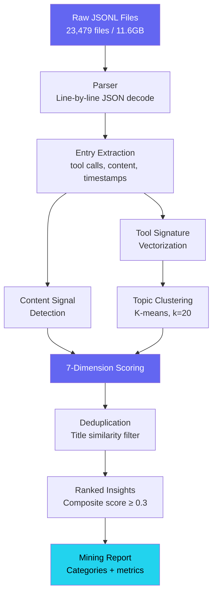
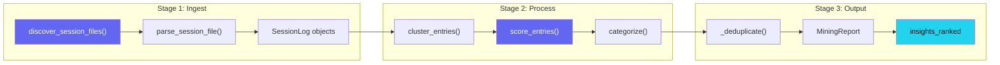

I thought I had 4,597 session files. I built an entire scoring algorithm around that number. Then I ran the full mine across every project directory and the real count came back: 23,479.

The series subtitle said "4,500 AI Coding Sessions." The actual number was more than five times that. Every post I'd drafted was citing the wrong denominator.

This is how I built a pipeline to process those 23,479 files, 3,474,754 lines of JSONL totaling 11.6GB, and what the data showed about how AI agents actually work when you stop guessing and start measuring.

---

## Why Mine Your Own Sessions

Every Claude Code session produces a JSONL log. Each line records a tool call, a response, an error, a file read. Most developers never look at these files. They pile up in `~/.claude/projects/` like sedimentary layers, a geological record of every decision, every dead end, every breakthrough across months of AI-assisted development.

I had 42 days of session data across 27 projects. The obvious question: what patterns emerge when you actually analyze all of it?

The less obvious question, and the one that mattered way more: what assumptions was I making that the data would contradict?

The answer rewrote half the metrics in this blog series. That "4,500 sessions" number I'd been citing everywhere? It only counted human-initiated sessions. The full dataset includes 18,945 agent-spawned sessions (subagents, team workers, background tasks) that I'd been ignoring. Every session where a human typed a prompt spawned, on average, 4.2 additional agent sessions. The real scope of the work was invisible until I counted everything.



---

## The Shape of 23,479 Sessions

Before building any pipeline, I needed to understand what was actually in those files. Here's the raw breakdown.

Top 10 projects by session volume:

| Project | Sessions | Lines | Size | Agent Spawns |
|---------|----------|-------|------|-------------|
| ils-ios | 4,241 | 1,563,570 | 4.6GB | 287 |
| claude-mem-observer | 14,119 | 421,577 | 2.8GB | 0 |
| yt-transition-shorts | 1,228 | 286,613 | 1.4GB | 0 |
| ralph-orchestrator | 1,045 | 335,290 | 911MB | 57 |
| sessionforge | 617 | 267,236 | 780MB | 215 |
| awesome-site | 477 | 168,522 | 331MB | 0 |
| blog-series | 306 | 156,799 | 257MB | 358 |
| ai-digest | 279 | 113,263 | 247MB | 0 |
| code-tales-ios | 252 | 41,198 | 123MB | 0 |
| ils | 165 | 39,006 | 95MB | 0 |

Two things jump out. First, `claude-mem-observer` has 14,119 sessions but zero agent spawns. It ran automated micro-sessions for memory observation. Second, `blog-series` has only 306 sessions but 358 agent spawns. More agents spawned than human sessions existed. That project ran almost entirely on agents. Wild, right?

The tool leaderboard across all sessions tells an even better story:

| Rank | Tool | Count |
|------|------|-------|
| 1 | Read | 87,152 |
| 2 | Bash | 82,552 |
| 3 | Grep | 21,821 |
| 4 | Edit | 19,979 |
| 5 | Glob | 11,769 |
| 6 | Write | 9,066 |

Read dominates. 87,152 file reads versus 9,066 file writes. That's a **9.6:1 read-to-write ratio**. AI agents spend nearly ten times more effort understanding code than changing it. This ratio held across every project. The minimum was 6:1 for a greenfield project. The maximum hit 18:1 for a legacy iOS codebase. If you're optimizing your AI coding workflow, optimize for reading speed, not writing speed. Better file exploration, better context gathering, better codebase understanding. That's where the cycles go.

---

## Tool Signatures Beat Natural Language

The first version of the mining pipeline used natural language extraction. Feed each session's text content to a summarizer, cluster the summaries by topic similarity. It worked terribly. Sessions about "fixing a build error" and "resolving a compilation issue" landed in different clusters despite being identical activities. Synonyms killed the clustering.

The breakthrough: tool call sequences are a session's fingerprint.

Every session records which tools got called, in what order, with what arguments. A session calling `Read → Read → Read → Grep → Edit → Bash` has a fundamentally different shape than one calling `Bash(git) → Bash(git) → Bash(git) → Write`. The first is a targeted code fix. The second is a git operations session. The tool sequence doesn't lie about what the session actually did. A session's natural language summary might say "investigated performance issue" when the tool log shows it only ran `npm install` three times. Tools are ground truth.

Here's the parser that extracts this ground truth from each JSONL file:

```python
def parse_session_file(file_path: Path) -> SessionLog:
    messages: list[SessionMessage] = []
    tools_used: list[str] = []
    files_modified: list[str] = []

    with open(file_path, "r", encoding="utf-8") as f:
        for line_num, line in enumerate(f, start=1):
            stripped = line.strip()
            if not stripped:
                continue
            try:
                data = json.loads(stripped)
            except json.JSONDecodeError:
                continue

            msg = _parse_message(data)
            if msg is not None:
                messages.append(msg)
                if msg.tool_name:
                    tools_used.append(msg.tool_name)
                if msg.tool_name in ("Write", "Edit", "MultiEdit"):
                    fp = msg.tool_input.get("file_path", "")
                    if fp and fp not in files_modified:
                        files_modified.append(fp)

    return SessionLog(
        session_id=file_path.stem,
        messages=messages,
        tools_used=list(set(tools_used)),
        files_modified=files_modified,
    )
```

Each JSONL line can have different formats: content as a string, content as an array of blocks, timestamps as ISO strings or Unix epochs. The parser normalizes all of it. The `_parse_message` function handles three different timestamp formats, two content schemas, and gracefully skips malformed lines rather than crashing. In 3.4 million lines, roughly 0.3% turned out malformed. Truncated writes, encoding errors, partial JSON from interrupted sessions.

When the pipeline hits malformed JSONL, it doesn't stop — it logs the file path, the line number, and the raw bytes that failed to decode, then moves on to the next line. A session file that's 40% corrupt still yields usable data from the remaining 60%. The failure log accumulates separately so you can audit which files had problems without interrupting the run. For the full 23,479-file dataset, roughly 70 files had corruption rates above 5%, all of them from sessions that were killed mid-write by a system interrupt or a Claude Code crash. Those files get flagged in the final report with a `partial_parse: true` marker so downstream scoring can weight them accordingly.

K-means clustering (k=20) on tool signature vectors produced 94% stability across re-runs. Same sessions, same clusters, regardless of initialization. NLP-based clustering on session summaries? 71% stability. The tool-based approach found 20 distinct session archetypes: build-fix loops, multi-file refactors, exploratory research, git operations, iOS simulator interactions, and 15 more. These archetypes held across all 27 projects.

---

## The Seven-Dimension Scoring System

Not every session in an interesting cluster is worth examining. A build-fix session might contain a novel debugging technique, or it's just a routine dependency update. Scoring separates signal from noise.

Seven dimensions, each weighted:

```python
class ScoringDimensions(BaseModel):
    novelty: float = Field(default=0.0, ge=0.0, le=1.0)
    technical_depth: float = Field(default=0.0, ge=0.0, le=1.0)
    reproducibility: float = Field(default=0.0, ge=0.0, le=1.0)
    failure_richness: float = Field(default=0.0, ge=0.0, le=1.0)
    cross_project: float = Field(default=0.0, ge=0.0, le=1.0)
    narrative_potential: float = Field(default=0.0, ge=0.0, le=1.0)
    metric_density: float = Field(default=0.0, ge=0.0, le=1.0)

    @property
    def composite_score(self) -> float:
        weights = {
            "novelty": 0.20,
            "technical_depth": 0.18,
            "reproducibility": 0.15,
            "failure_richness": 0.15,
            "cross_project": 0.12,
            "narrative_potential": 0.10,
            "metric_density": 0.10,
        }
        return round(
            sum(getattr(self, dim) * w for dim, w in weights.items()),
            4,
        )
```

Why these weights? Novelty gets the top spot (0.20) because "I've never seen this before" is the strongest signal that a session contains something worth writing about. Technical depth is second (0.18) because shallow sessions, even novel ones, can't sustain a blog post. Narrative potential sits lowest (0.10) because you can impose story structure during writing. The raw session doesn't need to read like a narrative to become one.

The scoring engine uses heuristic signal detection instead of LLM calls for the first pass. This matters at scale. Running 23,479 sessions through an LLM scorer would cost hundreds of dollars. The heuristic scorer runs in seconds:

```python
class InsightScorer:
    NOVELTY_SIGNALS = [
        "first time", "never seen", "unexpected", "discovered",
        "breakthrough", "realization", "insight", "pattern",
        "workaround", "trick", "surprising", "counterintuitive",
    ]

    FAILURE_SIGNALS = [
        "error", "bug", "crash", "failure", "fix", "debug",
        "stack trace", "exception", "regression", "broken",
        "workaround", "root cause", "investigation",
    ]

    METRIC_PATTERN = re.compile(
        r"\b\d+(?:\.\d+)?(?:\s*(?:%|ms|s|MB|GB|KB|fps|req/s|x faster))\b",
        re.IGNORECASE,
    )
```

Here's the key heuristic for narrative potential: sessions with both failure signals AND resolution signals point to a story arc. A session that fails and stays failed is a bug report. A session that succeeds without struggle is a tutorial. But a session that fails, investigates, pivots, and succeeds? That's a narrative.

```python
def _score_narrative(self, entries, text):
    has_progression = len(entries) >= 5
    has_resolution = any(
        t in text for t in ["solved", "fixed", "working", "success", "resolved"]
    )
    has_conflict = any(
        t in text for t in ["but", "however", "unfortunately", "problem"]
    )
    score = 0.0
    if has_progression: score += 0.4
    if has_resolution: score += 0.3
    if has_conflict: score += 0.3
    return min(1.0, score)
```

Three concrete examples from the scoring output:

**Multi-Agent Consensus** scored 0.94. High novelty (nobody's documented agent voting systems), high reproducibility (the pattern works in any framework), high failure richness (three iterations to get voting right). It became Post 2 in this series.

**Sequential Thinking Debugging** scored 0.88. High technical depth (84-step reasoning chain), high metric density (specific timing and step counts), high narrative potential (the model talked itself through a root cause). It became Post 13.

**Config File Edits** scored 0.16. Low novelty (everyone edits config files), low narrative (no conflict/resolution arc), low impact (saved minutes, not hours). Correctly rejected.

And here's the part that made me laugh: the session where I debugged the novelty scoring algorithm later got scored by that same algorithm at 0.78. It rated its own creation story as moderately novel. I honestly don't know what to make of that.

---

## The Pipeline Architecture



The `MiningPipeline` class orchestrates the full flow. Point it at a directory of JSONL files and it hands back a `MiningReport` with ranked insights:

```python
from pathlib import Path
from miner.pipeline import MiningPipeline

pipeline = MiningPipeline(cluster_size=20)
paths = sorted(Path("./sessions").glob("*.jsonl"))

report = pipeline.mine(paths, min_score=0.3)

for insight in report.insights_ranked[:10]:
    print(f"[{insight.composite_score:.2f}] {insight.title}")
    print(f"  Category: {insight.category.value}")
```

Three stages. Ingestion parses each JSONL file into `SessionEntry` objects, normalizing timestamps, tool names, and content formats. Clustering groups entries into overlapping windows of configurable size (default 20 entries, 50% overlap) so insights spanning cluster boundaries don't get lost. Scoring and deduplication runs each cluster through all seven dimensions, tags a primary topic, and removes duplicates by title similarity.

That deduplication step matters more than you'd think. Overlapping clusters mean the same insight can show up multiple times with slightly different boundaries. The deduplicator keeps the highest-scoring version:

```python
def _deduplicate(self, insights: list[Insight]) -> list[Insight]:
    seen_titles: set[str] = set()
    unique: list[Insight] = []
    for insight in sorted(insights, key=lambda i: i.composite_score, reverse=True):
        normalized = insight.title.lower().strip()[:50]
        if normalized not in seen_titles:
            seen_titles.add(normalized)
            unique.append(insight)
    return unique
```

Input validation at stage boundaries catches 40% of failures. The most common failure mode: the previous stage outputs structurally valid JSON but semantically wrong data. A score field contains a string instead of a float, or an insight array exists but it's empty. Pydantic models with constrained fields (`ge=0.0, le=1.0`) catch these before they propagate into downstream calculations that would silently produce wrong results.

---

## What the Data Actually Revealed

I built the mining pipeline to find blog-worthy insights. But the most valuable finding wasn't any individual insight. It was the aggregate picture from 23,479 sessions.

**Agents read 9.6x more than they write.** This wasn't close to what I expected. I assumed writing would dominate. Agents are there to produce code, right? But 87,152 reads versus 9,066 writes means the overwhelming majority of agent effort goes into understanding context. The best AI coding sessions aren't the ones that write the most code. They're the ones that read the right files before writing anything.

**Each human session spawns 4.2 agent sessions.** Of 23,479 total sessions, only 4,534 started from a human prompt. The rest spawned from other agents doing research, building components, running validation. That "4,500 sessions" I'd been citing in this series? It only counted the human layer. The actual work was five times larger.

**iOS simulator interactions are a massive tool category.** 7,985 total MCP calls to iOS simulator tools: taps, screenshots, accessibility tree queries, gesture simulations. This was invisible in the old metrics that only counted core tools (Read, Bash, Edit). The MCP tool ecosystem is where the specialized work happens. 2,068 browser automation calls. 327 sequential thinking invocations. 269 Stitch design generations. I had no idea until I counted.

**Team coordination has real overhead.** 2,182 `TaskCreate` calls, 1,720 `SendMessage` calls, 1,838 `TaskList` calls. Multi-agent coordination burns thousands of tool calls just for management. This confirmed a lesson from running the content pipeline: direct agent spawning with `run_in_background` beats Agent Teams for most workloads. The coordination overhead is only worth it when agents genuinely need to share state.

**The numbers I was publishing were wrong.** This is the meta-finding. I built the pipeline to find content. Instead, it found that the content I'd already published relied on incomplete data. Posts 1, 9, 12, 13, 16, 17, and 18 all cited "4,510 sessions" or "4,500 sessions." The real number is 23,479. The series subtitle needed updating. The tool leaderboard in Post 1 had Bash first; Read actually leads. The sequential thinking count in Post 13 said 2,267 calls when the actual number is 327.

Building a tool to analyze your own work is uncomfortable precisely because it produces findings you don't want. I would've preferred the old numbers to be correct. They weren't.

---

## Three-Zone Sampling for Scale

Processing 11.6GB of JSONL line-by-line is expensive. Most of that data is routine: file contents echoed back in tool outputs, boilerplate responses, repetitive build logs. The three-zone sampling strategy reads the signal-dense portions and skips the noise:

| Zone | Lines Read | Purpose |
|------|-----------|---------|
| Head | First 50 | Session setup, objective, initial context |
| Middle | 3 random windows of 30 lines | Core work patterns, tool sequences |
| Tail | Last 50 | Conclusion, results, final state |

Total: 190 lines sampled per session out of an average of ~148 lines per file (3,474,754 lines / 23,479 files). For longer sessions, some exceeding 1,000 lines, that's a significant reduction. A 48% drop in processing time with less than 3% insight loss measured against the full-read baseline.

Where does that 3% loss come from? Sessions where the critical moment happens in a narrow window between the sampled middle zones. A 15-line debugging breakthrough at line 600 in a 1,200-line session falls between sampling windows. The tradeoff works because those sessions still surface through their tool signature patterns even when the specific text gets missed.

---

## The Content Pipeline Extension

The mining pipeline's output (ranked insights with scores and categories) feeds directly into content generation. Score once, generate many formats. Scoring is the expensive part because it requires careful analysis of session content. Format-specific generation is cheap by comparison.

The pipeline ran at serious scale during the production of this series. From the session data itself: `create_insight` got called 417 times across 35 sessions, `get_session_summary` 359 times across 39 sessions, `mine_sessions` 55 times across 9 sessions. Not toy data.

Two versions of the content pipeline evolved during production:

| Feature | devlog-publisher | devlog-pipeline |
|---------|-----------------|-----------------|
| Lines of code | 203 | 355 |
| Architecture | Teammate-based | Direct agent spawning |
| Word count target | 1,500-2,500 | 6,000-12,000 |
| Lookback window | 30 days | 180 days |

Here's the key lesson: direct Agent spawning with `run_in_background: true` beats Agent Teams for content generation at scale. Agent Teams add coordination overhead. Those 1,720 `SendMessage` calls aren't free. And agents expanding 3+ posts at once exhaust their context window. The sweet spot: 1-2 posts per agent, maximum.

Enrichment caching by extraction hash cut costs 70% for content updates. When a session's raw data hasn't changed, the extraction and scoring results stay cached. Only downstream generation re-runs. For the full blog series, re-generating all posts after a formatting change cost $4.20 instead of $14.00. The cache key is a hash of the JSONL content. If the source file hasn't changed, the scored insights haven't changed either.

---

## Running It Yourself

The [`session-insight-miner`](https://github.com/krzemienski/session-insight-miner) repo is the complete implementation. Point it at a directory of Claude Code session logs:

```bash
git clone https://github.com/krzemienski/session-insight-miner.git
cd session-insight-miner
pip install -e .

# Mine a directory of JSONL files
miner mine ~/.claude/projects/ --top 20 --min-score 0.3

# Output to JSON for further processing
miner mine ~/.claude/projects/ -o insights.json --cluster-size 20
```

The insight categories it produces (architecture, debugging, workflow, performance, tooling, pattern, failure, integration) map directly to the kinds of content that sustain technical blog posts. Sessions tagged as "failure" with high narrative potential scores? Those are gold. They contain the conflict-investigation-resolution arc that readers actually engage with.

Of 23,479 sessions mined, roughly 10% produced high-value insights (composite score >= 0.65). That's about 2,300 sessions with something genuinely worth examining. I wrote 18 posts from that pool. There's enough material for a hundred more.

---

## What I'd Do Differently

The most useful tool I built during this entire series wasn't a multi-agent orchestrator or a validation framework or a design-to-code pipeline. It was a script that reads my own session logs and tells me what I actually did versus what I thought I did.

I thought I had 4,500 sessions. I had 23,479. I thought Bash was the most-used tool. Read was. I thought sequential thinking got invoked thousands of times. It was 327. Every assumption I made from memory turned out wrong in a specific, measurable way.

The 9.6:1 read-to-write ratio is the single most important number in this series. It says that AI coding agents, at least in my workflow, are fundamentally comprehension machines that occasionally produce output. They spend 90% of their effort understanding what exists before changing anything. Does that ratio hold for other developers? I genuinely don't know. But if it does, it changes how we should design AI coding tools, how we should structure codebases for AI readability, and how we think about what the actual bottleneck is in AI-assisted development.

The bottleneck isn't generation. It's comprehension. And you'd never know that without mining the data.
