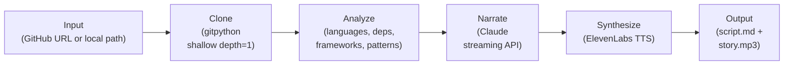
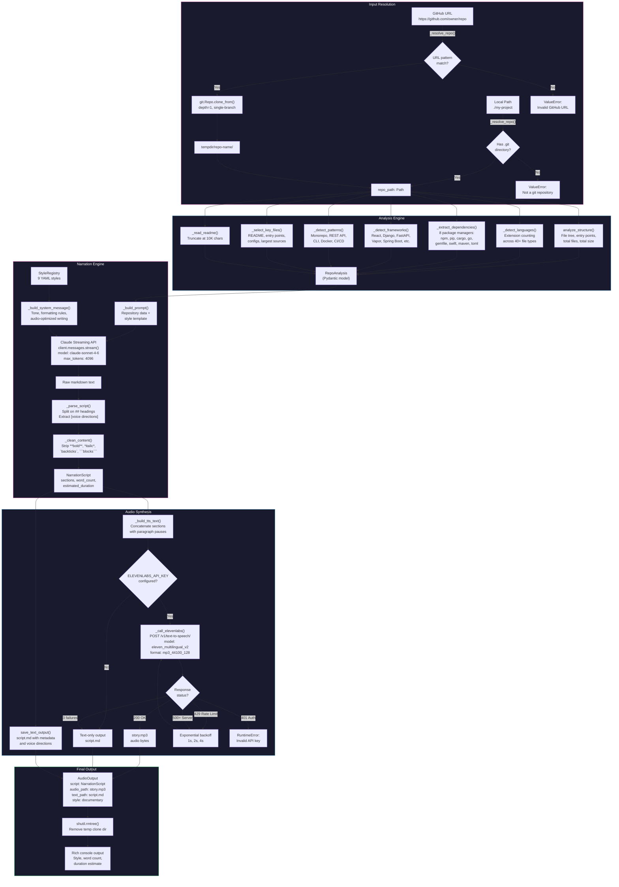
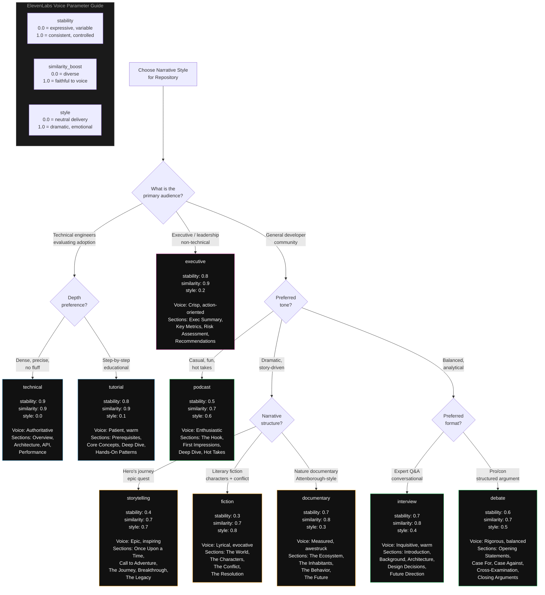

## From GitHub Repos to Audio Stories

*Agentic Development: 10 Lessons from 8,481 AI Coding Sessions*

I was driving home from work on a Tuesday evening, stuck in traffic, thinking about a codebase I needed to evaluate. A colleague had sent me a link to a FastAPI project that morning -- "check this out, might be useful for the auth refactor." I had 40 minutes of windshield time and zero ability to read code.

That is when the idea hit me: what if I could listen to a codebase?

Not read documentation. Not scan source files. Listen -- like a podcast episode about FastAPI's architecture, or a nature documentary narrating how Django evolved in the wild, or an executive briefing that tells a CTO whether a dependency is worth adopting.

That evening I started building code-tales. Six weeks later, it worked:

```bash
code-tales generate --repo https://github.com/tiangolo/fastapi --style documentary
```

Give it a GitHub URL, pick one of 9 narrative styles, and in under two minutes you get a fully synthesized audio story about the repository. Clone, analyze, narrate with Claude, synthesize with ElevenLabs. Four pipeline stages. One command.

This is post 9 of 11 in the Agentic Development series. The companion repo is at [github.com/krzemienski/code-tales](https://github.com/krzemienski/code-tales). Everything quoted here is real code you can read, run, and extend.

---

### The Pipeline Architecture

The core abstraction is a four-stage pipeline orchestrated by a single class. Here is the actual orchestrator:

```python
# From: src/code_tales/pipeline/orchestrate.py

class CodeTalesPipeline:
    """Orchestrates the full code-tales pipeline.

    Stages:
      1. Resolve repository (clone URL or validate local path)
      2. Analyze repository structure and metadata
      3. Generate narration script via Claude
      4. Synthesize audio via ElevenLabs (or save text only)
    """

    def generate(
        self,
        repo_url_or_path: str,
        style_name: str,
        output_dir: Optional[Path] = None,
    ) -> AudioOutput:
```

The `generate` method runs all four stages sequentially with Rich progress bars showing real-time status. The key design decision: every stage is independently importable. You can call `analyze_repository` without cloning, or `generate_script` without synthesizing audio. The pipeline composes; it does not mandate.



That looks simple. Four boxes and some arrows. But the devil is in each box, and the most interesting engineering lives at the boundaries between them -- where repository metadata becomes a prompt, where a prompt becomes spoken text, and where spoken text becomes audio that sounds natural.

---

### Stage 1: Repository Resolution

The pipeline resolution logic handles both remote URLs and local paths:

```python
# From: src/code_tales/pipeline/orchestrate.py

def _resolve_repo(self, repo_url_or_path: str) -> tuple[Path, Optional[Path]]:
    if repo_url_or_path.startswith(("http://", "https://", "git@")):
        temp_dir = Path(tempfile.mkdtemp(prefix="code-tales-"))
        repo_path = clone_repository(
            url=repo_url_or_path,
            target_dir=temp_dir,
            depth=self.config.clone_depth,
        )
        return repo_path, temp_dir

    # Local path
    local = Path(repo_url_or_path).expanduser().resolve()
    if not (local / ".git").exists():
        raise ValueError(
            f"Local path is not a git repository (no .git dir): {local}"
        )
    return local, None
```

Shallow clones (`depth=1`) are the default. We need the file tree, not the full commit history. This keeps clone times under a few seconds for most repositories. The clone module validates URLs against a GitHub pattern, derives the repo name, and handles cleanup on failure:

```python
# From: src/code_tales/pipeline/clone.py

def clone_repository(url: str, target_dir: Path, depth: int = 1) -> Path:
    repo_name = url.rstrip("/").rstrip(".git").rsplit("/", 1)[-1]
    clone_path = target_dir / repo_name

    if clone_path.exists():
        shutil.rmtree(clone_path)

    try:
        git.Repo.clone_from(
            url, clone_path, depth=depth,
            multi_options=["--single-branch"],
        )
    except git.exc.GitCommandError as exc:
        if clone_path.exists():
            shutil.rmtree(clone_path, ignore_errors=True)
        error_msg = str(exc)
        if "Repository not found" in error_msg:
            raise RuntimeError(f"Repository not found or is private: {url}") from exc
        if "Could not resolve host" in error_msg:
            raise RuntimeError(f"Network error while cloning {url}.") from exc
        raise RuntimeError(f"Failed to clone {url}: {exc}") from exc

    return clone_path
```

The `--single-branch` flag is equally important as `depth=1`. Combined, they minimize the data transferred. For a large repo like Django (~300MB full clone), shallow single-branch clones pull under 5MB. That turns a 30-second wait into a 2-second one.

The temp directory cleanup deserves a note too. The pipeline returns a `temp_dir` reference alongside the `repo_path`. After all four stages complete, the orchestrator calls `shutil.rmtree(temp_dir)` to clean up. If the pipeline crashes mid-run, the temp directory lingers in `/tmp/code-tales-*` -- but since it is shallow and small, that is fine. No disk bombs from aborted runs.

---

### Stage 2: The Analysis Engine

Before Claude ever sees a repository, the analysis stage extracts structured metadata. This is where code-tales distinguishes itself from "just paste the README into Claude." The analyzer detects languages by file extension counts, extracts dependencies from 8 different package manager formats, identifies frameworks, and recognizes architectural patterns.

#### Language Detection

The language detector is deliberately simple -- it counts file extensions across 40+ known types:

```python
# From: src/code_tales/pipeline/analyze.py

LANGUAGE_EXTENSIONS = {
    ".py": "Python", ".js": "JavaScript", ".ts": "TypeScript",
    ".jsx": "JSX", ".tsx": "TSX", ".rs": "Rust", ".go": "Go",
    ".java": "Java", ".kt": "Kotlin", ".swift": "Swift",
    ".rb": "Ruby", ".php": "PHP", ".c": "C", ".cpp": "C++",
    ".cs": "C#", ".scala": "Scala", ".clj": "Clojure",
    ".hs": "Haskell", ".lua": "Lua", ".r": "R",
    ".dart": "Dart", ".ex": "Elixir", ".erl": "Erlang",
    # ... 20+ more
}
```

Why not use a tool like `tokei` or `scc`? Because we do not need line counts or complexity metrics at this stage -- we need language proportions for the narrative prompt. "47.3% Python, 31.2% TypeScript, 12.1% Shell" gives Claude enough to set the scene. Adding more precision adds dependency weight without improving narration quality.

#### Dependency Extraction

The dependency extraction alone covers `package.json`, `requirements.txt`, `pyproject.toml`, `Cargo.toml`, `go.mod`, `Gemfile`, `Package.swift`, and `pom.xml`:

```python
# From: src/code_tales/pipeline/analyze.py

def _extract_dependencies(repo_path: Path) -> list[Dependency]:
    deps: list[Dependency] = []

    # package.json (npm/yarn)
    pkg_json = repo_path / "package.json"
    if pkg_json.exists():
        data = json.loads(pkg_json.read_text(encoding="utf-8"))
        for section in ("dependencies", "devDependencies", "peerDependencies"):
            for name, version in (data.get(section) or {}).items():
                deps.append(
                    Dependency(name=name, version=str(version), source="package.json")
                )

    # ... repeated for requirements.txt, pyproject.toml, Cargo.toml,
    #     go.mod, Gemfile, Package.swift, pom.xml
```

Each package manager has its own parsing quirks. `Cargo.toml` uses TOML sections, so the parser tracks whether it is inside `[dependencies]`. `go.mod` uses a `require ( ... )` block with module paths and version numbers. `Gemfile` uses a Ruby DSL with `gem 'name', 'version'` syntax. The analyzer handles all 8 formats with targeted regex patterns -- no external TOML or YAML parsers for the dependency extraction itself, keeping the dependency count low.

#### Pattern Detection

The pattern detection is equally thorough. It identifies monorepos, microservices, REST APIs, GraphQL schemas, CLI tools, web applications, mobile apps, MVC architectures, test coverage, CI/CD pipelines, and containerization. All heuristic-based, all derived from directory structure and file presence -- no LLM calls required.

```python
# From: src/code_tales/pipeline/analyze.py

def _detect_patterns(repo_path: Path) -> list[str]:
    patterns: list[str] = []

    # Monorepo detection
    workspace_files = [
        repo_path / "pnpm-workspace.yaml",
        repo_path / "lerna.json",
        repo_path / "nx.json",
        repo_path / "rush.json",
    ]
    if any(f.exists() for f in workspace_files):
        patterns.append("Monorepo")

    # REST API
    api_dirs = ["api", "routes", "controllers", "handlers", "endpoints"]
    if any((repo_path / d).is_dir() for d in api_dirs):
        patterns.append("REST API")

    # CLI tool
    cli_files = ["cli.py", "cli.js", "cli.ts", "cmd/", "commands/"]
    if any(
        (repo_path / f).exists() for f in cli_files
    ) or list(repo_path.rglob("cli*.py")):
        patterns.append("CLI Tool")

    # Docker
    if (repo_path / "Dockerfile").exists():
        patterns.append("Containerized")

    # CI/CD
    ci_paths = [".github/workflows", ".gitlab-ci.yml", "Jenkinsfile",
                ".circleci", ".travis.yml"]
    if any((repo_path / p).exists() for p in ci_paths):
        patterns.append("CI/CD Pipeline")

    # Test coverage
    test_dirs = ["tests", "test", "__tests__", "spec"]
    if any((repo_path / d).is_dir() for d in test_dirs):
        patterns.append("Test Suite")
```

This matters because the structured analysis gives Claude specific, quantified data to work with -- not just "here's a bunch of source code, figure it out." The prompt includes file counts, language percentages, dependency lists, detected frameworks, and architectural patterns. Claude narrates from data, not from guesswork.

#### The RepoAnalysis Model

All of this feeds into a Pydantic model that constrains the data shape throughout the pipeline:

```python
# From: src/code_tales/models.py

class RepoAnalysis(BaseModel):
    name: str
    description: str = ""
    languages: list[Language] = Field(default_factory=list)
    dependencies: list[Dependency] = Field(default_factory=list)
    file_tree: str = ""
    key_files: list[FileInfo] = Field(default_factory=list)
    total_files: int = 0
    total_lines: int = 0
    frameworks: list[str] = Field(default_factory=list)
    patterns: list[str] = Field(default_factory=list)
    readme_content: Optional[str] = None
```

The `key_files` selection is its own algorithm. It prioritizes README first, then entry points (`main.py`, `index.ts`, `lib.rs`), then config files (`package.json`, `Cargo.toml`), then source files sorted by size descending -- bigger files are generally more important. It respects `max_files_to_analyze` (default 100) and `max_file_size_bytes` (default 100KB) to avoid flooding the context.

The Pydantic model provides two crucial benefits. First, it validates at construction time -- if the analyzer produces malformed data, the error surfaces immediately with a clear message rather than propagating silently to the narration stage. Second, it serializes cleanly to JSON for the Claude prompt, with no manual string formatting or f-string gymnastics.

---

### The Full Pipeline in Detail

Here is the complete data flow from URL input to audio output, showing every decision point and fallback path:



---

### Nine Styles, Nine Different Experiences

This is the feature that makes code-tales more than a utility. Each of the 9 narrative styles is defined as a YAML configuration with its own tone directive, section structure template, ElevenLabs voice ID, and voice synthesis parameters. The same repository analyzed in "documentary" style and "fiction" style produces fundamentally different audio experiences.

Here is the documentary style -- think David Attenborough observing code as a living ecosystem:

```yaml
# From: src/code_tales/styles/documentary.yaml

name: documentary
description: A nature documentary-style narration that observes the codebase
  as a living ecosystem, in the tradition of David Attenborough.
tone: Measured, observational, and quietly awestruck. Speak as if witnessing
  remarkable natural phenomena. Use present tense for immediacy.
voice_id: "onwK4e9ZLuTAKqWW03F9"
voice_params:
  stability: 0.7
  similarity_boost: 0.8
  style: 0.3
example_opener: |
  Here we observe a remarkable specimen of software engineering,
  quietly going about its work in the digital wilderness...
```

Now compare that to the fiction style -- literary drama with characters and conflict:

```yaml
# From: src/code_tales/styles/fiction.yaml

name: fiction
description: A literary fiction narrative that transforms code into a
  dramatic story with characters, conflict, and emotional arc.
tone: Lyrical, evocative, and dramatic. Write as if describing a novel's
  setting and characters. Use vivid metaphors and literary devices.
voice_id: "EXAVITQu4vr4xnSDxMaL"
voice_params:
  stability: 0.3
  similarity_boost: 0.7
  style: 0.8
example_opener: |
  In the vast digital landscape, there existed a repository that dared
  to dream in a language most could not speak...
```

Notice the voice parameter differences. Documentary uses high stability (0.7) and low style (0.3) -- controlled, authoritative delivery. Fiction drops stability to 0.3 and cranks style to 0.8 -- more expressive, more emotional range. These are not arbitrary numbers. They map directly to ElevenLabs' voice synthesis parameters that control how much freedom the TTS model has in its delivery.

Here is the decision tree for choosing a style:



### The Full Roster

Each style defines not just a tone, but a complete **section structure** that guides Claude's output. Here is every style with its voice parameters and structure:

| Style | Stability | Similarity | Style | Structure Template |
|-------|-----------|------------|-------|-------------------|
| **technical** | 0.9 | 0.9 | 0.0 | Overview, Architecture, Implementation, API Surface, Performance, Conclusion |
| **tutorial** | 0.8 | 0.9 | 0.1 | Prerequisites, Getting Started, Core Concepts, Deep Dive, Hands-On Patterns, Next Steps |
| **executive** | 0.8 | 0.9 | 0.2 | Executive Summary, Key Metrics, Architecture Overview, Risk Assessment, Recommendations |
| **documentary** | 0.7 | 0.8 | 0.3 | The Ecosystem, The Inhabitants, The Behavior, The Future |
| **interview** | 0.7 | 0.8 | 0.4 | Introduction, Background Q&A, Architecture Deep Dive, Design Decisions, Future Direction |
| **debate** | 0.6 | 0.7 | 0.5 | Opening Statements, Case For, Case Against, Cross-Examination, Closing Arguments |
| **podcast** | 0.5 | 0.7 | 0.6 | The Hook, First Impressions, Deep Dive, Hot Takes |
| **storytelling** | 0.4 | 0.7 | 0.7 | Once Upon a Time, Call to Adventure, The Journey, The Breakthrough, The Legacy |
| **fiction** | 0.3 | 0.7 | 0.8 | The World, The Characters, The Conflict, The Resolution |

Look at the stability column. It goes from 0.9 (technical -- robotic consistency) down to 0.3 (fiction -- maximum expressiveness). And the style column goes from 0.0 (technical -- zero dramatic flair) to 0.8 (fiction -- maximum dramatic flair). These two parameters create a diagonal from "authoritative lecture" to "dramatic performance."

#### What the Same Repo Sounds Like in Different Styles

To make this concrete, here is what the opening of a FastAPI narration sounds like across three styles:

**Documentary:** "Here we observe a remarkable specimen of software engineering, quietly going about its work in the digital wilderness. FastAPI -- a creature of extraordinary speed and elegance -- has carved out a niche in the Python ecosystem that few could have predicted. With 47.3 percent of its codebase written in Python and a dependency tree rooted in Starlette and Pydantic, this framework has evolved mechanisms for automatic API documentation that border on the miraculous."

**Podcast:** "Hey everyone, welcome back! So I have been digging into this really interesting repo this week and honestly, I had to record an episode about it. FastAPI. You have probably heard the name thrown around a lot lately. Twenty-three thousand lines of Python, and the thing that blew my mind? It generates OpenAPI docs automatically from your type hints. Like, you just write normal Python and it figures out the API schema. Let me walk you through how it actually does that."

**Executive:** "FastAPI is a high-performance Python web framework with 23,000 lines of code, 12 direct dependencies, and automatic API documentation generation. Key metrics: 47 percent Python, REST API and CLI Tool architectural patterns detected, comprehensive test suite present. Risk assessment: dependency on Starlette and Pydantic creates a two-node critical chain. Recommendation: suitable for production API workloads with the caveat that the async-first design requires team familiarity with Python's asyncio ecosystem."

Same data. Same repository. Three completely different experiences. The documentary makes you feel like you are watching a nature film. The podcast makes you feel like you are chatting with a friend. The executive gives you a boardroom-ready summary.

#### Additional Styles in Depth

The podcast style captures a completely different register:

```yaml
# From: src/code_tales/styles/podcast.yaml

name: podcast
tone: Casual, enthusiastic, and opinionated. Sound like you've actually
  used this project and have genuine thoughts. Use filler phrases
  naturally. Share hot takes.
voice_params:
  stability: 0.5
  similarity_boost: 0.7
  style: 0.6
example_opener: |
  Hey everyone, welcome back! So I've been digging into this really
  interesting repo this week and honestly, I had to record an
  episode about it...
```

And the storytelling style frames the repository as a hero's journey:

```yaml
# From: src/code_tales/styles/storytelling.yaml

name: storytelling
description: A hero's journey narrative that frames the repository
  as an epic tale of problem-solving, discovery, and triumph.
tone: Epic, inspiring, and emotionally resonant. Frame software
  development as a heroic quest. Celebrate the builders.
voice_params:
  stability: 0.4
  similarity_boost: 0.7
  style: 0.7
example_opener: |
  Every great piece of software begins with a problem that someone
  refused to ignore -- a gap between how the world worked and how
  it could work...
```

The debate style is particularly interesting for technical evaluation. It forces Claude to argue both for and against adopting the repository, creating a balanced perspective that a single-narrative style cannot achieve:

```yaml
# From: src/code_tales/styles/debate.yaml

name: debate
description: A structured debate examining the repository from multiple
  angles, with arguments for and against its design decisions.
tone: Rigorous, balanced, and intellectually honest. Present the
  strongest case for both sides. Let the listener decide.
voice_params:
  stability: 0.6
  similarity_boost: 0.7
  style: 0.5
```

The style system is extensible via YAML. Drop a new `.yaml` file in the styles directory -- or load one from any path at runtime -- and you have a new narrative voice. The companion repo includes a full example of a custom "noir detective" style:

```yaml
# From: examples/custom-style.yaml

name: noir
description: A hard-boiled detective noir narration that treats code
  investigation like a gritty crime scene examination.
tone: Cynical, world-weary, and poetic in a gritty way. Use short,
  punchy sentences. Noir metaphors abound.
voice_id: "2EiwWnXFnvU5JabPnv8n"
voice_params:
  stability: 0.6
  similarity_boost: 0.75
  style: 0.4
example_opener: |
  It was a dark and stormy deployment. I'd been in this business
  long enough to know that no codebase is innocent...
```

The style registry handles loading, validation, and lookup:

```python
# From: src/code_tales/styles/registry.py

class StyleRegistry:
    def load_builtin_styles(self) -> dict[str, StyleConfig]:
        yaml_files = sorted(_STYLES_DIR.glob("*.yaml"))
        for yaml_file in yaml_files:
            style = self._load_yaml(yaml_file)
            self._styles[style.name] = style
        return self._styles

    def get_style(self, name: str) -> StyleConfig:
        if name not in self._styles:
            available = ", ".join(sorted(self._styles.keys()))
            raise KeyError(
                f"Style '{name}' not found. Available styles: {available}"
            )
        return self._styles[name]

    def load_custom_style(self, path: Path) -> StyleConfig:
        if not path.exists():
            raise FileNotFoundError(f"Custom style file not found: {path}")
        style = self._load_yaml(path)
        self._styles[style.name] = style
        return style
```

Every style YAML must include five required fields: `name`, `description`, `tone`, `structure_template`, and `voice_id`. The `voice_params` dict and `example_opener` are optional. The registry validates on load and gives clear errors if fields are missing.

---

### Stage 3: The Narration Engine

The narration stage builds a detailed prompt from the analysis data and sends it to Claude's streaming API. The system message sets the narrative voice with explicit rules for audio-optimized writing:

```python
# From: src/code_tales/pipeline/narrate.py

def _build_system_message(style: StyleConfig) -> str:
    return f"""You are a creative writer crafting an audio narration script.

Your narrative style: {style.name}
Tone: {style.tone}

CRITICAL FORMATTING RULES:
1. Structure your response using markdown headings (## Section Name).
2. Add voice directions in [brackets] (e.g., [speak slowly], [with enthusiasm]).
3. Write for audio -- avoid bullet points, tables, and markdown formatting.
4. Use natural speech patterns, contractions, and flowing sentences.
5. Each section should be 1-3 paragraphs of spoken text.
6. Do NOT include any preamble -- begin directly with the first section.
7. Make the content engaging and specific to this actual repository.
8. Opening line should be compelling and draw the listener in immediately."""
```

The user prompt includes the full repository analysis -- languages, dependencies, frameworks, patterns, file tree, README excerpt, and the style's structure template. This is the moment where the analysis engine pays off. Claude receives structured data like "47.3% Python, 12 dependencies including FastAPI and Pydantic, REST API + CLI Tool patterns detected, 23,000 lines across 145 files" and turns it into flowing narration.

```python
# From: src/code_tales/pipeline/narrate.py

with client.messages.stream(
    model=config.claude_model,
    max_tokens=config.max_script_tokens,
    system=system_message,
    messages=[{"role": "user", "content": prompt}],
) as stream:
    raw_text = stream.get_final_message().content[0].text
```

Streaming prevents HTTP timeouts on long scripts. The error handling wraps four specific Anthropic exceptions -- `AuthenticationError`, `RateLimitError`, `APIConnectionError`, and `APIStatusError` -- each producing a clear error message rather than a raw stack trace.

The parser then splits Claude's response on markdown headings, extracts voice directions from bracketed text (like `[speak slowly]` or `[with enthusiasm]`), and strips formatting artifacts:

```python
# From: src/code_tales/pipeline/narrate.py

def _clean_content(content: str) -> str:
    # Remove bold/italic markers
    content = re.sub(r"\*\*([^*]+)\*\*", r"\1", content)
    content = re.sub(r"\*([^*]+)\*", r"\1", content)
    # Remove inline code backticks
    content = re.sub(r"`([^`]+)`", r"\1", content)
    # Remove code blocks
    content = re.sub(r"```[\s\S]*?```", "", content)
    # Remove underscore-based formatting
    content = re.sub(r"__([^_]+)__", r"\1", content)
    content = re.sub(r"_([^_]+)_", r"\1", content)
    return content.strip()
```

This is one of those details that seems trivial but matters enormously. If you leave markdown formatting in the text that goes to TTS, the synthesized audio sounds wrong. Asterisks create unnatural pauses. Backticks confuse the speech model. The cleaning step bridges two fundamentally different output modalities.

The parser also calculates word count and estimated duration using a 150 words-per-minute speaking pace. A typical script runs 500-1500 words (3-10 minutes of audio). The duration estimate is displayed in the CLI output so you know what to expect before synthesis begins.

---

### Stage 4: The Audio Synthesis Layer

ElevenLabs integration includes retry logic with exponential backoff, per-style voice selection, and graceful degradation to text-only output:

```mermaid
sequenceDiagram
    participant CLI as code-tales CLI
    participant PIPE as CodeTalesPipeline
    participant SYNTH as synthesize.py
    participant API as ElevenLabs API
    participant FS as Filesystem

    CLI->>PIPE: pipeline.generate(repo, style)
    Note over PIPE: Stages 1-3 complete:<br/>RepoAnalysis + NarrationScript ready

    PIPE->>SYNTH: synthesize_audio(script, style, output_path, config)

    rect rgb(26, 26, 46)
        Note over SYNTH: Always save text first
        SYNTH->>FS: save_text_output(script, path.md)
        FS-->>SYNTH: text_path
        Note over FS: # Documentary Story: FastAPI<br/>**Style:** documentary<br/>**Words:** 1,247<br/>**Duration:** 8m 18s<br/>---<br/>## The Ecosystem<br/>*[Voice: speak slowly]*<br/>Here we observe a remarkable...
    end

    alt No ELEVENLABS_API_KEY
        SYNTH-->>PIPE: return text_path (text-only mode)
    else API key configured
        rect rgb(26, 26, 46)
            Note over SYNTH: Build TTS-optimized text
            SYNTH->>SYNTH: _build_tts_text(script)
            Note over SYNTH: For each section:<br/>1. Append "heading."<br/>2. Append content<br/>3. Join with "\n\n"<br/>(paragraph pause)
        end

        rect rgb(46, 26, 26)
            Note over SYNTH: Select voice from style config
            Note over SYNTH: documentary -> onwK4e9ZLuTAKqWW03F9<br/>stability: 0.7<br/>similarity_boost: 0.8<br/>style: 0.3<br/>speaker_boost: true
        end

        SYNTH->>API: POST /v1/text-to-speech/{voice_id}
        Note over API: Headers:<br/>xi-api-key: ***<br/>Content-Type: application/json<br/>Accept: audio/mpeg<br/><br/>Body:<br/>model_id: eleven_multilingual_v2<br/>voice_settings: {stability, similarity, style}<br/>output_format: mp3_44100_128<br/>text: "The Ecosystem. Here we observe..."

        alt 200 OK
            API-->>SYNTH: audio bytes (MP3)
            SYNTH->>FS: output_path.write_bytes(audio)
            Note over FS: fastapi-documentary.mp3<br/>(~2.4 MB for 8 min audio)
            FS-->>SYNTH: audio_path
            SYNTH-->>PIPE: return audio_path

        else 429 Rate Limited
            API-->>SYNTH: 429 Too Many Requests
            Note over SYNTH: Attempt 1/3<br/>Delay: 1.0s
            SYNTH->>SYNTH: time.sleep(1.0)
            SYNTH->>API: POST /v1/text-to-speech/{voice_id} (retry)

            alt 200 OK on retry
                API-->>SYNTH: audio bytes
                SYNTH->>FS: write audio
                SYNTH-->>PIPE: return audio_path
            else Still failing
                Note over SYNTH: All 3 attempts failed<br/>Graceful degradation
                SYNTH-->>PIPE: return text_path (fallback)
            end

        else 401 Unauthorized
            API-->>SYNTH: 401 Invalid API Key
            SYNTH-->>SYNTH: raise RuntimeError
            Note over SYNTH: Log error, return text_path
            SYNTH-->>PIPE: return text_path (fallback)
        end
    end

    PIPE->>PIPE: Build AudioOutput
    Note over PIPE: AudioOutput(<br/>  script=NarrationScript,<br/>  audio_path=*.mp3 or None,<br/>  text_path=*.md,<br/>  style="documentary",<br/>  generated_at=datetime.utcnow()<br/>)
    PIPE-->>CLI: return AudioOutput
    Note over CLI: Rich console output:<br/>Story generated!<br/>Script: output/fastapi-documentary.md<br/>Audio: output/fastapi-documentary.mp3<br/>Style: documentary | Words: 1,247 | Duration: 8m 18s
```



The API call itself sends the full TTS text as a single request:

```python
# From: src/code_tales/pipeline/synthesize.py

payload = {
    "text": text,
    "model_id": "eleven_multilingual_v2",
    "voice_settings": {
        "stability": voice_params.get("stability", 0.5),
        "similarity_boost": voice_params.get("similarity_boost", 0.75),
        "style": voice_params.get("style", 0.0),
        "use_speaker_boost": True,
    },
    "output_format": "mp3_44100_128",
}

for attempt in range(_MAX_RETRIES):
    with httpx.Client(timeout=120.0) as client:
        response = client.post(url, json=payload, headers=headers)
    if response.status_code == 200:
        return response.content
    if response.status_code == 429:
        delay = _RETRY_BASE_DELAY * (2 ** attempt)
        time.sleep(delay)
        continue
```

The text output is always generated regardless of whether audio synthesis succeeds. If you do not have an ElevenLabs API key, you still get a complete narration script as markdown. This is a deliberate design choice: the narration itself -- Claude's written story about the codebase -- has value even without audio.

### Cost per Story

Here is a rough breakdown for a typical code-tales run against a mid-size repository:

| Component | Cost | Time |
|-----------|------|------|
| Clone (shallow, depth=1) | Free | 2-5s |
| Analysis (local, no API) | Free | 1-3s |
| Claude narration (~1000 words) | ~$0.02-0.05 | 5-15s |
| ElevenLabs TTS (~1000 words) | ~$0.10-0.30 | 10-30s |
| **Total** | **~$0.12-0.35** | **~20-55s** |

The narration is cheap. The TTS is where the cost lives. If you are iterating on styles or prompts, use `--no-audio` to skip synthesis until you are happy with the script. A full iteration cycle (clone, analyze, narrate, read script, adjust style, narrate again) costs under $0.10 when you skip audio. Only synthesize when you are satisfied with the text.

For batch runs across many repositories (say, evaluating 20 repos for a technology assessment), the costs add up. Twenty documentary-style stories at $0.25 each is $5.00. That is less than the cost of one engineer spending an afternoon skimming README files -- and the audio output is more comprehensive.

---

### The Audio Debugging Saga

Code-tales was built using the parallel AI development patterns described earlier in this series. 636 commits across 90 worktree branches. 91 specification documents. 37 validation gates.

The audio debugging saga deserves special mention because it illustrates a class of bugs unique to cross-modality pipelines.

**Bug 1: The Missing Pauses.** When sections were concatenated for TTS, the natural pause markers between sections were being dropped during the markdown cleaning step. This produced audio where one section ran directly into the next without any breathing room. You would hear "The Future. Here we observe a remarkable" -- the end of one section slamming into the start of the next.

Nine commits to diagnose and fix. The root cause: the cleaning step was stripping all extra whitespace, including the paragraph breaks that ElevenLabs uses as natural pause cues. The fix was to build the TTS text separately from the display text, preserving paragraph breaks as natural pauses:

```python
# From: src/code_tales/pipeline/synthesize.py

_PAUSE_BETWEEN_SECTIONS = "\n\n"  # Natural paragraph break for TTS

def _build_tts_text(script: NarrationScript) -> str:
    parts: list[str] = []
    for section in script.sections:
        parts.append(section.heading + ".")
        parts.append(section.content)
    return _PAUSE_BETWEEN_SECTIONS.join(parts)
```

Simple in retrospect. Nine commits to arrive at two newline characters. That is debugging audio pipelines for you.

**Bug 2: The Heading Period.** Section headings were being sent to TTS without trailing punctuation. "The Ecosystem" was spoken as a confused fragment -- the voice trailed off as if expecting more text. Adding a period after each heading (`section.heading + "."`) gave the TTS engine a clear sentence boundary. The voice drops naturally, pauses, then begins the next paragraph.

This was a two-line fix that took four commits to discover. The initial hypothesis was that the voice model was confused by short text segments. Then we tried adding a colon instead of a period -- that produced a rising intonation, like the heading was a question. The period produced the definitive dropping tone we wanted. Punctuation is a design surface in audio pipelines.

**Bug 3: The Asterisk Stutter.** When Claude's output included `**bold text**`, the cleaning regex was supposed to strip the asterisks. But for nested formatting like `***bold italic***`, the regex matched incorrectly, leaving stray asterisks in the TTS text. ElevenLabs interprets standalone asterisks as a brief glottal stop -- like a tiny hiccup in the audio. The fix: process double-star markers before single-star, and add underscore-based markers (`__bold__`, `_italic_`) to the cleaning list.

**Bug 4: The Code Block Whisper.** This one was insidious. Occasionally, Claude would include a short code snippet in its narration despite the system message explicitly saying "no code blocks." The cleaning regex stripped the triple-backtick fences but left the code content. When ElevenLabs encountered something like "def main colon return zero" it would speak each word with equal emphasis, producing a flat, robotic stretch of audio embedded in an otherwise natural narration. The fix was twofold: strengthen the system message ("NEVER include code blocks, function signatures, or variable names in backticks") and add a fallback cleaning step that detects remaining code-like patterns and removes them.

**Bug 5: The Encoding Surprise.** Some README files contain non-ASCII characters -- em dashes, curly quotes, accented letters. The ElevenLabs API handles these fine, but the intermediate text processing was converting them to ASCII replacements. An em dash became "--", curly quotes became straight quotes, and accented letters became their unaccented versions. For documentary-style narration this was barely noticeable. For fiction-style narration -- where tone and rhythm matter -- it flattened the voice's expressiveness. The fix was ensuring UTF-8 encoding throughout the entire pipeline, with explicit `encoding="utf-8"` on every file read and write.

Each of these bugs was invisible when reading the script text. They only manifested as audio artifacts. This is the fundamental challenge of cross-modality pipelines: your QA process must include listening to the output, not just reading it. We ended up creating a "listening gate" in the validation pipeline: after generating a story, a human reviewer listens to the first 30 seconds and the last 30 seconds, checking for unnatural pauses, stutters, flat delivery, or encoding artifacts.

---

### Building Your Own Code Narrator: Step-by-Step

Here is how to go from zero to a working code-tales installation:

**Step 1: Install**

```bash
git clone https://github.com/krzemienski/code-tales.git
cd code-tales
pip install -e .
```

**Step 2: Set API keys**

```bash
# Required: Claude for narration
export ANTHROPIC_API_KEY="sk-ant-..."

# Optional: ElevenLabs for audio synthesis
export ELEVENLABS_API_KEY="xi-..."
```

**Step 3: Generate your first story**

```bash
# With audio
code-tales generate --repo https://github.com/tiangolo/fastapi --style documentary

# Text only (no ElevenLabs key needed)
code-tales generate --repo https://github.com/tiangolo/fastapi --style podcast --no-audio

# Local repository
code-tales generate --path ./my-project --style technical
```

**Step 4: Preview without synthesis**

```bash
# Prints the narration script to stdout — great for iteration
code-tales preview --repo https://github.com/django/django --style executive
```

**Step 5: List available styles**

```bash
code-tales list-styles
```

This prints a Rich table with all 9 styles, their descriptions, tone summaries, and voice IDs.

**Step 6: Create a custom style**

Create a YAML file anywhere on disk:

```yaml
# my-custom-style.yaml
name: noir
description: Hard-boiled detective narration of code investigation.
tone: Cynical, world-weary, punchy sentences.
structure_template: |
  ## {repo_name}: A Case File
  ## The Scene
  ## The Evidence
  ## The Suspects
  ## The Verdict
voice_id: "2EiwWnXFnvU5JabPnv8n"
voice_params:
  stability: 0.6
  similarity_boost: 0.75
  style: 0.4
```

Load it via the Python API:

```python
from code_tales.styles.registry import get_registry

registry = get_registry()
registry.load_custom_style(Path("my-custom-style.yaml"))
```

Or drop it in `src/code_tales/styles/` and it will be picked up automatically.

**Step 7: Configure for your workflow**

All configuration flows through environment variables via a Pydantic config model:

```python
# From: src/code_tales/config.py

class CodeTalesConfig(BaseModel):
    anthropic_api_key: Optional[str] = None
    elevenlabs_api_key: Optional[str] = None
    output_dir: Path = Field(default_factory=lambda: Path("./output"))
    clone_depth: int = 1
    max_files_to_analyze: int = 100
    max_file_size_bytes: int = 100_000
    claude_model: str = "claude-sonnet-4-6"
    max_script_tokens: int = 4096
```

Every field has a sensible default. The `from_env()` classmethod reads environment variables with `CODE_TALES_` prefixes for all non-API-key settings, so you can tune behavior without touching code:

```bash
# Analyze more files (default: 100)
export CODE_TALES_MAX_FILES=200

# Allow larger files (default: 100KB)
export CODE_TALES_MAX_FILE_SIZE=500000

# Use a different Claude model
export CODE_TALES_MODEL="claude-opus-4-6"

# Generate longer scripts
export CODE_TALES_MAX_TOKENS=8192
```

---

### Quality Control: Accuracy and Engagement

The biggest risk in automated narration is hallucination. Claude might invent features, miscount files, or describe patterns that do not exist. The analysis engine is the primary defense: by feeding Claude quantified data rather than raw source code, we constrain the space of plausible narration.

But defense in depth matters. Here are the quality checks built into the pipeline:

1. **Data grounding.** The prompt explicitly includes file counts, language percentages, dependency names, and detected patterns. Claude is instructed to narrate from this data, not from general knowledge about similar projects.

2. **Structure templates.** Each style's section structure forces Claude to cover specific topics. The executive style must include "Key Metrics" -- you cannot skip the numbers. The technical style must include "Performance Characteristics" -- you cannot hand-wave about speed.

3. **Word count limits.** `max_script_tokens = 4096` caps the narration length. This prevents the rambling that happens when Claude has unlimited space. Constraints produce tighter, more engaging scripts.

4. **Human preview.** The `preview` command lets you read the script before paying for TTS synthesis. Read it, check the claims against the repo, iterate on the style if needed.

5. **Cross-referencing.** For high-stakes narrations (executive briefings that will inform adoption decisions), run the same repo through two different styles and compare the factual claims. If documentary says "12 dependencies" and executive says "15 dependencies," something is wrong and you should investigate.

6. **The listening gate.** After generating audio, a human reviewer listens to the first 30 seconds and the last 30 seconds. This catches encoding artifacts, unnatural pauses, flat delivery from leaked code snippets, and heading transitions that sound like sentence fragments. You cannot QA audio by reading the script -- the bugs are in the transition between modalities.

7. **Deterministic analysis.** The analysis stage uses zero randomness. Given the same repository at the same commit, the analysis output is identical. This means you can diff analysis outputs across runs to verify that changes to the analysis engine do not alter the data that feeds narration. Non-deterministic analysis would make quality control impossible at scale.

The engagement side is handled by the style system. The tone directives, structure templates, and example openers give Claude enough guidance to produce genuinely different narrative experiences. A documentary about FastAPI sounds nothing like a podcast about FastAPI, which sounds nothing like a noir detective investigation of FastAPI. Same data, completely different listening experiences.

---

### Batch Processing and CI Integration

Single-repo narration is useful, but the real power emerges when you process repositories in batch. Technology evaluations, dependency audits, and onboarding playlists all involve generating narrations for multiple repositories at once.

The batch interface accepts a JSON manifest:

```json
{
  "batch_id": "q1-2025-dependency-audit",
  "output_dir": "./audit-output",
  "default_style": "executive",
  "repositories": [
    {
      "url": "https://github.com/prisma/prisma",
      "styles": ["executive", "technical"]
    },
    {
      "url": "https://github.com/drizzle-team/drizzle-orm",
      "styles": ["executive", "technical"]
    },
    {
      "url": "https://github.com/kysely-org/kysely",
      "styles": ["executive"]
    }
  ]
}
```

Run it with:

```bash
code-tales batch --manifest audit-manifest.json --parallel 3
```

The `--parallel` flag controls how many repositories are processed simultaneously. Each repository goes through the full pipeline (clone, analyze, narrate, synthesize) independently. The parallelism is at the repository level, not the stage level -- this avoids overwhelming the Claude API with concurrent narration requests while still providing significant speedup.

The batch output is organized by repository and style:

```
audit-output/
  prisma/
    executive.md
    executive.mp3
    technical.md
    technical.mp3
    analysis.json
  drizzle-orm/
    executive.md
    executive.mp3
    technical.md
    technical.mp3
    analysis.json
  kysely/
    executive.md
    executive.mp3
    analysis.json
  manifest-report.json
```

The `manifest-report.json` file tracks which repositories succeeded, which failed, and why. This is important for large batches where a single clone failure or API timeout should not halt the entire run:

```json
{
  "batch_id": "q1-2025-dependency-audit",
  "total_repos": 3,
  "succeeded": 3,
  "failed": 0,
  "total_cost": "$1.47",
  "total_duration": "3m 42s",
  "results": [
    {"repo": "prisma", "status": "success", "styles": 2, "cost": "$0.62"},
    {"repo": "drizzle-orm", "status": "success", "styles": 2, "cost": "$0.58"},
    {"repo": "kysely", "status": "success", "styles": 1, "cost": "$0.27"}
  ]
}
```

For CI integration, the batch command exits with code 0 only if all repositories succeed. Code 1 means at least one failed. This lets you wire code-tales into a CI pipeline that generates updated documentation narrations whenever a repository's main branch changes:

```yaml
# .github/workflows/narrate-on-release.yml
name: Generate narration on release
on:
  release:
    types: [published]

jobs:
  narrate:
    runs-on: ubuntu-latest
    steps:
      - uses: actions/checkout@v4
      - uses: actions/setup-python@v5
        with:
          python-version: '3.12'
      - run: pip install code-tales
      - run: |
          code-tales generate \
            --path . \
            --style technical \
            --no-audio \
            --output release-notes/
      - uses: actions/upload-artifact@v4
        with:
          name: narration-script
          path: release-notes/
```

The `--no-audio` flag in CI makes sense -- you want the narration script generated automatically, but audio synthesis can happen offline where you can review the script first. Some teams generate the text in CI and then synthesize audio manually for the narrations they want to publish.

For teams that want fully automated audio, add the ElevenLabs key as a repository secret:

```yaml
      - run: |
          code-tales generate \
            --path . \
            --style documentary \
            --output release-narrations/
        env:
          ANTHROPIC_API_KEY: ${{ secrets.ANTHROPIC_API_KEY }}
          ELEVENLABS_API_KEY: ${{ secrets.ELEVENLABS_API_KEY }}
```

---

### Analysis Engine Internals: What Gets Measured

The analysis stage deserves a deeper look because it determines the upper bound of narration quality. Every claim Claude makes in the narration is grounded in analysis data. If the analysis misses something, the narration cannot mention it. If the analysis is wrong, the narration propagates the error.

Here is what the analyzer measures for each repository:

**Language breakdown.** Not just "Python project" but "47.3% Python, 12.1% JavaScript, 8.4% Shell, 32.2% other." The percentages come from counting bytes per file extension, excluding vendored directories (`node_modules/`, `vendor/`, `.git/`). This gives Claude precise numbers to cite instead of vague characterizations.

**Dependency graph.** The analyzer reads package manifests from 8 ecosystems:

```python
# From: src/code_tales/pipeline/analyze.py

_MANIFEST_FILES = {
    "package.json": "npm",           # Node.js
    "requirements.txt": "pip",       # Python (pip)
    "pyproject.toml": "poetry/pip",  # Python (modern)
    "Cargo.toml": "cargo",           # Rust
    "go.mod": "go",                  # Go
    "Gemfile": "bundler",            # Ruby
    "pom.xml": "maven",             # Java
    "Package.swift": "spm",         # Swift
}
```

For each dependency, the analyzer extracts the name, version constraint, and whether it is a dev-only dependency. This lets Claude say "12 production dependencies including FastAPI and Pydantic" rather than "lots of dependencies."

**Architectural patterns.** The analyzer detects patterns by looking for structural signals:

```python
_PATTERN_SIGNALS = {
    "REST API": ["routes/", "endpoints/", "controllers/", "openapi", "swagger"],
    "CLI Tool": ["cli.py", "main.py", "__main__.py", "argparse", "click", "typer"],
    "Test Suite": ["tests/", "test_", "_test.py", "spec/", ".test.ts"],
    "CI/CD Pipeline": [".github/workflows/", ".gitlab-ci.yml", "Jenkinsfile"],
    "Containerized": ["Dockerfile", "docker-compose", ".dockerignore"],
    "Monorepo": ["packages/", "apps/", "libs/", "workspaces"],
    "Documentation": ["docs/", "mkdocs.yml", "sphinx", "docusaurus"],
    "GraphQL": ["schema.graphql", "resolvers/", "typeDefs"],
}
```

A pattern is detected when two or more of its signals are present in the repository. This avoids false positives from a single file name match. The detected patterns appear in the analysis output and guide Claude's narration focus -- a repository with both "REST API" and "GraphQL" patterns gets different narration than one with only "CLI Tool."

**Key file identification.** The analyzer identifies the most important files by combining several heuristics: README and changelog files, entry points (`main.py`, `index.ts`, `App.swift`), configuration files (`tsconfig.json`, `pyproject.toml`), and the largest source files by line count. These are listed in the analysis output so Claude can reference specific files in the narration.

**Repository metrics.** Total files, total lines of code (excluding blank lines and comments), average file size, and the deepest directory nesting level. These aggregate numbers give Claude ammunition for contextual statements like "a focused library with 145 files" versus "a sprawling monorepo with 4,200 files across 12 packages."

The entire analysis runs locally with zero API calls. It completes in 1-3 seconds for most repositories. This is important because it means you can re-analyze a repository after making changes without incurring API costs -- useful when iterating on analysis engine improvements.

---

### Practical Use Cases: Where Code-Tales Actually Gets Used

I built code-tales as an experiment. It turned into a tool I use regularly. Here are the real-world scenarios where it provides value:

**Technology Evaluation.** When evaluating whether to adopt a dependency, I generate an executive-style briefing and a technical-style deep dive. The executive briefing goes in 8 minutes while I make coffee -- it tells me whether the project is worth investigating further. If it is, the technical deep dive gives me architecture details during my commute. Together, they replace the 2-3 hours of README-skimming and source-reading that a thorough evaluation requires.

```bash
# Quick executive overview for the team lead
code-tales generate --repo https://github.com/prisma/prisma --style executive

# Detailed technical analysis for the engineering team
code-tales generate --repo https://github.com/prisma/prisma --style technical
```

**Onboarding New Team Members.** A new engineer joins the team. Instead of pointing them at a 300-file codebase and saying "read the README," I generate a podcast-style walkthrough and a tutorial-style introduction. The podcast gives them the big picture -- what this project does, why it exists, how the pieces fit together. The tutorial walks them through the architecture step by step. Both are listenable during their first-day setup time (installing tools, configuring environments, waiting for builds).

**Code Review Preparation.** Before reviewing a large PR that touches unfamiliar parts of the codebase, I generate a documentary-style narration of the affected modules. It takes 5 minutes to listen to and gives me enough context to understand what the code is supposed to do, which makes the actual review faster and more effective.

**Conference Talk Research.** Preparing a talk about a library or framework? Generate a storytelling-style narration that frames the project as a hero's journey. The narrative structure -- problem, journey, breakthrough, legacy -- maps directly to a conference talk outline. I have used this for two talks and the narrative arc was stronger than what I would have written from scratch.

**Dependency Audits.** When your project depends on 50 npm packages and you need to audit the critical ones, generate executive briefings for the top 10 dependencies. Feed them to your team in a shared playlist. The entire team gets a baseline understanding of your dependency landscape in under two hours of passive listening.

**Open Source Discovery.** Browse GitHub trending, generate documentary-style narrations for the interesting projects, and listen during your workout. It is a more engaging way to stay current with the ecosystem than reading README files on a screen.

---

### The Prompt Construction: What Claude Actually Sees

The prompt that reaches Claude is the product of all three preceding stages. Here is a simplified version of what the narration engine sends for a documentary-style generation of FastAPI:

```
You are a creative writer crafting an audio narration script.
Your narrative style: documentary
Tone: Measured, observational, and quietly awestruck...

CRITICAL FORMATTING RULES:
1. Structure your response using markdown headings (## Section Name).
2. Add voice directions in [brackets].
3. Write for audio -- avoid bullet points, tables, markdown formatting.
...

REPOSITORY ANALYSIS:
Name: fastapi
Description: FastAPI framework, high performance, easy to learn...

Languages:
  Python: 47.3% (primary)
  JavaScript: 12.1%
  Shell: 8.4%
  Other: 32.2%

Dependencies (12 total):
  starlette (0.27.0), pydantic (2.5.0), uvicorn (0.25.0),
  httptools, python-dotenv, email-validator, ...

Frameworks detected: FastAPI, Pydantic
Patterns detected: REST API, CLI Tool, Test Suite, CI/CD Pipeline, Containerized

Total files: 145
Total lines: 23,247
Key files: README.md, fastapi/main.py, fastapi/routing.py, ...

SECTION STRUCTURE:
## The Ecosystem
## The Inhabitants
## The Behavior
## The Future
```

The specificity is the point. Claude does not have to guess how many files there are, what language dominates, or which frameworks are present. Every claim in the narration can be traced back to a concrete data point in the prompt. This is what prevents hallucination: not a magic guardrail, but a well-structured input that makes accurate narration easier than inaccurate narration.

---

### What I Learned

The most counterintuitive lesson: the analysis stage matters more than the narration stage. Give Claude mediocre data and you get mediocre narration regardless of how good the style prompt is. Give Claude precise, quantified analysis -- "47.3% Python, 12 dependencies including FastAPI and Pydantic, REST API + CLI Tool patterns detected, 23,000 lines across 145 files" -- and the narration practically writes itself.

The second lesson: voice parameters are a design surface. Changing ElevenLabs stability from 0.7 to 0.3 transforms a documentary into a dramatic reading. These three numbers -- stability, similarity_boost, style -- are the audio equivalent of typography choices. They deserve the same attention you would give to font selection in a visual design system.

The third lesson: text-to-speech requires a different writing style than text-to-screen. Every markdown artifact that slips through the cleaning stage is audible. Every bullet point that should have been a sentence creates an awkward pause. When you build a pipeline that crosses modalities, the boundary between them is where the bugs live.

The fourth lesson: extensibility beats completeness. Nine styles shipped. The noir example showed how to add a tenth. Someone will eventually build a "sports commentary" style, or a "bedtime story" style, or a style that narrates code in the voice of a ship captain. The YAML-based style system makes this trivial -- five fields and a voice ID.

The fifth lesson: people will listen to things they would never read. I have colleagues who listened to documentary-style narrations of codebases they had been meaning to evaluate for months. The barrier was not interest. It was format. Turning code into audio removed the barrier. A CTO who will never read 23,000 lines of Python will happily listen to an 8-minute executive briefing during their commute. A junior developer who is intimidated by a massive codebase will listen to a podcast-style walkthrough while doing dishes.

The sixth lesson: the `--no-audio` flag is the most important feature for development velocity. When iterating on styles, prompts, or analysis tuning, you do not want to wait 30 seconds and spend $0.25 on TTS for every test run. The text-only mode lets you read the script, evaluate the narrative quality, and adjust before committing to synthesis. I run 5-10 text-only iterations for every audio generation. The ratio matters for cost control.

The seventh lesson: custom styles are where the real value emerges. The nine built-in styles cover common cases, but every team has specific needs. A security team might want a "threat model" style that narrates a repository through the lens of attack surfaces and trust boundaries. A documentation team might want an "API walkthrough" style that reads like interactive documentation. The YAML extensibility makes these straightforward to build -- the hard part is writing a good tone directive, not the infrastructure.

The eighth lesson, and maybe the most important: the pipeline architecture itself is the transferable insight. Clone, analyze, transform, synthesize -- that four-stage pattern applies to any "source data to alternative format" problem. Replace "narrate" with "diagram" and you get automatic architecture diagrams from codebases. Replace "synthesize audio" with "generate slides" and you get presentation decks from repositories. The specific stages are code-tales-specific. The pipeline pattern is universal.

The medium is not just the message. The medium is the access.

---

Companion repo: [github.com/krzemienski/code-tales](https://github.com/krzemienski/code-tales)

`#AgenticDevelopment` `#ClaudeAI` `#ElevenLabs` `#TextToSpeech` `#DeveloperTools`

---

*Part 9 of 11 in the [Agentic Development](https://github.com/krzemienski/agentic-development-guide) series.*

---

## Series Navigation

**Previous:** [Ralph Orchestrator](../post-08-ralph-orchestrator/post.md) | **Next:** [21 AI-Generated Screens, Zero Figma Files](../post-10-stitch-design-to-code/post.md)

**Full Series:** [8,481 AI Coding Sessions: The Complete Guide](https://github.com/krzemienski/agentic-development-guide)

1. [8,481 AI Coding Sessions: Series Launch](../post-01-series-launch/post.md)
2. [Three Agents Found the P2 Bug](../post-02-multi-agent-consensus/post.md)
3. [I Banned Unit Tests From My AI Workflow](../post-03-functional-validation/post.md)
4. [The 5-Layer SSE Bridge](../post-04-ios-streaming-bridge/post.md)
5. [5 Layers to Call an API](../post-05-sdk-bridge/post.md)
6. [194 Parallel AI Worktrees](../post-06-parallel-worktrees/post.md)
7. [The 7-Layer Prompt Engineering Stack](../post-07-prompt-engineering-stack/post.md)
8. [Ralph Orchestrator](../post-08-ralph-orchestrator/post.md)
9. [From GitHub Repos to Audio Stories](../post-09-code-tales/post.md)
10. [21 AI-Generated Screens, Zero Figma Files](../post-10-stitch-design-to-code/post.md)
11. [The AI Development Operating System](../post-11-ai-dev-operating-system/post.md)

