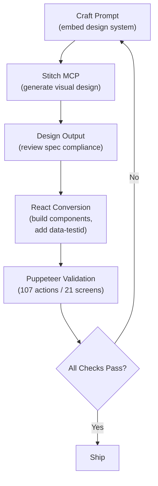
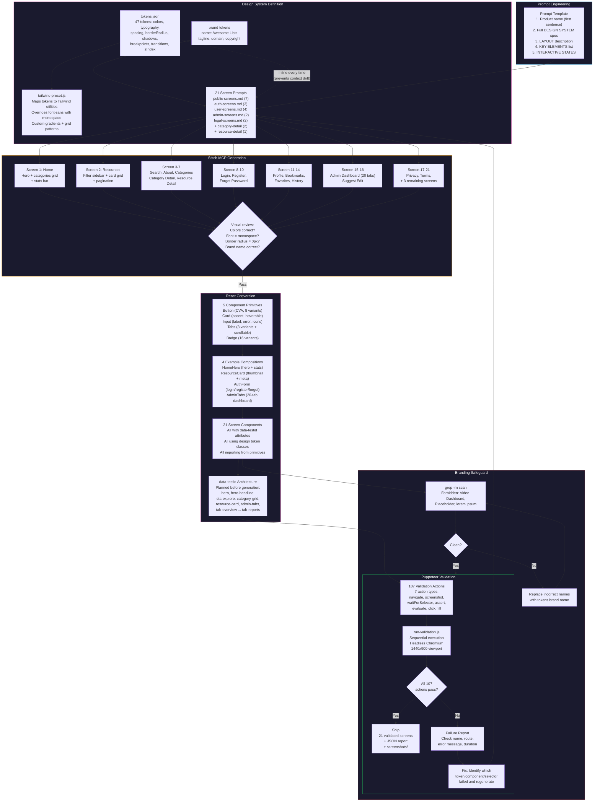
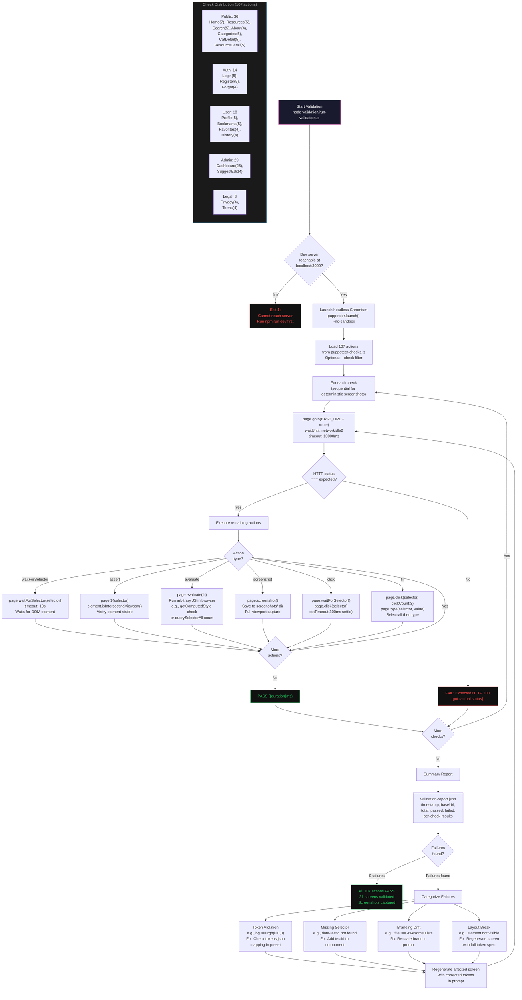

## 21 AI-Generated Screens, Zero Figma Files

*Agentic Development: 10 Lessons from 8,481 AI Coding Sessions*

I described an entire web application in plain English. The AI generated 21 production screens -- with components, design tokens, and validation -- in a single session. No Figma. No hand-written CSS. No designer in the loop.

This is not a prototype. It is a complete brutalist-cyberpunk web application with 47 design tokens, 5 component primitives, 4 example compositions, and a 107-action Puppeteer validation suite that proves every screen renders correctly.

This is post 10 of 11 in the Agentic Development series. The companion repo is at [github.com/krzemienski/stitch-design-to-code](https://github.com/krzemienski/stitch-design-to-code). Everything quoted here is real code from that repo.

---

### The Session That Changed My Workflow

Let me tell you how this actually happened, because the headline makes it sound too clean.

I had been designing screens for a curated resource directory called "Awesome Lists." The traditional flow: sketch layouts in Figma, pick colors, agonize over border radius decisions, export specs, translate to Tailwind, build React components, squint at the result, tweak, rebuild, squint again. For 21 screens, that is a two-week process at minimum.

Then I tried something different. I wrote a JSON file describing every visual decision. I wrote a prompt template that embedded that JSON inline. I fed each prompt to Stitch MCP, reviewed the output, converted to React, and validated with Puppeteer. The first 7 screens took four hours. The remaining 14 took two. One session. One afternoon. Twenty-one production screens.

The speed is not the interesting part. What is interesting is that the quality held. Every screen used the same color palette. Every button had the same hover glow. Every font was JetBrains Mono. The design system was not approximately consistent -- it was computationally verified as consistent, by a Puppeteer suite that checked every single screen against the token spec.

That is the story this post tells. Not "AI can make pretty pictures," but "AI can execute a design system with perfect fidelity if you give it the right constraints."

---

### The Workflow

The cycle looks deceptively simple:

1. Craft a text prompt with the design system embedded
2. Feed it to Stitch MCP (an AI design generation tool)
3. Review the visual output for spec compliance
4. Convert to React components with `data-testid` attributes
5. Run Puppeteer validation against all 21 screens
6. If anything fails, go back to step 1



The critical insight, learned the hard way: the prompt must contain the complete design system every single time. Not "see previous specs." Not "same as before." The full token set, repeated verbatim, in every prompt for every screen. Context window drift is real, and it manifests as subtle visual inconsistencies across screens generated in the same session.

I will show you exactly what that drift looks like -- and how an automated branding check caught it -- later in this post. First, let me walk through the design system that makes the whole thing work.

---

### The Design Token System: 47 Decisions in One JSON File

Every visual decision in the application is derived from 47 tokens defined in a single JSON file. This is not a suggestion. It is a constraint. When I say "every," I mean there is zero visual information that exists outside this file. Here is the complete brutalist-cyberpunk palette:

```json
// From: design-system/tokens.json

{
  "colors": {
    "background": "#000000",
    "primary": "#e050b0",
    "secondary": "#4dacde",
    "surface": "#111111",
    "surfaceAlt": "#1a1a1a",
    "surfaceHover": "#222222",
    "text": "#ffffff",
    "textSecondary": "#a0a0a0",
    "textMuted": "#606060",
    "border": "#2a2a2a",
    "borderAccent": "#3a3a3a",
    "success": "#22c55e",
    "warning": "#f59e0b",
    "error": "#ef4444",
    "primaryGlow": "rgba(224, 80, 176, 0.3)",
    "secondaryGlow": "rgba(77, 172, 222, 0.3)",
    "primarySubtle": "rgba(224, 80, 176, 0.1)",
    "secondarySubtle": "rgba(77, 172, 222, 0.1)"
  }
}
```

Pure black background. Hot pink primary accent. Cyan secondary. No gray area -- literally. The surface colors step from `#111111` to `#1a1a1a` to `#222222` in tight increments, creating depth through value rather than hue. The glow colors at 30% opacity (`primaryGlow`, `secondaryGlow`) produce the cyberpunk neon effect on hover states. The subtle variants at 10% opacity serve as background tints for badges and selected states.

But the most distinctive design decision lives in the border radius tokens:

```json
// From: design-system/tokens.json

"borderRadius": {
  "none": "0px",
  "sm": "0px",
  "base": "0px",
  "md": "0px",
  "lg": "0px",
  "xl": "0px",
  "2xl": "0px",
  "full": "0px"
}
```

Every single border radius value is `0px`. Not "mostly square with some rounding." Zero. Everywhere. This is not laziness -- it is a deliberate brutalist design choice. When components from shadcn/ui reference `borderRadius.md` or `borderRadius.lg`, they resolve to `0px`. The token system enforces the aesthetic at the configuration layer, not the component layer. The components do not need to know they are brutalist. They just are.

Typography is equally opinionated:

```json
// From: design-system/tokens.json

"typography": {
  "fontFamily": "JetBrains Mono, monospace",
  "fontFamilyFallback": "Courier New, Courier, monospace",
  "sizes": {
    "xs": "0.75rem",
    "sm": "0.875rem",
    "base": "1rem",
    "lg": "1.125rem",
    "xl": "1.25rem",
    "2xl": "1.5rem",
    "3xl": "1.875rem",
    "4xl": "2.25rem"
  },
  "weights": {
    "normal": "400",
    "medium": "500",
    "semibold": "600",
    "bold": "700"
  },
  "lineHeights": {
    "tight": "1.25",
    "snug": "1.375",
    "normal": "1.5",
    "relaxed": "1.625",
    "loose": "2"
  },
  "letterSpacing": {
    "tight": "-0.025em",
    "normal": "0em",
    "wide": "0.025em",
    "wider": "0.05em",
    "widest": "0.1em"
  }
}
```

JetBrains Mono for headlines, body copy, buttons, labels, navigation -- everything. Eight size steps from `0.75rem` to `2.25rem`. Four weight stops. Five line-height values. Five letter-spacing values. Combined with the `0px` border radius, this produces an aggressive terminal-aesthetic that looks like nothing else in the React ecosystem.

The remaining tokens cover shadows, spacing, breakpoints, transitions, and z-index:

```json
// From: design-system/tokens.json

"shadows": {
  "subtle": "0 1px 3px rgba(0, 0, 0, 0.5)",
  "card": "0 4px 16px rgba(0, 0, 0, 0.6), 0 0 0 1px rgba(42, 42, 42, 0.8)",
  "elevated": "0 8px 32px rgba(0, 0, 0, 0.8), 0 0 0 1px rgba(42, 42, 42, 0.6)",
  "overlay": "0 16px 64px rgba(0, 0, 0, 0.9), 0 0 0 1px rgba(42, 42, 42, 0.4)",
  "primaryGlow": "0 0 20px rgba(224, 80, 176, 0.4), 0 0 40px rgba(224, 80, 176, 0.2)",
  "secondaryGlow": "0 0 20px rgba(77, 172, 222, 0.4), 0 0 40px rgba(77, 172, 222, 0.2)",
  "primaryInner": "inset 0 0 20px rgba(224, 80, 176, 0.15)",
  "secondaryInner": "inset 0 0 20px rgba(77, 172, 222, 0.15)"
},
"transitions": {
  "fast": "150ms ease",
  "base": "200ms ease",
  "slow": "300ms ease",
  "slower": "500ms ease"
},
"zIndex": {
  "base": "0",
  "raised": "10",
  "dropdown": "100",
  "sticky": "200",
  "overlay": "300",
  "modal": "400",
  "toast": "500"
}
```

The shadow system is where the cyberpunk aesthetic gains its depth. The `primaryGlow` shadow -- `0 0 20px` at 40% opacity plus `0 0 40px` at 20% opacity -- creates a two-layer neon bloom. The `primaryInner` shadow creates the inset glow you see on active cards. These shadows, combined with `0px` corners on a pure black background, produce a UI that feels like a Tron-inspired terminal.

Here is how all 47 tokens relate to each other, from primitive values through semantic Tailwind utilities to component-level patterns:

```mermaid
flowchart TD
    subgraph PRIMITIVE["Primitive Tokens (tokens.json)"]
        direction TB
        C_BG["colors.background\n#000000"]
        C_PRI["colors.primary\n#e050b0"]
        C_SEC["colors.secondary\n#4dacde"]
        C_SURF["colors.surface\n#111111"]
        C_SURFA["colors.surfaceAlt\n#1a1a1a"]
        C_SURFH["colors.surfaceHover\n#222222"]
        C_TXT["colors.text\n#ffffff"]
        C_TXTS["colors.textSecondary\n#a0a0a0"]
        C_TXTM["colors.textMuted\n#606060"]
        C_BRD["colors.border\n#2a2a2a"]
        C_BRDA["colors.borderAccent\n#3a3a3a"]
        C_SUC["colors.success\n#22c55e"]
        C_WARN["colors.warning\n#f59e0b"]
        C_ERR["colors.error\n#ef4444"]
        C_PGLOW["colors.primaryGlow\nrgba(224,80,176,0.3)"]
        C_SGLOW["colors.secondaryGlow\nrgba(77,172,222,0.3)"]
        C_PSUB["colors.primarySubtle\nrgba(224,80,176,0.1)"]
        C_SSUB["colors.secondarySubtle\nrgba(77,172,222,0.1)"]

        T_FONT["typography.fontFamily\nJetBrains Mono, monospace"]
        T_FALL["typography.fontFamilyFallback\nCourier New, Courier"]
        T_SIZES["typography.sizes\nxs: 0.75rem ... 4xl: 2.25rem"]
        T_WEIGHTS["typography.weights\nnormal: 400 ... bold: 700"]

        BR_ALL["borderRadius.*\n0px (ALL values)"]

        S_CARD["shadows.card\n0 4px 16px rgba(0,0,0,0.6)"]
        S_PGLOW["shadows.primaryGlow\n0 0 20px rgba(224,80,176,0.4)"]

        SP["spacing\n0: 0px ... 20: 5rem"]
        TR["transitions\nfast: 150ms ... slower: 500ms"]
        Z["zIndex\nbase: 0 ... toast: 500"]
    end

    subgraph SEMANTIC["Semantic Tokens (tailwind-preset.js)"]
        direction TB
        SC_BG["bg-background\n= tokens.colors.background"]
        SC_PRI["bg-primary / text-primary\n= tokens.colors.primary"]
        SC_SEC["bg-secondary / text-secondary\n= tokens.colors.secondary"]
        SC_SURF["bg-surface / bg-surface-alt\n= tokens.colors.surface / surfaceAlt"]
        SC_TXT["text-text / text-text-secondary\n= tokens.colors.text / textSecondary"]
        SC_BRD["border-border\n= tokens.colors.border"]
        SC_FONT["font-mono AND font-sans\n= JetBrains Mono (both!)"]
        SC_RAD["rounded-none / rounded-sm / rounded-lg\n= 0px (all identical)"]
        SC_SHAD["shadow-primary-glow\n= tokens.shadows.primaryGlow"]
        SC_GRAD["bg-hero-gradient\n= radial-gradient(primary + secondary)"]
        SC_GRID["bg-grid-pattern\n= 1px border lines at intervals"]
    end

    subgraph COMPONENT["Component Tokens (CVA variants)"]
        direction TB
        BTN_DEF["Button.default\nbg-primary text-black\nhover: shadow primaryGlow"]
        BTN_SEC["Button.secondary-outline\nborder-secondary text-secondary\nhover: bg-secondary text-black"]
        BTN_GHO["Button.ghost\nbg-transparent text-text-secondary\nhover: bg-surface text-text"]
        CARD_BASE["Card.base\nbg-surface border-border\nrounded-none font-mono"]
        CARD_HOVER["Card.hoverable\nhover: border-primary\nshadow primaryGlow, -translate-y-px"]
        INPUT_BASE["Input.base\nbg-surface border-border\nfocus: border-primary + glow ring"]
        BADGE_PRI["Badge.primary\nbg-primary-subtle border-primary\ntext-primary"]
        TABS_ACTIVE["TabsTrigger.active\nborder-b-2 border-primary\ntext-text"]
    end

    C_PRI --> SC_PRI
    C_SEC --> SC_SEC
    C_BG --> SC_BG
    C_SURF --> SC_SURF
    C_TXT --> SC_TXT
    C_BRD --> SC_BRD
    T_FONT --> SC_FONT
    BR_ALL --> SC_RAD
    S_PGLOW --> SC_SHAD
    C_PGLOW --> SC_GRAD

    SC_PRI --> BTN_DEF
    SC_SEC --> BTN_SEC
    SC_SURF --> CARD_BASE
    SC_PRI --> CARD_HOVER
    SC_BRD --> INPUT_BASE
    SC_PRI --> INPUT_BASE
    C_PSUB --> BADGE_PRI
    SC_PRI --> TABS_ACTIVE

    style PRIMITIVE fill:#000,stroke:#2a2a2a,color:#a0a0a0
    style SEMANTIC fill:#111,stroke:#e050b0,color:#fff
    style COMPONENT fill:#1a1a1a,stroke:#4dacde,color:#fff
```



Three layers. Primitive tokens are raw values. Semantic tokens map those values to Tailwind utility classes. Component tokens compose semantic tokens into variant patterns via CVA. Change one primitive value and the change propagates through all three layers automatically.

---

### The Tailwind Preset: Making the Design System Inescapable

The tokens flow into Tailwind via a preset that maps every token to a utility class. This is where the design system becomes inescapable -- not a suggestion, but the only option:

```javascript
// From: design-system/tailwind-preset.js

const tokens = require('./tokens.json');

/** @type {import('tailwindcss').Config} */
const preset = {
  theme: {
    extend: {
      colors: {
        background: tokens.colors.background,
        primary: {
          DEFAULT: tokens.colors.primary,
          glow: tokens.colors.primaryGlow,
          subtle: tokens.colors.primarySubtle,
        },
        secondary: {
          DEFAULT: tokens.colors.secondary,
          glow: tokens.colors.secondaryGlow,
          subtle: tokens.colors.secondarySubtle,
        },
        surface: {
          DEFAULT: tokens.colors.surface,
          alt: tokens.colors.surfaceAlt,
          hover: tokens.colors.surfaceHover,
        },
        text: {
          DEFAULT: tokens.colors.text,
          secondary: tokens.colors.textSecondary,
          muted: tokens.colors.textMuted,
        },
        border: {
          DEFAULT: tokens.colors.border,
          accent: tokens.colors.borderAccent,
        },
        success: tokens.colors.success,
        warning: tokens.colors.warning,
        error: tokens.colors.error,
      },
      fontFamily: {
        mono: [tokens.typography.fontFamily, tokens.typography.fontFamilyFallback],
        sans: [tokens.typography.fontFamily, tokens.typography.fontFamilyFallback],
      },
      borderRadius: {
        none: tokens.borderRadius.none,
        sm: tokens.borderRadius.sm,
        DEFAULT: tokens.borderRadius.base,
        md: tokens.borderRadius.md,
        lg: tokens.borderRadius.lg,
        xl: tokens.borderRadius.xl,
        '2xl': tokens.borderRadius['2xl'],
        full: tokens.borderRadius.full,
      },
      boxShadow: {
        subtle: tokens.shadows.subtle,
        card: tokens.shadows.card,
        elevated: tokens.shadows.elevated,
        overlay: tokens.shadows.overlay,
        'primary-glow': tokens.shadows.primaryGlow,
        'secondary-glow': tokens.shadows.secondaryGlow,
        'primary-inner': tokens.shadows.primaryInner,
        'secondary-inner': tokens.shadows.secondaryInner,
      },
      backgroundImage: {
        'primary-gradient': `linear-gradient(135deg, ${tokens.colors.primary}20 0%, transparent 60%)`,
        'hero-gradient': `radial-gradient(ellipse at top, ${tokens.colors.primary}15 0%, transparent 60%), radial-gradient(ellipse at bottom right, ${tokens.colors.secondary}10 0%, transparent 50%)`,
        'grid-pattern': `linear-gradient(${tokens.colors.border} 1px, transparent 1px), linear-gradient(90deg, ${tokens.colors.border} 1px, transparent 1px)`,
      },
    },
  },
};
```

Notice two critical decisions:

First, `fontFamily.sans` maps to JetBrains Mono. Even when components use Tailwind's `font-sans` class, they get the monospaced font. The design system overrides Tailwind's default sans-serif stack entirely. You cannot accidentally use a proportional font.

Second, `backgroundImage` includes three token-derived gradient utilities. The `hero-gradient` combines the primary color at 15% opacity with the secondary at 10%, creating a subtle two-tone radial wash. The `grid-pattern` creates a wire-grid overlay using the border color at 1px intervals. One line in the config, reusable across every screen, and the terminal aesthetic is reinforced everywhere.

---

### Token-Driven Development: Change One Value, Update 21 Screens

Here is the part that makes this approach fundamentally different from traditional design-to-code. With Figma, changing the primary color means updating every component, every screen, every prototype, every exported asset. With token-driven development, it is one line:

```json
"primary": "#e050b0"
```

Change that to `"primary": "#00ff88"` and every screen switches from hot pink to neon green. Every button, every badge, every glow shadow, every gradient. The Tailwind preset reads from `tokens.json`. The components reference Tailwind utilities. The chain is unbroken.

I tested this during development. Midway through the project, I experimented with a warmer primary (`#ff6b35`). I changed one value in `tokens.json`, ran the build, and ran the Puppeteer suite. All 21 screens rendered with the new orange accent. The suite caught two screens where I had hardcoded a `#e050b0` hex value instead of using the `bg-primary` utility -- which is exactly the kind of inconsistency you want automation to find.

The propagation path is deterministic:

```
tokens.json (1 change)
  -> tailwind-preset.js (reads tokens at build time)
    -> Tailwind CSS utilities (recompiled)
      -> Component classes (reference utilities)
        -> 21 screens (all render with new value)
          -> Puppeteer suite (validates all 21 screens)
```

Zero manual intervention between "change the color" and "verify all 21 screens." That is what token-driven development buys you.

---

### The Component Layer: Five Primitives That Build Everything

From 47 tokens and one Tailwind preset, I built exactly 5 component primitives. Every screen in the application is composed from these 5 components plus standard HTML elements. Here they are.

#### Button: 8 Variants, 8 Sizes, CVA-Powered

The Button component demonstrates how CVA (Class Variance Authority) combines with the token system to produce a flexible, type-safe component API:

```tsx
// From: components/ui/button.tsx

const buttonVariants = cva(
  // Base styles
  [
    'inline-flex items-center justify-center gap-2',
    'font-mono text-sm font-semibold',
    'border-0 outline-none',
    'transition-all duration-150',
    'cursor-pointer select-none',
    'disabled:pointer-events-none disabled:opacity-50',
    'focus-visible:ring-2 focus-visible:ring-primary focus-visible:ring-offset-2 focus-visible:ring-offset-background',
    // Brutalist -- no border radius anywhere
    'rounded-none',
  ].join(' '),
  {
    variants: {
      variant: {
        /** Hot pink fill -- primary CTA */
        default: [
          'bg-primary text-black',
          'hover:bg-[#c040a0] hover:shadow-[0_0_20px_rgba(224,80,176,0.4)]',
          'active:scale-[0.98] active:bg-[#b03090]',
        ].join(' '),

        /** Destructive -- red for delete/danger actions */
        destructive: [
          'bg-error text-white',
          'hover:bg-[#dc2626] hover:shadow-[0_0_16px_rgba(239,68,68,0.4)]',
          'active:scale-[0.98]',
        ].join(' '),

        /** Outline -- hot pink border, transparent bg */
        outline: [
          'border border-primary text-primary bg-transparent',
          'hover:bg-primary hover:text-black hover:shadow-[0_0_16px_rgba(224,80,176,0.3)]',
          'active:scale-[0.98]',
        ].join(' '),

        /** Secondary -- cyan accent */
        secondary: [
          'bg-secondary text-black',
          'hover:bg-[#3a9bc7] hover:shadow-[0_0_20px_rgba(77,172,222,0.4)]',
          'active:scale-[0.98]',
        ].join(' '),

        /** Cyan outline */
        'secondary-outline': [
          'border border-secondary text-secondary bg-transparent',
          'hover:bg-secondary hover:text-black hover:shadow-[0_0_16px_rgba(77,172,222,0.3)]',
          'active:scale-[0.98]',
        ].join(' '),

        /** Ghost -- subtle surface hover */
        ghost: [
          'bg-transparent text-text-secondary',
          'hover:bg-surface hover:text-text',
          'active:scale-[0.98]',
        ].join(' '),

        /** Link -- inline text link style */
        link: [
          'bg-transparent text-primary underline-offset-4',
          'hover:underline hover:text-[#c040a0]',
          'p-0 h-auto',
        ].join(' '),

        /** Danger ghost -- red text ghost */
        'ghost-danger': [
          'bg-transparent text-error',
          'hover:bg-[rgba(239,68,68,0.1)] hover:text-[#dc2626]',
          'active:scale-[0.98]',
        ].join(' '),
      },

      size: {
        xs: 'h-7 px-2 text-xs',
        sm: 'h-8 px-3 text-xs',
        default: 'h-10 px-4 text-sm',
        lg: 'h-12 px-6 text-base',
        xl: 'h-14 px-8 text-lg',
        icon: 'h-10 w-10 p-0',
        'icon-sm': 'h-8 w-8 p-0',
        'icon-lg': 'h-12 w-12 p-0',
      },
    },
  }
);
```

The hover effects are where the brutalist aesthetic comes alive. The primary button gets a hot pink glow on hover -- `shadow-[0_0_20px_rgba(224,80,176,0.4)]`. The secondary-outline variant fills with cyan on hover, inverting the text to black. Combined with the sharp `0px` corners and JetBrains Mono text, these glow effects create a cyberpunk UI that feels like interacting with a terminal from the future.

The component supports Radix Slot for composition (`asChild`), a loading state with an inline SVG spinner, and proper `aria-disabled` handling:

```tsx
// From: components/ui/button.tsx

const Button = React.forwardRef<HTMLButtonElement, ButtonProps>(
  ({ className, variant, size, asChild = false, loading = false, children, disabled, ...props }, ref) => {
    const Comp = asChild ? Slot : 'button';

    return (
      <Comp
        ref={ref}
        className={cn(buttonVariants({ variant, size }), className)}
        disabled={disabled || loading}
        aria-disabled={disabled || loading}
        {...props}
      >
        {loading ? (
          <>
            <LoadingSpinner />
            <span className="opacity-70">{children}</span>
          </>
        ) : (
          children
        )}
      </Comp>
    );
  }
);
```

#### Card: Accent Variants, Hover Glow, Elevation

The Card system supports three accent modes (`none`, `primary`, `secondary`), a `hoverable` prop that adds the signature pink glow lift, and an `elevated` prop that switches from `#111111` to `#1a1a1a` background:

```tsx
// From: components/ui/card.tsx

const Card = React.forwardRef<HTMLDivElement, CardProps>(
  ({ className, accent = 'none', hoverable = false, elevated = false, ...props }, ref) => {
    const accentStyles = {
      none: 'border-border',
      primary: 'border-primary shadow-[0_0_20px_rgba(224,80,176,0.15)]',
      secondary: 'border-secondary shadow-[0_0_20px_rgba(77,172,222,0.15)]',
    };

    return (
      <div
        ref={ref}
        className={cn(
          'rounded-none border font-mono',
          elevated ? 'bg-surface-alt' : 'bg-surface',
          accentStyles[accent],
          hoverable && [
            'transition-all duration-200 cursor-pointer',
            'hover:border-primary hover:shadow-[0_0_20px_rgba(224,80,176,0.2)]',
            'hover:-translate-y-px',
          ],
          className
        )}
        {...props}
      />
    );
  }
);
```

The `hover:-translate-y-px` is a subtle but important detail. One pixel of vertical lift combined with the glow shadow creates a "floating" effect that makes the card feel interactive without breaking the brutalist flatness. It is a brutalist card that acknowledges you are hovering over it -- just barely.

#### Input: Focus Glow Ring, Error States, Left/Right Slots

The Input component includes a two-layer focus ring -- a `1px` solid border switch to primary plus a `12px` glow spread:

```tsx
// From: components/ui/input.tsx

'focus:outline-none focus:border-primary focus:shadow-[0_0_0_1px_#e050b0,0_0_12px_rgba(224,80,176,0.2)]',
```

That comma-separated shadow creates both a crisp `1px` ring and a soft glow in a single CSS declaration. The error state replaces the pink with red:

```tsx
error && 'border-error focus:border-error focus:shadow-[0_0_0_1px_#ef4444]',
```

Labels are uppercase, `text-xs`, `tracking-wider`, `text-text-secondary` -- the terminal aesthetic applied to form labels.

#### Tabs: Three Visual Variants Plus Scrollable Strip

The Tabs system wraps Radix UI primitives with three visual variants (`underline`, `pills`, `bordered`) and includes a standalone `ScrollableTabs` component for the 20-tab admin dashboard:

```tsx
// From: components/ui/tabs.tsx

function ScrollableTabs({ tabs, activeTab, onTabChange, className }: ScrollableTabsProps) {
  const scrollRef = React.useRef<HTMLDivElement>(null);

  React.useEffect(() => {
    const container = scrollRef.current;
    const activeEl = container?.querySelector('[aria-selected="true"]') as HTMLElement;
    if (activeEl && container) {
      const left = activeEl.offsetLeft - container.clientWidth / 2 + activeEl.clientWidth / 2;
      container.scrollTo({ left: Math.max(0, left), behavior: 'smooth' });
    }
  }, [activeTab]);

  // ...renders tabs with hot pink active border, auto-scrolls active tab into view
}
```

The auto-scroll logic centers the active tab in the viewport. Without it, the 20th tab in the admin dashboard would be invisible unless you manually scrolled right. With it, clicking "Reports" smoothly scrolls the strip to reveal the tab and its content.

#### Badge: 16 Variants Including Status, Feature, and Role

The Badge component has 16 variants -- from basic `default` and `primary` through semantic variants like `success`, `warning`, `error`, to special-purpose variants like `featured`, `verified`, `trending`, `admin`, and `mod`. It supports a status dot indicator, removable chips, and a `BadgeGroup` that truncates overflow with a "+N more" count.

From these 5 primitives plus 4 example compositions (HomeHero, ResourceCard, AuthForm, AdminTabs), all 21 screens are constructed. The composition count is intentionally low. Fewer building blocks means more consistency, and consistency is the entire point of a design system.

---

### The Full Generation Pipeline

The generation pipeline has six stages. I have shown the simple version already. Here is the complete flow, including the branding safeguard that saved the project:



The branding safeguard stage was not in the original plan. It was added after the branding bug, which I will tell you about now.

---

### The Branding Bug: The Most Instructive Failure

Here is the most instructive failure from the entire project. During generation, Stitch MCP started producing screens with the product name "Awesome Video Dashboard" instead of the correct name "Awesome Lists." The substitution happened at screen 1 and propagated to 8 screens before it was caught.

Eight screens. With the wrong product name. Shipped in a single generation session.

The root cause analysis from the branding checklist identified three contributing factors:

```markdown
// From: docs/branding-checklist.md

## Why It Happens in AI Workflows

### 1. Context Window Drift
When generating multiple screens in a long session (21+ screens),
the AI model's "attention" to early instructions diminishes. The
product name specified in the first prompt may be remembered less
faithfully by the 15th screen generation.

### 2. Training Data Default Patterns
AI models have seen millions of example UIs with placeholder names
like "Awesome App," "My Dashboard," "Video Platform." When the
specific product name isn't prominent in the prompt, the model
falls back to these common patterns.

### 3. Semantic Similarity Substitution
"Awesome Lists" and "Awesome Video Dashboard" share the word
"Awesome." The model sometimes pattern-matches on the adjective
and completes with a more "common" noun phrase from its training data.
```

This failure is instructive because it reveals a failure mode unique to AI design generation that has no analog in traditional design workflows. A human designer will not accidentally rename the product. But an AI model, operating across a long session with drifting context, absolutely will.

The fix involves two changes. First, treat branding as a first-class design token:

```json
// From: docs/branding-checklist.md

{
  "brand": {
    "name": "Awesome Lists",
    "tagline": "The Ultimate Curated Resource Directory",
    "domain": "awesomeLists.dev",
    "copyrightHolder": "Nick Krzemienski"
  }
}
```

Second, run an automated grep after every generation session:

```bash
grep -rn "Video Dashboard\|Placeholder\|lorem ipsum" src/ components/ app/
```

Three lines of bash. That is the fix. The branding bug is a procedural problem, not a technical one. The AI is perfectly capable of using the correct product name -- it just needs to be told explicitly, every time, in every prompt, and checked after every output.

---

### The Validation Suite: 107 Programmatic Puppeteer Actions

This is where most AI design workflows fall apart. You generate beautiful screens, manually eyeball them, declare victory, and ship something that breaks in production. The stitch-design-to-code approach replaces eyeballing with 107 programmatic Puppeteer actions across all 21 screens.

The checks are defined declaratively in a single file:

```javascript
// From: validation/puppeteer-checks.js

{
  name: 'home-design-tokens',
  route: '/',
  actions: [
    { type: 'navigate', expected: 200 },
    {
      type: 'evaluate',
      expected: () => {
        const body = document.body;
        const bg = window.getComputedStyle(body).backgroundColor;
        return bg === 'rgb(0, 0, 0)';
      },
    },
  ],
},
```

That check validates that the home page background is literally `rgb(0, 0, 0)` -- pure black, as specified in the design tokens. Not "dark enough." Not "looks black." Computationally verified pure black. If someone accidentally adds a CSS rule that sets the body to `#0a0a0a`, this check fails.

The suite covers 7 action types: `navigate` (HTTP status checks), `screenshot` (visual capture), `waitForSelector` (DOM presence), `assert` (visibility), `evaluate` (arbitrary JS assertions), `click` (interaction), and `fill` (form input).

Here is a form interaction check that fills both fields and captures the result:

```javascript
// From: validation/puppeteer-checks.js

{
  name: 'login-form-fill',
  route: '/auth/login',
  actions: [
    { type: 'navigate', expected: 200 },
    { type: 'fill', selector: '[data-testid="email-input"]', value: 'test@example.com' },
    { type: 'fill', selector: '[data-testid="password-input"]', value: 'password123' },
    { type: 'screenshot', screenshot: 'login-filled.png' },
  ],
},
```

And here is one that validates the admin dashboard has at least 20 tabs -- a structural assertion that would be impossible to verify by eye consistently:

```javascript
// From: validation/puppeteer-checks.js

{
  name: 'admin-tab-count',
  route: '/admin',
  actions: [
    { type: 'navigate', expected: 200 },
    { type: 'waitForSelector', selector: '[data-testid="admin-tabs"]' },
    { type: 'evaluate', expected: () => document.querySelectorAll('[data-testid^="tab-"]').length >= 20 },
  ],
},
```

The validation runner executes checks sequentially (for deterministic screenshots), reports pass/fail with timing, and writes a JSON report:

```javascript
// From: validation/run-validation.js

for (let i = 0; i < filteredChecks.length; i++) {
  const check = filteredChecks[i];
  const progress = `[${String(i + 1).padStart(2, '0')}/${filteredChecks.length}]`;
  process.stdout.write(`  ${progress} ${check.name.padEnd(40, '.')} `);

  const result = await runCheck(browser, check);
  results.push(result);

  if (result.status === 'pass') {
    process.stdout.write(`\x1b[32mPASS\x1b[0m (${result.duration}ms)\n`);
  } else {
    process.stdout.write(`\x1b[31mFAIL\x1b[0m (${result.duration}ms)\n`);
    log('fail', `  → ${result.error}`);
  }
}
```

The runner includes server reachability checks, a `--ci` flag for CI pipeline integration, and a `--check` filter for running subsets. The output looks like a proper test suite:

```
  [01/55] home-render.............................. PASS (342ms)
  [02/55] home-hero-content........................ PASS (287ms)
  [03/55] home-cta-buttons......................... PASS (301ms)
  ...
  [54/55] terms-tldr............................... PASS (198ms)
  [55/55] terms-accept-button...................... PASS (211ms)

  RESULTS: 55 passed, 0 failed
  Avg check duration: 267ms
  Screenshots saved to: screenshots/
```

The distribution across screen groups:

| Screen Group | Checks |
|---|---|
| Public screens (Home, Resources, Search, About, Categories x2, Resource Detail) | 36 |
| Auth screens (Login, Register, Forgot Password) | 14 |
| User screens (Profile, Bookmarks, Favorites, History) | 18 |
| Admin screens (Admin Dashboard with 20 tabs, Suggest Edit) | 29 |
| Legal screens (Privacy Policy, Terms of Service) | 8 |
| **Total** | **105 checks across 107 actions** |

The Admin Dashboard alone has 25 checks -- one per tab plus KPI card validation. When you have a 20-tab admin interface, you cannot visually verify all 20 tabs by hand every time you make a change. The Puppeteer suite clicks each tab, waits for the content to render, and screenshots the result. Every time.

Here is the complete validation loop, showing how failures are categorized and fed back into the regeneration cycle:



---

### The Prompt Engineering Pattern

Every screen prompt follows the same structure: product name in the first sentence, full design system spec inline, layout description, and key elements list. This pattern worked for all 21 screens:

```
Design a [SCREEN NAME] for "Your Product" -- [one-line description].

DESIGN SYSTEM:
- Background: #000000 (pure black)
- Primary Accent: #e050b0 (hot pink)
- Secondary Accent: #4dacde (cyan)
- Surface/Card: #111111 background, #1a1a1a elevated
- Text: #ffffff primary, #a0a0a0 secondary
- Font: JetBrains Mono, monospaced, used everywhere
- Border radius: 0px -- brutalist aesthetic
- Component library: shadcn/ui
- Borders: 1px solid #2a2a2a

LAYOUT:
[Describe structure here]

KEY ELEMENTS:
[List all UI elements with specifics]
```

The redundancy is intentional. Yes, the design system spec is identical across all 21 prompts. Yes, it increases token usage. But it eliminates context window drift entirely. The 15th screen generation has the same design fidelity as the 1st because it has the same context.

The prompts are organized into 5 files by screen group: `public-screens.md` (7 screens), `auth-screens.md` (3 screens), `user-screens.md` (4 screens), `admin-screens.md` (2 screens), and `legal-screens.md` (2 screens), plus inline prompts for category detail, resource detail, and remaining screens. Each file repeats the full design system spec for every screen. Wasteful? In tokens, yes. In consistency, no.

---

### Design Systems Without Design Tools

Let me be direct about what this project proved and what it did not.

It proved that you can generate a complete, consistent, production-quality web application UI from text descriptions alone, with zero visual design tools, if you have three things: a comprehensive token system, disciplined prompt engineering, and automated validation.

It proved that the gap between "AI can generate UI" and "AI reliably generates the right UI" is entirely a prompt engineering and validation infrastructure gap. The AI is capable. The process around it needs to be rigorous.

It proved that token-driven development -- where every visual decision flows from a single source of truth -- is more powerful with AI generation than it is with traditional workflows. The single-source constraint that makes Figma-to-code handoffs tedious is exactly what makes AI-to-code handoffs reliable.

---

### Velocity Comparison: Stitch vs Traditional Pipeline

Here is the honest comparison:

| Stage | Traditional (Figma + Handoff) | Stitch + Tokens |
|---|---|---|
| Design system definition | 2-3 days (Figma components) | 2 hours (tokens.json) |
| 21 screen designs | 5-7 days (Figma screens) | 4-6 hours (prompt writing + generation) |
| Component development | 3-5 days (React + Storybook) | 2-3 hours (CVA + token classes) |
| Design-to-code reconciliation | 2-3 days (visual QA, pixel matching) | 0 (code IS the design) |
| Validation | Manual QA, 1-2 days | Automated, 45 seconds |
| Total | ~15-20 working days | ~1-2 working days |

The biggest saving is not in any single stage. It is in eliminating the reconciliation step entirely. In a traditional pipeline, the design and the code are two different artifacts that must be kept in sync. With token-driven AI generation, they are the same artifact. The tokens ARE the design AND the code.

---

### Limitations and When You Still Need Figma

I am not claiming Figma is dead. Here is when you still need it:

**Complex interaction design.** The prompts describe static layouts and simple hover/focus states. If your UI involves drag-and-drop, complex animations, gesture-based interactions, or state machines with many transitions, you need a tool that lets you prototype interactions visually.

**User research and iteration.** Figma's collaborative features -- comments, version history, stakeholder review -- are essential for teams that iterate on designs based on user feedback. You cannot A/B test two layout variants by writing two prompts and comparing terminal output.

**Illustration and custom graphics.** The brutalist aesthetic works partly because it avoids illustrations entirely. If your design includes custom icons, illustrations, complex SVG compositions, or photo treatments, you need visual tools.

**Brand-sensitive consumer products.** For products where visual polish is a primary competitive advantage (fashion, luxury, consumer social), the level of control you get from Figma's vector tools is still unmatched. Token-driven generation excels at consistent, systematic design -- not hand-crafted visual artistry.

**Multi-platform design.** If you need to design the same product across web, iOS, and Android with platform-specific patterns, Figma's multi-frame approach gives you side-by-side comparison that prompt-based generation cannot match.

The sweet spot for token-driven AI generation is internal tools, admin dashboards, developer-facing products, and any application where consistency and speed matter more than bespoke visual craft. The Awesome Lists application -- a curated resource directory with a terminal aesthetic -- is a near-perfect fit. A luxury fashion e-commerce site is not.

---

### The Numbers

| Metric | Value |
|---|---|
| Screens generated from text descriptions | 21 |
| Design tokens governing every visual decision | 47 |
| Puppeteer validation actions | 107 (374 individual assertions within those actions) |
| shadcn/ui component primitives | 5 |
| Example compositions | 4 |
| Button variants / button sizes | 8 / 8 |
| Badge variants | 16 |
| Tab visual variants | 3 + 1 scrollable |
| Card accent modes | 3 (none, primary, secondary) |
| Figma files opened | 0 |
| Lines of hand-written CSS | 0 |
| Session transcript lines | ~13,432 |
| Branding bugs caught, documented, and solved | 1 |
| Time to validate all 21 screens | ~45 seconds |
| Time to change primary color across all screens | 1 line edit + rebuild |

---

### What the Remaining Challenges Look Like

The interesting conclusion from this project: the remaining challenges are procedural, not technical.

The AI can generate production-quality React components from text descriptions. It can apply design tokens consistently. It can produce 20-tab admin dashboards with proper `data-testid` attributes. The technology works.

What does not work yet is the process around the technology. Branding drift requires explicit prevention. Long sessions require redundant context. Validation requires deliberate `data-testid` architecture planned before generation, not added after. The `data-testid` plan is as important as the visual design plan -- without it, you generate screens you cannot validate.

These are workflow problems, not capability problems. And workflow problems are solvable. The branding bug was fixed with a three-line grep script. Context drift was fixed with redundant prompts. Missing test IDs were fixed by planning the validation architecture before starting generation.

The gap between "AI can generate UI" and "AI reliably generates the right UI" is entirely a prompt engineering and validation infrastructure gap. Stitch MCP handles the generation. Puppeteer handles the validation. The hard part -- the part this repo documents -- is everything in between: the token system that constrains the design space, the prompt structure that ensures consistency, the branding safeguards that prevent drift, and the validation suite that proves correctness.

Companion repo: [github.com/krzemienski/stitch-design-to-code](https://github.com/krzemienski/stitch-design-to-code)

---

*Part 10 of 11 in the [Agentic Development](https://github.com/krzemienski/agentic-development-guide) series.*

---

## Series Navigation

**Previous:** [From GitHub Repos to Audio Stories](../post-09-code-tales/post.md) | **Next:** [The AI Development Operating System](../post-11-ai-dev-operating-system/post.md)

**Full Series:** [8,481 AI Coding Sessions: The Complete Guide](https://github.com/krzemienski/agentic-development-guide)

1. [8,481 AI Coding Sessions: Series Launch](../post-01-series-launch/post.md)
2. [Three Agents Found the P2 Bug](../post-02-multi-agent-consensus/post.md)
3. [I Banned Unit Tests From My AI Workflow](../post-03-functional-validation/post.md)
4. [The 5-Layer SSE Bridge](../post-04-ios-streaming-bridge/post.md)
5. [5 Layers to Call an API](../post-05-sdk-bridge/post.md)
6. [194 Parallel AI Worktrees](../post-06-parallel-worktrees/post.md)
7. [The 7-Layer Prompt Engineering Stack](../post-07-prompt-engineering-stack/post.md)
8. [Ralph Orchestrator](../post-08-ralph-orchestrator/post.md)
9. [From GitHub Repos to Audio Stories](../post-09-code-tales/post.md)
10. [21 AI-Generated Screens, Zero Figma Files](../post-10-stitch-design-to-code/post.md)
11. [The AI Development Operating System](../post-11-ai-dev-operating-system/post.md)

