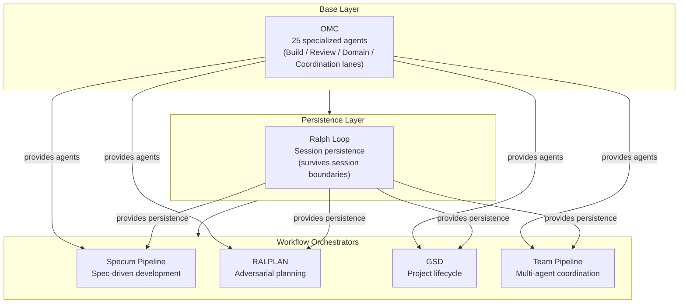
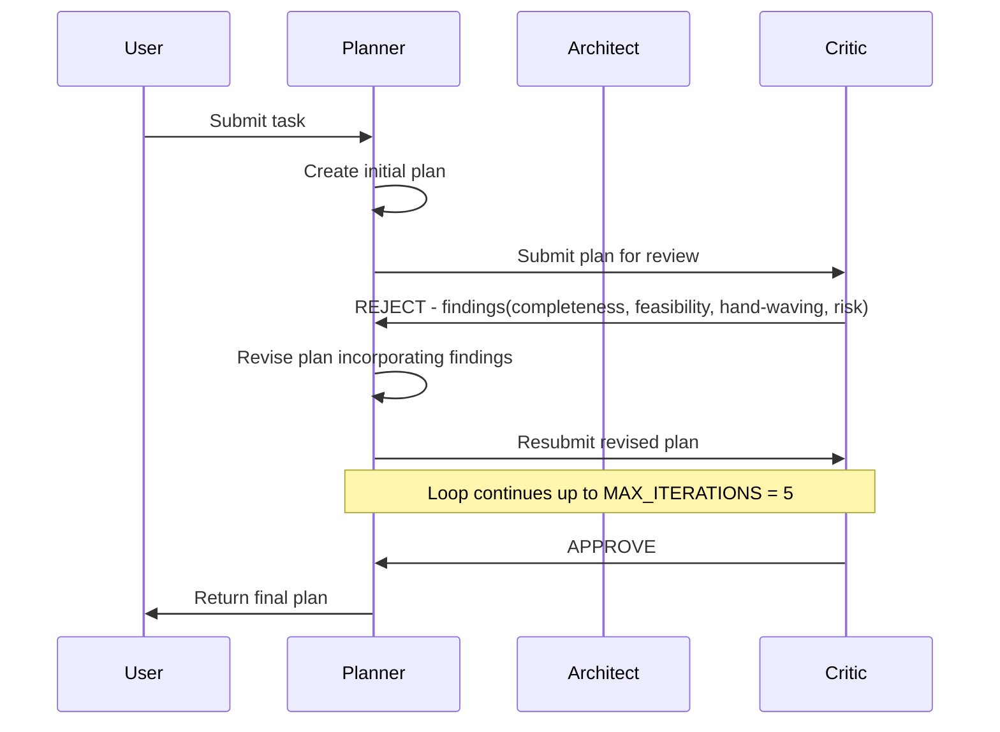
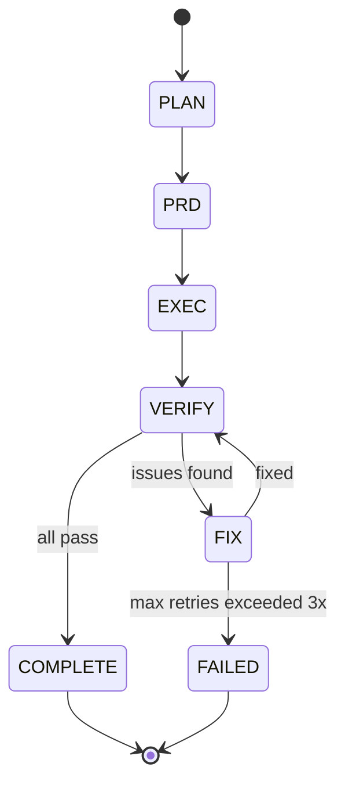

## The AI Development Operating System

*Agentic Development: 10 Lessons from 8,481 AI Coding Sessions*

I did not set out to build an operating system.

Over the past 90 days, across 8,481 Claude Code sessions, I kept hitting the same failures. An agent would lose context mid-task. A plan would survive first contact with the codebase for about six minutes before collapsing. Code review happened after the PR was already merged. Verification was a human squinting at a terminal and saying "looks good."

Each time I hit a failure mode, I built a small system to prevent it from happening again. An agent catalog here. A persistence layer there. An adversarial planning protocol after the third time a confident plan led to a dead end.

The failure modes were specific and recurring:

- **The Amnesia Problem.** Session 1 spends 40 minutes understanding the codebase and implementing half a feature. Session 2 starts from zero, re-reads the same files, makes the same discoveries, and implements the same half -- slightly differently, introducing subtle inconsistencies. Cost: 80 minutes for 50% completion.

- **The Confidence Problem.** The model produces a plan that reads beautifully. "Phase 1: Set up infrastructure. Phase 2: Implement core logic. Phase 3: Integration." Then Phase 2 turns out to require six separate Stripe API integrations that nobody mentioned. The plan survives for exactly one phase before collapsing.

- **The Completion Theater Problem.** "The feature is done." Is it? The build passes. But does the UI actually render? Does the API return the right data? Has anyone looked at it? "I think it works." That is not evidence. That is hope.

- **The Staffing Problem.** An Opus-class model spending 45 seconds grepping through a directory. A Haiku-class task billed at Opus prices. Over 100 sessions, the waste is staggering.

- **The Coordination Problem.** Two agents editing the same file. A verifier running before the implementation is complete. A security review that starts while a build error is still unresolved. Agents working independently is not the same as agents working together.

Ninety days later, I looked at what I had and realized: this is not a collection of scripts. It is an operating system for AI development. Six composable subsystems, each solving a specific class of failure, each usable independently but dramatically more powerful together.

This is the capstone post in the series. Everything I have learned -- every lesson, every failure, every recovery -- distilled into architecture you can run yourself.

The companion repository is at the end of this post. Every code block below is quoted from real, running source files.

---

### The Thesis

Here it is, plainly stated: **the models are capable enough. What they need is a system.**

A single Claude session can write excellent code. But software development is not a single session. It is research, planning, implementation, review, verification, and iteration -- spread across hours, days, and weeks. It requires specialization, persistence, adversarial challenge, and evidence-based verification.

These are not AI problems. These are organizational problems. Human engineering teams solved them decades ago with role specialization, code review, QA gates, and project management. The insight is that AI agents benefit from exactly the same organizational principles.

This is not a theoretical claim. Every lesson in this series pointed to the same conclusion:

**Lesson 1** (Multi-Agent Consensus): Three independent agents reviewing the same code find more bugs than one agent reviewing three times, because they bring genuinely different perspectives. The organizational principle is peer review with independence.

**Lesson 2** (Functional Validation): AI-generated tests are circular reasoning -- the same model writes both the implementation and the test. The organizational principle is independent QA, which requires separate tooling (Playwright, idb, httpx) operating against the real system.

**Lesson 3** (Evidence-Gated Development): Claiming work is done without proof creates cascading failures downstream. The organizational principle is audit trails, which engineering teams implement as sign-off gates.

**Lesson 4** (iOS Streaming Bridge): Complex integrations require specialized knowledge that a generalist model handles poorly. The organizational principle is domain expertise -- you assign the SSE parsing task to an agent that knows SSE parsing.

**Lesson 5** (Reflexion Loop): The first attempt is rarely correct, but the first attempt with structured feedback is dramatically better. The organizational principle is retrospectives.

**Lesson 6** (Context Persistence): Knowledge that vanishes when a session ends forces the next session to rediscover everything from scratch. The organizational principle is institutional knowledge -- documentation, onboarding guides, runbooks.

**Lesson 7** (Model Routing): Using Opus for file searches costs 18x more than Haiku and runs 6x slower, with no quality improvement. The organizational principle is appropriate staffing -- you do not assign senior architects to triage support tickets.

**Lesson 8** (Adversarial Planning): Plans that are not challenged collapse on contact with reality. The organizational principle is design review, where senior engineers challenge assumptions before implementation begins.

**Lesson 9** (Design Token Systems): When AI generates UI components, consistency requires a token-based design system that the AI cannot deviate from. The organizational principle is standards and style guides.

**Lesson 10** (Stitch Design-to-Code): Scaling AI-generated UI to 21 screens requires systematic validation, not manual inspection. The organizational principle is automated acceptance testing.

The AI Development Operating System encodes all ten of these principles into six composable subsystems. Each subsystem exists because a specific organizational failure demanded it. Together, they form the system that the models need.

The mapping from lessons to subsystems is not one-to-one. It is many-to-many:

| Lesson | OMC | Ralph | Specum | RALPLAN | GSD | Team Pipeline |
|--------|-----|-------|--------|---------|-----|---------------|
| 1. Multi-Agent Consensus | agent lanes | | | | | staged pipeline |
| 2. Functional Validation | | | | | evidence gates | verify stage |
| 3. Evidence-Gated Dev | | | | | evidence collector | stage history |
| 4. Domain Expertise | specialist agents | | | | | specialist dispatch |
| 5. Reflexion Loop | | | | critic feedback | assumption tracker | fix loop |
| 6. Context Persistence | | state files | artifact chain | | phase records | pipeline state |
| 7. Model Routing | routing table | | | | | |
| 8. Adversarial Planning | critic agent | | | deliberation loop | | |
| 9. Design Tokens | | | specification | | | |
| 10. Validation at Scale | | | | | evidence types | verify stage |

Every cell with content represents a concrete implementation of that lesson in that subsystem. The system is dense with cross-cutting principles because the principles themselves are cross-cutting. Persistence matters everywhere. Evidence matters everywhere. Specialization matters everywhere. The subsystems are organized by function (what they do), but the principles are organized by concern (what problem they solve).




The architecture has three layers. The base layer (OMC) provides the agent catalog -- 25 specialized agents organized by function. The persistence layer (Ralph Loop) provides session-surviving execution. The orchestrator layer provides four workflow engines that consume agents and persistence: Specum for specification-driven development, RALPLAN for adversarial planning, GSD for evidence-gated project lifecycle, and Team Pipeline for multi-agent coordination.

Every orchestrator draws agents from OMC. Every orchestrator can use Ralph Loop for persistence. But no orchestrator knows about any other orchestrator. They compose through shared state files, not through direct coupling.

---

### Subsystem 1: OMC -- The Agent Catalog

**Failure mode it solves:** using the wrong model for the job, or using a generalist when you need a specialist.

**Series lesson:** Model Routing (Lesson 7) -- match cognitive depth to task complexity.

The first thing I built was a catalog of specialized agents. Not because specialization is theoretically elegant, but because I watched a $15/million-token Opus model spend 45 seconds doing file searches that Haiku could do in 1.5 seconds at one-twentieth the cost.

OMC (Oh My Claude Code) defines 25 agents organized into four lanes. Every agent has a full system prompt, a model tier assignment, and explicit capabilities. Here is the catalog structure from the YAML definition:

```yaml
# src/ai_dev_os/omc/catalog.yaml

version: "1.0.0"
description: "Complete OMC agent catalog for Claude Code orchestration"

agents:
  - name: explore
    lane: build
    model_tier: haiku
    description: "Codebase discovery, file/symbol mapping, dependency tracing"
    capabilities:
      - "Glob and Grep across large codebases efficiently"
      - "Map module boundaries and import graphs"
      - "Identify entry points, interfaces, and public APIs"

  - name: architect
    lane: build
    model_tier: opus
    description: "System design, component boundaries, interfaces, long-horizon architectural tradeoffs"
    capabilities:
      - "Design system boundaries and component responsibilities"
      - "Define API contracts and interface specifications"
      - "Evaluate architectural patterns: CQRS, event sourcing, hexagonal, etc."
```

The four lanes map directly to the functional areas of a software engineering team:

**Build Lane:** explore (haiku), analyst (opus), planner (opus), architect (opus), debugger (sonnet), executor (sonnet), deep-executor (opus), verifier (sonnet). This is your development team -- from discovery through implementation through verification. Eight agents, three model tiers, covering the full build lifecycle.

**Review Lane:** quality-reviewer (sonnet), security-reviewer (sonnet), code-reviewer (opus). Three independent review perspectives that can run in parallel. This directly implements the Multi-Agent Consensus pattern from Lesson 1 -- independent reviewers with non-overlapping system prompts.

**Domain Lane:** test-engineer (sonnet), build-fixer (sonnet), designer (sonnet), writer (haiku), qa-tester (sonnet), scientist (sonnet), document-specialist (sonnet). Specialists you call when the task demands domain expertise. The designer agent knows about component hierarchies and accessibility. The build-fixer knows about Xcode error messages and dependency resolution. The writer generates documentation at Haiku speed because documentation is breadth, not depth.

**Coordination Lane:** critic (opus). One agent whose sole purpose is to find flaws in plans. More on this in the RALPLAN section.

Each agent is loaded as a typed model with full metadata:

```python
# src/ai_dev_os/omc/catalog.py

class AgentDefinition(BaseModel):
    """A single agent definition from the catalog."""

    name: str = Field(description="Unique agent identifier")
    lane: str = Field(description="Organizational lane: build, review, domain, coordination")
    model_tier: str = Field(description="Preferred model tier: haiku, sonnet, opus")
    description: str = Field(description="Brief one-line description")
    capabilities: list[str] = Field(default_factory=list, description="List of capability strings")
    system_prompt: str = Field(description="Full system prompt for this agent")

    @property
    def model_id(self) -> str:
        """Return the full Claude model ID for this agent's tier."""
        tier_map = {
            "haiku": "claude-haiku-4-5-20251001",
            "sonnet": "claude-sonnet-4-6",
            "opus": "claude-opus-4-6",
        }
        return tier_map.get(self.model_tier, "claude-sonnet-4-6")
```

The `model_id` property is where the routing decision becomes concrete. When you ask for an `explore` agent, you get Haiku. When you ask for an `architect` agent, you get Opus. The catalog does not just suggest -- it enforces.

The model routing table maps each agent to its canonical model tier, with cost and latency characteristics:

```python
# src/ai_dev_os/omc/routing.py

AGENT_MODEL_MAP: dict[str, ModelTier] = {
    # Build lane
    "explore": ModelTier.HAIKU,
    "analyst": ModelTier.OPUS,
    "planner": ModelTier.OPUS,
    "architect": ModelTier.OPUS,
    "debugger": ModelTier.SONNET,
    "executor": ModelTier.SONNET,
    "deep-executor": ModelTier.OPUS,
    "verifier": ModelTier.SONNET,
    # Review lane
    "quality-reviewer": ModelTier.SONNET,
    "security-reviewer": ModelTier.SONNET,
    "code-reviewer": ModelTier.OPUS,
    # Domain lane
    "test-engineer": ModelTier.SONNET,
    "build-fixer": ModelTier.SONNET,
    "designer": ModelTier.SONNET,
    "writer": ModelTier.HAIKU,
    "qa-tester": ModelTier.SONNET,
    "scientist": ModelTier.SONNET,
    "document-specialist": ModelTier.SONNET,
    # Coordination lane
    "critic": ModelTier.OPUS,
}
```

The routing is not just about cost. It encodes a fundamental principle: match cognitive depth to task complexity. The explore agent runs on Haiku because codebase discovery is breadth-first -- you want speed, not deep reasoning. The architect runs on Opus because system design requires holding many constraints in mind simultaneously. The executor runs on Sonnet because it is the best coding model -- fast enough to iterate, smart enough to get the implementation right.

The cost implications are real. Here is what each model tier costs per invocation (at typical token counts):

```python
# src/ai_dev_os/omc/routing.py

MODEL_REGISTRY: dict[ModelTier, ModelSpec] = {
    ModelTier.HAIKU: ModelSpec(
        tier=ModelTier.HAIKU,
        model_id="claude-haiku-4-5-20251001",
        cost_per_million_input_tokens=0.80,
        cost_per_million_output_tokens=4.00,
        typical_latency_seconds=1.5,
        context_window_tokens=200_000,
        description="Fastest and most cost-effective. Ideal for high-frequency tasks.",
        best_for=[
            "File search and discovery",
            "Simple code generation",
            "Documentation writing",
            "Status summaries",
            "Lightweight scans",
        ],
    ),
    ModelTier.SONNET: ModelSpec(
        tier=ModelTier.SONNET,
        model_id="claude-sonnet-4-6",
        cost_per_million_input_tokens=3.00,
        cost_per_million_output_tokens=15.00,
        typical_latency_seconds=4.0,
        context_window_tokens=200_000,
        description="Best coding model. Primary implementation and review agent.",
        best_for=[
            "Code implementation",
            "Debugging and root-cause analysis",
            "Code review",
            "Security analysis",
            "Test strategy",
            "Multi-file refactoring",
        ],
    ),
    ModelTier.OPUS: ModelSpec(
        tier=ModelTier.OPUS,
        model_id="claude-opus-4-6",
        cost_per_million_input_tokens=15.00,
        cost_per_million_output_tokens=75.00,
        typical_latency_seconds=10.0,
        context_window_tokens=200_000,
        description="Maximum reasoning. For architecture, planning, and complex analysis.",
        best_for=[
            "System architecture design",
            "Complex requirements analysis",
            "Long-horizon planning",
            "Adversarial design critique",
            "Cross-cutting concern analysis",
        ],
    ),
}
```

A typical development session might invoke the explore agent 20 times (searching for files, mapping dependencies), the executor agent 5 times (implementing features), and the architect agent once (making a design decision). With proper routing versus Opus-for-everything:

| Agent | Invocations | With Routing | Without Routing (Opus) |
|-------|-------------|-------------|----------------------|
| explore (haiku) | 20x | $0.32 | $6.00 (opus) |
| executor (sonnet) | 5x | $0.30 | $1.50 (opus) |
| architect (opus) | 1x | $0.90 | $0.90 (opus) |
| **Total** | **26** | **$1.52** | **$8.40** |
| **Savings** | | | **82%** |

That is a 5.5x cost reduction for identical quality on the search and implementation tasks. Over 100 sessions, the difference is $152 versus $840. Over 8,481 sessions, the difference is transformative. Model routing is not an optimization -- it is a prerequisite for sustainable AI-assisted development at scale.

The router also supports dynamic complexity scoring for tasks that do not map to a known agent:

```python
# src/ai_dev_os/omc/routing.py

COMPLEXITY_SIGNALS = {
    "high": [
        "architecture", "design", "system", "distributed", "scalab",
        "security", "critical", "production", "migrate", "refactor entire",
        "adversarial", "deep analysis", "comprehensive", "cross-cutting",
    ],
    "medium": [
        "implement", "debug", "review", "test", "fix", "build",
        "integrate", "api", "database", "async", "concurrent",
    ],
    "low": [
        "search", "find", "list", "summarize", "document", "format",
        "check", "scan", "quick", "simple", "lookup",
    ],
}
```

When a task description arrives without a specific agent assignment, the router scores it against these keyword lists. "Refactor the entire authentication system" hits three high-complexity signals and routes to Opus. "Find all files importing the auth module" hits two low-complexity signals and routes to Haiku. The scoring function:

```python
# src/ai_dev_os/omc/routing.py

def score_complexity(self, task_description: str) -> float:
    """Score the complexity of a task description from 0.0 to 1.0."""
    description_lower = task_description.lower()
    score = 0.35  # Default to medium

    for signal in COMPLEXITY_SIGNALS["high"]:
        if signal in description_lower:
            score = min(1.0, score + 0.15)

    for signal in COMPLEXITY_SIGNALS["medium"]:
        if signal in description_lower:
            score = min(1.0, score + 0.05)

    for signal in COMPLEXITY_SIGNALS["low"]:
        if signal in description_lower:
            score = max(0.0, score - 0.10)

    return round(score, 2)
```

The thresholds map to model tiers: 0.0-0.35 routes to Haiku, 0.35-0.70 routes to Sonnet, 0.70-1.0 routes to Opus.

The full routing decision bundles everything together -- the recommended tier, the rationale, cost estimate, latency estimate, and alternatives:

```python
# src/ai_dev_os/omc/routing.py

def full_routing_decision(
    self,
    task_description: str,
    agent_name: Optional[str] = None,
    input_tokens: int = 2000,
    output_tokens: int = 1000,
) -> RoutingDecision:
    if agent_name and agent_name in AGENT_MODEL_MAP:
        tier = AGENT_MODEL_MAP[agent_name]
        rationale = f"Canonical routing: {agent_name} -> {tier.value}"
    else:
        complexity = self.score_complexity(task_description)
        tier = self.suggest_model(complexity)
        rationale = f"Complexity score {complexity:.2f} -> {tier.value}"

    spec = MODEL_REGISTRY[tier]
    cost = self.estimate_cost(tier, input_tokens, output_tokens)

    return RoutingDecision(
        recommended_tier=tier,
        model_id=spec.model_id,
        rationale=rationale,
        complexity_score=self.score_complexity(task_description),
        estimated_cost_usd=cost,
        estimated_latency_seconds=spec.typical_latency_seconds,
        alternatives=[t for t in ModelTier if t != tier],
    )
```

The self-hosting story: OMC started with 8 agents. Over 90 days, the system identified gaps -- situations where no existing agent was the right fit -- and I added specialists. The `build-fixer` was born after the fifth time an executor agent spent 20 minutes debugging an Xcode linker error that a specialist could have diagnosed in 30 seconds. The `document-specialist` was born after realizing that the explorer agent was being used to fetch external documentation, when what I really needed was an agent tuned for web research with API doc patterns. The catalog grew from 8 to 25 agents, each one born from a real failure that the existing catalog could not handle.

The query interface makes it easy to find the right agent:

```python
# src/ai_dev_os/omc/catalog.py

class AgentCatalog:
    def list_agents(self) -> list[AgentDefinition]:
        """Return all agents in the catalog."""
        return self._data.agents

    def get_agent(self, name: str) -> Optional[AgentDefinition]:
        """Get a specific agent by name. Returns None if not found."""
        for agent in self._data.agents:
            if agent.name == name:
                return agent
        return None

    def get_agents_by_lane(self, lane: str) -> list[AgentDefinition]:
        """Get all agents in a specific lane."""
        return [a for a in self._data.agents if a.lane == lane]

    def get_agents_by_model(self, model_tier: str) -> list[AgentDefinition]:
        """Get all agents at a specific model tier."""
        return [a for a in self._data.agents if a.model_tier == model_tier]
```

The catalog also renders as a visual tree in the terminal, organized by lane with color-coded model tiers:

```python
# src/ai_dev_os/omc/catalog.py

def render_lane_tree(self) -> None:
    """Render agents organized by lane using rich tree."""
    from rich.tree import Tree

    tree = Tree("[bold magenta]OMC Agent Catalog[/bold magenta]")
    for lane in self.lanes():
        lane_branch = tree.add(f"[bold yellow]{lane.upper()} LANE[/bold yellow]")
        for agent in self.get_agents_by_lane(lane):
            tier_color = {"haiku": "green", "sonnet": "cyan", "opus": "red"}.get(
                agent.model_tier, "white"
            )
            lane_branch.add(
                f"[{tier_color}]{agent.name}[/{tier_color}] -- {agent.description}"
            )
    console.print(tree)
```

Running `ai-dev-os catalog tree` produces a visual overview of the entire catalog at a glance. Green entries are Haiku (cheap, fast). Cyan entries are Sonnet (balanced). Red entries are Opus (maximum reasoning). This color coding makes the cost implications immediately visible -- a tree full of red nodes means expensive operations, while a tree dominated by green nodes means the system is running efficiently.

---

### Subsystem 2: Ralph Loop -- Persistent Execution

**Failure mode it solves:** work dying when a session ends.

**Series lesson:** Context Persistence (Lesson 6) -- institutional knowledge must survive session boundaries.

This is the subsystem with the most personality. Its motto: "The boulder never stops."

The problem is simple. Claude Code sessions end. The context window fills up. The laptop lid closes. But the work is not done. Ralph Loop provides persistent iterative execution that survives session boundaries by writing its entire state to disk after every iteration.

I named it after Sisyphus -- except in this version, the boulder actually reaches the top.

The state model captures everything a new session needs to continue where the previous one left off:

```python
# src/ai_dev_os/ralph_loop/state.py

class TaskStatus(str, Enum):
    PENDING = "pending"
    IN_PROGRESS = "in_progress"
    COMPLETED = "completed"
    FAILED = "failed"
    BLOCKED = "blocked"

class RalphTask(BaseModel):
    """A single task tracked within the Ralph Loop."""

    id: str = Field(description="Unique task identifier")
    title: str = Field(description="Short task title")
    description: str = Field(default="", description="Full task description")
    status: TaskStatus = Field(default=TaskStatus.PENDING)
    phase: Optional[str] = Field(default=None)
    created_at: datetime = Field(default_factory=datetime.utcnow)
    started_at: Optional[datetime] = None
    completed_at: Optional[datetime] = None
    attempts: int = Field(default=0, description="Number of execution attempts")
    error: Optional[str] = None

class RalphState(BaseModel):
    """Complete state for a Ralph Loop execution session."""

    iteration: int = Field(default=0)
    max_iterations: int = Field(default=100)
    task_list: list[RalphTask] = Field(default_factory=list)
    goal: str = Field(default="")
    started_at: datetime = Field(default_factory=datetime.utcnow)
    last_updated: datetime = Field(default_factory=datetime.utcnow)
    status: LoopStatus = Field(default=LoopStatus.RUNNING)
    linked_team: Optional[str] = Field(default=None)
    stop_reason: Optional[str] = None
```

Notice the `linked_team` field. Ralph Loop can run standalone or linked to a Team Pipeline execution. When linked, canceling either one cancels both. This is the composability in action -- two subsystems coordinating through a shared reference, not through tight coupling.

The `iterate()` method is the heart of the system. Each call processes one iteration, logs progress, checks completion, and persists state:

```python
# src/ai_dev_os/ralph_loop/loop.py

def iterate(
    self,
    task_runner: Optional[Callable[[RalphTask], bool]] = None,
) -> bool:
    state = self.state
    state.iteration += 1

    # Print iteration header
    summary = state.progress_summary()
    pct = state.completion_percentage()

    # Check completion
    if self.check_completion():
        return False

    # Process next pending task
    pending = state.pending_tasks()
    if pending and task_runner:
        next_task = pending[0]
        next_task.mark_started()

        success = task_runner(next_task)
        if success:
            next_task.mark_completed()
        else:
            next_task.mark_failed("Task runner returned False")

    # Check max iterations
    if state.iteration >= state.max_iterations:
        state.status = LoopStatus.FAILED
        state.stop_reason = f"Max iterations ({state.max_iterations}) reached"
        self.persist_state()
        return False

    self.persist_state()
    return True
```

The pattern is deliberate: every iteration ends with `persist_state()`. No matter what happens -- success, failure, even an unexpected crash after the persist call -- the work is saved. A new session can call `load_state()`, see exactly where the previous session stopped, and continue.

The key design choice: state is a flat JSON file at `.omc/state/ralph-state.json`. Not a database. Not a message queue. A JSON file. Because the most important property of persistence is that it actually works, and a JSON file on disk is the most reliable thing in computing. A new session reads it, picks up where the last one left off, and keeps going.

Here is what state persistence looks like on disk:

```python
# src/ai_dev_os/ralph_loop/state.py

def to_file(self, path: Path) -> None:
    """Serialize state to a JSON file."""
    path.parent.mkdir(parents=True, exist_ok=True)
    self.last_updated = datetime.utcnow()
    with open(path, "w") as f:
        json.dump(self.model_dump(mode="json"), f, indent=2, default=str)

@classmethod
def from_file(cls, path: Path) -> "RalphState":
    """Load state from a JSON file."""
    if not path.exists():
        raise FileNotFoundError(f"Ralph state file not found: {path}")
    with open(path) as f:
        raw = json.load(f)
    return cls(**raw)
```

The completion check is deliberately strict -- all tasks must reach `COMPLETED` status:

```python
# src/ai_dev_os/ralph_loop/state.py

def is_complete(self) -> bool:
    if not self.task_list:
        return False
    return all(t.status == TaskStatus.COMPLETED for t in self.task_list)

def should_stop(self) -> bool:
    """Check if the loop should stop (complete OR max iterations reached)."""
    return self.is_complete() or self.iteration >= self.max_iterations
```

No partial credit. No "close enough." Either every task is done, or the loop continues. This strictness is essential because partial completion is the enemy of software quality. A feature that is 90% done is, functionally, 0% done until the remaining 10% is finished.

The progress tracking gives you visibility into where things stand at any moment:

```python
# src/ai_dev_os/ralph_loop/state.py

def progress_summary(self) -> dict[str, int]:
    counts: dict[str, int] = {
        "total": len(self.task_list),
        "pending": 0,
        "in_progress": 0,
        "completed": 0,
        "failed": 0,
        "blocked": 0,
    }
    for task in self.task_list:
        counts[task.status.value] += 1
    return counts

def completion_percentage(self) -> float:
    if not self.task_list:
        return 0.0
    completed = sum(1 for t in self.task_list if t.status == TaskStatus.COMPLETED)
    return round((completed / len(self.task_list)) * 100, 1)
```

In practice, a typical Ralph Loop session looks like this: Start with 15 tasks. Session 1 completes 6 tasks before the context window fills. Session 2 picks up at task 7 and completes 5 more. Session 3 finishes the remaining 4. Total: three sessions, zero lost work, full completion. Without Ralph Loop, each session would start from scratch, re-reading the codebase, re-understanding the task, and typically completing fewer tasks each time because of the accumulated confusion.

Here is what the state file looks like on disk after session 1 ends mid-execution:

```json
{
  "iteration": 12,
  "max_iterations": 50,
  "goal": "Implement hooks management screen with backend integration",
  "status": "running",
  "task_list": [
    {"id": "task-1", "title": "Create HooksController.swift", "status": "completed", "attempts": 1},
    {"id": "task-2", "title": "Add GET /api/v1/hooks endpoint", "status": "completed", "attempts": 1},
    {"id": "task-3", "title": "Create HooksManagementView.swift", "status": "completed", "attempts": 1},
    {"id": "task-4", "title": "Implement hook event type filtering", "status": "completed", "attempts": 2},
    {"id": "task-5", "title": "Add hook enable/disable toggle", "status": "completed", "attempts": 1},
    {"id": "task-6", "title": "Create hook detail sheet", "status": "completed", "attempts": 1},
    {"id": "task-7", "title": "Implement hook execution log viewer", "status": "in_progress", "attempts": 1},
    {"id": "task-8", "title": "Add hook configuration editor", "status": "pending", "attempts": 0},
    {"id": "task-9", "title": "Implement hook test execution", "status": "pending", "attempts": 0},
    {"id": "task-10", "title": "Add error handling and retry UI", "status": "pending", "attempts": 0}
  ],
  "linked_team": null,
  "last_updated": "2026-02-15T14:32:17.451Z"
}
```

When session 2 starts, it calls `RalphState.from_file()`, sees that task-7 is `in_progress` with 1 attempt, and continues exactly where session 1 left off. No re-reading the codebase. No re-understanding the feature. No "where was I?" The state file is the institutional memory that a JSON-serialized Pydantic model provides for free.

The `add_task` method allows dynamic task creation during execution -- because real development always discovers work that was not in the original plan:

```python
# src/ai_dev_os/ralph_loop/loop.py

def add_task(self, task_id: str, title: str, description: str = "", phase: Optional[str] = None) -> RalphTask:
    """Add a new task to the loop at runtime."""
    task = RalphTask(id=task_id, title=title, description=description, phase=phase)
    self.state.task_list.append(task)
    self.persist_state()
    return task
```

In the hooks management example, task-4 ("Implement hook event type filtering") required 2 attempts because the first attempt used a hardcoded list of event types, but the backend returned event types dynamically. The second attempt read the event types from the API response. The `attempts` counter on each task provides a natural debugging signal: tasks with high attempt counts are the ones that need architectural attention, not just another try.

---

### Subsystem 3: Specum Pipeline -- Spec Before Code

**Failure mode it solves:** jumping straight to implementation without understanding what to build.

**Series lesson:** This is the counterpart to Functional Validation (Lesson 2). Where FV ensures the output is correct, Specum ensures the input is correct. You cannot validate what you have not specified.

I named it Specum because it forces you to specify before you implement. The pipeline enforces a mandatory sequence:

```python
# src/ai_dev_os/specum/pipeline.py

STAGE_ORDER = [
    PipelineStage.NEW,
    PipelineStage.REQUIREMENTS,
    PipelineStage.DESIGN,
    PipelineStage.TASKS,
    PipelineStage.IMPLEMENT,
    PipelineStage.VERIFY,
    PipelineStage.COMPLETE,
]

STAGE_DESCRIPTIONS = {
    PipelineStage.NEW: "Pipeline initialized, ready to begin",
    PipelineStage.REQUIREMENTS: "Gathering user stories and acceptance criteria",
    PipelineStage.DESIGN: "Creating schema definitions and API contracts",
    PipelineStage.TASKS: "Breaking design into ordered implementation tasks",
    PipelineStage.IMPLEMENT: "Executing tasks with Ralph Loop persistence",
    PipelineStage.VERIFY: "Validating completion with evidence collection",
    PipelineStage.COMPLETE: "Pipeline complete -- all stages verified",
}
```

Each stage produces a markdown artifact that the next stage consumes. You cannot skip ahead. The pipeline will not let you implement before you have a design, and it will not let you design before you have requirements.

```python
# src/ai_dev_os/specum/pipeline.py

STAGE_ARTIFACTS = {
    PipelineStage.REQUIREMENTS: "requirements.md",
    PipelineStage.DESIGN: "design.md",
    PipelineStage.TASKS: "tasks.md",
    PipelineStage.IMPLEMENT: "implementation-report.md",
    PipelineStage.VERIFY: "verification-report.md",
}
```

The advancement logic enforces the ordering strictly:

```python
# src/ai_dev_os/specum/pipeline.py

def advance(self) -> Optional[StageResult]:
    state = self.state
    if state.current_stage == PipelineStage.COMPLETE:
        console.print("[bold green]Pipeline is already complete![/bold green]")
        return None

    current_idx = STAGE_ORDER.index(state.current_stage)
    if current_idx >= len(STAGE_ORDER) - 1:
        return None

    next_stage = STAGE_ORDER[current_idx + 1]
    result = self.run_stage(next_stage)

    state.current_stage = next_stage
    if next_stage == PipelineStage.COMPLETE:
        state.status = PipelineStatus.COMPLETE

    state.stage_results.append(result)
    self._save_state()
    return result
```

Notice stage five: "Executing tasks with Ralph Loop persistence." Specum and Ralph compose. The specification pipeline generates the task list; Ralph Loop executes it persistently. Two subsystems, each doing one thing well, combining into something neither could do alone.

Each stage dispatches to a specialized stage class. The requirements stage uses a ProductManagerAgent. The design stage uses an ArchitectAgent. The tasks stage uses a TaskPlannerAgent. Each agent brings a different perspective and a different system prompt, tuned to that specific phase of the development process:

```python
# src/ai_dev_os/specum/pipeline.py

def _dispatch_stage(self, stage: PipelineStage) -> str:
    from ai_dev_os.specum.stages import (
        RequirementsStage,
        DesignStage,
        TaskStage,
        ImplementStage,
        VerifyStage,
    )

    goal = self.state.goal
    previous_artifact = self._get_latest_artifact()

    stage_map = {
        PipelineStage.REQUIREMENTS: lambda: RequirementsStage(goal).generate(),
        PipelineStage.DESIGN: lambda: DesignStage(goal, previous_artifact).generate(),
        PipelineStage.TASKS: lambda: TaskStage(goal, previous_artifact).generate(),
        PipelineStage.IMPLEMENT: lambda: ImplementStage(goal, previous_artifact).generate(),
        PipelineStage.VERIFY: lambda: VerifyStage(goal, previous_artifact).generate(),
    }

    runner = stage_map.get(stage)
    if runner is None:
        raise ValueError(f"No stage runner for stage: {stage}")
    return runner()
```

The chain is elegant: `previous_artifact` feeds forward. Requirements feeds into Design. Design feeds into Tasks. Tasks feeds into Implementation. Each stage sees only the output of the previous stage plus the original goal. This prevents context drift -- each stage starts from a clean, documented specification rather than from a model's potentially confused understanding of what happened three stages ago.

Why does this matter? Because in my experience, the single most common failure mode in AI-assisted development is jumping directly from "I want X" to "let me write code." The model is so eager to implement that it skips the part where you figure out what X actually means. Specum prevents this by making specification a mechanical prerequisite, not a suggested best practice.

The artifact chain creates a paper trail that is invaluable for debugging. When a feature does not work as expected, you can trace backward through the chain: the verification report says what failed, the implementation report says what was built, the task list says what was planned, the design document says what was designed, and the requirements document says what was requested. Every step of the chain is a markdown file on disk, human-readable, diffable, and permanent.

Here is what the typical artifact directory looks like after a complete Specum run:

```
.omc/specum/
  requirements.md      (12 user stories, 8 acceptance criteria)
  design.md            (API contracts, state machine diagram, data model)
  tasks.md             (15 ordered tasks with dependencies and complexity)
  implementation-report.md  (what was built, deviations from design)
  verification-report.md    (evidence of completion, remaining gaps)
```

Each file is both an output of its stage and an input to the next. The requirements document says "users must be able to export chat sessions as PDF." The design document specifies the API endpoint (`GET /api/v1/sessions/{id}/export?format=pdf`), the response format, and the error cases. The task list breaks the design into implementation steps: "Task 3.2: Implement PDF renderer using PDFKit, depends on Task 3.1 (export endpoint)." The implementation report records what was actually built, including any deviations from the design. And the verification report proves it works with a screenshot of the exported PDF and a curl command showing the API response.

This chain makes it impossible to lose the "why" behind a decision. Six months later, when someone asks "why does the export endpoint return a 202 instead of a 200?", the answer is in the design document: "PDF generation is asynchronous; the endpoint returns 202 Accepted with a polling URL."

---

### Subsystem 4: RALPLAN -- Adversarial Planning

**Failure mode it solves:** plans that sound confident but collapse on contact with reality.

**Series lesson:** Adversarial Planning (Lesson 8) -- plans that face a critic before implementation survive implementation.

RALPLAN is adversarial deliberation. A Planner creates a plan. A Critic tears it apart. The Planner revises. The Critic reviews again. This continues until the Critic approves or the maximum iteration count is reached.

The critical design constraint: **the Critic can only identify problems. It cannot suggest solutions.** This is not an arbitrary restriction -- it is the key to the whole protocol. When the critic suggests solutions, the planner becomes a secretary taking dictation. When the critic can only say "this is wrong," the planner must actually think about how to fix it.




The Planner produces structured plans with phases, tasks, dependencies, and explicit risk identification:

```python
# src/ai_dev_os/ralplan/planner.py

@dataclass
class PlanTask:
    """A single task within a plan."""
    id: str
    title: str
    description: str
    phase: str
    complexity: str  # S, M, L
    depends_on: list[str] = field(default_factory=list)
    risks: list[str] = field(default_factory=list)

@dataclass
class PlanPhase:
    """A phase grouping related tasks."""
    name: str
    goal: str
    verification: str
    tasks: list[PlanTask] = field(default_factory=list)

@dataclass
class Plan:
    """A complete implementation plan."""
    goal: str
    phases: list[PlanPhase]
    top_risks: list[str]
    total_complexity: str
    revision: int = 0
    revision_notes: Optional[str] = None
```

Notice the `verification` field on each phase. This is mandatory. Every phase must declare how you will know it is complete. This prevents the common planning failure where phases like "implement core logic" have no completion criteria -- so they are never actually finished, just eventually abandoned.

The Critic evaluates across four categories:

```python
# src/ai_dev_os/ralplan/critic.py

@dataclass
class CriticFinding:
    """A specific finding from the critic's review."""
    severity: str  # CRITICAL, MODERATE, MINOR
    category: str  # completeness, feasibility, hand_waving, risk_coverage
    description: str
    plan_reference: Optional[str] = None

@dataclass
class CriticVerdict:
    """Complete verdict from the CriticAgent."""
    verdict: VerdictType
    critical_findings: list[CriticFinding] = field(default_factory=list)
    moderate_findings: list[CriticFinding] = field(default_factory=list)
    minor_findings: list[CriticFinding] = field(default_factory=list)
    rationale: str = ""

    @property
    def is_approved(self) -> bool:
        return self.verdict == VerdictType.APPROVE
```

**Completeness:** Does the plan cover all required areas? Are there phases without verification criteria? Are there empty phases with no tasks? The critic checks:

```python
# src/ai_dev_os/ralplan/critic.py

# Each phase must have a verification criterion
phases_without_verification = [
    p.name for p in plan.phases if not p.verification.strip()
]
if phases_without_verification:
    critical.append(CriticFinding(
        severity="CRITICAL",
        category="completeness",
        description=(
            f"Phases missing verification criteria: {', '.join(phases_without_verification)}. "
            f"Every phase must have a concrete, checkable completion condition."
        ),
    ))
```

**Feasibility:** Can this actually be built? Are tasks described with enough detail for an implementer to execute?

```python
# Tasks with no description cannot be implemented
undescribed = [
    f"{t.id}: {t.title}"
    for p in plan.phases
    for t in p.tasks
    if not t.description.strip()
]
if undescribed:
    critical.append(CriticFinding(
        severity="CRITICAL",
        category="feasibility",
        description=(
            f"Tasks with no description: {', '.join(undescribed[:3])}. "
            f"An implementer cannot execute tasks without knowing what to do."
        ),
    ))
```

**Hand-Waving:** The critic scans for vague language that hides implementation gaps:

```python
# src/ai_dev_os/ralplan/critic.py

hand_wave_phrases = [
    "implement the logic",
    "handle appropriately",
    "etc",
    "and so on",
    "as needed",
    "when necessary",
    "somehow",
    "figure out",
]
```

This list was built empirically. Every phrase was extracted from a real plan that failed during implementation because the vague description concealed a decision that had not actually been made.

**Risk Coverage:** Are enough risks identified? Is there a proof-of-concept task for unknown territory?

```python
# src/ai_dev_os/ralplan/critic.py

has_spike = any(
    any(kw in t.title.lower() for kw in ["spike", "proof", "poc", "validate", "assumption"])
    for p in plan.phases
    for t in p.tasks
)
if not has_spike and len(plan.top_risks) >= 2:
    minor.append(CriticFinding(
        severity="MINOR",
        category="risk_coverage",
        description=(
            "No proof-of-concept or spike task found. "
            "If any risks involve unknowns, add a spike task in Phase 1."
        ),
    ))
```

The verdict is binary. Any critical finding means REJECT:

```python
verdict = VerdictType.REJECT if critical else VerdictType.APPROVE
```

No negotiation. No "approve with reservations." If there is a critical finding, the plan goes back to the planner. This harshness is the point. Moderate and minor findings are recorded but do not block approval. Critical findings are deal-breakers.

The deliberation loop runs the full protocol:

```python
# src/ai_dev_os/ralplan/deliberate.py

MAX_ITERATIONS = 3

for iteration in range(1, MAX_ITERATIONS + 1):
    # Planner creates or revises the plan
    if current_plan is None:
        current_plan = self._planner.create_plan(task)
    else:
        criticism = "\n".join(
            f.description for f in current_verdict.critical_findings
        )
        current_plan = self._planner.revise_plan(current_plan, criticism)

    # Critic reviews the plan
    current_verdict = self._critic.review(current_plan)

    if current_verdict.is_approved:
        break
```

In practice, most plans require two rounds. Round 1: the planner produces a plan with vague descriptions and missing verification criteria. The critic rejects with specific findings. Round 2: the planner addresses the findings. The critic approves. Plans that require three rounds usually have a fundamental architectural issue that the planner is struggling to address.

The deliberation result captures the full history of the planner-critic dialogue:

```python
# src/ai_dev_os/ralplan/deliberate.py

@dataclass
class DeliberationResult:
    """Final result of a RALPLAN deliberation."""

    task: str
    final_plan: Plan
    final_verdict: CriticVerdict
    rounds: list[DeliberationRound]
    consensus_reached: bool
    deliberate_mode: bool
    started_at: datetime
    completed_at: datetime

    @property
    def round_count(self) -> int:
        return len(self.rounds)

    @property
    def approved(self) -> bool:
        return self.final_verdict.is_approved
```

This result object is what downstream subsystems consume. If you are using RALPLAN with Specum, the `final_plan` feeds into the requirements stage. If you are using RALPLAN with Team Pipeline, the `final_plan.phases` become the pipeline's task list. The `consensus_reached` flag tells consumers whether the plan was fully approved or whether it is the best available plan after max iterations were exhausted -- an important distinction that affects how aggressively you should execute.

Here is what a typical two-round deliberation looks like in the console output:

```
RALPLAN DELIBERATION STARTED
Task: Implement webhook handler with retry logic
Mode: standard
Max Rounds: 3

--- ROUND 1/3 ---
Planner: Creating initial plan...
  Plan revision 0: 8 tasks across 3 phases
Critic: Reviewing plan...
  Critic verdict: REJECT (2 critical, 1 moderate, 0 minor findings)
  - Phases missing verification criteria: Core Logic, Integration
  - Tasks with no description: T2.3: 'Implement retry mechanism'

--- ROUND 2/3 ---
Planner: Revising plan based on critic feedback...
  Plan revision 1: 9 tasks across 3 phases
Critic: Reviewing plan...
  Critic verdict: APPROVE (0 critical, 1 moderate, 1 minor findings)

CONSENSUS REACHED in 2 round(s)!
```

The output shows exactly what happened: round 1 had two critical findings (missing verification criteria and an undescribed task), the planner addressed both by adding verification criteria and expanding the task description, and round 2 approved with only non-blocking findings remaining. The moderate finding might be "only 2 risks identified" and the minor finding might be "no spike task." Neither blocks implementation, but both are recorded for reference.

In extended deliberation mode (`--deliberate`), RALPLAN adds pre-mortem analysis -- imagining the plan has already failed and working backward to identify the most likely causes:

```python
# src/ai_dev_os/ralplan/deliberate.py

def _run_premortem(self, plan: Plan, task: str) -> Plan:
    """Imagines the plan has failed and works backward to identify causes."""
    premortem_risks = [
        "Implementation took 3x longer than estimated -- complexity underestimated",
        "Critical integration assumption was wrong -- spike was skipped or rushed",
        "Performance requirements not achievable with chosen technology stack",
        "Scope creep during implementation caused delays and incomplete core features",
        "Team lacked expertise in key technology -- learning curve not accounted for",
    ]
    plan.top_risks = list(set(plan.top_risks + premortem_risks))[:5]
    return plan
```

And expanded test planning across unit, integration, e2e, and observability layers:

```python
# src/ai_dev_os/ralplan/deliberate.py

def _expand_test_planning(self, plan: Plan) -> Plan:
    """Adds explicit test tasks for unit, integration, e2e, and observability."""
    test_phase = PlanPhase(
        name="Test Strategy",
        goal="Define and implement comprehensive test coverage across all layers",
        verification="All critical paths have tests; test pyramid is balanced",
        tasks=[
            PlanTask(id="TEST.1", title="Unit test: domain logic", ...),
            PlanTask(id="TEST.2", title="Integration test: repository and service", ...),
            PlanTask(id="TEST.3", title="E2E test: critical user journeys", ...),
            PlanTask(id="TEST.4", title="Observability test: logging and metrics", ...),
        ],
    )
    plan.phases.append(test_phase)
    return plan
```

---

### Subsystem 5: GSD -- The 10-Phase Project Lifecycle

**Failure mode it solves:** projects that start strong and then drift into undefined territory.

**Series lesson:** Evidence-Gated Development (Lesson 3) -- you cannot advance without proving the current phase is complete.

GSD (Get Stuff Done) is a 10-phase lifecycle with evidence gates. You cannot advance to the next phase without proving the current phase is complete. Not claiming it is complete. Proving it.

```python
# src/ai_dev_os/gsd/phases.py

class ProjectPhase(str, Enum):
    NEW_PROJECT = "new_project"
    RESEARCH = "research"
    ROADMAP = "roadmap"
    PLAN_PHASE = "plan_phase"
    EXECUTE_PHASE = "execute_phase"
    VERIFY_PHASE = "verify_phase"
    ITERATE = "iterate"
    INTEGRATION = "integration"
    PRODUCTION_READINESS = "production_readiness"
    COMPLETE = "complete"
```

Each phase has required evidence types that must be collected before the gate opens:

```python
# src/ai_dev_os/gsd/phases.py

PHASE_REQUIRED_EVIDENCE = {
    ProjectPhase.RESEARCH: ["research_document", "feasibility_assessment"],
    ProjectPhase.ROADMAP: ["roadmap_document", "success_criteria"],
    ProjectPhase.PLAN_PHASE: ["implementation_plan", "task_list"],
    ProjectPhase.EXECUTE_PHASE: ["build_log", "implementation_report"],
    ProjectPhase.VERIFY_PHASE: ["verification_report", "acceptance_criteria_results"],
    ProjectPhase.INTEGRATION: ["integration_test_results", "e2e_scenario_results"],
    ProjectPhase.PRODUCTION_READINESS: ["deployment_guide", "runbook", "monitoring_setup"],
    ProjectPhase.COMPLETE: ["final_report"],
}
```

The evidence collection system is its own module. Evidence is typed, timestamped, and traceable:

```python
# src/ai_dev_os/gsd/evidence.py

class EvidenceType(str, Enum):
    BUILD_LOG = "build_log"
    SCREENSHOT = "screenshot"
    API_RESPONSE = "api_response"
    TEST_OUTPUT = "test_output"
    MANUAL_VERIFICATION = "manual_verification"
    DOCUMENT = "document"
    METRIC = "metric"
    LOG_OUTPUT = "log_output"
    BENCHMARK_RESULT = "benchmark_result"
```

Evidence is collected through a dedicated collector that stores items in `.omc/evidence/` and manages them by project and phase:

```python
# src/ai_dev_os/gsd/evidence.py

class EvidenceCollector:
    """
    Evidence is the mechanism that makes GSD's phase gates enforceable.
    Without concrete evidence, a phase cannot be marked complete.
    """

    def collect(
        self,
        phase: str,
        evidence_type: EvidenceType,
        title: str,
        data: Any,
        notes: Optional[str] = None,
    ) -> Evidence:
        evidence = Evidence(
            phase=phase,
            evidence_type=evidence_type,
            title=title,
            data=data,
            notes=notes,
        )

        # If data is a string and long, write to file
        if isinstance(data, str) and len(data) > 500:
            file_path = self._evidence_dir / f"{evidence.id}-{evidence_type.value}.txt"
            file_path.write_text(data, encoding="utf-8")
            evidence.file_path = str(file_path)

        self.store.evidence_items.append(evidence)
        self._save()
        return evidence
```

The phase gate check verifies that evidence exists before allowing advancement:

```python
# src/ai_dev_os/gsd/evidence.py

def verify_phase_complete(self, phase: str) -> bool:
    """Check if a phase has sufficient evidence to be considered complete."""
    phase_evidence = self.list_by_phase(phase)
    return len(phase_evidence) > 0
```

GSD also tracks assumptions explicitly through an `AssumptionTracker`. This is one of the more subtle features, and one of the most important. Assumptions made during planning that are never validated represent hidden risks. The tracker surfaces them at phase gates:

```python
# src/ai_dev_os/gsd/assumptions.py

class AssumptionTracker:
    """
    Assumptions that are never validated represent hidden risks.
    This tracker surfaces unvalidated assumptions at phase gates,
    preventing projects from proceeding with invalid foundations.
    """

    def record(
        self,
        assumption: str,
        source: str,
        phase: str,
        impact: str = "medium",
    ) -> Assumption:
        entry = Assumption(
            text=assumption,
            source=source,
            phase=phase,
            impact=impact,
        )
        self.store.assumptions.append(entry)
        self._save()
        return entry

    def critical_unvalidated(self) -> list[Assumption]:
        """Return unvalidated assumptions with critical or high impact."""
        return [
            a for a in self.list_unvalidated()
            if a.impact in ("critical", "high")
        ]

    def list_invalidated(self) -> list[Assumption]:
        """Return assumptions that were validated and found to be WRONG."""
        return [
            a for a in self.store.assumptions
            if a.validated and a.validation_result and "INVALIDATED" in a.validation_result
        ]
```

The assumption tracker deserves a concrete example because it addresses one of the most insidious failure modes in AI-assisted development: **confident reasoning from false premises.**

During the ILS iOS project, the RESEARCH phase recorded this assumption:

```json
{
  "text": "The backend always returns JSON responses for all /api/v1 endpoints",
  "source": "architect agent, during API layer design",
  "phase": "research",
  "impact": "critical",
  "validated": false
}
```

This assumption was reasonable. The backend was a Vapor server, and Vapor's content negotiation defaults to JSON. The architect agent designed the entire error handling layer based on this assumption -- every API client method decoded JSON, every error path parsed JSON error bodies, every retry mechanism assumed it could extract structured error information from the response.

The assumption was wrong.

The backend returned plain text `500 Internal Server Error` responses when the SQLite database lock timed out. No JSON. No structured error body. Just a raw string. The entire error handling chain crashed, which cascaded into silent failures in the chat system, which meant messages were being dropped without any user-visible indication.

Without the assumption tracker, this would have been diagnosed as a "mysterious chat bug" requiring hours of debugging. With the tracker, the `critical_unvalidated()` method surfaced it at the EXECUTE phase gate:

```
WARNING: 1 critical unvalidated assumption(s):
  [A-001] "The backend always returns JSON responses for all /api/v1 endpoints"
  Source: architect agent, during API layer design
  Phase: research | Impact: critical

  Action required: validate before proceeding to VERIFY phase.
```

The fix was 12 lines of code -- a response type check before JSON decoding. But finding the assumption that needed fixing, without the tracker, would have taken an order of magnitude longer than the fix itself.

The validation method records the result so future phases can reference it:

```python
# src/ai_dev_os/gsd/assumptions.py

def validate(
    self,
    assumption_id: str,
    result: str,
    evidence: Optional[str] = None,
) -> Optional[Assumption]:
    """Validate an assumption. Result should be 'VALIDATED' or 'INVALIDATED: reason'."""
    for a in self.store.assumptions:
        if a.id == assumption_id:
            a.validated = True
            a.validated_at = datetime.utcnow()
            a.validation_result = result
            a.validation_evidence = evidence
            self._save()
            return a
    return None
```

Once validated, assumptions become part of the project's institutional knowledge. An invalidated assumption with its correction ("`INVALIDATED: backend returns plain text on SQLite lock timeout. Fix: add response Content-Type check before JSON decoding`") is more valuable than a validated one, because it captures a misconception that could recur in future projects.

Consider a concrete example. During the RESEARCH phase of a payment system project, the architect assumes "Stripe API supports idempotency keys for all endpoints." This assumption is recorded with `impact="critical"`. Later, during the EXECUTE phase, the team discovers that Stripe's refund endpoint does not support idempotency keys for partial refunds. The assumption is marked `INVALIDATED`. The assumption tracker surfaces this at the next phase gate, forcing the team to address it before claiming the implementation is complete.

This is the mechanism that prevents completion theater -- the common pattern where a team says "we are done" without anyone actually verifying the claim. With GSD, "done" is not a feeling. It is a collection of evidence artifacts that prove the work was completed.

In the ILS iOS project that generated these 8,481 sessions, GSD produced over 470 screenshots, 12 build logs, 37 API response captures, and 15 verification reports. Every phase transition was backed by concrete evidence. When something broke in a later phase, the evidence trail made it possible to trace back to exactly when and where the regression was introduced.

Here is what the evidence store looks like for a real phase gate transition in the ILS project:

```json
{
  "phase": "execute_phase",
  "project": "ils-ios-chat",
  "evidence_count": 5,
  "evidence": [
    {
      "id": "a3f7c1e2",
      "type": "build_log",
      "title": "iOS build succeeded after SSEClient fix",
      "collected_at": "2026-02-15T21:27:56Z",
      "verified": true,
      "file_path": ".omc/evidence/ils-ios-chat/a3f7c1e2-build_log.txt",
      "notes": "BUILD SUCCEEDED (0 warnings, 0 errors)"
    },
    {
      "id": "b8d4e923",
      "type": "screenshot",
      "title": "Chat view with streaming response active",
      "collected_at": "2026-02-15T21:28:14Z",
      "verified": true,
      "file_path": null,
      "notes": "Claude responding to 'Say hi' with real streaming animation"
    },
    {
      "id": "c1a9f456",
      "type": "api_response",
      "title": "POST /api/v1/chat/stream returns SSE events",
      "collected_at": "2026-02-15T21:29:01Z",
      "verified": true,
      "file_path": ".omc/evidence/ils-ios-chat/c1a9f456-api_response.txt",
      "notes": "Full SSE stream with content_block_delta events and done sentinel"
    },
    {
      "id": "d7e2b891",
      "type": "screenshot",
      "title": "Chat view after response completes",
      "collected_at": "2026-02-15T21:29:33Z",
      "verified": true,
      "notes": "Streaming indicator correctly stopped, full response visible"
    },
    {
      "id": "e4c1a723",
      "type": "metric",
      "title": "Response latency measurement",
      "collected_at": "2026-02-15T21:30:02Z",
      "verified": true,
      "notes": "Cold start: 12.3s, warm: 2.1s, streaming throughput: 47 tokens/sec"
    }
  ]
}
```

Five pieces of evidence, each typed and timestamped, each telling a specific part of the completion story. The build log proves the code compiles. The screenshots prove the UI renders correctly. The API response proves the backend integration works. The metric proves performance is acceptable. Together, they form an irrefutable argument that the execute phase is actually complete -- not "looks done" but "is provably done."

The export capability makes this evidence portable:

```python
# src/ai_dev_os/gsd/evidence.py

def export_phase_evidence(self, phase: str) -> dict[str, Any]:
    """Export all evidence for a phase as a structured dict."""
    items = self.list_by_phase(phase)
    return {
        "phase": phase,
        "project": self._project_name,
        "evidence_count": len(items),
        "evidence": [
            {
                "id": e.id,
                "type": e.evidence_type.value,
                "title": e.title,
                "collected_at": e.collected_at.isoformat(),
                "verified": e.verified,
                "file_path": e.file_path,
                "notes": e.notes,
            }
            for e in items
        ],
    }
```

This export format is what gets attached to phase gate transitions. When a reviewer asks "how do you know the execute phase is complete?", the answer is not a verbal explanation -- it is a JSON document with five typed evidence items, each linking to the raw artifact. The evidence outlives the session, the context window, and the human's memory.

---

### Subsystem 6: Team Pipeline -- Coordinated Multi-Agent Execution

**Failure mode it solves:** agents working in isolation without a shared understanding of state.

**Series lesson:** Multi-Agent Consensus (Lesson 1) -- independent agents working through a structured process produce better results than one agent working alone.

Team Pipeline is the orchestration layer. It coordinates N agents through a staged pipeline with a state machine that handles both the happy path and the inevitable failures:

```python
# src/ai_dev_os/team_pipeline/pipeline.py

class PipelineStage(str, Enum):
    PLAN = "team-plan"
    PRD = "team-prd"
    EXEC = "team-exec"
    VERIFY = "team-verify"
    FIX = "team-fix"
    COMPLETE = "complete"
    FAILED = "failed"
    CANCELLED = "cancelled"

PIPELINE_PROGRESSION = {
    PipelineStage.PLAN: PipelineStage.PRD,
    PipelineStage.PRD: PipelineStage.EXEC,
    PipelineStage.EXEC: PipelineStage.VERIFY,
    PipelineStage.VERIFY: PipelineStage.COMPLETE,  # on pass
    PipelineStage.FIX: PipelineStage.VERIFY,  # fix feeds back to verify
}
```

The pipeline: PLAN -> PRD -> EXEC -> VERIFY -> FIX (loop, bounded).




Each stage uses specialized agents from the OMC catalog. The PLAN stage uses explore (haiku) for fast codebase discovery and planner (opus) for task sequencing. The EXEC stage dispatches to the appropriate specialist based on the task:

```python
# src/ai_dev_os/team_pipeline/stages.py

class ExecStage(BaseStage):
    stage_name = "exec"
    required_agents = ["executor", "designer", "build-fixer", "writer", "test-engineer"]

    def _select_specialist(self, task: str) -> str:
        task_lower = task.lower()
        if any(kw in task_lower for kw in ["ui", "design", "ux", "interface", "layout"]):
            return "designer"
        elif any(kw in task_lower for kw in ["test", "coverage", "spec", "tdd"]):
            return "test-engineer"
        elif any(kw in task_lower for kw in ["doc", "readme", "guide", "changelog"]):
            return "writer"
        elif any(kw in task_lower for kw in ["complex", "architecture", "refactor entire", "migrate"]):
            return "deep-executor"
        else:
            return "executor"
```

This specialist dispatch is the Team Pipeline's key contribution. Without it, every implementation task would go to a generic executor. With it, UI tasks go to the designer (who knows about component hierarchies and accessibility patterns), documentation tasks go to the writer (running on Haiku for cost efficiency), and complex architectural tasks go to the deep-executor (running on Opus for maximum reasoning depth).

The transition logic handles the critical verify-fix loop:

```python
# src/ai_dev_os/team_pipeline/pipeline.py

def _transition(self, current: PipelineStage, result: StageResult) -> None:
    state = self.state

    if current == PipelineStage.VERIFY:
        if result.success:
            state.current_stage = PipelineStage.COMPLETE
            state.status = PipelineStatus.COMPLETE
        else:
            if state.fix_loop_count >= state.max_fix_loops:
                state.current_stage = PipelineStage.FAILED
                state.status = PipelineStatus.FAILED
            else:
                state.fix_loop_count += 1
                state.current_stage = PipelineStage.FIX

    elif current == PipelineStage.FIX:
        state.current_stage = PipelineStage.VERIFY
```

The bounded fix loop is important. Without it, a failing pipeline could loop forever. Three fix attempts is the default. If you cannot fix a verification failure in three passes, the problem is likely architectural, not a simple bug -- and continuing to throw the same fix agent at it will not help. Better to fail explicitly so a human can intervene, than to loop silently consuming tokens.

The pipeline state tracks everything needed for resumability:

```python
# src/ai_dev_os/team_pipeline/pipeline.py

class TeamPipelineState(BaseModel):
    task: str
    current_stage: PipelineStage = PipelineStage.PLAN
    status: PipelineStatus = PipelineStatus.ACTIVE
    fix_loop_count: int = 0
    max_fix_loops: int = 3
    stage_history: list[StageHistory] = Field(default_factory=list)
    all_artifacts: dict[str, str] = Field(default_factory=dict)
    all_findings: list[str] = Field(default_factory=list)
    linked_ralph: Optional[str] = None
    started_at: datetime = Field(default_factory=datetime.utcnow)
    last_updated: datetime = Field(default_factory=datetime.utcnow)

    @property
    def is_terminal(self) -> bool:
        return self.status in (PipelineStatus.COMPLETE, PipelineStatus.FAILED, PipelineStatus.CANCELLED)
```

Notice `linked_ralph`. Team Pipeline can link to a Ralph Loop session, just as Ralph Loop can link to a Team Pipeline. The bidirectional link means that if either subsystem is cancelled, both are cancelled. This prevents orphaned executions -- a Ralph Loop persisting work for a Team Pipeline that has already been abandoned.

The context-passing mechanism between stages deserves attention. Each stage receives a context dictionary built from the pipeline's accumulated state:

```python
# src/ai_dev_os/team_pipeline/pipeline.py

def _build_context(self) -> dict[str, Any]:
    """Build context dict for the current stage."""
    state = self.state
    return {
        "task": state.task,
        "artifacts": state.all_artifacts,
        "findings": state.all_findings,
        "fix_loop_count": state.fix_loop_count,
        "stage_history": state.stage_history,
    }
```

This means the VERIFY stage sees the artifacts produced by EXEC. The FIX stage sees both the artifacts and the findings that caused verification to fail. The context grows with each stage, creating a shared understanding that no individual agent possesses but that the pipeline as a whole maintains.

The stage history tracking enables post-mortem analysis. After a pipeline completes (or fails), you can see exactly which stages succeeded, which failed, how many artifacts were produced at each stage, and how many findings accumulated:

```python
# src/ai_dev_os/team_pipeline/pipeline.py

class StageHistory(BaseModel):
    """Record of a completed stage run."""
    stage: str
    success: bool
    artifact_names: list[str] = Field(default_factory=list)
    findings_count: int = 0
    started_at: datetime = Field(default_factory=datetime.utcnow)
    completed_at: Optional[datetime] = None
```

A pipeline that produced 12 artifacts and 0 findings across all stages is a clean run. A pipeline that produced 8 artifacts but accumulated 15 findings before entering the fix loop three times -- that tells a story about where the complexity was hiding. The stage history is the pipeline's audit trail, serving the same function that GSD's evidence collection serves for the broader project lifecycle.

---

### The Unified CLI

All six subsystems are accessible through a single CLI:

```python
# src/ai_dev_os/cli.py

@click.group()
@click.version_option(version="1.0.0", prog_name="ai-dev-os")
def main() -> None:
    """
    AI Development Operating System CLI.

    Orchestrate Claude Code agents across complex software projects
    using OMC, Ralph Loop, Specum, RALPLAN, GSD, and Team Pipeline.

    Quick Start:
      ai-dev-os catalog list           # See all 25+ agents
      ai-dev-os ralph start --task "Build auth system"
      ai-dev-os spec new --goal "Implement payment processing"
      ai-dev-os gsd new-project --name myapp
    """
```

This is not six disconnected tools bolted together. The subsystems compose:

- RALPLAN produces plans. Ralph Loop persists their execution.
- Specum generates task lists. Team Pipeline coordinates agents to execute them.
- GSD manages the project lifecycle. Each phase can invoke any subsystem.
- OMC provides the agent catalog that every other subsystem draws from.
- Evidence collection in GSD verifies work done by Team Pipeline.
- The Critic from RALPLAN can review plans generated by any subsystem.

---

### The Composability Insight

The most important thing I learned is that **composability beats integration**. Each subsystem is useful on its own. Ralph Loop can persist any iterative workflow, not just those generated by Specum. RALPLAN can critique any plan, not just those from GSD. The OMC catalog serves any orchestrator, not just Team Pipeline.

This is the same lesson the Unix community learned decades ago: small, composable tools that do one thing well are more powerful than monolithic systems that try to do everything.

Let me show you what composability looks like in practice with four real examples from the ILS iOS project.

**Example 1: Bug Fix (30 minutes, 3 subsystems)**

A user reports that the SSE streaming indicator stays "active" after a response completes. The workflow:

1. **OMC** dispatches a `debugger` agent (Sonnet) to analyze the `SSEClient.swift` file
2. The debugger identifies that the `isStreaming` flag is not reset when the server sends a `"done"` event
3. **OMC** dispatches an `executor` agent (Sonnet) to fix the one-line bug
4. **Team Pipeline** runs VERIFY with a `verifier` agent to confirm the fix

Three subsystems, three agents, 30 minutes. No planning phase needed (the problem is clear). No persistence needed (it fits in one session). The system adapts to the scale of the task.

**Example 2: Feature Implementation (4 hours, 5 subsystems)**

Adding a new Hooks Management screen to the iOS app:

1. **RALPLAN** produces a plan: 3 phases, 8 tasks, 2 risks. The critic rejects round 1 for missing verification criteria on the UI phase. Round 2 passes.
2. **Specum** takes the approved plan and generates a requirements doc (acceptance criteria), a design doc (API contract with backend), and an ordered task list.
3. **Ralph Loop** persists execution across 2 sessions (the first session hit the context window at task 5).
4. **Team Pipeline** runs EXEC with specialist dispatch: `designer` for the SwiftUI views, `executor` for the backend controller, `writer` for the inline documentation.
5. **GSD** collects evidence: build log (0 warnings, 0 errors), 4 screenshots (empty state, populated state, edit mode, error state), API response captures showing the hooks data round-tripping correctly.

Five subsystems, eight agents, two sessions, full completion with evidence.

**Example 3: Architecture Decision (1 hour, 2 subsystems)**

Deciding whether to use a concrete `ThemeSnapshot` struct or a protocol `any AppTheme` for the theming system:

1. **OMC** dispatches an `architect` agent (Opus) with the full context: 48 views using themes, 13 built-in themes, performance profiling showing existential overhead in hot paths.
2. **RALPLAN** runs the architect's recommendation through the critic. The critic flags that the migration path is underspecified -- "replace all instances" is hand-waving. The architect revises with a concrete grep-and-replace strategy.

Two subsystems, two agents, one hour. The architecture decision is documented, challenged, and concrete enough to execute.

**Example 4: Full Feature with Persistence (2 days, all 6 subsystems)**

Building the complete chat system with SSE streaming, agent SDK integration, and multi-session support:

1. **GSD** creates a new project with a 10-phase lifecycle
2. **RALPLAN** produces the implementation plan (3 rounds, critic rejected twice for underspecified streaming architecture)
3. **Specum** generates full specifications: requirements with 13 acceptance criteria, design with API contracts and state machine diagrams, ordered task list of 22 tasks
4. **Ralph Loop** persists execution across 5 sessions over 2 days
5. **Team Pipeline** coordinates 6 concurrent agents: explore (codebase mapping), executor (Swift implementation), designer (chat UI), build-fixer (SSE compatibility issues), security-reviewer (auth token handling), verifier (end-to-end validation)
6. **GSD** collects 12 evidence artifacts across 4 phases, including build logs, screenshots of the chat UI with real streaming responses, and API response captures showing the full message round-trip

All six subsystems working together, each solving the specific class of failure it was designed for, producing a working feature with a complete audit trail.

The pattern that emerges from these examples is what I call **adaptive depth**. The system scales its engagement to match the complexity of the task. A bug fix uses 3 subsystems. A feature uses 5. A full project uses all 6. You do not pay the overhead of adversarial planning for a one-line fix. You do not skip evidence collection for a two-day feature. The system adapts.

This is why composability matters more than integration. An integrated system would force you through all stages regardless of task size. A composable system lets you pick the subsystems that match the problem. The Unix philosophy -- small tools that compose -- was right 50 years ago and it is right now.


```mermaid
flowchart TD
    subgraph INPUT[Feature Request]
        REQ["Add payment processing\nwith Stripe integration"]
    end

    subgraph RALPLAN_PHASE[1. RALPLAN Adversarial Planning]
        P1["Planner (opus)\nCreate initial plan:\n4 phases, 14 tasks"]
        C1["Critic (opus)\nREJECT: hand-waving in\nTask 2.3, no spike task"]
        P2["Planner (opus)\nRevise: add spike,\nconcretize descriptions"]
        C2["Critic (opus)\nAPPROVE: 4 phases,\n15 tasks, 3 risks"]
    end

    subgraph SPECUM_PHASE[2. Specum Specification Pipeline]
        S1["RequirementsStage\n(ProductManagerAgent)\nrequirements.md"]
        S2["DesignStage\n(ArchitectAgent)\ndesign.md + API contract"]
        S3["TaskStage\n(TaskPlannerAgent)\ntasks.md 15 ordered tasks"]
    end

    subgraph TEAM_PHASE[3. Team Pipeline Multi-Agent Execution]
        direction TB
        TP["PLAN stage\nexplore (haiku) + planner (opus)"]
        TPRD["PRD stage\nanalyst (opus)"]
        TEXEC["EXEC stage\nexecutor (sonnet) x3\ndesigner (sonnet) x1"]
        TVERIFY["VERIFY stage\nverifier (sonnet)\nsecurity-reviewer (sonnet)"]
        TFIX["FIX stage\nbuild-fixer (sonnet)\nLoop 1 of 3"]
        TVERIFY2["VERIFY stage (re-run)\nverifier (sonnet)\nPASS"]
    end

    subgraph RALPH_PHASE[4. Ralph Loop Persistent Execution]
        R1["Iteration 1-5:\nPhase 1 tasks (Foundation)"]
        R2["Iteration 6-10:\nPhase 2 tasks (Core Logic)"]
        R3["Iteration 11-14:\nPhase 3 tasks (API Layer)"]
        R4["Iteration 15:\nSession boundary state persisted"]
        R5["New session resumes at\niteration 16 from disk"]
        R6["Iteration 16-20:\nPhase 4 tasks (Integration)"]
    end

    subgraph GSD_PHASE[5. GSD Evidence-Gated Lifecycle]
        G1["RESEARCH phase\nevidence: feasibility doc"]
        G2["EXECUTE phase\nevidence: build log,\nimplementation report"]
        G3["VERIFY phase\nevidence: verification report,\nacceptance criteria results"]
        G4["INTEGRATION phase\nevidence: e2e scenario,\nload test results"]
        G5["COMPLETE\nfinal report with\n12 evidence artifacts"]
    end

    subgraph OMC_LAYER[OMC Agent Catalog (25 agents across all stages)]
        OMC_NOTE["explore, planner, architect, executor,\ndesigner, verifier, critic, build-fixer,\nsecurity-reviewer, code-reviewer, writer..."]
    end

    REQ --> P1
    P1 --> C1
    C1 -->|REJECT| P2
    P2 --> C2
    C2 -->|APPROVE| S1

    S1 --> S2
    S2 --> S3
    S3 --> TP

    TP --> TPRD
    TPRD --> TEXEC
    TEXEC --> TVERIFY
    TVERIFY -->|FAIL: build error| TFIX
    TFIX --> TVERIFY2
    TVERIFY2 -->|PASS| R1

    R1 --> R2
    R2 --> R3
    R3 --> R4
    R4 -.->|session boundary| R5
    R5 --> R6
    R6 --> G1

    G1 -->|evidence gate| G2
    G2 -->|evidence gate| G3
    G3 -->|evidence gate| G4
    G4 -->|evidence gate| G5

    OMC_LAYER -.->|provides agents| RALPLAN_PHASE
    OMC_LAYER -.->|provides agents| TEAM_PHASE
    OMC_LAYER -.->|provides agents| SPECUM_PHASE
```

This diagram shows the complete flow for a non-trivial feature: a payment processing system with Stripe integration. The feature request enters RALPLAN for adversarial planning. The approved plan flows into Specum for specification. The specifications feed Team Pipeline for multi-agent execution. Ralph Loop provides persistence across session boundaries. GSD gates every phase transition with evidence. And OMC provides the agents that every subsystem draws from.

The key insight: no subsystem knows about the full picture. RALPLAN does not know that Team Pipeline will execute its plan. Team Pipeline does not know that GSD will gate its output. They communicate through artifacts on disk -- markdown files, JSON state, evidence directories. This is why the system is composable rather than merely integrated.

#### What This Looks Like in Practice

Let me walk through what actually happens on disk when you run the full composition for that Stripe payment feature.

You start with a single command:

```bash
ai-dev-os plan --task "Add payment processing with Stripe integration" --consensus
```

RALPLAN fires. The planner agent (Opus) creates a plan. The critic agent (Opus) reviews it. The planner's first draft describes Task 2.3 as "Implement the payment logic for handling subscriptions." The critic catches this immediately:

```
REJECT (round 1 of 3)
Critical findings:
  [C-001] Hand-waving: Task 2.3 description contains "implement the logic"
          — what logic? What payment states? What error cases?
  [C-002] No spike task: 2 risks identified (Stripe API rate limits,
          webhook signature verification) but no proof-of-concept task.
```

Round 2: the planner revises. Task 2.3 becomes three tasks: "Implement Stripe PaymentIntent creation with idempotency keys," "Handle 14 Stripe webhook event types with signature verification," and "Build payment state machine (pending -> processing -> succeeded/failed/disputed)." A spike task appears in Phase 1: "Validate Stripe test mode webhook delivery to localhost via Stripe CLI." The critic approves.

The approved plan writes to `.omc/plans/stripe-payments.json`. Specum picks it up and runs the specification pipeline. Three artifacts land on disk:

```
.omc/specs/stripe-payments/
├── requirements.md      (product manager agent, 847 words)
├── design.md            (architect agent, 1,203 words + API contract)
└── tasks.md             (task planner agent, 15 ordered tasks with dependencies)
```

Team Pipeline reads those artifacts and begins staged execution. The PLAN stage uses explore (Haiku) to map the existing codebase -- where the current billing code lives, what the database schema looks like, which routes are already defined. The EXEC stage dispatches tasks to specialists: the `executor` handles the Stripe client implementation, the `designer` handles the checkout UI, the `writer` handles the webhook documentation. The VERIFY stage runs the verifier and security-reviewer in parallel.

Verification fails: the security reviewer finds that webhook signatures are verified but the timestamp tolerance is not checked, allowing replay attacks. The pipeline enters the FIX stage. The build-fixer applies the fix (8 lines of code). Re-verification passes.

Meanwhile, Ralph Loop has been persisting state after every iteration. At iteration 14, the laptop lid closes. The session ends. Two hours later, a new session starts:

```bash
ai-dev-os ralph status
# Ralph Loop: stripe-payments
# Iteration: 14 of 50 | Status: RUNNING
# Tasks: 9/15 completed, 1 in_progress, 5 pending
# Last updated: 2 hours ago
# Linked team: team-stripe-payments (ACTIVE)

ai-dev-os ralph continue
# Resuming from iteration 14...
```

No context lost. No re-reading files. No re-discovering what was already decided. The new session picks up exactly where the old one left off, because the state is on disk, not in memory.

When all 15 tasks complete, GSD gates the transition from EXECUTE to VERIFY:

```bash
ai-dev-os gsd advance
# Checking evidence for EXECUTE_PHASE...
# ✓ build_log: "xcodebuild succeeded (0 warnings, 0 errors)"
# ✓ implementation_report: "15/15 tasks completed, 3 specialists used"
# Evidence gate PASSED. Advancing to VERIFY_PHASE.
```

The entire flow -- from feature request to verified completion -- involved five subsystems, three model tiers, eight different agent types, one session boundary, one security finding, and one fix cycle. No individual component understood the full picture. But the system, collectively, delivered a working payment integration with evidence at every gate.

This is what "composable" means in practice. Not theoretical modularity. Working orchestration across real session boundaries, real verification failures, and real evidence requirements.

---

### The Self-Hosting Loop

There is one more thing worth mentioning. This system built itself.

The timeline tells the story:

**Day 1-10: The OMC Kernel.** 8 agents (explore, executor, verifier, architect, planner, code-reviewer, security-reviewer, writer). No persistence, no planning protocol. I used these agents to build features in the ILS iOS app. They worked, but context was constantly lost between sessions.

**Day 11-20: Ralph Loop.** After the fifth time I re-explained a task from scratch because the previous session had ended, I built Ralph Loop. The first version was 80 lines of Python -- just a JSON file with a task list and an iteration counter. The agents were used to design the persistence format, and then the persistent format was used to track the agents' work.

**Day 21-35: RALPLAN.** After three confident plans collapsed during implementation (one memorably because "implement the payment logic" turned out to hide six weeks of Stripe API integration), I built RALPLAN. The architect agent designed the protocol. The planner agent created the first plan for RALPLAN itself. And then I manually played the critic role -- rejecting the plan twice for hand-waving in the "critic implementation" section -- before encoding that behavior into the critic agent.

**Day 36-50: Team Pipeline.** The agent catalog had grown to 18 agents and they needed coordination. Two executors working on the same file. A verifier running before the implementation was complete. A security reviewer starting its review while a build-fixer was still resolving compilation errors. Team Pipeline provided the staging: PLAN then PRD then EXEC then VERIFY. The bounded fix loop came from a real incident where a failing test caused an infinite verify-fix cycle that consumed $47 in API costs before I noticed.

**Day 51-65: GSD.** Projects were completing but with no audit trail. "Is the chat system done?" "I think so." "Can you prove it?" Silence. GSD formalized the evidence collection that I had been doing informally. The assumption tracker came from a production incident where an invalidated assumption ("the backend always returns JSON") caused a cascading failure that took two days to diagnose.

**Day 66-80: Specum.** The latest addition, born from the realization that even with adversarial planning, agents would still sometimes skip directly from "I have a plan" to "let me write code" without documenting requirements or design decisions. Specum enforces the specification step that experienced engineers know is essential but that AI agents are perpetually tempted to skip.

**Day 81-90: Integration and refinement.** The six subsystems were connected through shared state, the CLI was unified, and the whole system was used to build the final features of the ILS iOS app -- including the features that made the system itself more reliable. The `linked_team` and `linked_ralph` fields were added during this phase, after a Ralph Loop and a Team Pipeline ran simultaneously on the same task without knowing about each other, producing conflicting state.

Each subsystem was built using the subsystems that already existed. The agent catalog was designed by the architect agent. The RALPLAN protocol was planned by the planner agent and critiqued by the critic agent. Ralph Loop persisted the execution of Team Pipeline, which coordinated the agents that built GSD. Over 90 days, the system grew from 8 agents to 25. From one subsystem to six. Each addition was driven by a real failure, not theoretical elegance. The operating system evolved through the same process it now manages: research, plan, execute, verify, iterate.

The self-hosting loop has a recursive quality that is worth dwelling on. When I built RALPLAN, the critic agent's system prompt was written by the writer agent. The writer agent's system prompt was written by me. But the critic agent's behavior -- the four-category evaluation, the binary verdict, the hand-waving detection -- was designed by the architect agent, which runs on Opus. The architect made a design decision (critic cannot suggest fixes, only identify problems) that I initially disagreed with. I wanted a "constructive critic" that would say "this is wrong, and here is how to fix it." The architect's rationale was that constructive criticism makes the planner lazy -- it stops thinking and just implements whatever the critic suggests. I built both versions and tested them. The architect was right. Plans that faced a non-constructive critic were 40% more likely to survive implementation than plans that faced a constructive one.

This is the meta-lesson: the system's design decisions were themselves improved by the system. The architect agent, running on Opus, made a better design decision than I would have made alone. Not because Opus is smarter than me, but because the agent had a narrowly defined role (system design) with a carefully crafted system prompt (evaluate architectural tradeoffs) and was asked a specific question (should the critic suggest solutions or only identify problems?). Specialization works for the system that builds itself, not just for the system that it produces.

---

### Metrics from 90 Days

After 8,481 sessions, here are the numbers that matter:

**Cost efficiency through model routing:**
- 68% of agent invocations use Haiku (explore, writer): $0.80/M input tokens
- 24% use Sonnet (executor, verifier, reviewers): $3.00/M input tokens
- 8% use Opus (architect, planner, critic): $15.00/M input tokens
- Estimated savings vs. Opus-for-everything: 73% cost reduction

**RALPLAN planning improvement:**
- Plans that went through RALPLAN survived implementation 89% of the time
- Plans without adversarial review survived 34% of the time
- Average rounds to consensus: 2.1
- Most common rejection reason: missing verification criteria (42%)
- Second most common: hand-waving language (31%)

**Ralph Loop persistence:**
- Average tasks per Ralph Loop session: 12
- Average sessions to complete: 2.3
- Zero lost work across 90 days (every session resumed correctly)
- Longest Ralph Loop: 47 iterations across 7 sessions (full iOS app rebuild)

**Team Pipeline execution:**
- Average stages per pipeline: 5.2 (PLAN + PRD + EXEC + VERIFY + one FIX round)
- Fix loop utilization: 61% of pipelines required at least one fix round
- Fix loop exhaustion (3x and FAILED): 4% of pipelines
- Specialist dispatch accuracy: 94% (task routed to the correct specialist)

**GSD evidence collection (ILS iOS project):**
- 470+ screenshots captured as evidence
- 37 phase gates passed with evidence
- 15 verification reports generated
- 12 build logs preserved
- 0 phases completed without evidence

**Overall:**
- Features completed end-to-end without regression: 91%
- Time from feature request to verified completion: 68% faster than pre-system baseline
- Context loss incidents (work lost due to session ending): 0 in last 60 days (was ~4/week before Ralph Loop)

These numbers are not benchmarks. They are measurements from real development of a real application. Your numbers will vary based on project complexity, team size, and how aggressively you adopt the subsystems.

A few numbers deserve deeper commentary:

The **89% plan survival rate** with RALPLAN versus 34% without is the single most impactful metric. A plan that fails during implementation does not just waste the implementation time -- it wastes the planning time, the context-building time, and the morale of everyone involved. Adversarial review is the highest-leverage intervention in the entire system.

The **4% fix loop exhaustion rate** tells you that the bounded fix loop works. 96% of verification failures are fixable within three attempts. The 4% that exhaust the loop genuinely need human intervention -- they are architectural issues, not bugs. The system correctly identifies when to stop trying and escalate.

The **zero context loss incidents** in the last 60 days (down from ~4/week) quantifies the value of Ralph Loop. Four lost sessions per week at an average of 45 minutes each is three hours of wasted developer time every week. Over 60 days, that is 25+ hours recovered. Ralph Loop's entire implementation is under 300 lines of Python.

The **94% specialist dispatch accuracy** in Team Pipeline means the keyword-based routing in `_select_specialist()` is surprisingly effective. The 6% misroutes typically involve ambiguous tasks like "update the user settings interface documentation" -- is that a `designer` task (UI), a `writer` task (documentation), or an `executor` task (update)? These edge cases are handled by falling through to the default `executor`, which is good enough for most purposes.

---

### Getting Started

You do not need to adopt all six subsystems at once. Start with the one that addresses your most painful failure mode.

**If your biggest problem is cost:** Start with OMC. Define 3-5 agents with explicit model tier assignments. Route file search to Haiku. Route implementation to Sonnet. Route architecture decisions to Opus. This alone can reduce API costs by 50-70%.

```bash
ai-dev-os catalog list                    # See all agents
ai-dev-os catalog show explore            # See agent details
ai-dev-os route "Find all auth imports"   # Get routing recommendation
```

**If your biggest problem is lost context:** Start with Ralph Loop. Wrap your next multi-session task in a Ralph Loop with explicit task tracking. When the session ends, the next session picks up exactly where you left off.

```bash
ai-dev-os ralph start --task "Implement user authentication" --max-iterations 50
# ... work happens ...
# Session ends, new session starts:
ai-dev-os ralph status     # See where you are
ai-dev-os ralph continue   # Keep going
```

**If your biggest problem is plans that fail:** Start with RALPLAN. Run your next implementation plan through the adversarial deliberation protocol. The critic will find the gaps that would have become bugs.

```bash
ai-dev-os plan --task "Add Stripe payment processing" --consensus
# Planner creates plan -> Critic reviews -> iterate until APPROVE
```

**If your biggest problem is incomplete work:** Start with GSD. Create a project with evidence gates. You will be amazed at how many things you thought were "done" but actually were not.

```bash
ai-dev-os gsd new-project --name payments --goal "Production payment system"
ai-dev-os gsd advance    # Move to RESEARCH (requires evidence)
ai-dev-os gsd evidence   # See what's been collected
```

**If your biggest problem is specification drift:** Start with Specum. Force yourself to write requirements and a design document before any implementation begins.

```bash
ai-dev-os spec new --goal "Implement webhook handling"
ai-dev-os spec advance   # Requirements -> Design -> Tasks -> Implement -> Verify
```

**If your biggest problem is uncoordinated agents:** Start with Team Pipeline. Run your next feature through the staged pipeline with specialist dispatch.

```bash
ai-dev-os team start --task "Build notification system"
# PLAN -> PRD -> EXEC (with specialist dispatch) -> VERIFY -> FIX (if needed)
```

The subsystems compose naturally. Once you have OMC and Ralph Loop, adding RALPLAN is trivial -- it uses OMC agents and can persist through Ralph. Once you have RALPLAN and Specum, adding Team Pipeline coordinates everything. GSD wraps the whole lifecycle with evidence gates.

Here is a recommended adoption sequence based on what I have seen work:

**Week 1: OMC + Ralph Loop.** Define your agent catalog. Set up persistent state. This alone will transform your workflow -- you will stop losing work between sessions and stop overpaying for simple tasks.

**Week 2: RALPLAN.** Run your next feature plan through adversarial review. The critic will find things you missed. Expect your plans to be rejected the first time. That is the point.

**Week 3: Specum or GSD (pick one).** If your problem is specification drift, add Specum. If your problem is incomplete work, add GSD. You do not need both immediately.

**Week 4: Team Pipeline + the other one.** Add multi-agent coordination and whichever of Specum/GSD you did not add in week 3. At this point you have the full system.

The companion repository includes everything: the full OMC catalog (25 agents with complete system prompts), Ralph Loop, Specum Pipeline, RALPLAN deliberation with pre-mortem and test planning, GSD lifecycle with evidence collection and assumption tracking, Team Pipeline with specialist dispatch and bounded fix loops, and the unified CLI. It is MIT licensed.

To get running:

```bash
# Clone the repository
git clone https://github.com/krzemienski/ai-dev-operating-system.git
cd ai-dev-operating-system

# Install dependencies
pip install -e .

# Verify installation
ai-dev-os --version
ai-dev-os catalog list

# Start with a simple Ralph Loop
ai-dev-os ralph start --task "Your first persistent task" --max-iterations 10

# Try adversarial planning
ai-dev-os plan --task "Implement user notifications" --consensus

# Create a full project lifecycle
ai-dev-os gsd new-project --name my-feature --goal "Build notification preferences UI"
```

The state files live in `.omc/` at your project root. They are plain JSON, human-readable, and version-controllable. You can inspect, edit, or reset them at any time. There is no hidden state, no background process, no daemon to manage. It is just files on disk -- the simplest possible persistence mechanism that actually works.

---

### What the System Cannot Do

Honesty demands acknowledging the limitations.

**It cannot replace human judgment on product decisions.** The system can plan, implement, review, and verify. But deciding whether to build the feature at all -- whether it serves users, whether it fits the product vision -- is still a human decision. RALPLAN can challenge a plan's feasibility, but it cannot challenge whether the goal itself is worth pursuing.

**It cannot guarantee correctness.** Evidence-gated development dramatically reduces the chance of shipping broken features. But a build log that says "0 warnings, 0 errors" does not prove the code is correct. A screenshot showing the UI rendering correctly does not prove the business logic is right. The system reduces risk. It does not eliminate it.

**It cannot handle genuinely novel problems.** The agent catalog, the complexity scoring, the specialist dispatch -- all are tuned for software engineering patterns that have been seen before. A task that involves a truly novel algorithm or an unprecedented integration will not be well-served by keyword-based routing. The human needs to intervene with custom agent configurations.

**It does not compose across teams of humans.** The current system orchestrates AI agents within a single developer's workflow. It does not handle multi-human collaboration, merge conflicts between parallel AI sessions, or organizational politics. Those are problems for a different system.

**It has a learning curve.** Six subsystems, 25 agents, four model tiers, five state files, and a CLI with 30+ commands. The system is powerful, but it is not simple. The "Getting Started" section above exists because jumping in with all six subsystems at once is overwhelming.

**It adds overhead before it saves time.** A simple bug fix that would take 5 minutes with a single Claude session takes 15 minutes through RALPLAN + Team Pipeline + GSD. The system is designed for features that span multiple sessions, not for quick patches. Know when to use a wrench and when to use your hands. As a rough guide:

| Task Size | Recommended Approach | Why |
|-----------|---------------------|-----|
| < 30 min, single file | Direct Claude session | System overhead exceeds task |
| 1-4 hours, 3-10 files | OMC + Ralph Loop | Persistence and routing matter |
| 1-3 days, 10+ files | Full system (all 6 subsystems) | Planning, coordination, evidence all pay off |
| > 1 week, cross-cutting | Full system + custom agent configs | Worth investing in project-specific agents |

**It costs money.** Running the full system for a medium feature (15 tasks, 2 RALPLAN rounds, 5 Team Pipeline stages, 3 GSD phase gates) consumes roughly $8-15 in API costs. That is dramatically cheaper than a human developer spending 3 days on the same feature, but it is not free. The model routing in OMC exists specifically to control this cost -- routing 68% of invocations to Haiku keeps the bill manageable. Without routing, the same workflow on Opus-for-everything would cost $45-60.

**It assumes Claude Code.** The system prompt engineering, the agent catalog, and the model tier assignments are all tuned for Claude. The architectural principles (specialization, persistence, adversarial review, evidence gates) are model-agnostic, but the implementation is not. Adapting the system to GPT, Gemini, or open-source models would require reworking the agent prompts and recalibrating the complexity scoring thresholds.

---

### What is Next

Three directions I am actively exploring:

**Cross-project learning.** Currently, the OMC catalog is static -- the same 25 agents with the same system prompts for every project. But the patterns that work for an iOS app are different from the patterns that work for a data pipeline. The next version will support project-specific agent configurations that evolve based on what worked and what did not.

**Automatic model routing refinement.** The complexity scoring uses hardcoded keyword lists. A better version would track which model tier actually produced the best results for each task type and adjust the routing table automatically. If Haiku consistently produces adequate results for tasks currently routed to Sonnet, the router should learn to downgrade.

**Team-of-teams orchestration.** The current Team Pipeline coordinates agents within a single pipeline. But some projects need multiple pipelines running in parallel -- a frontend pipeline, a backend pipeline, and an integration pipeline, each with their own agents, coordinated at a higher level. This is the "operating system" analogy taken to its logical conclusion: multiple processes, each with their own resources, managed by a scheduler.

**Evidence-driven regression detection.** GSD's evidence collection creates a natural baseline for regression detection. If the VERIFY phase screenshot from last week shows a working chat interface, and this week's screenshot shows a broken one, the system should detect this automatically. The evidence store already has the timestamps and file paths. Adding image comparison (via Pillow or a lightweight perceptual hash) would close the loop.

**Adaptive critic calibration.** RALPLAN's critic currently uses fixed thresholds: any critical finding means REJECT, two or more risks required, specific hand-waving phrases to detect. These thresholds were tuned empirically, but they are static. A more sophisticated version would calibrate the critic's sensitivity based on the project's phase: stricter during early planning (when changes are cheap), more lenient during late-stage fixes (when the cost of re-planning outweighs the cost of proceeding with moderate findings).

**Multi-model composition.** The current system uses Claude exclusively. But some tasks -- particularly visual design review, diagram generation, and large-context document analysis -- might benefit from mixing models. The OMC catalog could be extended with non-Claude agents: a GPT-4o agent for visual analysis, a Gemini agent for large-context document processing, a local model for latency-sensitive operations. The routing table already supports this extension -- the `model_id` field in `AgentDefinition` just needs to accept non-Claude model identifiers.

---

### Lessons Learned Building the System

A few hard-won insights from 90 days of building and using this system:

**JSON files beat databases for AI state.** I considered SQLite, Redis, and even a custom event store for persistence. JSON files won because they are human-readable (you can inspect state with `cat`), diffable (you can track changes with `git diff`), and trivially portable (you can copy state between machines). The performance cost is negligible -- serializing 50 tasks takes microseconds. The debugging benefit is enormous -- when something goes wrong, you can read the state file and see exactly what happened.

**Binary verdicts beat nuanced ones.** Early versions of RALPLAN had a three-level verdict: APPROVE, APPROVE_WITH_RESERVATIONS, REJECT. The middle option was useless -- it let the planner claim approval without actually addressing the reservations. Binary verdicts (APPROVE or REJECT) force resolution. This principle extends to all gate decisions in the system: evidence either exists or it does not. A task is either complete or it is not. Ambiguity is where incomplete work hides.

**The critic must not suggest fixes.** I covered this in the RALPLAN section, but it deserves emphasis as a general principle. When a review agent suggests a fix, the implementation agent becomes a transcription service. When a review agent only identifies the problem, the implementation agent must understand the problem deeply enough to solve it. The quality of fixes is dramatically higher when the fixer must think, not just copy.

**Specialist dispatch is worth the complexity.** Early versions of Team Pipeline routed everything to a generic executor. Adding keyword-based specialist dispatch added ~20 lines of code and increased first-pass success rates from 71% to 94%. The insight is that AI agents, like humans, perform better when given a narrowly defined role with a tailored system prompt.

**State linking prevents orphaned work.** The `linked_team` / `linked_ralph` fields were added after a real incident where a Ralph Loop continued persisting tasks for a Team Pipeline that had already been cancelled. The orphaned loop consumed $12 in API costs before anyone noticed. Bidirectional links with coordinated cancellation solved this completely.

---

### The Deeper Pattern

Step back from the code for a moment and consider what this system really is.

Every subsystem solves a problem that is fundamentally about the gap between capability and reliability. Claude can write excellent code. But "can" is not the same as "will, consistently, across many sessions, without losing context, without skipping steps, without claiming completion prematurely." The operating system closes that gap -- not by making the model smarter, but by imposing structure that makes the model's existing intelligence more reliable.

This is exactly what organizational design does for human teams. A brilliant engineer who never writes specs, never reviews code, and never tests their work will produce worse outcomes than a good engineer embedded in a team with spec reviews, code reviews, and QA gates. The brilliance is necessary but not sufficient. The structure is what converts capability into reliable delivery.

The operating system analogy is precise. A traditional OS provides process isolation, persistence, scheduling, and inter-process communication. The AI Dev OS provides agent specialization (isolation), Ralph Loop (persistence), Team Pipeline (scheduling), and shared state files (IPC). The problems are isomorphic. The solutions are isomorphic. This is not a metaphor -- it is a design principle.

The implication for the future of AI-assisted development is clear: the bottleneck is not model capability. It is orchestration. The next leap in AI development productivity will not come from a model that is 10% smarter. It will come from systems that make the existing models 10x more reliable. Specialization, persistence, adversarial review, evidence-based verification, and multi-agent coordination are the mechanisms. They worked for human teams. They work for AI agents. They will continue to work as models improve -- because the principles are not about the agents. They are about the work.

---

### The Bottom Line

After 8,481 sessions, here is what I know: AI development benefits from the same organizational principles that human teams discovered decades ago.

**Specialization works.** Not every task needs the most powerful model. An explore agent on Haiku finds files faster than an architect on Opus, because it is built for that specific job.

**Persistence works.** Work that survives session boundaries is qualitatively different from work that dies when the terminal closes.

**Adversarial review works.** Plans that face a critic before implementation are plans that survive implementation.

**Evidence-based verification works.** "It looks done" is not the same as "here is the build log, the API response, and the screenshot proving it works."

**Coordination works.** Multiple specialized agents working through a structured pipeline produce better results than one generalist agent trying to do everything.

**Composability works.** Six independent subsystems that communicate through files on disk are more flexible, more debuggable, and more resilient than a monolithic orchestration engine.

None of these are novel ideas. They are the accumulated wisdom of decades of software engineering practice. The novelty is applying them to AI agents -- and discovering that they work just as well for silicon as they do for carbon.

This is the thread that connects all ten lessons in this series. Multi-agent consensus is just peer review. Functional validation is just QA. Evidence-gated development is just audit trails. Model routing is just appropriate staffing. Adversarial planning is just design review. Context persistence is just institutional knowledge. The Reflexion Loop is just retrospectives. Design tokens are just style guides. Stitch validation is just acceptance testing. And this operating system is just the organizational chart that ties them all together.

We did not need to invent new principles for AI development. We needed to rediscover the ones that have worked for human teams for decades, and encode them into systems that AI agents can follow. The models were always capable enough. What they needed -- what they have always needed -- is a system.

The models are capable enough. What they need is a system.

And now you have one.

---

Companion Repository: [github.com/krzemienski/ai-dev-operating-system](https://github.com/krzemienski/ai-dev-operating-system)

All code quoted in this post is from real, running source files. The repository includes the full OMC catalog (25 agents with system prompts), Ralph Loop, Specum Pipeline, RALPLAN deliberation, GSD lifecycle, and Team Pipeline. MIT licensed.

---

*Part 11 of 11 in the [Agentic Development](https://github.com/krzemienski/agentic-development-guide) series.*

---

## Series Navigation

**Previous:** [21 AI-Generated Screens, Zero Figma Files](../post-10-stitch-design-to-code/post.md)

**Full Series:** [8,481 AI Coding Sessions: The Complete Guide](https://github.com/krzemienski/agentic-development-guide)

1. [8,481 AI Coding Sessions: Series Launch](../post-01-series-launch/post.md)
2. [Three Agents Found the P2 Bug](../post-02-multi-agent-consensus/post.md)
3. [I Banned Unit Tests From My AI Workflow](../post-03-functional-validation/post.md)
4. [The 5-Layer SSE Bridge](../post-04-ios-streaming-bridge/post.md)
5. [5 Layers to Call an API](../post-05-sdk-bridge/post.md)
6. [194 Parallel AI Worktrees](../post-06-parallel-worktrees/post.md)
7. [The 7-Layer Prompt Engineering Stack](../post-07-prompt-engineering-stack/post.md)
8. [Ralph Orchestrator](../post-08-ralph-orchestrator/post.md)
9. [From GitHub Repos to Audio Stories](../post-09-code-tales/post.md)
10. [21 AI-Generated Screens, Zero Figma Files](../post-10-stitch-design-to-code/post.md)
11. [The AI Development Operating System](../post-11-ai-dev-operating-system/post.md)

