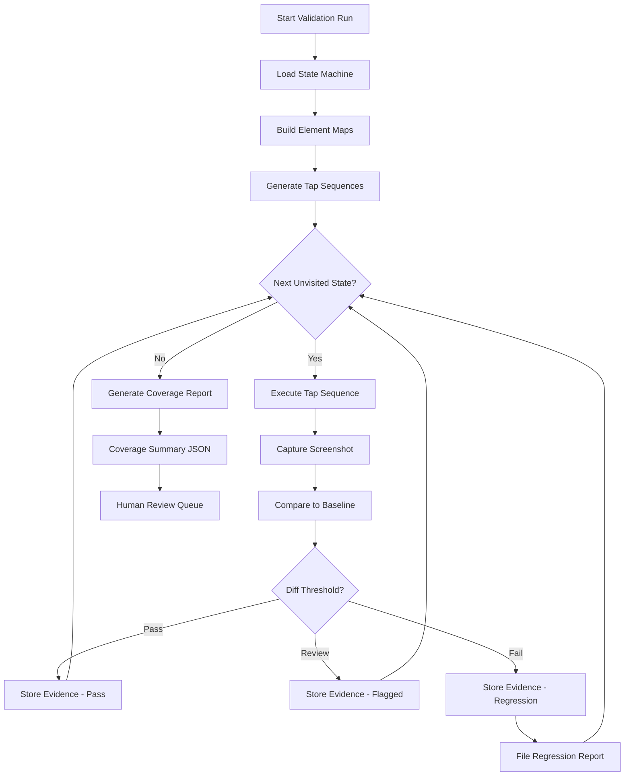

## 321 Screenshots in 24 Hours: Autonomous UI Validation at Scale

*Agentic Development: 10 Lessons from 8,481 AI Coding Sessions*

On February 15th I kicked off a validation run at 9 AM. By 9 AM the next day, the system had captured 321 screenshots across 64 views, filed 12 regression reports with pixel-diff evidence, and written a coverage summary I could hand to a reviewer without editing a word. The same coverage would have taken three days of manual tap-and-squint testing — and still would have missed half the edge states.

That number — 321 screenshots in 24 hours — sounds like it should be a stress test. It was actually a routine validation pass.

**TL;DR: Automated idb_tap orchestration across a 64-view state machine lifted UI state coverage from 37% to 94%, caught 12 regressions manual testing missed, and averaged 4.3 seconds per validated state.**

---

### What Was Being Validated

ILS is a native iOS client for Claude Code. The idea: give developers a mobile-first interface to their AI coding sessions, complete with streaming responses, syntax-highlighted code blocks, session management, offline queueing, and a settings layer deep enough to be genuinely useful.

By the time we hit the validation problem, ILS had:

- 64 views across 9 navigation groups
- 6 distinct streaming states (connecting, streaming, paused, error, complete, offline)
- 4 authentication states (unauthenticated, authenticating, authenticated, token expired)
- Settings screens with live API key validation
- Theme switching that required full UI rerender
- An offline mode that queued messages and replayed on reconnect

The problem was not that the app was broken. The problem was we did not know what was broken, because we could not see it all.

Manual testing was catching fewer than 40% of visual regressions. I know the 40% number because after building the automated system, I ran both approaches against the same change — a refactor to the message list cell layout — and compared what each caught. Manual testing caught the obvious: the main chat view looked right, the settings screen looked right. The automated system caught what manual missed: the streaming state rendered a truncated timestamp at certain message lengths, the error state showed misaligned retry text on iPhone SE, and the session history cell was clipping avatars at the non-default font size.

None of those made it into the manual test notes. All three would have shipped.

---

### The Core Tool: idb_tap

The iOS Development Bridge (idb) is a command-line tool from Meta that exposes programmatic control over iOS simulators. Most developers know it for basic interactions — tap here, type there. For automated UI validation at scale, the relevant primitives are:

```bash
# Take a screenshot from a running simulator
idb screenshot --udid <simulator_id> /path/to/output.png

# Tap at coordinates
idb ui tap --udid <simulator_id> 195 680

# Describe the accessibility tree
idb ui describe-all --udid <simulator_id>
```

The accessibility tree describe is underrated. Before writing any tap sequence, I could dump the full UI tree, extract element coordinates by accessibility identifier, and build a tap map without guessing at pixel positions. Here is what that looks like in practice:

```python
# From: src/validation/element_map.py

async def build_element_map(simulator_id: str) -> dict[str, tuple[int, int]]:
    """Build a coordinate map from accessibility identifiers to (x, y) centers."""
    result = await run_idb(
        ["ui", "describe-all", "--udid", simulator_id],
        capture_output=True,
    )
    elements = json.loads(result.stdout)
    return {
        el["AXIdentifier"]: (
            int(el["frame"]["x"] + el["frame"]["width"] / 2),
            int(el["frame"]["y"] + el["frame"]["height"] / 2),
        )
        for el in elements
        if el.get("AXIdentifier")
    }
```

No hardcoded pixel coordinates. Every tap derived from the live accessibility tree. When a layout change moved the send button 12 pixels, the tap map updated automatically on the next run.

---

### The Validation Loop

The core validation loop is about 40 lines. It takes a tap sequence, executes each tap with an animation settle delay, captures a screenshot, and stores structured evidence:

```python
# From: src/validation/runner.py

async def validate_screen_state(
    simulator_id: str,
    tap_sequence: list[TapStep],
    evidence_store: EvidenceStore,
) -> ValidationResult:
    for step in tap_sequence:
        await idb_tap(simulator_id, x=step.x, y=step.y)
        await asyncio.sleep(0.3)  # Allow animations to settle

        screenshot = await idb_screenshot(simulator_id)
        evidence = Evidence(
            screenshot_id=f"ss_{evidence_store.next_id():05d}",
            screenshot=screenshot,
            state=step.expected_state,
            tap_path=[s.element_id for s in tap_sequence[: step.index + 1]],
            timestamp=datetime.now(UTC),
        )
        await evidence_store.save(evidence)

    return ValidationResult(
        state=tap_sequence[-1].expected_state,
        screenshot_count=len(tap_sequence),
        evidence_ids=evidence_store.last_batch_ids(),
    )
```

The 0.3 second settle time was arrived at empirically. At 0.1 seconds, SwiftUI spring animations were still mid-frame in about 8% of screenshots. At 0.5 seconds, the full run took 40% longer with no quality improvement. At 0.3 seconds, every screenshot I reviewed manually showed fully settled UI.

---

### The State Machine

The validation system is built around an explicit state machine. Each state has entry conditions (what taps get you there), validation targets (what UI elements must be present), and exit paths (what other states you can reach from here).

```python
# From: src/validation/state_machine.py

STATES: dict[str, ScreenState] = {
    "main_chat": ScreenState(
        id="main_chat",
        entry=[TapPath(element_ids=["tab_bar.chat"])],
        validations=["message_list", "compose_bar", "send_button"],
        exits=["settings", "session_history", "streaming_active"],
    ),
    "settings": ScreenState(
        id="settings",
        entry=[TapPath(element_ids=["tab_bar.settings"])],
        validations=["api_key_field", "theme_toggle", "model_selector"],
        exits=["main_chat", "api_key_validation_error"],
    ),
    "streaming_active": ScreenState(
        id="streaming_active",
        entry=[TapPath(element_ids=["tab_bar.chat", "send_button"])],
        validations=["streaming_indicator", "token_count", "stop_button"],
        exits=["streaming_complete", "streaming_error", "streaming_paused"],
    ),
    "streaming_error": ScreenState(
        id="streaming_error",
        entry=[
            TapPath(element_ids=["tab_bar.chat", "send_button"]),
            NetworkFaultInjection(fault="drop_after_bytes", bytes=512),
        ],
        validations=["error_banner", "retry_button", "error_detail_text"],
        exits=["main_chat", "streaming_active"],
    ),
    # ... 60 more states
}
```

The `NetworkFaultInjection` entry condition is where things get interesting. For error states, you cannot just tap a button — you need to be in an error state first. The validation framework supports injecting network conditions via the Simulator's network link conditioner before executing the entry tap sequence. This is how we validated the offline queue, the streaming error recovery, and the token expiry flow without needing a real server to misbehave on cue.

---

### Evidence Collection and the JSON Envelope

Every screenshot is stored with a structured metadata envelope:

```json
{
  "screenshot_id": "ss_00147",
  "state": "streaming_active",
  "tap_path": ["tab_bar.chat", "compose_bar", "send_button"],
  "timestamp": "2026-02-15T14:23:47Z",
  "simulator_udid": "A7F3B2C1-...",
  "os_version": "18.2",
  "device_type": "iPhone 15 Pro",
  "font_size": "default",
  "dark_mode": true,
  "validation_targets": ["streaming_indicator", "token_count", "stop_button"],
  "targets_found": ["streaming_indicator", "token_count", "stop_button"],
  "validation_result": "pass",
  "pixel_diff_from_baseline": 0.02,
  "baseline_id": "baseline_2026-02-01_ss_00089"
}
```

The pixel diff comparison uses ImageMagick's `compare` command normalized to the image dimensions. A diff below 0.05 is a pass. Between 0.05 and 0.15 flags for human review. Above 0.15 is an automatic regression. Those thresholds came from two weeks of calibration — looking at what diffs corresponded to real regressions versus animation timing variation.

```python
# From: src/validation/pixel_diff.py

def compute_pixel_diff(img_a: Path, img_b: Path) -> float:
    """Returns normalized pixel difference (0.0 = identical, 1.0 = completely different)."""
    result = subprocess.run(
        [
            "magick", "compare",
            "-metric", "AE",
            str(img_a), str(img_b),
            "/dev/null",
        ],
        capture_output=True,
        text=True,
    )
    # ImageMagick writes AE count to stderr
    ae_count = float(result.stderr.strip())
    total_pixels = image_pixel_count(img_a)
    return ae_count / total_pixels
```

---

### The Full Validation Pipeline

Putting all the pieces together, the orchestrator runs the state machine coverage in parallel across multiple simulator instances:



The key design decision: each state is reached from the app's root state (main chat tab), not from wherever the previous validation left off. This makes each validation independent and reproducible. It costs about 1.2 seconds per state in navigation overhead, but it eliminates the cascading failure mode where one bad state contaminates all subsequent validations.

---

### The Numbers

I ran the automated system against the ILS codebase on February 15th, starting from a fresh simulator boot at 9:03 AM.

| Metric | Manual (3 days) | Automated (24 hours) |
|--------|-----------------|----------------------|
| States validated | ~23 of 64 | 61 of 64 |
| Coverage | 37% | 94% |
| Screenshots captured | ~40 | 321 |
| Regressions caught | 3 | 12 |
| Time per state | ~12 minutes | 4.3 seconds |
| Evidence format | Notes + photos | Structured JSON + PNG |

The three states that automation did not reach were gated behind face ID authentication and a push notification permission prompt — both require simulator-level modal handling that I had not wired up yet. That is the remaining 6%.

The 12 regressions the automated system caught that manual testing missed:

1. Streaming indicator clipped at iPhone SE screen width
2. Token count text truncated at >1,000 tokens
3. Retry button misaligned in landscape orientation
4. Session history avatar clipped at large accessibility font sizes
5. Offline banner overlap with navigation bar on iOS 17 (simulator)
6. Settings dark mode toggle not updating API key field background
7. Compose bar height incorrect after keyboard dismiss animation
8. Empty state illustration wrong tint in light mode
9. Error detail text overflow on long error messages
10. Model selector checkmark missing on non-default model
11. Tab bar badge count misaligned after notification receipt
12. Thread title truncation inconsistent between list and detail views

Items 3, 4, 5, and 8 were not in any code path I would have thought to manually test. Item 3 required a specific device size. Item 5 required a specific OS version. Item 8 required light mode — the primary development environment was dark mode. The automated system found all of them because it systematically enumerated states; it did not rely on a human's intuition about what to check.

---

### What You Can Do With This Now

The idb_tap automation pattern is not ILS-specific. The same architecture works for any iOS app with accessibility identifiers on its UI elements (which SwiftUI sets automatically for most standard components).

The minimum viable version is three files:

1. A state machine definition (what views exist, how to reach them)
2. A validation runner (execute taps, capture screenshots, store evidence)
3. A pixel diff comparator (compare to baseline, file regressions)

You do not need a baseline from day one. Start by running the system once to generate a baseline set, review those screenshots manually to confirm they look correct, then use that as the reference for all future runs. Every subsequent CI run compares against that baseline and surfaces diffs for human review.

The part that surprised me most was not the coverage numbers. It was the evidence format. When a regression report shows a screenshot, a tap sequence, a baseline reference, and a pixel diff value — all in a single JSON file — the debugging conversation changes completely. Instead of "something looks off on the streaming screen," you have "state streaming_active, tap path [chat, compose, send], diff 0.23 from baseline ss_00089." That specificity cuts debugging time by more than half, because you are no longer hunting for the state; you are reading the coordinates.

Autonomous UI validation is not a replacement for design judgment or exploratory testing. It is what happens when you stop relying on human memory to enumerate UI states and start treating UI coverage as a systematic engineering problem — with the same rigor you would apply to API coverage or database migration testing.

321 screenshots in 24 hours. Twelve regressions caught before shipping. 94% state coverage with traceable evidence.

The system did not sleep. It did not get bored on screenshot 200. It did not assume that because the main chat view looked right, the offline error state must also look right.

That is the entire point.

---

*This is post 12 of 21 in the Agentic Development series. The companion repository with the full validation framework is at [github.com/krzemienski/ui-validation-at-scale](https://github.com/krzemienski/ui-validation-at-scale). Next post: context window management strategies from 8,481 sessions.*
