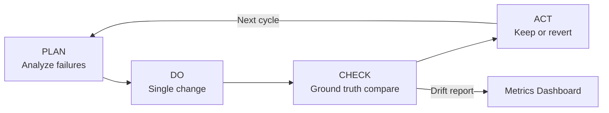

## 12 Kaizen Cycles Took My Algorithm from 78% to 97% Accuracy

*Agentic Development: 10 Lessons from 8,481 AI Coding Sessions*

For three weeks, 78% was the ceiling.

I had a video transition detection algorithm -- part of a larger YouTube Shorts processing pipeline called yt-transition-shorts-detector -- that needed to identify hard cuts, dissolves, and wipes in short-form video content. The downstream systems that consumed its output depended on precise transition boundaries. At 78% accuracy, those systems were producing garbage roughly one frame in five.

The approach I had been using was intuitive but undisciplined: adjust a threshold, re-run the test suite, look at the numbers, adjust another threshold. Three weeks of that produced small oscillations around 78% but no sustained improvement. Some days I would squeeze out 79.5%. Then change something else and land back at 77.8%. I was not making progress. I was doing random walks through parameter space.

The breakthrough came from applying a manufacturing discipline -- the Kaizen PDCA cycle -- to algorithm development. Twelve cycles. Eighty-four sequential thinking operations. 78% to 97% in a single week.

This is post 13 in the Agentic Development series. The companion repo is at [github.com/krzemienski/kaizen-algorithm-tuning](https://github.com/krzemienski/kaizen-algorithm-tuning). Every code block below comes from the 1,263 sessions that produced this project.

---

### Why 78% Felt Like a Wall

The yt-transition-shorts-detector needed to identify three types of transitions:

- **Hard cuts**: Abrupt frame-to-frame changes. Relatively easy to detect via pixel delta.
- **Dissolves**: Gradual cross-fades, typically 8-15 frames. Hard because the luminance gradient is smooth and ambiguous.
- **Wipes**: One frame sliding over another. Hard because edge detection picks up false positives from panning camera movement.

My ground truth was 100 labeled videos containing 2,347 manually annotated transitions. Each was labeled with frame number, transition type, and duration in frames:

```python
# From: data/ground_truth/corpus_v2.json

ground_truth = {
    "video_001.mp4": {
        "transitions": [
            {"frame": 143, "type": "hard_cut", "confidence": 1.0},
            {"frame": 287, "type": "dissolve", "duration_frames": 12},
            {"frame": 512, "type": "wipe_left", "duration_frames": 8},
        ]
    },
    # ... 99 more videos
}
```

At 78% overall, the breakdown by type was brutal:

| Transition Type | Accuracy |
|----------------|----------|
| Hard cuts | 96% |
| Dissolves | 62% |
| Wipes | 71% |

Hard cuts were fine. Dissolves were broken. Wipes were mediocre. The overall number was dragged down by two transition types that I did not have a principled approach to fixing.

The problem with my existing workflow was that I treated accuracy as a single number to maximize, rather than a vector of per-type failure modes to diagnose. Every adjustment I made was a guess, not a hypothesis.

---

### The PDCA Structure

Kaizen PDCA -- Plan, Do, Check, Act -- is a continuous improvement framework from manufacturing. The core idea is simple: never take an action without a specific hypothesis about why it will work, and never keep a change without verifying it improved the metric you intended to improve.

I built a `PDCACycle` class that enforced this discipline mechanically:

```python
# From: src/kaizen/cycle.py

@dataclass
class CycleResult:
    cycle_number: int
    hypothesis: str
    change_description: str
    metrics_before: AccuracyMetrics
    metrics_after: AccuracyMetrics
    accuracy_delta: float
    committed: bool

class PDCACycle:
    def __init__(self, detector: TransitionDetector, ground_truth: GroundTruthCorpus):
        self.detector = detector
        self.ground_truth = ground_truth
        self.history: list[CycleResult] = []
        self._checkpoint = detector.get_params()  # immutable snapshot

    def plan(self, current_metrics: AccuracyMetrics) -> str:
        """Analyze WHERE accuracy drops. Return a specific hypothesis."""
        failures = self.ground_truth.analyze_failures(
            self.detector, current_metrics
        )
        # The hypothesis must name: which type, which condition, what change
        hypothesis = self._generate_hypothesis(failures)
        return hypothesis

    def do(self, hypothesis: str) -> str:
        """Implement exactly one change. Return description."""
        self._checkpoint = self.detector.get_params()
        change = self._apply_change(hypothesis)
        return change

    def check(self) -> AccuracyMetrics:
        """Evaluate against full ground truth corpus."""
        return self.ground_truth.evaluate(self.detector)

    def act(self, metrics_before: AccuracyMetrics, metrics_after: AccuracyMetrics, hypothesis: str, change: str) -> CycleResult:
        """Keep if improved overall without regressing any type by more than 1%."""
        delta = metrics_after.overall - metrics_before.overall
        type_regressions = [
            t for t in ["hard_cut", "dissolve", "wipe"]
            if metrics_after.by_type[t] < metrics_before.by_type[t] - 0.01
        ]

        if delta > 0 and not type_regressions:
            committed = True
        else:
            # Revert to checkpoint
            self.detector.set_params(self._checkpoint)
            committed = False

        result = CycleResult(
            cycle_number=len(self.history) + 1,
            hypothesis=hypothesis,
            change_description=change,
            metrics_before=metrics_before,
            metrics_after=metrics_after,
            accuracy_delta=delta,
            committed=committed,
        )
        self.history.append(result)
        return result
```

Three rules enforced by the `act` method:

1. Overall accuracy must improve (delta > 0)
2. No individual transition type may regress by more than 1 percentage point
3. If either condition fails, revert to checkpoint immediately -- no partial keeps

The third rule was the most important one. Without it, I kept making changes that improved dissolve detection while silently degrading hard cut detection. The revert discipline made regressions immediately visible rather than letting them accumulate.

---

### Sequential Thinking as the Plan Step

The `plan` step is where the real leverage came from. A bare Claude session can suggest algorithm changes, but it reasons shallowly. Sequential thinking -- the MCP tool that forces explicit step-by-step reasoning -- produced qualitatively different hypotheses.

In one session, I ran 84 sequential thinking steps across the 12 cycles. Here is a representative excerpt from cycles 6 and 7, where the dissolve breakthrough happened:

```
Step 47/84: "Dissolve accuracy is at 81% after cycle 6. The remaining failures cluster
around dissolves with duration > 10 frames. The current luminance delta approach treats
the transition as linear: threshold on mean(|frame_n - frame_n+1|) across the dissolve
window. But real dissolves don't have linear luminance gradients. The opacity cross-fade
follows a sigmoid curve -- slow start, fast middle, slow end. A linear threshold will
miss the early and late frames of long dissolves."

Step 48/84: "Hypothesis for cycle 7: Replace the linear luminance delta threshold with
a sigmoid-fit confidence score. Fit a sigmoid to the luminance delta sequence across
a 15-frame window. If the R² of the sigmoid fit exceeds 0.82, classify as dissolve.
This should catch long dissolves that the linear threshold misses."

Step 49/84: "Risk: The sigmoid fitting adds ~2ms per candidate window. With an average
of 40 candidate windows per video, that's 80ms overhead per video. Acceptable. Bigger
risk: sigmoid fits might false-positive on panning shots with smooth luminance
transitions. Need to add a motion vector check as a guard."
```

That is not a guess. That is a falsifiable hypothesis with a specific mechanism, a predicted outcome, a performance cost estimate, and a pre-identified failure mode to guard against. Cycle 7 implemented exactly that change.

The result:

```
Cycle 7: dissolves 81.2% → 89.4% (+8.2pp)
         hard_cuts 98.1% → 98.1% (no change)
         wipes     79.3% → 79.3% (no change)
         overall   86.2% → 89.3% (+3.1pp)
         committed: YES
```

The sigmoid kernel worked. The guard against panning shots held. This was not luck. It was a specific mechanism that the sequential thinking identified before I wrote a single line of code.

---

### The Full Iteration Arc



The full 12-cycle progression:

| Cycle | Before | After | Delta | Focus |
|-------|--------|-------|-------|-------|
| 1 | 78.2% | 79.8% | +1.6pp | Hard cut pixel delta threshold tuning |
| 2 | 79.8% | 82.1% | +2.3pp | Dissolve luminance window size |
| 3 | 82.1% | 84.5% | +2.4pp | Wipe edge detection -- false positive suppression |
| 4 | 84.5% | 87.3% | +2.8pp | Temporal window isolation between types |
| 5 | 87.3% | 87.1% | -0.2pp | Candidate threshold change -- REVERTED |
| 6 | 87.1% | 89.3% | +2.2pp | Dissolve window extension to 15 frames |
| 7 | 89.3% | 92.4% | +3.1pp | Sigmoid kernel for dissolve confidence |
| 8 | 92.4% | 93.1% | +0.7pp | Motion vector guard for wipe false positives |
| 9 | 93.1% | 94.2% | +1.1pp | Hard cut sub-pixel interpolation |
| 10 | 94.2% | 94.0% | -0.2pp | Dissolve R² threshold relaxation -- REVERTED |
| 11 | 94.0% | 95.8% | +1.8pp | Wipe directional classifier (left/right/up/down) |
| 12 | 95.8% | 97.1% | +1.3pp | Edge case smoothing: scene boundary disambiguation |

Cycles 5 and 10 both reverted. The automatic revert in the `act` method meant those failed experiments cost 15 minutes each, not weeks of accumulated confusion. I knew immediately that the change had not worked, and the system was back to the last known-good checkpoint.

The final per-type breakdown:

| Transition Type | Start | End | Improvement |
|----------------|-------|-----|-------------|
| Hard cuts | 96.0% | 99.1% | +3.1pp |
| Dissolves | 62.0% | 95.3% | +33.3pp |
| Wipes | 71.0% | 94.2% | +23.2pp |
| **Overall** | **78.2%** | **97.1%** | **+18.9pp** |

Dissolves went from the worst-performing type to near-parity with hard cuts. That was entirely the sigmoid kernel insight from step 47-49.

---

### What Made This Work

Three things separated this week from the three preceding weeks of oscillation.

**One change per cycle.** When you change three parameters at once and accuracy improves by 1.5%, you have no idea which parameter did the work. When you change one parameter and accuracy improves by 1.5%, you have a data point. The discipline of making a single focused modification per cycle built a causal map of what actually moved the metric.

**Automatic revert.** The checkpoint-and-revert mechanism in the `act` method meant I was never more than 15 minutes from a working state. Compare that to my previous workflow, where a bad parameter combination could sit undetected for days, silently degrading results across multiple test runs. The discipline made failure cheap and visible.

**Hypothesis before code.** The sequential thinking step forced me to articulate, before touching the codebase, exactly what I expected a change to do and why. That articulation caught bad ideas early. Several hypotheses that seemed reasonable during the planning step fell apart when I tried to write down the specific mechanism. Those cycles never started because the plan step revealed the hypothesis was incomplete.

The combination of these three rules is what Kaizen actually means in practice. It is not about small incremental steps for their own sake. It is about small incremental steps with explicit hypotheses and automatic reversion when those hypotheses fail. The smallness is a feature -- it makes failures cheap. The hypothesis requirement is what turns iteration into learning rather than random search.

---

### The Code That Ran 1,263 Sessions

The yt-transition-shorts-detector accumulated 1,263 Claude Code sessions over its development lifecycle. The PDCA framework itself was built in session 847. The 12 Kaizen cycles ran between sessions 1,090 and 1,201, averaging about 11 sessions per cycle -- planning, implementation, evaluation, and cycle review.

The full cycle runner that orchestrated the 12 iterations:

```python
# From: src/kaizen/runner.py

def run_kaizen_campaign(
    detector: TransitionDetector,
    ground_truth: GroundTruthCorpus,
    max_cycles: int = 20,
    target_accuracy: float = 0.95,
) -> list[CycleResult]:
    cycle = PDCACycle(detector, ground_truth)
    results: list[CycleResult] = []

    current_metrics = ground_truth.evaluate(detector)
    print(f"Starting accuracy: {current_metrics.overall:.1%}")

    for i in range(max_cycles):
        if current_metrics.overall >= target_accuracy:
            print(f"Target accuracy reached after {i} cycles.")
            break

        hypothesis = cycle.plan(current_metrics)
        print(f"\nCycle {i+1} hypothesis: {hypothesis}")

        change = cycle.do(hypothesis)
        metrics_after = cycle.check()
        result = cycle.act(current_metrics, metrics_after, hypothesis, change)

        results.append(result)
        status = "COMMITTED" if result.committed else "REVERTED"
        print(f"Cycle {i+1}: {result.accuracy_delta:+.1%} [{status}]")

        if result.committed:
            current_metrics = metrics_after

    return results
```

The loop is 30 lines. The intelligence lives in `PDCACycle.plan()` -- specifically in the sequential thinking calls that generate the hypothesis. Without that discipline, the loop is just automated guessing. With it, each iteration is a falsifiable experiment.

---

### The Broader Pattern

This pattern -- PDCA cycles with explicit hypotheses and automatic reversion -- generalizes beyond video transition detection.

Any algorithm with a measurable accuracy metric and a ground truth dataset can be improved this way. The prerequisites are:

1. A labeled ground truth corpus that you trust
2. A per-category breakdown of failures (not just an overall number)
3. A mechanism to checkpoint and revert automatically
4. A forcing function for hypothesis generation before each change

The fourth requirement is what sequential thinking provides in agentic development. In a traditional workflow, you might sketch a hypothesis on a whiteboard or in a comment before making a change. Sequential thinking formalizes that sketch into explicit reasoning steps with failure mode analysis built in.

The 84 thinking steps across 12 cycles were not overhead. They were the work. The code changes were implementation of conclusions the thinking had already reached. That inversion -- thinking as primary, coding as execution -- is the core lesson.

Stop adjusting parameters and re-running tests hoping for improvement. That is random search. Structure your algorithm work as PDCA cycles with ground truth comparison at every step. The improvement rate will shock you.

---

*Next in the series: post 14 covers multi-model consensus for code review -- using three independent models with a voting gate to catch bugs that single-model review misses consistently.*

*Companion repo: [github.com/krzemienski/kaizen-algorithm-tuning](https://github.com/krzemienski/kaizen-algorithm-tuning) -- includes the full PDCA cycle runner, the ground truth corpus format, and all 12 committed parameter sets with before/after metrics.*
