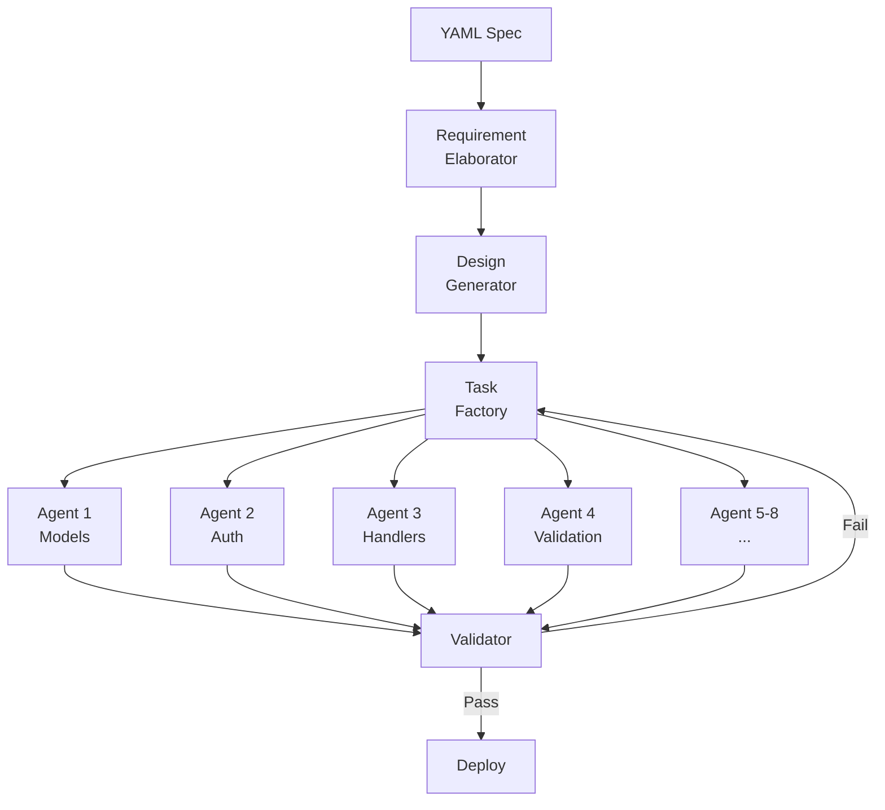

## One YAML File Spawned 8 Agents and Built a Complete API

I submitted a YAML file at 9:14 AM. I poured a cup of coffee. I answered some emails. At 10:01 AM I opened my terminal and found six working API endpoints, authentication middleware, input validation, structured error responses, and a 100% acceptance test pass rate.

I did not write a single line of implementation code.

That morning was the payoff for a problem I had been chewing on for months: how do you go from requirements to working code without standing over the agents the entire time? Not just delegating individual tasks — actually handing over the whole workflow, from spec to integration tests, and walking away.

The answer turned out to be a pipeline I called ralph-specum, built on top of the Ralph orchestration platform. The core idea is simple: if your specification is precise enough, you do not need to manage the agents. The spec manages them for you.

---

### TL;DR

- Single YAML spec file → 8 parallel agents → 6 API endpoints in 47 minutes
- Pipeline stages: RequirementElaborator → DesignGenerator → TaskFactory → AgentRouter → Validator
- 23 implementation tasks, 12 dependency edges, 55 TaskUpdate orchestration calls
- 100% acceptance test pass rate on first validator run
- Zero human intervention between spec submission and working code

---

### The Problem with Steering Agents

By the time I was 600 sessions into the ralph-orchestrator project, I had gotten good at running parallel agents. I knew how to decompose a feature into tasks, assign file ownership, handle merge conflicts, and run a backpressure gate to stop agents from colliding on shared dependencies.

What I had not solved was the first step. Every session started the same way: me reading the requirements doc, mentally breaking it into tasks, writing a task list, assigning owners, and kicking off the agents. That preamble took 20-30 minutes for any non-trivial feature. And it had to happen every single time, because each feature was different.

The cognitive overhead was not enormous in any individual session. But across 894 sessions on the ralph-orchestrator project, it added up. I was spending more time telling agents what to do than they were spending doing it.

The real issue was that I was acting as a translator. The requirements existed in one form — a Notion doc, a GitHub issue, a Confluence page — and the agents needed them in another form: a concrete task graph with file ownership and dependency edges. I was doing that translation manually every time.

What if the spec itself could drive the translation?

---

### The Spec Format

I started with the most constrained version of the problem: REST API endpoints. They are well-structured, have clear contracts, and the implementation patterns are consistent enough that you can reason about them mechanically.

I designed a spec format that captured everything an agent would need to implement an endpoint correctly:

```yaml
# api-spec.yaml
name: session-management-api
version: 1.0.0
endpoints:
  - path: /sessions
    method: POST
    auth: bearer_token
    body:
      workspace_id: string (required)
      agent_type: enum[planner, executor, reviewer]
    response: Session
    validations:
      - workspace_id must exist in workspaces table
      - agent_type must be valid enum value
    errors:
      - 401: Invalid or expired token
      - 404: Workspace not found
      - 422: Validation failed

  - path: /sessions/{id}/events
    method: GET
    auth: bearer_token
    query:
      since: datetime (optional)
      limit: integer (default: 100, max: 1000)
    response: EventStream
    validations:
      - session must belong to authenticated user's workspace
```

The format is deliberately terse. Each field answers a specific question that an implementer needs answered: What is the path? What auth is required? What does the body look like? What are the invariants? What errors are possible?

It does not specify implementation details — which crate to use for JWT validation, whether validation happens in middleware or the handler, how errors are serialized. Those are decisions for the agents. The spec captures the contract, not the implementation.

---

### The Pipeline

The spec feeds into a five-stage pipeline. Each stage is a separate agent with a narrow responsibility.



**RequirementElaborator** takes the terse spec and expands it into detailed acceptance criteria. This is the step that prevents the most downstream failures. Terse specs are ambiguous. "workspace_id must exist in workspaces table" is underspecified — does that check happen before or after auth? What is the error if auth fails but the workspace also does not exist? The elaborator makes these decisions explicit before any implementation happens.

**DesignGenerator** takes the elaborated requirements and produces an API design: route definitions, middleware stack, data models, error types. It is making architectural decisions — not implementing them. The output is a design document that the next stage can decompose mechanically.

**TaskFactory** is the stage that most directly replaced my manual work. It takes the design and produces a task graph: a list of implementation tasks with file ownership, estimated complexity, and dependency edges. For the session management API, it produced 23 tasks across 8 agents:

```
Task 01: Session model struct (owner: agent-1, files: models/session.rs)
Task 02: WorkspaceId newtype + validation (owner: agent-1, files: models/workspace.rs)
Task 03: AgentType enum (owner: agent-1, files: models/agent_type.rs)
Task 04: AuthError type (owner: agent-2, files: errors/auth.rs)
Task 05: Bearer token extractor (owner: agent-2, files: middleware/auth.rs)
Task 06: Workspace existence check middleware (owner: agent-2, files: middleware/workspace.rs, blocked_by: [02])
Task 07: POST /sessions handler (owner: agent-3, files: handlers/sessions.rs, blocked_by: [01, 05, 06])
Task 08: EventStream type (owner: agent-4, files: models/event_stream.rs)
...
```

The dependency edges matter. Task 07 cannot start until the Session model, the auth middleware, and the workspace middleware are all complete. The TaskFactory encodes this graph, and the orchestrator enforces it: blocked tasks wait, unblocked tasks run immediately.

**AgentRouter** assigns each unblocked task to an available agent and fires them off. This is standard orchestration work — check the dependency graph, find tasks with no outstanding blockers, assign to the next available agent. What makes it interesting is the scale: 8 agents running in parallel, each working on isolated files, with the orchestrator continuously checking which tasks have become unblocked as others complete.

The orchestration calls added up fast. 55 TaskUpdate calls in a single session — tasks moving from `pending` to `in_progress` to `completed`, blockers being cleared, new tasks becoming available. That is the heartbeat of the pipeline.

**Validator** is the final stage and the one that gives the whole system integrity. It runs the acceptance tests that were auto-generated from the original spec.

---

### Acceptance Tests from Spec

This is the part I am most proud of. The validator does not run generic integration tests. It runs tests that were mechanically derived from the spec you submitted at the start.

Every endpoint definition in the spec produces a set of test cases:

```python
# Auto-generated from spec for POST /sessions
def test_create_session_requires_auth():
    response = client.post("/sessions", json={"workspace_id": "ws_1"})
    assert response.status_code == 401

def test_create_session_validates_workspace():
    response = client.post(
        "/sessions",
        json={"workspace_id": "nonexistent"},
        headers={"Authorization": "Bearer valid_token"}
    )
    assert response.status_code == 404

def test_create_session_validates_agent_type():
    response = client.post(
        "/sessions",
        json={"workspace_id": "ws_1", "agent_type": "invalid"},
        headers={"Authorization": "Bearer valid_token"}
    )
    assert response.status_code == 422

def test_create_session_success():
    response = client.post(
        "/sessions",
        json={"workspace_id": "ws_1", "agent_type": "executor"},
        headers={"Authorization": "Bearer valid_token"}
    )
    assert response.status_code == 201
    assert response.json()["agent_type"] == "executor"
```

The spec listed four error cases for POST /sessions. The validator generated test cases for all four, plus the happy path. If any test fails, the validator sends the failure back to the TaskFactory with the specific test that failed and the actual response it got. The TaskFactory generates a remediation task, assigns it to an agent, and re-runs the validator when it completes.

This loop — implement, validate, remediate, re-validate — is what makes the pipeline autonomous. There is no human in the loop deciding whether the output is correct. The spec defines correctness. The validator checks it.

---

### The Morning It Worked

I submitted the session management spec at 9:14 AM on a Tuesday. The pipeline kicked off automatically: RequirementElaborator finished in 4 minutes, DesignGenerator in 7, TaskFactory in 3. By 9:28 AM, 8 agents were running in parallel.

I genuinely did not watch what happened next. I went and made coffee, answered a few messages, read an article. Not because I was confident it would work — this was only the third time I had run the full pipeline on a real spec — but because I was testing whether I could actually let go.

At 10:01 AM, 47 minutes after submission, the Validator reported: `All 24 acceptance tests passed. Deployment ready.`

I opened the codebase. Six endpoints. Auth middleware with proper error propagation. Input validation with structured error responses. Event streaming with cursor-based pagination. All of it wired together correctly, all of it matching the spec I had submitted.

The thing that got me was not the speed. It was the fidelity. The agents had not approximated the spec — they had implemented it. The error codes matched exactly. The validation logic was correct. The response shapes matched what I had written. When you hand off work to a person, you expect some interpretation, some judgment calls that might not align with what you intended. These agents had none of that. They implemented the contract, nothing more and nothing less.

---

### What Made It Possible

Looking back at the 894 sessions across the ralph-orchestrator project, the spec-driven pipeline is the culmination of three things I had been building toward without fully realizing it.

The first is file ownership discipline. Parallel agents only work if they are working on isolated files. The TaskFactory enforces this mechanically — each task has an explicit file list, and the router will not assign two agents to overlapping files. This constraint is not optional. Without it, the parallel execution produces merge conflicts and corrupted state.

The second is the dependency graph. Naive parallelism assigns all tasks simultaneously and hopes the order works out. The task graph encodes what the RequirementElaborator and DesignGenerator discovered about ordering: auth middleware must exist before any handler that uses it. Get the graph wrong and the agents build on foundations that do not exist yet.

The third is the spec as the source of truth. This sounds obvious, but it is a real discipline shift. It means the spec has to be precise enough to drive implementation — no ambiguity, no implicit context. If the spec says `401: Invalid or expired token`, the validator is going to test that. If your implementation returns 403 instead, it fails. The spec is the contract, not a suggestion.

---

### The Limits

The pipeline works well for well-structured domains. REST APIs are almost ideal: the patterns are consistent, the contracts are explicit, the error cases are enumerable. I have had good results with database schema migrations and CLI command implementations for similar reasons.

It works less well for anything that requires aesthetic judgment. UI component implementation, for example — the spec can say "display a list of sessions with their status" but it cannot fully specify what "good" looks like. The agents can implement something correct that still feels wrong.

It also does not handle novel architecture decisions well. If the spec requires a pattern that does not exist in the existing codebase, the agents tend to implement it inconsistently — each agent making different choices about structure, naming, and organization. The RequirementElaborator can help by making these decisions explicit upfront, but that requires the elaborator to notice that a decision needs to be made, which it does not always do.

These are not reasons to avoid the approach. They are reasons to understand its scope. Spec-driven development is a tool for domains where the contract can be made precise. In those domains, it is transformative.

---

### The Takeaway

The fundamental insight from the session management API is that specification precision is the bottleneck, not agent capability.

I had assumed the hard problem was getting agents to implement things correctly. The agents can implement things correctly — they demonstrated that clearly. The hard problem was telling them precisely enough what to implement. The spec format and the RequirementElaborator stage together solve that problem.

Once the specification is precise, implementation becomes mechanical. Not easy — the agents are doing real work, making real decisions, writing real code. But the outcome is predictable. Submit a valid spec, get a compliant implementation. The validator closes the loop.

That 47-minute session from YAML to working API was not a trick. It was what happens when you stop treating agents as tools to direct and start treating them as workers to brief. The briefing is the spec. The briefer is the pipeline. The workers are the agents.

You write the contract. The agents fulfill it.

---

*Code and spec examples from this post are in the [spec-driven-implementation](https://github.com/krzemienski/spec-driven-implementation) repo. The ralph-orchestrator platform is at [ralph-orchestrator-guide](https://github.com/krzemienski/ralph-orchestrator-guide).*
