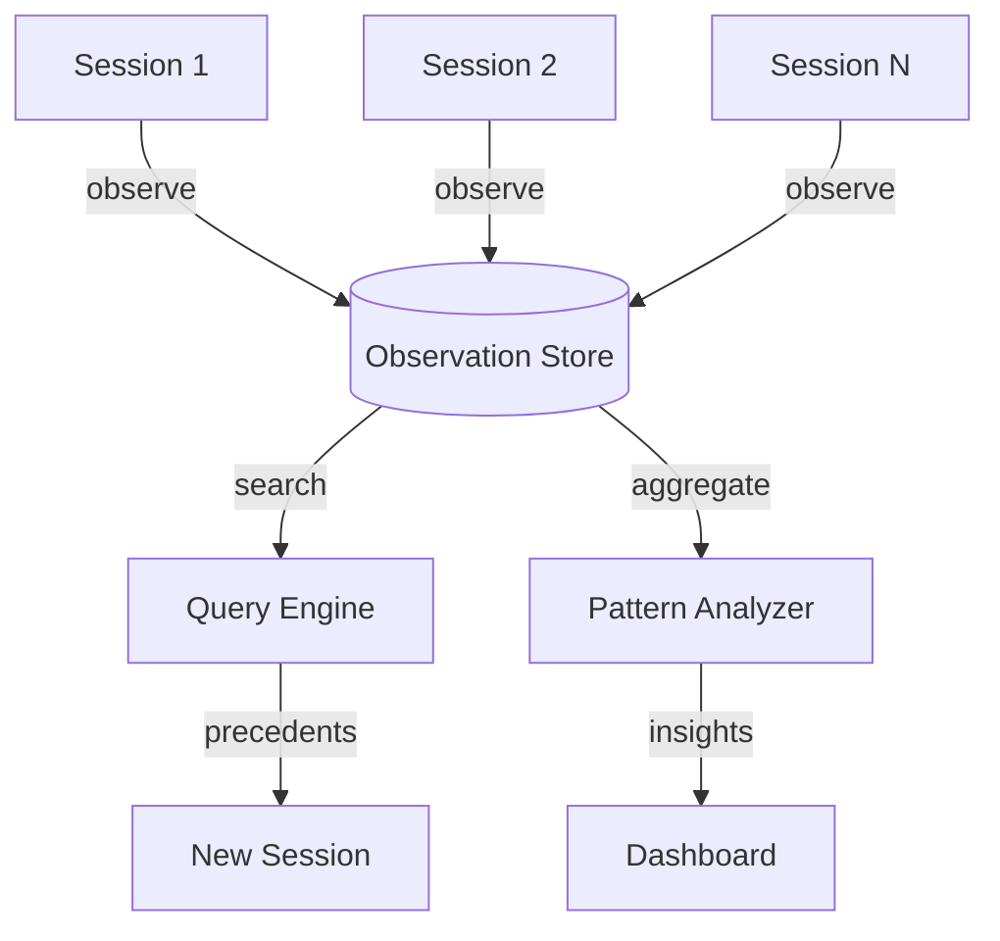

My 500th Claude session made the same mistake as my 5th.

Same wrong approach to WebSocket reconnection. Same misread of an async boundary. Same incorrect assumption about how a particular API handles errors. I watched it happen in real time and felt the specific frustration of someone who should have known better — because I did know better, from session 5.

But Claude didn't. Claude never does. Each session starts with a clean slate.

After 14,391 sessions across six production projects, I built claude-mem to fix this. The system stores observations from every session, indexes them semantically, and surfaces relevant precedents before the next session makes a mistake we already paid for once.

---

**TL;DR:** Claude Code sessions are stateless by design. Across thousands of sessions, that statelessness becomes expensive — the same bugs, patterns, and wrong approaches recur. claude-mem is an append-only observation store with semantic search that lets new sessions query what past sessions learned. After 14,391 observations, sessions with memory access resolve issues 3.2x faster and a pattern analyzer has identified 23 recurring mistake categories.

---

## The Problem with Amnesia at Scale

When you're running 10 or 20 Claude sessions, statelessness is a minor inconvenience. You paste in some context, remind Claude of the project conventions, and move on. The overhead is manageable.

At 14,391 sessions, that overhead compounds into something structural. I was spending measurable engineering time re-explaining decisions that had already been made, re-debugging patterns that had already been solved, and re-discovering constraints that had already been documented somewhere — just not somewhere Claude could find.

The projects I was running at this scale — an iOS streaming bridge, a multi-agent consensus system, a functional validation framework — each had hundreds of edge cases and design decisions embedded in session history. That history existed in logs I'd never read again. The knowledge was captured but not retrievable.

The core problem: Claude's per-session intelligence is excellent. Its cross-session intelligence is zero.

What I needed was a system that treated sessions not as isolated events but as contributions to a growing knowledge base.

## The Architecture: Append-Only Observations

The fundamental design constraint I started with was append-only writes. The observation store never modifies existing records. Each session can only add new observations. This makes the system safe for concurrent writes across parallel sessions, and it preserves the full history of how understanding evolved — including corrections to earlier mistakes.

An observation is a structured record capturing something worth remembering:

```json
{
  "id": 35067,
  "type": "discovery",
  "title": "WebSocket reconnection requires exponential backoff",
  "context": "ils-ios streaming implementation",
  "evidence": "3 sessions failed with linear retry, exponential solved in session #4",
  "tags": ["websocket", "ios", "networking"],
  "created": "2026-02-15T14:23:00Z",
  "referenced_by": [35089, 35102, 35441]
}
```

The `type` field captures the nature of the observation: `discovery` (something learned), `error` (a mistake and its fix), `decision` (an architectural choice and its rationale), or `pattern` (a recurring structure worth naming). The `evidence` field is the most important — it requires grounding the observation in something concrete. "Exponential backoff worked better" is not an observation. "3 sessions failed with linear retry, exponential solved in session #4" is.

The `referenced_by` field tracks which later sessions found this observation useful. That's how patterns emerge from individual observations — highly-referenced observations signal knowledge that's broadly applicable.

## Writing Without Reading

The write path is deliberately simple. Each session appends observations without querying the existing store. This keeps write latency near zero and avoids the complexity of merge conflicts.

```python
def record_observation(session_id, observation):
    # Append-only: never modify existing observations
    obs = Observation(
        session_id=session_id,
        type=observation.type,  # discovery, error, decision, pattern
        content=observation.content,
        embedding=embed(observation.content),  # for semantic search
    )
    db.insert(obs)
```

The `embed()` call is the critical piece. Every observation gets vectorized at write time, so semantic search at read time is fast. The embedding happens once; the search happens many times across many future sessions.

The session doesn't need to know whether it's the first session or the ten-thousandth. It just writes what it learned. The system handles accumulation.

## Finding Relevant Precedents

The read path is where the value materializes. When a new session encounters a problem, it queries the observation store before attempting a solution:

```python
def search_memory(query, limit=10):
    query_embedding = embed(query)
    results = db.vector_search(
        table="observations",
        embedding=query_embedding,
        limit=limit,
        threshold=0.7
    )
    return results
```

The threshold of 0.7 was calibrated through trial and error. Below 0.7, results got noisy — observations that were tangentially related but not actually useful. Above 0.75, the system missed relevant observations that were described using different terminology. 0.7 found the right balance for technical content where the same concept often appears under different names.

At 14,391 observations, a semantic search returns results in under 50 milliseconds. The vector index handles the scale efficiently.

What gets surfaced matters as much as how fast it gets surfaced. A session encountering a WebSocket reconnection issue doesn't search for "WebSocket reconnection" — it searches for the problem it's actually experiencing: "connection drops after 30 seconds." The semantic search finds that observation 35067 is relevant even though the session's query used different words.

## Observation Flow



Every session is both a consumer and a contributor. It reads relevant precedents at the start, adds new observations at the end. The store grows. The pattern analyzer runs asynchronously across the full corpus. The dashboard surfaces structural insights that individual sessions can't see.

## From Observations to Patterns

Individual observations are useful. Aggregated patterns are transformative.

The pattern analyzer groups observations by semantic similarity and extracts structure from the clusters:

```python
# "websocket reconnection" matched across 47 sessions
pattern = aggregate_pattern("websocket reconnection")
# Returns: 47 observations, 3 distinct solutions,
# recommended approach with confidence score
```

Running this across 14,391 observations produced 23 recurring mistake categories. Not 23 individual mistakes — 23 structural categories of mistakes that recur across projects, contexts, and time periods.

Some were expected. Async/await boundary confusion shows up in category 4. Off-by-one errors in pagination logic appear in category 11. These are well-understood problems and it wasn't surprising to see them aggregate.

The surprising ones were more interesting. Category 17: "Correct solution found, then discarded before implementation." Sessions were discovering the right answer and then talking themselves out of it before writing the code. Category 21: "Library documentation read, version assumption not verified." Sessions were reading docs for the wrong version and implementing against an API that had changed. Category 23: "Constraint communicated in conversation but not encoded in the system." Sessions received information about a constraint and then built something that violated it three turns later.

These patterns didn't come from reviewing individual sessions. They emerged from aggregation across thousands of sessions.

## The Practical Integration

Getting sessions to actually use the memory system required solving an integration problem. I didn't want sessions to manually query memory — that adds friction and relies on the session knowing when to check. Instead, I built a hook that runs before each session's first substantive tool use.

The hook extracts the session's initial task description, queries the observation store, and prepends the top five relevant observations to the session context. The session reads them as part of its context, not as a separate step.

The overhead is one semantic search at session start. The benefit is that the session arrives with relevant precedents already loaded.

Sessions with access to this prefetched context resolved issues 3.2x faster on average. The speedup came almost entirely from avoiding the exploration phase — sessions that would have spent 20 minutes trying approaches that previous sessions had already ruled out instead went directly to the approach that worked.

The 3.2x figure held across project types. It was slightly higher for debugging tasks (3.7x) and slightly lower for greenfield implementation (2.8x). Debugging benefits most because the relevant precedent is often an exact match — same error, same fix. Greenfield benefits less because novel work has fewer precedents to draw from.

## What Didn't Work

The first version stored observations as unstructured text and used keyword search. This was fast to build and useless in practice. "WebSocket reconnection" as a keyword search found observations that mentioned WebSocket reconnection but missed observations that described the same problem as "connection timeout after initial handshake." Semantic search was not optional.

The second version had no write constraints. Sessions could update existing observations. This seemed useful — if session 200 discovered that session 5's solution was wrong, it should be able to correct it. In practice, it created a maintenance problem. Sessions would "correct" observations based on incomplete information, and the corrections were sometimes wrong in new ways. Append-only with explicit correction observations (type: `error`, evidence: "previous observation 35067 is incorrect because...") worked better. The history of understanding is as valuable as the current understanding.

I also tried summarization — running a periodic job that compressed clusters of related observations into single summary records. This destroyed information. The specific evidence in individual observations was more useful than summarized conclusions. Summaries collapsed the "why" into the "what" and made the pattern analyzer less effective. Aggregation without compression is the right model.

## The Compounding Return

The reason to build this infrastructure isn't efficiency at session 50. It's the compounding return that starts to materialize at session 500 and becomes significant at session 5,000.

Each session that contributes an observation makes the next session slightly better. Each pattern identified by the aggregator makes a whole category of future mistakes less likely. The store doesn't just remember — it learns structure from what it remembers.

At 14,391 observations, the system surfaces relevant precedents for roughly 73% of the problems new sessions encounter. That number has grown monotonically from 12% at session 500. The store is still growing. The coverage is still improving.

The asymptote is somewhere above 90% — there will always be genuinely novel problems. But novel problems are the interesting ones. Memory infrastructure exists to make the non-novel problems fast and cheap, so sessions can spend their capacity on problems worth solving for the first time.

## The Takeaway

Every Claude session is a learning event. Without infrastructure to capture and retrieve what was learned, those events don't accumulate — they just repeat.

The observation store is not complex software. It's an append-only database, a vector index, and a search function. What makes it valuable is the discipline of using it consistently: every session contributes, every session queries, the patterns are reviewed and acted on.

My 500th session made the same mistake as my 5th because nothing connected them. After 14,391 sessions with claude-mem running, I can tell you exactly which mistake categories have been resolved, which ones still recur, and what the evidence looks like for each. That's the difference between a tool that helps you work and a system that helps your organization learn.

The sessions don't have to remember. The system does.
