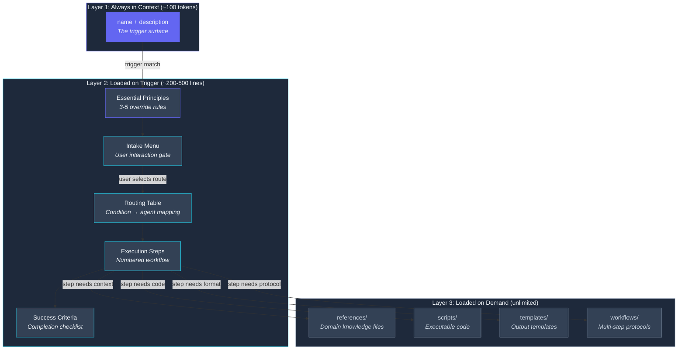
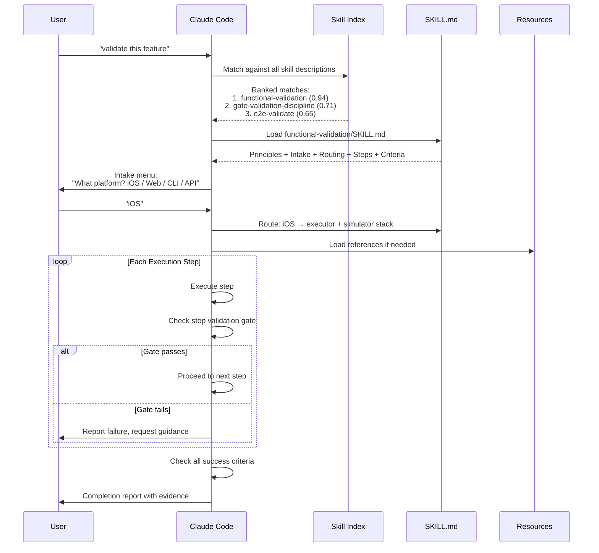

I was copy-pasting the same 200-line prompt block into sessions. Every. Single. Time. "Scan my episodic memory for recent sessions. Extract insights. Group by theme. Write a blog post for each theme. Generate companion repos. Create social media cards." And every time I started a new content batch, I'd forget a step. The companion repos sometimes had READMEs, sometimes they didn't. The social cards matched the design system half the time. The other half? Off-brand garbage.

The prompt worked. I didn't.

That distinction matters because the fix isn't "write a better prompt." The fix is to stop treating prompts as disposable text and start treating them as programs.

Treat the analogy literally. A SKILL.md file has:
- **Inputs** — parsed from the user's request via an intake section (feature to validate, platform, target file)
- **Namespace** — a unique `name` that prevents collision with other skills
- **Invocation** — a `description` that Claude matches against your phrasing to decide whether to load the skill
- **Control flow** — a routing table that dispatches to different agents based on conditions
- **Execution** — numbered steps with validation gates between them
- **Return value** — success criteria the output has to pass before the skill marks complete

Across 23,479 sessions, I've invoked skills 1,370 times. Not system prompts that load on every conversation. Not plugins enforcing rules through hooks. Programs that load on demand, scoped to a specific workflow, composable with other programs.

## Why Not Just Use CLAUDE.md?

You choose when a skill loads. That's the key difference. A CLAUDE.md file loads on every session, eating context window whether you need it or not. A skill loads only when its trigger pattern matches. So skills can be large and domain-specific without penalizing sessions that don't need them.

The `functional-validation` skill is 142 lines of detailed protocol. If it loaded on every session, that's 142 lines of context window consumed by sessions doing research, not validation. As a skill, it loads only when someone says "validate this feature" or "prove it works." That's a big deal when your context window is finite and every token counts.

## Anatomy of a SKILL.md

Every skill I've built follows the same structural template. Three layers of progressive disclosure: metadata that's always visible, the SKILL.md body that loads when triggered, and bundled resources that load on demand within the skill's workflow.



I'll walk through each section using `functional-validation` as a reference. It's the most-invoked skill in my system and hits every structural element.

### The Description: Your Trigger Surface

The YAML frontmatter or blockquote at the top contains `name` and `description`. The description isn't documentation. It's the trigger surface, the text Claude Code matches against when deciding which skill to activate.

Here's the functional-validation skill's:

```markdown
> Validates features through real system behavior, not test harnesses.
> Build it, run it, exercise it, capture evidence.
```

This is so important that I built a meta-skill. `skill-creator` at 487 lines includes a description optimization loop: generate 20 evaluation queries, run optimization with a 60/40 train/test split, evaluate three times. What I learned from that loop: Claude "undertriggers." Descriptions need to be assertive, almost pushy, about when the skill should activate. "Helps with development tasks" matches everything and nothing. "Validates features through real system behavior, not test harnesses" activates precisely when someone needs validation and never when they don't.

I had a deployment skill described as "helps deploy applications" that never activated because I always asked "push this to staging" or "ship it." Changed the description to include those exact phrases and it started activating immediately. Your skill's description has to match how you actually talk, not how you'd formally describe the capability. Ever noticed how the words you use when asking for help are completely different from the words you'd put in documentation? Same problem here.

### Essential Principles: The Override Layer

The `<essential_principles>` block contains 3-5 rules that override everything else. For functional-validation:

- NEVER create test files, mocks, stubs, or test doubles
- ALWAYS validate through the real running system
- Evidence must be personally examined, not just confirmed to exist

If the skill's execution workflow would violate a principle, the principle wins. This is the difference between a skill that works sometimes and one that works reliably. Without principles, the agent optimizes for the easiest path. With principles, the agent optimizes for the correct path even when the easiest one is right there, looking tempting.

### Intake: The Assumption Killer

The intake section is the most important section most people skip:

```markdown
## Intake Pattern

Parse the following from the user's request:
- **feature**: What to validate
- **platform**: iOS simulator, web browser, CLI, API
- **criteria**: Specific behaviors to verify (or derive from implementation)
```

The best intake patterns include an explicit menu:

```markdown
<intake>
Present this menu to the user:

1. **Receive brain dump** — I'll paste raw notes
2. **Mine sessions** — Scan episodic memory for material
3. **Expand outline** — I have a structured outline ready
4. **Revise draft** — Edit an existing post

Wait for response before proceeding.
</intake>
```

That last line, "Wait for response before proceeding," prevents the single most common skill failure: charging ahead with assumptions. Without it, Claude reads your skill invocation, guesses what you want, and starts executing. Four words that save hours of wasted context window.

### Routing Table: The Switch Statement

The routing table maps conditions to agents and models. It's a switch statement for prompt programs:

```markdown
## Routing Table

| Condition | Agent | Model | Reason |
|-----------|-------|-------|--------|
| iOS app | `executor` | sonnet | Simulator boot + idb commands |
| Web app | Playwright MCP | - | Browser automation |
| CLI tool | `executor` | sonnet | Direct command execution |
| API service | `executor` | sonnet | curl / HTTP requests |
| Evidence review | `verifier` | sonnet | Examine screenshots/logs |
```

Each condition maps to a specific agent with a specific model. Without routing, the skill tries to handle every scenario in one linear flow. With routing, it dispatches to the right specialist. The functional-validation skill routes iOS validation to the simulator stack (idb_tap, idb_describe, simulator_screenshot) and web validation to Playwright MCP (browser_snapshot, browser_click). Same goal. Different execution paths. Selected by the routing table.

### Execution Steps: The Workflow

Numbered steps with explicit validation gates:

```markdown
### Step 1: Build → `executor`
Build the real system. No placeholders, no stubs.
**Validate:** Build succeeds (but build success is NOT validation)

### Step 2: Run → `executor`
Start the app, service, or tool in its real environment.
**Validate:** System is running and accessible

### Step 3: Exercise → platform-specific
Interact with the system through its real interface.
**Validate:** Each interaction produces expected behavior
```

The `**Validate:**` line after each step isn't decoration. It's a gate. The agent can't proceed to Step 2 until Step 1's validation passes. This prevents the cascade failure where a broken build leads to a broken run leads to a broken validation leads to a false completion claim. You know that feeling when you realize the entire chain was rotten from the first step? Gates prevent that.

### Success Criteria: The Exit Gate

How do you know when you're done?

```markdown
## Validation Criteria

Before marking complete, verify:
- [ ] System was built from source
- [ ] System was running during validation
- [ ] Each feature exercised through real UI/CLI
- [ ] Evidence captured for every criterion
- [ ] Evidence personally examined
- [ ] Specific proof cited for each claim
```

Without explicit criteria, the skill declares victory whenever the agent feels like stopping. With criteria, the agent has a checklist. Every checkbox has to be checked. It's the difference between "I think I'm done" and "I can prove I'm done."

## The Skill Resolution Flow

When you type something in a Claude Code session, the system has to decide whether a skill applies and which one to load. Here's the resolution flow:



Here's what's interesting about this: description matching is the entire activation mechanism. There's no explicit registration, no command mapping, no configuration file listing which skills exist. The skill's description is its API contract with the system. If the description doesn't match how users phrase their requests, the skill never loads. That makes description optimization the single most impactful improvement you can make to any skill. Nothing else comes close.

## The Devlog-Pipeline: Skills at Scale

The devlog-pipeline skill is the reason this blog series exists. Not figuratively. It produced every post, every companion repo, every social media card. Understanding how it works shows why skills with routing tables beat monolithic prompt programs.

The devlog-pipeline has 8 routing options:

1. **full** - Run the complete pipeline: scan, write, repos, visuals, social, publish
2. **scan** - Mine episodic memory for session insights only
3. **write** - Generate posts from existing outlines
4. **repo** - Create companion repositories
5. **visuals** - Generate hero cards and diagrams
6. **social** - Create Twitter and LinkedIn content
7. **publish** - Deploy to Vercel
8. **expand** - Add new posts to an existing series

The routing table prevented a failure mode I kept hitting before skills: the "do everything at once" collapse. Without routing, I'd tell Claude "run the content pipeline" and it would try to scan sessions, write posts, create repos, and generate visuals all in one pass. Context window exhausted by step 3. With routing, each invocation does one thing. `devlog-pipeline scan` scans. `devlog-pipeline write --count 4` writes. Composable, predictable, debuggable.

The pipeline orchestrates parallel agents across phases. The scan phase spawns 3 agents mining different date ranges simultaneously. The write phase assigns 1-2 posts per agent. I learned the hard way that 3+ posts per agent exceeds context and the later posts come out thin. Honestly, I'm not sure why the quality degrades so sharply at 3 posts versus 2. It's not just a token count issue. It feels like the agent loses focus on what makes each post distinct.

The "wait for response" pattern shows up here too. When I invoke `devlog-pipeline full`, it doesn't start scanning. It presents a summary: "I found 23,479 session files across 27 projects. Scanning the last 30 days would cover 312 sessions. How many days back should I scan?" Then it waits. The human makes the scoping decision. The skill executes it.

## A Complete SKILL.md Example

Here's what a real skill file looks like end-to-end. This is `github-pr-review` — a skill that wraps the full PR review workflow with intake, routing, and explicit success criteria. Forty-eight lines. Every structural section present.

```markdown
# github-pr-review

> Reviews GitHub pull requests for correctness, missing edge cases, and
> architectural concerns. Fetches diff, reads changed files in context,
> produces structured feedback with severity levels.

## Trigger Patterns

Activate this skill when the user says:
- "review this PR"
- "review pull request"
- "check this diff"
- "what do you think of this PR"

## Essential Principles

<essential_principles>
- NEVER approve a PR without reading every changed file in full
- ALWAYS cite specific line numbers for every concern raised
- Distinguish blocking issues (must fix before merge) from suggestions (nice to have)
</essential_principles>

## Intake Pattern

<intake>
Parse from the user's request:
- **pr_url**: GitHub PR URL or PR number + repo
- **focus**: General review / security audit / performance / API contract

If focus is not specified, default to general review.
Present this confirmation before proceeding:
"Reviewing PR #NNN in repo/name. Focus: [focus]. Proceed?"
Wait for confirmation.
</intake>

## Routing Table

| Condition | Agent | Model | Reason |
|-----------|-------|-------|--------|
| Security-focused | `security-reviewer` | opus | Auth, secrets, injection risks |
| Performance-focused | `executor` | sonnet | Profiling context needed |
| General / API contract | `code-reviewer` | sonnet | Standard review workflow |

## Execution Steps

### Step 1: Fetch diff → `executor`
Run `gh pr diff <number>` to get the full diff. Read every changed file referenced.
**Validate:** Diff is non-empty. All referenced files have been read in full.

### Step 2: Review → routed agent
Examine changes against: correctness, edge cases, error handling, test coverage gaps,
architectural fit. Group findings by severity: BLOCKING / SUGGESTION / NITPICK.
**Validate:** At least one finding per changed file, or explicit "no concerns" stated.

### Step 3: Report
Produce structured output: summary paragraph, findings table with file + line + severity,
recommended action (approve / request changes / comment only).

## Validation Criteria

Before marking complete, verify:
- [ ] Every changed file was read, not just the diff
- [ ] Each finding cites a specific file and line number
- [ ] Severity levels assigned (BLOCKING / SUGGESTION / NITPICK)
- [ ] Recommendation is one of: approve / request changes / comment only
- [ ] No finding is vague ("consider improving this") — each names the specific problem
```

Notice the structural moves: the intake section explicitly asks for confirmation before the agent starts pulling diffs — that "wait for confirmation" prevents the most common failure mode, where the agent guesses the wrong PR and reviews the wrong code. The routing table keeps security audits on Opus while routine reviews run on Sonnet. The validation criteria at the bottom are specific enough that a second agent could check them mechanically.

## The Skills Factory

After building skills by hand for weeks, the patterns were obvious enough to automate. The [claude-code-skills-factory](https://github.com/krzemienski/claude-code-skills-factory) repo is the result. A Python toolkit that generates, validates, and iterates on SKILL.md files from structured specifications.

The core abstraction is `SkillSpec`: an immutable dataclass that captures everything about a skill before any markdown gets generated:

```python
@dataclass(frozen=True)
class SkillSpec:
    """Complete specification for generating a SKILL.md."""
    name: str
    description: str
    trigger_patterns: tuple[str, ...]
    context_notes: tuple[str, ...] = ()
    intake_fields: tuple[str, ...] = ()
    routing: tuple[RoutingEntry, ...] = ()
    steps: tuple[SkillStep, ...] = ()
    validation_criteria: tuple[str, ...] = ()
    tags: tuple[str, ...] = ()
```

Everything's frozen and uses tuples instead of lists. A skill spec is a value, not a mutable state bag. You construct it, generate from it, and throw it away. The generator walks each field and emits the corresponding markdown section:

```python
class SkillGenerator:
    def generate(self, spec: SkillSpec) -> str:
        sections = [
            self._header(spec),
            self._triggers(spec),
            self._context(spec),
            self._intake(spec),
            self._routing(spec),
            self._steps(spec),
            self._validation(spec),
        ]
        return "\n\n".join(s for s in sections if s) + "\n"
```

Seven sections. Each section generator returns an empty string if the spec has no data for it, so the `"\n\n".join` filter produces clean output without blank sections. Here's the routing table generator:

```python
def _routing(self, spec: SkillSpec) -> str:
    if not spec.routing:
        return ""
    lines = [
        "## Routing Table", "",
        "| Condition | Agent | Model | Reason |",
        "|-----------|-------|-------|--------|",
    ]
    for entry in spec.routing:
        lines.append(
            f"| {entry.condition} | `{entry.agent}` | {entry.model} | {entry.reason} |"
        )
    return "\n".join(lines)
```

The CLI wraps this for quick generation:

```bash
skills-factory generate \
  --name "deploy-preview" \
  --description "Deploy a preview environment for the current branch" \
  --triggers "deploy preview" "preview this" \
  --output skills/deploy-preview/
```

But generation is only half the story. The `SkillValidator` checks structural correctness of any SKILL.md, whether hand-written or generated:

```python
REQUIRED_SECTIONS = {
    "header": r"^# .+",
    "trigger_patterns": r"^## Trigger Patterns",
    "execution_steps": r"^## Execution Steps",
}

RECOMMENDED_SECTIONS = {
    "context": r"^## Context",
    "intake_pattern": r"^## Intake Pattern",
    "routing_table": r"^## Routing Table",
    "validation_criteria": r"^## Validation Criteria",
}
```

Three required sections. Four recommended. The validator produces structured results with severity levels. Errors block, warnings inform:

```bash
skills-factory validate ~/.claude/skills/

# Skill Validation: VALID
#   File: functional-validation/SKILL.md
#   Errors: 0, Warnings: 0
#
# Skill Validation: INVALID
#   File: broken-skill/SKILL.md
#   Errors: 1, Warnings: 2
#   [E] [trigger_patterns] Trigger Patterns section has no patterns listed
#   [W] [intake_pattern] Recommended section missing: intake_pattern
#   [W] [content] Skill is very short (38 words). Consider adding more detail.
```

The factory ships with three templates: `basic.md`, `workflow.md`, and `agent-orchestrator.md`. Each one escalates in complexity. The basic template is a three-step explore-execute-verify pattern. The workflow template adds planning, review gates, and dependency ordering. The agent-orchestrator template adds parallel agent spawning, dependency-aware execution, and cross-component integration. Pick the template that matches your skill's complexity. Fill in the placeholders.

## What Makes Skills Fail

I've built skills I use every day and skills I used once and abandoned. The failures cluster around five patterns.

**Trigger description too vague.** "Helps with development tasks" activates on everything and nothing. It competes with every other skill. `functional-validation`, the most-invoked skill in my system, has a precise description that matches exactly the workflows it serves. Precision in description equals reliability in activation.

**No intake step.** The skill charges ahead with assumptions. I had a deployment skill that assumed production target every time. Three staging deployments went to prod before I added an intake menu asking "Which environment?" Four lines of intake saved hours of rollback. Three deployments to production! How did I let that happen twice, let alone three times?

**No routing table.** The skill tries to handle every scenario in one linear flow. This works for simple skills but collapses for anything with branching logic. The devlog-pipeline with its 8 routing options would be unworkable as a single linear flow.

**Missing success criteria.** The skill does work but never checks if the work meets standards. My first blog-writing skill produced posts that compiled but had no frontmatter, no word count check, and LLM filler phrases throughout. Adding success criteria fixed the output quality in one iteration. The criteria: "Post is 1,500-2,500 words. Frontmatter is complete. No LLM filler phrases. All code examples trace to real sessions."

**Monolithic SKILL.md.** The context window is finite. An 1,800-line SKILL.md eats a huge chunk of context before any work begins. The sweet spot for a SKILL.md itself is 150-400 lines. Below 150, you don't need a skill. A CLAUDE.md rule will do. Above 400, decompose into the three-layer model: SKILL.md for routing logic (under 400 lines), reference files for domain knowledge (loaded on demand), and workflow files for step-by-step protocols (loaded per route).

## Interaction Patterns Between Skills

Skills don't operate in isolation. Four interaction patterns show up across the system.

**Delegation.** `devlog-publisher` delegates to `technical-content-creator` for the actual writing. The publisher handles pipeline orchestration; the content creator handles prose. Each skill does one thing. The publisher doesn't know how to write. It knows how to coordinate writing.

**Composition.** `functional-validation` composes `gate-validation-discipline` and `no-mocking-validation-gates`. The parent skill defines what to validate. The child skills define how to validate it. Composition is how small skills produce complex behavior without any single skill becoming monolithic.

**Extension.** `devlog-pipeline` extends `devlog-publisher`. Same core workflow, larger scope, more routing options. It preserves the original while adding capabilities. The 203-line publisher became the 355-line pipeline without breaking existing invocation patterns.

**Conflict declaration.** `functional-validation` explicitly declares conflict with `testing-anti-patterns`. If both activate in the same session, functional-validation wins. Conflict declarations prevent two skills from giving contradictory instructions, one saying "write unit tests" and the other saying "never write unit tests." You can imagine how that goes.

## Building Your First Skill

Start with a complete but minimal SKILL.md:

```markdown
# code-explainer

> Explains unfamiliar code patterns with context, edge cases,
> and real examples from the current project

## Trigger Patterns

Activate this skill when the user says:
- `"explain this code"`
- `"what does this pattern do"`
- `"how does this work"`

## Intake Pattern

Parse the following from the user's request:
- **target**: File path or code snippet
- **depth**: Quick overview or deep dive

## Execution Steps

### Step 1: Read → `explore`
Read the target file fully. Identify the dominant pattern.

### Step 2: Explain
Explain what the code DOES, not what it IS.
Include at least one edge case the pattern handles.
Reference actual codebase files, not hypothetical examples.

**Validate:** Explanation references real code from this project

## Validation Criteria

Before marking complete, verify:
- [ ] Explanation references actual code from the project
- [ ] At least one edge case identified
- [ ] No generic programming tutorial content
```

Thirty lines. Every structural element present: description (trigger surface), intake (user interaction), execution steps (workflow), and validation criteria (completion check). You can generate this from the factory in one command:

```bash
skills-factory generate \
  --name "code-explainer" \
  --description "Explains unfamiliar code patterns with context and real examples" \
  --triggers "explain this code" "what does this pattern do" "how does this work" \
  --output skills/code-explainer/
```

Then validate it:

```bash
skills-factory validate skills/code-explainer/SKILL.md
# Skill Validation: VALID
#   Errors: 0, Warnings: 1
#   [W] [routing_table] Recommended section missing: routing_table
```

The warning about a missing routing table is correct. This simple skill doesn't need routing. Not every skill needs every section. The validator tells you what's missing so you can decide whether to add it.

Test the skill by invoking it. No test framework exists for skills, and I'd argue none should. Testing a skill means running it and checking if the output meets the success criteria. If the skill doesn't activate when you expect, the description doesn't match how you phrase your requests. If it activates but produces wrong output, the routing is pointing to the wrong workflow. If the output is close but not quite right, the success criteria aren't specific enough. Does that feel too manual? It is. But I haven't found a better way, and I've looked.

## What I'd Tell You to Write First

1,370 skill invocations taught me one thing: the value of a skill isn't what it does. It's what it prevents. Forgotten steps. Assumed inputs. Wrong routing. Premature completion claims. Every section of a SKILL.md exists to prevent a specific failure mode I hit at least once before adding it.

The real work is in the description. That single block of text determines whether your carefully crafted workflow ever gets invoked. Write the description first. Make it match how you actually ask for help. Everything else follows.

---

*The [claude-code-skills-factory](https://github.com/krzemienski/claude-code-skills-factory) repo has the full toolkit: `SkillGenerator`, `SkillValidator`, three templates, and two working example skills. `pip install -e .` then `skills-factory generate`.*
