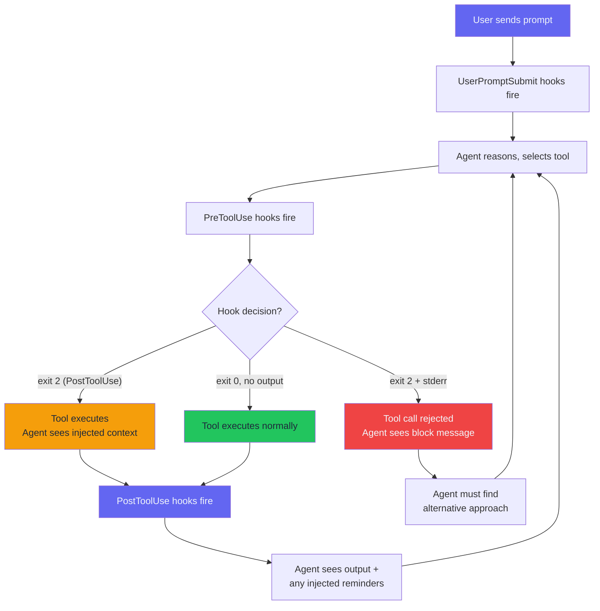
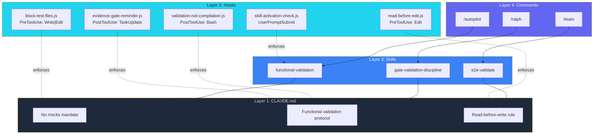

I put "NEVER create test files" in CLAUDE.md. The agents created test files anyway.

Bold formatting, triple emphasis, all-caps warnings. The violation rate dropped but never hit zero. Across 23,479 sessions, the pattern was obvious: text-based instructions are suggestions. Agents deprioritize them when context gets long, when the task gets hairy, when the implementation chain goes deep. It's not defiance — the agent is making trade-offs in a limited context window, and "do not create test files" loses to "I need to verify this function works."

Then I wrote a 72-line JavaScript hook that blocks Write calls to any file matching test patterns. Violation rate: zero. The Write tool call hits the hook, the hook returns exit code 2, and the agent sees a message explaining why the action was rejected. Not a suggestion. A hard stop.

That's the difference between a skill that suggests and a plugin that enforces.

---

## The Gap Between Instructions and Enforcement

Claude Code's plugin system has four extension points: hooks that fire on tool events, skills that provide domain workflows, agents that define specialist roles, and MCP servers that add tool capabilities. Most people use CLAUDE.md and maybe a few skills. Almost nobody builds hooks. That's a mistake.

Across 23,479 sessions, the Skill tool fired 1,370 times. The tool leaderboard: Read fired 87,152 times, Bash fired 82,552 times, Edit fired 19,979 times. For every skill invocation, there were 63 Read calls and 60 Bash calls happening without any skill guidance.

Skills are opt-in. Hooks are mandatory. Every one of those 19,979 Edit calls passed through my PreToolUse hooks. Every one of those 82,552 Bash calls triggered my PostToolUse hooks. The agent doesn't choose to comply. The enforcement layer checks automatically, on every tool call.

---

## One Hook, End to End

Here's what a hook actually does. This is `validation-not-compilation.js` from the [shannon-framework](https://github.com/krzemienski/shannon-framework). It fires after every Bash command, watches for build success, and injects a reminder that "it compiled" is not "it works."

**The problem it solves:** agents conflate build success with feature completion. A clean build means the code is syntactically correct and type-safe. It says nothing about whether the feature does what you asked. Without a hook, the agent runs `npm run build`, sees "compiled successfully," and marks the task done. The feature is broken. Nobody checked.

**The hook source:**

```javascript
// .claude/hooks/validation-not-compilation.js
// PostToolUse — fires after every Bash command
// Purpose: catch agents declaring victory after a build instead of validating behavior

const BUILD_COMMANDS = [
  /npm run build/, /pnpm build/, /yarn build/,
  /cargo build/, /swift build/, /xcodebuild/,
  /go build/, /\bmake\b/, /gradle build/,
  /mvn (compile|package)/, /\btsc\b/, /vite build/,
];

const SUCCESS_INDICATORS = [
  /build succeeded/i, /compiled successfully/i,
  /build complete/i, /\b0 error/i, /✓|✔|success/i,
];

export default function validationNotCompilation({ tool, input, output }) {
  // Only fire on Bash tool calls
  if (tool !== "Bash") return;

  const command = input?.command ?? "";
  const stdout = output?.stdout ?? "";
  const exitCode = output?.exit_code ?? 1;

  // Check if this was a build command
  const isBuildCommand = BUILD_COMMANDS.some((pattern) => pattern.test(command));
  if (!isBuildCommand) return;

  // Check if the build succeeded
  const buildSucceeded =
    exitCode === 0 &&
    SUCCESS_INDICATORS.some((pattern) => pattern.test(stdout));

  if (!buildSucceeded) return;

  // Build succeeded — inject the reminder
  // Return a message; exit code 2 injects it into the agent's context
  process.stderr.write([
    "",
    "BUILD SUCCESS IS NOT FUNCTIONAL VALIDATION.",
    "",
    "A passing build proves syntax and types. It does not prove behavior.",
    "Before marking this task complete:",
    "",
    "  1. Run the app (simulator, browser, or CLI — whichever applies)",
    "  2. Exercise the specific feature you just built",
    "  3. Confirm the user-facing behavior matches the requirement",
    "  4. Capture a screenshot or log as evidence",
    "",
    "If you cannot run the app right now, note that explicitly.",
    "Do not mark complete based on build output alone.",
    "",
  ].join("\n"));
  process.exit(2);
}
```

**Integration via settings.json:**

```json
{
  "hooks": {
    "PostToolUse": [
      {
        "matcher": "Bash",
        "hooks": [
          {
            "type": "command",
            "command": "node .claude/hooks/validation-not-compilation.js"
          }
        ]
      }
    ]
  }
}
```

Drop the file in `.claude/hooks/`, add the entry to `.claude/settings.json`, and the hook fires on every Bash call for every session. No registration, no manifest parsing.

**What it catches in practice:** during a Next.js feature build, an agent ran `pnpm build`, got "Compiled successfully," and started drafting a completion message. The hook fired. The agent spun up the dev server and found a server action returning 500 — an environment variable wasn't set in the test environment. Build: green. Feature: broken. The hook caught it 20 minutes before it would've surfaced in production.

Across 82,552 Bash calls in 23,479 sessions, the hook fired every time a build succeeded. Every time.

---

## The Hook Lifecycle

The plugin system intercepts tool calls at two boundaries: before and after execution. A third event type fires on every user message. The lifecycle for a single tool call:



Three event types, three possible responses. That's the entire hook API:

- **PreToolUse** fires before the tool executes. It can block (write to stderr, exit code 2), warn (inject context and allow), or silently allow (exit 0 with no output).
- **PostToolUse** fires after execution completes. It can inject reminders based on output by writing to stderr and exiting with code 2. It can't block the action already taken, but it shapes what the agent does next.
- **UserPromptSubmit** fires on every user message, before the agent starts reasoning. It can inject workflow requirements or force skill evaluation.

A detail that bit me: a hook that crashes is a silent allow — the tool call proceeds as if no hook existed. A broken hook should never break the agent. But wrap every hook in try/catch, because a silently failing hook is worse than a missing one. At least a missing hook is obvious.

---

## The 4-Layer Enforcement Pyramid

A single enforcement mechanism isn't enough. CLAUDE.md instructions get forgotten. Hooks are too rigid for nuanced decisions. Skills require invocation. Commands require user action. The Shannon Framework — named after Claude Shannon, who proved reliable communication requires redundant encoding — layers all four:



Each layer catches what the previous one misses:

1. **CLAUDE.md** tells the agent what to do. Agents forget. Compliance: ~60%.
2. **Hooks** enforce rules automatically. Can't handle nuanced workflows. Compliance on targeted behaviors: near 100%.
3. **Skills** provide structured workflows with context the agent lacks. They require invocation, and agents skip them under pressure. The `skill-activation-check.js` hook closes this gap.
4. **Commands** give users direct control — the final safety net.

Combined 4-layer compliance: 95%+. The remaining 5% is why you still review the output.

---

## The Other Four Hooks

The Shannon Framework ships five hooks total. `validation-not-compilation.js` is covered above. Here are the other four.

### block-test-files.js — The Hard Stop

PreToolUse on Write, Edit, and MultiEdit. Checks the file path against 12 test patterns. Allows exceptions for Playwright and E2E files (functional validation is fine; unit test harnesses aren't). Violation rate went from non-zero to zero.

```javascript
const TEST_PATTERNS = [
  /\/__tests__\//,
  /\.test\.[jt]sx?$/,
  /\.spec\.[jt]sx?$/,
  /\.mock\.[jt]sx?$/,
  /test_.*\.py$/,
  /.*_test\.py$/,
  /.*_test\.go$/,
  /Tests?\.swift$/,
  /mock[_-]/i,
  /stub[_-]/i,
  /fake[_-]/i,
  /fixture[_-]/i,
];

const ALLOWED_EXCEPTIONS = [/playwright/i, /e2e/i];

export default function blockTestFiles({ tool, input }) {
  if (!["Write", "Edit", "MultiEdit"].includes(tool)) return;

  const filePath = input.file_path || input.filePath || "";
  if (!filePath) return;

  for (const exception of ALLOWED_EXCEPTIONS) {
    if (exception.test(filePath)) return;
  }

  for (const pattern of TEST_PATTERNS) {
    if (pattern.test(filePath)) {
      process.stderr.write([
        `BLOCKED: Cannot create test file: ${filePath}`,
        "",
        "This project uses functional validation, not unit tests.",
        "Instead of writing tests:",
        "  1. Build the real system",
        "  2. Run it in the simulator/browser/CLI",
        "  3. Exercise the feature through the actual UI",
        "  4. Capture screenshots/logs as evidence",
      ].join("\n"));
      process.exit(2);
    }
  }
}
```

Twelve patterns cover JavaScript, TypeScript, Python, Go, and Swift test conventions. Every block message includes actionable guidance — not just "you can't do this" but "do this instead."

### read-before-edit.js — The Context Guardian

PreToolUse on Edit and MultiEdit. Tracks which files have been Read in the current session. When an Edit targets a file not in that Set, the hook warns. It doesn't block — sometimes you need a quick edit. But the warning is specific enough to change behavior.

Before this hook, the Read-to-Edit ratio was close to 2:1. After: 4.4:1. The hook didn't just warn — it changed how agents sequence their work.

### evidence-gate-reminder.js — The Completion Checkpoint

PostToolUse on TaskUpdate. Fires when a subagent marks a task complete. Injects a five-question evidence checklist before the orchestrating agent can rubber-stamp the claim.

```javascript
export default function evidenceGateReminder({ tool, input }) {
  if (tool !== "TaskUpdate") return;
  const status = input.status || "";
  if (!["completed", "complete", "done"].includes(status)) return;

  process.stderr.write([
    "EVIDENCE GATE: Task marked complete. Before accepting, verify:",
    "",
    "  [ ] Did I READ the actual evidence file (not just the report)?",
    "  [ ] Did I VIEW the actual screenshot (not just confirm it exists)?",
    "  [ ] Did I EXAMINE the actual command output (not just exit code)?",
    "  [ ] Can I CITE specific evidence for each validation criterion?",
    "  [ ] Would a skeptical reviewer agree this is complete?",
  ].join("\n"));
  process.exit(2);
}
```

The failure mode: subagents mark tasks complete after a clean build, orchestrating agent accepts without examining evidence, task is "done" but feature is broken. This hook makes that impossible to do silently.

### skill-activation-check.js — The Skill Enforcer

UserPromptSubmit. Watches for implementation-related prompts and reminds the agent to scan the skill list. Bridges Layer 2 (automatic hooks) and Layer 3 (invocable skills). A hook can't invoke a skill on its own — but it can remind the agent that skills exist at the moment the agent is about to start implementing without them.

---

## The stdin/stdout Contract

Every hook follows the same interface regardless of event type. Claude Code spawns the hook script as a child process, writes JSON to its stdin, and reads from its stderr.

**PreToolUse hooks receive:**
```json
{
  "tool": "Write",
  "input": {
    "file_path": "/path/to/file.test.ts",
    "content": "..."
  }
}
```

**PostToolUse hooks receive the same, plus output:**
```json
{
  "tool": "Bash",
  "input": { "command": "npm run build" },
  "output": { "stdout": "Build succeeded", "exit_code": 0 }
}
```

**UserPromptSubmit hooks receive:**
```json
{
  "prompt": "Build a login page with email validation"
}
```

Three possible responses:

```javascript
// Block — prevent the tool call entirely (PreToolUse only)
// Write reason to stderr, exit code 2
process.stderr.write("Explanation for the agent.");
process.exit(2);

// Inject context — tool proceeds, agent sees the message
// Write to stderr, exit code 2 (PostToolUse and UserPromptSubmit)
process.stderr.write("Reminder or warning text.");
process.exit(2);

// Silent allow — exit with no output, tool proceeds normally
process.exit(0);
```

That's the entire API. No registration, no manifest parsing, no framework overhead.

---

## What Breaks and How to Fix It

I've debugged enough hooks to compile a failure catalog.

**Matcher mistakes.** `Write` matches the Write tool. It doesn't match Edit or MultiEdit. If you need all three, use `Write|Edit|MultiEdit`. If your hook isn't firing, check the matcher first.

**Silent crashes.** A hook that throws an unhandled exception produces no output — silent allow. Always wrap everything in try/catch with a `process.exit(0)` fallback. A crashing hook is worse than a missing one because you think you're protected and you're not.

**Performance traps.** Hook scripts have to be fast. Synchronous. Under 100ms. No network calls. I had a hook that validated imports against a remote package registry — added 2 seconds to every Edit call. Moving validation to a PostToolUse hook that batched checks eliminated the latency.

**The hook that cried wolf.** Too many warnings train the agent to ignore them all. Each of my five hooks targets a specific, dangerous behavior with a clear trigger. A hook that warns on every file edit becomes noise. `validation-not-compilation.js` fires only after build commands that succeed, not after every Bash call.

**State management gotchas.** The `read-before-edit.js` hook tracks state in a module-level Set. Works because Claude Code loads hooks once per session and keeps them in memory. Restart the session, the Set is empty. Don't rely on hook state across sessions. Use the filesystem or an MCP server.

---

## Skills: The Structured Workflow Layer

Hooks enforce boundaries. Skills provide workflows. The functional-validation skill in the Shannon Framework is a SKILL.md file, a markdown document with trigger patterns, context, and execution steps:

```
# functional-validation

> Validates features through real system behavior.

## Trigger Patterns
- "validate this"
- "functional validation"
- "prove it works"

## Execution Steps
1. Build the real system (no placeholders, no stubs)
2. Run it in its real environment
3. Exercise through the actual UI
4. Capture evidence (screenshots, logs, responses)
5. Apply gate validation (5-question checklist)
```

When the agent invokes this skill, it loads these instructions into context. The five execution steps become the agent's workflow. The checklist makes sure the agent doesn't skip the evidence phase.

Skills and hooks reinforce each other. The skill tells the agent *how* to validate. The `block-test-files.js` hook prevents shortcuts. The `validation-not-compilation.js` hook catches build success declared as validation. The `evidence-gate-reminder.js` hook catches tasks marked complete without evidence. Together, they create an enforcement surface that's hard to circumvent.

---

## Hooks vs. MCP Servers vs. CLAUDE.md

The decision framework:

**Use CLAUDE.md** for general guidance that doesn't need enforcement. Style preferences, architectural conventions, project context. If 60-70% compliance is enough, CLAUDE.md works.

**Use a hook** when you need to intercept an existing tool call. Block certain Writes, inject warnings after Bash, remind on Edit. Hooks modify existing behavior automatically.

**Use an MCP server** when you need to give the agent a capability it doesn't have. Query a database, search an AST, interact with an LSP server, manage persistent state. MCP servers add new tools.

**Use a skill** for structured, multi-step workflows that carry domain context. Validation protocols, review checklists, deployment procedures. Skills are invocable — pair them with a UserPromptSubmit hook to make sure the agent loads them.

---

## The Shannon Insight

Claude Shannon proved you can transmit information reliably over a noisy channel by adding redundant encoding. Same principle applies here. A single instruction in CLAUDE.md is a signal in a noisy channel. Long context, competing priorities, complex task chains. By the time the agent is deep in an implementation, that instruction is noise.

Redundant encoding means saying the same thing four ways, at four enforcement points:

1. The CLAUDE.md rule says "no test files."
2. The `block-test-files.js` hook blocks test file creation at the tool boundary.
3. The `functional-validation` skill provides an alternative workflow.
4. The `/autopilot` command orchestrates the entire flow including validation.

CLAUDE.md guides the well-behaved agent. The hook stops the forgetful agent. The skill redirects the agent that wants to verify but doesn't know how. The command handles the case where the user needs to drive.

I thought hooks alone would be enough when I first built this. I was wrong. An agent blocked from creating test files doesn't know what to do *instead*. It sits there, confused. The skill layer exists because blocking bad behavior without providing an alternative is only half the solution.

Before hooks, every agent ignored at least two rules per session. After hooks, zero violations on blocked behaviors. The 19,979 Edit calls all passed through `read-before-edit.js`. The 82,552 Bash calls all passed through `validation-not-compilation.js`. Every single call, without me watching, without the agent choosing to comply.

That's what a plugin system is for. Not adding features. Adding discipline.

---

*The [Shannon Framework](https://github.com/krzemienski/shannon-framework) is a reference Claude Code plugin with 5 hooks, 1 skill, and 1 agent template. Install it. Try to create a test file, skip a planning phase, claim completion without evidence. Watch the hooks catch each one before the tool executes. That's the difference between instructions the agent reads and enforcement the agent can't skip.*
