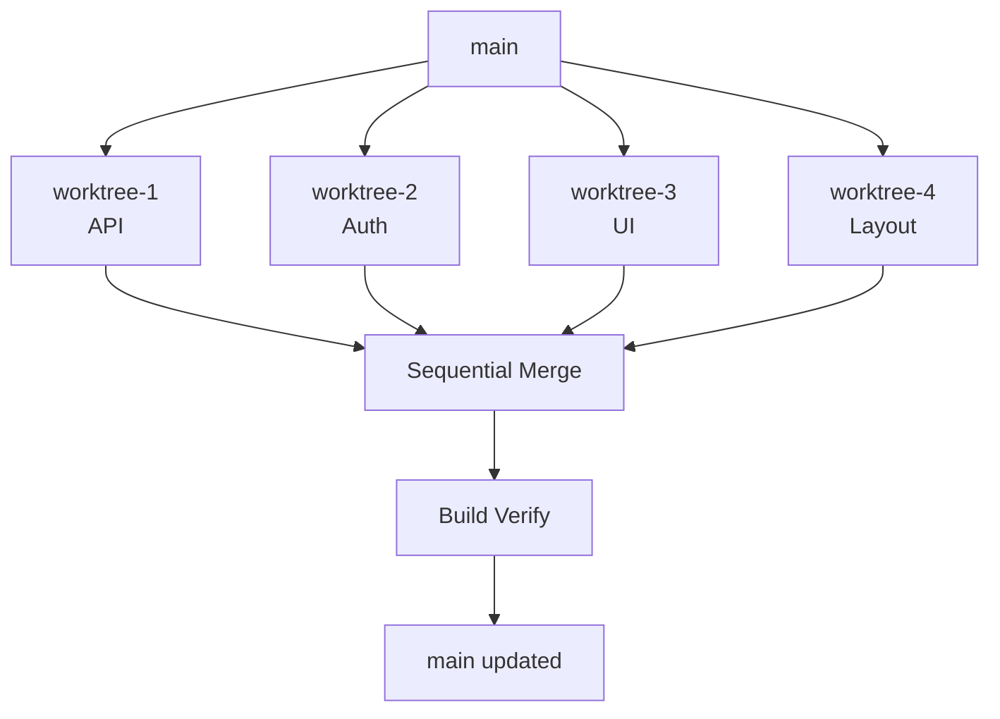

12 AI agents. 35 git worktrees. A codebase being modified in 35 places simultaneously. The merge took 90 seconds with zero conflicts. Here's the choreography that made it possible.

## TL;DR

Naive parallel agent development creates merge chaos. The solution is a strict file ownership matrix enforced at task-assignment time, combined with a dependency-aware merge sequence that runs a build check after each integration. With this architecture, 35 parallel worktrees merged cleanly in 90 seconds — compared to 23 conflicts and hours of manual resolution in my first attempt.

## The Problem I Created for Myself

The awesome-list-site rebuild had gotten large. 147 sessions in, the project spanned authentication, API routes, UI components, layout systems, styling tokens, and documentation — all in a single Next.js 15 repository. Sequential development meant waiting. Each domain depended on adjacent work, but not always in a blocking way. A styling change didn't need to wait for an API endpoint to be finished. Auth middleware didn't care whether the layout components were done.

I wanted to run all of this in parallel. So I did what seemed obvious: I spawned 12 agents and told them to start working.

The merge was catastrophic.

23 conflicts across shared files. Multiple agents had touched `tailwind.config.ts`. Three of them had independently extended `src/types/index.ts` with overlapping additions. Two had modified the same Next.js route handler from different angles. Resolving it took over three hours of manual untangling, and even after that, the build was broken in ways that took another hour to diagnose.

The parallel development dream had turned into a parallel development nightmare. Not because AI agents are bad at writing code — they're exceptional at it. But because I hadn't thought about coordination at the git layer.

## Why Worktrees Are the Right Foundation

Before getting to the ownership system, it's worth explaining why `git worktree` is the right primitive for parallel agent development.

A worktree gives each agent a physically isolated copy of the repository on disk, checked out to its own branch, in its own directory. Agents aren't sharing a working directory. They're not fighting over file locks. Each one operates in complete isolation at the filesystem level.

Creating a worktree takes about 3 seconds:

```bash
git worktree add .worktrees/agent-01 -b feature/agent-01-api HEAD
```

That single command gives you a new directory — `.worktrees/agent-01` — that is a full checkout of the repository on a new branch called `feature/agent-01-api`. The agent working in that directory is completely independent of every other agent.

With 35 worktrees running concurrently, you have 35 isolated development environments all forked from the same commit. The isolation is real. The problem is that isolation alone doesn't solve merging — it just defers the conflict until you try to bring everything back together.

## The File Ownership Matrix

The core insight was that merge conflicts happen when two agents modify the same file. If you can guarantee that no two agents ever touch the same file, you structurally eliminate the conflict category.

This isn't a soft guideline. It's an enforced constraint:

```python
ownership = {
    "agent-1":  ["src/api/**", "src/models/**"],
    "agent-2":  ["src/auth/**", "src/middleware/**"],
    "agent-3":  ["src/components/ui/**"],
    "agent-4":  ["src/components/layout/**"],
    "agent-5":  ["src/styles/**", "tailwind.config.ts"],
    "agent-6":  ["src/types/**", "src/lib/**"],
    "agent-7":  ["src/app/(routes)/**"],
    "agent-8":  ["src/app/(auth)/**"],
    "agent-9":  ["src/hooks/**", "src/context/**"],
    "agent-10": ["src/utils/**", "src/constants/**"],
    "agent-11": ["docs/**", "*.md"],
    "agent-12": ["tests/**", "playwright.config.ts"],
}

def validate_ownership(agent_id, file_path):
    patterns = ownership[agent_id]
    if not any(fnmatch(file_path, p) for p in patterns):
        raise OwnershipViolation(f"{agent_id} cannot modify {file_path}")
```

The `validate_ownership` function runs at task assignment time, not at merge time. Before any agent starts working on a task, the orchestrator checks whether the files the task requires are within that agent's designated ownership zone. If they're not, the task gets routed to the correct owner.

This sounds like it would create bottlenecks — what if agent-5 is busy and there's styling work waiting? In practice, the domain boundaries aligned well enough with the natural task decomposition that bottlenecks were rare. And when they did occur, a temporary zone expansion (with explicit logging) was far cheaper than a merge conflict.

## Conflict Prediction Before Work Starts

Even with ownership enforcement, there are legitimate cases where two agents touch adjacent infrastructure. The `package.json`, for example, might be modified by an agent adding a dependency. If two agents both add dependencies, you get a conflict even though neither is "wrong."

Before assigning tasks, I added a conflict prediction pass:

```python
def predict_conflicts(worktrees):
    conflicts = []
    for a, b in combinations(worktrees, 2):
        diff_a = git_diff(a.branch, a.base)
        diff_b = git_diff(b.branch, b.base)
        shared_files = set(diff_a.files) & set(diff_b.files)
        if shared_files:
            conflicts.append((a, b, shared_files))
    return conflicts
```

This runs a `git diff` against the merge base for each worktree pair and flags any files that appear in both diffs. If the prediction returns conflicts, the orchestrator either serializes those specific tasks or assigns a designated "integrator" agent to handle the shared file as a separate post-task.

For `package.json`, I settled on a simple rule: no agent touches it directly. All dependency additions go through a dependency manifest file that a single reconciler agent resolves into a final `package.json` at merge time. One agent, one file, zero conflicts.

## The Sequential Merge Choreography

The merge sequence is where the architecture pays off. With file ownership enforced and conflicts pre-predicted, the merge can proceed sequentially through a dependency-ordered list of branches:



The merge itself is straightforward:

```python
merge_order = topological_sort(dependency_graph)

for branch in merge_order:
    result = git_merge(branch, strategy="ours-then-theirs")
    if result.conflicts:
        resolve_with_ownership(result.conflicts, ownership)
    run_build_check()  # Verify after each merge
```

`topological_sort` on the dependency graph ensures that foundational branches (types, models, utilities) merge before the branches that depend on them. Auth merges before routes. Types merge before everything. UI components merge before layout, because layout composes UI components.

The `resolve_with_ownership` function handles the rare cases where prediction missed something. Given a conflict, it checks the ownership matrix to determine which agent is the authoritative owner of that file and applies their version. This is deterministic and requires no human judgment.

The `run_build_check()` after each merge is the safety net that makes the whole system trustworthy. Two integration issues were caught during the 35-worktree merge — cases where the types agent had changed an interface signature and the API agent's usage was now incompatible. The build check caught them at the point of merge, before they compounded with the remaining branches.

## What the Numbers Look Like

The naive approach: 23 conflicts, 3+ hours of manual resolution, broken build requiring another hour of diagnosis.

The ownership-plus-choreography approach: 0 conflicts, 90-second merge, 2 integration issues caught automatically by build checks.

The 12 agents completed their tasks in an average of 12 minutes running in parallel. The equivalent sequential execution would have taken approximately 2.5 hours. The overhead of setting up the ownership matrix and worktree factory was about 20 minutes of upfront orchestration work.

Net time for the parallel approach: ~32 minutes (12 parallel + 20 setup).
Net time for sequential: ~150 minutes.

That's a 4.7x speedup on actual elapsed time, not accounting for the conflict resolution time saved.

Worth being precise about what those numbers represent: the 12-minute average per agent includes reading the task description, understanding context from the worktree, writing code, running a local build check, and committing. These weren't trivial tasks — auth middleware, API route handlers, typed model definitions. The parallelism was real, and so was the work.

## What Makes This Fragile (and How to Harden It)

A few things can break the model:

**Shared configuration files.** `tsconfig.json`, `.eslintrc`, environment type declarations — these are easy to forget when drawing ownership boundaries. The fix is explicit: at setup time, list every file in the repo and assign it to exactly one agent or flag it as "no-touch." Nothing should be unowned.

**Implicit dependencies.** An agent modifies a utility function used by code another agent owns. No file conflict, but a behavioral regression. This is why the build check after each merge exists — it catches these by actually running the integration, not just inspecting file diffs.

**Late-discovered scope.** An agent realizes mid-task that it needs to modify a file outside its zone. The correct response is to stop, flag the issue to the orchestrator, and get a zone extension or task re-routing. The wrong response is to just modify the file anyway. Enforcing the ownership check programmatically prevents the wrong response even when agents are operating autonomously.

**Branch drift.** If worktrees are long-lived (more than a day or two), the merge base drifts. Branches that started from the same commit become progressively more expensive to integrate. The fix is short task cycles — each agent should be completing its work and merging within a few hours, not days.

## The Upfront Investment

None of this is free. Before the first agent starts, you need:

1. A complete file ownership assignment covering every file in the repo
2. A dependency graph between ownership zones (auth depends on types, routes depend on auth, etc.)
3. A worktree factory that can spin up an isolated environment in 3 seconds
4. A merge script with topological ordering and post-merge build checks
5. A conflict prediction pass that runs before work assignment

For the awesome-list-site rebuild, this setup took about half a day. That investment paid back immediately on the first merge run, and compounded across the subsequent parallel sessions.

## The Mental Model Shift

The key realization was that parallel agent development isn't primarily a coding problem — it's a coordination problem with a git-flavored solution.

AI agents are already good at writing code in isolation. The constraint is the merge layer. If you treat the merge layer as the primary design surface and engineer it explicitly, parallel development becomes reliable and fast. If you treat it as an afterthought and try to resolve conflicts after the fact, you're doing manual work that scales linearly with the number of agents.

The 90-second merge wasn't luck. It was architecture. Twelve agents working in 35 worktrees, each with a clearly defined territory, merging in dependency order with build verification at each step. Every second of that 90-second merge was deterministic and planned.

If you're running more than two or three agents on a shared codebase, you need this kind of coordination infrastructure. The alternative is the 23-conflict disaster I ran into on my first attempt — and that's a path I'd recommend against.

Build the choreography first. Then let the agents dance.
