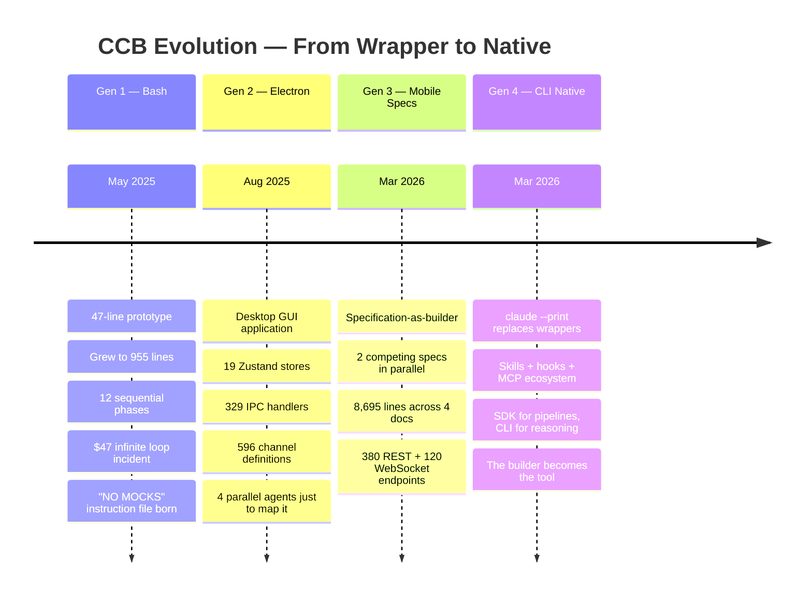
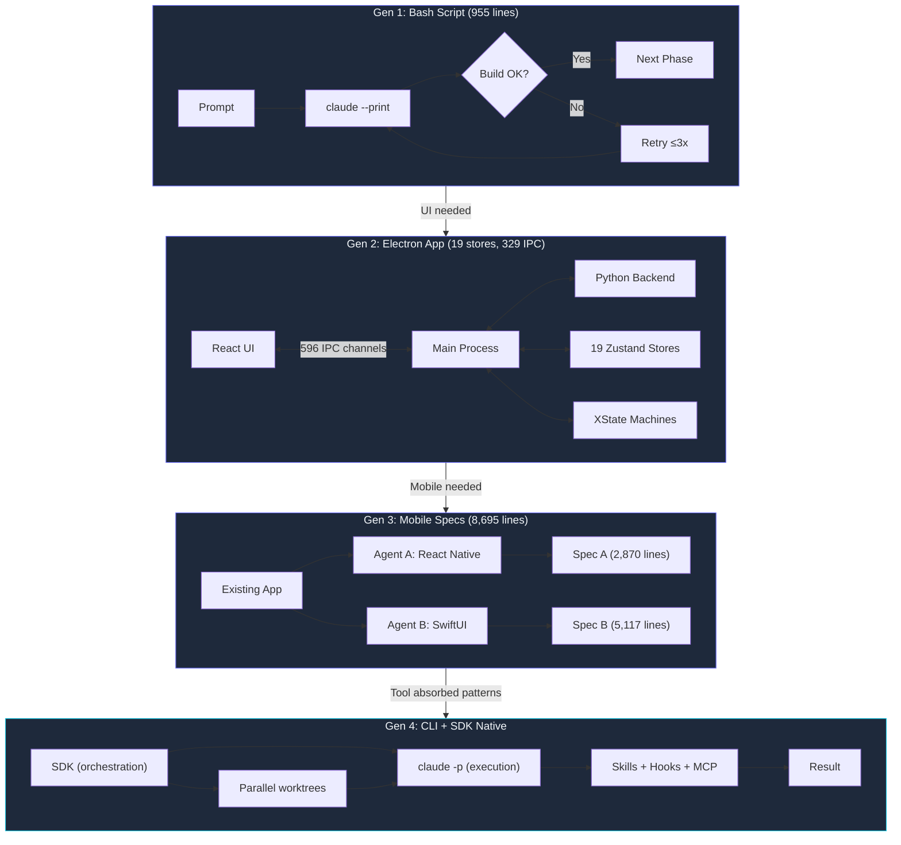

I woke up to a $47 bill and an infinite loop.

The script had run all night. A type error in phase 7 of 12. Retry logic had no ceiling. Claude kept attempting the same fix, each retry consuming another API call. By 7 AM, 200+ API calls on a single phase and code that still didn't compile. I'd built a system that failed expensively instead of failing fast.

That incident, May 2025, produced the three-line fix that survived every generation after it:

```bash
MAX_RETRIES=3
if [ "$retry_count" -ge "$MAX_RETRIES" ]; then
    echo "Phase $phase failed after $MAX_RETRIES attempts. Escalating to human."
    exit 1
fi
```

Maximum 3 retries per phase, then escalate. Bounded loops became the foundational principle for 23,479 sessions across 42 days. The $47 paid for itself the first week.

Four generations followed. A bash script that grew to 955 lines. An Electron app with 19 Zustand stores and 329 IPC handlers. A pair of competing mobile specs totaling 8,695 lines. And the realization that the best builder is the one you don't have to build at all.



---

### Generation 1: The ccb Bash Script

**Architectural decision:** pipe prompts to `claude --print` as a subprocess, check exit codes, chain phases sequentially.

**What it did that nothing before it did:** ran Claude non-interactively. `claude --print` could take a prompt on stdin and return output on stdout, making it scriptable. Everything else — phase chaining, state persistence, model routing — followed from that one capability.

**What it couldn't do:** recover from failure without starting over. State persistence was bolted on as an afterthought. The $47 loop existed because retry logic had no ceiling. No UI, no logs beyond stdout, no way to pause a running build.

The 47-line prototype grew to 955 lines. `cc-ccb-builder-script-old.sh` ran 12 phases sequentially. Before any code ran, there was `ccb-ai-instructions.md` — 389 lines establishing rules I still follow today:

```
NO UNIT TESTS
NO TEST FRAMEWORKS
NO MOCKS
Only functional validation by running the actual built CLI tool
```

That instruction file wasn't born from philosophy — it was born from rage. The agents kept writing tests that passed while the actual CLI was broken. I got tired of shipping software with "100% test coverage" that crashed on launch.

The core function:

```bash
run_claude_auto() {
    local phase="$1"
    local prompt="$2"
    local model="${3:-claude-opus-4}"
    local max_turns="${4:-30}"

    echo "=== Phase: $phase ==="
    save_state "$phase" "in_progress"

    result=$(echo "$prompt" | claude \
        --print \
        --model "$model" \
        --mcp-config .mcp.json \
        --allowedTools "Edit,Write,Bash,Glob,Grep,Read" \
        --dangerously-skip-permissions \
        --max-turns "$max_turns" \
        2>&1)

    exit_code=$?
    if [ $exit_code -eq 0 ]; then
        save_state "$phase" "completed"
        echo "$result"
    else
        save_state "$phase" "failed"
        return 1
    fi
}
```

State persistence was critical. If phase 7 of 12 failed, I could resume from phase 7 instead of re-running the 6 completed phases:

```bash
save_state() {
    local phase="$1"
    local status="$2"
    echo "{\"phase\": \"$phase\", \"status\": \"$status\", \
\"timestamp\": \"$(date -u +%Y-%m-%dT%H:%M:%SZ)\"}" \
        > ".ccb-state/${phase}.json"
}
```

The original ccb also introduced dual model routing. `run_claude_auto()` accepted a model parameter, defaulting to `claude-opus-4` for complex phases, `claude-sonnet-4` for simpler ones. Architecture and refactoring went to Opus. File creation, boilerplate, and config went to Sonnet. Sonnet handled 60% of phases at a fraction of the token cost.

**The failure mode that forced the next generation:** the bash script had no UI. A 12-phase build meant watching a terminal scroll for 45 minutes with no way to pause, redirect, or see what the agent was doing inside each phase. When the team grew beyond one person, this became untenable.

---

### Generation 2: Auto-Claude Electron

**Architectural decision:** wrap the CLI orchestration in an Electron app with a React frontend, bidirectional IPC, and Zustand state management.

**What it did that Generation 1 didn't:** you could watch the build happen. Real-time log streaming, phase status panels, pause mid-build and inject guidance. The Electron main process managed the Claude subprocess lifecycle; the renderer displayed state.

**What it couldn't do:** stay comprehensible as it grew. Every new capability required touching stores, handlers, channels, and state machines in lockstep. A single feature might need changes in 6 files across 3 layers.

The numbers: 19 Zustand stores managing application state. 329 `ipcMain.handle()` registrations. 596 IPC channel definitions. XState state machines orchestrating multi-step workflows. Version 2.7.6 by the time it stabilized.

To wrap my head around it, I deployed 4 parallel exploration agents:

1. **"Explore IPC channels & handlers"** — mapped 200+ IPC channels
2. **"Explore stores & state machines"** — inventoried the 19 Zustand stores
3. **"Explore backend API surface"** — mapped the Python backend
4. **"Explore shared types & design"** — cataloged shared type definitions

Each agent ran independently with `claude -p`, reporting a structured inventory. Parallel exploration before implementation became standard practice. No single agent could hold 19 stores and 596 channels in context.

State management cost grows superlinearly with features. A single feature needed changes in 6 files, and reasoning about the interactions exceeded any single context window.

**The failure mode that forced the next generation:** the architecture had grown beyond any single context window. Understanding it required multiple agents. Building on it required multiple agents. And the target platform had shifted — mobile was next, and Electron couldn't go there.



---

### Generation 3: Mobile Specs

**Architectural decision:** instead of building another application wrapper, generate specifications detailed enough that agents can implement from them without asking questions.

**What it did that Generation 2 didn't:** moved the intelligence upstream. Rather than a runtime that orchestrates agents, a process that produces the contracts agents execute against. Two parallel `claude-opus-4-6` agents generated competing mobile specs:

- `spec-a-react-native-expo.md`: 2,870 lines covering the React Native approach
- `spec-b-swiftui-native.md`: 5,117 lines covering the native SwiftUI approach
- `api-gateway-design.md`: 635 lines defining the backend contract

Total: 8,695 lines across 4 documents. Channel mapping identified 380 REST endpoints, 120 WebSocket channels, and 96 Electron-only channels that could be excluded from mobile. Each spec included 17 screen wireframes with ASCII layouts, component hierarchies, and navigation flows. 4 XState machine ports translated desktop state management to mobile patterns.

The specs weren't documentation. They were instructions detailed enough that another agent could implement without asking questions. Two agents produced it in parallel in hours — the kind of systematic analysis that would take a human architect weeks.

I stopped thinking about builders as programs and started thinking about them as processes. The bash script and Electron app were programs. The specs were a process: analyze, generate competing approaches, compare, select. The builder was a workflow, not an artifact.

**The failure mode that forced the next generation:** specs require a human to select between approaches and commission implementation. The loop from spec to running code still had manual steps. Meanwhile, Claude Code's CLI was absorbing the capabilities that made external orchestration necessary.

---

### Generation 4: Claude Code CLI Native

**Architectural decision:** stop wrapping the tool. Use `claude --print` for subprocess execution as in Generation 1, but lean on the CLI's native ecosystem — skills, hooks, MCP servers, bounded execution — instead of building orchestration infrastructure.

**What it did that every previous generation didn't:** the builder became the tool itself.

The CLI gained `--print` for non-interactive execution, `--mcp-config` for external tool integration, `--allowedTools` for permission scoping, `--max-turns` for bounded execution. Skills for reusable workflows, hooks for enforcement.

`hat-rotation.sh` from the [claude-code-monorepo](https://github.com/krzemienski/claude-code-monorepo) is the ccb bash script distilled:

```bash
# Phase 1: Planner Hat
PLAN=$(claude -p "
You are wearing the PLANNER hat. Your only job is to plan, not implement.
Feature request: ${FEATURE}
Produce a numbered implementation plan with:
1. Files to create or modify (full paths)
2. Functions/types to add
3. Dependencies between steps
Output ONLY the plan. Do not write any code.
")

# Phase 2: Builder Hat
BUILD_OUTPUT=$(claude -p "
You are wearing the BUILDER hat. Your only job is to implement, not plan or review.
Implementation plan:
${PLAN}
Implement each step. Write production-ready code with proper error handling.
")

# Phase 3: Reviewer Hat
REVIEW=$(claude -p "
You are wearing the REVIEWER hat. Your only job is to find problems, not fix them.
Review for: logic errors, security vulnerabilities, deviations from plan.
Rate each finding: CRITICAL / HIGH / MEDIUM / LOW
")

# Phase 4: Fixer Hat (conditional)
if echo "$REVIEW" | grep -qi "CRITICAL\|HIGH"; then
  claude -p "Fix ONLY the CRITICAL and HIGH severity issues."
fi
```

Four phases. Four hats. Each Claude invocation gets a constrained role, output of each phase feeds the next. The fixer phase is conditional: if the reviewer finds nothing critical, the pipeline exits early. This is `run_claude_auto()` from 2025, minus 900 lines of orchestration overhead.

The parallel worktree pattern went through the same compression. The original auto-claude-worktrees Python package managed worktree lifecycle, conflict detection, and merge orchestration in hundreds of lines. The CLI version is 75:

```bash
for i in "${!TASKS[@]}"; do
  task="${TASKS[$i]}"
  branch="task-${i}-$(echo "$task" | tr ' ' '-' | head -c 30)"
  wt_path="${WORKTREE_DIR}/${branch}"

  git worktree add -b "$branch" "$wt_path" "$BASE_BRANCH"

  (
    cd "$wt_path"
    claude -p "Complete this task: ${task}" > "$result_file" 2>&1
  ) &

  PIDS+=($!)
done

for i in "${!PIDS[@]}"; do
  wait "${PIDS[$i]}" || FAILED=$((FAILED + 1))
done
```

Create a worktree. Spawn a Claude session. Background it. Wait. Report. The 194 parallel agents in Post 6 ran on a more elaborate version of this same pattern.

**What's still unsolved in Generation 4:** the SDK layer handles programmatic control (custom tool schemas, structured output, cost accounting, CI/CD integration) better than the CLI. Most real work ends up hybrid: SDK orchestrating CLI sessions. The boundary is the decision framework in Post 18.

---

## The SDK Layer: When Bash Isn't Enough

Generation 4 isn't just CLI. When you need programmatic control, the Anthropic SDK provides what bash can't.

Here's the SDK equivalent of hat rotation from `multi-agent-pipeline.ts` in the companion repo:

```typescript
const roles: AgentRole[] = [
  {
    name: "planner",
    systemPrompt: `You are a planning agent. Given a feature request,
produce a structured implementation plan with numbered steps.`,
  },
  {
    name: "implementer",
    systemPrompt: `You are an implementation agent. Given a plan,
produce the actual TypeScript code for each file listed.`,
  },
  {
    name: "reviewer",
    systemPrompt: `You are a code review agent. Review for logic errors,
security vulnerabilities, performance concerns. Rate: CRITICAL/HIGH/MEDIUM/LOW.`,
  },
];

async function runPipeline(featureRequest: string): Promise<PipelineResult[]> {
  const plan = await runAgent(roles[0], featureRequest);
  const implementation = await runAgent(roles[1], `Implement:\n\n${plan}`);
  const review = await runAgent(roles[2], `Review:\n\n${implementation}`);
  return [
    { role: "planner", output: plan },
    { role: "implementer", output: implementation },
    { role: "reviewer", output: review },
  ];
}
```

Same pipeline, different language. The SDK version gives you typed interfaces, try/catch error handling, and the ability to embed the pipeline in a larger application. The CLI version gives you session context, built-in tools, and extended thinking for complex reasoning.

The `decision-matrix.ts` in the repo codifies when to use which:

```typescript
export function recommend(task: TaskCharacteristics): DecisionResult {
  let sdkScore = 0;
  let cliScore = 0;

  if (task.isBatchOrPipeline) sdkScore += 3;
  if (task.isCiCdIntegration) sdkScore += 3;
  if (task.requiresCustomTools) sdkScore += 2;

  if (task.isMultiFileRefactor) cliScore += 3;
  if (task.requiresComplexReasoning) cliScore += 3;
  if (task.isExploratoryOrCreative) cliScore += 2;

  const sdkRatio = sdkScore / (sdkScore + cliScore);
  if (sdkRatio > 0.65) return { recommendation: "sdk", ... };
  if (sdkRatio < 0.35) return { recommendation: "cli", ... };
  return { recommendation: "hybrid", ... };
}
```

Batch processing, CI/CD, custom tool schemas: SDK. Multi-file refactoring, complex reasoning, exploration: CLI. Most real work falls in the hybrid zone.

---

## What Each Generation Taught

**Generation 1 (ccb bash, 955 lines): Bounded loops and the NO MOCKS principle.**
The $47 infinite loop created the "max 3 retries then escalate" rule. `ccb-ai-instructions.md` established functional validation in May 2025, 10 months before this blog series. Agents that write tests write tests that pass while the product is broken. Test pass rates are easy to game.

**Generation 2 (Auto-Claude Electron, 19 stores / 329 IPC / 596 channels): Context window limits are architectural constraints.**
Desktop applications accumulate state management complexity that AI agents struggle to hold in context. 4 parallel exploration agents were needed just to map the architecture. If understanding the system requires multiple agents, building on it will too.

**Generation 3 (Mobile specs, 8,695 lines across 4 docs): Specifications are executable contracts.**
Instead of another wrapper, generate specs detailed enough that agents can implement without asking questions. 17 screen wireframes, 380 REST endpoints, 4 XState machine ports — all produced by parallel Opus agents analyzing the existing application. The builder is a process, not a program.

**Generation 4 (Claude Code CLI + SDK): The builder should be the tool itself.**
When the CLI absorbed skills, hooks, MCP servers, and bounded execution, external wrappers became overhead. The ccb bash script's `run_claude_auto()` function is what Claude Code does natively now: run a prompt with tools, bound the turns, check the result.

---

## The Compression Story

12 phases in Generation 1. Hundreds of IPC channels in Generation 2. 4 specification documents in Generation 3. A single `claude -p` call in Generation 4. Each generation distilled the previous as patterns stabilized and the tool absorbed what the wrappers had proven.

This compression isn't about lines of code. It's about where the complexity lives. Generation 1 put orchestration in bash. Generation 2 in Electron. Generation 3 in specification documents. Generation 4 distributes it across the tool's plugin ecosystem: skills for workflows, hooks for enforcement, MCP servers for tool integration. The complexity migrated from application code into platform infrastructure.

My current environment has 217 skills, 94 installed plugins, and 31 hook files. Every artifact exists because a previous generation builder taught me something that needed to be formalized. The "NO MOCKS" rule from `ccb-ai-instructions.md` became a PreToolUse hook that blocks test file creation. The bounded retry logic became `--max-turns`. The dual model routing became explicit `model` parameters on Task calls.

The `ccb-ai-instructions.md` file still sits in the original repo. Written May 2025. 389 lines. Every principle I've spent 23,479 sessions validating: no mocks, no test frameworks, functional validation only, bounded retries, state persistence between phases. Ten months and four generations later, I haven't changed a rule. I've only found better ways to enforce them.

The best builder isn't a bigger builder. It's a tool that has absorbed what the builder taught.

---

*The [claude-code-monorepo](https://github.com/krzemienski/claude-code-monorepo) packages the evolution: the original ccb bash patterns in `hat-rotation.sh`, the parallel worktree approach in `worktree-parallel.sh`, and the SDK pipeline in `multi-agent-pipeline.ts`. Three generations of builder patterns distilled into reference implementations. The bash script taught us that agents need bounded loops. The Electron app taught us that agents need manageable context. The specs taught us that agents can design what they can't hold in memory. The CLI taught us that the best builder is no builder at all.*
