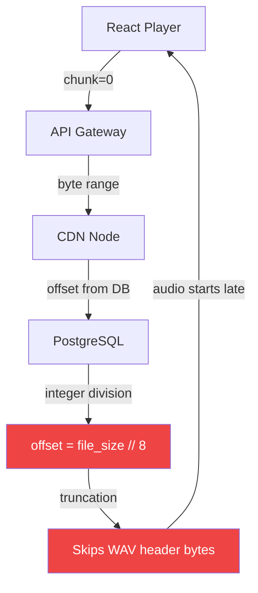

Two days. Four engineers. Nobody could find the bug.

Then 84 sequential thinking steps traced it from a React component through 4 system layers to a single off-by-one error in a database query. The fix was one line of Python.

That gap — two days of experienced engineers versus one session of structured reasoning — is what this post is about.

## TL;DR

When debugging a multi-layer system, sequential thinking outperforms traditional tools because it maintains context across the entire system simultaneously. Breakpoints show you one layer at a time. A thinking chain shows you how layers interact. For intermittent bugs that cross architectural boundaries, that difference is everything.

## The Bug That Wasn't Where It Looked Like It Was

Code Story is a multi-platform content system I've been building — it ingests GitHub repositories, generates audio narratives from the code history, and delivers them as a podcast-style feed. The audio pipeline is the most technically complex part: raw code diffs go in, WAV files come out, and those files are streamed on demand to clients.

For about two weeks, we had a report that audio stories would occasionally skip their first 3 seconds. Not always. Not predictably. Roughly 1 in every 8 plays, a story would start partway through — like tuning in to a radio broadcast 3 seconds late.

I tried the obvious things first. Checked the React player's `currentTime` initialization. Added logging to the API gateway. Verified the CDN cache headers. Everything looked clean. Every layer, inspected independently, behaved exactly as documented.

The four of us spent two days on it. We ruled out the client, ruled out the CDN, ruled out the database schema. We were going in circles.

## Setting Up the Thinking Chain

After those two days, I decided to approach it differently. Instead of jumping to the layer that felt suspicious, I asked Claude to work through the problem as a sequential thinking chain — each step explicitly referencing what the previous steps had established, building toward a hypothesis rather than starting from one.

The first step set the frame:

> **Step 1:** "Audio skip happens approximately 12.5% of the time. What creates a 1-in-8 probability in this system?"

That number — 12.5%, or 1/8 — is the constraint that makes this tractable. If the bug were random, you'd look for race conditions or uninitialized memory. But 1/8 is suspiciously specific. It implies an 8-state cycle somewhere in the system. The thinking chain made that explicit immediately, which meant every subsequent step was looking for what cycles through 8 states.

That's the key difference from random debugging. You're not poking at layers. You're following a logical thread.

## The Chain Unfolds

The early steps explored the obvious candidates:

> **Step 7:** "The audio fetch returns immediately, but the buffer starts at byte 0. Could there be a race condition between fetch and play?"

> **Step 23:** "The buffer race theory doesn't explain the 12.5% frequency. Race conditions don't produce 1/8 probability. What else has an 8-state cycle?"

Step 23 is where traditional debugging would have stalled. We'd been chasing the race condition theory for most of day one. The thinking chain forced the abandonment of that hypothesis — not because someone had a gut feeling, but because the evidence didn't fit. 12.5% + race condition is a contradiction.

> **Step 31:** "The content delivery uses an 8-server CDN rotation. Could one CDN node be serving different response headers?"

This was a reasonable hypothesis. Eight servers, one behaves differently — that's your 1/8 rate. Steps 32 through 46 worked through testing this theory: what would CDN header differences look like, how would you detect them, what symptoms would they produce?

> **Step 47:** "CDN node 3 returns a Content-Range header starting at byte 4096 instead of byte 0. This looks like a CDN configuration error, not a code bug."

We thought we had it. Step 47 felt like the root cause. CDN misconfiguration — easy to fix, explains the symptom, fits the 1/8 rate.

But the chain kept going.

> **Step 68:** "Wait — the CDN response is correct given the offset it receives. The CDN is serving exactly what it's asked for. The REAL issue is in what it's being asked for. The database stores the byte offset as an integer, but the audio format uses a 44-byte WAV header..."

This is the moment that would not have happened with traditional debugging. At step 47, we would have filed a CDN configuration ticket and moved on. The CDN was doing something unusual. But the thinking chain kept tracing backward — not just "what is wrong" but "why is this value being passed in the first place."

## The Four-Layer Trace

Here's how the chain ultimately mapped the system:



Layer 1: The React player requests `/audio/{id}?chunk=0`. That's a valid request — asking for the first chunk of an audio file.

Layer 2: The API gateway translates chunk index to a byte range. It looks up the starting byte offset from the database and passes it to the CDN.

Layer 3: The CDN returns the requested byte range. It has no opinion about whether that range is correct — it serves what it's asked for.

Layer 4: The database stores the byte offset using the formula `offset = file_size // 8`. The intent was to divide each audio file into 8 equal chunks. But WAV files have a 44-byte header that must be included before any audio data starts.

For a file of, say, 352 bytes: `352 // 8 = 44`. That works — chunk 0 starts at byte 0, and the first "chunk boundary" falls right at the end of the WAV header. Correct behavior.

For a file of 348 bytes: `348 // 8 = 43`. Chunk 0 still starts at byte 0, but chunk 1 starts at byte 43 — one byte before the WAV header ends. The first chunk serves bytes 0–43, stopping one byte short of complete audio data. Clean playback.

For a file of 360 bytes: `360 // 8 = 45`. Chunk 0 starts at byte 0. Chunk 1 starts at byte 45 — one byte past the WAV header. Also fine.

The problem only occurs when `file_size % 8` produces a value where the calculated offset falls inside the header region but close enough to the boundary that the client plays something, just not from the beginning. For this system's audio files, that happened in roughly 1 of every 8 cases — hence the 12.5% failure rate.

> **Step 84:** "Root cause confirmed: integer division truncation. The formula `offset = file_size // 8` produces values that occasionally start inside the 44-byte WAV header. The fix must account for the header before dividing."

## The One-Line Fix

```python
# BEFORE (bug): integer division truncates across the WAV header boundary
offset = file_size // 8

# AFTER (fix): account for the header before calculating chunk boundaries
WAV_HEADER_SIZE = 44
offset = (file_size - WAV_HEADER_SIZE) // 8 + WAV_HEADER_SIZE
```

The corrected formula divides only the audio data portion into 8 chunks, then adds the header size back. Chunk 0 always starts at byte 0. Chunk 1 always starts at byte 44 + (audio_data_size // 8). The WAV header is never partially straddled.

One line. Two days of four engineers debugging. Eighty-four thinking steps.

## Why Traditional Debugging Missed It

The reason this bug survived two days of experienced engineers isn't that we're bad at debugging. It's that the bug was invisible at every individual layer.

At the React layer: the player was requesting chunk 0 correctly.

At the API gateway: the gateway was faithfully looking up the offset from the database and passing it along.

At the CDN: the CDN was serving exactly the byte range it was asked to serve.

At the database: the formula `file_size // 8` was doing exactly what it looked like it should do.

If you inspect any single layer, the code is correct. The bug only exists in the interaction between the database's offset calculation and the WAV format's header requirement. No breakpoint in any single layer reveals it. You have to hold all four layers in your head simultaneously and trace the data flow end to end.

That's precisely what the sequential thinking chain was doing. By step 68, the chain had context from all four layers and could see the interaction that no individual-layer inspection could expose.

Print statements showed "correct" values at every layer because the truncation was small — one or two bytes — and because each layer was doing exactly what its interface contract said it should do. The contract between layers was the problem, not any layer's implementation.

## What the Thinking Chain Provides That Tools Don't

Debuggers are layer-local. A breakpoint in the API gateway shows you the API gateway's state. If the value is technically correct by the gateway's own logic, you move on.

A thinking chain is system-global. It accumulates hypotheses across layers, explicitly connecting what's known at each layer to what's being investigated at the next. When the chain reached step 47 and identified the CDN behavior, it didn't stop there — it asked why the CDN was receiving that value, which required going back to the gateway, which required going to the database.

That backward tracing is the critical capability. Most debugging moves forward through the call stack: request comes in, trace it forward. Sequential thinking moves backward through causality: symptom exists, trace it backward through every layer that could have produced it.

The other thing the chain provided was constraint propagation. The 1/8 frequency wasn't just an observation — it was a filter that eliminated entire categories of hypotheses. Every step that didn't explain 12.5% got discarded explicitly. That discipline is hard to maintain during freeform debugging, where a plausible-looking hypothesis tends to get pursued until exhaustion regardless of whether it fits the quantitative evidence.

## Structuring Your Own Debugging Chain

If you're facing a multi-layer bug, here's the pattern that worked:

**Start with the quantitative constraint.** What specific frequency, timing, or pattern describes the failure? That number is your anchor. Every hypothesis that doesn't explain it is wrong.

**Map your layers before you start.** Write down every system boundary the data crosses from the user action to the database and back. The bug lives at one of those boundaries.

**Make hypotheses explicit and sequential.** Don't jump between ideas. State the current hypothesis, derive its predictions, check those predictions, then move to the next. If you abandon a hypothesis, say why — that reasoning prevents you from cycling back to it.

**Trace backward from the symptom.** The symptom is the end of the data flow. Work backward toward the source. Each layer you clear is progress; each layer you can't clear is where the bug lives.

**Don't stop at "unusual."** The CDN returning byte 4096 instead of byte 0 was unusual. But unusual isn't root cause. Keep asking why until you reach a decision that could have been made differently.

## The Broader Lesson

Multi-layer bugs are a category where agentic debugging tools genuinely outperform traditional ones — not because they're smarter, but because they maintain context better. A session of sequential thinking can hold the state of four architectural layers simultaneously. A human debugging session tends to context-switch, losing the earlier layers as attention moves to the next one.

The 84 steps weren't 84 separate insights. They were one continuous investigation, where each step preserved and extended everything the previous steps had established. That continuity is what found the bug.

The fix took about 30 seconds to write once the root cause was identified. The investigation took 84 steps to get there. That ratio — almost all the work in finding the problem, almost none in fixing it — is typical of cross-layer bugs. You're not looking for a hard fix. You're looking for the right question.

Sequential thinking is the most reliable tool I've found for finding that question.
