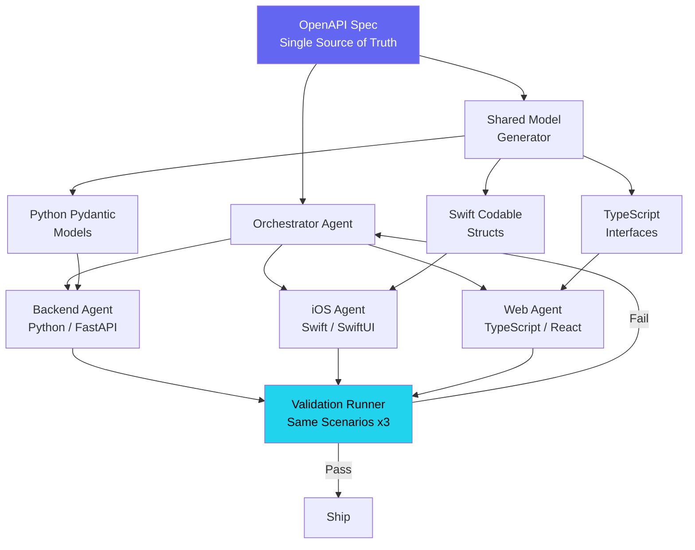

The auth feature took 14 hours to ship across all three platforms. Three weeks earlier, the same category of feature — login flow with token refresh and session persistence — had taken four days.

The difference was not that the code got simpler. The difference was that I stopped treating the backend, the iOS app, and the web client as three separate projects and started treating them as one project with three rendering targets. One OpenAPI spec. Three agents. One orchestration session. The API contract was the source of truth, and every platform implemented the same contract simultaneously.

This is the story of how that orchestration works, what breaks when you get it wrong, and the specific architecture that made 4,053 sessions on the ils-ios project converge into a repeatable pattern.

## TL;DR

A shared OpenAPI spec drives parallel agent implementation across Python (FastAPI), SwiftUI, and React TypeScript. Each platform gets its own dedicated agent with platform-specific context, but all three agents implement the same contract. Cross-platform model generation eliminates serialization bugs at the boundary. Synchronized validation runs identical scenarios against all three clients. The result: 3-platform auth implementation in 14 hours versus 4 days sequential, with zero cross-platform serialization bugs in production.

## The Four-Day Version

Before the orchestration pattern existed, shipping a feature across three platforms looked like this: build the backend first, manually verify it with curl, then hand the Swagger docs to whoever was working on iOS, then hand them again to whoever was working on web. Each platform discovered the API's quirks independently. Each platform made different assumptions about nullable fields, date formats, and error shapes.

The auth feature on ils-ios was the breaking point. The backend returned `expires_at` as an ISO 8601 string. The iOS agent parsed it as a `Date` using `.iso8601` strategy — which does not handle fractional seconds. The React agent parsed it with `new Date()` — which does. The backend was emitting fractional seconds on some responses and not others, depending on whether the token expiry fell on an exact second boundary.

That one field — `expires_at` — caused three separate bugs across two platforms, discovered at different times, fixed with different approaches, none of which addressed the root cause (the backend's inconsistent serialization). Total time debugging: about 6 hours spread across two days. Total time for the actual fix once someone finally looked at the backend serializer: 4 minutes.

Every multi-platform team has a version of this story. The details change — maybe it is a boolean that one platform expects as `0`/`1` and another expects as `true`/`false` — but the shape is always the same. Platforms diverge because the contract was implicit.

## The Contract-First Architecture

The fix is to make the contract explicit and enforceable. An OpenAPI spec becomes the single artifact that all three platforms implement against:

```yaml
# openapi.yaml (fragment)
paths:
  /auth/login:
    post:
      operationId: loginUser
      requestBody:
        required: true
        content:
          application/json:
            schema:
              $ref: '#/components/schemas/LoginRequest'
      responses:
        '200':
          content:
            application/json:
              schema:
                $ref: '#/components/schemas/AuthResponse'
        '401':
          content:
            application/json:
              schema:
                $ref: '#/components/schemas/ErrorResponse'

components:
  schemas:
    LoginRequest:
      type: object
      required: [email, password]
      properties:
        email:
          type: string
          format: email
        password:
          type: string
          minLength: 8

    AuthResponse:
      type: object
      required: [access_token, refresh_token, expires_at, user]
      properties:
        access_token:
          type: string
        refresh_token:
          type: string
        expires_at:
          type: string
          format: date-time
          description: "RFC 3339 with mandatory fractional seconds: 2025-03-01T12:00:00.000Z"
        user:
          $ref: '#/components/schemas/UserProfile'

    ErrorResponse:
      type: object
      required: [code, message]
      properties:
        code:
          type: string
          enum: [invalid_credentials, token_expired, validation_error, server_error]
        message:
          type: string
        details:
          type: object
          additionalProperties: true
```

Notice the `expires_at` field. The description is not documentation — it is a constraint. "RFC 3339 with mandatory fractional seconds." That single line prevents the exact class of bug that cost us 6 hours. The spec does not just describe what the API returns. It prescribes the exact format, and every platform must parse that exact format.

## Three Agents, One Orchestrator

The orchestration architecture assigns one agent per platform, all coordinated by a single orchestrator session that holds the OpenAPI spec as shared context:



The orchestrator does not write code. It does three things: distributes the spec to each platform agent, generates shared models from the spec, and runs synchronized validation when all three agents report completion.

Each platform agent receives identical context — the full OpenAPI spec plus the generated models for their platform — and implements the feature independently. They do not communicate with each other. They do not need to. The spec is the communication layer.

## Cross-Platform Model Generation

The model generator is the piece that eliminates serialization bugs structurally. From the same `AuthResponse` schema, it produces three platform-native type definitions:

**Python (Pydantic):**

```python
class AuthResponse(BaseModel):
    access_token: str
    refresh_token: str
    expires_at: datetime  # Serialized as RFC 3339 with fractional seconds
    user: UserProfile

    model_config = ConfigDict(
        json_encoders={
            datetime: lambda v: v.strftime("%Y-%m-%dT%H:%M:%S.") + f"{v.microsecond // 1000:03d}Z"
        }
    )
```

**Swift (Codable):**

```swift
struct AuthResponse: Codable, Sendable {
    let accessToken: String
    let refreshToken: String
    let expiresAt: Date
    let user: UserProfile

    enum CodingKeys: String, CodingKey {
        case accessToken = "access_token"
        case refreshToken = "refresh_token"
        case expiresAt = "expires_at"
        case user
    }

    static let decoder: JSONDecoder = {
        let decoder = JSONDecoder()
        let formatter = ISO8601DateFormatter()
        formatter.formatOptions = [.withInternetDateTime, .withFractionalSeconds]
        decoder.dateDecodingStrategy = .custom { decoder in
            let container = try decoder.singleValueContainer()
            let string = try container.decode(String.self)
            guard let date = formatter.date(from: string) else {
                throw DecodingError.dataCorruptedError(
                    in: container,
                    debugDescription: "Expected RFC 3339 date with fractional seconds"
                )
            }
            return date
        }
        return decoder
    }()
}
```

**TypeScript:**

```typescript
interface AuthResponse {
  access_token: string;
  refresh_token: string;
  expires_at: string; // RFC 3339 — parse with parseISO, not new Date()
  user: UserProfile;
}

function parseAuthResponse(raw: unknown): AuthResponse {
  const data = AuthResponseSchema.parse(raw); // Zod runtime validation
  return {
    ...data,
    expires_at: data.expires_at, // Keep as string, parse on use
  };
}
```

All three are generated from the same schema. The Swift version explicitly handles fractional seconds in its decoder. The TypeScript version uses Zod for runtime validation rather than trusting `as AuthResponse`. The Python version enforces the fractional-seconds format on serialization.

These are mechanically derived from the spec, and they agree on every field name, every type, every nullability constraint. The `expires_at` bug from the four-day version is structurally impossible — all three platforms parse the same format because they were generated from the same definition.

## The Agent-Per-Platform Pattern

Each platform agent operates in its own worktree with its own file ownership zone. The backend agent owns `server/`, the iOS agent owns `ios/`, and the web agent owns `web/`. No overlap.

But the agents are not identical in behavior. Each one carries platform-specific system prompts that encode the idioms of its target:

The **backend agent** knows FastAPI patterns — dependency injection for auth, Pydantic for request/response validation, async route handlers, middleware ordering. It implements the spec as a FastAPI application with the generated Pydantic models as the response types.

The **iOS agent** knows SwiftUI and structured concurrency. It implements the spec as an `AuthService` actor with `async throws` methods, using the generated Codable structs and the custom decoder. It knows to store tokens in Keychain, not UserDefaults. It knows to use `@MainActor` for state that drives UI updates.

The **web agent** knows React and TypeScript. It implements the spec as a custom hook (`useAuth`) with Zod validation at the network boundary, token storage in httpOnly cookies via a BFF pattern, and React Query for cache invalidation on token refresh.

Each agent makes platform-appropriate decisions without being told. The backend agent does not need to be told to use dependency injection — that is how FastAPI works. The iOS agent does not need to be told about Keychain — that is where tokens go on iOS. The platform-specific prompts provide this context so the orchestrator stays platform-agnostic.

## Synchronized Validation

When all three agents complete, the validation runner executes the same scenarios against all platforms simultaneously. This is the closest thing to a guarantee that the platforms actually behave identically:

```python
SCENARIOS = [
    {
        "name": "valid_login",
        "request": {"email": "test@example.com", "password": "validpass123"},
        "expect": {"status": 200, "body_schema": "AuthResponse"},
    },
    {
        "name": "invalid_credentials",
        "request": {"email": "test@example.com", "password": "wrong"},
        "expect": {"status": 401, "body.code": "invalid_credentials"},
    },
    {
        "name": "missing_email",
        "request": {"password": "validpass123"},
        "expect": {"status": 422, "body.code": "validation_error"},
    },
    {
        "name": "token_refresh",
        "request": {"refresh_token": "${valid_login.body.refresh_token}"},
        "expect": {"status": 200, "body_schema": "AuthResponse"},
    },
]

async def run_validation(scenarios, targets):
    results = {}
    for scenario in scenarios:
        results[scenario["name"]] = {}
        for target in targets:  # [backend_url, ios_proxy, web_proxy]
            response = await execute_scenario(scenario, target)
            results[scenario["name"]][target.name] = validate_response(
                response, scenario["expect"]
            )

    # Cross-platform consistency check
    for name, platform_results in results.items():
        responses = [r.body for r in platform_results.values() if r.passed]
        if not all_schemas_match(responses):
            flag_inconsistency(name, responses)
```

The `all_schemas_match` check catches the subtle bugs. It does not just verify that each platform returns a 200 — it checks that the response bodies have the same structure. If the backend returns `expires_at` with fractional seconds and the iOS app serializes it without, the consistency check flags it.

For the auth feature, 12 scenarios ran across all three platforms. All 36 checks passed on the first run. The first time I ran the synchronized validator on a different feature, it caught 4 inconsistencies — all related to error response shapes where one platform returned `{ "error": "..." }` and another returned `{ "code": "...", "message": "..." }`. Those would have shipped to production in the sequential approach.

## The Numbers

The auth feature — login, token refresh, session persistence, logout — across all three platforms:

| Metric | Sequential (before) | Orchestrated (after) |
|--------|--------------------|--------------------|
| Total elapsed time | 4 days | 14 hours |
| Cross-platform serialization bugs | 3 | 0 |
| Time debugging format mismatches | ~6 hours | 0 |
| Validation scenarios | Manual curl + spot checks | 12 automated, 3 platforms |
| Contract drift incidents | 2 (discovered in production) | 0 |

The 14 hours breaks down roughly as: 2 hours writing the OpenAPI spec and generating models, 8 hours of parallel agent implementation (wall clock — the three agents ran simultaneously), and 4 hours of validation, iteration, and integration.

The 4-day sequential version was not 4 days of continuous work — it was backend on day 1, iOS on days 2-3, web on days 3-4, with debugging interleaved throughout. But the wall clock was 4 days, and the context-switching overhead between platforms was significant. Each time you move from Swift to TypeScript, you lose 20-30 minutes re-loading the mental model.

With the orchestrated approach, I never switched context. The orchestrator held the shared context. The agents held the platform context.

## What Breaks This Pattern

Three things I have learned the hard way across 4,053 sessions:

**Specs that lie.** If the OpenAPI spec says a field is required but the backend sometimes omits it, you get runtime crashes on iOS (Codable is strict about missing keys) and silent `undefined` on web (TypeScript interfaces are not enforced at runtime without Zod). The spec must be ground truth. If the implementation cannot match the spec, the spec must change — not the other way around.

**Platform-specific features with no API equivalent.** Push notifications on iOS, service workers on web, WebSocket keepalive on the backend — these do not map to a shared contract. They require platform-specific tasks that fall outside the orchestrator's contract-driven model. I handle these as a separate task phase after the shared contract is implemented: "platform extensions" that each agent implements independently with no cross-platform consistency requirement.

**State that lives on the client.** The API contract covers request/response shapes, not how the iOS app stores tokens in Keychain versus how the web app uses httpOnly cookies. Client-side state management is inherently platform-specific — trying to force it into a shared contract creates abstractions that help nobody. Let each agent make the platform-appropriate choice.

## The Broader Architecture

After 4,053 sessions, the full-stack orchestration pattern has become the default for any feature that touches all three platforms. The investment in the OpenAPI spec pays for itself immediately — not just in parallel execution, but in the elimination of the entire category of "works on one platform, broken on another" bugs.

The pattern scales beyond three platforms. Add a CLI client, an Electron desktop app, a Flutter mobile variant — each gets its own agent, its own generated models, and the same validation scenarios. The architecture is platform-count-agnostic because the contract is the coordination layer, not the orchestrator.

Write the contract first. Generate the types. Let the agents build. Validate everything together.

---

*The full-stack orchestration tooling and example specs from this post are in the [full-stack-orchestrator](https://github.com/krzemienski/full-stack-orchestrator) repo.*
