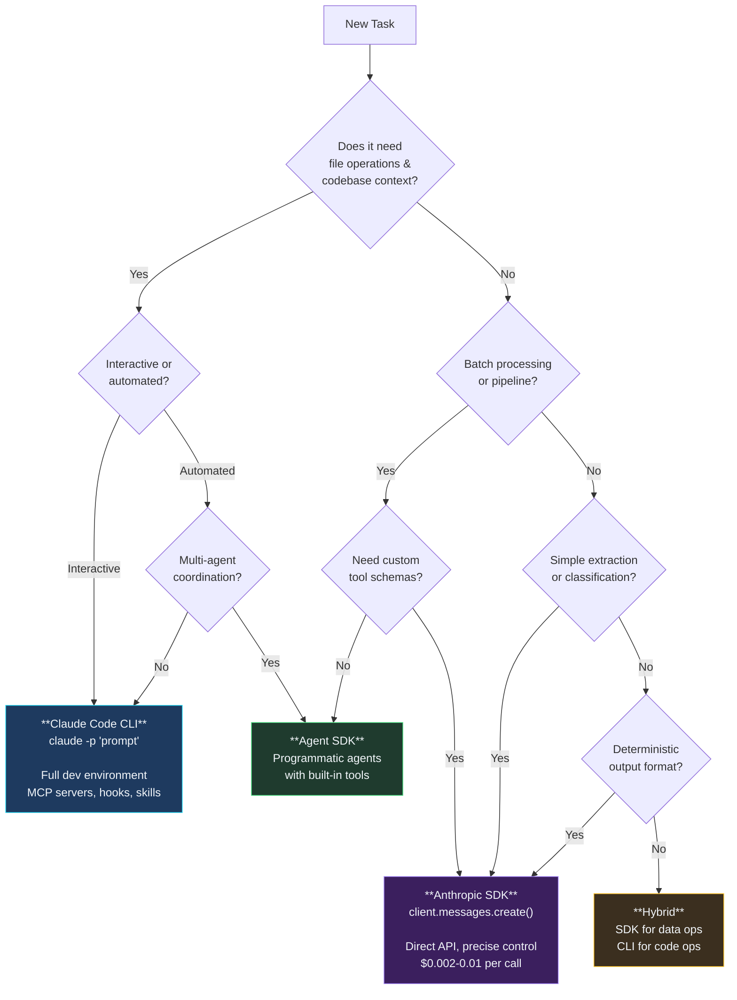

Last post. Eighteen entries, 23,479 sessions, 11.6 GB of session data across 27 projects over 42 days. And the question I get asked more than any other is this: should I use the Anthropic SDK, the Claude Code CLI, or the Agent SDK?

I kept arriving at the same answer. After building the same feature multiple ways. After burning money on the wrong approach. After watching agents succeed brilliantly in one mode and fail catastrophically in another. The question itself is wrong. The right question is: what does the task need?

I built the same content analysis pipeline three times. Once with the raw Anthropic SDK, once with the Claude Code CLI, once with a hybrid. The SDK version was roughly 3x the lines of code but ran at something closer to 40% of the API cost per invocation — exact numbers depend on your prompt size and model mix; mine came out around those ratios and I've stopped claiming more precision than that. The CLI version was four bash commands and handled edge cases I hadn't even considered. The hybrid version shipped to production. This post is the decision framework that emerged from those experiments and the 23,479 sessions that followed.

## Three Ways to Run Claude Programmatically

Three distinct approaches. They solve fundamentally different problems.

The **Anthropic SDK** (Python and TypeScript) gives you direct API access. You create messages, define tools, handle responses, manage token counts. Every token that goes in and comes out passes through code you wrote. It's a library.

The **Claude Code CLI** gives you a full development environment. File operations that handle conflicts. MCP servers for external tools. Skills for reusable workflows. Hooks for enforcement. Built-in code search with Glob and Grep. Across my sessions, I ran with playwright-mcp, firecrawl-mcp, chrome-devtools-mcp, shadcn-mcp, sequential-thinking, and oh-my-claudecode simultaneously. It's a runtime.

The **Agent SDK** sits between them. It gives you programmatic control with built-in tool handling, multi-agent coordination, and conversation management. You write TypeScript, but the SDK handles the tool loop, the message threading, and the agent lifecycle. It's a framework.

That distinction — library vs runtime vs framework — drives every decision about which to use.

Here's the decision tree I actually run in my head now, distilled from the last 23,479 sessions and written out as pseudocode so it survives being copied into a project README:

```
decide(task):
  Q1: Is this a one-shot or ad-hoc developer task?
      (refactor a module, fix a build, investigate a bug)
      -> YES: Claude Code CLI. Stop here.
      -> NO:  continue

  Q2: Will this run >50 times without a human in the loop?
      (batch classification, CI scan, pipeline stage)
      -> YES: Anthropic SDK. Stop here.
      -> NO:  continue

  Q3: Does any single step need codebase context
      (Glob, Grep, Read across files, multi-file edit)?
      -> YES: CLI for that step. Revisit Q2 for the rest.
      -> NO:  continue

  Q4: Do different agents in the pipeline need different tools
      (planner read-only, builder can write, reviewer can't edit)?
      -> YES: Agent SDK — tool scoping is the whole reason it exists.
      -> NO:  continue

  Q5: Is Claude's output feeding another system
      (DB row, queue message, another API call)?
      -> YES: Anthropic SDK. You want typed responses and exact token counts.
      -> NO:  Hybrid. SDK for the data steps, CLI for the code steps.
```

Why a tree and not a matrix? Matrices let you check every box. Trees force you to answer the first question honestly. Nine times out of ten, Q1 resolves the decision. The last one of those ten is where the framework earns its keep.



## SDK: When You Need a Scalpel

Direct API access means you control every token. No overhead from system prompts, hook evaluation, skill loading, or MCP server startup. The message you send is the message Claude processes. Nothing prepended, nothing injected.

The `basic-agent.ts` from the [claude-code-monorepo](https://github.com/krzemienski/claude-code-monorepo) shows the pattern at its simplest. You define exactly which tools the agent gets, you handle the tool loop yourself, and you decide when the conversation ends:

```typescript
// basic-agent.ts — Direct SDK with explicit tool definitions
import Anthropic from "@anthropic-ai/sdk";

const client = new Anthropic();
const tools: Anthropic.Tool[] = [
  {
    name: "read_file",
    description: "Read the contents of a file at the given path",
    input_schema: {
      type: "object" as const,
      properties: {
        path: { type: "string", description: "Absolute file path to read" },
      },
      required: ["path"],
    },
  },
];

async function runAgent(prompt: string): Promise<string> {
  const messages: Anthropic.MessageParam[] = [
    { role: "user", content: prompt },
  ];

  while (true) {
    const response = await client.messages.create({
      model: "claude-sonnet-4-20250514",
      max_tokens: 4096,
      tools,
      messages,
    });

    if (response.stop_reason === "end_turn") {
      const textBlock = response.content.find((b) => b.type === "text");
      return textBlock ? textBlock.text : "";
    }

    // Handle tool calls, push results, loop
    const toolUses = response.content.filter((b) => b.type === "tool_use");
    messages.push({ role: "assistant", content: response.content });
    messages.push({
      role: "user",
      content: toolUses.map((t) => ({
        type: "tool_result" as const,
        tool_use_id: t.id,
        content: handleToolCall(t.name, t.input as Record<string, string>),
      })),
    });
  }
}
```

That's 40 lines of TypeScript to get a working agent with custom tools. You control which model runs each call, how many tokens it can use, and exactly which tools are available. The SpecAnalyzer in my ccb builder could read and search but couldn't write files or run builds. The TaskGenerator could create task definitions but not implement them. Ever tried getting that kind of granularity with the CLI? You can't.

The SDK also gives you precise cost control. The `batch-processor.ts` in the companion repo processes files in parallel with a configurable concurrency limit, and every response includes exact token counts:

```typescript
const response = await client.messages.create({
  model: "claude-sonnet-4-20250514",
  max_tokens: 2048,
  messages: [{ role: "user", content: `${instruction}\n\nFile: ${item.filePath}\n\`\`\`\n${item.content}\n\`\`\`` }],
});

return {
  id: item.id,
  output: textBlock?.text ?? "",
  tokensUsed: response.usage.input_tokens + response.usage.output_tokens,
};
```

For batch work this matters. Processing 1,000 files for security review through direct SDK calls is a different cost profile from spawning 1,000 full CLI sessions — the CLI session carries system prompt, hook evaluation, skill scan, and MCP server startup on every invocation. An order-of-magnitude swing in batch cost is realistic; the exact ratio depends on your prompt length and model mix. The `cost-calculator.ts` in the companion repo models the 60/40 input-output split that CLI sessions produce so you can plug in your own prompt sizes instead of trusting mine.

**When the SDK wins:** batch processing, CI/CD pipelines, classification tasks, custom tool schemas, embedding Claude as one component in a larger system. Anywhere you need per-token accounting or per-agent tool restriction.

## CLI: When You Need an Operating Room

The `hat-rotation.sh` script from the companion repo is the clearest CLI pattern I've found. Four phases, each a single `claude -p` call, output piped between phases:

```bash
#!/bin/bash
# hat-rotation.sh — 4-phase CLI execution

PLAN=$(claude -p "You are wearing the PLANNER hat.
Analyze the codebase and create an implementation plan for: $TASK")

BUILD_OUTPUT=$(claude -p "You are wearing the BUILDER hat.
Implement this plan: ${PLAN}")

REVIEW=$(claude -p "You are wearing the REVIEWER hat.
Review this implementation for bugs and improvements: ${BUILD_OUTPUT}")

if echo "$REVIEW" | grep -qi "CRITICAL\|HIGH"; then
  claude -p "You are wearing the FIXER hat.
  Fix ONLY the CRITICAL and HIGH severity issues: ${REVIEW}"
fi
```

Four commands. Full development workflow. Each phase gets the CLI's entire ecosystem: file operations that preserve surrounding code, MCP servers for external tools, skills for reusable workflows, hooks for enforcement. With the SDK, you'd build all of that yourself.

The numbers tell the story. Across 23,479 sessions:

| Tool | Invocations | What It Means |
|------|------------|---------------|
| Read | 87,152 | Agents read 10x more than they write |
| Bash | 82,552 | Every build, test, and verification |
| Grep | 21,821 | Codebase search before every change |
| Edit | 19,979 | Context-preserving edits, not raw writes |
| Write | 9,066 | New file creation (5x less than edits) |
| Task | 2,827 | Agent-to-agent delegation |
| idb_tap | 2,620 | iOS simulator touch interactions |

That Read-to-Edit ratio of 4.4:1 is the CLI's superpower. Agents spend 80% of their time understanding code before changing it. The CLI's built-in Glob, Grep, and Read tools make that exploration fast and context-aware. How long would it take you to build equivalent file-handling in the SDK? I'd estimate weeks. Minimum.

The `worktree-parallel.sh` script takes the CLI pattern further, spawning parallel Claude sessions across git worktrees for conflict-free concurrent work:

```bash
for i in "${!TASKS[@]}"; do
  task="${TASKS[$i]}"
  branch="task-${i}-$(echo "$task" | tr ' ' '-' | head -c 30)"

  git worktree add -b "$branch" "$wt_path" "$BASE_BRANCH"

  ( cd "$wt_path" && claude -p "Complete this task: ${task}" > "$result_file" ) &
  PIDS+=($!)
done

echo "[parallel] Waiting for ${#PIDS[@]} sessions..."
```

This pattern powered the 194 parallel agents from [Post 6](/posts/post-06-parallel-worktrees/) with zero merge conflicts. Each agent gets its own worktree, its own branch, and the full CLI ecosystem. Try building that with raw API calls. Seriously, try it. You'll give up by lunch.

Hooks enforce discipline at the tool boundary without any custom code. My `block-test-files.js` hook has prevented test file creation hundreds of times across projects. `validation-not-compilation.js` fires after every build to remind agents that "it compiles" isn't "it works." Across the ralph-orchestrator project alone, tens of thousands of hook events enforced discipline declaratively. With the SDK, you'd have to implement these checks in your tool handlers, intercepting every write call, checking file paths against patterns, injecting reminders after builds. The hook system does it in a 75-line JavaScript file.

**When the CLI wins:** multi-file refactoring, exploratory coding, codebase understanding, anything that needs MCP servers, hooks, or skills. Anywhere the task is "work in this codebase" rather than "process this data."

## The Hybrid Pattern: Where Real Projects Land

SessionForge taught me that the real answer is usually "both."

SessionForge is a content platform: Next.js 15, React 19, PostgreSQL with 59 tables managed through Drizzle ORM. The app handles user accounts, session management, content scheduling, analytics, and publishing across 7 platforms. Standard web application code. CRUD operations, form handling, database queries, authentication flows.

The AI layer handles content intelligence. Session analysis, insight extraction, blog post generation, social media adaptation. These operations are unstructured. They need context, creative decisions, and variable-length output.

The boundary is clean: a 6-dimension weighted scoring algorithm runs in application code (deterministic formula, fixed weights, known inputs). A blog post draft runs through Claude (narrative structure, voice consistency, natural prose). The scoring algorithm doesn't need AI. The blog post doesn't need a database query. So why would you use the same tool for both?

```mermaid
graph LR
    subgraph APP["Application Layer"]
        direction TB
        A["59 DB Tables\nDrizzle ORM"]
        B["Auth & RLS\n7 Platforms"]
        C["Analytics\nScheduling"]
        D["Scoring Algorithm\n6-dim weighted"]
    end

    subgraph SDK_LAYER["SDK Layer"]
        direction TB
        E["Content Classification\n$0.003/call"]
        F["Metadata Extraction\n$0.005/call"]
        G["Batch Analysis\n1000s of items"]
    end

    subgraph CLI_LAYER["CLI Layer"]
        direction TB
        H["Codebase Refactoring\nMulti-file edits"]
        I["Feature Implementation\nBuild & validate"]
        J["Bug Investigation\nGrep → Read → Fix"]
    end

    APP -->|"structured data"| SDK_LAYER
    SDK_LAYER -->|"enriched content"| APP
    CLI_LAYER -->|"code changes"| APP

    style APP fill:#1e293b,stroke:#6366f1,color:#f1f5f9
    style SDK_LAYER fill:#3b1f5e,stroke:#a78bfa,color:#f1f5f9
    style CLI_LAYER fill:#1e3a5f,stroke:#22d3ee,color:#f1f5f9
```



The hybrid boundary showed up in the development workflow too. Codebase-aware tasks (refactoring a module, fixing a build error, implementing a new API route) ran through the CLI because it understands files, imports, and project structure. Content classification, metadata extraction, and batch analysis ran through the SDK for precise token control and parallelism.

The `decision-matrix.ts` in the companion repo formalizes this with a weighted scoring system:

```typescript
export function recommend(task: TaskCharacteristics): DecisionResult {
  let sdkScore = 0;
  let cliScore = 0;

  if (task.isBatchOrPipeline)      { sdkScore += 3; }
  if (task.isCiCdIntegration)      { sdkScore += 3; }
  if (task.requiresCustomTools)    { sdkScore += 2; }
  if (task.needsDeterministicOutput) { sdkScore += 2; }

  if (task.isMultiFileRefactor)    { cliScore += 3; }
  if (task.requiresComplexReasoning) { cliScore += 3; }
  if (task.isExploratoryOrCreative) { cliScore += 2; }
  if (task.requiresHumanJudgment)  { cliScore += 2; }

  const sdkRatio = sdkScore / (sdkScore + cliScore);

  if (sdkRatio > 0.65) return { recommendation: "sdk", ... };
  if (sdkRatio < 0.35) return { recommendation: "cli", ... };
  return { recommendation: "hybrid", ... };
}
```

When neither approach dominates, you're looking at a hybrid project. Most real projects are hybrid projects.

## The Decision Framework

After 23,479 sessions across 27 projects, the decision comes down to five questions:

**1. Is the task about data or about code?**
Data processing (classification, extraction, scoring, summarization) points to the SDK. Code operations (refactoring, debugging, feature implementation) point to the CLI. Most production systems do both.

**2. How many times will this run?**
Once or a few times: CLI, because setup cost is zero. Thousands of times: SDK, because per-call cost is 10-50x lower. The crossover point in my experience is around 50-100 invocations. Below that, the CLI's convenience wins. Above that, the SDK's cost advantage compounds fast.

**3. Do you need the ecosystem?**
MCP servers, hooks, skills, Glob/Grep/Read. If your task needs any of these, use the CLI. Rebuilding even one of these in the SDK takes days. I've got 7,985 iOS simulator MCP calls and 2,068 browser automation calls across my sessions. None of that exists in the raw SDK.

**4. Do you need per-agent tool restriction?**
If different agents in your pipeline should have different capabilities (a planner that can't write files, a reviewer that can't edit code) use the SDK. The CLI gives every invocation the same full tool set. The Agent SDK can handle this too, with more structure than raw API calls.

**5. Does the output feed another system?**
If Claude's output goes into a database, a queue, or another API, the SDK gives you typed responses with exact token counts. If Claude's output is code changes in a repository, the CLI handles the file operations natively.

## Cost Reality

The cost comparison isn't as simple as "SDK is cheaper." It depends entirely on the task profile. The dollar ranges below are order-of-magnitude guidance from my own runs, not quoted pricing — your mix of Opus vs Sonnet, your average prompt size, and your cache hit rate will shift every number.

| Scenario | SDK Cost | CLI Cost | Winner |
|----------|----------|----------|--------|
| 1,000 text classifications | low single digits of $ | tens to low hundreds of $ | SDK, by an order of magnitude |
| Single multi-file refactor | dominated by tool-building time | cents to low dollars | CLI, by a wide margin |
| Daily CI security scan | cents per run | low dollars per run | SDK, several times cheaper |
| Feature implementation | dominated by tool-building time | low dollars | CLI, by a wide margin |
| Hybrid content pipeline | SDK batch + CLI code steps | all-CLI is noticeably higher | Hybrid is the best floor |

The real cost insight isn't about per-token pricing. It's about development time. The SDK version of a multi-file refactoring tool takes days to build because you're writing file reading, diff generation, conflict resolution, and codebase search from scratch. The CLI version is `claude -p "refactor X to Y"` and it already handles all of that.

Model routing adds another dimension. My ccb builder routes Opus for architecture phases (deep reasoning, system design) and Sonnet for implementation (code generation, file edits). Roughly 60% of work goes to Sonnet at a fraction of the Opus cost. The SDK makes this trivial since each `client.messages.create()` specifies its model. The CLI supports it through `--model` flags, but switching models mid-session requires a new invocation.

## Anti-Patterns I Learned the Hard Way

**Rebuilding CLI capabilities in the SDK.** I spent two days building file-editing logic with diff/patch handling before realizing I was reimplementing what `claude -p "edit this file"` does for free. If your SDK code is implementing `readFile`, `writeFile`, `searchCode`, and `runBuild`, just use the CLI. Don't be me.

**Using the CLI for batch processing.** Running 500 CLI sessions to classify documents is like driving a moving truck to the grocery store. Each session loads system prompts, evaluates hooks, scans skills, and initializes MCP servers. The SDK skips all of that.

**Using AI for deterministic operations.** A weighted scoring formula doesn't need Claude. A database query doesn't need Claude. A date formatter doesn't need Claude. I've seen agents call Claude to do string concatenation. Write application code for deterministic operations. This shouldn't need to be said, and yet.

**Ignoring the Agent SDK middle ground.** The Agent SDK handles the tool loop, message threading, and multi-agent coordination that you'd otherwise build yourself in raw SDK code. If you're writing a `while (true)` loop to handle tool calls, the Agent SDK already solved that problem.

## What 23,479 Sessions Taught Me

This series started with a one-character bug that three agents found on their first pass ([Post 1](/posts/post-01-series-launch/)). That incident led to consensus gates ([Post 2](/posts/post-02-multi-agent-consensus/)), which led to functional validation ([Post 3](/posts/post-03-functional-validation/)), which led to enforcement hooks ([Post 7](/posts/post-07-prompt-engineering-stack/)), which led to orchestration loops ([Post 8](/posts/post-08-ralph-orchestrator/)), which led to cross-session memory ([Post 12](/posts/post-12-cross-session-memory/)), which led to the multi-agent merge system that ran 35 worktrees with zero conflicts ([Post 14](/posts/post-14-multi-agent-merge/)).

Each system built on the last. Each one was validated through real usage, not theory. Here's what the tool leaderboard tells you:

- **87,152 Read calls.** Agents read nearly 10x more than they write. Understanding before changing is the most important pattern in this entire series. Full stop.
- **82,552 Bash calls.** Every build, every test, every verification. Agents that don't run the code they write are agents that ship bugs.
- **19,979 Edit calls.** Context-preserving edits, not raw file writes. The 9.6:1 Read-to-Write ratio means agents spend 90% of their effort understanding and 10% changing.
- **2,827 Task spawns.** Agent-to-agent delegation. One human session spawns an average of 4.2 agent sessions. The orchestration layer is where the real power lives.
- **7,985 iOS simulator interactions.** Agents physically tapping screens, swiping through UIs, validating that features work through the real interface. Not mocked. Not stubbed. Real taps.

The SDK vs CLI decision really comes down to where your task falls on two axes: structured vs unstructured, and isolated vs codebase-aware. Structured + isolated = SDK. Unstructured + codebase-aware = CLI. Everything in between = hybrid.

## The Framework, Distilled

If I had to reduce 23,479 sessions to one decision rule:

**Use the SDK when Claude is a function in your system.** You call it with structured input, you get structured output, you process thousands of them. The scalpel.

**Use the CLI when Claude is a developer on your team.** It reads the codebase, understands context, makes multi-file changes, and validates its own work. The operating room.

**Use both when your system has both needs.** Most production systems do. The hybrid pattern isn't a compromise. It's the architecture that matches how real software works.

I'm honestly not sure which approach will win long-term. The Agent SDK keeps absorbing CLI features, and the CLI keeps getting more programmable. Maybe the distinction collapses in a year. But right now, in March 2026, the boundary is clear and the framework holds.

---

*Final post in the "Agentic Development: 18 Lessons from 23,479 Sessions" series. The [claude-code-monorepo](https://github.com/krzemienski/claude-code-monorepo) contains all the patterns side by side: `basic-agent.ts` and `multi-agent-pipeline.ts` for the SDK approach, `hat-rotation.sh` and `worktree-parallel.sh` for the CLI approach, and `decision-matrix.ts` for the scoring framework. Every claim in this series traces to a real session. Every system has a companion repo you can run yourself. The sessions generated 11.6 GB of data across 42 days. The frameworks emerged from the failures. The only original insight? The tools are ready. The decision is knowing which one to pick.*
