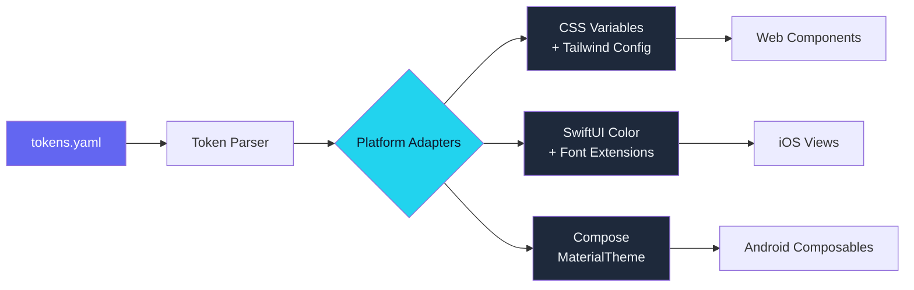

The iOS button was 2 pixels taller. The Android card had 16dp of padding instead of 12. The web hero gradient started at a slightly different blue. Nobody noticed for three weeks, and then a designer opened all three apps side by side and the slide deck that followed had the word "inconsistency" on every page.

That screenshot comparison was the moment I stopped treating design tokens as a nice-to-have abstraction and started treating them as infrastructure. Not a style guide PDF that people reference when they remember to. An actual build artifact — one YAML file that generates platform-native code for web, iOS, and Android, with zero manual translation between them.

This is post 20 of 21 in the Agentic Development series. The companion repo is at [github.com/krzemienski/design-token-automation](https://github.com/krzemienski/design-token-automation). Everything shown here comes from the awesome-list-site project, built across 368 sessions.

---

### The Drift Problem

Visual drift across platforms is not a bug. It is a process failure. When three teams implement the same design from the same spec document, they each make hundreds of micro-decisions: how to round a color value, which spacing constant to use, whether "medium" font weight means 500 or 600. Each decision is individually reasonable. Collectively, they produce three apps that look like cousins rather than siblings.

The traditional fix is a design system with documentation. Figma components, Zeroheight pages, Notion databases full of hex codes and spacing tables. Designers maintain the source of truth; developers consult it during implementation. The problem is the word "consult." Consultation is optional. People forget. People copy a hex code wrong. People use the old version of the spacing scale because their browser tab was stale.

The fix that actually works is code generation. You define the tokens once, in one file, and a build step generates the platform-native code. Developers never type a hex code. They import a generated constant. If the constant changes upstream, it changes everywhere simultaneously.

I learned this the hard way. The awesome-list-site had been running for about 200 sessions before I introduced the token pipeline. During those 200 sessions, I was doing exactly what everyone does — manually copying hex values from a design document into CSS files, then re-typing them into SwiftUI Color initializers, then converting them to 0xFF-prefixed integers for Compose. Every platform had its own copy of the truth. And every copy was slightly different in ways that were invisible until you put them side by side.

### The Token Taxonomy

Before writing any generation code, I needed to decide what constitutes a "token." After iterating through three failed taxonomies that were either too granular or too abstract, I landed on five categories:

**Color tokens** — every named color in the system, including semantic aliases. `color.primary.base` is `#6366f1`. `color.surface.elevated` is `#1e293b`. The raw palette and the semantic layer both live in the same file, with semantic tokens referencing palette tokens by name.

**Spacing tokens** — a constrained scale. `spacing.xs` through `spacing.3xl`, mapped to pixel values. No arbitrary numbers anywhere in the codebase. If a padding value does not exist in the scale, it does not exist.

**Typography tokens** — font families, weights, sizes, and line heights, grouped into named styles. `typography.heading.lg` bundles family, weight, size, and line-height into a single reference.

**Elevation tokens** — shadow definitions for layered surfaces. Web gets `box-shadow`, iOS gets `NSShadow` parameters, Android gets `elevation` dp values. Same visual intent, completely different implementations.

**Animation tokens** — duration and easing curves. `animation.duration.fast` is 150ms everywhere. `animation.easing.standard` is a cubic-bezier on web, a `CAMediaTimingFunction` on iOS, and an `AnimationSpec` on Android.

Forty-seven tokens across those five categories. That is the entire design vocabulary for the application.

### The Single Source of Truth

Everything starts from one YAML file:

```yaml
# tokens.yaml — the only file a designer ever edits
color:
  palette:
    void-navy:    "#0f172a"
    slate-abyss:  "#1e293b"
    indigo-pulse: "#6366f1"
    cyan-signal:  "#22d3ee"
    cloud-text:   "#f1f5f9"
    slate-prose:  "#cbd5e1"
    mist-caption: "#94a3b8"

  semantic:
    background.primary:   "{color.palette.void-navy}"
    surface.elevated:     "{color.palette.slate-abyss}"
    accent.primary:       "{color.palette.indigo-pulse}"
    accent.data:          "{color.palette.cyan-signal}"
    text.heading:         "{color.palette.cloud-text}"
    text.body:            "{color.palette.slate-prose}"
    text.subtle:          "{color.palette.mist-caption}"

spacing:
  xs:   4
  sm:   8
  md:   12
  lg:   16
  xl:   24
  2xl:  32
  3xl:  48

typography:
  heading:
    lg:
      family: "system-ui, -apple-system, sans-serif"
      weight: 800
      size: 32
      line-height: 1.15
    md:
      family: "system-ui, -apple-system, sans-serif"
      weight: 700
      size: 24
      line-height: 1.2
  body:
    base:
      family: "system-ui, -apple-system, sans-serif"
      weight: 400
      size: 16
      line-height: 1.8
  code:
    base:
      family: "'SF Mono', 'Fira Code', monospace"
      weight: 400
      size: 14
      line-height: 1.6

elevation:
  none:    { blur: 0, spread: 0, offset-y: 0, color: "transparent" }
  low:     { blur: 4, spread: 0, offset-y: 2, color: "rgba(0,0,0,0.25)" }
  medium:  { blur: 8, spread: -1, offset-y: 4, color: "rgba(0,0,0,0.3)" }
  high:    { blur: 16, spread: -2, offset-y: 8, color: "rgba(0,0,0,0.35)" }

animation:
  duration:
    fast:     150
    normal:   250
    slow:     400
  easing:
    standard: "cubic-bezier(0.4, 0, 0.2, 1)"
    enter:    "cubic-bezier(0, 0, 0.2, 1)"
    exit:     "cubic-bezier(0.4, 0, 1, 1)"
```

The curly-brace references in the semantic color section are resolved at generation time. `{color.palette.void-navy}` becomes `#0f172a` in every output format. This means you can rename a palette color or swap a value, and every semantic alias updates automatically.

YAML was the right format for two reasons: it is human-readable enough for designers to edit directly, and it is structured enough for code generators to parse without ambiguity. JSON would work technically but is painful to hand-edit. TOML would work but does not handle nested structures as cleanly.

### The Architecture

The generation pipeline has three stages: parse, adapt, emit.



**The parser** reads `tokens.yaml`, resolves all cross-references, validates that every referenced token exists, and produces a normalized intermediate representation. The IR is a flat dictionary of fully-resolved tokens with dot-path keys: `color.semantic.background.primary` maps to `#0f172a`.

**The platform adapters** translate the IR into platform-specific structures. Each adapter knows nothing about the other platforms. It only knows how to express a color, a spacing value, a typography style, or an elevation in its target language.

**The emitters** write the actual files: `.css`, `.swift`, `.kt`. These are the files that developers import. They never edit them. The files are generated, checked into source control, and consumed as read-only dependencies.

### Platform Adapter Outputs

Here is what the same token set produces for each platform.

**Web — CSS custom properties and Tailwind config:**

```css
/* Generated by design-token-automation — do not edit */
:root {
  --color-bg-primary: #0f172a;
  --color-surface-elevated: #1e293b;
  --color-accent-primary: #6366f1;
  --color-accent-data: #22d3ee;
  --color-text-heading: #f1f5f9;
  --color-text-body: #cbd5e1;
  --color-text-subtle: #94a3b8;

  --spacing-xs: 0.25rem;
  --spacing-sm: 0.5rem;
  --spacing-md: 0.75rem;
  --spacing-lg: 1rem;
  --spacing-xl: 1.5rem;
  --spacing-2xl: 2rem;
  --spacing-3xl: 3rem;

  --font-heading-lg: 800 2rem/1.15 system-ui, -apple-system, sans-serif;
  --font-body-base: 400 1rem/1.8 system-ui, -apple-system, sans-serif;

  --shadow-low: 0 2px 4px 0 rgba(0,0,0,0.25);
  --shadow-medium: 0 4px 8px -1px rgba(0,0,0,0.3);
  --shadow-high: 0 8px 16px -2px rgba(0,0,0,0.35);

  --duration-fast: 150ms;
  --duration-normal: 250ms;
  --easing-standard: cubic-bezier(0.4, 0, 0.2, 1);
}
```

**iOS — SwiftUI Color and Font extensions:**

```swift
// Generated by design-token-automation — do not edit
import SwiftUI

extension Color {
    static let bgPrimary = Color(hex: "#0f172a")
    static let surfaceElevated = Color(hex: "#1e293b")
    static let accentPrimary = Color(hex: "#6366f1")
    static let accentData = Color(hex: "#22d3ee")
    static let textHeading = Color(hex: "#f1f5f9")
    static let textBody = Color(hex: "#cbd5e1")
    static let textSubtle = Color(hex: "#94a3b8")
}

extension Font {
    static let headingLg = Font.system(size: 32, weight: .heavy)
    static let headingMd = Font.system(size: 24, weight: .bold)
    static let bodyBase = Font.system(size: 16, weight: .regular)
    static let codeBase = Font.system(.body, design: .monospaced)
}

enum Spacing {
    static let xs: CGFloat = 4
    static let sm: CGFloat = 8
    static let md: CGFloat = 12
    static let lg: CGFloat = 16
    static let xl: CGFloat = 24
    static let xxl: CGFloat = 32
    static let xxxl: CGFloat = 48
}

enum Duration {
    static let fast: Double = 0.15
    static let normal: Double = 0.25
    static let slow: Double = 0.40
}
```

**Android — Jetpack Compose theme:**

```kotlin
// Generated by design-token-automation — do not edit
package com.app.design.tokens

import androidx.compose.ui.graphics.Color
import androidx.compose.ui.unit.dp
import androidx.compose.ui.unit.sp

object AppColors {
    val bgPrimary = Color(0xFF0F172A)
    val surfaceElevated = Color(0xFF1E293B)
    val accentPrimary = Color(0xFF6366F1)
    val accentData = Color(0xFF22D3EE)
    val textHeading = Color(0xFFF1F5F9)
    val textBody = Color(0xFFCBD5E1)
    val textSubtle = Color(0xFF94A3B8)
}

object AppSpacing {
    val xs = 4.dp
    val sm = 8.dp
    val md = 12.dp
    val lg = 16.dp
    val xl = 24.dp
    val xxl = 32.dp
    val xxxl = 48.dp
}

object AppTypography {
    val headingLg = TextStyle(
        fontWeight = FontWeight.ExtraBold,
        fontSize = 32.sp,
        lineHeight = (32 * 1.15).sp
    )
    val bodyBase = TextStyle(
        fontWeight = FontWeight.Normal,
        fontSize = 16.sp,
        lineHeight = (16 * 1.8).sp
    )
}

object AppDurations {
    const val fast = 150
    const val normal = 250
    const val slow = 400
}
```

Same 47 tokens. Three completely different expression formats. Zero manual translation.

### The Adapter Pattern

Each adapter implements a single interface:

```python
class PlatformAdapter:
    def adapt_color(self, name: str, value: str) -> str: ...
    def adapt_spacing(self, name: str, value: int) -> str: ...
    def adapt_typography(self, name: str, spec: dict) -> str: ...
    def adapt_elevation(self, name: str, spec: dict) -> str: ...
    def adapt_animation(self, name: str, spec: dict) -> str: ...
    def emit(self, output_path: Path) -> None: ...
```

The CSS adapter converts spacing pixels to rem. The Swift adapter maps font weights to `Font.Weight` enum cases. The Kotlin adapter converts hex colors to `0xFF` prefixed integers. Each adapter encapsulates exactly one platform's idioms. Adding a new platform — Flutter, React Native, whatever — means writing one new adapter class. The parser, the YAML schema, and every other adapter remain untouched.

```python
class CSSAdapter(PlatformAdapter):
    def adapt_color(self, name: str, value: str) -> str:
        css_name = f"--color-{name.replace('.', '-')}"
        return f"  {css_name}: {value};"

    def adapt_spacing(self, name: str, value: int) -> str:
        css_name = f"--spacing-{name}"
        rem_value = value / 16
        return f"  {css_name}: {rem_value}rem;"

class SwiftAdapter(PlatformAdapter):
    WEIGHT_MAP = {
        400: ".regular", 500: ".medium", 600: ".semibold",
        700: ".bold", 800: ".heavy",
    }

    def adapt_color(self, name: str, value: str) -> str:
        swift_name = to_camel_case(name)
        return f'    static let {swift_name} = Color(hex: "{value}")'

    def adapt_spacing(self, name: str, value: int) -> str:
        swift_name = name.replace("-", "")
        return f"    static let {swift_name}: CGFloat = {value}"
```

The naming convention translation is the subtle part. CSS uses kebab-case with `--` prefixes. Swift uses camelCase static properties. Kotlin uses camelCase inside singleton objects. The adapter handles all of this, so the YAML file uses a platform-neutral naming convention and each output reads idiomatically in its target language.

### Feeding Tokens to Stitch MCP

Post 10 in this series covered how Stitch MCP generates screens from text prompts. What I did not cover there — because it had not been built yet — was how tokens feed into those prompts systematically.

The generation pipeline produces one additional output: a Stitch prompt block. This is a plain-text summary of the active token values, formatted as natural language instructions for the AI:

```
Use a dark theme with background color #0f172a. Use #1e293b for cards
and elevated surfaces. Primary accent is #6366f1 (indigo/purple). Use
#22d3ee (cyan) for metrics and data highlights. Text colors: #f1f5f9
for headings, #cbd5e1 for body, #94a3b8 for subtle text. Spacing scale:
4/8/12/16/24/32/48px. Use system-ui font stack. Rounded corners 8-12px.
No heavy shadows — use color contrast for depth.
```

That block gets prepended to every `generate_screen_from_text` call. Across 26 screen generation calls for the awesome-list-site, every screen received identical token instructions because the prompt block was generated from the same YAML file that generated the CSS, Swift, and Kotlin code. The screens came back visually consistent not because of careful manual prompting, but because the prompt was a build artifact.

If I change `indigo-pulse` from `#6366f1` to `#7c3aed`, one `make generate` command updates the CSS variables, the SwiftUI Color extension, the Kotlin theme object, and the Stitch prompt block. The next screen generation call uses the new color automatically.

### Automated Visual Regression

Generating consistent code is necessary but not sufficient. You also need to verify that the generated code actually produces visually consistent results. The validation pipeline runs after every token change:

1. **Build all three platforms** from the generated token files
2. **Capture reference screenshots** of key screens on each platform
3. **Pixel-diff against baselines** using a perceptual comparison algorithm
4. **Flag regressions** where any platform deviates beyond a 0.5% threshold

The 0.5% threshold accounts for platform-specific rendering differences — antialiasing, subpixel rendering, font hinting — that are visually imperceptible but produce nonzero diffs. Anything above 0.5% is a real regression that needs investigation.

In 368 sessions, the visual regression check caught three legitimate issues: a spacing token that was being interpreted as points on iOS but pixels on web (the adapter was not converting), an elevation token where the Android `elevation` dp value did not visually match the CSS `box-shadow` (I had to adjust the shadow opacity), and a typography token where the iOS system font rendered `weight: 800` visually heavier than the web equivalent (I split `heavy` into platform-specific weight mappings).

All three would have shipped as visual drift without the automated check. All three were fixed by adjusting the adapter logic, not the token values. The single source of truth remained unchanged.

That distinction matters. When the visual regression fails, the question is always: is the token wrong, or is the adapter wrong? In every case I encountered, the token was correct — the design intent was clear. The adapter was making a platform-specific translation error. Fixing the adapter means every future token that uses the same translation path also gets fixed. You are fixing a class of errors, not a single instance.

### When Token Automation Pays Off

This system took about four days to build, including the parser, three adapters, the Stitch prompt generator, and the visual regression pipeline. Here is when that investment makes sense:

**Two or more platforms.** If you are only shipping web, CSS custom properties in a well-organized file are probably sufficient. The moment you add iOS or Android, the manual synchronization cost starts compounding. Every design change requires parallel updates in multiple codebases by different developers who may not even be on the same team.

**Frequent design iteration.** If your tokens change once a year, manual synchronization is annoying but manageable. If they change weekly — which they did during the first 200 sessions of the awesome-list-site build — the automation pays for itself within the first month.

**More than 20 tokens.** Below that threshold, the overhead of the generation pipeline exceeds the overhead of manual updates. Above it, the combinatorial risk of someone getting one value wrong on one platform becomes real.

**Multiple developers or agents.** With 12 agents building UI concurrently (as described in post 16), having generated token files meant no agent ever needed to look up a color value. They imported the generated constants and used them. No lookup errors. No stale values. No "I thought indigo was #6366f1 but I used #6466f1."

### What I Would Do Differently

The YAML schema went through three iterations before stabilizing. The first version was too flat — every token was a top-level key, which made the file unreadable past 30 entries. The second was too nested — five levels deep for a color value, which made the generation templates unwieldy. The final version uses two levels of nesting: category and name, with an optional sub-level for variants.

I would also adopt the W3C Design Tokens Community Group format from the start. My custom YAML schema works, but it means any new tooling I want to integrate requires a custom adapter. The DTCG format is becoming the standard interchange format for design tokens, and most tools are converging on it. Starting with that format would have saved a rewrite.

The Stitch prompt integration was an afterthought that should have been a first-class adapter. I bolted it on after the CSS, Swift, and Kotlin adapters were done. Making it a proper adapter from the beginning would have kept the architecture cleaner and made the prompt block format configurable rather than hardcoded.

### The Takeaway

Design tokens are not a design tool. They are a build system concern. The moment you have more than one platform consuming the same visual language, the question is not whether to automate token propagation — it is how quickly you can get the automation running before drift accumulates.

One YAML file. Three platform adapters. Forty-seven tokens. Zero manual synchronization. Every screen, on every platform, using the exact same values, verified by automated visual regression.

The iOS button is no longer 2 pixels taller.
