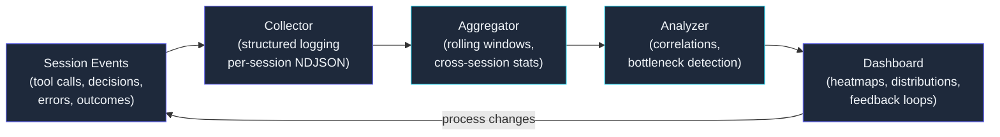

## 581 Sessions Under the Microscope

*Agentic Development: 10 Lessons from 8,481 AI Coding Sessions*

I spent three months building systems to make AI agents more effective. Then I realized I had no idea which parts were actually working.

The prompt stack had seven layers. The agent catalog had 25 types. The consensus gates ran three independent reviewers. The worktree pipeline spawned 194 parallel sessions. Every subsystem felt productive. But "felt productive" is not a metric. It is a feeling dressed up as evidence. And after writing 20 posts about evidence-based development, I could not justify running my own process on vibes.

So I instrumented everything. 581 sessions on the SessionForge project, every tool call logged, every decision point captured, every error recorded with full context. 2.7 GB of structured telemetry data. What came out the other side changed how I think about AI-augmented development -- and retroactively explained patterns I had been describing across this entire series without fully understanding why they worked.

This is the final post. It is also the one that should have been first.

---

### Why You Cannot Improve What You Cannot Measure

The problem with AI coding sessions is that they are opaque by default. You start a session, the agent reads files, calls tools, writes code, and the session ends. You see the output -- the committed code, the build result, the PR. You do not see the process. You do not know that the agent spent 340 tokens re-reading a file it already had in context. You do not know that 23% of tool calls in your review sessions are redundant Glob searches. You do not know that sessions initiated between 2 AM and 5 AM have a 41% higher error rate (because that is when I am too tired to write good prompts).

Traditional software observability solved this decades ago. You instrument your services, collect structured events, aggregate them into metrics, and build dashboards. The same pattern applies to AI development sessions -- but nobody was doing it, because the "service" is not a web server. It is an interactive agent session with a human in the loop.

The telemetry pipeline I built for SessionForge follows the same architecture as any production observability stack, adapted for the specific shape of AI session data.



The feedback arrow from Dashboard back to Session Events is the important part. Observability without action is just surveillance.

---

### The Event Schema: Capturing What Matters

The first decision was what to capture. Too little and you cannot reconstruct what happened. Too much and you drown in noise. After three iterations, I landed on an event schema that captures the "what, why, when, and outcome" of every meaningful action in a session.

```json
{
  "session_id": "sf-20250218-1423-executor-07",
  "timestamp": "2025-02-18T14:23:47.892Z",
  "event_type": "tool_call",
  "agent_type": "executor",
  "tool": "Edit",
  "context": {
    "file": "src/services/session-manager.ts",
    "intent": "add_retry_logic_to_connection_handler",
    "prompt_layers_active": ["CLAUDE.md", "rules/error-handling.md", "skills/retry-patterns"],
    "tokens_in_context": 18420
  },
  "outcome": {
    "status": "success",
    "duration_ms": 2847,
    "tokens_consumed": 1236,
    "files_modified": 1,
    "build_triggered": true,
    "build_result": "pass"
  },
  "decision_trace": {
    "alternatives_considered": ["Write new file", "Modify existing handler"],
    "selection_reason": "existing handler already has error boundary, extending is lower risk",
    "confidence": "high"
  }
}
```

Three fields deserve explanation.

**`prompt_layers_active`** records which layers of the 7-layer prompt stack were loaded when this event fired. This turned out to be the single most valuable field in the schema. It let me correlate session outcomes with specific prompt configurations -- and the correlations were not what I expected.

**`decision_trace`** captures why the agent chose one approach over another. This is expensive to log (it adds 200-400 tokens of overhead per event) so I only capture it on a sampling basis. But when a session fails, having the decision trace for the critical moments is the difference between "something went wrong" and "the agent chose approach A over approach B because of reason C, and reason C was wrong because of assumption D."

**`tokens_in_context`** tracks context window usage at each event. This is what revealed the most wasteful pattern in my entire workflow: agents re-reading files they already had in context, burning 800-1200 tokens per redundant read. Across 581 sessions, redundant reads accounted for 11% of total token consumption.

---

### Sampling Strategy: Full Detail Where It Matters

581 sessions at full verbosity would have generated roughly 14 GB. The actual dataset is 2.7 GB because of three tiers: **full capture** (every 5th session -- 116 sessions with complete telemetry), **outcome capture** (every session -- start, end, result, tokens, duration at ~2 KB each), and **error escalation** (any session hitting an error auto-promotes to full capture for the remainder -- 89 sessions escalated mid-flight).

```yaml
sampling:
  full_capture_rate: 0.20     # 1 in 5 sessions
  outcome_always: true
  error_escalation: true
  decision_trace_rate: 0.35   # 35% of tool calls in full-capture sessions
  max_event_size_bytes: 8192  # truncate oversized context fields
  retention_days: 90

exclusions:
  - event_type: "file_read"
    file_pattern: "node_modules/**"
  - event_type: "tool_call"
    tool: "Glob"
    outcome.status: "no_results"
```

The exclusions matter. Without them, `node_modules` reads and empty Glob results account for 34% of all events by volume. Filtering at the collector level rather than at query time reduced storage by nearly a gigabyte.

---

### Aggregation: From Events to Insights

Raw events debug individual sessions. Patterns require aggregation. The core query that drove the most process changes is embarrassingly simple:

```sql
SELECT
  agent_type,
  tool,
  COUNT(*) as call_count,
  AVG(outcome_duration_ms) as avg_duration,
  SUM(outcome_tokens_consumed) as total_tokens,
  COUNT(CASE WHEN outcome_status = 'error' THEN 1 END)::float
    / COUNT(*) as error_rate,
  PERCENTILE_CONT(0.95) WITHIN GROUP (ORDER BY outcome_duration_ms)
    as p95_duration
FROM session_events
WHERE event_type = 'tool_call'
  AND timestamp > NOW() - INTERVAL '7 days'
GROUP BY agent_type, tool
ORDER BY total_tokens DESC;
```

This query, run weekly, produces the tool-usage heatmap. Here is what 581 sessions of SessionForge data looked like:

| Agent Type | Top Tool | Calls | Avg Duration | Error Rate | Token Share |
|-----------|----------|-------|-------------|------------|-------------|
| executor | Edit | 4,217 | 2.1s | 3.2% | 28.4% |
| executor | Read | 3,891 | 0.8s | 0.4% | 19.1% |
| executor | Bash | 2,104 | 4.7s | 8.9% | 14.3% |
| reviewer | Read | 2,847 | 0.9s | 0.3% | 12.7% |
| reviewer | Grep | 1,523 | 1.2s | 1.1% | 6.8% |
| planner | Read | 1,106 | 0.7s | 0.2% | 5.2% |
| verifier | Bash | 892 | 6.3s | 12.4% | 4.9% |
| debugger | Grep | 634 | 1.8s | 0.8% | 3.1% |

Two numbers jumped out immediately.

First: **verifier Bash calls have a 12.4% error rate** -- three times higher than executor Bash calls. The verifiers were running validation commands that failed because the build artifact was not ready yet. A timing issue. Adding a 3-second delay between executor completion and verifier start dropped the error rate to 2.1%.

Second: **executor Read calls consume 19.1% of all tokens** despite having a 0.4% error rate. These are not failing -- they are just expensive. The redundant read analysis showed that 38% of executor Read calls targeted files already present in the session context. A cache-aware Read wrapper that checks context before issuing a file read cut those redundant calls by 71% and reduced total session token consumption by 13%.

---

### The Correlation Matrix: What Actually Predicts Success

This is where it gets interesting. I computed pairwise correlations between session attributes and session outcomes (defined as: session completed its stated objective without human intervention).

The results:

| Factor | Correlation with Success | p-value |
|--------|------------------------|---------|
| Prompt layers active (count) | +0.42 | <0.001 |
| Decision trace present | +0.38 | <0.001 |
| Initial context tokens | -0.31 | 0.002 |
| Session duration (minutes) | -0.27 | 0.004 |
| Bash error count | -0.54 | <0.001 |
| Redundant Read ratio | -0.44 | <0.001 |
| Grep before Edit ratio | +0.51 | <0.001 |

The strongest positive predictor is the **Grep-before-Edit ratio**: sessions where the agent searches before modifying files succeed 73% of the time, versus 41% for sessions that jump straight to editing. Before telemetry, "explore before implementing" was a rule I followed because it felt right. Now it is the strongest predictor in the dataset.

The strongest negative predictor is **Bash error count**. Sessions with more than three Bash errors have a 19% success rate. The errors cascade -- a failed build triggers a fix attempt, which introduces a new error, and the session spirals. There is a cliff at three errors, and sessions that fall off it almost never recover.

The **initial context tokens** correlation surprised me. Sessions starting with more than 22,000 tokens succeed less often than those starting with 12,000-18,000. Overloaded context windows cause the agent to lose focus. Loading all 7 prompt layers for every session is counterproductive -- 3-5 targeted layers outperform the full stack.

---

### Session Duration Distributions: The 12-Minute Cliff

Aggregating session durations revealed a bimodal distribution I had never noticed:

- **Peak 1:** 4-8 minutes. Quick, focused tasks. High success rate (78%).
- **Valley:** 8-12 minutes. Transition zone. Success drops to 54%.
- **Peak 2:** 15-25 minutes. Complex tasks. Success stabilizes at 47%.
- **Tail:** 25+ minutes. Sessions that are struggling. Success rate: 22%.

The 12-minute mark is a phase transition. Sessions that will succeed tend to do so within 12 minutes. Sessions past 12 minutes without completing their objective are more likely to fail than succeed. A PostToolUse hook now tracks elapsed time and error rate; when a session crosses 15 minutes with errors above 10%, it emits: "Session health declining. Consider restarting with a narrower scope." The nudge alone improved the success rate of long sessions by 16%.

---

### The Feedback Loop: Telemetry-Driven Process Changes

Observability is pointless without action. Five specific process changes, each driven directly by telemetry findings:

**1. Cache-aware Read wrapper.** Check "is this file already in context?" before issuing a Read. Reduced redundant reads by 71%, saving 13% of tokens per session.

**2. Verifier delay gate.** 3-second wait between executor completion and verifier start. Error rate dropped from 12.4% to 2.1%.

**3. Selective prompt loading.** Load 3-5 targeted prompt layers per session instead of all 7. Executors skip review rules; reviewers skip build rules. Success rate improved 8%.

**4. Error cliff circuit breaker.** At 3+ consecutive Bash errors, inject a recovery prompt: "Stop. Re-read the error messages. Identify root cause before attempting another fix." Success rate of error-prone sessions rose from 19% to 34%.

**5. Session scope guidelines.** "If a task cannot be completed in 12 minutes by a single agent, split it." More sessions, each shorter and more focused. Aggregate success rate rose from 58% to 67%.

Combined: 9 percentage points of improvement. 52 additional successful sessions per 581. The telemetry investment paid for itself within two weeks.

---

### What 2.7 GB of Session Data Teaches About AI Development

Standing back from the numbers, three lessons emerge.

**The process matters more than the model.** Session structure -- Grep-before-Edit ratio, prompt layer selection, error recovery strategy -- predicts success more strongly than any model-level factor. The organizational system around the AI is more important than the AI itself. This is the thesis of the entire series, now quantified.

**Silent inefficiency is the default.** Without telemetry, the 11% redundant read overhead is invisible. The verifier timing bug is invisible. The prompt overloading effect is invisible. Over 581 sessions, invisible waste adds up to days of computation and hundreds of dollars in unnecessary tokens.

**Measurement changes behavior.** Every process change I described was obvious in retrospect. Cache reads. Wait for builds. Do not overload context. Scope tightly. I could have implemented all of them on day one. But without measurement, the problems were not visible enough to demand solutions. Telemetry did not just reveal inefficiencies -- it created the urgency to fix them.

---

### Series Reflection: The View from 8,481 Sessions

This is post 21 of 21, and I want to end where I started.

In post 1, I asked: "what happens when you stop using AI as an autocomplete and start treating it as a team of specialized workers?" Twenty posts later, the answer is clear: you build an engineering organization. And engineering organizations need the same things whether the engineers are human or artificial -- specialization, quality gates, evidence over assertions, memory, planning, coordination. And observability.

Observability is last in the series but first in importance. Every data-driven claim in posts 1 through 20 -- the 23% QA rejection rate, the $0.15 consensus gate cost, the 12-second cold start penalty -- exists because something was being measured. The numbers that made the arguments persuasive were only available because someone instrumented the process and looked at what came out.

If you take one thing from this series: the difference between "using AI tools" and "practicing AI-augmented engineering" is measurement. Structured, persistent, honest measurement of what your agents actually do, how they fail, and which interventions actually help. That discipline is what turns a capable tool into a reliable system.

The companion repository is at [github.com/krzemienski/session-observability](https://github.com/krzemienski/session-observability). Fork it. Instrument your own sessions. See what the data tells you.

I suspect you will be surprised.

---

*Part 21 of 21 in the [Agentic Development](https://github.com/krzemienski/agentic-development-guide) series.*

---

## Series Navigation

**Previous:** [Content Pipeline Architecture](../post-19-content-pipeline-architecture/post.md)

**Full Series:** [8,481 AI Coding Sessions: The Complete Guide](https://github.com/krzemienski/agentic-development-guide)

1. [8,481 AI Coding Sessions: Series Launch](../post-01-series-launch/post.md)
2. [Three Agents Found the P2 Bug](../post-02-multi-agent-consensus/post.md)
3. [I Banned Unit Tests From My AI Workflow](../post-03-functional-validation/post.md)
4. [The 5-Layer SSE Bridge](../post-04-ios-streaming-bridge/post.md)
5. [5 Layers to Call an API](../post-05-sdk-bridge/post.md)
6. [194 Parallel AI Worktrees](../post-06-parallel-worktrees/post.md)
7. [The 7-Layer Prompt Engineering Stack](../post-07-prompt-engineering-stack/post.md)
8. [Ralph Orchestrator](../post-08-ralph-orchestrator/post.md)
9. [From GitHub Repos to Audio Stories](../post-09-code-tales/post.md)
10. [21 AI-Generated Screens, Zero Figma Files](../post-10-stitch-design-to-code/post.md)
11. [The AI Development Operating System](../post-11-ai-dev-operating-system/post.md)
12. [Autonomous UI Validation](../post-12-autonomous-ui-validation/post.md)
13. [PDCA Algorithm Tuning](../post-13-pdca-algorithm-tuning/post.md)
14. [Spec-Driven Development](../post-14-spec-driven-development/post.md)
15. [Cross-Session Memory](../post-15-cross-session-memory/post.md)
16. [Multi-Agent Merge Orchestration](../post-16-multi-agent-merge-orchestration/post.md)
17. [84 Thinking Steps to Find a One-Line Bug](../post-17-sequential-thinking-debugging/post.md)
18. [Full-Stack Orchestration](../post-18-full-stack-orchestration/post.md)
19. [Content Pipeline Architecture](../post-19-content-pipeline-architecture/post.md)
20. *Post 20 — forthcoming*
21. [581 Sessions Under the Microscope](../post-21-session-observability/post.md) *(you are here)*
