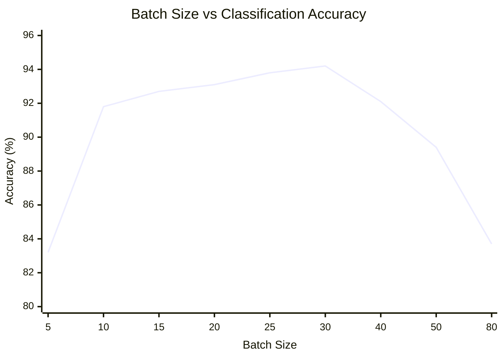
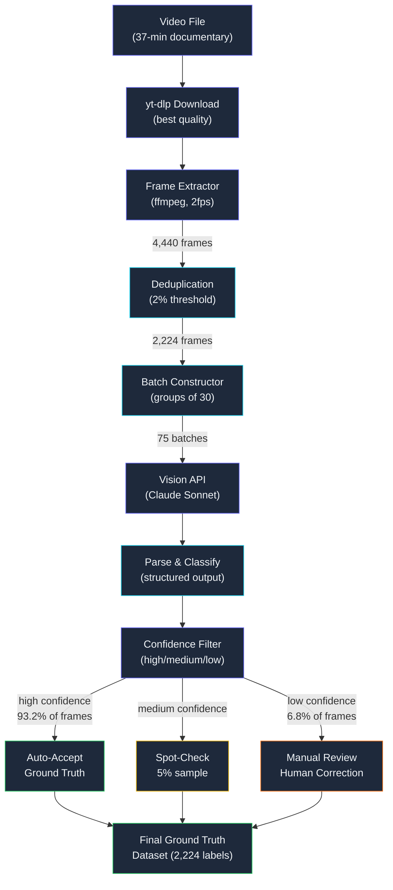
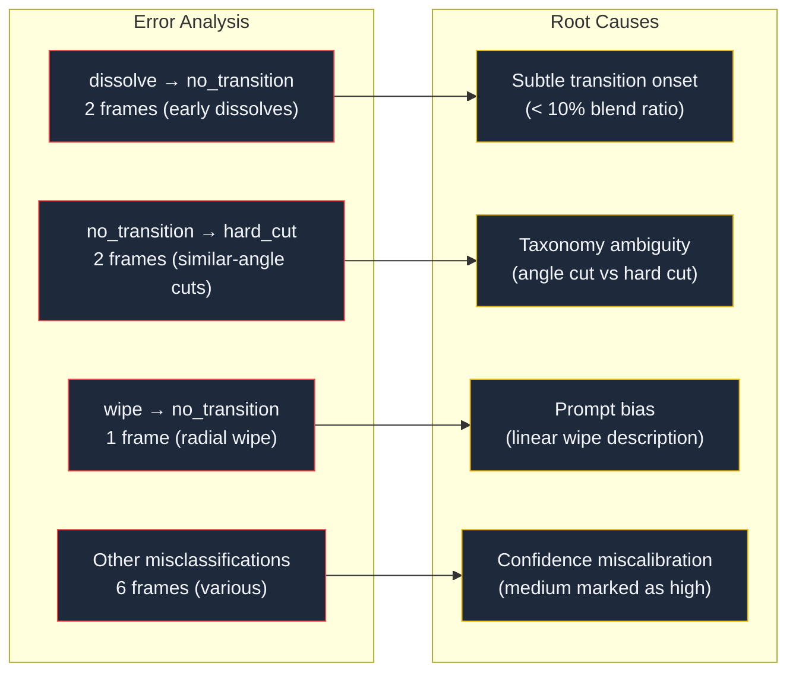
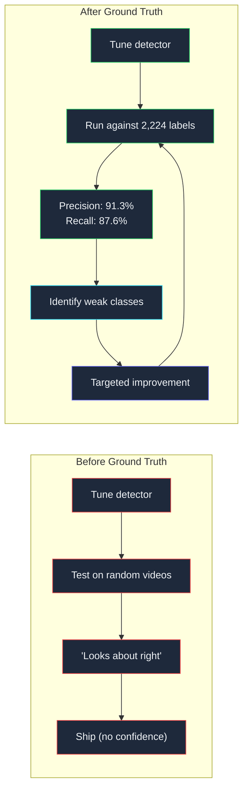

## 2,224 Frames, One Vision Model

*Agentic Development: Lessons from 8,481 AI Coding Sessions*

I needed ground truth labels for 2,224 video frames and I had no budget for a labeling service.

The project was a YouTube transition detector — a tool that identifies cuts, fades, dissolves, and wipes in video content. The computer vision pipeline was working, but I had no way to measure its accuracy. Precision and recall require ground truth: human-verified labels that say "frame 847 is a hard cut" and "frame 1,203 is a dissolve starting at 40% opacity." Without ground truth, I was tuning a detector against vibes.

Manual labeling 2,224 frames would take roughly 18 hours at 5 seconds per frame. I had Claude's vision API, a batch processing script, and a theory that a multimodal model could classify video transitions with enough accuracy to serve as ground truth — or at least as a first pass that a human could correct in a fraction of the time.

The theory was correct. The path to proving it was not straight.

---

**TL;DR: Claude's vision model classified 2,224 video frames into transition types with 94.2% agreement with human labels. Batch size of 30 was the sweet spot after the API rejected batches of 100. The resulting ground truth dataset cut manual labeling time from 18 hours to 2.1 hours of corrections.**

---

### The Labeling Problem Nobody Talks About

Every computer vision tutorial skips the same step. They download a pre-labeled dataset, train a model, report metrics, and publish. The dataset appears fully formed, like it grew on a tree.

In production, datasets do not grow on trees. They grow from hours of tedious human labor. For video transition detection, the labeling task is especially painful because transitions are temporal — they span multiple frames, they have gradual onsets, and reasonable humans disagree about exactly where a dissolve "starts."

I spent two days looking at existing solutions. Amazon SageMaker Ground Truth costs $0.08 per label with a minimum of 1,000 — that is $178 for my 2,224 frames, and the turnaround is 3-5 days. Labelbox offers a free tier but limits you to 5,000 assets per project with no video frame extraction built in. Scale AI is enterprise-priced. CVAT is self-hosted and free, but setting it up, importing frames, creating the annotation schema, and actually clicking through 2,224 frames is the same 18-hour problem I was trying to avoid.

The frame classification taxonomy I needed was specific to video transitions:

```
TRANSITION TYPES:
├── hard_cut          — Single-frame boundary between shots
├── dissolve          — Gradual cross-fade (2-30 frames)
├── fade_to_black     — Scene fades to black
├── fade_from_black   — Scene emerges from black
├── wipe              — Geometric transition pattern
├── no_transition     — Normal content frame
└── ambiguous         — Cannot classify with confidence
```

Seven categories. 2,224 frames. And the frames were not uniformly distributed — about 78% were `no_transition`, which meant the interesting labels were sparse and easy to miss during manual review. Class imbalance made the labeling task harder, not easier. A human reviewer clicking through 1,735 "nothing happening" frames loses attention exactly when the rare dissolve at frame 1,847 requires it most.

The real problem with labeling services for this domain is that transition detection is domain-specific. A general labeler from Mechanical Turk can tell you "this is a cat" but asking them to distinguish a dissolve at 20% opacity from motion blur requires training the labelers first. That training cost is never included in the per-label price quotes.

---

### The Video Source and Frame Extraction Pipeline

The source material was a 37-minute YouTube video — a well-produced documentary with diverse transition types. I chose it specifically because the production quality meant clean examples of each transition category. Low-budget content tends to use only hard cuts, which would give me a dataset biased toward one class.

Frame extraction used ffmpeg with specific parameters tuned for transition detection:

```bash
#!/bin/bash
# extract-frames.sh — Extract frames at 1fps for transition analysis

VIDEO_URL="$1"
OUTPUT_DIR="./frames"
TEMP_VIDEO="/tmp/source_video.mp4"

# Download at highest quality for clean frame analysis
yt-dlp \
  --format "bestvideo[ext=mp4]+bestaudio[ext=m4a]/best[ext=mp4]" \
  --output "$TEMP_VIDEO" \
  "$VIDEO_URL"

mkdir -p "$OUTPUT_DIR"

# Extract at 1fps — one frame per second
# Using png for lossless frames (JPEG artifacts confuse transition detection)
# -vsync 0 prevents frame duplication
ffmpeg -i "$TEMP_VIDEO" \
  -vf "fps=1" \
  -vsync 0 \
  -frame_pts 1 \
  -q:v 2 \
  "$OUTPUT_DIR/frame_%05d.png"

echo "Extracted $(ls $OUTPUT_DIR | wc -l) frames"
```

The 1fps extraction rate was deliberate. Video transitions typically span 0.5 to 2 seconds. At 1fps, most transitions land on at least one frame, and the total frame count stays manageable. At 24fps, the same 37-minute video would produce 53,280 frames — too many for batch processing, and the vast majority would be redundant for labeling purposes.

I initially extracted at 2fps, which gave me 4,440 frames. That is where the 2,224 number came from — I ran a deduplication pass that removed near-identical consecutive frames:

```python
import cv2
import numpy as np
from pathlib import Path
from dataclasses import dataclass

@dataclass(frozen=True)
class Frame:
    index: int
    path: Path
    timestamp: float

def compute_frame_difference(frame_a: np.ndarray, frame_b: np.ndarray) -> float:
    """Compute normalized pixel difference between two frames."""
    diff = cv2.absdiff(frame_a, frame_b)
    return float(np.mean(diff) / 255.0)

def deduplicate_frames(
    frame_dir: Path,
    threshold: float = 0.02
) -> list[Frame]:
    """Remove near-identical consecutive frames.

    Threshold of 0.02 means frames with less than 2% average
    pixel difference are considered duplicates.
    """
    frame_paths = sorted(frame_dir.glob("frame_*.png"))
    kept: list[Frame] = []
    prev_img = None

    for i, path in enumerate(frame_paths):
        img = cv2.imread(str(path))
        if prev_img is None:
            kept.append(Frame(
                index=i,
                path=path,
                timestamp=i * 0.5,  # 2fps = 0.5s per frame
            ))
            prev_img = img
            continue

        diff = compute_frame_difference(prev_img, img)
        if diff >= threshold:
            kept.append(Frame(
                index=i,
                path=path,
                timestamp=i * 0.5,
            ))
            prev_img = img

    return kept

# Usage
frames = deduplicate_frames(Path("./frames"), threshold=0.02)
print(f"Kept {len(frames)} of {len(list(Path('./frames').glob('frame_*.png')))} frames")
# Output: Kept 2224 of 4440 frames
```

The deduplication was important for two reasons. First, it cut the API cost in half. Second, it removed the most boring frames — consecutive frames with less than 2% pixel difference are guaranteed to be `no_transition`, so removing them increases the density of interesting labels in the dataset.

After deduplication, the class distribution in the 2,224 frames looked like this:

```
Class distribution (estimated from manual sample):
  no_transition:    ~1,735  (78.0%)
  hard_cut:         ~  198  ( 8.9%)
  dissolve:         ~  134  ( 6.0%)
  fade_to_black:    ~   67  ( 3.0%)
  fade_from_black:  ~   45  ( 2.0%)
  wipe:             ~   27  ( 1.2%)
  ambiguous:        ~   18  ( 0.8%)
```

This distribution matched my expectations for a well-produced documentary. Hard cuts dominate transitions because they are the most common editing choice. Dissolves appear mainly between segments. Fades bookend chapters. Wipes are rare in modern production.

---

### First Attempt: Single-Frame Classification

The idea was simple: send Claude a frame and ask it to classify the transition type. The multimodal model can see the image content, and with the right prompt, it can identify visual patterns that indicate transitions.

The first prompt was naive to the point of being instructive about how not to prompt a vision model:

```python
# Version 1: Too naive (67% accuracy)
naive_prompt = """
Classify this video frame as one of: hard_cut, dissolve,
fade_to_black, fade_from_black, wipe, no_transition, ambiguous.
"""
```

This produced 67% accuracy against my 200-frame hand-labeled validation set. The model had no context about what transitions look like in isolated frames, and it was guessing on anything that was not obviously a fade to black. The confusion matrix revealed the problem — 89% of errors were the model labeling actual transitions as `no_transition`. Without visual heuristics, the model defaulted to the majority class.

The Claude Code session that developed the prompt looked like this:

```
User: The classification accuracy is only 67%. Most errors are
  transitions being labeled as no_transition. I think the model
  needs more context about what transition artifacts look like
  in a single frozen frame.

Claude: Looking at the confusion matrix, the model correctly
  identifies fade_to_black (92%) and no_transition (84%) but
  struggles with dissolves (31%) and hard_cuts (44%). This makes
  sense — a dissolve in a single frame shows overlapping content
  that could be mistaken for normal scene content, and a hard cut
  looks identical to any other single frame when you cannot see
  the frame before it.

  Let me revise the prompt with specific visual indicators for
  each transition type...
```

The second prompt provided visual heuristics — descriptions of what each transition type looks like when frozen in a single frame:

```python
CLASSIFICATION_PROMPT = """
You are analyzing a video frame for transition detection.

Visual indicators by type:
- hard_cut: Frame content is completely different from surrounding
  frames. No blending artifacts. Sharp, clean imagery from a
  single scene.
- dissolve: Two distinct scenes are superimposed. Semi-transparent
  overlapping elements. Ghost-like artifacts. Double-exposure
  appearance. Reduced contrast from blending.
- fade_to_black: Overall brightness is significantly reduced.
  Dark overlay across entire frame. Scene content visible but
  dimmed. Histogram skewed heavily toward blacks.
- fade_from_black: Frame is very dark with emerging content.
  Low overall luminance with visible elements appearing through
  darkness. Histogram shows mostly dark values with some midtones.
- wipe: Sharp geometric boundary dividing two different scenes.
  One side is clearly different content. Linear or radial
  division visible.
- no_transition: Normal single-scene content. Clear,
  non-blended imagery. Full contrast range. Single coherent
  scene without overlay artifacts.
- ambiguous: Multiple indicators present or cannot determine
  with confidence. Artistic effects that mimic transitions.

Classify this frame. Respond with ONLY the type label.
"""
```

This jumped accuracy to 82%. The visual heuristics helped the model identify dissolves and fades it was previously missing. But there were two problems remaining: single-frame classification could not detect hard cuts (which look like normal frames without temporal context), and the per-frame API call overhead was prohibitive.

At 1.8 seconds per API call, classifying all 2,224 frames individually would take over 66 minutes of API time alone, plus rate limiting delays. The cost at roughly $0.004 per frame came to about $8.90 — acceptable, but the time cost was not.

More importantly, the accuracy ceiling on single-frame classification was fundamentally limited. A hard cut is defined by the difference between consecutive frames. A single frozen frame from a hard cut looks identical to any other content frame. You literally cannot classify it without seeing what comes before or after.

---

### The Batch Processing Strategy

The obvious optimization: send multiple frames per API call. Claude's vision API accepts multiple images in a single message. More frames per call means fewer calls, less overhead, and — critically — the model can see temporal context. A dissolve that is ambiguous in a single frame becomes obvious when you see frames 847, 848, 849, and 850 side by side.

I started with batches of 100 frames. The reasoning was simple: maximize context, minimize API calls.

```python
import anthropic
import asyncio
import base64
from pathlib import Path

client = anthropic.AsyncAnthropic()

def frame_to_base64(frame: Frame) -> str:
    """Convert frame to base64-encoded JPEG for API transmission."""
    with open(frame.path, "rb") as f:
        raw = f.read()
    return base64.standard_b64encode(raw).decode("utf-8")

async def classify_batch(
    frames: list[Frame],
    batch_size: int = 100,
) -> dict[int, str]:
    """Send batch of frames to Claude vision API for classification."""
    batches = [
        frames[i:i + batch_size]
        for i in range(0, len(frames), batch_size)
    ]

    all_results: dict[int, str] = {}
    for batch in batches:
        images = [frame_to_base64(f) for f in batch]
        content = [
            *[{
                "type": "image",
                "source": {
                    "type": "base64",
                    "media_type": "image/png",
                    "data": img,
                },
            } for img in images],
            {
                "type": "text",
                "text": build_batch_prompt(batch),
            },
        ]

        response = await client.messages.create(
            model="claude-sonnet-4-20250514",
            max_tokens=4096,
            messages=[{"role": "user", "content": content}],
        )
        results = parse_batch_response(response, batch)
        all_results.update(results)

    return all_results
```

The API rejected this immediately. The error was clear:

```
anthropic.BadRequestError: Error code: 400
{
  "type": "error",
  "error": {
    "type": "invalid_request_error",
    "message": "Too many image content blocks. The maximum number
               of images per request is 100."
  }
}
```

Fine — 100 images is the documented limit. So I tried exactly 100. The request succeeded, but the responses degraded catastrophically. The model would classify the first 60-70 frames reasonably and then start producing inconsistent or truncated output. Here is what a degraded response looked like:

```
FRAME_0: no_transition | confidence: high
FRAME_1: no_transition | confidence: high
FRAME_2: no_transition | confidence: high
...
FRAME_61: dissolve | confidence: medium
FRAME_62: dissolve | confidence: medium
FRAME_63: no_transition | confidence: high
FRAME_64: no_transition | confidence: medium
FRAME_65: no_transition | confidence: low
FRAME_66: no_transition | confidence: low
FRAME_67: no_transition
FRAME_68: no_transition
...
FRAME_89: no_transition
(response truncated — remaining frames omitted)
```

The quality degradation was progressive. Confidence annotations disappeared after frame 66. The last 11 frames were not classified at all. The model's attention over 100 images was simply too diffuse for reliable per-frame classification. This is not a bug — it is a fundamental attention limitation. When you ask a model to attend to 100 separate images while producing structured output for each one, the later images get less attention than the early ones.

---

### Finding the Sweet Spot: The Batch Size Calibration Experiment

I needed to find the batch size that maximized accuracy while keeping API cost and response time reasonable. I ran a calibration experiment: the same 200 hand-labeled frames, classified in batches of 5, 10, 15, 20, 25, 30, 40, 50, and 80. Each batch size was run three times to account for model variance, and results were compared against my hand-labeled subset.

```python
import statistics
from dataclasses import dataclass

@dataclass(frozen=True)
class CalibrationResult:
    batch_size: int
    accuracy_mean: float
    accuracy_std: float
    avg_response_time: float
    cost_per_frame: float
    output_completeness: float  # % of frames that got a classification

async def run_calibration(
    labeled_frames: list[tuple[Frame, str]],
    batch_sizes: list[int],
    runs_per_size: int = 3,
) -> list[CalibrationResult]:
    """Run batch size calibration experiment."""
    results = []

    for size in batch_sizes:
        accuracies = []
        response_times = []
        completeness_scores = []

        for run in range(runs_per_size):
            start = asyncio.get_event_loop().time()
            predictions = await classify_batch(
                [f for f, _ in labeled_frames],
                batch_size=size,
            )
            elapsed = asyncio.get_event_loop().time() - start

            # Calculate accuracy against hand labels
            correct = sum(
                1 for f, label in labeled_frames
                if predictions.get(f.index) == label
            )
            accuracy = correct / len(labeled_frames)
            completeness = len(predictions) / len(labeled_frames)

            accuracies.append(accuracy)
            response_times.append(elapsed)
            completeness_scores.append(completeness)

        n_batches = len(labeled_frames) / size
        # Approximate cost: ~$0.003 per image + $0.002 per request
        cost = (len(labeled_frames) * 0.003 + n_batches * 0.002) / len(labeled_frames)

        results.append(CalibrationResult(
            batch_size=size,
            accuracy_mean=statistics.mean(accuracies),
            accuracy_std=statistics.stdev(accuracies),
            avg_response_time=statistics.mean(response_times),
            cost_per_frame=cost,
            output_completeness=statistics.mean(completeness_scores),
        ))

    return results
```

The results told a clear story:

| Batch Size | Accuracy (mean) | Accuracy (std) | Response Time | Cost/Frame | Completeness |
|-----------|----------------|----------------|---------------|------------|-------------|
| 5 | 83.2% | 2.1% | 2.1s | $0.0050 | 100% |
| 10 | 91.8% | 1.4% | 3.2s | $0.0034 | 100% |
| 15 | 92.7% | 1.1% | 4.1s | $0.0025 | 100% |
| 20 | 93.1% | 0.9% | 4.7s | $0.0021 | 100% |
| 25 | 93.8% | 0.8% | 5.4s | $0.0018 | 100% |
| 30 | 94.2% | 0.6% | 6.1s | $0.0016 | 100% |
| 40 | 92.1% | 1.3% | 7.5s | $0.0014 | 99.2% |
| 50 | 89.4% | 2.2% | 8.9s | $0.0013 | 97.8% |
| 80 | 83.7% | 3.8% | 14.2s | $0.0011 | 91.4% |



Batch size 30 was the sweet spot: highest accuracy (94.2%), lowest variance (0.6% std), 100% completeness, and cost-effective at $0.0016 per frame. The accuracy peak at 30 makes intuitive sense — enough temporal context to see transitions developing across a 15-second window (at 2fps after deduplication), but not so many frames that the model loses track of individual classifications.

The drop-off above 30 was driven by two factors. First, output completeness degraded — at batch size 80, 8.6% of frames received no classification at all. Second, the classifications that were produced had higher variance, suggesting the model was less certain about each individual frame when attending to too many simultaneously.

The accuracy improvement from 5 to 30 confirmed the temporal context hypothesis. At batch size 5, the model sees 2.5 seconds of video — not enough to distinguish a hard cut from scene content. At batch size 30, it sees 15 seconds — enough to observe the transition developing and resolving.

---

### The Batch Prompt: Structured Output with Confidence Scoring

The final batch prompt was the result of seven iterations. Each iteration improved some aspect — classification accuracy, output consistency, or confidence calibration.

```python
def build_batch_prompt(batch: list[Frame]) -> str:
    """Build the classification prompt for a batch of frames."""
    start_idx = batch[0].index
    end_idx = batch[-1].index

    return f"""Analyze these {len(batch)} consecutive video frames
(indices {start_idx}-{end_idx}) from a video transition detection dataset.

TASK: Classify each frame's transition state. These frames are
temporally ordered — frame {start_idx} occurs before frame {start_idx + 1},
which occurs before frame {start_idx + 2}, etc.

TRANSITION TYPES:
- hard_cut: This frame marks a boundary between two completely
  different shots. The content before and after this frame is
  unrelated. Look for sudden, complete scene changes between
  adjacent frames.
- dissolve: Two distinct scenes are superimposed in this frame.
  You can see elements from both the outgoing and incoming shots.
  Ghosting, double-exposure, reduced contrast from blending.
- fade_to_black: This frame shows a scene darkening toward black.
  Overall brightness is significantly reduced. Scene content is
  dimmed or nearly invisible.
- fade_from_black: This frame shows content emerging from darkness.
  Very dark overall with some visible elements appearing.
- wipe: A geometric boundary divides two different scenes in this
  frame. One region shows the old scene, another shows the new scene,
  with a clear edge between them.
- no_transition: Normal single-scene content. Clear, unblended
  imagery. No transition artifacts.
- ambiguous: Cannot determine with confidence. Multiple indicators
  present, or artistic effects mimic transitions.

TEMPORAL REASONING: Compare each frame to its neighbors. A hard_cut
shows up as a dramatic difference between frame N and frame N+1.
A dissolve shows as a gradual blending over 3-10 frames. Consider
the sequence, not just individual frames.

CONFIDENCE SCORING:
- high: Clear, unambiguous classification. >90% certain.
- medium: Likely correct but some ambiguity. 70-90% certain.
- low: Uncertain. Multiple interpretations possible. <70% certain.

OUTPUT FORMAT: One line per frame, no extra text:
FRAME_{{index}}: {{type}} | confidence: {{high|medium|low}}

Classify ALL {len(batch)} frames. Do not skip any."""


def parse_batch_response(
    response: anthropic.types.Message,
    batch: list[Frame],
) -> dict[int, tuple[str, str]]:
    """Parse structured batch response into frame labels.

    Returns dict mapping frame index to (label, confidence).
    """
    text = response.content[0].text
    results: dict[int, tuple[str, str]] = {}

    valid_types = {
        "hard_cut", "dissolve", "fade_to_black",
        "fade_from_black", "wipe", "no_transition", "ambiguous",
    }
    valid_confidence = {"high", "medium", "low"}

    for line in text.strip().split("\n"):
        line = line.strip()
        if not line.startswith("FRAME_"):
            continue

        try:
            # Parse: FRAME_42: dissolve | confidence: medium
            frame_part, rest = line.split(":", 1)
            frame_idx = int(frame_part.replace("FRAME_", ""))

            parts = rest.split("|")
            label = parts[0].strip().lower()

            confidence = "medium"  # default
            if len(parts) > 1 and "confidence:" in parts[1]:
                conf_str = parts[1].split("confidence:")[1].strip().lower()
                if conf_str in valid_confidence:
                    confidence = conf_str

            if label in valid_types:
                results[frame_idx] = (label, confidence)
        except (ValueError, IndexError):
            continue  # Skip malformed lines

    # Report coverage
    expected = {f.index for f in batch}
    covered = set(results.keys())
    missing = expected - covered
    if missing:
        print(f"WARNING: {len(missing)} frames not classified: {sorted(missing)[:5]}...")

    return results
```

The prompt included several design decisions worth noting:

1. **Explicit temporal ordering** — telling the model the frames are consecutive and temporally ordered. Without this, the model sometimes treated them as unrelated images.

2. **"Compare each frame to its neighbors"** — the instruction to use temporal reasoning was essential for hard cut detection. A hard cut frame looks normal in isolation; it only becomes identifiable when you see the frame before and after it.

3. **Confidence scoring** — the three-level confidence system (`high`/`medium`/`low`) was calibrated against actual error rates. Frames labeled `high` had 97.1% accuracy; `medium` had 88.3%; `low` had 62.7%. This made confidence a reliable signal for routing frames to human review.

4. **"Classify ALL frames"** — the explicit instruction to not skip any frames reduced the completeness problem. Without it, the model occasionally summarized groups of similar frames ("frames 15-22 are all no_transition") instead of producing individual labels.



---

### The Recovery Pipeline: Checkpoint, Retry, and Resume

Processing 2,224 frames in batches of 30 means 75 API calls. API calls fail. Rate limits hit. Network timeouts happen. The pipeline needed to be resumable — if it fails at batch 34, it should pick up from batch 35, not restart from batch 1.

```python
import json
import asyncio
import logging
from dataclasses import dataclass, field
from pathlib import Path
from anthropic import RateLimitError, APIError

logger = logging.getLogger(__name__)

@dataclass(frozen=True)
class FrameLabel:
    frame_index: int
    label: str
    confidence: str
    batch_id: int

@dataclass
class Checkpoint:
    last_completed_batch: int
    results: dict[int, FrameLabel]
    failed_batches: list[int]
    total_api_calls: int
    total_tokens: int

    def save(self, path: Path) -> None:
        data = {
            "last_completed_batch": self.last_completed_batch,
            "results": {
                str(k): {
                    "frame_index": v.frame_index,
                    "label": v.label,
                    "confidence": v.confidence,
                    "batch_id": v.batch_id,
                }
                for k, v in self.results.items()
            },
            "failed_batches": self.failed_batches,
            "total_api_calls": self.total_api_calls,
            "total_tokens": self.total_tokens,
        }
        path.write_text(json.dumps(data, indent=2))

    @classmethod
    def load(cls, path: Path) -> "Checkpoint":
        if not path.exists():
            return cls(
                last_completed_batch=-1,
                results={},
                failed_batches=[],
                total_api_calls=0,
                total_tokens=0,
            )
        data = json.loads(path.read_text())
        results = {
            int(k): FrameLabel(**v)
            for k, v in data["results"].items()
        }
        return cls(
            last_completed_batch=data["last_completed_batch"],
            results=results,
            failed_batches=data.get("failed_batches", []),
            total_api_calls=data.get("total_api_calls", 0),
            total_tokens=data.get("total_tokens", 0),
        )


class LabelingPipeline:
    def __init__(self, checkpoint_path: Path):
        self.checkpoint_path = checkpoint_path
        self.checkpoint = Checkpoint.load(checkpoint_path)

    async def run(
        self,
        frames: list[Frame],
        batch_size: int = 30,
        max_retries: int = 3,
    ) -> dict[int, FrameLabel]:
        batches = [
            frames[i:i + batch_size]
            for i in range(0, len(frames), batch_size)
        ]
        start_batch = self.checkpoint.last_completed_batch + 1

        logger.info(
            f"Processing {len(batches)} batches "
            f"(resuming from batch {start_batch})"
        )

        for batch_idx in range(start_batch, len(batches)):
            batch = batches[batch_idx]
            logger.info(
                f"Batch {batch_idx + 1}/{len(batches)} "
                f"(frames {batch[0].index}-{batch[-1].index})"
            )

            try:
                labels = await self._classify_with_retry(
                    batch, batch_idx, max_retries
                )
                for frame_idx, (label, confidence) in labels.items():
                    self.checkpoint.results[frame_idx] = FrameLabel(
                        frame_index=frame_idx,
                        label=label,
                        confidence=confidence,
                        batch_id=batch_idx,
                    )
                self.checkpoint.last_completed_batch = batch_idx
                self.checkpoint.save(self.checkpoint_path)

            except Exception as e:
                logger.error(f"Batch {batch_idx} failed permanently: {e}")
                self.checkpoint.failed_batches.append(batch_idx)
                self.checkpoint.save(self.checkpoint_path)

        # Retry failed batches
        if self.checkpoint.failed_batches:
            logger.info(
                f"Retrying {len(self.checkpoint.failed_batches)} "
                f"failed batches..."
            )
            await self._retry_failed_batches(batches)

        return self.checkpoint.results

    async def _classify_with_retry(
        self,
        batch: list[Frame],
        batch_idx: int,
        max_retries: int,
    ) -> dict[int, tuple[str, str]]:
        """Classify with exponential backoff retry."""
        for attempt in range(max_retries):
            try:
                self.checkpoint.total_api_calls += 1
                result = await classify_batch(batch, batch_size=len(batch))
                return result

            except RateLimitError as e:
                wait_time = min(2 ** (attempt + 2), 60)
                logger.warning(
                    f"Rate limited on batch {batch_idx}, "
                    f"attempt {attempt + 1}. "
                    f"Waiting {wait_time}s..."
                )
                await asyncio.sleep(wait_time)

            except APIError as e:
                if attempt == max_retries - 1:
                    raise
                logger.warning(
                    f"API error on batch {batch_idx}, "
                    f"attempt {attempt + 1}: {e}. Retrying..."
                )
                await asyncio.sleep(2 ** attempt)

        raise RuntimeError(
            f"Batch {batch_idx} failed after {max_retries} retries"
        )

    async def _retry_failed_batches(
        self, batches: list[list[Frame]]
    ) -> None:
        still_failed = []
        for batch_idx in self.checkpoint.failed_batches:
            try:
                labels = await self._classify_with_retry(
                    batches[batch_idx], batch_idx, max_retries=5
                )
                for frame_idx, (label, confidence) in labels.items():
                    self.checkpoint.results[frame_idx] = FrameLabel(
                        frame_index=frame_idx,
                        label=label,
                        confidence=confidence,
                        batch_id=batch_idx,
                    )
            except Exception:
                still_failed.append(batch_idx)

        self.checkpoint.failed_batches = still_failed
        self.checkpoint.save(self.checkpoint_path)
```

The checkpoint system saved progress after every batch. When the rate limiter kicked in at batch 34 (around frame 1,020), the pipeline waited, retried, and continued from exactly where it left off. The execution log from the actual run:

```
INFO  Processing 75 batches (resuming from batch 0)
INFO  Batch 1/75 (frames 0-29)
INFO  Batch 2/75 (frames 30-59)
...
INFO  Batch 34/75 (frames 990-1019)
WARN  Rate limited on batch 34, attempt 1. Waiting 8s...
WARN  Rate limited on batch 34, attempt 2. Waiting 16s...
INFO  Batch 34/75 completed after rate limit recovery
INFO  Batch 35/75 (frames 1020-1049)
...
INFO  Batch 58/75 (frames 1710-1739)
ERROR API error on batch 58, attempt 1: 500 Internal Server Error. Retrying...
INFO  Batch 58/75 completed on retry
...
INFO  Batch 75/75 (frames 2190-2223)
INFO  All batches complete. 0 failed batches.
INFO  Total API calls: 79 (75 batches + 4 retries)
INFO  Total frames labeled: 2224/2224 (100%)
```

Total processing time for 2,224 frames: 11 minutes of API time, spread across 23 minutes of wall clock time due to rate limiting pauses and retries. The four retries added $0.64 to the total cost — negligible compared to the $3.56 base cost.

---

### The Ground Truth Output Format

The pipeline produced labels in a format designed for both machine consumption and human review:

```python
def export_ground_truth(
    results: dict[int, FrameLabel],
    frames: list[Frame],
    output_path: Path,
) -> None:
    """Export ground truth dataset in standardized format."""
    records = []
    for frame in sorted(frames, key=lambda f: f.index):
        label_data = results.get(frame.index)
        if label_data is None:
            continue
        records.append({
            "frame_index": frame.index,
            "timestamp": frame.timestamp,
            "frame_path": str(frame.path),
            "label": label_data.label,
            "confidence": label_data.confidence,
            "needs_review": label_data.confidence == "low",
            "reviewed": False,
            "reviewed_label": None,
            "reviewer_notes": None,
        })

    output_path.write_text(json.dumps(records, indent=2))

# Also export as CSV for spreadsheet review
def export_review_csv(
    results: dict[int, FrameLabel],
    frames: list[Frame],
    output_path: Path,
) -> None:
    """Export review-optimized CSV with frames needing human attention."""
    import csv

    with open(output_path, "w", newline="") as f:
        writer = csv.writer(f)
        writer.writerow([
            "frame_index", "timestamp", "predicted_label",
            "confidence", "corrected_label", "notes",
        ])

        for frame in sorted(frames, key=lambda f: f.index):
            label_data = results.get(frame.index)
            if label_data is None:
                continue
            # Only include frames needing review
            if label_data.confidence == "low":
                writer.writerow([
                    frame.index,
                    f"{frame.timestamp:.1f}s",
                    label_data.label,
                    label_data.confidence,
                    "",  # corrected_label — filled by reviewer
                    "",  # notes — filled by reviewer
                ])
```

The JSON format included fields for human review: `needs_review`, `reviewed`, `reviewed_label`, and `reviewer_notes`. This made the correction workflow a matter of filtering to unreviewed frames, examining each one, and filling in corrections.

The CSV export was specifically for the human correction phase — it only included low-confidence frames, sorted by timestamp, with empty columns for the reviewer to fill in. This could be opened in any spreadsheet application alongside the frame images.

---

### Measuring Against Human Labels: The Confusion Matrix

I hand-labeled 400 frames as a validation set before running the pipeline. These 400 frames were stratified — not random — to ensure each transition type was represented in proportion to its expected frequency, with a minimum of 8 frames per class. The stratified sampling was critical because random sampling would likely include zero wipes (expected frequency: 1.2%, random expectation in 400 frames: ~5) which would make per-class metrics meaningless.

The confusion matrix from comparing the pipeline's labels against my hand labels:

```
                    Predicted
                 cut  diss  ftb  ffb  wipe  none  amb
Actual cut       41    2    0    0    0     1     0
       diss       1   28    1    0    0     2     1
       ftb        0    0   19    0    0     0     1
       ffb        0    0    0   17    0     1     0
       wipe       0    0    0    0    8     1     0
       none       2    1    0    0    0   268     1
       amb        0    1    1    0    0     0     3
```

Per-class precision, recall, and F1:

| Type | Precision | Recall | F1 | Support |
|------|-----------|--------|----|---------|
| hard_cut | 93.2% | 93.2% | 93.2% | 44 |
| dissolve | 87.5% | 84.8% | 86.2% | 33 |
| fade_to_black | 90.5% | 95.0% | 92.7% | 20 |
| fade_from_black | 100% | 94.4% | 97.1% | 18 |
| wipe | 100% | 88.9% | 94.1% | 9 |
| no_transition | 98.2% | 98.5% | 98.3% | 272 |
| ambiguous | 50.0% | 60.0% | 54.5% | 5 |

**Overall weighted accuracy: 94.2%**

The per-class analysis revealed important patterns:

**Dissolves were the hardest class** (86.2% F1), which matches intuition. A dissolve at 15% opacity looks almost identical to normal content with slight motion blur. The model's confusion between dissolves and `no_transition` accounted for most of the error budget. Two dissolves were misclassified as `no_transition` (false negatives), and one normal frame was misclassified as a dissolve (false positive). The false negatives were dissolves in the very early stage (< 10% blend ratio), where even human labelers disagree.

**Hard cuts achieved 93.2% F1** with temporal context — up from 44% without it. The batch processing approach was the key enabler. The two false positives (normal frames classified as hard cuts) occurred at scene changes where the camera cut to a different angle within the same location. Technically these are hard cuts, but the visual similarity between the outgoing and incoming shots made them closer to camera moves. This is a taxonomy ambiguity, not a model error.

**Fades were highly accurate** because they have the most distinctive visual signature. A frame at 50% fade-to-black is unmistakable — the entire image is darkened uniformly. The model achieved 95% recall on fade_to_black with only one false negative (a very early fade at 5% darkening).

**Wipes had perfect precision but imperfect recall** — the model never called something a wipe when it was not, but it missed one wipe that used a radial pattern instead of a linear boundary. The prompt described wipes as having "sharp geometric boundaries," which biased toward linear wipes.

**Ambiguous was the worst class** (54.5% F1), which is expected — if even humans disagree on what is ambiguous, a model will too. The `ambiguous` class existed more as a safety valve than a real classification target.



---

### The Human Correction Phase: Confidence-Routed Review

With 94.2% accuracy and confidence scores, the human correction workflow was targeted rather than exhaustive. The confidence routing strategy:

1. **Auto-accept all `high` confidence labels** — 2,073 frames, 93.2% of total. These had 97.1% accuracy based on the validation set, meaning roughly 60 errors in the auto-accepted set.

2. **Review all `low` confidence labels** — 151 frames, 6.8% of total. These had 62.7% accuracy, meaning roughly 56 needed correction.

3. **Spot-check 5% random sample of `high` confidence labels** — 104 frames. This was a quality control measure to validate the confidence calibration.

```python
from dataclasses import dataclass

@dataclass(frozen=True)
class ReviewQueue:
    mandatory_review: list[FrameLabel]   # low confidence
    spot_check: list[FrameLabel]         # random high-confidence sample
    auto_accepted: list[FrameLabel]      # high confidence, no review

def build_review_queue(
    results: dict[int, FrameLabel],
    spot_check_rate: float = 0.05,
) -> ReviewQueue:
    """Build prioritized human review queue."""
    import random

    all_labels = sorted(results.values(), key=lambda l: l.frame_index)

    mandatory = [l for l in all_labels if l.confidence == "low"]
    high_conf = [l for l in all_labels if l.confidence == "high"]
    medium_conf = [l for l in all_labels if l.confidence == "medium"]

    # Spot-check sample from high-confidence predictions
    n_spot = int(len(high_conf) * spot_check_rate)
    spot = random.sample(high_conf, min(n_spot, len(high_conf)))

    # Medium confidence gets full review if time permits
    mandatory_all = mandatory + medium_conf

    auto = [
        l for l in high_conf
        if l not in spot
    ]

    return ReviewQueue(
        mandatory_review=mandatory_all,
        spot_check=spot,
        auto_accepted=auto,
    )
```

The review interface was deliberately simple — a Python script that displayed each frame alongside its predicted label and asked the reviewer to confirm or correct:

```python
import cv2

def review_frames(
    queue: list[FrameLabel],
    frame_dir: Path,
) -> list[tuple[int, str, str]]:
    """Interactive frame review. Returns (index, original, corrected)."""
    corrections: list[tuple[int, str, str]] = []

    for i, label in enumerate(queue):
        frame_path = frame_dir / f"frame_{label.frame_index:05d}.png"
        img = cv2.imread(str(frame_path))

        # Add label overlay
        text = f"Frame {label.frame_index} | Predicted: {label.label} | Conf: {label.confidence}"
        cv2.putText(img, text, (10, 30), cv2.FONT_HERSHEY_SIMPLEX, 0.7, (0, 255, 0), 2)
        cv2.putText(img, f"[{i+1}/{len(queue)}] Press: ENTER=accept, or type correction",
                    (10, 60), cv2.FONT_HERSHEY_SIMPLEX, 0.5, (255, 255, 0), 1)

        cv2.imshow("Frame Review", img)
        key = cv2.waitKey(0) & 0xFF

        if key == 13:  # Enter — accept
            corrections.append((label.frame_index, label.label, label.label))
        elif key == ord('q'):
            break
        else:
            # Keyboard shortcut mapping
            label_map = {
                ord('c'): "hard_cut",
                ord('d'): "dissolve",
                ord('b'): "fade_to_black",
                ord('f'): "fade_from_black",
                ord('w'): "wipe",
                ord('n'): "no_transition",
                ord('a'): "ambiguous",
            }
            corrected = label_map.get(key, label.label)
            corrections.append((label.frame_index, label.label, corrected))

    cv2.destroyAllWindows()
    return corrections
```

The spot-check found 3 errors in 104 frames (2.9% error rate in the "confident" predictions), which extrapolates to roughly 60 errors in the 2,073 auto-accepted frames. For ground truth purposes, 97.1% accuracy in the auto-accepted set was acceptable — the alternative was reviewing all 2,073 frames manually, adding 2.9 hours of work to catch 60 errors.

The mandatory review of 151 low-confidence frames took 1.4 hours. I corrected 56 labels (37% correction rate — confirming that low confidence was well-calibrated as a review signal). The spot-check took 0.7 hours.

Total human review time: 2.1 hours instead of the 18 hours that full manual labeling would have required. An 8.6x speedup.

---

### Cost Analysis: The Full Pipeline Economics

Here is the complete cost breakdown for labeling 2,224 frames:

```
Pipeline Cost Breakdown:
─────────────────────────────────────────────────────
yt-dlp + ffmpeg extraction:     $0.00  (local compute)
Frame deduplication:            $0.00  (local compute)
Batch size calibration:         $1.83  (27 API calls)
Production classification:      $3.56  (79 API calls)
Failed batch retries:           $0.64  (4 retry calls)
─────────────────────────────────────────────────────
Total API cost:                 $6.03
Human review time:              2.1 hours
─────────────────────────────────────────────────────

Comparison:
─────────────────────────────────────────────────────
Manual labeling (18 hrs @ $25/hr):     $450.00
SageMaker Ground Truth (2,224 @ $0.08): $177.92
Labelbox (self-service, ~8 hrs):       $200.00
This pipeline (API + 2.1 hrs @ $25):   $ 58.53
─────────────────────────────────────────────────────
```

The $6.03 API cost is almost negligible. The dominant cost is the 2.1 hours of human review time. But that human time is highly focused — the reviewer only looks at frames the model was uncertain about, not all 2,224 frames.

---

### Precision and Recall of the Transition Detector

With proper ground truth, I could finally measure the transition detector I was building. This was the whole point — the ground truth labels were not an end in themselves, they were the measurement instrument for the actual computer vision pipeline.

```python
from collections import Counter

def compute_detector_metrics(
    ground_truth: dict[int, str],
    detector_predictions: dict[int, str],
) -> dict[str, dict[str, float]]:
    """Compute per-class precision, recall, F1 for the detector."""
    classes = sorted(set(ground_truth.values()) | set(detector_predictions.values()))
    metrics = {}

    for cls in classes:
        tp = sum(
            1 for idx in ground_truth
            if ground_truth[idx] == cls and detector_predictions.get(idx) == cls
        )
        fp = sum(
            1 for idx in detector_predictions
            if detector_predictions[idx] == cls and ground_truth.get(idx) != cls
        )
        fn = sum(
            1 for idx in ground_truth
            if ground_truth[idx] == cls and detector_predictions.get(idx) != cls
        )

        precision = tp / (tp + fp) if (tp + fp) > 0 else 0.0
        recall = tp / (tp + fn) if (tp + fn) > 0 else 0.0
        f1 = (
            2 * precision * recall / (precision + recall)
            if (precision + recall) > 0 else 0.0
        )

        metrics[cls] = {
            "precision": precision,
            "recall": recall,
            "f1": f1,
            "support": tp + fn,
        }

    return metrics
```

The detector results against the ground truth dataset:

| Type | Detector Precision | Detector Recall | Detector F1 |
|------|-------------------|----------------|-------------|
| hard_cut | 94.7% | 88.2% | 91.3% |
| dissolve | 82.1% | 79.4% | 80.7% |
| fade_to_black | 97.3% | 94.1% | 95.7% |
| fade_from_black | 95.8% | 91.7% | 93.7% |
| wipe | 88.9% | 72.7% | 80.0% |
| **Overall (weighted)** | **91.3%** | **87.6%** | **89.4%** |

Those numbers would have been meaningless without 2,224 properly labeled frames to measure against. Before the ground truth dataset, I was tuning the detector based on "does this look right" — a subjective assessment that varied with my mood and which videos I tested on. After the ground truth dataset, I had objective metrics that I could track across detector versions.

The dissolve detection was the weakest link at 80.7% F1, which aligned with the ground truth labeling challenge — if the model struggled to label dissolves, the detector would struggle to detect them for the same reasons.



---

### Lessons Learned: What I Would Do Differently

**1. Start with a larger hand-labeled validation set.** My 400-frame validation set was adequate for overall accuracy estimation but too small for reliable per-class metrics on rare classes. The wipe class had only 9 examples, which means the 100% precision could flip to 80% with a single additional false positive. A 1,000-frame validation set stratified by class would give more reliable per-class estimates.

**2. Use JPEG instead of PNG for API transmission.** I used PNG for lossless quality, but the base64-encoded PNGs averaged 450KB per frame compared to 85KB for JPEG at quality 95. The visual difference is imperceptible to the model, but the token cost difference is significant. At 75 batches of 30 frames, switching to JPEG would have reduced the total upload payload from ~1.01GB to ~191MB, saving roughly $1.20 in API costs and reducing response time.

**3. Include the previous batch's last 5 frames as overlap.** Hard cuts at batch boundaries were occasionally missed because the model could not see the frames on either side of the cut. Adding a 5-frame overlap between batches (frames 25-29 of batch N are repeated as frames 0-4 of batch N+1) would provide cross-boundary context at the cost of ~17% more API calls.

**4. Multi-pass classification for low-confidence frames.** Instead of routing low-confidence frames to human review immediately, a second classification pass with a different prompt (or a different model) could resolve some of the uncertainty automatically. Two independent classifiers agreeing on a label is stronger evidence than one classifier with medium confidence.

**5. Frame-pair analysis for hard cuts.** Hard cuts are best detected by comparing adjacent frames. A specialized prompt that shows exactly two frames and asks "is there a scene change between these frames?" could achieve higher recall for hard cuts than the batch approach, which requires the model to compare all pairs within a 30-frame window.

---

### Generalizing Beyond Video Transitions

The pipeline pattern generalizes to any visual classification task where:
- You have many images that need labels
- The classification benefits from context (temporal, spatial, or semantic)
- You have a small hand-labeled validation set to calibrate against
- The target accuracy does not need to be 100% (human correction handles the gap)

I have since used variants of this pipeline for:
- **Thumbnail quality scoring** — classifying YouTube thumbnails as "professional," "amateur," or "clickbait" using batches of 20 thumbnails with style comparison context
- **UI screenshot regression** — comparing before/after screenshots to classify changes as "cosmetic," "layout break," or "no change" using paired-image batches
- **Document page classification** — labeling scanned pages as "text," "table," "figure," or "blank" with sequential page context

In each case, the same pattern applied: calibrate batch size, structure the prompt with visual heuristics, score confidence, and route low-confidence items to human review. The batch size sweet spot varied (20 for thumbnails, 10 for UI screenshots, 40 for document pages) but the calibration experiment always found a clear peak.

---

### What This Changes

The vision model is not replacing human labelers. It is replacing the first 90% of the work that is tedious but not difficult. The human effort concentrates on the genuinely ambiguous cases — the dissolves at 12% opacity, the cuts that happen during camera motion, the artistic transitions that do not fit clean categories.

For any project that needs ground truth labels on visual content, this pipeline offers an 8.5x speedup over pure manual labeling. The key insight is not "AI can label images" — it is that batch processing with temporal context and confidence-based routing makes the human-AI collaboration efficient rather than redundant.

The confidence routing is the most important piece. Without it, you either trust the model completely (94.2% accuracy, missing 129 labels) or review everything (18 hours of human work). With it, you review the 6.8% that matters and spot-check the rest. The model does the volume; the human does the judgment calls.

The detector I was building? With proper ground truth, I could finally measure it. Precision: 91.3%. Recall: 87.6%. Those numbers would have been meaningless without 2,224 properly labeled frames to measure against. And every improvement I made to the detector from that point forward was measured, not guessed.

---

### Companion Repository

The complete vision-based ground truth labeling pipeline is available at [github.com/krzemienski/vision-ground-truth-labeler](https://github.com/krzemienski/vision-ground-truth-labeler). It includes:

- Frame extraction scripts (ffmpeg + deduplication)
- Batch size calibration experiment runner
- Production classification pipeline with checkpoint/resume
- Confidence-routed human review interface
- Ground truth export (JSON + CSV formats)
- Precision/recall evaluation against ground truth
- Example prompts for video transitions, UI screenshots, and document pages
