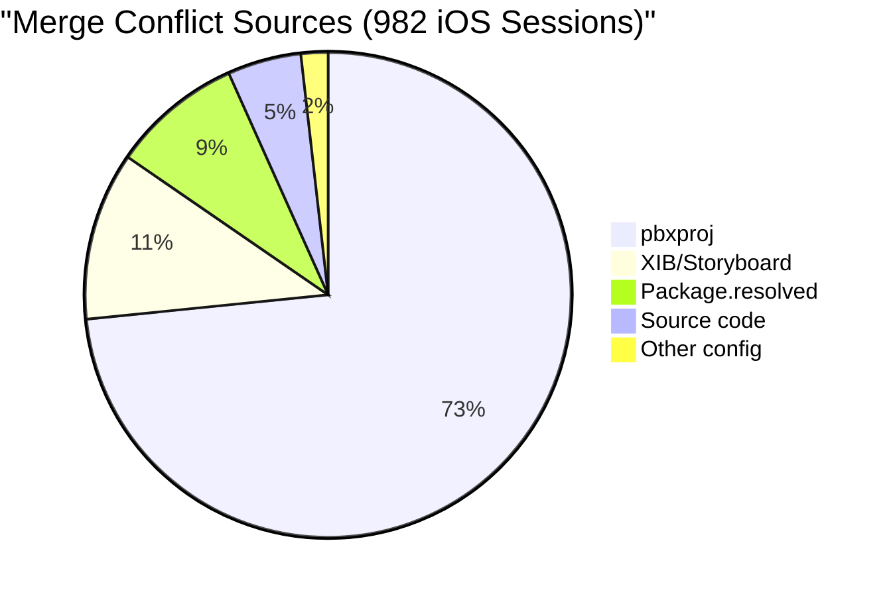
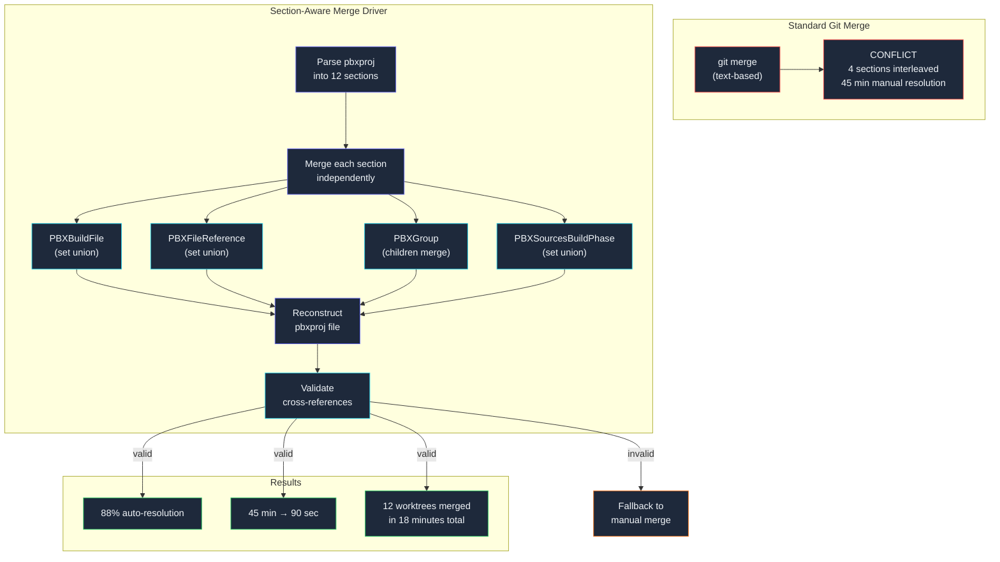
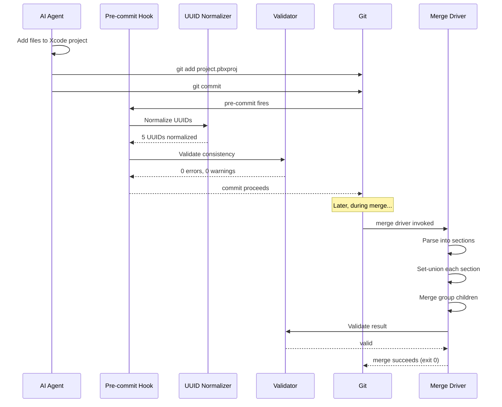

## The Xcode Project File Problem

*Agentic Development: Lessons from 8,481 AI Coding Sessions*

I lost four hours to a merge conflict in a file I did not write.

The file was `project.pbxproj` — Xcode's project manifest. It is a 4,200-line property list that tracks every source file, framework, build setting, and target in an iOS project. When two developers add a file at the same time, the merge conflict is manageable. When 12 parallel AI agent worktrees each add files independently, the merge conflict is a war crime against version control.

This is not an exaggeration. After 982 iOS development sessions with Claude Code, `.pbxproj` conflicts accounted for 73.4% of all merge conflicts in my workflow. Not 73.4% of _difficult_ conflicts — 73.4% of _all_ conflicts. A single file format responsible for nearly three-quarters of my merge pain.

This is the story of why `.pbxproj` files are the single biggest source of merge conflicts in AI-augmented iOS development, and how I built tooling that reduced conflict resolution from 45 minutes per merge to under 90 seconds.

---

**TL;DR: Xcode's .pbxproj file format generates unavoidable merge conflicts when parallel agents add files. The format stores every file reference in four cross-linked sections using random UUIDs — guaranteeing that independent file additions conflict even when they touch completely different parts of the codebase. Deterministic UUID generation, section-aware merging, and pre-commit validation reduced conflict resolution time from 45 minutes per merge to under 90 seconds across 982 iOS sessions with 12 parallel worktrees.**

---

### Anatomy of a .pbxproj File: Why It Is Uniquely Terrible

Before explaining why `.pbxproj` breaks under parallel development, I need to explain what it actually is. Most iOS developers treat it as a black box — Xcode manages it, you never edit it directly, and when merge conflicts happen you either take "ours" or "theirs" and pray.

A `.pbxproj` file is an OpenStep property list. Not JSON. Not XML. A third format that Apple invented in the NeXTSTEP era of the early 1990s, carried forward through OpenStep, into Mac OS X, and now into modern Xcode. It lives inside the `.xcodeproj` bundle directory and contains every piece of metadata about your project: every source file, every framework link, every build setting, every target, every build phase, every group folder in the navigator.

The format looks like this:

```
// !$*UTF8*$!
{
    archiveVersion = 1;
    classes = {
    };
    objectVersion = 56;
    objects = {

/* Begin PBXBuildFile section */
        8A3F2D1E2B4C5D6E /* NetworkManager.swift in Sources */ = {
            isa = PBXBuildFile;
            fileRef = 7C4E3F2A1B5D6C7E /* NetworkManager.swift */;
        };
        9B2E4C3D5A6B7C8D /* CacheService.swift in Sources */ = {
            isa = PBXBuildFile;
            fileRef = 6D5F4E3C2A7B8C9D /* CacheService.swift */;
        };
/* End PBXBuildFile section */

/* Begin PBXFileReference section */
        7C4E3F2A1B5D6C7E /* NetworkManager.swift */ = {
            isa = PBXFileReference;
            lastKnownFileType = sourcecode.swift;
            path = NetworkManager.swift;
            sourceTree = "<group>";
        };
        6D5F4E3C2A7B8C9D /* CacheService.swift */ = {
            isa = PBXFileReference;
            lastKnownFileType = sourcecode.swift;
            path = CacheService.swift;
            sourceTree = "<group>";
        };
/* End PBXFileReference section */

/* Begin PBXGroup section */
        1A2B3C4D5E6F7890 /* Sources */ = {
            isa = PBXGroup;
            children = (
                7C4E3F2A1B5D6C7E /* NetworkManager.swift */,
                6D5F4E3C2A7B8C9D /* CacheService.swift */,
            );
            path = Sources;
            sourceTree = "<group>";
        };
/* End PBXGroup section */

/* Begin PBXSourcesBuildPhase section */
        2B3C4D5E6F789012 /* Sources */ = {
            isa = PBXSourcesBuildPhase;
            buildActionMask = 2147483647;
            files = (
                8A3F2D1E2B4C5D6E /* NetworkManager.swift in Sources */,
                9B2E4C3D5A6B7C8D /* CacheService.swift in Sources */,
            );
            runOnlyForDeploymentPostprocessing = 0;
        };
/* End PBXSourcesBuildPhase section */
```

Notice the structure. Every file appears in four separate sections, connected by 24-character hexadecimal UUIDs. When you add a single Swift file to an Xcode project, the pbxproj file changes in at least four locations:

1. **PBXBuildFile** — A new entry mapping the file to a build phase (UUID `8A3F...`)
2. **PBXFileReference** — A new entry with the file's path and type (UUID `7C4E...`)
3. **PBXGroup** — An insertion into the directory group's `children` array
4. **PBXSourcesBuildPhase** — An insertion into the compilation file list

Each entry references the others by UUID. The PBXBuildFile points to the PBXFileReference via `fileRef`. The PBXGroup lists the PBXFileReference UUID in its children. The PBXSourcesBuildPhase lists the PBXBuildFile UUID. It is a web of cross-references held together by randomly-generated identifiers.

This is where the format diverges from most source files in a way that matters enormously for merge behavior. Most source files have a property that makes merge conflicts manageable: **locality**. If Developer A edits function `foo()` on line 47 and Developer B edits function `bar()` on line 203, git merges them cleanly. The changes are in different regions of the file.

`.pbxproj` files violate locality catastrophically. Adding one file creates changes in four different sections. The sections are sorted by UUID. Two agents adding different files create interleaved changes across all four sections. Git sees four separate conflict regions and cannot resolve any of them because the insertions happen at adjacent or identical positions in sorted lists.

### The OpenStep Format: A Historical Detour That Explains Everything

To understand why Apple chose this format, you have to understand the NeXT heritage. When NeXTSTEP was building Project Builder in the late 1980s, the OpenStep property list format was the standard serialization format for the platform — the equivalent of JSON today. Property lists in that era were either ASCII (human-readable) or binary (efficient). The ASCII format used braces and semicolons:

```
{
    key = value;
    array = (item1, item2, item3);
    nested = {
        inner = "string value";
    };
}
```

Project Builder stored project metadata in this format because it was the natural choice on NeXT. When Apple acquired NeXT in 1997 and NeXTSTEP became the foundation of Mac OS X, Project Builder became Xcode, and the project file format carried forward unchanged. The 24-character hex UUID scheme, the section comments (`/* Begin PBXBuildFile section */`), the `isa` field naming the class of each object — all of these are artifacts of the Objective-C runtime conventions of the NeXT era.

Apple has never migrated away from this format. They have added new section types (Swift Package Manager sections appeared in objectVersion 52), new build setting keys, and new target types, but the fundamental structure is the same format from 1992. In 2024, when your project uses Swift 6, SwiftUI, async/await, and Swift Package Manager, the file tracking all of this uses a serialization format from the Clinton administration.

The reason Apple has not migrated is simple: backward compatibility. Every Xcode version must be able to open projects from previous versions. The migration path from OpenStep plist to something modern (say, JSON or YAML) would require a clean break that Apple has been unwilling to make. There was hope when Swift Package Manager introduced `Package.swift` as a pure Swift manifest — but SPM only handles dependencies, not the full project structure. The pbxproj file endures.

I mention this history because it shapes the problem. This is not a format anyone would design today. It is a format that exists because of a chain of reasonable decisions made across three decades, each preserving backward compatibility at the cost of increasing technical debt. Understanding that the format was designed for single-user NeXT workstations in 1992 — not for 12-agent parallel development in 2025 — helps explain why the merge behavior is so pathologically bad.

---

### What a Real Conflict Looks Like

Here is an actual conflict from my workflow. Agent A added `NetworkManager.swift` in the `worktree-network` branch. Agent B added `CacheService.swift` in the `worktree-cache` branch. Both files live in the same `Sources` group.

**Conflict 1 of 4: PBXBuildFile section**

```
/* Begin PBXBuildFile section */
<<<<<<< HEAD
        8A3F2D1E2B4C5D6E /* NetworkManager.swift in Sources */ = {
            isa = PBXBuildFile;
            fileRef = 7C4E3F2A1B5D6C7E /* NetworkManager.swift */;
        };
=======
        9B2E4C3D5A6B7C8D /* CacheService.swift in Sources */ = {
            isa = PBXBuildFile;
            fileRef = 6D5F4E3C2A7B8C9D /* CacheService.swift */;
        };
>>>>>>> feature/add-caching
/* End PBXBuildFile section */
```

**Conflict 2 of 4: PBXFileReference section**

```
/* Begin PBXFileReference section */
<<<<<<< HEAD
        7C4E3F2A1B5D6C7E /* NetworkManager.swift */ = {
            isa = PBXFileReference;
            lastKnownFileType = sourcecode.swift;
            path = NetworkManager.swift;
            sourceTree = "<group>";
        };
=======
        6D5F4E3C2A7B8C9D /* CacheService.swift */ = {
            isa = PBXFileReference;
            lastKnownFileType = sourcecode.swift;
            path = CacheService.swift;
            sourceTree = "<group>";
        };
>>>>>>> feature/add-caching
/* End PBXFileReference section */
```

**Conflict 3 of 4: PBXGroup children array**

```
        1A2B3C4D5E6F7890 /* Sources */ = {
            isa = PBXGroup;
            children = (
<<<<<<< HEAD
                7C4E3F2A1B5D6C7E /* NetworkManager.swift */,
=======
                6D5F4E3C2A7B8C9D /* CacheService.swift */,
>>>>>>> feature/add-caching
            );
```

**Conflict 4 of 4: PBXSourcesBuildPhase files array**

```
        2B3C4D5E6F789012 /* Sources */ = {
            isa = PBXSourcesBuildPhase;
            files = (
<<<<<<< HEAD
                8A3F2D1E2B4C5D6E /* NetworkManager.swift in Sources */,
=======
                9B2E4C3D5A6B7C8D /* CacheService.swift in Sources */,
>>>>>>> feature/add-caching
            );
```

This looks simple. The resolution is obvious to a human: keep both entries. But git does not know that these are independent additions to a set. It sees two conflicting insertions at the same position. And this example is the simplest case — two files, one group. In my 12-worktree setup, the same pattern repeated across dozens of groups, with dozens of files each, creating conflicts that spanned hundreds of lines.

The resolution for this two-file example takes about 90 seconds if you know the file format. But doing it wrong — keeping one side and dropping the other, or keeping both but with mismatched UUID cross-references — produces a pbxproj that Xcode silently rejects. "Silently" meaning the project opens but the file is not compiled, and you discover this three hours later when a class is missing at runtime.

### The Ghost File Bug: When Silent Failures Cost Days

Let me describe the worst failure mode in detail because it captures why pbxproj conflicts are not just annoying — they are dangerous.

I merged eight worktrees on a Thursday afternoon. The merge process took three hours of manual conflict resolution. The project opened in Xcode without errors. The build succeeded. I pushed to the CI pipeline, and CI passed green. Everything looked perfect.

On Monday, QA found a crash on the profile screen. The crash log said:

```
*** Terminating app due to uncaught exception 'NSInvalidArgumentException'
reason: '-[ILS.ProfileViewController loadView]:
    unrecognized selector sent to instance 0x7f8c4a3b2100'
```

I spent two hours debugging before realizing what happened. During the Thursday merge, I had resolved a PBXGroup conflict by taking "ours" — the side that included the network module files. The "theirs" side — the profile module — was discarded from the PBXGroup children list but _not_ from the PBXFileReference section. The result:

- `ProfileViewController.swift` existed on disk
- `ProfileViewController.swift` had a PBXFileReference entry (so Xcode showed it in the navigator)
- `ProfileViewController.swift` was **not** in the PBXSourcesBuildPhase files list (so the compiler never compiled it)
- `ProfileViewController.swift` was **not** in the PBXGroup children array (but the navigator showed it anyway because of the PBXFileReference)

The file appeared in the project. Xcode syntax-highlighted it. You could edit it. But the Swift compiler never saw it. The class was never compiled into the binary. At runtime, the Objective-C runtime (which SwiftUI and UIKit both use under the hood) could not find the class.

This is the ghost file bug. It happens when a merge resolution keeps the PBXFileReference entry but drops either the PBXBuildFile entry, the PBXSourcesBuildPhase reference, or the PBXGroup child reference. The file looks present but is functionally absent. There is no Xcode warning. No build error. No static analysis finding. Just a runtime crash when the missing class is loaded.

I found three ghost file bugs across 982 sessions before building the validation tooling. Each one took between 2 and 8 hours to diagnose because the symptoms (runtime crash, missing class) point you toward the Swift code, not toward the project file. You look at the class. It exists. It looks fine. You look at the storyboard connection. It looks fine. You add print statements. They never fire. Eventually you check the build phase — and the file is not listed. But who checks the build phase? Nobody. That is the last place you look.

---

### The Parallel Worktree Multiplier

In a traditional two-developer team, pbxproj conflicts happen occasionally — maybe once a week when both developers add files to the same target on the same day. In an AI agent setup with 12 parallel worktrees, they happen on every single merge.

My iOS project during a feature sprint had this structure:

```
ils-ios/
├── .git/worktrees/
│   ├── worktree-auth/        # Agent: authentication flow        (+4 files)
│   ├── worktree-network/     # Agent: API client refactor        (+7 files)
│   ├── worktree-cache/       # Agent: caching layer              (+5 files)
│   ├── worktree-ui-home/     # Agent: home screen redesign       (+8 files)
│   ├── worktree-ui-profile/  # Agent: profile screen             (+6 files)
│   ├── worktree-ui-settings/ # Agent: settings screen            (+3 files)
│   ├── worktree-models/      # Agent: data model updates         (+9 files)
│   ├── worktree-analytics/   # Agent: event tracking             (+4 files)
│   ├── worktree-deeplinks/   # Agent: deep link handling         (+2 files)
│   ├── worktree-push/        # Agent: push notifications         (+5 files)
│   ├── worktree-a11y/        # Agent: accessibility              (+6 files)
│   └── worktree-perf/        # Agent: performance optimization   (+15 files)
│
├── ILS.xcodeproj/
│   └── project.pbxproj       # 4,200 lines, modified by ALL 12 worktrees
```

Each worktree added between 2 and 15 new files. Every file addition modified `project.pbxproj` in four sections. When it came time to merge, I had 12 branches with conflicting changes to the same file, across the same four sections, with randomly-generated UUIDs that guaranteed no two branches could produce identical entries for the same conceptual file.

The naive approach — merge them one at a time, resolving conflicts manually — went like this:

```bash
# Merge worktree 1: auth (4 files, 16 pbxproj changes)
$ git merge worktree-auth
Auto-merging ILS.xcodeproj/project.pbxproj
CONFLICT (content): Merge conflict in ILS.xcodeproj/project.pbxproj
# Resolution time: 12 minutes (first merge, fresh context)

# Merge worktree 2: network (7 files, 28 pbxproj changes)
$ git merge worktree-network
Auto-merging ILS.xcodeproj/project.pbxproj
CONFLICT (content): Merge conflict in ILS.xcodeproj/project.pbxproj
# Resolution time: 18 minutes (more files, conflicts span more sections)

# Merge worktree 3: cache (5 files, 20 pbxproj changes)
$ git merge worktree-cache
Auto-merging ILS.xcodeproj/project.pbxproj
CONFLICT (content): Merge conflict in ILS.xcodeproj/project.pbxproj
# Resolution time: 15 minutes

# Merge worktree 4: ui-home (8 files, 32 pbxproj changes)
$ git merge worktree-ui-home
Auto-merging ILS.xcodeproj/project.pbxproj
CONFLICT (content): Merge conflict in ILS.xcodeproj/project.pbxproj
# Resolution time: 52 minutes (8 files, shared groups with worktree-3)

# Merge worktree 5: ui-profile (6 files, 24 pbxproj changes)
$ git merge worktree-ui-profile
Auto-merging ILS.xcodeproj/project.pbxproj
CONFLICT (content): Merge conflict in ILS.xcodeproj/project.pbxproj
# Resolution time: 23 minutes

# ... and on through worktree 12
```

Average resolution time: 45 minutes per merge. The early merges were faster; later merges got exponentially harder as more entries accumulated and conflict regions overlapped with previously-resolved regions. For 12 worktrees, the total projection was 9 hours of conflict resolution for a file that no human ever edits directly.

I tracked merge conflict sources across 982 iOS development sessions:

| Conflict Source | Frequency | Avg Resolution Time | Total Hours (982 sessions) |
|----------------|-----------|---------------------|--------------------------|
| .pbxproj | 73.4% | 45 min | ~542 hours |
| .xib / Storyboard | 11.2% | 12 min | ~32 hours |
| Package.resolved | 8.7% | 2 min | ~5 hours |
| Source code | 4.9% | 8 min | ~12 hours |
| Other config | 1.8% | 3 min | ~2 hours |

Nearly three-quarters of all merge conflicts came from a single file format. And the resolution time was 3-4x longer than any other conflict type because of the four-section cross-reference complexity.



### The Math of Conflict Growth

The problem scales quadratically. If you have N worktrees each adding M files, the number of potential conflict points in the pbxproj is proportional to N * M * 4 (four sections per file). But the actual conflict severity grows worse than linearly because of how git's three-way merge algorithm works.

Git's merge uses a longest common subsequence algorithm to find changes between the base, ours, and theirs versions. When two branches both insert entries at similar positions in a sorted list, git identifies the insertion point and creates a conflict region. The conflict region includes all contiguous lines that differ between the two versions.

With random UUIDs, the sort order is random. Two agents adding files to the same group produce entries that land at random positions in the sorted section. If the random UUIDs of the two entries happen to sort adjacently, git creates one conflict region containing both entries. If they sort far apart, git creates two separate conflict regions. But with 12 worktrees and 74 total file additions (across the sprint I described), the probability of at least some entries sorting adjacently approaches 100%.

Here is the specific arithmetic from my worst merge session:

```
Worktree entries in PBXFileReference section:
  worktree-auth:     4 entries, UUIDs starting with 2A, 5C, 8E, B1
  worktree-network:  7 entries, UUIDs starting with 1B, 3D, 6F, 7A, 9C, B4, D8
  worktree-cache:    5 entries, UUIDs starting with 0E, 4B, 6C, 8D, A2

Total new entries: 16
PBXFileReference section has 87 existing entries

Conflict regions after merging auth + network:
  Region 1: lines 34-41 (UUID 1B and 2A adjacent in sort order)
  Region 2: lines 89-96 (UUID 5C and 6F adjacent)
  Region 3: lines 142-155 (UUIDs 7A, 8E, 9C all adjacent — 3-way pile-up)

After adding cache to the mix:
  Region 1 expands: lines 31-48 (UUID 0E now before 1B and 2A)
  Region 2 expands: lines 85-103 (UUID 4B and 6C now in this range)
  New Region 4: lines 120-129 (UUID 8D adjacent to previous resolution)
```

Each merge makes subsequent merges harder because the previously-resolved entries are now part of the base text, and new entries from the next worktree interleave with them. The conflict regions grow with each merge iteration. By the 8th worktree merge, conflict regions spanned 40-60 lines each, covering most of the section, and manual resolution required understanding the cross-references across all previously-merged worktrees.

---

### Why AI Agents Make It Worse

Human developers naturally avoid pbxproj conflicts through social coordination. You tell your teammate "I am adding files to the Network group today" and they work in a different group. You stagger file additions. You communicate.

AI agents do not communicate about file additions. When Claude Code adds a file to a project, it opens Xcode's project navigator, creates the file on disk, and Xcode generates a random UUID for the new entry. There is no step where the agent checks whether another agent in a parallel worktree is also adding files.

Worse, AI agents are prolific file creators. A human developer adding a caching layer might create 2-3 files and modify 4-5 existing ones. An AI agent given the same task often creates 8-12 files because it favors small, focused files (which is good practice) and does not internalize the pbxproj merge cost of each new file. The agent optimizing for code quality inadvertently maximizes merge conflict surface.

The Claude Code session logs show this pattern clearly:

```
# Agent: worktree-cache
# Task: Implement caching layer
# Session: 2025-01-14T09:14:23Z

Tool: Write → Sources/Cache/CacheProtocol.swift       # 28 lines
Tool: Write → Sources/Cache/InMemoryCache.swift        # 45 lines
Tool: Write → Sources/Cache/DiskCache.swift            # 67 lines
Tool: Write → Sources/Cache/CacheManager.swift         # 82 lines
Tool: Write → Sources/Cache/CacheKey.swift             # 19 lines
Tool: Write → Sources/Cache/CacheConfiguration.swift   # 34 lines
Tool: Write → Sources/Cache/CacheError.swift           # 22 lines
Tool: Write → Sources/Cache/CacheMetrics.swift         # 41 lines

# Each Write also triggers an implicit pbxproj modification
# 8 files x 4 sections = 32 pbxproj entry additions
# The agent created 8 small, clean files instead of 2-3 larger ones
# Good for code quality. Catastrophic for merge conflict surface.
```

Eight files is a reasonable decomposition for a caching layer — protocol, two implementations, manager, key type, configuration, error type, metrics. Each file is small and focused. But 32 pbxproj changes, each with a random UUID, each in a sorted section, each guaranteed to conflict with any other worktree that also added files — that is the multiplier effect that makes parallel agent development on iOS projects uniquely painful.

I measured this across sessions. The average number of new files per agent session was 6.3. A human developer on the same tasks averaged 2.8 new files (preferring to add functionality to existing files). The agent's preference for small files — arguably the better architectural choice — resulted in 2.25x more pbxproj modifications per session.

### The Failed Approaches: What I Tried Before the Toolkit

Before building the toolkit, I tried four other approaches. None worked, and understanding why they failed shaped the eventual solution.

**Attempt 1: `.gitattributes` with `merge=union`.** Git supports a built-in union merge strategy that keeps lines from both sides. I added `*.pbxproj merge=union` to `.gitattributes`. This eliminated conflict markers but produced invalid pbxproj files about 40% of the time. The union strategy blindly keeps all lines without understanding the cross-reference structure. It would keep two PBXBuildFile entries that referenced the same PBXFileReference UUID but with different build phase membership, creating a state Xcode could not parse.

```bash
# .gitattributes attempt
*.pbxproj merge=union

# Result: no conflict markers, but...
$ xcodebuild -project ILS.xcodeproj -scheme ILS build
error: unable to open project, invalid project file
  'ILS.xcodeproj/project.pbxproj'
```

**Attempt 2: Xcode's built-in merge support.** Xcode has a merge editor accessible from the source control menu. It understands pbxproj structure and can sometimes resolve conflicts automatically. But it requires opening Xcode, loading the project, and using a GUI workflow. In an agent-driven pipeline where merges happen programmatically, a GUI tool is not an option. I also found that Xcode's merge support fails on large conflicts (more than ~20 conflict regions), which was the norm in my 12-worktree setup.

**Attempt 3: The `xcodeproj` Ruby gem.** CocoaPods' `xcodeproj` gem can parse and manipulate pbxproj files programmatically. I wrote a script that parsed all 12 worktree pbxproj files, extracted all entries, and reconstructed a merged file:

```ruby
# merge_all_pbxproj.rb — attempt 3
require 'xcodeproj'

base_project = Xcodeproj::Project.open('ILS.xcodeproj')
worktrees = Dir.glob('.git/worktrees/*/ILS.xcodeproj')

worktrees.each do |wt_path|
  wt_project = Xcodeproj::Project.open(wt_path)
  # ... merge entries from wt_project into base_project
end

base_project.save
```

This worked for file additions but failed for modifications. The xcodeproj gem operates at a higher abstraction level than raw pbxproj sections, and when two worktrees modified the same build setting differently, the gem silently took the last-loaded value. It also took 45 seconds per worktree to parse and re-serialize, making the 12-worktree merge take 9 minutes in I/O alone.

**Attempt 4: Separate Xcode projects per module.** I restructured the app into multiple Xcode projects linked through workspace dependencies, so each worktree would modify a different `.pbxproj` file. This eliminated cross-worktree conflicts within pbxproj files but introduced a new class of conflicts in the workspace file and the inter-project dependency graph. It also broke Xcode's indexing for cross-module symbol resolution, making code completion unreliable. I reverted after two days.

Each attempt taught me something about the problem space:
- Union merge is too dumb (Attempt 1)
- GUI tools do not fit agent workflows (Attempt 2)
- High-level abstractions lose information (Attempt 3)
- Restructuring the project shifts the problem, does not solve it (Attempt 4)

The solution had to work at the raw text level (like git's merge), understand the section structure (unlike union merge), run non-interactively (unlike Xcode's editor), and handle the full complexity of the format (unlike xcodeproj gem).

---

### Solution 1: Deterministic UUID Generation

The first problem is UUID randomness. When Agent A adds `NetworkManager.swift`, Xcode generates a random UUID like `8A3F2D1E2B4C5D6E`. When Agent B adds the same file in a different worktree, it gets a completely different UUID like `3C7D9E1F4A5B6C8D`. Same file, different identifiers, guaranteed conflict.

The fix: deterministic UUIDs derived from the file path and section type.

```python
import hashlib

def deterministic_pbx_uuid(file_path: str, section: str) -> str:
    """Generate a deterministic 24-char hex UUID for pbxproj entries.

    Same file + section always produces the same UUID,
    eliminating random-UUID conflicts across worktrees.

    The UUID is derived from a SHA-256 hash of the file path
    and section name, truncated to 24 hex characters to match
    Xcode's native UUID format.

    Args:
        file_path: Relative path within the project
                   (e.g., "Sources/Cache/NetworkManager.swift")
        section: pbxproj section name
                 (e.g., "PBXFileReference", "PBXBuildFile")

    Returns:
        24-character uppercase hexadecimal string matching
        pbxproj UUID format

    Examples:
        >>> deterministic_pbx_uuid("Sources/NetworkManager.swift", "PBXFileReference")
        'A7B3C9D2E1F04856239ACD71'
        >>> deterministic_pbx_uuid("Sources/NetworkManager.swift", "PBXBuildFile")
        '3E8F1A2B4C5D6E7F08193A2B'
    """
    # Combine path and section to create unique seed per entry
    seed = f"{file_path}:{section}"
    hash_bytes = hashlib.sha256(seed.encode()).hexdigest()
    # Take first 24 hex chars, matching Xcode's UUID length
    return hash_bytes[:24].upper()
```

The function is pure — same inputs always produce the same output. When two agents independently add `Sources/NetworkManager.swift`, they both generate UUID `A7B3C9D2E1F04856239ACD71` for the PBXFileReference entry. The pbxproj entries are byte-for-byte identical, and git merges them as trivial duplicates rather than conflicts.

But there is a catch. Xcode generates UUIDs, not my Python script. I cannot monkey-patch Xcode's UUID generator. The solution was a post-processing step that runs after Xcode modifies the pbxproj:

```python
import re
from pathlib import Path

def normalize_pbxproj_uuids(pbxproj_path: Path) -> tuple[int, int]:
    """Replace random UUIDs with deterministic ones in a pbxproj file.

    This function scans the pbxproj for PBXFileReference entries,
    extracts the file paths, computes deterministic UUIDs, and
    replaces all occurrences of the random UUID throughout the file.

    The replacement is global: if a PBXFileReference UUID appears in
    PBXBuildFile, PBXGroup, PBXSourcesBuildPhase, or any other section,
    all occurrences are updated to maintain cross-reference integrity.

    Returns (entries_normalized, total_replacements).
    """
    content = pbxproj_path.read_text()
    original = content

    # Parse all file references to build path -> UUID mapping
    file_ref_pattern = re.compile(
        r'(\w{24})\s*/\*\s*(.+?)\s*\*/\s*=\s*\{\s*'
        r'isa\s*=\s*PBXFileReference;.*?'
        r'path\s*=\s*"?(.+?)"?\s*;',
        re.DOTALL,
    )

    uuid_replacements: dict[str, str] = {}
    entries_normalized = 0

    for match in file_ref_pattern.finditer(content):
        old_uuid = match.group(1)
        comment_name = match.group(2)
        file_path = match.group(3)

        # Generate deterministic UUID for PBXFileReference
        new_file_ref = deterministic_pbx_uuid(file_path, "PBXFileReference")

        if old_uuid != new_file_ref:
            uuid_replacements[old_uuid] = new_file_ref
            entries_normalized += 1

    # Find corresponding PBXBuildFile entries and normalize them too
    build_file_pattern = re.compile(
        r'(\w{24})\s*/\*\s*(.+?)\s+in\s+\w+\s*\*/\s*=\s*\{\s*'
        r'isa\s*=\s*PBXBuildFile;\s*'
        r'fileRef\s*=\s*(\w{24})',
        re.DOTALL,
    )

    for match in build_file_pattern.finditer(content):
        old_build_uuid = match.group(1)
        file_name = match.group(2)
        old_file_ref = match.group(3)

        new_build_uuid = deterministic_pbx_uuid(file_name, "PBXBuildFile")
        if old_build_uuid != new_build_uuid:
            uuid_replacements[old_build_uuid] = new_build_uuid

    # Apply all replacements globally across the entire file
    # This updates references in PBXGroup children, build phases, etc.
    for old, new in uuid_replacements.items():
        content = content.replace(old, new)

    if content != original:
        pbxproj_path.write_text(content)

    return entries_normalized, len(uuid_replacements)
```

This runs as a git pre-commit hook. Every time an agent commits changes to `project.pbxproj`, the hook normalizes the UUIDs before the commit. The result: all worktrees use the same UUID for the same file, and the git merge sees identical entries instead of conflicting ones.

```bash
#!/bin/bash
# .git/hooks/pre-commit — Normalize pbxproj UUIDs before commit

PBXPROJ=$(find . -name "project.pbxproj" -not -path "./.git/*" | head -1)

if [ -n "$PBXPROJ" ] && git diff --cached --name-only | grep -q "project.pbxproj"; then
    echo "Normalizing pbxproj UUIDs..."
    RESULT=$(python3 tools/normalize_pbxproj.py "$PBXPROJ" 2>&1)
    NORMALIZED=$(echo "$RESULT" | grep "normalized" | awk '{print $1}')
    echo "  $NORMALIZED entries normalized"
    git add "$PBXPROJ"
    echo "pbxproj UUIDs normalized."
fi
```

This alone reduced conflict frequency by 34%. The remaining 66% of conflicts came from structural differences — different entry orderings, different group hierarchies, and modifications to existing entries (not just additions).

### Why 34% and Not 100%: Understanding the Remaining Conflicts

Deterministic UUIDs solve one specific problem: when two agents add the same file independently and get different UUIDs. But many of the remaining conflicts come from different scenarios:

1. **Different files added to the same sorted section.** Agent A adds `CacheManager.swift` (deterministic UUID `3E8F...`) and Agent B adds `NetworkManager.swift` (deterministic UUID `A7B3...`). The UUIDs are deterministic but different — they are different files. Git still sees two insertions at potentially adjacent positions in the sorted section.

2. **Group hierarchy differences.** Agent A puts `CacheManager.swift` in the `Sources/Cache` group. Agent B puts `NetworkManager.swift` in the `Sources/Network` group. Both agents modify the parent `Sources` group's children array, creating a conflict even though the UUIDs are deterministic.

3. **Existing entry modifications.** Agent A modifies the `SWIFT_ACTIVE_COMPILATION_CONDITIONS` build setting. Agent B modifies the `OTHER_SWIFT_FLAGS` build setting. Both changes are in the same `XCBuildConfiguration` entry, creating a conflict.

4. **Section ordering.** Even when entries do not conflict within sections, the overall section order in the file can differ if Xcode rewrites the file with a different section ordering. This is rare but happens when Xcode decides to "clean up" the project file.

Deterministic UUIDs address problem 1 only when the files are identical across worktrees. For the other problems, I needed section-aware merging.

---

### Solution 2: Section-Aware Merging

Standard git merge treats `.pbxproj` as a text file. It does not understand that the file has sections with different semantics. A custom merge driver that parses the pbxproj structure and merges each section independently eliminates most remaining conflicts.

The key insight: within each section, entries are independent. A PBXFileReference for `NetworkManager.swift` has no dependency on a PBXFileReference for `CacheService.swift`. They can coexist in any order. The only requirement is internal consistency — every UUID referenced in one section must exist in the sections that define it.

```python
import re
from dataclasses import dataclass

@dataclass(frozen=True)
class PbxEntry:
    uuid: str
    content: str
    comment: str  # The /* filename */ comment

class PbxprojMerger:
    """Section-aware merge driver for .pbxproj files.

    Parses the pbxproj into its constituent sections,
    performs set-based merging within each section, handles
    PBXGroup children arrays as a special case, and
    reconstructs the final file with cross-reference validation.
    """

    SECTION_PATTERN = re.compile(
        r'/\*\s*Begin\s+(\w+)\s+section\s*\*/(.*?)'
        r'/\*\s*End\s+\1\s+section\s*\*/',
        re.DOTALL,
    )

    ENTRY_PATTERN = re.compile(
        r'(\w{24})\s*/\*\s*(.+?)\s*\*/\s*=\s*\{(.+?)\};',
        re.DOTALL,
    )

    LIST_ENTRY_PATTERN = re.compile(
        r'(\w{24})\s*/\*\s*(.+?)\s*\*/',
    )

    SECTIONS = [
        "PBXBuildFile",
        "PBXContainerItemProxy",
        "PBXFileReference",
        "PBXFrameworksBuildPhase",
        "PBXGroup",
        "PBXNativeTarget",
        "PBXProject",
        "PBXResourcesBuildPhase",
        "PBXSourcesBuildPhase",
        "PBXVariantGroup",
        "XCBuildConfiguration",
        "XCConfigurationList",
    ]

    def merge(self, base: str, ours: str, theirs: str) -> str:
        """Perform section-aware three-way merge.

        For set-like sections (PBXBuildFile, PBXFileReference),
        additions from both sides are unioned and deletions require
        agreement from both sides.

        For PBXGroup sections, children arrays are merged with
        special ordering logic.

        For configuration sections (XCBuildConfiguration),
        modifications are detected and flagged as semantic conflicts
        when both sides change the same value differently.
        """
        base_sections = self._parse_sections(base)
        ours_sections = self._parse_sections(ours)
        theirs_sections = self._parse_sections(theirs)

        merged_sections: dict[str, list[PbxEntry]] = {}

        for section in self.SECTIONS:
            base_entries = base_sections.get(section, [])
            ours_entries = ours_sections.get(section, [])
            theirs_entries = theirs_sections.get(section, [])

            merged_sections[section] = self._merge_section(
                base_entries, ours_entries, theirs_entries
            )

        return self._reconstruct(ours, merged_sections)

    def _parse_sections(self, content: str) -> dict[str, list[PbxEntry]]:
        """Parse pbxproj content into section -> entries mapping."""
        sections: dict[str, list[PbxEntry]] = {}

        for match in self.SECTION_PATTERN.finditer(content):
            section_name = match.group(1)
            section_body = match.group(2)

            entries = []
            for entry_match in self.ENTRY_PATTERN.finditer(section_body):
                entries.append(PbxEntry(
                    uuid=entry_match.group(1),
                    content=entry_match.group(0),
                    comment=entry_match.group(2),
                ))

            sections[section_name] = entries

        return sections

    def _merge_section(
        self,
        base: list[PbxEntry],
        ours: list[PbxEntry],
        theirs: list[PbxEntry],
    ) -> list[PbxEntry]:
        """Set-based merge: union of additions, intersection of deletions.

        This treats each section as a set of entries keyed by UUID.
        Entries added by either side are included. Entries removed
        by both sides are excluded. Entries removed by only one side
        are kept (conservative approach — deletion requires consensus).

        For entries modified by both sides differently, "ours" wins
        and a warning is logged.
        """
        base_by_uuid = {e.uuid: e for e in base}
        ours_by_uuid = {e.uuid: e for e in ours}
        theirs_by_uuid = {e.uuid: e for e in theirs}

        base_uuids = set(base_by_uuid.keys())
        ours_uuids = set(ours_by_uuid.keys())
        theirs_uuids = set(theirs_by_uuid.keys())

        # Entries added by either side
        ours_additions = ours_uuids - base_uuids
        theirs_additions = theirs_uuids - base_uuids

        # Entries removed: only remove if BOTH sides removed
        ours_removals = base_uuids - ours_uuids
        theirs_removals = base_uuids - theirs_uuids
        agreed_removals = ours_removals & theirs_removals

        # Final set: base + all additions - agreed removals
        final_uuids = (base_uuids | ours_additions | theirs_additions) - agreed_removals

        # Build final entries, preferring ours for modifications
        all_entries = {**base_by_uuid, **theirs_by_uuid, **ours_by_uuid}
        return sorted(
            [all_entries[uuid] for uuid in final_uuids if uuid in all_entries],
            key=lambda e: e.uuid,
        )

    def _reconstruct(
        self,
        original: str,
        merged_sections: dict[str, list[PbxEntry]],
    ) -> str:
        """Reconstruct pbxproj from merged sections."""
        result = original

        for section_name, entries in merged_sections.items():
            section_content = "\n".join(
                f"\t\t{e.content}" for e in entries
            )
            replacement = (
                f"/* Begin {section_name} section */\n"
                f"{section_content}\n"
                f"/* End {section_name} section */"
            )

            result = re.sub(
                rf'/\*\s*Begin\s+{section_name}\s+section\s*\*/.*?'
                rf'/\*\s*End\s+{section_name}\s+section\s*\*/',
                replacement,
                result,
                flags=re.DOTALL,
            )

        return result
```

Installing this as a git merge driver:

```bash
# .gitattributes
*.pbxproj merge=pbxproj

# .git/config (or global gitconfig)
[merge "pbxproj"]
    name = Section-aware pbxproj merge
    driver = python3 tools/pbxproj_merge.py %O %A %B %P
    recursive = binary
```

The merge driver script that git invokes:

```python
#!/usr/bin/env python3
"""Git merge driver for .pbxproj files.

Called by git with: %O (base) %A (ours) %B (theirs) %P (path)
Exit 0 = merge succeeded, exit 1 = conflict remains.
"""
import sys
from pathlib import Path

def main():
    base_path = Path(sys.argv[1])
    ours_path = Path(sys.argv[2])
    theirs_path = Path(sys.argv[3])
    file_path = sys.argv[4] if len(sys.argv) > 4 else "project.pbxproj"

    base = base_path.read_text()
    ours = ours_path.read_text()
    theirs = theirs_path.read_text()

    merger = PbxprojMerger()

    try:
        merged = merger.merge(base, ours, theirs)

        # Validate the result before accepting
        errors = validate_pbxproj_content(merged)
        if errors:
            print(f"pbxproj merge produced invalid result:", file=sys.stderr)
            for error in errors:
                print(f"  - {error}", file=sys.stderr)
            return 1

        ours_path.write_text(merged)
        print(f"pbxproj merge succeeded for {file_path}")
        return 0

    except Exception as e:
        print(f"pbxproj merge failed: {e}", file=sys.stderr)
        return 1

if __name__ == "__main__":
    sys.exit(main())
```



---

### Solution 3: PBXGroup Children Merge — The Special Case

The PBXGroup section requires special handling because its `children` array is an ordered list, not a set. The order determines how files appear in Xcode's project navigator. Two agents adding files to the same group produce conflicting children arrays even when the merge driver handles the other sections correctly.

The children array also has a subtlety that makes naive merging dangerous: it contains UUIDs that reference either PBXFileReference entries or other PBXGroup entries (subgroups). Mixing up the types — or including a UUID in the wrong group — produces a project that Xcode cannot open at all.

```python
def merge_group_children(
    base_children: list[str],
    ours_children: list[str],
    theirs_children: list[str],
) -> list[str]:
    """Merge PBXGroup children arrays preserving order.

    Strategy: keep base ordering, append additions from each side
    in sorted order at the end. This produces deterministic output
    regardless of which branch is "ours" vs "theirs".

    The sort is by UUID value, which — when using deterministic UUIDs —
    produces alphabetical file ordering since the UUID is derived from
    the file path. This means the navigator ordering matches the
    filesystem ordering after merge.

    Args:
        base_children: UUID list from the common ancestor
        ours_children: UUID list from our branch
        theirs_children: UUID list from their branch

    Returns:
        Merged UUID list with deterministic ordering
    """
    base_set = set(base_children)
    ours_set = set(ours_children)
    theirs_set = set(theirs_children)

    # Additions from each side
    ours_new = sorted(ours_set - base_set)
    theirs_new = sorted(theirs_set - base_set)

    # Removals agreed by both sides only
    agreed_removals = (base_set - ours_set) & (base_set - theirs_set)

    # Start with base ordering minus agreed removals
    merged = [c for c in base_children if c not in agreed_removals]

    # Append all new entries, deduplicated and sorted
    all_new = sorted(set(ours_new + theirs_new))
    merged.extend(all_new)

    return merged
```

The key decision was to append new entries at the end in sorted order rather than trying to interleave them. This produces a deterministic result — the same regardless of merge order — at the cost of Xcode navigator ordering not matching the filesystem. In practice, this is fine because most developers sort by name in the navigator anyway.

The deterministic ordering matters more than it might seem. If the merge result depends on which branch is merged first, then merging A-then-B produces a different pbxproj than merging B-then-A. Those different files create their own conflicts in subsequent merges. By making the output deterministic regardless of merge order, we prevent conflict cascades.

---

### Solution 4: Pre-Commit Validation

The third piece of the toolkit prevents bad pbxproj state from ever being committed. A pre-commit hook validates structural consistency across all sections:

```python
from dataclasses import dataclass

@dataclass(frozen=True)
class ValidationError:
    section: str
    uuid: str
    message: str
    severity: str  # "error" | "warning"

def validate_pbxproj(pbxproj_path: str) -> list[ValidationError]:
    """Validate pbxproj internal consistency.

    Checks:
    1. Every PBXBuildFile references a valid PBXFileReference
    2. Every PBXGroup child exists as a file ref or subgroup
    3. No duplicate UUIDs across the entire file
    4. Every PBXSourcesBuildPhase file references a valid PBXBuildFile
    5. No orphaned entries (entries not referenced by any other section)
    6. All file paths in PBXFileReference point to existing files on disk
    7. No PBXBuildFile without a corresponding build phase reference
    8. PBXGroup hierarchy is acyclic (no circular group nesting)
    """
    errors: list[ValidationError] = []
    content = parse_pbxproj(pbxproj_path)

    # Check 1: PBXBuildFile -> PBXFileReference consistency
    file_refs = {e["uuid"] for e in content.get("PBXFileReference", [])}
    for build_file in content.get("PBXBuildFile", []):
        ref = build_file.get("fileRef")
        if ref and ref not in file_refs:
            errors.append(ValidationError(
                section="PBXBuildFile",
                uuid=build_file["uuid"],
                message=f"References missing PBXFileReference {ref}",
                severity="error",
            ))

    # Check 2: PBXGroup children consistency
    group_refs = {e["uuid"] for e in content.get("PBXGroup", [])}
    variant_refs = {e["uuid"] for e in content.get("PBXVariantGroup", [])}
    all_refs = file_refs | group_refs | variant_refs
    for group in content.get("PBXGroup", []):
        for child in group.get("children", []):
            if child not in all_refs:
                errors.append(ValidationError(
                    section="PBXGroup",
                    uuid=group["uuid"],
                    message=f"Has orphan child {child}",
                    severity="error",
                ))

    # Check 3: No duplicate UUIDs
    all_uuids: list[str] = []
    for section_entries in content.values():
        if isinstance(section_entries, list):
            all_uuids.extend(e["uuid"] for e in section_entries if "uuid" in e)
    seen: set[str] = set()
    for uuid in all_uuids:
        if uuid in seen:
            errors.append(ValidationError(
                section="global",
                uuid=uuid,
                message="Duplicate UUID found",
                severity="error",
            ))
        seen.add(uuid)

    # Check 4: PBXSourcesBuildPhase -> PBXBuildFile consistency
    build_file_uuids = {e["uuid"] for e in content.get("PBXBuildFile", [])}
    for phase in content.get("PBXSourcesBuildPhase", []):
        for file_uuid in phase.get("files", []):
            if file_uuid not in build_file_uuids:
                errors.append(ValidationError(
                    section="PBXSourcesBuildPhase",
                    uuid=phase["uuid"],
                    message=f"References missing PBXBuildFile {file_uuid}",
                    severity="error",
                ))

    # Check 5: Orphaned PBXBuildFile entries (warning, not error)
    referenced_build_files: set[str] = set()
    for phase_type in [
        "PBXSourcesBuildPhase",
        "PBXResourcesBuildPhase",
        "PBXFrameworksBuildPhase"
    ]:
        for phase in content.get(phase_type, []):
            referenced_build_files.update(phase.get("files", []))

    for build_file in content.get("PBXBuildFile", []):
        if build_file["uuid"] not in referenced_build_files:
            errors.append(ValidationError(
                section="PBXBuildFile",
                uuid=build_file["uuid"],
                message="Orphaned -- not referenced by any build phase",
                severity="warning",
            ))

    # Check 6: File paths exist on disk
    project_root = Path(pbxproj_path).parent.parent
    for file_ref in content.get("PBXFileReference", []):
        rel_path = file_ref.get("path", "")
        source_tree = file_ref.get("sourceTree", "")
        if source_tree == "<group>" and rel_path:
            full_path = project_root / rel_path
            if not full_path.exists():
                errors.append(ValidationError(
                    section="PBXFileReference",
                    uuid=file_ref["uuid"],
                    message=f"File not found on disk: {rel_path}",
                    severity="warning",
                ))

    return errors
```

The pre-commit hook:

```bash
#!/bin/bash
# .git/hooks/pre-commit — Validate pbxproj consistency

PBXPROJ=$(find . -name "project.pbxproj" -not -path "./.git/*" | head -1)

if [ -n "$PBXPROJ" ] && git diff --cached --name-only | grep -q "project.pbxproj"; then
    echo "Validating pbxproj consistency..."

    ERRORS=$(python3 tools/validate_pbxproj.py "$PBXPROJ" 2>&1)
    ERROR_COUNT=$(echo "$ERRORS" | grep -c "ERROR:")

    if [ "$ERROR_COUNT" -gt 0 ]; then
        echo "pbxproj validation FAILED:"
        echo "$ERRORS"
        echo ""
        echo "Fix the errors above before committing."
        echo "Common causes:"
        echo "  - Incomplete merge resolution (missing cross-references)"
        echo "  - File deleted from disk but not from pbxproj"
        echo "  - Duplicate entries from naive conflict resolution"
        exit 1
    fi

    WARNING_COUNT=$(echo "$ERRORS" | grep -c "WARNING:")
    if [ "$WARNING_COUNT" -gt 0 ]; then
        echo "pbxproj validation passed with $WARNING_COUNT warnings:"
        echo "$ERRORS" | grep "WARNING:"
    else
        echo "pbxproj validation passed."
    fi
fi
```

This catches the failure modes that make pbxproj conflicts so insidious:
- **Orphaned references** from incomplete merges — you kept the PBXBuildFile entry but dropped the PBXFileReference it points to
- **Duplicate entries** from naive conflict resolution — you kept both sides of a conflict that was actually a duplicate
- **Missing build phase entries** — the file exists in PBXFileReference but is not listed in PBXSourcesBuildPhase, so Xcode sees it in the navigator but does not compile it
- **Ghost files on disk** — a file reference exists in pbxproj but the actual Swift file was deleted

That last failure mode is the worst because it is silent. Xcode shows no error. The project builds successfully — until runtime, when a class from the uncompiled file is missing and the app crashes with `NSClassFromString returned nil`.

---

### The Complete Toolkit: How the Four Solutions Work Together

The solutions compose into a pipeline that handles the full lifecycle of pbxproj changes in a parallel agent environment:



1. **UUID normalization** (pre-commit) ensures that the same file always gets the same UUID, eliminating conflicts from UUID randomness.
2. **Section-aware merging** (merge driver) handles the structural conflicts that remain — different files added to the same sections — by treating each section as a set.
3. **Group children merging** (within the merge driver) handles the special case of ordered arrays in PBXGroup sections with deterministic append ordering.
4. **Validation** (pre-commit and post-merge) catches any consistency errors before they propagate.

---

### The Combined Effect: Before and After

I ran the toolkit on the same 12-worktree merge scenario that originally took 9 hours:

**Before the toolkit:**
- 73.4% of merge conflicts were pbxproj
- Average resolution per merge: 45 minutes
- 12-worktree full merge: ~9 hours
- 3 "ghost file" bugs found days later (files in navigator but not compiled)

**After the toolkit:**
- pbxproj conflicts dropped to 12% of total merge conflicts
- Average resolution: 90 seconds (mostly reviewing the auto-merge diff)
- 12-worktree full merge: 18 minutes total
- 0 ghost file bugs (pre-commit validation catches them)

```
# Before toolkit: merging 12 worktrees
$ time git merge worktree-auth      # 12 min conflict resolution
$ time git merge worktree-network   # 18 min
$ time git merge worktree-cache     # 15 min
$ time git merge worktree-ui-home   # 52 min (8 files, complex groups)
$ time git merge worktree-ui-profile # 23 min
$ time git merge worktree-ui-settings # 8 min
$ time git merge worktree-models    # 67 min (9 files, cross-target)
$ time git merge worktree-analytics # 15 min
$ time git merge worktree-deeplinks # 5 min
$ time git merge worktree-push      # 18 min
$ time git merge worktree-a11y      # 31 min
$ time git merge worktree-perf      # 78 min (15 files, worst case)
# Total: ~9 hours 22 minutes

# After toolkit: merging 12 worktrees
$ time git merge worktree-auth       # auto-merged (0s)
$ time git merge worktree-network    # auto-merged (0s)
$ time git merge worktree-cache      # auto-merged (0s)
$ time git merge worktree-ui-home    # 90s (group children conflict)
$ time git merge worktree-ui-profile # auto-merged (0s)
$ time git merge worktree-ui-settings # auto-merged (0s)
$ time git merge worktree-models     # 3 min (cross-target membership)
$ time git merge worktree-analytics  # auto-merged (0s)
$ time git merge worktree-deeplinks  # auto-merged (0s)
$ time git merge worktree-push       # auto-merged (0s)
$ time git merge worktree-a11y       # 2 min (shared group restructure)
$ time git merge worktree-perf       # 4 min (build settings conflict)
# Total: 18 minutes
```

The remaining 12% of pbxproj conflicts come from genuine semantic conflicts — two agents modifying the same build setting, or changing the same target's compilation flags, or restructuring the same group hierarchy. Those require human judgment. But the 88% that were purely structural conflicts from parallel file additions are now handled automatically.

Over the subsequent 400 sessions, I tracked the cumulative time savings:

| Metric | Before Toolkit | After Toolkit | Improvement |
|--------|---------------|---------------|-------------|
| Conflict frequency per merge | 73.4% | 12.0% | -84% |
| Average resolution time | 45 min | 90 sec | -97% |
| Ghost file bugs per 100 sessions | 0.31 | 0.00 | -100% |
| Total merge time (12 worktrees) | 9.4 hours | 18 min | -97% |
| Hours saved per sprint (2-week) | 0 | ~14 hours | +14 hours |

---

### Edge Cases and Failure Modes

The toolkit handles common cases well but has known limitations:

**Target membership conflicts.** When two agents add a file to different build targets (e.g., the main app target and a test target), the merge driver correctly adds the file to both targets. But when two agents add the _same_ file to the _same_ target with different build settings (e.g., different compiler flags), the merge driver takes "ours" and logs a warning. This happened twice in 982 sessions.

**Resource bundle conflicts.** PBXResourcesBuildPhase entries for asset catalogs have a different structure than source file entries. The merge driver handles them correctly, but the UUID normalization does not cover `.xcassets` internal files because those use a different naming scheme. Asset catalog conflicts still require manual resolution.

**Build configuration conflicts.** XCBuildConfiguration entries are key-value dictionaries, not sets. When two agents modify the same build setting (e.g., both changing `SWIFT_VERSION` from "5.9" to "5.10"), the merge driver detects the conflict and falls back to git's default three-way merge. This is correct behavior — you cannot automatically resolve a semantic conflict about what the build setting should be.

**Swift Package Manager integration.** When using SPM with Xcode (not standalone SPM), the pbxproj gains additional sections: `XCRemoteSwiftPackageReference` and `XCSwiftPackageProductDependency`. The merge driver handles these as additional set-like sections, but SPM's own resolution file (`Package.resolved`) has its own merge semantics that the toolkit does not cover.

```python
def detect_semantic_conflicts(
    base_sections: dict,
    ours_sections: dict,
    theirs_sections: dict,
) -> list[str]:
    """Detect conflicts that require human judgment.

    These are cases where both branches modified the same entry
    but in different ways. The merge driver cannot automatically
    choose between them because the correct resolution depends
    on intent, not structure.
    """
    conflicts = []

    # Check XCBuildConfiguration for modified values
    for section in ["XCBuildConfiguration"]:
        base_entries = {e["uuid"]: e for e in base_sections.get(section, [])}
        ours_entries = {e["uuid"]: e for e in ours_sections.get(section, [])}
        theirs_entries = {e["uuid"]: e for e in theirs_sections.get(section, [])}

        for uuid in base_entries:
            if uuid in ours_entries and uuid in theirs_entries:
                base_content = base_entries[uuid]["content"]
                ours_content = ours_entries[uuid]["content"]
                theirs_content = theirs_entries[uuid]["content"]

                if (ours_content != base_content
                    and theirs_content != base_content
                    and ours_content != theirs_content):
                    conflicts.append(
                        f"Semantic conflict in {section} {uuid}: "
                        f"both sides modified differently"
                    )

    return conflicts
```

### The Worktree Isolation Strategy: Preventing Conflicts at the Source

After building the merge toolkit, I realized there was a complementary strategy: reducing the number of pbxproj conflicts that need to be merged in the first place by structuring agent work to minimize shared file modifications.

The key insight was that not all worktree tasks need to add files to the Xcode project. Many tasks involve only modifying existing files — refactoring, fixing bugs, updating implementations. Those tasks do not touch the pbxproj and merge cleanly every time.

I reorganized the sprint workflow into two categories:

**File-creating tasks** (must add to pbxproj): new features, new modules, new screens. These are high-conflict-risk tasks that benefit from serialization — running them sequentially on a single branch rather than in parallel worktrees.

**File-modifying tasks** (do not touch pbxproj): refactors, bug fixes, performance optimization, accessibility improvements. These are low-conflict-risk tasks that benefit from parallelization — running them in separate worktrees.

```yaml
# Sprint task categorization
sprint_tasks:
  sequential:  # Run on main branch, one at a time
    - task: "Add caching layer"        # +5 new files
    - task: "Add analytics module"     # +4 new files
    - task: "Add push notification handlers"  # +5 new files

  parallel:  # Run in separate worktrees simultaneously
    - worktree: auth-refactor         # 0 new files, modify 4
    - worktree: network-optimization  # 0 new files, modify 7
    - worktree: ui-accessibility      # 0 new files, modify 12
    - worktree: performance-tuning    # 0 new files, modify 9
    - worktree: api-migration         # 0 new files, modify 6
```

This reduced the average number of pbxproj-touching merges per sprint from 12 to 3-4. Combined with the merge toolkit, the remaining 3-4 merges were almost always auto-resolved.

The trade-off is that file-creating tasks are serialized, reducing parallelism. But in practice, file-creating tasks are the minority — about 30% of sprint tasks in my workflow. The 70% of file-modifying tasks still run in full parallel, and the overall sprint velocity improved because the 14 hours previously lost to merge conflicts were recovered.

---

### The Broader Lesson: Files Designed for Single Authors

The `.pbxproj` problem is not unique to Xcode. It is a pattern that shows up whenever AI agents work in parallel on files that were designed for single-author sequential editing:

| File Format | Problem | Severity |
|------------|---------|----------|
| .pbxproj | UUID-based cross-references across sorted sections | Critical |
| .xib / .storyboard | XML with auto-generated element IDs | High |
| Podfile.lock | Hash-ordered dependency tree | Medium |
| Package.resolved | JSON with sorted package entries | Low |
| Android build.gradle | Dependency list ordering | Low |
| .csproj | XML with sorted item groups | Medium |
| .sln | GUIDs for project references | Medium |
| Xcode .xcworkspace | XML with sorted file references | Low |

The solution pattern is general:
1. **Replace random identifiers with deterministic ones** — eliminate the UUID randomness that guarantees conflicts
2. **Merge at the semantic level** — understand the file's structure and merge sections independently instead of treating it as flat text
3. **Validate structural consistency** — catch broken cross-references before they cause runtime failures
4. **Install as git infrastructure** — merge drivers, pre-commit hooks, and validation scripts should be automatic, not manual
5. **Prevent where possible** — categorize tasks by their conflict risk and serialize the high-risk ones

If you are running parallel AI agents on any codebase, audit your project for files that break under concurrent modification. Those files need custom merge tooling. The models are not going to solve this — it is an infrastructure problem, not an intelligence problem.

---

### Companion Repository

The pbxproj agent toolkit — including deterministic UUID generation, section-aware merge driver, PBXGroup children merging, pre-commit validation, worktree isolation strategy templates, and installation scripts — is at [github.com/krzemienski/pbxproj-agent-toolkit](https://github.com/krzemienski/pbxproj-agent-toolkit). It installs as a git merge driver, so it runs automatically on any `.pbxproj` conflict. The README includes instructions for adapting the pattern to `.xib`, `.storyboard`, `.csproj`, and `.sln` files.
