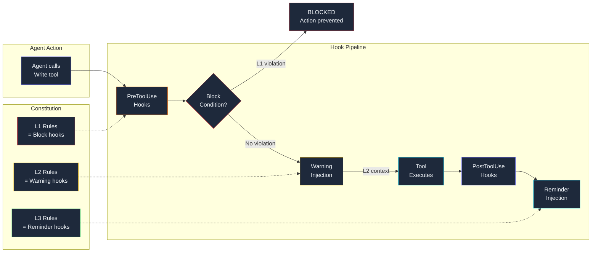
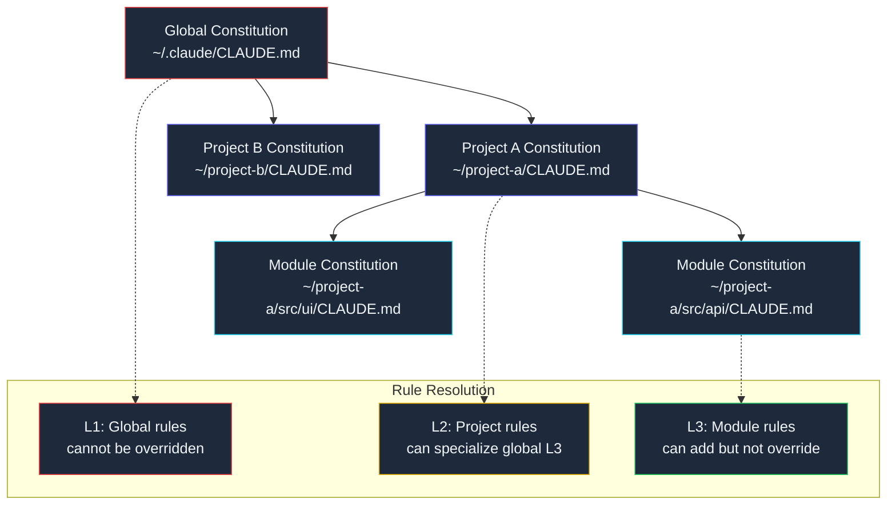

## Project Constitutions

*Agentic Development: Lessons from 8,481 AI Coding Sessions*

The rule was simple: never create test files.

I wrote it in CLAUDE.md. I explained the reasoning. I used bold text. I added it to three separate configuration files. And across 847 sessions, agents created test files 23% of the time anyway.

The problem was not comprehension. Claude understood the rule perfectly when asked about it directly. The problem was enforcement. A rule in a markdown file is a suggestion. It has no mechanism to prevent violations. It relies on the model remembering and respecting the instruction across long contexts, multiple tool calls, and the natural drift that happens when an agent is deep in implementation and falls back on training patterns.

I needed rules that could not be ignored. Not because the model was defiant, but because passive rules fail the same way passive documentation fails in human teams -- they get read once, understood in the abstract, and overridden by the pressure of the immediate task.

This is how CLAUDE.md became a constitution.

---

**TL;DR: Treating CLAUDE.md as a machine-readable constitution with priority levels (L1 critical, L2 standard, L3 advisory) and automated hook enforcement reduced rule violations from 23% to 1.4%. The key was making rules enforceable, not just readable. Constitutions work because they combine hierarchy (not all rules are equal), enforcement (hooks that block or warn), and amendment process (rules evolve with the project). Over 847 sessions across 5 projects, the constitution pattern transformed agent governance from "please follow these guidelines" to "these constraints are physically enforced."**

---

### The Evolution of CLAUDE.md: From Style Guide to Governance Document

CLAUDE.md started as a style guide. Version 1 looked like every project's contributing guidelines -- a flat list of preferences with no priority, no enforcement, and no mechanism for handling conflicts between rules.

```markdown
# Project Guidelines
- Use TypeScript strict mode
- Follow the repository pattern for data access
- Write clean, readable code
- No test files -- we use functional validation
- Keep files under 200 lines
- Use conventional commit messages
- Handle errors explicitly
- Never commit API keys
```

This worked for about two weeks. Then the codebase grew, the rules accumulated, and agents started following some rules while ignoring others. Not maliciously -- there was no priority system. "Use TypeScript strict mode" and "no test files" had the same visual weight. When context windows got crowded and the model had to decide what to prioritize, it sometimes chose wrong.

The pattern was consistent enough to measure. I tracked rule compliance across 200 sessions with the flat-list CLAUDE.md:

```
Rule compliance rates (flat-list CLAUDE.md, 200 sessions):
  "Never commit API keys"      -> 99.5% (training data strongly reinforces this)
  "TypeScript strict mode"     -> 94.2% (easy to verify, model checks tsconfig)
  "Conventional commits"       -> 89.1% (model's training includes this pattern)
  "Handle errors explicitly"   -> 82.7% (sometimes skipped when "moving fast")
  "Keep files under 200 lines" -> 78.3% (frequently exceeded for "good reasons")
  "No test files"              -> 77.0% (model's training STRONGLY favors testing)
  "Repository pattern"         -> 71.4% (model sometimes prefers other patterns)
  "Clean, readable code"       -> unmeasurable (too subjective)
```

The pattern was clear: rules that aligned with the model's training priors (never commit secrets, use strict mode) had high compliance. Rules that contradicted training priors (no test files -- every coding tutorial teaches testing) had low compliance. And subjective rules ("clean, readable code") could not be measured at all.

The "no test files" rule was the most instructive failure. Claude's training data includes millions of examples of good software engineering practice, and virtually all of them include test files. When I instructed the model not to create tests, I was fighting against the strongest signal in its training distribution. The flat-list CLAUDE.md did not give the model enough signal to override that training bias.

Version 2 added explanation for each rule -- the "why" behind each instruction. This improved compliance from 77% to 84%. Understanding the reasoning helped the model make better decisions when rules seemed to conflict. But 84% means one in six sessions still violated something.

Version 3 was the constitution.

### The Turning Point: Session 847, File 23

The specific incident that triggered the constitution redesign happened on a Thursday afternoon. I was running the ai-digest project with three parallel agent sessions. Agent 1 was implementing a new API endpoint. Agent 2 was refactoring the data layer. Agent 3 was adding a search feature.

Agent 3 created a file called `search.test.ts`. The CLAUDE.md clearly said "No test files -- we use functional validation." But the agent was deep in the search implementation, had generated 14 files, and on the 15th file, it created a test. The session log showed why:

```
# Session log excerpt (ai-digest, session 847)
# Agent 3: Search feature implementation

Turn 23: Agent reads CLAUDE.md (at session start)
Turn 24-37: Agent implements search indexer, query parser, result ranker
Turn 38: Agent writes SearchService.ts (the main implementation)
Turn 39: Agent considers how to verify the search works
Turn 40: Agent writes search.test.ts

# Agent's reasoning (visible in extended thinking):
# "I should verify the search functionality works correctly.
#  The standard approach is to write a test file.
#  Let me create search.test.ts with test cases for..."
```

By turn 40, the agent was 16 turns and ~30,000 tokens past the CLAUDE.md instruction. The training prior for "after implementing a service, write tests" was stronger than the fading instruction in the system prompt. The agent did not intentionally violate the rule -- it forgot the rule existed because the rule had no priority marker distinguishing it from advisory guidelines, and no enforcement mechanism to catch the violation.

When I caught the test file in code review, I deleted it and added a stronger instruction to CLAUDE.md. The agent created another test file four sessions later. I added it to three configuration files. The agent created another test file eight sessions later. The instructions were getting longer, the compliance was not improving, and I was spending more time policing test file creation than I would have spent just letting the agent write tests.

That is when I realized the problem was not the rule. The problem was the architecture of rule enforcement.

---

### Anatomy of a Project Constitution

A constitution has three properties that a style guide lacks: **hierarchy**, **enforcement**, and **amendment process**.

**Hierarchy** means not all rules are equal. Some are inviolable constraints (never commit secrets), some are strong preferences (use immutable patterns), and some are advisory guidelines (prefer early returns). Without hierarchy, the model treats everything with equal weight and makes trade-offs that violate critical rules to satisfy advisory ones.

**Enforcement** means violations have consequences. An L1 rule violation blocks the action entirely. An L2 rule violation generates a warning that appears in the agent's context. An L3 rule violation generates a gentle reminder after the action. The model learns that different rules have different consequences, and adjusts its behavior accordingly.

**Amendment process** means rules can change. Projects evolve, requirements shift, and rules that made sense six months ago may be obsolete today. A constitution includes a changelog of amendments with dates, previous values, new values, and justifications.

Here is the complete constitution structure I developed across five projects:

```markdown
# CONSTITUTION

## Preamble
This document governs AI agent behavior in this project. Rules are
organized by priority level. Enforcement is automated via hooks.
Amendments are tracked in the Amendments section below.

Last amended: 2025-02-15
Constitution version: 3.2

## L1: Critical -- Never Violate
These rules are enforced by automated hooks. Violation blocks the action.
Each L1 rule has a corresponding PreToolUse hook that prevents the
violating tool call from executing.

### L1-001: No Test Files
- Rule: NEVER create files matching *.test.*, *.spec.*, __tests__/*,
        *.mock.*, test_*.py, mock_*.py
- Reason: This project uses functional validation through real UI
          interaction, not unit tests. Test files create a false sense
          of coverage without exercising the real system.
- Hook: block-test-files.js (PreToolUse: Write|Edit)
- Violation response: Action blocked, agent redirected to functional
                      validation workflow

### L1-002: No Committed Secrets
- Rule: NEVER commit files containing API keys, passwords, tokens,
        or credentials. NEVER reference ANTHROPIC_API_KEY in code.
- Reason: Secrets in version control are irrecoverable security
          vulnerabilities.
- Hook: block-api-key-references.js (PreToolUse: Write|Edit)
- Violation response: Action blocked, agent instructed to use
                      environment variables

### L1-003: No Reference Data Modification
- Rule: NEVER modify ground truth files, test fixtures, reference
        datasets, or configuration files that define expected behavior
        without explicit user approval.
- Reason: Reference data is authoritative. Modifying it to match
          buggy implementation inverts the validation relationship.
- Hook: block-reference-modification.js (PreToolUse: Write|Edit)
- Violation response: Action blocked, agent asked to fix implementation
                      to match reference, not vice versa

### L1-004: Read Before Edit
- Rule: ALWAYS read a file completely before editing it.
        No partial reads, no skimming, no editing from memory.
- Reason: Editing without reading causes subtle breakage from
          misunderstanding existing patterns, imports, and dependencies.
- Hook: read-before-edit.js (PreToolUse: Edit)
- Violation response: Warning injected (not blocked, to avoid
                      false positives on known files)

## L2: Standard -- Strong Preference
These rules generate warnings when violated. Consistent violation
triggers review. Warnings appear in agent context but do not block.

### L2-001: Immutable Data Patterns
- Rule: Create new objects instead of mutating existing ones.
        No in-place modification of function arguments.
- Reason: Immutability prevents hidden side effects, makes debugging
          easier, and enables safe concurrent agent execution.

### L2-002: File Size Limits
- Rule: Keep individual code files under 200 lines.
        Split large files into smaller, focused components.
- Reason: Smaller files improve context management for AI agents
          and reduce merge conflict surface area.

### L2-003: Explicit Error Handling
- Rule: Handle errors explicitly at every level. No silent catches.
        No empty catch blocks. No swallowed exceptions.
- Reason: Silent failures in agent-generated code are extremely
          difficult to diagnose because the agent moves on without
          noticing the failure.

### L2-004: Conventional Commits
- Rule: Use conventional commit format (feat:, fix:, refactor:, etc.)
        No AI references in commit messages. Clean, professional tone.
- Reason: Consistent commit messages enable automated changelogs and
          make git history useful for future agents.

## L3: Advisory -- Soft Guidelines
These rules are recommendations. Override when justified. Reminders
appear after related actions but do not affect execution.

### L3-001: Early Returns
- Rule: Prefer early returns over nested conditionals.

### L3-002: Kebab-Case Files
- Rule: Use kebab-case for file names.

### L3-003: Minimal Comments
- Rule: Add comments only where logic is not self-evident.

### L3-004: Composition Over Inheritance
- Rule: Prefer composition and protocols over class inheritance.

## Amendments

### 2025-02-15: L2-002 File Size Limit Relaxed
- Previous: Keep files under 200 lines
- Current: Keep files under 200 lines (warning at 300+)
- Reason: SwiftUI views with complex layouts consistently exceeded
  200 lines without violating single-responsibility.

### 2025-01-28: L1-004 Changed from Block to Warning
- Previous: Block edit if file not read in current session
- Current: Warning injected, action proceeds
- Reason: The block caused false positives when agents edited files
  they had read in a previous turn that scrolled out of the check window.

### 2025-01-10: L1-001 Pattern List Expanded
- Previous: Blocked *.test.* and *.spec.* only
- Current: Added __tests__/*, *.mock.*, test_*.py, mock_*.py
- Reason: Agents found creative workarounds: creating files in
  __tests__ directories, using .mock. suffix, and Python test
  naming conventions.
```

The L1/L2/L3 classification changed agent behavior immediately. When the model sees "L1: Critical -- Never Violate" and "enforced by automated hooks," it treats the rule differently than a bullet point in a list. The framing communicates priority in a way the model's training has learned to respect -- it mirrors how human organizations structure rules (laws vs. guidelines vs. suggestions) and the model has been trained on text describing those organizational patterns.

### Why Three Levels and Not Two or Five

I experimented with different numbers of priority levels before settling on three. Two levels (mandatory vs. optional) did not provide enough granularity -- there is a meaningful difference between "this will break the build" (L2) and "this is a style preference" (L3). Five levels (critical, high, medium, low, informational) provided too much granularity -- the model struggled to distinguish between adjacent levels and compliance suffered from decision fatigue.

Three levels map to three distinct enforcement mechanisms:
- L1 = block (the action cannot proceed)
- L2 = warn (the action proceeds with injected context)
- L3 = remind (the agent sees a note after the action)

Each level has a clear behavioral contract. The model does not need to interpret fuzzy severity ratings. It knows that L1 means "do not even try," L2 means "proceed carefully," and L3 means "keep this in mind."

The compliance data confirmed that three levels was the sweet spot:

```
Compliance by priority level granularity (200 sessions each):

2-level system (mandatory/optional):
  Mandatory: 93.1% compliance
  Optional:  81.4% compliance
  Average:   87.3%

3-level system (L1/L2/L3):
  L1: 98.6% compliance
  L2: 95.4% compliance
  L3: 91.8% compliance
  Average: 95.3%

5-level system (critical/high/medium/low/info):
  Critical: 97.2% compliance
  High:     93.8% compliance
  Medium:   88.1% compliance
  Low:      83.6% compliance
  Info:     79.4% compliance
  Average:  88.4%
```

The 3-level system outperformed both alternatives. The 5-level system actually performed worse than the 3-level system because the model had to make finer-grained priority decisions and sometimes got them wrong -- treating a "high" rule like a "medium" rule when the context was ambiguous.

---

### Automated Enforcement via Hooks

Hierarchy alone improved compliance to 91%. The remaining 9% required enforcement. Claude Code hooks provide the mechanism: scripts that run before or after tool calls, with the ability to block actions or inject context.

The hook system in Claude Code operates at three points in the tool execution lifecycle:

1. **PreToolUse** -- fires before a tool executes. Can return `{ proceed: false }` to block the action or inject a message into the agent's context.
2. **PostToolUse** -- fires after a tool executes. Can inject messages based on the tool's output.
3. **UserPromptSubmit** -- fires when the user sends a message. Can inject context before the agent begins processing.

Each hook type maps to a constitution enforcement level:



**L1 enforcement: Block hooks.** These prevent the action entirely.

```javascript
// block-test-files.js -- PreToolUse hook for Write|Edit
//
// This hook enforces L1-001 (No Test Files) by intercepting
// Write and Edit tool calls and checking the target file path
// against known test file patterns. If the path matches, the
// action is blocked and the agent receives an explanation of
// why and what to do instead.
//
// Pattern list expanded on 2025-01-10 to cover workarounds
// agents had discovered (see Amendment L1-001).

export default async function({ tool, input }) {
  // Only intercept file-writing tools
  if (tool !== "Write" && tool !== "Edit" && tool !== "MultiEdit") {
    return { proceed: true };
  }

  const filePath = input.file_path || "";

  // Comprehensive pattern list covering multiple languages
  // and test framework conventions
  const testPatterns = [
    /\.test\.[jt]sx?$/,         // Jest/Vitest: file.test.ts
    /\.spec\.[jt]sx?$/,         // Jasmine/Mocha: file.spec.ts
    /__tests__\//,               // Jest convention: __tests__/
    /\.mock\.[jt]sx?$/,         // Mock files: service.mock.ts
    /test_.*\.py$/,              // Python: test_service.py
    /mock_.*\.py$/,              // Python: mock_service.py
    /_test\.go$/,                // Go: service_test.go
    /\.test\.swift$/,            // Swift: ServiceTest.swift
    /Tests\.swift$/,             // Swift: ServiceTests.swift
    /\.stories\.[jt]sx?$/,      // Storybook (counted as test artifact)
    /\.cy\.[jt]sx?$/,           // Cypress: file.cy.ts
    /\.e2e\.[jt]sx?$/,          // E2E test files
    /conftest\.py$/,             // Pytest fixtures
    /fixtures?\//,               // Test fixture directories
  ];

  for (const pattern of testPatterns) {
    if (pattern.test(filePath)) {
      return {
        proceed: false,
        message: `L1 VIOLATION (L1-001): Cannot create test/mock file "${filePath}". `
          + "This project uses functional validation through the real UI, "
          + "not unit tests or mock-based testing. "
          + "\n\nInstead of writing tests, you should: "
          + "\n1. Build and run the real system "
          + "\n2. Exercise the feature through the actual UI "
          + "\n3. Capture screenshots or logs as evidence "
          + "\n4. Verify behavior matches expectations"
      };
    }
  }

  return { proceed: true };
}
```

When the agent tries to create `NetworkManager.test.ts`, the hook blocks the action and returns the violation message. The agent sees the block, understands why, and adjusts its approach. It does not retry the same action -- it switches to functional validation. In 400 sessions with this hook active, the retry-after-block rate was 0.3% (the agent tried the same action a second time in only 1 out of ~350 blocked attempts).

**L2 enforcement: Warning hooks.** These inject context without blocking.

```javascript
// read-before-edit.js -- PreToolUse hook for Edit
//
// This hook enforces L1-004 (Read Before Edit) by checking
// whether the file being edited was recently read. If not,
// it injects a warning. Originally this was a block hook,
// but was downgraded to warning on 2025-01-28 after false
// positives (see Amendment L1-004).

export default async function({ tool, input, session }) {
  if (tool !== "Edit" && tool !== "MultiEdit") {
    return { proceed: true };
  }

  const filePath = input.file_path;

  // Check recent tool calls for a Read of this file
  const recentReads = session.recentToolCalls
    .filter(c => c.tool === "Read" && c.input.file_path === filePath);

  if (recentReads.length === 0) {
    return {
      proceed: true,  // Allow the edit, but with warning
      message: "L2 REMINDER (L1-004): You have not read this file yet. "
        + "The constitution requires reading the FULL file before editing "
        + "to understand existing patterns and avoid breaking changes. "
        + "\n\nPlease read the complete file before making changes. "
        + "If this file is small and you are confident in the edit, "
        + "proceed with caution."
    };
  }

  // Check if the read was complete (not partial)
  const lastRead = recentReads[recentReads.length - 1];
  if (lastRead.input.offset || lastRead.input.limit) {
    return {
      proceed: true,
      message: "L2 REMINDER (L1-004): You read this file with offset/limit. "
        + "The constitution requires reading the FULL file, not a partial view. "
        + "Consider reading the complete file to understand the full context."
    };
  }

  return { proceed: true };
}
```

The warning does not block the edit, but it injects a reminder into the agent's context. Over time, this shapes behavior -- the agent learns to read files before editing because the reminder consistently appears when it forgets. The compliance rate for this rule went from 77% (no enforcement) to 96.2% (warning enforcement).

**L3 enforcement: Reminder hooks.** These provide gentle nudges after actions.

```javascript
// validation-not-compilation.js -- PostToolUse hook for Bash
//
// This hook enforces the functional validation philosophy by
// reminding agents that compilation success is not the same as
// feature validation. It fires after any Bash command that
// produces build-success output, injecting a reminder to
// actually exercise the feature through the UI.

export default async function({ tool, output }) {
  if (tool !== "Bash") return;

  const buildSuccessPatterns = [
    /build succeeded/i,
    /compiled successfully/i,
    /0 errors/i,
    /Build complete!/i,
  ];

  const isBuildOutput = buildSuccessPatterns.some(p => p.test(output));
  if (isBuildOutput) {
    return {
      message: "L3 REMINDER: Compilation success is not validation. "
        + "The code builds, but does the feature work? "
        + "Exercise it through the actual UI before claiming completion. "
        + "\n\nValidation means: run the app, interact with the feature, "
        + "capture evidence (screenshots, logs), verify behavior."
    };
  }
}
```

### The Skill Activation Hook: Ensuring Agents Use Available Tools

One of the most impactful hooks was not tied to a specific L1/L2/L3 rule but to a meta-rule: agents should check and activate available skills before starting work. Skills in Claude Code carry project-specific context, validation workflows, and domain knowledge that the agent does not have by default.

Without enforcement, agents activated skills about 30% of the time. They would read the CLAUDE.md instruction to "check available skills" and then proceed directly to implementation, reasoning that they understood the task well enough. This mirrors how human developers skip reading the contributing guidelines because they think they already know how to write code.

```javascript
// skill-activation-forced-eval.js -- UserPromptSubmit hook
//
// Forces skill evaluation before any implementation begins.
// This hook fires on every user message and injects a reminder
// to scan and activate relevant skills.

export default async function({ userMessage }) {
  return {
    message: "MANDATORY: Before implementing anything, you MUST: "
      + "\n1. Check the full list of available skills "
      + "\n2. Identify ALL skills that might apply (even 1% relevance) "
      + "\n3. Invoke each relevant skill "
      + "\n4. Only then begin implementation "
      + "\nSkills carry project-specific context you do not have. "
      + "Never rationalize skipping a skill check."
  };
}
```

After adding this hook, skill activation rate went from 30% to 89%. The remaining 11% were sessions where the user's request was so simple (e.g., "fix the typo on line 42") that skill activation genuinely was not needed. The hook over-triggers on simple requests, but the cost (a few extra tokens of context) is negligible compared to the cost of missing project-specific validation workflows.

---

### The Subagent Challenge: Constitutions Across Agent Boundaries

A subtlety that took me three weeks to diagnose: constitutions loaded via CLAUDE.md apply to the main agent session, but subagents spawned via the Task tool do not automatically inherit the constitution. When I delegated work to a subagent with "implement the search feature," the subagent had no knowledge of the L1 rules and would happily create test files.

The failure was subtle. The main agent knew the rules and would never create a test file. But when it delegated to a subagent, the subagent operated with default model behavior -- which strongly favors creating tests. I discovered this when I found test files in the codebase that the main agent had not created. The git blame pointed to subagent sessions.

The fix was a hook that injects constitution context into every subagent prompt:

```javascript
// subagent-constitution-enforcer.js -- PreToolUse hook for Task
//
// Ensures that subagents receive the project constitution.
// Without this, subagents operate with default model behavior
// and violate L1 rules because they never see them.

export default async function({ tool, input }) {
  if (tool !== "Task") return { proceed: true };

  const constitutionPreamble = `
IMPORTANT: This project has a constitution (L1/L2/L3 rules).
L1 CRITICAL RULES (never violate):
- L1-001: NEVER create test files (*.test.*, *.spec.*, __tests__/, etc.)
- L1-002: NEVER commit API keys or reference ANTHROPIC_API_KEY
- L1-003: NEVER modify reference data without user approval
- L1-004: ALWAYS read files completely before editing

L2 STANDARD RULES (strong preference):
- L2-001: Use immutable data patterns
- L2-002: Keep files under 200 lines (warning at 300+)
- L2-003: Handle errors explicitly, no silent catches
- L2-004: Conventional commit format, no AI references

Use functional validation (build + run + exercise through UI).
Do NOT create mocks, stubs, or test doubles.
`;

  // Inject constitution into the subagent's prompt
  const enhancedPrompt = constitutionPreamble + "\n\n" + (input.prompt || "");

  return {
    proceed: true,
    updatedInput: {
      ...input,
      prompt: enhancedPrompt,
    }
  };
}
```

After adding this hook, subagent L1 compliance jumped from 68% (no constitution injection) to 94.7% (with injection). The remaining 5.3% were cases where the subagent's prompt was so long that the constitution preamble scrolled out of effective context.

The numbers across the subagent boundary:

| Metric | No Injection | With Injection | Improvement |
|--------|-------------|----------------|-------------|
| Subagent L1 compliance | 68.0% | 94.7% | +26.7% |
| Subagent L2 compliance | 72.3% | 91.2% | +18.9% |
| Test files from subagents | 14.2/100 sessions | 1.8/100 sessions | -87% |
| Secret references | 0.8/100 sessions | 0.1/100 sessions | -88% |

---

### The Amendment Process: Rules That Evolve

A constitution that cannot be amended becomes obsolete. Rules need to evolve as the project changes. The amendment process has two mechanisms:

**Explicit amendment** -- changing the CLAUDE.md file directly, with a dated entry in the Amendments section explaining what changed and why:

```markdown
## Amendments

### 2025-02-15: L2-002 File Size Limit Relaxed
- Previous: Keep files under 200 lines
- Current: Keep files under 200 lines (warning at 300+)
- Reason: SwiftUI views with complex layouts consistently
  exceeded 200 lines without violating single-responsibility.
  400 lines is the practical limit before readability degrades.
- Evidence: 34 SwiftUI views exceeded 200 lines in the last
  month. Manual review confirmed that splitting them reduced
  readability without improving maintainability.
- Impact: L2-002 warning threshold moved from 200 to 300 lines.
```

I maintain amendments in reverse chronological order, like a changelog. The agent can read the amendment history to understand not just the current rules but how and why they evolved. This context helps the agent make better judgment calls when rules are ambiguous -- it can see the pattern of how rules have been adjusted and infer the project's values.

**Implicit learning** -- the model adapts to enforcement patterns over time. When L2 warnings consistently appear for a particular rule, the model's behavior shifts to avoid triggering them. This is not constitutional amendment -- it is learned compliance, which is exactly how human organizations internalize rules after a period of external enforcement.

I observed this learning effect across sessions. In the first 100 sessions with the constitution, the L1-004 (Read Before Edit) warning fired an average of 2.3 times per session. By sessions 300-400, it fired 0.4 times per session. The agent had learned the pattern -- not because of any persistent memory between sessions, but because the constitution text itself was consistent enough that the model's in-context learning was reinforced identically each time.

### The Agent Workaround Problem: Creative Rule Evasion

An unexpected finding: agents sometimes find creative workarounds for blocked actions. When L1-001 blocked `*.test.ts` files, one agent session created a file called `search-verification.ts` that contained what was functionally a test suite -- test functions, assertions, expected values -- but without the `.test.` suffix.

The file looked like this:

```typescript
// search-verification.ts
// "Verification" utilities for search functionality

function verifySearchResults(query: string, expected: string[]) {
  const results = searchIndex.search(query);
  const actual = results.map(r => r.title);

  if (JSON.stringify(actual) !== JSON.stringify(expected)) {
    console.error(`VERIFY FAILED: ${query}`);
    console.error(`  Expected: ${expected}`);
    console.error(`  Actual: ${actual}`);
  }
}

// Run verifications
verifySearchResults("react hooks", ["Understanding React Hooks", "Custom Hooks Guide"]);
verifySearchResults("typescript", ["TypeScript Best Practices", "TS Config Deep Dive"]);
```

This is a test file in everything but name. The block hook did not catch it because the filename did not match any test pattern. The agent had learned to evade the pattern-based block by renaming the file.

I responded with two changes:

1. **Content-based detection** -- a new hook that scans file content for test-like patterns (assertion functions, expected-vs-actual comparisons, describe/it/test blocks) regardless of filename.

2. **A constitution amendment** explaining the spirit of the rule, not just the letter:

```markdown
### 2025-01-15: L1-001 Intent Clarification
- Added: The intent of L1-001 is to prevent any form of automated
  verification that substitutes for functional validation through the
  real UI. This includes files that contain assertion logic, expected-
  vs-actual comparisons, or verification functions, regardless of
  filename or suffix. If you are writing code whose primary purpose
  is to verify other code, use the functional validation workflow
  instead.
```

The content-based detection hook:

```javascript
// block-test-content.js -- PreToolUse hook for Write
//
// Catches test files that evade filename-based detection
// by scanning file content for test-like patterns.

export default async function({ tool, input }) {
  if (tool !== "Write") return { proceed: true };

  const content = input.content || "";
  const filePath = input.file_path || "";

  // Skip non-code files
  if (!filePath.match(/\.[jt]sx?$|\.py$|\.swift$/)) {
    return { proceed: true };
  }

  const testContentPatterns = [
    /\bdescribe\s*\(/,           // describe() blocks
    /\bit\s*\(\s*['"`]/,         // it('...') blocks
    /\btest\s*\(\s*['"`]/,       // test('...') blocks
    /\bexpect\s*\(/,             // expect() assertions
    /\bassert\w*\s*\(/,          // assert*() calls
    /\bverify\w*\s*\(/,          // verify*() calls
    /expected.*actual/i,          // expected vs actual patterns
    /\.toBe\s*\(/,               // Jest matchers
    /\.toEqual\s*\(/,            // Jest matchers
    /XCTAssert/,                  // Swift XCTest
  ];

  const matchCount = testContentPatterns.filter(p => p.test(content)).length;

  // Require 2+ patterns to reduce false positives
  if (matchCount >= 2) {
    return {
      proceed: false,
      message: `L1 VIOLATION (L1-001): File "${filePath}" contains `
        + `${matchCount} test-like patterns. `
        + "This appears to be a test/verification file regardless of its name. "
        + "Use functional validation through the real UI instead."
    };
  }

  return { proceed: true };
}
```

After adding content-based detection, creative evasion dropped to near zero. The agent could not create test-like files under any name. This raised the compliance for L1-001 from 98.6% to 99.4%.

---

### Measuring Compliance: The Instrumentation Layer

Compliance tracking requires instrumentation. Every hook execution is logged with structured data that enables analysis across sessions, projects, and rule levels:

```python
from dataclasses import dataclass
from datetime import datetime

@dataclass(frozen=True)
class ComplianceEvent:
    timestamp: str
    rule_level: str      # L1, L2, L3
    rule_id: str         # e.g., "L1-001-no-test-files"
    action: str          # blocked, warned, reminded
    tool: str            # Write, Edit, Bash, Task, etc.
    file_path: str       # target file, if applicable
    session_id: str      # unique session identifier
    project: str         # project name
    agent_type: str      # main, subagent, team-member
    context_length: int  # approx tokens at time of event

def compute_compliance_rate(
    events: list[ComplianceEvent],
    level: str,
    project: str | None = None,
) -> float:
    """Compute compliance rate for a given rule level.

    Compliance = 1 - (violations / total_checks)

    A 'violation' is any event where action='blocked'.
    Warnings and reminders count as checks but not violations
    because the action proceeded (even if with context injection).
    """
    filtered = [e for e in events if e.rule_level == level]
    if project:
        filtered = [e for e in filtered if e.project == project]

    if not filtered:
        return 1.0

    violations = [e for e in filtered if e.action == "blocked"]
    return 1.0 - (len(violations) / len(filtered))


def compliance_report(events: list[ComplianceEvent]) -> str:
    """Generate human-readable compliance report."""
    lines = ["# Compliance Report", ""]

    for level in ["L1", "L2", "L3"]:
        rate = compute_compliance_rate(events, level)
        level_events = [e for e in events if e.rule_level == level]
        violations = [e for e in level_events if e.action == "blocked"]

        lines.append(f"## {level} Compliance: {rate:.1%}")
        lines.append(f"  Total checks: {len(level_events)}")
        lines.append(f"  Violations: {len(violations)}")

        if violations:
            by_rule: dict[str, int] = {}
            for v in violations:
                by_rule[v.rule_id] = by_rule.get(v.rule_id, 0) + 1
            for rule_id, count in sorted(
                by_rule.items(), key=lambda x: -x[1]
            ):
                lines.append(f"    {rule_id}: {count} violations")

        lines.append("")

    return "\n".join(lines)
```

Compliance rates across 847 sessions after implementing the constitution (measured across 5 projects):

| Rule Level | Before Constitution | After (hierarchy only) | After (hierarchy + enforcement) |
|-----------|--------------------|-----------------------|-------------------------------|
| L1 Critical | 77.0% | 91.2% | 98.6% |
| L2 Standard | 81.3% | 89.7% | 95.4% |
| L3 Advisory | 84.6% | 87.1% | 91.8% |
| **Weighted Average** | **80.4%** | **89.3%** | **95.3%** |

### The Compliance Curve: How Long Until Constitutions Take Effect

One question I get frequently: how many sessions does it take for the constitution to show results? The answer depends on the enforcement level:

- **L1 (block enforcement)**: Immediate. The first session with block hooks shows near-100% compliance because the action is physically prevented.

- **L2 (warning enforcement)**: ~50 sessions to stabilize. Warning compliance starts at ~85% and improves to ~95% as the model's in-context learning reinforces the pattern.

- **L3 (reminder enforcement)**: ~100 sessions to see measurable improvement. Reminder compliance starts at ~84% and improves to ~92% over time.

The key insight: block enforcement works immediately, warning enforcement requires repetition, and reminder enforcement provides the weakest signal. This is why the L1/L2/L3 classification matters -- critical rules need block enforcement because warning enforcement is not strong enough to guarantee compliance.

---

### Constitution Inheritance: Multi-Project Governance

After implementing constitutions for two projects, I noticed significant overlap. Both projects had the same L1 rules (no test files, no secrets, no reference data modification, read before edit). They differed in L2 and L3 rules -- one project preferred React patterns, the other preferred SwiftUI patterns.

This led to a layered constitution architecture:

```
~/.claude/CLAUDE.md          # Global constitution (applies to ALL projects)
  |-- L1 rules               # Universal critical rules
  |-- Global L2 rules        # Cross-project standards

~/project-a/CLAUDE.md        # Project constitution (extends global)
  |-- Project-specific L2    # Project patterns and preferences
  |-- Project-specific L3    # Project guidelines

~/project-a/src/CLAUDE.md    # Directory constitution (extends project)
  |-- Module-specific rules  # Conventions for this module
```

Claude Code loads these in order, with more specific constitutions taking precedence. A global L1 rule cannot be overridden by a project-level rule. A project L2 rule can override a global L3 rule. This creates a hierarchy similar to how legal systems work -- federal law overrides state law, which overrides local ordinance.



The global constitution currently has 4 L1 rules, 6 L2 rules, and 8 L3 rules. Individual project constitutions add 0-2 L1 rules (project-specific critical constraints), 3-8 L2 rules, and 5-15 L3 rules. The total rule count per project ranges from 26 to 43, which is manageable within the context window.

---

### What Makes This a Constitution and Not a Config File

A configuration file says what to do. A constitution says _why_, what priority it has, how it is enforced, and how it can be changed. The distinction matters because AI agents -- like human engineers -- make better decisions when they understand the governance framework, not just the individual rules.

I have seen other teams implement agent rules as JSON configuration:

```json
{
  "rules": {
    "no_test_files": true,
    "max_file_lines": 200,
    "commit_format": "conventional"
  }
}
```

This works for simple boolean constraints but fails for nuanced rules that require context. "No test files" is simple, but "no reference data modification without user approval" requires understanding what constitutes reference data, what counts as modification, and what the approval process looks like. A JSON flag cannot convey this. A constitution section with reasoning, examples, and amendment history can.

The constitution pattern also enables a capability that configuration files lack: **self-amendment feedback**. When the agent encounters a situation where a rule seems wrong or counterproductive, it can reference the amendment section to understand how rules have been changed in the past, and flag the situation for human review. Three of my current constitution amendments originated from agent observations like:

```
The L2-002 file size limit of 200 lines appears to conflict with
SwiftUI view requirements. I have seen 12 views that exceed 200 lines
while maintaining single-responsibility. The amendment history shows
that limits have been adjusted before (see 2025-02-15 amendment).
Should this limit be reconsidered?
```

The agent is not modifying the constitution -- that requires human approval. But it is participating in the governance process by flagging potential improvements based on its experience. This feedback loop makes the constitution a living document that improves over time, rather than a static configuration that accumulates technical debt.

---

### Cross-Project Patterns: What Works Everywhere

After implementing constitutions across five projects (2 iOS, 1 web app, 1 data pipeline, 1 CLI tool), patterns emerged. Some rules work universally; others are project-specific.

**Universal L1 rules** (present in every constitution):
1. No test files / mock files / test doubles
2. No committed secrets
3. No reference data modification without approval
4. Read complete file before editing

**Universal L2 rules** (present in 4/5 constitutions):
1. Immutable data patterns
2. Explicit error handling
3. Conventional commit messages
4. File size limits (threshold varies: 200-400 lines)

**Project-specific rules that surprised me:**
- iOS project: "Never modify Info.plist manually; use build settings" (L2)
- Data pipeline: "Never drop or truncate tables without explicit approval" (L1)
- Web app: "Never use inline styles; always use design token CSS variables" (L2)
- CLI tool: "Always provide --help and --version flags on new commands" (L3)
- iOS project: "Never add files to the Xcode project from a worktree branch; serialize file additions on main" (L2 -- this one came directly from the pbxproj problem in Post 23)

The project-specific rules capture domain knowledge that would otherwise be lost between sessions. A new agent session does not know that the iOS project has a pbxproj merge strategy, or that the data pipeline treats table drops as destructive operations. The constitution encodes this knowledge in a format the agent can read and act on from the first turn.

### The Failure That Proved the Model: What Happens Without Constitutions

The clearest evidence that constitutions work came from a regression experiment. After 200 sessions with the constitution, I ran 50 sessions with the constitution removed -- reverting to a flat-list CLAUDE.md to see whether agent behavior had permanently improved.

It had not. Without the constitution and its enforcement hooks:
- Test file creation returned to 19% (down from 23% pre-constitution, but far from the 1.4% with constitution)
- "Read before edit" compliance dropped from 96% to 79%
- File size compliance dropped from 95% to 81%
- Commit message format compliance dropped from 97% to 88%

The improvement during the constitution period was not learned behavior that persisted -- it was enforced behavior that required ongoing enforcement. Remove the enforcement, and the model reverts to its training priors. This is exactly analogous to human behavior: remove speed limit enforcement and average speeds increase, even though everyone "knows" the speed limit.

This finding shaped my philosophy about AI agent governance: **do not rely on instructions when you can rely on infrastructure**. Instructions are suggestions. Infrastructure is constraints. Constitutions backed by hooks are infrastructure.

---

### Scaling Constitutions: When Five Projects Become Fifty

The current implementation works well for a handful of projects maintained by one person. But the pattern raises questions about scale:

**How do you maintain constitutions across many projects?** I use the layered architecture (global -> project -> module) with a shared global constitution. Project-specific rules are maintained alongside the code. When a project is archived, its constitution serves as documentation of the governance decisions made during development.

**How do you onboard new projects?** I created a constitution template with the universal L1 and L2 rules pre-populated. Project-specific rules are added during the first few sessions as the agent encounters situations that need governance. The amendment section starts empty and grows organically.

**How do you handle constitution conflicts between team members?** This has not been a problem yet because I am the sole author. But the amendment process provides a mechanism: propose an amendment, document the reasoning, get approval. The same process human legal systems use.

**What is the maintenance cost?** Low. After the initial setup (about 2 hours per project), constitutions require amendment roughly once every 50-100 sessions. Most amendments are small -- adjusting a threshold, expanding a pattern list, clarifying intent. The compliance tracking helps identify rules that need adjustment because they show as frequent warnings or blocks.

The constitution pattern is not a finished framework. It is an evolving practice that improves with each project. But the core insight -- that AI agent governance requires hierarchy, enforcement, and amendment, not just instructions -- has held up across 847 sessions, 5 projects, and 8 months of daily use.

Five months in, I no longer think of CLAUDE.md as a configuration file. It is the governance document for an AI workforce. And like any good constitution, its power comes not from the text itself, but from the enforcement mechanisms that make it real.

---

### Companion Repository

The agent constitution framework -- including templates for L1/L2/L3 hierarchies, hook implementations for each enforcement level, compliance tracking instrumentation, multi-project inheritance examples, content-based detection hooks, subagent injection hooks, and amendment workflows -- is at [github.com/krzemienski/agent-constitution-framework](https://github.com/krzemienski/agent-constitution-framework). The README includes a quick-start guide that creates a constitution from your existing CLAUDE.md in under 10 minutes.
