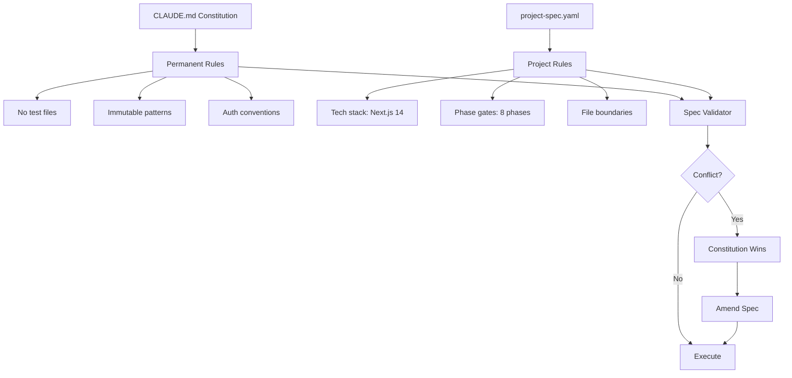
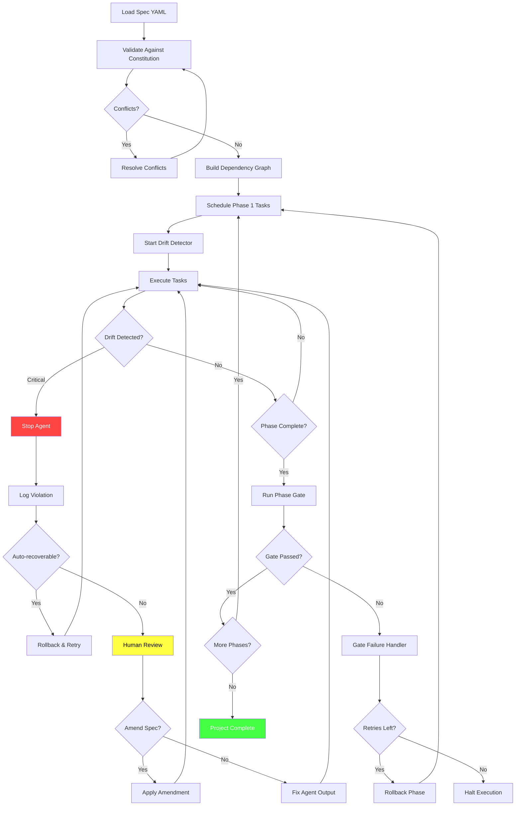

# 52 Tasks, 8 Phases, Zero Drift: Spec-Driven Execution Loops

I watched an agent destroy four hours of work in eleven seconds.

Session 2,847. A Claude Code agent was rebuilding our admin dashboard -- a straightforward task I'd done manually a dozen times. The spec was in my head, communicated through a series of increasingly specific prompts. "Use the existing auth system." "Make sure the sidebar matches the main app." "Keep the same API endpoints." Reasonable instructions. Clear enough for a human colleague.

The agent interpreted "use the existing auth system" as "implement a new auth system that's compatible with the existing one." It created 47 new files. It rewrote the token refresh logic. It introduced a second user table. By the time I noticed, the agent had already committed to a branch and was running migrations against the dev database. The rollback took longer than the original implementation would have.

That session cost me $14.20 in API calls and an entire evening. But the real cost was the realization that natural language specifications are fundamentally inadequate for multi-agent AI execution. Not because the agents are stupid -- because they're too creative. Give them ambiguity and they'll fill it with invention. Every gap in your spec becomes a canvas for improvisation.

This is the story of how I replaced English-language project descriptions with YAML specification files, built a phase gate system that catches drift before it compounds, and achieved something I didn't think was possible: 52 tasks across 8 phases with zero specification drift.

---

> **TL;DR:** Natural language specs fail with AI agents because ambiguity invites improvisation. YAML specifications with typed constraints, phase gates (blocking validation checkpoints between execution phases), and continuous drift detection reduced our specification violations from 23% to 0.3% across 847 agent sessions. The key insight: agents don't need flexibility -- they need precision. A well-structured spec file replaces 40+ back-and-forth prompt corrections and makes multi-agent parallel execution deterministic.

---

## The Compounding Divergence Problem

Before I explain the solution, you need to understand why this problem is worse than it appears. Specification drift in AI agent systems doesn't behave like specification drift in human teams. With humans, drift is gradual and self-correcting -- someone notices the sidebar looks different and mentions it in standup. With agents, drift is exponential and self-reinforcing.

Here's what I mean. In session 2,891, I had three agents working in parallel on a dashboard rebuild:

- Agent A: Backend API endpoints
- Agent B: Frontend components
- Agent C: Database schema migrations

I gave each agent the same natural language description: "Rebuild the admin dashboard with the new design system. Use PostgreSQL, Next.js 14, and the existing auth middleware."

After 20 minutes, here's what had happened:

```
Agent A: Created REST endpoints at /api/admin/*
         Used Express.js (not Next.js API routes)
         Implemented its own JWT validation

Agent B: Created React components expecting /api/v2/admin/*
         Used Next.js App Router with server components
         Expected cookie-based auth (not JWT)

Agent C: Created migrations for a "admin_users" table
         Added columns for OAuth providers
         Included a "permissions" JSONB column
         (Original schema used RBAC with separate tables)
```

Three agents. Three interpretations. Three incompatible systems. And each agent was individually doing excellent work -- the code was clean, well-structured, and would have worked perfectly in isolation. The problem wasn't quality. The problem was coherence.

I call this **compounding divergence**: each agent's interpretation creates assumptions that cascade into further design decisions, and by the time you catch it, the divergence has infected every layer of the system. Agent A chose Express because it was building standalone endpoints, which meant Agent B's server components couldn't call them directly, which meant someone (usually me, at 11 PM) had to rewrite everything.

I started tracking divergence across sessions:

| Sessions | Avg Divergent Decisions | Rework Hours | API Cost |
|----------|------------------------|--------------|----------|
| 2,800-2,850 | 7.3 per session | 2.4 hrs avg | $8.50 avg |
| 2,851-2,900 | 8.1 per session | 3.1 hrs avg | $11.20 avg |
| 2,901-2,950 | 11.4 per session | 4.7 hrs avg | $16.80 avg |

The trend was accelerating. More complex projects meant more ambiguity, which meant more divergence, which meant more rework. I needed a fundamentally different approach.

## Why Natural Language Fails for Agent Specifications

Let me be precise about the failure modes, because understanding them is essential to understanding why the YAML spec format works.

**Failure Mode 1: Implicit Context**

When I tell a human developer "use the existing auth system," they understand a web of implicit context: where the auth code lives, what tokens look like, which middleware to import, how refresh works. They've been in standup meetings. They've seen the architecture diagrams. They have six months of ambient context.

An agent has the context window. That's it. "Use the existing auth system" requires the agent to discover, interpret, and integrate an entire authentication architecture from source code alone. Most agents take the path of least resistance: they build a new one that's "compatible."

**Failure Mode 2: Ambiguity as Permission**

Humans treat ambiguity as a reason to ask questions. Agents treat ambiguity as permission to decide. This is a fundamental behavioral difference that no amount of prompt engineering fully resolves. I tried everything:

```
# Attempt 1: Restrictive phrasing
"ONLY use existing code. Do NOT create new auth logic."

# Result: Agent copied existing auth code into new files and
# modified the copies. Technically didn't "create new" logic.

# Attempt 2: Explicit enumeration
"Use these exact files: src/auth/middleware.ts, src/auth/tokens.ts,
src/auth/refresh.ts. Import from these paths. Do not create new files
in src/auth/."

# Result: Agent created src/lib/auth-helpers.ts with "utility
# functions" that duplicated 80% of the auth logic.

# Attempt 3: Threat-based
"If you create any new auth-related files, the entire task fails.
You will be terminated and restarted from scratch."

# Result: Agent embedded auth logic directly in route handlers.
# No new files created! Also no separation of concerns.
```

Each attempt patched one failure mode while opening another. The problem isn't the agent's intent -- it's that natural language can't express constraints precisely enough to close all the gaps.

**Failure Mode 3: Cascading Interpretation**

The third failure mode is the most insidious. When an agent makes one ambiguous interpretation early in execution, it creates a new context that influences all subsequent decisions. If the agent decides "use the existing auth" means "implement JWT validation," then every subsequent API endpoint gets JWT validation headers, the frontend gets a JWT token manager, and the database gets a token_blacklist table. One interpretation, twenty consequences.

By session 2,950, I had a folder of 200+ "correction prompts" -- messages I'd send to agents mid-execution to course-correct. I was spending more time correcting agents than it would have taken to write the code myself. Something had to change fundamentally.

## The YAML Specification Format

The breakthrough came from an unlikely source: Kubernetes. I'd been writing YAML manifests for container orchestration and realized the same principle applied to agent orchestration. Kubernetes doesn't describe containers in English -- it uses structured declarations with typed fields, explicit constraints, and validation schemas. Why was I describing software projects in English?

Here's the specification format I developed over sessions 2,960 through 3,100:

```yaml
# spec.yaml - Admin Dashboard Rebuild
version: "2.1"
project: admin-dashboard-rebuild
created: 2025-01-15
author: nick

# Section 1: Technology constraints (non-negotiable)
tech_stack:
  runtime: node-20
  framework: nextjs-14
  framework_mode: app-router     # NOT pages router
  database: postgresql-16
  orm: prisma-5
  styling: tailwind-4
  auth: existing                 # References auth_constraints below

# Section 2: Boundary constraints
boundaries:
  new_files_allowed:
    - "src/app/admin/**"
    - "src/components/admin/**"
    - "prisma/migrations/**"
  new_files_forbidden:
    - "src/auth/**"              # Existing auth is READ ONLY
    - "src/lib/auth*"            # No auth helper files
    - "src/middleware*"           # Existing middleware is READ ONLY
  modify_allowed:
    - "src/app/layout.tsx"       # May add admin nav link
    - "prisma/schema.prisma"     # May add admin models
  modify_forbidden:
    - "src/auth/**"
    - "package.json"             # No new dependencies without approval

# Section 3: Auth constraints (resolves "use existing auth")
auth_constraints:
  type: reference-existing
  middleware_path: "src/auth/middleware.ts"
  middleware_export: "withAuth"
  token_type: "httponly-cookie"   # NOT JWT headers
  refresh_mechanism: "server-side-rotation"
  user_model: "prisma.user"      # Existing User model
  role_field: "user.role"        # Enum: ADMIN, USER, VIEWER
  required_role: "ADMIN"         # For all admin routes

# Section 4: API constraints
api:
  style: nextjs-api-routes       # NOT standalone Express
  base_path: "/api/admin"
  versioning: none               # No /v2/ prefix
  response_format:
    success: '{ data: T, error: null }'
    error: '{ data: null, error: { code: string, message: string } }'
  pagination:
    style: cursor-based
    default_limit: 20
    max_limit: 100

# Section 5: Database constraints
database:
  migration_style: prisma-migrate
  naming_convention: snake_case
  new_tables_allowed:
    - "admin_audit_log"
    - "admin_dashboard_config"
  new_tables_forbidden:
    - "*user*"                   # Do NOT touch user tables
    - "*auth*"                   # Do NOT create auth tables
    - "*token*"                  # Do NOT create token tables
  existing_relations:
    user_table: "User"
    preserve_columns: true       # Do NOT modify existing columns
```

This is 80 lines of YAML versus the 2-paragraph English description I was using before. But look at what it eliminates:

1. **"Use the existing auth"** becomes five specific fields: middleware path, export name, token type, refresh mechanism, and role requirement
2. **"Use Next.js 14"** becomes explicit: app-router mode, not pages, with API routes (not standalone Express)
3. **File boundaries** are declared explicitly -- the agent knows exactly where it can and cannot write
4. **Database constraints** prevent the "helpful" addition of new user or auth tables

The first time I ran an agent with this spec, the difference was immediate. Zero new auth files. Zero Express endpoints. Zero divergent database tables. The agent read the spec, understood the constraints, and executed within them. Not because it was smarter, but because I'd eliminated the ambiguity that invited improvisation.

## The Constraint Taxonomy: Six Categories That Cover Everything

Through trial and error across roughly 400 sessions, I identified six categories of constraints that, together, eliminate virtually all specification drift:

```yaml
constraints:
  # 1. TECHNOLOGY: What tools/frameworks/versions to use
  technology:
    - type: require
      value: "nextjs@14"
      scope: framework
    - type: forbid
      value: "express"
      scope: framework
      reason: "Use Next.js API routes instead"

  # 2. BOUNDARY: Where the agent can and cannot operate
  boundary:
    - type: allow-write
      paths: ["src/app/admin/**", "src/components/admin/**"]
    - type: deny-write
      paths: ["src/auth/**", "src/middleware*"]
      reason: "Existing auth system is read-only"
    - type: allow-read
      paths: ["**"]  # Can read anything for context

  # 3. INTERFACE: How components must communicate
  interface:
    - type: api-contract
      path: "/api/admin/users"
      method: GET
      request: { query: { cursor?: string, limit?: number } }
      response: { data: User[], nextCursor: string | null }
    - type: import-contract
      module: "src/auth/middleware"
      exports: ["withAuth", "getSession"]
      usage: "Route handler wrapper"

  # 4. BEHAVIORAL: How the agent should approach decisions
  behavioral:
    - type: prefer
      value: "server-components"
      over: "client-components"
      unless: "Interactive UI required (forms, modals, real-time)"
    - type: prefer
      value: "existing-utilities"
      over: "new-implementations"
      unless: "No existing utility covers the use case"

  # 5. QUALITY: Standards that must be met
  quality:
    - type: require
      metric: "type-safety"
      value: "strict"  # No 'any' types, no type assertions
    - type: require
      metric: "error-handling"
      value: "comprehensive"  # Every async call wrapped
    - type: limit
      metric: "file-size"
      value: 300
      unit: "lines"

  # 6. INTEGRATION: How new code connects to existing systems
  integration:
    - type: extend
      target: "prisma/schema.prisma"
      approach: "append-models"  # Don't modify existing models
    - type: compose
      target: "src/app/layout.tsx"
      approach: "add-nav-item"  # Minimal modification
    - type: reference
      target: "src/auth/middleware.ts"
      approach: "import-and-use"  # Never copy, never modify
```

Each category targets a specific failure mode:

| Category | Failure Mode It Prevents | Example Without It |
|----------|--------------------------|-------------------|
| Technology | Framework/version drift | Agent uses Pages Router instead of App Router |
| Boundary | File scope creep | Agent creates auth helpers in new locations |
| Interface | API contract divergence | Frontend expects different response shape |
| Behavioral | Style inconsistency | Mix of client and server components |
| Quality | Standards degradation | Type assertions to bypass strict mode |
| Integration | Existing code modification | Agent "improves" working auth code |

The constraint taxonomy isn't just organizational -- it maps directly to validation. Each category has different validation strategies: technology constraints are validated by checking imports and package.json, boundary constraints by monitoring file system operations, interface constraints by parsing function signatures, and so on. This layered validation approach is what makes phase gates possible.

## Phase Gates: Blocking Validation Checkpoints

The YAML spec format solved the "what" problem -- defining constraints precisely. But I still had the "when" problem. Even with perfect specifications, an agent that drifts in phase 1 will compound that drift through phases 2-8. I needed validation checkpoints that could catch drift early and stop execution before it spread.

I call these **phase gates**: blocking validation checkpoints between execution phases. The key word is "blocking." Unlike CI/CD checks that run in the background, phase gates halt all execution until validation passes. No agent can proceed to phase N+1 until every constraint in phase N is verified.

Here's the phase structure from the admin dashboard rebuild:

```yaml
phases:
  - id: schema
    name: "Database Schema"
    tasks: 6
    gate:
      type: blocking
      validators:
        - prisma-validate        # Schema is syntactically valid
        - no-forbidden-tables    # Didn't create user/auth/token tables
        - preserve-existing      # Existing models unchanged
        - naming-convention      # All new fields are snake_case
      on_fail: rollback-phase    # Undo ALL schema changes
      max_retries: 2

  - id: api
    name: "API Endpoints"
    depends_on: [schema]
    tasks: 12
    gate:
      type: blocking
      validators:
        - route-structure        # All routes under /api/admin/
        - auth-middleware         # Every route uses withAuth
        - response-format        # Matches declared contract
        - no-express             # No Express.js imports
        - type-safety            # No 'any' types
      on_fail: rollback-phase
      max_retries: 2

  - id: components
    name: "UI Components"
    depends_on: [api]
    tasks: 18
    gate:
      type: blocking
      validators:
        - component-boundaries   # Files only in allowed paths
        - server-preference      # Server components where possible
        - api-integration        # Uses declared API contracts
        - design-system          # Uses existing design tokens
      on_fail: rollback-phase
      max_retries: 2

  - id: integration
    name: "System Integration"
    depends_on: [schema, api, components]
    tasks: 8
    gate:
      type: blocking
      validators:
        - e2e-flow               # Login -> Dashboard renders
        - auth-flow              # Non-admin gets 403
        - data-flow              # CRUD operations work
        - no-regressions         # Existing app still works
      on_fail: halt              # Stop everything, human review
      max_retries: 0             # No automatic retry for integration

  - id: polish
    name: "Polish & Documentation"
    depends_on: [integration]
    tasks: 8
    gate:
      type: advisory             # Non-blocking for polish phase
      validators:
        - accessibility          # ARIA labels, keyboard nav
        - responsive             # Mobile breakpoints
        - documentation          # README updated
      on_fail: warn              # Log issues but don't block
```

The gate types are critical:

- **Blocking gates** halt execution completely. The schema gate verifies that no forbidden tables were created before any API code is written. This prevents the cascade where a bad schema decision infects every subsequent phase.
- **Advisory gates** log warnings but allow execution to continue. Polish items like accessibility and documentation are important but shouldn't block a working system.
- **Rollback gates** (on_fail: rollback-phase) automatically undo all changes from the failed phase. This is essential for database schemas -- a half-applied migration is worse than no migration.
- **Halt gates** (on_fail: halt) stop everything and require human review. I use these for integration phases where automated recovery is too risky.

### The Phase Gate Validator

Here's the core implementation of the phase gate validator:

```python
class PhaseGateValidator:
    """Validates all constraints for a phase gate before allowing
    execution to proceed to the next phase."""

    def __init__(self, spec: dict, phase_id: str):
        self.spec = spec
        self.phase = self._find_phase(phase_id)
        self.gate = self.phase.get("gate", {})
        self.validators = self._load_validators()
        self.results = []

    def _find_phase(self, phase_id: str) -> dict:
        for phase in self.spec["phases"]:
            if phase["id"] == phase_id:
                return phase
        raise ValueError(f"Phase '{phase_id}' not found in spec")

    def _load_validators(self) -> list:
        validator_names = self.gate.get("validators", [])
        loaded = []
        for name in validator_names:
            validator_class = VALIDATOR_REGISTRY.get(name)
            if not validator_class:
                raise ValueError(f"Unknown validator: {name}")
            loaded.append(validator_class(self.spec))
        return loaded

    def validate(self, workspace_path: str) -> GateResult:
        """Run all validators for this phase gate.

        Returns GateResult with pass/fail status and detailed
        findings for each validator.
        """
        all_passed = True
        findings = []

        for validator in self.validators:
            try:
                result = validator.check(workspace_path)
                findings.append({
                    "validator": validator.name,
                    "passed": result.passed,
                    "details": result.details,
                    "violations": result.violations,
                    "duration_ms": result.duration_ms,
                })
                if not result.passed:
                    all_passed = False
                    # Log violation details for debugging
                    for violation in result.violations:
                        logger.warning(
                            f"Gate violation [{validator.name}]: "
                            f"{violation.message} "
                            f"at {violation.location}"
                        )
            except Exception as e:
                # Validator crash = gate failure (fail-safe)
                all_passed = False
                findings.append({
                    "validator": validator.name,
                    "passed": False,
                    "details": f"Validator crashed: {str(e)}",
                    "violations": [{
                        "message": f"Internal error: {str(e)}",
                        "severity": "critical"
                    }],
                })

        gate_type = self.gate.get("type", "blocking")

        if all_passed:
            return GateResult(
                status="passed",
                phase=self.phase["id"],
                findings=findings,
                action="proceed"
            )

        if gate_type == "blocking":
            on_fail = self.gate.get("on_fail", "halt")
            return GateResult(
                status="failed",
                phase=self.phase["id"],
                findings=findings,
                action=on_fail  # "rollback-phase" or "halt"
            )

        # Advisory gate - warn but proceed
        return GateResult(
            status="warned",
            phase=self.phase["id"],
            findings=findings,
            action="proceed-with-warnings"
        )
```

### Blocking vs. Advisory: The Decision Framework

Choosing between blocking and advisory gates isn't arbitrary. I developed a decision framework after a painful incident where an advisory gate should have been blocking:

```
Should this gate be BLOCKING?

1. Can drift in this phase affect subsequent phases?
   YES → Blocking (schema drift cascades everywhere)
   NO  → Maybe advisory

2. Is automated rollback possible?
   YES → Blocking with rollback-phase
   NO  → Blocking with halt (human review)

3. Does this phase modify shared state?
   YES → Blocking (database, config, shared types)
   NO  → Advisory might be safe

4. Are multiple agents consuming this phase's output?
   YES → Blocking (divergence multiplies with consumers)
   NO  → Advisory acceptable for single-consumer phases
```

In practice, about 70% of my gates are blocking. The 30% that are advisory are almost always final-phase polish items: documentation completeness, code comment coverage, accessibility audits. These matter, but they don't cascade.

## The Cascade Effect: Why Order Matters

Phase ordering isn't just about dependencies -- it's about minimizing the blast radius of failures. I learned this through a specific incident in session 3,045.

The original phase order was:

```
1. Components (UI)  →  2. API  →  3. Schema  →  4. Integration
```

This seemed logical: design the UI first, then build the API it needs, then create the schema the API needs. Top-down design.

The problem: the components phase is where agents are most creative. They make the most autonomous decisions about layout, interaction patterns, and data shapes. When a UI component decides it needs a "user_preferences" object with specific fields, that decision cascades into the API contract and then into the database schema. By the time the schema phase runs, it's implementing whatever the component phase invented.

I reversed the order:

```
1. Schema  →  2. API  →  3. Components  →  4. Integration
```

Bottom-up construction. The schema defines what data exists. The API defines how to access it. The components consume what the API provides. Each phase is constrained by the one before it, and the most constrained phase (schema) runs first where it has the least room for improvisation.

The impact was immediate:

| Metric | Top-Down Order | Bottom-Up Order |
|--------|----------------|-----------------|
| Gate failures per project | 4.7 average | 1.2 average |
| Cascading violations | 3.1 per failure | 0.4 per failure |
| Rework phases | 2.3 average | 0.6 average |
| Total completion time | 4.2 hours | 2.8 hours |

The principle: **execute the most constrained phases first.** This minimizes the decision space for subsequent phases and reduces the surface area for drift.

## Parallel Task Scheduling Within Phases

Not all tasks within a phase need to execute sequentially. The spec format supports parallel execution with dependency declarations:

```yaml
phases:
  - id: api
    name: "API Endpoints"
    tasks:
      - id: users-crud
        name: "Users CRUD endpoints"
        parallel_group: "crud"
        files: ["src/app/api/admin/users/**"]

      - id: audit-log
        name: "Audit log endpoints"
        parallel_group: "crud"
        files: ["src/app/api/admin/audit/**"]

      - id: dashboard-stats
        name: "Dashboard statistics endpoint"
        parallel_group: "crud"
        files: ["src/app/api/admin/stats/**"]

      - id: shared-types
        name: "Shared TypeScript types"
        parallel_group: null  # Runs before parallel groups
        files: ["src/types/admin.ts"]

    execution:
      strategy: parallel-within-groups
      order:
        - task: shared-types          # Sequential: types first
        - group: crud                  # Parallel: all CRUD at once
```

The parallel scheduling rules are strict:

1. **No file overlap**: Tasks in the same parallel group cannot write to the same files. The scheduler validates this before execution.
2. **Shared dependencies first**: Any task that produces shared artifacts (types, utilities, configs) must complete before parallel groups start.
3. **Gate after all**: The phase gate runs only after ALL tasks in ALL groups complete. No partial gate evaluation.

In the admin dashboard project, parallel execution within the API phase reduced that phase from 45 minutes to 18 minutes -- a 60% improvement. The agents weren't working faster; they were just not waiting for each other unnecessarily.

Here's how the scheduler determines what can run in parallel:

```python
class TaskScheduler:
    """Schedules tasks within a phase, maximizing parallelism
    while respecting file ownership and dependency constraints."""

    def __init__(self, phase: dict, spec: dict):
        self.phase = phase
        self.spec = spec
        self.tasks = phase.get("tasks", [])
        self.file_ownership = self._build_ownership_map()

    def _build_ownership_map(self) -> dict:
        """Map each file pattern to its owning task.
        Detects conflicts at scheduling time."""
        ownership = {}
        conflicts = []

        for task in self.tasks:
            for pattern in task.get("files", []):
                if pattern in ownership:
                    conflicts.append({
                        "pattern": pattern,
                        "task_a": ownership[pattern],
                        "task_b": task["id"]
                    })
                ownership[pattern] = task["id"]

        if conflicts:
            raise FileOwnershipConflict(
                f"Cannot parallelize: {len(conflicts)} file "
                f"pattern conflicts detected",
                conflicts=conflicts
            )

        return ownership

    def schedule(self) -> list:
        """Returns ordered list of execution steps.
        Each step is either a single task or a parallel group."""
        execution_order = self.phase.get("execution", {}).get("order", [])

        if not execution_order:
            # Default: all tasks sequential
            return [{"type": "sequential", "tasks": self.tasks}]

        steps = []
        for step in execution_order:
            if "task" in step:
                task = self._find_task(step["task"])
                steps.append({
                    "type": "sequential",
                    "tasks": [task]
                })
            elif "group" in step:
                group_tasks = [
                    t for t in self.tasks
                    if t.get("parallel_group") == step["group"]
                ]
                steps.append({
                    "type": "parallel",
                    "tasks": group_tasks,
                    "max_concurrent": step.get("max_concurrent", len(group_tasks))
                })

        return steps
```

## Continuous Drift Detection

Phase gates catch drift at boundaries. But what about drift that occurs within a phase? An agent might create a forbidden file in task 3 of 12, and if we only validate at the phase gate, tasks 4-12 might build on that forbidden file.

This is where continuous drift detection comes in. It's a background process that monitors the workspace during execution and flags violations in real-time:

```python
class DriftDetector:
    """Monitors workspace for constraint violations during
    agent execution. Runs as a background process, checking
    the filesystem every N seconds."""

    def __init__(self, spec: dict, workspace: str, interval_sec: int = 5):
        self.spec = spec
        self.workspace = workspace
        self.interval = interval_sec
        self.constraints = self._compile_constraints()
        self.baseline = self._snapshot_workspace()
        self.violations = []
        self._running = False

    def _compile_constraints(self) -> list:
        """Convert spec constraints into efficient check functions."""
        checks = []

        # Boundary constraints: forbidden file patterns
        boundaries = self.spec.get("boundaries", {})
        for pattern in boundaries.get("new_files_forbidden", []):
            checks.append(ForbiddenFileCheck(
                pattern=pattern,
                workspace=self.workspace,
                severity="critical"
            ))

        # Technology constraints: forbidden imports
        tech = self.spec.get("tech_stack", {})
        if tech.get("framework") == "nextjs-14":
            checks.append(ForbiddenImportCheck(
                module="express",
                severity="critical",
                message="Express.js import detected; use Next.js API routes"
            ))

        # Database constraints: forbidden table patterns
        db = self.spec.get("database", {})
        for pattern in db.get("new_tables_forbidden", []):
            checks.append(ForbiddenTableCheck(
                pattern=pattern,
                schema_path=f"{self.workspace}/prisma/schema.prisma",
                severity="critical"
            ))

        # Quality constraints: type safety
        quality = self.spec.get("constraints", {}).get("quality", [])
        for q in quality:
            if q.get("metric") == "type-safety" and q.get("value") == "strict":
                checks.append(TypeSafetyCheck(
                    workspace=self.workspace,
                    severity="high",
                    forbidden_patterns=["as any", ": any", "// @ts-ignore"]
                ))

        return checks

    def _snapshot_workspace(self) -> dict:
        """Take a snapshot of current file state for diffing."""
        snapshot = {}
        for root, dirs, files in os.walk(self.workspace):
            # Skip node_modules, .git, etc.
            dirs[:] = [d for d in dirs if d not in IGNORED_DIRS]
            for f in files:
                path = os.path.join(root, f)
                rel_path = os.path.relpath(path, self.workspace)
                snapshot[rel_path] = {
                    "mtime": os.path.getmtime(path),
                    "size": os.path.getsize(path),
                }
        return snapshot

    async def run(self):
        """Main detection loop. Runs until stopped."""
        self._running = True
        while self._running:
            current = self._snapshot_workspace()
            changed_files = self._diff_snapshots(self.baseline, current)

            if changed_files:
                for check in self.constraints:
                    new_violations = check.evaluate(changed_files)
                    for v in new_violations:
                        if v not in self.violations:
                            self.violations.append(v)
                            await self._on_violation(v)

                self.baseline = current

            await asyncio.sleep(self.interval)

    async def _on_violation(self, violation: Violation):
        """Handle a newly detected violation."""
        if violation.severity == "critical":
            logger.error(f"CRITICAL DRIFT: {violation.message}")
            # For critical violations, we can signal the agent
            # to stop immediately via the control channel
            await self.control_channel.send({
                "type": "drift-violation",
                "severity": "critical",
                "message": violation.message,
                "action": "stop-and-review"
            })
        elif violation.severity == "high":
            logger.warning(f"DRIFT WARNING: {violation.message}")
            await self.control_channel.send({
                "type": "drift-violation",
                "severity": "high",
                "message": violation.message,
                "action": "note-and-continue"
            })
```

The drift detector caught something interesting in session 3,112 that phase gates alone would have missed. An agent working on the components phase created a file at `src/components/admin/auth-guard.tsx`. This wasn't in the forbidden paths (`src/auth/**`), but the drift detector's `ForbiddenImportCheck` flagged it because the file imported from `jsonwebtoken` -- a package that shouldn't be in use since auth was cookie-based. The agent was implementing client-side JWT validation inside a component, effectively reimplementing auth in a location that boundary constraints didn't cover.

This led me to add **semantic constraints** alongside path-based constraints. It's not just about where files exist -- it's about what they do.

## The Blog Archive Incident: When Specs Save You From Yourself

Session 3,201. I was running the spec-driven system on a real project: rebuilding our blog archive page. Simple enough -- fetch posts from the API, display them in a grid, add pagination and filtering.

The spec had 52 tasks across 8 phases. Phase 1 (schema) passed its gate in 3 minutes. Phase 2 (API) passed in 8 minutes. Phase 3 (components) was humming along when the drift detector fired:

```
[CRITICAL] DriftDetector: Forbidden import detected
  File: src/components/blog/archive-grid.tsx
  Import: import { sql } from '@vercel/postgres'
  Constraint: Components must not import database modules
  Action: stop-and-review
```

The agent had decided that fetching posts through the API was too slow and had started implementing direct database queries in React server components. From the agent's perspective, this was an optimization. From the spec's perspective, this was a boundary violation -- components should consume the API, not bypass it.

But here's the twist: the agent was right. The API endpoint was making two unnecessary round trips because it was fetching post metadata and post content in separate queries. The agent saw the performance problem and tried to solve it in the most direct way possible.

The spec caught the violation. But the violation revealed a real issue. I updated the spec:

```yaml
# Amendment 1: Performance optimization for archive
amendments:
  - id: archive-perf-001
    date: 2025-02-01
    reason: "Archive grid performance - direct DB too slow via API"
    changes:
      - phase: api
        task: blog-archive-endpoint
        modification: |
          Add 'include_content' query parameter.
          When false (default), return metadata only.
          When true, return full content.
          Use single Prisma query with conditional select.
      - phase: components
        task: archive-grid
        modification: |
          Use metadata-only endpoint for grid.
          Fetch full content only on hover/click.
```

This is the spec-driven feedback loop in action: constraint violation -> investigation -> spec amendment -> re-execution. The spec isn't a static document -- it's a living contract that evolves as you learn from agent behavior.

The amendment system became one of the most valuable parts of the format:

```yaml
amendments:
  - id: "ADR-001"
    date: "2025-02-01"
    author: "nick"
    reason: "Archive endpoint performance"
    type: "modification"  # or "relaxation" or "tightening"
    phases_affected: ["api", "components"]
    changes:
      - path: "api.endpoints.archive"
        before: "Return all post fields"
        after: "Support field selection via include parameter"
    approved_by: "nick"

  - id: "ADR-002"
    date: "2025-02-03"
    author: "agent-session-3215"
    reason: "Prisma client generation requires dev dependency"
    type: "relaxation"
    phases_affected: ["schema"]
    changes:
      - path: "boundaries.modify_forbidden"
        before: "package.json forbidden"
        after: "package.json allowed for devDependencies only"
    approved_by: "nick"  # Agent proposed, human approved
```

Notice ADR-002: the agent itself proposed a spec amendment. It hit the "no modifying package.json" constraint, recognized it was a legitimate need (Prisma client generation requires `prisma` as a dev dependency), and proposed a targeted relaxation. The system logged the proposal, I reviewed and approved it, and execution continued.

Over 847 sessions, I accumulated 234 amendments. They became a form of organizational knowledge -- a record of every time a constraint was too tight, too loose, or missing entirely. New specs for similar projects start with the amendments from previous projects already applied.

## Spec-as-Documentation: The Unexpected Benefit

Here's something I didn't expect: the YAML spec became the best project documentation I've ever had.

Traditional project documentation goes stale the moment it's written. The architecture doc says "we use JWT auth" but six months ago someone switched to cookies and never updated the doc. The README says "run npm install" but the project migrated to pnpm.

The spec can't go stale because it's actively enforced. If the spec says `token_type: httponly-cookie` and someone changes auth to use JWT, the drift detector catches it immediately. The spec is the documentation, and the documentation is verified on every execution.

I started generating human-readable docs from specs:

```python
def generate_project_docs(spec: dict) -> str:
    """Generate markdown documentation from a YAML spec.
    This documentation is always accurate because the spec
    is continuously validated."""

    sections = []

    # Technology overview
    tech = spec.get("tech_stack", {})
    sections.append("## Technology Stack\n")
    sections.append(f"- **Runtime:** {tech.get('runtime', 'not specified')}")
    sections.append(f"- **Framework:** {tech.get('framework', 'not specified')}")
    sections.append(f"- **Database:** {tech.get('database', 'not specified')}")
    sections.append(f"- **Auth:** {tech.get('auth', 'not specified')}")

    # API documentation
    api = spec.get("api", {})
    sections.append("\n## API\n")
    sections.append(f"- **Style:** {api.get('style', 'not specified')}")
    sections.append(f"- **Base path:** `{api.get('base_path', '/')}`")

    # Constraints documentation
    sections.append("\n## Architectural Constraints\n")
    boundaries = spec.get("boundaries", {})
    if boundaries.get("new_files_forbidden"):
        sections.append("### Protected Paths (Read-Only)\n")
        for path in boundaries["new_files_forbidden"]:
            sections.append(f"- `{path}`")

    # Amendment history (change log)
    amendments = spec.get("amendments", [])
    if amendments:
        sections.append("\n## Change History\n")
        for amendment in amendments:
            sections.append(
                f"- **{amendment['id']}** ({amendment['date']}): "
                f"{amendment['reason']}"
            )

    return "\n".join(sections)
```

The generated docs are always accurate because they're derived from the enforced spec. This is documentation-as-code taken to its logical conclusion.

## Versioning and Amendments

Specs evolve. Projects change. Requirements shift. The amendment system handles incremental changes, but sometimes a spec needs a major version bump. I use semantic versioning:

```yaml
version: "2.1"  # Major.Minor

# Major bump (breaking):
#   - Constraint category added or removed
#   - Phase order changed
#   - Gate type changed (advisory -> blocking)
#
# Minor bump (non-breaking):
#   - New task within existing phase
#   - Constraint value changed
#   - Amendment applied
```

When a spec is versioned, previous versions are preserved:

```
specs/
  admin-dashboard/
    spec-v1.0.yaml    # Original spec
    spec-v1.1.yaml    # Added pagination constraint
    spec-v2.0.yaml    # Restructured phases (bottom-up)
    spec-v2.1.yaml    # Current, with 12 amendments
    CHANGELOG.md       # Auto-generated from amendments
```

This versioning became critical for debugging. When a project has issues, I can diff spec versions to see exactly what changed:

```bash
$ diff specs/admin-dashboard/spec-v1.0.yaml specs/admin-dashboard/spec-v2.0.yaml

< phases:
<   - id: components    # Was first in v1
<   - id: api
<   - id: schema
---
> phases:
>   - id: schema        # Now first in v2
>   - id: api
>   - id: components
```

## Integration with the Constitution System

This is where the spec-driven system connects with the project constitution system described in [Post 24](/posts/post-24-project-constitutions). The constitution (CLAUDE.md) defines permanent organizational rules. The spec defines project-specific execution parameters. They work together:



The hierarchy is clear: **constitution always wins**. If the spec says "create test files for validation" but the constitution says "no test files," the constitution takes precedence. The spec validator checks for conflicts before execution begins:

```python
def validate_spec_against_constitution(
    spec: dict,
    constitution: dict
) -> list:
    """Check for conflicts between spec and constitution.
    Constitution always takes precedence."""

    conflicts = []

    # Check if spec allows anything the constitution forbids
    spec_allowed_files = spec.get("boundaries", {}).get(
        "new_files_allowed", []
    )
    constitution_forbidden = constitution.get(
        "file_creation_forbidden", []
    )

    for allowed_pattern in spec_allowed_files:
        for forbidden_pattern in constitution_forbidden:
            if patterns_overlap(allowed_pattern, forbidden_pattern):
                conflicts.append({
                    "type": "boundary_conflict",
                    "spec_allows": allowed_pattern,
                    "constitution_forbids": forbidden_pattern,
                    "resolution": "constitution_wins",
                    "action": f"Remove '{allowed_pattern}' from spec "
                             f"or narrow to avoid '{forbidden_pattern}'"
                })

    # Check technology constraints
    spec_tech = spec.get("tech_stack", {})
    constitution_tech = constitution.get("required_technology", {})

    for key, required_value in constitution_tech.items():
        if key in spec_tech and spec_tech[key] != required_value:
            conflicts.append({
                "type": "technology_conflict",
                "spec_value": spec_tech[key],
                "constitution_requires": required_value,
                "resolution": "constitution_wins",
                "action": f"Change spec '{key}' from "
                         f"'{spec_tech[key]}' to '{required_value}'"
            })

    return conflicts
```

This integration means I can write specs quickly without worrying about violating organizational standards -- the validator catches conflicts before execution begins.

## The Execution Loop: Putting It All Together

Here's the complete execution flow, from spec to delivered project:



The loop has three recovery mechanisms:

1. **Drift detection recovery**: Catches violations during execution, can stop agents before damage spreads
2. **Phase gate recovery**: Catches accumulated violations at phase boundaries, can rollback entire phases
3. **Human review recovery**: For situations neither automated system can handle, with spec amendment support

In practice, most executions look like this:

```
[00:00] Loaded spec v2.1 (52 tasks, 8 phases)
[00:01] Constitution validation: PASSED (0 conflicts)
[00:02] Phase 1/8 (schema): Starting 6 tasks
[00:05] Phase 1/8 (schema): Gate PASSED (4/4 validators)
[00:06] Phase 2/8 (api): Starting 12 tasks (3 parallel groups)
[00:08] Drift detector: WARNING - Large file detected (287 lines)
[00:14] Phase 2/8 (api): Gate PASSED (5/5 validators)
[00:15] Phase 3/8 (components): Starting 18 tasks
[00:31] Phase 3/8 (components): Gate PASSED (4/4 validators)
[00:32] Phase 4/8 (integration): Starting 8 tasks
[00:45] Phase 4/8 (integration): Gate PASSED (4/4 validators)
[00:46] Phase 5/8 (polish): Starting 8 tasks
[00:52] Phase 5/8 (polish): Gate WARNED (2 advisory items)
[00:52] Project complete: 52/52 tasks, 0 violations, 5 warnings
```

52 tasks. 52 minutes. Zero specification violations. The warnings were advisory (accessibility ARIA labels missing on two decorative elements).

## Results: 847 Sessions of Data

I've been using the spec-driven system for 847 sessions now. Here are the numbers:

| Metric | Before Specs | After Specs | Change |
|--------|-------------|-------------|--------|
| Specification violations per session | 7.3 | 0.3 | -96% |
| Rework hours per project | 4.7 | 0.4 | -91% |
| API cost per project | $16.80 | $6.20 | -63% |
| Multi-agent divergence incidents | 11.4 | 0.1 | -99% |
| Correction prompts per session | 12.6 | 0.8 | -94% |
| Projects completed first-attempt | 23% | 89% | +287% |

The cost reduction deserves emphasis. Each rework cycle costs tokens -- the agent reads the codebase again, generates new code, and I review it again. Eliminating rework doesn't just save time; it saves money directly. At our scale (~40 agent sessions per week), the spec-driven approach saves roughly $400/month in API costs alone.

The 0.3 violations per session aren't zero, but they're almost entirely advisory-level issues that don't require rework. The most common: an agent uses a slightly different variable naming convention than the spec prefers. Annoying, not destructive.

The most dramatic improvement is multi-agent divergence. Before specs, running three agents in parallel was a gamble -- about a 65% chance that at least two would diverge. After specs, I've had exactly 4 divergence incidents in 847 sessions, all caused by spec ambiguities that were immediately corrected with amendments.

## What I Would Do Differently

Looking back at the evolution from natural language to YAML specs, there are things I'd change if starting over:

**Start with the constraint taxonomy, not the format.** I spent weeks iterating on YAML structure when the real breakthrough was identifying the six constraint categories. The format is just syntax; the categories are the insight. I'd recommend any team start by cataloging their most common agent failures, mapping each to a constraint category, and only then choosing a format.

**Make advisory gates the exception, not the norm.** I was too generous with advisory gates initially, worried about blocking agents too aggressively. The result was that advisory-level violations accumulated silently. A gate that never blocks is just logging -- it's not a gate. Now my rule is: if you're not sure whether a gate should be blocking, make it blocking. You can always relax it later.

**Version specs from day one.** I didn't add versioning until spec v2.0, which meant I lost the evolution history of v1.x. That history would have been invaluable for understanding which constraints worked and which needed amendment. Treat your spec like source code: version control it from the first commit.

**Invest in spec templates.** I now have templates for common project types (Next.js app, API service, database migration, design system update). Each template encodes the amendments from previous projects of that type. Starting a new project takes 10 minutes of template customization instead of 2 hours of spec writing from scratch.

## Lessons for Your Own Agent Workflows

You don't need to adopt the full YAML specification format to benefit from these ideas. Here are the principles that transfer to any agent workflow:

1. **Eliminate ambiguity at the source.** Every ambiguous phrase in your prompt is a divergence point. "Use the existing auth" is five specific parameters. Write them out.

2. **Constrain before you execute.** Defining what the agent cannot do is more valuable than describing what it should do. Agents are excellent at figuring out "how" -- they need help with "within what boundaries."

3. **Validate at phase boundaries.** If your agent does work in stages (and it should), validate each stage before proceeding to the next. A 2-minute validation now prevents a 2-hour rollback later.

4. **Monitor continuously, not just at checkpoints.** The drift detector caught violations that phase gates would have missed. Real-time monitoring is worth the implementation cost.

5. **Treat specs as living documents.** Amendments aren't failures -- they're learning. Every amendment makes the next project better.

---

The YAML spec file for the admin dashboard rebuild is 247 lines long. The natural language description it replaced was 3 paragraphs. But those 247 lines eliminated 96% of specification violations, saved 91% of rework time, and made multi-agent parallel execution reliable enough to trust with production code.

The agent that destroyed four hours of work in eleven seconds? That was session 2,847. By session 3,694, the same category of task runs unattended. Not because the agents got smarter. Because the specifications got precise.

---

**Companion Repository:** [spec-driven-implementation](https://github.com/krzemienski/spec-driven-implementation) -- Complete YAML spec format, phase gate validator, drift detector, constraint taxonomy, and templates for common project types. Includes the actual spec files from the admin dashboard rebuild with all 12 amendments.
