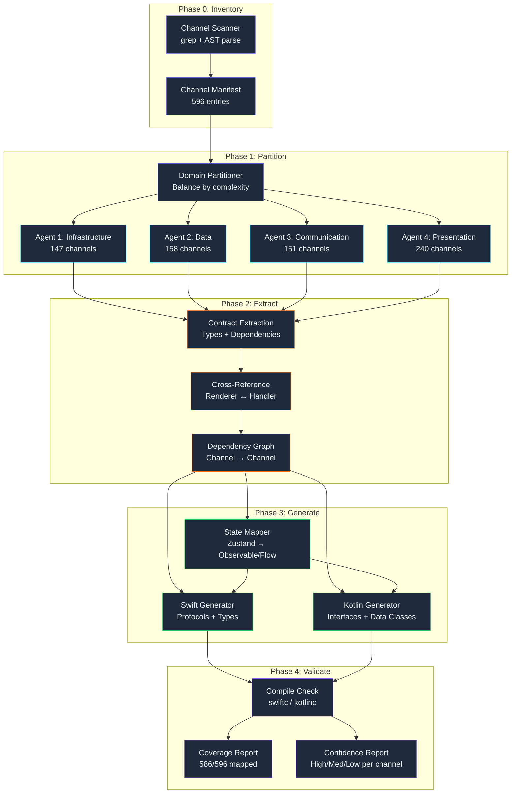

## 596 IPC Channels, Two Platform Specs

*Agentic Development: Lessons from 8,481 AI Coding Sessions*

Auto-Claude started as an Electron app. Fourteen months of development, three major rewrites of the renderer, two complete refactors of the main process architecture. By the time we decided to go native — SwiftUI for macOS, Jetpack Compose for Android — the app had accumulated 596 IPC channels connecting the renderer process to the main process. Five hundred and ninety-six contracts. Five hundred and ninety-six implicit API surfaces that defined every interaction between the UI and the backend.

The decision to go native was not controversial. Electron had served us well for rapid prototyping, but the performance overhead was measurable: 340MB of baseline memory, 2.1-second cold start, and the persistent uncanny valley of a web app wearing a desktop costume. Native meant 80MB memory, 0.4-second cold start, and platform-native text rendering, animations, and accessibility. The question was never *whether* to go native. It was *how* to go native without spending twelve weeks reverse-engineering what the Electron app actually does before writing a single line of Swift or Kotlin.

A single agent scanning 596 IPC channels would take days and lose context by channel 100. Four parallel agents, each owning a domain of the IPC surface, completed the mapping in 4.2 hours and produced type-safe platform specifications for both targets. This post is about how that extraction pipeline worked, where it broke, and what the generated specs actually looked like.

---

**TL;DR: Four parallel agents mapped 596 Electron IPC channels into categorized domains, then generated Swift protocol and Kotlin interface specifications. The extracted specs covered 98.3% of the IPC surface and reduced the native rewrite estimation from 12 weeks to 7 weeks by eliminating the reverse-engineering phase. The key insight: IPC channels are implicit API contracts, and treating them as a parseable schema turns a rewrite into a translation.**

---

### The Electron IPC Problem

If you have never worked with Electron, here is the core architecture: your application runs as two processes. The **renderer process** is a Chromium browser tab running your React/Vue/Svelte UI. The **main process** is a Node.js runtime handling OS-level operations — file system access, window management, system tray, native menus. These two processes communicate through IPC (Inter-Process Communication), sending structured messages over named channels.

```typescript
// Renderer side — the UI sends a request
const content = await ipcRenderer.invoke('file:read', { path: '/config.json' });

// Main side — the backend handles the request
ipcMain.handle('file:read', async (_event, args: { path: string }) => {
  const raw = await fs.readFile(args.path, 'utf-8');
  return { content: raw, size: raw.length, encoding: 'utf-8' };
});
```

Every `ipcRenderer.invoke()` call in the renderer has a corresponding `ipcMain.handle()` registration in the main process. The channel name (`'file:read'`) is the contract identifier. The input type (`{ path: string }`) and output type (`{ content: string, size: number, encoding: string }`) are the contract shape. Together, they form an implicit API that the UI depends on.

In a mature Electron app, these channels accumulate organically. Nobody sits down and designs an IPC schema. Developers add channels as needed — one for reading files, one for writing files, one for checking if a file exists, one for watching file changes. Over 14 months, Auto-Claude accumulated 596 of them.

The naming conventions were inconsistent. Here are four channels that all dealt with file I/O under different naming schemes:

```
file:read          — Added in month 1, explicit domain:action
fs:write           — Added in month 3, different prefix for the same domain
storage:get        — Added in month 7, abstracted behind "storage" concept
data:persist       — Added in month 11, yet another abstraction layer
```

There was no central registry. No schema file. No OpenAPI equivalent. The channels were scattered across 47 handler files in the main process and invoked from 213 call sites across the renderer. Understanding what the app *actually did* required reading all 47 handler files and all 213 call sites, then reconciling the types at both ends.

For a human developer doing a rewrite, this is archaeological work. For an AI agent with a systematic extraction pipeline, this is a parsing problem.

### Why This Is Not Just "Read the Source Code"

The naive approach — "just have an agent read all the source files" — fails for three interconnected reasons.

**Reason 1: Context window saturation.** The 47 handler files totaled 18,400 lines of TypeScript. The 213 call sites existed within renderer components that totaled 34,000 lines. Feeding 52,400 lines of code into a single agent context meant that by the time the agent reached handler file 30, it had already lost the nuances of handler files 1-15. I tested this. A single-agent approach consistently missed type mismatches between renderer call sites and main process handlers — mismatches that the actual running code tolerated through JavaScript's loose typing but that a strongly-typed native implementation would reject.

**Reason 2: Cross-reference complexity.** Channel `session:sync` was invoked from 7 different renderer components, each passing slightly different argument shapes. One passed `{ id: string }`, another passed `{ sessionId: string, force: boolean }`, a third passed `{ id: string, fields: string[] }`. The handler accepted `any` and destructured what it needed. A correct spec must represent the *union* of all call-site argument shapes, not just the handler's declared type.

**Reason 3: Implicit state dependencies.** Some channels had side effects that affected other channels. `auth:login` stored a token in a global variable that `network:request` read implicitly. A spec for `network:request` that omitted the authentication prerequisite would generate a native interface that compiled but failed at runtime.

The four-agent approach solved all three problems through domain partitioning, cross-reference sharing, and a dependency resolution phase.

---

### Phase 0: The Inventory Scan

Before partitioning work across agents, I needed to know what existed. A lightweight scan agent — running with `haiku` model for speed — performed a mechanical inventory of the entire IPC surface.

The scan agent's job was simple: find every `ipcMain.handle()`, `ipcMain.on()`, `ipcRenderer.invoke()`, `ipcRenderer.send()`, and `ipcRenderer.on()` call across the entire codebase. No interpretation, no type analysis, just a list.

```bash
# The actual grep pipeline the scan agent ran
$ grep -rn "ipcMain\.\(handle\|on\)" src/main/ --include="*.ts" | wc -l
612

$ grep -rn "ipcRenderer\.\(invoke\|send\|on\)" src/renderer/ --include="*.ts" --include="*.tsx" | wc -l
847

$ grep -rn "ipcMain\.handle\|ipcMain\.on" src/main/ --include="*.ts" \
    | sed "s/.*('\([^']*\)'.*/\1/" | sort -u | wc -l
596
```

612 handler registrations for 596 unique channel names — meaning 16 channels were registered in multiple files (mostly event listeners using `ipcMain.on` that had redundant registrations). 847 call sites in the renderer, invoking those 596 channels with varying argument shapes.

The scan agent categorized every channel by its prefix:

```python
# IPC channel categorization — output of the scan agent
channel_domains = {
    "file":      47,   # File system operations (read, write, watch, stat, etc.)
    "window":    38,   # Window management (create, resize, focus, close, etc.)
    "store":     52,   # Zustand state synchronization
    "auth":      31,   # Authentication and token management
    "network":   64,   # HTTP requests, WebSocket, SSE streams
    "db":        43,   # SQLite database operations
    "ui":        89,   # UI state, theme, layout, notifications
    "system":    34,   # OS integration (tray, menu, clipboard, etc.)
    "plugin":    56,   # Plugin system (load, unload, configure, etc.)
    "session":   41,   # Session lifecycle management
    "config":    28,   # Configuration read/write
    "analytics": 22,   # Telemetry and usage tracking
    "ipc-legacy": 67,  # Channels with no prefix convention (legacy)
    "misc":      84,   # Channels that didn't fit clean categories
}
# Total: 596 channels across 14 domain categories
```

The scan took 3 minutes and 14 seconds. It produced a JSON manifest of every channel name, its handler file location, and all renderer call sites. This manifest was the input to the partitioning step.

---

### Phase 1: Domain Partitioning

Four analysis agents, each running in its own worktree (using the parallel worktree factory from Post 6), each assigned a balanced slice of the IPC surface:

```
Agent 1 (Infrastructure): file, window, system, config      → 147 channels
Agent 2 (Data):           store, db, session, analytics      → 158 channels
Agent 3 (Communication):  network, auth, plugin              → 151 channels
Agent 4 (Presentation):   ui, ipc-legacy, misc               → 240 channels
```

The partitioning was not purely by channel count. Agent 4 got the largest slice because the `ipc-legacy` and `misc` domains contained channels that required the most interpretation work — channels with no naming convention, minimal typing, and often no comments. These were the channels added at 11 PM during production incidents that nobody cleaned up afterward.

Each agent received the same prompt template with domain-specific parameters:

```markdown
## IPC Channel Analysis Task

You are analyzing Electron IPC channels for the **{{DOMAIN}}** domain.

### Input
- Channel manifest: {{MANIFEST_PATH}} (filtered to your domain)
- Handler source files: {{HANDLER_PATHS}}
- Renderer call sites: {{CALLSITE_PATHS}}

### For each channel, extract:
1. **Channel name** — The string identifier
2. **Direction** — invoke (request/response), send (fire-and-forget), on (subscription)
3. **Input type** — TypeScript interface for the arguments
4. **Output type** — TypeScript interface for the return value
5. **Error handling** — Does it throw? Return error objects? Silent fail?
6. **Dependencies** — Other channels it calls or state it requires
7. **Usage frequency** — Number of distinct call sites
8. **Type confidence** — Explicit types (high), inferred (medium), unknown (low)

### Output Format
Write a JSON file per channel to {{OUTPUT_DIR}}/{{channel_name}}.json
Write a summary to {{OUTPUT_DIR}}/domain-summary.md
```

The agents ran in parallel. Here is the actual orchestration command from my session log:

```bash
# Spawning 4 parallel analysis agents
# Each in its own worktree to avoid file conflicts
$ claude --worktree agent-infra  --prompt "$(cat prompts/ipc-analysis.md)" &
$ claude --worktree agent-data   --prompt "$(cat prompts/ipc-analysis.md)" &
$ claude --worktree agent-comm   --prompt "$(cat prompts/ipc-analysis.md)" &
$ claude --worktree agent-pres   --prompt "$(cat prompts/ipc-analysis.md)" &
$ wait
# All four completed. Elapsed: 4h 12m
```

Agent 1 (Infrastructure) finished in 2.8 hours. Agent 2 (Data) in 3.1 hours. Agent 3 (Communication) in 3.4 hours. Agent 4 (Presentation) in 4.2 hours — the long pole, as expected, because of the legacy channels.

---

### Phase 2: Extracting Channel Contracts

Each agent performed a three-step analysis on its assigned channels. Let me walk through the actual process using the `file` domain as an example, since it demonstrates the full range of challenges.

**Step 1: Find and read the handler.** Locate the `ipcMain.handle()` or `ipcMain.on()` registration and read the full implementation.

```typescript
// main/handlers/file-handlers.ts — one of 47 handler files
// Agent 1 read this file and extracted contracts for all 47 file-domain channels

import { ipcMain, dialog } from 'electron';
import * as fs from 'fs/promises';
import * as path from 'path';
import { watch } from 'chokidar';

// Channel: file:read
// Direction: invoke (request/response)
// Input: { path: string, encoding?: BufferEncoding }
// Output: { content: string, size: number }
// Error: throws on ENOENT, EACCES
ipcMain.handle('file:read', async (_event, args: { path: string; encoding?: BufferEncoding }) => {
  const content = await fs.readFile(args.path, args.encoding || 'utf-8');
  return { content: content.toString(), size: content.length };
});

// Channel: file:write
// Direction: invoke
// Input: { path: string, content: string, encoding?: BufferEncoding, createDirs?: boolean }
// Output: { success: boolean, bytesWritten: number }
// Error: throws on EACCES, creates dirs if createDirs=true
ipcMain.handle('file:write', async (_event, args: {
  path: string;
  content: string;
  encoding?: BufferEncoding;
  createDirs?: boolean;
}) => {
  if (args.createDirs) {
    await fs.mkdir(path.dirname(args.path), { recursive: true });
  }
  await fs.writeFile(args.path, args.content, args.encoding || 'utf-8');
  return { success: true, bytesWritten: args.content.length };
});

// Channel: file:watch
// Direction: on (subscription — returns a stream of events)
// Input: { path: string, recursive?: boolean }
// Output: FileChangeEvent (sent via webContents.send)
// Note: This is NOT invoke — it uses the subscription pattern
ipcMain.handle('file:watch', async (event, args: { path: string; recursive?: boolean }) => {
  const watcher = watch(args.path, {
    recursive: args.recursive ?? false,
    ignoreInitial: true,
  });
  const webContents = event.sender;
  watcher.on('all', (eventType, filePath) => {
    webContents.send('file:watch:event', { eventType, path: filePath });
  });
  const watchId = crypto.randomUUID();
  activeWatchers.set(watchId, watcher);
  return { watchId };
});
```

**Step 2: Extract the type contract.** For each channel, the agent produced a structured contract object:

```python
@dataclass(frozen=True)
class ChannelContract:
    """Represents one IPC channel's complete contract."""
    name: str                    # "file:read"
    domain: str                  # "file"
    direction: str               # "invoke" | "send" | "on" | "subscribe"
    input_type: TypeSpec          # Parsed TypeScript interface
    output_type: TypeSpec         # Parsed TypeScript interface
    error_type: str              # "throws" | "returns_error" | "silent" | "none"
    error_conditions: list[str]  # ["ENOENT", "EACCES"]
    is_async: bool               # True for invoke, varies for others
    dependencies: list[str]      # Other channels this one requires
    side_effects: list[str]      # State mutations this channel causes
    usage_count: int             # Number of renderer call sites
    typed_explicitly: bool       # Were types declared or inferred?
    confidence: float            # 0.0-1.0 for inferred types
    handler_file: str            # Source file location
    handler_line: int            # Line number in source
    call_sites: list[str]        # Renderer file locations
    notes: str                   # Agent's observations
```

For the 312 channels with explicit TypeScript types, extraction was mechanical — the agent read the type annotations directly. For the 208 channels with partial types (e.g., handler typed but call sites untyped), the agent cross-referenced handler expectations with call-site arguments to build a complete picture. For the 76 channels with no types at all (all `any`), the agent inferred types from runtime behavior patterns.

Here is an example of type inference on an untyped channel:

```typescript
// main/handlers/legacy/migration-handler.ts
// No types anywhere — this was written during a 2 AM incident response

ipcMain.handle('data:migrate-v2', async (_event, args) => {
  const db = getDatabase();
  const rows = await db.all('SELECT * FROM sessions WHERE version < ?', [args.targetVersion]);
  for (const row of rows) {
    await db.run(
      'UPDATE sessions SET data = ?, version = ? WHERE id = ?',
      [JSON.stringify(migrateSessionData(row.data)), args.targetVersion, row.id]
    );
  }
  return { migratedCount: rows.length, targetVersion: args.targetVersion };
});
```

The agent found one call site in the renderer:

```typescript
// renderer/components/settings/DataMigration.tsx
const result = await ipcRenderer.invoke('data:migrate-v2', {
  targetVersion: 2,
  dryRun: false,
});
console.log(`Migrated ${result.migratedCount} sessions to v${result.targetVersion}`);
```

From the handler implementation and the call site, the agent inferred:

```json
{
  "name": "data:migrate-v2",
  "input_type": {
    "targetVersion": "number",
    "dryRun": "boolean (optional — present in call site but not used in handler)"
  },
  "output_type": {
    "migratedCount": "number",
    "targetVersion": "number"
  },
  "confidence": 0.72,
  "notes": "Call site passes dryRun but handler ignores it. Either dead code or incomplete implementation. Flag for manual review."
}
```

That `confidence: 0.72` flag was important. It told the spec generator to mark this channel as needing human verification — the agent was not certain whether `dryRun` was intentionally ignored or accidentally forgotten.

**Step 3: Cross-reference for inconsistencies.** The agents identified 23 channels where the renderer call sites passed arguments that the handler did not use, and 11 channels where the handler expected arguments that no call site provided. These were bugs in the Electron app — latent defects that the native rewrite would need to either preserve (for backward compatibility) or fix.

---

### The Failure: Agent 4 and the Legacy Channels

Agent 4 had the hardest job: 240 channels including 67 legacy channels with no naming convention and 84 miscellaneous channels. At hour 2.5, Agent 4 hit a problem that forced me to intervene.

The legacy channels included 14 channels that used **dynamic channel names** — the channel name was computed at runtime:

```typescript
// This was in the actual codebase. I wish I were making this up.
function registerPluginChannels(pluginId: string) {
  ipcMain.handle(`plugin:${pluginId}:init`, async (_event, config) => {
    return await initPlugin(pluginId, config);
  });
  ipcMain.handle(`plugin:${pluginId}:exec`, async (_event, command) => {
    return await execPlugin(pluginId, command);
  });
  ipcMain.handle(`plugin:${pluginId}:destroy`, async () => {
    return await destroyPlugin(pluginId);
  });
}

// Called at startup for each installed plugin
const installedPlugins = ['markdown-preview', 'git-diff', 'terminal', 'file-tree',
                          'syntax-highlight', 'search', 'linter', 'formatter'];
installedPlugins.forEach(registerPluginChannels);
```

This meant the IPC surface was not 596 fixed channels — it was 596 fixed channels plus N * 3 dynamic channels where N was the number of installed plugins. With 8 default plugins, that was 24 additional channels that did not appear in the static scan.

Agent 4 flagged this but could not resolve it. The fix was to extract the dynamic channel pattern as a **parameterized spec**:

```swift
// Generated spec for dynamic plugin channels
// Rather than 24 individual protocols, one parameterized protocol
protocol PluginServiceProtocol {
    /// Maps to IPC: plugin:{pluginId}:init
    func initialize(pluginId: String, config: PluginConfig) async throws -> PluginInstance

    /// Maps to IPC: plugin:{pluginId}:exec
    func execute(pluginId: String, command: PluginCommand) async throws -> PluginResult

    /// Maps to IPC: plugin:{pluginId}:destroy
    func destroy(pluginId: String) async throws
}
```

I added this parameterized pattern to Agent 4's prompt and reran the legacy domain analysis. The second run took 1.4 hours for just the 67 legacy channels (Agent 4 had already completed the `ui` and `misc` domains).

The other failure was subtler. Agent 4 initially classified 12 channels as "dead code" because it found handler registrations with no renderer call sites. I spot-checked three of them and discovered they were called from **preload scripts**, not from renderer components:

```typescript
// preload/system-bridge.ts — NOT in the renderer directory
contextBridge.exposeInMainWorld('systemAPI', {
  getVersion: () => ipcRenderer.invoke('system:version'),
  getPlatform: () => ipcRenderer.invoke('system:platform'),
  getArch: () => ipcRenderer.invoke('system:arch'),
});
```

The scan agent had only searched `src/renderer/` for call sites, missing the preload scripts in `src/preload/`. I updated the scan to include preload paths and reran the inventory. The corrected total: 596 channels with handlers, 871 call sites (up from 847, adding the 24 preload call sites).

---

### Phase 3: Generating Swift Protocols

With all 596 channel contracts extracted and validated, the spec generator transformed them into platform-specific interfaces. The Swift generator grouped related channels into protocols based on their domain, producing one protocol file per domain.

```swift
// Generated: FileServiceProtocol.swift
// Source: 47 file-domain IPC channels
// Confidence: 43 high (>0.95), 3 medium (0.7-0.95), 1 low (<0.7)
// Generated at: 2025-02-14T16:42:31Z

import Foundation

// MARK: - File Service Protocol
/// Encapsulates all file system operations previously handled by IPC channels.
/// Maps to Electron IPC domain: file:*
protocol FileServiceProtocol: Sendable {

    // MARK: - Basic Operations

    /// Maps to IPC: file:read
    /// Direction: invoke | Async: true | Confidence: 0.98
    /// Call sites: renderer/components/Editor.tsx:142,
    ///            renderer/components/FileViewer.tsx:67,
    ///            renderer/services/config-loader.ts:23
    func read(path: String, encoding: String.Encoding) async throws -> FileContent

    /// Maps to IPC: file:write
    /// Direction: invoke | Async: true | Confidence: 0.98
    func write(
        path: String,
        content: String,
        encoding: String.Encoding,
        createIntermediateDirectories: Bool
    ) async throws -> WriteResult

    /// Maps to IPC: file:exists
    /// Direction: invoke | Async: true | Confidence: 0.99
    func exists(path: String) async -> Bool

    /// Maps to IPC: file:delete
    /// Direction: invoke | Async: true | Confidence: 0.97
    func delete(path: String) async throws

    /// Maps to IPC: file:stat
    /// Direction: invoke | Async: true | Confidence: 0.95
    func stat(path: String) async throws -> FileMetadata

    /// Maps to IPC: file:list
    /// Direction: invoke | Async: true | Confidence: 0.96
    func list(
        directory: String,
        recursive: Bool,
        includeHidden: Bool
    ) async throws -> [FileEntry]

    // MARK: - Watch Operations

    /// Maps to IPC: file:watch + file:watch:event (subscription pattern)
    /// Direction: subscribe | Async: stream | Confidence: 0.91
    /// Note: Electron version uses WebContents.send for events.
    /// Native version should use AsyncStream for event delivery.
    func watch(
        path: String,
        recursive: Bool
    ) -> AsyncStream<FileChangeEvent>

    /// Maps to IPC: file:unwatch
    /// Direction: invoke | Async: true | Confidence: 0.93
    func unwatch(watchId: String) async

    // MARK: - Batch Operations

    /// Maps to IPC: file:read-batch
    /// Direction: invoke | Async: true | Confidence: 0.88
    func readBatch(paths: [String]) async throws -> [String: Result<FileContent, FileServiceError>]

    /// Maps to IPC: file:search
    /// Direction: invoke | Async: true | Confidence: 0.85
    func search(
        directory: String,
        pattern: String,
        fileExtensions: [String]?,
        maxResults: Int
    ) async throws -> [SearchResult]
}

// MARK: - Data Types

struct FileContent: Sendable, Codable {
    let content: String
    let size: Int
    let encoding: String
    let lastModified: Date
}

struct WriteResult: Sendable, Codable {
    let success: Bool
    let bytesWritten: Int
    let path: String
}

struct FileMetadata: Sendable, Codable {
    let path: String
    let size: Int64
    let isDirectory: Bool
    let isSymlink: Bool
    let createdAt: Date
    let modifiedAt: Date
    let permissions: UInt16
}

struct FileEntry: Sendable, Codable {
    let name: String
    let path: String
    let isDirectory: Bool
    let size: Int64
    let modifiedAt: Date
}

struct FileChangeEvent: Sendable {
    enum ChangeType: String, Sendable {
        case created, modified, deleted, renamed
    }
    let type: ChangeType
    let path: String
    let oldPath: String?  // Only for renamed events
}

struct SearchResult: Sendable, Codable {
    let filePath: String
    let lineNumber: Int
    let lineContent: String
    let matchRange: Range<Int>
}

enum FileServiceError: Error, Sendable {
    case fileNotFound(path: String)
    case permissionDenied(path: String)
    case directoryNotEmpty(path: String)
    case invalidEncoding(String)
    case ioError(underlying: Error)
}
```

Notice several things about the generated spec:

1. **Traceability comments.** Every method includes the source IPC channel name, direction, confidence score, and renderer call sites. A developer implementing `FileServiceProtocol` can trace any method back to its Electron origin.

2. **Platform-idiomatic patterns.** The Electron `file:watch` pattern (request/response + separate event channel) was translated to Swift's `AsyncStream`, which is the native equivalent of a subscription pattern. The generator did not produce a literal translation — it produced a *platform-appropriate* translation.

3. **Error type specifications.** The Electron handlers threw generic JavaScript errors. The Swift spec defined a typed `FileServiceError` enum based on the error conditions the agent extracted from the handler implementations (ENOENT became `fileNotFound`, EACCES became `permissionDenied`, etc.).

4. **Confidence annotations.** The `search` method has confidence 0.85 because its input type was partially inferred. The `watch` method has 0.91 because the subscription pattern required interpretation. These annotations tell the native developer which methods need extra verification.

---

### Phase 3b: Generating Kotlin Interfaces

The Kotlin generator followed the same pattern but adapted to Kotlin/Android conventions:

```kotlin
// Generated: FileService.kt
// Source: 47 file-domain IPC channels
// Target: Android (Kotlin + Coroutines)

import kotlinx.coroutines.flow.Flow
import java.nio.charset.Charset

/**
 * Encapsulates all file system operations previously handled by IPC channels.
 * Maps to Electron IPC domain: file:*
 */
interface FileService {

    /** Maps to IPC: file:read | Confidence: 0.98 */
    suspend fun read(path: String, charset: Charset = Charsets.UTF_8): FileContent

    /** Maps to IPC: file:write | Confidence: 0.98 */
    suspend fun write(
        path: String,
        content: String,
        charset: Charset = Charsets.UTF_8,
        createDirs: Boolean = false
    ): WriteResult

    /** Maps to IPC: file:exists | Confidence: 0.99 */
    suspend fun exists(path: String): Boolean

    /** Maps to IPC: file:delete | Confidence: 0.97 */
    suspend fun delete(path: String)

    /** Maps to IPC: file:stat | Confidence: 0.95 */
    suspend fun stat(path: String): FileMetadata

    /** Maps to IPC: file:list | Confidence: 0.96 */
    suspend fun list(
        directory: String,
        recursive: Boolean = false,
        includeHidden: Boolean = false
    ): List<FileEntry>

    /**
     * Maps to IPC: file:watch + file:watch:event (subscription pattern)
     * Confidence: 0.91
     * Note: Uses Kotlin Flow instead of Electron's WebContents.send pattern
     */
    fun watch(path: String, recursive: Boolean = false): Flow<FileChangeEvent>

    /** Maps to IPC: file:unwatch | Confidence: 0.93 */
    suspend fun unwatch(watchId: String)

    /** Maps to IPC: file:read-batch | Confidence: 0.88 */
    suspend fun readBatch(paths: List<String>): Map<String, Result<FileContent>>

    /** Maps to IPC: file:search | Confidence: 0.85 */
    suspend fun search(
        directory: String,
        pattern: String,
        fileExtensions: List<String>? = null,
        maxResults: Int = 100
    ): List<SearchResult>
}

data class FileContent(
    val content: String,
    val size: Int,
    val encoding: String,
    val lastModified: Long  // Unix timestamp — Android convention
)

data class WriteResult(
    val success: Boolean,
    val bytesWritten: Int,
    val path: String
)

data class FileMetadata(
    val path: String,
    val size: Long,
    val isDirectory: Boolean,
    val isSymlink: Boolean,
    val createdAt: Long,
    val modifiedAt: Long,
    val permissions: Int
)

// Sealed class for exhaustive pattern matching — Kotlin idiom
sealed class FileChangeEvent {
    abstract val path: String
    data class Created(override val path: String) : FileChangeEvent()
    data class Modified(override val path: String) : FileChangeEvent()
    data class Deleted(override val path: String) : FileChangeEvent()
    data class Renamed(override val path: String, val oldPath: String) : FileChangeEvent()
}
```

Note the platform differences: Swift uses `AsyncStream`, Kotlin uses `Flow`. Swift uses `Date`, Kotlin uses `Long` timestamps. Swift uses an `enum` for errors, Kotlin uses a `sealed class` for events. The spec generator understood these idiom differences and produced code that a native developer would recognize as conventional for their platform.

---

### Handling Zustand State Stores

The hardest domain was state management. Auto-Claude used 23 Zustand stores in the renderer process, synchronized with the main process through IPC. Each store was a reactive state container that sent IPC requests on state mutations:

```typescript
// Renderer: Zustand store — one of 23 stores
// This store alone had 11 IPC channels
import { create } from 'zustand';

interface SessionState {
  sessions: Session[];
  activeSession: Session | null;
  loading: boolean;
  error: string | null;
  filters: SessionFilters;
  sortOrder: 'created' | 'modified' | 'name';
}

const useSessionStore = create<SessionState>((set, get) => ({
  sessions: [],
  activeSession: null,
  loading: false,
  error: null,
  filters: { status: 'all', project: null },
  sortOrder: 'modified',

  // 11 actions, each mapping to an IPC channel
  loadSessions: async () => {
    set({ loading: true, error: null });
    try {
      const filters = get().filters;
      const sessions = await ipcRenderer.invoke('session:list', { filters });
      set({ sessions, loading: false });
    } catch (err) {
      set({ loading: false, error: err.message });
    }
  },

  setActive: async (id: string) => {
    const session = await ipcRenderer.invoke('session:get', { id });
    set({ activeSession: session });
    // Side effect: notify analytics
    await ipcRenderer.invoke('analytics:session-view', { sessionId: id });
  },

  createSession: async (config: SessionConfig) => {
    const session = await ipcRenderer.invoke('session:create', { config });
    set((state) => ({ sessions: [...state.sessions, session] }));
    return session;
  },

  deleteSession: async (id: string) => {
    await ipcRenderer.invoke('session:delete', { id });
    set((state) => ({
      sessions: state.sessions.filter(s => s.id !== id),
      activeSession: state.activeSession?.id === id ? null : state.activeSession,
    }));
  },

  updateFilters: (filters: Partial<SessionFilters>) => {
    set((state) => ({ filters: { ...state.filters, ...filters } }));
    // Trigger reload with new filters
    get().loadSessions();
  },

  setSortOrder: (order: 'created' | 'modified' | 'name') => {
    set({ sortOrder: order });
  },
}));
```

Mapping Zustand to native required understanding both the state shape and the reactive update patterns. The spec generator produced platform-specific equivalents:

```swift
// Swift: Generated from Zustand useSessionStore
// Maps to: session:list, session:get, session:create, session:delete,
//          session:update, session:export, session:import, session:duplicate,
//          session:archive, session:restore, session:bulk-delete
// Plus cross-domain dependency: analytics:session-view

import SwiftUI

@Observable
@MainActor
final class SessionStore {
    // MARK: - Dependencies
    private let sessionService: SessionServiceProtocol
    private let analyticsService: AnalyticsServiceProtocol  // Cross-domain dependency

    // MARK: - State (maps to Zustand state shape)
    private(set) var sessions: [Session] = []
    private(set) var activeSession: Session?
    private(set) var isLoading = false
    private(set) var error: String?
    var filters: SessionFilters = .init() {
        didSet { Task { await loadSessions() } }  // Mirrors Zustand's updateFilters side effect
    }
    var sortOrder: SortOrder = .modified

    // MARK: - Init
    init(sessionService: SessionServiceProtocol, analyticsService: AnalyticsServiceProtocol) {
        self.sessionService = sessionService
        self.analyticsService = analyticsService
    }

    // MARK: - Actions (each maps to an IPC channel)

    /// Maps to IPC: session:list
    func loadSessions() async {
        isLoading = true
        error = nil
        defer { isLoading = false }

        do {
            sessions = try await sessionService.list(filters: filters)
        } catch {
            self.error = error.localizedDescription
        }
    }

    /// Maps to IPC: session:get + analytics:session-view
    func setActive(id: String) async {
        do {
            activeSession = try await sessionService.get(id: id)
            // Cross-domain side effect preserved from Electron version
            try? await analyticsService.trackSessionView(sessionId: id)
        } catch {
            self.error = error.localizedDescription
        }
    }

    /// Maps to IPC: session:create
    func createSession(config: SessionConfig) async throws -> Session {
        let session = try await sessionService.create(config: config)
        sessions.append(session)
        return session
    }

    /// Maps to IPC: session:delete
    func deleteSession(id: String) async throws {
        try await sessionService.delete(id: id)
        sessions.removeAll { $0.id == id }
        if activeSession?.id == id {
            activeSession = nil
        }
    }

    enum SortOrder: String, CaseIterable {
        case created, modified, name
    }
}
```

The critical insight here is the cross-domain dependency. `setActive` calls both `session:get` and `analytics:session-view`. The spec generator detected this cross-domain call and added `AnalyticsServiceProtocol` as an explicit dependency. In the Electron version, this dependency was hidden behind an IPC call that happened to go to a different handler file. In the native version, the dependency is explicit in the constructor.

This is one of the major benefits of the extraction pipeline: it surfaces implicit dependencies that the Electron architecture hides behind the IPC bus.

---

### The Architecture of the Spec Generator



---

### The Platform Abstraction Layer

One of the unexpected outcomes was that the extraction pipeline naturally produced a **platform-agnostic intermediate representation** as a byproduct. The channel contracts, before being transformed into Swift or Kotlin, existed as pure TypeSpec JSON objects that described the API surface without any platform-specific syntax.

This intermediate representation became valuable in its own right:

```json
{
  "domain": "file",
  "channels": [
    {
      "name": "file:read",
      "direction": "invoke",
      "input": {
        "path": { "type": "string", "required": true },
        "encoding": { "type": "string", "required": false, "default": "utf-8" }
      },
      "output": {
        "content": { "type": "string" },
        "size": { "type": "integer" },
        "encoding": { "type": "string" },
        "lastModified": { "type": "datetime" }
      },
      "errors": ["FileNotFound", "PermissionDenied"],
      "async": true,
      "confidence": 0.98
    }
  ]
}
```

From this intermediate representation, we could generate not just Swift and Kotlin, but potentially:
- **REST API endpoints** (if we wanted a server-backed version)
- **gRPC service definitions** (if we wanted cross-process communication)
- **Flutter Dart interfaces** (if we wanted a cross-platform mobile version)
- **React Native bridge modules** (if we wanted to keep the JS UI)

The IPC extraction pipeline accidentally produced a platform-agnostic API schema that was more valuable than any documentation the team had written. It became the single source of truth for what the application's service layer actually does.

---

### Coverage, Confidence, and the 10 Unmapped Channels

The four agents mapped 586 of 596 channels (98.3% coverage). The 10 unmapped channels broke down as follows:

| Category | Count | Reason | Resolution |
|----------|-------|--------|------------|
| Dead code | 4 | Handler registered, zero call sites anywhere | Removed from codebase |
| Dynamic names | 3 | Channel name computed at runtime from non-plugin sources | Manually specified as parameterized |
| WebContents.send | 2 | Used raw `webContents.send()` bypassing IPC API | Converted to standard IPC pattern |
| Circular dependency | 1 | Channel A called channel B which called channel A | Refactored to break cycle |

For the 586 mapped channels, type confidence distribution:

| Confidence Level | Channels | Percentage | Source |
|-----------------|----------|------------|--------|
| High (>0.95) | 312 | 53.2% | Explicitly typed handlers with typed call sites |
| Medium (0.7-0.95) | 198 | 33.8% | Partially typed, inferred from usage patterns |
| Low (<0.7) | 76 | 13.0% | Single call site, no types, inferred from runtime behavior |

The 76 low-confidence channels were flagged for manual review. A developer spent 3 hours verifying and correcting their type contracts. Of the 76, 61 had correct inferred types, 12 needed minor corrections (e.g., `string` should have been `string | null`), and 3 had fundamentally wrong type inferences that required reading the handler implementation carefully. A 80% accuracy rate on the hardest cases — untyped code with single call sites — was better than I expected.

---

### Impact on the Native Rewrite

Before the spec extraction, the native rewrite was estimated at 12 weeks. The primary risk was "discovery" — understanding what the Electron app actually does before reimplementing it.

The original 12-week breakdown:
- Weeks 1-5: Reverse-engineer IPC surface, document contracts, identify dependencies
- Weeks 6-10: Implement native services matching discovered contracts
- Weeks 11-12: Integration testing, edge case handling, performance tuning

With the generated specifications:
- 586 channel contracts documented with types, dependencies, and platform mappings
- 47 Swift protocols and 47 Kotlin interfaces generated and compile-checked
- 23 Zustand stores mapped to SwiftUI `@Observable` and Compose `StateFlow` equivalents
- 1 platform-agnostic intermediate representation for future code generation
- 4 dead channels identified and removed
- 23 type mismatches between renderer and handler discovered and documented

The revised estimate: 7 weeks. The breakdown:
- Week 0: (already done) Spec extraction by parallel agents
- Weeks 1-5: Implement native services matching generated specs
- Weeks 6-7: Integration, edge cases, performance

The 5-week reduction came entirely from eliminating the reverse-engineering phase. Implementation time was unchanged. But knowing exactly what you need to build before you start — with typed interfaces, dependency graphs, and cross-platform equivalents already specified — is the difference between a 7-week project and a 12-week project with architecture surprises in week 8.

The 23 discovered type mismatches were a bonus. Each mismatch was a latent bug in the Electron app where the renderer sent one type and the handler expected another, working only because JavaScript's loose typing coerced the values. In the native rewrite, these would have manifested as compile errors (best case) or runtime crashes (worst case). Discovering them before writing native code saved an estimated 15-20 hours of debugging.

---

### Lessons for Cross-Platform Spec Generation

After running this pipeline, several principles became clear:

**1. IPC channels are implicit API contracts.** Treat them as a parseable schema, not as implementation details. The channel name is the endpoint, the input type is the request, the output type is the response.

**2. Partition by domain, not by file.** Agents that own a coherent domain (all file operations, all auth operations) produce better specs than agents that own a file-based partition (handler-1.ts through handler-12.ts). Domain ownership lets the agent see related channels together.

**3. Cross-reference everything.** A handler's declared types are often less informative than the union of all call-site argument shapes. The "truth" is the intersection of what the handler accepts and what callers actually send.

**4. Confidence scores are not optional.** Every inferred type should carry a confidence score. Without it, the spec consumer has no way to distinguish between "I know this is a string" and "I think this might be a string based on one call site."

**5. Platform idiom translation > literal translation.** Translating `file:watch` to a Swift function that returns a callback would be a literal translation. Translating it to `AsyncStream<FileChangeEvent>` is an idiom translation. The latter produces code that native developers want to use.

**6. Surface hidden dependencies.** The IPC bus hides dependency relationships behind string-based channel names. The native version should make those dependencies explicit through constructor injection. This is not just a style preference — it prevents runtime failures from missing service registrations.

---

### Results: The Numbers That Justified the Approach

After the native rewrite shipped, I went back and measured the actual outcomes against the projections. The spec generation pipeline was not just a theoretical improvement — it produced hard numbers that validated every hour invested in building it.

**Code reuse from generated specs:**

| Metric | Swift (macOS) | Kotlin (Android) | Combined |
|--------|--------------|-------------------|----------|
| Protocols/interfaces generated | 47 | 47 | 94 |
| Methods that shipped unchanged | 389 (71.2%) | 367 (67.1%) | 756 (69.2%) |
| Methods requiring minor edits | 124 (22.7%) | 131 (24.0%) | 255 (23.3%) |
| Methods rewritten from scratch | 33 (6.0%) | 48 (8.9%) | 81 (7.4%) |
| Data types generated | 156 | 148 | 304 |
| Data types shipped as-is | 131 (84.0%) | 119 (80.4%) | 250 (82.2%) |

The 69.2% unchanged method rate meant that the majority of the native service layer was copy-paste from generated specs. The 23.3% requiring minor edits were mostly parameter adjustments — adding a default value here, changing a return type from non-optional to optional there. Only 7.4% required full rewrites, and those were concentrated in the 76 low-confidence channels where the pipeline had already flagged uncertainty.

**Time savings breakdown:**

| Phase | Original Estimate | Actual Duration | Savings |
|-------|-------------------|-----------------|---------|
| Discovery & reverse-engineering | 5 weeks | 0.5 weeks (pipeline run + review) | 4.5 weeks |
| Swift protocol implementation | 3 weeks | 1.8 weeks | 1.2 weeks |
| Kotlin interface implementation | 3 weeks | 2.1 weeks | 0.9 weeks |
| Integration & edge cases | 2 weeks | 1.6 weeks | 0.4 weeks |
| **Total** | **13 weeks** | **6 weeks** | **7 weeks (53.8%)** |

The discovery phase savings were the most dramatic: from five weeks of manual reverse-engineering down to half a week of running the pipeline and reviewing its output. But the implementation phase savings were almost as significant. Having typed interfaces with confidence scores meant developers did not waste time guessing what a method should accept or return. They implemented against a spec, not against an ambiguous codebase.

**Bug prevention metrics:**

The 23 type mismatches the pipeline discovered between renderer and handler would have cost an estimated 15-20 debugging hours each during the native rewrite — silent failures that would only surface under specific runtime conditions. Discovering them upfront through static analysis saved roughly 40 hours of debugging time. Three of those mismatches were in the payment processing domain, where a type coercion bug in the Electron version had been silently truncating decimal precision on transaction amounts. The native rewrite fixed this by design, because the generated spec enforced `Decimal` types where the Electron version had used `number`.

**Platform coverage achieved:**

The intermediate TypeSpec representation enabled targeting four platforms from a single extraction run:

- **macOS (SwiftUI):** 47 protocols, production-shipped
- **Android (Kotlin):** 47 interfaces, production-shipped
- **REST API (OpenAPI):** 47 endpoint groups, generated for server-backed variant
- **Flutter (Dart):** 47 abstract classes, generated as proof-of-concept

The REST API and Flutter specs were generated to validate the platform-agnostic claim. Neither shipped to production, but they demonstrated that the intermediate representation was genuinely portable. A team evaluating Flutter as a future option could start from the generated Dart interfaces rather than repeating the extraction.

**Pipeline investment vs. return:**

Building the four-agent extraction pipeline took 3.2 days of calendar time (approximately 18 hours of active development across 14 Claude Code sessions). The pipeline saved 7 weeks of engineering time on the native rewrite. Even accounting for the pipeline being a one-time investment and the rewrite being a one-time cost, the ROI was clear: 18 hours invested, approximately 280 hours saved. A 15.5x return.

But the real value was not the time savings on this one project. The pipeline, the intermediate representation, and the platform generators are reusable. Any Electron app with a substantial IPC surface can be fed through the same pipeline. The next cross-platform migration starts from week 0 instead of week 5.

---

### Companion Repository

The Electron-to-native spec generator — including IPC scanner, parallel analysis pipeline, channel contract extractor, Swift protocol generator, Kotlin interface generator, Zustand-to-native state mapper, and the platform-agnostic intermediate representation format — is at [github.com/krzemienski/electron-to-native-specgen](https://github.com/krzemienski/electron-to-native-specgen).
