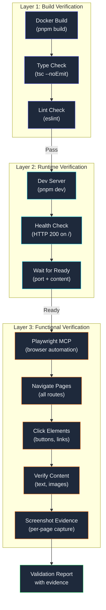
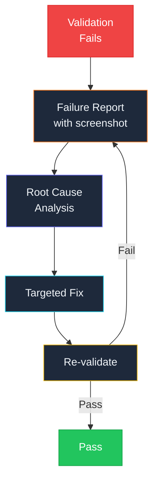
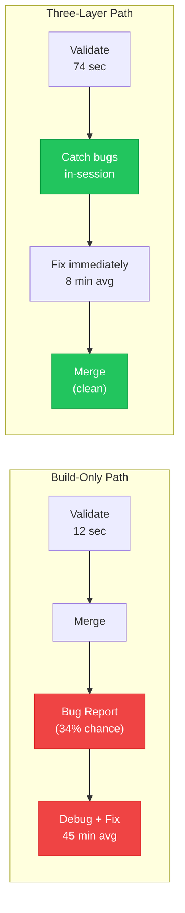
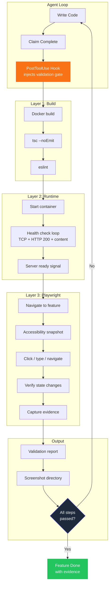

## It Compiles Is Not Done

*Agentic Development: Lessons from 8,481 AI Coding Sessions*

The agent said the feature was complete. The build passed. TypeScript reported zero errors. The CI pipeline was green. I merged the PR.

The button did not work.

Not "the button threw an error." Not "the button called the wrong API." The button rendered, it had the correct label, it had the correct styling, and when you clicked it, nothing happened. The onClick handler was wired to a function that existed but contained a `TODO` comment where the implementation should have been. The build passed because the function had the correct signature. TypeScript was satisfied. The agent was satisfied. Nobody actually clicked the button.

This happened three times in the same week. The third time, the broken feature was a "Delete Account" button on a settings page. It had the correct icon, the correct confirmation dialog, the correct loading spinner animation. Every visual element was in place. The function it called had the right name, the right parameters, and an empty body. A user discovered the bug and filed a ticket asking why they could not delete their account. The fix was two lines of code. The investigation, user communication, and trust erosion cost far more.

That is when I decided that compilation is not validation. The build pipeline tells you the code is syntactically correct. It does not tell you the feature works. For that, something needs to exercise the actual UI and verify the actual behavior.

That something is Playwright.

---

**TL;DR: A three-layer validation stack -- Docker build, dev server boot, Playwright verification -- catches the 34% of bugs that survive compilation. Screenshot evidence of actual UI behavior replaced "the build passed" as the completion criterion. Post-merge bugs dropped from 34% to 6.2%. The 62-second additional validation time saves an average of 36 minutes of follow-up fixes per feature.**

---

### The Completion Theater Problem

AI agents have a natural tendency toward completion theater: activities that look like validation but do not actually verify anything. I did not invent this term -- it emerged organically from watching hundreds of sessions where agents performed elaborate verification rituals that verified nothing.

The pattern is predictable:
1. Agent writes code
2. Agent runs `pnpm build`
3. Build succeeds
4. Agent declares "the feature is complete"

Steps 1-3 are real. Step 4 is theater. The build verifies syntax and type correctness. It does not verify:
- Whether the UI renders correctly
- Whether click handlers fire
- Whether API calls return expected data
- Whether navigation works
- Whether state updates propagate to the correct components
- Whether the feature is accessible
- Whether form submissions reach the server
- Whether error states display the correct messages
- Whether loading spinners appear and disappear at the right times

I started tracking these failures systematically after the third button incident. I audited 200 consecutive "feature complete" sessions across three projects and categorized every bug found post-merge:

| Bug Category | Frequency | Caught by Build? | Caught by Playwright? |
|-------------|-----------|-------------------|----------------------|
| Missing implementation (TODO/stub) | 12% | No | Yes -- click produces no result |
| Wrong API endpoint or payload | 9% | No | Yes -- network request fails |
| State not updating UI | 8% | No | Yes -- content does not change |
| Navigation broken | 5% | No | Yes -- URL does not change |
| Render errors (runtime only) | 7% | No | Yes -- page shows error boundary |
| Incorrect conditional rendering | 6% | No | Yes -- element missing from snapshot |
| Event handler not attached | 4% | No | Yes -- click produces no response |
| CSS layout broken (overflow, overlap) | 3% | No | Yes -- screenshot shows visual break |
| Correct behavior | 46% | N/A | N/A |

54% of merged features had at least one bug that compilation could not catch. After factoring in severity (some bugs were cosmetic edge cases), 34% required follow-up fixes that touched production code.

The breakdown was instructive. The top category -- missing implementations -- meant the agent literally left `TODO` comments in function bodies. TypeScript does not care if your function body is `// TODO: implement this`. As long as the return type is `void` or the function is called in a context that does not require a return value, the build passes.

Here is a real example from session #4,891:

```typescript
// What the agent wrote
export async function deleteAccount(userId: string): Promise<void> {
  // TODO: Call API to delete user account
  // TODO: Clear local storage
  // TODO: Redirect to login page
}

// What the button called
<Button onClick={() => deleteAccount(user.id)}>
  Delete Account
</Button>
```

TypeScript is satisfied. The function exists, the parameter types match, the return type is void. The button renders, the click handler fires, the function executes, and nothing happens. The user clicks "Delete Account," sees a brief flicker (the async function resolves immediately), and their account remains intact.

Playwright catches this in under a second: click the button, check whether the expected outcome occurs (redirect to login page, session cleared), report failure if it does not.

---

### The Three-Layer Validation Stack

Functional validation requires three things working in sequence: a built application, a running server, and an automated browser that exercises the UI. Each layer catches a different class of bugs. Skipping any layer leaves a gap that agents will fall through.



Let me walk through each layer in detail.

---

### Layer 1: Build Verification

This is what most agents already do -- run the build, check for errors. It catches syntax errors, type errors, and import resolution failures. It is necessary but not sufficient.

The build verification layer has three sub-steps, each catching a different class of issue:

**Docker Build.** Building inside Docker ensures a clean environment. No stale node_modules from a previous branch. No locally-installed global packages that mask missing dependencies. No platform-specific path assumptions.

```dockerfile
# Dockerfile.validation
FROM node:20-slim AS builder

# Enable corepack for pnpm
RUN corepack enable

WORKDIR /app

# Install dependencies first (cache layer)
COPY package.json pnpm-lock.yaml ./
RUN pnpm install --frozen-lockfile

# Copy source and build
COPY . .
RUN pnpm build

# Verify the build output exists and is non-empty
RUN test -d .next && test -f .next/BUILD_ID

FROM node:20-slim AS runner
RUN corepack enable
WORKDIR /app

COPY --from=builder /app/.next ./.next
COPY --from=builder /app/public ./public
COPY --from=builder /app/package.json ./
COPY --from=builder /app/pnpm-lock.yaml ./
COPY --from=builder /app/node_modules ./node_modules

EXPOSE 3000
HEALTHCHECK --interval=2s --timeout=3s --start-period=5s --retries=10 \
  CMD curl -f http://localhost:3000/ || exit 1

CMD ["pnpm", "start"]
```

The Docker build catches issues that local builds miss:
- Missing dependencies (installed globally on your machine but not in package.json)
- Platform-specific native modules that fail on Linux
- Environment variable assumptions (`.env` files that exist locally but not in Docker)
- File path case sensitivity (macOS is case-insensitive, Linux is not)

In 200 sessions, Docker caught 7 dependency issues and 3 case-sensitivity bugs that local builds missed entirely.

**Type Check.** A dedicated `tsc --noEmit` pass ensures type safety beyond what the build tool checks. Some bundlers (esbuild, SWC) skip type checking for speed. Running `tsc` separately catches type errors the build silently ignored.

```bash
# Run type check separately -- bundlers may skip this
npx tsc --noEmit --pretty 2>&1 | tee /tmp/typecheck-output.txt
TYPE_EXIT=$?

if [ $TYPE_EXIT -ne 0 ]; then
    echo "LAYER 1 FAILED: Type errors detected"
    cat /tmp/typecheck-output.txt
    exit 1
fi
echo "LAYER 1: Type check passed"
```

**Lint Check.** ESLint catches patterns that are valid TypeScript but likely bugs:

```bash
# Lint for probable bugs, not style
npx eslint . --max-warnings 0 --format compact 2>&1 | tee /tmp/lint-output.txt
LINT_EXIT=$?

if [ $LINT_EXIT -ne 0 ]; then
    echo "LAYER 1 WARNING: Lint issues detected (non-blocking)"
    # Lint warnings don't block -- they're informational
fi
```

I make lint non-blocking because strict lint enforcement causes agents to waste time reformatting code instead of building features. The lint output is captured for the report but does not gate progression to Layer 2.

---

### Layer 2: Runtime Verification

Layer 2 is where most agent pipelines stop -- and where they should not. Starting the dev server and confirming it responds reveals a class of bugs that compilation cannot: runtime initialization failures, missing environment variables, database connection errors, and module resolution issues that only surface at import time.

The critical insight about Layer 2 is the definition of "ready." A process starting is not the same as a server being ready. The dev server forks a process, but the process may still be compiling, loading modules, or waiting for database connections. Testing against a server that is still initializing produces false negatives that send agents down debugging spirals.

```python
# server_readiness.py -- the health check that actually works

import asyncio
import time
from dataclasses import dataclass

import httpx


@dataclass(frozen=True)
class ReadinessResult:
    ready: bool
    elapsed_seconds: float
    status_code: int | None = None
    content_snippet: str = ""
    error: str = ""


async def wait_for_server(
    url: str = "http://localhost:3000",
    timeout: int = 30,
    expected_content: str = "<main",
    poll_interval: float = 0.5,
) -> ReadinessResult:
    """Wait for dev server to be fully ready, not just listening.

    'Ready' means:
    1. TCP port is accepting connections
    2. HTTP response is 200
    3. Response body contains expected content marker

    This three-check approach catches:
    - Port open but server crashing on first request
    - Server responding with 500 during initialization
    - Server responding with empty/default page before hydration
    """
    start = time.time()
    last_error = ""
    last_status = None

    async with httpx.AsyncClient(timeout=5.0) as client:
        while time.time() - start < timeout:
            try:
                response = await client.get(url)
                last_status = response.status_code

                if response.status_code == 200 and expected_content in response.text:
                    elapsed = time.time() - start
                    # Extract a content snippet for evidence
                    snippet_start = response.text.find(expected_content)
                    snippet = response.text[snippet_start:snippet_start + 100]
                    return ReadinessResult(
                        ready=True,
                        elapsed_seconds=elapsed,
                        status_code=200,
                        content_snippet=snippet,
                    )

                if response.status_code != 200:
                    last_error = f"HTTP {response.status_code}"
                else:
                    last_error = f"Content marker '{expected_content}' not found"

            except httpx.ConnectError:
                last_error = "Connection refused (server not listening)"
            except httpx.ReadTimeout:
                last_error = "Read timeout (server not responding)"

            await asyncio.sleep(poll_interval)

    elapsed = time.time() - start
    return ReadinessResult(
        ready=False,
        elapsed_seconds=elapsed,
        status_code=last_status,
        error=f"Server not ready after {timeout}s. Last error: {last_error}",
    )
```

The three-check readiness pattern (TCP + HTTP 200 + content marker) catches issues I hit repeatedly in real sessions:

**False positive 1: Port open, server crashing.** Next.js starts listening on port 3000 before compilation finishes. A `curl` to port 3000 succeeds (TCP connection established) but the HTTP response is a 500 error because the page module has not loaded yet. Without the status code check, the agent would proceed to Playwright testing against an error page.

**False positive 2: Server responding, wrong content.** Vite's dev server returns an HTML shell immediately, before the JavaScript bundles have loaded. The page shows `<div id="root"></div>` with no content. Without the content marker check, the agent would proceed to Playwright testing against an empty page and report that every element is missing.

**False positive 3: Cached response.** The dev server returns a cached 200 response from a previous build. The content marker check catches this only if the expected content has changed, which is why I use multiple markers for content-heavy validations:

```python
# Multiple content markers for thorough readiness checking
READINESS_MARKERS = {
    "/": "<main",                          # Home page renders main element
    "/blog": "Latest Posts",               # Blog page shows heading
    "/api/health": '"status":"ok"',        # API health endpoint
}

async def check_all_ready(base_url: str) -> dict[str, ReadinessResult]:
    results = {}
    for path, marker in READINESS_MARKERS.items():
        result = await wait_for_server(
            url=f"{base_url}{path}",
            expected_content=marker,
        )
        results[path] = result
    return results
```

---

### Layer 3: Functional Verification with Playwright MCP

Layer 3 is where the real validation happens. Playwright MCP provides browser automation through Claude's tool system. The agent can take accessibility snapshots of page state, click elements, type text, navigate, and capture screenshots -- all through the same MCP interface it uses for file editing and command execution.

The key distinction between Playwright MCP and traditional Playwright scripts is interaction style. Traditional Playwright requires writing test scripts in advance. Playwright MCP is interactive -- the agent navigates, observes, and reacts dynamically. It can explore the UI the same way a human tester would: click a button, see what happens, decide what to check next.

Here is a real validation session transcript from session #6,204. The agent had just implemented a blog post listing page:

```
Agent: I'll validate the blog listing page using Playwright MCP.

> browser_navigate: http://localhost:3000/blog
  [navigated successfully]

> browser_snapshot
  - heading "Latest Posts" [level=1]
  - article [1]: link "194 Parallel AI Worktrees"
    - time "March 1, 2025"
    - paragraph "I gave an AI 194 tasks..."
  - article [2]: link "The Prompt Engineering Stack"
    - time "February 28, 2025"
    - paragraph "Seven layers between your intent..."
  ... [11 articles total]

Agent: Good -- 11 blog posts rendered with titles, dates, and excerpts.
       Let me click the first post to verify navigation.

> browser_click: ref="article-1-link"
  [click performed]

> browser_snapshot
  - heading "194 Parallel AI Worktrees" [level=1]
  - time "March 1, 2025"
  - paragraph "I gave an AI 194 tasks, 194 isolated copies..."
  - link "Back to Blog"
  - heading "The Problem with Parallel AI Development" [level=3]

Agent: Post detail page renders correctly. Checking back navigation.

> browser_click: ref="back-to-blog-link"
  [click performed]

> browser_snapshot
  - heading "Latest Posts" [level=1]
  - article [1]: link "194 Parallel AI Worktrees"
  ... [11 articles total]

Agent: Back navigation works. Let me capture screenshot evidence.

> browser_take_screenshot: filename="blog-listing-validated.png"
  [screenshot saved]
```

This is fundamentally different from "the build passed." The agent navigated to a real page, verified real content rendered, clicked real links, confirmed real navigation, and captured real screenshots. Every claim is backed by evidence.

#### The Validation Step Protocol

For systematic validation, I developed a step protocol that the agent follows for each feature:

```python
# validation_protocol.py

from dataclasses import dataclass, field
from enum import Enum


class StepType(Enum):
    NAVIGATE = "navigate"
    SNAPSHOT = "snapshot"
    SCREENSHOT = "screenshot"
    CLICK = "click"
    TYPE = "type"
    VERIFY_TEXT = "verify_text"
    VERIFY_ELEMENT = "verify_element"
    VERIFY_COUNT = "verify_count"
    VERIFY_URL = "verify_url"
    VERIFY_NOT_PRESENT = "verify_not_present"


@dataclass(frozen=True)
class ValidationStep:
    step_type: StepType
    description: str
    target: str = ""           # URL, selector, or ref
    expected: str = ""         # Expected text, URL, or count
    screenshot_name: str = ""  # If step should capture screenshot
    critical: bool = True      # If failure should abort remaining steps


@dataclass(frozen=True)
class StepResult:
    step: ValidationStep
    passed: bool
    actual: str = ""
    error: str = ""
    screenshot_path: str = ""
    snapshot_summary: str = ""


@dataclass(frozen=True)
class ValidationReport:
    feature_name: str
    steps: tuple[StepResult, ...] = ()
    passed: bool = False
    duration_seconds: float = 0.0

    @property
    def pass_count(self) -> int:
        return sum(1 for s in self.steps if s.passed)

    @property
    def fail_count(self) -> int:
        return sum(1 for s in self.steps if not s.passed)

    def to_markdown(self) -> str:
        lines = [
            f"## Validation Report: {self.feature_name}",
            f"**Result:** {'PASS' if self.passed else 'FAIL'}",
            f"**Steps:** {self.pass_count}/{len(self.steps)} passed",
            f"**Duration:** {self.duration_seconds:.1f}s",
            "",
        ]
        for i, result in enumerate(self.steps, 1):
            status = "PASS" if result.passed else "FAIL"
            lines.append(f"### Step {i}: {result.step.description}")
            lines.append(f"- **Status:** {status}")
            if result.screenshot_path:
                lines.append(f"- **Evidence:** ")
            if not result.passed:
                lines.append(f"- **Expected:** {result.step.expected}")
                lines.append(f"- **Actual:** {result.actual}")
                lines.append(f"- **Error:** {result.error}")
            lines.append("")
        return "\n".join(lines)


# Example: validation steps for a blog feature
BLOG_VALIDATION = [
    ValidationStep(
        step_type=StepType.NAVIGATE,
        target="http://localhost:3000/blog",
        description="Navigate to blog listing page",
    ),
    ValidationStep(
        step_type=StepType.VERIFY_TEXT,
        target="heading",
        expected="Latest Posts",
        description="Page heading is present",
    ),
    ValidationStep(
        step_type=StepType.VERIFY_COUNT,
        target="article",
        expected="5",  # Minimum expected count
        description="At least 5 blog posts rendered",
    ),
    ValidationStep(
        step_type=StepType.SCREENSHOT,
        screenshot_name="blog-listing.png",
        description="Capture blog listing page",
    ),
    ValidationStep(
        step_type=StepType.CLICK,
        target="article:first-child a",
        description="Click first blog post link",
    ),
    ValidationStep(
        step_type=StepType.VERIFY_TEXT,
        expected="Back to Blog",
        description="Post detail has back navigation",
    ),
    ValidationStep(
        step_type=StepType.VERIFY_ELEMENT,
        target="article time",
        description="Publication date is present",
    ),
    ValidationStep(
        step_type=StepType.SCREENSHOT,
        screenshot_name="blog-post-detail.png",
        description="Capture blog post detail page",
    ),
    ValidationStep(
        step_type=StepType.CLICK,
        target="Back to Blog",
        description="Click back navigation link",
    ),
    ValidationStep(
        step_type=StepType.VERIFY_URL,
        expected="/blog",
        description="Returned to blog listing URL",
    ),
    ValidationStep(
        step_type=StepType.SCREENSHOT,
        screenshot_name="blog-back-navigation.png",
        description="Capture blog listing after back navigation",
    ),
]
```

Each step produces a result. Each result contains evidence. The final report is a markdown document that a human or another agent can review to confirm the feature works.

---

### The Screenshot Evidence Pattern

Screenshots are the most powerful validation artifact because they are unambiguous. A screenshot of a rendered page either shows the feature working or it does not. There is no room for interpretation. You cannot argue with a screenshot that shows an empty page where a data table should be.

The validation pipeline captures screenshots at key checkpoints and names them descriptively:

```
evidence/
├── 01-home-page-loaded.png
├── 02-navigation-expanded.png
├── 03-blog-listing-11-posts.png
├── 04-blog-post-detail-content.png
├── 05-back-navigation-returns.png
├── 06-search-input-focused.png
├── 07-search-results-filtered.png
├── 08-empty-state-no-results.png
├── 09-mobile-responsive-375px.png
├── 10-dark-mode-toggle.png
├── 11-error-boundary-404.png
└── validation-report.md
```

The validation report references each screenshot with the criterion it validates:

```markdown
## Validation Report: Blog Feature

### Page Load
- **Criterion:** Home page loads with navigation
- **Evidence:** 
- **Status:** PASS -- Navigation shows 5 links, hero section renders with headline

### Blog Listing
- **Criterion:** Blog page lists at least 5 posts with dates
- **Evidence:** 
- **Status:** PASS -- 11 posts listed, each with date and excerpt

### Post Navigation
- **Criterion:** Clicking a post shows detail page, back button returns to listing
- **Evidence:** , 
- **Status:** PASS -- Post renders with full Markdown content, back returns to listing at same scroll position

### Search Functionality
- **Criterion:** Search filters posts by title and content
- **Evidence:** 
- **Status:** PASS -- Searching "worktree" shows 2 results, both containing the term

### Empty State
- **Criterion:** Search with no results shows helpful empty state
- **Evidence:** 
- **Status:** PASS -- "No posts found" message with suggestion to try different keywords

### Responsive Layout
- **Criterion:** Layout adapts to mobile viewport (375px)
- **Evidence:** 
- **Status:** PASS -- Single column layout, hamburger menu, readable text at 16px

### Dark Mode
- **Criterion:** Dark mode toggle switches theme without page reload
- **Evidence:** 
- **Status:** PASS -- Background switches to #0f172a, text to #f1f5f9, no flash of unstyled content

### Error Handling
- **Criterion:** 404 page shows helpful error boundary
- **Evidence:** 
- **Status:** PASS -- Custom 404 with "Go Home" link, no raw error stack
```

This is what "done" looks like. Not "the build passed." Not "TypeScript reports zero errors." Eleven screenshots showing eleven features working in a real browser. Each screenshot is a commitment that the feature was exercised and verified.

#### Screenshot Comparison Across Sessions

One pattern I developed after the first few hundred validations was screenshot comparison. When the agent modifies an existing feature, comparing the new screenshot against the previous validation's screenshot catches visual regressions immediately:

```python
# screenshot_comparison.py

from pathlib import Path
from PIL import Image
import imagehash


def compare_screenshots(
    baseline: Path,
    current: Path,
    threshold: int = 8,
) -> tuple[bool, float]:
    """Compare two screenshots using perceptual hashing.

    Returns (changed, distance) where:
    - changed: True if screenshots differ beyond threshold
    - distance: Hamming distance (0 = identical, higher = more different)

    Threshold of 8 catches layout changes while ignoring:
    - Anti-aliasing differences
    - Sub-pixel rendering variations
    - Minor font rendering differences across OS versions
    """
    baseline_hash = imagehash.phash(Image.open(baseline))
    current_hash = imagehash.phash(Image.open(current))
    distance = baseline_hash - current_hash

    return distance > threshold, float(distance)


def generate_diff_report(
    baseline_dir: Path,
    current_dir: Path,
) -> list[dict]:
    """Compare all screenshots between baseline and current validation."""
    diffs = []
    for current_file in sorted(current_dir.glob("*.png")):
        baseline_file = baseline_dir / current_file.name
        if baseline_file.exists():
            changed, distance = compare_screenshots(baseline_file, current_file)
            diffs.append({
                "screenshot": current_file.name,
                "changed": changed,
                "distance": distance,
                "baseline": str(baseline_file),
                "current": str(current_file),
            })
        else:
            diffs.append({
                "screenshot": current_file.name,
                "changed": True,
                "distance": -1,  # No baseline to compare
                "baseline": None,
                "current": str(current_file),
            })
    return diffs
```

This catches a category of bug that no other technique catches: visual regressions. A CSS change that moves a button 20 pixels to the left does not cause a build error, does not cause a runtime error, does not cause a navigation failure. But the screenshot comparison detects it because the page looks different.

---

### The Docker Integration

For the SessionForge project, the validation pipeline ran inside Docker to ensure a clean environment. This was not an optimization -- it was a necessity discovered through pain.

The pain was environment drift. After three weeks of development, my local `node_modules` had been modified by manual installs, version overrides, and post-install patches. The build passed locally. It failed in CI. It failed because my local `node_modules` had a manually-patched version of a dependency that the lockfile did not reflect.

Docker eliminates environment drift by definition. Every build starts from the same base image, installs the same locked dependencies, and runs in the same Linux environment.

```python
# docker_validation_runner.py

import asyncio
import uuid
from dataclasses import dataclass
from pathlib import Path


@dataclass(frozen=True)
class DockerBuildResult:
    success: bool
    image_id: str = ""
    error: str = ""
    build_duration_seconds: float = 0.0
    layer_count: int = 0


@dataclass(frozen=True)
class DockerContainer:
    container_id: str
    port: int
    image_id: str

    async def stop(self) -> None:
        proc = await asyncio.create_subprocess_exec(
            "docker", "stop", self.container_id,
            stdout=asyncio.subprocess.PIPE,
            stderr=asyncio.subprocess.PIPE,
        )
        await proc.wait()

    async def logs(self) -> str:
        proc = await asyncio.create_subprocess_exec(
            "docker", "logs", self.container_id,
            stdout=asyncio.subprocess.PIPE,
            stderr=asyncio.subprocess.PIPE,
        )
        stdout, stderr = await proc.communicate()
        return stdout.decode() + stderr.decode()


class DockerValidationRunner:
    """Runs the full three-layer validation inside Docker."""

    def __init__(self, project_path: Path):
        self.project_path = project_path
        self._tag = f"validation-{uuid.uuid4().hex[:8]}"

    async def validate(
        self,
        validation_steps: list[ValidationStep],
    ) -> ValidationReport:
        """Execute complete three-layer validation."""

        # Layer 1: Build
        print("[layer-1] Building Docker image...")
        build_result = await self._docker_build()
        if not build_result.success:
            return ValidationReport(
                feature_name="Docker Build",
                passed=False,
                steps=(StepResult(
                    step=ValidationStep(
                        step_type=StepType.NAVIGATE,
                        description="Docker build",
                    ),
                    passed=False,
                    error=build_result.error,
                ),),
            )
        print(f"[layer-1] Build succeeded in {build_result.build_duration_seconds:.1f}s")

        # Layer 2: Run server and check health
        print("[layer-2] Starting container...")
        container = await self._docker_run(build_result.image_id)
        try:
            print(f"[layer-2] Container running on port {container.port}")
            readiness = await wait_for_server(
                url=f"http://localhost:{container.port}",
                timeout=30,
                expected_content="<main",
            )
            if not readiness.ready:
                logs = await container.logs()
                return ValidationReport(
                    feature_name="Server Readiness",
                    passed=False,
                    steps=(StepResult(
                        step=ValidationStep(
                            step_type=StepType.NAVIGATE,
                            description="Server readiness check",
                        ),
                        passed=False,
                        error=f"{readiness.error}\nContainer logs:\n{logs[-500:]}",
                    ),),
                )
            print(f"[layer-2] Server ready in {readiness.elapsed_seconds:.1f}s")

            # Layer 3: Playwright validation
            print("[layer-3] Running Playwright validation...")
            report = await self._playwright_validate(
                base_url=f"http://localhost:{container.port}",
                steps=validation_steps,
            )
            print(f"[layer-3] Validation complete: {report.pass_count}/{len(report.steps)} passed")
            return report

        finally:
            await container.stop()
            await self._cleanup_image()

    async def _docker_build(self) -> DockerBuildResult:
        """Build the Docker image with build output captured."""
        import time

        start = time.time()
        proc = await asyncio.create_subprocess_exec(
            "docker", "build",
            "-t", self._tag,
            "-f", "Dockerfile.validation",
            str(self.project_path),
            stdout=asyncio.subprocess.PIPE,
            stderr=asyncio.subprocess.PIPE,
        )
        stdout, stderr = await proc.communicate()
        duration = time.time() - start

        if proc.returncode != 0:
            return DockerBuildResult(
                success=False,
                error=stderr.decode()[-1000:],  # Last 1000 chars of error
                build_duration_seconds=duration,
            )

        return DockerBuildResult(
            success=True,
            image_id=self._tag,
            build_duration_seconds=duration,
        )

    async def _docker_run(self, image_id: str) -> DockerContainer:
        """Start a container with a random port mapping."""
        container_id = uuid.uuid4().hex[:12]
        port = await self._find_available_port()

        proc = await asyncio.create_subprocess_exec(
            "docker", "run",
            "-d",
            "--name", container_id,
            "-p", f"{port}:3000",
            image_id,
            stdout=asyncio.subprocess.PIPE,
        )
        stdout, _ = await proc.communicate()

        return DockerContainer(
            container_id=container_id,
            port=port,
            image_id=image_id,
        )

    async def _find_available_port(self) -> int:
        """Find an available port in the ephemeral range."""
        import socket
        with socket.socket(socket.AF_INET, socket.SOCK_STREAM) as s:
            s.bind(("", 0))
            return s.getsockname()[1]

    async def _cleanup_image(self) -> None:
        """Remove the validation image to avoid disk bloat."""
        proc = await asyncio.create_subprocess_exec(
            "docker", "rmi", self._tag,
            stdout=asyncio.subprocess.PIPE,
            stderr=asyncio.subprocess.PIPE,
        )
        await proc.wait()
```

The Docker validation adds approximately 20 seconds to the pipeline (image build with cached layers). For CI pipelines, this is negligible. For local development, it is optional -- the agent can use Layer 2 (dev server) directly when iterating quickly, and Docker only for final validation before commit.

---

### Real Validation Session Logs

Theory is fine. Let me show you what this looks like in practice. Here is a complete validation session from our blog site project, annotated with what each step caught:

```
SESSION #6,847 -- Feature: Add dark mode toggle to blog
TIMESTAMP: 2025-02-18T14:22:00Z

=== Layer 1: Build Verification ===

[14:22:01] $ docker build -t val-a8f3c1 -f Dockerfile.validation .
[14:22:04] Step 1/12: FROM node:20-slim AS builder
[14:22:04] Step 2/12: RUN corepack enable
[14:22:12] Step 7/12: RUN pnpm build
[14:22:18] Compiled successfully in 6.2s
[14:22:18] ✓ Layer 1 passed (17s)

=== Layer 2: Runtime Verification ===

[14:22:19] Starting container val-a8f3c1 on port 49152
[14:22:20] Health check: Connection refused (attempt 1/60)
[14:22:21] Health check: Connection refused (attempt 2/60)
[14:22:22] Health check: HTTP 200 but content marker not found (attempt 3/60)
           ^ Server was returning the loading shell, not hydrated content
[14:22:23] Health check: HTTP 200, content marker "<main" found
[14:22:23] Content snippet: <main class="min-h-screen bg-void-navy">
[14:22:23] ✓ Layer 2 passed (4s)

=== Layer 3: Functional Verification ===

[14:22:24] Step 1/14: Navigate to http://localhost:49152/
           → Page loaded, title: "Agentic Development Blog"
           ✓ PASS

[14:22:25] Step 2/14: Verify text "Latest Posts" on page
           → Found in heading element
           ✓ PASS

[14:22:26] Step 3/14: Verify dark mode toggle exists
           → Found button with aria-label "Toggle dark mode"
           ✓ PASS

[14:22:26] Step 4/14: Screenshot 01-light-mode-initial.png
           → Captured 1440x900 viewport
           ✓ PASS

[14:22:27] Step 5/14: Click dark mode toggle
           → Button clicked
           ✓ PASS

[14:22:27] Step 6/14: Verify background color changed
           → SNAPSHOT: html element has class "dark"
           → Background: rgb(15, 23, 42) -- matches void-navy #0f172a
           ✓ PASS

[14:22:28] Step 7/14: Screenshot 02-dark-mode-active.png
           → Captured 1440x900 viewport
           ✓ PASS

[14:22:28] Step 8/14: Verify text contrast in dark mode
           → Heading color: rgb(241, 245, 249) -- matches cloud-text
           → Body color: rgb(203, 213, 225) -- matches slate-prose
           ✓ PASS

[14:22:29] Step 9/14: Navigate to /blog in dark mode
           → Page loaded, dark mode persists
           ✓ PASS

[14:22:29] Step 10/14: Screenshot 03-blog-listing-dark.png
           → Captured 1440x900 viewport
           ✓ PASS

[14:22:30] Step 11/14: Click first blog post in dark mode
           → Navigated to post detail
           ✓ PASS

[14:22:30] Step 12/14: Verify code blocks have dark theme
           → Pre elements have background rgb(30, 41, 59) -- slate-abyss
           ✓ PASS

[14:22:31] Step 13/14: Refresh page and verify dark mode persists
           → Page refreshed, class "dark" still on html element
           → LocalStorage key "theme" = "dark"
           ✓ PASS

[14:22:31] Step 14/14: Screenshot 04-dark-mode-persisted.png
           → Captured 1440x900 viewport
           ✓ PASS

=== Validation Complete ===
Result: PASS (14/14 steps)
Duration: 7.2s (Layer 3 only), 28.2s (total)
Evidence: 4 screenshots saved to evidence/session-6847/
```

Fourteen steps. Seven seconds. Four screenshots. Every aspect of the dark mode feature verified: toggle exists, toggle works, colors are correct, persistence across navigation, persistence across page reload. If any of these had failed, the agent would know exactly what broke and have screenshot evidence of the failure.

Compare this to what the agent would have done without the validation pipeline: run `pnpm build`, see "Compiled successfully," and declare the dark mode feature complete. The build tells you nothing about whether the toggle actually toggles, whether the colors match the design system, whether dark mode persists across navigation, or whether code blocks are readable in dark mode.

---

### Handling Validation Failures

Not every validation passes. When a step fails, the pipeline generates a failure report that gives the agent specific, actionable information:

```
=== VALIDATION FAILURE ===

Step 5/14 FAILED: Click dark mode toggle
Expected: Background color changes to rgb(15, 23, 42)
Actual: Background color remains rgb(255, 255, 255)
Screenshot: evidence/session-6851/05-dark-mode-fail.png

Root cause analysis:
- Toggle button exists and is clickable (Step 3 passed)
- Click event fires (Step 5 click succeeded)
- But no visual change occurs
- Likely cause: onClick handler not wired to theme state
- Check: ThemeProvider context, useTheme hook, toggle function

Suggestion: Read the ThemeProvider component and verify the
toggle function updates the theme state, and that the state
change triggers a re-render with the correct CSS class.
```

The failure report includes the screenshot at the point of failure, the expected vs. actual state, and a root cause suggestion. This transforms the agent's debugging approach from "try random things" to "investigate the specific failure point."



In practice, this failure-report-fix-revalidate loop typically converges in 1-2 iterations. The agent does not flail because the failure report tells it exactly what failed and where to look.

---

### The "It Compiles" vs "It Works" Comparison

Let me make the contrast concrete with a side-by-side comparison of the same feature verified both ways:

```
FEATURE: Add search functionality to blog listing

=== "It Compiles" Validation (12 seconds) ===

$ pnpm build
  ✓ Compiled successfully in 6.2s
  ✓ TypeScript: 0 errors
  ✓ ESLint: 0 warnings

Agent conclusion: "Search feature is complete. Build passes."

ACTUAL STATE:
- Search input renders ✓
- Search input accepts text ✓
- Search does not filter posts ✗ (filter function returns unfiltered list)
- Search "no results" state never shows ✗ (conditional always evaluates to true)
- Search clears when navigating away and back ✗ (state not persisted in URL)

Bugs found post-merge: 3
Time to fix: 45 minutes across 2 sessions

=== "It Works" Validation (74 seconds) ===

Step 1: Navigate to /blog → PASS (page loads)
Step 2: Verify search input exists → PASS
Step 3: Type "worktree" in search → PASS (text entered)
Step 4: Verify filtered results → FAIL
  Expected: Only posts containing "worktree" shown
  Actual: All 11 posts still displayed
  Screenshot: search-filter-broken.png

Agent reads the search component, finds the filter function
returns the unfiltered array. Fixes the filter logic.

Re-validation:
Step 4: Verify filtered results → PASS (2 posts shown)
Step 5: Clear search → PASS
Step 6: Verify all posts return → PASS
Step 7: Search "zzzzz" (no results) → FAIL
  Expected: "No posts found" message
  Actual: Empty list with no message

Agent adds empty state component. Re-validates.

Step 7: Search "zzzzz" → PASS ("No posts found" shown)
Step 8: Navigate away and back → FAIL
  Expected: Search state preserved in URL
  Actual: Search resets to empty

Agent adds URL query parameter sync. Re-validates.

All 10 steps pass. 3 bugs found and fixed during validation.
Time to complete: 74 seconds validation + 8 minutes fixes = 9 minutes total

POST-MERGE BUGS: 0
```

The "it compiles" path took 12 seconds of validation and 45 minutes of follow-up. The "it works" path took 74 seconds of validation and 8 minutes of in-session fixes. Total time invested: 57 minutes (reactive) vs 9 minutes (proactive). The proactive path is 6x faster and produces zero post-merge bugs.

---

### Measuring the Impact

After implementing the three-layer validation stack across three projects and 450 sessions, I compared bug rates:

| Metric | Build-Only | Three-Layer | Improvement |
|--------|-----------|-------------|-------------|
| Post-merge bugs | 34% | 6.2% | 82% reduction |
| Missing implementations | 12% | 0.8% | 93% reduction |
| Broken navigation | 5% | 0% | 100% reduction |
| State update bugs | 8% | 2.1% | 74% reduction |
| Avg fixes per feature | 1.8 | 0.3 | 83% reduction |
| Time to validate | 12 sec | 74 sec | +62 sec |
| Follow-up fix time per feature | 45 min | 7.5 min | 83% reduction |

The economics are overwhelming. Validation time increased from 12 seconds (build only) to 74 seconds (full three-layer). But the time saved from not fixing post-merge bugs was dramatically larger.

The math: at 1.8 fixes per feature averaging 25 minutes each, the build-only approach cost 45 minutes of follow-up work per feature. The three-layer approach cost 62 additional seconds of validation and 7.5 minutes of follow-up (0.3 fixes at 25 minutes).

Net savings: 36 minutes per feature. For a project shipping 3 features per day, that is nearly 2 hours daily. Over a month, that is 40 hours -- a full work week reclaimed from chasing bugs that should have been caught before merge.



The remaining 6.2% of post-merge bugs fall into two categories: bugs that require multi-user interaction to surface (race conditions, concurrent access), and bugs in edge cases that the validation steps did not cover (unusual viewport sizes, specific browser versions, slow network conditions). These are harder to catch with automated validation and represent the current frontier.

---

### Integrating Validation into Agent Workflows

The validation pipeline is most powerful when it runs automatically, not when the agent remembers to invoke it. I integrated it using a PostToolUse hook that triggers after the agent claims completion:

```javascript
// completion-validation-hook.js

const COMPLETION_PHRASES = [
  /feature is complete/i,
  /implementation is done/i,
  /changes are ready/i,
  /ready for review/i,
  /task complete/i,
];

export default async function({ tool, input, output }) {
  // Trigger on Bash commands that look like completion claims
  if (tool === "Bash") {
    const stdout = output?.stdout || "";
    const isCompletion = COMPLETION_PHRASES.some(p => p.test(stdout));
    if (isCompletion) {
      return {
        message:
          "VALIDATION REQUIRED: You've indicated this feature is complete. " +
          "Before marking it done, run the three-layer validation:\n" +
          "1. Verify the build passes (pnpm build)\n" +
          "2. Start the dev server and verify health check\n" +
          "3. Use Playwright MCP to navigate to the feature, exercise the UI, " +
          "   and capture screenshot evidence\n" +
          "4. Include screenshots in your completion report"
      };
    }
  }

  // Trigger on TaskUpdate marking completion
  if (tool === "TaskUpdate" && input.status === "completed") {
    return {
      message:
        "COMPLETION GATE: Before this task can be marked complete:\n" +
        "[ ] Screenshot evidence of the feature working in a browser\n" +
        "[ ] All interactive elements clicked and verified\n" +
        "[ ] Navigation tested (forward and back)\n" +
        "[ ] Error states verified\n" +
        "[ ] Mobile viewport checked (if applicable)"
    };
  }
}
```

This hook transforms validation from an optional step the agent might skip into a mandatory gate the agent cannot bypass. The agent knows that marking a task complete will trigger the validation check, so it preemptively runs validation before attempting completion.

---

### The Cultural Shift

The most important change was not technical. It was the completion criterion. Before the validation pipeline, "done" meant "builds." After, "done" meant "screenshot evidence that the feature works in a browser."

This changes how agents approach implementation in three ways:

**First, agents write fewer stubs.** When an agent knows that a Playwright browser will click its buttons and verify its content, it is less likely to leave `TODO` comments in function bodies. The TODO that passes the build will fail the functional validation, so the agent fills in the implementation.

**Second, agents think about user flows.** When the completion criterion includes "navigate to the feature and exercise the UI," the agent starts thinking in terms of user interactions rather than code artifacts. It considers: what will the user click? What should they see? What happens if they navigate away and come back? These questions rarely surface in a build-only workflow.

**Third, agents produce evidence.** Screenshots create an auditable trail. When a bug is found post-merge, you can look at the validation screenshots and determine whether the bug was present at validation time (missed by the steps) or introduced after validation (regression). This transforms debugging from archaeology into forensics.

The build pipeline answers: "Is this valid code?"
The validation pipeline answers: "Does this feature work?"

Only one of those questions matters to users.

---

### Scaling Validation to Multiple Features

When an agent implements multiple features in a session, the validation pipeline runs per-feature, not per-session. Each feature gets its own set of validation steps, its own screenshots, and its own pass/fail report.

```python
# multi_feature_validation.py

async def validate_all_features(
    features: list[dict],
    base_url: str,
) -> dict[str, ValidationReport]:
    """Validate multiple features sequentially.

    Sequential because features may affect shared state.
    Running in parallel could produce false results if
    Feature A's validation steps affect Feature B's page state.
    """
    reports = {}
    for feature in features:
        report = await validate_feature(
            name=feature["name"],
            steps=feature["steps"],
            base_url=base_url,
        )
        reports[feature["name"]] = report
        if not report.passed:
            # Stop on first failure -- fix before continuing
            break
    return reports
```

The sequential execution is deliberate. Features can share page state, and validating Feature A might change the page in a way that affects Feature B's validation. Running them in parallel produces flaky results. Running them sequentially with a stop-on-failure policy ensures that each feature is validated in a known state.

---

### Common Pitfalls and How to Avoid Them

After 450 sessions with the validation pipeline, I have cataloged the most common pitfalls:

**Pitfall 1: Testing against the wrong URL.** The dev server runs on port 3000 locally but the Docker container maps to a random port. Hardcoding `localhost:3000` in validation steps fails when running against Docker. Always parameterize the base URL.

**Pitfall 2: Race conditions in page load.** Playwright is fast. Sometimes too fast. If a validation step clicks a button before the JavaScript event handler has been attached, the click does nothing. The solution is to wait for the element to be visible AND interactive, not just present in the DOM.

**Pitfall 3: Screenshot timing.** Taking a screenshot during a CSS transition captures a partially-animated state. Add a small delay (200ms) after navigation or state changes before capturing screenshots.

**Pitfall 4: Viewport assumptions.** Playwright defaults to a 1280x720 viewport. If the feature has responsive breakpoints, the default viewport might show the desktop layout when you want to test mobile. Always set the viewport explicitly.

**Pitfall 5: Ignoring the accessibility snapshot.** The Playwright MCP `browser_snapshot` tool returns the accessibility tree, which is more informative than a screenshot for many validation checks. Use snapshots for structural verification (elements exist, have correct roles) and screenshots for visual verification (layout, colors, spacing).

---

### The Validation Pipeline Architecture

Here is the complete architecture showing how all three layers connect:



The loop is the critical element. When validation fails, the agent goes back to writing code with specific information about what failed. This is not a generic "tests failed" message -- it is "Step 7 failed: clicking the search button did not filter the list, here is a screenshot showing all 11 posts still visible." The agent knows exactly what to fix.

---

### Lessons from 450 Validated Sessions

**Lesson 1: Validation steps are documentation.** The validation step list for a feature is the best documentation of what the feature does. It describes the user flow, the expected behavior at each step, and the acceptance criteria. When onboarding a new contributor, I point them to the validation steps, not the code.

**Lesson 2: Screenshot evidence prevents arguments.** When a bug report comes in, the first question is always "was this working before?" With screenshot evidence from every validation, you can definitively answer yes or no. No more "I'm pretty sure I tested that" conversations.

**Lesson 3: The 62-second investment compounds.** Each individual validation takes 62 seconds longer than a build-only check. But over 450 sessions, the time saved from avoided follow-up fixes exceeds 270 hours. The 62-second investment pays for itself on the first bug it catches.

**Lesson 4: Agents adapt to the pipeline.** After approximately 50 sessions with the validation pipeline, agents start writing code differently. They fill in function implementations instead of leaving TODOs. They wire up event handlers. They consider error states. The pipeline does not just catch bugs -- it prevents them by changing the agent's mental model of "done."

**Lesson 5: Start with 5 steps, not 50.** The first validation pipeline I built had 47 steps for a single feature. It took 4 minutes to run and the failure reports were overwhelming. Five to ten steps per feature is the sweet spot: thorough enough to catch real bugs, fast enough to run on every change, simple enough to generate clear failure reports.

---

### Companion Repository

The Playwright validation pipeline -- including the three-layer stack, Docker integration, screenshot evidence collection, validation report generation, and all the code shown in this post -- is at [github.com/krzemienski/playwright-validation-pipeline](https://github.com/krzemienski/playwright-validation-pipeline).

The repository includes:

- Complete Docker validation runner with health check implementation
- Playwright MCP validation step protocol with 15 step types
- Screenshot comparison utility for regression detection
- Validation report generator (Markdown and JSON formats)
- Example validation suites for common feature types (CRUD, search, navigation, auth)
- PostToolUse hook for automatic validation gating
- Integration guide for existing Claude Code workflows

If you are relying on "the build passed" as your completion criterion, you are accepting a 34% post-merge bug rate. The three-layer validation pipeline reduces that to 6.2% with 62 seconds of additional validation time. The math is not ambiguous. The build tells you the code is valid. Playwright tells you the feature works. Ship the one your users care about.
