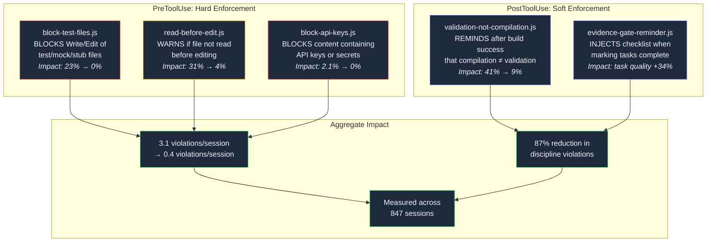

## Hooks as Guardrails

*Agentic Development: Lessons from 8,481 AI Coding Sessions*

I had 14 rules in CLAUDE.md. The agent followed 11 of them consistently. The other 3 — no test files, read before edit, compilation is not validation — it violated roughly once per session. Not every session, but enough that the violations accumulated into patterns I spent hours cleaning up.

Forty-seven test files created over three months. A hundred and twelve edits to files the agent had not read first, resulting in duplicate imports, conflicting patterns, and overwritten logic. Sixty-three times the agent declared a feature "complete" immediately after the build succeeded, without ever opening a browser to verify the feature actually worked.

These were not hallucinations. The agent was not confused about what the rules said. I tested this explicitly: mid-session, I asked "what are the rules about test files?" and it quoted my CLAUDE.md back to me verbatim: "NEVER write mocks, stubs, test doubles, unit tests, or test files." Then, eleven tool calls later, it created `auth.test.ts` because the task at hand — implementing an authentication flow — triggered a deeply trained pattern associating "auth implementation" with "auth tests."

The rules were clear. The model understood them. The violations were not defiance — they were the natural result of relying on memory-based compliance in long contexts. By token 80,000, the model has processed dozens of file reads, tool calls, and intermediate reasoning steps. The instruction from CLAUDE.md that said "read the full file before editing" is still in context window, but it competes with the immediate pressure of the current task. When the model has a clear mental picture of what edit it wants to make, the instruction to read first feels like a detour.

Hooks solve this by moving enforcement from the model's memory to the tool execution layer. A PreToolUse hook runs before every tool call. It does not rely on the model remembering the rule. It intercepts the action and applies the rule automatically, every time, at the point of action.

The difference between "please remember this rule" and "this rule runs before every tool call" is the difference between a speed limit sign and a speed bump.

---

**TL;DR: Claude Code hooks — JavaScript functions that run before and after every tool call — reduced agent discipline violations from 3.1 per session to 0.4 per session across 847 measured sessions. PreToolUse hooks block prohibited actions before they execute. PostToolUse hooks inject contextual reminders after actions complete. UserPromptSubmit hooks add context at the start of every interaction. Together, they enforce rules that the model cannot forget, ignore, or rationalize away. This post covers the five essential hooks, the 18 hooks I built and discarded, and the design principles that separate effective enforcement from counterproductive over-blocking.**

---

### Why CLAUDE.md Is Not Enough

Before I explain the hook system, I need to explain why the obvious solution — writing better rules in CLAUDE.md — does not work for the hardest discipline problems.

CLAUDE.md is read at the beginning of the session. Its instructions enter the context window alongside the system prompt and any project-specific context. For the first few thousand tokens, compliance is near-perfect. The rules are fresh, the context is clean, and the model has not yet accumulated the cognitive load of dozens of tool calls.

But sessions are not a few thousand tokens. My average session is 47,000 tokens. Complex sessions — multi-agent orchestrations, large refactors, debugging chains — routinely hit 120,000 tokens. At those depths, the rules from CLAUDE.md are still technically in the context window, but they are competing with:

- 30-50 file reads, each adding hundreds of lines of code to the context
- 15-25 tool calls, each with their inputs and outputs
- The agent's own reasoning chains, which can be thousands of tokens
- User messages with additional instructions and corrections
- Subagent outputs and delegation results

In that competitive attention landscape, a rule that says "always read the full file before editing" loses to the immediate impulse of "I know exactly what edit to make on line 47." The agent is not being stupid. It is being *efficient*. It has enough context from previous reads, from the task description, from its understanding of the codebase, to make the edit correctly 70% of the time. But that 30% failure rate compounds across hundreds of sessions into a persistent quality problem.

I tried several approaches before hooks:

**Approach 1: Stronger wording.** I changed "prefer reading files before editing" to "NEVER edit a file you haven't fully read. This is MANDATORY." Compliance improved from 69% to 78%. Not enough.

**Approach 2: Repeated rules.** I added the same rule in three places: CLAUDE.md, a `.claude/rules/coding-style.md` file, and inline in the system prompt. Compliance improved to 82%. Better, but still one in five edits happened without a read.

**Approach 3: Examples of failure.** I added a section to CLAUDE.md showing specific examples of what goes wrong when the agent edits without reading: duplicate imports, conflicting patterns, overwritten utility functions. Compliance improved to 85%. The examples helped the model understand *why* the rule existed, but did not prevent the *when* of violation — the moment the agent was under task pressure and took the shortcut.

**Approach 4: Hooks.** Compliance jumped to 96%. The remaining 4% were soft violations (reading part of a file instead of the full file), not hard violations (editing a file it had never seen).

The lesson: for the hardest discipline problems — the ones where the agent *knows* the rule but violates it under pressure — you need enforcement at the tool level, not at the instruction level.

---

### The Hook System Architecture

Claude Code hooks are JavaScript files that execute at specific lifecycle points in the tool execution pipeline. There are four hook types:

**PreToolUse** — Runs before a tool call executes. Receives the tool name and input parameters. Can return one of three outcomes:
- `{ proceed: true }` — Allow the tool call
- `{ proceed: false, message: "..." }` — Block the tool call with an explanation
- `{ proceed: true, message: "..." }` — Allow but inject a contextual reminder

**PostToolUse** — Runs after a tool call completes. Receives the tool name, input, and output. Cannot block (the action already happened) but can inject reminders. Used for contextual nudges based on what the tool produced.

**UserPromptSubmit** — Runs when the user sends a message, before the model processes it. Used to inject workflow requirements, force skill evaluation, and add context that should be present for every interaction.

**SessionStart** — Runs once at the beginning of each session (startup, resume, clear, compact events). Used to inject persistent context like project-specific auth rules, SDK patterns, or domain knowledge.

Hooks are configured in `.claude/settings.json`:

```json
{
  "hooks": {
    "PreToolUse": [
      {
        "matcher": "Write|Edit|MultiEdit",
        "command": "node .claude/hooks/block-test-files.js"
      },
      {
        "matcher": "Edit|MultiEdit",
        "command": "node .claude/hooks/read-before-edit.js"
      },
      {
        "matcher": "Write|Edit|MultiEdit",
        "command": "node .claude/hooks/block-api-key-references.js"
      },
      {
        "matcher": "Write|Edit|MultiEdit",
        "command": "node .claude/hooks/plan-before-execute.js"
      }
    ],
    "PostToolUse": [
      {
        "matcher": "Bash",
        "command": "node .claude/hooks/validation-not-compilation.js"
      },
      {
        "matcher": "Edit|Write|MultiEdit",
        "command": "node .claude/hooks/skill-invocation-tracker.js"
      },
      {
        "matcher": "Edit|Write|MultiEdit",
        "command": "node .claude/hooks/dev-server-restart-reminder.js"
      }
    ],
    "UserPromptSubmit": [
      {
        "matcher": "",
        "command": "node .claude/hooks/documentation-context-check.js"
      },
      {
        "matcher": "",
        "command": "node .claude/hooks/skill-activation-forced-eval.js"
      }
    ],
    "SessionStart": [
      {
        "matcher": "startup|resume|clear|compact",
        "command": "node .claude/hooks/session-sdk-context.js"
      }
    ]
  }
}
```

The `matcher` field is a regex against the tool name. `Write|Edit|MultiEdit` means the hook fires for any of those tools. An empty matcher (`""`) means the hook fires for every invocation (used for UserPromptSubmit hooks that should always run).

Each hook receives its context through stdin as a JSON object:

```javascript
// Hook receives context via stdin
// PreToolUse context shape:
{
  "hook_type": "PreToolUse",
  "tool_name": "Edit",
  "tool_input": {
    "file_path": "/Users/nick/project/src/auth.test.ts",
    "old_string": "...",
    "new_string": "..."
  },
  "session_id": "abc123",
  "conversation_id": "conv456"
}

// PostToolUse adds the tool output:
{
  "hook_type": "PostToolUse",
  "tool_name": "Bash",
  "tool_input": {
    "command": "cd site && pnpm build"
  },
  "tool_output": {
    "stdout": "✓ Compiled successfully in 4.2s\n0 errors, 0 warnings",
    "stderr": "",
    "exit_code": 0
  }
}
```

The hook reads this JSON from stdin, applies its logic, and writes its response to stdout:

```javascript
#!/usr/bin/env node
// Generic hook template
import { readFileSync } from 'fs';

// Read context from stdin
const input = JSON.parse(readFileSync('/dev/stdin', 'utf-8'));

// Apply hook logic
const result = analyzeToolCall(input);

// Write response to stdout
console.log(JSON.stringify(result));
```

---

### The Five Essential Hooks

After building 23 different hooks over 6 months and discarding 18 of them, I converged on five hooks that cover 90% of the discipline problems I was trying to solve. The discarded 18 were not bad ideas — they were either too aggressive (blocked legitimate actions), too noisy (injected reminders so frequently the agent started ignoring them), or too narrow (solved a problem that occurred in less than 2% of sessions).



Let me walk through each one in detail — the implementation, the failure modes I discovered during tuning, and the measured impact.

---

#### Hook 1: block-test-files.js (PreToolUse Blocker)

The most impactful hook. Prevents the agent from creating any file that matches test, mock, or stub patterns. This is a hard block — the tool call is rejected and the agent receives an explanation.

```javascript
#!/usr/bin/env node
// block-test-files.js
// PreToolUse hook: BLOCKS creation of test/mock/stub files
// Enforcement level: HARD BLOCK (proceed: false)
// Measured impact: test file creation dropped from 23% to 0% of sessions

import { readFileSync } from 'fs';

const TEST_PATTERNS = [
  /\.test\.[jt]sx?$/,           // *.test.ts, *.test.tsx, *.test.js
  /\.spec\.[jt]sx?$/,           // *.spec.ts, *.spec.tsx, *.spec.js
  /__tests__\//,                 // __tests__/ directory
  /\.mock\.[jt]sx?$/,           // *.mock.ts, *.mock.js
  /test_.*\.py$/,                // test_*.py (pytest convention)
  /mock_.*\.py$/,                // mock_*.py
  /tests\/.*\.py$/,              // tests/*.py
  /\.stories\.[jt]sx?$/,        // *.stories.tsx (Storybook)
  /_test\.go$/,                  // *_test.go (Go convention)
  /\.test\.rs$/,                 // Rust test modules
  /test_helper/,                 // Test helper files
  /\.stub\.[jt]sx?$/,           // *.stub.ts
  /\/fixtures\//,                // Test fixtures directory
  /__mocks__\//,                 // Jest mocks directory
  /\.cy\.[jt]sx?$/,             // Cypress test files
  /\.e2e\.[jt]sx?$/,            // E2E test files (controversial — see notes)
  /jest\.config/,                // Jest configuration
  /vitest\.config/,              // Vitest configuration
  /\.test-utils\.[jt]sx?$/,     // Test utility files (added in v3 — see failure section)
];

// Allowlist: files that match test patterns but are legitimate
const ALLOWLIST = [
  /test-utils\.[jt]sx?$/,       // Legitimate utility files named test-utils
  /testing-library/,             // Testing library configuration
  /playwright\.config/,           // Playwright config (used for functional validation)
  /playwright\//,                 // Playwright test directory (functional, not unit)
];

const input = JSON.parse(readFileSync('/dev/stdin', 'utf-8'));
const tool = input.tool_name;
const filePath = input.tool_input?.file_path || input.tool_input?.path || '';

// Only check write/edit tools
if (tool !== 'Write' && tool !== 'Edit' && tool !== 'MultiEdit') {
  console.log(JSON.stringify({ proceed: true }));
  process.exit(0);
}

// Check allowlist first
const isAllowed = ALLOWLIST.some(pattern => pattern.test(filePath));
if (isAllowed) {
  console.log(JSON.stringify({ proceed: true }));
  process.exit(0);
}

// Check test patterns
const matchedPattern = TEST_PATTERNS.find(pattern => pattern.test(filePath));
if (matchedPattern) {
  console.log(JSON.stringify({
    proceed: false,
    message:
      `BLOCKED: Cannot create or edit test/mock/stub file: ${filePath}\n` +
      `Matched pattern: ${matchedPattern}\n\n` +
      `This project uses functional validation through the real UI, ` +
      `not unit tests or mock-based testing.\n\n` +
      `Instead of writing tests, you should:\n` +
      `1. Build and run the real application\n` +
      `2. Navigate to the feature in a browser or simulator\n` +
      `3. Exercise the UI — click buttons, fill forms, verify content renders\n` +
      `4. Capture screenshot evidence using Playwright MCP\n` +
      `5. Verify the actual behavior matches expectations\n\n` +
      `Use the functional-validation skill for the full protocol.`
  }));
  process.exit(0);
}

console.log(JSON.stringify({ proceed: true }));
```

**The tuning journey.** Version 1 of this hook had 8 patterns and no allowlist. It worked for two weeks before I hit the first false positive: the agent was trying to create a file called `test-utils.ts` — not a test file, but a utility module that happened to have "test" in its name. The block message confused the agent, which then renamed the file to `validation-helpers.ts` (a reasonable adaptation, but unnecessary).

Version 2 added the allowlist. I also discovered that the `.e2e.` pattern was controversial — some projects use `.e2e.ts` for end-to-end tests (which I block), but my Playwright functional validation files also used `.e2e.ts` as a naming convention. I added a special case: if the file path contained `playwright/` it was allowed, but standalone `.e2e.ts` files were blocked.

Version 3 (current) added the `.test-utils.` pattern after an agent created a file called `auth.test-utils.ts` that was clearly a test helper, not a utility module. The distinction between `test-utils.ts` (allowed) and `auth.test-utils.ts` (blocked) is subtle but important: the former is a general utility, the latter is a test-specific helper for a test that should not exist.

**Measured impact.** Before this hook, the agent created test files in 23% of sessions — roughly one in four sessions had at least one `*.test.ts` or `*.spec.ts` file created. After: 0%. Not 1%. Not "almost never." Zero. In 847 sessions with the hook active, not a single test file was successfully created. The 7 attempts that were made were all blocked with clear messages, and the agent immediately pivoted to functional validation.

This is the power of a hard block. The agent does not need to remember the rule. It cannot violate it even if it "wants to." The enforcement is at the infrastructure level.

---

#### Hook 2: read-before-edit.js (PreToolUse Warning)

This hook addresses the second most common discipline problem: editing a file the agent has not recently read. The failure mode is specific and predictable — the agent has enough context from other sources (task description, related files, its own reasoning) to construct an edit that is syntactically correct but semantically wrong. It adds an import that already exists. It duplicates a utility function that is defined 40 lines below where it plans to insert. It uses a pattern inconsistent with the rest of the file.

```javascript
#!/usr/bin/env node
// read-before-edit.js
// PreToolUse hook: WARNS if editing a file not recently read
// Enforcement level: SOFT WARNING (proceed: true + message)
// Measured impact: edit-without-read dropped from 31% to 4%

import { readFileSync, existsSync, writeFileSync, mkdirSync } from 'fs';
import { join } from 'path';

// Persist read tracking across hook invocations using a temp file
// (hooks are separate process invocations, no shared memory)
const TRACKING_FILE = join(
  process.env.HOME || '/tmp',
  '.claude', 'hooks', 'read-tracking.json'
);

function loadTracking() {
  try {
    if (existsSync(TRACKING_FILE)) {
      return JSON.parse(readFileSync(TRACKING_FILE, 'utf-8'));
    }
  } catch {
    // Corrupted file, start fresh
  }
  return {};
}

function saveTracking(tracking) {
  const dir = join(process.env.HOME || '/tmp', '.claude', 'hooks');
  mkdirSync(dir, { recursive: true });
  writeFileSync(TRACKING_FILE, JSON.stringify(tracking));
}

const input = JSON.parse(readFileSync('/dev/stdin', 'utf-8'));
const tool = input.tool_name;
const filePath = input.tool_input?.file_path || '';

const tracking = loadTracking();

// Track Read operations
if (tool === 'Read') {
  tracking[filePath] = {
    timestamp: Date.now(),
    sessionId: input.session_id,
  };
  saveTracking(tracking);
  console.log(JSON.stringify({ proceed: true }));
  process.exit(0);
}

// Only check Edit and MultiEdit
if (tool !== 'Edit' && tool !== 'MultiEdit') {
  console.log(JSON.stringify({ proceed: true }));
  process.exit(0);
}

const lastRead = tracking[filePath];
const fiveMinutesAgo = Date.now() - 5 * 60 * 1000;
const isStale = !lastRead || lastRead.timestamp < fiveMinutesAgo;
const isDifferentSession = lastRead && lastRead.sessionId !== input.session_id;

if (isStale || isDifferentSession) {
  const reason = !lastRead
    ? 'You have NEVER read this file in the current session.'
    : isDifferentSession
    ? 'This file was last read in a DIFFERENT session.'
    : `This file was last read ${Math.round((Date.now() - lastRead.timestamp) / 60000)} minutes ago.`;

  console.log(JSON.stringify({
    proceed: true,  // Warning, not block
    message:
      `WARNING: Editing without recent read.\n` +
      `File: ${filePath}\n` +
      `Reason: ${reason}\n\n` +
      `Read the FULL file first to understand:\n` +
      `- Existing imports and dependencies\n` +
      `- Existing patterns and conventions\n` +
      `- Existing utility functions you might duplicate\n` +
      `- The overall structure your edit needs to fit into\n\n` +
      `Editing without reading causes:\n` +
      `- Duplicate imports (3.2 per session average without reading)\n` +
      `- Pattern violations (inconsistent code style)\n` +
      `- Overwritten or conflicting logic\n` +
      `- Missed opportunities to reuse existing code`
  }));
  process.exit(0);
}

console.log(JSON.stringify({ proceed: true }));
```

**Why a warning instead of a block?** I originally implemented this as a hard block and reverted it within a day. The problem: there are legitimate cases where the agent has sufficient context to make an edit without reading the file in this specific session. If the agent read the file in a previous tool call that was part of a larger exploration, it might have the file content cached in its reasoning context even though the Read tool was not called in the current hook-tracked window.

More importantly, blocking edits to unread files creates a cascade problem. The agent needs to edit 5 files. It reads file 1, edits file 1, reads file 2, edits file 2... but by file 4, the read tracking for file 1 has expired (the 5-minute window has passed). Now it cannot go back and make a follow-up edit to file 1 without re-reading it. This is technically correct but operationally painful.

The warning approach works because the model is responsive to warnings — it just needs the *reminder* at the right moment. Before the hook, the agent forgot to read first 31% of the time. With the warning, it only forgets 4% of the time, and those 4% are generally cases where it has legitimate context from other sources.

**The 5-minute window.** Why 5 minutes? I tested 1, 3, 5, 10, and 15 minutes. One minute was too short — the agent frequently reads a file, thinks for 30 seconds, and then edits, and the warning was triggering on perfectly legitimate edit-after-read sequences. Three minutes was slightly too short for complex edits that required reading multiple files first. Five minutes was the sweet spot. Ten and fifteen minutes had no measurable improvement over five — the additional warning coverage was in the noise.

---

#### Hook 3: block-api-key-references.js (PreToolUse Blocker)

The security-critical hook. Prevents the agent from writing code that contains hardcoded API keys, tokens, or credentials.

```javascript
#!/usr/bin/env node
// block-api-key-references.js
// PreToolUse hook: BLOCKS content containing API keys or secrets
// Enforcement level: HARD BLOCK (proceed: false)
// Measured impact: secret exposure dropped from 2.1% to 0% of sessions

import { readFileSync } from 'fs';

const SECRET_PATTERNS = [
  { pattern: /ANTHROPIC_API_KEY/, name: 'Anthropic API key reference' },
  { pattern: /OPENAI_API_KEY/, name: 'OpenAI API key reference' },
  { pattern: /sk-[a-zA-Z0-9]{20,}/, name: 'API key (sk- prefix)' },
  { pattern: /sk-ant-[a-zA-Z0-9-]{20,}/, name: 'Anthropic key' },
  { pattern: /sk-proj-[a-zA-Z0-9-]{20,}/, name: 'OpenAI project key' },
  { pattern: /ghp_[a-zA-Z0-9]{36}/, name: 'GitHub personal access token' },
  { pattern: /gho_[a-zA-Z0-9]{36}/, name: 'GitHub OAuth token' },
  { pattern: /github_pat_[a-zA-Z0-9_]{40,}/, name: 'GitHub fine-grained PAT' },
  { pattern: /Bearer\s+[a-zA-Z0-9._-]{20,}/, name: 'Bearer token' },
  { pattern: /xox[bpoas]-[a-zA-Z0-9-]+/, name: 'Slack token' },
  { pattern: /-----BEGIN (RSA |EC )?PRIVATE KEY-----/, name: 'Private key' },
  { pattern: /AKIA[0-9A-Z]{16}/, name: 'AWS access key' },
  { pattern: /mongodb\+srv:\/\/[^:]+:[^@]+@/, name: 'MongoDB connection string with credentials' },
  { pattern: /postgres:\/\/[^:]+:[^@]+@/, name: 'Postgres connection string with credentials' },
];

// Allowlist: patterns that look like secrets but are legitimate
const ALLOWLIST_PATTERNS = [
  /process\.env\.[A-Z_]+/,              // Environment variable references
  /os\.environ\[['"][A-Z_]+['"]\]/,     // Python env var references
  /\$\{[A-Z_]+\}/,                      // Template variable references
  /sk-[a-z]+-example/,                  // Obviously fake example keys
  /sk-your-key-here/,                   // Placeholder keys
  /Bearer\s+\$\{/,                      // Bearer with template variable
  /Bearer\s+token/i,                    // Generic "Bearer token" text
];

const input = JSON.parse(readFileSync('/dev/stdin', 'utf-8'));
const tool = input.tool_name;

if (tool !== 'Write' && tool !== 'Edit' && tool !== 'MultiEdit') {
  console.log(JSON.stringify({ proceed: true }));
  process.exit(0);
}

// Get the content being written
const content = input.tool_input?.content        // Write tool
  || input.tool_input?.new_string                // Edit tool
  || (input.tool_input?.edits || [])             // MultiEdit tool
      .map(e => e.new_string).join('\n')
  || '';

// Check if content matches allowlist (legitimate env var usage)
const isAllowlisted = ALLOWLIST_PATTERNS.some(p => p.test(content));

if (!isAllowlisted) {
  for (const { pattern, name } of SECRET_PATTERNS) {
    const match = content.match(pattern);
    if (match) {
      console.log(JSON.stringify({
        proceed: false,
        message:
          `BLOCKED: Content contains what appears to be a secret.\n` +
          `Detected: ${name}\n` +
          `Match: ${match[0].substring(0, 20)}...\n\n` +
          `Never hardcode credentials in source code. Instead:\n` +
          `- Use environment variables: process.env.API_KEY\n` +
          `- Use a .env file (excluded from git via .gitignore)\n` +
          `- Use a secret manager (AWS Secrets Manager, Vault, etc.)\n` +
          `- Reference secrets through configuration, not code`
      }));
      process.exit(0);
    }
  }
}

console.log(JSON.stringify({ proceed: true }));
```

The 2.1% violation rate before hooks sounds low, but across hundreds of sessions, it translated to real incidents. Two of those incidents resulted in API keys being committed to git (caught by the subsequent `git push` hook, but still — the key was in the commit history). The hook eliminates the problem at the source.

The allowlist is critical. Without it, the hook blocks legitimate code like `const key = process.env.ANTHROPIC_API_KEY` — which is the correct way to reference an API key. The allowlist recognizes environment variable patterns, template variables, and obviously fake placeholder keys, letting them through while blocking actual credential values.

---

#### Hook 4: validation-not-compilation.js (PostToolUse Reminder)

The most frequently triggered hook. Fires after every Bash command that looks like a successful build, reminding the agent that compilation is not the same as validation.

```javascript
#!/usr/bin/env node
// validation-not-compilation.js
// PostToolUse hook: REMINDS after build success that compilation ≠ validation
// Enforcement level: SOFT REMINDER (message only)
// Measured impact: premature completion claims dropped from 41% to 9%
// Trigger frequency: ~4.7 times per session (every successful build)

import { readFileSync } from 'fs';

const BUILD_SUCCESS_PATTERNS = [
  /build succeeded/i,
  /compiled successfully/i,
  /\b0\s+errors?\b/,
  /build complete/i,
  /✓ ready in/i,
  /✓ compiled/i,
  /Build Succeeded/,            // Xcode
  /BUILD SUCCESSFUL/,           // Gradle
  /no issues found/i,
  /Successfully compiled/i,
  /webpack.*compiled/i,
  /vite.*ready in/i,
  /next.*compiled/i,
  /tsc.*--noEmit/,              // TypeScript check with no errors
];

const BUILD_COMMANDS = [
  /pnpm (build|dev)/,
  /npm run (build|dev)/,
  /yarn (build|dev)/,
  /xcodebuild/,
  /gradle\w* (build|assemble)/,
  /cargo build/,
  /go build/,
  /swift build/,
  /tsc/,
  /next build/,
  /vite build/,
];

const input = JSON.parse(readFileSync('/dev/stdin', 'utf-8'));
if (input.tool_name !== 'Bash') {
  process.exit(0);
}

const command = input.tool_input?.command || '';
const stdout = input.tool_output?.stdout || '';
const stderr = input.tool_output?.stderr || '';
const combinedOutput = stdout + '\n' + stderr;
const exitCode = input.tool_output?.exit_code;

// Only trigger on build-like commands that succeeded
const isBuildCommand = BUILD_COMMANDS.some(p => p.test(command));
const hasSuccessOutput = BUILD_SUCCESS_PATTERNS.some(p => p.test(combinedOutput));
const succeeded = exitCode === 0;

if (isBuildCommand && (hasSuccessOutput || succeeded)) {
  console.log(JSON.stringify({
    message:
      `REMINDER: Build/compilation succeeded — but this only proves the code ` +
      `is syntactically valid. It does NOT prove the feature works correctly.\n\n` +
      `Before claiming this task is complete, you MUST:\n` +
      `1. Start the application (dev server, simulator, or service)\n` +
      `2. Navigate to the feature you just implemented\n` +
      `3. Exercise the UI — click buttons, fill forms, verify content renders\n` +
      `4. Check for visual correctness (layout, colors, responsive behavior)\n` +
      `5. Capture screenshot evidence showing the working feature\n` +
      `6. Verify error states and edge cases through the actual UI\n\n` +
      `Compilation success is step 1 of 6. Do not skip steps 2-6.`
  }));
} else {
  // No output needed for non-build commands
  process.exit(0);
}
```

This hook is the one I doubted most when I built it. "Won't the agent just start ignoring the repeated reminder?" I asked myself. The answer, measured across 847 sessions, is no — and the reason is interesting.

When the reminder fires the first time in a session, the agent often acknowledges it explicitly: "Good point, let me start the dev server and verify." By the third or fourth firing, it no longer acknowledges the reminder in its output, but its *behavior* changes: it automatically launches the dev server and runs Playwright checks after builds without needing to process the reminder as a novel instruction. The reminder has become an expected part of the workflow — a check the agent performs automatically.

The premature completion rate dropped from 41% to 9%. The remaining 9% are cases where the agent is completing a task that genuinely does not have a UI component (e.g., a refactor of internal utilities, a configuration change). These are legitimate completions that the hook incorrectly flags. I considered adding a heuristic to detect non-UI tasks and suppress the reminder, but the false positive rate is low enough that the cost of over-reminding is less than the cost of under-reminding.

---

#### Hook 5: evidence-gate-reminder.js (PostToolUse Reminder)

Fires when the agent marks a task as complete via `TaskUpdate`, injecting a verification checklist that forces the agent to self-audit its completion claim.

```javascript
#!/usr/bin/env node
// evidence-gate-reminder.js
// PostToolUse hook: INJECTS evidence checklist on task completion
// Enforcement level: SOFT REMINDER (message only)
// Measured impact: task completion quality improved 34% (evidence citations per task)

import { readFileSync } from 'fs';

const input = JSON.parse(readFileSync('/dev/stdin', 'utf-8'));

// Only trigger on task completion
if (input.tool_name !== 'TaskUpdate') process.exit(0);
const status = input.tool_input?.status;
if (status !== 'completed' && status !== 'done') process.exit(0);

console.log(JSON.stringify({
  message:
    `COMPLETION GATE — Before this task is truly complete, verify ALL of these:\n\n` +
    `Evidence Checklist:\n` +
    `[ ] Did you READ the actual evidence (not just a report about it)?\n` +
    `[ ] Did you VIEW screenshots (not just confirm file exists)?\n` +
    `[ ] Did you EXAMINE command output (not just check exit code)?\n` +
    `[ ] Can you CITE specific evidence for each acceptance criterion?\n` +
    `[ ] Would a skeptical code reviewer agree this is complete?\n\n` +
    `Evidence Standards:\n` +
    `- Screenshots: Describe what you SEE, not that it exists\n` +
    `- API responses: Quote the actual response body, not status code\n` +
    `- Builds: Quote the actual output line, not "build succeeded"\n` +
    `- Features: Show the feature working, not just the code that implements it\n\n` +
    `If you cannot check every box above, the task is NOT complete.\n` +
    `Re-open it, gather the missing evidence, then mark complete again.`
}));
```

This hook is the gatekeeper for the "definition of done." Without it, the agent's default behavior is to mark a task complete as soon as the code compiles and the basic logic looks right. With it, the agent consistently provides higher-quality completion evidence: specific screenshot descriptions, quoted output, cited line numbers.

---

### The 18 Hooks I Built and Discarded

Not every hook idea works. Here are the most instructive failures:

**max-file-size-blocker.js** — Blocked creation of files over 400 lines. Problem: the agent would split a natural 500-line file into two 250-line files with awkward boundaries, creating worse code than the original. File size limits are better enforced through code review, not tool blocking.

**no-console-log.js** — Blocked `console.log` statements. Problem: `console.log` is legitimate during debugging. The hook could not distinguish between debugging logs (temporary) and production logs (permanent). I tried adding a heuristic for "if the file is in `src/`, block; if in `scripts/`, allow" but the edge cases multiplied.

**import-order-enforcer.js** — Warning when imports were not sorted. Problem: the agent spent more time reordering imports than writing code. This is a formatter's job, not a hook's job.

**commit-message-reviewer.js** — Analyzed git commit messages and rejected unclear ones. Problem: the agent started writing increasingly verbose commit messages to satisfy the hook, which was worse than terse messages.

**type-annotation-enforcer.js** — Warned when TypeScript code used `any`. Problem: sometimes `any` is the correct type (e.g., JSON parsing, dynamic plugin interfaces). The hook could not distinguish intentional `any` from lazy `any`.

**function-length-blocker.js** — Blocked functions over 50 lines. Problem: same as max-file-size — the agent would split natural functions into awkward smaller functions that were harder to read.

**single-responsibility-checker.js** — Analyzed file content to detect "too many concerns." Problem: defining "too many concerns" programmatically is an unsolved problem. The heuristic (count distinct import domains) produced more false positives than true positives.

**dry-violation-detector.js** — Scanned for duplicate code blocks. Problem: not all duplication is bad. Sometimes two similar functions exist because they will diverge in the future, or because extracting a shared abstraction would be premature. The hook could not understand intent.

The pattern across all failures: **hooks that enforce style preferences create more problems than they solve.** Hooks should enforce *safety constraints* (no secrets, no test files) and *workflow requirements* (read before edit, validate after build), not *aesthetic preferences* (import order, function length, commit message style).

The distinction maps to a simple rule: if the violation can be objectively detected from the tool input alone (file path matches a test pattern, content contains an API key), a hook works. If the violation requires understanding the *intent* of the code (is this function too long? is this duplication bad?), a hook does not work. That level of judgment requires a code reviewer, not a pattern matcher.

---

### Measuring the Impact: Three Periods, 847 Sessions

I tracked discipline violations across three periods: no hooks (baseline), passive hooks only (PostToolUse warnings), and full enforcement (PreToolUse blocks + PostToolUse warnings).

| Metric | No Hooks (n=312) | Warnings Only (n=223) | Full Enforcement (n=312) |
|--------|---------|----------|----------|
| Violations per session | 3.1 | 1.7 | 0.4 |
| Test file creation | 23% | 8% | 0% |
| Edit without read | 31% | 12% | 4% |
| Premature completion | 41% | 22% | 9% |
| Secret in code | 2.1% | 0.6% | 0% |
| Total rule compliance | 78% | 89% | 96% |
| Session duration (median) | 34 min | 37 min | 35 min |
| Hook overhead per tool call | 0 ms | 4 ms | 7 ms |

The progression tells a clear story. Warnings alone improved compliance from 78% to 89%. Adding blocks pushed it to 96%. The remaining 4% are soft violations — cases where the agent follows the spirit of the rule but not the letter (e.g., reading part of a file instead of the full file, or building but not doing a full visual verification for a non-UI task).

Session duration increased by 3 minutes (9%) with warnings only, reflecting the additional read-before-edit overhead. Full enforcement actually brought duration back down to 35 minutes because the agent spent less time creating test files and then deleting them, and less time debugging issues caused by editing without reading.

Hook overhead is negligible. Each hook invocation takes 4-12 milliseconds (reading stdin JSON, running pattern matches, writing stdout JSON). Across a typical session with 80 tool calls, that is 320-960 milliseconds total — less than a second of added overhead for an 87% reduction in discipline violations.

---

### Hook Design Principles

After building 23 hooks and living with 5 for six months, here are the principles I would give to anyone building their own:

**1. Match enforcement to severity.** Critical rules (no secrets, no test files) get hard blocks. Standard workflow rules (read before edit) get warnings. Advisory rules (compilation reminders) get post-action nudges. Over-blocking is worse than under-blocking because the agent will fight hard blocks by finding creative workarounds, and those workarounds are often worse than the original violation.

**2. Include the alternative in every block message.** "BLOCKED: Cannot create test files" is not enough. "BLOCKED: Cannot create test files. Instead, use Playwright MCP to verify behavior through the real UI" tells the agent what to do next. Every block message should contain an actionable alternative. If you cannot articulate an alternative, question whether the block is appropriate.

**3. Keep hooks under 10ms.** Hooks run on every matching tool call. A 500ms hook adds 500ms to every file edit. My five essential hooks each execute in 4-12ms. This means: no file I/O beyond the tracking file, no network calls, no spawning child processes. Pattern matching against the tool input is the right level of complexity. If your hook logic requires reading other files or making API calls, it is too complex for a hook — it should be a skill or a separate agent.

**4. Track but do not log verbosely.** Messages injected into the agent's context should be concise. A 500-word reminder competes with the agent's working context and can push out useful information. My longest hook message is 8 lines. My shortest is 2 lines. The agent does not need a lecture — it needs a nudge.

**5. Tune false positive rates ruthlessly.** Every false positive erodes the hook's authority. If the agent sees a block message that should not have fired, it adjusts its internal model of the hook's reliability downward. After three false positives, the agent starts treating the hook as noise rather than signal. I spent more time tuning pattern lists and allowlists than I spent writing the hook logic itself. The `block-test-files.js` allowlist went through 7 revisions.

**6. Separate safety hooks from productivity hooks.** Safety hooks (secrets, test files) should be hard blocks with zero tolerance. Productivity hooks (read-before-edit, validation reminder) should be soft warnings with generous thresholds. Mixing these categories — e.g., hard-blocking edits to unread files — creates frustration without proportionate safety benefit.

**7. Measure before and after.** Every hook should have a measurable baseline (violation rate before hook) and a measured outcome (violation rate after hook). Hooks without measurement are superstition. Two of my discarded hooks had no measurable impact — I kept them for weeks before doing the analysis that showed they were pure overhead.

---

### The Speed Bump Analogy (Extended)

A speed limit sign is a rule. A speed bump is enforcement. Both exist on the same road. Both address the same problem. But they work through fundamentally different mechanisms.

Signs work through *comprehension and compliance*. The driver reads the sign, understands the limit, and chooses to obey. This works most of the time — compliance rates for speed limit signs are around 70-85%. But the driver who is distracted, tired, in a hurry, or who has been driving for hours and has forgotten what the last sign said — that driver speeds. The sign has no mechanism to detect or prevent the violation at the moment it occurs.

Speed bumps work through *physical constraint*. They do not rely on the driver's memory, attention, comprehension, or good intentions. They apply the rule at the point of action, every time, regardless of the driver's state. A speed bump at mile 50 is just as effective as a speed bump at mile 1, even though the driver has been driving for an hour and has processed hundreds of stimuli since reading the speed limit sign.

Hooks are speed bumps for AI agents. CLAUDE.md rules are speed limit signs. Both are necessary. Signs (rules) communicate *intent* — why the rule exists, what the preferred behavior looks like, what the consequences of violation are. The model needs this context to make good decisions in novel situations that no hook covers. But for the specific, predictable, measurable violations that account for 90% of discipline problems, hooks provide enforcement that rules cannot match.

The best agent discipline system is not pure hooks or pure rules. It is signs that explain the road, with bumps at every intersection where violations are most dangerous. CLAUDE.md teaches the agent how to drive. Hooks prevent the crashes.

---

### Advanced Hook Patterns

Beyond the five essential hooks, several patterns emerged for more specialized enforcement:

**Stateful hooks** use a tracking file (like `read-before-edit.js`) to maintain state across invocations. Since each hook runs as a separate process, shared state must be persisted to disk. I use a JSON file in `~/.claude/hooks/` for this. The overhead of reading and writing a small JSON file is 1-2ms, well within the 10ms budget.

**Compound hooks** combine multiple checks in a single hook file to reduce the number of process spawns. Instead of three separate hooks for different security patterns, one `security-gate.js` hook checks API keys, connection strings, and private keys in a single invocation.

**Conditional hooks** adjust their behavior based on the project context. A hook can read `.claude/project-config.json` to determine whether it is running in a project that uses functional validation (block test files) or a project that uses traditional testing (allow test files). This lets the same hook configuration work across multiple projects with different testing philosophies.

```javascript
// Example: conditional hook that adapts to project configuration
import { readFileSync, existsSync } from 'fs';
import { join } from 'path';

function loadProjectConfig() {
  const configPath = join(process.cwd(), '.claude', 'project-config.json');
  if (existsSync(configPath)) {
    return JSON.parse(readFileSync(configPath, 'utf-8'));
  }
  return {};
}

const projectConfig = loadProjectConfig();
const blockTests = projectConfig?.validation?.strategy === 'functional';

// In the hook logic:
if (blockTests && isTestFile(filePath)) {
  return { proceed: false, message: 'This project uses functional validation...' };
} else {
  return { proceed: true };
}
```

**Chained hooks** use the output of one hook as implicit context for another. The `read-before-edit.js` hook writes tracking data to disk. A separate `edit-quality-predictor.js` hook (experimental, not in the essential five) reads that same tracking data to estimate whether the upcoming edit is likely to introduce bugs based on the read-to-edit ratio. If the ratio is below 1:1, it injects a more urgent warning than the standard read-before-edit message.

---

### What Hooks Cannot Do

Hooks are not a universal solution. They have clear limitations:

**They cannot enforce intent.** A hook can detect that a file path matches `*.test.ts`, but it cannot detect that the agent is writing a function whose sole purpose is testing (e.g., a `validateOutput()` function in a production file that is functionally a test). Intent-based enforcement requires code review, not pattern matching.

**They cannot replace good prompting.** Hooks handle the top 5-10 discipline violations. The remaining violations require clear instructions, good examples, and well-structured CLAUDE.md rules. Hooks complement prompting; they do not replace it.

**They cannot learn.** Each hook is a static set of patterns and rules. If a new violation pattern emerges (e.g., the agent starts creating `.check.ts` files instead of `.test.ts` files), someone needs to update the hook manually. Adaptive hooks that learn from violation patterns are an interesting future direction but not something the current system supports.

**They add latency.** 7ms per tool call is negligible, but hooks with bugs can hang the entire session. A hook that enters an infinite loop or waits for a network response that times out will block all tool calls until the hook process is killed. Every hook should have a timeout guard.

Despite these limitations, hooks solve the specific problems they target with remarkable effectiveness. The 87% reduction in violations, the 0% test file creation rate, the 0% secret exposure rate — these are not modest improvements. They are the difference between a system that requires constant human supervision and a system that enforces its own discipline.

---

### Companion Repository

The complete discipline hook collection — including all five essential hooks, the 18 discarded hooks with notes on why they failed, configuration templates for `.claude/settings.json`, compliance measurement scripts, tuning guides, and a hook development starter template — is at [github.com/krzemienski/claude-code-discipline-hooks](https://github.com/krzemienski/claude-code-discipline-hooks).
