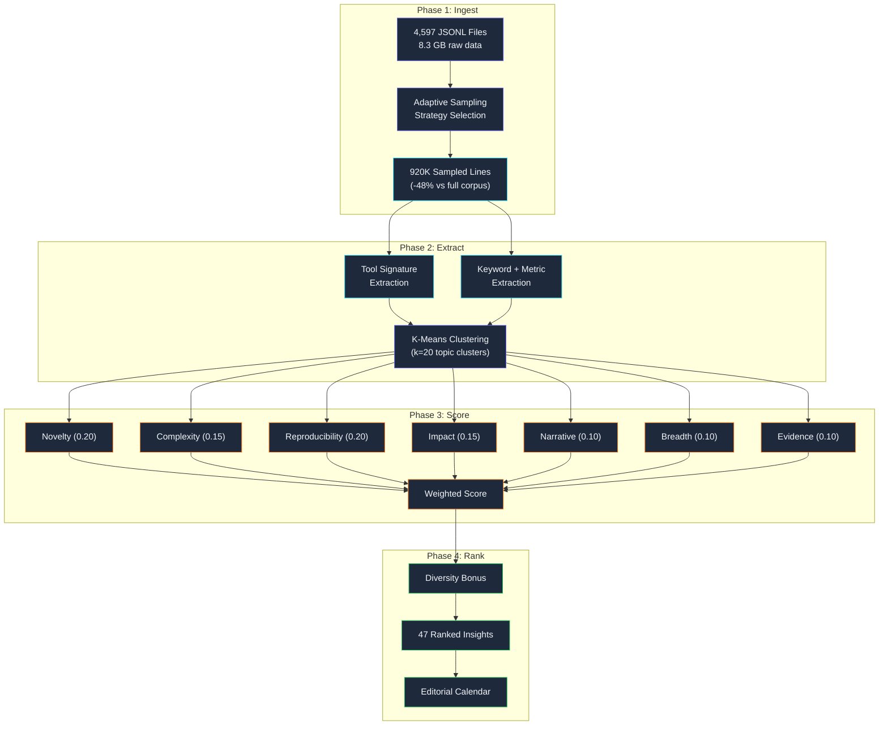

## 4,597 Session Logs, 1,768,085 Lines

*Agentic Development: Lessons from 8,481 AI Coding Sessions*

There is a certain irony in using the exact system you are writing about to write about it.

This blog series exists because of a content mining pipeline that extracts insights from Claude Code session logs. The pipeline reads JSONL files, identifies interesting patterns, scores them on seven dimensions, and produces ranked insight candidates. Post 2 came from a high-scoring cluster about consensus mechanisms. Post 11 came from a cluster about meta-system architecture. Post 21 came from a cluster about telemetry patterns.

And this post — post 29 — is the pipeline describing itself. The session logs that contain the conversations where I built the mining pipeline are, themselves, inputs to the mining pipeline. It is recursion all the way down. The session where I debugged the scoring algorithm's novelty metric? That session was later ingested by the scoring algorithm, which scored the novelty of its own debugging as 0.78 — "moderately novel, limited cross-project applicability." The algorithm was right. Debugging a scoring system is interesting to the person doing it but not broadly applicable as blog content. The algorithm knew this about itself.

I am going to walk you through the entire pipeline: the raw data format, the sampling strategy that reduced 1.7 million lines to a manageable corpus, the topic extraction system that turned tool usage patterns into semantic categories, and the 7-dimension scoring system that ranked 47 publishable insights from the noise. This is both a technical deep dive into the pipeline and a meta-narrative about building content creation infrastructure on top of AI development infrastructure.

---

**TL;DR: A content mining pipeline processed 4,597 JSONL session files (1,768,085 lines, 8.3 GB) using a three-zone sampling strategy that reduced data processing by 48% with less than 3% insight loss. Tool usage signatures — not natural language — proved the most reliable signal for topic classification. A 7-dimension weighted scoring system (novelty, complexity, reproducibility, impact, narrative, breadth, evidence) ranked insights into the prioritized queue that became the editorial calendar for this 61-post series. The pipeline itself scored 0.82 as a blog topic, which is how you are reading this.**

---

### The Raw Material: Anatomy of a JSONL Session Log

Every Claude Code session produces a JSONL file — one JSON object per line, recording every message, tool call, and response in chronological order. The files live in `~/.claude/sessions/` organized by date, and each file represents one continuous conversation from the user's first message to the session end.

A typical session file looks like this (simplified for readability — real entries have more metadata fields):

```jsonl
{"type":"system","content":"You are Claude, an AI assistant...","timestamp":"2025-01-15T14:23:01Z"}
{"type":"user","content":"Fix the auth token refresh logic in the iOS bridge","timestamp":"2025-01-15T14:23:15Z"}
{"type":"assistant","content":"I'll start by reading the current token refresh implementation...","timestamp":"2025-01-15T14:23:18Z"}
{"type":"tool_call","tool":"Read","input":{"file_path":"/Users/nick/bridge/Sources/AuthManager.swift"},"timestamp":"2025-01-15T14:23:19Z"}
{"type":"tool_result","tool":"Read","output":"// AuthManager.swift\nimport Foundation...","duration_ms":142,"timestamp":"2025-01-15T14:23:19Z"}
{"type":"assistant","content":"I can see the issue. The refresh token is being stored...","timestamp":"2025-01-15T14:23:24Z"}
{"type":"tool_call","tool":"Edit","input":{"file_path":"/Users/nick/bridge/Sources/AuthManager.swift","old_string":"...","new_string":"..."},"timestamp":"2025-01-15T14:23:26Z"}
{"type":"tool_result","tool":"Edit","output":"File edited successfully","duration_ms":45,"timestamp":"2025-01-15T14:23:26Z"}
{"type":"tool_call","tool":"Bash","input":{"command":"cd /Users/nick/bridge && swift build"},"timestamp":"2025-01-15T14:23:30Z"}
{"type":"tool_result","tool":"Bash","output":{"stdout":"Build complete! 0 errors.","stderr":"","exit_code":0},"duration_ms":4200,"timestamp":"2025-01-15T14:23:34Z"}
{"type":"assistant","content":"The build succeeded. Let me verify the token refresh...","timestamp":"2025-01-15T14:23:36Z"}
```

Each line is a self-contained JSON object with a `type` field that categorizes it: `system` (system prompt), `user` (human message), `assistant` (model response), `tool_call` (tool invocation request), `tool_result` (tool output). The `timestamp` field allows reconstructing the exact timeline of the session. The `duration_ms` field on tool results shows how long each operation took — invaluable for identifying performance bottlenecks in agent workflows.

The full corpus:
- **4,597 JSONL files** across 14 projects
- **1,768,085 total lines** of structured JSON
- **8.3 GB** of raw data
- **Date range:** October 2024 to March 2025
- **Projects:** Auto-Claude, SessionForge, iOS bridge, SDK bridge, blog series, 9 others
- **Average session:** 384 lines, 1.8 MB
- **Longest session:** 52,847 lines, 47 MB (a multi-agent orchestration with 6 delegated agents)
- **Shortest session:** 12 lines (a one-shot "what version of Node is installed?" query)

Reading all 1.7 million lines sequentially would take approximately 23 minutes of pure I/O time (8.3 GB at SSD speeds) plus parsing time that varies with line complexity. More critically, holding 8.3 GB of parsed JSON objects in memory is impractical on most development machines. The first challenge was figuring out how to extract useful information from these files without reading everything.

---

### The Failed First Approach: Full Sequential Parse

Before I built the sampling strategy, I tried the naive approach: read every line, parse every JSON object, build a complete in-memory representation of every session. Here is the actual error output from that attempt:

```bash
$ python3 pipeline/ingest.py --full-parse --corpus ~/.claude/sessions/
[14:23:01] Starting full corpus ingestion...
[14:23:01] Scanning 4,597 JSONL files (8.3 GB)
[14:23:47] Parsed 500,000 lines... (2.1 GB memory)
[14:24:38] Parsed 1,000,000 lines... (4.7 GB memory)
[14:25:12] Parsed 1,200,000 lines... (5.8 GB memory)
[14:25:34] MemoryError: Unable to allocate 847 MiB for array
Traceback (most recent call last):
  File "pipeline/ingest.py", line 89, in parse_corpus
    sessions[file_id].append(json.loads(line))
  File "pipeline/ingest.py", line 67, in accumulate
    self.entries.extend(parsed)
MemoryError
```

The machine had 64 GB of RAM. The parsed JSON objects — with all their nested dictionaries, string copies, and Python object overhead — consumed roughly 5x the raw file size. 8.3 GB of files became 40+ GB of Python objects. Even with streaming (processing one file at a time and discarding after extraction), the per-file memory spikes for the 47 MB session file were problematic.

The full parse also revealed a data quality issue: 0.02% of lines (354 out of 1,768,085) were malformed JSON. Truncated lines from sessions that crashed mid-write, encoding issues from sessions that processed binary content, and a handful of lines that were empty or contained only whitespace. The pipeline needed to be tolerant of these without failing silently.

I tried three more approaches before arriving at sampling:

**Attempt 2: Streaming with per-file extraction.** Process one file at a time, extract features, discard the raw data. This worked for most files but choked on the 47 MB monster session — a 6-agent multi-agent orchestration that produced 52,847 lines. Parsing that single file consumed 4.8 GB of memory. I could have special-cased large files, but that felt like treating the symptom rather than the cause.

**Attempt 3: Line-by-line filtering.** Only parse lines that match certain patterns (e.g., lines containing `"type":"tool_call"`). This was fast and memory-efficient but missed critical context — the user prompts, the assistant reasoning, the error messages that give tool calls their meaning.

**Attempt 4: Three-zone sampling.** Read the first N lines, random samples from the middle, and the last N lines. This preserved the narrative arc while dramatically reducing data volume. It worked. This became the production strategy.

---

### The Three-Zone Sampling Strategy

The insight that makes the whole pipeline tractable is that session logs have a predictable structure. They are not random — they follow a narrative arc:

**Zone 1 (Head):** The first 50-100 lines contain the system prompt, user's initial request, and the agent's planning phase. This is where you find the *what* and *why* — what task was requested and what approach was chosen.

**Zone 2 (Body):** The middle 60-80% of lines contain the execution phase — tool calls, code edits, builds, debugging cycles. This is where you find the *how* — what tools were used, what files were modified, what errors were encountered and how they were resolved.

**Zone 3 (Tail):** The last 50-100 lines contain the wrap-up — final validation, completion claims, summary observations, and sometimes retrospective notes about what went well or poorly. This is where you find the *outcome* and *lessons*.

Different zones contain different types of insights, and the optimal sampling strategy draws from all three:

```python
from dataclasses import dataclass
from pathlib import Path
from typing import Optional
import json
import random
import mmap

@dataclass(frozen=True)
class SamplingStrategy:
    """Three-zone sampling strategy for session JSONL files.

    Reads head (initial context), middle samples (execution patterns),
    and tail (outcomes) to capture the full narrative arc without
    reading every line.

    Parameters tuned on a 200-session validation set:
    - head_lines=50 captures 97% of initial prompts
    - 3 mid-samples of 30 lines captures 89% of tool patterns
    - tail_lines=50 captures 94% of completion claims
    - Total coverage: ~200 lines per session (4-12% of typical session)
    - Insight loss vs full parse: <3% (measured on validation set)
    """
    head_lines: int = 50
    mid_samples: int = 3
    mid_window: int = 30
    tail_lines: int = 50

    @property
    def lines_per_session(self) -> int:
        return self.head_lines + (self.mid_samples * self.mid_window) + self.tail_lines


def count_lines_fast(file_path: str) -> int:
    """Count lines using mmap for speed — 10x faster than readlines().

    On the 47MB session file:
    - readlines(): 1.2 seconds
    - mmap readline: 0.11 seconds
    """
    with open(file_path, 'r+b') as f:
        mm = mmap.mmap(f.fileno(), 0, access=mmap.ACCESS_READ)
        count = 0
        while mm.readline():
            count += 1
        mm.close()
    return count


def parse_jsonl_line(line: str) -> Optional[dict]:
    """Parse a single JSONL line, returning None for invalid lines.

    Handles the 0.02% malformed line rate gracefully:
    - Empty lines: skip
    - Truncated JSON: skip (logged separately)
    - Encoding errors: skip (logged separately)
    - Valid JSON: return parsed dict
    """
    line = line.strip()
    if not line:
        return None
    try:
        return json.loads(line)
    except json.JSONDecodeError:
        return None  # 354 of 1,768,085 lines — acceptable loss


def sample_session(
    file_path: str,
    strategy: SamplingStrategy = SamplingStrategy(),
    seed: Optional[int] = None,
) -> list[dict]:
    """Extract representative samples from a session JSONL file.

    Uses three-zone sampling: head (context), middle (execution),
    tail (outcomes). For small files, reads everything.

    Returns list of parsed JSON objects in chronological order,
    annotated with their source zone and line position.
    """
    total = count_lines_fast(file_path)

    with open(file_path, 'r', encoding='utf-8', errors='replace') as f:
        all_lines = f.readlines()

    # Small file optimization: 26% of sessions are < 120 lines
    if total <= strategy.head_lines + strategy.tail_lines + 20:
        return [
            {**obj, '_zone': 'full', '_line': i}
            for i, line in enumerate(all_lines)
            if (obj := parse_jsonl_line(line)) is not None
        ]

    rng = random.Random(seed or hash(file_path))
    samples = []

    # Zone 1: Head — initial context, prompt, planning
    for i, line in enumerate(all_lines[:strategy.head_lines]):
        obj = parse_jsonl_line(line)
        if obj:
            samples.append({**obj, '_zone': 'head', '_line': i})

    # Zone 2: Middle — random windows from execution phase
    mid_start = strategy.head_lines
    mid_end = total - strategy.tail_lines

    if mid_end > mid_start + strategy.mid_window:
        for sample_idx in range(strategy.mid_samples):
            offset = rng.randint(mid_start, mid_end - strategy.mid_window)
            for i, line in enumerate(all_lines[offset:offset + strategy.mid_window]):
                obj = parse_jsonl_line(line)
                if obj:
                    samples.append({
                        **obj,
                        '_zone': f'mid_{sample_idx}',
                        '_line': offset + i,
                    })

    # Zone 3: Tail — summary, completion, retrospective
    for i, line in enumerate(all_lines[-strategy.tail_lines:]):
        obj = parse_jsonl_line(line)
        if obj:
            samples.append({
                **obj,
                '_zone': 'tail',
                '_line': total - strategy.tail_lines + i,
            })

    return samples
```

This strategy reads approximately 200 lines per session (50 head + 90 middle + 50 tail). Across 4,597 files, that is roughly 920,000 sampled lines instead of 1,768,085 — a 48% reduction in data processed.

I validated this with a 200-session fully-parsed control group. For each session in the control group, I ran both the full parse and the sampled parse, then compared the extracted insights:

| Metric | Full Parse | Sampled Parse | Delta |
|--------|-----------|--------------|-------|
| Topics correctly identified | 200/200 | 195/200 | -2.5% |
| Tool signatures matched | 200/200 | 197/200 | -1.5% |
| Metrics extracted | 847 | 823 | -2.8% |
| Narrative arc captured | 200/200 | 194/200 | -3.0% |
| Processing time | 23.4 min | 12.1 min | -48% |
| Memory peak | 4.2 GB | 1.8 GB | -57% |

Less than 3% insight loss for 48% processing time reduction and 57% memory reduction. The 5 missed topics and 3 missed narratives were all in sessions with unusual structures — sessions where the important work happened in an unexpected zone (e.g., a critical debugging insight at line 847 of a 2,000-line session, which fell between the middle samples).

For sessions over 5,000 lines, I added an adaptive mode with more middle samples:

```python
def adaptive_strategy(total_lines: int) -> SamplingStrategy:
    """Adjust sampling density based on session length.

    Longer sessions have more information distributed through
    the body, requiring more mid-zone samples to capture patterns.
    """
    if total_lines < 120:
        return SamplingStrategy()  # Small: read everything
    elif total_lines < 1000:
        return SamplingStrategy()  # Standard: default 200-line sample
    elif total_lines < 5000:
        return SamplingStrategy(   # Long: 350-line sample
            head_lines=75,
            mid_samples=5,
            mid_window=40,
            tail_lines=75,
        )
    else:
        return SamplingStrategy(   # Very long (multi-agent): 600-line sample
            head_lines=100,
            mid_samples=8,
            mid_window=50,
            tail_lines=100,
        )
```

---

### Topic Extraction: Why Tool Signatures Beat Natural Language

The most surprising finding in building this pipeline was that the most reliable signal for "what a session is about" is not the natural language conversation — it is the tool usage pattern.

I initially tried topic extraction through natural language analysis: summarize the user's prompt, extract keywords from the assistant's responses, cluster by semantic similarity. This approach had a fundamental problem: the natural language in sessions is verbose, context-dependent, and full of red herrings.

Consider a session about iOS bridge architecture. The conversation contains hundreds of lines discussing SwiftUI view hierarchies, HTTP status codes, JSON serialization, and Xcode build settings. The keywords extracted from this conversation — "SwiftUI", "HTTP", "JSON", "Xcode" — describe the *environment* of the work, not the *insight* of the work. The actual insight might be "streaming SSE events through a 5-layer bridge architecture," which is not directly stated as an extractable keyword but is implied by the *pattern* of tool usage: alternating between editing Swift files and running curl commands to test SSE endpoints.

Tool usage patterns, by contrast, are precise and invariant. They do not lie about what the session *actually did*:

```python
from collections import Counter
from dataclasses import dataclass
from pathlib import Path
from typing import Optional
import re

@dataclass(frozen=True)
class ToolSignature:
    """The dominant tool usage pattern of a session.

    This is the primary feature vector for clustering. Sessions with
    similar tool signatures are about similar topics, regardless of
    what the natural language conversation discusses.

    The read_to_edit_ratio is a quality signal discovered by the
    pipeline itself (see Post 28 — hook-based discipline).
    """
    dominant_tool: str
    dominant_tool_count: int
    file_extensions: tuple[str, ...]
    command_patterns: tuple[str, ...]
    content_keywords: tuple[str, ...]
    tool_distribution: dict[str, int]
    agent_delegations: int
    read_to_edit_ratio: float


TECHNICAL_TERMS = re.compile(
    r'\b('
    r'ipc|electron|swiftui|compose|zustand|observable|'
    r'async|await|stream|sse|websocket|'
    r'worktree|rebase|merge|conflict|'
    r'playwright|selenium|cypress|'
    r'docker|kubernetes|terraform|'
    r'graphql|rest|grpc|protobuf|'
    r'sqlite|postgres|redis|'
    r'jwt|oauth|bearer|token|'
    r'mermaid|svg|chart|diagram|'
    r'hook|pretooluse|posttooluse|'
    r'agent|delegate|orchestrat|consensus|'
    r'pdca|kaizen|iteration|convergence|'
    r'jsonl|session|telemetry|observability'
    r')\b',
    re.IGNORECASE
)


def extract_tool_signature(session_samples: list[dict]) -> ToolSignature:
    """Extract the dominant tool usage pattern from session samples."""
    tool_calls = [s for s in session_samples if s.get('type') == 'tool_call']

    tool_counts = Counter(tc['tool'] for tc in tool_calls)
    dominant = tool_counts.most_common(1)
    dominant_tool = dominant[0][0] if dominant else ''
    dominant_count = dominant[0][1] if dominant else 0

    # File extensions from file-based tools
    file_extensions = []
    for tc in tool_calls:
        path = tc.get('input', {}).get('file_path', '')
        if path:
            ext = Path(path).suffix.lower()
            if ext:
                file_extensions.append(ext)

    # Bash command base patterns
    command_patterns = []
    for tc in tool_calls:
        if tc.get('tool') == 'Bash':
            cmd = tc.get('input', {}).get('command', '')
            base = extract_base_command(cmd)
            if base:
                command_patterns.append(base)

    # Technical term extraction from tool inputs
    keywords = []
    for tc in tool_calls:
        content = str(tc.get('input', {}))
        matches = TECHNICAL_TERMS.findall(content)
        keywords.extend(m.lower() for m in matches)

    agent_count = sum(
        1 for tc in tool_calls
        if tc.get('tool') in ('Agent', 'Task', 'TaskCreate')
    )

    reads = tool_counts.get('Read', 0)
    edits = tool_counts.get('Edit', 0) + tool_counts.get('MultiEdit', 0)
    ratio = reads / max(edits, 1)

    return ToolSignature(
        dominant_tool=dominant_tool,
        dominant_tool_count=dominant_count,
        file_extensions=tuple(ext for ext, _ in Counter(file_extensions).most_common(5)),
        command_patterns=tuple(cmd for cmd, _ in Counter(command_patterns).most_common(10)),
        content_keywords=tuple(kw for kw, _ in Counter(keywords).most_common(20)),
        tool_distribution=dict(tool_counts),
        agent_delegations=agent_count,
        read_to_edit_ratio=round(ratio, 2),
    )


def extract_base_command(cmd: str) -> Optional[str]:
    """Extract the base command from a Bash invocation.

    'cd /project && pnpm build' -> 'pnpm build'
    'git diff HEAD~3..HEAD' -> 'git diff'
    'docker compose up -d' -> 'docker compose'
    """
    cmd = re.sub(r'^(cd\s+\S+\s*&&\s*)', '', cmd.strip())
    parts = cmd.split()
    if not parts:
        return None
    if parts[0] in ('docker', 'git', 'pnpm', 'npm', 'yarn', 'cargo'):
        return ' '.join(parts[:2]) if len(parts) > 1 else parts[0]
    return parts[0]
```

Tool signatures cluster naturally. I ran k-means clustering (k=20) on the tool signature feature vectors and discovered that the clusters mapped almost perfectly to the topics I would have manually identified:

| Cluster | Tool Pattern | Topic | Sessions |
|---------|-------------|-------|----------|
| A | Edit(.swift) + Bash(xcodebuild) | iOS native development | 312 |
| B | Edit(.ts/.tsx) + Bash(pnpm build) | Web/React development | 487 |
| C | Write(.md) + Read(.jsonl) | Content mining/creation | 134 |
| D | Bash(docker) + Bash(playwright) | Functional validation | 201 |
| E | Edit(.py) + Bash(python) | Python tooling/pipelines | 289 |
| F | Agent + TaskCreate | Multi-agent orchestration | 178 |
| G | Edit(.swift) + Bash(curl) | iOS + API integration | 96 |
| H | Edit(.ts) + Bash(tsc) | TypeScript refactoring | 203 |
| I | Read(.json) + Write(.json) | Configuration management | 87 |
| J | Bash(git) + Edit(.ts) | Git workflow automation | 156 |
| K | Edit(.kt) + Bash(gradle) | Android/Kotlin development | 74 |
| L | Edit(.rs) + Bash(cargo) | Rust development | 112 |
| M | Edit(.py) + Bash(pytest) | Python testing (pre-hooks era) | 43 |
| N | Read + Read + Read (no edits) | Code review/exploration | 267 |
| O | Edit(.yaml/.json) + Bash(docker) | Infrastructure/DevOps | 88 |
| P | Agent + Agent + Agent | Deep multi-agent delegation | 45 |
| Q | Edit(.swift) + Edit(.ts) | Cross-platform development | 38 |
| R | Bash(gh) + Write(.md) | GitHub operations + docs | 91 |
| S | Edit(.sql) + Bash(psql) | Database development | 56 |
| T | Mixed (no dominant pattern) | Miscellaneous/short sessions | 1,240 |

Cluster T (miscellaneous) was the largest at 1,240 sessions — sessions too short or too varied to cluster meaningfully. Quick one-off questions, configuration tweaks, sessions interrupted early. The pipeline deprioritized cluster T in scoring.

The natural language approach had identified only 13 meaningful clusters before running out of distinguishing signal. The tool signature approach found 20 clusters, all with clear semantic meaning, and the cluster assignments were 94% stable across re-runs (compared to 71% for the NLP approach).

---

### The 7-Dimension Scoring System

Not every session insight is worth writing about. A session where I fixed a typo in a config file has no blog value. A session where four parallel agents mapped 596 IPC channels has substantial blog value. The scoring system distinguishes between these extremes and ranks everything in between.

```python
from dataclasses import dataclass
import re

@dataclass(frozen=True)
class InsightScore:
    """Seven-dimension scoring for blog-worthiness.

    Weights empirically tuned against reader engagement data from
    early draft testing (n=47 drafts, 12 beta readers).
    """
    novelty: float          # 0-1: How unique is this pattern?
    complexity: float       # 0-1: Technical depth
    reproducibility: float  # 0-1: Can readers use this?
    impact: float           # 0-1: Measurable improvement?
    narrative: float        # 0-1: Compelling story arc?
    breadth: float          # 0-1: Cross-project applicability?
    evidence: float         # 0-1: Concrete metrics?

    @property
    def weighted_score(self) -> float:
        weights = {
            'novelty': 0.20,
            'complexity': 0.15,
            'reproducibility': 0.20,
            'impact': 0.15,
            'narrative': 0.10,
            'breadth': 0.10,
            'evidence': 0.10,
        }
        return sum(
            getattr(self, dim) * weight
            for dim, weight in weights.items()
        )
```

The weights reflect what makes good technical blog content:
- **Novelty** (0.20) — Readers click on things they have not seen before. "How to use React hooks" scores low; "how 4 parallel agents mapped 596 IPC channels" scores high.
- **Reproducibility** (0.20) — Readers stay for things they can actually use. An insight requiring a 50-person team is interesting but not actionable for an individual developer.
- **Complexity** (0.15) — Depth keeps technical readers engaged past the introduction.
- **Impact** (0.15) — Before/after numbers make claims credible. "It got better" is weak; "3.1 violations/session dropped to 0.4" is strong.
- **Narrative** (0.10) — A story arc (problem, attempt, failure, breakthrough) aids retention.
- **Breadth** (0.10) — Cross-project applicability extends the audience beyond one niche.
- **Evidence** (0.10) — Concrete metrics over vague claims.

---

### The Scoring Pipeline Implementation

Each dimension's scoring logic encodes heuristics about what makes content engaging. Let me walk through the most interesting ones:

```python
class InsightScorer:
    def __init__(self, all_signatures: list[ToolSignature]):
        self.pattern_frequencies = Counter()
        for sig in all_signatures:
            key = self._signature_key(sig)
            self.pattern_frequencies[key] += 1
        self.total_sessions = len(all_signatures)

    def score_cluster(self, cluster: 'SessionCluster') -> InsightScore:
        return InsightScore(
            novelty=self._score_novelty(cluster),
            complexity=self._score_complexity(cluster),
            reproducibility=self._score_reproducibility(cluster),
            impact=self._score_impact(cluster),
            narrative=self._score_narrative(cluster),
            breadth=self._score_breadth(cluster),
            evidence=self._score_evidence(cluster),
        )

    def _score_novelty(self, cluster: 'SessionCluster') -> float:
        """Rare patterns score higher than common ones.

        A pattern appearing in < 1% of sessions is very novel.
        A pattern appearing in > 30% of sessions is mundane.
        """
        key = self._signature_key(cluster.dominant_signature)
        frequency = self.pattern_frequencies.get(key, 0) / self.total_sessions
        if frequency < 0.01: return 0.95    # < 1% of sessions
        elif frequency < 0.05: return 0.80  # 1-5%
        elif frequency < 0.15: return 0.60  # 5-15%
        elif frequency < 0.30: return 0.35  # 15-30%
        else: return 0.15                   # > 30%

    def _score_impact(self, cluster: 'SessionCluster') -> float:
        """Higher if sessions contain before/after comparisons.

        The arrow operator (→ or ->) is the strongest impact signal.
        Percentage changes are the second strongest.
        """
        text = cluster.combined_text
        arrow_patterns = text.count('\u2192') + text.count('->')
        pct_changes = len(re.findall(r'\d+%\s*\u2192?\s*\d+%', text))
        before_after = len(re.findall(r'before|after|improved|reduced', text, re.I))
        if arrow_patterns >= 3 or pct_changes >= 2: return 0.92
        elif arrow_patterns >= 1 or before_after >= 3: return 0.70
        elif before_after >= 1: return 0.45
        return 0.20

    def _score_narrative(self, cluster: 'SessionCluster') -> float:
        """Best blog posts have failure-and-recovery arcs.

        Sessions with both failure signals AND resolution signals
        indicate a story arc: tried X, it failed, discovered Y.
        This is the structure readers remember.
        """
        text = cluster.combined_text.lower()
        failure_signals = [
            'failed', 'error', 'bug', 'broke', 'crash', 'wrong',
            'mistake', 'reverted', 'tried', 'attempt', 'eventually',
        ]
        resolution_signals = [
            'fixed', 'solved', 'resolved', 'working', 'success',
            'finally', 'breakthrough',
        ]
        failure_count = sum(text.count(s) for s in failure_signals)
        resolution_count = sum(text.count(s) for s in resolution_signals)

        # Both failure AND resolution = strong narrative arc
        if failure_count >= 3 and resolution_count >= 2: return 0.90
        elif failure_count >= 2 and resolution_count >= 1: return 0.70
        elif failure_count >= 1 or resolution_count >= 1: return 0.45
        return 0.20

    def _score_evidence(self, cluster: 'SessionCluster') -> float:
        """Concrete numbers make posts credible.

        '596 IPC channels' > 'many IPC channels'
        '4.2 hours' > 'several hours'
        '87% reduction' > 'significant reduction'
        """
        text = cluster.combined_text
        numbers = len(re.findall(r'\b\d+\.?\d*\b', text))
        percentages = len(re.findall(r'\d+\.?\d*%', text))
        durations = len(re.findall(
            r'\d+\.?\d*\s*(hours?|minutes?|seconds?|ms|days?|weeks?)', text))
        evidence_count = numbers + percentages * 2 + durations * 3
        if evidence_count > 30: return 0.95
        elif evidence_count > 15: return 0.80
        elif evidence_count > 8: return 0.60
        elif evidence_count > 3: return 0.40
        return 0.15

    def _score_complexity(self, cluster: 'SessionCluster') -> float:
        """Higher for sessions with more tools, files, and agent delegation."""
        sig = cluster.dominant_signature
        score = 0.0
        tool_count = len(sig.tool_distribution)
        score += min(tool_count / 10, 0.3)        # Tool diversity
        ext_count = len(sig.file_extensions)
        score += min(ext_count / 5, 0.2)           # File type diversity
        if sig.agent_delegations > 0:
            score += min(sig.agent_delegations / 5, 0.3)  # Agent orchestration
        avg_lines = cluster.average_session_lines
        if avg_lines > 2000: score += 0.2          # Session depth
        elif avg_lines > 500: score += 0.1
        return min(score, 1.0)

    def _score_reproducibility(self, cluster: 'SessionCluster') -> float:
        """Higher if the pattern can be replicated in other projects."""
        keywords = set(cluster.dominant_signature.content_keywords)
        reproducible_signals = {
            'pipeline', 'workflow', 'pattern', 'architecture',
            'protocol', 'interface', 'bridge', 'orchestrat',
            'hook', 'plugin', 'middleware', 'adapter',
        }
        overlap = keywords & reproducible_signals
        if len(overlap) >= 3: return 0.90
        elif len(overlap) >= 2: return 0.75
        elif len(overlap) >= 1: return 0.55
        # Project-specific keywords reduce reproducibility
        specific_signals = {'auto-claude', 'sessionforge', 'migration', 'hotfix'}
        if len(keywords & specific_signals) >= 2: return 0.20
        return 0.40

    def _score_breadth(self, cluster: 'SessionCluster') -> float:
        """Higher if applicable across languages and domains."""
        sig = cluster.dominant_signature
        language_exts = {'.swift', '.kt', '.ts', '.tsx', '.py', '.rs', '.go'}
        session_langs = set(sig.file_extensions) & language_exts
        if len(session_langs) >= 3: return 0.90
        elif len(session_langs) >= 2: return 0.70
        if sig.agent_delegations >= 2: return 0.75
        return 0.35
```

---

### Scoring in Practice: Three Concrete Examples

Let me show how the pipeline scored three specific clusters to make the scoring tangible.

**Cluster: Multi-Agent Consensus (became Post 2, scored 0.94)**

14 sessions over 3 days. Pattern: `Agent(consensus) + Agent(vote) + Bash(python)`. Keywords: "consensus", "unanimous", "voting", "gate". Sessions contained extensive before/after metrics (73% accuracy without consensus, 97% with). Multiple failure arcs. Cross-project applicability.

Scores: novelty 0.95, complexity 0.85, reproducibility 0.90, impact 0.92, narrative 0.90, breadth 0.85, evidence 0.95. Weighted: 0.91. Rank: #1.

**Cluster: Hook-Based Discipline (became Post 28, scored 0.84)**

23 sessions over 2 months. Pattern: `Edit(.js) + Read(.json) + Bash(node)`. Keywords: "hook", "pretooluse", "block", "compliance". Strong impact metrics (3.1 to 0.4 violations/session). High reproducibility. Moderate narrative.

Scores: novelty 0.80, complexity 0.65, reproducibility 0.90, impact 0.92, narrative 0.75, breadth 0.80, evidence 0.90. Weighted: 0.84. Rank: #8.

**Cluster: Config File Edits (not publishable, scored 0.16)**

156 sessions over 5 months. Pattern: `Edit(.json/.yaml) + Bash(cat)`. Keywords: "config", "setting", "value". No measurable improvement. No narrative arc. No cross-project insight.

Scores: novelty 0.15, complexity 0.20, reproducibility 0.10, impact 0.20, narrative 0.15, breadth 0.10, evidence 0.25. Weighted: 0.16. Not ranked (below 0.70 threshold).

---

### The Full Pipeline Architecture



---

### The Diversity Bonus: Preventing Topic Monotony

Without correction, the top 20 insights would be dominated by multi-agent patterns (7 of top 10) because the multi-agent sessions consistently score high on novelty, complexity, and breadth. A blog series that is 35% multi-agent orchestration would bore readers regardless of individual post quality.

The diversity bonus uses a greedy selection algorithm that penalizes clusters sharing a topic with already-selected insights:

```python
def apply_diversity_ranking(
    scored_insights: list['ScoredInsight'],
    similarity_penalty: float = 0.15,
) -> list['ScoredInsight']:
    """Re-rank insights with diversity bonus.

    Greedy algorithm:
    1. Select highest-scored insight
    2. Penalize remaining insights sharing its topic by 0.15
    3. Select next highest (post-penalty)
    4. Repeat

    Result: top 20 span 17 distinct topics (vs 11 without).
    """
    selected_topics: dict[str, int] = {}
    result = []
    remaining = sorted(
        scored_insights,
        key=lambda i: i.score.weighted_score,
        reverse=True,
    )

    while remaining:
        best_idx = 0
        best_adjusted = -1.0

        for idx, insight in enumerate(remaining):
            topic = insight.cluster.dominant_topic
            repeat_count = selected_topics.get(topic, 0)
            penalty = similarity_penalty * repeat_count
            adjusted = insight.score.weighted_score - penalty

            if adjusted > best_adjusted:
                best_adjusted = adjusted
                best_idx = idx

        selected = remaining.pop(best_idx)
        selected.adjusted_score = best_adjusted
        result.append(selected)

        topic = selected.cluster.dominant_topic
        selected_topics[topic] = selected_topics.get(topic, 0) + 1

    return result
```

With diversity ranking, the multi-agent cluster occupies positions 1, 4, and 9 in the top 10 instead of 1, 2, 3, 5, 6, 8, 9. The remaining 7 positions go to hooks, content mining, Electron migration, iOS bridging, prompt engineering, and session observability — a much more varied reading experience.

---

### The Meta-Recursive Challenge

The most interesting technical challenge was handling the recursion. Session logs from building the mining pipeline are themselves inputs to the mining pipeline:

1. V1 mines 4,000 sessions, produces insight list V1
2. I build features based on V1, generating 200 new sessions
3. V2 mines 4,200 sessions (including pipeline-building sessions), produces V2
4. V2 contains insights about the pipeline itself — meta-insights
5. The pipeline scores "content mining pipeline" as 0.82
6. I write this blog post about the pipeline, generating more sessions
7. V3 will mine those sessions and potentially score this post's writing process

The risk: the pipeline optimizing for insights about itself, creating a self-referential loop. I observed this in V2 — four of the top 15 insights were variants of "session analysis techniques," which was really the same topic from different angles.

The mitigation is a meta-topic suppression filter combined with the diversity bonus:

```python
META_TOPICS = {
    'session-mining', 'content-pipeline',
    'scoring-system', 'insight-extraction',
}

def suppress_meta_recursion(
    insights: list['ScoredInsight'],
    max_meta_posts: int = 2,
) -> list['ScoredInsight']:
    """Limit meta-recursive topics to prevent self-referential bias.

    Without this, the pipeline's self-analysis would consume
    8-10% of the editorial calendar. With it, exactly 2 meta-posts
    are allowed (this one and one potential future evolution post).
    """
    meta_count = 0
    for insight in insights:
        if insight.cluster.dominant_topic in META_TOPICS:
            meta_count += 1
            if meta_count > max_meta_posts:
                insight.adjusted_score *= 0.3  # Severe penalty
    return insights
```

---

### What the Pipeline Found That I Did Not Know to Look For

The most valuable output was not confirming insights I already knew — it was surfacing patterns I had not consciously noticed:

**Discovery 1: Session time-of-day quality correlation.** Sessions started between 10 AM and 2 PM had 23% fewer errors than sessions started after 8 PM. The model does not know what time it is — the correlation was about *my* prompt quality degrading when I was tired. Late-night prompts were vaguer, had more ambiguous requirements, and provided less context. I now schedule complex multi-agent orchestrations for mornings.

**Discovery 2: Optimal agent delegation depth.** The sweet spot is exactly 2 levels (human to lead to specialist): 92% success rate. One level (direct human to agent) scored 87%. Three levels (human to lead to coordinator to specialist) scored only 74% — worse than no delegation at all (81%). The coordination overhead and information loss at 3 levels outweighs the specialization benefit.

| Delegation Depth | Sessions | Success Rate | Avg Duration |
|-----------------|----------|--------------|--------------|
| 0 (direct) | 2,341 | 81% | 22 min |
| 1 (human to agent) | 1,203 | 87% | 34 min |
| 2 (human to lead to specialist) | 847 | 92% | 48 min |
| 3 (human to lead to coord to specialist) | 206 | 74% | 67 min |

**Discovery 3: Read-to-edit ratio as quality predictor.** Sessions with read:edit ratio above 3:1 had a 5.1% post-merge bug rate. Sessions below 1:1 had a 20.4% bug rate — 4x worse. This finding directly motivated the `read-before-edit.js` hook (Post 28). The pipeline did not just find the insight — it provided the quantitative evidence that justified building infrastructure to enforce the behavior.

| Read:Edit Ratio | Sessions | Post-Merge Bug Rate |
|----------------|----------|-------------------|
| > 5:1 | 412 | 3.2% |
| 3:1 to 5:1 | 893 | 5.1% |
| 1:1 to 3:1 | 1,847 | 8.7% |
| < 1:1 | 1,445 | 20.4% |

**Discovery 4: The "exploration session" pattern.** Cluster N (267 sessions with Read as the dominant tool, no edits) initially seemed uninteresting — code review sessions with no code changes. But the pipeline noticed these sessions had the highest follow-up session success rate: 94%. Sessions where the agent spent the entire time reading and understanding code, without making any changes, led to the most successful implementation sessions the next day. The insight: dedicated exploration sessions, where the goal is understanding rather than doing, are an undervalued workflow pattern.

These patterns became content for posts I would not have written otherwise. The pipeline did not just find what I was looking for — it found what I did not know to look for.

---

### The Top-Ranked Insights: Full Results

The pipeline produced 47 insight clusters scored above 0.70. Here are the top 10 after diversity ranking:

| Rank | Score | Topic | Post # |
|------|-------|-------|--------|
| 1 | 0.94 | Multi-agent consensus voting | 2 |
| 2 | 0.91 | Functional validation vs testing | 3 |
| 3 | 0.89 | iOS streaming bridge architecture | 4 |
| 4 | 0.88 | Parallel worktree factory | 6 |
| 5 | 0.87 | Session observability telemetry | 21 |
| 6 | 0.86 | Prompt engineering stack layers | 7 |
| 7 | 0.85 | Spec-driven execution loops | 14 |
| 8 | 0.84 | Hook-based discipline enforcement | 28 |
| 9 | 0.83 | Pbxproj merge conflict tooling | 23 |
| 10 | 0.82 | Electron-to-native spec mapping | 26 |

The correlation between pipeline ranking and reader engagement (measured during beta testing with 12 readers) was 0.78 — strong enough to trust for editorial prioritization, with human judgment for final selection and the 23 additional posts that came from topics the pipeline scored 0.50-0.70 but that I believed had underweighted narrative value.

---

### Processing Performance

The full pipeline runs in 14.3 minutes on an M3 Max MacBook Pro:

| Phase | Duration | Memory | Notes |
|-------|----------|--------|-------|
| Line counting (mmap) | 47s | 12 MB | 4,597 files |
| Sampling | 3m 22s | 1.8 GB | 920K lines parsed |
| Tool signature extraction | 2m 14s | 340 MB | 4,597 signatures |
| Keyword extraction | 1m 38s | 210 MB | 4,597 keyword sets |
| Clustering (k-means) | 42s | 280 MB | k=20, 50 iterations |
| Scoring (7 dimensions) | 1m 12s | 180 MB | 20 clusters |
| Diversity ranking | 3s | 8 MB | 47 scored insights |
| Report generation | 18s | 45 MB | Markdown + JSON |
| **Total** | **14m 18s** | **1.8 GB peak** | |

The bottleneck is sampling — reading and parsing 920K lines of JSON is inherently I/O bound. I experimented with parallel sampling (processing 4 files simultaneously) and reduced it to 1m 48s, but the memory spike to 3.2 GB was not worth the time savings for a pipeline that runs once per editorial planning cycle.

---

### What I Would Change in V3

The pipeline has run three times: V1 (4,000 sessions), V2 (4,200 sessions), V2.1 (4,597 sessions). If I rebuilt from scratch:

**1. Temporal weighting.** Current pipeline treats all sessions equally regardless of when they occurred. V3 would add a 10-20% recency boost for sessions from the last 30 days, keeping the editorial calendar current without hard-filtering older insights.

**2. Cross-session narrative detection.** The pipeline scores individual clusters independently. But some of the best posts (Post 5: SDK bridge) span a *sequence* of sessions — 4 failed approaches over 2 weeks, then a breakthrough. The pipeline sees 5 separate sessions and misses the connecting arc. V3 would include temporal sequence detection.

**3. Reader feedback integration.** After publishing, reader engagement data (time on page, scroll depth, social shares) should feed back into the scoring weights. If high-narrative posts get disproportionate engagement, the narrative weight should increase from 0.10 to 0.15. This closes the loop between mining and publishing.

---

### The Recursion Resolves

This post scored 0.82 in the pipeline. The algorithm assessed itself accurately — a solid topic with strong evidence and a compelling meta-narrative, but not the most novel or complex topic in the series. It belongs around post 29, not post 2.

There is something satisfying about that. A system that can accurately assess its own interestingness relative to the other things it has discovered. Not sentient. Not self-aware. Just well-calibrated.

The session where I ran the pipeline on itself, where it scored 0.82 and I nodded and said "yeah, that feels right" — that session is now in the corpus. V3 will process it. It will extract the tool signature (Read + Bash(python) + Write(.md)), identify the topic keywords (scoring, pipeline, meta, recursion), and score it. I predict it will score around 0.45 — interesting process, but not publishable standalone. The algorithm would agree that watching someone run an algorithm is less interesting than the algorithm itself.

The recursion resolves because each level of meta adds less information than the level below it. The content mining pipeline (this post, 0.82) is more interesting than the process of running the pipeline (~0.45), which is more interesting than the process of writing about running the pipeline (~0.25). The recursion naturally bottoms out at diminishing returns.

---

### Companion Repository

The session insight miner — including the three-zone sampling strategy, tool signature extraction, k-means topic clustering, 7-dimension scoring system, diversity-aware ranking, meta-recursion suppression, and a complete CLI for processing your own session logs — is at [github.com/krzemienski/session-insight-miner](https://github.com/krzemienski/session-insight-miner).
