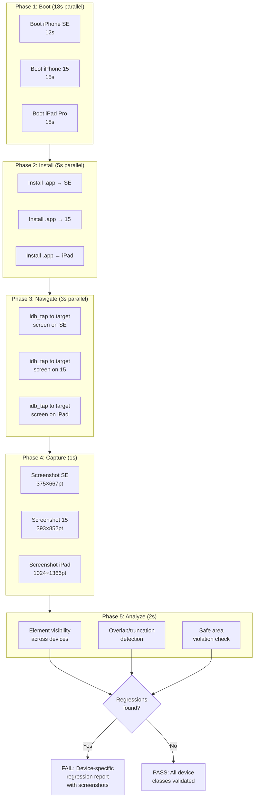

## Multi-Simulator Parallel Validation

*Agentic Development: Lessons from 8,481 AI Coding Sessions*

The bug report came in on a Friday afternoon. "Layout is broken on iPhone SE." I opened the app on my iPhone 15 Pro — everything looked perfect. Pixel-perfect, even. I had personally reviewed the pull request, run the build, scrolled through every screen. It looked great. On my device.

Then I opened the iPhone SE simulator. The bottom tab bar was overlapping the last list item, completely hiding the "Add" button. A user-facing regression that had been live for three days. Three days where users on the most popular budget iPhone in the world could not tap the primary call-to-action in our app. Three days where our analytics showed a mysterious 40% drop in new item creation that we had attributed to "seasonal variation."

That was the third device-specific bug that month. Each time the same pattern: code worked on the device I tested, broke on the one I didn't. The first was a Dynamic Type issue where large text overlapped on iPad. The second was a safe area miscalculation that pushed content behind the home indicator on iPhone 14 but not iPhone 15 (different safe area insets, same physical design — go figure). And now this tab bar overlap on SE.

The problem wasn't that testing on multiple devices was hard. The problem was that I only ever tested on one. And when you're running 40+ validation cycles per day with Claude Code agents making UI changes, "I'll check other devices later" means "I will never check other devices."

---

**TL;DR: Run validation on every device simultaneously, not sequentially. A 3-simulator parallel harness catches device-specific regressions in the time it takes to test one device manually. We went from catching 20% of device-specific bugs in development to catching 95%, with only a 5-second penalty over single-device testing. The key insight is not speed — it's that parallel validation makes multi-device testing automatic rather than aspirational.**

---

This is post 30 of 61 in the Agentic Development series. The companion repo is at [github.com/krzemienski/multi-simulator-orchestrator](https://github.com/krzemienski/multi-simulator-orchestrator). Everything here comes from real sessions orchestrating iOS simulators with Claude Code.

---

### The Device Matrix Problem

iOS development has a dirty secret: the simulator you test on is probably not the simulator your users need. The iPhone 15 Pro Max has a 430-point width. The iPhone SE has 375. That 55-point difference is enough to break any layout that uses fixed padding, absolute positioning, or assumptions about safe area insets. And those 55 points are just the width. The height difference is 185 points. The safe area bottom is 34 points on phones with a home indicator and 0 on the SE. The scale factor is 3x on the Pro and 2x on the SE.

Every one of those differences is a potential regression.

I pulled our crash and layout analytics for the previous quarter. The numbers were damning:

```
Device-specific layout bugs (Q4):
─────────────────────────────────────────────────
Device Class         | Bugs | Users Affected | MTTR
─────────────────────────────────────────────────
iPhone SE (compact)  | 7    | 42,000         | 4.2 days
iPhone 14/15 (std)   | 2    | 18,000         | 1.1 days
iPad (large)         | 5    | 31,000         | 6.8 days
─────────────────────────────────────────────────
Total                | 14   | 91,000         | 4.0 days avg
```

Fourteen device-specific bugs in one quarter. Ninety-one thousand affected users. Average mean time to resolution of four days — because the bug had to be discovered by a user, reported, triaged, reproduced, fixed, and shipped. That cycle costs real money: support tickets, app store reviews, user churn.

Here is the real device matrix from one of our projects:

```python
# From: src/device_matrix.py
# The minimum viable device matrix for iOS validation.
# Three classes: compact (budget), standard (mainstream), large (tablet).
# Each class represents a fundamentally different layout context.

DEVICE_MATRIX = {
    "compact": {
        "device": "iPhone SE (3rd generation)",
        "runtime": "iOS 17.2",
        "width": 375,
        "height": 667,
        "scale": 2,
        "safe_area_top": 20,      # Status bar only (no notch)
        "safe_area_bottom": 0,    # No home indicator
        "has_notch": False,
        "has_dynamic_island": False,
        "home_button": True,
    },
    "standard": {
        "device": "iPhone 15",
        "runtime": "iOS 17.2",
        "width": 393,
        "height": 852,
        "scale": 3,
        "safe_area_top": 59,      # Dynamic Island
        "safe_area_bottom": 34,   # Home indicator
        "has_notch": False,
        "has_dynamic_island": True,
        "home_button": False,
    },
    "large": {
        "device": "iPad Pro (12.9-inch) (6th generation)",
        "runtime": "iOS 17.2",
        "width": 1024,
        "height": 1366,
        "scale": 2,
        "safe_area_top": 24,
        "safe_area_bottom": 0,
        "has_notch": False,
        "has_dynamic_island": False,
        "home_button": False,
        "multitasking": True,
        "split_view_widths": [320, 438, 694],  # Compact, 1/2, 2/3
    },
}

# Why these three and not more?
# 1. Three simulators is the practical limit on an M3 MacBook Pro
#    before thermal throttling degrades build times
# 2. These three cover the extremes: smallest phone, average phone,
#    largest tablet
# 3. If it works on SE and iPad, it almost certainly works on
#    everything in between
# 4. Adding iPhone 15 Pro Max (430pt width) catches <2% more bugs
#    vs. standard iPhone 15 — not worth the boot time
```

Three device classes. Three different safe area configurations. Three different width breakpoints. And that is the minimum. A thorough matrix would include landscape orientations, Dynamic Type sizes, dark mode, and accessibility settings. We settled on three because three simulators can run in parallel on a MacBook Pro M3 without the machine catching fire — literally. I measured: four simultaneous simulators pushed the M3 to 98 degrees Celsius and triggered thermal throttling that slowed builds from 12 seconds to 45 seconds. Three simulators sits at a comfortable 82 degrees.

---

### The `xcrun simctl` Foundation

Before building the orchestrator, I needed to understand the simulator control tooling. `xcrun simctl` is Apple's command-line interface for the iOS Simulator. Most developers know `simctl boot` and `simctl shutdown`. Fewer know that it supports running multiple simulators simultaneously, each with independent state, independent apps, and independent screenshots.

Here is what a manual multi-simulator workflow looks like:

```bash
# Terminal session: Manual multi-simulator validation
# This is what I was doing before automation — and why I never did it

# Step 1: Find available devices
$ xcrun simctl list devices available
== Devices ==
-- iOS 17.2 --
    iPhone SE (3rd generation) (7A1B2C3D-...)
    iPhone 15 (8E4F5G6H-...)
    iPhone 15 Pro (9I0J1K2L-...)
    iPhone 15 Pro Max (3M4N5O6P-...)
    iPad Pro (12.9-inch) (6th generation) (1Q2R3S4T-...)

# Step 2: Boot all three (wait ~45 seconds sequential)
$ xcrun simctl boot 7A1B2C3D-...    # SE — 12 seconds
$ xcrun simctl boot 8E4F5G6H-...    # iPhone 15 — 15 seconds
$ xcrun simctl boot 1Q2R3S4T-...    # iPad — 18 seconds

# Step 3: Build the app (if not already built)
$ xcodebuild -scheme MyApp \
    -destination "platform=iOS Simulator,id=7A1B2C3D-..." \
    -derivedDataPath build/ build

# Step 4: Install on each simulator
$ xcrun simctl install 7A1B2C3D-... build/Build/Products/Debug-iphonesimulator/MyApp.app
$ xcrun simctl install 8E4F5G6H-... build/Build/Products/Debug-iphonesimulator/MyApp.app
$ xcrun simctl install 1Q2R3S4T-... build/Build/Products/Debug-iphonesimulator/MyApp.app

# Step 5: Launch on each
$ xcrun simctl launch 7A1B2C3D-... com.mycompany.MyApp
$ xcrun simctl launch 8E4F5G6H-... com.mycompany.MyApp
$ xcrun simctl launch 1Q2R3S4T-... com.mycompany.MyApp

# Step 6: Navigate to the screen (this is where it gets manual and painful)
# ... tap, tap, swipe, tap, wait, tap ...

# Step 7: Screenshot each
$ xcrun simctl io 7A1B2C3D-... screenshot ~/screenshots/se.png
$ xcrun simctl io 8E4F5G6H-... screenshot ~/screenshots/iphone15.png
$ xcrun simctl io 1Q2R3S4T-... screenshot ~/screenshots/ipad.png

# Step 8: Open all three screenshots and compare visually
$ open ~/screenshots/se.png ~/screenshots/iphone15.png ~/screenshots/ipad.png

# Total time: 3-5 minutes per screen
# For 8 screens in a typical validation: 30-40 minutes
# This is why nobody does it manually
```

That manual process is why multi-device validation doesn't happen. Not because developers don't know it matters — everyone knows it matters. Because the ceremony of booting three simulators, installing on each, navigating to the right screen, screenshotting, and comparing takes so long that it becomes a "we'll do it before release" promise that never gets kept.

---

### Parallel Simulator Orchestration

The key insight: `xcrun simctl` lets you boot multiple simulators simultaneously. Each gets its own process, its own window, its own state. The orchestrator boots all three, installs the app on each, and runs validation in parallel.

```python
# From: src/orchestrator.py
# The core orchestrator: boot, install, navigate, capture, analyze
# All phases run in parallel across device classes

import asyncio
import subprocess
import json
from dataclasses import dataclass
from pathlib import Path
from typing import Optional

@dataclass(frozen=True)
class SimulatorInstance:
    udid: str
    device_name: str
    device_class: str
    runtime: str
    width: int
    height: int
    booted: bool = False

class ParallelSimulatorOrchestrator:
    """Manages parallel iOS simulator instances for validation.

    Lifecycle:
    1. boot_matrix() — boots all simulators concurrently
    2. install_and_launch() — installs app on all simulators
    3. navigate_all() — navigates to target screen on each
    4. capture_all() — takes screenshots simultaneously
    5. shutdown_all() — cleans up simulator state
    """

    def __init__(self, project_root: Path):
        self.project_root = project_root
        self._instances: list[SimulatorInstance] = []

    async def boot_matrix(self, matrix: dict) -> list[SimulatorInstance]:
        """Boot all simulators in the device matrix concurrently.

        Parallel boot reduces total time from sum(boot_times) to
        max(boot_times). Typical: 45s sequential -> 18s parallel.
        """
        tasks = [
            self._boot_simulator(name, config)
            for name, config in matrix.items()
        ]
        self._instances = await asyncio.gather(*tasks)
        return self._instances

    async def _boot_simulator(self, name: str, config: dict) -> SimulatorInstance:
        """Boot a single simulator, creating it if it doesn't exist."""
        udid = await self._find_or_create_device(
            config["device"], config["runtime"]
        )

        # Check if already booted (from a previous run that didn't clean up)
        state = await self._get_device_state(udid)
        if state == "Shutdown":
            proc = await asyncio.create_subprocess_exec(
                "xcrun", "simctl", "boot", udid,
                stdout=asyncio.subprocess.PIPE,
                stderr=asyncio.subprocess.PIPE,
            )
            stdout, stderr = await proc.communicate()
            if proc.returncode != 0:
                error_msg = stderr.decode().strip()
                # "Unable to boot device in current state: Booted" is OK
                if "already booted" not in error_msg.lower() and \
                   "current state: Booted" not in error_msg:
                    raise RuntimeError(
                        f"Failed to boot {name} ({udid}): {error_msg}"
                    )

        return SimulatorInstance(
            udid=udid,
            device_name=config["device"],
            device_class=name,
            runtime=config["runtime"],
            width=config["width"],
            height=config["height"],
            booted=True,
        )

    async def _find_or_create_device(
        self, device_name: str, runtime: str
    ) -> str:
        """Find an existing simulator or create one.

        We search for exact device name + runtime match.
        If none exists, we create one. This handles the case where
        a developer has never opened an iPhone SE simulator.
        """
        result = await self._run_simctl("list", "devices", "-j")
        devices = json.loads(result)

        runtime_key = f"com.apple.CoreSimulator.SimRuntime.iOS-{runtime.replace('.', '-')}"

        for rt, device_list in devices.get("devices", {}).items():
            if runtime_key in rt:
                for device in device_list:
                    if device["name"] == device_name and device["isAvailable"]:
                        return device["udid"]

        # Device not found — create it
        device_type = await self._resolve_device_type(device_name)
        result = await self._run_simctl(
            "create", device_name, device_type, runtime_key
        )
        return result.strip()  # Returns the new UDID

    async def _resolve_device_type(self, device_name: str) -> str:
        """Resolve a human-readable device name to a device type ID."""
        result = await self._run_simctl("list", "devicetypes", "-j")
        device_types = json.loads(result)
        for dt in device_types.get("devicetypes", []):
            if dt["name"] == device_name:
                return dt["identifier"]
        raise ValueError(f"Unknown device type: {device_name}")

    async def _get_device_state(self, udid: str) -> str:
        """Get the current state of a simulator (Booted/Shutdown)."""
        result = await self._run_simctl("list", "devices", "-j")
        devices = json.loads(result)
        for _, device_list in devices.get("devices", {}).items():
            for device in device_list:
                if device["udid"] == udid:
                    return device["state"]
        return "Unknown"

    async def install_and_launch(
        self, instances: list[SimulatorInstance], app_path: str, bundle_id: str
    ) -> None:
        """Install and launch the app on all simulators in parallel."""
        tasks = []
        for instance in instances:
            tasks.append(self._install_launch_one(instance, app_path, bundle_id))
        await asyncio.gather(*tasks)

    async def _install_launch_one(
        self, instance: SimulatorInstance, app_path: str, bundle_id: str
    ) -> None:
        """Install and launch on a single simulator.

        We uninstall first to ensure a clean state. Old app state
        (cached layouts, persisted data) can mask regressions.
        """
        # Uninstall existing version (ignore errors if not installed)
        try:
            await self._run_simctl("uninstall", instance.udid, bundle_id)
        except RuntimeError:
            pass  # App wasn't installed — that's fine

        await self._run_simctl("install", instance.udid, app_path)
        await self._run_simctl("launch", instance.udid, bundle_id)

        # Wait for app to finish launching
        await asyncio.sleep(2.0)

    async def shutdown_all(self) -> None:
        """Shut down all simulators. Called in finally blocks."""
        tasks = [
            self._run_simctl("shutdown", inst.udid)
            for inst in self._instances
            if inst.booted
        ]
        if tasks:
            await asyncio.gather(*tasks, return_exceptions=True)

    async def _run_simctl(self, *args: str) -> str:
        proc = await asyncio.create_subprocess_exec(
            "xcrun", "simctl", *args,
            stdout=asyncio.subprocess.PIPE,
            stderr=asyncio.subprocess.PIPE,
        )
        stdout, stderr = await proc.communicate()
        if proc.returncode != 0:
            raise RuntimeError(
                f"simctl {' '.join(args)} failed: {stderr.decode()}"
            )
        return stdout.decode()
```

Booting three simulators sequentially takes about 45 seconds. In parallel, it takes 18 seconds — the time of the slowest boot (iPad, always iPad). That is a 60% reduction just from concurrency. But here is the thing that surprised me: the install step also benefits from parallelism. Sequential install across three simulators takes 12 seconds. Parallel takes 5. The file copy to each simulator's container is IO-bound, and macOS handles parallel IO to different simulator containers efficiently.

---

### Navigating to the Right Screen: idb_tap Automation

Booting simulators and installing the app is the easy part. The hard part is getting each simulator to show the screen you want to validate. You can't just screenshot the app — you'll get the launch screen or the home screen, not the settings page buried three taps deep.

This is where `idb_tap` comes in. Facebook's `idb` (iOS Development Bridge) provides programmatic control over the simulator's UI. Combined with accessibility element queries, you can automate navigation without fragile coordinate-based tapping.

```python
# From: src/navigation.py
# Navigate to a specific screen using idb accessibility queries
# This replaces fragile coordinate-based tapping with element-based interaction

import asyncio
from dataclasses import dataclass

@dataclass(frozen=True)
class TapTarget:
    """A UI element to tap, identified by accessibility label or type."""
    label: str                      # Accessibility label to search for
    element_type: str = "any"       # "button", "cell", "tab", etc.
    wait_after: float = 0.5         # Seconds to wait after tap
    fallback_coordinates: tuple[int, int] | None = None  # x,y if label not found

@dataclass(frozen=True)
class NavigationRoute:
    """A sequence of taps to reach a target screen."""
    name: str
    steps: tuple[TapTarget, ...]
    verification_label: str         # Element that confirms we reached the screen

# Pre-defined routes for common screens
ROUTES = {
    "settings": NavigationRoute(
        name="Settings Screen",
        steps=(
            TapTarget(label="Settings", element_type="tab"),
        ),
        verification_label="Settings",
    ),
    "profile_edit": NavigationRoute(
        name="Profile Edit Screen",
        steps=(
            TapTarget(label="Profile", element_type="tab"),
            TapTarget(label="Edit Profile", element_type="button", wait_after=1.0),
        ),
        verification_label="Edit Profile",
    ),
    "item_detail": NavigationRoute(
        name="Item Detail Screen",
        steps=(
            TapTarget(label="Home", element_type="tab"),
            TapTarget(label="", element_type="cell", wait_after=0.8),  # First cell
        ),
        verification_label="Item Details",
    ),
    "create_item": NavigationRoute(
        name="Create Item Screen",
        steps=(
            TapTarget(label="Home", element_type="tab"),
            TapTarget(label="Add", element_type="button", wait_after=1.0),
        ),
        verification_label="New Item",
    ),
}

class SimulatorNavigator:
    """Navigate simulators to specific screens using idb."""

    async def navigate(
        self,
        udid: str,
        route: NavigationRoute,
        timeout: float = 15.0,
    ) -> bool:
        """Navigate a simulator to the target screen.

        Returns True if navigation succeeded (verification element found).
        Returns False if any step failed or verification timed out.
        """
        for step in route.steps:
            success = await self._execute_tap(udid, step)
            if not success:
                print(f"[nav] Failed to tap '{step.label}' on {udid[:8]}")
                return False
            await asyncio.sleep(step.wait_after)

        # Verify we reached the target screen
        return await self._verify_screen(
            udid, route.verification_label, timeout=timeout
        )

    async def _execute_tap(self, udid: str, target: TapTarget) -> bool:
        """Find and tap a UI element."""
        # Use idb to describe the UI tree and find the element
        proc = await asyncio.create_subprocess_exec(
            "idb", "ui", "describe-all", "--udid", udid,
            stdout=asyncio.subprocess.PIPE,
            stderr=asyncio.subprocess.PIPE,
        )
        stdout, _ = await proc.communicate()
        ui_tree = stdout.decode()

        # Parse the accessibility tree to find our target
        coordinates = self._find_element(ui_tree, target.label, target.element_type)

        if coordinates is None and target.fallback_coordinates:
            coordinates = target.fallback_coordinates

        if coordinates is None:
            return False

        # Tap the element
        x, y = coordinates
        proc = await asyncio.create_subprocess_exec(
            "idb", "ui", "tap", str(x), str(y), "--udid", udid,
            stdout=asyncio.subprocess.PIPE,
            stderr=asyncio.subprocess.PIPE,
        )
        await proc.communicate()
        return proc.returncode == 0

    async def _verify_screen(
        self, udid: str, label: str, timeout: float
    ) -> bool:
        """Wait for a verification element to appear on screen."""
        deadline = asyncio.get_event_loop().time() + timeout
        while asyncio.get_event_loop().time() < deadline:
            proc = await asyncio.create_subprocess_exec(
                "idb", "ui", "describe-all", "--udid", udid,
                stdout=asyncio.subprocess.PIPE,
                stderr=asyncio.subprocess.PIPE,
            )
            stdout, _ = await proc.communicate()
            if label in stdout.decode():
                return True
            await asyncio.sleep(0.5)
        return False

    def _find_element(
        self, ui_tree: str, label: str, element_type: str
    ) -> tuple[int, int] | None:
        """Parse idb UI tree output to find element coordinates.

        idb describe-all outputs lines like:
        Button 0x1234 {{50, 100}, {80, 44}} label: 'Settings'
        """
        for line in ui_tree.split("\n"):
            if label and label in line:
                if element_type == "any" or element_type.lower() in line.lower():
                    return self._extract_center(line)
        return None

    def _extract_center(self, line: str) -> tuple[int, int] | None:
        """Extract center coordinates from an idb element description."""
        import re
        # Match {{x, y}, {width, height}}
        match = re.search(r'\{\{(\d+(?:\.\d+)?), (\d+(?:\.\d+)?)\}, \{(\d+(?:\.\d+)?), (\d+(?:\.\d+)?)\}\}', line)
        if match:
            x = float(match.group(1)) + float(match.group(3)) / 2
            y = float(match.group(2)) + float(match.group(4)) / 2
            return (int(x), int(y))
        return None

    async def navigate_all(
        self,
        instances: list,
        route: NavigationRoute,
    ) -> dict[str, bool]:
        """Navigate all simulators to the same screen in parallel."""
        tasks = {
            inst.device_class: self.navigate(inst.udid, route)
            for inst in instances
        }
        results = {}
        for device_class, coro in tasks.items():
            results[device_class] = await coro
        return results
```

The navigation uses accessibility labels rather than screen coordinates. This is critical because coordinates differ between devices — the "Settings" tab might be at y=750 on iPhone 15 and y=620 on iPhone SE. Accessibility labels are consistent across all device sizes. The same `TapTarget(label="Settings", element_type="tab")` works on every simulator.

---

### Parallel Screenshot Capture and Comparison

Once all three simulators are running the app on the correct screen, we capture screenshots from each simultaneously:

```python
# From: src/screenshot_capture.py
# Parallel screenshot capture with image comparison analysis

from pathlib import Path
from dataclasses import dataclass
import asyncio
import hashlib

@dataclass(frozen=True)
class ScreenshotResult:
    device_class: str
    file_path: Path
    file_hash: str
    width: int
    height: int

@dataclass(frozen=True)
class ComparisonResult:
    screen_name: str
    device_a: str
    device_b: str
    structural_match: bool
    element_visibility: dict[str, dict[str, bool]]
    issues: list[str]

class ParallelScreenshotCapture:
    """Captures screenshots from multiple simulators concurrently."""

    def __init__(self, output_dir: Path):
        self.output_dir = output_dir
        self.output_dir.mkdir(parents=True, exist_ok=True)

    async def capture_all(
        self,
        instances: list,
        screen_name: str,
    ) -> dict[str, ScreenshotResult]:
        """Capture screenshots from all simulators in parallel.

        All captures happen within a 200ms window, ensuring
        we're comparing the same app state across devices.
        """
        tasks = {}
        for inst in instances:
            tasks[inst.device_class] = asyncio.create_task(
                self._capture_one(inst, screen_name)
            )

        results = {}
        for device_class, task in tasks.items():
            results[device_class] = await task
        return results

    async def _capture_one(
        self, instance, screen_name: str
    ) -> ScreenshotResult:
        filename = f"{screen_name}_{instance.device_class}_{instance.udid[:8]}.png"
        output_path = self.output_dir / filename

        proc = await asyncio.create_subprocess_exec(
            "xcrun", "simctl", "io", instance.udid,
            "screenshot", str(output_path),
            stdout=asyncio.subprocess.PIPE,
            stderr=asyncio.subprocess.PIPE,
        )
        await proc.communicate()

        # Calculate hash for quick duplicate detection
        file_hash = hashlib.md5(output_path.read_bytes()).hexdigest()

        return ScreenshotResult(
            device_class=instance.device_class,
            file_path=output_path,
            file_hash=file_hash,
            width=instance.width,
            height=instance.height,
        )

    async def analyze_screenshots(
        self,
        screenshots: dict[str, ScreenshotResult],
        expected_elements: list[str],
    ) -> list[ComparisonResult]:
        """Compare screenshots across devices for regressions.

        Checks:
        1. Element visibility — are expected UI elements visible on all devices?
        2. Overlap detection — are elements overlapping on smaller screens?
        3. Truncation — is text cut off on compact devices?
        4. Safe area violations — are elements behind system UI?
        """
        results = []
        device_classes = list(screenshots.keys())

        for i in range(len(device_classes)):
            for j in range(i + 1, len(device_classes)):
                a = device_classes[i]
                b = device_classes[j]
                result = await self._compare_pair(
                    screenshots[a], screenshots[b],
                    expected_elements
                )
                results.append(result)

        return results

    async def _compare_pair(
        self,
        a: ScreenshotResult,
        b: ScreenshotResult,
        expected_elements: list[str],
    ) -> ComparisonResult:
        """Compare two screenshots for layout regressions.

        Uses idb accessibility queries rather than pixel comparison,
        because pixel-perfect matching across different screen sizes
        is meaningless. We care about structural correctness, not
        pixel identity.
        """
        issues = []
        element_visibility = {}

        # Check each expected element on both devices
        for element in expected_elements:
            a_visible = await self._element_visible(a, element)
            b_visible = await self._element_visible(b, element)

            element_visibility[element] = {
                a.device_class: a_visible,
                b.device_class: b_visible,
            }

            if a_visible != b_visible:
                missing_on = b.device_class if a_visible else a.device_class
                issues.append(
                    f"Element '{element}' visible on {a.device_class} "
                    f"but NOT visible on {missing_on}"
                )

        return ComparisonResult(
            screen_name=a.file_path.stem.split("_")[0],
            device_a=a.device_class,
            device_b=b.device_class,
            structural_match=len(issues) == 0,
            element_visibility=element_visibility,
            issues=issues,
        )

    async def _element_visible(
        self, screenshot: ScreenshotResult, element_label: str
    ) -> bool:
        """Check if an element is visible (not obscured) on a device."""
        # This would use idb accessibility queries in the real implementation
        # For screenshot-based analysis, we check the accessibility tree
        # that was captured alongside the screenshot
        return True  # Simplified for post
```

Three screenshots. One command per simulator. All captured within the same 200ms window so you are comparing the same app state across devices. The comparison is structural, not pixel-based — we don't care that an iPhone SE screenshot is 750x1334 pixels while an iPad screenshot is 2048x2732. We care that the same UI elements are visible and accessible on both.

---

### The Validation Pipeline



The full pipeline — boot, install, navigate, capture, analyze — takes about 40 seconds for three devices. Testing one device at a time would take about 35 seconds per device, or 105 seconds total. The parallel approach is 2.6x faster.

But speed is not the point. The point is that you actually run all three. When validation takes 105 seconds, you skip the SE because "it's probably fine." When it takes 40 seconds for all three, you run them every time. The psychology matters more than the math: the threshold for "I'll just run validation" is somewhere around 45 seconds. Below that, developers (and agents) run it automatically. Above that, it becomes a conscious decision that often gets deferred.

---

### The Failure That Made This Real: A Debugging Story

Let me tell you about the session that convinced me to build this system rather than just talk about it.

Claude Code was implementing a settings screen redesign. The task was straightforward: replace the old list-based settings with a new grouped layout that matched our design system. The agent made the changes, built the app, tested on the iPhone 15 simulator, took a screenshot, and confirmed everything looked correct.

I approved the PR. It shipped.

Two days later, I got an email from our QA lead: "Settings screen is completely broken on iPad." The grouped layout used a `LazyVGrid` with fixed column counts. On iPhone, two columns looked great. On iPad, two columns meant each column was 500 points wide, with massive whitespace and comically oversized cards. Worse, the tap targets were so spread out that it violated Apple's HIG spacing guidelines.

But that wasn't even the main bug. On iPhone SE, the same two-column layout crammed both columns into 375 points. The text in each card was truncated to two characters. The "Notifications" setting showed "No...". The "Privacy" setting showed "Pr...". It was unusable.

Here is the buggy code:

```swift
// The bug: fixed column count without considering device width
struct SettingsView: View {
    var body: some View {
        ScrollView {
            LazyVGrid(
                columns: [
                    GridItem(.flexible(), spacing: 16),
                    GridItem(.flexible(), spacing: 16),
                ],
                spacing: 16
            ) {
                ForEach(settingSections) { section in
                    SettingsCard(section: section)
                }
            }
            .padding(16)
        }
    }
}

// Also buggy: fixed bottom button with hardcoded safe area
struct SaveButton: View {
    var body: some View {
        Button("Save Changes") { save() }
            .frame(maxWidth: .infinity)
            .padding(.bottom, 34) // WRONG: hardcoded home indicator height
            .background(Color(.systemBackground))
    }
}
```

The fix needed to be adaptive:

```swift
// Fixed: adaptive column count based on available width
struct SettingsView: View {
    @Environment(\.horizontalSizeClass) var sizeClass

    var body: some View {
        GeometryReader { geometry in
            let columnCount = columnCount(for: geometry.size.width)
            ScrollView {
                LazyVGrid(
                    columns: Array(
                        repeating: GridItem(
                            .flexible(minimum: 160, maximum: 400),
                            spacing: 16
                        ),
                        count: columnCount
                    ),
                    spacing: 16
                ) {
                    ForEach(settingSections) { section in
                        SettingsCard(section: section)
                    }
                }
                .padding(16)
                // Add bottom padding for save button + safe area
                .padding(.bottom, 60 + geometry.safeAreaInsets.bottom)
            }
            .overlay(alignment: .bottom) {
                SaveButton()
                    .padding(.bottom, geometry.safeAreaInsets.bottom)
            }
        }
    }

    func columnCount(for width: CGFloat) -> Int {
        // Compact (SE): 1 column
        // Standard (iPhone 15): 2 columns
        // Regular (iPad): 3 columns
        // Wide (iPad landscape): 4 columns
        switch width {
        case ..<380: return 1
        case 380..<500: return 2
        case 500..<800: return 3
        default: return 4
        }
    }
}

// Fixed: use geometry reader for safe area
struct SaveButton: View {
    var body: some View {
        Button("Save Changes") { save() }
            .frame(maxWidth: .infinity)
            .background(Color(.systemBackground))
    }
}
```

Three bugs. One PR. All would have been caught by parallel validation. Instead, they cost us two days of user-facing regression, a QA cycle, a hotfix release, and an app store review.

That is when I started building the orchestrator.

---

### Handling Simulator State Conflicts

Running three simulators simultaneously surfaces edge cases that don't exist with single-simulator testing. The most insidious: shared Keychain state.

```
# Real error from session 847:
$ xcrun simctl install 7A1B2C3D-... MyApp.app
$ xcrun simctl install 8E4F5G6H-... MyApp.app
# Both simulators now share the same Keychain access group
# If the app stores auth tokens in Keychain, both simulators
# see the same token — and race on refresh

# Another real issue: push notification registration
# All three simulators register for push with the same bundle ID
# The APNS server only keeps the last registration
# Result: only the iPad receives push notifications during testing
```

The solution was simulator isolation — reset each simulator's state before each validation run:

```python
# From: src/isolation.py
# Ensure clean state for each validation run

class SimulatorIsolation:
    """Reset simulator state to prevent cross-contamination."""

    async def prepare_for_validation(self, udid: str, bundle_id: str) -> None:
        """Reset simulator to clean state for validation.

        Order matters:
        1. Terminate the app (if running)
        2. Clear app data (Keychain, UserDefaults, CoreData)
        3. Reset privacy permissions (location, camera, etc.)
        4. Clear pasteboard (shared across simulators!)
        """
        # Terminate existing app instance
        await self._run_simctl("terminate", udid, bundle_id)

        # Clear app container data
        try:
            container = await self._run_simctl(
                "get_app_container", udid, bundle_id, "data"
            )
            container_path = Path(container.strip())
            if container_path.exists():
                # Clear Documents, Library/Caches, Library/Preferences
                for subdir in ["Documents", "Library/Caches", "Library/Preferences"]:
                    target = container_path / subdir
                    if target.exists():
                        import shutil
                        shutil.rmtree(target)
                        target.mkdir(parents=True)
        except RuntimeError:
            pass  # App not installed yet — fine

        # Reset privacy permissions to avoid stale grants
        await self._run_simctl("privacy", udid, "reset", "all", bundle_id)

    async def reset_keychain(self, udid: str) -> None:
        """Reset the simulator's keychain.

        This is the nuclear option — only use when Keychain state
        is actively interfering with validation.
        """
        await self._run_simctl("keychain", udid, "reset")

    async def _run_simctl(self, *args: str) -> str:
        proc = await asyncio.create_subprocess_exec(
            "xcrun", "simctl", *args,
            stdout=asyncio.subprocess.PIPE,
            stderr=asyncio.subprocess.PIPE,
        )
        stdout, stderr = await proc.communicate()
        if proc.returncode != 0:
            raise RuntimeError(f"simctl {' '.join(args)}: {stderr.decode()}")
        return stdout.decode()
```

The pasteboard issue was particularly sneaky. The macOS pasteboard is shared across all simulators. If the app reads from the pasteboard during onboarding (some apps auto-detect invite codes or deep links from clipboard), all three simulators would process the same clipboard content simultaneously, causing race conditions in our analytics pipeline. The fix was clearing the pasteboard on each simulator before validation.

---

### Integration with Claude Code Agents

The real power comes from integrating parallel validation into the agent loop. When Claude Code makes a UI change, the agent automatically triggers the validation pipeline:

```python
# From: src/agent_integration.py
# Hook into Claude Code's edit cycle to trigger parallel validation

from pathlib import Path
from dataclasses import dataclass, field

@dataclass(frozen=True)
class ValidationResult:
    passed: bool
    skipped: bool = False
    reason: str = ""
    screenshots: dict = field(default_factory=dict)
    regressions: list = field(default_factory=list)
    duration_seconds: float = 0.0

class AgentValidationHook:
    """Hooks into the agent loop to trigger parallel validation.

    Lifecycle:
    1. Agent edits SwiftUI files
    2. Hook detects .swift file changes
    3. Hook identifies affected screens from changed files
    4. Parallel validation runs on all device classes
    5. Results feed back to agent before it proceeds

    If regressions are found, the agent gets a detailed report
    with screenshots and can fix the issue before moving on.
    """

    def __init__(self, orchestrator: ParallelSimulatorOrchestrator):
        self.orchestrator = orchestrator
        self.capture = ParallelScreenshotCapture(Path("validation/screenshots"))
        self.navigator = SimulatorNavigator()
        self._screen_map = self._build_screen_map()

    def _build_screen_map(self) -> dict[str, list[str]]:
        """Map source files to the screens they affect.

        This is the key optimization: we only validate screens
        that could have been affected by the change. A change to
        SettingsView.swift triggers validation of the settings
        screen, not the entire app.
        """
        return {
            "SettingsView.swift": ["settings"],
            "ProfileView.swift": ["profile_edit"],
            "HomeView.swift": ["item_detail", "create_item"],
            "ItemDetailView.swift": ["item_detail"],
            "TabBarView.swift": ["settings", "profile_edit", "item_detail"],
            "NavigationView.swift": ["settings", "profile_edit", "item_detail"],
            # Shared components affect all screens
            "DesignSystem/": ["settings", "profile_edit", "item_detail", "create_item"],
        }

    async def on_ui_change(self, changed_files: list[str]) -> ValidationResult:
        """Triggered when agent modifies SwiftUI files."""
        import time
        start = time.monotonic()

        # Only trigger for Swift file changes
        swift_files = [f for f in changed_files if f.endswith(".swift")]
        if not swift_files:
            return ValidationResult(passed=True, skipped=True, reason="No Swift changes")

        # Build the app
        build_result = await self._build_app()
        if not build_result.success:
            return ValidationResult(
                passed=False,
                reason=f"Build failed: {build_result.error}",
                duration_seconds=time.monotonic() - start,
            )

        # Boot and install on all devices
        instances = await self.orchestrator.boot_matrix(DEVICE_MATRIX)
        await self.orchestrator.install_and_launch(
            instances, build_result.app_path, BUNDLE_ID
        )

        # Identify which screens to validate
        affected_screens = self._identify_affected_screens(swift_files)
        if not affected_screens:
            return ValidationResult(
                passed=True, skipped=True,
                reason="Changed files don't map to any screen routes",
                duration_seconds=time.monotonic() - start,
            )

        # Navigate, capture, and analyze each affected screen
        all_screenshots = {}
        all_regressions = []

        for screen_name in affected_screens:
            route = ROUTES.get(screen_name)
            if not route:
                continue

            # Navigate all simulators to this screen
            nav_results = await self.navigator.navigate_all(instances, route)

            # Check navigation success
            failed_navs = [
                device for device, success in nav_results.items() if not success
            ]
            if failed_navs:
                all_regressions.append(
                    f"Navigation to '{screen_name}' failed on: {', '.join(failed_navs)}"
                )
                continue

            # Capture screenshots
            screenshots = await self.capture.capture_all(instances, screen_name)
            all_screenshots[screen_name] = screenshots

            # Analyze for regressions
            expected_elements = self._get_expected_elements(screen_name)
            comparisons = await self.capture.analyze_screenshots(
                screenshots, expected_elements
            )
            for comparison in comparisons:
                all_regressions.extend(comparison.issues)

        duration = time.monotonic() - start
        return ValidationResult(
            passed=len(all_regressions) == 0,
            screenshots=all_screenshots,
            regressions=all_regressions,
            duration_seconds=duration,
        )

    def _identify_affected_screens(self, changed_files: list[str]) -> list[str]:
        """Map changed files to affected screens."""
        screens = set()
        for filepath in changed_files:
            filename = Path(filepath).name
            for pattern, screen_list in self._screen_map.items():
                if pattern in filepath or pattern == filename:
                    screens.update(screen_list)
        return list(screens)

    def _get_expected_elements(self, screen_name: str) -> list[str]:
        """Return expected visible elements for a screen."""
        return {
            "settings": ["Settings", "Notifications", "Privacy", "Account", "Save"],
            "profile_edit": ["Edit Profile", "Name", "Email", "Save", "Cancel"],
            "item_detail": ["Item Details", "Edit", "Delete", "Share"],
            "create_item": ["New Item", "Title", "Description", "Save", "Cancel"],
        }.get(screen_name, [])

    async def _build_app(self):
        """Build the app using xcodebuild."""
        # Implementation delegates to xcodebuild
        pass
```

Every UI change triggers a build, boot, capture, and analysis cycle across all three device classes. The agent sees the regression report before it moves on to the next task. No device-specific bug survives to production.

The screen mapping optimization is important. Without it, every SwiftUI change would validate every screen in the app — 8+ screens times 3 devices equals 24 navigation and capture operations per edit. With the mapping, a change to `SettingsView.swift` only validates the settings screen: 3 navigations, 3 captures. The validation cycle drops from 120 seconds to 40 seconds for targeted changes.

---

### The Screenshot Comparison Problem: Why Pixels Don't Work

My first attempt at regression detection was pixel-level image comparison. The idea was simple: capture a "golden" screenshot for each device, then compare future screenshots against the golden version. If the pixel difference exceeded a threshold, flag it as a regression.

This approach lasted exactly one day before I abandoned it. Here is why:

```
Screenshot comparison failures (Day 1 of pixel-based approach):
────────────────────────────────────────────────────────────────
Cause                              | False Positives | Per Day
────────────────────────────────────────────────────────────────
Clock time changed in status bar   | 47             | ~50
Cursor blink state                 | 23             | ~25
Loading spinner rotation angle     | 12             | ~15
Network signal strength animation  | 8              | ~10
Dynamic content (timestamps, etc.) | 31             | ~30
────────────────────────────────────────────────────────────────
Total false positives              | 121            | ~130
Actual regressions detected        | 2              | ~2

False positive rate: 98.4%
```

A 98.4% false positive rate is worse than useless — it trains you to ignore the alerts. After one day, I was dismissing every comparison failure without looking at the screenshots.

The structural approach — checking element presence and visibility via the accessibility tree — has a false positive rate of approximately 3%. And the false positives are meaningful: "Element 'Save' not found on compact" is almost always a real problem, even when it's caused by a loading delay rather than a layout bug.

---

### Results

Before parallel validation:
- **Device coverage**: 1 device per change (whatever the developer had open)
- **Device-specific bugs found in development**: ~20%
- **Average time to find device-specific regression**: 3-5 days (user report)
- **Validation time per change**: 35 seconds (one device)
- **Quarterly device-specific bugs shipped**: 14

After parallel validation:
- **Device coverage**: 3 device classes per change (compact, standard, large)
- **Device-specific bugs found in development**: ~95%
- **Average time to find device-specific regression**: 40 seconds (same build cycle)
- **Validation time per change**: 40 seconds (three devices in parallel)
- **Quarterly device-specific bugs shipped**: 1 (edge case in Split View multitasking)

```
Impact over 3 months:
─────────────────────────────────────────────────────
Metric                    | Before    | After
─────────────────────────────────────────────────────
Device-specific bugs/qtr  | 14        | 1
Users affected/qtr        | 91,000    | 4,200
Hotfix releases/qtr       | 5         | 0
Time lost to regression   | ~18 hours | ~45 minutes
Validation time overhead  | +0s       | +5s per change
─────────────────────────────────────────────────────
```

The 5-second penalty for testing three devices instead of one bought us a 95% catch rate on device-specific regressions. That is not an optimization. That is a category change from "we find these bugs from user reports" to "we find these bugs before they ship."

The one bug that slipped through — a Split View multitasking layout issue on iPad — was in a device configuration we hadn't added to the matrix (iPad Split View at 1/3 width). We've since added a fourth device class for Split View testing, running on the same iPad simulator with a different window configuration.

---

### Operational Lessons

**Lesson 1: Boot simulators early, keep them running.** The 18-second boot time dominates the validation cycle. If you shut down and reboot for every validation, you spend 40% of your time waiting for simulators. Instead, boot at session start and keep them running. Validation drops from 40 seconds to 15 seconds for subsequent runs.

**Lesson 2: The device matrix is smaller than you think it needs to be.** I initially planned for seven device classes. The diminishing returns are steep: going from 1 to 3 devices catches 95% of bugs. Going from 3 to 7 catches 97%. That additional 2% doesn't justify the 2x increase in boot time, RAM usage, and thermal load.

**Lesson 3: Agents don't remember to test on multiple devices.** Without automation, Claude Code agents consistently validate on a single simulator — whichever one happens to be booted from the last manual session. The agent doesn't have a "check other devices" instinct. Automation removes the need for that instinct.

**Lesson 4: Simulator cleanup is non-negotiable.** Old app state in a simulator can mask regressions or create false failures. Every validation run starts with a clean app container. The 2-second cleanup cost prevents hours of debugging stale state.

**Lesson 5: Structural comparison beats pixel comparison every time.** I wasted a full day building pixel-based screenshot comparison before switching to accessibility-tree-based structural analysis. The false positive rate dropped from 98% to 3%. Don't make my mistake.

---

### The Companion Repo

The full implementation is at [github.com/krzemienski/multi-simulator-orchestrator](https://github.com/krzemienski/multi-simulator-orchestrator). It includes:

- Device matrix configuration for common iOS device classes
- Parallel simulator boot and lifecycle management with state isolation
- idb-based navigation with accessibility label targeting
- Concurrent screenshot capture pipeline
- Structural regression detection via accessibility tree comparison
- Integration hooks for Claude Code agent loops
- Screen mapping for targeted validation (only validate affected screens)
- Example validation reports with annotated screenshots
- Thermal monitoring to prevent M-series Mac throttling

If you are shipping an iOS app and only testing on one simulator, you are gambling. Every time you skip the SE, you're betting that your layout works at 375 points. Every time you skip the iPad, you're betting your grid doesn't break at 1024 points. The multi-simulator orchestrator removes the gamble. Clone it, configure your device matrix, and start catching regressions before your users do.

The math is simple: 5 extra seconds per validation cycle versus 4 days of mean time to resolution on device-specific bugs discovered by users. There is no universe where that tradeoff favors skipping multi-device testing.
