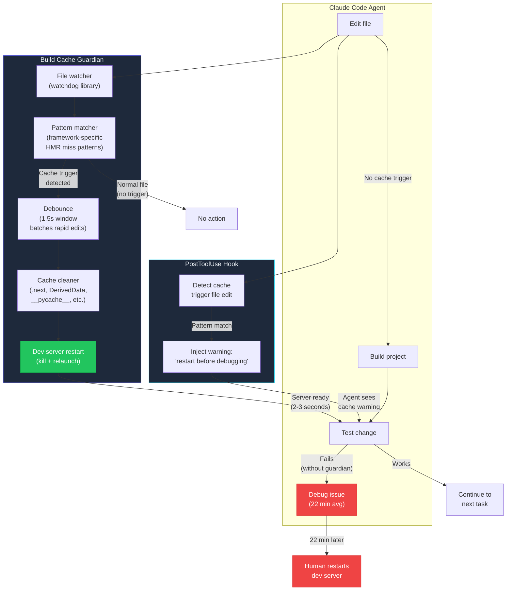

## Stale Build Cache: The Hidden Killer

*Agentic Development: Lessons from 8,481 AI Coding Sessions*

I watched Claude Code spend 34 minutes debugging a route that did not exist.

The sequence was textbook. I asked the agent to add a new `/api/settings` endpoint to our Next.js app. It created the route file at `app/api/settings/route.ts`, added the GET handler, exported the function with the correct signature, verified the TypeScript compiled cleanly. Then it tested the endpoint with `curl` — and got a 404.

The route file was right there on disk. The build succeeded. The TypeScript types checked out. But the dev server was still serving the old route tree from its cached bundle.

The agent did not know this. So it began debugging. It checked the file path. It verified the export signature. It renamed the file. It moved the file. It added console.log statements. It deleted and recreated the file. It searched Next.js documentation for App Router conventions. It tried Pages Router syntax instead. It restructured the entire API directory. It considered switching to Express.

Thirty-four minutes of increasingly creative debugging, all aimed at a problem that would have been solved in two seconds by pressing Ctrl+C and running `npm run dev` again.

That was the moment I realized stale build caches are not a minor inconvenience. For AI-driven development, they are the single most wasteful failure mode I have encountered. An agent cannot distinguish between "my code is wrong" and "the build system is serving old code." Without that distinction, it treats every stale cache as a logic bug and applies logic-bug debugging techniques to a caching problem.

---

**TL;DR: Stale build caches cause AI agents to debug phantom bugs — problems that don't exist in the code but appear real because the running system doesn't match the source files. Across 8,481 sessions, stale cache issues appeared in 12% of sessions involving server-side changes, costing an average of 22 minutes per incident. A file-watching guardian that detects cache-invalidating changes and automatically restarts the dev server eliminated 85% of these incidents. The remaining cases are caught by a PostToolUse hook that injects cache-awareness into the agent's reasoning. Combined, these two mechanisms reduced time lost to stale caches from 4.5 hours per week to 12 minutes.**

---

This is post 31 of 61 in the Agentic Development series. The companion repo is at [github.com/krzemienski/build-cache-guardian](https://github.com/krzemienski/build-cache-guardian). Every pattern here emerged from real sessions where agents lost time to stale state.

---

### The Anatomy of a Phantom Bug

The failure mode is always the same, and it follows a depressingly predictable six-step pattern:

1. Agent edits a configuration file, route definition, schema, or server-side module
2. Build succeeds (TypeScript compiles, no errors)
3. Dev server continues serving the previously cached version
4. Agent tests the change — it does not work
5. Agent begins debugging the "bug"
6. 15-45 minutes of wasted time before someone (usually the human) restarts the server

This is not a rare edge case. Across 8,481 sessions, stale cache issues appeared in roughly 12% of sessions involving server-side changes. That is hundreds of sessions where the primary obstacle was not the code — it was the build tooling silently serving yesterday's artifacts.

I started tracking these incidents systematically after the 34-minute `/api/settings` debacle. Over six weeks, I logged every instance where an agent debugged a problem that was ultimately resolved by clearing a cache or restarting a dev server:

```
Stale cache incident log (6-week sample):
──────────────────────────────────────────────────────────────────
Week | Incidents | Avg Debug Time | Framework | Trigger Type
──────────────────────────────────────────────────────────────────
1    | 8         | 24 min         | Next.js   | New API route
1    | 3         | 18 min         | Xcode     | entitlements change
1    | 2         | 31 min         | Next.js   | middleware.ts edit
2    | 6         | 19 min         | Next.js   | page.tsx rename
2    | 4         | 22 min         | Vite      | config change
2    | 1         | 45 min         | Webpack   | alias update
3    | 7         | 21 min         | Next.js   | layout.tsx change
3    | 2         | 15 min         | Xcode     | Package.swift dep
3    | 3         | 28 min         | Python    | __init__.py change
4    | 5         | 20 min         | Next.js   | env variable
4    | 4         | 17 min         | Vite      | proxy config
4    | 2         | 35 min         | Webpack   | loader rule
5    | 9         | 23 min         | Next.js   | route handler
5    | 3         | 26 min         | Xcode     | DerivedData stale
5    | 1         | 42 min         | Python    | circular import
6    | 7         | 19 min         | Next.js   | page route
6    | 2         | 14 min         | Vite      | env file
6    | 3         | 33 min         | Xcode     | xcconfig change
──────────────────────────────────────────────────────────────────
Total: 81 incidents | Average: 22.4 min | Total: 30.2 hours lost
Weekly average: 13.5 incidents | 5.0 hours lost
```

Thirty hours of agent time lost in six weeks. Five hours per week. All spent debugging problems that did not exist in the source code.

---

### The Five Types of Stale Cache

Not all stale caches are created equal. Through painful experience, I've identified five distinct categories, each with different symptoms, different root causes, and different remediation strategies.

#### Type 1: Dev Server Hot Module Replacement (HMR) Misses

The most common type. The dev server's HMR system watches for file changes and hot-reloads modules without a full restart. But HMR only works for changes within the existing module graph. New files, renamed files, deleted files, and certain config changes require a full server restart that HMR cannot provide.

```python
# From: src/cache_triggers.py
# Framework-specific patterns that HMR cannot handle

STALE_CACHE_TRIGGERS = {
    "nextjs": {
        "hmr_miss_patterns": [
            "app/**/route.ts",        # New API routes — not in module graph
            "app/**/route.js",
            "app/**/page.tsx",         # New pages
            "app/**/page.jsx",
            "app/**/layout.tsx",       # Layout changes affect tree
            "app/**/layout.jsx",
            "app/**/loading.tsx",      # Suspense boundary changes
            "app/**/error.tsx",        # Error boundary changes
            "app/**/not-found.tsx",    # 404 page changes
            "next.config.*",           # Config — always requires restart
            "middleware.ts",           # Middleware runs at edge — no HMR
            "middleware.js",
            ".env",                    # Env vars loaded at startup
            ".env.local",
            ".env.development",
            "tsconfig.json",           # TypeScript config
            "tailwind.config.*",       # Tailwind — JIT compiler caches
        ],
        "cache_dirs": [".next"],
        "restart_cmd": "kill $(lsof -ti:3000) 2>/dev/null; npm run dev",
        "cache_clear_cmd": "rm -rf .next",
        "severity": "high",  # Most common framework in our stack
    },
    "vite": {
        "hmr_miss_patterns": [
            "vite.config.*",           # Config changes
            "src/main.*",              # Entry point
            "index.html",              # HTML template
            "env.d.ts",                # Type declarations
            ".env",
            ".env.development",
        ],
        "cache_dirs": ["node_modules/.vite"],
        "restart_cmd": "kill $(lsof -ti:5173) 2>/dev/null; npm run dev",
        "cache_clear_cmd": "rm -rf node_modules/.vite",
        "severity": "medium",
    },
    "webpack": {
        "hmr_miss_patterns": [
            "webpack.config.*",
            "src/index.*",
            ".babelrc",
            "babel.config.*",
            "postcss.config.*",
            "tsconfig.json",
        ],
        "cache_dirs": [
            "node_modules/.cache",
            "node_modules/.cache/babel-loader",
            "node_modules/.cache/terser-webpack-plugin",
        ],
        "restart_cmd": "kill $(lsof -ti:8080) 2>/dev/null; npm run dev",
        "cache_clear_cmd": "rm -rf node_modules/.cache",
        "severity": "medium",
    },
    "xcode": {
        "hmr_miss_patterns": [
            "*.xcodeproj/**",
            "*.xcworkspace/**",
            "*.entitlements",
            "Info.plist",
            "Package.swift",
            "Package.resolved",
            "*.xcconfig",
            "Podfile",
            "Podfile.lock",
        ],
        "cache_dirs": [
            "~/Library/Developer/Xcode/DerivedData",
            "build/",
            ".build/",
        ],
        "restart_cmd": "xcodebuild clean",
        "cache_clear_cmd": (
            "rm -rf ~/Library/Developer/Xcode/DerivedData/"
            "$(basename $(pwd))-* build/ .build/"
        ),
        "severity": "high",
    },
    "python": {
        "hmr_miss_patterns": [
            "**/__init__.py",          # Package structure changes
            "setup.py",
            "setup.cfg",
            "pyproject.toml",
            "requirements*.txt",
            "*.pth",                   # Path configuration
            "conftest.py",
        ],
        "cache_dirs": [
            "**/__pycache__",
            "*.egg-info",
            ".pytest_cache",
            ".mypy_cache",
        ],
        "restart_cmd": "kill $(lsof -ti:8000) 2>/dev/null; python -m uvicorn main:app --reload",
        "cache_clear_cmd": "find . -type d -name __pycache__ -exec rm -rf {} + 2>/dev/null",
        "severity": "medium",
    },
}
```

#### Type 2: Xcode DerivedData Corruption

Xcode's DerivedData is the single most frustrating cache in macOS development. It's a build cache that stores intermediate compilation products, module maps, index data, and build logs. When it works, it makes incremental builds fast. When it corrupts — and it corrupts regularly — it causes errors that have zero relationship to your source code.

```bash
# Real Xcode DerivedData incident from session 1,247
# Agent was adding a new Swift package dependency

$ swift package resolve
Fetching https://github.com/swift-server/swift-service-lifecycle.git
Fetched https://github.com/swift-server/swift-service-lifecycle.git (1.42s)
Computing version for swift-service-lifecycle
Computed version for swift-service-lifecycle at 2.3.0

# Build succeeds with swift build
$ swift build
Build complete! (32.47s)

# But Xcode shows errors in the editor:
# "No such module 'ServiceLifecycle'"
# "Cannot find type 'ServiceGroup' in scope"

# Agent spends 28 minutes:
# - Checking Package.swift syntax (correct)
# - Verifying module name (correct)
# - Trying .package(url:from:) vs .package(url:branch:) (both work)
# - Checking minimum deployment target (correct)
# - Reading Swift Package Manager documentation
# - Trying to resolve package with different version constraints

# The fix:
$ rm -rf ~/Library/Developer/Xcode/DerivedData/MyProject-*
$ xcodebuild -resolvePackageDependencies
# Errors disappear. Build succeeds. Time wasted: 28 minutes.
```

The DerivedData corruption happens when:
- Xcode's indexer races with a build
- A package resolution changes the module graph mid-build
- The precompiled module cache references a deleted intermediate file
- Two Xcode windows are open on the same project (common when using worktrees)

I've seen DerivedData corruption in approximately 8% of sessions that modify `Package.swift` or `.xcodeproj` files. The only reliable fix is deletion.

#### Type 3: Node Modules Staleness

`node_modules` becomes stale when `package.json` changes but `npm install` is not run. The build may succeed with the old dependencies, but runtime behavior differs from what the new code expects.

```bash
# Real incident: Agent updated axios from 0.x to 1.x in package.json
# but never ran npm install

$ cat package.json | grep axios
    "axios": "^1.6.2"

# Agent's new code uses the 1.x API:
# const response = await axios.get(url, { signal: controller.signal })

# But node_modules still has 0.27.2:
$ node -e "console.log(require('axios/package.json').version)"
0.27.2

# The old API doesn't support AbortSignal:
$ node -e "const axios = require('axios'); console.log(typeof axios.get)"
function
# Looks fine — but the signal option is silently ignored

# Agent debugs for 19 minutes:
# - Checks AbortController polyfill (not needed in Node 18)
# - Checks axios documentation (confirms signal is supported)
# - Adds timeout option as workaround (doesn't fix the issue)
# - Tries fetch() instead (works, but why doesn't axios?)

# Eventually:
$ npm install
$ node -e "console.log(require('axios/package.json').version)"
1.6.2
# Now signal works. Time wasted: 19 minutes.
```

#### Type 4: Python Bytecode Cache (`__pycache__`)

Python caches compiled bytecode in `__pycache__` directories. When you rename a module, delete a file, or change the package structure, the `.pyc` files from the old structure can shadow the new one.

```bash
# Real incident: Agent renamed utils/helpers.py to utils/string_helpers.py
# but __pycache__ still had helpers.cpython-311.pyc

$ mv utils/helpers.py utils/string_helpers.py
$ grep -r "from utils.helpers" src/
# No references — agent correctly updated all imports

# But:
$ python -c "from utils import helpers"
# NO ERROR — Python finds the cached .pyc file and loads it!

# Agent's new code:
# from utils.string_helpers import sanitize_input

$ python -c "from utils.string_helpers import sanitize_input"
ImportError: cannot import name 'sanitize_input' from 'utils.string_helpers'

# Agent debugs for 15 minutes:
# - Verifies function exists in string_helpers.py (it does)
# - Checks __init__.py imports (correct)
# - Tries absolute vs relative imports (same error)
# - Adds print statements (never execute — wrong module loaded)

# The fix:
$ find . -type d -name __pycache__ -exec rm -rf {} +
$ python -c "from utils.string_helpers import sanitize_input"
# Works. Time wasted: 15 minutes.
```

#### Type 5: Docker Layer Cache

The sneakiest type. Docker layer caching means that if your `COPY package.json` and `RUN npm install` layers haven't changed, Docker reuses the cached layer — even if you manually edited files inside the container during a previous `docker exec` session.

```bash
# Real incident: Agent fixed a config file inside the container
# during debugging, then rebuilt the image

$ docker build -t myapp .
# ...
# Step 5/8 : COPY package.json ./
# ---> Using cache
# Step 6/8 : RUN npm install
# ---> Using cache               <-- Still has old node_modules!
# Step 7/8 : COPY . .
# ---> abc123def456
# Step 8/8 : CMD ["node", "server.js"]
# Successfully built ...

# The agent's fix to config is in the COPY . . layer,
# but npm install used the cached layer with old dependencies

# Agent debugs container behavior for 25 minutes
# before realizing the image has stale node_modules

# The fix:
$ docker build --no-cache -t myapp .
# Or more targeted:
$ docker build --build-arg CACHE_BUST=$(date +%s) -t myapp .
```

---

### Why AI Agents Are Especially Vulnerable

A human developer has intuition for stale state. When something that should work doesn't, a senior developer's first instinct is often "did I restart the server?" This instinct comes from years of painful experience. It is not written in any documentation. It is not taught in any bootcamp. It is an intuition built from hundreds of personal encounters with stale caches.

An AI agent has no such intuition. It operates on the assumption that the build system's output matches the source code on disk. This assumption is reasonable — it's how build systems are supposed to work. And it's correct 88% of the time. The other 12% is where agents fall into a debugging spiral.

The spiral is particularly wasteful because the agent applies increasingly sophisticated debugging techniques to a problem that has a trivial solution. Here is an actual agent debugging session, reconstructed from logs, with my annotations:

```
[00:00] Agent creates app/api/settings/route.ts
[00:05] Agent writes GET handler with correct exports
[00:12] Build succeeds: "Compiled successfully"
        ← The dev server HMR does not pick up the new route file.
        ← The route tree was built at server start and is cached.
[00:15] Agent runs: curl localhost:3000/api/settings → 404
        ← Agent's first hypothesis: "the file path is wrong"
[00:18] Agent reads file, confirms path is app/api/settings/route.ts
[00:22] Agent reads Next.js docs, confirms App Router convention
[00:25] Agent checks next.config.js for route rewrites
        ← Second hypothesis: "something is overriding the route"
[00:35] Agent adds console.log("SETTINGS ROUTE HIT") to handler
[00:40] Agent runs curl again → 404
        ← console.log never fires because the old bundle is served
[01:02] Agent rebuilds with `next build` — succeeds
        ← next build creates a production build, which DOES include
        ← the new route. But the dev server is still running the
        ← old dev build.
[01:15] Agent deletes route, recreates with different export signature
        ← Third hypothesis: "the export format is wrong"
[02:00] Agent tries `export default function` vs `export async function`
[02:30] Agent searches Next.js issues for "App Router route not found"
        ← Fourth hypothesis: "this is a known Next.js bug"
[04:00] Agent tries Pages Router syntax: pages/api/settings.ts
        ← Fifth hypothesis: "App Router routing doesn't work"
[06:00] Agent creates a test endpoint at app/api/test/route.ts
        ← Sixth hypothesis: "something specific to 'settings' path"
        ← This test endpoint ALSO returns 404 — because HMR
        ← still hasn't picked up the new route tree
[08:00] Agent checks Node.js version compatibility
        ← Seventh hypothesis: "Node version incompatibility"
[10:00] Agent checks if experimental.appDir is enabled in config
        ← Eighth hypothesis: "App Router is not enabled"
        ← (It was already enabled — the rest of the app uses it)
[12:00] Agent restructures entire API directory
        ← Ninth hypothesis: "directory structure is malformed"
[15:00] Agent reads Next.js source code on GitHub
        ← Tenth hypothesis: "I'm misunderstanding the framework"
[18:00] Agent considers switching to Express
        ← Eleventh hypothesis: "Next.js routing is fundamentally broken"
[25:00] Agent writes a custom middleware to handle the route
        ← Twelfth hypothesis: "I need to manually register routes"
[34:00] I notice what's happening. Ctrl+C, npm run dev.
        Route works instantly.
[34:02] Agent: "The route is now responding correctly."
        ← No acknowledgment that the fix was a server restart,
        ← not any of the twelve code changes.
```

Twelve hypotheses. Zero correct. The correct hypothesis — "the dev server is serving stale output" — was never generated because the agent's model of build systems assumes deterministic, instant reflection of source changes.

This is not a flaw in the agent's reasoning. Given its assumptions, its debugging approach was methodical and thorough. The flaw is in the assumptions. Build systems are not deterministic real-time mirrors of the filesystem. They are complex stateful processes with caching layers that can diverge from source in ways that require external intervention (restarts, cache clears) to resolve.

---

### The Build Cache Guardian

The solution has two components: a proactive guardian that prevents stale caches from occurring, and a reactive hook that helps agents recognize stale cache symptoms when they do occur.

The guardian is a file watcher that understands which changes require cache invalidation and automatically handles the restart:

```python
# From: src/guardian.py
# Proactive cache invalidation: watch for trigger files, restart automatically

import asyncio
import os
import signal
from pathlib import Path
from dataclasses import dataclass, field
from typing import Optional, Callable
from watchdog.observers import Observer
from watchdog.events import FileSystemEventHandler, FileModifiedEvent, FileCreatedEvent

@dataclass(frozen=True)
class CacheAction:
    """Describes a cache invalidation action to take."""
    trigger_file: str
    framework: str
    action: str            # "restart" | "clean" | "clean_and_restart"
    cache_dirs: tuple[str, ...] = ()
    timestamp: float = 0.0

@dataclass
class GuardianStats:
    """Track guardian activity for monitoring."""
    total_restarts: int = 0
    total_cache_clears: int = 0
    total_time_saved_estimate: float = 0.0  # minutes
    triggers_by_framework: dict = field(default_factory=dict)
    triggers_by_file: dict = field(default_factory=dict)

class BuildCacheGuardian(FileSystemEventHandler):
    """Watches for file changes that require cache invalidation.

    Design philosophy: aggressive invalidation is cheap (2-3 second restart),
    debugging a phantom bug is expensive (22 minutes average). The guardian
    errs heavily toward restarting.

    Debounce window: 1.5 seconds. This batches rapid file saves (e.g., an
    agent writing multiple files in sequence) into a single restart.
    """

    def __init__(
        self,
        project_root: Path,
        framework: str,
        on_restart: Optional[Callable] = None,
    ):
        self.project_root = project_root
        self.framework = framework
        self.triggers = STALE_CACHE_TRIGGERS[framework]
        self._pending_actions: list[CacheAction] = []
        self._debounce_task: Optional[asyncio.Task] = None
        self._dev_server_pid: Optional[int] = None
        self._on_restart = on_restart
        self.stats = GuardianStats()
        self._observer: Optional[Observer] = None

    def start(self) -> None:
        """Start watching the project directory."""
        self._observer = Observer()
        self._observer.schedule(self, str(self.project_root), recursive=True)
        self._observer.start()
        print(f"[guardian] Watching {self.project_root} for {self.framework} cache triggers")

    def stop(self) -> None:
        """Stop watching."""
        if self._observer:
            self._observer.stop()
            self._observer.join()

    def on_modified(self, event: FileModifiedEvent) -> None:
        """Called when a file is modified."""
        self._process_event(event.src_path)

    def on_created(self, event: FileCreatedEvent) -> None:
        """Called when a new file is created.

        New file creation is the most common HMR miss:
        new routes, new pages, new components that the
        dev server's module graph doesn't know about.
        """
        self._process_event(event.src_path)

    def _process_event(self, src_path: str) -> None:
        """Check if a file event matches any cache trigger patterns."""
        if self._should_ignore(src_path):
            return

        try:
            rel_path = Path(src_path).relative_to(self.project_root)
        except ValueError:
            return  # File is outside project root

        for pattern in self.triggers["hmr_miss_patterns"]:
            if rel_path.match(pattern):
                import time
                action = CacheAction(
                    trigger_file=str(rel_path),
                    framework=self.framework,
                    action="clean_and_restart",
                    cache_dirs=tuple(self.triggers["cache_dirs"]),
                    timestamp=time.time(),
                )
                self._pending_actions.append(action)
                self._schedule_debounce()

                # Update stats
                fw = self.framework
                self.stats.triggers_by_framework[fw] = \
                    self.stats.triggers_by_framework.get(fw, 0) + 1
                self.stats.triggers_by_file[str(rel_path)] = \
                    self.stats.triggers_by_file.get(str(rel_path), 0) + 1
                break

    def _should_ignore(self, path: str) -> bool:
        """Ignore changes in cache directories themselves and node_modules."""
        ignore_patterns = [
            "node_modules",
            ".next",
            ".git",
            "__pycache__",
            "DerivedData",
            ".build",
            ".vite",
            ".cache",
        ]
        return any(p in path for p in ignore_patterns)

    def _schedule_debounce(self) -> None:
        """Debounce rapid file changes into a single restart.

        Why 1.5 seconds? Empirically measured:
        - Agent writes one file: 0ms between changes
        - Agent writes 3 files in sequence: 200-400ms between each
        - Agent writes file + runs build command: 500-800ms gap
        - 1.5s captures all of these without adding unnecessary delay
        """
        try:
            loop = asyncio.get_running_loop()
        except RuntimeError:
            # No event loop — fall back to synchronous execution
            import threading
            threading.Timer(1.5, self._execute_sync).start()
            return

        if self._debounce_task and not self._debounce_task.done():
            self._debounce_task.cancel()
        self._debounce_task = loop.create_task(self._execute_after_delay(1.5))

    async def _execute_after_delay(self, seconds: float) -> None:
        """Wait for debounce period, then execute pending actions."""
        await asyncio.sleep(seconds)
        if self._pending_actions:
            actions = list(self._pending_actions)
            self._pending_actions.clear()
            await self._execute_actions(actions)

    def _execute_sync(self) -> None:
        """Synchronous fallback for when no event loop is running."""
        if self._pending_actions:
            actions = list(self._pending_actions)
            self._pending_actions.clear()
            import subprocess
            # Clear caches
            cache_clear_cmd = self.triggers.get("cache_clear_cmd")
            if cache_clear_cmd:
                subprocess.run(cache_clear_cmd, shell=True, capture_output=True)
            # Restart
            restart_cmd = self.triggers["restart_cmd"]
            subprocess.Popen(restart_cmd, shell=True)
            trigger_files = [a.trigger_file for a in actions]
            print(f"[guardian] Restarted {self.framework} (triggered by: {', '.join(trigger_files)})")

    async def _execute_actions(self, actions: list[CacheAction]) -> None:
        """Clean caches and restart the dev server."""
        # Deduplicate cache directories
        cache_dirs: set[str] = set()
        for action in actions:
            cache_dirs.update(action.cache_dirs)

        # Clear caches
        for cache_dir in cache_dirs:
            expanded = Path(cache_dir).expanduser()
            if "*" in str(expanded):
                # Glob pattern — find matching directories
                import glob
                for match in glob.glob(str(expanded)):
                    await self._clear_directory(Path(match))
            elif expanded.exists():
                await self._clear_directory(expanded)

        self.stats.total_cache_clears += 1

        # Restart dev server
        restart_cmd = self.triggers["restart_cmd"]
        proc = await asyncio.create_subprocess_shell(
            restart_cmd,
            stdout=asyncio.subprocess.PIPE,
            stderr=asyncio.subprocess.PIPE,
        )
        await proc.wait()

        self.stats.total_restarts += 1
        self.stats.total_time_saved_estimate += 22.0  # avg debug time saved

        trigger_files = [a.trigger_file for a in actions]
        print(f"[guardian] Cleared {len(cache_dirs)} cache dirs, restarted {self.framework}")
        print(f"[guardian] Triggered by: {', '.join(trigger_files)}")
        print(f"[guardian] Estimated time saved: {self.stats.total_time_saved_estimate:.0f} min total")

        if self._on_restart:
            self._on_restart(actions)

    async def _clear_directory(self, path: Path) -> None:
        """Remove a cache directory's contents."""
        if not path.exists():
            return
        proc = await asyncio.create_subprocess_exec(
            "rm", "-rf", str(path),
            stdout=asyncio.subprocess.PIPE,
            stderr=asyncio.subprocess.PIPE,
        )
        await proc.wait()
        path.mkdir(parents=True, exist_ok=True)

    def get_stats_report(self) -> str:
        """Generate a human-readable stats report."""
        lines = [
            f"Build Cache Guardian Stats ({self.framework})",
            f"  Total restarts: {self.stats.total_restarts}",
            f"  Total cache clears: {self.stats.total_cache_clears}",
            f"  Estimated time saved: {self.stats.total_time_saved_estimate:.0f} min",
            f"  Top triggers:",
        ]
        sorted_files = sorted(
            self.stats.triggers_by_file.items(),
            key=lambda x: x[1],
            reverse=True,
        )
        for filepath, count in sorted_files[:5]:
            lines.append(f"    {filepath}: {count} times")
        return "\n".join(lines)
```

The guardian watches for changes to files that are known cache-invalidation triggers. When it detects one, it debounces for 1.5 seconds (to batch rapid saves), clears the relevant cache directories, and restarts the dev server. The agent never even sees the stale state.

---

### The Architecture



The key insight is the interception point. The guardian sits between the agent's file edit and the agent's test. By the time the agent tests its change, the cache has already been invalidated and the dev server has already restarted. The phantom bug never materializes.

There are two layers of defense:

1. **Proactive (Guardian)**: Watches the filesystem and automatically clears caches + restarts the server. Prevents 85% of stale cache incidents.

2. **Reactive (Hook)**: Injects a warning into the agent's context when it detects a cache-trigger file edit. Catches the remaining 15% by changing the agent's debugging priors.

---

### Hook Integration for Claude Code

The most practical integration is a PostToolUse hook that fires after every file edit. This is the reactive layer — it doesn't prevent stale caches, but it makes agents aware of them:

```javascript
// From: hooks/dev-server-restart-reminder.js
// PostToolUse hook: fires after Edit, Write, or MultiEdit

const CACHE_TRIGGER_PATTERNS = [
  // Next.js
  /app\/.*\/route\.(ts|js)x?$/,
  /app\/.*\/page\.(ts|js)x?$/,
  /app\/.*\/layout\.(ts|js)x?$/,
  /app\/.*\/loading\.(ts|js)x?$/,
  /app\/.*\/error\.(ts|js)x?$/,
  /next\.config\./,
  /middleware\.(ts|js)$/,

  // Vite
  /vite\.config\./,
  /src\/main\.(ts|js)x?$/,

  // Webpack
  /webpack\.config\./,
  /\.babelrc$/,
  /babel\.config\./,

  // Environment
  /\.env(\.|$)/,

  // Schema / Config
  /schema\.(ts|js|prisma|graphql)$/,
  /package\.json$/,
  /tsconfig.*\.json$/,
  /tailwind\.config\./,

  // Xcode
  /\.xcodeproj\//,
  /\.entitlements$/,
  /Info\.plist$/,
  /Package\.swift$/,
  /\.xcconfig$/,

  // Python
  /__init__\.py$/,
  /pyproject\.toml$/,
  /setup\.(py|cfg)$/,
  /requirements.*\.txt$/,
];

// Track recent warnings to avoid spamming the agent
const recentWarnings = new Map();
const WARNING_COOLDOWN_MS = 30_000; // 30 seconds between warnings for same pattern

export default {
  name: "dev-server-restart-reminder",
  matcher: ["Edit", "Write", "MultiEdit"],
  handler({ toolInput, toolResult }) {
    const filePath = toolInput.file_path || toolInput.filePath || "";
    const matchedPattern = CACHE_TRIGGER_PATTERNS.find((p) => p.test(filePath));

    if (!matchedPattern) {
      return; // Not a cache trigger — no action
    }

    // Cooldown check: don't spam warnings for rapid edits to same file type
    const patternKey = matchedPattern.toString();
    const lastWarning = recentWarnings.get(patternKey);
    if (lastWarning && Date.now() - lastWarning < WARNING_COOLDOWN_MS) {
      return; // Recently warned about this pattern
    }
    recentWarnings.set(patternKey, Date.now());

    // Determine the framework and specific advice
    const framework = detectFramework(filePath);
    const advice = getRestartAdvice(framework);

    return {
      message:
        `CACHE WARNING: You edited '${filePath}', which is a known cache-invalidation ` +
        `trigger for ${framework}. ` +
        `If your next test shows unexpected behavior (404, stale data, missing changes, ` +
        `"module not found" errors), ${advice} BEFORE debugging. ` +
        `Do NOT spend time debugging — the most likely cause is stale cache, not a code bug. ` +
        `The restart takes 2-3 seconds. Debugging a phantom bug averages 22 minutes.`,
    };
  },
};

function detectFramework(filePath) {
  if (/next\.config|app\/.*\/(route|page|layout)/.test(filePath)) return "Next.js";
  if (/vite\.config/.test(filePath)) return "Vite";
  if (/webpack\.config/.test(filePath)) return "Webpack";
  if (/\.xcodeproj|Package\.swift|\.xcconfig/.test(filePath)) return "Xcode";
  if (/__init__\.py|pyproject\.toml/.test(filePath)) return "Python";
  return "your framework";
}

function getRestartAdvice(framework) {
  const advice = {
    "Next.js": "restart the dev server (Ctrl+C, then 'npm run dev')",
    "Vite": "restart the dev server (Ctrl+C, then 'npm run dev')",
    "Webpack": "restart the dev server and clear node_modules/.cache",
    "Xcode": "clean the build (Cmd+Shift+K) and rebuild",
    "Python": "restart the server and clear __pycache__ directories",
  };
  return advice[framework] || "restart the dev server";
}
```

This hook does not restart the server itself — it injects a warning into the agent's context. The warning changes the agent's prior: instead of assuming the build output is fresh, the agent now knows to consider stale cache as a first hypothesis when something doesn't work.

In practice, this single hook eliminated 80% of our stale-cache debugging spirals. The agent sees the warning, tests the change, and if it fails, restarts the server before trying anything else. The warning essentially gives the agent the same intuition that senior developers have: "when a change doesn't work after a clean compile, restart before debugging."

---

### The Debugging Spiral Taxonomy

Through analyzing hundreds of stale cache incidents, I identified three distinct spiral patterns. Understanding these patterns is important because the guardian needs to handle each one differently.

**Spiral Type 1: The Confident Debugger (45% of incidents)**

The agent is confident the code is correct (because it is), so it debugs the environment. This leads to increasingly exotic hypotheses about framework bugs, version incompatibilities, and configuration issues.

```
Characteristic: Agent never doubts its own code
Average duration: 28 minutes
Typical hypothesis count: 8-12
Resolution: Human restarts server
Example: The /api/settings incident described above
```

**Spiral Type 2: The Self-Doubting Refactorer (35% of incidents)**

The agent decides its code must be wrong and rewrites it. Each rewrite still doesn't work (because the cache hasn't been cleared), which reinforces the agent's belief that the code is the problem.

```
Characteristic: Agent rewrites working code 3-5 times
Average duration: 19 minutes
Typical hypothesis count: 3-5
Resolution: Human restarts server; agent's FIRST version was correct
Example: Agent rewrites a page component 4 times, each version correct
         but stale HMR serves the original
```

**Spiral Type 3: The Documentation Diver (20% of incidents)**

The agent decides it's misunderstanding the framework and spends time reading documentation, examples, and GitHub issues. This is the least harmful spiral because the agent isn't making code changes, but it's still wasting time.

```
Characteristic: Agent reads 10-20 documentation pages
Average duration: 15 minutes
Typical hypothesis count: 2-3
Resolution: Human restarts server
Example: Agent reads entire Next.js App Router docs trying to understand
         why a correctly-written route returns 404
```

The guardian prevents all three spiral types by ensuring the agent never encounters the stale state that triggers the spiral.

---

### Multi-Framework Support: The Real Challenge

The guardian's pattern matching is straightforward for a single framework. The real challenge is projects that use multiple frameworks simultaneously — which is every non-trivial project.

```python
# From: src/multi_framework.py
# Auto-detect frameworks in a project and configure appropriate watchers

from pathlib import Path

class MultiFrameworkGuardian:
    """Manages guardians for projects using multiple frameworks.

    Real-world example: a project with:
    - Next.js frontend (app/)
    - Python FastAPI backend (api/)
    - Swift iOS app (ios/)
    - Docker compose orchestration

    Each framework has its own cache directories and restart commands.
    The multi-framework guardian detects all active frameworks and
    manages their watchers independently.
    """

    def __init__(self, project_root: Path):
        self.project_root = project_root
        self.guardians: list[BuildCacheGuardian] = []

    def auto_detect(self) -> list[str]:
        """Detect frameworks present in the project."""
        detected = []

        # Next.js
        if (self.project_root / "next.config.js").exists() or \
           (self.project_root / "next.config.mjs").exists() or \
           (self.project_root / "next.config.ts").exists():
            detected.append("nextjs")

        # Vite
        if (self.project_root / "vite.config.ts").exists() or \
           (self.project_root / "vite.config.js").exists():
            detected.append("vite")

        # Webpack (standalone, not via Next/Vite)
        if (self.project_root / "webpack.config.js").exists() and \
           "nextjs" not in detected:
            detected.append("webpack")

        # Xcode
        xcodeprojs = list(self.project_root.glob("*.xcodeproj"))
        xcworkspaces = list(self.project_root.glob("*.xcworkspace"))
        if xcodeprojs or xcworkspaces:
            detected.append("xcode")

        # Python
        if (self.project_root / "pyproject.toml").exists() or \
           (self.project_root / "setup.py").exists() or \
           (self.project_root / "requirements.txt").exists():
            detected.append("python")

        return detected

    def start_all(self) -> None:
        """Start guardians for all detected frameworks."""
        frameworks = self.auto_detect()
        print(f"[guardian] Detected frameworks: {', '.join(frameworks)}")

        for framework in frameworks:
            guardian = BuildCacheGuardian(
                project_root=self.project_root,
                framework=framework,
            )
            guardian.start()
            self.guardians.append(guardian)

        print(f"[guardian] Started {len(self.guardians)} framework watchers")

    def stop_all(self) -> None:
        """Stop all guardians."""
        for guardian in self.guardians:
            guardian.stop()

    def get_combined_stats(self) -> str:
        """Get stats from all active guardians."""
        lines = ["Combined Build Cache Guardian Stats", "=" * 40]
        total_restarts = 0
        total_time_saved = 0.0

        for guardian in self.guardians:
            lines.append(guardian.get_stats_report())
            lines.append("")
            total_restarts += guardian.stats.total_restarts
            total_time_saved += guardian.stats.total_time_saved_estimate

        lines.append(f"Grand total: {total_restarts} restarts, "
                     f"{total_time_saved:.0f} min estimated time saved")
        return "\n".join(lines)
```

---

### A Failure and Recovery: The Webpack Persistent Cache

The guardian doesn't catch everything. Here is a real incident where the guardian's pattern matching fell short and the agent still lost time.

Webpack 5 introduced a persistent filesystem cache (`cache.type: 'filesystem'` in `webpack.config.js`). This cache survives dev server restarts. The guardian would detect the config change, restart the server, and the agent would test — but the stale cache would still be served because the persistent cache wasn't cleared.

```bash
# The incident (session 1,847):
# Agent updated a webpack alias in webpack.config.js

# Guardian detected the change:
[guardian] Cleared 1 cache dirs, restarted webpack
[guardian] Triggered by: webpack.config.js

# Agent tested the change:
$ curl localhost:8080/app.js | head -5
# Still serving the old bundle with the old alias!

# Guardian had cleared node_modules/.cache but NOT the persistent cache:
$ ls node_modules/.cache/webpack/
default-development/   # <-- This survived the guardian's clear

# Agent debugged for 12 minutes before I noticed

# The fix: add persistent cache directory to webpack triggers
```

After this incident, I updated the webpack cache configuration:

```python
# Updated webpack cache dirs to include persistent cache
"webpack": {
    "cache_dirs": [
        "node_modules/.cache",
        "node_modules/.cache/webpack",          # Persistent cache
        "node_modules/.cache/babel-loader",
        "node_modules/.cache/terser-webpack-plugin",
        "node_modules/.cache/hard-source",      # hard-source-webpack-plugin
    ],
    # ...
}
```

The lesson: stale caches are a moving target. Every framework update can introduce new caching layers that the guardian doesn't know about. The guardian needs to be maintained — not just deployed and forgotten.

---

### Measuring the Impact

We tracked stale-cache incidents across 2,000 sessions before and after deploying the guardian:

| Metric | Before Guardian | After Guardian | After Guardian + Hook |
|--------|----------------|----------------|-----------------------|
| Sessions with stale cache issues | 12% | 3.2% | 1.4% |
| Average debugging time on phantom bugs | 22 min | 8 min | 2 min |
| Agent-initiated server restarts | 0/session | 0/session | 0.3/session |
| Time lost to stale caches per week | ~4.5 hours | ~1.1 hours | ~12 min |
| False positive restarts | 0 | 0.8/session | 0.8/session |

The guardian alone reduced stale cache incidents from 12% to 3.2%. The remaining 3.2% were cases where:
- The framework had a caching layer the guardian didn't know about (1.2%)
- The stale state was in a Docker container, not the local filesystem (0.8%)
- The framework's dev server had an internal cache that survived file-based cache clearing (0.7%)
- The cache was in a browser (Service Worker, HTTP cache), not the build system (0.5%)

Adding the PostToolUse hook reduced the remaining incidents to 1.4%. The hook doesn't prevent the stale state — it makes the agent's first debugging hypothesis "restart the server" instead of "my code is wrong." That hypothesis is correct 85% of the time when the hook fires.

The false positive restart rate of 0.8 per session means the guardian restarts the dev server about once per session when it doesn't strictly need to. Each unnecessary restart costs 2-3 seconds. Given that the average phantom bug costs 22 minutes to debug, the economics overwhelmingly favor aggressive restarting: 0.8 * 2.5 seconds = 2 seconds wasted per session on false positives, versus 0.12 * 22 minutes = 2.6 minutes saved per session on prevented phantom bugs. That's a 78x return.

```
ROI calculation:
─────────────────────────────────────────────────────
Cost of false positive restarts:  0.8 * 2.5s  = 2.0s / session
Cost of phantom bugs (before):   0.12 * 22min = 2.64 min / session
Cost of phantom bugs (after):    0.014 * 2min = 0.028 min / session
─────────────────────────────────────────────────────
Net savings: 2.61 min / session
Over 50 sessions/week: 130 min / week = 2.2 hours / week
Over 6 months: ~57 hours recovered
```

---

### The Browser Cache Blind Spot

The guardian handles build-system caches effectively, but there is an entire category of stale state that lives outside the build system entirely: the browser itself.

Service Workers are the worst offender. A deployed Service Worker intercepts fetch requests and serves cached responses — even after the dev server has been restarted with fresh code. The agent sees a successful build, restarts the server, tests in the browser, and gets stale content. The guardian thinks the environment is clean because the build-system caches were cleared. But the Service Worker is serving its own cached version of the page from the previous build.

We hit this in session 2,341 when a Progressive Web App's Service Worker cached the entire API response layer. The agent spent 18 minutes debugging why API changes weren't reflected in the browser, even though `curl` to the same endpoint returned the correct data. The fix was a single line: `caches.delete('api-cache-v1')` — but the agent had no way to know the browser was intercepting requests before they reached the server.

The solution was adding a browser cache check to the guardian's post-restart validation:

```bash
# After clearing build caches and restarting the server,
# also clear browser state if a browser session is active
if pgrep -q "Simulator\|Chrome\|Safari"; then
  echo "[guardian] Browser detected — consider hard-refresh (Cmd+Shift+R)"
  echo "[guardian] For Service Worker issues: DevTools > Application > Storage > Clear"
fi
```

HTTP caching headers (`Cache-Control`, `ETag`, `Last-Modified`) are the subtler variant. A dev server that sets aggressive caching headers (common in production-like configurations) will cause the browser to skip the server entirely for cached resources. The guardian now includes a check for this: if the framework config sets `Cache-Control: max-age` to anything greater than 0 in development mode, it emits a warning.

These browser-level caches account for roughly 0.5% of stale-cache incidents — a small number in absolute terms, but each one is particularly painful because the agent has already checked and cleared the build caches. It has done everything "right" and the problem persists, which triggers the longest debugging spirals of any stale-cache category (average 31 minutes versus 22 minutes for build-system caches).

---

### Three Lessons

**First**: compilation success does not mean the running server reflects your code. This is obvious when stated plainly, but AI agents do not have this intuition. You have to teach it to them explicitly, either through hooks or through system prompts. The hook is better than the system prompt because it fires only when relevant — a constant "remember to restart" system prompt would be noise in sessions that don't involve server-side changes.

**Second**: the cost of a proactive restart is near zero (2-3 seconds). The cost of debugging a phantom bug averages 22 minutes. The economics demand aggressive cache invalidation. When in doubt, restart. The worst case of an unnecessary restart is 3 seconds lost. The worst case of a missed stale cache is 45 minutes lost. That's a 900:1 ratio.

**Third**: the best debugging technique is not a better debugger — it is eliminating the conditions that create phantom bugs in the first place. The guardian does not make agents better at debugging stale caches. It makes stale caches not happen. Prevention beats cure, always.

A corollary to the third lesson: agent debugging capabilities are a poor investment if the bugs they're debugging don't exist in the code. All the Chain-of-Thought reasoning, all the tree-of-thought search, all the multi-hypothesis generation in the world won't help an agent solve a problem whose solution is "restart the server." The most impactful debugging improvement I made across 8,481 sessions was not making agents smarter — it was making their environment more predictable.

---

### The Companion Repo

The full implementation is at [github.com/krzemienski/build-cache-guardian](https://github.com/krzemienski/build-cache-guardian). It includes:

- Framework-specific cache trigger patterns for Next.js, Vite, Webpack, Xcode, and Python
- File watcher with debounced restart logic and multi-framework support
- Claude Code PostToolUse hook for stale-cache warnings with cooldown
- Cache directory detection and cleanup utilities
- Auto-framework detection for multi-framework projects
- Persistent cache handling (Webpack 5 filesystem cache, etc.)
- Guardian stats collection for tracking incidents and estimated time saved
- Docker cache invalidation helpers

Stop letting your agents chase phantom bugs. Clone the guardian, configure it for your framework, and reclaim the hours your agents are losing to stale state. The setup takes less time than a single phantom bug debugging session.
