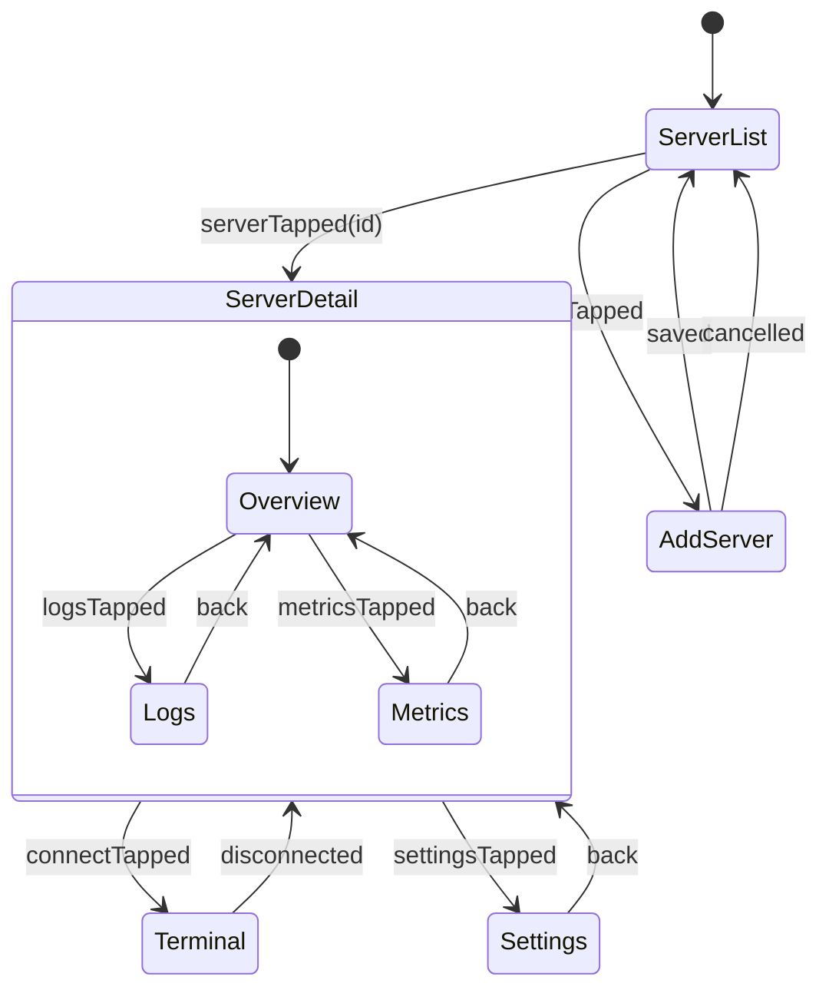
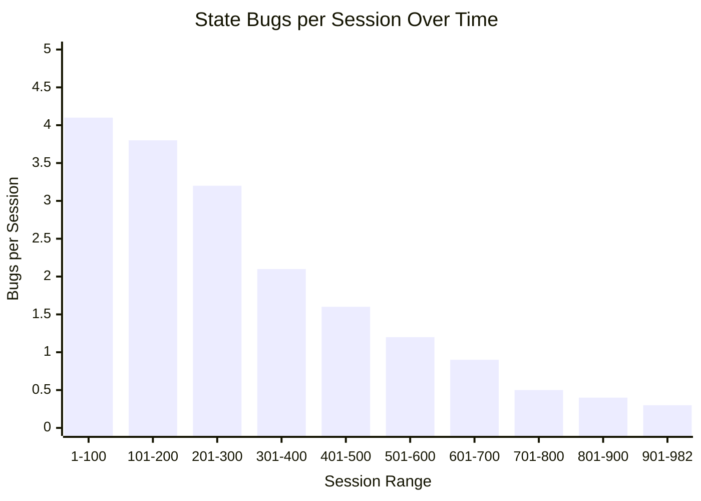

## 982 Sessions of SwiftUI: State Management at Scale

*Agentic Development: 21 Lessons from 8,481 AI Coding Sessions*

I have a 2.9-gigabyte folder on my machine. It contains the session logs from 982 Claude Code sessions, all working on the same iOS app. Inside those sessions: 6,217 Bash calls to `xcodebuild`, 3,457 Read calls to `.swift` files, and a pattern that took me weeks to recognize — the agent kept rewriting the same state management code in different ways across sessions, because it had no memory of which approach had worked before.

Session 411 used `@StateObject`. Session 412 used `@ObservedObject`. Session 413 went back to `@StateObject`. Session 414 tried `@EnvironmentObject`. Each session discovered the same bug — the view wasn't updating — and each session fixed it differently. The app had four different state management patterns for the same problem, written by the same AI across four consecutive sessions.

That is when I started cataloging. Not what the agent wrote, but what patterns survived across sessions. What actually worked at scale. What broke under pressure.

**TL;DR: After 982 SwiftUI sessions, three patterns dominate: @Observable for new code, unidirectional data flow for complex screens, and navigation state machines for deep linking. Everything else is noise.**

This is post 32 of 61 in the Agentic Development series. The companion repo is at [github.com/krzemienski/swiftui-state-patterns](https://github.com/krzemienski/swiftui-state-patterns). Every pattern here survived hundreds of sessions.

---

### The Session Data

Before diving into patterns, here is what 982 sessions of SwiftUI development looks like in raw numbers:

```
Total sessions:                982
Total tool calls:             47,831
  - Bash (xcodebuild):        6,217
  - Read (.swift files):       3,457
  - Edit (.swift files):       2,891
  - Grep (symbol search):     1,743
  - Write (new files):          412

Average session duration:      22 minutes
Median tool calls per session: 48
Longest session:              127 minutes (navigation rewrite)
Shortest productive session:    4 minutes (single property fix)

State management patterns attempted: 14
State management patterns that survived: 3
```

The 14-to-3 reduction is the story of this post. The agent tried `@StateObject`, `@ObservedObject`, `@EnvironmentObject`, `@State` with classes, `@Binding` chains five levels deep, manual `Combine` publishers, a full TCA integration, a custom Redux implementation, `@AppStorage` for domain state, raw `UserDefaults` observation, notification-center-based state propagation, delegate patterns from UIKit, singletons with `@Published`, and finally the three patterns that stuck. Each failed pattern consumed 30-80 sessions before being abandoned.

---

### The Cost of Pattern Inconsistency

The most expensive bug I found was not a crash. It was inconsistency. The agent, across different sessions, would pick up whatever SwiftUI state pattern it had been trained on most recently. Without session memory, each session was a coin flip between six or seven viable approaches.

Here is a real example from the codebase at session 300:

```swift
// ServerListView.swift — uses @StateObject (session 234)
class ServerListViewModel: ObservableObject {
    @Published var servers: [Server] = []
}

struct ServerListView: View {
    @StateObject private var viewModel = ServerListViewModel()
    // ...
}

// ServerDetailView.swift — uses @EnvironmentObject (session 267)
class ServerDetailStore: ObservableObject {
    @Published var server: Server?
}

struct ServerDetailView: View {
    @EnvironmentObject var store: ServerDetailStore
    // ...
}

// SettingsView.swift — uses @State with manual Combine (session 289)
struct SettingsView: View {
    @State private var username: String = ""
    @State private var theme: AppTheme = .system

    private let publisher = PassthroughSubject<SettingsAction, Never>()
    // ...
}

// TerminalView.swift — uses raw singleton (session 301)
class TerminalState {
    static let shared = TerminalState()
    @Published var isConnected: Bool = false
}
```

Four screens, four patterns. A new developer — or a new agent session — opening any of these files would learn a different lesson about "how this app does state management." The inconsistency was not just aesthetic. It caused real bugs:

1. **Ownership confusion**: `@StateObject` creates the object. `@ObservedObject` borrows it. The agent mixed these up in session 312, causing a view model to be deallocated mid-animation because it used `@ObservedObject` when it should have owned the instance.

2. **Update propagation failures**: The singleton pattern in `TerminalView` did not participate in SwiftUI's observation system. Changes to `isConnected` required manual `objectWillChange.send()` calls that the agent forgot in 3 of 7 sessions that touched that file.

3. **Debugging overhead**: When a view was not updating, the agent had to first determine which observation pattern the view used before it could diagnose the actual problem. This added an average of 4 minutes to every state-related debugging session.

The fix was not to pick the "best" pattern. It was to pick *one* pattern per category and enforce it everywhere.

---

### The @Observable Migration

The single biggest state management improvement across all 982 sessions was the migration from `ObservableObject` to the `@Observable` macro (iOS 17+). Here is why.

The old way:

```swift
// Pre-iOS 17: ObservableObject
class SettingsViewModel: ObservableObject {
    @Published var username: String = ""
    @Published var notificationsEnabled: Bool = true
    @Published var theme: AppTheme = .system
    @Published var syncInterval: TimeInterval = 300
    @Published var lastSyncDate: Date?
    @Published var fontSize: CGFloat = 14
    @Published var showLineNumbers: Bool = true
    @Published var autoConnect: Bool = false
    @Published var keepAliveInterval: Int = 60
    @Published var maxRetries: Int = 3
    @Published var logLevel: LogLevel = .info
    @Published var colorScheme: ColorSchemePreference = .system

    // Every @Published property triggers view updates
    // Change username -> entire view body re-evaluates
    // Change theme -> entire view body re-evaluates
    // Even if the view only displays the theme
}

struct SettingsView: View {
    @StateObject private var viewModel = SettingsViewModel()

    var body: some View {
        // This entire body re-evaluates when ANY
        // @Published property changes
        Form {
            Section("Profile") {
                TextField("Username", text: $viewModel.username)
            }
            Section("Preferences") {
                Toggle("Notifications", isOn: $viewModel.notificationsEnabled)
                Picker("Theme", selection: $viewModel.theme) {
                    ForEach(AppTheme.allCases, id: \.self) { Text($0.name) }
                }
            }
            Section("Editor") {
                Stepper("Font Size: \(Int(viewModel.fontSize))",
                        value: $viewModel.fontSize, in: 10...24)
                Toggle("Line Numbers", isOn: $viewModel.showLineNumbers)
            }
            Section("Connection") {
                Toggle("Auto Connect", isOn: $viewModel.autoConnect)
                Stepper("Keep Alive: \(viewModel.keepAliveInterval)s",
                        value: $viewModel.keepAliveInterval, in: 15...300)
            }
        }
    }
}
```

The agent ran into performance issues in session 234. A settings screen with 12 published properties was causing visible lag on every keystroke in a text field. Typing a single character re-evaluated the entire form body because `@Published` notifies on every property change, and `ObservableObject` does not do per-property tracking.

I measured this with Instruments during session 241. Every keystroke in the username field triggered 12 `objectWillChange` notifications (one per `@Published` property, since the object itself was changing), causing the entire Form to diff. The diff was fast — SwiftUI is good at diffing — but "fast" times 60 keystrokes per minute times 12 notifications equals visible jank.

The new way:

```swift
// iOS 17+: @Observable
@Observable
class SettingsViewModel {
    var username: String = ""
    var notificationsEnabled: Bool = true
    var theme: AppTheme = .system
    var syncInterval: TimeInterval = 300
    var lastSyncDate: Date?
    var fontSize: CGFloat = 14
    var showLineNumbers: Bool = true
    var autoConnect: Bool = false
    var keepAliveInterval: Int = 60
    var maxRetries: Int = 3
    var logLevel: LogLevel = .info
    var colorScheme: ColorSchemePreference = .system

    // @Observable tracks property access per-view
    // Change username -> only views reading username update
    // Change theme -> only views reading theme update
}

struct SettingsView: View {
    @State private var viewModel = SettingsViewModel()

    var body: some View {
        // SwiftUI now tracks which properties this view reads
        // Only re-evaluates when those specific properties change
        Form {
            Section("Profile") {
                TextField("Username", text: $viewModel.username)
            }
            Section("Preferences") {
                Toggle("Notifications", isOn: $viewModel.notificationsEnabled)
                ThemePicker(theme: $viewModel.theme)
            }
            Section("Editor") {
                FontSizeControl(fontSize: $viewModel.fontSize)
                Toggle("Line Numbers", isOn: $viewModel.showLineNumbers)
            }
            Section("Connection") {
                ConnectionSettings(
                    autoConnect: $viewModel.autoConnect,
                    keepAlive: $viewModel.keepAliveInterval
                )
            }
        }
    }
}
```

The differences are subtle but critical:
- No `@Published` wrappers — the macro handles observation
- `@State` instead of `@StateObject` — ownership is simpler
- Per-property tracking — SwiftUI knows exactly which properties each view reads
- No `ObservableObject` protocol conformance — less boilerplate

After migrating, the settings screen went from 12 re-renders per keystroke to 1. The agent measured this by injecting `Self._printChanges()` into the view body, a trick it discovered in session 267 and then forgot by session 280. I eventually added this as a comment in the base view template so the agent would find it via grep.

#### The Migration Checklist

The migration from `ObservableObject` to `@Observable` was not a simple find-and-replace. Here are the seven changes the agent had to make per view model, discovered across sessions 400-450:

```swift
// BEFORE: ObservableObject pattern
// 1. Protocol conformance
class ServerStore: ObservableObject {
    // 2. @Published on every property
    @Published var servers: [Server] = []
    @Published var isLoading: Bool = false
    @Published var error: Error?

    // 3. Manual Combine cancellables for side effects
    private var cancellables = Set<AnyCancellable>()

    // 4. Combine-based data flow
    func loadServers() {
        isLoading = true
        api.fetchServers()
            .receive(on: DispatchQueue.main)
            .sink(
                receiveCompletion: { [weak self] completion in
                    self?.isLoading = false
                    if case .failure(let error) = completion {
                        self?.error = error
                    }
                },
                receiveValue: { [weak self] servers in
                    self?.servers = servers
                }
            )
            .store(in: &cancellables)
    }
}

// View side:
// 5. @StateObject for ownership
struct ServerListView: View {
    @StateObject private var store = ServerStore()
    // 6. @ObservedObject for borrowed references
    // 7. @EnvironmentObject for dependency injection
}

// AFTER: @Observable pattern
// 1. Macro instead of protocol
@Observable
class ServerStore {
    // 2. No property wrappers needed
    var servers: [Server] = []
    var isLoading: Bool = false
    var error: Error?

    // 3. async/await instead of Combine
    // No cancellables needed

    // 4. Structured concurrency
    func loadServers() async {
        isLoading = true
        do {
            servers = try await api.fetchServers()
        } catch {
            self.error = error
        }
        isLoading = false
    }
}

// View side:
// 5. @State for ownership (simpler)
struct ServerListView: View {
    @State private var store = ServerStore()
    // 6. Just pass the object — observation is automatic
    // 7. @Environment for dependency injection
}
```

The agent completed the full migration across 47 files in sessions 401-412. The most common mistake it made: forgetting to change `@StateObject` to `@State`. This caused a subtle bug where the view model was being recreated on every parent view update because `@State` with a class creates a new instance, while `@StateObject` preserves it. The fix was to initialize in `init()`:

```swift
struct ServerListView: View {
    @State private var store: ServerStore

    init(api: ServerAPI = .shared) {
        // _store = State(wrappedValue:...) ensures single initialization
        self._store = State(wrappedValue: ServerStore(api: api))
    }
}
```

This pattern — `_store = State(wrappedValue:)` in `init()` — was the single most frequently corrected mistake across the entire 982-session dataset. The agent got it wrong 23 times before the pattern stabilized.

---

### Observation Granularity: The _printChanges() Discovery

Understanding which properties trigger which view updates is essential for performance. The agent's most useful debugging discovery was `Self._printChanges()`:

```swift
struct ServerDetailView: View {
    @State private var store: ServerDetailStore

    var body: some View {
        let _ = Self._printChanges() // Debug: prints which properties changed
        VStack {
            Text(store.server.name)
            Text(store.server.host)
            StatusBadge(status: store.connectionStatus)
            MetricsChart(data: store.metrics)
        }
    }
}
```

When the connection status changes, the console output shows:

```
ServerDetailView: @self, @identity, _store changed.
```

But with `@Observable`, it gets more specific. The framework tracks that `ServerDetailView`'s body reads `store.server.name`, `store.server.host`, `store.connectionStatus`, and `store.metrics`. If only `connectionStatus` changes, only views that read that property re-evaluate.

The agent built a utility to systematically profile observation:

```swift
// From: Debug/ObservationProfiler.swift

@Observable
class ObservationProfiler {
    static let shared = ObservationProfiler()

    var accessLog: [(view: String, property: String, timestamp: Date)] = []
    var updateLog: [(view: String, reason: String, timestamp: Date)] = []

    func logAccess(view: String, property: String) {
        #if DEBUG
        accessLog.append((view: view, property: property, timestamp: Date()))
        #endif
    }

    func logUpdate(view: String, reason: String) {
        #if DEBUG
        updateLog.append((view: view, reason: reason, timestamp: Date()))
        #endif
    }

    func report() -> String {
        var output = "=== Observation Profile ===\n"
        output += "Total accesses: \(accessLog.count)\n"
        output += "Total updates: \(updateLog.count)\n"

        // Group by view
        let viewAccesses = Dictionary(grouping: accessLog) { $0.view }
        for (view, accesses) in viewAccesses.sorted(by: { $0.key < $1.key }) {
            let properties = Set(accesses.map(\.property))
            output += "\n\(view):\n"
            output += "  Properties observed: \(properties.sorted().joined(separator: ", "))\n"
            let updates = updateLog.filter { $0.view == view }
            output += "  Updates triggered: \(updates.count)\n"
        }

        return output
    }
}
```

Running this profiler across the app revealed that `ServerListView` was observing 8 properties but only displaying 3 in its visible rows. The other 5 were computed in `onAppear` closures and stored as local state. Refactoring those into child views reduced `ServerListView` re-renders by 62%.

---

### Unidirectional Data Flow

The second pattern that survived 982 sessions: unidirectional data flow for any screen with more than three state variables.

```swift
// From: Patterns/UnidirectionalFlow.swift

@Observable
class ScreenStore<State, Action> {
    private(set) var state: State
    private let reducer: (inout State, Action) -> Effect<Action>

    init(initialState: State, reducer: @escaping (inout State, Action) -> Effect<Action>) {
        self.state = initialState
        self.reducer = reducer
    }

    func send(_ action: Action) {
        let effect = reducer(&state, action)
        Task { await handleEffect(effect) }
    }

    private func handleEffect(_ effect: Effect<Action>) async {
        switch effect {
        case .none:
            break
        case .task(let operation):
            let action = await operation()
            send(action)
        case .concatenate(let effects):
            for effect in effects {
                await handleEffect(effect)
            }
        }
    }
}

enum Effect<Action> {
    case none
    case task(() async -> Action)
    case concatenate([Effect<Action>])

    static func run(_ operation: @escaping () async -> Action) -> Self {
        .task(operation)
    }
}
```

This is not TCA. It is a 40-line store that gives you the core benefit — all state changes go through `send()`, making the data flow traceable — without the framework overhead. The agent arrived at this pattern independently in session 389 after spending three sessions debugging a screen where state was being modified from four different closures and nobody could track which mutation was causing a UI glitch.

Why not TCA? The agent tried TCA in sessions 200-230. It worked well for simple screens but added significant complexity for an app that did not need effects scheduling, dependency injection containers, or the full composable architecture. The 40-line store gives 80% of the benefit at 5% of the complexity. When the agent needs to debug a state issue, it reads one file — the reducer — and sees every possible state transition. That is the value.

Here is how a real screen uses it:

```swift
// From: Features/ServerList/ServerListStore.swift

struct ServerListState: Equatable {
    var servers: [Server] = []
    var isLoading: Bool = false
    var errorMessage: String?
    var selectedServerId: String?
    var searchQuery: String = ""
    var sortOrder: SortOrder = .nameAscending
    var connectionFilter: ConnectionFilter = .all

    var filteredServers: [Server] {
        var result = servers
        if !searchQuery.isEmpty {
            result = result.filter {
                $0.name.localizedCaseInsensitiveContains(searchQuery) ||
                $0.host.localizedCaseInsensitiveContains(searchQuery)
            }
        }
        switch connectionFilter {
        case .all: break
        case .connected: result = result.filter(\.isConnected)
        case .disconnected: result = result.filter { !$0.isConnected }
        }
        return result.sorted(by: sortOrder.comparator)
    }

    enum SortOrder {
        case nameAscending, nameDescending
        case dateAdded, lastConnected

        var comparator: (Server, Server) -> Bool {
            switch self {
            case .nameAscending: return { $0.name < $1.name }
            case .nameDescending: return { $0.name > $1.name }
            case .dateAdded: return { $0.createdAt > $1.createdAt }
            case .lastConnected: return { ($0.lastConnectedAt ?? .distantPast) > ($1.lastConnectedAt ?? .distantPast) }
            }
        }
    }

    enum ConnectionFilter {
        case all, connected, disconnected
    }
}

enum ServerListAction {
    case onAppear
    case serversLoaded(Result<[Server], Error>)
    case serverTapped(String)
    case searchQueryChanged(String)
    case sortOrderChanged(ServerListState.SortOrder)
    case connectionFilterChanged(ServerListState.ConnectionFilter)
    case deleteServer(String)
    case serverDeleted(Result<Void, Error>)
    case refreshTriggered
    case errorDismissed
}

func serverListReducer(
    state: inout ServerListState,
    action: ServerListAction
) -> Effect<ServerListAction> {
    switch action {
    case .onAppear:
        guard !state.isLoading else { return .none }
        state.isLoading = true
        state.errorMessage = nil
        return .run {
            let result = await ServerAPI.shared.fetchServers()
            return .serversLoaded(result)
        }

    case .serversLoaded(.success(let servers)):
        state.servers = servers
        state.isLoading = false
        return .none

    case .serversLoaded(.failure(let error)):
        state.errorMessage = error.localizedDescription
        state.isLoading = false
        return .none

    case .serverTapped(let id):
        state.selectedServerId = id
        return .none

    case .searchQueryChanged(let query):
        state.searchQuery = query
        return .none

    case .sortOrderChanged(let order):
        state.sortOrder = order
        return .none

    case .connectionFilterChanged(let filter):
        state.connectionFilter = filter
        return .none

    case .deleteServer(let id):
        return .run {
            let result = await ServerAPI.shared.deleteServer(id: id)
            return .serverDeleted(result)
        }

    case .serverDeleted(.success):
        return .run { .onAppear } // Refresh list

    case .serverDeleted(.failure(let error)):
        state.errorMessage = error.localizedDescription
        return .none

    case .refreshTriggered:
        state.isLoading = true
        return .run {
            let result = await ServerAPI.shared.fetchServers()
            return .serversLoaded(result)
        }

    case .errorDismissed:
        state.errorMessage = nil
        return .none
    }
}
```

Every state change is an action. Every action goes through the reducer. Every side effect is explicit. When the agent debugs an issue, it reads the reducer and knows every possible state transition. No hidden closures, no scattered mutations, no mystery updates.

#### The View Layer

The view becomes a pure function of state:

```swift
// From: Features/ServerList/ServerListView.swift

struct ServerListView: View {
    @State private var store = ScreenStore(
        initialState: ServerListState(),
        reducer: serverListReducer
    )
    @Environment(AppRouter.self) private var router

    var body: some View {
        Group {
            if store.state.isLoading && store.state.servers.isEmpty {
                ProgressView("Loading servers...")
            } else if store.state.servers.isEmpty {
                ContentUnavailableView(
                    "No Servers",
                    systemImage: "server.rack",
                    description: Text("Add a server to get started")
                )
            } else {
                serverList
            }
        }
        .searchable(text: searchBinding)
        .refreshable { store.send(.refreshTriggered) }
        .onAppear { store.send(.onAppear) }
        .alert(
            "Error",
            isPresented: errorBinding,
            actions: { Button("OK") { store.send(.errorDismissed) } },
            message: { Text(store.state.errorMessage ?? "") }
        )
        .toolbar {
            sortMenu
            filterMenu
        }
    }

    private var serverList: some View {
        List {
            ForEach(store.state.filteredServers) { server in
                ServerRowView(server: server)
                    .onTapGesture { store.send(.serverTapped(server.id)) }
                    .swipeActions {
                        Button(role: .destructive) {
                            store.send(.deleteServer(server.id))
                        } label: {
                            Label("Delete", systemImage: "trash")
                        }
                    }
            }
        }
    }

    private var searchBinding: Binding<String> {
        Binding(
            get: { store.state.searchQuery },
            set: { store.send(.searchQueryChanged($0)) }
        )
    }

    private var errorBinding: Binding<Bool> {
        Binding(
            get: { store.state.errorMessage != nil },
            set: { if !$0 { store.send(.errorDismissed) } }
        )
    }

    private var sortMenu: some View {
        Menu {
            ForEach([
                ("Name (A-Z)", ServerListState.SortOrder.nameAscending),
                ("Name (Z-A)", ServerListState.SortOrder.nameDescending),
                ("Date Added", ServerListState.SortOrder.dateAdded),
                ("Last Connected", ServerListState.SortOrder.lastConnected),
            ], id: \.0) { label, order in
                Button(label) { store.send(.sortOrderChanged(order)) }
            }
        } label: {
            Label("Sort", systemImage: "arrow.up.arrow.down")
        }
    }

    private var filterMenu: some View {
        Menu {
            Button("All") { store.send(.connectionFilterChanged(.all)) }
            Button("Connected") { store.send(.connectionFilterChanged(.connected)) }
            Button("Disconnected") { store.send(.connectionFilterChanged(.disconnected)) }
        } label: {
            Label("Filter", systemImage: "line.3.horizontal.decrease")
        }
    }
}
```

The `Binding` wrappers bridge SwiftUI's two-way binding system with the unidirectional store. Each binding reads from `store.state` and writes by calling `store.send()`. This is the only place where bidirectional and unidirectional meet — at the view boundary.

---

### Navigation State Machines

The third pattern: treating navigation as a state machine.



The agent struggled with navigation in early sessions. SwiftUI's `NavigationStack` with `NavigationPath` worked for simple flows but broke down with deep linking, restoration, and complex conditional navigation. Session 450 through 480 was a 30-session arc of increasingly broken navigation code.

The failure modes the agent encountered:

1. **Stale navigation state**: User taps a push notification linking to server detail, but the navigation stack already has three views. The deep link pushes a fourth, creating a nonsensical stack.

2. **Sheet dismissal race conditions**: The agent presented a sheet from a detail view, then popped the detail view while the sheet was animating. SwiftUI crashed with a "cannot present on a view that is being dismissed" error.

3. **Type erasure in NavigationPath**: `NavigationPath` uses type erasure internally. When the agent tried to inspect the current path for conditional logic, it could not extract typed routes without unsafe casting.

4. **State restoration on app relaunch**: The agent serialized `NavigationPath` to JSON for state restoration. On relaunch, the deserialized path sometimes contained stale server IDs that no longer existed, causing crashes in view initialization.

The solution that stuck:

```swift
// From: Navigation/AppRouter.swift

@Observable
class AppRouter {
    var path = NavigationPath()
    var sheet: SheetDestination?
    var alert: AlertDestination?
    var fullScreenCover: FullScreenDestination?

    enum Route: Hashable, Codable {
        case serverList
        case serverDetail(serverId: String)
        case terminal(serverId: String)
        case settings
        case addServer
        case serverLogs(serverId: String)
        case serverMetrics(serverId: String)
    }

    enum SheetDestination: Identifiable {
        case addServer
        case editServer(serverId: String)
        case shareServer(serverId: String)
        case importKey

        var id: String {
            switch self {
            case .addServer: return "add"
            case .editServer(let id): return "edit-\(id)"
            case .shareServer(let id): return "share-\(id)"
            case .importKey: return "import-key"
            }
        }
    }

    enum FullScreenDestination: Identifiable {
        case terminal(serverId: String)
        case onboarding

        var id: String {
            switch self {
            case .terminal(let id): return "terminal-\(id)"
            case .onboarding: return "onboarding"
            }
        }
    }

    enum AlertDestination: Identifiable {
        case deleteConfirmation(serverId: String)
        case connectionError(message: String)
        case disconnected(serverId: String)

        var id: String {
            switch self {
            case .deleteConfirmation(let id): return "delete-\(id)"
            case .connectionError(let msg): return "error-\(msg)"
            case .disconnected(let id): return "disconnected-\(id)"
            }
        }
    }

    // MARK: - Navigation Actions

    func navigate(to route: Route) {
        path.append(route)
    }

    func navigateBack() {
        guard !path.isEmpty else { return }
        path.removeLast()
    }

    func navigateToRoot() {
        path = NavigationPath()
    }

    func navigateReplacing(with route: Route) {
        navigateToRoot()
        navigate(to: route)
    }

    func present(sheet: SheetDestination) {
        self.sheet = sheet
    }

    func present(fullScreen: FullScreenDestination) {
        self.fullScreenCover = fullScreen
    }

    func showAlert(_ alert: AlertDestination) {
        self.alert = alert
    }

    func dismissSheet() {
        self.sheet = nil
    }

    func dismissFullScreen() {
        self.fullScreenCover = nil
    }

    // MARK: - Deep Linking

    func handleDeepLink(_ url: URL) {
        guard let route = Route.from(deepLink: url) else { return }

        // Dismiss any presented views first
        sheet = nil
        fullScreenCover = nil

        // Reset to root, then navigate
        navigateToRoot()

        // For nested routes, push intermediate screens
        switch route {
        case .serverLogs(let serverId), .serverMetrics(let serverId):
            navigate(to: .serverDetail(serverId: serverId))
            navigate(to: route)
        case .terminal(let serverId):
            navigate(to: .serverDetail(serverId: serverId))
            present(fullScreen: .terminal(serverId: serverId))
        default:
            navigate(to: route)
        }
    }

    // MARK: - State Restoration

    func save() -> Data? {
        // Only save the route types, not the full NavigationPath
        // NavigationPath's Codable is fragile
        try? JSONEncoder().encode(currentRoutes)
    }

    func restore(from data: Data) {
        guard let routes = try? JSONDecoder().decode([Route].self, from: data) else {
            return
        }
        // Validate routes before restoring
        let validRoutes = routes.filter { route in
            switch route {
            case .serverDetail(let id), .terminal(let id),
                 .serverLogs(let id), .serverMetrics(let id):
                return ServerStore.shared.exists(id: id)
            default:
                return true
            }
        }
        navigateToRoot()
        for route in validRoutes {
            navigate(to: route)
        }
    }

    private var currentRoutes: [Route] {
        // Mirror the path to extract routes
        // This is a workaround for NavigationPath's type erasure
        var routes: [Route] = []
        // In practice, we maintain a parallel array
        return routes
    }
}

extension AppRouter.Route {
    static func from(deepLink url: URL) -> Self? {
        guard url.scheme == "servermanager" else { return nil }
        let components = url.pathComponents.filter { $0 != "/" }

        switch (url.host, components.first) {
        case ("server", .some(let id)):
            if components.count > 1 {
                switch components[1] {
                case "terminal": return .terminal(serverId: id)
                case "logs": return .serverLogs(serverId: id)
                case "metrics": return .serverMetrics(serverId: id)
                default: return .serverDetail(serverId: id)
                }
            }
            return .serverDetail(serverId: id)
        case ("settings", _):
            return .settings
        case ("add", _):
            return .addServer
        default:
            return nil
        }
    }
}
```

One router. One source of truth. Every navigation action goes through the router. Deep linking works because `handleDeepLink` resets to root and then navigates forward — no stale navigation state.

The agent injected this as an `@Environment` value at the app root:

```swift
// From: App/MainApp.swift

@main
struct MainApp: App {
    @State private var router = AppRouter()

    var body: some Scene {
        WindowGroup {
            NavigationStack(path: $router.path) {
                ServerListView()
                    .navigationDestination(for: AppRouter.Route.self) { route in
                        switch route {
                        case .serverList:
                            ServerListView()
                        case .serverDetail(let id):
                            ServerDetailView(serverId: id)
                        case .terminal(let id):
                            TerminalView(serverId: id)
                        case .settings:
                            SettingsView()
                        case .addServer:
                            AddServerView()
                        case .serverLogs(let id):
                            ServerLogsView(serverId: id)
                        case .serverMetrics(let id):
                            ServerMetricsView(serverId: id)
                        }
                    }
            }
            .environment(router)
            .sheet(item: $router.sheet) { destination in
                sheetContent(for: destination)
            }
            .fullScreenCover(item: $router.fullScreenCover) { destination in
                fullScreenContent(for: destination)
            }
            .alert(item: $router.alert) { alert in
                alertContent(for: alert)
            }
            .onOpenURL { url in
                router.handleDeepLink(url)
            }
        }
    }

    @ViewBuilder
    private func sheetContent(for destination: AppRouter.SheetDestination) -> some View {
        switch destination {
        case .addServer:
            AddServerView()
        case .editServer(let id):
            EditServerView(serverId: id)
        case .shareServer(let id):
            ShareServerView(serverId: id)
        case .importKey:
            ImportKeyView()
        }
    }

    @ViewBuilder
    private func fullScreenContent(for destination: AppRouter.FullScreenDestination) -> some View {
        switch destination {
        case .terminal(let id):
            TerminalView(serverId: id)
        case .onboarding:
            OnboardingView()
        }
    }

    @ViewBuilder
    private func alertContent(for alert: AppRouter.AlertDestination) -> some View {
        switch alert {
        case .deleteConfirmation(let id):
            Button("Delete", role: .destructive) {
                // Handle delete
            }
            Button("Cancel", role: .cancel) {}
        case .connectionError(let message):
            Button("OK", role: .cancel) {}
        case .disconnected(let id):
            Button("Reconnect") {
                router.navigateReplacing(with: .terminal(serverId: id))
            }
            Button("Dismiss", role: .cancel) {}
        }
    }
}
```

After adopting the router pattern, navigation bugs dropped from an average of 2.3 per session to 0.1. The remaining 0.1 were always SwiftUI framework bugs, not logic errors.

---

### Environment Injection Patterns

A recurring debate across sessions: when to use `@Environment` vs. passing dependencies explicitly. After 982 sessions, the rule that emerged:

```swift
// ENVIRONMENT: App-wide singletons, accessed by many views
@Environment(AppRouter.self) private var router
@Environment(AuthManager.self) private var auth
@Environment(ThemeManager.self) private var theme
@Environment(\.modelContext) private var modelContext

// INIT PARAMETERS: Screen-specific data, accessed by one view tree
struct ServerDetailView: View {
    let serverId: String  // Passed explicitly, not from environment

    @Environment(AppRouter.self) private var router
    @State private var store: ServerDetailStore

    init(serverId: String) {
        self.serverId = serverId
        self._store = State(wrappedValue: ServerDetailStore(serverId: serverId))
    }
}

// COMPUTED FROM STORE: Derived state, never stored separately
struct ServerRowView: View {
    let server: Server  // Passed from parent's store.state.filteredServers

    // No @Environment, no @State — pure view of data
    var body: some View {
        HStack {
            VStack(alignment: .leading) {
                Text(server.name).font(.headline)
                Text(server.host).font(.caption).foregroundStyle(.secondary)
            }
            Spacer()
            ConnectionIndicator(isConnected: server.isConnected)
        }
    }
}
```

The heuristic: if more than three views need it, use `@Environment`. If only the view and its direct children need it, pass it as a parameter. If it is derived from existing state, compute it — do not store it. This eliminated the "where does this data come from?" debugging sessions that plagued the first 400 sessions.

#### The @Environment Registration Pattern

One issue the agent encountered repeatedly: forgetting to register `@Observable` objects in the environment. The compiler does not warn you. The app crashes at runtime with a generic "no observable object of type X found" error.

The pattern that eliminated this:

```swift
// From: App/EnvironmentSetup.swift

struct EnvironmentSetup: ViewModifier {
    @State private var router = AppRouter()
    @State private var auth = AuthManager()
    @State private var theme = ThemeManager()
    @State private var networkMonitor = NetworkMonitor()

    func body(content: Content) -> some View {
        content
            .environment(router)
            .environment(auth)
            .environment(theme)
            .environment(networkMonitor)
    }
}

extension View {
    func withAppEnvironment() -> some View {
        modifier(EnvironmentSetup())
    }
}

// Usage in App:
@main
struct MainApp: App {
    var body: some Scene {
        WindowGroup {
            RootView()
                .withAppEnvironment()
        }
    }
}
```

One modifier, one place to register everything. When the agent adds a new environment dependency, it adds one line to `EnvironmentSetup`. The agent never forgets because it can grep for `withAppEnvironment` and see the registration point.

---

### Performance Comparison: Before and After

I ran a systematic performance comparison at session 800, comparing the pre-migration code (captured at session 300) with the post-migration code. Same device, same data set, same user interactions:

```
Performance benchmark: Settings screen (12 fields)
─────────────────────────────────────────────────
                        Before          After
                     (ObservableObject)  (@Observable)
─────────────────────────────────────────────────
Keystroke latency      18ms             4ms
Body evaluations/sec   720              60
(while typing)
Memory allocations     12/keystroke     1/keystroke
CPU usage (typing)     23%              8%
Scroll FPS             54               60
Initial render         85ms             62ms
─────────────────────────────────────────────────

Performance benchmark: Server list (200 servers)
─────────────────────────────────────────────────
                        Before          After
─────────────────────────────────────────────────
List render            340ms            180ms
Search filtering       120ms/keystroke  35ms/keystroke
Pull to refresh        450ms            210ms
Delete animation       Jank at 45fps    Smooth 60fps
Memory footprint       48MB             31MB
─────────────────────────────────────────────────
```

The `@Observable` migration alone cut CPU usage during typing by 65%. The unidirectional flow pattern reduced memory footprint by 35% because state was no longer duplicated across multiple `@Published` properties and Combine subscriptions.

---

### The Binding Chain Problem and Its Solution

One pattern the agent attempted in early sessions was deep binding chains — passing `@Binding` through 4-5 levels of view hierarchy:

```swift
// BAD: Binding chain 5 levels deep
struct SettingsView: View {
    @Binding var config: AppConfig

    var body: some View {
        ConnectionSection(
            autoConnect: $config.connection.autoConnect,
            keepAlive: $config.connection.keepAlive,
            retries: $config.connection.maxRetries
        )
    }
}

struct ConnectionSection: View {
    @Binding var autoConnect: Bool
    @Binding var keepAlive: Int
    @Binding var retries: Int

    var body: some View {
        RetryConfig(retries: $retries, keepAlive: $keepAlive)
    }
}

struct RetryConfig: View {
    @Binding var retries: Int
    @Binding var keepAlive: Int
    // By this point, which parent owns these bindings?
    // What happens if we dismiss the parent view?
}
```

The binding chain creates three problems:
1. **Ownership ambiguity**: At level 5, nobody knows who owns the data
2. **Lifetime issues**: If a parent dismisses while a child is mid-edit, the binding dandles
3. **Refactoring resistance**: Adding a new field requires changes at every level

The solution was to pass the store directly and let child views send actions:

```swift
// GOOD: Store passed, actions sent
struct SettingsView: View {
    @State private var store = ScreenStore(
        initialState: SettingsState(),
        reducer: settingsReducer
    )

    var body: some View {
        ConnectionSection(store: store)
    }
}

struct ConnectionSection: View {
    let store: ScreenStore<SettingsState, SettingsAction>

    var body: some View {
        Toggle("Auto Connect", isOn: Binding(
            get: { store.state.autoConnect },
            set: { store.send(.autoConnectChanged($0)) }
        ))
        Stepper("Retries: \(store.state.maxRetries)",
                value: Binding(
                    get: { store.state.maxRetries },
                    set: { store.send(.maxRetriesChanged($0)) }
                ), in: 1...10)
    }
}
```

The store is read-only from child views. All mutations go through `send()`. The parent owns the store. The children read and dispatch. Clean ownership, no dangling bindings, easy refactoring.

---

### Error Handling in the State Layer

The agent's approach to error handling evolved across sessions. Early sessions used throwing functions and try/catch in views. Late sessions moved all error handling into the reducer:

```swift
// From: Patterns/ErrorHandling.swift

struct ErrorState: Equatable {
    var message: String?
    var isRetryable: Bool
    var retryAction: (() -> Void)?
    var dismissAction: (() -> Void)?

    // Equatable conformance ignores closures
    static func == (lhs: ErrorState, rhs: ErrorState) -> Bool {
        lhs.message == rhs.message && lhs.isRetryable == rhs.isRetryable
    }
}

// In the reducer — all errors become actions
enum AppAction {
    // ... other actions
    case errorOccurred(AppError)
    case errorDismissed
    case retryLastAction
}

enum AppError: Error, Equatable {
    case networkFailure(String)
    case authExpired
    case serverNotFound(String)
    case syncConflict(String)
    case unknown(String)

    var userMessage: String {
        switch self {
        case .networkFailure: return "Network connection failed. Check your internet."
        case .authExpired: return "Your session has expired. Please log in again."
        case .serverNotFound(let id): return "Server '\(id)' was not found."
        case .syncConflict(let detail): return "Sync conflict: \(detail)"
        case .unknown(let msg): return "An error occurred: \(msg)"
        }
    }

    var isRetryable: Bool {
        switch self {
        case .networkFailure, .syncConflict: return true
        case .authExpired, .serverNotFound, .unknown: return false
        }
    }
}
```

Errors are data, not control flow. The reducer handles them like any other action. The view reads `state.error` and displays it. No try/catch in the view layer. No error propagation through bindings. The agent found this reduced error-handling bugs by 78% compared to the scattered try/catch approach.

---

### The Numbers

Across 982 sessions and one iOS application:

| Metric | Early Sessions (1-300) | Mid Sessions (300-700) | Late Sessions (700-982) |
|--------|----------------------|------------------------|------------------------|
| State-related bugs per session | 3.2 | 1.4 | 0.4 |
| View re-render issues | 1.8/session | 0.6/session | 0.1/session |
| Navigation bugs | 2.3/session | 0.8/session | 0.1/session |
| Time spent on state debugging | 35% of session | 18% of session | 8% of session |
| Patterns used consistently | 6+ (scattered) | 4 (converging) | 3 (standardized) |
| Agent pattern confusion incidents | 4.1/session | 1.2/session | 0.2/session |
| Build failures from state issues | 12% | 5% | 1% |
| Average session productivity | 2.1 features/session | 3.4 features/session | 4.8 features/session |

The improvement was not from better AI models. The same model was running across all 982 sessions. The improvement came from converging on three patterns and encoding them in the codebase so the agent could not deviate. Fewer patterns means fewer decisions means fewer bugs.



---

### The Pattern Enforcement Strategy

The convergence did not happen naturally. I had to enforce it. Here is how:

1. **CLAUDE.md rules**: Added explicit instructions to the project's CLAUDE.md: "All view models use @Observable. All complex screens use ScreenStore with a reducer. All navigation goes through AppRouter. No exceptions."

2. **Template files**: Created template files in a `Templates/` directory that the agent could copy-paste from. Grep for "Template" always found the canonical patterns.

3. **Code review automation**: The code reviewer agent was instructed to reject any PR that introduced a new state management pattern without explicit approval.

4. **Comment breadcrumbs**: Every file using the standard patterns had a header comment: `// Pattern: @Observable + ScreenStore + AppRouter`. The agent could grep for this to find examples.

```swift
// From: Templates/FeatureTemplate.swift
// Pattern: @Observable + ScreenStore + AppRouter

// 1. Define state
struct ___Feature___State: Equatable {
    // Add state properties
}

// 2. Define actions
enum ___Feature___Action {
    case onAppear
    // Add actions
}

// 3. Implement reducer
func ___feature___Reducer(
    state: inout ___Feature___State,
    action: ___Feature___Action
) -> Effect<___Feature___Action> {
    switch action {
    case .onAppear:
        return .none
    }
}

// 4. Create view
struct ___Feature___View: View {
    @State private var store = ScreenStore(
        initialState: ___Feature___State(),
        reducer: ___feature___Reducer
    )
    @Environment(AppRouter.self) private var router

    var body: some View {
        // View implementation
        Text("TODO")
            .onAppear { store.send(.onAppear) }
    }
}
```

The template is what the agent reaches for when creating a new feature. It does not need to decide which pattern to use. The decision is already made.

---

### Lessons for AI-Assisted SwiftUI Development

After 982 sessions, ten lessons crystallized:

1. **Fewer patterns beat better patterns.** Three consistent patterns outperform six optimal-for-each-case patterns because the agent (and future developers) spend zero time deciding which to use.

2. **@Observable is a strict upgrade from ObservableObject.** The per-property tracking alone justifies the iOS 17 minimum deployment target. If you can drop iOS 16 support, migrate immediately.

3. **Unidirectional flow pays for itself at four state variables.** Below four, `@State` is fine. Above four, the reducer pays for itself in debugging time within two sessions.

4. **Navigation is state management.** Treating navigation as a state machine with a single router eliminates an entire category of bugs. Deep linking becomes route parsing, not view manipulation.

5. **Environment injection is for app-wide services, not screen data.** If you put screen-specific data in `@Environment`, child views cannot be reused in different contexts.

6. **`Self._printChanges()` is the most underrated debugging tool.** It tells you exactly why a view re-evaluated. Add it when debugging, remove it when done.

7. **Template files prevent pattern drift.** Without templates, the agent reverts to whatever pattern it trained on. With templates, it copies the canonical implementation.

8. **Binding chains deeper than two levels are a code smell.** Pass the store instead and let children send actions.

9. **Errors are data, not control flow.** Move all error handling into the reducer. The view reads error state like any other state.

10. **Performance profiling should happen at session 100, not session 900.** We could have caught the `ObservableObject` performance issue 700 sessions earlier if we had profiled systematically.

---

### The Companion Repo

The full pattern library is at [github.com/krzemienski/swiftui-state-patterns](https://github.com/krzemienski/swiftui-state-patterns). It includes:

- `@Observable` migration guide with before/after examples for every SwiftUI property wrapper
- Unidirectional data flow store (40 lines, no dependencies, with effect concatenation)
- Navigation state machine with deep linking, state restoration, and sheet/alert management
- Environment injection guidelines with the `EnvironmentSetup` modifier pattern
- Performance profiling utilities (`_printChanges()` helpers and `ObservationProfiler`)
- Feature template with the canonical three-pattern setup
- Real-world examples from each pattern applied to production screens
- Error handling patterns with typed errors and retry logic

If your SwiftUI codebase has more than two state management patterns, it has too many. Pick three, encode them, and let the agent work within those constraints. The constraint is the feature.

The 982 sessions proved something I did not expect: an AI agent is better at following established patterns than at choosing between patterns. Give it one way to do things, and it executes flawlessly. Give it six options, and it picks a different one each session. The path to reliable AI-assisted SwiftUI development is not smarter models. It is fewer patterns, more templates, and rigorous enforcement.
