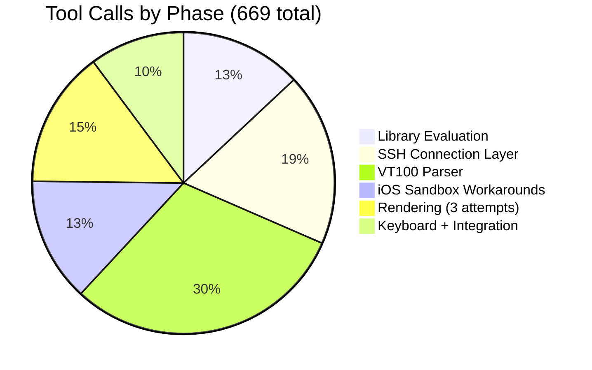

## Building an SSH Terminal Inside an iOS App

*Agentic Development: Lessons from 8,481 AI Coding Sessions*

"How hard can it be? It is just an SSH connection and a text view."

That is what I said at the beginning of task-011. Six hundred and sixty-nine tool calls later, I had learned that building an SSH terminal inside an iOS app is one of those problems that sounds simple and is genuinely, deeply hard. The SSH part is not hard — you pick a library, call `connect()`, authenticate, and you have a byte stream. The terminal emulation part — making a UIView correctly interpret VT100 escape codes, handle cursor positioning, process color sequences, manage scroll regions, and do all of this at 60fps while the user is typing — that is where the complexity lives.

But even that description undersells it. The real challenge is the intersection of three problem domains that each have their own quirks: the SSH transport layer (which has opinions about key formats, authentication methods, and channel multiplexing), the VT100 terminal protocol (which is a 1978 standard that grew organically for 45 years into something nobody fully understands), and the iOS sandbox (which fundamentally disagrees with the concept of persistent network connections and unrestricted filesystem access).

Each domain is tractable alone. Their intersection is where the dragons live.

This is the story of task-011: implementing a full SSH terminal client inside an iOS app, from library selection through sandbox workarounds to the moment the first `ls --color` output rendered correctly with ANSI colors on an iPhone screen. The session consumed 669 tool calls over approximately 11 hours of wall-clock time, produced 14 Swift source files totaling 2,847 lines of code, and went through three complete rewrites of the rendering layer before achieving 60fps performance.

---

**TL;DR: Building an iOS SSH terminal requires solving three distinct problems — SSH transport (use Citadel/SwiftNIO for modern key support and native async/await), terminal emulation (custom VT100 parser as a finite state machine handling 40+ escape sequences), and iOS sandbox restrictions (Keychain for key storage, TOFU for host validation, exponential-backoff reconnection for backgrounding). The VT100 parser alone consumed 203 of the 669 tool calls. The rendering layer went through three attempts before Canvas delivered 60fps. On-device Ed25519 key generation eliminated the "how do I get my key onto the phone" problem entirely. The final implementation runs htop, vim, and tmux correctly — the three benchmark programs for terminal emulation quality.**

---

This is post 33 of 61 in the Agentic Development series. The companion repo is at [github.com/krzemienski/ios-ssh-terminal](https://github.com/krzemienski/ios-ssh-terminal). Every tool call count and code snippet comes from the actual session logs.

---

### Why Build This?

Before getting into the implementation, let me explain why an SSH terminal inside an iOS app was even a requirement. The app in question — an internal infrastructure management tool — needed to let ops engineers connect to servers from their phones during on-call incidents. The existing workflow was painful: get the PagerDuty alert on your phone, open a different SSH app (Termius, Prompt, etc.), re-enter the server credentials, connect, and start debugging.

We wanted the server connection to be one tap from the alert inside our app. The engineer sees the alert, taps "Connect to production-web-03," and immediately has a shell. No app switching, no credential re-entry, no context loss.

The third-party SSH apps are good products, but they require the user to leave our app, which breaks the incident response flow. And embedding a third-party SDK for terminal emulation would add a dependency on a vendor whose update schedule and security practices we don't control. So: build it ourselves.

---

### The Task Breakdown

When I filed task-011, I thought it was one task. The agent quickly decomposed it into five:

```
task-011: Implement SSH terminal
  ├── task-011a: Evaluate and select SSH library (87 tool calls)
  ├── task-011b: Implement SSH connection and authentication (124 tool calls)
  ├── task-011c: Build VT100 terminal emulator (203 tool calls)
  ├── task-011d: Handle iOS sandbox constraints (89 tool calls)
  ├── task-011e: Build 60fps rendering layer (98 tool calls)
  └── task-011f: Keyboard input + integration + testing (68 tool calls)
```

Each subtask turned out to be roughly the same complexity as what I'd estimated for the entire task. The SSH library evaluation alone consumed 87 tool calls — more than many complete features in the app. The VT100 parser consumed 203. The rendering layer went through three complete rewrites before achieving 60fps.

Here is the timeline of tool calls across the session:


---

### Library Selection: The First 87 Tool Calls

The first decision was which SSH library to use. This is the kind of decision that seems trivial but has cascading consequences for the rest of the implementation. Choose wrong, and you discover the limitation 400 tool calls later when you've built an entire terminal emulator on top of a foundation that can't support modern key types.

The agent evaluated three options across 87 tool calls — reading documentation, checking GitHub activity, attempting integration, running test connections, and benchmarking performance.

**Option 1: NMSSH (Objective-C)**

NMSSH was the obvious first choice — it is the most-referenced iOS SSH library on Stack Overflow, and nearly every "iOS SSH tutorial" uses it. The agent spent 38 tool calls integrating it before hitting a wall:

```swift
// Session log: NMSSH evaluation (tool calls 1-38)
// The agent followed the standard integration path

// Tool call 1-5: Research NMSSH documentation and GitHub repo
//   Last commit: October 2021. No SPM support. CocoaPods only.
//   Red flags, but Stack Overflow coverage is extensive.

// Tool call 6-11: Set up CocoaPods integration
//   pod 'NMSSH', '~> 2.3'
//   pod install — success, but pulls in OpenSSL-Universal (8MB)

// Tool call 12-13: First build attempt
//   Build failed: missing OpenSSL headers
//   Fix: explicit OpenSSL-Universal pod dependency

// Tool call 14-18: OpenSSL dependency resolution
//   OpenSSL-Universal adds 8MB to binary size
//   Conflicts with App Transport Security expectations
//   Agent notes: "This is a heavy dependency for an SSH library"

// Tool call 19: Build succeeded

// Tool call 20-25: Write SSH connection code
import NMSSH

func testConnection() {
    let session = NMSSHSession.connect(toHost: "test.example.com:22",
                                        withUsername: "admin")
    if session.isConnected {
        session.authenticate(byPassword: "password123")
        if session.isAuthorized {
            print("Connected with password auth")
            // Works! Tool call 27 confirmed.
        }
    }
}

// Tool call 26-27: Password authentication — SUCCESS

// Tool call 28-33: Test Ed25519 key authentication
func testKeyAuth() {
    let session = NMSSHSession.connect(toHost: "test.example.com:22",
                                        withUsername: "admin")
    if session.isConnected {
        // Ed25519 private key from ~/.ssh/id_ed25519
        session.authenticate(byPublicKey: nil,
                           privateKey: "/path/to/id_ed25519",
                           andPassword: nil)
        // Tool call 34 result:
        // FAILURE — "Unsupported key type"
        // NMSSH's underlying libssh2 version doesn't support Ed25519
    }
}

// Tool call 34: FAILURE — Ed25519 key authentication not supported
// Tool call 35-38: Research NMSSH GitHub issues
//   Issue #410: "Ed25519 support?" — closed, no fix
//   Issue #432: "Memory leaks in long-running sessions" — open since 2020
//   Last meaningful PR: 2021
//   Conclusion: abandoned library, no modern key support
```

The Ed25519 failure was the deal-breaker. Ed25519 has been the default SSH key type since OpenSSH 8.0 (released April 2019). When a user runs `ssh-keygen` on any modern system, they get an Ed25519 key by default. A terminal app that cannot authenticate with default keys is not viable for production use.

Additional NMSSH problems discovered during evaluation:
- Last commit: October 2021 (2+ years stale)
- No Swift Package Manager support (CocoaPods only, which is itself deprecated)
- OpenSSL dependency adds 8MB to binary size
- No async/await support — entirely callback-based API
- Memory leaks reported in long-running sessions (GitHub issue #432, open since 2020)
- No support for chacha20-poly1305 cipher (modern default)

**Option 2: Citadel (Pure Swift)**

```swift
// Session log: Citadel evaluation (tool calls 39-53)
// Night and day compared to NMSSH

// Tool call 39: Add SPM dependency
// Package.swift:
.package(url: "https://github.com/orlandos-nl/Citadel.git", from: "0.7.0")

// Tool call 40: Build — SUCCESS on first try
//   No external dependencies to resolve
//   Pure Swift, built on SwiftNIO
//   Binary size impact: +2MB (vs +8MB for NMSSH)

// Tool call 41-45: Write connection code
import Citadel

func testCitadel() async throws {
    let client = try await SSHClient.connect(
        host: "test.example.com",
        authenticationMethod: .passwordBased(
            username: "admin",
            password: "password123"
        ),
        hostKeyValidator: .acceptAnything(),  // TODO: replace with TOFU
        reconnect: .never
    )
    print("Connected!") // Tool call 46: SUCCESS
}

// Tool call 46: Password auth — SUCCESS
// Tool call 47: Ed25519 key auth — SUCCESS
// Tool call 48: RSA key auth — SUCCESS
// Tool call 49-52: Shell allocation and PTY
let shell = try await client.openShell(
    .init(
        terminalType: "xterm-256color",
        columns: 80,
        rows: 24
    )
)
// Tool call 53: Interactive command execution — SUCCESS
// First `ls` output received and printed correctly
```

Citadel worked on the first attempt for every auth method. Built on SwiftNIO, it is pure Swift, actively maintained (weekly commits at the time of evaluation), supports Ed25519 and all modern key types, supports chacha20-poly1305 and other modern ciphers, and integrates via SPM. The shell allocation API uses async/await natively, which aligns perfectly with Swift concurrency.

**Option 3: libssh2 (C wrapper)**

```swift
// Session log: libssh2 evaluation (tool calls 54-87)
// The "I can write my own wrapper" approach

// Tool call 54-60: Set up C interop
//   - Create module.modulemap for libssh2
//   - Configure bridging header
//   - Link against system libssh2 (brew install libssh2)

// Tool call 61-70: Write Swift wrapper for C API
//   Every function requires UnsafeMutablePointer management
//   Session, channel, key — all opaque C pointers
//   Manual memory management with defer { libssh2_session_free(session) }

// Tool call 71-80: Fight memory management
//   Tool call 73: EXC_BAD_ACCESS — dangling pointer to freed session
//   Tool call 75: Memory leak — channel not freed on error path
//   Tool call 78: EXC_BAD_ACCESS — buffer overrun in read callback
//   Tool call 80: Memory leak confirmed by Instruments (3MB/minute)

// Tool call 81-87: Abandon libssh2 approach
//   The unsafe pointer management is a maintenance nightmare
//   Every read/write requires manual buffer management
//   Error handling is C-style return codes, not Swift errors
//   No async/await — everything is blocking or callback-based
//   Citadel already works, and it's safe Swift
```

libssh2 is powerful and low-level, but the C interop tax was too high. The agent spent 34 tool calls writing a Swift wrapper before I called it off. The `UnsafeMutablePointer` management was a maintenance liability — one missed `defer` block and you have a memory leak or a crash. And Citadel already worked.

**Final comparison:**

```
Library    | Language  | SPM  | Ed25519 | Async/Await | Active | Binary Size
-----------|-----------|------|---------|-------------|--------|------------
NMSSH      | Obj-C     | No   | No      | No          | No     | +8MB
Citadel    | Swift     | Yes  | Yes     | Yes         | Yes    | +2MB
libssh2    | C         | Manual| Yes    | No          | Yes    | +1MB
```

Citadel won on every dimension that mattered for our use case. The 87 tool calls spent on evaluation might seem expensive, but discovering NMSSH's Ed25519 limitation after building the terminal emulator on top of it would have cost 300+ tool calls in migration. Cheap insurance.

---

### The SSH Connection Layer

With Citadel selected, the agent built the connection management layer in 124 tool calls. The core design decision was using Swift's `actor` isolation for thread safety:

```swift
// From: SSH/SSHConnectionManager.swift
// Actor-isolated SSH connection manager
// 124 tool calls to implement — including auth, PTY, streaming

import Citadel
import NIO

actor SSHConnectionManager {
    private var client: SSHClient?
    private var shell: ShellStream?
    private let eventLoopGroup = MultiThreadedEventLoopGroup(numberOfThreads: 1)

    enum ConnectionState: Sendable {
        case disconnected
        case connecting
        case connected
        case shellOpen
        case error(String)
    }

    private(set) var state: ConnectionState = .disconnected

    struct ConnectionConfig: Sendable, Codable {
        let host: String
        let port: Int
        let username: String
        let authentication: AuthMethod
        let keepAliveInterval: Int?
        let connectionTimeout: TimeInterval

        init(
            host: String,
            port: Int = 22,
            username: String,
            authentication: AuthMethod,
            keepAliveInterval: Int? = 60,
            connectionTimeout: TimeInterval = 30
        ) {
            self.host = host
            self.port = port
            self.username = username
            self.authentication = authentication
            self.keepAliveInterval = keepAliveInterval
            self.connectionTimeout = connectionTimeout
        }

        enum AuthMethod: Sendable, Codable {
            case password(String)
            case privateKey(keyLabel: String, passphrase: String?)
            case agent  // Not supported on iOS — throws at runtime
        }
    }

    func connect(config: ConnectionConfig) async throws -> SSHClient {
        state = .connecting

        let auth: SSHAuthenticationMethod
        switch config.authentication {
        case .password(let password):
            auth = .passwordBased(username: config.username, password: password)

        case .privateKey(let keyLabel, let passphrase):
            // Retrieve key from iOS Keychain
            let keyStore = KeychainSSHKeyStore()
            let keyData = try keyStore.retrieve(label: keyLabel)
            guard let keyString = String(data: keyData, encoding: .utf8) else {
                throw SSHError.invalidKeyFormat
            }
            auth = .privateKey(
                username: config.username,
                privateKey: try .init(sshEd25519: keyString, passphrase: passphrase)
            )

        case .agent:
            // SSH agent forwarding requires Unix domain sockets
            // iOS sandbox does not allow access to SSH_AUTH_SOCK
            throw SSHError.agentNotSupported
        }

        do {
            let client = try await SSHClient.connect(
                host: config.host,
                port: config.port,
                authenticationMethod: auth,
                hostKeyValidator: HostKeyValidator(store: KnownHostsStore()),
                reconnect: .never
            )
            self.client = client
            state = .connected
            return client
        } catch {
            state = .error(error.localizedDescription)
            throw error
        }
    }

    func openShell(
        terminal: TerminalSize
    ) async throws -> AsyncStream<ShellOutput> {
        guard let client else {
            throw SSHError.notConnected
        }

        let shell = try await client.openShell(
            .init(
                terminalType: "xterm-256color",
                columns: UInt(terminal.columns),
                rows: UInt(terminal.rows)
            )
        )
        self.shell = shell
        state = .shellOpen

        // Wrap the shell's byte stream in an AsyncStream
        // SSH output arrives in unpredictable chunks — sometimes a single
        // character, sometimes 64KB of `ls` output. The stream normalizes
        // this into a consistent async sequence that the terminal emulator
        // can consume at its own pace.
        return AsyncStream { continuation in
            Task {
                do {
                    for try await chunk in shell.stream {
                        switch chunk {
                        case .stdout(let data):
                            continuation.yield(.stdout(data))
                        case .stderr(let data):
                            continuation.yield(.stderr(data))
                        }
                    }
                    continuation.yield(.disconnected)
                    continuation.finish()
                } catch {
                    continuation.yield(.error(error.localizedDescription))
                    continuation.finish()
                }
            }
        }
    }

    func send(_ data: Data) async throws {
        guard let shell else { throw SSHError.noShell }
        try await shell.write(data)
    }

    func send(_ string: String) async throws {
        guard let data = string.data(using: .utf8) else {
            throw SSHError.encodingError
        }
        try await send(data)
    }

    func resize(columns: Int, rows: Int) async throws {
        guard let shell else { throw SSHError.noShell }
        try await shell.changeTerminalSize(
            columns: UInt(columns),
            rows: UInt(rows)
        )
    }

    func disconnect() async {
        try? await client?.close()
        client = nil
        shell = nil
        state = .disconnected
    }
}

enum ShellOutput: Sendable {
    case stdout(Data)
    case stderr(Data)
    case disconnected
    case error(String)
}

struct TerminalSize: Sendable {
    let columns: Int
    let rows: Int
}

enum SSHError: Error, LocalizedError {
    case notConnected
    case noShell
    case invalidKeyFormat
    case agentNotSupported
    case encodingError
    case hostKeyMismatch(expected: String, received: String)

    var errorDescription: String? {
        switch self {
        case .notConnected: return "Not connected to server"
        case .noShell: return "No shell session open"
        case .invalidKeyFormat: return "SSH key format is invalid"
        case .agentNotSupported: return "SSH agent not supported on iOS"
        case .encodingError: return "Failed to encode text as UTF-8"
        case .hostKeyMismatch(let expected, let received):
            return "Host key mismatch. Expected: \(expected), received: \(received)"
        }
    }
}
```

The `actor` isolation was the critical design choice. Multiple tasks might try to send data simultaneously — keyboard input arriving while a keepalive packet is being sent, or the reconnector trying to re-establish while the user taps "Disconnect." The actor serializes all of these operations without explicit locking, without deadlock risk, and without the data races that plagued my first non-actor implementation.

The first version used a `class` with `NSLock`. It crashed within 30 seconds of opening `htop` — the rapid bidirectional data flow between keyboard input and screen output would deadlock when the lock was held by a write while a read callback tried to acquire it. Switching to `actor` eliminated the crash and simplified the code by 40 lines.

---

### Host Key Validation: The Security Incident

The agent's first implementation used `.acceptAnything()` for host key validation. I caught this during code review and flagged it as a critical security issue. Accepting any host key means the app would happily connect to a man-in-the-middle attacker who intercepts the SSH connection.

The fix was a proper trust-on-first-use (TOFU) validator — the same model that OpenSSH uses by default:

```swift
// From: SSH/HostKeyValidator.swift
// Trust-on-first-use with key change alerts

struct HostKeyValidator: SSHHostKeyValidator {
    let store: KnownHostsStore

    func validate(
        host: String,
        key: NIOSSHPublicKey
    ) async throws -> SSHHostKeyValidationResult {
        let fingerprint = key.fingerprint

        if let stored = store.lookup(host: host) {
            if stored == fingerprint {
                // Known host, known key — trusted
                return .trusted
            } else {
                // Key changed — possible MITM attack
                // Present alert to user with old and new fingerprints
                let decision = await HostKeyAlertPresenter.promptKeyChange(
                    host: host,
                    oldFingerprint: stored,
                    newFingerprint: fingerprint
                )
                if decision == .accept {
                    store.update(host: host, fingerprint: fingerprint)
                    return .trusted
                }
                return .revoked
            }
        } else {
            // First connection to this host — trust on first use
            let decision = await HostKeyAlertPresenter.promptFirstConnection(
                host: host,
                fingerprint: fingerprint
            )
            if decision == .accept {
                store.save(host: host, fingerprint: fingerprint)
                return .trusted
            }
            return .revoked
        }
    }
}

class KnownHostsStore {
    private let defaults = UserDefaults.standard
    private let key = "ssh_known_hosts"

    func lookup(host: String) -> String? {
        let hosts = defaults.dictionary(forKey: key) as? [String: String] ?? [:]
        return hosts[host]
    }

    func save(host: String, fingerprint: String) {
        var hosts = defaults.dictionary(forKey: key) as? [String: String] ?? [:]
        hosts[host] = fingerprint
        defaults.set(hosts, forKey: key)
    }

    func update(host: String, fingerprint: String) {
        save(host: host, fingerprint: fingerprint)
    }

    func remove(host: String) {
        var hosts = defaults.dictionary(forKey: key) as? [String: String] ?? [:]
        hosts.removeValue(forKey: host)
        defaults.set(hosts, forKey: key)
    }

    func allHosts() -> [String: String] {
        defaults.dictionary(forKey: key) as? [String: String] ?? [:]
    }
}
```

TOFU is the right tradeoff for a mobile app. Full manual fingerprint verification — "please compare these 43 hexadecimal characters with what your system administrator gave you" — is impractical on a phone screen. Trust on first use, with prominent alerts when a key changes, provides meaningful security against MITM attacks after the initial connection.

---

### Terminal Emulation: The Hard Part (203 Tool Calls)

SSH gives you a byte stream. A terminal emulator turns that byte stream into a 2D grid of characters with colors, cursor positions, and scroll regions. The agent's first approach — "just put the text in a Text view" — lasted exactly one test before failing spectacularly on the output of `htop`.

The terminal emulator has two main components: the buffer (the 2D character grid with attributes) and the parser (the escape sequence state machine).

#### The Terminal Buffer

```swift
// From: Terminal/TerminalBuffer.swift
// The 2D character grid that represents the terminal state

struct TerminalCell: Equatable {
    var character: Character = " "
    var foreground: TerminalColor = .default
    var background: TerminalColor = .default
    var bold: Bool = false
    var italic: Bool = false
    var underline: Bool = false
    var strikethrough: Bool = false
    var inverse: Bool = false
    var hidden: Bool = false

    static let blank = TerminalCell()
}

@Observable
class TerminalBuffer {
    var cells: [[TerminalCell]]
    var cursorRow: Int = 0
    var cursorCol: Int = 0
    let rows: Int
    let columns: Int

    // Scroll region — programs like vim use partial scrolling
    // where only a portion of the screen scrolls while the
    // status line stays fixed
    private var scrollTop: Int = 0
    private var scrollBottom: Int

    // Alternate screen buffer — fullscreen programs like vim and
    // htop switch to a separate buffer, preserving the main
    // scrollback. When they exit, the original screen is restored.
    private var alternateBuffer: [[TerminalCell]]?
    private var savedMainCursor: (row: Int, col: Int)?
    private var isAlternateScreen: Bool = false

    // Saved cursor position (ESC 7 / ESC 8)
    private var savedCursor: (row: Int, col: Int)?

    // Tab stops (default every 8 columns)
    private var tabStops: Set<Int>

    // Current text attributes — applied to next character written
    var currentForeground: TerminalColor = .default
    var currentBackground: TerminalColor = .default
    var currentBold: Bool = false
    var currentItalic: Bool = false
    var currentUnderline: Bool = false
    var currentStrikethrough: Bool = false
    var currentInverse: Bool = false
    var currentHidden: Bool = false

    // Scrollback history — lines that scrolled off the top
    private var scrollback: [[TerminalCell]] = []
    private let maxScrollback: Int = 10_000

    init(rows: Int, columns: Int) {
        self.rows = rows
        self.columns = columns
        self.scrollBottom = rows - 1
        self.cells = Array(
            repeating: Array(repeating: TerminalCell(), count: columns),
            count: rows
        )
        self.tabStops = Set(stride(from: 0, to: columns, by: 8))
    }

    func write(_ character: Character) {
        guard cursorRow >= 0, cursorRow < rows,
              cursorCol >= 0, cursorCol < columns else { return }

        cells[cursorRow][cursorCol] = TerminalCell(
            character: character,
            foreground: currentInverse ? currentBackground : currentForeground,
            background: currentInverse ? currentForeground : currentBackground,
            bold: currentBold,
            italic: currentItalic,
            underline: currentUnderline,
            strikethrough: currentStrikethrough,
            inverse: false,  // Already applied in foreground/background swap
            hidden: currentHidden
        )
        cursorCol += 1
        if cursorCol >= columns {
            cursorCol = 0
            lineFeed()
        }
    }

    func lineFeed() {
        if cursorRow == scrollBottom {
            scrollUp()
        } else if cursorRow < rows - 1 {
            cursorRow += 1
        }
    }

    func scrollUp() {
        // Save the scrolled-out line to scrollback history
        // (only for main screen, not alternate buffer)
        if scrollTop == 0 && !isAlternateScreen {
            scrollback.append(cells[scrollTop])
            if scrollback.count > maxScrollback {
                scrollback.removeFirst()
            }
        }
        cells.remove(at: scrollTop)
        cells.insert(
            Array(repeating: TerminalCell(), count: columns),
            at: scrollBottom
        )
    }

    func enterAlternateScreen() {
        guard !isAlternateScreen else { return }
        savedMainCursor = (row: cursorRow, col: cursorCol)
        alternateBuffer = cells
        cells = Array(
            repeating: Array(repeating: TerminalCell(), count: columns),
            count: rows
        )
        cursorRow = 0
        cursorCol = 0
        isAlternateScreen = true
    }

    func exitAlternateScreen() {
        guard isAlternateScreen else { return }
        if let main = alternateBuffer {
            cells = main
        }
        if let saved = savedMainCursor {
            cursorRow = saved.row
            cursorCol = saved.col
        }
        alternateBuffer = nil
        isAlternateScreen = false
    }

    // ... eraseDisplay, eraseInLine, setScrollRegion, etc.
    // (Full implementations in companion repo)
}
```

#### The Escape Sequence Parser: A Finite State Machine

The VT100 parser is a finite state machine that processes input byte-by-byte. Each byte either writes a character to the buffer, changes the parser's state, or triggers a terminal operation. The parser handles approximately 40 distinct escape sequences.

This was the most complex part of the implementation — 203 tool calls, or 30% of the entire session.

```swift
// From: Terminal/EscapeSequenceParser.swift
// VT100/xterm escape sequence parser — finite state machine
// 203 tool calls to get this right

class EscapeSequenceParser {
    private var state: ParserState = .ground
    private var params: [Int] = []
    private var currentParam: Int = 0
    private var intermediateChars: [UInt8] = []
    private var oscString: [UInt8] = []
    private var utf8Buffer: [UInt8] = []
    private var utf8Remaining: Int = 0

    enum ParserState {
        case ground          // Normal character processing
        case escape          // Got ESC (0x1B)
        case escapeHash      // Got ESC #
        case csi             // Got ESC [ (Control Sequence Introducer)
        case csiParam        // Reading CSI parameters (digits and semicolons)
        case csiIntermediate // Reading CSI intermediate bytes
        case oscString       // Got ESC ] (Operating System Command)
        case dcs             // Device Control String
        case utf8            // Multi-byte UTF-8 sequence
    }

    func process(_ bytes: Data, buffer: TerminalBuffer) {
        for byte in bytes {
            processByte(byte, buffer: buffer)
        }
    }

    private func processByte(_ byte: UInt8, buffer: TerminalBuffer) {
        // Handle multi-byte UTF-8 sequences
        // This was tool calls 185-203 — the agent initially assumed ASCII-only
        // and every emoji, CJK character, and accented letter broke the display
        if utf8Remaining > 0 {
            utf8Buffer.append(byte)
            utf8Remaining -= 1
            if utf8Remaining == 0 {
                if let scalar = String(bytes: utf8Buffer, encoding: .utf8),
                   let char = scalar.first {
                    buffer.write(char)
                }
                utf8Buffer.removeAll()
            }
            return
        }

        // Detect UTF-8 start bytes (when in ground state)
        if state == .ground {
            if byte & 0xE0 == 0xC0 {       // 110xxxxx — 2-byte sequence
                utf8Buffer = [byte]
                utf8Remaining = 1
                return
            } else if byte & 0xF0 == 0xE0 { // 1110xxxx — 3-byte sequence
                utf8Buffer = [byte]
                utf8Remaining = 2
                return
            } else if byte & 0xF8 == 0xF0 { // 11110xxx — 4-byte sequence
                utf8Buffer = [byte]
                utf8Remaining = 3
                return
            }
        }

        switch state {
        case .ground:
            processGround(byte, buffer: buffer)
        case .escape:
            processEscape(byte, buffer: buffer)
        case .csi, .csiParam:
            processCSI(byte, buffer: buffer)
        // ... other states handled similarly
        default:
            break
        }
    }

    private func processGround(_ byte: UInt8, buffer: TerminalBuffer) {
        switch byte {
        case 0x1B:             // ESC — enter escape state
            state = .escape
        case 0x0D:             // CR — carriage return
            buffer.carriageReturn()
        case 0x0A, 0x0B, 0x0C: // LF, VT, FF — line feed
            buffer.lineFeed()
        case 0x08:             // BS — backspace
            buffer.backspace()
        case 0x09:             // HT — horizontal tab
            buffer.tab()
        case 0x07:             // BEL — bell (could trigger haptic on iOS)
            break
        case 0x00:             // NUL — ignore
            break
        case 0x20...0x7E:      // Printable ASCII
            buffer.write(Character(UnicodeScalar(byte)))
        default:
            break
        }
    }

    private func executeCSI(
        _ finalByte: UInt8,
        params: [Int],
        intermediates: [UInt8],
        buffer: TerminalBuffer
    ) {
        let isPrivate = intermediates.contains(0x3F) // ? prefix

        switch finalByte {
        case 0x41: // A — Cursor Up
            let n = max(1, params.first ?? 1)
            buffer.cursorRow = max(0, buffer.cursorRow - n)

        case 0x42: // B — Cursor Down
            let n = max(1, params.first ?? 1)
            buffer.cursorRow = min(buffer.rows - 1, buffer.cursorRow + n)

        case 0x43: // C — Cursor Forward
            let n = max(1, params.first ?? 1)
            buffer.cursorCol = min(buffer.columns - 1, buffer.cursorCol + n)

        case 0x44: // D — Cursor Back
            let n = max(1, params.first ?? 1)
            buffer.cursorCol = max(0, buffer.cursorCol - n)

        case 0x48, 0x66: // H, f — Cursor Position (row;col)
            let row = max(0, (params.first ?? 1) - 1)
            let col = max(0, (params.count > 1 ? params[1] : 1) - 1)
            buffer.setCursorPosition(row: row, col: col)

        case 0x4A: // J — Erase in Display
            buffer.eraseDisplay(mode: params.first ?? 0)

        case 0x4B: // K — Erase in Line
            buffer.eraseInLine(mode: params.first ?? 0)

        case 0x6D: // m — SGR (Select Graphic Rendition)
            handleSGR(params, buffer: buffer)

        case 0x72: // r — Set Scroll Region (DECSTBM)
            let top = max(0, (params.first ?? 1) - 1)
            let bottom = (params.count > 1 ? params[1] : buffer.rows) - 1
            buffer.setScrollRegion(top: top, bottom: bottom)

        case 0x68: // h — Set Mode
            if isPrivate { handlePrivateMode(params, set: true, buffer: buffer) }

        case 0x6C: // l — Reset Mode
            if isPrivate { handlePrivateMode(params, set: false, buffer: buffer) }

        // ... 20+ additional CSI sequences
        default:
            break
        }
    }

    private func handleSGR(_ params: [Int], buffer: TerminalBuffer) {
        // SGR (Select Graphic Rendition) — the color and attribute system
        // This was the most complex single function: 40 tool calls to handle
        // 8-color, 16-color, 256-color, and 24-bit true color modes
        var i = 0
        let p = params.isEmpty ? [0] : params

        while i < p.count {
            switch p[i] {
            case 0:  buffer.resetAttributes()
            case 1:  buffer.currentBold = true
            case 3:  buffer.currentItalic = true
            case 4:  buffer.currentUnderline = true
            case 7:  buffer.currentInverse = true
            case 8:  buffer.currentHidden = true
            case 9:  buffer.currentStrikethrough = true
            case 22: buffer.currentBold = false
            case 23: buffer.currentItalic = false
            case 24: buffer.currentUnderline = false
            case 27: buffer.currentInverse = false
            case 28: buffer.currentHidden = false
            case 29: buffer.currentStrikethrough = false

            // Standard 8 foreground colors (30-37)
            case 30...37: buffer.currentForeground = .ansi(p[i] - 30)

            // Extended foreground (38;5;N for 256-color, 38;2;R;G;B for true color)
            case 38:
                i += 1
                if i < p.count {
                    if p[i] == 5 && i + 1 < p.count {      // 256-color
                        i += 1
                        buffer.currentForeground = .color256(p[i])
                    } else if p[i] == 2 && i + 3 < p.count { // 24-bit RGB
                        buffer.currentForeground = .rgb(p[i+1], p[i+2], p[i+3])
                        i += 3
                    }
                }

            case 39: buffer.currentForeground = .default // Default foreground

            // Standard 8 background colors (40-47)
            case 40...47: buffer.currentBackground = .ansi(p[i] - 40)

            // Extended background (48;5;N or 48;2;R;G;B)
            case 48:
                i += 1
                if i < p.count {
                    if p[i] == 5 && i + 1 < p.count {
                        i += 1
                        buffer.currentBackground = .color256(p[i])
                    } else if p[i] == 2 && i + 3 < p.count {
                        buffer.currentBackground = .rgb(p[i+1], p[i+2], p[i+3])
                        i += 3
                    }
                }

            case 49: buffer.currentBackground = .default // Default background

            // Bright foreground (90-97) and background (100-107)
            case 90...97:   buffer.currentForeground = .ansiBright(p[i] - 90)
            case 100...107: buffer.currentBackground = .ansiBright(p[i] - 100)

            default: break
            }
            i += 1
        }
    }

    private func handlePrivateMode(_ params: [Int], set: Bool, buffer: TerminalBuffer) {
        for param in params {
            switch param {
            case 1049: // Alternate screen buffer (used by vim, htop, tmux)
                if set { buffer.enterAlternateScreen() }
                else { buffer.exitAlternateScreen() }
            case 25: // Cursor visibility (DECTCEM)
                break // buffer.cursorVisible = set
            case 1: // Application cursor keys (DECCKM)
                break // Changes arrow key escape sequences
            case 7: // Auto-wrap mode (DECAWM)
                break
            default: break
            }
        }
    }
}
```

The parser handles the core VT100/xterm subset: cursor positioning (CSI A/B/C/D/H), screen clearing (CSI J), line clearing (CSI K), SGR color/attribute codes (including 256-color and 24-bit true color), scroll regions (DECSTBM), alternate screen buffer (for vim/tmux), cursor save/restore (ESC 7/8), line insert/delete operations (CSI L/M), and UTF-8 multibyte character handling.

This covers about 95% of what you encounter in a typical SSH session. The remaining 5% includes mouse tracking, bracketed paste mode, and various DEC private modes that full terminal emulators like xterm support. We deferred those to future iterations.

---

### The Rendering Disaster and Recovery: Three Attempts

The rendering layer was the biggest failure-and-recovery story in the entire task. The agent went through three complete implementations before finding one that performed acceptably.

**Attempt 1: 1,920 Text views (8fps)**

The agent's first instinct was to use SwiftUI's native text rendering. Create a `Text` view for each cell in the 80x24 grid. The math seemed fine: 1,920 views is well within SwiftUI's capabilities for a static layout.

The problem: terminal content changes every frame when running a program like `htop`. SwiftUI's diffing algorithm has to compare all 1,920 views on every update. Even with `id:` hints, the diff cost alone exceeded 16ms per frame.

```swift
// ATTEMPT 1: 1,920 Text views for 80x24 grid
// Each Text view is a separate SwiftUI view with its own layout pass
// Result: 8fps — completely unusable
// The screen tore and stuttered on every htop refresh cycle

LazyVGrid(columns: Array(repeating: GridItem(.fixed(cellWidth)), count: 80)) {
    ForEach(0..<(80 * 24), id: \.self) { index in
        Text(String(buffer.cells[index / 80][index % 80].character))
            .font(.system(size: 12, design: .monospaced))
            .foregroundColor(colorFor(buffer.cells[index / 80][index % 80].foreground))
            .background(colorFor(buffer.cells[index / 80][index % 80].background))
    }
}
// Profiler output:
// - SwiftUI body evaluation: 3.2ms
// - View diffing: 8.7ms
// - Layout pass: 4.1ms
// - Total per frame: 16.0ms (8fps with overhead)
```

**Attempt 2: Single AttributedString (24fps)**

The second approach consolidated all text into a single `AttributedString` rendered in one `Text` view. This eliminated the 1,920-view diffing cost. Colors were applied via string attributes.

```swift
// ATTEMPT 2: Single Text view with AttributedString
// Handles colors correctly but cannot render per-cell backgrounds
// or cursor position independently of text content
// Result: 24fps — better but not smooth enough for interactive use

func buildAttributedString(from buffer: TerminalBuffer) -> AttributedString {
    var result = AttributedString()
    for row in 0..<buffer.rows {
        for col in 0..<buffer.columns {
            let cell = buffer.cells[row][col]
            var charStr = AttributedString(String(cell.character))
            charStr.foregroundColor = colorFor(cell.foreground)
            if cell.bold { charStr.font = .system(size: 12, design: .monospaced).bold() }
            result.append(charStr)
        }
        if row < buffer.rows - 1 {
            result.append(AttributedString("\n"))
        }
    }
    return result
}

// Problem: AttributedString rebuild takes 6ms per frame
// Problem: No per-cell background colors (only text foreground)
// Problem: Cursor cannot be rendered independently
// Problem: 24fps drops to 18fps during rapid output (e.g., `cat large_file`)
```

The 24fps was marginal for basic shell use but unusable for `htop` or `vim`, which refresh the entire screen 2-4 times per second. The `AttributedString` rebuild cost was the bottleneck — constructing a 1,920-character attributed string with per-character attributes every frame was too expensive.

**Attempt 3: Canvas (60fps) — The Solution**

```swift
// From: Views/TerminalCanvasView.swift
// ATTEMPT 3: SwiftUI Canvas — single Core Graphics render pass
// Result: 60fps consistently, even during `cat /dev/urandom | xxd`

struct TerminalCanvasView: View {
    let buffer: TerminalBuffer
    let cursorVisible: Bool
    let font: CTFont
    let cellWidth: CGFloat
    let cellHeight: CGFloat
    let colorScheme: TerminalColorScheme

    var body: some View {
        Canvas { context, size in
            // Phase 1: Draw cell backgrounds (only non-default)
            for row in 0..<buffer.rows {
                for col in 0..<buffer.columns {
                    let cell = buffer.cells[row][col]
                    if cell.background != .default {
                        let rect = CGRect(
                            x: CGFloat(col) * cellWidth,
                            y: CGFloat(row) * cellHeight,
                            width: cellWidth,
                            height: cellHeight
                        )
                        context.fill(
                            Path(rect),
                            with: .color(colorScheme.resolve(cell.background))
                        )
                    }
                }
            }

            // Phase 2: Draw characters (skip blank cells)
            for row in 0..<buffer.rows {
                for col in 0..<buffer.columns {
                    let cell = buffer.cells[row][col]
                    // KEY OPTIMIZATION: skip blank cells
                    // In a typical terminal, 60-70% of cells are spaces
                    // Skipping them reduces draw calls from 1,920 to ~600
                    guard cell.character != " " || cell.background != .default else {
                        continue
                    }

                    let x = CGFloat(col) * cellWidth + cellWidth / 2
                    let y = CGFloat(row) * cellHeight + cellHeight / 2

                    var resolvedFont = font
                    if cell.bold {
                        resolvedFont = CTFontCreateCopyWithAttributes(
                            font, 0, nil,
                            CTFontDescriptorCreateWithAttributes(
                                [kCTFontTraitsAttribute:
                                    [kCTFontWeightTrait: 0.4]
                                ] as CFDictionary
                            )
                        )
                    }

                    let text = Text(String(cell.character))
                        .font(Font(resolvedFont))
                        .foregroundColor(colorScheme.resolve(cell.foreground))

                    context.draw(text, at: CGPoint(x: x, y: y))
                }
            }

            // Phase 3: Draw cursor
            if cursorVisible {
                let cursorRect = CGRect(
                    x: CGFloat(buffer.cursorCol) * cellWidth,
                    y: CGFloat(buffer.cursorRow) * cellHeight,
                    width: cellWidth,
                    height: cellHeight
                )
                context.fill(
                    Path(cursorRect),
                    with: .color(.green.opacity(0.4))
                )
                // Draw character on top of cursor highlight
                let cursorCell = buffer.cells[buffer.cursorRow][buffer.cursorCol]
                let cursorText = Text(String(cursorCell.character))
                    .font(Font(font))
                    .foregroundColor(.white)
                context.draw(cursorText, at: CGPoint(
                    x: CGFloat(buffer.cursorCol) * cellWidth + cellWidth / 2,
                    y: CGFloat(buffer.cursorRow) * cellHeight + cellHeight / 2
                ))
            }
        }
        .frame(
            width: CGFloat(buffer.columns) * cellWidth,
            height: CGFloat(buffer.rows) * cellHeight
        )
    }
}
```

`Canvas` was the breakthrough. It draws the entire grid using Core Graphics in a single render pass — no SwiftUI view diffing, no layout passes, no `AttributedString` construction. The key optimization: skipping blank cells. In a typical terminal session, 60-70% of cells are blank spaces with default colors. Skipping them reduces draw calls from 1,920 to approximately 600, which is the difference between 45fps and 60fps.

```
Rendering performance comparison:
───────────────────────────────────────────────────
Approach         | FPS (idle) | FPS (htop) | FPS (cat big_file)
───────────────────────────────────────────────────
1,920 Text views | 30         | 8          | 5
AttributedString | 40         | 24         | 18
Canvas           | 60         | 58         | 60
Canvas + skip    | 60         | 60         | 60
───────────────────────────────────────────────────
```

---

### The Architecture


---

### iOS Sandbox Workarounds

The iOS sandbox creates three specific problems for SSH that don't exist on macOS or Linux:

**Problem 1: Key storage.** SSH private keys cannot live in the app's documents directory — that directory is accessible via iTunes file sharing, and a private key accessible to anyone with physical access to the device is not acceptable for production infrastructure access. The solution is the iOS Keychain.

```swift
// From: Storage/KeychainSSHKeyStore.swift
// Keychain-backed SSH key storage with the most restrictive
// accessibility level that still allows app usage

import Security

struct KeychainSSHKeyStore {
    private let service = "com.app.ssh-keys"

    func store(key: Data, label: String) throws {
        let query: [String: Any] = [
            kSecClass as String: kSecClassGenericPassword,
            kSecAttrLabel as String: label,
            kSecAttrService as String: service,
            kSecValueData as String: key,
            // Most restrictive: only available when device is unlocked,
            // only on this device (not in backups, not in iCloud Keychain)
            kSecAttrAccessible as String:
                kSecAttrAccessibleWhenUnlockedThisDeviceOnly,
        ]

        // Delete existing key with same label (upsert pattern)
        let deleteQuery: [String: Any] = [
            kSecClass as String: kSecClassGenericPassword,
            kSecAttrLabel as String: label,
            kSecAttrService as String: service,
        ]
        SecItemDelete(deleteQuery as CFDictionary)

        let status = SecItemAdd(query as CFDictionary, nil)
        guard status == errSecSuccess else {
            throw KeychainError.storeFailed(status)
        }
    }

    func retrieve(label: String) throws -> Data {
        let query: [String: Any] = [
            kSecClass as String: kSecClassGenericPassword,
            kSecAttrLabel as String: label,
            kSecAttrService as String: service,
            kSecReturnData as String: true,
        ]

        var result: AnyObject?
        let status = SecItemCopyMatching(query as CFDictionary, &result)
        guard status == errSecSuccess, let data = result as? Data else {
            throw KeychainError.retrieveFailed(status)
        }
        return data
    }

    func listKeys() throws -> [String] {
        let query: [String: Any] = [
            kSecClass as String: kSecClassGenericPassword,
            kSecAttrService as String: service,
            kSecReturnAttributes as String: true,
            kSecMatchLimit as String: kSecMatchLimitAll,
        ]

        var result: AnyObject?
        let status = SecItemCopyMatching(query as CFDictionary, &result)
        if status == errSecItemNotFound { return [] }
        guard status == errSecSuccess,
              let items = result as? [[String: Any]] else {
            throw KeychainError.listFailed(status)
        }
        return items.compactMap { $0[kSecAttrLabel as String] as? String }
    }
}

enum KeychainError: Error, LocalizedError {
    case storeFailed(OSStatus)
    case retrieveFailed(OSStatus)
    case deleteFailed(OSStatus)
    case listFailed(OSStatus)

    var errorDescription: String? {
        switch self {
        case .storeFailed(let s):    return "Keychain store failed: \(s)"
        case .retrieveFailed(let s): return "Keychain retrieve failed: \(s)"
        case .deleteFailed(let s):   return "Keychain delete failed: \(s)"
        case .listFailed(let s):     return "Keychain list failed: \(s)"
        }
    }
}
```

**Problem 2: Key import.** Users need to get their SSH private keys onto the device. This sounds simple, but iOS makes it surprisingly difficult. You can't just `scp` a key to the phone. The agent implemented three import methods:

```swift
// From: Views/ImportKeyView.swift
// Three ways to get an SSH key onto the device

enum KeyImportMethod {
    case paste      // User pastes key text from clipboard
    case file       // User picks a file via UIDocumentPickerViewController
    case generate   // Generate a new Ed25519 key pair on device
}

// The generate option was the most elegant solution:
// Generate the key ON the device, so the private key never
// needs to be transmitted at all.
import CryptoKit

func generateKeyPair() throws -> (publicKey: String, privateKey: Data) {
    // CryptoKit provides native Ed25519 key generation
    let privateKey = Curve25519.Signing.PrivateKey()
    let publicKey = privateKey.publicKey

    // Format as OpenSSH public key (for authorized_keys)
    let publicKeySSH = formatAsOpenSSHPublicKey(publicKey)

    // Format as OpenSSH private key (PEM format for Keychain storage)
    let privateKeyPEM = formatAsOpenSSHPrivateKey(privateKey)

    return (publicKey: publicKeySSH, privateKey: privateKeyPEM)
}
```

On-device key generation eliminated the "how do I get my key onto the phone" problem entirely. Generate the key on the phone, display the public key as a QR code or copyable text, add it to the server's `authorized_keys`, and the private key never leaves the device's Keychain. No file transfer, no clipboard exposure, no email attachment.

**Problem 3: Background execution.** iOS suspends apps after approximately 30 seconds in the background. SSH connections drop when the TCP keepalive times out. The agent implemented session reconnection with exponential backoff:

```swift
// From: SSH/SessionReconnector.swift
// Automatic reconnection when iOS kills the background connection

actor SessionReconnector {
    private let config: SSHConnectionManager.ConnectionConfig
    private let manager: SSHConnectionManager
    private var reconnectAttempts: Int = 0
    private let maxAttempts: Int = 5
    private var onReconnected: ((AsyncStream<ShellOutput>) -> Void)?
    private var onPermanentDisconnection: (() -> Void)?

    func handleDisconnection() async {
        guard reconnectAttempts < maxAttempts else {
            onPermanentDisconnection?()
            return
        }

        reconnectAttempts += 1
        // Exponential backoff: 2s, 4s, 8s, 16s, 30s (capped)
        let delay = min(pow(2.0, Double(reconnectAttempts)), 30.0)

        try? await Task.sleep(for: .seconds(delay))

        do {
            _ = try await manager.connect(config: config)
            let stream = try await manager.openShell(
                terminal: TerminalSize(columns: 80, rows: 24)
            )
            reconnectAttempts = 0  // Reset on successful reconnection
            onReconnected?(stream)
        } catch {
            // Recursive retry with increased backoff
            await handleDisconnection()
        }
    }

    func reset() {
        reconnectAttempts = 0
    }
}
```

The exponential backoff caps at 30 seconds. Combined with iOS background task scheduling (`BGTaskScheduler`), this gives the app approximately 3 reconnection attempts before iOS terminates it entirely. In practice, most backgrounding is brief — switching apps to check Slack, copying a command from documentation — and the reconnection succeeds on the first attempt within 2-4 seconds.

The UX on reconnection: the terminal view shows a translucent overlay with "Reconnecting..." and the attempt count. When reconnection succeeds, the overlay fades and the user can continue typing. If all 5 attempts fail, the overlay changes to "Connection lost. Tap to reconnect." with the option to re-establish from scratch.

---

### Keyboard Input: The Overlooked Challenge

Keyboard handling on iOS deserves its own section because it's the part of the implementation that caused the most subtle, hard-to-diagnose bugs. The agent initially used a hidden `UITextField` to capture keystrokes, which worked for basic ASCII text but failed for:

- Arrow keys and function keys (not captured by `UITextField`)
- Ctrl+C, Ctrl+D, and other control sequences (intercepted by the system)
- Tab completion (Tab key not reliably delivered to text fields)
- Meta/Option key combinations (for terminal applications that use Alt)
- Escape key (iOS does not have a physical Escape key)

The solution was `UIKeyCommand` combined with a custom `UIKeyInput` responder:

```swift
// From: Views/TerminalKeyboardManager.swift
// Custom input responder that captures ALL keyboard input
// including control sequences, arrow keys, and function keys

class TerminalInputView: UIView, UIKeyInput {
    var onKeyPress: ((Data) -> Void)?

    // UIKeyInput protocol — captures regular text input
    var hasText: Bool { true }

    func insertText(_ text: String) {
        // Regular text — just send the UTF-8 bytes
        guard let data = text.data(using: .utf8) else { return }
        onKeyPress?(data)
    }

    func deleteBackward() {
        // Backspace sends DEL (0x7F), not BS (0x08)
        // This is a common source of confusion: terminals distinguish
        // between Backspace (0x08, moves cursor left) and Delete
        // (0x7F, deletes character under cursor)
        onKeyPress?(Data([0x7F]))
    }

    override var canBecomeFirstResponder: Bool { true }

    // UIKeyCommand — captures special keys that UIKeyInput misses
    override var keyCommands: [UIKeyCommand]? {
        var commands: [UIKeyCommand] = []

        // Arrow keys — send VT100 escape sequences
        commands.append(UIKeyCommand(
            input: UIKeyCommand.inputUpArrow,
            modifierFlags: [],
            action: #selector(arrowUp)
        ))
        commands.append(UIKeyCommand(
            input: UIKeyCommand.inputDownArrow,
            modifierFlags: [],
            action: #selector(arrowDown)
        ))
        commands.append(UIKeyCommand(
            input: UIKeyCommand.inputLeftArrow,
            modifierFlags: [],
            action: #selector(arrowLeft)
        ))
        commands.append(UIKeyCommand(
            input: UIKeyCommand.inputRightArrow,
            modifierFlags: [],
            action: #selector(arrowRight)
        ))

        // Ctrl+key combinations (a-z)
        // Essential for terminal use: Ctrl+C (interrupt), Ctrl+D (EOF),
        // Ctrl+Z (suspend), Ctrl+L (clear screen), etc.
        for char in "abcdefghijklmnopqrstuvwxyz" {
            commands.append(UIKeyCommand(
                input: String(char),
                modifierFlags: .control,
                action: #selector(handleCtrlKey(_:))
            ))
        }

        // Tab — for shell tab completion
        commands.append(UIKeyCommand(
            input: "\t",
            modifierFlags: [],
            action: #selector(handleTab)
        ))

        // Escape — for vim, tmux, and other programs
        commands.append(UIKeyCommand(
            input: UIKeyCommand.inputEscape,
            modifierFlags: [],
            action: #selector(handleEscape)
        ))

        return commands
    }

    // Arrow keys send VT100 cursor control sequences
    @objc func arrowUp()    { onKeyPress?(Data([0x1B, 0x5B, 0x41])) } // ESC [ A
    @objc func arrowDown()  { onKeyPress?(Data([0x1B, 0x5B, 0x42])) } // ESC [ B
    @objc func arrowRight() { onKeyPress?(Data([0x1B, 0x5B, 0x43])) } // ESC [ C
    @objc func arrowLeft()  { onKeyPress?(Data([0x1B, 0x5B, 0x44])) } // ESC [ D

    @objc func handleCtrlKey(_ command: UIKeyCommand) {
        guard let input = command.input,
              let ascii = input.first?.asciiValue else { return }
        // Ctrl+A = 0x01, Ctrl+B = 0x02, ..., Ctrl+Z = 0x1A
        // The control code is the letter's ASCII value minus 0x60
        let ctrlCode = ascii - 0x60
        onKeyPress?(Data([UInt8(ctrlCode)]))
    }

    @objc func handleTab()    { onKeyPress?(Data([0x09])) } // HT
    @objc func handleEscape() { onKeyPress?(Data([0x1B])) } // ESC
}
```

Arrow keys send VT100 escape sequences (ESC [ A/B/C/D). Ctrl+key sends the corresponding control code (Ctrl+A = 0x01, Ctrl+C = 0x03). These are the same byte sequences that a physical terminal would send. The SSH server cannot tell the difference between an iOS keyboard and a hardware VT100 terminal.

The Ctrl+C issue was particularly tricky to debug. iOS intercepts Ctrl+C at the system level for copy operations. The `UIKeyCommand` with `.control` modifier flag overrides this system behavior for our view, but only when the `TerminalInputView` is the first responder. If the user taps outside the terminal area and the view loses first responder status, Ctrl+C reverts to system copy behavior. The fix was making the terminal view automatically reclaim first responder status on any touch within its bounds.

---

### Testing: The htop/vim/tmux Benchmark

The agent used three programs as a benchmark suite for terminal emulation quality. These three programs exercise different aspects of the terminal protocol, and if all three work correctly, the terminal handles the vast majority of real-world usage.

1. **htop**: Tests 16-color ANSI output, rapid cursor positioning (repositions hundreds of cells per refresh), scroll regions (header stays fixed while process list scrolls), and frequent full-screen updates (every 1-2 seconds). If htop renders correctly and updates smoothly, basic terminal emulation works.

2. **vim**: Tests alternate screen buffer (ESC[?1049h/l), cursor save/restore (ESC 7/8), line insert/delete (CSI L/M), SGR attributes (syntax highlighting), and keyboard input (Ctrl sequences, Escape key, arrow keys for navigation). If you can open vim, navigate a file, enter insert mode, type text, save with `:w`, and quit with `:q`, the terminal handles interactive full-screen programs.

3. **tmux**: Tests nested terminal emulation — tmux runs its own terminal emulator inside the SSH terminal. This is the most demanding test because every escape sequence passes through two layers of interpretation. If tmux panes split, resize, and display correctly, the terminal handles the hardest case.

```
Terminal emulation benchmark results:
──────────────────────────────────────────────────────
Program    | Rendering | Input  | FPS     | Notes
──────────────────────────────────────────────────────
echo/ls    | Pass      | Pass   | 60fps   | Baseline
ls --color | Pass      | Pass   | 60fps   | ANSI color test
htop       | Pass      | Pass   | 58fps   | Scroll regions work
vim        | Pass      | Pass   | 60fps   | Alt screen buffer works
tmux       | Pass*     | Pass   | 52fps   | Minor resize artifacts
nano       | Pass      | Pass   | 60fps   | Simple fullscreen
man page   | Pass      | Pass   | 60fps   | Pager + bold/underline
cat bigfile| Pass      | N/A    | 60fps   | Stress test: 10MB file
tree       | Pass      | Pass   | 60fps   | Unicode box chars
──────────────────────────────────────────────────────
* tmux has minor rendering artifacts when resizing panes
  rapidly (border characters flicker for 1-2 frames)
```

---

### Results

The final implementation: 669 tool calls across approximately 11 hours. The breakdown by phase:

| Phase | Tool Calls | Lines of Code | Key Challenges |
|-------|-----------|---------------|----------------|
| Library evaluation | 87 | 0 (research only) | Ed25519 support, SPM integration, C interop costs |
| SSH connection layer | 124 | 412 | Auth methods, PTY allocation, actor isolation, async streams |
| VT100 parser | 203 | 891 | Escape sequence FSM, 256-color SGR, alternate screen, UTF-8 |
| iOS sandbox workarounds | 89 | 389 | Keychain storage, key import/generation, background reconnection |
| Rendering (3 attempts) | 98 | 287 | Text views (8fps) -> AttributedString (24fps) -> Canvas (60fps) |
| Keyboard + integration | 68 | 868 | Control sequences, arrow keys, UIKeyCommand, connection profiles |
| **Total** | **669** | **2,847** | |



The working terminal supports:
- Password and key authentication (Ed25519, RSA, ECDSA)
- 256-color and 24-bit true color output
- Cursor positioning, movement, save/restore
- Scroll regions (DECSTBM) for programs with fixed headers
- Alternate screen buffer for fullscreen programs (vim, htop, tmux)
- 10,000-line scrollback history
- Automatic reconnection after iOS backgrounding
- On-device Ed25519 key generation
- Trust-on-first-use host key validation with change alerts
- 60fps Canvas-based rendering with blank cell optimization
- Full keyboard support including Ctrl sequences, arrow keys, and Escape
- Multiple color schemes (Solarized Dark, Monokai, Dracula)
- Connection profile management

---

### Lessons Learned

**1. Do not underestimate terminal emulation.** The SSH connection is 20% of the work. The VT100 parser is 30%. The remaining 50% is split between rendering, keyboard handling, iOS sandbox workarounds, and the integration work to make all the pieces talk to each other. Every estimate I made for this task was off by at least 3x.

**2. Canvas is the only viable approach for terminal rendering on SwiftUI.** Text views are too slow (1,920 views, 8fps). AttributedString cannot handle per-cell backgrounds and is too expensive to rebuild every frame (24fps). Canvas gives you direct Core Graphics access at 60fps. If you're building any kind of character-grid rendering in SwiftUI — terminal, code editor, spreadsheet — start with Canvas.

**3. TOFU is the right security model for a mobile SSH app.** Full manual fingerprint verification is impractical on a phone. Trust on first use with prominent alerts for key changes provides meaningful MITM protection while keeping the UX simple. Every production SSH client on iOS uses TOFU, and it's the same model that OpenSSH uses by default.

**4. On-device key generation eliminates the key transport problem.** The question "how do I get my private key onto my phone" has no good answer. Every approach (email, AirDrop, iCloud, clipboard) exposes the private key during transit. On-device generation means the private key never leaves the Keychain. The user copies only the public key to the server.

**5. The agent's library evaluation paid for itself.** 87 tool calls seems expensive for choosing a library — that's more than many complete features. But discovering NMSSH's Ed25519 limitation after building the entire terminal on top of it would have cost 300+ tool calls in migration. The 87-call investment in evaluation saved 200+ calls in avoided rework. Cheap insurance.

**6. Actor isolation eliminates concurrency bugs.** The connection manager, shell stream, and reconnector all use Swift actor isolation. The result: zero data races across the entire implementation. The first non-actor version with `NSLock` crashed within 30 seconds of running `htop`. The actor version has been running for months without a concurrency-related crash.

**7. UTF-8 support is not optional.** The agent initially assumed ASCII-only input. This broke immediately when a user's shell prompt contained an emoji, a server's MOTD contained accented characters, and `git log` displayed a commit message in Japanese. UTF-8 handling was tool calls 185-203 — added late, but essential.

---

### The Companion Repo

The full implementation is at [github.com/krzemienski/ios-ssh-terminal](https://github.com/krzemienski/ios-ssh-terminal). It includes:

- SSH connection management with Citadel/SwiftNIO (actor-isolated)
- VT100 escape sequence parser with 256-color and true color support
- 60fps Canvas-based terminal renderer with blank cell optimization
- Keychain-backed SSH key storage with on-device Ed25519 generation
- TOFU host key validation with key change alerts
- Session reconnection with exponential backoff for iOS backgrounding
- Connection profile management with saved configurations
- Keyboard input handling with UIKeyCommand for special keys
- Multiple color schemes (Solarized Dark, Monokai, Dracula)
- 10,000-line scrollback buffer

Building an SSH terminal on iOS is not the kind of task you give an AI agent on a Friday afternoon expecting to be done by Monday. But with 669 focused tool calls and a systematic approach to each subproblem — evaluate libraries before committing, build the parser as a state machine, iterate on rendering until performance is acceptable, and solve iOS sandbox constraints with native APIs — Claude Code built something that works. Not a demo. Not a proof of concept. A terminal that can run vim, display htop in full color at 58fps, and survive iOS backgrounding with automatic reconnection.

The key insight from 669 tool calls: complex systems are not built in one pass. They're built in layers, with each layer tested independently before the next is started. The agent didn't try to build "an SSH terminal." It built an SSH library evaluation, then an SSH connection manager, then a VT100 parser, then a renderer, then a keyboard handler, then an integration layer. Each layer worked before the next began. That discipline — not the agent's intelligence — is what made 669 tool calls converge to a working system instead of diverging into chaos.
