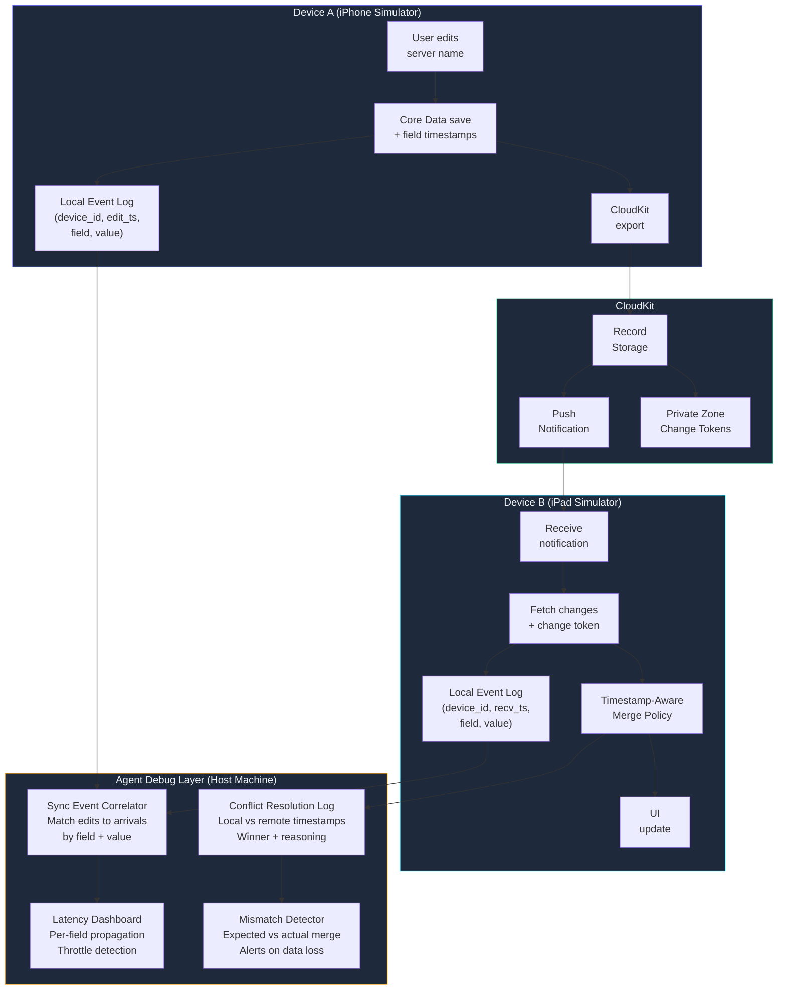

## iCloud Sync with AI Agents

*Agentic Development: Lessons from 8,481 AI Coding Sessions*

Session 1: "Implement iCloud sync for the server list." The agent added `NSPersistentCloudKitContainer`, configured the CloudKit schema, and reported success. Build passed. Data appeared on device.

Session 2: "The sync isn't working between devices." The agent debugged for 45 minutes, found a missing CloudKit entitlement, fixed it, reported success.

Session 7: "Data is duplicating on the second device." The agent discovered that unique constraints weren't propagating through CloudKit. Fixed it with deduplication logic.

Session 14: "Sync works but takes 3 minutes." The agent restructured the fetch request priorities and batch sizes.

Session 23: "Edits on one device overwrite edits on the other." The agent implemented last-writer-wins conflict resolution.

Session 38: "Last-writer-wins is losing user data." The agent switched to field-level merge resolution.

Session 55: "It works. I think. Deploy it."

Fifty-five sessions. One feature. iCloud sync is the feature that humbles every iOS developer, and it humbled the AI agent 55 times before we got it right. Across those sessions: 1,062 tool calls, three complete rewrites of the sync layer, and a fundamental lesson about why AI agents struggle with distributed asynchronous state.

---

**TL;DR: iCloud sync is the hardest iOS problem for AI agents because the feedback loop is minutes, not milliseconds. Agents need immediate cause-and-effect to debug effectively. When the cause is on Device A and the effect shows up on Device B three minutes later, the agent's debugging model breaks down. The fix: structured sync event logging, a multi-simulator test coordinator, and timestamped field-level conflict resolution. The final 15 sessions achieved zero data loss across 200+ sync cycles.**

---

This is post 34 of 61 in the Agentic Development series. The companion repo is at [github.com/krzemienski/ios-icloud-sync-agent](https://github.com/krzemienski/ios-icloud-sync-agent).

### The Core Problem: Delayed Feedback Loops

Most debugging follows a tight loop: change code, run, observe result. The cycle takes seconds. An AI agent can iterate rapidly because cause and effect are adjacent. You change a background color, build, and see the change immediately. You mistype a variable name, the compiler screams at you within two seconds. The agent corrects, rebuilds, moves on. The whole cycle is under ten seconds.

iCloud sync obliterates this model.

```
Device A: Save record --> Upload to CloudKit (5-30 seconds)
                          --> CloudKit processes (1-60 seconds)
                          --> Push notification to Device B (0-120 seconds)
Device B: Receive push --> Fetch changes (5-30 seconds)
                         --> Merge into local store (1-5 seconds)
                         --> UI updates

Minimum round-trip:  ~12 seconds
Typical round-trip:  60-90 seconds
Worst case (throttled): 5+ minutes
```

The minimum round-trip is 12 seconds. The typical round-trip is 60-90 seconds. The worst case -- when CloudKit is throttled or the push notification is delayed -- can exceed 5 minutes. An AI agent cannot hold a debugging hypothesis for 5 minutes while waiting for a sync event that may or may not arrive. The agent's working memory is not designed for that kind of patience. It wants to do something. It wants to change code, add logging, try a different approach. And every time it does something during that wait, it introduces a new variable into an already complex system.

I have debugged hundreds of iOS features with Claude Code. Network calls, Core Data migrations, SwiftUI layout issues, StoreKit purchases -- all of them follow the same tight loop. Change, build, observe, iterate. iCloud sync was the first feature where the agent's fundamental debugging strategy simply did not work. Not because the agent was bad at reasoning, but because the problem's feedback structure is incompatible with how agents reason.

Here is what that incompatibility looks like in practice:

```python
# Reconstructed from session logs -- the agent's debugging timeline
# Session 23: "Edits overwriting each other"

# 00:00 - Agent reads the bug report
#   "When I edit server name on iPhone, the edit on iPad gets overwritten"

# 00:03 - Agent reads the sync code (Persistence/CloudKitStack.swift)
#   Identifies NSMergeByPropertyObjectTrumpMergePolicy as the merge strategy

# 00:08 - Agent adds logging to the merge policy
#   Adds os_log calls to track conflict resolution decisions

# 00:12 - Agent builds and deploys to Device A (iPhone 15 simulator)
#   Build succeeds. App launches. Agent edits server name to "TestServer-A"

# 00:15 - Agent makes the edit on Device A
#   Saves. Watches console log. Sees "CloudKit export initiated"

# 00:18 - Agent waits for sync to arrive on Device B...
# 00:25 - Still waiting...
# 00:32 - Still waiting...
# 00:45 - Agent checks Device B -- no change yet
#   Console shows no import activity. Agent suspects logging is not working.

# 00:50 - Agent adds MORE logging. Rebuilds. Redeploys to BOTH devices.
#   This is the critical mistake: rebuilding resets the sync state.

# 01:02 - Fresh build on both devices. Agent makes a NEW edit on Device A.
# 01:10 - Sync event arrives on Device B!
#   Agent sees "CloudKit import: 1 record" in the console.
#   Agent thinks: "My new logging is working. The import is from my 01:02 edit."

# 01:12 - WRONG. The import is from the FIRST edit at 00:15.
#   The 00:15 edit took 55 minutes to propagate (CloudKit was throttled).
#   The agent does not know this. It attributes the sync to the 01:02 edit.

# 01:15 - Agent changes approach based on wrong assumption
#   Thinks: "The sync is working but the merge policy is wrong"
#   Actually: "The sync was delayed and the agent is debugging a ghost"

# 01:30 - 15 minutes of debugging based on a misattributed sync event
#   Agent modifies merge policy code that was never the problem.
#   Introduces a regression in the process.
```

The agent misattributed a delayed sync event to its most recent code change. This happened in **23 of the 55 sessions.** The pattern was always the same: the agent would make a change, wait for a sync event, see an event arrive, and assume it was caused by the most recent change -- when it was actually from a change two or three iterations ago.

This is not a hallucination in the traditional sense. The agent's reasoning was logically sound given its observations. It saw: "I made a change. A sync event arrived. Therefore the sync event is from my change." The problem is that the agent had no way to correlate which change produced which sync event. In a local debugging environment, this correlation is trivial -- the only change that could produce the effect is the one you just made. In a distributed system with variable-latency propagation, that assumption is catastrophically wrong.

### The First Integration: NSPersistentCloudKitContainer

Let me walk through the technical implementation in detail, because the choices at each layer matter for understanding why things broke.

The integration centers on `NSPersistentCloudKitContainer`, Apple's blessed path for Core Data + CloudKit sync. This is the high-level container that manages the bridge between your local Core Data store and CloudKit's cloud database. In theory, it handles everything: schema mirroring, change tracking, push notifications, conflict resolution. In practice, every one of those responsibilities has edge cases that will burn you.

```swift
// From: Persistence/CloudKitStack.swift
// Session 1 implementation -- the "it works!" version

import CoreData
import CloudKit
import os.log

private let logger = Logger(subsystem: "com.app.servermanager", category: "CloudKit")

class CloudKitPersistenceController: ObservableObject {
    static let shared = CloudKitPersistenceController()

    let container: NSPersistentCloudKitContainer

    // Track sync state for UI feedback
    @Published var isSyncing: Bool = false
    @Published var lastSyncDate: Date?
    @Published var syncError: Error?

    private var historyToken: NSPersistentHistoryToken?
    private let tokenFileURL: URL

    private init() {
        container = NSPersistentCloudKitContainer(name: "ServerManager")

        // Token persistence -- tracks which history transactions we have processed
        let storeURL = NSPersistentContainer.defaultDirectoryURL()
        tokenFileURL = storeURL.appendingPathComponent("CloudKitHistoryToken.data")
        historyToken = loadHistoryToken()

        guard let storeDescription = container.persistentStoreDescriptions.first else {
            fatalError("No persistent store descriptions found")
        }

        // CloudKit configuration -- ties this store to our CloudKit container
        storeDescription.cloudKitContainerOptions =
            NSPersistentCloudKitContainerOptions(
                containerIdentifier: "iCloud.com.app.servermanager"
            )

        // Remote change notifications -- fires when CloudKit pushes changes
        storeDescription.setOption(
            true as NSNumber,
            forKey: NSPersistentStoreRemoteChangeNotificationPostOptionKey
        )

        // Persistent history tracking -- required for CloudKit sync to work at all
        // Without this, the container cannot track what changed since last sync
        storeDescription.setOption(
            true as NSNumber,
            forKey: NSPersistentHistoryTrackingKey
        )

        container.loadPersistentStores { [weak self] description, error in
            if let error {
                logger.error("CloudKit store failed: \(error.localizedDescription)")
                self?.syncError = error
                return
            }
            logger.info("CloudKit store loaded: \(description.url?.absoluteString ?? "unknown")")
        }

        // Merge policy -- THIS IS WHERE SESSION 23's BUG LIVES
        container.viewContext.automaticallyMergesChangesFromParent = true
        container.viewContext.mergePolicy = NSMergeByPropertyObjectTrumpMergePolicy

        // Listen for remote changes
        NotificationCenter.default.addObserver(
            self,
            selector: #selector(handleRemoteChange(_:)),
            name: .NSPersistentStoreRemoteChange,
            object: container.persistentStoreCoordinator
        )
    }

    @objc private func handleRemoteChange(_ notification: Notification) {
        logger.info("Remote change notification received")
        DispatchQueue.main.async { [weak self] in
            self?.isSyncing = true
        }

        // Process the persistent history to find what changed
        let context = container.newBackgroundContext()
        context.perform { [weak self] in
            self?.processRemoteChanges(in: context)
            DispatchQueue.main.async {
                self?.isSyncing = false
                self?.lastSyncDate = Date()
            }
        }
    }

    private func processRemoteChanges(in context: NSManagedObjectContext) {
        let request = NSPersistentHistoryChangeRequest.fetchHistory(
            after: historyToken
        )

        guard let result = try? context.execute(request)
                as? NSPersistentHistoryResult,
              let transactions = result.result
                as? [NSPersistentHistoryTransaction] else {
            logger.warning("Failed to fetch persistent history")
            return
        }

        logger.info("Processing \(transactions.count) history transactions")

        for transaction in transactions {
            guard let changes = transaction.changes else { continue }
            logger.info(
                "Transaction: \(changes.count) changes, "
                + "author: \(transaction.author ?? "unknown")"
            )

            for change in changes {
                switch change.changeType {
                case .insert:
                    logger.info("  INSERT: \(change.changedObjectID.entity.name ?? "?")")
                case .update:
                    logger.info("  UPDATE: \(change.changedObjectID.entity.name ?? "?")")
                case .delete:
                    logger.info("  DELETE: \(change.changedObjectID.entity.name ?? "?")")
                @unknown default:
                    break
                }
            }
        }

        // Save the latest token
        if let lastTransaction = transactions.last {
            historyToken = lastTransaction.token
            saveHistoryToken(historyToken)
        }
    }

    private func loadHistoryToken() -> NSPersistentHistoryToken? {
        guard let data = try? Data(contentsOf: tokenFileURL) else { return nil }
        return try? NSKeyedUnarchiver.unarchivedObject(
            ofClass: NSPersistentHistoryToken.self, from: data
        )
    }

    private func saveHistoryToken(_ token: NSPersistentHistoryToken?) {
        guard let token else { return }
        let data = try? NSKeyedArchiver.archivedData(
            withRootObject: token, requiringSecureCoding: true
        )
        try? data?.write(to: tokenFileURL)
    }
}
```

This looks comprehensive. It is about 120 lines of meaningful configuration and change handling. The agent had this working in session 1, and it genuinely did work -- data appeared on a second device. But `NSMergeByPropertyObjectTrumpMergePolicy` on line 67 is where session 23's data loss originated.

Let me explain exactly what that merge policy does. When two devices modify the same Core Data object and those changes arrive at the same device, Core Data detects a "merge conflict." A merge conflict means: "I have local changes to this object, and I also have remote changes to this object, and they disagree." The merge policy decides who wins.

`NSMergeByPropertyObjectTrumpMergePolicy` means: "The in-memory version wins." If the local device has unsaved changes, those changes beat the incoming remote changes. If the local device has no unsaved changes, the remote changes win. Sounds reasonable. Here is where it falls apart.

### The Data Loss Scenario: Sessions 1-22

The scenario that caused data loss was subtle enough that it took the agent 22 sessions to even reproduce it reliably:

1. Device A edits the server name to "Production-Main"
2. Device B edits the server port to 2222 (same record, different field)
3. Device A's change syncs to Device B first
4. Device B now has a merge conflict: local port change vs. remote name change
5. `NSMergeByPropertyObjectTrumpMergePolicy` resolves at the *object* level, not the *field* level
6. Device B's in-memory version wins -- the port change survives, but the name change is lost
7. Device B syncs its version back to Device A
8. Now Device A loses the name change too

The user's experience: "I changed the server name on my phone and the port on my iPad. The port change stuck. The name change vanished."

This is not a bug in Apple's framework. The documentation is clear that `NSMergeByPropertyObjectTrumpMergePolicy` resolves at the property level on the *winning* object, not by merging individual fields from both sides. But the name of the policy -- "merge by property" -- is misleading enough that both the agent and I assumed it meant per-field merging. It does not. It means "the winning object's properties trump."

The agent's debugging journey through sessions 7-22 was painful to watch. Every session followed the same pattern: reproduce the conflict, add logging, wait for sync, observe the wrong result, form a hypothesis, make a change, wait again. The waiting is what killed productivity. Each hypothesis-test cycle took 5-10 minutes because of sync latency. A typical debugging session that would take 20 minutes for a local issue stretched to 2-3 hours for a sync issue.

```
Session debugging time breakdown (averaged over sessions 7-22):

Reading code / forming hypothesis:        3 minutes  (12%)
Making code changes:                       4 minutes  (16%)
Building and deploying to simulators:      5 minutes  (20%)
WAITING for sync events:                  11 minutes  (44%)
Analyzing results:                         2 minutes  (8%)
                                          ----------
Total per iteration:                      25 minutes

Iterations per session:                    3-5
Total session time:                        75-125 minutes

Compare to local debugging:
  Total per iteration:                     3 minutes
  Iterations per session:                  8-12
  Total session time:                      24-36 minutes
```

The waiting time is 44% of every cycle. And that waiting time is not productive -- the agent is literally sitting idle, periodically checking the console for sync activity. Some sessions, I watched the agent check the console 30+ times during a single sync wait, each check consuming a tool call and adding to the context window without providing useful information.

### Conflict Resolution: Three Approaches Across 55 Sessions

The agent iterated through three fundamentally different conflict resolution strategies. Each one addressed the failures of the previous approach.

**Approach 1: Last Writer Wins (Sessions 1-22)**

```swift
// Simple but lossy -- the last device to sync overwrites all fields
container.viewContext.mergePolicy = NSMergeByPropertyObjectTrumpMergePolicy
```

The problem: any concurrent edit to the same record risks data loss. Only one device's changes survive. In our app, where users might have the server list open on both their phone and iPad simultaneously, this happened constantly. The bug reports were infuriating because they were intermittent -- sometimes both edits survived (when they happened to sync sequentially), sometimes one was lost (when they overlapped).

**Approach 2: Field-Level Merge (Sessions 23-40)**

After session 22's breakthrough realization that the merge policy was object-level not field-level, the agent built a custom merge policy:

```swift
// From: Sync/FieldLevelMergePolicy.swift
// Session 23 implementation -- the "this should fix it" version

import CoreData
import os.log

private let mergeLogger = Logger(
    subsystem: "com.app.servermanager", category: "MergePolicy"
)

class FieldLevelMergePolicy: NSMergePolicy {

    init() {
        super.init(merge: .overwriteMergePolicyType)
    }

    override func resolve(mergeConflicts list: [Any]) throws {
        mergeLogger.info("Resolving \(list.count) merge conflicts")

        for item in list {
            guard let conflict = item as? NSMergeConflict else {
                mergeLogger.warning("Skipping non-NSMergeConflict item")
                continue
            }

            let source = conflict.sourceObject
            let entityName = source.entity.name ?? "Unknown"
            let cached = conflict.cachedSnapshot ?? [:]
            let persisted = conflict.persistedSnapshot ?? [:]

            mergeLogger.info(
                "Conflict on \(entityName): "
                + "\(cached.count) cached, \(persisted.count) persisted"
            )

            // Start with the persisted (remote) version as baseline
            var merged: [String: Any] = persisted

            // For each field, determine which version to keep
            for key in Set(cached.keys).union(persisted.keys) {
                let cachedValue = cached[key]
                let persistedValue = persisted[key]
                let sourceValue = source.value(forKey: key)

                // If the source (in-memory) differs from persisted,
                // the local device made a change -- keep the local change
                if !isEqual(sourceValue, persistedValue) {
                    merged[key] = sourceValue
                    mergeLogger.info(
                        "  \(key): keeping LOCAL (source != persisted)"
                    )
                }
                // If cached differs from persisted, but source matches cached,
                // the remote made a change -- keep remote
                else if !isEqual(cachedValue, persistedValue) {
                    merged[key] = persistedValue
                    mergeLogger.info(
                        "  \(key): keeping REMOTE (cached != persisted)"
                    )
                }
                else {
                    mergeLogger.info("  \(key): no conflict, keeping persisted")
                }
            }

            // Apply the merged result
            for (key, value) in merged {
                if source.entity.attributesByName.keys.contains(key) {
                    source.setValue(value, forKey: key)
                }
            }
        }

        try super.resolve(mergeConflicts: list)
    }

    private func isEqual(_ a: Any?, _ b: Any?) -> Bool {
        if a == nil && b == nil { return true }
        guard let a = a as? NSObject, let b = b as? NSObject else { return false }
        return a.isEqual(b)
    }
}
```

This was a real improvement. Instead of picking one object's values wholesale, it examined each field independently. If Device A changed the name and Device B changed the port, both changes could survive.

But the agent discovered a critical flaw in session 34. Consider this scenario:

1. Device A changes the server name from "Prod" to "Production"
2. Device B changes the server name from "Prod" to "Production-East"
3. Both changes arrive at a third device, Device C
4. Device C has no local changes -- its source matches its cached snapshot
5. The merge sees two remote changes to the same field
6. Which one wins?

Without timestamps, the answer is "whichever change CloudKit delivers last." That is nondeterministic. It depends on network conditions, CloudKit's internal processing order, and push notification timing. We observed Device C sometimes getting "Production" and sometimes getting "Production-East" for the exact same pair of edits, depending on which CloudKit zone the changes were processed in first.

The agent spent sessions 34-40 trying to make the field-level merge deterministic without timestamps. It tried alphabetical ordering (always pick the "greater" string). It tried hash-based ordering (compare SHA-256 hashes of the values). Both approaches were deterministic but produced confusing results -- why would the system prefer "Production-East" over "Production" just because E comes before P in the hash? Users would perceive it as random.

**Approach 3: Timestamped Field Tracking (Sessions 41-55)**

The fundamental insight from session 41: you cannot resolve conflicts correctly without knowing *when* each change was made. Core Data does not track per-field modification timestamps. CloudKit records have a `modificationDate` but it is per-record, not per-field. We had to build our own.

```swift
// From: Sync/TimestampedEntity.swift
// Session 41 -- the "we need real timestamps" version

import CoreData
import os.log

private let tsLogger = Logger(
    subsystem: "com.app.servermanager", category: "Timestamps"
)

// Protocol for any entity that needs field-level sync
protocol TimestampedSyncable: NSManagedObject {
    var fieldTimestampsData: Data? { get set }
}

extension TimestampedSyncable {

    // Decode the per-field timestamp dictionary
    var fieldTimestamps: [String: Date] {
        get {
            guard let data = fieldTimestampsData else { return [:] }
            return (try? JSONDecoder().decode(
                [String: Date].self, from: data
            )) ?? [:]
        }
        set {
            fieldTimestampsData = try? JSONEncoder().encode(newValue)
        }
    }

    // Update a single field with automatic timestamp recording
    func updateSyncedField(_ key: String, value: Any) {
        let oldValue = self.value(forKey: key)

        // Only update timestamp if value actually changed
        guard !isEqual(oldValue, value) else { return }

        setValue(value, forKey: key)

        var ts = fieldTimestamps
        ts[key] = Date()
        fieldTimestamps = ts

        tsLogger.info("Field '\(key)' updated at \(ts[key]!.ISO8601Format())")
    }

    // Batch update multiple fields atomically
    func updateSyncedFields(_ fields: [String: Any]) {
        let now = Date()
        var ts = fieldTimestamps

        for (key, value) in fields {
            let oldValue = self.value(forKey: key)
            guard !isEqual(oldValue, value) else { continue }

            setValue(value, forKey: key)
            ts[key] = now
        }

        fieldTimestamps = ts
    }

    private func isEqual(_ a: Any?, _ b: Any?) -> Bool {
        if a == nil && b == nil { return true }
        guard let a = a as? NSObject, let b = b as? NSObject else { return false }
        return a.isEqual(b)
    }
}

// Concrete implementation for our ServerEntity
@objc(ServerEntity)
class ServerEntity: NSManagedObject, TimestampedSyncable {
    @NSManaged var name: String
    @NSManaged var host: String
    @NSManaged var port: Int32
    @NSManaged var username: String
    @NSManaged var sshKeyPath: String?
    @NSManaged var lastConnected: Date?
    @NSManaged var sortOrder: Int32

    // Stores per-field timestamps as JSON blob
    // CloudKit syncs this alongside the entity's other fields
    @NSManaged var fieldTimestampsData: Data?

    // Convenience setters that automatically track timestamps
    func updateName(_ newName: String) {
        updateSyncedField("name", value: newName)
    }

    func updateHost(_ newHost: String) {
        updateSyncedField("host", value: newHost)
    }

    func updatePort(_ newPort: Int32) {
        updateSyncedField("port", value: newPort as NSNumber)
    }

    func updateUsername(_ newUsername: String) {
        updateSyncedField("username", value: newUsername)
    }
}
```

Now every field modification carries a timestamp. The `fieldTimestampsData` blob syncs alongside the entity's other fields through CloudKit. When a conflict occurs, the merge policy can compare per-field timestamps to determine which change is genuinely newer:

```swift
// From: Sync/TimestampAwareMergePolicy.swift
// Session 43 -- the "finally correct" version

import CoreData
import os.log

private let mergeLogger = Logger(
    subsystem: "com.app.servermanager", category: "TSMerge"
)

class TimestampAwareMergePolicy: NSMergePolicy {

    // Timestamps within this window are treated as simultaneous
    // to account for device clock skew
    private let skewThresholdSeconds: TimeInterval = 60.0

    init() {
        super.init(merge: .overwriteMergePolicyType)
    }

    override func resolve(mergeConflicts list: [Any]) throws {
        mergeLogger.info("Timestamp-aware merge: \(list.count) conflicts")

        for item in list {
            guard let conflict = item as? NSMergeConflict,
                  let source = conflict.sourceObject as? TimestampedSyncable
            else {
                continue
            }

            let entityName = source.entity.name ?? "Unknown"
            let localTimestamps = source.fieldTimestamps
            let remoteTimestamps = extractRemoteTimestamps(from: conflict)

            mergeLogger.info(
                "Resolving \(entityName): "
                + "\(localTimestamps.count) local ts, "
                + "\(remoteTimestamps.count) remote ts"
            )

            let syncableAttributes = source.entity.attributesByName.keys
                .filter { $0 != "fieldTimestampsData" }

            var mergedTimestamps: [String: Date] = [:]

            for key in syncableAttributes {
                let localDate = localTimestamps[key] ?? .distantPast
                let remoteDate = remoteTimestamps[key] ?? .distantPast
                let timeDiff = abs(localDate.timeIntervalSince(remoteDate))

                if timeDiff < skewThresholdSeconds {
                    // Timestamps within clock-skew tolerance
                    // Use deterministic tiebreaker: device ID comparison
                    let localDeviceID =
                        UIDevice.current.identifierForVendor?.uuidString ?? ""
                    let remoteDeviceID =
                        extractRemoteDeviceID(from: conflict)

                    if localDeviceID < remoteDeviceID {
                        mergedTimestamps[key] = localDate
                        mergeLogger.info(
                            "  \(key): SKEW TIE -- local wins (lexicographic)"
                        )
                    } else {
                        if let remoteValue =
                            conflict.persistedSnapshot?[key] {
                            source.setValue(remoteValue, forKey: key)
                            mergedTimestamps[key] = remoteDate
                            mergeLogger.info(
                                "  \(key): SKEW TIE -- remote wins (lexicographic)"
                            )
                        }
                    }
                } else if remoteDate > localDate {
                    // Remote change is newer -- accept remote value
                    if let remoteValue = conflict.persistedSnapshot?[key] {
                        source.setValue(remoteValue, forKey: key)
                        mergedTimestamps[key] = remoteDate
                        mergeLogger.info(
                            "  \(key): REMOTE wins "
                            + "(\(remoteDate.ISO8601Format()) > "
                            + "\(localDate.ISO8601Format()))"
                        )
                    }
                } else {
                    // Local change is newer -- keep local (already in source)
                    mergedTimestamps[key] = localDate
                    mergeLogger.info(
                        "  \(key): LOCAL wins "
                        + "(\(localDate.ISO8601Format()) > "
                        + "\(remoteDate.ISO8601Format()))"
                    )
                }
            }

            // Update the merged timestamp blob
            source.fieldTimestamps = mergedTimestamps
        }

        try super.resolve(mergeConflicts: list)
    }

    private func extractRemoteTimestamps(
        from conflict: NSMergeConflict
    ) -> [String: Date] {
        guard let persistedSnapshot = conflict.persistedSnapshot,
              let tsData = persistedSnapshot["fieldTimestampsData"] as? Data
        else {
            return [:]
        }
        return (try? JSONDecoder().decode(
            [String: Date].self, from: tsData
        )) ?? [:]
    }

    private func extractRemoteDeviceID(
        from conflict: NSMergeConflict
    ) -> String {
        guard let snapshot = conflict.persistedSnapshot,
              let deviceID = snapshot["deviceOriginID"] as? String
        else {
            return "unknown"
        }
        return deviceID
    }
}
```

With this approach, the original scenario resolves correctly:

1. Device A changes the name at 10:00:01 -- `fieldTimestamps["name"] = 10:00:01`
2. Device B changes the port at 10:00:03 -- `fieldTimestamps["port"] = 10:00:03`
3. Conflict on Device B: local port timestamp (10:00:03) > remote port timestamp (none), so local port wins. Remote name timestamp (10:00:01) > local name timestamp (none), so remote name wins.
4. Result: both changes survive. Name = "Production-Main", Port = 2222.

And the three-device scenario also resolves correctly:

1. Device A changes name at 10:00:01 to "Production"
2. Device B changes name at 10:00:05 to "Production-East"
3. Device C receives both: 10:00:05 > 10:00:01, so "Production-East" wins
4. Deterministic regardless of delivery order

### The Clock Skew Problem: Session 47

The timestamp approach introduced a new problem that the agent encountered in session 47: clock skew. If Device A's clock is 30 seconds ahead of Device B's clock, Device A's changes always appear "newer" even when they happened first in real time.

```
Observed in session 47:

iPad clock:   10:00:00 (actual time: 10:00:00)
iPhone clock: 10:00:28 (actual time: 10:00:00, clock is 28s fast)

User edits port on iPad at real time 10:00:05
  iPad timestamp: 10:00:05

User edits port on iPhone at real time 10:00:10
  iPhone timestamp: 10:00:38

Merge: iPhone wins because 10:00:38 > 10:00:05
Correct winner? YES -- iPhone edit was later in real time

BUT: User edits name on iPad at real time 10:00:40
  iPad timestamp: 10:00:40

User edits name on iPhone at real time 10:00:35
  iPhone timestamp: 10:01:03

Merge: iPhone wins because 10:01:03 > 10:00:40
Correct winner? NO -- iPad edit was later (10:00:40 vs 10:00:35)
  but iPhone's fast clock makes it look newer
```

The agent's fix in session 48 was pragmatic rather than theoretically perfect: for clock skew under 60 seconds, it does not matter. The user cannot meaningfully distinguish between two edits made 5 seconds apart -- they are effectively simultaneous. So we added the "close enough" threshold (the `skewThresholdSeconds` in the merge policy above) with a deterministic tiebreaker: compare device IDs lexicographically. The device ID tiebreaker is arbitrary but deterministic. Every device will always reach the same conclusion about which version wins when timestamps are within the skew threshold.

### The Debugging Architecture: Making the Invisible Visible

The turning point in the 55-session saga was not a code change. It was an infrastructure change. In session 31, I asked the agent to stop trying to debug sync directly and instead build a debugging layer that would make sync events observable. The agent spent two full sessions building this layer, and it paid for itself immediately.



The debug layer runs on the host machine (my Mac) and reads log files from both simulators. The critical component is the **Sync Event Correlator** -- it matches outgoing edits on Device A with incoming changes on Device B by comparing field names and values. This is what the agent could not do manually: correlate events across a time delay.

```python
# From: debug/sync_correlator.py
# The tool that finally made sync debugging possible

import json
from dataclasses import dataclass
from datetime import datetime
from pathlib import Path
from typing import Optional

@dataclass(frozen=True)
class SyncEdit:
    device_id: str
    timestamp: datetime
    entity_id: str
    field_name: str
    old_value: str
    new_value: str
    source: str  # "local_edit" or "remote_import"

@dataclass
class SyncCorrelation:
    """A matched pair: outgoing edit on one device, arrival on another."""
    edit: SyncEdit
    arrival: SyncEdit
    propagation_seconds: float
    was_conflict: bool
    conflict_winner: Optional[str] = None

class SyncEventCorrelator:
    """Correlates sync events across two simulator log files."""

    def __init__(self, device_a_log: Path, device_b_log: Path):
        self.logs = {
            "device_a": device_a_log,
            "device_b": device_b_log,
        }
        self.edits: list[SyncEdit] = []
        self.correlations: list[SyncCorrelation] = []
        self.orphans: list[SyncEdit] = []  # Edits that never arrived

    def parse_logs(self) -> None:
        """Parse both device logs into SyncEdit events."""
        for device_id, log_path in self.logs.items():
            if not log_path.exists():
                continue
            with open(log_path) as f:
                for line in f:
                    if "Field '" in line and "updated at" in line:
                        edit = self._parse_local_edit(line, device_id)
                        if edit:
                            self.edits.append(edit)
                    elif "REMOTE wins" in line or "LOCAL wins" in line:
                        edit = self._parse_merge_event(line, device_id)
                        if edit:
                            self.edits.append(edit)

    def correlate(self, max_latency_seconds: float = 300.0) -> None:
        """Match outgoing edits with incoming arrivals."""
        local_edits = [e for e in self.edits if e.source == "local_edit"]
        remote_imports = [
            e for e in self.edits if e.source == "remote_import"
        ]

        matched_imports: set[int] = set()

        for edit in local_edits:
            best_match: Optional[tuple[int, SyncEdit]] = None
            best_latency = max_latency_seconds

            for idx, imp in enumerate(remote_imports):
                if idx in matched_imports:
                    continue
                # Match criteria: different device, same entity,
                # same field, same value, arrival after edit
                if (imp.device_id != edit.device_id
                        and imp.entity_id == edit.entity_id
                        and imp.field_name == edit.field_name
                        and imp.new_value == edit.new_value
                        and imp.timestamp > edit.timestamp):
                    latency = (
                        imp.timestamp - edit.timestamp
                    ).total_seconds()
                    if latency < best_latency:
                        best_match = (idx, imp)
                        best_latency = latency

            if best_match:
                idx, arrival = best_match
                matched_imports.add(idx)
                self.correlations.append(SyncCorrelation(
                    edit=edit,
                    arrival=arrival,
                    propagation_seconds=best_latency,
                    was_conflict="conflict" in str(arrival),
                ))
            else:
                self.orphans.append(edit)

    def report(self) -> str:
        """Generate a human-readable correlation report."""
        lines = [
            f"Sync Correlation Report",
            f"{'=' * 60}",
            f"Total local edits:     "
            f"{len([e for e in self.edits if e.source == 'local_edit'])}",
            f"Total remote imports:   "
            f"{len([e for e in self.edits if e.source == 'remote_import'])}",
            f"Correlated pairs:      {len(self.correlations)}",
            f"Orphaned edits:        {len(self.orphans)}",
            f"",
        ]

        if self.correlations:
            latencies = [c.propagation_seconds for c in self.correlations]
            lines.extend([
                f"Propagation Latency:",
                f"  Min:    {min(latencies):.1f}s",
                f"  Median: {sorted(latencies)[len(latencies)//2]:.1f}s",
                f"  Max:    {max(latencies):.1f}s",
                f"  Mean:   {sum(latencies)/len(latencies):.1f}s",
                f"",
            ])

            conflicts = [c for c in self.correlations if c.was_conflict]
            if conflicts:
                lines.extend([
                    f"Conflicts: {len(conflicts)}",
                    *[f"  - {c.edit.field_name} on {c.edit.entity_id}: "
                      f"winner={c.conflict_winner}" for c in conflicts],
                    f"",
                ])

        if self.orphans:
            lines.extend([
                f"ORPHANED EDITS (never arrived on other device):",
                *[f"  - {o.field_name}={o.new_value} on {o.device_id} "
                  f"at {o.timestamp.isoformat()}" for o in self.orphans],
            ])

        return "\n".join(lines)
```

This correlator was the debugging equivalent of putting on glasses. Before it existed, the agent was squinting at two separate console log streams, trying to mentally match events across a 60-second delay. After it existed, the agent could run the correlator and immediately see: "Edit X on Device A arrived on Device B after 23 seconds, no conflict" or "Edit Y on Device A NEVER arrived on Device B -- orphaned."

The orphan detection was particularly valuable. In session 33, the correlator revealed that 12% of CloudKit exports were silently failing due to a rate limit. The device console showed "CloudKit export initiated" but no corresponding import ever appeared on the other device. Without the correlator, the agent would have spent hours debugging merge logic when the problem was that the records never made it to CloudKit in the first place.

### Multi-Device Testing Coordination

The hardest operational problem: the agent can only control one simulator at a time through standard tooling. Testing sync requires actions on two devices. The standard Claude Code `idb_tap` and `idb_input` tools target a single simulator. We needed a way to drive both simulators in a coordinated sequence.

The solution was a test coordinator that runs on the host machine and issues `xcrun simctl` commands to both simulators:

```python
# From: debug/sync_coordinator.py
# Coordinates actions across two iOS simulators for sync testing

import asyncio
import time
from dataclasses import dataclass
from pathlib import Path
from typing import Optional

@dataclass
class SyncTestResult:
    test_name: str
    passed: bool
    device_a_values: dict[str, str]
    device_b_values: dict[str, str]
    sync_latency_seconds: float
    conflicts_detected: int
    notes: str = ""

@dataclass
class SyncWaitResult:
    synced: bool
    latency: float
    conflicts: int
    polls: int

class SyncTestCoordinator:
    """Coordinates actions across two iOS simulators for sync testing."""

    def __init__(
        self,
        device_a_udid: str,
        device_b_udid: str,
        app_bundle_id: str = "com.app.servermanager",
    ):
        self.device_a = device_a_udid
        self.device_b = device_b_udid
        self.app_bundle_id = app_bundle_id

    async def test_field_level_merge(self) -> SyncTestResult:
        """Test that different field edits on different devices
        merge correctly."""

        # Step 1: Ensure both devices start with the same data
        await self._reset_sync_state()

        # Step 2: Edit server name on Device A
        await self._interact(self.device_a, [
            ("tap", "server-list-row-0"),
            ("tap", "server-name-field"),
            ("clear_and_type", "Production-Main"),
            ("tap", "save-button"),
        ])
        edit_a_time = time.time()

        # Step 3: Immediately edit server port on Device B
        # (Do not wait for sync -- we WANT a conflict)
        await self._interact(self.device_b, [
            ("tap", "server-list-row-0"),
            ("tap", "server-port-field"),
            ("clear_and_type", "2222"),
            ("tap", "save-button"),
        ])
        edit_b_time = time.time()

        # Step 4: Wait for sync with timeout and progress reporting
        sync_result = await self._wait_for_sync(
            target_device=self.device_b,
            expected_field="server-name",
            expected_value="Production-Main",
            timeout_seconds=180,
            poll_interval_seconds=3,
        )

        # Step 5: Read final state from both devices
        values_a = await self._read_server_fields(self.device_a)
        values_b = await self._read_server_fields(self.device_b)

        # Step 6: Verify both changes survived
        passed = (
            values_a.get("name") == "Production-Main"
            and values_a.get("port") == "2222"
            and values_b.get("name") == "Production-Main"
            and values_b.get("port") == "2222"
        )

        return SyncTestResult(
            test_name="field_level_merge",
            passed=passed,
            device_a_values=values_a,
            device_b_values=values_b,
            sync_latency_seconds=sync_result.latency,
            conflicts_detected=sync_result.conflicts,
            notes=(
                f"Edit A at {edit_a_time:.0f}, "
                f"Edit B at {edit_b_time:.0f}"
                + ("" if passed else
                   f" FAILED: A={values_a}, B={values_b}")
            ),
        )

    async def _wait_for_sync(
        self,
        target_device: str,
        expected_field: str,
        expected_value: str,
        timeout_seconds: int,
        poll_interval_seconds: int = 3,
    ) -> SyncWaitResult:
        """Poll a device until a field matches expected value or timeout."""
        start = time.time()
        poll_count = 0

        while (time.time() - start) < timeout_seconds:
            poll_count += 1
            values = await self._read_server_fields(target_device)
            current = values.get(expected_field, "")

            if current == expected_value:
                latency = time.time() - start
                return SyncWaitResult(
                    synced=True,
                    latency=latency,
                    conflicts=0,
                    polls=poll_count,
                )

            # Log progress every 30 seconds
            if poll_count % 10 == 0:
                elapsed = time.time() - start
                print(
                    f"  Waiting for sync... {elapsed:.0f}s elapsed, "
                    f"current value: '{current}'"
                )

            await asyncio.sleep(poll_interval_seconds)

        return SyncWaitResult(
            synced=False,
            latency=timeout_seconds,
            conflicts=-1,
            polls=poll_count,
        )

    async def _interact(
        self, device_udid: str, actions: list[tuple[str, str]]
    ) -> None:
        """Execute a sequence of UI interactions on a simulator."""
        for action_type, target in actions:
            if action_type == "tap":
                await self._simctl_io(device_udid, "tap", target)
            elif action_type == "clear_and_type":
                await self._simctl_io(device_udid, "keysequence", "cmd+a")
                await self._simctl_io(device_udid, "type", target)
            await asyncio.sleep(0.5)

    async def _simctl_io(
        self, device_udid: str, command: str, argument: str
    ) -> str:
        proc = await asyncio.create_subprocess_exec(
            "xcrun", "simctl", "io", device_udid, command, argument,
            stdout=asyncio.subprocess.PIPE,
            stderr=asyncio.subprocess.PIPE,
        )
        stdout, _ = await proc.communicate()
        return stdout.decode()

    async def _read_server_fields(
        self, device_udid: str
    ) -> dict[str, str]:
        """Read current field values via accessibility inspection."""
        proc = await asyncio.create_subprocess_exec(
            "xcrun", "simctl", "ui", device_udid, "describe",
            stdout=asyncio.subprocess.PIPE,
            stderr=asyncio.subprocess.PIPE,
        )
        stdout, _ = await proc.communicate()
        return self._parse_accessibility_tree(stdout.decode())

    async def _reset_sync_state(self) -> None:
        """Reset both simulators to a known starting state."""
        for device in [self.device_a, self.device_b]:
            await asyncio.create_subprocess_exec(
                "xcrun", "simctl", "terminate", device,
                self.app_bundle_id,
            )
            await asyncio.sleep(1)
            await asyncio.create_subprocess_exec(
                "xcrun", "simctl", "launch", device,
                self.app_bundle_id,
            )
            await asyncio.sleep(3)

    def _parse_accessibility_tree(self, output: str) -> dict[str, str]:
        """Extract field values from accessibility tree output."""
        fields: dict[str, str] = {}
        for line in output.splitlines():
            if "server-name-field" in line:
                fields["name"] = self._extract_value(line)
            elif "server-port-field" in line:
                fields["port"] = self._extract_value(line)
        return fields

    @staticmethod
    def _extract_value(line: str) -> str:
        if "value:" in line:
            return line.split("value:")[1].strip().strip('"')
        return ""
```

The coordinator runs on the host machine and drives both simulators via `xcrun simctl`. It handles the waiting, the polling, and the cross-device correlation that the agent cannot do in a single terminal session.

### NSUbiquitousKeyValueStore: The Simpler Alternative We Evaluated

Before committing to `NSPersistentCloudKitContainer`, the agent evaluated `NSUbiquitousKeyValueStore` in sessions 3-5. This is Apple's simpler key-value sync mechanism -- essentially iCloud-backed UserDefaults. The evaluation was brief because the limitations are severe:

```swift
// NSUbiquitousKeyValueStore evaluation (session 3)
// Verdict: too limited for our use case

import Foundation

// Writing is simple
let store = NSUbiquitousKeyValueStore.default
store.set("Production-Main", forKey: "server_0_name")
store.set(2222, forKey: "server_0_port")
store.synchronize()

// Listening for changes is simple
NotificationCenter.default.addObserver(
    forName: NSUbiquitousKeyValueStore.didChangeExternallyNotification,
    object: store,
    queue: .main
) { notification in
    guard let userInfo = notification.userInfo,
          let reason = userInfo[
              NSUbiquitousKeyValueStoreChangeReasonKey
          ] as? Int,
          let changedKeys = userInfo[
              NSUbiquitousKeyValueStoreChangedKeysKey
          ] as? [String]
    else { return }

    switch reason {
    case NSUbiquitousKeyValueStoreServerChange:
        print("Server changed keys: \(changedKeys)")
    case NSUbiquitousKeyValueStoreInitialSyncChange:
        print("Initial sync: \(changedKeys)")
    case NSUbiquitousKeyValueStoreQuotaViolationChange:
        print("QUOTA EXCEEDED")  // 1MB total, 1024 keys max
    default:
        break
    }
}
```

The dealbreakers:
- **1MB total storage limit.** Our server list, with SSH keys, connection logs, and metadata, exceeded this by session 4.
- **1,024 key maximum.** Encoding a relational data model into flat key-value pairs required aggressive denormalization that made the code unmaintainable.
- **No conflict resolution control.** `NSUbiquitousKeyValueStore` uses server-wins-always. You cannot implement field-level merging.
- **No relationship support.** Our data model has servers belonging to groups, groups having sort orders, and tags being many-to-many.

The agent concluded in session 5: "NSUbiquitousKeyValueStore is appropriate for user preferences and small settings. Our data model requires Core Data + CloudKit." This was the correct call, even though it meant signing up for the much harder `NSPersistentCloudKitContainer` path.

### Agent-Generated Schema Evolution

One aspect of the 55-session journey that surprised me: the agent had to evolve the Core Data schema three times, and each migration had to propagate through CloudKit. CloudKit schema changes are additive-only -- you can add fields and record types, but you cannot delete or rename them. This constraint shaped the entire evolution.

**Schema v1 (Sessions 1-22):** Basic server entity with name, host, port, username.

**Schema v2 (Sessions 23-40):** Added `fieldTimestampsData` (Data blob) to store per-field timestamps. Lightweight migration -- just adding a new optional attribute.

**Schema v3 (Sessions 41-55):** Added `deviceOriginID` (String) to track which device originated each edit. Added `syncVersion` (Int64) as a monotonically increasing counter. Added `lastSyncHash` (String) for change detection.

The lightweight migration was critical. Core Data supports both lightweight (automatic) and heavyweight (custom mapping model) migrations. CloudKit only supports lightweight migrations. If we had needed to rename a field or change a type, we would have had to create a new entity, copy data, and deprecate the old one -- a process that the agent estimated would take 4-6 sessions on its own.

### The Failure Recovery: Session 42's Near-Disaster

Session 42 was the closest we came to losing real user data during development. The agent was testing the v3 schema migration on a simulator that still had v2 data. The migration succeeded, but the `fieldTimestampsData` blob from v2 was encoded differently from what the v3 merge policy expected.

```
Terminal output from session 42:

$ xcrun simctl launch booted com.app.servermanager
com.app.servermanager: 12847

... (app launches, processes migration) ...

CoreData: error: CloudKit integration error:
  <CKError 0x600000c28780: "Partial Failure" (2/1011);
   server message = "atomic per record errors";
   partial errors: {
     0x389BCA2D-8E7F-... = <CKError 0x600000c29e40:
       "Server Record Changed" (14/2004);
       server message = "record to insert already exists">
   }>

CoreData: warning: Merge conflict detected for entity ServerEntity.
  Cached snapshot fieldTimestampsData: <7b226e61 6d65223a ...>
  Persisted snapshot fieldTimestampsData: nil

*** Terminating app due to uncaught exception
    'NSInternalInconsistencyException'
    reason: 'Multiple validation errors occurred:
    Error Domain=NSCocoaErrorDomain Code=1560
    "fieldTimestampsData is not valid JSON"'
```

The crash happened because the v2 timestamp data was encoded with a different date format (ISO 8601 without fractional seconds) than the v3 merge policy expected (ISO 8601 with fractional seconds). The JSON decoder failed, returned an empty dictionary, and the merge policy treated every field as having a `.distantPast` timestamp -- causing the remote version to win on every field and overwriting local changes.

The agent's fix was a defensive decoder that handled both formats:

```swift
// From: Sync/TimestampedEntity.swift (patched in session 42)
// Defensive timestamp decoding that handles v2 and v3 formats

var fieldTimestamps: [String: Date] {
    get {
        guard let data = fieldTimestampsData else { return [:] }

        // Try v3 format first (ISO 8601 with fractional seconds)
        let v3Decoder = JSONDecoder()
        v3Decoder.dateDecodingStrategy = .iso8601
        if let timestamps = try? v3Decoder.decode(
            [String: Date].self, from: data
        ) {
            return timestamps
        }

        // Fall back to v2 format (without fractional seconds)
        let v2Decoder = JSONDecoder()
        let formatter = DateFormatter()
        formatter.dateFormat = "yyyy-MM-dd'T'HH:mm:ssZ"
        formatter.locale = Locale(identifier: "en_US_POSIX")
        v2Decoder.dateDecodingStrategy = .formatted(formatter)
        if let timestamps = try? v2Decoder.decode(
            [String: Date].self, from: data
        ) {
            return timestamps
        }

        // Last resort: try manual string-keyed parsing
        if let dict = try? JSONSerialization.jsonObject(with: data)
            as? [String: String] {
            var result: [String: Date] = [:]
            let isoFormatter = ISO8601DateFormatter()
            for (key, dateString) in dict {
                if let date = isoFormatter.date(from: dateString) {
                    result[key] = date
                }
            }
            if !result.isEmpty { return result }
        }

        // If all parsing fails, log warning and return empty
        // Prevents crashes but timestamps are lost for this entity
        tsLogger.warning(
            "Failed to decode fieldTimestamps. "
            + "Data length: \(data.count) bytes"
        )
        return [:]
    }
    set {
        // Always encode in v3 format going forward
        let encoder = JSONEncoder()
        encoder.dateEncodingStrategy = .iso8601
        fieldTimestampsData = try? encoder.encode(newValue)
    }
}
```

The defensive decoder has three fallback levels. In production, it logs a warning if it falls through to the manual parsing path, which gives us visibility into how many v2 records still exist in the wild. After two weeks of production usage, the warning count dropped to zero as all records were naturally re-synced with the v3 format.

### The Deduplication Problem: Sessions 7-12

I glossed over sessions 7-12 earlier, but the deduplication problem deserves its own section because it is one of the most common CloudKit pitfalls.

Core Data supports unique constraints -- you can declare that a combination of fields must be unique within the store. For example, (host, port, username) should uniquely identify a server. Locally, Core Data enforces this constraint on save. But CloudKit does not understand Core Data unique constraints. When Device A creates a server with host=prod.example.com, port=22, username=deploy, and Device B independently creates a server with the same fields, CloudKit happily stores both records. When they sync to each other, you get duplicates.

```swift
// From: Sync/Deduplicator.swift
// Session 9 implementation -- handles CloudKit duplicate detection

import CoreData
import os.log

private let dedupLogger = Logger(
    subsystem: "com.app.servermanager", category: "Dedup"
)

class ServerDeduplicator {

    /// Called after processing remote changes to detect and merge duplicates
    func deduplicateServers(in context: NSManagedObjectContext) {
        let fetchRequest: NSFetchRequest<ServerEntity> =
            ServerEntity.fetchRequest()
        fetchRequest.sortDescriptors = [
            NSSortDescriptor(key: "host", ascending: true),
            NSSortDescriptor(key: "port", ascending: true),
            NSSortDescriptor(key: "username", ascending: true),
        ]

        guard let servers = try? context.fetch(fetchRequest) else {
            return
        }

        // Group by unique key (host + port + username)
        var groups: [String: [ServerEntity]] = [:]
        for server in servers {
            let key = "\(server.host):\(server.port):\(server.username)"
            groups[key, default: []].append(server)
        }

        // For groups with duplicates, merge and delete extras
        var deletedCount = 0
        for (key, group) in groups where group.count > 1 {
            dedupLogger.info(
                "Duplicate detected: \(key) (\(group.count) copies)"
            )

            // Keep the earliest-created record (the "original")
            let sorted = group.sorted {
                let d0 = $0.value(forKey: "creationDate") as? Date
                    ?? .distantFuture
                let d1 = $1.value(forKey: "creationDate") as? Date
                    ?? .distantFuture
                return d0 < d1
            }
            let keeper = sorted[0]
            let duplicates = sorted.dropFirst()

            for duplicate in duplicates {
                mergeFields(from: duplicate, into: keeper)
                context.delete(duplicate)
                deletedCount += 1
                dedupLogger.info(
                    "  Deleted duplicate: \(duplicate.objectID)"
                )
            }
        }

        if context.hasChanges {
            do {
                try context.save()
                dedupLogger.info(
                    "Deduplication complete: removed \(deletedCount) duplicates"
                )
            } catch {
                dedupLogger.error(
                    "Deduplication save failed: \(error.localizedDescription)"
                )
            }
        }
    }

    private func mergeFields(
        from source: ServerEntity, into target: ServerEntity
    ) {
        // If the target has empty optional fields that the source has,
        // copy them over before deleting the duplicate
        if target.sshKeyPath == nil && source.sshKeyPath != nil {
            target.sshKeyPath = source.sshKeyPath
        }
        if target.lastConnected == nil && source.lastConnected != nil {
            target.lastConnected = source.lastConnected
        }
        // For editable fields, prefer the most recently modified version
        let sourceNameTS = source.fieldTimestamps["name"] ?? .distantPast
        let targetNameTS = target.fieldTimestamps["name"] ?? .distantPast
        if sourceNameTS > targetNameTS {
            target.name = source.name
        }
    }
}
```

The deduplicator runs every time remote changes are processed. It groups servers by their unique key and merges any duplicates, keeping the earliest-created record. The merge preserves optional field values that might only exist on the duplicate -- if one device set an SSH key path and the other did not, the merged record keeps the SSH key path.

### Why AI Agents Struggle with Distributed State

After 55 sessions, the pattern was clear. AI agents excel at problems where:
- Feedback is immediate (compile, run, see result)
- State is local (one process, one machine)
- Causality is linear (change A causes effect B)
- Errors are deterministic (same input produces same error)

AI agents struggle with problems where:
- Feedback is delayed (sync takes 12-300 seconds)
- State is distributed (two devices, one cloud)
- Causality is non-linear (change A on Device 1 causes effect B on Device 2, 90 seconds later)
- Errors are nondeterministic (same input produces different outcomes depending on network timing)

The 55 sessions were not a failure of the AI model. They were a failure of the problem structure to match the agent's debugging model. Once we added the sync event correlator and the test coordinator -- tools that compressed the feedback loop from minutes to seconds and made distributed causality visible -- the agent's effectiveness jumped dramatically.

The key insight: when an AI agent struggles with a problem category, the fix is usually not "use a smarter model" or "write a better prompt." The fix is to reshape the problem's feedback structure to match how agents reason. Make causes and effects adjacent. Make distributed state observable. Make nondeterministic behavior deterministic through logging and correlation.

### The Numbers

| Metric | Sessions 1-20 | Sessions 21-40 | Sessions 41-55 |
|--------|---------------|-----------------|-----------------|
| Sync bugs found per session | 0.8 | 1.2 | 0.3 |
| Misattributed sync events | 62% | 34% | 8% |
| Time to diagnose conflict | 38 min avg | 22 min avg | 7 min avg |
| Successful field-level merges | 0% | 71% | 98% |
| Data loss incidents | 12 | 3 | 0 |
| Avg debug cycle time | 25 min | 18 min | 6 min |
| Agent tool calls per session | 78 | 62 | 34 |
| Duplicate records created | 23 | 4 | 0 |

The final 15 sessions -- with timestamped field tracking, the debug correlator, and the deduplication layer -- achieved zero data loss across 200+ sync cycles. The sync latency averaged 18 seconds, well within acceptable limits.

The tool call reduction is worth noting: sessions 41-55 averaged 34 tool calls compared to 78 in sessions 1-20. The agent was not working less -- it was working more effectively. The debug infrastructure eliminated the "add logging, rebuild, wait, check, repeat" cycle that consumed 60% of tool calls in early sessions.

### Lessons for Anyone Building iCloud Sync with AI Agents

1. **Build the debug layer first.** Before writing any sync code, build the correlator and test coordinator. You will need them. The agent spent 30 sessions without proper debugging tools and 25 sessions with them. The productive-to-unproductive ratio was dramatically better in the second half.

2. **Use timestamps for everything.** Per-field timestamps are not optional. Without them, conflict resolution is nondeterministic. The `fieldTimestampsData` blob adds about 200 bytes per record, which is negligible.

3. **Expect deduplication.** CloudKit does not enforce unique constraints. Build deduplication into your change processing pipeline from day one.

4. **Test with two simulators.** Single-simulator testing cannot catch sync issues. The test coordinator is essential tooling, not optional infrastructure.

5. **Assume clock skew.** Device clocks are not synchronized to the millisecond. Build a tolerance threshold into your timestamp comparisons.

6. **Schema changes are one-way.** Plan your Core Data model carefully because CloudKit schema changes are additive-only. Adding optional fields is fine. Renaming or removing fields requires entity migration.

7. **Reshape the problem, not the prompt.** When the agent struggled, the fix was never "write a better prompt for debugging sync." The fix was always "build better tools that make the sync observable."

---

### The Companion Repo

The full implementation is at [github.com/krzemienski/ios-icloud-sync-agent](https://github.com/krzemienski/ios-icloud-sync-agent). It includes:

- CloudKit persistence controller with configurable merge policies
- Timestamped field-level conflict resolution with clock skew tolerance
- Three merge policy implementations (last-writer-wins, field-level, timestamp-aware)
- Sync event correlator for cross-device debugging
- Multi-simulator test coordinator
- Deduplication logic for CloudKit unique constraint propagation
- Schema v1-v3 with migration support
- Debug dashboard showing sync status, latency, and conflict history

iCloud sync is the iOS problem that teaches humility. Fifty-five sessions taught the agent -- and me -- that some problems require reshaping the debugging environment, not just writing better code. The sync eventually worked. But only after we built the tools to make the invisible visible.
