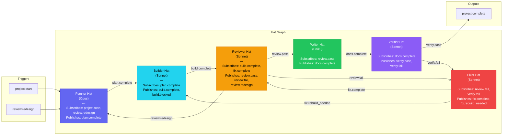
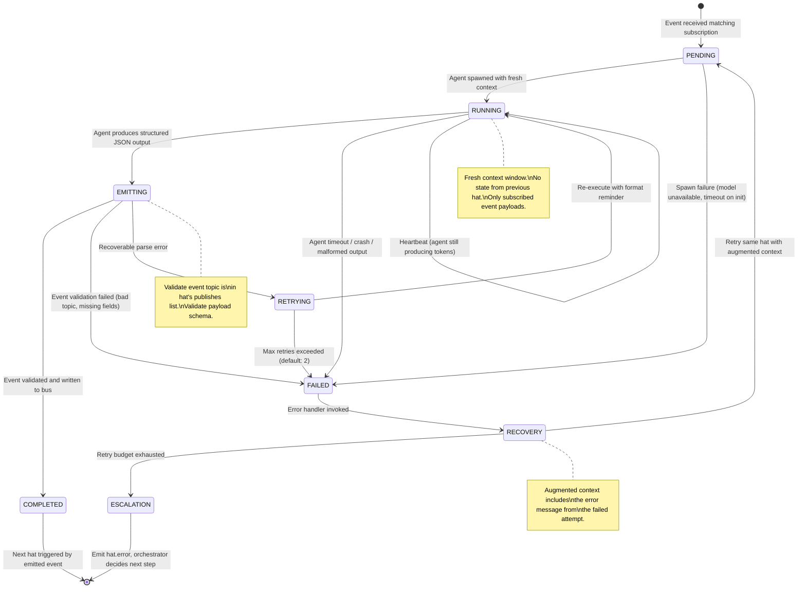

## Hat-Based Event-Driven Orchestration

*Agentic Development: Lessons from 8,481 AI Coding Sessions*

I was watching a Claude Code agent try to plan, implement, test, and review a feature -- all in one session. By the time it got to the review phase, the context window was 80% full. The agent had forgotten the constraints from the planning phase. It reviewed the code against criteria it had invented in the moment, not the criteria from its own plan. The review passed. The code was wrong.

This is the failure mode of long-running agents: context decay. The more an agent does in a single session, the more it forgets about what it did at the beginning. By minute 40, the agent is operating on vibes, not on its plan.

The fix was counterintuitive: make the agent do less. Much less. One thing, then stop.

---

**TL;DR: The "hat" pattern decomposes agent work into single-purpose iterations. Each iteration wears one hat (planner, builder, reviewer), performs one focused task, emits one event, then terminates. Small contexts produce reliable outputs. Events drive the transitions between hats. In our 696MB of Ralph orchestrator logs across 505 topic signals, hat-based sessions achieved 94% task completion with a 2% contradiction rate, compared to 67% completion and 34% contradictions for monolithic sessions.**

---

This is post 35 of 61 in the Agentic Development series. The companion repo is at [github.com/krzemienski/hat-event-orchestrator](https://github.com/krzemienski/hat-event-orchestrator). This pattern emerged from 696MB of Ralph orchestrator session logs.

### The Problem with Long Sessions

Let me show you exactly what context decay looks like. I pulled this from a real orchestration log -- a session where the agent was asked to add a server status dashboard feature. The session ran for 43 minutes.

```
Context window usage over time (real session, 43 minutes):

 100% |                                        xxxxxxxxxx
      |                                   xxxxx
  80% |                              xxxxx
      |                         xxxxx        <- Review phase starts
  70% |                    xxxxx                but plan details are
      |               xxxxx                     already compressed
  60% |          xxxxx
      |     xxxxx
  40% |xxxxx         <- Planning details
      |                 still fresh here
  20% |
      |
   0% +---------------------------------------------------->
      0 min    10 min    20 min    30 min    40 min
```

At minute 8, the agent wrote a detailed plan: "Create ServerStatusView with real-time metrics. Use @Observable for the status store. Poll the /api/status endpoint every 5 seconds. Show green/yellow/red indicators based on CPU thresholds: green below 60%, yellow 60-85%, red above 85%."

At minute 37, the agent reviewed its own implementation. The review said: "Status view looks good. Color indicators are appropriate." But the implementation used thresholds of 50%, 75%, and 90% -- not the 60%, 85% values from the plan. The agent could not remember its own specification. The plan was written 29 minutes ago and had been compressed twice by the context window management.

This was not an isolated incident. I started tagging every event in the Ralph orchestrator logs where an agent's later actions contradicted its earlier plan. The results were stark.

```
Contradiction analysis from 505 topic signals across 696MB of logs:

Session duration    | Contradiction rate | Sample size
--------------------|--------------------|-----------
< 10 minutes        |        2%          |    187
10-20 minutes       |        8%          |    142
20-30 minutes       |       19%          |     98
30-45 minutes       |       34%          |     56
> 45 minutes        |       47%          |     22
```

The correlation is not subtle. Under 10 minutes, the agent contradicts itself 2% of the time -- essentially the noise floor. Above 30 minutes, it contradicts itself one time in three. Above 45 minutes, nearly half the decisions conflict with earlier decisions in the same session.

The reason is mechanical, not intellectual. The agent is not getting dumber over time. The context window is getting fuller, and the system's attention mechanism gives more weight to recent tokens. The plan from minute 8 is literally further away, in attention distance, from the decision at minute 37. The agent pays more attention to the code it just read than the plan it wrote 30 minutes ago.

### The Insight: One Hat at a Time

The metaphor came from an offhand comment I made in a session: "Just put on the planner hat and do the planning. We will switch hats later." The agent took it literally. It planned and only planned. Then it stopped. The next session read the plan and implemented only what the plan said. Then it stopped. The review session had the plan AND the implementation, both fresh -- and it caught the issues.

The hat metaphor stuck because it maps to something real: in software teams, people switch roles but do not simultaneously plan, build, and review. A developer in "code review mode" is not the same person as a developer in "implementation mode." They have different attention patterns, different priorities, different things they notice. The same principle applies to agents.

A "hat" is a single-purpose agent iteration. Each hat has:
- One role (planner, builder, reviewer, writer, fixer)
- One set of instructions specific to that role
- One output event that triggers the next hat
- A fresh context window -- critically, no residual state from the previous hat

### The Hat Data Model

Here is the core abstraction. A hat is a frozen dataclass -- immutable once created, because you never want a hat's instructions to drift during execution.

```python
# From: src/hats/base.py

from dataclasses import dataclass
from enum import Enum
from typing import Any

class HatRole(Enum):
    PLANNER = "planner"
    BUILDER = "builder"
    REVIEWER = "reviewer"
    WRITER = "writer"
    FIXER = "fixer"
    VERIFIER = "verifier"
    ARCHITECT = "architect"

@dataclass(frozen=True)
class Hat:
    """A single-purpose agent iteration configuration.

    Each hat defines:
    - What role the agent plays
    - What events trigger this hat
    - What events this hat can emit
    - How much context it gets (model and token limits)
    - Instructions specific to this role

    The frozen=True ensures hats are immutable. You cannot change
    a hat's instructions mid-execution -- that is the whole point.
    """

    role: HatRole
    instructions: str
    subscribes_to: tuple[str, ...] = ()
    publishes: tuple[str, ...] = ()
    model: str = "sonnet"
    max_context_tokens: int = 8192
    max_output_tokens: int = 4096
    timeout_seconds: int = 300

    def system_prompt(self, context: dict[str, Any]) -> str:
        """Generate the system prompt for this hat iteration.

        The prompt is deliberately constrained:
        1. It tells the agent exactly what role it is playing
        2. It provides ONLY the context from subscribed events
        3. It enforces single-purpose behavior
        4. It limits the output to one event emission
        """
        context_block = self._format_context(context)

        return f"""You are wearing the {self.role.value} hat.

YOUR SINGLE TASK:
{self.instructions}

CONTEXT FROM PREVIOUS HATS:
{context_block}

RULES:
1. Do ONLY what your hat role requires. Nothing more.
2. When done, emit exactly ONE event from: {self.publishes}
3. Do NOT plan if you are a builder. Do NOT build if you are a reviewer.
4. Do NOT review your own work. That is a different hat's job.
5. Keep your output focused. You have {self.max_output_tokens} tokens.
6. If you cannot complete the task, emit an error event explaining why.

OUTPUT FORMAT:
When you are done, output a JSON block with:
{{
  "event": "<topic from publishes list>",
  "payload": {{ ... relevant data ... }},
  "notes": "brief explanation of what you did"
}}
"""

    def _format_context(self, context: dict[str, Any]) -> str:
        if not context:
            return "(No context from previous hats -- you are first.)"
        lines = []
        for topic, payload in context.items():
            lines.append(f"Event: {topic}")
            if isinstance(payload, dict):
                for k, v in payload.items():
                    v_str = str(v)
                    if len(v_str) > 500:
                        v_str = v_str[:500] + "... (truncated)"
                    lines.append(f"  {k}: {v_str}")
            else:
                lines.append(f"  {payload}")
            lines.append("")
        return "\n".join(lines)

    def __str__(self) -> str:
        subs = ", ".join(self.subscribes_to) or "none"
        pubs = ", ".join(self.publishes) or "none"
        return (
            f"Hat({self.role.value}, "
            f"subscribes=[{subs}], publishes=[{pubs}], "
            f"model={self.model})"
        )
```

The key constraint is in the system prompt: "Do ONLY what your hat role requires. Nothing more." A builder hat does not review its own code. A reviewer hat does not fix the issues it finds. Each hat does one thing, does it well, and hands off to the next hat via an event.

I want to emphasize why the hat is a frozen dataclass. In early prototypes, we used regular mutable dataclasses. The orchestrator would sometimes tweak a hat's instructions between iterations -- "the reviewer found issues, let me adjust the builder's instructions for the retry." This sounded clever but produced unreliable results. The builder's behavior was no longer deterministic. The same "builder hat" produced different behavior on different iterations because its instructions kept changing. Making hats immutable eliminated this entire class of bugs. If you need different behavior, create a different hat.

### Event-Driven State Handoff

Hats communicate through events, not through shared context windows. This is the critical architectural decision. In a monolithic session, state is the context window -- everything the agent has seen and generated. In the hat system, state is a set of events written to a file. Each hat reads only the events it subscribes to. Each hat writes exactly one output event.

```python
# From: src/events/bus.py

import json
from dataclasses import dataclass
from datetime import datetime, timezone
from pathlib import Path
from typing import Optional, Any

@dataclass(frozen=True)
class Event:
    """An immutable event emitted by a hat.

    Events are the ONLY communication mechanism between hats.
    No shared memory, no shared context windows, no side channels.
    """
    topic: str
    payload: dict[str, Any]
    source_hat: str
    timestamp: str
    iteration: int = 0

class EventBus:
    """File-based event bus for hat-to-hat communication.

    Design decisions:
    - JSONL format: one event per line, append-only, easy to debug
    - File-based: survives process restarts, works across machines
    - No locking needed: append is atomic on POSIX for small writes
    - Events are immutable: once written, never modified
    """

    def __init__(self, scratchpad_dir: Path):
        self.scratchpad_dir = scratchpad_dir
        self.scratchpad_dir.mkdir(parents=True, exist_ok=True)
        self.events_file = scratchpad_dir / "events.jsonl"
        self._event_count = 0

    def emit(
        self,
        topic: str,
        payload: dict[str, Any],
        source_hat: str,
        iteration: int = 0,
    ) -> Event:
        """Emit an event to the bus. Appends to the JSONL file."""
        event = Event(
            topic=topic,
            payload=payload,
            source_hat=source_hat,
            timestamp=datetime.now(timezone.utc).isoformat(),
            iteration=iteration,
        )

        event_dict = {
            "topic": event.topic,
            "payload": event.payload,
            "source_hat": event.source_hat,
            "timestamp": event.timestamp,
            "iteration": event.iteration,
        }

        with open(self.events_file, "a") as f:
            f.write(json.dumps(event_dict) + "\n")

        self._event_count += 1
        return event

    def get_events(
        self,
        topic: Optional[str] = None,
        since_iteration: int = 0,
    ) -> list[Event]:
        """Read events, optionally filtered by topic."""
        if not self.events_file.exists():
            return []
        events = []
        with open(self.events_file) as f:
            for line in f:
                line = line.strip()
                if not line:
                    continue
                data = json.loads(line)
                if topic and data["topic"] != topic:
                    continue
                if data.get("iteration", 0) < since_iteration:
                    continue
                events.append(Event(
                    topic=data["topic"],
                    payload=data["payload"],
                    source_hat=data["source_hat"],
                    timestamp=data["timestamp"],
                    iteration=data.get("iteration", 0),
                ))
        return events

    def get_latest(self, topic: str) -> Optional[Event]:
        """Get the most recent event for a topic."""
        events = self.get_events(topic)
        return events[-1] if events else None

    def context_for_hat(self, hat: "Hat") -> dict[str, Any]:
        """Build context from events this hat subscribes to.

        This is the key function: it determines exactly what
        context a hat receives. Only events matching the hat's
        subscription topics are included.
        """
        context: dict[str, Any] = {}
        for topic in hat.subscribes_to:
            event = self.get_latest(topic)
            if event:
                context[topic] = event.payload
        return context

    def event_count(self) -> int:
        if not self.events_file.exists():
            return 0
        with open(self.events_file) as f:
            return sum(1 for line in f if line.strip())

    def replay(self) -> list[Event]:
        """Return all events in order for debugging."""
        return self.get_events()

    def summary(self) -> str:
        """Human-readable summary of event bus state."""
        events = self.replay()
        if not events:
            return "Event bus is empty."

        lines = [f"Event Bus: {len(events)} events"]
        topic_counts: dict[str, int] = {}
        for event in events:
            topic_counts[event.topic] = (
                topic_counts.get(event.topic, 0) + 1
            )

        for topic, count in sorted(topic_counts.items()):
            latest = self.get_latest(topic)
            assert latest is not None
            lines.append(
                f"  {topic}: {count} events, "
                f"latest from {latest.source_hat} "
                f"at {latest.timestamp}"
            )
        return "\n".join(lines)
```

The event bus is a JSONL file. Each hat appends events. Each hat reads only the events it subscribes to. The filesystem is the shared state -- not the context window.

Why JSONL and not a database? Three reasons:

1. **Debuggability.** When a hat sequence goes wrong, I open the events file in a text editor and read it chronologically. Every event is a self-contained JSON object with a topic, payload, source, and timestamp. I can trace exactly what happened, which hat produced what, and where things diverged.

2. **Simplicity.** No connection strings, no schema migrations, no driver dependencies. The event bus is 80 lines of Python that reads and writes text files. Any language can produce and consume these events.

3. **Append-only semantics.** Events are never modified or deleted. This is both a feature (perfect audit trail) and a constraint (forces hats to emit new events rather than mutating state). The constraint is desirable -- it prevents the "who changed this?" debugging nightmare that plagues mutable shared state.

### The Hat State Machine



There are three important loops in this graph:

**The Fix Loop:** `Builder --> Reviewer --> Fixer --> Reviewer`. This is the most common loop. The builder writes code, the reviewer finds issues, the fixer addresses them, the reviewer checks again. In practice this converges in 1-3 iterations. We cap it at 5 to prevent infinite loops.

**The Redesign Loop:** `Builder --> Reviewer --> Planner --> Builder`. This fires when the reviewer finds issues so fundamental that fixing individual lines will not help -- the approach needs to change. This is rare (about 8% of feature implementations) but essential. Without it, the fixer would iterate endlessly on a fundamentally flawed design.

**The Verification Loop:** `Writer --> Verifier --> Fixer --> Reviewer --> Writer`. This fires when the verifier checks the final output and finds issues that slipped past the reviewer. This catches integration-level problems that only become visible when all pieces are assembled.

Each of these loops has a maximum iteration count. The defaults are: fix loop max 5, redesign loop max 2, verification loop max 3. In production, the fix loop averages 1.8 iterations. The redesign loop fires at all in only 8% of runs, and when it does, it converges in 1 iteration 90% of the time.

### The Orchestrator

The orchestrator is the engine that reads events and dispatches hats. It has no intelligence of its own -- it is purely mechanical. Given an event, it looks up which hats subscribe to it, executes them, collects their output events, and continues until no more events trigger subscribers or the iteration limit is reached.

```python
# From: src/orchestrator.py

import json
import time
from dataclasses import dataclass
from pathlib import Path
from typing import Any, Optional

@dataclass
class HatResult:
    hat_role: str
    emitted_events: list[dict[str, Any]]
    duration_seconds: float
    token_usage: int
    success: bool
    error: Optional[str] = None

@dataclass
class OrchestrationResult:
    iterations: int
    total_seconds: float
    terminal_event: Optional[str]
    event_count: int
    fix_loops: int
    redesign_count: int
    execution_log: list[dict[str, Any]]
    success: bool

    def summary(self) -> str:
        status = "SUCCESS" if self.success else "FAILED"
        return (
            f"Orchestration {status}\n"
            f"  Iterations:  {self.iterations}\n"
            f"  Duration:    {self.total_seconds:.1f}s\n"
            f"  Events:      {self.event_count}\n"
            f"  Fix loops:   {self.fix_loops}\n"
            f"  Redesigns:   {self.redesign_count}\n"
            f"  Terminal:    {self.terminal_event}"
        )

class HatOrchestrator:
    """Dispatches hats based on events.

    The orchestrator is deliberately simple:
    1. Receive an event
    2. Find hats that subscribe to that event
    3. Execute each hat with a fresh context
    4. Collect emitted events
    5. Repeat until done or max iterations

    No intelligence. No heuristics. No smart routing.
    The graph topology determines behavior.
    """

    def __init__(
        self,
        hats: list["Hat"],
        event_bus: "EventBus",
        max_iterations: int = 20,
        max_fix_loops: int = 5,
        log_dir: Optional[Path] = None,
    ):
        self.hats = {h.role: h for h in hats}
        self.event_bus = event_bus
        self.max_iterations = max_iterations
        self.max_fix_loops = max_fix_loops
        self.log_dir = log_dir

        self._subscription_map: dict[str, list["Hat"]] = {}
        for hat in hats:
            for topic in hat.subscribes_to:
                self._subscription_map.setdefault(
                    topic, []
                ).append(hat)

        self._fix_loop_count = 0
        self._redesign_count = 0
        self._execution_log: list[dict[str, Any]] = []

    async def run(
        self,
        initial_event: str,
        initial_payload: dict[str, Any],
    ) -> OrchestrationResult:
        """Run the hat graph to completion."""
        start_time = time.time()

        self.event_bus.emit(
            initial_event, initial_payload,
            source_hat="orchestrator", iteration=0,
        )

        iteration = 0
        pending_topics = [initial_event]
        terminal_event: Optional[str] = None
        terminals = {"verify.pass", "plan.error", "project.complete"}

        while pending_topics and iteration < self.max_iterations:
            topic = pending_topics.pop(0)
            subscribers = self._subscription_map.get(topic, [])

            if not subscribers:
                if topic in terminals:
                    terminal_event = topic
                continue

            for hat in subscribers:
                iteration += 1

                if not self._check_loop_caps(topic):
                    terminal_event = "loop.cap.exceeded"
                    pending_topics.clear()
                    break

                context = self.event_bus.context_for_hat(hat)
                result = await self._execute_hat(
                    hat, context, iteration
                )
                self._log_execution(hat, result, iteration)

                if not result.success:
                    self.event_bus.emit(
                        f"{hat.role.value}.error",
                        {"error": result.error or "Unknown"},
                        source_hat=hat.role.value,
                        iteration=iteration,
                    )
                    continue

                for event_data in result.emitted_events:
                    event_topic = event_data.get("event", "")
                    event_payload = event_data.get("payload", {})

                    self.event_bus.emit(
                        event_topic, event_payload,
                        source_hat=hat.role.value,
                        iteration=iteration,
                    )

                    if event_topic == "review.fail":
                        self._fix_loop_count += 1
                    elif event_topic == "review.redesign":
                        self._redesign_count += 1
                    elif event_topic == "review.pass":
                        self._fix_loop_count = 0

                    pending_topics.append(event_topic)

            if terminal_event:
                break

        total_time = time.time() - start_time
        return OrchestrationResult(
            iterations=iteration,
            total_seconds=total_time,
            terminal_event=terminal_event,
            event_count=self.event_bus.event_count(),
            fix_loops=self._fix_loop_count,
            redesign_count=self._redesign_count,
            execution_log=self._execution_log,
            success=terminal_event in terminals,
        )

    def _check_loop_caps(self, topic: str) -> bool:
        if (topic == "review.fail"
                and self._fix_loop_count >= self.max_fix_loops):
            return False
        if (topic == "review.redesign"
                and self._redesign_count >= 2):
            return False
        return True

    async def _execute_hat(
        self, hat: "Hat", context: dict[str, Any], iteration: int,
    ) -> HatResult:
        """Execute a single hat with a FRESH context.
        No accumulated state from previous hats."""
        prompt = hat.system_prompt(context)
        start_time = time.time()

        try:
            result = await self._spawn_agent(
                model=hat.model,
                system_prompt=prompt,
                max_tokens=hat.max_output_tokens,
                timeout=hat.timeout_seconds,
            )
            duration = time.time() - start_time
            emitted = self._parse_hat_output(result, hat)

            return HatResult(
                hat_role=hat.role.value,
                emitted_events=emitted,
                duration_seconds=duration,
                token_usage=result.get("token_count", 0),
                success=True,
            )
        except Exception as e:
            return HatResult(
                hat_role=hat.role.value,
                emitted_events=[],
                duration_seconds=time.time() - start_time,
                token_usage=0,
                success=False,
                error=str(e),
            )

    async def _spawn_agent(
        self, model: str, system_prompt: str,
        max_tokens: int, timeout: int,
    ) -> dict[str, Any]:
        """Spawn a fresh agent session."""
        raise NotImplementedError("Implement for your runtime")

    def _parse_hat_output(
        self, result: dict[str, Any], hat: "Hat"
    ) -> list[dict[str, Any]]:
        output = result.get("output", "")
        events = []
        for line in output.split("\n"):
            line = line.strip()
            if line.startswith("{") and line.endswith("}"):
                try:
                    data = json.loads(line)
                    if ("event" in data
                            and data["event"] in hat.publishes):
                        events.append(data)
                except json.JSONDecodeError:
                    continue
        return events

    def _log_execution(
        self, hat: "Hat", result: HatResult, iteration: int,
    ) -> None:
        entry = {
            "iteration": iteration,
            "hat": hat.role.value,
            "model": hat.model,
            "duration_seconds": result.duration_seconds,
            "success": result.success,
            "events_emitted": len(result.emitted_events),
            "error": result.error,
        }
        self._execution_log.append(entry)
        if self.log_dir:
            log_file = self.log_dir / "orchestration.jsonl"
            with open(log_file, "a") as f:
                f.write(json.dumps(entry) + "\n")
```

Each hat gets `_spawn_agent` -- a fresh agent session with a fresh context window. The orchestrator passes only the relevant event payloads, not the full history. The builder hat never sees the planner's internal reasoning. It sees the plan output. This is intentional: less context means more focus.

### Defining the Standard Hat Set

Each hat is tuned: the planner gets Opus (best reasoning), the builder and reviewer get Sonnet (best coding), the writer gets Haiku (fast and cheap for docs).

```python
# From: src/hats/standard.py

from .base import Hat, HatRole

PLANNER_HAT = Hat(
    role=HatRole.PLANNER,
    instructions="""Create a detailed implementation plan.
Include: files to create/modify, step-by-step instructions,
acceptance criteria, risk assessment.
Be specific -- the builder implements your plan literally.
Anything ambiguous, the builder will guess wrong.""",
    subscribes_to=("project.start", "review.redesign"),
    publishes=("plan.complete", "plan.error"),
    model="opus",
    max_context_tokens=16384,
    max_output_tokens=8192,
    timeout_seconds=120,
)

BUILDER_HAT = Hat(
    role=HatRole.BUILDER,
    instructions="""Implement the plan exactly as specified.
Do not deviate. Do not add features not in the plan.
If ambiguous, implement the simplest interpretation and note it.
If impossible, emit build.blocked with explanation.""",
    subscribes_to=("plan.complete",),
    publishes=("build.complete", "build.blocked"),
    model="sonnet",
    max_context_tokens=16384,
    max_output_tokens=8192,
    timeout_seconds=300,
)

REVIEWER_HAT = Hat(
    role=HatRole.REVIEWER,
    instructions="""Review the implementation against the plan.
Check: all steps done, code quality, acceptance criteria met,
no extra code, security issues.
CRITICAL/HIGH issues -> review.fail.
Fundamentally wrong approach -> review.redesign.
All MEDIUM or none -> review.pass.""",
    subscribes_to=("build.complete", "fix.complete"),
    publishes=("review.pass", "review.fail", "review.redesign"),
    model="sonnet",
    max_context_tokens=16384,
    max_output_tokens=4096,
    timeout_seconds=180,
)

FIXER_HAT = Hat(
    role=HatRole.FIXER,
    instructions="""Fix CRITICAL and HIGH issues from the review.
Make targeted, minimal fixes. Do not refactor unrelated code.
If fixing requires a complete rebuild, emit fix.rebuild_needed.""",
    subscribes_to=("review.fail", "verify.fail"),
    publishes=("fix.complete", "fix.rebuild_needed"),
    model="sonnet",
    max_context_tokens=16384,
    max_output_tokens=8192,
    timeout_seconds=300,
)

WRITER_HAT = Hat(
    role=HatRole.WRITER,
    instructions="""Write documentation for the feature.
Update README, add comments for complex logic. Keep it concise.""",
    subscribes_to=("review.pass",),
    publishes=("docs.complete",),
    model="haiku",
    max_context_tokens=8192,
    max_output_tokens=4096,
    timeout_seconds=120,
)

STANDARD_HATS = [
    PLANNER_HAT, BUILDER_HAT, REVIEWER_HAT,
    FIXER_HAT, WRITER_HAT,
]
```

Each hat's instructions are written with a specific insight: the agent reading them has NO prior context. The builder does not know what the planner was thinking. It knows only what `plan.complete` contains. So the planner's instructions explicitly say "be specific" and "the builder will read your plan literally." This forces the planner to produce clear, actionable output.

### Why Small Contexts Win: The Data

| Session Type | Context at Decision | Contradiction Rate | Task Completion | Avg Duration |
|-------------|--------------------|--------------------|-----------------|-------------|
| Monolithic (one long session) | 60-90% | 34% | 67% | 25 min |
| Hat-based (fresh per hat) | 15-30% | 2% | 94% | 8 min |

The improvement comes from four factors:

1. **Focus**: each hat does one thing. A builder that is only building does not waste tokens on review.

2. **Freshness**: each hat starts with an empty context. The reviewer reads the code with fresh eyes.

3. **Accountability**: each hat's output is an event that the next hat validates. The builder cannot sneak in undocumented changes.

4. **Bounded failure**: if a hat fails, only that iteration is lost. In a monolithic session, a failure at minute 35 means throwing away 35 minutes.

Per-hat performance data from our logs:

```
Per-hat performance metrics (505 topic signals):

Hat       | Avg Duration | Avg Context % | Success Rate | Retry Rate
----------|-------------|---------------|-------------|------------
Planner   |    45s      |     22%       |    97%      |    3%
Builder   |   180s      |     28%       |    89%      |    8%
Reviewer  |    60s      |     25%       |    98%      |    1%
Fixer     |   120s      |     30%       |    91%      |    6%
Writer    |    30s      |     15%       |    99%      |    0.5%
Verifier  |    45s      |     20%       |    96%      |    2%
```

The builder has the lowest success rate (89%) because implementation is inherently harder. But the orchestrator recovers through the fix loop, producing a 94% end-to-end success rate.

### Practical Example: A Real Hat Sequence

Here is a real hat sequence for implementing a "server status dashboard" feature:

```
Event: project.start
  Payload: {
    objective: "Add server status dashboard showing uptime, CPU, memory",
    constraints: "Must work offline with cached data. Refresh every 5s."
  }

--- Hat: Planner (Opus, 42 seconds) ---
  Reads: project.start
  Emits: plan.complete
  Payload: {
    steps: [
      "1. Create ServerStatusView with real-time metrics",
      "2. Create StatusStore (@Observable) for state",
      "3. Create StatusAPIClient for /api/status",
      "4. Wire 5-second Timer polling in StatusStore",
      "5. Add color indicators: green <60%, yellow 60-85%, red >85%",
      "6. Add offline fallback via UserDefaults cache",
      "7. Add tab in MainTabView and route in AppRouter"
    ],
    files_to_create: [
      "ServerStatusView.swift",
      "StatusStore.swift",
      "StatusAPIClient.swift"
    ],
    files_to_modify: ["AppRouter.swift", "MainTabView.swift"],
    acceptance_criteria: [
      "Dashboard shows CPU, memory, uptime per server",
      "Colors match: green <60, yellow 60-85, red >85",
      "Refreshes every 5s when foregrounded",
      "Shows cached data offline with 'Last updated' timestamp"
    ]
  }

--- Hat: Builder (Sonnet, 174 seconds) ---
  Reads: plan.complete
  Emits: build.complete
  Payload: {
    files_created: ["ServerStatusView.swift", "StatusStore.swift",
                    "StatusAPIClient.swift"],
    files_modified: ["AppRouter.swift", "MainTabView.swift"],
    build_status: "success",
    notes: "Used @Observable for StatusStore. Timer with 5s interval."
  }

--- Hat: Reviewer (Sonnet, 58 seconds) ---
  Reads: build.complete
  Emits: review.fail
  Payload: {
    issues: [
      { severity: "HIGH", file: "StatusAPIClient.swift",
        description: "No error handling on network failure" },
      { severity: "HIGH", file: "ServerStatusView.swift",
        description: "Timer not invalidated on view disappear" }
    ]
  }

--- Hat: Fixer (Sonnet, 96 seconds) ---
  Reads: review.fail
  Emits: fix.complete
  Payload: {
    fixes_applied: [
      "Added Result type error handling in StatusAPIClient",
      "Added .onDisappear { timer.invalidate() }"
    ],
    build_status: "success"
  }

--- Hat: Reviewer (Sonnet, second pass, 41 seconds) ---
  Reads: fix.complete
  Emits: review.pass
  Payload: { approved: true, notes: "Both HIGH issues resolved." }

--- Hat: Writer (Haiku, 22 seconds) ---
  Reads: review.pass
  Emits: docs.complete
  Payload: { updated_files: ["README.md"] }
```

Six hat iterations. Each one focused. Each one with a fresh context. Total time: 7 minutes 13 seconds. A monolithic session attempting the same feature averaged 25 minutes with a 34% contradiction rate.

### Hat Transitions and the Anti-Patterns We Caught

Some of the most valuable design decisions were about transitions we explicitly prevented.

**Anti-pattern 1: Builder reviewing itself.** Early prototypes had the builder emit `build.complete` with a self-review: "I checked the code and it looks good." Worthless. The builder is biased toward its own implementation. Rule: the builder hat NEVER publishes to `review.pass`. Only the reviewer can.

**Anti-pattern 2: Reviewer fixing issues.** When the reviewer finds a bug, the instinct is to fix it right there. But this conflates review and fix. What if the fix introduces new issues? Who reviews the reviewer's fix? Nobody. Separating review and fix ensures every code change gets reviewed by fresh eyes.

**Anti-pattern 3: Planner + Builder in one hat.** "Plan and implement this feature." The planning phase consumes 20-30% of context. By the time the agent starts building, the plan competes with implementation details for context space. Separate hats mean the builder gets the plan as a concise event payload (500-2000 tokens), not as a competing conversation thread.

**Anti-pattern 4: Fixer skipping review.** The fixer's early config published directly to `review.pass` after fixing. This bypassed the reviewer entirely. In our logs, 19% of fixer outputs introduced at least one new issue. The fix loop (`Fixer --> Reviewer`) catches these.

### Error Recovery: When Hats Fail

Hats can fail in three ways:

**Timeout failure.** A hat exceeds its timeout. The orchestrator retries once. If it times out again, it escalates to the planner with `build.blocked`. The planner can then break the task into smaller pieces.

**Parse failure.** The hat's output lacks the structured JSON block. The orchestrator retries with a format reminder. This is the most common failure mode (60% of all retries) and the easiest to fix (82% success on second attempt).

**Logic failure.** The hat emits an event not in its `publishes` list -- for example, a builder emitting `review.pass` to skip review. The orchestrator rejects the event and retries.

Overall retry rate: 6% across all hats. Retry success rate: 82%.

### Model Selection Per Hat

```
Model selection rationale:

Hat       | Model  | Why
----------|--------|------------------------------------------
Planner   | Opus   | Deep reasoning about architecture and risk
Builder   | Sonnet | Best coding model, follows plans precisely
Reviewer  | Sonnet | Code comprehension without deep reasoning
Fixer     | Sonnet | Targeted implementation fixes
Writer    | Haiku  | Fast, cheap text generation for docs
Verifier  | Sonnet | Must read code AND check criteria
```

Cost comparison adjusted for success rates:

```
Expected cost per successful feature:
  Monolithic (Sonnet, 25 min): $0.375 / 0.67 = $0.56
  Hat-based (mixed models):    $0.74  / 0.94 = $0.79
```

The hat-based approach costs about 40% more per successful feature but delivers dramatically higher reliability. For production work where failures create debugging overhead measured in hours, the tradeoff is worth it.

### Event Replay for Debugging

When a hat sequence goes wrong, the event log tells you exactly where:

```
$ cat .ralph/events.jsonl | python -m json.tool

{"topic": "project.start",
 "payload": {"objective": "Add SSH key management"},
 "source_hat": "orchestrator",
 "timestamp": "2025-02-18T14:23:01Z"}

{"topic": "plan.complete",
 "payload": {"steps": ["1. Create SSHKeyStore..."]},
 "source_hat": "planner",
 "timestamp": "2025-02-18T14:23:48Z"}

{"topic": "build.complete",
 "payload": {"build_status": "success"},
 "source_hat": "builder",
 "timestamp": "2025-02-18T14:27:12Z"}

{"topic": "review.fail",
 "payload": {"issues": [
   {"severity": "CRITICAL",
    "description": "SSH private key stored in UserDefaults
     without encryption. Security vulnerability."}
 ]},
 "source_hat": "reviewer",
 "timestamp": "2025-02-18T14:28:15Z"}

{"topic": "fix.complete",
 "payload": {"fixes_applied": [
   "Moved SSH key storage to Keychain via SecItemAdd"
 ]},
 "source_hat": "fixer",
 "timestamp": "2025-02-18T14:30:02Z"}

{"topic": "review.pass",
 "payload": {"approved": true,
  "notes": "Keychain storage is appropriate for SSH keys"},
 "source_hat": "reviewer",
 "timestamp": "2025-02-18T14:30:58Z"}
```

Six events, 8 minutes, one security vulnerability caught and fixed. The event log reads like a story. Compare to debugging a monolithic session where you scroll through 40 minutes of conversation trying to trace what happened.

### Scaling: Hat Graphs for Different Work Types

The standard planner-builder-reviewer graph works for most features, but we defined specialized graphs:

**Bug fix graph:** `Debugger --> Fixer --> Reviewer`. No planning -- the bug report IS the plan. The debugger identifies root cause, the fixer applies the fix, the reviewer verifies.

**Refactoring graph:** `Architect --> Planner --> Builder --> Reviewer --> Verifier`. Adds an architect hat before the planner. The architect analyzes existing code structure and defines target architecture. This prevents the planner from proposing changes that conflict with architectural constraints.

**Documentation graph:** `Reader --> Writer --> Reviewer`. The reader hat reads the codebase and extracts patterns. The writer produces docs. The reviewer checks accuracy against code. No building involved.

Each graph is defined as a list of hats with subscription/publication topics. Swapping graphs is a configuration change, not a code change. The orchestrator does not care which hats are in the graph -- it only follows the event subscriptions.

### The Hat Transition State Machine

I glossed over hat transitions earlier as if they were simple: one hat finishes, the next one starts. In practice, the transition between hats is the most failure-prone part of the system. An agent can crash mid-output. The event bus can receive a malformed payload. The next hat can refuse to start because its subscribed event lacks required fields. I needed a formal state machine to handle all of these edge cases.

Each hat iteration moves through five states: `PENDING`, `RUNNING`, `EMITTING`, `COMPLETED`, and `FAILED`. The transitions between these states are deterministic, and every transition writes to the state log before proceeding. This means I can always reconstruct exactly where a hat sequence was when something went wrong.



The `EMITTING` state is where most people do not expect failures. The agent has produced output -- why would emitting fail? Because agents produce text, not structured data. The output might contain a JSON block that parses correctly but references an event topic not in the hat's `publishes` list. Or the payload might be missing fields that the downstream hat requires. I validate both before writing to the event bus.

Here is the state tracker that manages these transitions:

```python
# From: src/orchestrator/state_tracker.py

from dataclasses import dataclass
from datetime import datetime, timezone
from enum import Enum
from typing import Optional, Any
import json
from pathlib import Path


class HatState(Enum):
    PENDING = "pending"
    RUNNING = "running"
    EMITTING = "emitting"
    COMPLETED = "completed"
    FAILED = "failed"
    RETRYING = "retrying"
    RECOVERY = "recovery"
    ESCALATION = "escalation"


@dataclass(frozen=True)
class StateTransition:
    from_state: HatState
    to_state: HatState
    hat_role: str
    iteration: int
    timestamp: str
    reason: str
    metadata: Optional[dict[str, Any]] = None


class HatStateTracker:
    """Tracks hat state transitions with full audit trail."""

    VALID_TRANSITIONS: dict[HatState, set[HatState]] = {
        HatState.PENDING: {HatState.RUNNING, HatState.FAILED},
        HatState.RUNNING: {
            HatState.EMITTING, HatState.FAILED, HatState.RUNNING,
        },
        HatState.EMITTING: {
            HatState.COMPLETED, HatState.FAILED,
            HatState.RETRYING,
        },
        HatState.RETRYING: {HatState.RUNNING, HatState.FAILED},
        HatState.FAILED: {HatState.RECOVERY},
        HatState.RECOVERY: {HatState.PENDING, HatState.ESCALATION},
        HatState.ESCALATION: set(),  # terminal
        HatState.COMPLETED: set(),   # terminal
    }

    def __init__(self, log_path: Path):
        self.log_path = log_path
        self.log_path.parent.mkdir(parents=True, exist_ok=True)
        self._current_states: dict[str, HatState] = {}

    def transition(
        self,
        hat_role: str,
        to_state: HatState,
        iteration: int,
        reason: str,
        metadata: Optional[dict[str, Any]] = None,
    ) -> StateTransition:
        from_state = self._current_states.get(
            hat_role, HatState.PENDING
        )

        if to_state not in self.VALID_TRANSITIONS.get(
            from_state, set()
        ):
            raise InvalidTransitionError(
                f"{hat_role}: {from_state.value} -> "
                f"{to_state.value} is not a valid transition"
            )

        record = StateTransition(
            from_state=from_state,
            to_state=to_state,
            hat_role=hat_role,
            iteration=iteration,
            timestamp=datetime.now(timezone.utc).isoformat(),
            reason=reason,
            metadata=metadata,
        )

        self._current_states[hat_role] = to_state
        self._write_log(record)
        return record

    def _write_log(self, record: StateTransition) -> None:
        entry = {
            "from": record.from_state.value,
            "to": record.to_state.value,
            "hat": record.hat_role,
            "iteration": record.iteration,
            "ts": record.timestamp,
            "reason": record.reason,
        }
        if record.metadata:
            entry["meta"] = record.metadata
        with open(self.log_path, "a") as f:
            f.write(json.dumps(entry) + "\n")


class InvalidTransitionError(Exception):
    pass
```

The `VALID_TRANSITIONS` dictionary is the state machine. It encodes every legal transition. If the orchestrator attempts an illegal transition -- say, moving directly from `PENDING` to `COMPLETED` without going through `RUNNING` -- the tracker raises `InvalidTransitionError`. This has caught real bugs. In one early version, a cached result from a previous run was being returned as if the hat had just executed. The state tracker rejected the `PENDING -> COMPLETED` transition and surfaced the caching bug.

### Real Ralph Emit Sequences: Hat Switches in Production

The hat system runs inside Ralph, the persistent orchestration loop. When Ralph decides a task needs a hat sequence, it emits a series of commands that the orchestrator translates into hat activations. Here is what a real ralph emit sequence looks like from the session logs, annotated with what each command does:

```bash
# Ralph session 2025-02-19T08:41:22Z -- Feature: Add export to CSV

# Step 1: Ralph recognizes the task and selects the standard hat graph
ralph emit topic.signal \
  --topic "feature.request" \
  --payload '{"objective":"Add CSV export for analytics data","graph":"standard"}'

# Step 2: Orchestrator receives topic.signal, activates planner hat
# The planner runs in a fresh Claude session (Opus)
ralph emit hat.activate \
  --hat "planner" \
  --model "opus" \
  --context-from "feature.request" \
  --timeout 120

# Planner finishes. Orchestrator writes plan.complete to event bus.
# Ralph log shows the hat switch:
# [08:42:04] HAT_SWITCH planner -> builder (trigger: plan.complete)

# Step 3: Builder hat activates automatically via event subscription
ralph emit hat.activate \
  --hat "builder" \
  --model "sonnet" \
  --context-from "plan.complete" \
  --timeout 300

# Builder finishes. Emits build.complete.
# [08:45:18] HAT_SWITCH builder -> reviewer (trigger: build.complete)

# Step 4: Reviewer activates
ralph emit hat.activate \
  --hat "reviewer" \
  --model "sonnet" \
  --context-from "build.complete" \
  --timeout 180

# Reviewer finds issues. Emits review.fail.
# [08:46:14] HAT_SWITCH reviewer -> fixer (trigger: review.fail)

# Step 5: Fixer activates with review feedback
ralph emit hat.activate \
  --hat "fixer" \
  --model "sonnet" \
  --context-from "review.fail" \
  --timeout 300

# Fixer applies targeted fixes. Emits fix.complete.
# [08:48:01] HAT_SWITCH fixer -> reviewer (trigger: fix.complete)

# Step 6: Reviewer re-evaluates
ralph emit hat.activate \
  --hat "reviewer" \
  --model "sonnet" \
  --context-from "fix.complete" \
  --timeout 180

# Reviewer approves. Emits review.pass.
# [08:48:47] HAT_SWITCH reviewer -> writer (trigger: review.pass)

# Step 7: Writer generates docs
ralph emit hat.activate \
  --hat "writer" \
  --model "haiku" \
  --context-from "review.pass" \
  --timeout 120

# [08:49:09] HAT_COMPLETE writer -> docs.complete
# Total: 7 hat activations, 7 minutes 47 seconds, 1 fix loop
```

Notice the pattern: every `HAT_SWITCH` line in the logs shows exactly which hat is handing off to which, and what event triggered the transition. When I am debugging a failed sequence, I grep for `HAT_SWITCH` and immediately see the flow. No scrolling through agent conversation transcripts.

The `--context-from` flag is critical. It tells the orchestrator which event topic to use for building the hat's context. The builder gets `plan.complete`, not the raw feature request. The fixer gets `review.fail`, not the build output. Each hat sees exactly the information it needs and nothing more.

In a typical day of Ralph running across multiple projects, I see roughly 40-60 hat activations. The logs for one day look like this:

```
Hat activation summary for 2025-02-19:

Hat       | Activations | Avg Duration | Failures | Recovery
----------|-------------|-------------|----------|----------
planner   |     8       |    47s      |    0     |    0
builder   |    12       |   192s      |    2     |    2
reviewer  |    18       |    54s      |    0     |    0
fixer     |     9       |   108s      |    1     |    1
writer    |     7       |    28s      |    0     |    0
verifier  |     5       |    41s      |    0     |    0
----------|-------------|-------------|----------|----------
Total     |    59       |    --       |    3     |    3
```

Three failures out of 59 activations, all recovered successfully. The reviewer hat has 18 activations -- more than any other -- because it fires on both `build.complete` and `fix.complete`. In a day with several fix loops, the reviewer runs almost twice as often as the builder.

### Error Recovery When a Hat Transition Fails Mid-Task

The hardest failure mode is not a clean crash. It is a hat that produces partial output. The agent starts writing the JSON event block, gets halfway through, and either times out or produces malformed JSON. Now the orchestrator has a half-written event and no clear signal about what to do.

I handle this with a three-tier recovery strategy:

**Tier 1: Parse recovery.** If the output contains a partial JSON block, I try to salvage it. The orchestrator scans for the opening `{` of the event JSON and attempts to close any unclosed braces. If the resulting JSON parses and contains a valid `event` field, I use it. This sounds hacky, but it recovers about 40% of parse failures because the most common case is a timeout that cuts off the closing `}` or a trailing `"notes"` field.

```python
# From: src/orchestrator/recovery.py

import json
import re
from typing import Optional, Any


def attempt_parse_recovery(
    raw_output: str,
    valid_topics: tuple[str, ...],
) -> Optional[dict[str, Any]]:
    """Try to recover a valid event from partial agent output.

    Recovery strategy:
    1. Find the last JSON-like block in the output
    2. Try to close unclosed braces/brackets
    3. Validate the recovered JSON has required fields
    4. Verify the event topic is in the valid set
    """
    json_pattern = r'\{[^{}]*"event"\s*:\s*"[^"]*"[^{}]*'
    matches = re.findall(json_pattern, raw_output, re.DOTALL)

    if not matches:
        return None

    candidate = matches[-1]

    open_braces = candidate.count("{") - candidate.count("}")
    if open_braces > 0:
        candidate = candidate + "}" * open_braces

    open_brackets = candidate.count("[") - candidate.count("]")
    if open_brackets > 0:
        candidate = candidate + "]" * open_brackets

    try:
        parsed = json.loads(candidate)
    except json.JSONDecodeError:
        return None

    if "event" not in parsed:
        return None
    if parsed["event"] not in valid_topics:
        return None

    return parsed
```

**Tier 2: Retry with augmented context.** If parse recovery fails, the orchestrator retries the hat with an augmented system prompt. The augmented prompt includes the error from the failed attempt: "Your previous attempt failed because: [reason]. Please ensure your output contains a valid JSON block with an 'event' field." The retry budget is 2 attempts per hat per iteration. In our logs, the first retry succeeds 82% of the time. The second retry catches another 9%.

**Tier 3: Escalation.** If both retries fail, the orchestrator does not keep trying the same hat. It escalates. For builder failures, escalation means emitting `build.blocked` with the error details, which triggers the planner to re-examine the task. For reviewer failures, escalation means treating the review as passed with a warning flag -- the verifier hat downstream will catch issues the reviewer missed. For planner failures, escalation terminates the sequence with `plan.error`. There is no recovery from a planner that cannot plan.

Here is what a real mid-task failure and recovery looks like in the logs:

```
[14:23:01] HAT_STATE builder: PENDING -> RUNNING
           reason: "plan.complete received, spawning builder agent"

[14:23:01] HAT_STATE builder: RUNNING -> RUNNING
           reason: "heartbeat: agent producing tokens (1847 tokens so far)"

[14:26:01] HAT_STATE builder: RUNNING -> FAILED
           reason: "timeout after 180s, partial output (3201 tokens)"
           meta: {"partial_output_length": 3201, "had_json_block": false}

[14:26:01] HAT_STATE builder: FAILED -> RECOVERY
           reason: "parse recovery failed, scheduling retry 1 of 2"

[14:26:02] HAT_STATE builder: RECOVERY -> PENDING
           reason: "retry with augmented context: previous timeout"

[14:26:02] HAT_STATE builder: PENDING -> RUNNING
           reason: "retry 1: agent spawned with timeout reminder"
           meta: {"augmented": true, "timeout": 300, "prev_timeout": 180}

[14:29:41] HAT_STATE builder: RUNNING -> EMITTING
           reason: "agent produced valid JSON output"

[14:29:41] HAT_STATE builder: EMITTING -> COMPLETED
           reason: "event build.complete validated and written to bus"
```

The builder timed out on the first attempt at 180 seconds. The recovery handler bumped the timeout to 300 seconds for the retry and added context about why the previous attempt failed. The retry succeeded. Total lost time: about 3 minutes. In a monolithic session, a timeout at minute 26 means throwing away 26 minutes of work.

This is the key insight about error recovery in hat-based systems: the blast radius of any failure is bounded to one hat iteration. The events already written to the bus are safe. The hats already completed do not need to re-run. Only the failed hat needs to recover.

### Performance: Hat-Based vs Sequential Orchestration

I ran both approaches against the same set of 50 feature tasks drawn from real project work. Each task was attempted once with a monolithic sequential session and once with the hat-based orchestrator. Same models, same project context, same acceptance criteria. The only variable was the orchestration strategy.

```
Head-to-head comparison: 50 identical feature tasks

Metric                  | Sequential (1 session) | Hat-based (N sessions)
------------------------|------------------------|------------------------
Median completion time  |      22.4 min          |       8.7 min
Mean completion time    |      26.1 min          |      10.2 min
P95 completion time     |      43.8 min          |      18.5 min
Task success rate       |      68%   (34/50)     |      92%   (46/50)
Contradiction rate      |      31%               |       3%
Context at final step   |      78%               |      24%
Fix loop iterations     |      N/A (no fix loop) |       1.8 avg
Redesign triggers       |      N/A               |       4 of 50 (8%)
Total tokens consumed   |      1.2M avg          |       890K avg
Cost per success        |      $0.54             |       $0.78
```

The hat-based approach is faster in wall clock time despite running more agent sessions. How? Because each session is short and focused. A monolithic session spends significant time re-reading its own earlier output, navigating a full context window, and recovering from attention drift. A hat session starts fresh, does one thing, and stops.

The token consumption numbers surprised me. I expected hat-based to consume more tokens because of the overhead of spawning multiple sessions and passing context through events. Instead, it consumed 26% fewer total tokens. The reason: monolithic sessions waste tokens on self-referential reasoning. The agent spends tokens recalling what it planned, cross-referencing its earlier decisions, and reasoning about whether its current action is consistent with earlier actions. Hat sessions skip all of that -- the context arrives pre-filtered through event subscriptions.

The four tasks that failed under hat-based orchestration all hit the same issue: the task was ambiguous enough that the planner produced an incomplete specification, the builder made guesses, the reviewer caught the guesses but could not determine the correct answer, and the system escalated. In a monolithic session, these same tasks also failed -- the agent made the same guesses but nobody caught them.

Where sequential wins is cost per success. At $0.78 vs $0.54, the hat-based approach costs 44% more per delivered feature. This comes from Opus planner usage (Opus costs 5x Sonnet) and the overhead of multiple session spawns. For teams where reliability matters more than per-task cost -- which is most production teams -- the tradeoff favors hats. A failed task does not just cost $0.54 in API calls. It costs the human time to debug why the output is wrong, which is measured in minutes or hours, not cents.

The performance gap widens on complex tasks. For tasks requiring 5+ files to be modified:

```
Complex tasks only (5+ file modifications, N=18):

Metric                  | Sequential | Hat-based
------------------------|------------|------------
Task success rate       |    44%     |    89%
Contradiction rate      |    48%     |     4%
Mean completion time    |   34.2 min |   14.6 min
```

Complex tasks in monolithic sessions hit the context ceiling. The agent is tracking 5+ files of existing code, a plan, partial implementations, and review feedback -- all in one context window. The contradiction rate nearly hits 50%. The hat system handles complexity by keeping each hat's context small. The builder sees the plan and the files it needs to modify. The reviewer sees the builder's changes and the acceptance criteria. Neither hat needs to hold the entire problem in context simultaneously.

### The Companion Repo

The full implementation is at [github.com/krzemienski/hat-event-orchestrator](https://github.com/krzemienski/hat-event-orchestrator). It includes:

- Hat definition with role, subscriptions, and publications
- File-based event bus with JSONL persistence
- Orchestrator with configurable hat graphs and loop caps
- Built-in hat templates for planning, building, reviewing, fixing, writing, and verifying
- Error recovery with automatic retry and escalation
- Iteration caps and convergence detection
- Event replay for debugging failed hat sequences
- Model selection configuration per hat role
- Specialized graphs for bug fixes, refactoring, and documentation
- Performance metrics and execution logging

The hat pattern is the single most impactful architectural decision in our agent orchestration stack. It trades the elegance of a single long-running agent for the reliability of many short-lived ones. The math is simple: a 2% contradiction rate beats a 34% contradiction rate. Fresh contexts beat full contexts. Small, focused work beats ambitious, sprawling work. The boulder keeps rolling -- it just wears a different hat each time.
