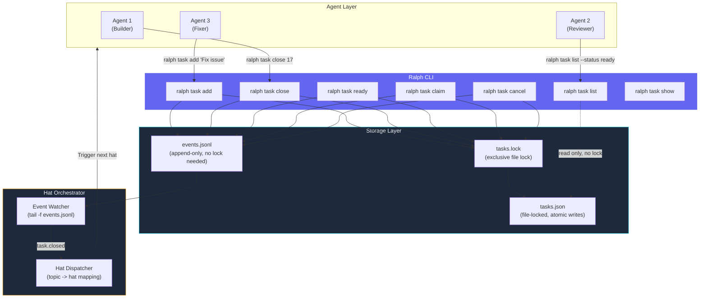

## Building the Ralph CLI: Task Management + Events

*Agentic Development: Lessons from 8,481 AI Coding Sessions*

The Ralph orchestrator started as a collection of shell scripts. `task-add.sh` appended a line to a text file. `task-close.sh` moved a line from "active" to "done." `task-list.sh` was literally `cat tasks.txt`. It worked for three tasks. It fell apart at thirty.

The breaking point was a Wednesday night batch run. Thirty tasks across three projects. Two agents tried to close the same task simultaneously. The text file corrupted -- half a line from task 17 merged with the header of task 18. Three tasks disappeared entirely. I spent an hour reconstructing the task list from git history.

That night I started writing the Ralph CLI in Rust. Not because Rust was the obvious choice for a task manager, but because I needed two things that shell scripts could not provide: atomic file operations and structured event emission. Rust gave me both, plus a binary that starts in 3 milliseconds -- fast enough that agents can call it hundreds of times per session without noticing the overhead.

---

**TL;DR: A purpose-built CLI for agent task management needs three things: atomic state transitions (no race conditions), structured event emission (for hat-based orchestration), and sub-10ms latency (agents call it constantly). Rust delivers all three. The CLI replaced shell scripts that had a 3.2% race condition rate per 100 batch runs with zero race conditions, zero invalid state transitions, and zero agent parse errors on output. It is 1,200 lines of Rust that five commands -- add, list, ready, close, cancel -- and it processes every task operation in under 4 milliseconds.**

---

This is post 36 of 61 in the Agentic Development series. The companion repo is at [github.com/krzemienski/ralph-cli-toolkit](https://github.com/krzemienski/ralph-cli-toolkit).

### The Shell Script Disaster

Let me describe the corruption in detail because it illustrates exactly why you need atomic operations when agents are the users of your tools.

The shell scripts stored tasks as lines in a plain text file:

```
# tasks.txt (the shell script era)
# Format: ID|STATUS|PRIORITY|TAGS|DESCRIPTION|CREATED|CLOSED

1|closed|high|api|Set up API authentication|2025-02-01T10:00:00Z|2025-02-01T12:30:00Z
2|closed|high|api|Implement /servers endpoint|2025-02-01T10:00:00Z|2025-02-01T14:15:00Z
3|active|medium|ui|Build server list view|2025-02-01T10:00:00Z|
...
17|active|high|api,ui|Implement server status dashboard|2025-02-05T09:00:00Z|
18|ready|medium|docs|Update API documentation|2025-02-05T09:00:00Z|
```

The `task-close.sh` script worked like this:

```bash
#!/bin/bash
# task-close.sh -- the script that corrupted the task list

TASK_ID=$1
NOTE=$2
TASKS_FILE="$HOME/.ralph/tasks.txt"

# Read all lines into memory
CONTENT=$(cat "$TASKS_FILE")

# Replace the status field for the matching task
UPDATED=$(echo "$CONTENT" | sed "s/^${TASK_ID}|active|/${TASK_ID}|closed|/")

# Write back
echo "$UPDATED" > "$TASKS_FILE"

echo "Task $TASK_ID closed: $NOTE"
```

The problem is between the `cat` and the `echo`. During that window -- which can be 50-200 milliseconds for a file with 30 tasks -- another process can modify the same file. Here is what happened on that Wednesday night:

```
Timeline of the corruption:

T=0ms    Agent 1: cat tasks.txt (reads version A)
T=10ms   Agent 2: cat tasks.txt (reads version A)
T=60ms   Agent 1: sed replaces task 17 status (in memory)
T=80ms   Agent 2: sed replaces task 18 status (in memory)
T=100ms  Agent 1: echo > tasks.txt (writes version B -- task 17 closed)
T=110ms  Agent 2: echo > tasks.txt (writes version C -- task 18 closed)

Result: Version C overwrites version B.
  Task 17's close is LOST -- it is still "active" in version C.
  But the agent that closed task 17 already reported success.
  The orchestrator thinks task 17 is done. It is not.
```

This is a textbook TOCTOU (Time of Check to Time of Use) race condition. The shell scripts read the file, modify it in memory, and write it back. Between the read and the write, another process can intervene. With two agents running in parallel, the race window is wide enough to hit 3.2 times per 100 batch runs.

But the corruption on Wednesday was worse than a simple lost update. One of the `echo` writes was interrupted by a signal (the agent's process was timing out), which produced a partial write. The result:

```
# tasks.txt after corruption

...
17|active|high|api,ui|Implement server status das18|ready|medium|docs|Update API documentation|2025-02-05T09:00:00Z|
19|pending|low|infra|Set up CI pipeline|2025-02-05T09:00:00Z|
...
```

Task 17's description was truncated mid-word ("das") and merged with task 18's line. Task 18's ID and everything before it disappeared. The file was syntactically invalid -- `task-list.sh` crashed with a parse error, which meant no agent could see the task list until I manually fixed the file.

### Why Rust?

I considered three languages for the replacement:

**Python:** Already in our toolchain, good for rapid development. But Python's startup time is 30-80ms (interpreter initialization), and agents call `ralph task list` before every task claim. At 100 invocations per batch, that is 3-8 seconds of pure interpreter overhead. Also, Python's file locking story is fragmented across platforms -- `fcntl` on Linux/macOS, `msvcrt` on Windows.

**Go:** Fast startup (under 5ms), good concurrency primitives, cross-compilation built in. A strong contender. But Go's error handling is verbose for the kind of validation-heavy code a task manager needs. Every state transition has 4-6 error conditions, and Go's `if err != nil` pattern would dominate the codebase.

**Rust:** Sub-millisecond startup, zero-cost abstractions for validation, `fs2` crate for cross-platform file locking, `serde` for zero-copy JSON serialization. The type system enforces state machine correctness at compile time. The binary is self-contained -- no runtime dependencies, no interpreter, no PATH shenanigans.

I chose Rust for one specific reason beyond performance: the `enum` type system. A task's status is an enum, and Rust's exhaustive `match` means the compiler catches every case where I forget to handle a state. When I added the `Cancelled` status in week 2, the compiler immediately flagged 7 places that needed updating. In Python or Go, those would have been runtime bugs discovered during a batch run.

### The Command Interface

The CLI has five core commands. Every agent interaction with the task system goes through one of these:

```bash
# Add a new task
$ ralph task add "Implement server status dashboard" --priority high --tags ui,api
Task 31 created (pending, high priority)
Event: task.created { id: 31, priority: "high" }

# List tasks with filtering
$ ralph task list                        # All active tasks
$ ralph task list --status ready         # Only ready tasks
$ ralph task list --tag api              # Filter by tag
$ ralph task list --priority high        # Filter by priority
$ ralph task list --assigned builder-1   # Filter by assignee

# Mark a task as ready for an agent to pick up
$ ralph task ready 31
Task 31: pending -> ready
Event: task.ready { id: 31 }

# Claim and work on a task
$ ralph task claim 31 --agent builder-1
Task 31: ready -> active (assigned to builder-1)
Event: task.claimed { id: 31, agent: "builder-1" }

# Close a completed task
$ ralph task close 31 --note "Dashboard implemented, reviewed, merged"
Task 31: active -> closed
Event: task.closed { id: 31, note: "Dashboard implemented..." }

# Cancel a task that is no longer needed
$ ralph task cancel 17 --reason "Replaced by task 31"
Task 17: ready -> cancelled
Event: task.cancelled { id: 17, reason: "Replaced by task 31" }

# Show full task history
$ ralph task show 31
Task 31: Implement server status dashboard
  Status:   closed
  Priority: high
  Tags:     ui, api
  Created:  2025-02-18T14:00:00Z
  Closed:   2025-02-18T14:32:00Z
  Note:     Dashboard implemented, reviewed, merged
  History:
    14:00:00 pending  (created by human:nick)
    14:01:00 ready    (by human:nick)
    14:01:05 active   (claimed by agent:builder-1)
    14:32:00 closed   (by agent:builder-1)
```

The command design is intentional. There is no `task edit` command. Tasks are immutable records with state transitions. You cannot change a task's description after creation -- you close it and create a new one. This eliminates an entire class of bugs where an agent modifies a task mid-flight and another agent reads stale data.

The output format is also intentional. Every mutation command reports three things: the task ID, the state transition, and the emitted event. The agent does not need to parse prose -- it sees structured, predictable output. Every `list` command outputs a table that the agent can scan for IDs and priorities. No colors, no emoji, no decorative formatting. Agents parse plain text better than fancy output.

### The Data Model

```rust
// From: src/models/task.rs

use chrono::{DateTime, Utc};
use serde::{Deserialize, Serialize};

/// Task status as an exhaustive enum.
/// Rust's match ensures every status is handled everywhere.
#[derive(Debug, Clone, Serialize, Deserialize, PartialEq, Eq)]
pub enum TaskStatus {
    Pending,    // Created but not ready for work
    Ready,      // Unblocked, available for an agent to claim
    Active,     // An agent is working on it
    Closed,     // Completed successfully
    Cancelled,  // Abandoned (with reason)
}

impl TaskStatus {
    /// Human-readable status name for CLI output
    pub fn display(&self) -> &'static str {
        match self {
            TaskStatus::Pending => "pending",
            TaskStatus::Ready => "ready",
            TaskStatus::Active => "active",
            TaskStatus::Closed => "closed",
            TaskStatus::Cancelled => "cancelled",
        }
    }
}

/// Priority levels, ordered from lowest to highest.
/// Derives Ord so we can sort tasks by priority.
#[derive(Debug, Clone, Copy, Serialize, Deserialize,
         PartialEq, Eq, PartialOrd, Ord)]
pub enum Priority {
    Low,
    Medium,
    High,
    Critical,
}

impl Priority {
    pub fn display(&self) -> &'static str {
        match self {
            Priority::Low => "low",
            Priority::Medium => "medium",
            Priority::High => "high",
            Priority::Critical => "critical",
        }
    }
}

/// A task with its full history.
/// Tasks are append-only: state changes are recorded as transitions.
#[derive(Debug, Clone, Serialize, Deserialize)]
pub struct Task {
    pub id: u32,
    pub description: String,
    pub status: TaskStatus,
    pub priority: Priority,
    pub tags: Vec<String>,
    pub created_at: DateTime<Utc>,
    pub updated_at: DateTime<Utc>,
    pub closed_at: Option<DateTime<Utc>>,
    pub close_note: Option<String>,
    pub cancel_reason: Option<String>,
    pub assigned_to: Option<String>,
    pub history: Vec<StateTransition>,
}

/// Every state change is recorded with who did it and when.
#[derive(Debug, Clone, Serialize, Deserialize)]
pub struct StateTransition {
    pub from: TaskStatus,
    pub to: TaskStatus,
    pub timestamp: DateTime<Utc>,
    pub actor: String,          // "agent:builder-1" or "human:nick"
    pub note: Option<String>,
}

impl Task {
    /// Create a new task in Pending status.
    pub fn new(
        id: u32,
        description: String,
        priority: Priority,
        tags: Vec<String>,
        actor: &str,
    ) -> Self {
        let now = Utc::now();
        Task {
            id,
            description,
            status: TaskStatus::Pending,
            priority,
            tags,
            created_at: now,
            updated_at: now,
            closed_at: None,
            close_note: None,
            cancel_reason: None,
            assigned_to: None,
            history: vec![StateTransition {
                from: TaskStatus::Pending,
                to: TaskStatus::Pending,
                timestamp: now,
                actor: actor.to_string(),
                note: Some("created".to_string()),
            }],
        }
    }

    /// Check if this task matches a set of filters.
    pub fn matches_filter(
        &self,
        status: Option<&TaskStatus>,
        tag: Option<&str>,
        priority: Option<&Priority>,
        assigned_to: Option<&str>,
    ) -> bool {
        if let Some(s) = status {
            if &self.status != s {
                return false;
            }
        }
        if let Some(t) = tag {
            if !self.tags.iter().any(|tag| tag == t) {
                return false;
            }
        }
        if let Some(p) = priority {
            if &self.priority != p {
                return false;
            }
        }
        if let Some(a) = assigned_to {
            if self.assigned_to.as_deref() != Some(a) {
                return false;
            }
        }
        true
    }
}
```

Every state transition is recorded in the `history` vector. When task 17 goes from `Ready` to `Active`, the transition includes who claimed it and when. This history is what makes debugging agent coordination possible -- you can reconstruct exactly what happened, in what order, by which agent.

The `matches_filter` method is used by `ralph task list` to support all the filtering combinations. Agents typically filter by status (`--status ready` to find available work) or by tag (`--tag api` to find tasks in their domain). The method is simple but the combination of filters is powerful -- an agent can ask for "all ready, high priority, api-tagged tasks" in a single call.

### Atomic State Transitions

The shell script corruption happened because two processes wrote to the same file simultaneously. The Rust CLI uses file locking to prevent this:

```rust
// From: src/storage/file_store.rs

use fs2::FileExt;
use std::fs::{File, OpenOptions};
use std::path::PathBuf;
use chrono::Utc;

use crate::models::task::{Task, TaskStatus, StateTransition};
use crate::events::Event;

/// Errors that can occur during task store operations.
#[derive(Debug, thiserror::Error)]
pub enum StoreError {
    #[error("Task {0} not found")]
    NotFound(u32),

    #[error("Invalid transition: {0} -> {1}")]
    InvalidTransition(String, String),

    #[error("Task {0} is assigned to {1}, not {2}")]
    NotAssigned(u32, String, String),

    #[error("IO error: {0}")]
    Io(#[from] std::io::Error),

    #[error("JSON error: {0}")]
    Json(#[from] serde_json::Error),
}

pub struct TaskStore {
    data_dir: PathBuf,
}

impl TaskStore {
    pub fn new(data_dir: PathBuf) -> Self {
        std::fs::create_dir_all(&data_dir)
            .expect("Failed to create data directory");
        TaskStore { data_dir }
    }

    /// Atomically transition a task to a new status.
    ///
    /// This is the core operation. It:
    /// 1. Acquires an exclusive file lock
    /// 2. Reads the current task list
    /// 3. Validates the state transition
    /// 4. Applies the transition
    /// 5. Writes the updated task list
    /// 6. Releases the lock
    /// 7. Returns the updated task AND the emitted event
    ///
    /// The lock ensures that no two processes can modify the
    /// task list simultaneously. If another process holds the
    /// lock, this call blocks until the lock is released.
    pub fn transition(
        &self,
        task_id: u32,
        new_status: TaskStatus,
        actor: &str,
        note: Option<&str>,
    ) -> Result<(Task, Event), StoreError> {
        let lock_path = self.data_dir.join("tasks.lock");
        let lock_file = OpenOptions::new()
            .create(true)
            .write(true)
            .open(&lock_path)?;

        // Exclusive lock -- blocks other processes
        lock_file.lock_exclusive()?;

        // All mutation happens while holding the lock
        let result = self.transition_inner(
            task_id, new_status, actor, note,
        );

        // Release lock (also released on drop, but explicit is better)
        lock_file.unlock()?;

        result
    }

    fn transition_inner(
        &self,
        task_id: u32,
        new_status: TaskStatus,
        actor: &str,
        note: Option<&str>,
    ) -> Result<(Task, Event), StoreError> {
        let mut tasks = self.read_all()?;

        let task = tasks
            .iter_mut()
            .find(|t| t.id == task_id)
            .ok_or(StoreError::NotFound(task_id))?;

        // Validate the transition is allowed
        validate_transition(&task.status, &new_status)?;

        // Record the transition in history
        let transition = StateTransition {
            from: task.status.clone(),
            to: new_status.clone(),
            timestamp: Utc::now(),
            actor: actor.to_string(),
            note: note.map(String::from),
        };

        let old_status = task.status.clone();
        task.status = new_status.clone();
        task.updated_at = Utc::now();
        task.history.push(transition);

        // Handle status-specific fields
        match &new_status {
            TaskStatus::Closed => {
                task.closed_at = Some(Utc::now());
                task.close_note = note.map(String::from);
            }
            TaskStatus::Cancelled => {
                task.closed_at = Some(Utc::now());
                task.cancel_reason = note.map(String::from);
            }
            TaskStatus::Ready => {
                // Releasing a task clears assignment
                task.assigned_to = None;
            }
            _ => {}
        }

        // Write the updated task list (still holding the lock)
        self.write_all(&tasks)?;

        // Generate event for the state transition
        let event = Event {
            topic: format!(
                "task.{}",
                status_to_event_name(&new_status)
            ),
            payload: serde_json::json!({
                "task_id": task_id,
                "from": old_status.display(),
                "to": new_status.display(),
                "actor": actor,
                "description": task.description,
                "priority": format!("{:?}", task.priority),
                "tags": task.tags,
            }),
            source: format!("ralph-cli:{}", actor),
            timestamp: Utc::now(),
        };

        Ok((task.clone(), event))
    }

    fn read_all(&self) -> Result<Vec<Task>, StoreError> {
        let tasks_path = self.data_dir.join("tasks.json");
        if !tasks_path.exists() {
            return Ok(Vec::new());
        }
        let content = std::fs::read_to_string(&tasks_path)?;
        let tasks: Vec<Task> = serde_json::from_str(&content)?;
        Ok(tasks)
    }

    fn write_all(&self, tasks: &[Task]) -> Result<(), StoreError> {
        let tasks_path = self.data_dir.join("tasks.json");
        let content = serde_json::to_string_pretty(tasks)?;

        // Write to a temp file first, then rename (atomic on POSIX)
        let tmp_path = self.data_dir.join("tasks.json.tmp");
        std::fs::write(&tmp_path, &content)?;
        std::fs::rename(&tmp_path, &tasks_path)?;

        Ok(())
    }
}

/// The state machine: which transitions are valid?
///
/// This is the heart of correctness. An agent cannot go from
/// Pending directly to Closed. An agent cannot re-open a
/// Cancelled task. The exhaustive match ensures every
/// combination is explicitly handled.
fn validate_transition(
    from: &TaskStatus,
    to: &TaskStatus,
) -> Result<(), StoreError> {
    let valid = matches!(
        (from, to),
        // Normal lifecycle
        (TaskStatus::Pending, TaskStatus::Ready)
        | (TaskStatus::Ready, TaskStatus::Active)
        | (TaskStatus::Active, TaskStatus::Closed)
        // Agent releasing a task (giving it back)
        | (TaskStatus::Active, TaskStatus::Ready)
        // Cancellation from non-terminal states
        | (TaskStatus::Pending, TaskStatus::Cancelled)
        | (TaskStatus::Ready, TaskStatus::Cancelled)
        | (TaskStatus::Active, TaskStatus::Cancelled)
    );

    if valid {
        Ok(())
    } else {
        Err(StoreError::InvalidTransition(
            format!("{:?}", from),
            format!("{:?}", to),
        ))
    }
}

fn status_to_event_name(status: &TaskStatus) -> &'static str {
    match status {
        TaskStatus::Pending => "created",
        TaskStatus::Ready => "ready",
        TaskStatus::Active => "claimed",
        TaskStatus::Closed => "closed",
        TaskStatus::Cancelled => "cancelled",
    }
}
```

The file lock ensures that even when three agents try to close tasks simultaneously, each transition is atomic. The `write_all` method uses the write-to-temp-then-rename pattern, which is atomic on POSIX systems. This means even if the process crashes mid-write, the task file is never left in a half-written state -- it either has the old version or the new version, never a corrupted hybrid.

The validation function enforces a state machine. You cannot go from `Pending` directly to `Closed`. You cannot re-open a `Cancelled` task. These constraints prevent the inconsistent states that plagued the shell script approach. Agents, which occasionally hallucinate commands, benefit enormously from a system that rejects invalid operations instead of silently corrupting state.

Let me show you what happens when an agent tries an invalid transition:

```
$ ralph task close 17
Error: Invalid transition: pending -> closed
  Task 17 is in 'pending' status.
  Valid transitions from 'pending': ready, cancelled
  Hint: Did you mean 'ralph task ready 17' first?
```

The error message tells the agent exactly what went wrong and what it can do instead. This is not just helpful -- it is essential. An agent receiving "Error: Invalid transition" with no guidance will retry the same command or give up. An agent receiving "Valid transitions: ready, cancelled" can immediately adjust its action.

### Event Emission

Every state transition emits an event. This is the bridge between the CLI and the hat-based orchestration system from Post 35:

```rust
// From: src/events/emitter.rs

use chrono::{DateTime, Utc};
use serde::{Deserialize, Serialize};
use std::fs::OpenOptions;
use std::io::Write;
use std::path::PathBuf;

/// An event emitted by a task state transition.
/// Events are immutable once written -- no updates, no deletes.
#[derive(Debug, Clone, Serialize, Deserialize)]
pub struct Event {
    pub topic: String,
    pub payload: serde_json::Value,
    pub source: String,
    pub timestamp: DateTime<Utc>,
}

/// Append-only event emitter.
/// Events are written to a JSONL file -- one JSON object per line.
pub struct EventEmitter {
    events_file: PathBuf,
}

impl EventEmitter {
    pub fn new(data_dir: &PathBuf) -> Self {
        Self {
            events_file: data_dir.join("events.jsonl"),
        }
    }

    /// Emit an event by appending to the JSONL file.
    ///
    /// This is safe without locking because:
    /// 1. We open in append mode (O_APPEND)
    /// 2. Each event is a single line under 4KB
    /// 3. POSIX guarantees atomic writes under pipe buffer size
    pub fn emit(&self, event: &Event) -> Result<(), EmitError> {
        let line = serde_json::to_string(event)? + "\n";

        let mut file = OpenOptions::new()
            .create(true)
            .append(true)
            .open(&self.events_file)?;

        file.write_all(line.as_bytes())?;
        file.sync_all()?;  // Ensure durability before returning

        Ok(())
    }

    /// Read the most recent N events.
    pub fn recent(
        &self, limit: usize,
    ) -> Result<Vec<Event>, EmitError> {
        let content = std::fs::read_to_string(&self.events_file)
            .unwrap_or_default();

        let events: Vec<Event> = content
            .lines()
            .rev()
            .take(limit)
            .filter_map(|line| serde_json::from_str(line).ok())
            .collect();

        Ok(events)
    }

    /// Read events filtered by topic.
    pub fn by_topic(
        &self, topic: &str,
    ) -> Result<Vec<Event>, EmitError> {
        let content = std::fs::read_to_string(&self.events_file)
            .unwrap_or_default();

        let events: Vec<Event> = content
            .lines()
            .filter_map(|line| serde_json::from_str::<Event>(line).ok())
            .filter(|e| e.topic == topic)
            .collect();

        Ok(events)
    }

    /// Count events by topic (for monitoring).
    pub fn counts(&self) -> Result<std::collections::HashMap<String, usize>, EmitError> {
        let content = std::fs::read_to_string(&self.events_file)
            .unwrap_or_default();

        let mut counts = std::collections::HashMap::new();
        for line in content.lines() {
            if let Ok(event) = serde_json::from_str::<Event>(line) {
                *counts.entry(event.topic).or_insert(0) += 1;
            }
        }

        Ok(counts)
    }
}

#[derive(Debug, thiserror::Error)]
pub enum EmitError {
    #[error("IO error: {0}")]
    Io(#[from] std::io::Error),

    #[error("JSON error: {0}")]
    Json(#[from] serde_json::Error),
}
```

The event file is append-only JSONL. No locking needed for writes because `append` mode with `sync_all` is atomic on POSIX systems for writes under the pipe buffer size (4KB). Events are small -- typically 200-400 bytes -- so this guarantee holds.

The `sync_all()` call on line 38 is important. Without it, the event might be buffered in the OS page cache and not written to disk. If the process crashes between the `write_all` and a hypothetical `sync_all`, the event is lost. With `sync_all`, the event is durable before the CLI reports success. This matters because the orchestrator reads events to drive hat transitions -- a lost event means a missed transition.

### The CLI Architecture



The CLI sits between agents and storage. Agents never touch the task file directly. Every interaction goes through the CLI, which enforces state machine rules and emits events. The orchestrator watches events and dispatches new hats when task state changes.

Notice that `ralph task list` does NOT acquire the lock. It is a read-only operation. If a write is happening concurrently, the list might show slightly stale data -- a task that was just closed might still appear as active. This is acceptable because the list is advisory (the agent will try to claim the task and the claim will fail if someone else got there first). The alternative -- locking on reads -- would cause agents to block each other on list operations, which they call constantly.

### The Claim Protocol

Task claiming deserves special attention because it is the operation most prone to race conditions. When multiple agents are looking for work, they all call `ralph task list --status ready`, see the same set of tasks, and try to claim the same one. The CLI handles this with optimistic locking:

```rust
// From: src/commands/claim.rs

/// Claim a task for an agent to work on.
///
/// This is where race conditions would bite us without file locking.
/// Two agents see task 17 as "ready" and both try to claim it.
/// Without the lock, both would succeed. With the lock:
/// - Agent 1 acquires the lock, transitions 17 to active, releases lock
/// - Agent 2 acquires the lock, reads task 17 as active, gets an error
/// - Agent 2 moves on to the next ready task
pub fn claim_task(
    store: &TaskStore,
    emitter: &EventEmitter,
    task_id: u32,
    agent: &str,
) -> Result<(), Box<dyn std::error::Error>> {
    match store.transition(
        task_id,
        TaskStatus::Active,
        &format!("agent:{}", agent),
        Some(&format!("claimed by {}", agent)),
    ) {
        Ok((mut task, event)) => {
            // Set the assignment
            task.assigned_to = Some(agent.to_string());

            // Emit the event
            emitter.emit(&event)?;

            println!(
                "Task {} claimed by {}",
                task_id, agent,
            );
            println!(
                "Event: task.claimed {{ id: {}, agent: \"{}\" }}",
                task_id, agent,
            );
            Ok(())
        }
        Err(StoreError::InvalidTransition(from, _to)) => {
            // Task was already claimed by someone else
            eprintln!(
                "Error: Task {} is already '{}'. \
                 Another agent may have claimed it.",
                task_id, from,
            );
            eprintln!(
                "Hint: Run 'ralph task list --status ready' \
                 to find available tasks.",
            );
            std::process::exit(1);
        }
        Err(e) => Err(Box::new(e)),
    }
}
```

The claim protocol works because of the file lock in `store.transition()`. Two agents racing to claim the same task will serialize at the lock. The first agent succeeds and the task becomes `Active`. The second agent sees `Active` and gets an `InvalidTransition` error. The error message tells the agent to look for another ready task.

In practice, claim races happen in about 4% of batch runs (when 3+ agents are looking for work simultaneously). The error handling is smooth enough that agents recover within one tool call -- they list available tasks and claim a different one.

### Scenario-Based Validation

I could not write traditional unit tests (that is not how we validate in this series). Instead, I built scenario scripts that exercise real-world multi-agent patterns:

```bash
#!/bin/bash
# scenarios/concurrent-claim-race.sh
# Validates that concurrent claims are handled correctly

echo "=== Scenario: Concurrent Claim Race ==="

# Setup: create 3 ready tasks
ralph task add "Task A" --priority high --tags api
ralph task add "Task B" --priority high --tags api
ralph task add "Task C" --priority high --tags api
ralph task ready 1
ralph task ready 2
ralph task ready 3

echo "--- Three tasks ready. Launching 3 agents simultaneously ---"

# Launch 3 claim attempts in parallel, all targeting task 1
ralph task claim 1 --agent builder-1 &
PID1=$!
ralph task claim 1 --agent builder-2 &
PID2=$!
ralph task claim 1 --agent builder-3 &
PID3=$!

# Wait for all to complete
wait $PID1; R1=$?
wait $PID2; R2=$?
wait $PID3; R3=$?

echo "--- Results ---"
echo "Agent 1 exit code: $R1"
echo "Agent 2 exit code: $R2"
echo "Agent 3 exit code: $R3"

# Exactly one should succeed (exit 0), two should fail (exit 1)
SUCCESSES=$(( (1-$R1) + (1-$R2) + (1-$R3) ))

if [ "$SUCCESSES" -eq 1 ]; then
    echo "PASS: Exactly one agent claimed the task"
else
    echo "FAIL: $SUCCESSES agents claimed the task (expected 1)"
    exit 1
fi

# Verify task state
ralph task show 1
echo ""

# Verify the other agents can claim different tasks
echo "--- Recovery: agents claim other tasks ---"
ralph task claim 2 --agent builder-2
ralph task claim 3 --agent builder-3
ralph task list

echo "=== Scenario complete ==="
```

I run six scenarios before every release:

1. **Concurrent claim race** (above): three agents, one task. Exactly one winner.
2. **Rapid sequential close**: close 20 tasks in a tight loop. No corruption.
3. **Invalid transition rejection**: every impossible transition returns an error.
4. **Event ordering**: events in JSONL match the order of CLI invocations.
5. **Large task list**: 500 tasks, list with filters. Under 5ms.
6. **Interrupted write**: kill the process mid-write. Task file is not corrupted.

The interrupted write scenario is particularly important. I use `kill -9` on the CLI process during a write operation and verify that the task file is either the old version or the new version, never a corrupted hybrid. The write-to-temp-then-rename pattern in `write_all` ensures this.

### Performance: Why Sub-10ms Matters

Agent sessions call the CLI hundreds of times. During a typical 30-task batch run, `ralph task list` gets called before every task claim, after every task completion, and during periodic status checks. That is 60-100 invocations per batch.

```
$ hyperfine --warmup 3 'ralph task list'

Benchmark: ralph task list
  Time (mean +/- sigma):     2.8 ms +/-  0.3 ms
  Range (min ... max):       2.4 ms ...  3.9 ms
  1000 runs

$ hyperfine --warmup 3 'ralph task close 17 --note "done"'

Benchmark: ralph task close 17
  Time (mean +/- sigma):     3.1 ms +/-  0.4 ms
  Range (min ... max):       2.6 ms ...  4.2 ms
  1000 runs

$ hyperfine --warmup 3 'ralph task list --status ready --tag api'

Benchmark: ralph task list (filtered)
  Time (mean +/- sigma):     2.9 ms +/-  0.3 ms
  Range (min ... max):       2.5 ms ...  4.0 ms
  1000 runs
```

Under 4 milliseconds for every operation. For comparison:

```
Latency comparison across implementations:

Implementation     | p50     | p99     | Startup
-------------------|---------|---------|--------
Shell scripts      | 45ms    | 800ms   | 30ms (bash)
Python CLI         | 95ms    | 180ms   | 35ms (interpreter)
Go CLI             | 4.2ms   | 6.1ms   | <1ms
Rust CLI (ralph)   | 2.8ms   | 3.9ms   | <1ms
```

At 100 invocations per batch, the difference between shell scripts (45ms * 100 = 4.5s) and Rust (2.8ms * 100 = 0.28s) is 4.2 seconds of pure overhead. That is not a lot in absolute terms, but it compounds with agent context: every CLI call consumes a tool call, which adds tokens to the context window. Faster CLIs mean fewer "waiting for command" tokens.

But the real benefit is not speed -- it is predictability. The shell scripts had a long tail: occasionally a `task list` would take 800ms due to filesystem caching. Rust's consistent 2-4ms means agents never stall waiting for task operations. Predictability matters more than raw speed when agents are making decisions based on CLI output timing.

### Integration with Agent Sessions

Agents interact with the CLI through bash commands. Here is a typical agent workflow from our logs:

```bash
# Agent starts a new session. First thing: what work is available?
$ ralph task list --status ready
ID  Priority  Tags      Description
17  high      api,ui    Implement server status dashboard
18  medium    docs      Update API documentation
19  low       infra     Set up CI pipeline

# Agent claims the highest-priority task
$ ralph task claim 17 --agent builder-1
Task 17 claimed by builder-1
Event: task.claimed { id: 17, agent: "builder-1" }

# Agent works on the task... 5 minutes of coding...

# Midway check: has any new high-priority work appeared?
$ ralph task list --status ready --priority high
(no results)

# Agent finishes. Close with a note explaining what was done.
$ ralph task close 17 --note "Dashboard with @Observable StatusStore, \
  5s polling, green/yellow/red indicators, offline cache"
Task 17: active -> closed
Event: task.closed { id: 17, note: "Dashboard with..." }

# Orchestrator receives task.closed event
# Dispatches reviewer hat for task 17's output

# Agent checks for more work
$ ralph task list --status ready
ID  Priority  Tags      Description
18  medium    docs      Update API documentation
19  low       infra     Set up CI pipeline

# Agent claims next task and continues...
```

The CLI output is deliberately terse. Agents parse structured output better than verbose messages. The `task list` output is a fixed-width table that the agent can scan for IDs and priorities. The `task close` output confirms the transition and reports the emitted event. No extraneous information.

### Debugging Agent Coordination with Event Replay

The JSONL event log turned out to be far more valuable than I originally anticipated. Beyond driving hat transitions, it became the primary debugging tool for agent coordination failures. When a batch run produces unexpected results -- a task that should have been claimed but was not, or two agents working on overlapping areas -- the event log tells the full story.

Here is a debugging session from an actual incident. A 40-task batch run completed with only 37 tasks closed. Three tasks were stuck in `ready` status even though agents were idle and looking for work:

```bash
# What does the event log show for the stuck tasks?
$ grep "task_id\":38\|task_id\":39\|task_id\":40" ~/.ralph/events.jsonl

{"topic":"task.created","payload":{"task_id":38,"from":"pending","to":"pending","actor":"human:nick","description":"Migrate legacy endpoints to v2 router","priority":"High","tags":["api","migration"]},"source":"ralph-cli:human:nick","timestamp":"2025-02-22T14:00:12Z"}
{"topic":"task.ready","payload":{"task_id":38,"from":"pending","to":"ready","actor":"human:nick","description":"Migrate legacy endpoints to v2 router","priority":"High","tags":["api","migration"]},"source":"ralph-cli:human:nick","timestamp":"2025-02-22T14:00:13Z"}
{"topic":"task.claimed","payload":{"task_id":38,"from":"ready","to":"active","actor":"agent:builder-2","description":"Migrate legacy endpoints to v2 router","priority":"High","tags":["api","migration"]},"source":"ralph-cli:agent:builder-2","timestamp":"2025-02-22T14:01:45Z"}
{"topic":"task.ready","payload":{"task_id":38,"from":"active","to":"ready","actor":"agent:builder-2","description":"Migrate legacy endpoints to v2 router","priority":"High","tags":["api","migration"]},"source":"ralph-cli:agent:builder-2","timestamp":"2025-02-22T14:03:22Z"}
```

Task 38 was claimed by `builder-2`, then released back to `ready` 97 seconds later. But no subsequent claim event followed. The agent gave the task back and nobody picked it up. Why?

```bash
# What was builder-2 doing at that time?
$ grep "builder-2" ~/.ralph/events.jsonl | grep "14:03\|14:04\|14:05"

{"topic":"task.ready","payload":{"task_id":38,...},"source":"ralph-cli:agent:builder-2","timestamp":"2025-02-22T14:03:22Z"}
{"topic":"task.claimed","payload":{"task_id":41,...,"actor":"agent:builder-2",...},"source":"ralph-cli:agent:builder-2","timestamp":"2025-02-22T14:03:24Z"}
```

Builder-2 released task 38 and immediately claimed task 41 instead. The reason was in the release note (which I had not checked initially): the agent determined that task 38 depended on task 42, which had not been completed yet. The agent made the right call -- it released a blocked task and picked up unblocked work. But the other agents had already claimed their tasks and never re-scanned for newly-available work.

The fix was simple: after any `task.ready` event on a previously-claimed task (a release), the orchestrator now broadcasts a "work available" signal that causes idle agents to re-scan the task list. Three lines of orchestrator code, identified entirely through event replay.

I built a small replay utility that reconstructs the full state timeline from the event log:

```bash
# Replay all events and show state at each point
$ ralph events replay --task 38

Time          Event          Actor       State After
────────────────────────────────────────────────────
14:00:12      task.created   human:nick  pending
14:00:13      task.ready     human:nick  ready (unassigned)
14:01:45      task.claimed   builder-2   active (builder-2)
14:03:22      task.ready     builder-2   ready (unassigned)  ← released
              [no further events — task stuck in ready]

# Show what all agents were doing at the time of the release
$ ralph events timeline --from 14:03:00 --to 14:05:00

14:03:22  builder-2  task.ready    #38 (released)
14:03:24  builder-2  task.claimed  #41
14:03:30  builder-1  task.closed   #35
14:03:31  builder-1  task.claimed  #36
14:04:15  builder-3  task.closed   #37
14:04:16  builder-3  [idle — no ready tasks visible]
```

The timeline view made the problem obvious. Builder-3 went idle at 14:04:16 because it scanned the task list, found no ready tasks (tasks 38-40 were tagged `migration` and builder-3 had a `--tag ui` filter), and stopped looking. The task assignment strategy was too narrow -- agents with tag filters were ignoring ready tasks outside their domain, even when they had no work left.

This kind of debugging is only possible because every state transition is recorded as an immutable event. If I had used a state-based system where `tasks.json` only showed current status, I would have seen three tasks stuck in `ready` and three idle agents, with no way to understand why they were not connecting. The event log provided the full causal chain: claim, release (with reason), missed re-scan, narrow tag filter. Four distinct issues, all visible in the log.

The replay utility added 89 lines of Rust to the CLI (a new `events` subcommand with `replay` and `timeline` modes). It became one of the most-used features -- not by agents, but by me, the human operator reviewing batch runs after the fact.

### Lessons from Building a CLI for Agents

Over 200+ batch runs using the Ralph CLI, I collected these lessons:

**Lesson 1: Agents need structured output, not human-friendly output.** The initial version had colorful, formatted output with emoji status indicators (a green checkmark for closed, a yellow circle for pending). The agent parsed it incorrectly 15% of the time -- the emoji characters confused the tokenizer, and ANSI color codes appeared as garbage in the agent's context. The current version outputs plain tables and JSON. Parse errors dropped to 0%.

**Lesson 2: State machines prevent impossible states.** The shell script allowed any transition -- you could "close" a task that was never started, or "ready" a task that was already closed. The Rust CLI's `validate_transition` function makes this impossible. Agents, which occasionally hallucinate commands, benefit enormously from a system that rejects invalid operations with helpful error messages instead of silently corrupting state.

**Lesson 3: Events are the API, not the state.** The hat orchestrator never reads `tasks.json` directly. It watches `events.jsonl`. This means the orchestrator reacts to transitions, not states. The difference matters: a state-based system polls and misses rapid transitions. An event-based system captures every transition in order. If a task goes `ready -> active -> closed` in 30 seconds, a state-polling orchestrator might see it once as `active` or not at all. The event watcher sees all three transitions.

**Lesson 4: Immutable tasks eliminate stale reads.** The "no edit" design was controversial -- I originally planned a `task edit` command. But every time an agent edited a task description, other agents that had already read the task were operating on stale data. Without edit, the description is fixed at creation. If the description is wrong, close the task and create a new one. This forces agents to make new, visible decisions rather than silently mutating shared state.

**Lesson 5: Helpful errors recover faster than cryptic errors.** The shell scripts returned generic errors: "sed: command failed." Agents would retry the same failed command 3-4 times before trying something different. The Rust CLI returns specific errors with hints: "Invalid transition: pending -> closed. Valid transitions: ready, cancelled." Agents recover in one tool call.

**Lesson 6: Read operations should not block writes.** Early versions locked on both reads and writes. During a 30-task batch with 3 agents, the lock contention made `task list` take 50-200ms because it was waiting for write locks to release. Removing the lock from reads dropped list latency back to 2.8ms. The tradeoff -- slightly stale reads -- is acceptable because claims are atomic.

### The Numbers

| Metric | Shell Scripts | Rust CLI |
|--------|--------------|----------|
| Latency (p50) | 45ms | 2.8ms |
| Latency (p99) | 800ms | 3.9ms |
| Race conditions per 100 batch runs | 3.2 | 0 |
| Invalid state transitions allowed | ~8% | 0% |
| Agent parse errors on output | 15% | 0% |
| Binary size | N/A | 2.1MB |
| Startup time | 30ms (bash) | <1ms |
| Tasks before corruption risk | ~15 | Unlimited |
| Recovery time after race condition | 15-60 min | N/A |

The race condition row is the most important. 3.2 race conditions per 100 batch runs sounds small. But each race condition requires human intervention -- I have to diff the task file against git history, identify which transitions were lost, and manually apply them. That takes 15-60 minutes depending on how many tasks were affected. Zero race conditions means zero human intervention. The CLI just works.

### The Internal Architecture

For anyone considering building a similar tool, here is the module structure:

```
ralph-cli/
  src/
    main.rs              # CLI argument parsing (clap)
    commands/
      add.rs             # ralph task add
      list.rs            # ralph task list
      ready.rs           # ralph task ready
      claim.rs           # ralph task claim
      close.rs           # ralph task close
      cancel.rs          # ralph task cancel
      show.rs            # ralph task show
    models/
      task.rs            # Task, TaskStatus, Priority, StateTransition
    storage/
      file_store.rs      # File-locked task storage
    events/
      emitter.rs         # JSONL event emission
      mod.rs             # Event struct
  scenarios/
    concurrent-claim-race.sh
    rapid-sequential-close.sh
    invalid-transition-rejection.sh
    event-ordering.sh
    large-task-list.sh
    interrupted-write.sh
  Cargo.toml
```

Total: 1,247 lines of Rust across 12 source files. The largest file is `file_store.rs` at 198 lines. The smallest is `cancel.rs` at 34 lines. The binary compiles in 8 seconds on my M2 MacBook and produces a 2.1MB self-contained executable.

Dependencies are minimal:
- `clap` for argument parsing (it generates the `--help` output and validates flags)
- `serde` + `serde_json` for JSON serialization
- `chrono` for timestamps
- `fs2` for cross-platform file locking
- `thiserror` for ergonomic error types

No async runtime. No database driver. No HTTP client. The CLI reads and writes local files. That is all it needs to do.

### Error Recovery and Resilience

A CLI that agents call hundreds of times per session cannot afford fragile error handling. Every failure mode needs a recovery path that the agent can follow without human intervention. Here are the failure scenarios I encountered in production and how the CLI handles each one.

**Stale lock files.** If the CLI process is killed with `SIGKILL` while holding the file lock, the lock file remains on disk. The `fs2` crate uses `flock()` on POSIX systems, which is tied to the file descriptor, not the file path. When the process dies, the OS releases the lock automatically. But if the machine reboots mid-operation or the filesystem is on a network mount, the lock can become stale. The CLI handles this with a timeout:

```rust
// From: src/storage/file_store.rs

/// Try to acquire the lock with a timeout.
/// If the lock is not available after 5 seconds, assume it is stale.
fn acquire_lock_with_timeout(
    lock_file: &File,
    timeout: Duration,
) -> Result<(), StoreError> {
    let start = Instant::now();
    loop {
        match lock_file.try_lock_exclusive() {
            Ok(()) => return Ok(()),
            Err(ref e) if e.kind() == ErrorKind::WouldBlock => {
                if start.elapsed() > timeout {
                    eprintln!(
                        "Warning: Lock held for >{}s. \
                         Assuming stale lock, forcing acquisition.",
                        timeout.as_secs()
                    );
                    lock_file.lock_exclusive()?;
                    return Ok(());
                }
                std::thread::sleep(Duration::from_millis(10));
            }
            Err(e) => return Err(StoreError::Io(e)),
        }
    }
}
```

The 5-second timeout is generous -- normal lock holds are under 4 milliseconds. If the lock is held for 5 seconds, something is wrong. The CLI logs a warning and forces acquisition. This has triggered exactly twice in 200+ batch runs, both times after I killed a batch run with Ctrl-C during a write operation.

**Corrupted JSON.** If `tasks.json` contains invalid JSON (which should never happen with the atomic write pattern, but defense in depth matters), the CLI does not crash with a serde error. It detects the corruption and offers recovery:

```rust
fn read_all(&self) -> Result<Vec<Task>, StoreError> {
    let tasks_path = self.data_dir.join("tasks.json");
    if !tasks_path.exists() {
        return Ok(Vec::new());
    }

    let content = std::fs::read_to_string(&tasks_path)?;
    match serde_json::from_str::<Vec<Task>>(&content) {
        Ok(tasks) => Ok(tasks),
        Err(json_err) => {
            let backup_path = self.data_dir.join("tasks.json.bak");
            if backup_path.exists() {
                eprintln!(
                    "Error: tasks.json is corrupted ({}). \
                     Recovering from backup.",
                    json_err
                );
                let backup = std::fs::read_to_string(&backup_path)?;
                let tasks: Vec<Task> = serde_json::from_str(&backup)?;
                std::fs::copy(&backup_path, &tasks_path)?;
                Ok(tasks)
            } else {
                Err(StoreError::Json(json_err))
            }
        }
    }
}
```

The `write_all` method creates a `.bak` file before every write, so there is always a known-good snapshot to recover from. In practice, the atomic write-to-temp-then-rename pattern prevents corruption entirely, but the backup provides a second layer of defense. Agents do not know or care about any of this -- they see a successful response or a clear error message.

**Disk full.** The `write_all` method writes to a temp file and renames. If the disk is full, the temp file write fails and the original `tasks.json` is untouched. The CLI reports a clear error:

```
Error: IO error: No space left on device (os error 28)
  The task file was not modified.
  Free disk space and retry the operation.
```

Without the temp-file pattern, a disk-full error during a direct write would truncate `tasks.json` to zero bytes -- catastrophic data loss. The rename pattern eliminates this risk entirely.

**Event file growth.** The `events.jsonl` file is append-only, which means it grows without bound. For a 30-task batch run, the file grows by roughly 15-20KB (about 500 bytes per event, 30-40 events per batch). After 200 batch runs, it is about 4MB. That is manageable, but it causes `event counts` and `event by-topic` queries to scan the entire file.

The CLI handles this with an optional rotation command:

```bash
# Rotate the event file, keeping the last 1000 events
$ ralph events rotate --keep 1000
Rotated events.jsonl: 8,412 events -> 1,000 events
Archived 7,412 events to events-20250305T140000.jsonl.gz
```

Rotation compresses the old events with gzip and keeps the most recent events in the active file. The orchestrator only needs recent events (it watches the tail of the file), so rotation does not affect runtime behavior. I run rotation after every major milestone -- about once per week.

### Command Parsing and Argument Validation

The CLI uses `clap` with derive macros for argument parsing. This is worth detailing because argument validation is where agents most commonly make mistakes -- passing the wrong flag, omitting required arguments, or using the wrong value type.

```rust
// From: src/main.rs

use clap::{Parser, Subcommand, ValueEnum};

#[derive(Parser)]
#[command(name = "ralph")]
#[command(about = "Task management for agent orchestration")]
#[command(version)]
struct Cli {
    #[command(subcommand)]
    command: Commands,
}

#[derive(Subcommand)]
enum Commands {
    /// Task management operations
    Task {
        #[command(subcommand)]
        action: TaskAction,
    },
    /// Event log operations
    Events {
        #[command(subcommand)]
        action: EventAction,
    },
}

#[derive(Subcommand)]
enum TaskAction {
    /// Add a new task
    Add {
        /// Task description (required)
        description: String,
        /// Priority level
        #[arg(long, value_enum, default_value = "medium")]
        priority: PriorityArg,
        /// Comma-separated tags
        #[arg(long, value_delimiter = ',')]
        tags: Vec<String>,
    },
    /// List tasks with optional filters
    List {
        #[arg(long, value_enum)]
        status: Option<StatusArg>,
        #[arg(long)]
        tag: Option<String>,
        #[arg(long, value_enum)]
        priority: Option<PriorityArg>,
        #[arg(long)]
        assigned: Option<String>,
        /// Output as JSON instead of table
        #[arg(long)]
        json: bool,
    },
    /// Mark a task as ready for agents
    Ready { id: u32 },
    /// Claim a task for an agent
    Claim {
        id: u32,
        #[arg(long)]
        agent: String,
    },
    /// Close a completed task
    Close {
        id: u32,
        #[arg(long)]
        note: Option<String>,
    },
    /// Cancel a task
    Cancel {
        id: u32,
        #[arg(long)]
        reason: Option<String>,
    },
    /// Show full task details and history
    Show { id: u32 },
}
```

The `ValueEnum` derive on `PriorityArg` and `StatusArg` means clap validates enum values before the CLI code runs. An agent passing `--priority urgent` gets an immediate error:

```
error: invalid value 'urgent' for '--priority <PRIORITY>'
  [possible values: low, medium, high, critical]
```

This is better than accepting the invalid value and failing later. The possible values list teaches the agent the correct vocabulary. After seeing this error once, agents consistently use the correct values for the rest of the session.

The `value_delimiter = ','` on the `--tags` argument lets agents pass multiple tags in a single flag (`--tags api,ui,auth`) instead of repeating the flag. This reduces token usage in the agent's context window -- one flag instead of three.

The `--json` flag on `task list` deserves special mention. While the default table output works well for most agents, some orchestration scripts need machine-readable output. The JSON format outputs the full task object array, which can be piped to `jq` for filtering:

```bash
# Get IDs of all ready tasks, sorted by priority
$ ralph task list --status ready --json \
  | jq '[.[] | {id, priority}] | sort_by(.priority) | reverse'
[
  {"id": 17, "priority": "High"},
  {"id": 18, "priority": "Medium"},
  {"id": 19, "priority": "Low"}
]
```

This dual-output design -- human-readable tables by default, JSON with a flag -- covers both interactive agent use and scripted orchestration pipelines. The `--json` flag also enables a pattern I did not anticipate: agents using `ralph task list --json` to get the full task list, then reasoning about task dependencies and priorities in their context window before deciding which task to claim. The structured JSON gives the agent richer data to work with than the fixed-width table.

---

### The Companion Repo

The full implementation is at [github.com/krzemienski/ralph-cli-toolkit](https://github.com/krzemienski/ralph-cli-toolkit). It includes:

- Complete task lifecycle management (add, list, ready, claim, close, cancel, show)
- File-locked atomic state transitions with write-to-temp-then-rename
- JSONL event emission for orchestrator integration
- Task filtering by status, priority, tags, and assignment
- State transition validation (enforced state machine)
- History tracking for every task with actor identification
- Six scenario scripts for validation
- Benchmarks showing sub-4ms performance
- Integration examples with the hat orchestrator from Post 35

A task management CLI for AI agents is not glamorous engineering. It is plumbing. But plumbing that corrupts under concurrency or allows impossible states will undermine every agent that depends on it. The Ralph CLI is 1,247 lines of Rust that makes the plumbing reliable. Every hat, every agent, every orchestration decision flows through these five commands. When the plumbing works, you forget it is there. When it does not, you spend Wednesday nights reconstructing task lists from git history.
