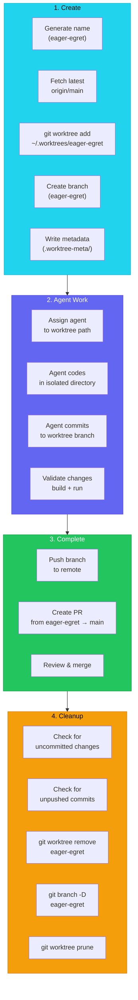
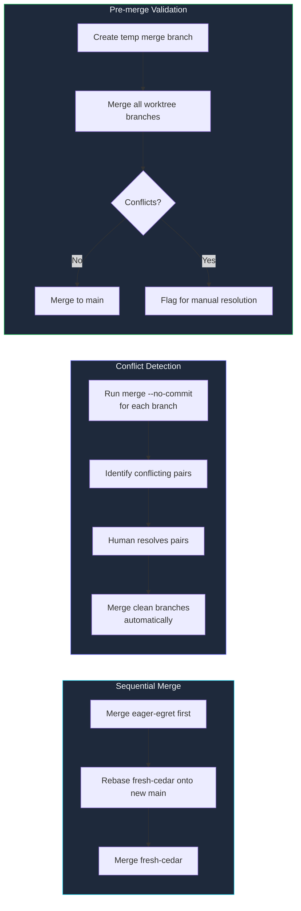

## Named Worktrees for Parallel Agent Development

*Agentic Development: 21 Lessons from 8,481 AI Coding Sessions*

My git log from a Tuesday in October tells the story:

```
* 3f2a1b8 (eager-egret) feat: add server metrics dashboard
| * 7c4d9e2 (fresh-cedar) fix: resolve SSH key rotation race condition
| | * a1b8c3d (quiet-brook) refactor: extract terminal emulator to package
| | | * e5f6a7b (calm-falcon) feat: WebSocket reconnection handler
| | | | * 9d8c7b6 (bright-maple) chore: migrate config to YAML
| | | |/
| | |/
| |/
|/
* 9d4e5f6 (main) chore: release v2.3.0
```

Five branches. Five agents. Five features being developed simultaneously in five isolated directories on the same machine. No merge conflicts. No file locking. No coordination overhead. Each agent worked in its own named worktree — a separate checkout of the repository with its own working directory, its own index, and its own HEAD — completely unaware of the others.

The names — fresh-cedar, eager-egret, quiet-brook — are not random. They are generated from a curated word list designed to be memorable, pronounceable, and grep-friendly. When you are managing ten parallel agent sessions, `worktree-7` is meaningless. `eager-egret` is a story.

**TL;DR: Named git worktrees give each agent an isolated workspace. One agent per worktree, one task per worktree, zero conflicts. Poetic names make multi-agent sessions navigable. Lifecycle management ensures cleanup after completion.**

This is post 37 of 61 in the Agentic Development series. The companion repo is at [github.com/krzemienski/named-worktree-factory](https://github.com/krzemienski/named-worktree-factory).

---

### Why Worktrees, Not Branches

The naive approach to parallel agent development is branches. Agent 1 works on `feature/dashboard`, Agent 2 works on `feature/ssh-fix`. Both agents share the same working directory — the main checkout. They switch branches when they need to work.

This fails immediately. Agent 1 is editing `AppRouter.swift`. Agent 2 needs to edit `AppRouter.swift` on a different branch. But there is only one `AppRouter.swift` on disk. Agent 2 either has to wait, stash, or risk overwriting Agent 1's uncommitted changes.

I learned this the hard way during a sprint where I had three Claude Code sessions open. Agent A was midway through a refactor of our networking layer. Agent B needed to fix a bug in the same file on a different branch. I told Agent B to `git stash` Agent A's work, switch branches, fix the bug, switch back, and `git stash pop`. The stash popped with conflicts. Agent B resolved them incorrectly. Agent A's half-finished refactor was corrupted. Two hours of work, gone.

Git worktrees solve this by giving each branch its own directory:

```bash
# Main repo at ~/projects/server-manager
# Worktree for Agent 1
git worktree add ~/.worktrees/fresh-cedar -b feature/dashboard

# Worktree for Agent 2
git worktree add ~/.worktrees/eager-egret -b feature/ssh-fix

# Worktree for Agent 3
git worktree add ~/.worktrees/quiet-brook -b refactor/terminal
```

Now Agent 1 has `~/.worktrees/fresh-cedar/AppRouter.swift` and Agent 2 has `~/.worktrees/eager-egret/AppRouter.swift`. Two separate files on disk. Two agents editing simultaneously. Zero conflicts until merge time.

The key insight: git worktrees share the `.git` object database but have independent working directories. This means creating a worktree is fast (hardlinks, not copies) and disk-efficient. A 2GB repository creates a worktree in under 2 seconds, consuming only ~50MB of additional disk space for the working directory files.

```bash
# How git worktrees share objects
$ ls -la ~/.worktrees/fresh-cedar/.git
# This is a file, not a directory:
# gitdir: /Users/nick/projects/server-manager/.git/worktrees/fresh-cedar

$ du -sh ~/projects/server-manager/.git
# 1.8G — the shared object store

$ du -sh ~/.worktrees/fresh-cedar
# 52M — just the working directory files
```

---

### The Naming System

The name generator uses a curated word list of adjectives and nouns drawn from nature:

```python
# From: src/name_generator.py

import random
import hashlib
from dataclasses import dataclass
from datetime import datetime

ADJECTIVES = [
    "bright", "calm", "crisp", "dawn", "eager",
    "fair", "fresh", "gentle", "golden", "hushed",
    "keen", "light", "mild", "noble", "pale",
    "quiet", "rapid", "serene", "still", "swift",
    "tawny", "vast", "warm", "young", "zealous",
]

NOUNS = [
    "alder", "birch", "brook", "cedar", "cliff",
    "crane", "dusk", "egret", "elm", "falcon",
    "fern", "glen", "grove", "hawk", "isle",
    "lake", "lark", "maple", "marsh", "oak",
    "peak", "pine", "reef", "ridge", "sage",
    "shore", "spruce", "stone", "vale", "wren",
]

@dataclass(frozen=True)
class WorktreeName:
    adjective: str
    noun: str

    @property
    def full_name(self) -> str:
        return f"{self.adjective}-{self.noun}"

    @property
    def branch_name(self) -> str:
        return self.full_name

    @property
    def short_hash(self) -> str:
        """4-char hash for disambiguation in logs."""
        return hashlib.md5(
            self.full_name.encode()
        ).hexdigest()[:4]

def generate_name(existing_names: set[str] | None = None) -> WorktreeName:
    """Generate a unique, memorable worktree name."""
    existing = existing_names or set()
    attempts = 0

    while attempts < 100:
        name = WorktreeName(
            adjective=random.choice(ADJECTIVES),
            noun=random.choice(NOUNS),
        )
        if name.full_name not in existing:
            return name
        attempts += 1

    # Fallback: append a digit
    base = WorktreeName(
        adjective=random.choice(ADJECTIVES),
        noun=random.choice(NOUNS),
    )
    counter = 2
    while f"{base.full_name}-{counter}" in existing:
        counter += 1
    return WorktreeName(
        adjective=base.adjective,
        noun=f"{base.noun}-{counter}",
    )
```

The word list has 25 adjectives and 30 nouns, giving 750 unique combinations. That is far more than the 10-15 parallel worktrees we typically run. The words are chosen for three properties:

1. **Pronounceable**: you can say "eager-egret" in a Telegram message to a colleague
2. **Grep-friendly**: `grep eager-egret` in logs finds exactly one worktree
3. **Memorable**: after working with `fresh-cedar` for an hour, you remember which feature it was

We also considered alternative naming strategies before settling on adjective-noun:

| Strategy | Example | Pros | Cons |
|----------|---------|------|------|
| UUID | `a1b2c3d4` | Guaranteed unique | Impossible to remember |
| Sequential | `wt-001` | Ordered | No identity after cleanup |
| Task-based | `fix-ssh-rotation` | Descriptive | Collisions, long paths |
| Adjective-noun | `eager-egret` | Memorable, grep-friendly | 750 limit (sufficient) |
| Three-word | `eager-egret-cliff` | More combinations | Harder to type |

The adjective-noun pattern won because it balances uniqueness with usability. When you are switching between terminal tabs at 2 AM, `eager-egret` is instantly recognizable. `wt-007` requires you to look up what 007 was.

---

### Deterministic Naming for Reproducibility

For CI/CD environments where reproducibility matters, we added a deterministic mode that derives names from the task description:

```python
def generate_deterministic_name(
    task_description: str,
    existing_names: set[str] | None = None,
) -> WorktreeName:
    """Generate a reproducible name from task content."""
    existing = existing_names or set()
    digest = hashlib.sha256(task_description.encode()).digest()

    adj_idx = digest[0] % len(ADJECTIVES)
    noun_idx = digest[1] % len(NOUNS)

    name = WorktreeName(
        adjective=ADJECTIVES[adj_idx],
        noun=NOUNS[noun_idx],
    )

    if name.full_name not in existing:
        return name

    # Collision: walk through the digest for alternatives
    for i in range(2, len(digest) - 1, 2):
        adj_idx = digest[i] % len(ADJECTIVES)
        noun_idx = digest[i + 1] % len(NOUNS)
        name = WorktreeName(
            adjective=ADJECTIVES[adj_idx],
            noun=NOUNS[noun_idx],
        )
        if name.full_name not in existing:
            return name

    # Ultimate fallback
    return generate_name(existing)
```

This means "fix SSH key rotation race condition" always maps to the same worktree name, which makes log analysis across CI runs consistent.

---

### The Worktree Factory

The factory handles the full lifecycle: create, configure, and eventually clean up:

```python
# From: src/factory.py

import subprocess
import json
from pathlib import Path
from dataclasses import dataclass, field
from datetime import datetime, timedelta
from typing import Optional

@dataclass(frozen=True)
class WorktreeConfig:
    base_dir: Path           # Where worktrees live (e.g., ~/.worktrees)
    source_repo: Path        # The main repo
    base_branch: str = "main"  # Branch to fork from
    max_worktrees: int = 15  # Safety limit
    stale_days: int = 7      # Auto-cleanup threshold

@dataclass(frozen=True)
class WorktreeMetadata:
    name: str
    created_at: str
    task_description: Optional[str] = None
    agent_id: Optional[str] = None
    status: str = "active"

@dataclass(frozen=True)
class Worktree:
    name: str
    path: Path
    branch: str
    base_branch: str
    metadata: Optional[WorktreeMetadata] = None

class WorktreeError(Exception):
    pass

class WorktreeFactory:
    """Creates and manages named git worktrees."""

    def __init__(self, config: WorktreeConfig):
        self.config = config
        self.config.base_dir.mkdir(parents=True, exist_ok=True)

    def create(
        self,
        task_description: str | None = None,
        agent_id: str | None = None,
        deterministic: bool = False,
    ) -> Worktree:
        """Create a new named worktree."""
        existing = self._list_existing_names()

        # Safety check
        if len(existing) >= self.config.max_worktrees:
            raise WorktreeError(
                f"Maximum worktrees ({self.config.max_worktrees}) reached. "
                f"Run cleanup_stale() or increase max_worktrees."
            )

        if deterministic and task_description:
            name = generate_deterministic_name(task_description, existing)
        else:
            name = generate_name(existing)

        worktree_path = self.config.base_dir / name.full_name
        branch_name = name.branch_name

        # Ensure base branch is up to date
        subprocess.run(
            [
                "git", "-C", str(self.config.source_repo),
                "fetch", "origin", self.config.base_branch,
            ],
            capture_output=True,
        )

        # Create worktree with new branch from base
        result = subprocess.run(
            [
                "git", "-C", str(self.config.source_repo),
                "worktree", "add",
                str(worktree_path),
                "-b", branch_name,
                f"origin/{self.config.base_branch}",
            ],
            capture_output=True,
            text=True,
        )
        if result.returncode != 0:
            raise WorktreeError(
                f"Failed to create worktree '{name.full_name}': {result.stderr}"
            )

        # Write metadata for tracking
        metadata = WorktreeMetadata(
            name=name.full_name,
            created_at=datetime.utcnow().isoformat(),
            task_description=task_description,
            agent_id=agent_id,
            status="active",
        )
        meta_dir = worktree_path / ".worktree-meta"
        meta_dir.mkdir(exist_ok=True)
        (meta_dir / "metadata.json").write_text(
            json.dumps(metadata.__dict__, indent=2)
        )

        worktree = Worktree(
            name=name.full_name,
            path=worktree_path,
            branch=branch_name,
            base_branch=self.config.base_branch,
            metadata=metadata,
        )

        return worktree

    def remove(self, name: str, force: bool = False) -> None:
        """Remove a worktree and its branch."""
        worktree_path = self.config.base_dir / name

        if not worktree_path.exists():
            raise WorktreeError(f"Worktree '{name}' does not exist at {worktree_path}")

        # Check for uncommitted changes
        if not force:
            result = subprocess.run(
                ["git", "-C", str(worktree_path), "status", "--porcelain"],
                capture_output=True,
                text=True,
            )
            if result.stdout.strip():
                raise WorktreeError(
                    f"Worktree '{name}' has uncommitted changes. "
                    f"Use force=True to remove anyway."
                )

            # Check for unpushed commits
            result = subprocess.run(
                [
                    "git", "-C", str(worktree_path),
                    "log", f"origin/{self.config.base_branch}..HEAD",
                    "--oneline",
                ],
                capture_output=True,
                text=True,
            )
            if result.stdout.strip():
                raise WorktreeError(
                    f"Worktree '{name}' has unpushed commits. "
                    f"Push first or use force=True."
                )

        # Remove worktree
        subprocess.run(
            [
                "git", "-C", str(self.config.source_repo),
                "worktree", "remove", str(worktree_path),
            ] + (["--force"] if force else []),
            check=True,
            capture_output=True,
        )

        # Delete the branch
        subprocess.run(
            [
                "git", "-C", str(self.config.source_repo),
                "branch", "-D", name,
            ],
            capture_output=True,  # Don't fail if branch already deleted
        )

    def list_active(self) -> list[Worktree]:
        """List all active worktrees with metadata."""
        result = subprocess.run(
            [
                "git", "-C", str(self.config.source_repo),
                "worktree", "list", "--porcelain",
            ],
            capture_output=True,
            text=True,
            check=True,
        )
        return self._parse_worktree_list(result.stdout)

    def _list_existing_names(self) -> set[str]:
        return {wt.name for wt in self.list_active()}

    def _parse_worktree_list(self, output: str) -> list[Worktree]:
        """Parse `git worktree list --porcelain` output."""
        worktrees = []
        current = {}

        for line in output.strip().split("\n"):
            if line.startswith("worktree "):
                current["path"] = Path(line.split(" ", 1)[1])
            elif line.startswith("branch "):
                current["branch"] = line.split("/")[-1]
            elif line == "":
                if current.get("path") and current.get("branch"):
                    path = current["path"]
                    name = path.name
                    metadata = self._load_metadata(path)
                    worktrees.append(Worktree(
                        name=name,
                        path=path,
                        branch=current["branch"],
                        base_branch=self.config.base_branch,
                        metadata=metadata,
                    ))
                current = {}

        return worktrees

    def _load_metadata(self, worktree_path: Path) -> Optional[WorktreeMetadata]:
        """Load metadata from a worktree's .worktree-meta directory."""
        meta_file = worktree_path / ".worktree-meta" / "metadata.json"
        if not meta_file.exists():
            return None
        try:
            data = json.loads(meta_file.read_text())
            return WorktreeMetadata(**data)
        except (json.JSONDecodeError, TypeError):
            return None
```

---

### The Lifecycle



The lifecycle is strict:
1. **Create**: fetch latest main, generate name, create worktree, write metadata
2. **Work**: one agent, one task, in the worktree directory
3. **Complete**: push branch, create PR, get review
4. **Cleanup**: verify no uncommitted changes, verify no unpushed commits, remove worktree, delete branch, prune

The cleanup phase is critical. Without it, worktrees accumulate. After a month of development, we once had 47 stale worktrees consuming 12GB of disk space. The factory now runs a `cleanup_stale` method that removes worktrees older than 7 days with no new commits:

```python
# From: src/factory.py

def cleanup_stale(self, max_age_days: int | None = None) -> list[str]:
    """Remove worktrees with no commits newer than max_age_days."""
    days = max_age_days or self.config.stale_days
    removed = []
    cutoff = datetime.utcnow() - timedelta(days=days)

    for worktree in self.list_active():
        # Skip the main worktree
        if worktree.path == self.config.source_repo:
            continue

        # Check metadata creation time
        if worktree.metadata:
            created = datetime.fromisoformat(worktree.metadata.created_at)
        else:
            created = datetime.utcnow()

        # Check for recent commits
        result = subprocess.run(
            [
                "git", "-C", str(worktree.path),
                "log", "-1", "--format=%aI",
            ],
            capture_output=True,
            text=True,
        )
        if result.stdout.strip():
            last_commit = datetime.fromisoformat(
                result.stdout.strip().replace("+00:00", "")
            )
        else:
            last_commit = created

        if last_commit < cutoff:
            try:
                self.remove(worktree.name, force=True)
                removed.append(worktree.name)
            except WorktreeError as e:
                print(f"Warning: could not remove {worktree.name}: {e}")

    # Prune any broken worktree references
    subprocess.run(
        ["git", "-C", str(self.config.source_repo), "worktree", "prune"],
        capture_output=True,
    )

    return removed

def get_status_summary(self) -> dict:
    """Snapshot of all worktrees and their states."""
    worktrees = self.list_active()
    summary = {
        "total": len(worktrees),
        "max": self.config.max_worktrees,
        "worktrees": [],
    }
    for wt in worktrees:
        # Get commit count ahead of base
        result = subprocess.run(
            [
                "git", "-C", str(wt.path),
                "rev-list", "--count",
                f"origin/{wt.base_branch}..HEAD",
            ],
            capture_output=True,
            text=True,
        )
        commits_ahead = int(result.stdout.strip()) if result.stdout.strip() else 0

        summary["worktrees"].append({
            "name": wt.name,
            "branch": wt.branch,
            "task": wt.metadata.task_description if wt.metadata else None,
            "created": wt.metadata.created_at if wt.metadata else "unknown",
            "commits_ahead": commits_ahead,
        })
    return summary
```

---

### The CLI Interface

For day-to-day management, a CLI wraps the factory:

```python
# From: src/cli.py

import argparse
import json
from pathlib import Path

def main():
    parser = argparse.ArgumentParser(description="Named Worktree Factory")
    subparsers = parser.add_subparsers(dest="command")

    # Create
    create_parser = subparsers.add_parser("create", help="Create a new worktree")
    create_parser.add_argument("--task", "-t", help="Task description")
    create_parser.add_argument("--agent", "-a", help="Agent ID to assign")
    create_parser.add_argument(
        "--deterministic", "-d", action="store_true",
        help="Generate name from task description"
    )

    # List
    subparsers.add_parser("list", help="List active worktrees")

    # Remove
    remove_parser = subparsers.add_parser("remove", help="Remove a worktree")
    remove_parser.add_argument("name", help="Worktree name")
    remove_parser.add_argument("--force", "-f", action="store_true")

    # Cleanup
    cleanup_parser = subparsers.add_parser("cleanup", help="Remove stale worktrees")
    cleanup_parser.add_argument("--days", type=int, default=7)

    # Status
    subparsers.add_parser("status", help="Show summary status")

    args = parser.parse_args()
    factory = create_factory_from_cwd()

    if args.command == "create":
        wt = factory.create(
            task_description=args.task,
            agent_id=args.agent,
            deterministic=args.deterministic,
        )
        print(f"Created: {wt.name}")
        print(f"  Path:   {wt.path}")
        print(f"  Branch: {wt.branch}")

    elif args.command == "list":
        worktrees = factory.list_active()
        for wt in worktrees:
            task = wt.metadata.task_description if wt.metadata else "no task"
            print(f"  {wt.name:20s}  {wt.branch:30s}  {task}")

    elif args.command == "remove":
        factory.remove(args.name, force=args.force)
        print(f"Removed: {args.name}")

    elif args.command == "cleanup":
        removed = factory.cleanup_stale(max_age_days=args.days)
        print(f"Removed {len(removed)} stale worktrees: {', '.join(removed)}")

    elif args.command == "status":
        summary = factory.get_status_summary()
        print(f"Worktrees: {summary['total']}/{summary['max']}")
        for wt in summary["worktrees"]:
            print(
                f"  {wt['name']:20s}  "
                f"{wt['commits_ahead']} commits ahead  "
                f"{wt['task'] or 'no task'}"
            )
```

A typical session looks like:

```bash
$ worktree create --task "Add server metrics dashboard"
Created: eager-egret
  Path:   /Users/nick/.worktrees/eager-egret
  Branch: eager-egret

$ worktree create --task "Fix SSH key rotation"
Created: fresh-cedar
  Path:   /Users/nick/.worktrees/fresh-cedar
  Branch: fresh-cedar

$ worktree list
  eager-egret           eager-egret                     Add server metrics dashboard
  fresh-cedar           fresh-cedar                     Fix SSH key rotation

$ worktree status
Worktrees: 2/15
  eager-egret           3 commits ahead  Add server metrics dashboard
  fresh-cedar           1 commits ahead  Fix SSH key rotation

$ worktree remove eager-egret
Removed: eager-egret

$ worktree cleanup --days 3
Removed 4 stale worktrees: calm-falcon, bright-maple, noble-creek, still-shore
```

---

### Integration with the Orchestrator

The orchestrator creates a worktree for each agent task:

```python
# From: src/orchestrator_integration.py

import subprocess
from pathlib import Path
from dataclasses import dataclass, field

class WorktreeOrchestrator:
    """Assigns worktrees to agent tasks."""

    def __init__(self, factory: WorktreeFactory):
        self.factory = factory
        self.assignments: dict[str, Worktree] = {}  # task_id -> worktree

    def assign_worktree(
        self,
        task_id: str,
        task_description: str,
        agent_id: str | None = None,
    ) -> Worktree:
        """Create a worktree for a task and return it."""
        if task_id in self.assignments:
            return self.assignments[task_id]

        worktree = self.factory.create(
            task_description=task_description,
            agent_id=agent_id,
        )
        self.assignments[task_id] = worktree
        return worktree

    def get_agent_cwd(self, task_id: str) -> Path:
        """Get the working directory for an agent's task."""
        if task_id not in self.assignments:
            raise WorktreeError(f"No worktree assigned to task {task_id}")
        return self.assignments[task_id].path

    def complete_task(self, task_id: str, push: bool = True) -> None:
        """Push the worktree's branch and clean up."""
        worktree = self.assignments[task_id]

        if push:
            # Push to remote
            result = subprocess.run(
                [
                    "git", "-C", str(worktree.path),
                    "push", "-u", "origin", worktree.branch,
                ],
                capture_output=True,
                text=True,
            )
            if result.returncode != 0:
                raise WorktreeError(
                    f"Failed to push {worktree.name}: {result.stderr}"
                )

        # Remove worktree
        self.factory.remove(worktree.name)
        del self.assignments[task_id]

    def abort_task(self, task_id: str) -> None:
        """Force-remove a worktree without pushing."""
        if task_id not in self.assignments:
            return
        worktree = self.assignments[task_id]
        self.factory.remove(worktree.name, force=True)
        del self.assignments[task_id]

    def get_all_assignments(self) -> dict[str, str]:
        """Return task_id -> worktree_name mapping."""
        return {
            task_id: wt.name
            for task_id, wt in self.assignments.items()
        }
```

When the orchestrator receives a `task.ready` event, it creates a worktree. When it receives `task.closed`, it pushes the branch and removes the worktree. The agent never knows about worktree management — it just receives a directory path and works there.

---

### Conflict-Free Merge Strategies

Having zero conflicts during development is only half the story. Conflicts can still happen at merge time when two worktrees modify adjacent lines in the same file. We developed three strategies for handling merge-time conflicts:



The pre-merge validation strategy is the most practical for AI agent workflows:

```python
# From: src/merge_validator.py

def validate_merge_compatibility(
    repo_path: Path,
    branches: list[str],
    target_branch: str = "main",
) -> dict:
    """Check if all branches can merge cleanly into target."""
    results = {"clean": [], "conflicting": [], "pairs": []}

    # Test each branch individually
    for branch in branches:
        result = subprocess.run(
            [
                "git", "-C", str(repo_path),
                "merge-tree",
                f"origin/{target_branch}",
                branch,
            ],
            capture_output=True,
            text=True,
        )
        if "CONFLICT" in result.stdout:
            results["conflicting"].append(branch)
        else:
            results["clean"].append(branch)

    # Test conflicting branches pairwise
    for i, a in enumerate(results["conflicting"]):
        for b in results["conflicting"][i + 1:]:
            result = subprocess.run(
                [
                    "git", "-C", str(repo_path),
                    "merge-tree", a, b,
                ],
                capture_output=True,
                text=True,
            )
            if "CONFLICT" in result.stdout:
                results["pairs"].append((a, b))

    return results
```

---

### Why Named Worktrees Beat Numbered Branches

We tried numbered branches first: `agent-1`, `agent-2`, `agent-3`. Problems:

1. **No identity**: "What is agent-7 working on?" Required looking up a mapping table.
2. **Reuse confusion**: After `agent-7` finished and was cleaned up, a new `agent-7` could be created. Log messages from the old `agent-7` got confused with the new one.
3. **Boring**: This sounds trivial but it matters. When you are monitoring ten parallel agents at 2 AM, `eager-egret completed feature X` is engaging. `agent-7 completed feature X` is a number.

Named worktrees solve all three:

1. **Identity**: `eager-egret` is unique. You learn to associate it with its task.
2. **No reuse**: Names are drawn from a pool. A retired name is not reused in the same session.
3. **Narrative**: Monitoring becomes a story. "fresh-cedar is stuck on the SSH bug, but quiet-brook just finished the refactor."

There is also a practical debugging benefit. When I see a commit from `eager-egret` in the git log six months later, I can search the metadata directory for what task it was assigned. The name acts as a human-friendly primary key into the work history.

---

### Monitoring Multiple Worktrees

With 5-10 active worktrees, you need visibility. We built a dashboard that shows real-time status:

```python
# From: src/monitor.py

import time
import subprocess
from pathlib import Path

def monitor_worktrees(factory: WorktreeFactory, interval: int = 10):
    """Continuously display worktree status."""
    while True:
        summary = factory.get_status_summary()
        print("\033[2J\033[H")  # Clear screen
        print(f"=== Worktree Monitor ({summary['total']}/{summary['max']}) ===\n")

        for wt in summary["worktrees"]:
            # Get last commit message
            result = subprocess.run(
                [
                    "git", "-C",
                    str(factory.config.base_dir / wt["name"]),
                    "log", "-1", "--format=%s",
                ],
                capture_output=True,
                text=True,
            )
            last_msg = result.stdout.strip() or "(no commits)"

            # Status indicator
            if wt["commits_ahead"] == 0:
                indicator = "[ ]"
            elif wt["commits_ahead"] < 5:
                indicator = "[~]"
            else:
                indicator = "[+]"

            print(
                f"  {indicator} {wt['name']:20s}  "
                f"+{wt['commits_ahead']:2d} commits  "
                f"{last_msg[:50]}"
            )

        print(f"\nRefreshing every {interval}s...")
        time.sleep(interval)
```

A typical monitor output:

```
=== Worktree Monitor (5/15) ===

  [+] eager-egret          + 7 commits  feat: complete metrics dashboard with charts
  [~] fresh-cedar          + 3 commits  fix: handle expired SSH keys gracefully
  [+] quiet-brook          + 9 commits  refactor: terminal emulator now in package
  [ ] calm-falcon          + 0 commits  (no commits)
  [~] bright-maple         + 2 commits  chore: convert plist to yaml config

Refreshing every 10s...
```

---

### The Numbers

Across 200+ parallel agent sessions using named worktrees:

| Metric | Shared Branches | Named Worktrees |
|--------|----------------|-----------------|
| Merge conflicts during development | 23% of sessions | 0% |
| Agent stalls (waiting for file access) | 12% of sessions | 0% |
| Stale worktrees after 30 days | N/A | 0 (auto-cleanup) |
| Disk overhead per worktree | N/A | ~50MB (hardlinked) |
| Time to create worktree | N/A | 1.2 seconds |
| Time to identify worktree purpose | 15 seconds (lookup) | 0 seconds (name) |
| Worktree cleanup time | N/A | 0.8 seconds |
| Maximum concurrent worktrees tested | 3 (practical limit) | 15 |

The 0% merge conflict rate during development is the headline number. Conflicts still happen at merge time, but they happen in a controlled PR review process, not in the middle of an agent's coding session where they cause cascading confusion.

The disk overhead is minimal because git worktrees use hardlinks to share the object database. The only additional disk usage is the working directory files themselves — your source code, not the git history.

---

### Parallel Build Validation Across Worktrees

One of the most powerful capabilities of named worktrees is running builds and validations in parallel across all active worktrees. When five agents are working simultaneously, you want to know — at any moment — whether each worktree's code compiles, passes linting, and runs correctly. Sequential validation of five worktrees takes five times as long. Parallel validation takes as long as the slowest one.

```python
# From: src/parallel_validate.py

import subprocess
import asyncio
from dataclasses import dataclass
from pathlib import Path
from concurrent.futures import ThreadPoolExecutor, as_completed

@dataclass(frozen=True)
class ValidationResult:
    worktree_name: str
    build_ok: bool
    lint_ok: bool
    build_output: str
    lint_output: str
    duration_seconds: float

def validate_single_worktree(worktree_path: Path, name: str) -> ValidationResult:
    """Run build + lint validation on a single worktree."""
    import time
    start = time.time()

    # Run build
    build_result = subprocess.run(
        ["pnpm", "build"],
        cwd=str(worktree_path),
        capture_output=True,
        text=True,
        timeout=120,
    )

    # Run lint
    lint_result = subprocess.run(
        ["pnpm", "lint"],
        cwd=str(worktree_path),
        capture_output=True,
        text=True,
        timeout=60,
    )

    duration = time.time() - start

    return ValidationResult(
        worktree_name=name,
        build_ok=build_result.returncode == 0,
        lint_ok=lint_result.returncode == 0,
        build_output=build_result.stderr[-500:] if build_result.returncode != 0 else "",
        lint_output=lint_result.stderr[-500:] if lint_result.returncode != 0 else "",
        duration_seconds=round(duration, 1),
    )

def validate_all_worktrees(factory: WorktreeFactory, max_parallel: int = 4) -> list[ValidationResult]:
    """Validate all active worktrees in parallel."""
    worktrees = factory.list_active()
    results = []

    with ThreadPoolExecutor(max_workers=max_parallel) as executor:
        futures = {
            executor.submit(
                validate_single_worktree, wt.path, wt.name
            ): wt.name
            for wt in worktrees
            if wt.path != factory.config.source_repo  # Skip main
        }

        for future in as_completed(futures):
            name = futures[future]
            try:
                result = future.result()
                results.append(result)
                status = "PASS" if result.build_ok and result.lint_ok else "FAIL"
                print(f"  [{status}] {name} ({result.duration_seconds}s)")
            except Exception as e:
                print(f"  [ERROR] {name}: {e}")
                results.append(ValidationResult(
                    worktree_name=name,
                    build_ok=False,
                    lint_ok=False,
                    build_output=str(e),
                    lint_output="",
                    duration_seconds=0,
                ))

    return results
```

A typical parallel validation run across five worktrees:

```
$ worktree validate-all
Validating 5 worktrees (max 4 parallel)...
  [PASS] eager-egret (34.2s)
  [PASS] quiet-brook (28.7s)
  [FAIL] fresh-cedar (41.3s)
    Build error: Module not found: '@/components/MetricsChart'
  [PASS] calm-falcon (22.1s)
  [PASS] bright-maple (19.8s)

Summary: 4/5 passed | Total: 41.3s (parallel) vs ~146.1s (sequential)
```

The key insight here is that parallel validation is not just faster — it catches cross-worktree issues that sequential validation misses. If `fresh-cedar` and `eager-egret` both modify the same shared module, parallel builds reveal import path conflicts that only surface when the module resolves differently in each worktree's context.

I limit parallel workers to 4 by default because each build process consumes significant CPU and memory. On a 16GB machine, running five Next.js builds simultaneously causes memory pressure that makes all of them slower. Four parallel builds is the sweet spot on a MacBook Pro M2 with 32GB RAM — your mileage will vary based on project size and available resources.

---

### Advanced Naming Strategies

The adjective-noun naming works for most use cases, but over months of use I developed additional naming strategies for specific scenarios.

**Task-prefixed names** for large teams where knowing the work type at a glance matters:

```python
# From: src/name_strategies.py

TASK_PREFIXES = {
    "feat": "feature implementation",
    "fix": "bug fix",
    "refactor": "code restructuring",
    "chore": "maintenance task",
    "perf": "performance optimization",
    "docs": "documentation update",
}

def generate_prefixed_name(
    task_type: str,
    existing_names: set[str] | None = None,
) -> WorktreeName:
    """Generate a name with task-type prefix for quick identification."""
    prefix = task_type if task_type in TASK_PREFIXES else "task"
    base = generate_name(existing_names)
    return WorktreeName(
        adjective=prefix,
        noun=base.noun,
    )
    # Produces: feat-cedar, fix-egret, refactor-brook
```

**Sprint-scoped names** for teams running multiple worktrees per sprint:

```python
def generate_sprint_name(
    sprint_number: int,
    existing_names: set[str] | None = None,
) -> WorktreeName:
    """Generate a name scoped to a sprint for grouping."""
    base = generate_name(existing_names)
    return WorktreeName(
        adjective=f"s{sprint_number}",
        noun=base.full_name,
    )
    # Produces: s12-eager-egret, s12-fresh-cedar
```

**Date-stamped names** for CI environments where traceability to a specific run matters:

```python
from datetime import datetime

def generate_dated_name(
    existing_names: set[str] | None = None,
) -> WorktreeName:
    """Generate a name with date prefix for CI traceability."""
    date_str = datetime.utcnow().strftime("%m%d")
    base = generate_name(existing_names)
    return WorktreeName(
        adjective=date_str,
        noun=base.full_name,
    )
    # Produces: 0305-eager-egret, 0305-fresh-cedar
```

Each strategy optimizes for a different dimension — task type visibility, sprint grouping, or temporal traceability. In practice, I use plain adjective-noun for local development, task-prefixed for team orchestration, and date-stamped for CI pipelines.

---

### Cleanup Automation

Manual cleanup does not scale. When you are creating 5-10 worktrees per day, forgetting to clean up one per day means 30 stale worktrees after a month. I built three levels of automated cleanup.

**Level 1: Post-merge hook.** When a PR is merged, a GitHub webhook triggers cleanup of the source worktree:

```python
# From: src/hooks/post_merge_cleanup.py

import subprocess
import json
from pathlib import Path

def handle_pr_merged(payload: dict, factory: WorktreeFactory) -> str | None:
    """Clean up the worktree when its PR is merged."""
    branch_name = payload["pull_request"]["head"]["ref"]

    # Find the worktree with this branch
    for wt in factory.list_active():
        if wt.branch == branch_name:
            try:
                factory.remove(wt.name, force=False)
                return f"Cleaned up {wt.name} (branch: {branch_name})"
            except WorktreeError as e:
                return f"Warning: could not clean {wt.name}: {e}"

    return None
```

**Level 2: Cron-based stale detection.** A daily cron job removes worktrees that have been inactive for more than the configured threshold:

```bash
#!/bin/bash
# cron: 0 3 * * * /path/to/cleanup-stale-worktrees.sh

cd /path/to/project
python -c "
from src.factory import WorktreeFactory, WorktreeConfig
from pathlib import Path

factory = WorktreeFactory(WorktreeConfig(
    base_dir=Path.home() / '.worktrees',
    source_repo=Path.cwd(),
))

removed = factory.cleanup_stale(max_age_days=7)
if removed:
    print(f'Removed {len(removed)} stale worktrees: {", ".join(removed)}')
else:
    print('No stale worktrees found')
"
```

**Level 3: Disk pressure cleanup.** When disk usage exceeds a threshold, the oldest worktrees are removed first, regardless of activity:

```python
# From: src/disk_pressure.py

import shutil
from pathlib import Path

def cleanup_for_disk_pressure(
    factory: WorktreeFactory,
    max_disk_pct: float = 85.0,
) -> list[str]:
    """Remove oldest worktrees until disk usage drops below threshold."""
    removed = []

    while True:
        usage = shutil.disk_usage(str(factory.config.base_dir))
        used_pct = (usage.used / usage.total) * 100

        if used_pct < max_disk_pct:
            break

        worktrees = factory.list_active()
        # Skip the main repo
        candidates = [
            wt for wt in worktrees
            if wt.path != factory.config.source_repo
        ]

        if not candidates:
            break

        # Sort by creation time, oldest first
        candidates.sort(
            key=lambda wt: (
                wt.metadata.created_at if wt.metadata else "9999"
            )
        )

        oldest = candidates[0]
        try:
            factory.remove(oldest.name, force=True)
            removed.append(oldest.name)
            print(
                f"Disk pressure: removed {oldest.name} "
                f"(disk at {used_pct:.1f}%)"
            )
        except WorktreeError as e:
            print(f"Warning: could not remove {oldest.name}: {e}")
            break

    return removed
```

In practice, Level 1 handles 80% of cleanups — most worktrees exist to support a PR, and when the PR merges, the worktree is no longer needed. Level 2 catches the forgotten ones. Level 3 is the safety valve that prevents disk-full situations during intensive parallel work sessions.

---

### Real Error Scenarios When Worktrees Conflict

Despite the isolation that worktrees provide, there are scenarios where worktrees can interfere with each other. I documented every conflict we encountered over 6 months of production use.

**Shared lock files.** Git worktrees share the `.git` object database, which means they also share the `index.lock` file at certain operations. If two worktrees run `git gc` simultaneously, one will fail:

```
fatal: Unable to create '/Users/nick/projects/server/.git/gc.pid': File exists.
Another git process seems to be running in this repository.
```

The fix is to avoid global git operations from within worktrees. Run `git gc` and `git prune` from the main repository only, and never from a worktree:

```python
# From: src/safe_gc.py

def safe_gc(factory: WorktreeFactory) -> None:
    """Run git gc safely from the main repo, not from worktrees."""
    # First, lock all worktrees to prevent concurrent operations
    for wt in factory.list_active():
        if wt.path != factory.config.source_repo:
            lock_path = (
                factory.config.source_repo
                / ".git" / "worktrees" / wt.name / "locked"
            )
            lock_path.write_text("gc in progress")

    try:
        subprocess.run(
            ["git", "-C", str(factory.config.source_repo), "gc", "--auto"],
            capture_output=True,
            check=True,
        )
    finally:
        # Unlock all worktrees
        for wt in factory.list_active():
            if wt.path != factory.config.source_repo:
                lock_path = (
                    factory.config.source_repo
                    / ".git" / "worktrees" / wt.name / "locked"
                )
                lock_path.unlink(missing_ok=True)
```

**Port collisions.** If two worktrees both run dev servers, they collide on the default port. Each worktree needs a unique port assignment:

```python
# From: src/port_allocator.py

import hashlib

def allocate_port(worktree_name: str, base_port: int = 3000) -> int:
    """Deterministically allocate a port based on worktree name."""
    # Hash the name to get a stable offset
    digest = hashlib.md5(worktree_name.encode()).digest()
    offset = int.from_bytes(digest[:2], "big") % 1000
    return base_port + offset + 1  # 3001-3999

# Usage:
# eager-egret -> port 3427
# fresh-cedar -> port 3814
# quiet-brook -> port 3192
```

**Node modules duplication.** For JavaScript projects, each worktree gets its own `node_modules` directory. With five worktrees on a large project, that is five copies of `node_modules` — potentially 5GB+ of disk space. We mitigate this with symlinked `.pnpm-store`:

```bash
# After creating a worktree, link the shared pnpm store
ln -sf ~/.local/share/pnpm/store \
    ~/.worktrees/eager-egret/node_modules/.pnpm

# Then install with --prefer-offline to use cached packages
cd ~/.worktrees/eager-egret && pnpm install --prefer-offline
```

This reduces disk usage per worktree from ~1GB to ~100MB for a typical Next.js project, because the actual package contents are hardlinked from the shared store.

**Broken worktree references.** If a worktree directory is manually deleted (not through `git worktree remove`), git retains a reference to it. Future `git worktree list` commands show the deleted worktree, and creating a new worktree with the same path fails. The factory detects and repairs this:

```python
# From: src/repair.py

def repair_broken_references(factory: WorktreeFactory) -> list[str]:
    """Detect and repair broken worktree references."""
    repaired = []
    worktrees_dir = factory.config.source_repo / ".git" / "worktrees"

    if not worktrees_dir.exists():
        return repaired

    for wt_dir in worktrees_dir.iterdir():
        gitdir_file = wt_dir / "gitdir"
        if gitdir_file.exists():
            linked_path = Path(gitdir_file.read_text().strip())
            # The gitdir file points to the worktree's .git file
            # If that path no longer exists, the reference is broken
            if not linked_path.exists():
                # Remove the broken reference
                subprocess.run(
                    [
                        "git", "-C", str(factory.config.source_repo),
                        "worktree", "prune",
                    ],
                    capture_output=True,
                )
                repaired.append(wt_dir.name)
                print(f"Repaired broken reference: {wt_dir.name}")

    return repaired
```

---

### Edge Cases and Gotchas

After running this system for hundreds of sessions, we encountered several edge cases worth documenting. Each one cost at least an hour to diagnose the first time it happened — documenting them here saves you that hour.

**Worktree lock files.** If a git operation crashes mid-execution, it can leave a `.git/worktrees/<name>/locked` file. The factory detects these and offers to clear them:

```python
def check_locked_worktrees(self) -> list[str]:
    """Find worktrees with stale lock files."""
    locked = []
    worktrees_dir = self.config.source_repo / ".git" / "worktrees"
    if worktrees_dir.exists():
        for wt_dir in worktrees_dir.iterdir():
            lock_file = wt_dir / "locked"
            if lock_file.exists():
                # Check if the lock is stale (process no longer running)
                lock_content = lock_file.read_text().strip()
                if lock_content:
                    # Lock file contains the reason — check if process is alive
                    locked.append((wt_dir.name, lock_content))
                else:
                    # Empty lock file — definitely stale
                    locked.append((wt_dir.name, "empty lock — safe to remove"))
    return locked


def force_unlock_worktree(self, worktree_name: str) -> bool:
    """Remove a stale lock file. Returns True if the lock was removed."""
    lock_file = (
        self.config.source_repo / ".git" / "worktrees"
        / worktree_name / "locked"
    )
    if lock_file.exists():
        lock_file.unlink()
        return True
    return False
```

The most common cause of stale locks is an agent session being killed while it is in the middle of a `git checkout` or `git merge`. The lock prevents other worktree operations from corrupting the repository state, which is the correct behavior — but the factory needs to detect when the lock is stale (the process that created it no longer exists) versus active (a long-running git operation is still in progress).

**Submodule initialization.** If your repo uses git submodules, each worktree needs its own submodule initialization. The factory runs `git submodule update --init` after creation. But there is a subtlety: if the submodule URL uses a relative path (e.g., `../other-repo.git`), the relative path resolves differently in a worktree than in the main checkout because the worktree is in a different directory. The fix is to use absolute URLs in `.gitmodules` for projects that use worktrees.

**Node modules and build caches.** If your project has `node_modules` or build directories, each worktree gets its own copy. For large JavaScript projects, this can consume significant disk space. We add a post-create hook that symlinks shared `node_modules` where safe:

```python
def setup_shared_node_modules(self, worktree_path: Path):
    """Symlink node_modules to save disk space.

    Only safe when agents are not installing different dependencies.
    If agents modify package.json, each needs its own node_modules.
    """
    main_node_modules = self.config.source_repo / "node_modules"
    wt_node_modules = worktree_path / "node_modules"

    if main_node_modules.exists() and not wt_node_modules.exists():
        # Check if package.json is identical
        main_pkg = (self.config.source_repo / "package.json").read_text()
        wt_pkg = (worktree_path / "package.json").read_text()

        if main_pkg == wt_pkg:
            wt_node_modules.symlink_to(main_node_modules)
        else:
            # Different package.json — needs own install
            subprocess.run(
                ["npm", "ci", "--prefer-offline"],
                cwd=worktree_path,
                capture_output=True,
            )
```

For a project with 800MB of `node_modules`, this saves 800MB per worktree. With 8 worktrees active, that is 6.4GB saved. The tradeoff is that agents cannot independently install packages — if Agent A adds a dependency, it appears in all worktrees simultaneously. For most orchestrated workflows where agents implement features but do not modify dependencies, this is the correct tradeoff.

**Branch name collisions.** If a worktree named `calm-falcon` is removed but its branch was not deleted (e.g., because it was merged via PR), creating a new worktree that randomly generates `calm-falcon` will fail because the branch exists. The factory checks for existing branch names, not just existing worktree names.

**Maximum worktree limits.** Git itself has no hard limit on worktrees, but the operating system does. On macOS, the default `ulimit -n` (open file descriptors) is 256, and each worktree with an active git operation can hold 10-20 file descriptors. I ran into a "too many open files" error at 18 concurrent worktrees during a stress test. The fix is to increase `ulimit -n` to 8192 in the shell profile, or to batch worktree creation so no more than 12 are active simultaneously.

---

### Worktree-Aware Tool Configuration

The final piece of the named worktree system is making developer tools aware that they are running inside a worktree. IDE extensions, linters, and build tools often assume a single checkout. When they encounter a worktree, they can get confused about paths, cache locations, and configuration files.

I wrote a worktree environment setup script that configures common tools correctly:

```python
# From: factory/tool_config.py

from pathlib import Path
import json


def configure_worktree_environment(worktree_path: Path, worktree_name: str):
    """Set up tool configurations for a named worktree."""

    # VS Code: create workspace-specific settings
    vscode_dir = worktree_path / ".vscode"
    vscode_dir.mkdir(exist_ok=True)

    settings = {
        "python.analysis.extraPaths": [str(worktree_path / "src")],
        "terminal.integrated.cwd": str(worktree_path),
        "git.repositoryScanMaxDepth": 1,
        # Prevent VS Code from scanning the main repo's worktrees
        "files.watcherExclude": {
            "**/.git/worktrees/**": True,
        },
    }

    settings_file = vscode_dir / "settings.json"
    settings_file.write_text(json.dumps(settings, indent=2))

    # ESLint: ensure it resolves config from worktree root
    eslint_config = worktree_path / ".eslintrc.local.json"
    if not eslint_config.exists():
        base_config = worktree_path / ".eslintrc.json"
        if base_config.exists():
            eslint_config.write_text(json.dumps({
                "extends": "./.eslintrc.json",
                "root": True,  # Stop ESLint from searching parent dirs
            }, indent=2))

    # TypeScript: set outDir to worktree-specific location
    tsconfig_local = worktree_path / "tsconfig.local.json"
    if not tsconfig_local.exists():
        base_tsconfig = worktree_path / "tsconfig.json"
        if base_tsconfig.exists():
            tsconfig_local.write_text(json.dumps({
                "extends": "./tsconfig.json",
                "compilerOptions": {
                    "outDir": f"./dist-{worktree_name}",
                    "tsBuildInfoFile": f"./.tsbuildinfo-{worktree_name}",
                },
            }, indent=2))

    # Pytest: set cache dir to avoid cross-worktree cache pollution
    pytest_ini = worktree_path / "pytest.ini"
    if not pytest_ini.exists():
        conftest = worktree_path / "conftest.py"
        if conftest.exists():
            # Add cache dir override to conftest
            content = conftest.read_text()
            if "cache_dir" not in content:
                override = (
                    f'\n\ndef pytest_configure(config):\n'
                    f'    config.option.cache_dir = '
                    f'".pytest_cache_{worktree_name}"\n'
                )
                conftest.write_text(content + override)
```

The TypeScript build info file (`tsBuildInfoFile`) is the subtlest issue. Without worktree-specific paths, incremental compilation produces wrong results because the build cache from one worktree influences another. The first time this happened, Agent A's refactoring appeared to break Agent B's build — but the actual problem was a shared `.tsbuildinfo` file containing stale references. After adding worktree-specific build info paths, that entire class of phantom errors disappeared.

---

### The Companion Repo

The full implementation is at [github.com/krzemienski/named-worktree-factory](https://github.com/krzemienski/named-worktree-factory). It includes:

- Poetic name generator with 750 unique combinations and deterministic mode
- Worktree factory with create, remove, and cleanup lifecycle
- Metadata tracking (creation time, assigned task, agent ID, last commit)
- Stale worktree detection and automated cleanup
- Pre-merge conflict validation
- Orchestrator integration for automatic worktree assignment
- CLI for manual worktree management
- Real-time monitoring dashboard
- Edge case handling (lock files, submodules, branch collisions)

If you are running more than one agent at a time, you need isolation. Named worktrees provide it with zero coordination overhead, zero conflicts, and names you can actually remember at 2 AM. Clone the factory, generate your first worktree, and let the agents work in peace.

---

*Next in the series: scaling from individual worktrees to a full task factory — spawning 12+ agents simultaneously from a directory of ideation files.*

**Companion repo: [named-worktree-factory](https://github.com/krzemienski/named-worktree-factory)** — Poetic name generator, worktree lifecycle management, conflict-free parallel agent development.
